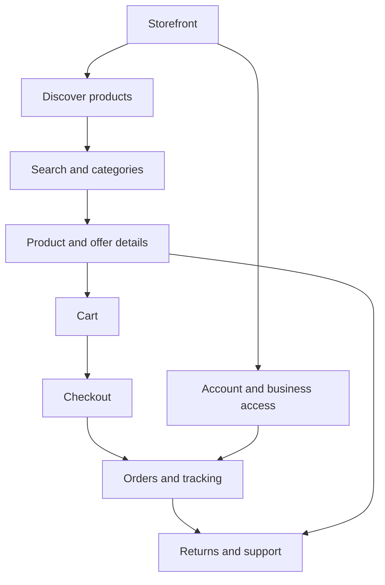
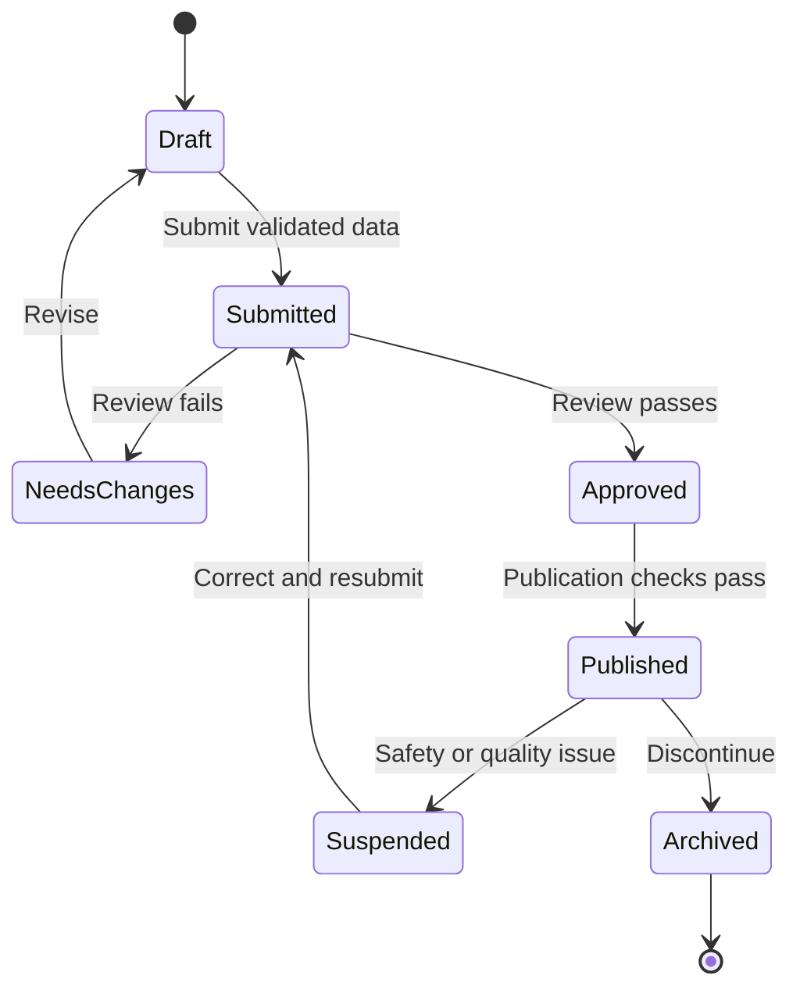
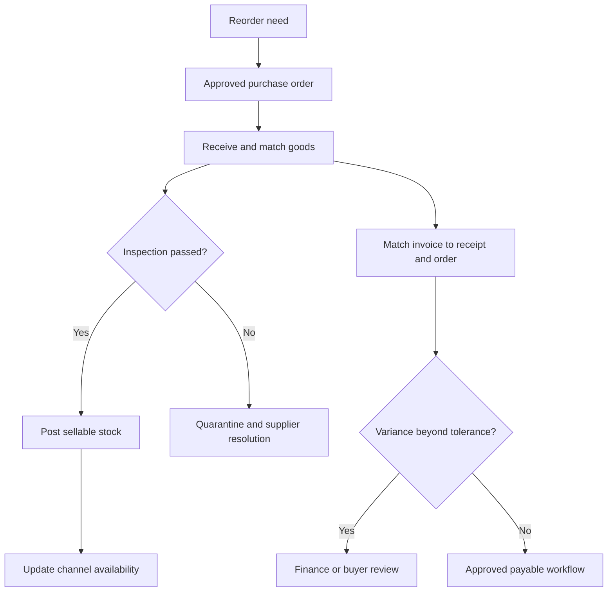
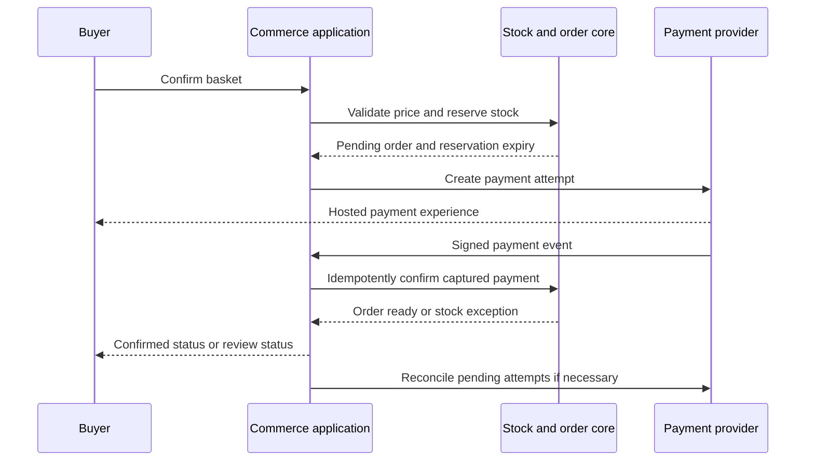
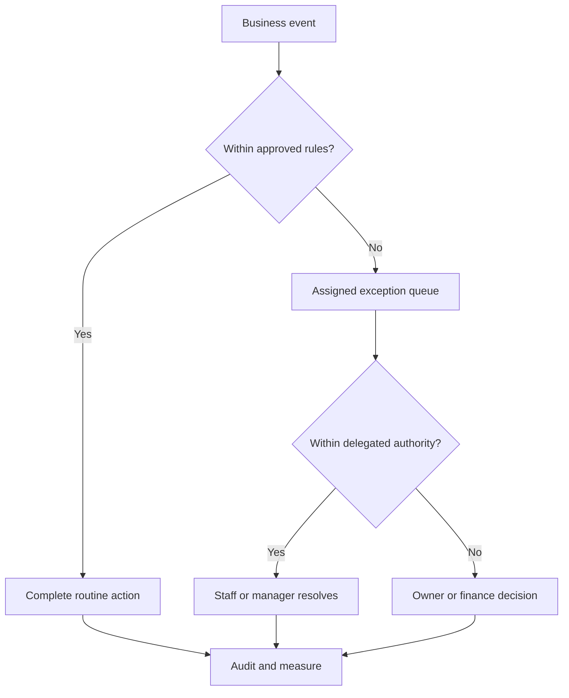
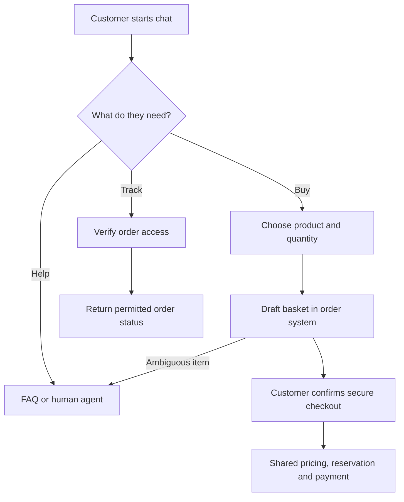
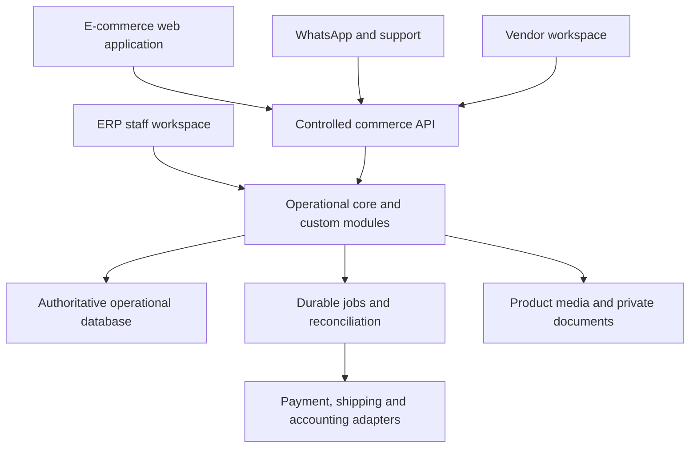
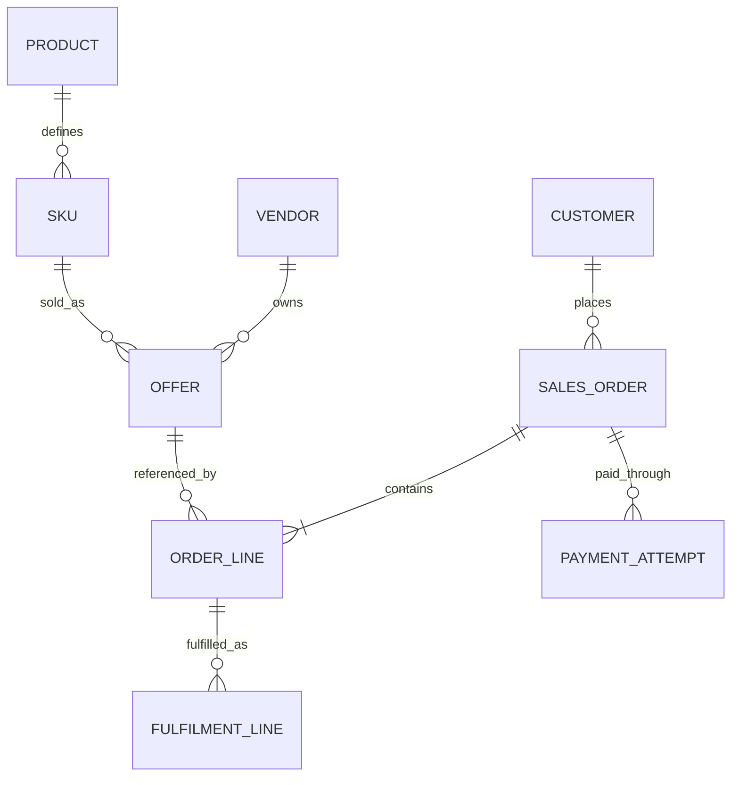
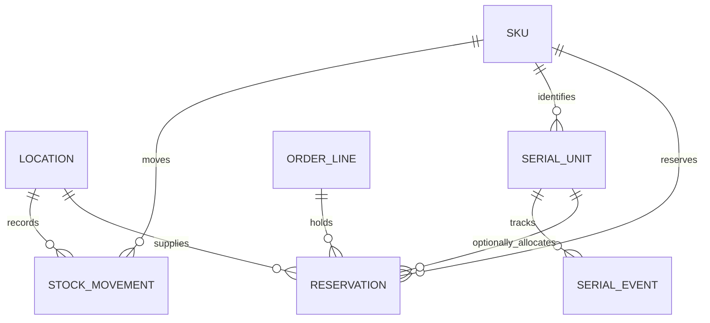
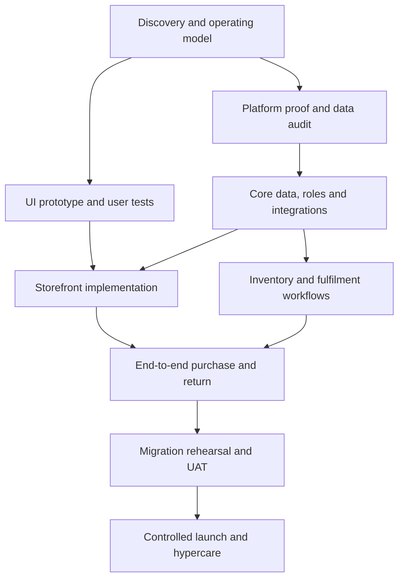

# Connected ERP and E-commerce Platform
## Requirements, solution design, automation, and implementation blueprint

**Version:** 1.1 — Web-first priority update  
**Prepared:** 26 September 2026  
**Business:** Computers, accessories, cameras, electronics, and refurbished equipment  
**Basis:** Client meeting summary and the development team's additional explanation supplied with this request  
**Status:** Proposed blueprint for review; not a signed scope, commercial quotation, or claim that discovery is complete

> **Recommended direction:** Prioritise the e-commerce web application and ERP web application in Phase 1, connected through one authoritative operational core. Move dedicated mobile-friendly e-commerce optimisation and the mobile app to Phase 2. Start with dependable inventory, pricing, orders, payments, fulfilment, and exception handling. Evaluate reuse of the existing backend and an established ERP before committing to a new ERP build. Keep Phase 2 mobile deliverables separately scoped and estimated; add marketplace complexity and AI through their own approved gates.


**Priority clarification — 26 September 2026:** Phase 1 covers the e-commerce web application and ERP web application. Phase 2 covers dedicated mobile-friendly e-commerce optimisation and the mobile app. This supersedes earlier mobile-first launch wording. Standard flexible web components may still be used in Phase 1; phone-specific polish and acceptance are deferred. The e-commerce mobile app does not automatically include an ERP staff mobile app.

## How to use this document

The owner should begin with Sections 1–5, 12, 18, and 25–28. The operations team should review Sections 6–14 and complete the discovery forms. Designers should use Sections 5–6 and 30. Developers should focus on Sections 7–17, 20–24, and 29. The proposal team should use the scope, dependencies, acceptance criteria, and estimation framework together.

**Evidence labels used throughout:**

- **Confirmed direction:** Explicitly requested in the supplied discussion; still requires detailed acceptance criteria.
- **Proposed:** A recommendation made in this blueprint, open to client review.
- **Decision required:** Information or business policy that is currently missing.
- **Later:** Part of the product vision but excluded from the recommended first release unless separately agreed.

Research references appear as `[S01]`, etc., with direct links in Section 32. Most detailed workflows, numeric examples, architecture choices, and acceptance criteria below are original proposals for this client, not claims about how Amazon or Flipkart internally implements them. Public engineering and product documentation provides selected patterns, not a complete or independently verified map of either company's current private systems.

## Contents

1. [Executive recommendation](#1-executive-recommendation)
2. [Meeting interpretation and boundaries](#2-meeting-interpretation-and-boundaries)
3. [Users and business models](#3-users-and-business-models)
4. [Success measures](#4-success-measures)
5. [Scope and release strategy](#5-scope-and-release-strategy)
6. [Storefront and user experience](#6-storefront-and-user-experience)
7. [Generic catalog and refurbished products](#7-generic-catalog-and-refurbished-products)
8. [Pricing and business customers](#8-pricing-and-business-customers)
9. [Inventory and purchasing](#9-inventory-and-purchasing)
10. [Orders payments and fulfilment](#10-orders-payments-and-fulfilment)
11. [Vendor portal and marketplace](#11-vendor-portal-and-marketplace)
12. [Automation and owner independence](#12-automation-and-owner-independence)
13. [WhatsApp and customer service](#13-whatsapp-and-customer-service)
14. [ERP module boundaries and reporting](#14-erp-module-boundaries-and-reporting)
15. [Platform selection and technology](#15-platform-selection-and-technology)
16. [System architecture and integration](#16-system-architecture-and-integration)
17. [Data model and API contracts](#17-data-model-and-api-contracts)
18. [Permissions approvals and controls](#18-permissions-approvals-and-controls)
19. [Security privacy and compliance](#19-security-privacy-and-compliance)
20. [Performance reliability and operations](#20-performance-reliability-and-operations)
21. [Migration and cutover](#21-migration-and-cutover)
22. [Implementation work packages](#22-implementation-work-packages)
23. [Testing and acceptance](#23-testing-and-acceptance)
24. [Support and handover](#24-support-and-handover)
25. [Estimation and commercial planning](#25-estimation-and-commercial-planning)
26. [Discovery questionnaire and worksheets](#26-discovery-questionnaire-and-worksheets)
27. [Risks dependencies and decisions](#27-risks-dependencies-and-decisions)
28. [Future AI mobile and growth](#28-future-ai-mobile-and-growth)
29. [Worked scenarios](#29-worked-scenarios)
30. [Screen and backlog inventory](#30-screen-and-backlog-inventory)
31. [Next meeting and sign-off](#31-next-meeting-and-sign-off)
32. [Research and source register](#32-research-and-source-register)
33. [Glossary](#33-glossary)

---

## 1. Executive recommendation

### 1.1 The actual business problem

The client needs more than an attractive shopping website. The business currently depends on staff entering and checking information and on the owner intervening in day-to-day decisions. A new storefront alone could increase orders while making those operational bottlenecks worse.

The solution should join four capabilities:

| Capability | Business result | First-release interpretation |
|---|---|---|
| Attractive commerce | Customers can find, understand, trust, and buy products | Desktop/laptop web catalog, search, product detail, clear pricing, checkout, order tracking |
| Reliable operations | Stock and orders remain accurate across channels and branches | One stock authority, purchasing, reservations, dispatch, returns, reconciliation |
| Controlled delegation | Staff complete ordinary work without the owner | Roles, authority limits, queues, deadlines, audit history |
| Measured automation | Repetitive work disappears without losing control | Rules, imports, notifications, integrations, scheduled checks, exception handling |

**The owner should manage policies and exceptions, not approve every ordinary action.** Automation will still require staff to inspect equipment, count stock, package shipments, resolve ambiguous customer requests, and handle unusual cases.

### 1.2 My provisional architecture decision

Run a short, evidence-based fit assessment in this order:

1. **Inspect the existing backend.** Retain it if it can reliably own stock, reservations, order transitions, permissions, and integrations at an acceptable maintenance cost.
2. **If it is unsuitable, prove an ERPNext/Frappe-based operational core with a custom Next.js storefront.** This is the preferred candidate to evaluate, not a final procurement decision. Reuse standard ERP workflows and keep custom code in a maintained extension application.
3. **Compare Odoo against the same scenarios** if its implementation expertise, licensing, and module fit are better for the delivery team.
4. **Build a custom modular backend only if those options fail critical requirements or produce worse total ownership cost.** A custom backend increases responsibility for stock correctness, accounting interfaces, upgrades, and operational support.

Choose one operational core. Do not implement ERPNext, Odoo, and a new custom inventory service simultaneously.

**Why this direction:** The customer's distinguishing needs are UI quality, pricing, electronics-specific trust information, and efficient processes. Rebuilding purchasing, warehouse movements, users, approvals, and basic reports may consume budget without improving that differentiation. Native capabilities must nevertheless be tested; a feature name in ERP documentation does not prove it fits this business.

### 1.3 What “Amazon/Flipkart-like” should mean

It should mean familiar navigation, useful search, informative product cards, fast interactions, confidence in product condition, transparent delivery, and easy purchase. It should not become an unbounded promise to reproduce every marketplace feature or either company's scale.

Use an original visual identity. Ask the client which reference screens they like and why. Record those preferences as design requirements. A generic statement such as “make it exactly like Amazon” cannot serve as an acceptance test.

### 1.4 Decisions needed before a fixed quotation

- Are “retail users” ordinary consumers or approved shops/dealers buying for resale?
- Does the company sell all goods in its own name, or do external sellers sell to customers?
- Who owns each stock unit, issues the customer invoice, handles warranty, and receives payment?
- Is existing software retained, integrated, partially replaced, or fully replaced?
- How many branches, warehouses, legal entities, users, products, serialised units, and daily orders exist?
- Which manual activities consume the most time and why?
- What must work at launch, and what can follow?
- Who can approve requirements, accounting treatment, UI, and UAT?

---

## 2. Meeting interpretation and boundaries

### 2.1 Requirements captured from the supplied conversation

| ID | Requirement or direction | Interpretation | Status |
|---|---|---|---|
| R01 | Strong UI resembling familiar large marketplaces | Original storefront with familiar shopping patterns | Confirmed direction |
| R02 | High-quality, responsive interactions | Phase 1 web usability and speed; dedicated mobile-friendly layouts/optimisation in Phase 2 | Updated client priority |
| R03 | Consumer and discounted buyer prices | B2C and approved B2B pricing contexts | Confirmed; buyer terminology unresolved |
| R04 | Additional quantity discounts | Explicit quantity tiers and stacking rules | Confirmed direction |
| R05 | Sellers/vendors log in and add stock/products | Restricted portal with validation and approvals | Confirmed direction |
| R06 | Owner/team retain control | Role-based authority and exception dashboard | Confirmed direction |
| R07 | Generic ERP accommodating new products | Configurable categories and attributes, stable core transactions | Confirmed direction |
| R08 | Inventory reflected on website | One authoritative stock source and checkout validation | Confirmed direction |
| R09 | Automate repetitive staff work | Observe current work before selecting automations | Confirmed direction |
| R10 | Reduce owner's intervention | Delegation rules, operational SLAs, escalation | Confirmed direction |
| R11 | Website chatbot and WhatsApp ordering | Guided help, handoff, shared order pipeline | Confirmed direction; launch depth unresolved |
| R12 | Mobile-friendly e-commerce and mobile application | Phase 2; reuse Phase 1 business APIs and workflows | Confirmed second-phase priority |
| R13 | Future AI/custom LLM | Isolated, measured experiments after core stabilises | Later |
| R14 | Multi-branch and warehouse reporting | Stock, sales, fulfilment, and exceptions by location | Confirmed direction |
| R15 | Separate domains/businesses possible later | Prepare business boundaries without building SaaS now | Later |
| R16 | Requirements before cost and timeline | Discovery and scope approval gate | Confirmed agreement |
| R17 | Support and maintenance included in planning | Explicit ownership, support terms, recurring costs | Confirmed direction |
| R18 | Existing website/backend on AWS | Verify access, architecture, dependencies, costs | Reported; not inspected |
| R19 | Warranty, RMA, authenticity, returns matter | Traceability and product condition controls | Confirmed discussion |
| R20 | Product details/images may transfer automatically | Validate supplier files/APIs and image rights | Investigation |

### 2.2 Things the discussion does not establish

No final budget, currency for the shorthand phase-one figures, delivery date, technology stack, hiring commitment, service-level agreement, or accepted module list was established. The figures “5–6” and “10” must not be converted into lakh-based commitments. The reported ₹5,000 calling cost, ₹12,000–₹20,000 “per card,” and ₹80,000 total have unclear scope and are excluded from estimates until written vendor details clarify them.

Speaker identities and task owners are not reliable enough to infer responsibility. The proposed next-day meeting was an intention, not a confirmed calendar appointment.

The supplied source is a meeting summary plus clarification, not a complete raw transcript. No current website, repository, database, customer analytics, or operating process was inspected. All fit and feasibility recommendations must be confirmed through discovery.

### 2.3 Product vision versus contractual scope

Maintain three separate lists:

- **Vision backlog:** Everything the business may eventually need.
- **Release scope:** A finite, approved set of workflows with acceptance criteria.
- **Change register:** New requests after approval, including effort and impact.

“Full ERP” and “all normal e-commerce features” describe a direction. They do not automatically include payroll, manufacturing, fleet management, every courier, every marketplace, or advanced accounting.

---

## 3. Users and business models

### 3.1 Resolve customer terminology

This document uses **consumer/B2C** for normal shoppers and **dealer/B2B** for approved retailers, resellers, or organisations receiving negotiated prices. This is an assumption based on the clarification. If the client means something different by “retail users,” rename the segments before implementation.

| Actor | Core needs | Restricted information |
|---|---|---|
| Guest | Browse, search, compare, see public price | No dealer prices or private order history |
| Consumer | Checkout, invoices, tracking, returns, support | Own records only |
| Approved dealer | Dealer prices, quantity tiers, repeat orders, business invoices | Own organisation's prices and records |
| Vendor applicant | Submit business details and track application | No live catalog or stock write access |
| Approved supplier | Submit product/availability data and view relevant purchase activity | Own records; no competitor costs or company margins |
| Marketplace seller, if enabled | Listings, fulfilment, returns, statements | Own offers and assigned customer data only |
| Catalog staff | Create structured catalog drafts and fix quality errors | Cost/margin access only if assigned |
| Warehouse staff | Receive, scan, move, pick, pack, count | Assigned locations and tasks |
| Sales/support staff | Assisted orders, customer questions, return requests | Limited discount/refund authority |
| Branch manager | Branch operations and exception resolution | Assigned branch and permitted cross-branch visibility |
| Finance | Payments, refunds, reconciliation, invoices, exports | Financial controls and separation of duties |
| Operations admin | Rules, approvals, staffing, operational reports | Sensitive finance changes still restricted |
| Owner/super admin | Policy, oversight, escalations, delegation | Strong authentication and logged privileged actions |
| Integration account | Narrow machine-to-machine operations | No interactive general administrator access |

### 3.2 Three distinct vendor models

| Model | Customer buys from | Inventory treatment | Additional capability |
|---|---|---|---|
| Supplier/reseller | The company | Supplier availability is external; received company stock is internal | Purchase orders, receipts, supplier bills, procurement terms |
| Company sale with supplier fulfilment | The company | Supplier confirms availability and ships for company | Confirmation deadline, shipment evidence, invoice and warranty responsibility |
| Marketplace | An external seller via platform | Seller inventory is separately owned and maintained | Seller agreements, commissions, settlements, disputes, split fulfilment and tax review |

**Proposed launch model:** Company-controlled sales with suppliers submitting information for review. Activate direct supplier fulfilment only for a small pilot after confirmation and refund rules are proven. Treat a full marketplace as a separately approved extension.

This recommendation deliberately narrows launch complexity; it does not remove the requested long-term seller capability. If direct marketplace selling is non-negotiable on day one, include the full marketplace work package and re-estimate.

### 3.3 Organisation boundaries

A warehouse is not a company. A branch may belong to a company and may have its own registrations or operational rules. A supplier is not a tenant. A second website does not automatically require a second database.

Start with the confirmed legal entities, branches, and warehouses. Store those relationships explicitly. Future independent businesses can use separate ERP sites/deployments if isolation is required, sharing maintained code rather than customer data. Do not construct a multi-tenant SaaS control plane for an unconfirmed future requirement.

---

## 4. Success measures

Collect a baseline during discovery. The numbers below are proposed measurement approaches, not promised gains.

| Outcome | Measure | Baseline method | Review |
|---|---|---|---|
| Less owner involvement | Routine cases requiring owner action / total routine cases | Record one representative operating week | Weekly |
| Less manual work | Staff touch time per accepted order | Observe order samples across channels | Fortnightly |
| Accurate stock | Correct counted units / counted units, with value variance separately | Physical cycle counts | Weekly |
| Fewer oversells | Accepted orders unfulfillable because stock was wrong | Exception reason codes | Daily |
| Better shopping | Product-to-cart and checkout completion rates | Funnel analytics segmented by device/customer type | Weekly |
| Better discovery | Zero-result searches and search-to-product clicks | Anonymous search metrics | Weekly |
| Faster dispatch | Paid/approved to dispatched time, median and p95 | Event timestamps | Daily |
| Better delegation | Exceptions resolved at staff/manager level | Approval history | Weekly |
| Trust in refurbished sales | Condition-related returns / delivered refurbished orders | Return reasons | Monthly |
| Payment accuracy | Unmatched captures, refunds, settlements and age | Gateway/accounting reconciliation | Daily |
| Reliable automation | Successful runs, retries, failures, hours saved | Job logs plus time study | Weekly |

Use consistent denominators. Exclude test traffic and duplicate events from conversion metrics. Segment consumer/dealer, new/refurbished, and branch/online activity. A higher conversion rate is not valuable if refund rates and margin deterioration outweigh it.

**Illustrative improvement target to negotiate:** Cut owner touches on routine orders by half after stabilisation. This is an example for discussion; baseline and operational changes determine feasibility.

---

## 5. Scope and release strategy

### 5.1 Recommended phases

| Phase | Goal | Included outcomes | Exit gate |
|---|---|---|---|
| 0: Discovery and proof | Remove uncertainty before commitment | Process maps, system audit, UI prototype, fit tests, data sample, backlog, estimate | Owner and operations approve business model and scope |
| 1A: Core web launch | Deliver the e-commerce and ERP web applications | Consumer/dealer web storefront and ERP staff web workspace, central stock, purchase receipt, payments, dispatch, basic returns, reports, access controls | Web end-to-end UAT and reconciled opening stock |
| 1B: Operational completion | Reduce repetitive work further | Controlled vendor portal, validated bulk import, guided WhatsApp ordering, approvals, selected integrations | Measured process improvement and manageable exceptions |
| 2: Mobile experience and separately approved growth | Deliver mobile-friendly e-commerce and the mobile app | Mobile layouts, touch interaction, device performance and mobile app using Phase 1 APIs; optional marketplace/growth work remains separately gated | Mobile web/app UAT; marketplace financial controls if that optional work is included |
| 3: AI and further expansion | Add justified intelligence and business expansion | Scoped AI assistance and possible multiple storefronts | Evidence of adoption, quality, and sustainable cost |

**Scope clarification:** Phase 1 means the e-commerce website and ERP web application. Phase 2 means dedicated mobile-friendly e-commerce optimisation and the mobile app. 1A and 1B are proposed web-delivery sub-releases within Phase 1; 1B is not the mobile phase. If the client requires vendor self-service and WhatsApp ordering at the first public launch, combine the gates and budget for them. A click-to-chat button alone is not complete WhatsApp ordering.

### 5.2 Capability matrix

Legend: **M** = recommended must-have; **C** = conditional on business dependency; **L** = later. All priorities require client confirmation.

| Capability | 1A | 1B | 2/3 | Notes |
|---|---|---|---|---|
| E-commerce and ERP web UI/design system | M | Improve | Reuse and extend | Desktop/laptop web prototype before full implementation |
| Dedicated mobile-friendly e-commerce optimisation | — | — | Phase 2 | Mobile layouts, touch flows and mobile performance acceptance |
| Categories, filters, search, product details | M | Improve | Advanced search | Start with useful relevance, not AI search |
| Consumer checkout and guest purchase | M | — | — | Guest purchase policy to confirm |
| Dealer approval, price list, quantity tiers | M | Improve | Credit terms | Default prepaid |
| Wishlist and basic product comparison | C | C | — | Useful for electronics; do not block reliable checkout |
| Reviews and ratings | C | C | Improve | Require moderation and verified-purchase handling |
| Central stock, warehouse and serial records | M | — | — | All selling channels use same authority |
| Purchase orders, receipts, basic supplier records | M | — | Improve | Reuse existing workflow if retained |
| Branch sale entry/integration | M | — | — | Full replacement POS is conditional |
| Basic returns, refund and warranty traceability | M | Improve | Advanced RMA | Essential for refurbished equipment |
| Vendor admin-created accounts and submissions | C | M | — | No direct unrestricted database writes |
| External seller settlements | — | — | M if marketplace | Not needed for ordinary suppliers |
| Simple website FAQ/chat handoff | M | Improve | AI option | Can use deterministic flows |
| WhatsApp click-to-chat and assisted checkout | M | — | — | Shared order references |
| Structured WhatsApp order workflow | C | M | Improve | Provider approval and scope dependent |
| Owner exception dashboard, audit, alerts | M | Improve | Improve | Avoid approval overload |
| Basic finance exports/reconciliation | M | Improve | — | Decide accounting authority |
| Full accounting replacement | C | C | C | Separate migration and finance sign-off |
| HR, payroll, attendance | — | — | C | Access management is not full HR |
| E-commerce mobile app | — | — | Phase 2 | Platforms and app features agreed in the Phase 2 scope |
| LLM, voice collection, local GPU | — | — | C | No launch dependency |
| Multi-business SaaS | — | — | C | Not assumed |

### 5.3 Explicit first-release exclusions

Unless deliberately added: general-purpose workflow builders, dynamic AI pricing, customer wallets, complex loyalty, cross-border checkout, automated lending/credit decisions, autonomous purchasing, full repair workshop ERP, marketplace payout automation, dedicated mobile-friendly optimisation, mobile applications, automated collection calls, Kubernetes, Kafka, a separate service for every module, and active-active multi-region deployment.

Existing processes may still need a manual interface for excluded functions. For example, a warranty ticket can be tracked without building a full repair workshop management system.

---

## 6. Storefront and user experience

Phase 1 prioritises web shopping and ERP operations on agreed desktop/laptop browsers. The mobile-specific elements described in this section belong to Phase 2. High responsiveness in Phase 1 means fast, clear web interactions; it does not add a mobile-first launch obligation.

### 6.1 Design principles

- **Search first:** Electronics buyers often arrive with a model, connector, capacity, or budget in mind.
- **Condition clarity:** New, open-box, refurbished, and used must be visibly distinct.
- **Transparent purchase:** Show payable price, stock status, shipping terms, warranty provider, and return conditions before payment.
- **Web-first practicality:** Prioritise desktop/laptop customer shopping and staff ERP workflows in Phase 1. Deliver mobile-specific navigation, touch controls, layouts and optimisation in Phase 2.
- **Consistency:** Dealer and consumer pages share a visual system while presenting appropriate prices and quantity controls.
- **Measured speed:** Optimise images, limit third-party scripts, and test real devices.
- **Honest merchandising:** No fabricated ratings, stock scarcity, fake discounts, or misleading condition labels.

### 6.2 Information architecture



### 6.3 Screen requirements

| Screen | Required content | Important states |
|---|---|---|
| Home | Search, category access, curated collections, trust information | Slow connection, no promotions, signed-in dealer |
| Category/search | Product cards, relevant filters, sort, result count | No results, unavailable filters, pagination, unavailable products |
| Product detail | Images, model, condition, specs, price, warranty, delivery, returns | Variant unavailable, price changed, supplier confirmation needed |
| Comparison | Side-by-side relevant specifications | Different categories, missing specification; mobile scrolling in Phase 2 |
| Cart | Items, condition, quantity, prices, discount explanation, delivery estimate | Changed price, stock shortage, minimum quantity failure |
| Checkout | Address, business billing, serviceability, payment, final total | Failed payment, expired reservation, duplicate submission |
| Confirmation | Order reference and next action | Payment verification pending; avoid false success |
| Orders | Current status, shipment breakdown, invoice access | Partial shipment, cancellation requested, refund pending |
| Returns | Eligible items, reason, photos if needed, pickup/return instructions | Outside policy, serial mismatch, warranty route |
| Dealer account | Application status, business details, approved pricing | Pending, rejected, suspended, approval expired |
| Help | FAQ, chat, WhatsApp, support hours | Outside hours, bot failure, human handoff |

### 6.4 Product listing requirements

Product cards should show model/title, meaningful image, key specifications, condition, price with tax display convention, warranty summary, stock/delivery message, and rating only when real data exists. Dealer cards can show quantity tier hints without exposing private pricing to guests.

Filters depend on category. Examples: CPU family, RAM, storage type/capacity, screen size, condition, brand, warranty, camera mount, resolution, interface, connector, and compatible model. Do not show irrelevant laptop filters on camera products.

Search should support exact model/SKU matches, common spelling variants, abbreviations such as SSD/HDD, and useful synonyms. Start with curated synonyms and structured fields. Investigate a dedicated search engine only if native/database search fails measured relevance or latency requirements.

### 6.5 Checkout experience

Prefer a short checkout with address, delivery, and payment steps. Validate PIN-code serviceability before collecting payment. Make shipping charges and tax totals clear before final confirmation. Persist the cart safely across refreshes and allow recovery after payment interruption.

Do not force account creation purely for browsing. For guest checkout, provide a secure order-access link or verification flow. For dealer pricing, require verified membership in the approved business account. If a customer changes to a non-eligible business/location, reprice with explicit notice.

### 6.6 Refurbished product trust

Define a client-approved grade rubric. “Grade A” is not meaningful unless cosmetic condition, functional checks, battery expectations, included accessories, and warranty are described. For unique units, link actual photographs and inspection results to the serialised unit. Do not imply a manufacturer warranty when the seller provides it.

Display known defects, replaced components where relevant, keyboard/layout differences, OS licensing status where applicable, and what is included in the box. Avoid promises such as “like new” unless the inspection standard supports them.

### 6.7 UI design process and approval

1. Collect client reference screens and brand assets.
2. Identify target customer tasks and common support questions.
3. Build low-fidelity layouts for home, listing, product detail, dealer pricing, checkout, and order tracking.
4. Produce one coherent visual direction for the e-commerce and ERP web applications in Phase 1. Create dedicated mobile screens in Phase 2.
5. Test with actual users from consumer, dealer, and staff groups; a small initial set such as five participants per materially different group is a discovery starting point, not statistical proof.
6. Record task completion, confusion, wrong clicks, and time; revise.
7. Approve design tokens, reusable components, content rules, and key states.
8. Validate Phase 1 on agreed desktop/laptop browsers and with keyboard/screen-reader navigation. Add real-phone/mobile-device validation for Phase 2.

Target WCAG 2.2 AA in the implementation specification, with an agreed accessibility test scope. Test contrast, labels, focus visibility, keyboard order, error summaries, image descriptions, and non-colour status indicators. Reference the W3C standard [S20].

### 6.8 SEO and discoverability

Use crawlable product/category pages, meaningful titles, canonical URLs, XML sitemap, appropriate structured product data, redirect mapping, and controlled treatment of filter URLs. Preserve valuable existing URLs where possible. Prevent duplicate indexing of private dealer versions. Mark unavailable products accurately rather than showing stale purchase offers in structured data.

Track search-engine indexing and conversion after migration. No implementation can guarantee organic rankings.

---

## 7. Generic catalog and refurbished products

### 7.1 Stable core, configurable detail

Use a stable product model plus category-specific attributes. Adding an ordinary category should require configuration and content, not a new product table or rewritten checkout. New business behaviour—subscriptions, rentals, installation appointments, regulated goods—may legitimately require development.

| Entity | Meaning | Example |
|---|---|---|
| Product | Shared commercial identity | Laptop model family |
| Variant/SKU | Purchasable specification combination | 16 GB RAM, 512 GB SSD, refurbished grade B |
| Offer/listing | Seller and commercial terms for a SKU | Company offer with a six-month seller warranty |
| Serialised unit | One physical item | Specific laptop with serial and inspection record |
| Stock position | Quantity by location, owner, and disposition | Five sellable units in warehouse A |
| Category schema | Required and optional typed attributes | Storage capacity numeric; interface enum |

A SKU is not an individual unit. A supplier code is not necessarily the internal SKU. A listing approval is not evidence that physical stock exists.

### 7.2 Catalog fields

Core fields: immutable internal identifier, display SKU, title, brand, model, category, description, variant relationships, tax classification reference, unit of measure, dimensions, weight, barcode identifiers, image references, status, publication channels, and version.

Typed configurable attributes: label, data type, allowed values, unit, required flag, filterable/searchable flag, display order, and category applicability. Validate data types and units during import. Avoid unstructured free text for fields needed in filters.

Refurbished/serial fields: serial identifier, manufacturer serial where available, purchase source, condition grade, inspection checklist and date, inspector, actual photos, warranty policy version, data-erasure evidence where relevant, included accessories, defects, and lifecycle status.

### 7.3 Product lifecycle



Draft and approval records can exist in the database before approval. The requirement should be **“unapproved data must not enter the live purchasable catalog or alter authoritative stock”**, not literally “no database entry before approval.” Store submissions separately or version them until approved.

### 7.4 Catalog import and quality pipeline

Accept a versioned CSV/XLSX template or a documented supplier API. Upload to staging, validate, map supplier codes, detect duplicates, preview differences, and publish only valid approved changes. Produce row-level errors that staff can correct and retry without duplicating successful rows.

Check required attributes, contradictory condition labels, image availability, duplicate barcodes, impossible dimensions, missing tax classification, and unapproved brands/categories. For image downloads, restrict sources, size, file type, and network destinations; imported URLs must not access internal infrastructure. Confirm permission to use product images and content.

Do not scrape Amazon/Flipkart listings to populate the catalog without rights and a permitted access method. Prefer authorised manufacturer or supplier feeds and client-owned content.

### 7.5 Electronics-specific extensions

- A compatibility table for accessories and supported models can reduce returns; begin with curated data.
- Bundles need explicit component stock consumption. A laptop-plus-mouse bundle cannot have unrelated, freely editable stock.
- Serial replacement during repair must preserve both original and replacement histories.
- A returned storage device must enter quarantine; inspection and appropriate data-erasure workflow precede resale.
- Customer-uploaded device serials require validation against the original sale before warranty decisions.
- Recall handling should identify affected serial/batch units and related orders.
- Warranty durations and return windows are separate policy fields.

---

## 8. Pricing and business customers

### 8.1 Pricing rules

Use one server-side price calculation for website, staff orders, WhatsApp, and future app. Store money using fixed decimal or integer minor units, not floating point. Preserve the final price and rule version on each order line.

Proposed calculation sequence:

1. Identify selling company, currency, channel, offer, and customer context.
2. Resolve approved customer-specific contract price, else dealer price list, else public price list.
3. Apply the applicable quantity tier for that SKU/offer and unit of measure.
4. Apply only eligible promotions according to explicit stacking policy.
5. Apply shipping and relevant tax treatment using the approved finance rules.
6. Validate margin/discount authority and serviceability.
7. Show the final amount and lock a time-limited quote version where supported.
8. Revalidate when creating/reserving the order; notify the buyer of material changes.

This precedence is proposed, not a settled client policy. Do not silently select whichever rule gives the largest discount unless that is the approved rule.

### 8.2 Illustrative quantity example

| Buyer | Quantity | Illustrative unit price | Line subtotal before tax/shipping |
|---|---:|---:|---:|
| Consumer | 1 | ₹2,500 | ₹2,500 |
| Approved dealer | 1 | ₹2,300 | ₹2,300 |
| Approved dealer | 5 | ₹2,200 | ₹11,000 |
| Approved dealer | 10 | ₹2,100 | ₹21,000 |

Example assumes an all-units tier, not graduated tier pricing. Returns or partial cancellations may alter discount entitlement; define whether the original price remains or an adjustment is required. Do not implement retroactive repricing without an agreed policy and customer disclosure.

### 8.3 Dealer approval

Application → business information review → approval/rejection → authorised account access. Verify required registration details according to policy; a typed identifier alone is not verification. Define who may invite additional employees into a business account and who can see its invoices.

Default dealer orders to prepaid. Credit limits, ageing, overdue blocking, partial payments, and collections add finance scope and should be explicitly enabled only if needed.

### 8.4 Pricing controls and edge cases

| Case | Proposed behaviour |
|---|---|
| Dealer signs out | Private price and cached responses no longer accessible |
| Guest modifies customer type in request | Server ignores untrusted classification and derives authorised context |
| Promotion plus dealer discount | Apply agreed stacking rule; show explanation |
| Expired price list | Fail to a defined valid price or prevent checkout; never use arbitrary zero |
| Product below minimum margin | Route to authorised override with reason |
| Quantity changes after quote | Recalculate tier and require confirmation |
| Location changes | Re-evaluate serviceability, tax and any approved location price |
| Refund on discounted order | Use original allocated line discount and tax records |
| Supplier changes cost | Do not automatically change live retail prices unless approved rule permits it |
| Shared page cache | Public content may cache; private price response must be isolated |

Shopify's own B2B headless documentation supports contextual business pricing and warns about caching customer-specific data [S04]. That is evidence that headless/B2B capability exists, not proof that Shopify is the best ERP fit here.

---

## 9. Inventory and purchasing

### 9.1 One inventory authority

Every online sale, branch sale, WhatsApp order, warehouse movement, return, and stock adjustment must reach the same authoritative stock process. Website/search copies may be eventually consistent; checkout must validate and reserve with the authority.

If the legacy system remains the stock authority, the new application must not independently maintain a competing “correct” quantity. If reliable reservation is unavailable, use a controlled online allocation that offline channels cannot consume, or delay automatic checkout. A periodically copied quantity alone cannot guarantee prevention of overselling.

### 9.2 Stock definitions

For each SKU, location, stock owner, and applicable unit/lot:

`available_to_promise = max(0, sellable_on_hand - active_reserved - safety_buffer)`

Here, **sellable_on_hand already excludes quarantine, damaged, repair, and in-transit units**. Do not subtract those quantities a second time. Purchase orders and unconfirmed supplier stock are not sellable on-hand. Backorders must be an explicit product policy with disclosed lead times.

| Stock event | Quantity effect | Evidence |
|---|---|---|
| Purchase order issued | None on physical on-hand | Approved purchase order |
| Goods received into inspection | Increase received/quarantine stock | Receipt and supplier reference |
| Inspection accepted | Move to sellable disposition | QC result and serials |
| Reservation created | Reduce available-to-promise only | Order/reservation reference |
| Shipment dispatched | Reduce physical on-hand and consume reservation atomically | Scan/dispatch confirmation |
| Reservation expires/cancels | Release reserved quantity | Expiry/cancellation reason |
| Customer return received | Increase quarantine stock | RMA and receipt |
| Return approved for resale | Move quarantine to sellable | Inspection approval |
| Adjustment | Approved correction with reason | Count, discrepancy, approver |
| Transfer shipped/received | Source to transit, then destination | Transfer documents and receiving scan |

### 9.3 Procurement and receipt



Support partial receipts and backorders, supplier substitutions requiring approval, duplicate supplier invoice detection, landed-cost allocation if imported goods require it, and attachments. Automatic reorder should first create a suggestion or draft purchase order. Autonomous supplier purchase commitments are later scope.

### 9.4 Serialised inventory

ERPNext documents serial and batch traceability across an item's lifecycle [S05]. The implementation still needs business-specific checks for duplicate serials, refurbished grading, replacement history, and warranty policy.

Assign/scan serials at receipt or according to the approved process. Reserve a specific serial when unique condition/photos are advertised; otherwise reserve quantity and allocate a valid serial at picking. Ensure no serial is simultaneously assigned to two active fulfilments. Store a manufacturer identifier separately from the internal tracking identifier where necessary.

### 9.5 Branch operations

Support stock by warehouse and disposition, transfer requests, approved transfers, dispatch/receipt mismatch, and branch sales. Internal transfers must not create or destroy enterprise-wide stock. In-transit stock is not available at the destination until received.

Decide whether each branch may see other branches' stock, request it, or promise it to customers. Default to simple fulfilment rules: use a single eligible location that can fulfil the order; if none can, request a transfer or explicit split decision. Introduce sophisticated optimisation only if needed.

For branch internet outages, document a controlled manual process or dedicated stock allocation. Offline selling against shared online stock cannot guarantee no oversell without additional reservation/allocation design.

### 9.6 Counts and adjustment controls

Use cycle counts by value/risk and periodic full counts. Record count time, operator, expected quantity, observed quantity, reason, approval, and valuation impact. Freeze affected bins or reconcile intervening movements. Never fix a discrepancy by silently overwriting a quantity field.

Threshold-based approval should consider quantity and value. Staff may submit an adjustment; authorised managers approve it. Large unexplained losses go to the owner/finance queue.

### 9.7 Supplier inventory freshness

Supplier availability has its own timestamp, source, confirmation policy, lead time, and safety buffer. Define a freshness deadline per supplier. Once stale, hide immediate-delivery promises, require confirmation, or suspend the offer. Never present unverified supplier quantity as company-owned stock.

---

## 10. Orders payments and fulfilment

### 10.1 Separate state machines

An order, payment, fulfilment, and return are related but different records. A payment can be captured while an order needs stock review. An order may be partially dispatched while another line is cancelled.

| Domain | Example states |
|---|---|
| Order | Draft, awaiting payment, confirmed, on hold, partially fulfilled, fulfilled, cancelled, closed |
| Payment attempt | Created, pending, authorised, captured, failed, expired |
| Refund | Requested, approved, submitted, pending, completed, failed |
| Fulfilment | Unallocated, allocated, picking, packed, dispatched, delivered, delivery failed, returned to origin |
| Return/RMA | Requested, reviewed, authorised, in transit, received, inspected, resolved, rejected |

Transitions require explicit guards. Do not implement a single status field that tries to represent all five processes.

### 10.2 Reliable checkout



Steps are a proposed design. Do not keep a database transaction open while waiting for the customer or a payment network.

1. Server recalculates totals and validates stock, customer eligibility, address, and policy.
2. Create a pending order and reservation in an atomic operation within the stock authority.
3. Create or reuse a payment attempt associated with that order.
4. Verify the provider's server-side status and signed callbacks; do not rely on a browser success message alone.
5. Record the event once and apply legal state transitions.
6. Commit the confirmed order and durable follow-up work.
7. Notify and release fulfilment tasks asynchronously.
8. Reconcile missing/delayed callbacks against provider records.

Razorpay documents signed webhook validation, duplicate events, and non-guaranteed event order [S09]. Amazon's Builders' Library explains idempotent operations as a way to make retries safe [S01]. The application must implement equivalent protections even if another gateway is selected.

### 10.3 Concurrency and failure handling

| Failure | Required response |
|---|---|
| Two buyers compete for last unit | Only one reservation succeeds; the other receives an accurate message |
| Buyer double-clicks pay/order | Idempotency key returns the existing operation result |
| Same key with different basket | Reject conflicting reuse; do not alter the earlier order |
| Payment succeeds after reservation expiry | Attempt controlled re-reservation; otherwise hold and resolve/refund under policy |
| Callback delivered twice | One transition, one fulfilment task, no duplicate invoice |
| Failed event arrives after captured | Do not downgrade a proven captured payment |
| Worker crashes after sending request | Reconcile using provider reference before retrying an irreversible action |
| Payment captured but application unavailable | Durable provider events/reconciliation recover the order state |
| Stock system unavailable | Stop confirmation or use an explicitly segregated allocation; do not guess |
| Notification fails | Keep valid order; retry notification and expose delivery failure |
| Refund request times out | Query existing refund status before issuing another |
| Partial cancellation | Release only affected reservation and refund allocated amount once |

### 10.4 Pick, pack, dispatch

Release eligible orders to a staff queue. Staff scan location/SKU/serial, verify the condition and included accessories, print the appropriate invoice/packing label, and mark shipment handover with evidence. Courier booking and label generation may be automated through one selected integration.

For refurbished goods, attach the dispatched serial and inspection record to the sale. Flag substitution rather than silently sending a different configuration or condition. Support partial dispatch only if the client approves its customer experience and reconciliation rules.

### 10.5 Delivery and returns

Courier status is external evidence, not a reason to overwrite unrelated internal states. Map carrier statuses to canonical states and preserve the raw event. Handle non-delivery, address issues, returned-to-origin shipments, lost/damaged consignments, and customer pickup if supported.

Returns must check the original order, item, serial, policy version, condition, and refund eligibility. Route received products to quarantine. Refund authorisation and resale authorisation are separate decisions. Retain evidence for disputes without collecting unnecessary personal data.

### 10.6 Payment and finance boundary

At launch, integrate one payment provider and one primary shipping provider unless operational coverage requires more. Confirm merchant onboarding, supported payment modes, settlement reports, refunds, disputes, and sandbox access before committing.

Do not store card details. Use the provider's hosted/approved payment collection method. COD is conditional: it needs eligibility rules, delivery collection reconciliation, returned-to-origin handling, and fraud/abuse controls.

An illustrative gross-margin report is not a statutory profit-and-loss statement. Finance must define cost valuation, tax treatment, fees, discounts, shipping recovery, and refund accounting.

---

## 11. Vendor portal and marketplace

### 11.1 Controlled onboarding

Allow either an admin invitation or a public application, according to policy. Public registration creates an applicant, not an activated seller. Collect only the business, contact, fulfilment, commercial, and verification information needed for the approved model.

Approval records should identify reviewer, decision, reasons, permitted categories, permitted locations, terms version, and review date. Suspended vendors cannot submit live changes, but historical orders and financial records must remain accessible to authorised staff.

### 11.2 Vendor workspace

| Area | Supplier launch version | Marketplace extension |
|---|---|---|
| Profile | Business details and approved contacts | Seller agreement, fulfilment settings, verified payout details |
| Products | Submit drafts, upload files, respond to errors | Manage own offers against approved products |
| Availability | Declare supplier-held stock and lead time | Update seller stock subject to freshness/control rules |
| Transactions | View purchase orders or assigned supply tasks | View assigned customer order lines |
| Returns | Supplier RMA requests and evidence | Customer return allocation and disputes |
| Finance | Relevant supplier statements if integrated | Commission breakdown, deductions, settlement statements |
| Performance | Data quality and response time | Cancellation, dispatch, return, and dispute metrics |

A supplier must not receive an entire customer's order or personal details when only a product availability response is required. Share only the data needed for its fulfilment role.

### 11.3 Approval policy without bottlenecks

- New vendors and new products require explicit review.
- Sensitive edits such as brand, condition, warranty, tax classification, payout account, or extraordinary price changes require review.
- Routine stock refreshes from a trusted vendor can be automatically accepted within validated boundaries once the workflow is stable.
- A stock update never creates company-owned inventory unless an authorised receipt/ownership transaction establishes it.
- Changes to an approved listing can remain as a pending version while the last approved version remains live, unless safety or stock concerns require immediate suspension.

Use deterministic rules and a small approval matrix. Avoid requiring the owner to personally approve every stock refresh.

### 11.4 Marketplace extension prerequisites

Before activating third-party customer sales, decide:

1. Seller of record and customer invoice issuer.
2. Collection and settlement arrangement with the payment provider.
3. Commission and fee calculation basis, taxes, and effective dates.
4. Shipping responsibility and serviceability promises.
5. Refund funding, return windows, warranty accountability, and disputes.
6. Settlement holds, return reserves, chargebacks, negative balances, and reconciliation.
7. Seller suspension effects on existing orders and money owed.
8. Customer-facing seller identity and offer selection policy.
9. Applicable marketplace tax and consumer requirements, reviewed by finance/legal.

Do not label an ordinary bank transfer process as automated marketplace settlement. Provider support, seller onboarding, and auditable settlement accounting are separate capabilities.

### 11.5 Settlement record design

For a marketplace, calculate seller payable using explicit components: eligible delivered sales, refunds, commission, service charges, applicable tax/withholding entries, logistics deductions, prior adjustments, and retained reserves. Record the basis and version for every component.

An order may be eligible for settlement only after the approved delivery/return holding rule. A payout is not complete merely because it was requested. Reconcile the provider result and bank/settlement statement. Require maker-checker control for payout-account changes and high-value manual adjustments.

---

## 12. Automation and owner independence

### 12.1 Start with observation

For each manual process, ask a staff member to perform a real example while explaining their decisions. Capture the input, system, time, exceptions, rework, and owner involvement. “Adding stock takes time” could mean missing supplier files, inconsistent SKUs, inspection delays, or duplicate entry. These require different solutions.

Classify each step as:

- **Eliminate:** Stop collecting or re-entering data that is unnecessary.
- **Simplify:** Standardise forms, rules, SKUs, and handoffs.
- **Integrate:** Transfer authoritative data between systems.
- **Automate:** Run predictable rules, reminders, matching, and assignments.
- **Assist:** Suggest actions where judgement remains necessary.

Avoid placing an LLM in a process that a validated import, barcode scan, or deterministic rule solves more reliably.

### 12.2 Automation catalogue

Priorities are proposed. **P1** denotes phase-one candidates; **P2** denotes later candidates. Benefits must be measured, not assumed.

| ID | Manual activity | Trigger and automated action | Control / exception | Priority |
|---|---|---|---|---|
| A01 | Re-enter supplier product details | File/API import maps and validates fields | Staging preview, duplicate detection, rejected rows | P1 |
| A02 | Upload images individually | Import authorised media by product mapping | Rights, type/size checks, invalid image queue | P1 |
| A03 | Add received stock manually | Scan receipt and serials against purchase order | QC required; over/short receipt review | P1 |
| A04 | Update website quantity | Committed stock event refreshes availability | Retry and reconciliation; checkout authority remains core | P1 |
| A05 | Check stock for every order | Transactional reservation at confirmation | Shortage queue; no unchecked oversell | P1 |
| A06 | Release abandoned stock holds | Scheduled reservation expiry | Payment-race safeguards and late-capture policy | P1 |
| A07 | Calculate dealer discount | Central pricing engine evaluates approved tiers | Margin floor and stacking controls | P1 |
| A08 | Re-type WhatsApp orders | Guided item/quantity selection creates draft order | Customer confirms price/address; ambiguity goes to agent | P1B |
| A09 | Check online payment manually | Signed webhook updates payment state | Provider reconciliation, duplicate protection | P1 |
| A10 | Match settlement deposits | Import provider settlement records and match fees/net | Unmatched or partial entries to finance | P1/C |
| A11 | Assign fulfilment work | Eligible order enters warehouse queue by rule | Staff capacity/stock exception | P1 |
| A12 | Create packing documents | Generate approved invoice/packing templates | Correct tax/invoice source and serial verification | P1 |
| A13 | Book shipment and labels | Packed order requests provider booking | Serviceability, booking deduplication, timeout check | P1/C |
| A14 | Send order status updates | Approved state transitions send message/email | Consent, template, delivery failure, frequency limits | P1 |
| A15 | Answer “where is my order?” | Verified order lookup returns permitted status | Secure identity check and human handoff | P1B |
| A16 | Chase pending fulfilment | Deadline rule reminds assigned staff | Escalate to manager once; avoid alert storms | P1 |
| A17 | Identify low stock | Threshold/lead-time rule creates replenishment suggestion | Buyer approves order; exclude discontinued items | P1 |
| A18 | Ask branches about availability | Shared authorised stock view | Distinguish reserved and in-transit quantities | P1 |
| A19 | Prepare owner daily report | Scheduled exception and KPI digest | Freshness labels and drill-down evidence | P1 |
| A20 | Check vendor listing quality | Validate required fields and risky changes | Reviewer approves material content | P1B |
| A21 | Chase stale supplier stock | Freshness expiry requests update or suspends promise | Supplier SLA and company fallback | P1B |
| A22 | Route return requests | Rule checks policy and assigns review queue | Condition, serial and fraud exceptions | P1 |
| A23 | Identify warranty eligibility | Match invoice, serial and policy version | Do not promise claim acceptance automatically | P1 |
| A24 | Track stock discrepancies | Counts generate variance review | Approval thresholds and audit history | P1 |
| A25 | Detect duplicate entries | Match supplier invoice/document keys | Staff reviews near matches | P1 |
| A26 | Re-enter accounting records | Approved export/API pushes invoices and credits | Idempotency and control-total reconciliation | P1/C |
| A27 | Maintain dealer applications | Validate completeness and route review | No automatic business approval on unchecked documents | P1 |
| A28 | Remind unpaid buyers | Approved reminder schedule for eligible orders | Opt-in, stop after payment/dispute/opt-out | P1/C |
| A29 | Follow up abandoned carts | Consented, capped reminder flow | Exclude paid orders; measure incremental value | P2 |
| A30 | Forecast replenishment | Demand/lead-time model proposes quantities | Backtest, buyer approval, stockout bias | P2 |
| A31 | Extract purchase invoices | OCR produces a draft matched to supplier/PO | Human review for tax, totals and ambiguous lines | P2 |
| A32 | Recommend compatible accessories | Curated compatibility rules return eligible items | Compatibility evidence, stock, truthful recommendations | P1/C |
| A33 | Produce seller payouts | Settlement engine generates approved payout batch | Holds, deductions, approval and reconciliation | P2 |
| A34 | Answer complex product questions | Later grounded assistant uses approved catalog | Abstention, no invented compatibility/warranty | P3 |
| A35 | Automate collection calls | Separate telephony/consent/provider study | No launch commitment; sensitive/policy review | P3/C |
| A36 | Identify margin leakage | Scheduled rule flags discounts/fees below policy | Finance validates cost and allocation | P1B |
| A37 | Flag suspicious returns | Rule highlights serial mismatch or repeated anomalies | Human decision; do not automatically accuse/reject | P2 |
| A38 | Track import/sync failure | Job monitor creates one actionable incident | Retry cap, owner, evidence, resolution status | P1 |

### 12.3 Automation implementation template

Complete this for every selected automation:

| Field | Required entry |
|---|---|
| Business problem | Observable manual step and its cost |
| Owner | Operational role responsible for the outcome |
| Trigger | Event, schedule, threshold, or explicit user action |
| Inputs | Authoritative records, required fields, freshness |
| Preconditions | Permissions, approved status, payment/stock rules |
| Action | Exact changes and external requests |
| Idempotency | How repeated execution avoids duplicated effects |
| Failure behaviour | Retry, pause, compensating action, manual recovery |
| Human boundary | What the automation cannot approve |
| Audit | Actor, time, input version, decision reason, outcome |
| Notification | Recipient, urgency, deduplication, frequency cap |
| KPI | Touch time, accuracy, success rate, exception rate |
| Disable/rollback | How to stop safely and recover pending work |

### 12.4 Priority and value assessment

Estimate monthly benefit as:

`hours_saved = monthly_cases × minutes_saved_per_case ÷ 60 − monthly_exception_handling_hours`

`net_monthly_value = hours_saved × agreed_loaded_hourly_cost + measured_error_reduction_value − added_running_cost`

Avoid counting the same time saving twice across overlapping automations. Revenue uplift must be measured separately from labour savings.

**Illustrative arithmetic only:** 600 orders/month × 4 minutes saved = 40 hours; subtract 8 hours of exception work = 32 net hours. At an assumed ₹300/hour, labour capacity value is ₹9,600/month before operating cost. This is not a statement about the client's volume, payroll, or likely return.

Rank candidates by frequency, time saved, failure cost, data readiness, implementation complexity, and reversibility. Start with high-volume, predictable, reversible tasks. An impressive demo with frequent manual corrections may create negative value.

### 12.5 Owner exception dashboard

The dashboard should answer: **What needs attention, why, who owns it, and by when?**

Cards: overdue dispatch, stock mismatch, payment captured without confirmation, refund failure, purchase variance, low-margin override, stale vendor data, unresolved return, failed integration, and expired approval.

Each exception must include entity reference, severity, age, assigned role/person, due time, evidence, recommended allowed actions, escalation path, and resolution reason. Keep routine notifications in staff queues; send the owner a digest and urgent material exceptions only.



### 12.6 Delegation examples

- A warehouse operator may receive matching goods, but cannot approve a large unexplained stock write-off.
- A branch manager may approve a small commercial discount within policy, but cannot change all dealer price lists.
- Customer support may initiate an eligible return, but finance/authorised rules control refunds.
- Routine correct listings can be processed by catalog reviewers; strategic supplier terms remain with management.
- If the owner is unavailable, a named alternate has explicit authority. Do not silently convert owner-only rules into unrestricted access.

Record recurring exceptions. If a safe exception occurs frequently, improve the process or policy rather than ask the owner indefinitely.

---

## 13. WhatsApp and customer service

### 13.1 Three levels of integration

| Level | Customer experience | Operational reality |
|---|---|---|
| 1: Click-to-chat | Product page opens WhatsApp with product reference | Conversation starts; it does not create a reliable order by itself |
| 2: Guided connected ordering | Buttons/forms or agent selects item, quantity and address; customer confirms checkout link | Creates a draft in the same order system; uses live pricing and stock |
| 3: Conversational AI | Free-form product help and assisted transaction preparation | Later; constrained tools, evaluation, privacy and cost controls |

**Recommended:** Level 1 plus secure assisted orders at initial launch, then Level 2 within phase 1B if provider setup is ready. Website chatbot can be a guided FAQ and order-status flow without an LLM.

### 13.2 WhatsApp order flow



A product reference from chat is not a trusted price. Recalculate on the server. Messages such as “two of the same laptop” need disambiguation when several configurations or conditions exist. Do not infer an order from unconfirmed text.

### 13.3 Business Platform requirements

Official WhatsApp policy requires appropriate recipient permission for subsequent contact, approved templates for business-initiated communication, and approved templates outside the customer service window. The policy also requires a clear escalation path when automation is used [S10]. Current official documentation describes the customer service window as 24 hours, refreshed by a user message [S10, S11].

Implementation work includes business/number setup, provider or Cloud API selection, template approval, opt-in/opt-out records, inbound webhooks, delivery status handling, shared inbox ownership, and secure account linking. Confirm existing number eligibility, migration/coexistence options, and provider capabilities before promising reuse.

**Saving the phone number is optional for the user experience:** a click-to-chat link can initiate contact. Saving the number does not grant marketing permission or connect the chat to an authenticated dealer account.

### 13.4 Support controls

Maintain ticket/conversation owner, priority, order reference, service hours, and handoff status. Verify order access before revealing addresses, invoices, serials, or payment information. Linking a WhatsApp identity to an account should require a secure verification process; do not automatically merge records merely because names match.

FAQ answers use versioned approved content. Escalate payment disputes, warranty ambiguity, missing orders, unsafe product issues, and uncertain compatibility. Allow staff to pause automation within an active conversation to prevent conflicting replies.

### 13.5 Message and calling costs

Budget separately for provider subscription, Meta message charges where applicable, inbox seats, template categories, telephony, and optional AI. The official platform pricing distinguishes message categories and service-window conditions [S11]. Do not hard-code current rates into the business case without a dated written quote.

Keep payment reminders distinct from debt-collection automation. WhatsApp's policy lists debt collection among restricted/prohibited business uses [S10]; any proposed collection/calling use case must be checked with the provider and relevant advisers before activation. The unclear meeting quotation does not establish permission, feasibility, or total cost.

---

## 14. ERP module boundaries and reporting

### 14.1 Operational ERP scope

| Module | Minimum useful scope | Further expansion |
|---|---|---|
| Master data | Products, categories, suppliers, customers, locations, taxes, price lists | Multi-company governance |
| Purchasing | Requests/drafts, purchase orders, receipts, variances | Tendering and automated supplier comparison |
| Inventory | Movements, reservations, serials, transfers, counts | Complex warehouse optimisation |
| Sales | Orders, assisted sales, dealer pricing, invoices/interface | Advanced quotations and credit control |
| Fulfilment | Pick/pack/dispatch, tracking, cancellations | Multi-carrier optimisation |
| Returns/warranty | RMA, quarantine, refund link, warranty evidence | Repair workshop scheduling and parts billing |
| Finance boundary | Payment ledger, reconciliation, approved accounting exports | Full accounting replacement if agreed |
| Vendor management | Applications, approvals, data submissions | Marketplace commissions and settlements |
| Staff access | Users, roles, assignments, audit | Payroll and HR are separately scoped |
| Reporting | Operational reports and exports | Data warehouse and advanced BI |

“Inventory extracts” is interpreted as downloadable, filterable reports. Confirm whether the client also means scheduled files sent to accountants or suppliers.

### 14.2 Finance system decision

If the business already uses accounting software, identify it and retain one official accounting authority until replacement is explicitly approved. The commerce/ERP application should publish approved financial documents through a controlled interface and reconcile document counts, amounts, taxes, and status.

If ERP accounting is adopted, include chart of accounts, opening balances, valuation method, taxes, period locks, invoice series, credits, bank reconciliation, financial migration, and accountant-led UAT. Do not include this by implication under “basic inventory.”

### 14.3 Report catalogue

| Report | Dimensions / filters | Action enabled |
|---|---|---|
| Sales and returns | Date, channel, branch, buyer type, category, condition | Understand net sales and mix |
| Stock position | SKU, warehouse, owner, disposition, reserved quantity | Transfer or replenish |
| Stock ageing | Receipt cohort, serial, category, value | Clear slow-moving stock |
| Low stock | Lead time, reorder point, open purchase orders | Review purchasing suggestions |
| Order ageing | Current stage, payment, branch, assignee | Resolve delayed fulfilment |
| Payment reconciliation | Order, capture, fee, refund, settlement reference | Resolve mismatches |
| Gross margin | SKU/order, allocated discounts, known costs | Review margin leakage |
| Returns and warranty | Reason, condition, serial, supplier, resolution | Improve quality and sourcing |
| Vendor performance | Freshness, fill rate, dispatch, returns | Adjust vendor permissions/priority |
| Automation health | Runs, errors, age, retry count, net time saved | Repair unreliable workflows |
| Approval ageing | Type, assignee, due time, value | Remove bottlenecks |
| Customer funnel | Device, channel, buyer segment | Improve discovery and checkout |
| Audit export | Actor, object, action, before/after, reason | Investigate changes |

### 14.4 Reporting rules

Define event dates: order date, payment date, invoice date, dispatch date, and settlement date are different. Label gross versus net sales and tax-inclusive versus tax-exclusive figures. Refunds can fall in a later period than the sale; reports must state their treatment.

Display data freshness and failed-feed indicators. Restrict supplier cost, personal data, and margin reports to authorised roles. Export jobs need row limits, secure download expiry, and audit history. CSV exports should neutralise spreadsheet formula injection in user-supplied text.

---

## 15. Platform selection and technology

### 15.1 Research conclusions

| Source area | What the evidence supports | Application to this business |
|---|---|---|
| Amazon Builders' Library [S01] | Safe retries depend on deliberate idempotency contracts | Protect orders, payments, receipts and refunds from duplicate effects |
| AWS e-commerce guidance [S02] | Headless separation is a documented architecture option | Custom UI can use reusable backend capabilities; AWS diagrams are not Amazon retail's full architecture |
| Flipkart Commerce Cloud catalog [S03] | Product content, listings and dynamic price/stock concerns have distinct responsibilities | Use clear domain ownership inside a manageable application |
| Flipkart seller documentation [S07] | Seller operations include onboarding, listings, orders, inventory and settlement | A seller portal is more than a product-upload form |
| ERPNext [S05, S06, S08] | Serial/batch records, approvals and APIs/background jobs exist | Reuse candidates to prove through realistic workflows |
| Odoo [S12] | Pricelists support customer, location and volume contexts | Another candidate for dealer pricing and ERP integration |
| Shopify [S04] | Headless B2B price and quantity context is supported | Do not reject on an inaccurate “cannot customise” assumption |

Do not copy hyperscale service counts, internal service names, multi-region architecture, or ML ranking systems. Borrow the separation of responsibilities and resilience principles at the smallest practical deployment scale.

### 15.2 Options comparison

| Option | Advantages | Main risks/cost drivers | Appropriate when |
|---|---|---|---|
| Retain legacy core + new storefront | Preserves proven workflows/data; may reduce migration | Poor APIs, unclear ownership, weak security, sync limitations | Core passes stock/payment/security proof and is maintainable |
| ERPNext + custom storefront | Reuse operational modules; control over UI; extension model | Framework expertise, custom B2B/portal work, upgrade testing | Standard ERP fits most workflows and team can support it |
| Odoo + native/custom storefront | Broad module ecosystem and pricing workflows | Edition/licensing/customisation and partner costs | Local implementation expertise and module fit are strong |
| Shopify + ERP integration | Managed commerce capability; headless options | ERP integration, plan/app costs, marketplace complexity | Commerce is largely standard and operational integrations fit |
| Custom modular application | Maximum control over unique workflows | Highest burden for correctness, maintenance and finance logic | Proven packaged/legacy mismatch with funded long-term team |

This is a qualitative screening table, not a vendor benchmark. Obtain written licensing/hosting quotations and proof results before scoring total cost.

### 15.3 Fit assessment scorecard

Suggested weights: inventory/serial/reservation correctness 25%; workflow fit 20%; storefront/API flexibility 15%; operating cost and licensing 15%; maintainability/team capability 15%; migration/integration 10%. Score each candidate 1–5 with evidence. A critical failure such as inability to prevent overselling overrides a high weighted score.

Proof scenarios:

1. Receive three refurbished laptops with different serials and inspection outcomes.
2. Publish only accepted units and preserve actual condition information.
3. Show public and dealer prices with a ten-unit tier and no cross-user leakage.
4. Simultaneously reserve the last unit through website and branch sale.
5. Process duplicate and out-of-order payment notifications safely.
6. Submit a vendor product change, approve it, and retain history.
7. Return a serialised unit to quarantine and process a partial refund.
8. Recover a failed stock update job and reconcile the channel view.
9. Restrict a supplier to its own data and staff to assigned permissions.
10. Export an invoice/credit once and reconcile it with finance records.

### 15.4 Preferred candidate stack

Subject to those tests:

| Layer | Proposed choice | Rationale / constraint |
|---|---|---|
| Storefront | Next.js with TypeScript and a small reusable component system | Custom web UI, server-rendered public pages, reusable APIs for Phase 2 mobile |
| Operations | Supported ERPNext/Frappe release with custom extension app | Reuse operational workflows without editing vendor core |
| Customer/vendor APIs | Explicit narrow endpoints in the extension app | Avoid exposing arbitrary ERP document writes |
| Database | ERPNext-supported database/version, usually MariaDB in the evaluated deployment | Follow exact release compatibility; do not introduce PostgreSQL by preference into an unsupported ERP setup |
| Background processing | Frappe-supported workers and Redis-based queue infrastructure | Reuse existing operational job tools [S08] |
| Files | Private/public object storage by data class; CDN for public product images | Scalable media and access separation |
| Search | Native/database search first; dedicated search service only if tests require it | Avoid unnecessary infrastructure |
| Payments/shipping | One approved provider each through adapters | Limit launch dependencies |
| Monitoring | Structured logs, error capture, uptime and job-health checks | Fast failure detection and operational ownership |
| Delivery | Version-controlled code, migrations, CI, staging and production | Reproducible releases and rollback |

The official Next.js self-hosting guide identifies deployment/cache considerations [S13]. Pin tested supported versions and verify security updates during implementation; this document does not prescribe today's “latest” version as a permanent production target.

### 15.5 Custom backend fallback

If justified, use one modular backend in the team's strongest supported stack—such as Django/Python or NestJS/TypeScript—with PostgreSQL, a background worker, object storage, and a modest cache only where needed. Select one stack, not both. Keep catalog, pricing, inventory, orders, payments, and approvals as internal modules with explicit interfaces.

A custom commerce backend should normally integrate with existing accounting rather than invent a full general ledger. This fallback requires a separate cost and risk estimate.

### 15.6 Anti-overengineering rules

- One codebase per real application boundary; no microservice per database table.
- One stock ledger and one price authority.
- Use the ERP's queue before adding another broker.
- Use roles and a small approval matrix before a general workflow designer.
- Use curated recommendations before a recommendation model.
- Use platform configuration before custom code; custom extension before core fork.
- Use a supported managed environment or simple deployment before a container orchestration platform.
- Scale after measuring a bottleneck. Separate a module only when independent scaling, ownership, reliability, or release needs justify the operating cost.
- Keep mobile app development in Phase 2, reusing the accepted Phase 1 web core and business APIs.
- Do not build model training infrastructure for a support chatbot.

---

## 16. System architecture and integration

### 16.1 Proposed logical architecture



This is a logical diagram. With ERPNext, the API and custom modules can live in the same Frappe application deployment. A separate frontend does not require a distributed microservice backend.

### 16.2 Data ownership

| Data | Authority | Secondary copies |
|---|---|---|
| Product master | Approved catalog module | Search index, storefront cache, provider catalog |
| Seller offer | Approved offer records | Storefront/search projection |
| Stock movements and reservations | Operational stock authority | Availability projection for browsing |
| Price rules | Pricing module | Short-lived quotes; no uncontrolled spreadsheet overrides |
| Orders | Order module | Accounting/shipping references |
| Provider payment outcome | Payment provider, reconciled into local payment records | Order financial status |
| Legal accounting ledger | Agreed accounting system | Operational reports/exports |
| Shipment external status | Courier source plus local canonical history | Customer tracking view |
| Permissions | Identity/role system | Cached checks only with safe invalidation |
| Product media | Managed object storage | CDN cache |

### 16.3 Transaction boundaries

Within the selected operational core, stock reservation and pending-order creation should succeed or fail together. Use documented ERP transaction mechanisms and locks; do not update core tables directly to bypass validations.

External effects are outside that database transaction. Record intent durably, execute through a worker or controlled call, and reconcile the outcome. A local rollback cannot undo a payment that the provider already captured.

A transactional outbox or equivalent durable pending-operation table can record events with the business transaction. A worker claims pending records, sends requests, saves external references, retries with backoff, and routes persistent failures to a queue. Merely enqueueing after commit can lose work during a crash unless a durable scanner/reconciliation mechanism closes the gap.

### 16.4 Integration contract

Each integration must define authentication, entity mapping, source of truth, external identifiers, event schema/version, retries, timeouts, rate limits, idempotency, reconciliation, and support owner.

| Integration | Minimum behaviour | Fallback |
|---|---|---|
| Payment | Capture/refund events and status query | Reconciliation queue; no client-only success |
| Shipping | Serviceability, booking, label, tracking | Controlled manual booking with reference capture |
| Accounting | Approved invoice/credit/payment export | Signed-off file export and control totals |
| Supplier | Versioned product/availability feed | Validated import and freshness limits |
| WhatsApp | Inbound messages, approved outbound messages, delivery state | Website/email/support handoff |
| Legacy ERP/POS | Authoritative stock/orders through supported interface | Segregated allocation or supervised entry; not uncontrolled dual-write |

### 16.5 Cache and search consistency

Cache public product content and images aggressively where appropriate. Treat private price, stock reservation, account, order, and invoice data separately. Never cache a personalised response under a shared public URL without correct isolation.

Invalidate affected public projections after approved changes. Carry a version/update timestamp so stale data can be detected. Checkout revalidates current price and stock regardless of what search displays. Search is a discovery tool, not the transaction authority.

### 16.6 Deployment footprint

Start with production and staging separated, backups outside the primary runtime, TLS, secrets management, monitoring, and the selected core's supported application/worker/database layout. Hosting may remain on AWS if access, account ownership, cost, and operational fit are sound; AWS hosting alone does not imply the existing system is suitable.

Choose region and service capacity after customer location, data requirements, workload, budget, and support capability are known. Record cloud account ownership, domain ownership, billing contact, and recovery access in the handover.

---

## 17. Data model and API contracts

### 17.1 Conceptual commerce model



The company's own selling identity can be represented as an internal offer owner. Do not expose marketplace functions solely because the data model supports future external offers.

### 17.2 Conceptual inventory model



These diagrams express business concepts, not a mandate to duplicate ERP tables. Map each concept to native records, custom fields, or extension records after selecting the core. A serial reservation is optional for fungible stock and mandatory where the advertised unit is unique.

### 17.3 Supporting records

Customer segment, business account membership, price list, price rule/version, quote, purchase order, goods receipt, inspection, transfer, return, refund, invoice reference, approval, attachment, consent, support conversation, integration event, job attempt, exception, audit event, and configuration version.

Store `created_at`, `updated_at`, responsible actor, entity/company scope, source channel, external reference, and optimistic concurrency version where useful. Audit records should preserve before/after values or a meaningful structured change, with access restrictions and retention policy.

### 17.4 Illustrative business API surface

Exact routes depend on the chosen framework. These are business contracts, not direct ERP CRUD permissions.

| Operation | Contract example | Core guard |
|---|---|---|
| Search catalog | `GET /v1/products` | Only approved visible catalog |
| Product offer | `GET /v1/products/{id}/offers` | Authenticated context determines permitted prices |
| Quote basket | `POST /v1/quotes` | Server computes price/tax; returns expiry/version |
| Place pending order | `POST /v1/orders` | Idempotency key, price acceptance, atomic stock reservation |
| Read order | `GET /v1/orders/{id}` | Ownership/organisation/role checks |
| Cancel eligible lines | `POST /v1/orders/{id}/cancellations` | State, quantity and refund rules |
| Request return | `POST /v1/returns` | Order access, policy, line/serial match |
| Vendor submission | `POST /v1/vendor/submissions` | Vendor scope; no automatic publication |
| Review submission | `POST /v1/approvals/{id}/decision` | Reviewer authority and expected version |
| Receive goods | `POST /v1/receipts` | Warehouse permission, PO match, serial validation |
| Payment webhook | `POST /v1/webhooks/payment-provider` | Raw-body signature, event deduplication |
| Shipping webhook | `POST /v1/webhooks/shipping-provider` | Provider authentication and transition mapping |

Never accept client-provided `is_admin`, `dealer_approved`, `unit_price`, `stock_quantity`, `seller_id`, or `refund_approved` as authoritative merely because it appears in a request body.

### 17.5 Example order creation request

```json
{
  "quote_id": "quote_example_001",
  "quote_version": 3,
  "shipping_address_id": "address_example_002",
  "items": [{"offer_id": "offer_example_003", "quantity": 2}],
  "channel": "web"
}
```

The server checks address ownership, authenticated buyer context, quote scope/expiry, offer approval, serviceability, and inventory. `channel` is validated against the authenticated entry point. Put idempotency in the agreed header/contract; do not use a random new key on every network retry.

### 17.6 Consistency invariants

- No duplicate effect for the same accepted business operation.
- No negative sellable allocation under normal confirmed-order processing.
- A serialised unit cannot be shipped twice without a recorded return and new sale.
- Stock movement history reconciles to current balances.
- Refunded amounts cannot exceed the refundable captured amount after previous refunds and adjustments.
- Approved private prices do not cross customer/business boundaries.
- Order snapshots preserve what was sold even when catalog data changes later.
- Unapproved vendor content cannot become a purchasable offer.
- External accounting exports have one mapping per approved document/version.
- Every material override has an actor, reason, and authority trail.

---

## 18. Permissions approvals and controls

### 18.1 Example authority matrix

| Action | Staff | Manager | Finance | Owner/admin | Vendor |
|---|---|---|---|---|---|
| Create product draft | Assigned catalog staff | Yes | Read if needed | Yes | Own submission |
| Publish new product | No by default | Designated reviewer | Tax review if required | Yes | No |
| Record matching receipt | Assigned warehouse | Yes | Read | Yes | No company receipt |
| Adjust stock | Request | Within threshold | Value review | High-value approval | Own availability only |
| Change dealer tier | Request | Within delegated policy | Review if needed | Yes | No |
| Initiate refund | Support request | Within policy | Execute/approve as assigned | Override with audit | Request only |
| Change payout account | No | No unilateral change | Maker/checker | Controlled approval | Submit change |
| Export customer data | Narrow approved scope | Scoped | Finance purpose | Governed permission | Assigned fulfilment only |
| Edit permissions | No | Limited team scope if delegated | No | Privileged role | No |

Exact monetary thresholds must be supplied by the client. Do not invent ₹ limits and implement them as if approved.

### 18.2 Controls

Use least privilege, record-level scope, sensitive-field restrictions, and MFA for privileged accounts. Separate user administration from ordinary warehouse work. Staff who initiate high-risk transactions should not approve their own requests where separation is feasible.

Record why an approval was required, not just that someone clicked Approve. Set a deadline, alternate approver, escalation rule, and outcome. Provide bulk review only when each item retains its individual decision history.

For emergency access, require time-bounded authorisation and post-event review. Do not create shared admin passwords for routine work.

---

## 19. Security privacy and compliance

### 19.1 Security implementation requirements

OWASP identifies object-level and property-level authorisation failures as important API risks [S14]. Test both: a vendor must not access another vendor's record by changing its ID, and must not edit a protected approval field on its own record.

- Authenticate users using supported mechanisms; apply rate limits and secure session handling.
- Enforce authorisation on the server for every business operation.
- Protect cookie-authenticated mutations against CSRF where applicable; handle CORS deliberately.
- Validate inputs, restrict uploads, scan risky attachments, and serve private files through authorised access.
- Use encryption in transit, appropriate storage encryption, secret rotation, and separate environment credentials.
- Avoid logging passwords, payment data, sensitive identity documents, complete chat content, or tokens unnecessarily.
- Maintain dependency updates, vulnerability triage, backups, and incident procedures.
- Protect authentication and checkout from abuse without making normal shopping unnecessarily difficult.
- Restrict outbound requests for imports to prevent server-side request forgery.
- Keep privileged audit evidence tamper-resistant according to the selected platform's capabilities.

### 19.2 India-focused compliance discovery

India is a planning assumption based on the business discussion and currency references. Confirm operating jurisdictions. This is an implementation checklist for qualified review, not a determination of legal obligations.

| Topic | Design preparation | Decision owner |
|---|---|---|
| Consumer/e-commerce information | Configurable seller/business details, clear prices, terms, returns, complaints and support | Business/legal |
| GST and invoicing | Tax classification, registrations, place-of-supply inputs, invoice/credit references | Accountant |
| Marketplace tax treatment | Separate seller, operator, collected amounts and settlement components | Accountant/legal before marketplace activation |
| E-invoicing/e-way bill | Integration only where applicable to entity/transaction | Accountant |
| Personal data | Purpose-based collection, notices, access control, retention and rights process | Business/privacy adviser |
| Electronics/refurbished/imported goods | Required labels, disclosures, sourcing evidence, warranty and applicable product obligations | Business/legal |
| Payment processing | Approved gateway flow, merchant obligations and dispute process | Finance/provider |
| Messaging | Permission records, templates, opt-out and escalation | Operations/provider |

Official sources include the Department of Consumer Affairs' rules register [S16], MeitY's DPDP Rules materials [S17], and GST's GSTR-8 guidance for relevant operators [S18]. Confirm current amendments, commencement dates, applicability, thresholds, and responsibilities at scope approval and again before launch. Do not infer that all notified DPDP provisions apply on the same date or that every business selling through its own website is subject to identical marketplace obligations.

### 19.3 Data lifecycle

Create a retention matrix for accounts, orders, invoices, warranty evidence, chat transcripts, identity documents, logs, and backups. Record purpose, access, retention basis, deletion/anonymisation method, and exceptions for statutory records or disputes.

Customer deletion must not silently destroy required financial records. Support a reviewed workflow that separates account access/personal profile removal from legally retained transaction records. Keep production personal data out of development fixtures; mask approved extracts.

---

## 20. Performance reliability and operations

### 20.1 Proposed non-functional targets

These are negotiation starting points. Confirm devices, network profile, catalog size, order load, hosting budget, measurement windows, and exclusions before making them contractual.

| Area | Proposed target | Verification |
|---|---|---|
| Web page experience | LCP ≤2.5 seconds, INP ≤200 ms, CLS ≤0.1 at the 75th percentile | Phase 1 desktop/laptop measurements; Phase 2 mobile measurements; field data after enough traffic and lab tests before each launch |
| Internal catalog/quote API | p95 ≤500 ms under agreed normal workload, excluding external-provider wait | Representative load test and production telemetry |
| Stock browse propagation | Normal changes visible within an agreed short window; starting proposal ≤60 seconds | Timestamped movement-to-display test |
| Checkout stock integrity | Authoritative reservation on every confirmed sale | Concurrency and failure tests; not a cache freshness promise |
| Availability | Discuss 99.5% monthly for initial affordable deployment; raise if business impact warrants it | Synthetic checks and incident accounting |
| Recovery point | Proposed ≤1 hour for transactional data, if backup/log design supports it | Measured restore point in rehearsal |
| Recovery time | Proposed ≤4 hours for agreed major recovery scenario | Timed restoration exercise |
| Privileged access | MFA and individually attributable accounts | Access review and login tests |
| Auditability | Every material stock, price, refund and permission change traceable | Sample transaction reconstruction |
| Backup restore | Successful rehearsal before launch and scheduled thereafter | Restore evidence and reconciliation |

Core Web Vitals thresholds come from Google's published guidance [S15]. The remaining numeric targets are proposed engineering objectives, not vendor guarantees. A small single-server deployment may not economically satisfy aggressive availability/recovery targets; choose service levels and infrastructure together.

### 20.2 Capacity inputs

Collect active SKUs, total serialised units, images and average size, daily/peak orders, concurrent shoppers, branch transactions, import batch size, staff sessions, message volume, report size, and data growth. Use current peak and a jointly agreed growth scenario, for example twice the measured peak—not an invented Amazon-scale benchmark.

Test realistic mixtures: browsing with image delivery, search, dealer pricing, last-unit contention, bulk import, and staff picking at the same time. Prevent large exports or imports from starving checkout.

### 20.3 Operational telemetry

Monitor application errors, latency, worker queue age, retries, provider failures, database health, storage capacity, stock projection lag, expired reservations, captured-but-unconfirmed payments, refund age, and backup status.

Assign an owner to every alert. Page only for urgent customer/revenue/stock risk. Put non-urgent issues into daily review. A dashboard without someone responsible for responding is not an operational control.

### 20.4 Incident playbook

1. Detect and classify impact: shopping, checkout, stock, payments, fulfilment, or data exposure.
2. Assign an incident owner and record start time.
3. Contain risk: stop affected checkout or automation if integrity is uncertain.
4. Preserve evidence and reconcile provider events/stock before retrying actions.
5. Restore service using the approved rollback/recovery procedure.
6. Notify affected customers/staff through approved channels where required.
7. Reconcile orders, payments, stock and jobs created during the incident.
8. Record cause, corrective action, owner, and follow-up date.

### 20.5 Release management

Require reviewed code, automated critical tests, database migration plan, staging verification, and release notes. Use feature flags for selected integrations or customer groups. Prefer reversible migrations and backward-compatible changes.

A software rollback does not automatically roll back business transactions. If production has accepted orders or payments, reconcile those records before restoring a database snapshot. Keep the current data and use a controlled forward fix when that is safer.

---

## 21. Migration and cutover

### 21.1 Existing-system audit

Request read-only access or supervised demonstrations of the website, ERP, hosting, source repository, database schema/export, API documentation, integrations, logs, backups, billing, and domain configuration. Confirm rights to source code and data export.

Inspect actual workflows: stock receipt, serial entry, branch sale, online order, cancellation, return, invoice, and stock adjustment. Determine whether slowness comes from images, database queries, hosting, frontend code, third-party scripts, or architecture before recommending replacement.

### 21.2 Migration inventory

| Dataset | Proposed treatment | Reconciliation |
|---|---|---|
| Products/SKUs | Clean, map, deduplicate, classify | Counts, required fields, sample detail checks |
| Images | Copy authorised originals and generate optimised variants | Product/media mapping and broken-image check |
| Stock | Opening balances by location, owner, condition, serial | Physical verification plus quantity/value control totals |
| Customers/dealers | Minimal needed profiles and approved business relationships | Duplicate and consent review |
| Vendors | Active profiles and approved commercial terms | Status and supplier-code mapping |
| Open orders | Migrate or complete in legacy with explicit boundary | Amount, status, payment, reservation, shipment |
| Open purchase orders | Migrate unreceived quantities and references | Supplier confirmation and remaining quantity |
| Payments/refunds | Retain provider IDs and unresolved items | Captured/refunded/settled totals |
| Warranty records | Preserve serial, sale date, policy and evidence | Sample claim reconstruction |
| Accounting history | Keep in authority or separately migrate if approved | Accountant-led opening balance and document checks |
| Historical orders | Read-only archive or selected migration | Searchability and customer support needs |
| Passwords | Use compatible secure migration only when proven; otherwise reset | No plaintext passwords |
| SEO URLs | Map valuable URLs to new equivalents | Redirect and crawl checks |

### 21.3 Cutover sequence

1. Clean a representative sample and perform a trial import.
2. Reconcile it with warehouse, sales, support and finance.
3. Complete a full dry run and measure downtime/workload.
4. Agree the final cutover window, responsible people and stop/go thresholds.
5. Freeze relevant legacy changes or capture an auditable final delta.
6. Import final master/open transaction data and reconcile control totals.
7. Verify opening stock, serials, payment references and permissions.
8. Switch the selected channels to the new authority.
9. Perform supervised real low-risk transactions and refunds where appropriate.
10. Monitor closely during hypercare; keep legacy read-only access for history.

Do not run independent live stock ledgers in both systems indefinitely. If some branches transition later, use an explicit allocation or supported integration, with a documented authority per transaction.

### 21.4 Rollback boundaries

Before taking real transactions, rollback may mean restoring the previous site/routing. After accepting transactions, rollback requires exporting/reconciling new orders, payments, refunds and stock movements. Define the point at which forward recovery is preferred.

Never restore an old stock snapshot and forget sales made since that snapshot. Retain the audit trail and provider references throughout recovery.

---

## 22. Implementation work packages

### 22.1 Dependency-led plan



### 22.2 Work package detail

| Package | Deliverables | Dependency | Acceptance evidence |
|---|---|---|---|
| WP01 Discovery | Process maps, role list, baseline, decision log, data inventory | Client representatives available | Approved requirements and open decisions |
| WP02 Technical audit | Existing-system assessment, export sample, integration/access findings | Legacy access | Retain/replace recommendation with evidence |
| WP03 UI/UX | Phase 1 e-commerce/ERP web screen flows, prototype and design system | Customer types/brand input | Web client approval and task-test notes; dedicated mobile work in Phase 2 |
| WP04 Platform proof | Ten fit scenarios, total-cost comparison, architecture decision | WP01/02 | Critical scenarios pass |
| WP05 Environment | Repositories, CI, staging, production plan, secrets, backups | Stack approval | Deploy/restore proof |
| WP06 Master data | Category schema, catalog, serial/condition model, migration mapping | WP01/04 | Representative products import correctly |
| WP07 Pricing | Consumer/dealer context, tiers, overrides, quote snapshots | Master data, policies | Price matrix and privacy tests pass |
| WP08 Inventory | Receipts, QC, movements, reservations, transfers, branch interface | Core and location mapping | Last-unit/serial/count tests pass |
| WP09 Commerce | Search, product detail, cart, account, checkout | UX, catalog, pricing | Core customer tasks complete |
| WP10 Payments | Provider integration, callbacks, refunds, reconciliation | Merchant sandbox and finance policy | Duplicate/late payment scenarios pass |
| WP11 Fulfilment | Pick/pack, shipping, tracking, cancellation, returns | Orders/stock/provider access | Full fulfilment/return sample passes |
| WP12 Automation | Priority rules, job retries, exceptions, owner digest | Stable workflows | Failure recovery and measured run logs |
| WP13 Vendor portal | Applications, submissions, approval and scoped access | Vendor model decision | No cross-vendor access; approved changes only |
| WP14 WhatsApp | Chat entry, guided flow/inbox, secure order lookup | Number/provider/templates | Chat-to-order and handoff UAT |
| WP15 Reporting | Operational reports, exports, finance controls | Correct source events | Totals reconcile with sample transactions |
| WP16 Migration/UAT | Full rehearsal, scripts, training, acceptance evidence | All launch workflows | Client sign-off and reconciled opening data |
| WP17 Launch/support | Cutover, monitoring, runbooks, hypercare | Go-live gate | Stable operations and handover |

### 22.3 Illustrative sequencing only

A planning conversation might allocate 1–2 working weeks to discovery, 1–2 to proof/design, then several implementation iterations, followed by migration/UAT and hypercare. These are workshop planning allowances, not a promised build duration. Marketplace launch, accounting replacement, difficult legacy data, and provider approvals can materially change the critical path.

Do not announce a final date by summing optimistic task durations. Convert the approved backlog to effort, assign actual team availability, account for dependencies, and include client/provider turnaround.

### 22.4 Team and decision ownership

Required responsibilities, which may be combined in a small team where skills permit:

- Business owner/product sponsor: priorities, commercial policies, final scope.
- Operations representative: current process and workflow acceptance.
- Finance representative: invoices, payments, refunds, tax and reconciliation.
- Product/business analyst: requirements, decision log and UAT coordination.
- Technical lead/ERP specialist: core selection, data integrity, integrations and upgrades.
- UI/UX designer: customer flows, design system and usability checks.
- Frontend engineer: e-commerce and ERP web interfaces in Phase 1; dedicated mobile web work in Phase 2.
- Backend/integration engineer: extensions, adapters, jobs and permissions.
- QA owner: critical scenarios, regressions and release evidence.
- Operations/support owner: environments, monitoring, recovery and support.

Decide hiring or external UI support after identifying actual gaps. Do not promise that one developer can perform all roles simultaneously at full capacity.

### 22.5 Definition of ready and done

A backlog item is ready when the actor, business rule, data source, failure behaviour, dependency, and acceptance criteria are clear. It is done when implemented, reviewed, tested at the appropriate level, demonstrated, documented, and observable in the target environment, with permissions and failure recovery verified.

For Phase 1 UI work, include loading, empty, error, desktop/laptop viewport and accessibility states. Add dedicated mobile states and device behaviour in Phase 2. For integrations, include timeout, duplicate event, reconciliation, and manual recovery. For reports, include definitions and reconciled totals.

---

## 23. Testing and acceptance

### 23.1 Critical acceptance suite

| Test | Scenario | Expected result |
|---|---|---|
| T01 | Guest browses a refurbished laptop | Condition, warranty, specification and actual offer are clear |
| T02 | Approved dealer views same SKU | Correct authorised price and tier; public user cannot obtain it |
| T03 | Dealer quantity crosses threshold | Correct all-units/graduated rule per approved policy |
| T04 | Two sessions buy last unit | One succeeds; other receives no-stock outcome |
| T05 | Branch sale competes with online sale | Shared authority prevents duplicate allocation |
| T06 | Buyer repeats order request | Same order returned; no duplicate stock/payment effect |
| T07 | Payment callback is duplicated | One payment effect and one fulfilment release |
| T08 | Payment events arrive out of order | Final state remains consistent with authoritative capture |
| T09 | Payment arrives after reservation expiry | Re-reserve if possible; otherwise visible exception/refund path |
| T10 | Customer tampers with price or buyer type | Server rejects or recomputes from authorised context |
| T11 | Vendor edits another vendor's ID | Access denied without exposing data |
| T12 | Vendor submits new listing | Draft remains non-purchasable until approval |
| T13 | Vendor edits approved warranty | Review required; no silent live overwrite |
| T14 | Supplier feed becomes stale | Promise changes or listing pauses according to policy |
| T15 | Partial receipt includes wrong serial | Discrepancy recorded; invalid stock not published |
| T16 | Transfer is only partly received | In-transit balance and discrepancy remain visible |
| T17 | Returned laptop reaches warehouse | Quarantine until inspection; serial linked to sale |
| T18 | Duplicate refund command | One provider refund and one accounting effect |
| T19 | Refund provider times out | Existing refund checked before retry |
| T20 | Shipping booking response lost | Reconcile reference before creating duplicate consignment |
| T21 | Worker stops after order commit | Durable work recovered; order is not lost |
| T22 | Dealer signs out and another user browses | No private-price cache leakage |
| T23 | Chat customer asks for another person's order | No disclosure without authorised verification |
| T24 | WhatsApp bot cannot resolve request | Clear human/support handoff with context |
| T25 | Opted-out customer meets reminder rule | No prohibited outbound reminder |
| T26 | Import contains mixed valid/invalid rows | Clear row-level results; repeat import does not duplicate |
| T27 | Accountant reconciles test trading day | Orders, captures, refunds, fees and invoices match defined controls |
| T28 | Backup restoration rehearsal | Data and attachments recover to agreed point/time |
| T29 | Phase 2 mobile web/app checkout on representative devices/networks | Tasks work without clipped controls or misleading status; not a Phase 1 launch gate |
| T30 | Keyboard-only user completes key flow | Focus, labels and errors support task completion |
| T31 | Owner unavailable for routine operations | Delegated staff complete permitted work; only true exceptions escalate |
| T32 | Old product URL is visited after migration | Correct redirect or deliberate useful unavailable page |
| T33 | Product/price changes after an order | Original order snapshot and warranty terms remain intact |
| T34 | Customer cancels one line in multi-line order | Correct reservation release, discount allocation and refund |
| T35 | Large report/import runs during checkout | Agreed checkout performance remains acceptable |
| T36 | New ordinary product category is configured | Attributes, filters, listing and purchase work without product-table rewrite |

**Phase applicability:** The suite applies to the release containing each feature. T29 is a Phase 2 mobile criterion. Phase 1 must separately verify the complete e-commerce and ERP workflows in the agreed desktop/laptop browsers. Mobile-specific testing is not a Phase 1 launch dependency.

For a marketplace release, add seller-order splitting, commission versions, partial returns after payout, payout failure, seller suspension with open orders, negative seller balances, and settlement reconciliation tests.

### 23.2 Test layers

Use focused unit tests for pricing, permissions, transitions, money calculations and reservation rules; integration tests for ERP/provider interfaces; concurrency tests for stock; and a small set of end-to-end critical customer/staff journeys. Add desktop/laptop browser UI, accessibility, load, security and restore checks for Phase 1. Add real-mobile-device and app checks for Phase 2.

Do not spend the same effort testing a cosmetic static label and a duplicate-refund failure. Prioritise money, inventory, access boundaries, and recovery.

### 23.3 UAT ownership and evidence

The client nominates warehouse, sales, finance, support, vendor and owner representatives. They execute agreed real-world scenarios using representative data. For each test, record expected result, actual result, screenshots/references, defect severity, owner, retest, and acceptance date.

Developers should not be the sole approvers of business correctness. An attractive demo is not proof that the financial or stock records reconcile.

### 23.4 Go-live checklist

- Approved scope and unresolved-item disposition.
- Signed-off product/price/warranty/return policies.
- Correct opening stock and serials.
- Merchant/courier/WhatsApp prerequisites complete for enabled features.
- Critical payment, refund, stock, access and recovery tests passed.
- Finance confirms invoice/export and reconciliation process.
- Phase 1: e-commerce and ERP web UI accepted on agreed desktop/laptop browsers. Phase 2: mobile web and app accepted on agreed mobile devices.
- Staff trained with assigned responsibilities and alternate approvers.
- Monitoring, backups, incident contacts and restore evidence available.
- Migration rehearsal and rollback/forward-recovery plan approved.
- No unresolved critical defects; other known issues have explicit acceptance and workaround.
- Domain, hosting, credentials, repository and vendor accounts are controlled by agreed owners.

---

## 24. Support and handover

### 24.1 Support model

Define business hours, severity levels, response targets, resolution process, escalation, included maintenance, and out-of-hours coverage. Distinguish defect correction from new features and provider outages. Do not imply 24/7 support from a generic maintenance fee.

| Severity | Example | Required contract decision |
|---|---|---|
| Critical | Duplicate charges, unusable checkout, widespread stock corruption | Contact route, response target, containment owner, coverage |
| High | Major branch cannot fulfil, refunds failing broadly | Response/restoration target and workaround |
| Medium | Report issue or limited-user workflow defect | Triage and planned correction |
| Low | Cosmetic issue or enhancement | Backlog and release process |

### 24.2 Handover package

Provide source repository, architecture decisions, configuration inventory, deployment instructions, environment/account ownership, data dictionary, API contracts, integration mappings, backup/restore runbook, monitoring guide, incident procedures, staff SOPs, test evidence, licensing inventory, known issues, and upgrade policy.

Train staff by role using actual tasks. Record concise walkthroughs for receipt, dispatch, return, approval and exception resolution. Include an owner guide to the dashboard so monitoring can replace frequent phone calls.

### 24.3 Maintenance tasks

Schedule supported-version updates, security fixes, dependency review, backup checks, restore rehearsals, access review, failed-job review, provider API changes, catalog quality checks, and cost monitoring. Custom ERP extensions need upgrade regression tests; avoiding core edits reduces but does not eliminate upgrade work.

### 24.4 Continuous improvement

Review the first weeks of exceptions, support tickets, abandoned checkout, search failures, stock discrepancies, and automation performance. Select a small number of improvements with measurable outcomes. Avoid immediately adding every requested feature before the first release is stable.

---

## 25. Estimation and commercial planning

### 25.1 No invented fixed price

The meeting agreed to scope before budget and timeline. This document preserves that sequence. A fixed quote now would conceal uncertainty about legacy integration, marketplace trading, accounting, WhatsApp depth, data quality, and team capacity.

### 25.2 Estimation worksheet

For each work package, record optimistic, most likely and pessimistic person-days, assigned role, dependencies, client turnaround, external fees and uncertainty. An optional planning estimate is `(O + 4M + P) / 6`; it is a technique, not evidence that the project will finish at that value.

| Package | O days | M days | P days | Responsible role | Key uncertainty |
|---|---|---|---|---|---|
| Discovery/audit | To estimate | To estimate | To estimate | Analyst/lead | Access and stakeholder availability |
| UI prototype/storefront | To estimate | To estimate | To estimate | Designer/frontend | Design revisions and catalog quality |
| ERP configuration/extensions | To estimate | To estimate | To estimate | ERP lead | Native fit and existing data |
| Payment/shipping | To estimate | To estimate | To estimate | Integration engineer | Provider approval and edge cases |
| Vendor/WhatsApp | To estimate | To estimate | To estimate | Backend/frontend | Supplier model and conversation depth |
| Migration/UAT | To estimate | To estimate | To estimate | Data/QA/client | Dirty data and reconciliation |
| Deployment/handover | To estimate | To estimate | To estimate | Operations/lead | Recovery targets and support |

Calendar duration is not person-days divided by total headcount when work has dependencies. UI work and technical audit can overlap; payment testing cannot finish before provider access and order workflows exist.

### 25.3 Cost categories

**One-time:** Discovery, design, ERP configuration, custom code, integrations, migration/cleanup, test/security review, deployment, training and launch support.

**Recurring fixed:** Hosting/database, storage/backups, monitoring, support retainer, ERP/licensing where applicable, inbox seats, domain, and selected subscription tools.

**Recurring usage:** Payment fees, messaging, SMS/OTP/email, shipping labels/services, CDN/egress, optional AI inference, telephony and growth-related compute.

**Business operating costs:** Warehouse labour, packaging, courier charges, returns, warranty repairs, inventory purchases and finance operations should be visible in the business case but not confused with software development fees.

### 25.4 Total ownership cost

`Year-one TCO = implementation + migration + twelve months of recurring software/infrastructure/support + expected usage + explicit contingency`

`Three-year TCO = year-one costs + years-two/three operations, upgrades, support and planned changes`

Compare alternatives over the same scope and service level. “Open source” does not mean zero hosting, implementation, upgrade, or support cost. A low initial build price can create expensive manual reconciliation later.

### 25.5 Change control

For each new request, state business reason, acceptance criteria, alternatives, effort range, recurring cost, affected dates, and decision. Offer a scope swap when the budget is fixed. Preserve a record of who approved the change and which baseline it changes.

Suggested commercial milestones align to reviewable outcomes: discovery accepted, design/architecture accepted, integrated staging demonstration, UAT/migration accepted, and controlled launch/handover. Payment terms remain a commercial negotiation.

---

## 26. Discovery questionnaire and worksheets

### 26.1 Business and scope

1. What is the legal selling entity and brand? Are multiple entities involved?
2. What does “retail user” mean here: consumer, shop, reseller, institution, or all of these?
3. Which product categories and conditions are in the first catalog?
4. How many active SKUs and unique refurbished units exist?
5. How many orders come from website, branch, phone and WhatsApp on a normal/peak day?
6. Which geographic areas are served? What are the unsupported areas?
7. Are any sellers selling directly to customers, or does the company buy/resell everything?
8. Who issues each invoice and handles returns/warranty?
9. Which three problems must improve in the first release?
10. What exact features must exist on the first public launch day?

### 26.2 Current systems and data

11. What applications manage stock, billing, accounts, customer records and support?
12. Who owns the source code, cloud account, domain and databases?
13. Are documented APIs and data exports available?
14. Can the current stock system reserve inventory atomically across channels?
15. What causes current website slowness, according to measured evidence?
16. Are there duplicate products, inconsistent SKUs or missing serials?
17. Where are images stored, and who owns usage rights?
18. Which integrations already exist and what are their failure rates?
19. What historical data must remain available for warranty and finance?
20. When was a backup last successfully restored?

### 26.3 Inventory and sourcing

21. How many branches, warehouses and bins are used?
22. What are the ownership rules for supplier-held or consignment stock?
23. How are receipt, inspection and publication separated today?
24. Which goods require serial/batch/expiry tracking?
25. How are refurbished grades defined and verified?
26. Are specific units photographed, or do all units use generic images?
27. How are transfers and in-transit goods tracked?
28. Can branch staff sell while offline? How often?
29. How frequently is stock physically counted?
30. Which supplier files/APIs exist, and how reliable/fresh are they?

### 26.4 Pricing and finance

31. What approves a dealer account and its employees?
32. Is price based on customer, location, quantity, channel or negotiated contract?
33. Are quantity tiers all-units or graduated? Do they apply per SKU or basket?
34. Which promotions may combine with dealer prices?
35. Is displayed pricing tax-inclusive, tax-exclusive, or different by buyer type?
36. What minimum margin/discount limits require approval?
37. Are credit terms, COD, partial payment or deposits required?
38. Which accounting software and tax registrations apply?
39. Which payment provider is preferred and already approved?
40. Who can issue a refund, credit note, write-off or payout?

### 26.5 Order fulfilment and service

41. Who checks and releases an order today?
42. How is a warehouse chosen and are split shipments allowed?
43. Which courier/serviceability rules apply to laptops and other electronics?
44. How are serials captured during picking and packing?
45. What happens if payment succeeds but stock is unavailable?
46. What are return, cancellation, DOA and warranty policies by product condition?
47. Who inspects returns and authorises resale?
48. Which support questions consume the most staff time?
49. What support hours and escalation contacts exist?
50. Which WhatsApp number/app/provider is used today?

### 26.6 Automation and owner control

51. List the five tasks for which staff most often call the owner.
52. Which decisions can staff already make independently?
53. Which tasks require judgement, physical inspection or negotiation?
54. How much time and how many errors occur per task each week?
55. What approved rules would allow routine cases to proceed automatically?
56. Who owns each exception and who acts when they are absent?
57. Which alerts are urgent and which can be in a daily digest?
58. Which automation mistake would have the highest business impact?
59. What improvement would justify the monthly operating cost?
60. Who reviews automation performance and may disable a faulty rule?

### 26.7 UI and future direction

61. Which exact Amazon/Flipkart screens or patterns does the client prefer?
62. What should the new brand feel like, and which assets already exist?
63. Which devices/languages do customers use?
64. Are comparison, wishlist, reviews, quotations or bulk order entry launch needs?
65. What accessibility expectations apply?
66. For Phase 2, which mobile app platforms and capabilities are needed: repeat buying, scanning, push, or offline staff work?
67. What future businesses are likely, and do they share ownership, stock and staff?
68. What AI task has sufficient data and measurable value?
69. What service outage/data loss can the business tolerate?
70. Who signs off scope, UI, finance, UAT and launch?

### 26.8 Existing-module assessment form

| Current module | System/version | Users | What works | Pain point | Keep/integrate/replace | Data/API evidence | Decision owner |
|---|---|---|---|---|---|---|---|
| Inventory | To complete | — | — | — | — | — | — |
| Billing/POS | To complete | — | — | — | — | — | — |
| Website | To complete | — | — | — | — | — | — |
| Accounting | To complete | — | — | — | — | — | — |
| WhatsApp/support | To complete | — | — | — | — | — | — |
| Purchasing | To complete | — | — | — | — | — | — |

### 26.9 Manual-work observation form

| Task | Actor | Monthly cases | Minutes/case | Owner touches | Error/rework | Input source | Candidate change | Exception rate |
|---|---|---:|---:|---:|---|---|---|---|
| Add new product | To observe | — | — | — | — | — | — | — |
| Receive stock | To observe | — | — | — | — | — | — | — |
| Process WhatsApp order | To observe | — | — | — | — | — | — | — |
| Check payment | To observe | — | — | — | — | — | — | — |
| Dispatch order | To observe | — | — | — | — | — | — | — |
| Handle return | To observe | — | — | — | — | — | — | — |

### 26.10 Sample documents to request

Representative product export; supplier file; purchase order; receipt; serial/inspection record; price list; dealer application; branch invoice; website order; payment/settlement report; shipping label; return/warranty case; stock report; and accounting export. Redact unnecessary personal information when sharing samples for analysis.

---

## 27. Risks dependencies and decisions

### 27.1 Risk register

| Risk | Effect | Mitigation / evidence needed |
|---|---|---|
| “Full Amazon + full ERP” remains undefined | Unbounded budget and delivery | Finite phase scope and acceptance matrix |
| Supplier and marketplace models confused | Incorrect invoicing, money flow and liability | Decide seller of record before architecture approval |
| Legacy API cannot reserve stock | Overselling despite frequent sync | Prove reservation or controlled allocation; consider replacement |
| Dirty catalog/serial data | Bad listings and unreliable warranty | Sample audit, cleanup owner and migration checks |
| Owner approves every routine event | New software preserves bottleneck | Delegation matrix and exception thresholds |
| Vendor stock is stale | Paid orders cannot be supplied | Freshness limits and supplier confirmation |
| Duplicate or late provider events | Duplicate fulfilment/refunds | Idempotency, legal transitions and reconciliation |
| Private price cache leakage | Commercial data exposed | Buyer-context isolation and adversarial tests |
| Marketplace settlements underestimated | Financial errors and delayed payments | Separate work package, provider proof and finance review |
| Mobile scope accidentally treated as a Phase 1 requirement | Web launch delay and unplanned effort | Explicit Phase 1 web acceptance; separate Phase 2 mobile prototype, device testing and app acceptance |
| Refurbished condition unclear | Returns and trust loss | Grade rubric, unit evidence, warranty clarity |
| Team lacks selected ERP expertise | Fragile customisations/upgrades | Proof spike and targeted specialist support |
| Provider onboarding delayed | Launch feature blocked | Start onboarding after scope; maintain fallback channel |
| AI introduced before reliable data | Wrong answers and extra cost | Defer AI and evaluate with controlled data |
| Hosting chosen before service levels | Cost surprises or poor recovery | Joint workload/service-level sizing |
| Indefinite dual-system operation | Stock and finance divergence | Defined authority and time-bounded migration |
| Unclear support ownership | Failures persist unnoticed | Runbook, named owner and response terms |

### 27.2 Decision log to complete

| Decision | Proposed default | Required approver | Blocks |
|---|---|---|---|
| Buyer terminology | Consumer and approved dealer | Owner/sales | Pricing and UI |
| Vendor model | Supplier-controlled submission first | Owner/finance | Marketplace architecture |
| Stock authority | One proven operational core | Operations/technical lead | Checkout correctness |
| Accounting authority | Retain current accounting until explicit replacement | Finance | Invoice/export implementation |
| Phase boundaries | Phase 1A/1B deliver e-commerce and ERP web; Phase 2 delivers mobile-friendly e-commerce and mobile app | Owner | Quote and schedule |
| Platform | Audit legacy, then ERPNext proof; compare Odoo | Technical lead/owner | Implementation |
| Payment/shipping providers | One each initially | Finance/operations | Integrations |
| Returns/warranty policy | Versioned by product/condition | Owner/support | UI and RMA |
| Approval thresholds | Client-supplied monetary/operational limits | Owner/finance | Automation |
| Recovery/service levels | Costed targets from Section 20 | Owner/operations | Hosting/support |
| UI direction | Original design informed by references | Owner/design | Frontend build |
| Historical migration | Open transactions plus needed warranty history | Operations/finance | Cutover |

### 27.3 Assumptions that must be tested

The confirmed delivery priority is Phase 1 e-commerce and ERP web applications, followed by Phase 2 mobile-friendly e-commerce and the mobile app.

Separate planning assumptions: initial operations are primarily in India; first currency is INR; there is one primary selling organisation; dealers are approved accounts; payment is prepaid by default; inventory is physical goods; staff can operate a browser-based system; and the business can provide one authoritative representative for each critical workflow.

These assumptions simplify planning but are not client-confirmed facts. Changes affect scope and estimates.

---

## 28. Future AI mobile and growth

### 28.1 AI roadmap

Begin with internal assistance where mistakes can be reviewed: draft product descriptions from verified attributes, summarise support conversations, classify tickets, or extract invoice fields into a draft. Next, evaluate customer FAQ assistance grounded in approved policies. Transactional actions come later, with explicit permissions and customer confirmation.

| Use case | Data needed | Evaluation | Human boundary |
|---|---|---|---|
| FAQ assistant | Current approved policy pages | Correctness, abstention, handoff rate | Cannot invent warranty/refund commitments |
| Product help | Structured catalog and curated compatibility | Exact factual accuracy and unsafe recommendation rate | No unverified compatibility promises |
| Invoice extraction | Representative invoices and approved mappings | Field/line accuracy and correction time | Finance verifies material fields |
| Internal report assistant | Authorised reporting API | Correct filters, numbers and access scope | Read-only initially |
| Ticket classification | Labelled real support cases | Routing accuracy and reassignment rate | Staff override |
| Replenishment suggestion | Clean demand, stockout and supplier lead-time data | Backtest and stock outcome | Buyer approves purchasing |

### 28.2 AI architecture boundary

An AI layer may retrieve approved content or call narrow application APIs. It must not have unrestricted production database access or permission to invent prices, issue refunds, change stock, or grant credit. Treat user/vendor messages and imported documents as untrusted inputs, including instructions embedded in those documents.

Log permitted tool calls, model/version, cost, and outcome with appropriate privacy controls. Evaluate using realistic cases and adversarial prompts. Provide a kill switch and fallback to deterministic flows or human support.

### 28.3 Token and hosting economics

For a hosted model, estimate:

`monthly_AI_cost = input_tokens × input_rate + output_tokens × output_rate + retrieval/tool charges + supporting infrastructure`

Use rates in consistent units, such as per million tokens. Add messaging, provider seats and support separately. Measure tokens with representative conversations rather than assuming every interaction costs the same.

Reduce cost with concise approved context, retrieval of only relevant data, bounded histories, response limits, smaller models where evaluated as sufficient, and deterministic handling of simple tasks. Do not train a custom model merely to provide company knowledge; retrieval and structured APIs may meet that need.

Local inference has hardware amortisation, electricity, cooling, UPS, maintenance, security, concurrency, model-quality and downtime costs. It does not automatically make AI free or suitable for customer-facing production. Compare equal-quality, equal-availability workloads before buying hardware. No GPU purchase is recommended for phase one.

### 28.4 Mobile strategy

**Phase 1:** Deliver the e-commerce web application and ERP web application, prioritising their desktop/laptop workflows, UI, automation and reliability. Use maintainable components and reusable APIs, but do not make dedicated mobile optimisation or app development a first-release dependency.

**Phase 2:** Deliver the mobile-friendly e-commerce experience and the mobile application. Scope mobile layouts, touch navigation, mobile checkout, image/network optimisation, device testing, and app platform requirements. Reuse Phase 1 authentication, pricing, inventory, order, payment and support capabilities. Consider PWA features selectively; do not promise unsupported offline checkout or device capabilities.

Before estimating Phase 2, confirm Android/iOS coverage, native versus cross-platform approach, login, notifications, deep links, payments, release/distribution and ongoing maintenance. Staff ERP mobile optimisation or a separate staff app requires its own approved scope; it is not implied by the e-commerce mobile app.

### 28.5 Growth options with explicit triggers

| Upgrade | Trigger | Avoid before trigger |
|---|---|---|
| Dedicated search engine | Native search fails agreed relevance/latency at real catalog size | Extra indexing/sync infrastructure |
| Read replica/report store | Reports materially affect transactional workload | Premature data warehouse |
| Separate background service | Heavy jobs need independent capacity or isolation | Service sprawl |
| Multiple storefronts | Confirmed brands/markets with ownership/pricing rules | Generic tenant management |
| Marketplace | Validated seller supply and operating/financial model | Settlements built for hypothetical sellers |
| AI support | Stable knowledge base and measured staff/customer value | Uncontrolled chat model at checkout |
| Advanced forecasting | Sufficient clean sales/stockout/lead-time history | Forecasting on unreliable data |
| Multi-region recovery | Business loss and service commitments justify cost | Active-active complexity |

---

## 29. Worked scenarios

### 29.1 Consumer buys a refurbished laptop

A supplier delivers three units. Two pass inspection and one remains quarantined. Staff record serials, grade, defects, accessories, photos and warranty policy. Only accepted units become sellable.

A customer views an accurate offer and delivery estimate. Checkout calculates the price and reserves one eligible unit. Payment is captured and confirmed through the server. Warehouse staff scan the allocated serial, pack it and dispatch. The customer receives the order/shipment reference. The order preserves the grade and warranty terms effective at purchase.

If the unit later returns, the serial is matched to that sale, the item enters quarantine, and inspection determines refund/repair/resale handling. The return does not automatically increase sellable stock.

### 29.2 Dealer places a bulk order

An approved dealer orders ten SSDs. The server applies the approved ten-unit tier. A public browser cannot retrieve that dealer's private price. If only eight are available, the application offers the agreed alternative—reduced quantity, explicit backorder/quote, or rejection—not an unsupported delivery promise.

If the quantity becomes eight, price is recalculated and confirmed. If credit terms are not enabled, checkout stays prepaid. A staff discount below the margin boundary becomes an approval request.

### 29.3 Vendor submits a new product

An applicant is reviewed and activated for selected categories. It submits a laptop listing with images and supplier availability. The submission fails validation because warranty provider is missing. The vendor receives a clear correction request.

After correction and reviewer approval, the product/offer becomes eligible for publication. Supplier availability remains separate from company stock. If the model is supplier fulfilment, the business obtains confirmation under the agreed deadline before making the promised fulfilment commitment.

### 29.4 Website and branch compete for one item

Both channels request the final unit from the same stock authority. A transactional reservation or sale operation allocates it once. The second channel receives an unavailable result. A cached storefront quantity may be briefly stale, but it cannot override the reservation check.

If the branch is offline and shares unallocated stock, this guarantee is not available. The client must choose reserved channel allocations or an operating restriction for outage periods.

### 29.5 WhatsApp customer asks to order

The customer opens WhatsApp from a product page. The message carries a product reference, not a trusted price. A guided flow or staff agent confirms the variant, condition and quantity, then creates a draft basket in the main order system.

The customer opens a secure checkout link, confirms address and final price, and pays through the approved gateway. The same reservation, payment and fulfilment controls apply as website checkout. If the customer asks an ambiguous compatibility question, an agent reviews it rather than the system guessing.

### 29.6 Payment succeeds after a hold expires

A buyer begins payment, abandons the page, and the stock reservation expires. A delayed successful capture arrives after another buyer has reserved the item. The system records the payment and creates a stock exception; it does not create negative stock or silently promise delivery.

Support follows the approved policy: obtain stock with customer consent, offer an acceptable alternative, or refund. The owner sees the case only if it exceeds delegated authority or the deadline.

### 29.7 Owner is away for a working day

Routine receipts, correct orders, eligible notifications and fulfilment proceed under the delegated rules. Staff resolve ordinary stock/dispatch issues within their authority. The manager receives overdue tasks; finance handles authorised refunds. The owner receives a digest and only material exceptions.

At the end of the day, the dashboard shows unresolved items, financial exposure and responsible people. This is the practical acceptance test for reduced owner dependence.

### 29.8 New product category is introduced

The business adds printers. An authorised user configures category attributes such as printing technology, colour support, connectivity and supported paper sizes. Products reuse catalog, stock, price, order, payment and return workflows.

If the company later offers printer rentals with recurring billing and deposits, that is new business behaviour. It requires scoped development rather than being falsely promised as a configuration-only change.

---

## 30. Screen and backlog inventory

### 30.1 Staff and vendor screens

| Workspace | Screens / views |
|---|---|
| Owner | Exception overview, KPI summary, policy approvals, branch comparison |
| Catalog | Product list, product editor, attribute templates, import preview, review queue |
| Inventory | Stock by location, serial lookup, receipt, QC, transfer, cycle count, movement history |
| Orders | Order queue/detail, assisted order, holds, picking, packing, dispatch |
| Returns | RMA queue, receipt/inspection, refund approval, warranty case |
| Finance | Payment attempts, unmatched entries, refunds, settlement import, accounting export status |
| Vendors | Applications, profile review, submissions, freshness, performance |
| Vendor self-service | Profile, own catalog submissions, upload results, availability, assigned tasks |
| Support | Conversation/ticket list, verified order lookup, handoff, approved answers |
| Administration | Users, roles, approval thresholds, integrations, templates, audit logs |

Reuse native ERP screens where they fit. Build custom staff UI only where it materially improves a frequent task. Do not reproduce every ERP screen merely to match the storefront branding.

### 30.2 Prioritised product backlog examples

| Epic | User story | Acceptance focus | Phase |
|---|---|---|---|
| Discovery | As an owner, I can agree a finite first release | Decisions, exclusions and acceptance signed off | 0 |
| Web UI | As a shopper, I can compare condition/specifications in the web storefront | Clear product cards and usable desktop/laptop flows | 1A |
| ERP web UI | As staff, I can complete stock, order and approval workflows in the browser | Role-based web workflows and operational UAT | 1A/1B |
| Mobile e-commerce | As a shopper, I can browse and buy through mobile-friendly web and the mobile app | T29 plus approved mobile app acceptance criteria | 2 |
| Dealer commerce | As an approved dealer, I see my correct quantity price | T02, T03, T22 | 1A |
| Stock | As staff, I receive and scan goods once | T15, movement traceability | 1A |
| Checkout | As a buyer, I receive an accurate purchase outcome | T04–T10 | 1A |
| Fulfilment | As warehouse staff, I dispatch the correct serial | Serial/offer match and shipment evidence | 1A |
| Returns | As support, I resolve a return with its original policy | T17–T19, T33–T34 | 1A |
| Delegation | As an owner, I see material exceptions without checking every order | T31 and intervention baseline | 1A |
| Vendor access | As a supplier, I submit changes without accessing other suppliers | T11–T14 | 1B |
| WhatsApp | As a customer, I can move from chat into a confirmed order | T23–T25 | 1B |
| Marketplace | As a seller, I receive an auditable settlement statement | Split/refund/commission/payout tests | 2 |
| AI | As support, I review grounded draft answers | Accuracy, handoff, cost and privacy gate | 3 |

### 30.3 Requirement-to-evidence traceability

| Original requirement | Design coverage | Verification |
|---|---|---|
| R01/R02 UI and responsiveness | Sections 6, 20, 30 | Phase 1 web prototype sign-off and T01/T30; mobile T29 in Phase 2 |
| R03/R04 differentiated prices | Section 8 | T02/T03/T10/T22 |
| R05 vendor window | Section 11 | T11–T14 |
| R06/R10 owner control | Sections 12, 18 | T31 and intervention KPI |
| R07 generic ERP | Sections 7, 14, 17 | T36 and new-category scenario |
| R08 stock sync | Sections 9, 16 | T04/T05/T14/T16/T21 |
| R09 automation | Section 12 | Selected automation templates and measured runs |
| R11 chatbot/WhatsApp | Section 13 | T23–T25 and chat-to-order demonstration |
| R12 mobile web/app | Sections 5, 23, 28 | Phase 2 scope, mobile prototype and T29/app UAT |
| R13 AI | Section 28 | Later business-value gates |
| R14 branch reports | Sections 9, 14 | Reconciled stock/sales reports |
| R15 future businesses | Sections 3, 28 | Architecture decision and isolation review when activated |
| R16 scope before quote | Sections 22, 25, 31 | Signed scope and costed backlog |
| R17 support | Sections 20, 24 | Runbook, restore proof and support agreement |
| R18 existing system | Section 21 | Audit report and fit decision |
| R19 returns/authenticity | Sections 6, 7, 10 | T01/T17/T33 and warranty reconstruction |
| R20 automated imports | Sections 7, 12 | T26 and authorised sample feed |

---

## 31. Next meeting and sign-off

### 31.1 Suggested next-meeting agenda

1. Confirm consumer/dealer terminology and the supplier-versus-marketplace model.
2. Walk through one real purchase receipt, one website order, one WhatsApp order and one return.
3. Identify the owner's five most frequent interruptions and agree candidate delegation rules.
4. Review the proposed 1A/1B scope and any true launch blockers.
5. Review reference UI screens and agree the first prototype tasks.
6. Identify existing modules, access, data exports and provider accounts.
7. Assign decision owners and dates for the unresolved questions.
8. Agree discovery/proof deliverables before quoting implementation.

The source meeting's next-day discussion had no final time; schedule this agenda separately rather than treating it as an existing appointment.

### 31.2 Sign-off worksheet

| Approval item | Decision / accepted version | Approver | Date |
|---|---|---|---|
| Business and vendor model | To complete | — | — |
| Launch scope and exclusions | To complete | — | — |
| UI prototype | To complete | — | — |
| Platform proof and architecture | To complete | — | — |
| Pricing/approval/returns policies | To complete | — | — |
| Finance/accounting boundary | To complete | — | — |
| Migration and historical access | To complete | — | — |
| Service levels and support | To complete | — | — |
| Costed work packages and schedule | To complete | — | — |
| UAT and launch | To complete | — | — |

### 31.3 Recommended immediate deliverables

Complete a requirements form, an existing-module assessment, and a manual-activity observation sheet using Section 26. Produce prototypes of the e-commerce website and key ERP web workflows, then execute the platform proof scenarios. Keep dedicated mobile-friendly e-commerce and mobile app deliverables in the Phase 2 plan. Then issue a proposal with named modules, integrations, limits, phases, exclusions, acceptance tests, recurring costs, and delivery assumptions.

**The first approved build should make a complete sale and its exceptions work end to end.** The strongest UI cannot compensate for wrong stock, wrong prices, uncertain warranty, or unresolved payments. Equally, a technically correct ERP will not meet this client's goal if customers dislike using the storefront.

---

## 32. Research and source register

**Research date:** 26 September 2026. Sources below are official engineering, product, standards, or government materials. Capabilities, rates, policies and supported versions can change. Links document the evidence used for planning; implementation must verify the selected versions and contracted provider capabilities.

| ID | Source and direct link | What it supports / limitation |
|---|---|---|
| S01 | [Amazon Builders' Library — Making retries safe with idempotent APIs](https://aws.amazon.com/builders-library/making-retries-safe-with-idempotent-APIs/) | Retry/idempotency principles; not a complete Amazon retail architecture |
| S02 | [AWS — Guidance for Web Store on AWS](https://docs.aws.amazon.com/solutions/web-store-on-aws/) | Reference headless architecture; not a requirement to adopt every AWS service |
| S03 | [Flipkart Commerce Cloud — Catalog overview](https://docs.flipkartcommercecloud.com/docs/digital-commerce/catalog/docs/overview) | Public catalog/domain documentation; product claims are publisher statements |
| S04 | [Shopify — Headless with B2B](https://shopify.dev/docs/storefronts/headless/bring-your-own-stack/b2b) | Business price/quantity context and private-data caching concern; plan eligibility must be checked |
| S05 | [ERPNext — Serial and Batch](https://docs.frappe.io/erpnext/serial-and-batch) | Native traceability concepts; client workflow still needs proof |
| S06 | [ERPNext — Workflows](https://docs.frappe.io/erpnext/workflows) | Configurable approval concepts; not proof every proposed approval is native |
| S07 | [Flipkart Commerce Cloud — Seller Management](https://docs.flipkartcommercecloud.com/docs/digital-commerce/seller-management/docs/overview) | Breadth of seller operations, including settlement; not an implementation mandate |
| S08 | [Frappe — REST API](https://docs.frappe.io/framework/user/en/api/rest) and [Background Jobs](https://docs.frappe.io/framework/user/en/api/background_jobs) | Integration and worker capabilities; secure custom business endpoints remain necessary |
| S09 | [Razorpay — Validate and Test Webhooks](https://razorpay.com/docs/webhooks/validate-test/) | Signature validation, duplicate delivery and event-order handling |
| S10 | [WhatsApp — Business Messaging Policy](https://whatsappbusiness.com/policy/) | Permission, templates, service window, escalation and prohibited-use considerations |
| S11 | [WhatsApp — Business Platform Pricing](https://whatsappbusiness.com/products/platform-pricing/) and [Meta developer pricing](https://developers.facebook.com/documentation/business-messaging/whatsapp/pricing) | Pricing model/category discussion; no rate quotation used here |
| S12 | [Odoo 19 — E-commerce prices](https://www.odoo.com/documentation/19.0/applications/websites/ecommerce/configuration/prices.html) | Official search result supports flexible pricelists; full-page retrieval failed in this research, so verify details in product demonstration |
| S13 | [Next.js — Self-hosting](https://nextjs.org/docs/app/guides/self-hosting) | Deployment/cache considerations; version-specific verification required |
| S14 | [OWASP — API Security Project](https://owasp.org/projects/api-security-project) and [Broken Object Level Authorization](https://api-security.owasp.org/editions/2023/en/0xa1-broken-object-level-authorization/) | API threat and authorisation test priorities |
| S15 | [Google web.dev — Web Vitals](https://web.dev/articles/vitals) | LCP, INP and CLS measurement/threshold guidance |
| S16 | [Department of Consumer Affairs — Consumer Protection Acts and Rules](https://consumeraffairs.gov.in/pages/consumer-protection-acts) | Official starting point for current consumer/e-commerce rules; legal applicability not determined here |
| S17 | [MeitY — Digital Personal Data Protection Rules 2025](https://www.meity.gov.in/documents/act-and-policies/digital-personal-data-protection-rules-2025-gDOxUjMtQWa?pageTitle=Digital-Personal-Data-Protection-Rules-2025) | Official rule/notification materials; verify commencement and amendments before launch |
| S18 | [GST portal — FAQs on Form GSTR-8](https://tutorial.gst.gov.in/userguide/returns/FAQs_GSTR-8.htm) | Relevant operator/TCS reporting discovery; no tax rate or applicability conclusion asserted |
| S19 | [ERPNext — Stock Reservation](https://docs.frappe.io/erpnext/stock-reservation) | Native reservation feature to evaluate against cross-channel/serial requirements |
| S20 | [W3C — Web Content Accessibility Guidelines 2.2](https://www.w3.org/TR/WCAG22/) | Accessibility standard for proposed AA target |
| S21 | [Flipkart Commerce Cloud — Cart and Checkout](https://docs.flipkartcommercecloud.com/docs/digital-commerce/cart-and-checkout/docs/overview) | Public example of separated cart, order, payment and reservation concerns; no claim of full private-stack visibility |

### 32.1 Research synthesis and limits

Amazon's published engineering guidance supplies reliability patterns. Flipkart's public commerce documentation supplies examples of domain separation and seller-workflow breadth. ERPNext and Odoo demonstrate that standard operational capabilities can be evaluated for reuse. Shopify documentation corrects the overly broad assumption that custom UI and business pricing are inherently unavailable.

The proposed architecture is an inference tailored to the supplied business needs. It is intentionally smaller than the reference platforms. No source establishes this client's traffic, budget, workflow, current software quality, or return on investment. Those facts must come from discovery.

No current vendor pricing, infrastructure quote, or AI rate has been converted into a project commitment. No paid platform or technology has been procured or implemented as part of this document.

---

## 33. Glossary

| Term | Meaning in this document |
|---|---|
| ERP | Software coordinating core business records and operations |
| B2C | Sales to ordinary consumers |
| B2B/dealer | Approved business buyer with business-specific terms |
| SKU | Identifier for a purchasable specification/condition combination |
| Serialised unit | One individually tracked physical item |
| Offer/listing | A seller's commercial offer for a product/SKU |
| Stock authority | The system permitted to commit stock movements and reservations |
| Available-to-promise | Sellable quantity remaining after active reservations and buffer |
| Reservation | Time-bounded or confirmed allocation of stock to an order |
| RMA | Return merchandise authorisation and associated return/service workflow |
| QC | Quality inspection/check |
| Seller of record | The party legally selling/invoicing to the customer under the agreed model |
| Headless storefront | A customer UI separated from backend business capabilities through APIs |
| Modular monolith | One deployable backend organised into clear internal modules |
| Idempotency | Repeating an operation does not duplicate its intended effect |
| Webhook | A provider's event notification to the application |
| Outbox | Durable pending work recorded with a business transaction |
| Reconciliation | Comparing records across systems and resolving mismatches |
| Exception queue | Assigned work that could not safely proceed under routine rules |
| RBAC | Role-based access control |
| UAT | User acceptance testing by business representatives |
| SLA/SLO | Contracted service level / internal service objective |
| RPO | Maximum acceptable data-loss interval in recovery planning |
| RTO | Target time to restore service in an agreed recovery scenario |
| TCO | Total cost of ownership |
| LLM | Large language model; an optional later assistance capability |

**Document maintenance:** Update the version, decision log, phase matrix, acceptance tests, and estimate together after the client review. Keep confirmed facts distinct from proposed defaults so the blueprint can become an executable scope without losing the original business intent.
