# 02 — System architecture

**Purpose.** The logical and physical-neutral architecture of Tradex: applications, repository layout, frontend,
backend, data, API, identity/authorization, commerce, vendor, ERP, admin, media, search, notifications, payments,
integrations, background processing, observability, error handling, security, deployment and reliability targets.
It describes *how* the technologies of `01-tech-stack.md` fit together. It introduces no component that the sources
do not support; every component row cites its source.

**Sources used.** BP §1.1–1.2, §3, §5, §6, §7.1–7.4, §8, §9, §10, §11, §12.2–12.6, §13, §14, §15.3–15.6, §16, §17,
§18, §19, §20, §21.3–21.4, §22.5, §23.1, §24.2, §28.2–28.5, §29, §30.1, §33 · PR1 §3, §6, §7, §10, §11, §14 · PR2 §3,
§5–§9 · MEET 16:37, 17:11 · MK (`assets/tradex.js` shells, `erp-admin.html`, `erp-automation.html`,
`erp-catalog.html`, `erp-finance.html`, `store-login.html`, `store-account.html`, `vendor-account.html`, `index.html`).

**Status legend.** Evidence labels and status values: `00-conventions.md` §2–3. Technology status values:
`01-tech-stack.md` header. Every implementable element here starts `NOT_STARTED`, or `REQUIRES_DECISION (D-###)`
where an OPEN decision blocks it. Because **D-001 is OPEN**, physical placement (which platform feature, table or
process implements a component) is `REQUIRES_DECISION (D-001)`; the logical design below is binding regardless of
the D-001 outcome.

---

## 1. Architecture principles

| # | Principle | Consequence for implementation | Source |
|---|---|---|---|
| 1 | One authoritative operational core | Stock, reservations, orders, permissions and integrations have exactly one owner; every channel uses it | BP §1.2, §9.1; PR1 §3 "one controlled source of truth"; PR2 §8 |
| 2 | Controlled commerce API between channels and core | Storefront, vendor portal and WhatsApp/support call narrow business operations, never generic ERP document CRUD | BP §15.4, §16.1, §17.4 |
| 3 | Modular monolith | One deployable backend organised into internal modules with explicit interfaces; a separate frontend does not require distributed backend services | BP §15.5, §15.6, §16.1, §33 |
| 4 | One stock ledger, one price authority | No second quantity store, no spreadsheet price overrides | BP §15.6, §16.2 |
| 5 | One pipeline for all channels | Website, staff-assisted, WhatsApp and the Phase 2 app share pricing, reservation, payment and fulfilment | BP §8.1, §9.1, §13.2, §29.5 |
| 6 | Projections are discovery, the core is authority | Search/availability/storefront copies may lag; checkout always revalidates price and stock | BP §9.1, §16.5; PR2 §3 |
| 7 | External effects are outside database transactions | Durable intent (outbox) + worker + reconciliation; never hold a transaction while waiting on a customer or provider | BP §10.2, §16.3 |
| 8 | Separate state machines | Order, payment attempt, refund, fulfilment and return are distinct records with guarded transitions | BP §10.1 |
| 9 | Server-derived context | Buyer type, price, stock, seller, approval flags are never trusted from the client | BP §8.4, §17.4 |
| 10 | Owner manages policies and exceptions | Routine work completes under delegated rules; only exceptions reach queues/owner | BP §1.1, §12.5; PR2 §1 |
| 11 | Smallest practical deployment | No Kubernetes, Kafka, per-module services or active-active multi-region; scale after measuring | BP §5.3, §15.6; PR2 §9 |
| 12 | Web-first | Phase 1 targets desktop/laptop browsers; Phase 2 mobile web/app reuses Phase 1 APIs | BP §5.1, §6, §28.4 |

## 2. Overview

### 2.1 Logical architecture (BP §16.1)

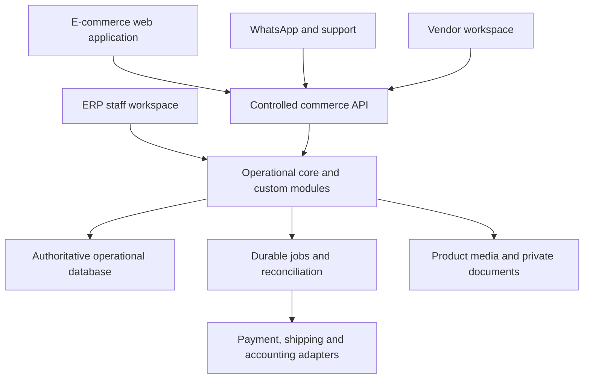

"With ERPNext, the API and custom modules can live in the same Frappe application deployment. A separate frontend
does not require a distributed microservice backend" (BP §16.1).

### 2.2 Logical components → layers, modules, pages, folders

| Logical component (BP §16.1 / PR2 §8) | PR1 §3 layer | Modules | Pages | Repository folder (00-conventions §11) | Phase |
|---|---|---|---|---|---|
| E-commerce web application | Customer Experience | M09, M27; UI of M10, M21 | P-S01–P-S13 + store shell | `frontend/storefront/` | 1A |
| Vendor workspace | Vendor Experience | M14 (UI) | P-V01–P-V04 + vendor shell | `frontend/vendor-portal/` | 1B |
| ERP staff workspace | Admin / Owner Control | UI of M02–M08, M10–M26 | P-E01–P-E15 + workspace shell | `frontend/workspace/` (custom screens only, D-004) or native screens configured in `backend/` | 1A (vendor review 1B) |
| WhatsApp and support | Customer Experience + Integration | M16, M20 | P-E05, store help widget | `backend/` (adapters), `frontend/storefront/` (widget) | 1A Level 1 / 1B Level 2 (D-014) |
| Controlled commerce API | Commerce Engine | M04 (read), M05, M08, M10, M11, M13, M14, M16 | — | `backend/` | 1A |
| Operational core and custom modules | Commerce Engine; Inventory & Operations; Workflow / Automation | M02–M08, M10–M26 | — | `backend/` | 1A/1B |
| Authoritative operational database | Data & Security | all | — | platform per D-001 | 1A |
| Durable jobs and reconciliation | Workflow / Automation | M17, M11, M12, M18, M20, M23 | P-E14 | `backend/` | 1A |
| Payment, shipping and accounting adapters | Integration Layer | M23, M11, M12, M19 | P-E15 (integrations tab) | `backend/` | 1A |
| Product media and private documents | Data & Security | M22 | — | object storage (D-033) | 1A |

### 2.3 Component view (every node sourced)

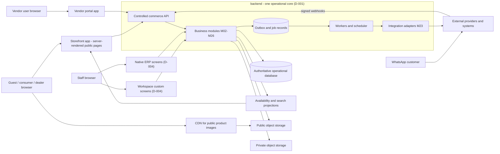

| Node | Source |
|---|---|
| Storefront app, server-rendered public pages | BP §15.4; PR2 §3 |
| Vendor portal app | BP §11.2, §16.1 |
| Workspace custom screens / native ERP screens | BP §30.1; D-004; MK `erp-*.html` |
| CDN for public product images | BP §15.4, §16.2 |
| Public / private object storage | BP §15.4 "Private/public object storage by data class", §16.2 |
| Controlled commerce API | BP §16.1, §15.4, §17.4 |
| Business modules | BP §15.5; `00-conventions.md` §6 |
| Outbox and job records | BP §16.3 |
| Workers and scheduler | BP §15.4 "Background processing", §12.2 scheduled automations |
| Integration adapters | BP §15.4 "through adapters", §16.4 |
| Availability and search projections | BP §16.2 (secondary copies), §16.5, A04 |
| External providers and systems (payment, courier, WhatsApp, email/SMS, accounting, supplier feeds, legacy ERP/POS) | BP §16.4; PR1 §13 |

## 3. Repository layout (D-054 — DECIDED; canonical in `00-conventions.md` §11)

```
TradexStore/
├── index.html, credits.html, store-*.html, erp-*.html, vendor-*.html, assets/
│                               ← clickable mockup (UI reference, published by GitHub Pages via CNAME). Do not
│                                 modify as part of implementation unless the user asks.
├── docs/                       ← source requirement documents (read-only sources)
├── plan/                       ← this implementation plan, TASKS.md, STATE.md, DECISIONS.md
├── frontend/
│   ├── design-system/          ← shared design tokens & UI components extracted from mockup assets/tradex.css (M09, D-049)
│   ├── storefront/             ← customer-facing web application: P-S01…P-S13 (M09, framework D-003)
│   ├── workspace/              ← ERP staff workspace UI: P-E01…P-E15 — only screens decided "custom" under D-004
│   └── vendor-portal/          ← vendor portal UI: P-V01…P-V04 (M14)
├── backend/                    ← operational core customisation / extension app, controlled commerce API,
│                                 business modules, adapters, jobs, migrations & data-migration scripts
│                                 (internal structure depends on D-001 / D-002)
├── infra/                      ← environment definitions, deployment, CI/CD configuration, backup/restore
│                                 and incident runbooks (D-005, D-052, D-077)
└── tests/                      ← cross-application end-to-end & acceptance suites (BP §23.1 T01–T36),
                                  load, accessibility and security test assets (tools per D-053)
```

| Folder | Contains | Modules | Pages | Internal structure decided by | Status |
|---|---|---|---|---|---|
| `frontend/design-system/` | Tokens and components from `assets/tradex.css`, shells (store, workspace) | M09 (shared UI) | all P-* | D-049, D-103 | REQUIRES_DECISION (D-049, D-103) |
| `frontend/storefront/` | Customer web app | M09, M27, UI of M10/M21 | P-S01–P-S13 | D-003 | REQUIRES_DECISION (D-003 approval, D-049) |
| `frontend/workspace/` | Custom staff screens only | UI of M02–M26 | P-E screens decided custom | D-004, D-101 | REQUIRES_DECISION (D-004, D-101) |
| `frontend/vendor-portal/` | Vendor web app | UI of M14 | P-V01–P-V04 | D-101 | REQUIRES_DECISION (D-101, D-048) |
| `backend/` | Core extension/custom modules, commerce API, adapters, jobs, schema migrations, data-migration scripts, native-screen configuration | M02–M08, M10–M26 | — | D-001, D-002 | REQUIRES_DECISION (D-001) |
| `infra/` | Environments, deployment, CI/CD, backup/restore, runbooks | M01, M26 | — | D-005, D-077, D-107, D-108, D-109 | REQUIRES_DECISION (D-005, D-109) |
| `tests/` | Cross-app E2E/acceptance (T01–T36), load, accessibility, security assets | all | all | D-053 | REQUIRES_DECISION (D-053) |

**Rules** (00-conventions §11): unit tests live next to their code; a P-E screen decided "native" under D-004 gets no
code in `frontend/workspace/` (its configuration lives in `backend/`); no mobile-app (M28) or AI (M29) folders in
Phase 1; the mockup at the root is not modified during implementation.

**Deployable topology — documented vs open.**

| Aspect | Documented | Open |
|---|---|---|
| Application boundaries | Three frontend apps + one backend (BP §16.1; 00-conventions §11); "one codebase per real application boundary" (BP §15.6) | — |
| Frontends as deployables | Not specified | Separate deployables vs one shared deployable: REQUIRES_DECISION (D-102) |
| Hostnames | Not specified; MK sample `www · erp · vendors` | REQUIRES_DECISION (D-102) |
| Backend + commerce API | May be one deployment with the core when D-001 = ERPNext (BP §16.1); one modular backend if custom (BP §15.5) | Physical form per D-001/D-002 |
| Publication of the repository root by GitHub Pages once code is added | D-054 records Pages publication of the mockup | REQUIRES_DECISION (D-115, §27) |

## 4. Frontend architecture

### 4.1 Applications

| Application | Users (roles, `00-conventions.md` §9) | Data exposure | Rendering | Auth | Key decisions |
|---|---|---|---|---|---|
| Storefront | R-guest, R-consumer, R-dealer; R-vendor_applicant (application form on P-S12) | Public catalog + the signed-in buyer's own records | Server-rendered public pages; private pages uncached | Optional for browsing; required for account/dealer area; guest checkout per D-021 | D-003, D-021, D-040, D-083, D-105 |
| ERP staff workspace | R-catalog_staff, R-warehouse_staff, R-sales_support, R-branch_manager, R-finance, R-ops_admin, R-owner | Operational data within role and record scope | Private only | Required; MFA for privileged | D-004, D-101, D-040 |
| Vendor portal | R-supplier (R-seller LATER) | Own vendor organisation's records only | Private only | Required | D-101, D-047, D-048, D-040 |

### 4.2 Storefront

**Rendering and caching matrix** (BP §6.3, §6.8, §8.4, §16.5; PR2 §3). Mechanism: D-105.

| Page | Public, shareable/cacheable content | Private content — never cached under a shared URL | Indexable | Access |
|---|---|---|---|---|
| P-S01 Home | Search entry, categories, curated collections, trust information, public prices | Signed-in dealer state and prices; saved delivery location | Yes | Public |
| P-S02 Category & search | Product cards (title, image, key specs, condition, public price with tax convention D-016, warranty summary, stock/delivery message from projection), filters, count, sort, pagination | Dealer price and tier hints for signed-in dealers (BP §6.4) | Category pages yes; filter URLs controlled (BP §6.8) | Public |
| P-S03 Product detail | Images, model, specs, condition, published unit photos and inspection summary (BP §6.6), warranty, returns, public offer | Dealer price/tiers; PIN serviceability and delivery estimate for the user's location (BP §6.5) | Yes; structured data shows real availability (BP §6.8) | Public |
| P-S04 Certified refurbished | Grade explanations, collections | — | Yes | Public |
| P-S05 Compare (CONDITIONAL, D-042) | Specifications of public products | Dealer prices if signed in | Not specified (M27) | Public |
| P-S06 Cart | — | Entire page | No | Session |
| P-S07 Checkout | — | Entire page | No | Session; guest per D-021 |
| P-S08 Order confirmation & tracking | — | Entire page | No | Order owner / organisation member / verified guest link (D-021) |
| P-S09 My account | — | Entire page | No | Authenticated |
| P-S10 Returns & warranty | Versioned policy text | Order, line, serial, evidence | No | Authenticated or verified guest |
| P-S11 Dealer zone | Business-buyer landing and application information (MK: "public, no private prices") | Approved price list, tiers, business invoices, members (D-066) | Landing only; private dealer versions never indexed (BP §6.8) | Mixed |
| P-S12 Sign in / register / applications | Form shell | Credentials, OTP, submitted business data | No | Public forms, rate-limited (D-084) |
| P-S13 Help & policies | FAQ, policies, support hours, store information | Chat order lookups (verified, BP §13.4) | Yes | Public |

**Storefront rules**

| # | Rule | Source |
|---|---|---|
| 1 | All data comes from the controlled commerce API (catalog read, offers with context, quotes, orders, returns); the storefront never talks to generic ERP endpoints | BP §15.4, §17.4 |
| 2 | Prices are computed server-side from the authenticated context; the storefront only displays them | BP §8.1, §8.4 |
| 3 | Stock/delivery messages come from the availability projection and are labelled as such; checkout revalidates with the authority | BP §9.1, §16.5 |
| 4 | Cart persists across refreshes and survives payment interruption; changing to a non-eligible business/location reprices with explicit notice | BP §6.5 |
| 5 | Validate PIN serviceability before payment; show shipping and tax totals before final confirmation | BP §6.5 |
| 6 | Confirmation shows "payment verification pending" rather than a false success until the server confirms | BP §6.3, §10.2 |
| 7 | Dealer sign-out makes private prices and cached responses inaccessible | BP §8.4; T22 |
| 8 | SEO: crawlable pages, meaningful titles, canonical URLs, XML sitemap, structured product data, redirect map (D-076), controlled filter URLs | BP §6.8 (M27) |
| 9 | Performance: optimise images (D-113), limit third-party scripts, targets per D-034 | BP §6.1, §20.1 |
| 10 | Help widget is a deterministic guided FAQ/order-status flow with human and WhatsApp handoff — no LLM | BP §13.1; MK store shell |
| 11 | Every UI item includes loading, empty, error, desktop/laptop viewport and accessibility states | BP §22.5, §6.7 (D-051) |
| 12 | Conditional or mockup-only features stay behind their decisions: D-041 reviews, D-042 wishlist/compare, D-061 pickup, D-062 EMI/offers, D-065 Q&A | BP §5.2; `00-conventions.md` §1.1 |
| 13 | Languages per D-050 | BP §26.7 |

### 4.3 ERP staff workspace

Per screen, D-004 decides native ERP screen vs custom screen (BP §30.1: "Reuse native ERP screens where they fit.
Build custom staff UI only where it materially improves a frequent task. Do not reproduce every ERP screen merely to
match the storefront branding").

| Page | BP §30.1 workspace / BP section | Primary modules | Native vs custom |
|---|---|---|---|
| P-E01 Owner control centre | Owner: exception overview, KPI summary, policy approvals, branch comparison (§12.5) | M17, M18 | REQUIRES_DECISION (D-004) |
| P-E02 Orders | Orders: queue/detail, assisted order, holds | M10, M11 | REQUIRES_DECISION (D-004) |
| P-E03 Pick · pack · dispatch | Orders: picking, packing, dispatch (§10.4) | M12 | REQUIRES_DECISION (D-004) |
| P-E04 Returns, RMA & warranty | Returns: RMA queue, receipt/inspection, refund approval, warranty case | M13 | REQUIRES_DECISION (D-004) |
| P-E05 Support & WhatsApp inbox | Support: conversations, verified order lookup, handoff, approved answers | M16 | REQUIRES_DECISION (D-004) |
| P-E06 Catalog & imports | Catalog: product list/editor, attribute templates, import preview, review queue | M04, M22 | REQUIRES_DECISION (D-004) |
| P-E07 Pricing & dealer tiers | Master data: price lists (§14.1) | M05 | REQUIRES_DECISION (D-004) |
| P-E08 Inventory & serials | Inventory: stock by location, serial lookup, QC, transfer, cycle count, movement history | M06 | REQUIRES_DECISION (D-004) |
| P-E09 Purchasing & receiving | Inventory: receipt; Purchasing (§14.1) | M07 | REQUIRES_DECISION (D-004) |
| P-E10 Customers & dealers | Master data: customers (§14.1); dealer approval (§8.3) | M08 | REQUIRES_DECISION (D-004) |
| P-E11 Vendors & submissions | Vendors: applications, profile review, submissions, freshness, performance | M14 | REQUIRES_DECISION (D-004) |
| P-E12 Payments & reconciliation | Finance: attempts, unmatched entries, refunds, settlement import, export status | M11, M19 | REQUIRES_DECISION (D-004) |
| P-E13 Reports | Reporting (§14.3–14.4) | M18 | REQUIRES_DECISION (D-004) |
| P-E14 Automation & exceptions | Owner: exceptions; automation template (§12.3–12.5) | M17 | REQUIRES_DECISION (D-004) |
| P-E15 Settings, roles & audit | Administration: users, roles, thresholds, integrations, templates, audit logs | M24, M02, M03, M23, M26 | REQUIRES_DECISION (D-004) |

**Workspace shell** (MK `assets/tradex.js`; applies to custom screens and, where feasible, to native configuration):

| Shell element | Architectural meaning | Source |
|---|---|---|
| Grouped sidebar (Overview, Sell & serve, Catalog, Stock, Partners, Finance & insight, Administration) with queue counts | Navigation filtered by permission; counts come from scoped queries | MK; BP §18.2 |
| Location scope switcher | Record-level location scope; cross-branch visibility per D-029 | MK; BP §3.1, §9.5 |
| Global search (orders, SKUs, serials, customers, POs) | M21 staff search, results filtered by permission/scope | MK; BP §18.2 |
| "New" menu (assisted order, PO, goods receipt, transfer, product draft, bulk import) | Shortcuts to create operations; each still authorised server-side | MK; BP §19.1 |
| Notifications | In-app staff notifications (M20) linked to exception queues | MK; BP §12.5 |
| System-health card (stock sync lag, job queue, last backup / restore test) | Surfaces BP §20.3 telemetry to staff | MK; BP §20.3 |
| User menu (profile, security & MFA, delegation while away) | M02 MFA, M17 delegation | MK; BP §12.6, §18.2 |

Staff screens call the core's staff-scoped operations directly (BP §16.1 "Staff → Core"); custom screens never
write database tables directly and never bypass core validations (BP §16.3). Phase 1 supports agreed desktop/laptop
browsers; staff mobile optimisation or a staff app is not implied (BP §28.4). Scanning hardware: D-110.

### 4.4 Vendor portal

| Concern | Architecture | Source |
|---|---|---|
| Scope | Every query and command is filtered to the vendor organisation of the authenticated vendor user | BP §3.1, §11.2; T11 |
| Data minimisation | Supplier sees only what its role needs (no full customer order or personal details for an availability response) | BP §11.2 |
| Permitted categories/locations | Enforced on every submission | BP §11.1; MK anno "Permitted scope enforced on every submission" |
| Submissions | Stored separately/versioned; never alter the live catalog or authoritative stock until approved | BP §7.3, §11.3 |
| Availability | Supplier-held stock with timestamp, source, lead time; never presented as company stock | BP §9.7, §11.3 |
| Users and MFA inside the vendor organisation | Shown in MK `vendor-account.html` (sample policy values); role set not specified in documents — see `07-auth-roles-permissions.md` | MK; D-040 |
| Machine feed access | MK shows an API key "scoped to availability only" | MK; D-083 |
| Shell | Same workspace shell as ERP with vendor accent token `--vendor`; no system-health card or location switcher | MK `tradex.js` |

### 4.5 Shared design system (`frontend/design-system/`)

| Element | Content | Source / status |
|---|---|---|
| Tokens | Token groups of `assets/tradex.css :root` (listed in `01-tech-stack.md` §4) | MK; PROPOSED pending D-049 |
| Components | Buttons, badges/pills/chips, cards, forms, tabs, tables, meters/steppers/timelines, modal, drawer, toast, dropdown, tooltip, charts (with table equivalent), product photo/art | MK; implementation D-103 |
| Shells | Store shell (header, category bar, mega menu, footer, help widget, compare tray, PIN modal); workspace shell (ERP and vendor variants) | MK; `00-conventions.md` §8 |
| Rules | Condition colours always paired with text; focus ring token; tabular numerals for money/quantities; no prototype toolbar or annotation styles in product | BP §6.1, §6.7; `00-conventions.md` §1.1 |

### 4.6 Frontend ↔ backend communication

| From | To | Path | Constraints | Source |
|---|---|---|---|---|
| Storefront server (SSR) and browser | Commerce API | Business endpoints (catalog, offers, quotes, orders, returns, account) | Server-derived context; CSRF for cookie-authenticated mutations; deliberate CORS | BP §17.4, §19.1 |
| Vendor portal | Commerce API (vendor-scoped operations) | Submissions, availability, POs/tasks, profile | Vendor scope on every call | BP §17.4, §11.2 |
| Workspace custom screens | Core staff operations | Staff-scoped operations | Role + record scope + sensitive-field checks server-side | BP §16.1, §18.2 |
| Phase 2 mobile app (LATER) | Same commerce API | Same business endpoints | API must not depend on web-only session behaviour (D-083) | BP §15.4, §28.4 |
| Session location (frontend server vs backend), token type, cookie scope | — | — | REQUIRES_DECISION (D-083, D-102) | BP §19.1 |

## 5. Backend architecture

### 5.1 Shape

One operational core + a controlled commerce API + custom modules, deployed as a **modular monolith** (BP §15.5,
§16.1, §33). With ERPNext the API and custom modules can live in the same Frappe application deployment (BP §16.1);
with a custom backend, catalog, pricing, inventory, orders, payments and approvals are internal modules with explicit
interfaces (BP §15.5). Workers run the same codebase's jobs. A separate background service is added only on the BP
§28.5 trigger.

### 5.2 Module map

| Module | Backend responsibility | Authoritative records (`00-conventions.md` §7) | Main callers |
|---|---|---|---|
| M01 Platform foundation | Configuration, environments, release | — | — |
| M02 Identity, access & audit | Authentication, roles, permissions, record scope, audit | E-user_account, E-role, E-permission, E-role_permission, E-user_role_assignment, E-delegation, E-audit_event | All modules |
| M03 Organisation & locations | Company, branches, warehouses, bins | E-company, E-location, E-location_bin | M06, M02 (scope), M12 |
| M04 Catalog | Category schemas, products, SKUs, offers, lifecycle, policies, compatibility, bundles, import | E-category … E-supplier_code_mapping | Commerce API, workspace, M14, M21 |
| M05 Pricing | The single price calculation; quotes | E-price_list … E-quote_line | M10, commerce API, workspace, M16 |
| M06 Inventory | Stock ledger, ATP, reservations, serials, transfers, counts, adjustments, supplier availability | E-stock_movement … E-reorder_rule | M07, M10, M12, M13, M14 |
| M07 Purchasing & receiving | Suggestions, POs, receipts, inspection hand-off, supplier bills and matching | E-supplier … E-replenishment_suggestion | Workspace, M06, M14 |
| M08 Customers & business accounts | Consumers, dealer applications, business accounts/members, addresses, consent | E-customer … E-consent_record | Commerce API, M05 (context), M20 |
| M10 Cart, checkout & orders | Pending order + reservation, order state machine, cancellations, assisted orders | E-sales_order, E-order_line, E-order_cancellation, E-idempotency_record | Commerce API, workspace, M16 |
| M11 Payments, refunds & reconciliation | Payment attempts, webhook events, refunds, settlements | E-payment_attempt, E-payment_event, E-refund, E-settlement_record | M10, M13, webhooks, jobs |
| M12 Fulfilment & shipping | Release, pick, pack, dispatch, courier booking, tracking | E-fulfilment, E-fulfilment_line, E-shipment_event | Workspace, jobs, webhooks |
| M13 Returns, RMA & warranty | Return requests, inspection routing, warranty cases, supplier RMA | E-return_request, E-return_line, E-warranty_case, E-supplier_rma | Commerce API, workspace |
| M14 Vendor portal & management | Applications, approvals, users, submissions, terms, supplier fulfilment tasks | E-vendor_application … E-supplier_fulfilment_task | Vendor API, workspace |
| M15 Marketplace (LATER) | Seller agreements, commissions, settlements, payouts | E-seller_agreement … E-payout | — |
| M16 Support & WhatsApp | Conversations, tickets, approved answers, templates, draft baskets | E-support_conversation … E-message_template | Webhooks, workspace, storefront widget |
| M17 Automation, exceptions, approvals & delegation | Rules, jobs, outbox, integration events, exceptions, approval requests, thresholds | E-automation_rule, E-job_attempt, E-outbox_operation, E-integration_event, E-exception_case, E-approval_request, E-approval_threshold | All modules |
| M18 Reporting & exports | Reports, export jobs, schedules | E-export_job, E-report_schedule | Workspace, jobs |
| M19 Finance boundary & accounting export | Invoice references, accounting exports, control totals | E-invoice_reference, E-accounting_export | Jobs, workspace |
| M20 Notifications | Customer/staff messages, templates, delivery status | E-notification | Outbox jobs |
| M21 Search | Search/availability projections (no authoritative records) | — | Storefront, shells |
| M22 Files & media | Attachments, storage classes, variants, delivery | E-attachment (E-media_asset owned by M04) | M04, M08, M13, M14, M16, M18 |
| M23 Integrations & adapters | Provider adapters and contracts | uses E-integration_setting (M24), E-integration_event (M17) | Workers, webhooks |
| M24 Administration & settings | Configuration versions, integration settings | E-configuration_version, E-integration_setting | Workspace |
| M25 Data migration & cutover | Import scripts, reconciliation | — | Operators |
| M26 Security, observability, backup & operations | Telemetry, alerts, backup/restore, incident procedures | — | Operators |

### 5.3 Internal interaction rules

| # | Rule | Source |
|---|---|---|
| 1 | Modules call each other through explicit interfaces, not each other's records | BP §15.5 |
| 2 | Only M05 computes prices, for every channel | BP §8.1, §15.6 |
| 3 | Only M06 writes stock movements and reservations; every channel's stock effect goes through it | BP §9.1, §15.6 |
| 4 | M10 creates the pending order and its reservations in one transaction via M06 | BP §16.3 |
| 5 | External calls happen only through M23 adapters, driven by outbox records | BP §16.3, §16.4 |
| 6 | Approval-requiring actions create an E-approval_request (M17) instead of executing | BP §12.5, §18 |
| 7 | Every material stock, price, refund and permission change emits an E-audit_event with actor and reason | BP §17.6, §20.1 |
| 8 | Use documented core transaction mechanisms and locks; no direct table writes that bypass validations | BP §16.3 |

### 5.4 Transaction boundaries (BP §16.3)

| Business operation | Inside one database transaction | Outside — durable intent, then worker/controlled call | Source |
|---|---|---|---|
| Place pending order | Recompute totals; validate stock, eligibility, address, policy; create order (awaiting payment) with line snapshots; create reservation(s); store idempotency record | Create/reuse the provider payment attempt | BP §10.2 steps 1–3, §16.3 |
| Apply payment event | Record event once; update payment attempt; if captured and reservation valid, confirm order; otherwise create stock exception; write outbox records | Fulfilment release (A11), customer notification (A14) | BP §10.2 steps 4–7, §29.6 |
| Expire reservation (A06) | Release reservation; update order | Availability projection refresh (A04) | BP §9.2, §12.2 |
| Record goods receipt | Receipt + movements into received/quarantine + serial units | Availability refresh only after inspection acceptance | BP §9.2, §9.3 |
| Accept inspection | Quarantine → sellable movement; serial status | Projection refresh (A04) | BP §9.2 |
| Dispatch | Reduce physical on-hand and consume reservation atomically; fulfilment state; serial event | Courier booking/label (A13), notification (A14) | BP §9.2, §10.4 |
| Transfer | Ship: source → transit; receive: transit → destination | Projection refresh | BP §9.2, §9.5 |
| Stock adjustment | Only after approval: movement + audit | Projection refresh | BP §9.6, §18.1 |
| Cancel eligible lines | Release only affected reservations; allocate refund amount once | Provider refund | BP §10.3; T34 |
| Refund | Refund record with refundable-amount check | Provider refund call; on timeout query before retry | BP §10.3, §17.6 |
| Approve vendor submission / publish catalog change | Approve with expected version; publish version | Search/storefront invalidation | BP §11.3, §16.5, §17.4 |
| Publish import rows | Valid approved rows only; failed rows stay in staging | Image fetch (A02) and projection refresh | BP §7.4 |
| Accounting export (A26) | Mark document/version as exported under one mapping | File delivery / API push | BP §14.2, §17.6 |

### 5.5 State machines (BP §10.1)

"Transitions require explicit guards. Do not implement a single status field that tries to represent all five
processes" (BP §10.1). Transition tables and guards are specified as business rules (`BR-<M##>-##`) in the module
documents; the state sets below are the BP examples.

| Record | States (BP example) | Module / entity | Architectural rules |
|---|---|---|---|
| Order | Draft, awaiting payment, confirmed, on hold, partially fulfilled, fulfilled, cancelled, closed | M10 / E-sales_order | Invalid or late events cannot move an order backwards into an unsafe state (PR2 §6); customer-facing status derived from trusted records (PR2 §6) |
| Payment attempt | Created, pending, authorised, captured, failed, expired | M11 / E-payment_attempt | A failed event after capture never downgrades captured (BP §10.3) |
| Refund | Requested, approved, submitted, pending, completed, failed | M11 / E-refund | Query provider before re-submitting after a timeout (BP §10.3) |
| Fulfilment | Unallocated, allocated, picking, packed, dispatched, delivered, delivery failed, returned to origin | M12 / E-fulfilment | Courier statuses mapped to canonical states; raw event preserved; no overwrite of unrelated internal states (BP §10.5) |
| Return / RMA | Requested, reviewed, authorised, in transit, received, inspected, resolved, rejected | M13 / E-return_request | Refund authorisation and resale authorisation are separate decisions (BP §10.5) |
| Reservation | Created → consumed at dispatch, or released on expiry/cancellation | M06 / E-reservation | Reduces ATP only (BP §9.2); expiry per D-026 |
| Product / listing | Draft, Submitted, NeedsChanges, Approved, Published, Suspended, Archived | M04, M14 | Diagram in §11.3 (BP §7.3) |
| Dealer account | Pending, rejected, suspended, approval expired (+ approved) | M08 / E-dealer_application | BP §6.3, §8.3 |
| Supplier availability | Fresh / stale per supplier deadline | M06 / E-supplier_availability | BP §9.7; D-028 |

Common mechanics: each transition is a guarded operation; applied idempotently (duplicate event → no second
effect); recorded with actor, time, reason and input version (BP §12.3 audit, §17.6).

## 6. Database architecture

Entity detail: `03-database.md`. Physical mapping per D-001 ("Map each concept to native records, custom fields, or
extension records after selecting the core", BP §17.2).

### 6.1 One database, one ledger, one price authority

| Element | Architecture | Source |
|---|---|---|
| Operational database | One authoritative database for the operational core | BP §16.1; PR1 §3 |
| Stock ledger | Append-only E-stock_movement; E-stock_position per SKU × location × stock owner × disposition (× lot/unit where applicable) reconciles to movement history | BP §9.2, §15.6, §17.6 |
| Dispositions | Sellable, quarantine, damaged, repair, in-transit — `sellable_on_hand` already excludes the others | BP §9.2 |
| ATP | `available_to_promise = max(0, sellable_on_hand − active_reserved − safety_buffer)`; safety buffer D-027 | BP §9.2 |
| Serial units | E-serial_unit + E-serial_event history; internal id separate from manufacturer serial; no serial in two active fulfilments | BP §7.2, §9.4 |
| Supplier availability | Separate from company stock; timestamp, source, confirmation policy, lead time, buffer | BP §9.7, §11.3 |
| Price authority | E-price_list, E-price_list_item, E-quantity_tier, E-price_rule_version, E-promotion, E-margin_floor, E-discount_authority | BP §8.1, §16.2 |
| Order snapshots | Order lines keep final price, rule version, condition/grade, warranty terms at purchase | BP §8.1, §17.6, §29.1; T33 |
| Organisation | Company, branch, warehouse relationships stored explicitly; no multi-tenant control plane | BP §3.3; D-045 |

### 6.2 Data ownership (BP §16.2)

| Data | Authority (BP §16.2) | Owning module | Records | Secondary copies | How copies stay correct |
|---|---|---|---|---|---|
| Product master | Approved catalog module | M04 | E-product, E-sku, E-category, E-attribute_definition | Search index, storefront cache, provider catalog | Invalidate after approved changes; version/timestamp (BP §16.5) |
| Seller offer | Approved offer records | M04 (M14 submissions) | E-offer | Storefront/search projection | Same |
| Stock movements & reservations | Operational stock authority | M06 | E-stock_movement, E-reservation | Availability projection for browsing | A04 on committed movement; retry + reconciliation; ≤60 s proposal (D-034) |
| Price rules | Pricing module | M05 | E-price_* | Short-lived quotes | Quote version + expiry; revalidate at order (BP §8.1) |
| Orders | Order module | M10 | E-sales_order, E-order_line | Accounting/shipping references | Outbox + reconciliation |
| Provider payment outcome | Payment provider, reconciled into local payment records | M11 | E-payment_attempt, E-payment_event | Order financial status | Signed webhooks + status query (BP §10.2) |
| Legal accounting ledger | Agreed accounting system (D-011) | external / M19 | E-accounting_export | Operational reports/exports | Control totals (BP §14.2) |
| Shipment external status | Courier source + local canonical history | M12 | E-shipment_event | Customer tracking view | Canonical mapping, raw events kept (BP §10.5) |
| Permissions | Identity/role system | M02 | E-role, E-permission, E-user_role_assignment | Cached checks | Safe invalidation only (BP §16.2) |
| Product media | Managed object storage | M22 | E-media_asset, E-attachment | CDN cache | Versioned asset URLs / purge per D-105, D-113 |

### 6.3 Common record fields (BP §17.3)

`created_at`, `updated_at`, responsible actor, entity/company scope, source channel, external reference, optimistic
concurrency version where useful. Audit records keep before/after values or a structured change, with restricted
access and retention (D-036). Money per D-104; currency INR assumption (D-059).

### 6.4 Consistency invariants (BP §17.6)

| Invariant | Architectural enforcement | Tests |
|---|---|---|
| No duplicate effect for the same accepted business operation | Idempotency records; provider-event dedup; one outbox record per intended effect | T06, T07, T18, T20 |
| No negative sellable allocation under normal processing | Reservation inside the core transaction with the documented lock; ATP check | T04, T05 |
| A serialised unit cannot ship twice without a recorded return and new sale | Serial state + single active allocation | T15, T17 |
| Stock movement history reconciles to balances | Append-only movements; positions derived; adjustments only via approved movements; never overwrite a quantity | T16, BP §9.6 |
| Refunded ≤ refundable captured after prior refunds/adjustments | Check within the refund transaction | T18, T34 |
| Approved private prices do not cross customer/business boundaries | Server-derived context; private responses isolated from shared caches | T02, T10, T22 |
| Order snapshots preserve what was sold | Snapshot fields on order lines | T33 |
| Unapproved vendor content cannot become a purchasable offer | Separate/versioned submissions; publication gate | T12, T13 |
| One accounting mapping per approved document/version | Unique export mapping | T27 |
| Every material override has actor, reason, authority trail | Approval requests + audit events | T31; audit export (BP §14.3) |

### 6.5 Workload

Reports and exports run against the operational database initially with row limits (BP §14.4); large imports/exports
must not starve checkout (BP §20.2; T35). A read replica or report store is added only when reports materially affect
transactional workload (BP §28.5).

## 7. API architecture

Endpoint catalogue and IDs (`API-<M##>-##`): `06-api.md`.

### 7.1 API surfaces

| Surface | Consumers | Authentication | Scope | Source |
|---|---|---|---|---|
| Customer commerce operations | Storefront, WhatsApp flow (via M16), Phase 2 app | Guest / consumer / dealer member (D-040, D-083) | Own records; organisation for dealers | BP §17.4, §28.4 |
| Vendor operations | Vendor portal; vendor availability feeds | Vendor user / scoped key (D-083) | Own vendor organisation | BP §17.4, §11.2 |
| Staff operations | Custom workspace screens | Staff session + MFA for privileged | Role + record scope | BP §16.1, §18.2 |
| Webhook receivers | Payment, shipping, WhatsApp providers | Provider signature / provider authentication | One provider each | BP §17.4, §13.3 |
| Integration accounts | Machine-to-machine jobs/feeds | Narrow credentials (D-083) | Named operations only; no interactive admin | BP §3.1 |
| AI tools (LATER) | Phase 3 assistant | Narrow APIs only | Read/approved actions only | BP §28.2 |

### 7.2 Contract rules

| # | Rule | Source |
|---|---|---|
| 1 | Business operations only; no generic ERP document CRUD for external callers | BP §15.4, §17.4 |
| 2 | Authorisation context is derived on the server; never trust client `is_admin`, `dealer_approved`, `unit_price`, `stock_quantity`, `seller_id`, `refund_approved` | BP §17.4, §8.4 |
| 3 | `channel` is validated against the authenticated entry point | BP §17.5 |
| 4 | Object-level and property-level authorisation on every operation | BP §19.1; S14 |
| 5 | Approval decisions carry the expected version | BP §17.4 |
| 6 | Mutations that create business effects accept an idempotency key (transport D-079) | BP §17.5, §10.3 |
| 7 | Accurate, non-leaking error outcomes (e.g. "no stock" to the losing buyer; "access denied" without revealing data) | BP §10.3; T04, T11 |
| 8 | Versioning, pagination, error envelope, date and money formats per D-080 (money per D-104) | BP §17.4 |
| 9 | Rate limits per D-084 | BP §19.1 |
| 10 | Contracts documented for handover | BP §24.2 |

### 7.3 Illustrative endpoint families (BP §17.4 — routes are illustrative)

| Operation | Illustrative contract | Core guard (BP §17.4) | Module |
|---|---|---|---|
| Search catalog | `GET /v1/products` | Only approved visible catalog | M04, M21 |
| Product offer | `GET /v1/products/{id}/offers` | Authenticated context determines permitted prices | M04, M05 |
| Quote basket | `POST /v1/quotes` | Server computes price/tax; returns expiry/version | M05 |
| Place pending order | `POST /v1/orders` | Idempotency key, price acceptance, atomic stock reservation | M10, M06 |
| Read order | `GET /v1/orders/{id}` | Ownership/organisation/role checks | M10 |
| Cancel eligible lines | `POST /v1/orders/{id}/cancellations` | State, quantity and refund rules | M10, M11 |
| Request return | `POST /v1/returns` | Order access, policy, line/serial match | M13 |
| Vendor submission | `POST /v1/vendor/submissions` | Vendor scope; no automatic publication | M14 |
| Review submission | `POST /v1/approvals/{id}/decision` | Reviewer authority and expected version | M17, M14 |
| Receive goods | `POST /v1/receipts` | Warehouse permission, PO match, serial validation | M07, M06 |
| Payment webhook | `POST /v1/webhooks/payment-provider` | Raw-body signature, event deduplication | M11 |
| Shipping webhook | `POST /v1/webhooks/shipping-provider` | Provider authentication and transition mapping | M12 |

### 7.4 Idempotent order placement (BP §10.3, §17.5)

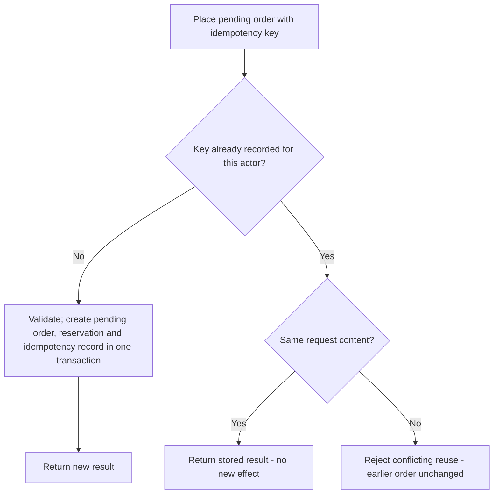

The client generates the key once per business intent and reuses it on network retries (BP §17.5). Concurrent
requests with the same key must resolve to one effect (unique key constraint in the same transaction).

### 7.5 Webhook ingestion

Verify the provider signature on the raw request body; deduplicate by provider event id; tolerate non-guaranteed
order; record the event once, then apply only legal transitions (BP §10.2, §17.4, S09). Invalid signatures are
rejected, logged as security events and never processed (MK `erp-admin.html#audit`, `erp-automation.html`).
Detail for payments in §18.

## 8. Authentication architecture

Detail: `07-auth-roles-permissions.md`.

| Population | Roles | Sign-in method | MFA | Session / credential | Source |
|---|---|---|---|---|---|
| Guest | R-guest | None; order access by secure link or verification | — | D-021 | BP §6.5 |
| Consumer | R-consumer | REQUIRES_DECISION (D-040); MK: mobile OTP or email + password | Optional 2-step shown in MK (D-040) | D-083 | BP §19.1; MK `store-login.html`, `store-account.html` |
| Dealer member | R-dealer | D-040; dealer pricing requires verified membership of the approved business account | D-040 | D-083 | BP §6.5, §8.3; D-066 |
| Vendor applicant / supplier user | R-vendor_applicant, R-supplier | D-040 | MK shows MFA required for vendor users (sample) | D-083 | BP §3.1; MK `vendor-account.html` |
| Staff | R-catalog_staff … R-owner | D-040; individually attributable accounts; no shared admin passwords | Required for privileged accounts (method D-040) | D-083 | BP §18.2, §20.1 |
| Integration account | R-integration | Machine credentials | n/a | D-083 | BP §3.1 |

| Control | Architecture | Source / decision |
|---|---|---|
| Authority | The backend authenticates and authorises; frontends only hold the session artefact | BP §19.1 |
| OTP delivery | SMS/email provider adapter (M23 → M20) | D-015 |
| Abuse protection | Rate limits, lockout/pause on repeated failures, protection of sign-in and checkout | BP §19.1; D-084 (MK sample values) |
| CSRF / CORS | CSRF protection for cookie-authenticated mutations; explicit CORS allow-list per hostname layout | BP §19.1; D-083, D-102 |
| Session revocation | Deactivating a user revokes sessions; accounts are deactivated, not deleted (history kept) | MK `erp-admin.html#users`; BP §17.3 |
| Sign-out privacy | Private prices and cached responses inaccessible after sign-out | BP §8.4; T22 |
| Password storage/migration | Platform-supported mechanism; compatible migration or reset | BP §19.1, §21.2; D-039 |
| WhatsApp identity linking | Secure verification; never merge by matching names | BP §13.4 |
| Logging | Never log passwords, OTPs, tokens | BP §19.1 |
| Emergency access | Time-bounded, post-event review | BP §18.2; D-025 |

## 9. Authorization, roles and permissions

Layers (BP §18.2; PR2 §9): **RBAC → record-level scope → sensitive-field restrictions → approvals, thresholds and
separation of duties → MFA for privileged actions.** Every layer is enforced on the server for every business
operation (BP §19.1); the UI only hides what the server would refuse.

### 9.1 Roles → BP §18.1 authority columns

| Role | BP §18.1 column | Record scope | Notes (BP §3.1) |
|---|---|---|---|
| R-catalog_staff | Staff | Assigned catalog work | Cost/margin only if assigned |
| R-warehouse_staff | Staff | Assigned locations and tasks | Receive, scan, move, pick, pack, count |
| R-sales_support | Staff | Customers/orders they serve | Limited discount/refund authority |
| R-branch_manager | Manager | Assigned branch (+ permitted cross-branch per D-029) | Branch operations and exceptions |
| R-finance | Finance | Finance data | Separation of duties |
| R-ops_admin | Owner/admin (except sensitive finance) | All operations | Sensitive finance changes still restricted |
| R-owner | Owner/admin | All | Strong authentication; privileged actions logged |
| R-vendor_applicant, R-supplier | Vendor | Own vendor organisation | No competitor costs or company margins |
| R-seller (LATER) | Vendor (marketplace) | Own offers and assigned customer data | M15 |
| R-guest, R-consumer, R-dealer | — (customer) | Own records / own organisation | Dealer member sub-roles D-066 |
| R-integration | — (machine) | Named operations | No interactive admin |

The column mapping above is this plan's reading of BP §3.1 together with BP §18.1; `07-auth-roles-permissions.md`
holds the authoritative permission matrix.

### 9.2 Record-level scope dimensions

| Dimension | Applies to | Source |
|---|---|---|
| Location (warehouse/branch) | Warehouse staff, branch managers; workspace location switcher | BP §3.1, §9.5; MK shell |
| Business account | Dealer members (prices, orders, invoices) | BP §3.1, §8.3; D-066 |
| Vendor organisation | Supplier/seller users | BP §3.1, §11.2; T11 |
| Own records | Consumers; guest via verified access | BP §3.1, §6.5 |
| Assigned task/fulfilment role | Warehouse tasks; supplier-fulfilment data only for the assigned role | BP §3.1, §11.2, §18.1 |
| Company/entity | All records | BP §17.3 |

### 9.3 Sensitive fields (property-level)

Supplier cost and margin; dealer/contract prices; payout/bank details; identity/verification documents; personal
data in exports; approval/status fields that users must not set on their own records (T13); brand, condition,
warranty, tax classification and extraordinary price changes, which require review (BP §11.3, §18.1, §14.4, §19.1).

### 9.4 Approvals, delegation, separation of duties

| Mechanism | Architecture | Source |
|---|---|---|
| Authority matrix | BP §18.1 actions × roles; thresholds client-supplied | BP §18.1; D-024 |
| Approval request | Records why approval was required, deadline, alternate approver, escalation, outcome; bulk review keeps per-item history | BP §18.2; E-approval_request |
| Self-approval | Initiator of a high-risk transaction does not approve it where feasible | BP §18.2 |
| Maker-checker | Payout-account changes and high-value manual adjustments | BP §11.5, §18.1 |
| Delegation | Named alternate with explicit, time-bounded authority; never silent conversion of owner-only rules | BP §12.6; D-025 |
| Emergency access | Time-bounded authorisation + post-event review | BP §18.2 |
| Privileged admin changes | MK: second approver for privileged roles, secrets, payouts (consistent with BP §18.2) | MK `erp-admin.html` |
| Mechanism | Native workflow (e.g. ERPNext Workflows, S06) or custom approval matrix | REQUIRES_DECISION (D-001) |

Tests: T02, T10, T11, T13, T22, T23, T31; proof scenario 9 (BP §15.3).

## 10. E-commerce architecture

### 10.1 Pipeline

| Stage | Module | Authority / record | Rules | Source |
|---|---|---|---|---|
| Catalog | M04, M21 | Approved products/offers; projection for browsing | Only approved visible catalog | BP §7.3, §17.4 |
| Pricing | M05 | Price rules → price for authenticated context | Proposed 8-step precedence (D-017); tiers (D-018); tax display (D-016); promotions (D-043); location pricing (D-044) | BP §8.1 |
| Quote | M05 | E-quote (version, expiry) | Recalculate tier when quantity changes; revalidate on order | BP §8.1, §8.4 |
| Pending order + reservation | M10, M06 | E-sales_order + E-reservation in one transaction | Idempotency; serviceability; eligibility; serial reservation rule D-031; backorders only per D-073 | BP §10.2, §16.3 |
| Payment | M11 | Provider outcome reconciled into E-payment_attempt | Hosted collection; signed webhooks; no browser-only success | BP §10.2, §10.6 |
| Confirmation | M10 | Order confirmed or held with stock exception | Late capture policy D-026 | BP §10.2, §29.6 |
| Fulfilment | M12 | E-fulfilment | Release to staff queue (A11); scan; dispatch consumes reservation | BP §10.4 |
| Delivery / returns | M12, M13 | E-shipment_event, E-return_request | Canonical carrier states; quarantine on return | BP §10.5 |

### 10.2 Checkout sequence (BP §10.2)

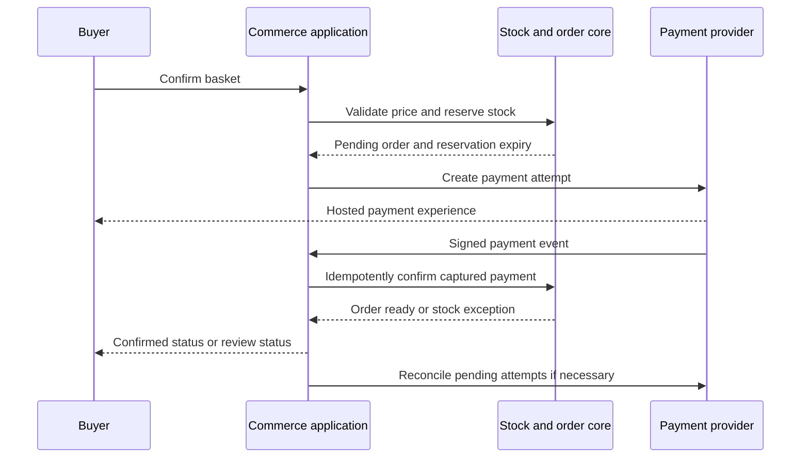

"Do not keep a database transaction open while waiting for the customer or a payment network" (BP §10.2).

### 10.3 Channels into the same pipeline

| Channel | Entry | Differences | Source |
|---|---|---|---|
| Web storefront | P-S06 → P-S07 | Guest checkout per D-021 | BP §6.5 |
| Staff-assisted order | P-E02 "assisted order" | Staff discount within authority; above authority → approval | BP §3.1, §18.1, §29.2 |
| WhatsApp | Level 1 click-to-chat carries a product reference (not a price); Level 2 guided flow creates a draft basket; customer confirms via secure checkout link | Price always recalculated; ambiguity goes to an agent | BP §13.1–13.2, §29.5; A08; D-014 |
| Branch sale | Branch sale entry/integration against the same stock authority | Offline selling process D-030; legacy POS D-009 | BP §5.2, §9.5, §29.4 |
| Phase 2 mobile app | Same commerce API | LATER | BP §28.4 |

### 10.4 Checkout rules

Recalculate totals on the server; validate stock, customer eligibility, address, serviceability and policy (BP §10.2
step 1); reprice with notice when business/location context changes (BP §6.5); when stock is short offer the agreed
alternative (reduced quantity, explicit backorder/quote, or rejection) — never an unsupported promise (BP §29.2);
unverified supplier quantity is never presented as company stock (BP §9.7); expired or invalid price lists fail to a
defined valid price or block checkout, never zero (BP §8.4).

## 11. Vendor architecture (BP §11)

### 11.1 Vendor models (BP §3.2; D-007)

| Model | Customer buys from | Inventory | Additional capability | Status |
|---|---|---|---|---|
| Supplier/reseller | The company | Supplier availability external; received stock internal | POs, receipts, supplier bills | PROPOSED launch model (D-007): suppliers submit information for review |
| Company sale with supplier fulfilment | The company | Supplier confirms availability and ships for the company | Confirmation deadline, shipment evidence, invoice/warranty responsibility | Small pilot after confirmation and refund rules are proven (D-007, D-008) |
| Marketplace | External seller | Seller-owned | Agreements, commissions, settlements, disputes, split fulfilment, tax review | LATER (M15, D-046) |

### 11.2 Components

| Component | Module / records | Source |
|---|---|---|
| Onboarding: admin invitation and/or public application (applicant, not activated seller) | M14 E-vendor_application, E-vendor_approval (reviewer, decision, reasons, permitted categories/locations, terms version, review date) | BP §11.1; D-047, D-068 |
| Vendor users | M14 E-vendor_user | BP §11.2 |
| Submissions (drafts, files, error responses) | M14 E-vendor_submission; M04 import records | BP §11.2, §7.4 |
| Review queue | P-E11, P-E06; D-081 reviewer authority | BP §11.3, §18.1 |
| Availability declarations | M06 E-supplier_availability; freshness A21, D-028 | BP §9.7, §11.2 |
| Purchase orders / assigned supply tasks | M07 (read), M14 E-supplier_fulfilment_task | BP §11.2 |
| Supplier RMA | M13 E-supplier_rma | BP §11.2 |
| Statements (if integrated) | M19/M14 | BP §11.2 |
| Performance (data quality, response time) | M18 vendor performance report | BP §11.2, §14.3 |

### 11.3 Submission-to-publication lifecycle (BP §7.3)

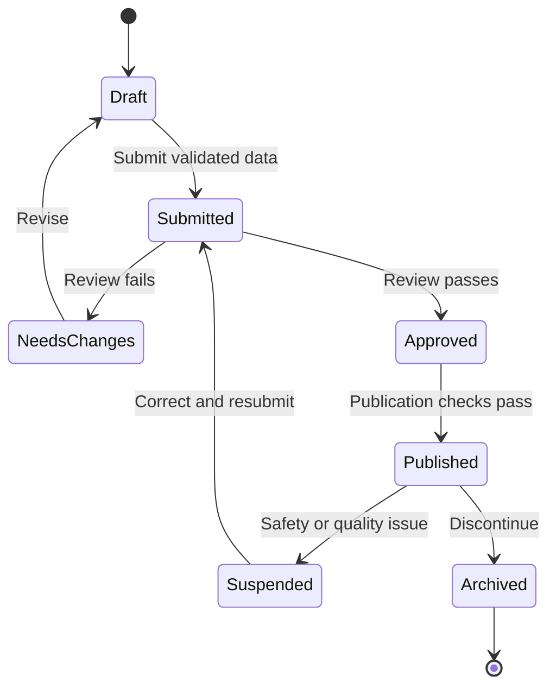

### 11.4 Guarantees

| Guarantee | Source |
|---|---|
| Unapproved data never enters the live purchasable catalog or alters authoritative stock | BP §7.3, §17.6; T12 |
| Changes to an approved listing stay pending while the last approved version remains live (unless safety/stock requires suspension) | BP §11.3; PR2 §5; T13 |
| Sensitive edits (brand, condition, warranty, tax classification, payout account, extraordinary price changes) require review | BP §11.3 |
| Routine stock refreshes from trusted vendors may auto-accept within validated boundaries once stable | BP §11.3 |
| A stock update never creates company-owned inventory without an authorised receipt/ownership transaction | BP §11.3; PR2 §4 |
| Suspended vendors cannot submit live changes; history remains accessible to authorised staff | BP §11.1 |
| Stale supplier data hides immediate-delivery promises, requires confirmation or suspends the offer | BP §9.7; T14 |

## 12. Marketplace architecture (LATER — M15, D-046)

Not built in Phase 1. Listed so that Phase 1 does not block it and does not pretend to provide it.

| Item | Content | Source |
|---|---|---|
| Prerequisites (decide before activation) | 1 seller of record and invoice issuer; 2 collection/settlement arrangement with the payment provider; 3 commission/fee basis, taxes, effective dates; 4 shipping responsibility and serviceability; 5 refund funding, return windows, warranty, disputes; 6 settlement holds, reserves, chargebacks, negative balances, reconciliation; 7 seller suspension effects; 8 customer-facing seller identity and offer selection; 9 marketplace tax and consumer requirements | BP §11.4; PR2 §5; D-008, D-037 |
| Settlement components | Eligible delivered sales, refunds, commission, service charges, tax/withholding, logistics deductions, prior adjustments, retained reserves — each with basis and version | BP §11.5 |
| Phase 1 preparation | The company's own selling identity is an internal offer owner (E-offer); marketplace functions are not exposed merely because the model supports future external offers | BP §17.1 |
| Additional tests | Seller-order splitting, commission versions, partial returns after payout, payout failure, seller suspension with open orders, negative balances, settlement reconciliation | BP §23.1 |
| Never | Label an ordinary bank-transfer process as automated marketplace settlement | BP §11.4 |

## 13. ERP architecture (BP §14.1)

| ERP module | Minimum useful scope (BP §14.1) | Plan modules | Staff pages | Further expansion (not Phase 1) |
|---|---|---|---|---|
| Master data | Products, categories, suppliers, customers, locations, taxes, price lists | M03, M04, M05, M07, M08 | P-E06, P-E07, P-E10, P-E15 | Multi-company governance |
| Purchasing | Requests/drafts, POs, receipts, variances | M07 | P-E09 | Tendering, automated supplier comparison |
| Inventory | Movements, reservations, serials, transfers, counts | M06 | P-E08 | Complex warehouse optimisation |
| Sales | Orders, assisted sales, dealer pricing, invoices/interface | M10, M05 | P-E02 | Advanced quotations, credit control |
| Fulfilment | Pick/pack/dispatch, tracking, cancellations | M12 | P-E03 | Multi-carrier optimisation |
| Returns/warranty | RMA, quarantine, refund link, warranty evidence | M13 | P-E04 | Repair workshop scheduling, parts billing |
| Finance boundary | Payment ledger, reconciliation, approved accounting exports | M11, M19 | P-E12 | Full accounting replacement if agreed (D-011) |
| Vendor management | Applications, approvals, data submissions | M14 | P-E11 | Marketplace commissions/settlements (M15) |
| Staff access | Users, roles, assignments, audit | M02, M24 | P-E15 | Payroll/HR separately scoped |
| Reporting | Operational reports and exports | M18 | P-E13, P-E01 | Data warehouse, advanced BI |

Native vs custom implementation of each row: REQUIRES_DECISION (D-001); staff screen form: D-004.

**Procurement and receipt flow (BP §9.3)**

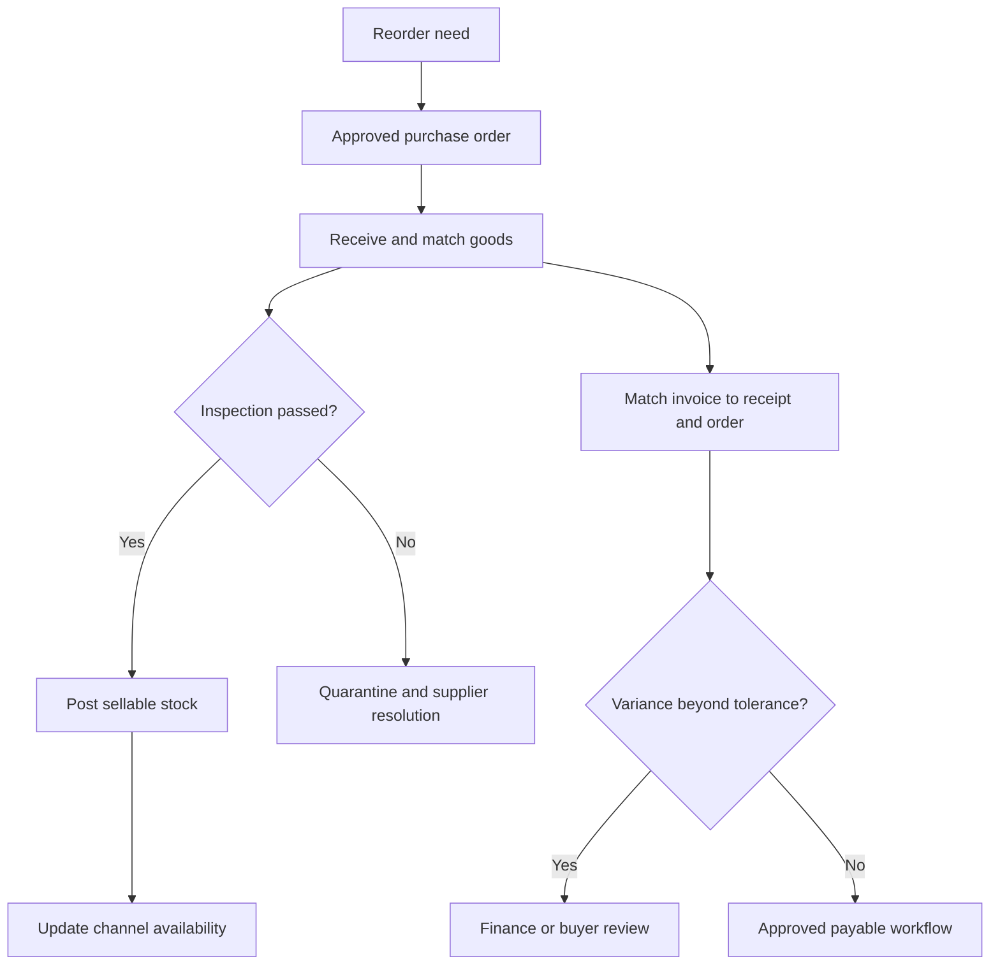

**Finance boundary.** Retain one official accounting authority until replacement is approved (D-011); publish
approved financial documents through a controlled interface and reconcile document counts, amounts, taxes and
status (BP §14.2). Gross-margin reports are not statutory P&L (BP §10.6).

## 14. Admin architecture (P-E15)

| Admin area (MK tab) | Module / records | Controls | Source / decision |
|---|---|---|---|
| Users | M02 E-user_account, E-user_role_assignment | Individually attributable; MFA status; deactivate (never delete) and revoke sessions | BP §18.2, §20.1; MK |
| Roles & permissions | M02 E-role, E-permission, E-role_permission | Authority matrix; privileged role changes need second approver (MK) | BP §18.1; D-024 |
| Thresholds | M17 E-approval_threshold | Client-supplied values only | BP §18.1; D-024 |
| Delegation | M02 E-delegation | Named, scoped, time-bounded | BP §12.6; D-025 |
| Locations | M03 E-company, E-location, E-location_bin | Explicit company/branch/warehouse relationships | BP §3.3 |
| Integrations | M24 E-integration_setting; M23 | §16.4 contract checklist complete before go-live; write-only secrets; test call; logs with redacted credentials | BP §16.4; MK; D-107 |
| Audit log | M02 E-audit_event | Actor, action, object, before/after, reason; tamper-resistant; viewing is logged (MK) | BP §17.3, §19.1; D-114 |
| System | M01, M26 | Environments, feature flags (D-077), backups & restore (D-108), monitoring & alerts (D-052), retention matrix (D-036), support model (D-035) | BP §16.6, §19.3, §20, §24.1; MK |

Configuration changes are versioned (E-configuration_version, BP §17.3) and audited. System configuration controls are
reserved for authorised administrators (PR1 §11). User administration is separated from ordinary warehouse work
(BP §18.2).

## 15. File and media architecture

### 15.1 Data classes

| Class | Examples | Storage | Delivery | Access | Source |
|---|---|---|---|---|---|
| Public product media | Approved product images and variants | Public object storage | CDN | Anyone | BP §15.4, §16.2 |
| Published unit evidence | Photos of a specific refurbished unit and its published inspection summary | Public after publication; private before approval | CDN / page | Anyone once published | BP §6.6, §7.2 |
| Inspection evidence | Full inspection records, data-erasure evidence | Private | Authorised access | Catalog/returns staff | BP §7.2, §7.5 |
| Vendor submission files | Drafts, images, spreadsheets before approval | Private | Authorised access | Vendor (own) + reviewers | BP §7.3, §11.2 |
| Verification documents | Dealer/vendor registration documents | Private, restricted; views logged (MK) | Authorised access | Designated reviewers | BP §8.3, §11.1; D-067, D-068 |
| Customer documents | Invoices, credit notes | Private | Authorised access / expiring link | Order owner / organisation (D-066) | BP §6.3; D-055 |
| Return evidence | Photos submitted with returns | Private | Authorised access | Customer (own) + returns staff | BP §6.3, §10.5 |
| Supplier/purchasing files | Supplier bills, quotations, import files | Private | Authorised access | Purchasing/finance | BP §9.3 |
| Support attachments | Chat/WhatsApp media | Private | Authorised access | Support staff | BP §13.4 |
| Export files | Report/audit exports | Private | Expiring secure download | Requesting authorised user | BP §14.4 |

Retention per class: D-036. Customer deletion does not destroy legally retained records (BP §19.3; D-060).

### 15.2 Upload and publication pipeline

1. Validate type, size and content; restrict uploads (BP §7.4, §19.1; limits D-113/D-057).
2. Scan risky attachments (BP §19.1; D-112).
3. Store in the private class; link as E-attachment/E-media_asset with owner and data class (M22).
4. For product media: rights confirmed (BP §7.4; D-057); on approval/publication generate optimised variants (BP
   §21.2; D-113) into the public class; CDN serves them (BP §15.4).
5. Private files are served only after an authorisation check (BP §19.1) — short-lived link or proxied stream,
   mechanism per D-033.

### 15.3 Imported image URLs (A02)

Fetch only from allow-listed HTTPS domains; block private networks, localhost and cloud-metadata addresses; refuse
redirects to non-allow-listed hosts; enforce type/size limits; failures go to the invalid-image queue (BP §7.4,
§19.1; A02; MK `erp-catalog.html`).

## 16. Search architecture

| Aspect | Architecture | Source |
|---|---|---|
| Input | Projection of the approved, visible catalog and public offers | BP §16.2, §17.4 |
| Updates | Invalidate/refresh after approved changes and committed stock movements (A04); carry version/update timestamp | BP §16.5, §12.2 |
| Relevance | Exact model/SKU, spelling variants, abbreviations (SSD/HDD), curated synonyms, structured fields | BP §6.4 |
| Filters | Category-specific, from attribute definitions flagged filterable/searchable; no irrelevant filters across categories | BP §6.4, §7.2; T36 |
| Result states | No results, unavailable filters, pagination, unavailable products | BP §6.3 |
| Prices in results | Public price only in shared results; dealer price resolved per request privately | BP §6.4, §8.4 |
| Stock in results | Projection value; checkout revalidates | BP §16.5 |
| Engine | Native/database search first (D-032); dedicated engine only when relevance/latency tests fail at real catalog size | BP §15.4, §28.5 |
| Staff/vendor search | Shell global search over permitted records only | MK; BP §18.2 |
| Measurement | Zero-result searches and search-to-product clicks | BP §4; D-106 |

## 17. Notification architecture

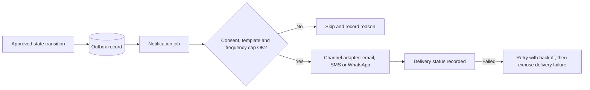

| Aspect | Architecture | Source / decision |
|---|---|---|
| Triggers | Approved state transitions (A14), reminders (A16, A28 P1/C), supplier freshness (A21), approvals and exceptions | BP §12.2 |
| Pre-send checks | Recipient permission/opt-out (E-consent_record), approved templates, WhatsApp 24-hour service window, frequency limits | BP §13.3, A14; T25 |
| Failure | Order stays valid; retry; delivery failure visible | BP §10.3 |
| Records | E-notification (status), E-message_template, E-consent_record | `00-conventions.md` §7 |
| Channels & providers | Email/SMS/OTP (D-015); WhatsApp BSP or Cloud API (D-014); events/templates/caps (D-058) | PR1 §13; BP §13.3 |
| Staff | In-app notifications (MK shells) linked to exception queues; urgent material exceptions paged; others in daily review | BP §12.5, §20.3 |
| Owner | Scheduled digest with freshness labels and drill-down (A19; D-063) | BP §12.2, §12.5 |
| Marketing | Only with separate opt-in; payment reminders kept distinct from debt collection | BP §13.3, §13.5; MK `store-login.html` |
| Mobile push | LATER (D-085) | BP §28.4 |

## 18. Payment architecture (BP §10.2–10.6)

### 18.1 Components

| Component | Records / module | Source |
|---|---|---|
| Payment provider with hosted/approved collection (one at launch) | M23 adapter; D-012 | BP §10.6 |
| Payment attempts linked to orders (create or reuse) | E-payment_attempt (M11) | BP §10.2 step 3 |
| Provider events (webhooks) stored once | E-payment_event (M11) | BP §10.2 step 5 |
| Refunds | E-refund (M11) | BP §10.1, §10.3 |
| Settlements and matching | E-settlement_record (M11); A10; D-064 | BP §12.2 |
| Reconciliation jobs | M11 + M17 | BP §10.2 step 8 |
| Finance workspace | P-E12 (attempts, webhook events, settlement reconciliation, refunds, COD remittance, accounting export & GST series, daily close — MK tabs) | MK `erp-finance.html` |

### 18.2 Webhook processing

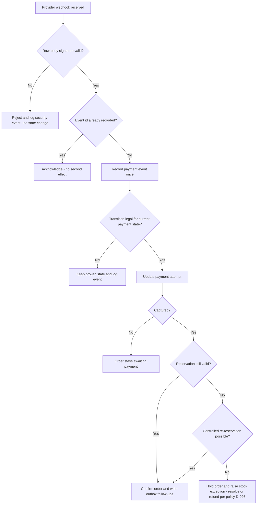

Sources: BP §10.2, §10.3 ("Failed event arrives after captured: do not downgrade"; "Payment succeeds after
reservation expiry: attempt controlled re-reservation; otherwise hold and resolve/refund under policy"), §17.4, §29.6,
S09. Tests: T07, T08, T09.

### 18.3 Rules

| # | Rule | Source |
|---|---|---|
| 1 | Never store card details; never trust a browser success message alone | BP §10.2, §10.6 |
| 2 | Verify server-side status (query) in addition to callbacks; reconcile missing/delayed callbacks | BP §10.2 steps 4, 8 |
| 3 | Captured-but-unconfirmed payments are monitored and become Finance exceptions | BP §12.5, §20.3 |
| 4 | Refunds: authority per BP §18.1 (D-024); submit via outbox; on timeout query existing refund before issuing another | BP §10.3; T18, T19 |
| 5 | Refunded ≤ refundable captured; partial cancellation refunds the allocated amount once; original allocated discount/tax used | BP §8.4, §10.3, §17.6; D-082 |
| 6 | Worker crash after sending a request: reconcile by provider reference before retrying an irreversible action | BP §10.3 |
| 7 | COD only if D-020 approves: eligibility, remittance reconciliation, RTO handling, abuse controls | BP §10.6 |
| 8 | Payment data never logged | BP §19.1 |

## 19. Integration architecture (BP §16.4)

Every integration is an adapter in M23 with a completed contract before go-live: **authentication, entity mapping,
source of truth, external identifiers, event schema/version, retries, timeouts, rate limits, idempotency,
reconciliation, support owner** (BP §16.4). MK `erp-admin.html#integrations` shows this as a checklist plus a tested
fallback and sandbox access.

| Integration | Minimum behaviour (BP §16.4) | Fallback (BP §16.4) | Module | Decision | Phase |
|---|---|---|---|---|---|
| Payment | Capture/refund events and status query | Reconciliation queue; no client-only success | M11 | D-012 | 1A |
| Shipping | Serviceability, booking, label, tracking | Controlled manual booking with reference capture | M12 | D-013 | 1A |
| Accounting | Approved invoice/credit/payment export | Signed-off file export and control totals | M19 | D-011 | 1A |
| Supplier | Versioned product/availability feed | Validated import and freshness limits | M04, M06, M14 | D-057, D-028 | 1B (import) |
| WhatsApp | Inbound messages, approved outbound messages, delivery state | Website/email/support handoff | M16, M20 | D-014 | 1A L1 / 1B L2 |
| Legacy ERP/POS | Authoritative stock/orders through a supported interface | Segregated allocation or supervised entry; not uncontrolled dual-write | M23, M06, M25 | D-009, D-030 | transitional |
| Email / SMS / OTP (not in the BP §16.4 table; listed in PR1 §13) | Send, delivery status | Not specified in BP; MK sample: queue and retry, in-app notification | M20, M02 | D-015 | 1A |

Integration rules: one provider each at launch (BP §10.6); feature flags per integration or customer group (BP
§20.5); integration events logged (E-integration_event); courier statuses mapped to canonical states with raw
events kept (BP §10.5); no indefinite dual live ledgers with legacy (BP §21.3); secrets per D-107.

## 20. Background processing

### 20.1 Job categories

| Category | Examples | Trigger | Checkout-affecting? | Source |
|---|---|---|---|---|
| Outbox follow-ups | A04 availability refresh, A11 fulfilment release, A13 courier booking, A14 notifications, A26 accounting export | Business transaction commit | A04 and payment/reservation processing: yes | BP §12.2, §16.3 |
| Scheduled rules | A06 reservation expiry, A16 fulfilment chase, A17 replenishment suggestion, A19 owner digest, A21 stale supplier stock, A36 margin leakage | Schedule/threshold | A06: yes | BP §12.2 |
| Imports / exports | A01 supplier import, A02 media import, M18 exports, M25 migration | User action / schedule | No (must not starve checkout) | BP §7.4, §14.4, §20.2 |
| Reconciliation | Payment attempts (§10.2 step 8), A10 settlements, A26 control totals, availability projection reconciliation (A04) | Schedule | Payment: yes | BP §10.2, §12.2 |
| Monitoring | A38 import/sync failure monitor | Retry cap exhausted | — | BP §12.2 |

Launch selection: D-078. Each selected automation completes the BP §12.3 template (business problem, owner, trigger,
inputs, preconditions, action, idempotency, failure behaviour, human boundary, audit, notification, KPI,
disable/rollback).

### 20.2 Transactional outbox (BP §16.3)

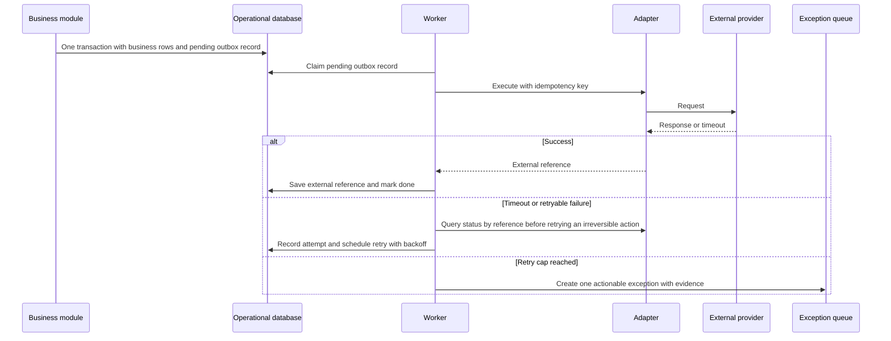

A durable scanner picks up committed outbox records even if an in-process enqueue was lost in a crash (BP §16.3; T21).

### 20.3 Rules

| # | Rule | Source |
|---|---|---|
| 1 | Use the selected core's worker/queue (Frappe workers + Redis if ERPNext); no additional broker | BP §15.4, §15.6 |
| 2 | Every job has an idempotency key (MK pattern: rule + entity + version); repeats are logged "skipped · duplicate" | BP §12.3; MK |
| 3 | Retries with backoff and a retry cap; values per automation (D-078) / integration contract (BP §16.4); MK values are samples | BP §16.3 |
| 4 | After the cap: stop for that entity, raise one exception per job + entity (A38), no alert storms | BP §12.2 (A16, A38) |
| 5 | Each job attempt is recorded (E-job_attempt) with outcome and evidence | BP §12.3, §14.3 "Automation health" |
| 6 | Rules can be disabled; incident containment can stop checkout-affecting automation while provider events are stored for replay after reconciliation | BP §12.3, §20.4; MK `erp-automation.html` |
| 7 | Heavy jobs are isolated from checkout capacity (queue/worker separation within the platform); a separate background service only on trigger | BP §20.2, §28.5; T35 |
| 8 | Enabling a rule requires a staging dry run and owner approval (MK) | MK; BP §20.5 |

## 21. Logging and observability (BP §20.3)

| Signal | Why it matters | Alert policy | Source |
|---|---|---|---|
| Application errors | Checkout/shopping failures | Page if customer/revenue risk | BP §20.3 |
| Latency | API p95 and page experience targets | Daily review unless severe | BP §20.1, §20.3 |
| Worker queue age, retries, failures | Durable work stuck | Page for checkout-affecting queues | BP §20.3 |
| Provider failures | Payment/courier/WhatsApp degradation | Exception + page if checkout affected | BP §20.3, §16.4 |
| Database health, storage capacity | Platform stability | Page when at risk | BP §20.3 |
| Stock projection lag | Browse accuracy (≤60 s proposal) | Page if sustained | BP §20.1, §20.3 |
| Expired reservations | Reservation/payment races | Daily review / exceptions | BP §20.3 |
| Captured-but-unconfirmed payments | Money taken without confirmed order | Page | BP §20.3, §12.5 |
| Refund age | Customer harm | Daily review | BP §20.3 |
| Backup status | Recoverability | Page on failure | BP §20.3 |
| Page performance, CWV, checkout completion, search behaviour | Storefront quality | Dashboards | PR2 §3; BP §4; D-106 |

Every alert has an owner; page only for urgent customer, revenue or stock risk; everything else goes to a daily review
(BP §20.3). Thresholds: REQUIRES_DECISION (D-052, D-034) — MK thresholds are samples. Capabilities: structured
logs, error capture, uptime/synthetic checks, job-health checks (BP §15.4, §20.1; tools D-052). Logs never contain
passwords, payment data, sensitive identity documents, complete chat content or tokens (BP §19.1). Business audit
events (E-audit_event) are separate from operational logs and follow D-036 retention.

## 22. Error handling

### 22.1 Failure handling (BP §10.3)

| Failure | Required response (BP §10.3) | Mechanism | Tests |
|---|---|---|---|
| Two buyers compete for last unit | One reservation succeeds; the other gets an accurate message | Reservation in core transaction with lock | T04, T05 |
| Buyer double-clicks pay/order | Idempotency key returns the existing result | Idempotency record | T06 |
| Same key, different basket | Reject conflicting reuse; earlier order unchanged | Request fingerprint comparison | `16-testing.md` |
| Payment succeeds after reservation expiry | Controlled re-reservation, else hold and resolve/refund | §18.2 flow; D-026 | T09 |
| Callback delivered twice | One transition, one fulfilment task, no duplicate invoice | Event dedup + idempotent transitions | T07 |
| Failed event after captured | Do not downgrade | Legal-transition check | T08 |
| Worker crashes after sending request | Reconcile via provider reference before retrying irreversible action | Outbox + status query | T20, T21 |
| Payment captured but application unavailable | Durable provider events/reconciliation recover state | Reconciliation job | `16-testing.md` |
| Stock system unavailable | Stop confirmation or use explicitly segregated allocation; do not guess | Checkout blocked / incident mode | `16-testing.md` |
| Notification fails | Keep order valid; retry; expose delivery failure | §17 flow | `16-testing.md` |
| Refund request times out | Query existing refund before issuing another | Outbox + status query | T19 |
| Partial cancellation | Release only affected reservation; refund allocated amount once | §5.4 | T34 |

### 22.2 Exception queues (BP §12.5)

Each E-exception_case carries: entity reference, severity, age, assigned role/person, due time, evidence, recommended
allowed actions, escalation path, resolution reason (BP §12.5). Exception types and source modules: overdue dispatch
(M12), stock mismatch (M06), payment captured without confirmation (M11/M10), refund failure (M11), purchase variance
(M07), low-margin override (M05), stale vendor data (M14/M06), unresolved return (M13), failed integration (M23/M17),
expired approval (M17).

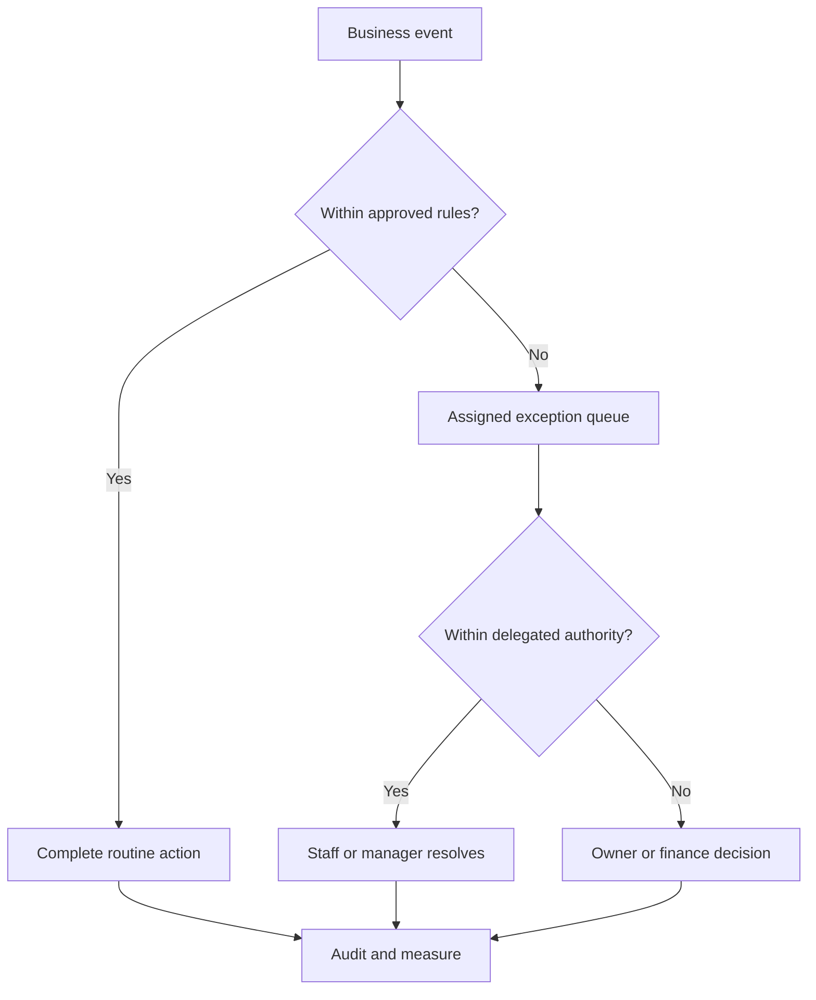

### 22.3 User-facing error states (BP §6.3)

Cart: changed price, stock shortage, minimum quantity failure. Checkout: failed payment, expired reservation, duplicate
submission. Confirmation: payment verification pending (no false success). Orders: partial shipment, cancellation
requested, refund pending. Returns: outside policy, serial mismatch, warranty route. Dealer account: pending,
rejected, suspended, approval expired. Help: outside hours, bot failure, human handoff. Error envelope format: D-080.

### 22.4 Incident handling (BP §20.4)

Detect and classify (shopping, checkout, stock, payments, fulfilment, data exposure) → assign owner → contain (stop
affected checkout or automation) → preserve evidence and reconcile provider events/stock before retrying → restore via
approved rollback/recovery → notify through approved channels → reconcile orders, payments, stock and jobs → record
cause and follow-up. Architectural hooks: automation pause/incident mode (§20.3 rule 6), stored provider events for
replay, reconciliation jobs, runbooks in `infra/`.

## 23. Security architecture

### 23.1 BP §19.1 controls

| Requirement (BP §19.1) | Architectural control | Modules | Decisions | Tests |
|---|---|---|---|---|
| Supported authentication; rate limits; secure session handling | §8 | M02 | D-040, D-083, D-084 | `16-testing.md` |
| Server-side authorisation for every business operation | §9; API rules §7.2 | all | D-001 | T10, T11, T13 |
| CSRF for cookie-authenticated mutations; deliberate CORS | §8 | M02, frontends | D-083, D-102 | `16-testing.md` |
| Validate inputs, restrict uploads, scan risky attachments, private files via authorised access | §15 | M22 | D-112, D-113, D-033 | `16-testing.md` |
| Encryption in transit and at rest; secret rotation; separate environment credentials | §24 | M01, M26 | D-107, D-108, D-005 | `16-testing.md` |
| Avoid logging passwords, payment data, identity documents, full chat content, tokens | §21 | M26 | D-052 | `16-testing.md` |
| Dependency updates, vulnerability triage, backups, incident procedures | Maintenance calendar (BP §24.3); §22.4 | M26 | D-108, D-035 | T28 |
| Protect authentication and checkout from abuse | §8 | M02, M10 | D-084 | `16-testing.md` |
| Restrict outbound import requests (SSRF) | §15.3 | M04, M23 | D-057 | `16-testing.md` |
| Tamper-resistant privileged audit evidence | §14 | M02 | D-114 | `16-testing.md` |

### 23.2 OWASP API authorisation tests (S14)

| Threat | Scenario | Test |
|---|---|---|
| Broken object-level authorisation | Vendor edits another vendor's record by changing its id | T11 |
| Broken object-property-level authorisation | Vendor edits a protected approval/warranty field on its own record | T13 |
| Trusting client fields | Customer tampers with price or buyer type | T10 |
| Cross-context data leakage | Dealer signs out, another user browses (cache) | T22 |
| Disclosure through support channel | Chat customer asks for another person's order | T23 |
| Private price exposure | Public user tries to obtain dealer price | T02 |
| Proof scenario | Supplier restricted to own data; staff to assigned permissions | BP §15.3 #9 |

### 23.3 Privacy and data lifecycle

Purpose-based collection and notices; retention matrix (D-036); account deletion separated from retained transaction
records (D-060); production personal data kept out of development; masked extracts only (BP §19.3); compliance
applicability (D-037). AI (Phase 3) gets no unrestricted database access and treats user/vendor content as untrusted
(BP §28.2).

## 24. Deployment architecture

### 24.1 Environments

| Environment | Purpose | Data | Access | Source / decision |
|---|---|---|---|---|
| Production | Live operations | Live | Individually attributable accounts; MFA for privileged; separate credentials | BP §16.6, §19.1 |
| Staging | Release verification, integration sandboxes, UAT | Masked copy (MK sample) | Team + client UAT users | BP §16.6, §20.5, §23.3, §19.3 |
| Development | Development | No production personal data | Team | PR1 §14; BP §19.3 |
| Others (e.g. separate UAT) | — | — | — | REQUIRES_DECISION (D-077) |

### 24.2 Runtime units (deployment-neutral)

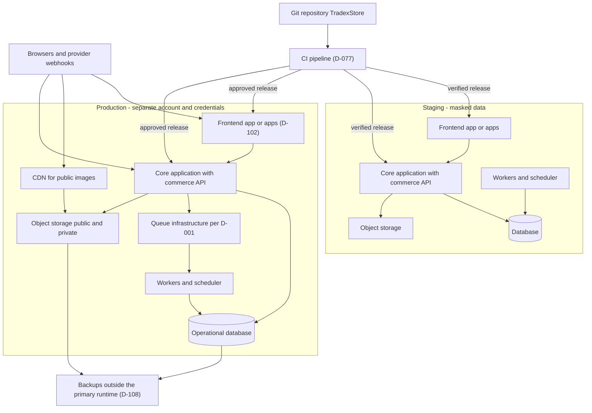

Physical form (managed platform vs simple servers, one host vs several): D-005, D-109. "Start with production and
staging separated, backups outside the primary runtime, TLS, secrets management, monitoring, and the selected core's
supported application/worker/database layout" (BP §16.6). No container orchestration platform (BP §15.6).

### 24.3 Release management (BP §20.5)

Reviewed code; automated critical tests; database migration plan; staging verification; release notes; feature flags
for selected integrations or customer groups; reversible migrations and backward-compatible changes preferred. Change
freezes and maintenance windows (MK samples) → D-077.

### 24.4 Rollback boundaries (BP §20.5, §21.4)

| Situation | Rollback meaning | Rule |
|---|---|---|
| Before real transactions | Restore previous site/routing | BP §21.4 |
| After transactions accepted | Export and reconcile new orders, payments, refunds and stock movements before any restore | BP §21.4 |
| Software release defect | Software rollback does not roll back business transactions; a controlled forward fix is preferred when safer | BP §20.5 |
| Database snapshot restore | Never restore an old stock snapshot and forget later sales; keep audit trail and provider references | BP §21.4 |
| Forward-recovery point | Defined in the cutover plan (M25) and approved at the go-live gate | BP §21.4, §23.4 |

### 24.5 Cutover and ownership

Cutover follows BP §21.3 (trial import, reconciliation, dry run, freeze or delta, final import, verification, channel
switch, supervised transactions, hypercare with legacy read-only). Record cloud account ownership, domain ownership,
billing contact and recovery access in the handover (BP §16.6, §24.2).

## 25. Performance and reliability targets (BP §20.1 — PROPOSED, D-034)

"These are negotiation starting points" (BP §20.1). None is contractual until D-034 is decided.

| Area | Proposed target | Verification | Architectural levers |
|---|---|---|---|
| Web page experience | LCP ≤2.5 s, INP ≤200 ms, CLS ≤0.1 at p75 (desktop/laptop in Phase 1) | Lab tests before launch; field data later (D-106) | Server-rendered public pages, image variants (D-113), CDN, limited third-party scripts |
| Internal catalog/quote API | p95 ≤500 ms under agreed normal workload, excluding provider wait | Load test + telemetry | Projections for browse, bounded queries, workload isolation |
| Stock browse propagation | ≤60 s starting proposal | Timestamped movement-to-display test | A04 outbox refresh + reconciliation; D-105 invalidation |
| Checkout stock integrity | Authoritative reservation on every confirmed sale | Concurrency and failure tests | §5.4, §22.1 |
| Availability | 99.5 % monthly for initial affordable deployment (discussion) | Synthetic checks, incident accounting | D-005, D-109 sizing |
| Recovery point | ≤1 h for transactional data if backup/log design supports it | Measured restore point | D-108 |
| Recovery time | ≤4 h for the agreed major scenario | Timed restore exercise | D-108, runbooks |
| Privileged access | MFA and individually attributable accounts | Access review, login tests | §8 |
| Auditability | Every material stock, price, refund, permission change traceable | Sample transaction reconstruction | §5.3 rule 7; D-114 |
| Backup restore | Rehearsal before launch and scheduled thereafter | Restore evidence + reconciliation | D-108; T28 |

Capacity inputs (BP §20.2; D-010): active SKUs, serialised units, images, daily/peak orders, concurrent shoppers,
branch transactions, import batch size, staff sessions, message volume, report size, data growth; use measured peak
and an agreed growth scenario. Test realistic mixtures (browse + images, search, dealer pricing, last-unit
contention, bulk import, staff picking). "A small single-server deployment may not economically satisfy aggressive
availability/recovery targets; choose service levels and infrastructure together" (BP §20.1).

## 26. Architecture decisions still open

| Decision | Architectural impact |
|---|---|
| D-001 Operational core | Backend framework, database, queue, native features, physical data model, commerce API placement, staff UI options |
| D-002 Custom stack (if D-001 = custom) | Language, framework, worker, cache, migration tooling |
| D-003 Storefront framework & versions | `frontend/storefront/` implementation, rendering/caching capabilities |
| D-004 Native vs custom staff screens | Contents of `frontend/workspace/` vs native configuration in `backend/` |
| D-005 Hosting | Region, managed services, capacity, storage encryption |
| D-007 / D-008 Vendor model; seller of record | Order routing, supplier fulfilment tasks, invoicing, warranty ownership |
| D-009 Existing systems | Legacy adapter, coexistence, migration |
| D-010 Volumes | Capacity sizing and load tests |
| D-011 Accounting authority | M19 export vs API |
| D-012 / D-013 / D-014 / D-015 Providers | Adapter implementations, webhook formats, sandbox access |
| D-017 / D-018 / D-016 / D-043 / D-044 Pricing policy | Pricing engine rule set |
| D-020 COD · D-021 Guest checkout | Payment and order-access flows |
| D-026 Reservation expiry / late capture | Scheduler, payment webhook branch |
| D-027 / D-028 / D-029 / D-030 / D-031 / D-073 Stock policies | ATP, allocation, supplier freshness, branch offline, serial reservation, backorders |
| D-032 Search · D-033 Object storage & CDN | M21 engine; M22 storage/CDN |
| D-034 Service levels | Backups, availability design, performance tests |
| D-036 Retention · D-037 Compliance · D-060 Deletion | Data lifecycle, e-invoicing/e-way bill integration, policy pages |
| D-038 / D-039 / D-076 Migration scope, passwords, SEO URLs | M25 tooling, auth cutover, redirects |
| D-040 Auth methods · D-083 Sessions/tokens · D-084 Rate limiting | M02 design, cookie/token scope, abuse controls |
| D-045 / D-046 Multiple businesses; marketplace (LATER) | Boundaries preserved, not built |
| D-048 Launch scope | Whether vendor portal/WhatsApp Level 2 deploy at first launch |
| D-049 / D-050 / D-051 UI sign-off, languages, accessibility scope | Design system, i18n, test scope |
| D-052 Observability tools · D-053 Test tools | `infra/`, `tests/` |
| D-055 Document templates · D-057 Supplier formats/rights · D-058 Notifications · D-063 Owner digest · D-064 Settlement import | Documents, imports, notification catalogue, digest, reconciliation |
| D-077 Environments & release process | CI, extra environments, feature flags, change freezes |
| D-078 Automations for launch | Job catalogue, retry parameters |
| D-079 Idempotency transport · D-080 API conventions | API contracts |
| D-085 Mobile (LATER) · D-086 AI (LATER) | API reuse; AI boundary |
| D-101 Workspace/vendor-portal framework | `frontend/workspace/`, `frontend/vendor-portal/` |
| D-102 Frontend deployables & hostnames | Deployment units, cookie scope, CORS, CDN |
| D-103 Design-system implementation | `frontend/design-system/` |
| D-104 Money representation | Data model, API money format |
| D-105 Public caching & invalidation | Storefront performance vs private-data isolation |
| D-106 Analytics & RUM | Instrumentation, consent |
| D-107 Secrets & TLS · D-108 Backups · D-109 Deployment method | `infra/` |
| D-110 Scanning · D-111 Documents/printing · D-112 Malware scanning · D-113 Image variants · D-114 Audit tamper-resistance | Warehouse UI, document pipeline, upload pipeline, audit store |
| D-115 GitHub Pages publication scope | Must be resolved before implementation code is committed |

## 27. Proposed new decisions

D-101–D-114 are defined in `01-tech-stack.md` §32. This file adds:

| ID | Question | Documented options / proposal (source) | Approver | Blocks |
|---|---|---|---|---|
| D-115 | **Publication scope of the GitHub Pages site once implementation code is added.** The repository root is published by GitHub Pages under the CNAME domain (D-054). Folders added under the published branch (`frontend/`, `backend/`, `infra/`, `tests/`, as well as existing `docs/`, `plan/`) would be downloadable from that site. Should the published content be limited to the mockup before implementation code is committed? | Not specified in the documents. Related sources: D-054 (mockup published via Pages; single repository); BP §19.1 (secrets management, separate environment credentials); BP §23.4 (repository and accounts controlled by agreed owners) | Owner / technical lead | First commit of `frontend/`, `backend/`, `infra/` code (M01 scaffolding) |

## 28. Registry additions requested

None.
