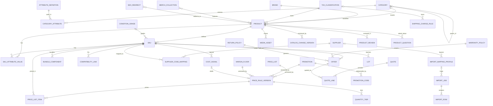
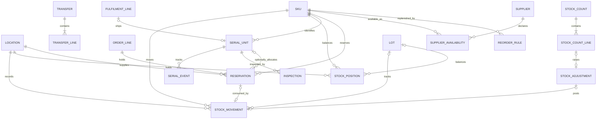
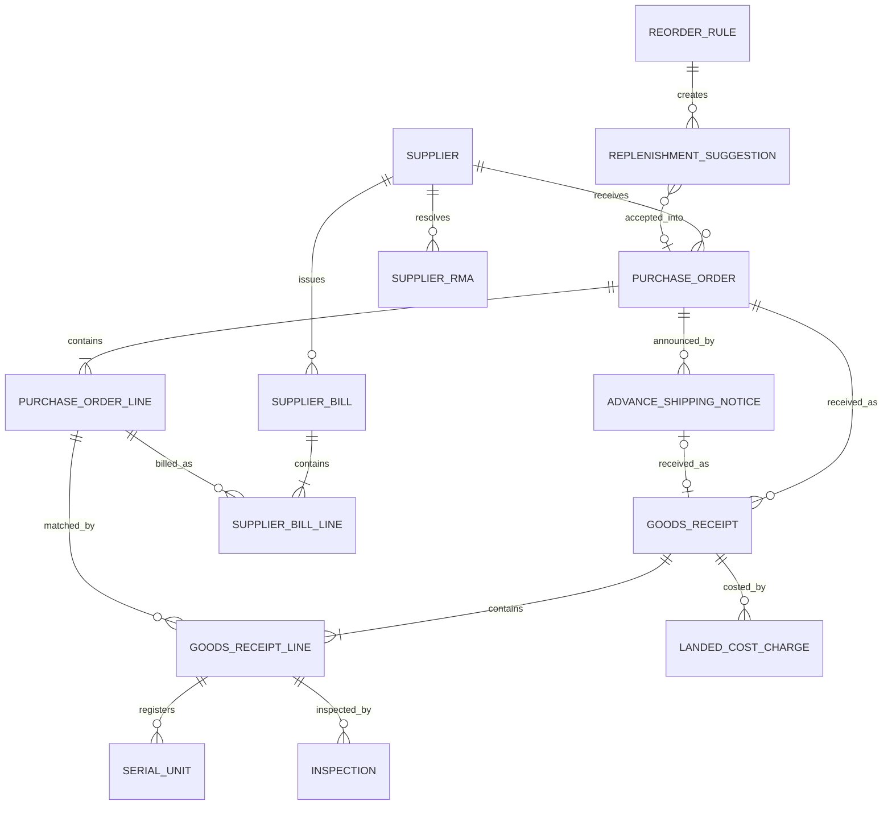
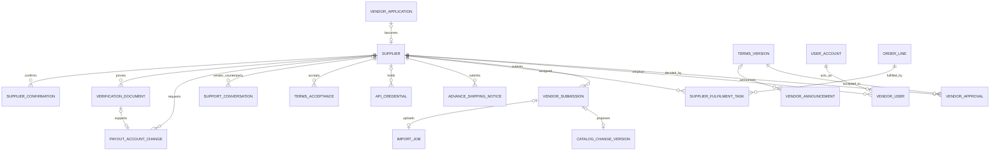
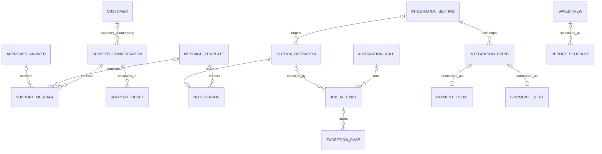
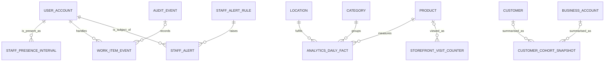

# 03 — Database implementation plan (logical data model)

| Item | Value |
|---|---|
| Purpose | Complete **logical** data model for Tradex: conventions, every registered entity (`00-conventions.md` §7), relationships, migration/dependency order, consistency invariants, seed data, initialisation, validation, retention and open data decisions |
| Scope | Logical design only. **Physical** table names, SQL types, indexes-as-built and native-ERP mapping are `REQUIRES_DECISION (D-001)` — BP §17.2: *"These diagrams express business concepts, not a mandate to duplicate ERP tables. Map each concept to native records, custom fields, or extension records after selecting the core."* |
| Sources used | BP (§3, §6–§14, §16–§21, §23, §27, §29, §30, §33), PR1 (§4, §7–§11, §14), PR2 (§4–§6, §9, §10), MEET, mockup (`erp-*.html`, `store-*.html`, `vendor-*.html`, `assets/tradex.js`) |
| Labels / statuses | Evidence labels and status values exactly as `00-conventions.md` §2–§3. Every entity starts `NOT_STARTED` unless an OPEN business decision blocks it (`REQUIRES_DECISION`) or the blueprint marks it `CONDITIONAL`/`LATER` |
| Code location | Schema migrations, seed scripts and data-migration (M25) scripts live under `backend/` (D-054, `00-conventions.md` §11). Finer structure depends on D-001 / D-002 |
| Author | Plan agent A2 · decisions D-121–D-139 registered in `DECISIONS.md` · registry additions of `00-conventions.md` §7.1 specified in §2.7.8 and §2.21, §7.2 in §2.22 · entity-gap resolutions in "Entity gap resolution (2026-09-27)" |

Reading guide: §1 conventions → §2 entity specifications (by module, registry order) → §3 ER diagrams → §4 dependency and
migration order → §5 invariants → §6 seed data → §7 initialisation → §8 validation → §9 lifecycle/retention → §10 open
decisions → proposed new decisions → registry additions requested.

---

## 1. Conventions

### 1.1 Logical vs physical
| Rule | Source |
|---|---|
| This file defines business concepts, attributes, keys, relationships, states and rules. It does **not** mandate one table per entity. After D-001, each entity is mapped to a native record, a custom field on a native record, or an extension record; the mapping is recorded in the entity's **Physical** note and in `STATE.md`. | BP §17.2 |
| Do not update core tables directly to bypass validations; use the core's documented transaction mechanisms and locks. | BP §16.3 |
| One stock ledger and one price authority; no parallel "correct" quantity outside the stock authority. | BP §9.1, §15.6 |
| If D-001 = custom backend, PostgreSQL is the documented database (BP §15.5, D-002). If D-001 = ERPNext, use the ERPNext-supported database/version ("usually MariaDB"; do not introduce PostgreSQL by preference into an unsupported ERP setup) (BP §15.4). | BP §15.4, §15.5 |

### 1.2 Logical types
| Type | Meaning | Documented constraint | Source | Open item |
|---|---|---|---|---|
| `id` | Internal identifier of a record | Immutable; never reused; distinct from display SKU / business numbers | BP §7.2 ("immutable internal identifier") | Generation strategy & physical type: D-123, D-001 |
| `docno` | Human-readable business document number (order, PO, GRN, RMA, transfer, quote, refund, count, invoice, credit note) | Unique within its series. Fiscal (invoice / credit-note) series follow D-055; mockup shows them "gapless, never reused" (MK:erp-finance.html#export, MOCKUP) | BP §14.2 (invoice series) | Non-fiscal formats: D-123. Mockup prefixes (`TXO-`, `PO-2026-`, `GRN-`, `RMA-`, `TR-`, `CC-`) are samples |
| `code` | Short stable business key (role code, location code, attribute key, template name) | Unique within stated scope | design | — |
| `text` / `longtext` | Single-line / multi-line text | Lengths not specified → physical (D-001). Values exported to CSV are neutralised against spreadsheet formula injection | BP §14.4 | — |
| `int` | Integer (counts, sequence numbers, version numbers) | — | — | — |
| `qty` | Quantity in the SKU's unit of measure | Non-negative except signed movement deltas | BP §9.2 | Fractional quantities / pack conversions: D-127 |
| `money` | Monetary amount (always with a currency on the owning document) | **Fixed decimal or integer minor units, not floating point** | BP §8.1 | Which of the two + precision + rounding: **D-104** (proposed in `01-tech-stack.md`). Currency INR is a planning assumption: D-059 |
| `rate` | Percentage / ratio used in money calculations (tax rate, discount %, margin floor) | Exact decimal; no binary floating point in money calculations | BP §8.1 (derived) | Precision: D-104 |
| `bool` | True/false | — | — | — |
| `date` | Business calendar date (invoice date, valid-from, needed-by) | Report event dates are distinct (order, payment, invoice, dispatch, settlement) | BP §14.4 | Business-day timezone: **D-124** |
| `ts` | Instant in time | — | BP §17.3 | Storage timezone convention: **D-124** |
| `enum{…}` | Closed value set; codes are `lower_snake` | Values and their source are listed per entity | — | Extensions not in sources: D-139 |
| `ref(E-x)` | Reference to another entity's `id` | Referential integrity enforced by the core | BP §17.1–17.2 | Mechanism: D-001 |
| `refset(E-x)` | Set of references (e.g. permitted categories) | — | BP §11.1 | Physical: child/junction records or native multi-select (D-001) |
| `polyref` | Reference to one of several entity types, stored as (`<name>_type`, `<name>_id`) | Type values are registry entity names | design (audit, attachments, exceptions, approvals, movement source documents) | — |
| `struct` | Structured document (JSON-like): snapshots, before/after values, checklist results, raw provider payloads | Carries a schema/version where the source requires it (event schema/version) | BP §16.4, §17.3 | Physical: D-001 |
| `file` | Reference to a stored object via `E-attachment` or `E-media_asset`; binaries are not stored in business records | Private/public storage by data class; private files served through authorised access | BP §15.4, §19.1 | Provider: D-033 |
| `hash` | Fingerprint (idempotency request fingerprint, import row hash) | — | BP §10.3, §7.4 | Algorithm: D-001/D-002 |
| `secret_ref` | Pointer to a secret held in secrets management | Secret values are never stored in business records or logs | BP §16.6, §19.1; MK:erp-admin.html#integrations ("Secrets are write-only") | Tooling: D-005/D-052 |

### 1.3 Common field groups (BP §17.3)
BP §17.3: *"Store `created_at`, `updated_at`, responsible actor, entity/company scope, source channel, external
reference, and optimistic concurrency version where useful."* Entity tables reference these groups instead of repeating them.

| Group | Fields | Type / rule | Applies to |
|---|---|---|---|
| `[AUD]` | `created_at`, `updated_at`, `created_by`, `updated_by` | `ts` required; actors are `ref(E-user_account)`. Automated actions use the acting integration/automation account (R-integration, BP §3.1) and, where applicable, an `E-job_attempt` reference | Every mutable entity (append-only entities carry `created_at`/`created_by` only) |
| `[CO]` | `company_id` | `ref(E-company)` required | Every business-document and master-data entity scoped to a selling/operating company (BP §3.3 "Store those relationships explicitly"; §8.1 step 1 "selling company") |
| `[CH]` | `source_channel` | `enum{web, whatsapp, assisted, branch_pos, erp_staff, vendor_portal, import, integration, system}`; `mobile_app` added in Phase 2 (`LATER`, D-085) | Records created through several entry points (BP §17.5 "channel is validated against the authenticated entry point"; §9.1 channels) |
| `[EXT]` | `external_reference`, `external_system` | `text`; identifier in an external system (provider, legacy, accounting) | Records exchanged with integrations or migrated (BP §16.4 "external identifiers"; §21.2 retain provider IDs) |
| `[VER]` | `row_version` | `int`, incremented on every update; writes carrying a stale version are rejected | Where the sources require an expected version (approval decision BP §17.4; quote version BP §17.5) — listed per entity. Any wider use: **D-125** |

Channel for sales orders is the narrower `order_channel` enum in `E-sales_order`.

### 1.4 Audit rules
| Rule | Source |
|---|---|
| Every material stock, price, refund and permission change must be traceable → writes an `E-audit_event` with actor, time, object, action, before/after values (or structured change), reason, and approval/delegation references. | BP §20.1, §17.3, §14.3 "Audit export"; PR2 §9 |
| Every material override has an actor, reason and authority trail. | BP §17.6 |
| Record *why* an approval was required, not just that someone clicked Approve. | BP §18.2 |
| Audit records have access restrictions and a retention policy (D-036). Audit evidence is tamper-resistant "according to the selected platform's capabilities" (D-001; mechanism proposed as D-114 in `01-tech-stack.md`). Mockup shows hash-chained, append-only audit with "viewing the log is itself logged" (MK:erp-admin.html#audit, MOCKUP). | BP §17.3, §19.1 |
| Automation audit: actor, time, input version, decision reason, outcome. | BP §12.3 |
| Do not log passwords, payment data, sensitive identity documents, complete chat content or tokens in audit/log payloads; store references instead. | BP §19.1 |
| Revealing masked sensitive values (e.g. full manufacturer serial) is logged with actor, time and reason (MK:erp-inventory.html#serials; MK:erp-customers.html "every reveal is logged"); which fields/roles/reasons: D-153. | BP §18.2 "sensitive-field restrictions"; MOCKUP |

Audited entity lists are given per entity (**Audit** line). "Audited" = create/update/state change produces `E-audit_event`.

### 1.5 Deletion, append-only and versioning
| Class | Rule | Source |
|---|---|---|
| Ledgers and event records (`E-stock_movement`, `E-serial_event`, `E-payment_event`, `E-shipment_event`, `E-integration_event`, `E-job_attempt`, `E-audit_event`, `E-consent_record`, `E-notification` delivery history) | **Append-only.** Never edited or deleted in normal operation; corrections are new reversing/compensating records with reason and approver | BP §9.6 ("Never fix a discrepancy by silently overwriting a quantity field"), §17.6 ("Stock movement history reconciles to current balances"), §10.5 ("preserve the raw event"); MK:erp-inventory.html#movements ("Movements are never edited or deleted — corrections are posted as reversing entries") |
| Versioned rule/content records (`E-catalog_change_version`, `E-price_rule_version`, `E-warranty_policy`, `E-return_policy`, `E-terms_version`, `E-approved_answer`, `E-message_template`, `E-configuration_version`, `E-condition_grade` rubric) | A published version is immutable; a change creates a new version; historical documents reference the version in force | BP §7.3, §8.1, §11.3, §13.4, §27.2 ("Versioned by product/condition"), §17.3 |
| Financial and statutory records (orders, invoices, refunds, payment records, warranty evidence) | Must not be destroyed by customer deletion; personal fields may be de-linked/anonymised after retention | BP §19.3 |
| Master data (products, suppliers, users, vendors, locations) | Deactivate / suspend / archive rather than remove while referenced (PR1 §11 "activate/deactivate vendors, products, users"; BP §11.1 suspended vendor history remains accessible) | PR1 §11, BP §11.1 |
| Everything else (drafts, sessions, carts, temporary imports) | Soft vs hard delete **not specified** → **REQUIRES_DECISION (D-122)** | — |

### 1.6 Naming
| Item | Convention |
|---|---|
| Entity | `E-<snake_case>` exactly as `00-conventions.md` §7 |
| Primary key | `<entity>_id` (e.g. `sku_id`) of type `id` |
| Foreign key | `<referenced entity>_id`; role-qualified when ambiguous (`from_location_id`, `approved_by`) |
| State column | `state` for business state machines; separate columns per independent process (BP §10.1 "Do not implement a single status field that tries to represent all five processes") |
| Enum codes | `lower_snake` versions of the source labels (BP "Awaiting payment" → `awaiting_payment`) |
| Snapshot columns | Suffix `_snapshot` (`struct`) for values frozen at transaction time (BP §8.1, §17.6) |
| Physical names | REQUIRES_DECISION (D-001); ERPNext DocType names or SQL table names are assigned after D-001 |

### 1.7 Personal-data and retention classification
Per-field classification used in every entity's **PD** line (feeds §9 and D-036):

| Code | Class | Examples | Handling source |
|---|---|---|---|
| PD0 | Not personal | SKU, price, stock quantity | — |
| PD1 | Personal contact / profile | name, phone, email, address, GSTIN of an individual buyer | BP §19.2 "Purpose-based collection … access control, retention and rights"; masked in staff UI by default (MK:erp-customers.html) |
| PD2 | Sensitive identity / financial | PAN, identity/verification documents, bank/payout details | BP §19.1 (do not log sensitive identity documents), §18.1 maker-checker for payout; every view logged (MK:erp-admin.html retention matrix, MOCKUP). Field-level protection at rest: D-130 |
| PD3 | Content / evidence | chat transcripts, customer photos/videos, inspection photos | BP §19.1 (do not log complete chat content), §10.5 "Retain evidence for disputes without collecting unnecessary personal data" |
| PD-R | Restricted linkage | full manufacturer serial of a sold unit, order access tokens | BP §13.4 "Verify order access before revealing … serials"; MK masks serials with audited reveal |
| SEC | Secret | password hashes, API keys, provider secrets | BP §19.1, §21.2 "No plaintext passwords"; never exported or logged |

Retention classes (BP §19.3 list): `RC-account`, `RC-order`, `RC-invoice`, `RC-warranty`, `RC-chat`, `RC-identity`,
`RC-log`, `RC-backup`, plus `RC-operational` (non-personal operational data). Periods: **D-036**.

### 1.8 Entity specification template
Each entity below gives: **header line** (module · evidence · phase · status · sources), purpose, column table
(`Column | Type | Req | Default | Constraints | Source`), then **Keys** (PK/FK), **Relationships** (cardinality),
**Unique / indexes**, **State**, **Audit**, **PD**, **Physical**.

- `Req`: `Y` required · `N` nullable · `C` conditionally required (condition in Constraints).
- `Default` is filled only when a source specifies one (e.g. dealer `payment_terms = prepaid`, BP §8.3) or it is the entry state of a documented state machine / a zero counter; otherwise `—`.
- Indexes listed are only those implied by documented uniqueness or lookups; any other index is REQUIRES_DECISION (D-001, sized with D-010).
- Column sources without a label are `DOCUMENTED`; mockup-derived columns are marked `MOCKUP` (consistent with documents) or `MOCKUP-ONLY` (+ decision).
- Common groups (`[AUD]`, `[CO]`, `[CH]`, `[EXT]`, `[VER]`) are listed on the **Common** line.

---

## 2. Entity specifications

### 2.1 M02 — Identity, access & audit

#### 2.1.1 E-user_account
**M02 · DOCUMENTED · 1A · NOT_STARTED** — Sources: BP §3.1, §18.2, §19.1, §20.1, §21.2; PR1 §11, §14; MK:erp-admin.html#users, MK:store-login.html.
Purpose: one individually attributable sign-in principal for every actor type (staff, customer, vendor user, integration). BP §18.2 "Do not create shared admin passwords"; §20.1 "individually attributable accounts".

| Column | Type | Req | Default | Constraints | Source |
|---|---|---|---|---|---|
| user_account_id | id | Y | — | PK | BP §7.2 (id rule) |
| account_type | enum{staff, customer, vendor, integration} | Y | — | Integration accounts cannot sign in interactively | BP §3.1 ("Integration account: no interactive general administrator access") |
| display_name | text | Y | — | — | MK:erp-admin.html (invite "Full name") · MOCKUP |
| email | text | C | — | Required if email is a sign-in method (D-040); format-validated | MK:store-login.html, erp-admin.html · D-040 |
| mobile | text | C | — | Required if phone OTP is a sign-in method (D-040); E.164-style validation REQUIRES_DECISION (D-040) | MK:store-login.html ("Mobile number"), erp-admin.html ("Mobile (for OTP fallback)") |
| password_hash | text (SEC) | N | — | Never plaintext; migration per D-039 | BP §21.2 ("No plaintext passwords") · D-039, D-040 |
| mfa_enrolled | bool | Y | — | Must be true before a privileged role becomes effective | BP §18.2, §20.1 |
| mfa_method | enum | N | — | Values REQUIRES_DECISION (D-040); mockup samples "Authenticator app / Security key" | MK:erp-admin.html · D-040 |
| state | enum{invited, active, suspended, deactivated} | Y | — | Deactivation revokes sessions and keeps history | PR1 §11 (activate/deactivate users); MK:erp-admin.html · MOCKUP |
| invited_by | ref(E-user_account) | N | — | — | MK:erp-admin.html · MOCKUP |
| access_expires_at | ts | N | — | Seasonal/temporary staff | MK:erp-admin.html ("Access expires (optional)") · MOCKUP |
| last_sign_in_at | ts | N | — | — | MK:erp-admin.html ("Last sign-in") · MOCKUP |
| support_availability | enum{available, busy, away} | N | — | Support agents only; routing of new conversations | MK:erp-support.html · MOCKUP · D-074 |

- **Common:** `[AUD]`, `[EXT]` (legacy account id for migration, BP §21.2).
- **Keys:** PK `user_account_id`.
- **Relationships:** 1—* `E-user_role_assignment`; 0..1—1 `E-customer` (customer.user_account_id); 0..1—1 `E-vendor_user`; 1—* `E-audit_event` (as actor); 1—* `E-user_session` (D-083), `E-api_credential` (integration accounts), `E-invitation` (as inviter).
- **Unique / indexes:** sign-in identifier (email and/or mobile) unique among non-deactivated accounts — scope (global vs per account_type) REQUIRES_DECISION (D-040). Lookup by identifier at sign-in (implied by BP §19.1 authentication).
- **State:** as above; transitions audited.
- **Audit:** create, state change, MFA change, identifier change (MK:store-account.html "Change mobile number" requires codes to both numbers — MOCKUP).
- **PD:** display_name, email, mobile = PD1; password_hash = SEC. Retention `RC-account` (D-036); deletion workflow D-060.
- **Physical:** D-001 (native user record vs extension). Sessions: `E-user_session` (CONDITIONAL, D-083).

#### 2.1.2 E-role
**M02 · DOCUMENTED · 1A · NOT_STARTED** — Sources: BP §3.1, §18.1, §18.2; PR1 §11; PR2 §9; `00-conventions.md` §9.

| Column | Type | Req | Default | Constraints | Source |
|---|---|---|---|---|---|
| role_id | id | Y | — | PK | — |
| code | code | Y | — | Unique; values = role registry IDs (`R-owner` …) | 00-conventions §9 |
| name | text | Y | — | — | BP §3.1 |
| audience | enum{staff, customer, vendor, integration} | Y | — | Role assignable only to accounts of this type | BP §3.1 |
| privileged | bool | Y | — | Privileged roles require MFA and a second approver to assign | BP §18.2; MK:erp-admin.html ("Privileged roles need a second approver and app-based MFA") |
| description | longtext | N | — | — | — |
| state | enum{active, retired} | Y | — | Retired roles cannot be newly assigned | design |

- **Common:** `[AUD]`. **Keys:** PK `role_id`. **Relationships:** 1—* `E-role_permission`; 1—* `E-user_role_assignment`.
- **Unique / indexes:** `code` unique.
- **Audit:** all changes (permission change = material, BP §20.1).
- **PD:** none. **Physical:** D-001 (native Role). Business-account member roles are not E-role rows (see `E-business_account_member`, D-066); vendor-organisation roles: D-137.

#### 2.1.3 E-permission
**M02 · DOCUMENTED · 1A · NOT_STARTED** — Sources: BP §18.1, §18.2, §19.1 ("Enforce authorisation on the server for every business operation"), §17.4.

| Column | Type | Req | Default | Constraints | Source |
|---|---|---|---|---|---|
| permission_id | id | Y | — | PK | — |
| code | code | Y | — | Unique; one per business operation (e.g. `stock.adjustment.request`); catalogue in `07-auth-roles-permissions.md` | BP §19.1, §17.4 ("business contracts, not direct ERP CRUD permissions") |
| module | code | Y | — | Module ID `M##` | 00-conventions §6 |
| description | longtext | N | — | — | — |
| sensitive | bool | Y | — | Marks high-risk / sensitive-field operations (separation of duties, logging) | BP §18.2 |

- **Common:** `[AUD]`. **Keys:** PK. **Unique:** `code`. **Audit:** all changes. **PD:** none. **Physical:** D-001.

#### 2.1.4 E-role_permission
**M02 · DOCUMENTED · 1A · NOT_STARTED** — Sources: BP §18.1, §18.2 ("least privilege, record-level scope"), §3.1 (restricted information per actor).

| Column | Type | Req | Default | Constraints | Source |
|---|---|---|---|---|---|
| role_permission_id | id | Y | — | PK | — |
| role_id | ref(E-role) | Y | — | — | — |
| permission_id | ref(E-permission) | Y | — | — | — |
| record_scope | enum{own_records, own_business_account, own_vendor, assigned_location, assigned_tasks, company} | Y | — | Scope *type*; scope *values* come from the user's assignment / membership | BP §3.1 ("Own records only", "Own organisation's prices and records", "Assigned locations and tasks"), §18.2 |

- **Keys:** PK; FK role, permission. **Unique:** (role_id, permission_id). **Audit:** all changes (BP §20.1 permission change). **Physical:** D-001. Monetary limits are not here — see `E-discount_authority`, `E-approval_threshold`.

#### 2.1.5 E-user_role_assignment
**M02 · DOCUMENTED · 1A · NOT_STARTED** — Sources: BP §3.1, §18.1 ("Edit permissions … Privileged role"), §18.2; MK:erp-admin.html#users ("Location scope").

| Column | Type | Req | Default | Constraints | Source |
|---|---|---|---|---|---|
| assignment_id | id | Y | — | PK | — |
| user_account_id | ref(E-user_account) | Y | — | account_type must equal role.audience | BP §3.1 |
| role_id | ref(E-role) | Y | — | — | — |
| location_scope | refset(E-location) | C | — | Required when a granted permission has `record_scope = assigned_location` | BP §3.1 ("Assigned branch"), MK:erp-admin.html · MOCKUP |
| valid_from | ts | Y | — | — | design (time-bounded access BP §18.2) |
| valid_until | ts | N | — | — | MK:erp-admin.html ("Access expires") · MOCKUP |
| granted_by | ref(E-user_account) | Y | — | Must hold user-administration permission; user administration separated from warehouse work | BP §18.2 |
| approval_request_id | ref(E-approval_request) | C | — | Required for privileged roles (second approver) | MK:erp-admin.html · MOCKUP; BP §18.2 |
| designations | struct list{designation enum{buyer, designated_reviewer, rule_owner, warehouse_lead, returns_desk, inspector, counter}, scope} | N | — | Assignment qualifiers, never extra roles; values and holders per D-222 / D-081 / D-194 | BP §9.3, A17 (buyer), §18.1 (designated reviewer), §12.3 (owner); `07-auth-roles-permissions.md` §4.3 |
| state | enum{active, expired, revoked} | Y | — | — | design |

- **Common:** `[AUD]`, `[CO]`. **Keys:** PK; FKs as listed. **Indexes:** (user_account_id, state) — authorisation lookup on every operation (BP §19.1). **Audit:** all. **PD:** none. **Physical:** D-001. Permission caches must be invalidated safely on change (BP §16.2).

#### 2.1.6 E-delegation
**M02 · DOCUMENTED · 1A · REQUIRES_DECISION (D-025)** — Sources: BP §12.6, §18.2, §29.7, T31; MK:erp-admin.html#delegation.
Purpose: named, scoped, time-bounded transfer of authority (owner-away) and emergency access with post-event review.

| Column | Type | Req | Default | Constraints | Source |
|---|---|---|---|---|---|
| delegation_id | id | Y | — | PK | — |
| delegation_type | enum{alternate_approver, emergency_access} | Y | — | Emergency access requires approval and post-event review | BP §18.2 |
| delegator_user_id | ref(E-user_account) | C | — | Required for `alternate_approver` | BP §12.6 ("a named alternate has explicit authority") |
| delegate_user_id | ref(E-user_account) | Y | — | ≠ delegator | BP §12.6 |
| scope | struct | Y | — | List of approval types / permissions and limits covered; cannot exceed delegator's own authority; owner-only items not converted to unrestricted access | BP §12.6; MK (checkbox scopes, "Permissions / payouts / secrets" excluded) · MOCKUP |
| valid_from | ts | Y | — | — | BP §18.2 ("time-bounded") |
| valid_until | ts | Y | — | > valid_from; maximum duration REQUIRES_DECISION (D-025) (mockup "max 14 days", "4 hours (maximum)" are samples) | BP §18.2 |
| reason | longtext | Y | — | — | BP §18.2 |
| approved_by | ref(E-user_account) | C | — | Required for `emergency_access` | BP §18.2; MK:erp-admin.html ("Request emergency access … Approver") |
| review_state | enum{not_required, pending, reviewed} | Y | — | `pending` after an emergency window ends | BP §18.2 ("post-event review") |
| reviewed_by / reviewed_at | ref / ts | N | — | — | BP §18.2 |
| state | enum{scheduled, active, ended, revoked} | Y | — | Ends automatically at valid_until | MK:erp-admin.html ("Ends automatically") · MOCKUP |

- **Common:** `[AUD]`, `[CO]`. **Relationships:** decisions taken under a delegation reference it (`E-audit_event.delegation_id`, `E-approval_request.delegation_id`) — MK "each is tagged delegated in the audit log".
- **Indexes:** (delegate_user_id, state, valid_until) — authority resolution at approval time. **Audit:** all. **Physical:** D-001.

#### 2.1.7 E-audit_event
**M02 · DOCUMENTED · 1A · NOT_STARTED** — Sources: BP §17.3, §17.6, §18.2, §19.1, §20.1, §14.3 ("Audit export: Actor, object, action, before/after, reason"); PR1 §11, §14; PR2 §9; MK:erp-admin.html#audit.
Append-only.

| Column | Type | Req | Default | Constraints | Source |
|---|---|---|---|---|---|
| audit_event_id | id | Y | — | PK | — |
| occurred_at | ts | Y | — | — | BP §14.3 |
| actor_type | enum{user, integration, automation, system} | Y | — | — | BP §3.1, §12.3 |
| actor_user_id | ref(E-user_account) | C | — | Required unless actor_type = system | BP §14.3 |
| action | code | Y | — | e.g. `price_list.approve`, `stock.adjust.post`, `serial.reveal` | BP §14.3 |
| object | polyref | Y | — | Entity type + id | BP §14.3 |
| before_values / after_values | struct | N | — | "before/after values or a meaningful structured change"; secrets/card data/identity documents never stored | BP §17.3, §19.1 |
| reason | longtext | C | — | Required for overrides, approvals, adjustments, reveals, emergency access | BP §17.6, §18.2 |
| approval_request_id | ref(E-approval_request) | N | — | — | BP §17.6 ("authority trail") |
| delegation_id | ref(E-delegation) | N | — | — | MK:erp-admin.html · MOCKUP; BP §12.6 |
| job_attempt_id | ref(E-job_attempt) | N | — | For automated actions | BP §12.3 |
| source_channel | enum (see `[CH]`) | Y | — | — | BP §17.3 |
| client_context | struct | N | — | IP/device | MK:erp-admin.html ("IP · device") · MOCKUP |
| area | code | N | — | Workspace area of the action — the key of the ERP sidebar module it was taken in (orders, fulfilment, returns, support, catalog, pricing, inventory, purchasing, customers, vendors, finance, reports, automation, admin; the set follows the store's workspace modules); null for system, integration and sign-in events. Added 2026-09-30 (DB-G1 addendum, T-1A.2-M02-11) | CF1 §2; MK:erp-team.html (area table, heatmap, feed) · D-282 |
| work_item_ref | polyref | N | — | The work item the action touched (order, fulfilment, RMA, conversation, ticket, product draft, price change, count, adjustment, transfer, PO, GRN, dealer application, vendor submission, payment exception, refund, exception case) where one exists. Added 2026-09-30 (DB-G1 addendum) | CF1 §2; MK:erp-team.html · D-282 |

- **Keys:** PK. **Indexes:** (object_type, object_id, occurred_at) — "all events for this object" and reconstruction (BP §20.1 "Sample transaction reconstruction"); (actor_user_id, occurred_at) and (action, occurred_at) — audit export filters (BP §14.3); since 2026-09-30 (store_id, area, occurred_at) and (store_id, actor_user_id, area, occurred_at) — P-E17 area table, heatmap and activity feed (API-M24-15, API-M24-17).
- **Integrity:** append-only; tamper-resistance mechanism per D-001 / D-114 (mockup hash chain is MOCKUP). Access to audit records is restricted (BP §17.3).
- **PD:** before/after may contain PD1/PD2 values → access restricted; client_context PD1. Retention `RC-log` (audit) — D-036.
- **Physical:** D-001 (native version/activity log vs extension record).

### 2.2 M03 — Organisation & locations

#### 2.2.1 E-company
**M03 · DOCUMENTED · 1A · NOT_STARTED** — Sources: BP §3.3, §8.1 step 1, §14.2, §19.2, §27.3; MK:erp-admin.html#locations ("Company").
Purpose: legal selling/operating entity used on invoices, credit notes, exports and as `[CO]` scope. "A warehouse is not a company" (BP §3.3).

| Column | Type | Req | Default | Constraints | Source |
|---|---|---|---|---|---|
| company_id | id | Y | — | PK | — |
| legal_name | text | Y | — | — | BP §19.2 ("Configurable seller/business details"); MK |
| trade_name | text | N | — | — | MK · MOCKUP |
| tax_registrations | struct | C | — | GST registration(s) and state codes; applicability D-037 | BP §19.2 ("registrations, place-of-supply inputs") · D-037 |
| pan | text (PD0 for a company) | N | — | — | MK · MOCKUP |
| corporate_identifiers | struct | N | — | e.g. CIN | MK · MOCKUP |
| registered_address | struct | Y | — | — | MK · MOCKUP; BP §19.2 |
| base_currency | code | Y | — | INR planning assumption (D-059) | BP §8.1, §27.3 |
| financial_year_start | text (month-day) | N | — | Used by fiscal series and reports | MK ("April – March") · D-055 |
| consumer_disclosures | struct | N | — | Seller details, grievance/complaint contact shown on policy pages; applicability D-037 | BP §19.2; MK ("Grievance officer") |
| state | enum{active, inactive} | Y | — | — | design |

- **Common:** `[AUD]`. **Relationships:** 1—* `E-location`; `[CO]` of most entities. Multiple companies/businesses: `LATER` (D-045); count of legal entities: D-010.
- **Audit:** all (legal data). **PD:** none (business data). **Physical:** D-001 (ERPNext Company candidate).

#### 2.2.2 E-location
**M03 · DOCUMENTED · 1A · NOT_STARTED** — Sources: BP §3.3, §9.2, §9.5, §14.3, R14; PR1 §4 (Warehouse/Branch); MK:erp-admin.html#locations.

| Column | Type | Req | Default | Constraints | Source |
|---|---|---|---|---|---|
| location_id | id | Y | — | PK | — |
| company_id | ref(E-company) | Y | — | — | BP §3.3 |
| code | code | Y | — | Unique within company | MK ("WH-BLR" sample) · MOCKUP |
| name | text | Y | — | — | — |
| location_type | enum{warehouse, branch} | Y | — | — | BP §3.3, §9.5 |
| address | struct | Y | — | Used for serviceability origin and place of supply | BP §19.2 |
| tax_registration | struct | N | — | A branch "may have its own registrations or operational rules" | BP §3.3 · D-037 |
| capabilities | refset(enum{stock_holding, online_dispatch, customer_pickup, branch_sale, returns_receiving}) | Y | — | `customer_pickup` only if D-061 approves; values REQUIRES_DECISION (D-029, D-061) | MK ("Capabilities") · MOCKUP; BP §5.2 (branch sale), §10.5 (pickup if supported) |
| uses_bins | bool | Y | — | If true, stock is held and counted by bin | BP §9.6, §10.4 (scan location); D-010 |
| manager_user_id | ref(E-user_account) | N | — | — | MK · MOCKUP |
| public_details | struct{opening_hours, holiday_hours, public_phone, customer_facing, services} | N | — | Shown on store pages; values are client data (mockup hours are samples) | MK:store-help.html#stores · MOCKUP · D-061, D-142 |
| state | enum{active, inactive} | Y | — | Inactive locations hold no sellable stock | design |

- **Common:** `[AUD]`, `[EXT]` (legacy location code for migration). **Relationships:** 1—* `E-location_bin`; 1—* `E-stock_position`, `E-stock_movement`, `E-reservation`.
- **Unique:** (company_id, code). **Audit:** all. **Physical:** D-001 (ERPNext Warehouse candidate). Seed values: D-010.

#### 2.2.3 E-location_bin
**M03 · DOCUMENTED · 1A · NOT_STARTED** — Sources: BP §9.6 ("Freeze affected bins"), §10.4 ("scan location/SKU/serial"), §26.3 Q21; MK:erp-admin.html#locations ("bins"), MK:erp-inventory.html#counts.

| Column | Type | Req | Default | Constraints | Source |
|---|---|---|---|---|---|
| bin_id | id | Y | — | PK | — |
| location_id | ref(E-location) | Y | — | location.uses_bins = true | BP §9.6 |
| code | code | Y | — | Unique within location; printed as scannable label | MK ("Print labels") · MOCKUP |
| zone | text | N | — | — | MK ("Zone A/B/Q/R/D") · MOCKUP |
| default_disposition | enum (see E-stock_position.disposition) | Y | — | Stock placed in the bin takes this disposition unless a movement states otherwise | MK ("the bin's disposition decides what is sellable") · MOCKUP |
| state | enum{open, frozen_for_count, locked, inactive} | Y | — | `frozen_for_count` blocks movements during a count unless reconciled | BP §9.6; MK ("Locked for picking · count variance") |

- **Common:** `[AUD]`. **Unique:** (location_id, code) — also the scan lookup (BP §10.4). **Audit:** state changes. **Physical:** D-001.

### 2.3 M04 — Catalog

#### 2.3.1 E-category
**M04 · DOCUMENTED · 1A · NOT_STARTED** — Sources: BP §7.1 ("Category schema"), §6.4, §6.8, §7.4, §29.8, T36, R07; PR1 §4; MK:erp-catalog.html#templates.

| Column | Type | Req | Default | Constraints | Source |
|---|---|---|---|---|---|
| category_id | id | Y | — | PK | — |
| parent_category_id | ref(E-category) | N | — | No cycles | MK ("Parent") · MOCKUP |
| name | text | Y | — | — | BP §7.2 |
| slug | text | Y | — | Unique; canonical category URL | BP §6.8 |
| meta_title / meta_description | text | N | — | — | BP §6.8 ("meaningful titles") |
| default_tax_classification_id | ref(E-tax_classification) | N | — | Proposed default for new products | MK ("Default HSN · GST") · MOCKUP |
| default_warranty_policy_id | ref(E-warranty_policy) | N | — | — | MK ("Default warranty") · MOCKUP |
| state | enum{draft, approved, inactive} | Y | — | Imports reject rows referencing unapproved categories | BP §7.4 ("unapproved brands/categories") |

- **Common:** `[AUD]`, `[CO]`. **Relationships:** 1—* child categories; 1—* `E-category_attribute`; 1—* `E-product`.
- **Unique:** `slug`; (parent_category_id, name). **Audit:** all. **Physical:** D-001 (ERPNext Item Group candidate). Adding an ordinary category is configuration, not a new table (BP §7.1).

#### 2.3.2 E-attribute_definition
**M04 · DOCUMENTED · 1A · NOT_STARTED** — Sources: BP §7.1, §7.2 ("label, data type, allowed values, unit …"), §7.4 ("Validate data types and units during import"), §6.4; MK:erp-catalog.html#templates.

| Column | Type | Req | Default | Constraints | Source |
|---|---|---|---|---|---|
| attribute_id | id | Y | — | PK | — |
| key | code | Y | — | Unique; used in import templates and filters | MK ("Label & key") · MOCKUP |
| label | text | Y | — | — | BP §7.2 |
| data_type | enum{text, number, boolean, enum, multi_enum} | Y | — | `number` requires unit when physical quantity; `multi_enum` MOCKUP | BP §7.1 ("Storage capacity numeric; interface enum"), §7.2; MK |
| allowed_values | struct | C | — | Required for enum/multi_enum (value list) and optional for number (range) | BP §7.2; MK ("Allowed values / range") |
| unit | code | C | — | Required for dimensional numbers; imports validate unit | BP §7.2, §7.4 |
| state | enum{active, retired} | Y | — | Retired attributes remain on history | design |

- **Common:** `[AUD]`. **Unique:** `key`. **Audit:** all. **Physical:** D-001 (ERPNext Item Attribute / custom field candidates). "Avoid unstructured free text for fields needed in filters" (BP §7.2).

#### 2.3.3 E-category_attribute
**M04 · DOCUMENTED · 1A · NOT_STARTED** — Sources: BP §7.2 ("required flag, filterable/searchable flag, display order, and category applicability"), §6.4 ("Do not show irrelevant laptop filters on camera products"); MK:erp-catalog.html#templates.

| Column | Type | Req | Default | Constraints | Source |
|---|---|---|---|---|---|
| category_attribute_id | id | Y | — | PK | — |
| category_id | ref(E-category) | Y | — | — | BP §7.2 |
| attribute_id | ref(E-attribute_definition) | Y | — | — | BP §7.2 |
| required | bool | Y | — | Enforced at submission/publish and import | BP §7.2, §7.4 |
| filterable | bool | Y | — | Drives storefront filters | BP §7.2, §6.4 |
| searchable | bool | Y | — | Drives search index fields | BP §7.2, §6.4 |
| display_order | int | Y | — | — | BP §7.2 |
| applies_to | enum{product, sku} | Y | — | `sku` = variant-defining (e.g. RAM/storage) | BP §7.1 ("Variant/SKU: purchasable specification combination"); MK ("Applies to") |

- **Unique:** (category_id, attribute_id). **Audit:** all (schema change). **Physical:** D-001.

#### 2.3.4 E-brand
**M04 · DOCUMENTED · 1A · NOT_STARTED** — Sources: BP §7.2, §7.4 ("unapproved brands"), §11.3 (brand is a sensitive edit); PR1 §4.

| Column | Type | Req | Default | Constraints | Source |
|---|---|---|---|---|---|
| brand_id | id | Y | — | PK | — |
| name | text | Y | — | Unique (case-insensitive) | BP §7.2 |
| state | enum{pending_approval, approved, suspended} | Y | — | Imports and vendor submissions may reference only approved brands | BP §7.4 |

- **Common:** `[AUD]`. **Unique:** name. **Audit:** all. **Physical:** D-001 (ERPNext Brand candidate).

#### 2.3.5 E-product
**M04 · DOCUMENTED · 1A · NOT_STARTED** — Sources: BP §7.1 ("Product: shared commercial identity"), §7.2 core fields, §7.3, §6.8, §17.1; PR1 §4; PR2 §4; MK:erp-catalog.html#editor.

| Column | Type | Req | Default | Constraints | Source |
|---|---|---|---|---|---|
| product_id | id | Y | — | PK (immutable internal identifier) | BP §7.2 |
| title | text | Y | — | — | BP §7.2 |
| brand_id | ref(E-brand) | Y | — | Approved brand | BP §7.2 |
| model | text | Y | — | Exact model searchable | BP §7.2, §6.4 |
| category_id | ref(E-category) | Y | — | Approved category; determines attribute schema | BP §7.2 |
| description | longtext | N | — | Content rights per D-057 | BP §7.2 |
| tax_classification_id | ref(E-tax_classification) | Y | — | Publish blocked if missing | BP §7.2, §7.4 ("missing tax classification") |
| lifecycle_state | enum{draft, submitted, needs_changes, approved, published, suspended, archived} | Y | draft | Transitions per BP §7.3 diagram | BP §7.3; PR2 §4 |
| publication_channels | refset(enum{website_b2c, dealer_b2b, branch_pos, whatsapp, marketplace_feed}) | Y | — | `whatsapp` Phase 1B; `marketplace_feed` `LATER` (D-046) | BP §7.2 ("publication channels"); MK ("Publication channels") |
| live_version_no | int | N | — | Points to the published `E-catalog_change_version` | BP §7.2 ("version"), §11.3 |
| data_erasure_required | bool | Y | — | True for storage-bearing devices; units need erasure evidence before resale | BP §7.2, §7.5; MK ("Required per unit") |
| slug | text | Y | — | Unique; canonical URL | BP §6.8 |
| meta_title / meta_description | text | N | — | — | BP §6.8; MK ("SEO & URL") |
| quality_score | int | N | — | Derived projection of catalog data quality; formula D-173 | MK:erp-catalog.html ("Quality") · MOCKUP |

- **Common:** `[AUD]`, `[CO]`, `[EXT]` (legacy product id, BP §21.2), `[VER]` (edit conflicts — D-125).
- **Relationships:** 1—* `E-sku` (BP §17.1 PRODUCT ||--o{ SKU); 1—* `E-sku_attribute_value` (product-level); 1—* `E-media_asset`; 1—* `E-catalog_change_version`.
- **Unique / indexes:** `slug` unique; (brand_id, model) lookup for duplicate detection on import (BP §7.4 "detect duplicates"). Search indexing per D-032.
- **State:** BP §7.3 — only `published` products with a published offer are purchasable; "unapproved data must not enter the live purchasable catalog".
- **Audit:** all changes; sensitive edits (brand, condition, warranty, tax classification) go through `E-catalog_change_version` review (BP §11.3).
- **PD:** none. **Physical:** D-001 (ERPNext Item / Item template candidate).

#### 2.3.6 E-sku
**M04 · DOCUMENTED · 1A · NOT_STARTED** — Sources: BP §7.1 ("Variant/SKU … refurbished grade B"; "A SKU is not an individual unit"), §7.2, §7.4, §8.1 step 3, §9.4, §33 (SKU); MK:erp-catalog.html#editor ("Variants & SKUs").

| Column | Type | Req | Default | Constraints | Source |
|---|---|---|---|---|---|
| sku_id | id | Y | — | PK | BP §7.2 |
| product_id | ref(E-product) | Y | — | — | BP §17.1 |
| display_sku | code | Y | — | Unique; exact-match searchable | BP §7.2, §6.4 |
| condition_type | enum{new, open_box, refurbished, used} | Y | — | Visibly distinct on storefront | BP §6.1 |
| condition_grade_id | ref(E-condition_grade) | C | — | Required when condition_type ∈ {refurbished, used} (grade rubric D-023); grade's condition_type must match | BP §6.6, §7.1 |
| unit_of_measure | code | Y | — | Values/conversions D-127 | BP §7.2, §8.1 step 3 |
| barcodes | list of text | N | — | Each barcode unique across SKUs (duplicate barcode check) | BP §7.2 ("barcode identifiers"), §7.4 |
| manufacturer_part_number | text | N | — | Duplicate-detection input | MK:vendor-products.html ("MPN") · MOCKUP |
| dimensions | struct{length, width, height, unit} | N | — | Plausibility validated ("impossible dimensions") | BP §7.2, §7.4 |
| weight | struct{value, unit} | N | — | — | BP §7.2 |
| serial_tracked | bool | Y | — | If true every unit is an `E-serial_unit`; which goods are serialised is data per SKU (BP §26.3 Q24) | BP §9.4 |
| manufacturer_serial_capture | enum{required_at_receipt, not_applicable} | C | — | Required when serial_tracked | MK ("Capture at GRN · store masked") · MOCKUP; BP §9.4 |
| is_bundle | bool | Y | — | True only if D-072 approves bundles | BP §7.5 · D-072 |
| lot_tracked | bool | C | — | Only if D-126 enables lot tracking; then every movement carries `lot_id` | BP §9.2, §26.3 Q24 · D-126 |
| reference_price / reference_price_source | money / text | N / C | — | Only if D-166 approves display; source required; never derived to create a discount | MK ("MRP", "% off") · BP §6.1 · D-166 |
| lifecycle_state | enum (same set as E-product.lifecycle_state) | Y | draft | New SKUs follow the same review path | BP §7.3 |

- **Common:** `[AUD]`, `[CO]`, `[EXT]`, `[VER]` (D-125).
- **Relationships:** 1—* `E-offer` (BP §17.1); 1—* `E-serial_unit`, `E-stock_movement`, `E-reservation`, `E-stock_position` (BP §17.2); 1—* `E-sku_attribute_value`; *—* `E-supplier` via `E-supplier_code_mapping`.
- **Unique / indexes:** `display_sku` unique; each barcode unique (BP §7.4); lookup by barcode and display SKU (receiving/picking scans BP §10.4, A03).
- **State:** discontinued SKUs are excluded from replenishment suggestions (A17) — `archived` state (BP §7.3 "Discontinue").
- **Audit:** all; condition/grade changes are sensitive (BP §11.3). **PD:** none. **Physical:** D-001 (ERPNext Item variant candidate).

#### 2.3.7 E-sku_attribute_value
**M04 · DOCUMENTED · 1A · NOT_STARTED** — Sources: BP §7.1, §7.2 ("Typed configurable attributes"), §7.4, §6.4, T36.

| Column | Type | Req | Default | Constraints | Source |
|---|---|---|---|---|---|
| attribute_value_id | id | Y | — | PK | — |
| product_id | ref(E-product) | C | — | Exactly one of product_id / sku_id; must match category_attribute.applies_to | BP §7.1 |
| sku_id | ref(E-sku) | C | — | — | BP §7.1 |
| attribute_id | ref(E-attribute_definition) | Y | — | Attribute must be applicable to the product's category | BP §7.2 |
| value_text / value_number / value_boolean / value_enum | typed | Y (one) | — | Type must equal attribute.data_type; enum values ∈ allowed_values; number within range | BP §7.2, §7.4 |
| value_unit | code | C | — | Required when attribute has a unit; normalised to attribute unit | BP §7.4 ("Validate … units") |

- **Unique:** (product_id|sku_id, attribute_id) for single-valued types. **Indexes:** (attribute_id, value) supports category filters (BP §6.4) — implementation depends on D-032.
- **Audit:** via `E-catalog_change_version`. **Physical:** D-001 (native variant attributes / custom fields / extension table).

#### 2.3.8 E-offer
**M04 · DOCUMENTED · 1A · NOT_STARTED** — Sources: BP §7.1 ("Offer/listing: Seller and commercial terms for a SKU"), §17.1 ("company's own selling identity can be represented as an internal offer owner"), §11.3, §9.4, §9.7, §17.6, §16.2; MK:erp-catalog.html, MK:store-product.html.

| Column | Type | Req | Default | Constraints | Source |
|---|---|---|---|---|---|
| offer_id | id | Y | — | PK | — |
| sku_id | ref(E-sku) | Y | — | SKU must be published for the offer to be purchasable | BP §17.1 |
| owner_type | enum{company, supplier, marketplace_seller} | Y | — | Launch: `company` (supplier-fulfilled offers remain company sales); `marketplace_seller` `LATER` (D-046) | BP §3.2, §17.1 · D-007 |
| owner_company_id / owner_supplier_id | ref | C | — | Per owner_type | BP §17.1 |
| fulfilment_model | enum{company_stock, supplier_fulfilment, marketplace_seller} | Y | — | `supplier_fulfilment` CONDITIONAL pilot (D-007); `marketplace_seller` LATER | BP §3.2 |
| availability_source | enum{company_stock, supplier_availability} | Y | — | `supplier_availability` only under D-073 / D-028 and never shown as company stock | BP §9.7 |
| warranty_policy_id | ref(E-warranty_policy) (specific version) | Y | — | Warranty provider must be explicit | BP §7.1, §6.1, §6.6 |
| return_policy_id | ref(E-return_policy) (specific version) | Y | — | — | BP §6.1, §10.5 · D-022 |
| unit_specific | bool | Y | — | True when unique unit condition/photos are advertised → serial-specific reservation | BP §9.4, §17.2 · D-031 |
| backorder_policy | enum{not_allowed, allowed_with_disclosed_lead_time} | Y | — | Backorders only as an explicit product policy; whether any offer may allow them: D-073 | BP §9.2, §9.7 · D-073 |
| disclosed_lead_time | struct{min_days, max_days} | C | — | Required if backorder allowed or availability_source = supplier_availability | BP §9.2, §9.7 · D-073 |
| channels | refset(enum as E-product.publication_channels) | Y | — | ⊆ product channels | BP §7.2 |
| lifecycle_state | enum{draft, submitted, needs_changes, approved, published, suspended, archived} | Y | draft | Unapproved vendor content cannot become purchasable | BP §7.3, §17.6 |
| live_version_no | int | N | — | Pending version does not replace the live one until approved | BP §11.3 |

- **Common:** `[AUD]`, `[CO]`, `[VER]`.
- **Relationships:** *—1 `E-sku`; 1—* `E-order_line` (BP §17.1 OFFER ||--o{ ORDER_LINE); 1—* `E-price_list_item` (optional offer-level prices).
- **Unique / indexes:** (sku_id, owner_type, owner id, fulfilment_model) for active offers — offer selection policy among several offers is `LATER` (BP §11.4 item 8).
- **Audit:** all; warranty/return policy change is a sensitive edit (BP §11.3, T13).
- **Physical:** D-001 (no direct ERPNext equivalent named in sources; likely extension record). Storefront/search copies are projections (BP §16.2).

#### 2.3.9 E-media_asset
**M04 · DOCUMENTED · 1A · NOT_STARTED** — Sources: BP §7.2 ("image references"), §7.4 (image checks, rights, SSRF), §6.6 (actual photos of unique units), §6.7 ("image descriptions"), §15.4 (public storage + CDN), §21.2 ("optimised variants"), A02; MK:erp-catalog.html (Media), MK:vendor-products.html.

| Column | Type | Req | Default | Constraints | Source |
|---|---|---|---|---|---|
| media_id | id | Y | — | PK | — |
| owner | polyref(E-product, E-sku, E-serial_unit) | Y | — | Unit photos attach to the serial unit | BP §6.6, §7.2 |
| media_type | enum{image} | Y | — | Other types REQUIRES_DECISION (D-057) | BP §7.2 |
| original_file | file | Y | — | Type/size limits validated | BP §7.4 |
| variants | struct | N | — | Generated optimised renditions; method D-113 | BP §21.2, §6.1 ("Optimise images") |
| alt_text | text | C | — | Required before publication (accessibility) | BP §6.7 |
| display_order | int | Y | — | — | design |
| source_type | enum{own_photography, supplier_licensed, manufacturer, imported_url} | Y | — | Scraped marketplace content not permitted | BP §7.4 · D-057; MK ("Image source") |
| source_reference | text | N | — | Licence/agreement reference | MK · MOCKUP |
| import_url | text | N | — | Allow-listed destinations only (SSRF) | BP §7.4, §19.1 |
| rights_confirmed | bool | Y | — | Must be true to publish | BP §7.4; MK (rights checkbox) |
| rights_confirmed_by / at | ref / ts | C | — | Required when rights_confirmed | MK ("Recorded with your name, time and terms") · MOCKUP |
| validation_state | enum{pending, valid, invalid} | Y | pending | Invalid images go to a queue | A02 |

- **Common:** `[AUD]`, `[CO]`. **Indexes:** (owner_type, owner_id, display_order). **Audit:** create/delete/rights change. **PD:** none (unit photos show the device, not the customer). Retention of inspection photos: `RC-warranty` (D-036). **Physical:** D-001 + D-033.

#### 2.3.10 E-tax_classification
**M04 · DOCUMENTED · 1A · REQUIRES_DECISION (D-037)** — Sources: BP §7.2 ("tax classification reference"), §7.4, §8.1 step 5, §19.2 (GST), §11.3 (sensitive); MK:erp-catalog.html#editor ("Tax classification").

| Column | Type | Req | Default | Constraints | Source |
|---|---|---|---|---|---|
| tax_class_id | id | Y | — | PK | — |
| code | code | Y | — | Unique | design |
| description | text | Y | — | — | MK · MOCKUP |
| hsn_code | text | N | — | Validity per accountant | MK ("HSN code") · D-037 |
| tax_rate | rate | Y | — | Values per accountant (mockup 5/12/18/28 % are samples) | MK ("GST rate") · D-037 |
| special_treatment | text | N | — | e.g. refurbished-goods scheme "finance to confirm" | MK · MOCKUP · D-037 |
| effective_from / effective_to | date | Y / N | — | Non-overlapping per code | BP §19.2 (confirm amendments) |
| state | enum{active, retired} | Y | — | — | design |

- **Common:** `[AUD]`, `[CO]`. **Audit:** all (tax change is a sensitive edit). **Physical:** D-001 (ERPNext Item Tax Template candidate). Tax computation rules (place of supply, split components) per finance rules: D-037.

#### 2.3.11 E-condition_grade
**M04 · DOCUMENTED · 1A · REQUIRES_DECISION (D-023)** — Sources: BP §6.1, §6.6 ("client-approved grade rubric … cosmetic condition, functional checks, battery expectations, included accessories, and warranty"), §7.2, §27.1; MK:erp-catalog.html (grade rubric), `assets/tradex.js` (`TX.conditions`, sample).

| Column | Type | Req | Default | Constraints | Source |
|---|---|---|---|---|---|
| grade_id | id | Y | — | PK | — |
| condition_type | enum{new, open_box, refurbished, used} | Y | — | — | BP §6.1 |
| code | code | Y | — | Unique within condition_type | design |
| customer_label | text | Y | — | Text label (not colour alone) | BP §6.7 (non-colour status); MK |
| plain_meaning | longtext | Y | — | "Like new" only if the inspection standard supports it | BP §6.6 |
| rubric | struct{cosmetic, functional, battery, accessories, warranty} | C | — | Required for refurbished/used | BP §6.6 |
| category_scope | refset(E-category) | N | — | Rubric per category | MK ("Grade rubric (Laptops)") · MOCKUP |
| rubric_version | int | Y | — | Immutable once approved | BP §6.6; MK ("rubric v3") |
| state | enum{draft, approved, retired} | Y | — | Only approved grades may be assigned | BP §6.6 |
| approved_by / approved_at | ref / ts | C | — | Required when approved | BP §6.6 ("client-approved") |

- **Unique:** (condition_type, code, rubric_version). **Audit:** all. **Physical:** D-001. Values: D-023.

#### 2.3.12 E-warranty_policy
**M04 · DOCUMENTED · 1A · REQUIRES_DECISION (D-022)** — Sources: BP §6.1, §6.6, §7.2 ("warranty policy version"), §7.5 ("Warranty durations and return windows are separate policy fields"), §27.2, §29.1, T33; MK:erp-catalog.html ("Warranty & returns").

| Column | Type | Req | Default | Constraints | Source |
|---|---|---|---|---|---|
| warranty_policy_id | id | Y | — | PK (one row per version) | — |
| policy_code | code | Y | — | Stable across versions | design |
| version | int | Y | — | Immutable once active | BP §7.2, §27.2 |
| name | text | Y | — | — | — |
| provider_type | enum{manufacturer, company, supplier} | Y | — | Never imply manufacturer when seller provides it | BP §6.6; MK ("Warranty provider") |
| provider_reference | polyref(E-brand, E-supplier, E-company) | C | — | — | MK · MOCKUP |
| duration | struct{value, unit} | Y | — | Separate from return window | BP §7.5 |
| start_basis | enum{delivery, invoice_date} | Y | — | Values REQUIRES_DECISION (D-022) | MK ("Warranty starts") · MOCKUP |
| coverage_terms | longtext | Y | — | Customer-facing | BP §6.1 |
| applicability | struct{categories, condition_types} | N | — | "Versioned by product/condition" | BP §27.2 |
| effective_from / effective_to | date | Y / N | — | — | design |
| state | enum{draft, approved, active, superseded} | Y | — | — | BP §23.4 ("Signed-off … warranty … policies") |

- **Unique:** (policy_code, version). **Relationships:** referenced by `E-offer`, snapshotted on `E-order_line`, `E-serial_unit`, `E-warranty_case`. **Audit:** all. **Physical:** D-001 (ERPNext Warranty Claim exists but policy is likely an extension record). Values: D-022.

#### 2.3.13 E-return_policy
**M04 · DOCUMENTED · 1A · REQUIRES_DECISION (D-022)** — Sources: BP §6.1, §6.3 (Returns: outside policy), §7.5, §10.5 ("policy version"), §27.2, T17, T33; MK:erp-returns.html ("Returns policy v2026.2" sample), MK:store-returns.html.

| Column | Type | Req | Default | Constraints | Source |
|---|---|---|---|---|---|
| return_policy_id | id | Y | — | PK (one row per version) | — |
| policy_code / version | code / int | Y | — | Immutable once active | BP §10.5, §27.2 |
| name | text | Y | — | — | — |
| applicability | struct{categories, condition_types, buyer_types} | Y | — | By product/condition | BP §27.2 |
| return_window | struct{value, unit, start_basis} | Y | — | Mockup 7/10 days are samples | BP §7.5 · D-022 |
| request_types | refset(enum{return, replacement, warranty_route, doa}) | Y | — | — | MK:erp-returns.html (Return / Replacement / Warranty / DOA) · MOCKUP · D-022 |
| doa_window | struct | N | — | — | MK ("DOA 48 h") · MOCKUP · D-022 |
| cancellation_rules | longtext | N | — | — | D-022 (cancellation policy) |
| eligibility_conditions | struct | Y | — | Condition/completeness/serial rules | BP §10.5 |
| refund_rules | struct | Y | — | Refund method & deductions; mockup restocking fee is a sample | MK · D-022, D-012, D-020 |
| effective_from / effective_to | date | Y / N | — | — | design |
| state | enum{draft, approved, active, superseded} | Y | — | — | BP §23.4 |

- **Unique:** (policy_code, version). **Relationships:** referenced by `E-offer`; snapshotted on `E-order_line` and `E-return_request`. **Audit:** all. **Physical:** D-001.

#### 2.3.14 E-catalog_change_version
**M04 · DOCUMENTED · 1A (vendor source 1B) · NOT_STARTED** — Sources: BP §7.3 ("Store submissions separately or version them until approved"), §11.3 ("pending version while the last approved version remains live"), §17.4 (review with expected version), §18.1 (publish authority), T12, T13, scenario 6 (§15.3); MK:erp-catalog.html#review ("Compare versions"), MK:erp-vendors.html#submissions.

| Column | Type | Req | Default | Constraints | Source |
|---|---|---|---|---|---|
| change_version_id | id | Y | — | PK | — |
| target | polyref(E-product, E-sku, E-offer) | Y | — | — | BP §7.3, §11.3 |
| version_no | int | Y | — | Monotonic per target | BP §7.2 ("version") |
| base_version_no | int | N | — | Live version the change was prepared against; stale base → re-review | BP §17.4 ("expected version") |
| change_set | struct | Y | — | Field-level before/after incl. attributes, media, policies | BP §17.3; MK (diff view) |
| source | enum{staff, import, vendor_submission} | Y | — | — | BP §7.4, §11.2 |
| source_ref | polyref(E-import_row, E-vendor_submission) | C | — | Required unless source = staff | design |
| sensitive_fields | list of code | N | — | Brand, condition, warranty, tax classification, extraordinary price change → mandatory review | BP §11.3 |
| validation_results | struct | Y | — | Blocking errors vs warnings | BP §7.4; MK ("Publish checks: blocking vs warning") |
| state | enum{draft, submitted, needs_changes, approved, published, rejected, superseded} | Y | draft | `rejected` per PR1 §7 | BP §7.3; PR1 §7 |
| submitted_by / submitted_at | ref / ts | C | — | — | BP §7.3 |
| reviewed_by / reviewed_at | ref / ts | C | — | Reviewer authority D-081; reviewer ≠ submitter where feasible | BP §18.1, §18.2 |
| review_reason | longtext | C | — | Required for needs_changes / rejected; sent to submitter | BP §18.2; MK ("Reason (sent to submitter, kept in audit)") |
| requested_change_fields | list of code | N | — | — | MK ("Fields needing changes") · MOCKUP |
| published_at / published_by | ts / ref | C | — | — | BP §7.3 |

- **Common:** `[AUD]`, `[CO]`, `[VER]` (documented: review decision carries expected version, BP §17.4).
- **Unique:** (target_type, target_id, version_no). **Indexes:** (state, submitted_at) — review queue (BP §30.1 "review queue").
- **Invariant:** publishing sets the target's `live_version_no`; earlier live content remains until then (BP §11.3).
- **Audit:** every transition. **PD:** none. **Physical:** D-001 (ERPNext Version/Workflow candidates [S06] to prove; otherwise extension record).

#### 2.3.15 E-compatibility_link
**M04 · CONDITIONAL · 1A/C · REQUIRES_DECISION (D-071)** — Sources: BP §7.5 ("compatibility table … begin with curated data"), A32 (P1/C), §13.4 (escalate uncertain compatibility); MK:erp-catalog.html (annotation §7.5).

| Column | Type | Req | Default | Constraints | Source |
|---|---|---|---|---|---|
| compatibility_id | id | Y | — | PK | — |
| accessory_sku_id | ref(E-sku) | Y | — | — | BP §7.5 |
| compatible_product_id | ref(E-product) | C | — | One of product / model text | BP §7.5 ("supported models") |
| compatible_model_text | text | C | — | For models not in catalog | BP §7.5 |
| evidence | longtext | Y | — | "Compatibility evidence" | A32 |
| state | enum{draft, approved, retired} | Y | — | Only approved links are shown/recommended | A32 ("truthful recommendations") |
| approved_by | ref(E-user_account) | C | — | — | design |

- **Unique:** (accessory_sku_id, compatible_product_id | compatible_model_text). **Audit:** all. **Physical:** D-001.

#### 2.3.16 E-bundle_component
**M04 · DOCUMENTED · 1A · REQUIRES_DECISION (D-072)** — Sources: BP §7.5 ("Bundles need explicit component stock consumption"); PR1 §8 (bundles subject to scope); MK:erp-inventory.html (annotation "Bundles consume each component's stock explicitly").

| Column | Type | Req | Default | Constraints | Source |
|---|---|---|---|---|---|
| bundle_component_id | id | Y | — | PK | — |
| bundle_sku_id | ref(E-sku) | Y | — | sku.is_bundle = true | BP §7.5 |
| component_sku_id | ref(E-sku) | Y | — | Not itself a bundle (nesting REQUIRES_DECISION D-072) | BP §7.5 |
| component_qty | qty | Y | — | > 0 | BP §7.5 |

- **Unique:** (bundle_sku_id, component_sku_id). **Invariant:** a bundle has no independent stock; ATP = min over components (component ATP ÷ component_qty); reserving/dispatching a bundle reserves/moves each component (BP §7.5). **Audit:** all. **Physical:** D-001 (ERPNext Product Bundle candidate).

#### 2.3.17 E-import_job
**M04 · DOCUMENTED · 1A (catalog import 1B per `00-conventions` M04; migration imports 1A) · NOT_STARTED** — Sources: BP §7.4, A01, A02, A38, §21.3, T26; PR2 §10 ("repeatable import scripts/templates with validation and row-level error reports"); MK:erp-catalog.html#import, MK:vendor-products.html#bulk, MK:vendor-availability.html (CSV upload).

| Column | Type | Req | Default | Constraints | Source |
|---|---|---|---|---|---|
| import_job_id | id | Y | — | PK | — |
| job_type | enum{catalog, media, supplier_availability, price_list, opening_stock, migration} | Y | — | `migration` covers M25 datasets (BP §21.2) | BP §7.4, §21.2; MK |
| source_type | enum{file_upload, supplier_api, vendor_portal, migration_extract} | Y | — | — | BP §7.4 ("CSV/XLSX template or a documented supplier API") |
| supplier_id | ref(E-supplier) | N | — | For supplier files/feeds | BP §7.4 |
| file | file | C | — | Required for file uploads (private storage) | BP §7.4 |
| file_hash | hash | C | — | Repeat-upload detection | T26 |
| template_code / template_version | code / int | Y | — | Rejected if template version unsupported | BP §7.4 ("versioned … template"); MK ("please use v4") |
| mapping_profile_id | ref(E-import_mapping_profile) | N | — | Column mapping per source; file formats D-057 | MK ("Mapping profile") · MOCKUP |
| state | enum{uploaded, validating, validated, publishing, completed, completed_with_errors, failed, cancelled} | Y | uploaded | Publish only after preview; only valid approved rows publish | BP §7.4 |
| counts | struct{total, valid, invalid, duplicate, published} | Y | — | — | BP §7.4 |
| requested_by | ref(E-user_account) | Y | — | — | BP §12.3 (audit) |
| started_at / finished_at | ts | N | — | — | design |

- **Common:** `[AUD]`, `[CO]`, `[CH]`. **Relationships:** 1—* `E-import_row`; 0..1—* `E-job_attempt`.
- **Indexes:** (supplier_id, created_at) — import history (MK); (file_hash) — repeat detection (T26).
- **Audit:** create/publish/cancel. **PD:** migration customer files contain PD1 → private storage, masked outside production (BP §19.3). **Physical:** D-001 (ERPNext Data Import candidate) — large imports must not starve checkout (BP §20.2, T35).

#### 2.3.18 E-import_row
**M04 · DOCUMENTED · 1A/1B · NOT_STARTED** — Sources: BP §7.4 ("row-level errors that staff can correct and retry without duplicating successful rows"), T26; MK:erp-catalog.html#import ("Row-level results"), MK:vendor-products.html#bulk.

| Column | Type | Req | Default | Constraints | Source |
|---|---|---|---|---|---|
| import_row_id | id | Y | — | PK | — |
| import_job_id | ref(E-import_job) | Y | — | — | BP §7.4 |
| row_number | int | Y | — | — | BP §7.4 |
| raw_values | struct | Y | — | As received | BP §7.4 |
| mapped_values | struct | N | — | After column mapping/transforms | BP §7.4 |
| supplier_code | text | N | — | — | BP §7.4 ("map supplier codes") |
| match_result | enum{new, matched, ambiguous, ignored} | N | — | Duplicate detection outcome | BP §7.4; MK ("Create new draft / Map to existing / Ignore") |
| target | polyref | N | — | Record created/updated (usually an `E-catalog_change_version`) | design |
| result | enum{pending, valid, invalid, duplicate, published, skipped} | Y | pending | — | BP §7.4; MK |
| messages | struct (list of {field, code, message}) | N | — | Row-level errors/warnings | BP §7.4 |
| row_hash | hash | Y | — | Normalised content hash; identical previously-published row → `duplicate`/`skipped` | T26 |
| retry_of_row_id | ref(E-import_row) | N | — | Corrected re-submission | BP §7.4 |

- **Unique:** (import_job_id, row_number). **Indexes:** (row_hash) within source scope — no duplicate publication on re-import (T26). **PD:** as job. **Physical:** D-001.

#### 2.3.19 E-supplier_code_mapping
**M04 · DOCUMENTED · 1A · NOT_STARTED** — Sources: BP §7.1 ("A supplier code is not necessarily the internal SKU"), §7.4, §21.2 (Vendors: "supplier-code mapping"); MK:erp-catalog.html ("Map supplier codes"), MK:vendor-products.html ("Your code · SKU").

| Column | Type | Req | Default | Constraints | Source |
|---|---|---|---|---|---|
| mapping_id | id | Y | — | PK | — |
| supplier_id | ref(E-supplier) | Y | — | — | BP §7.4 |
| supplier_code | text | Y | — | — | BP §7.4 |
| sku_id | ref(E-sku) | Y | — | — | BP §7.1 |
| state | enum{proposed, confirmed, retired} | Y | proposed | Only confirmed mappings drive automatic import matching / availability | design; A01 ("maps and validates fields") |
| confirmed_by / confirmed_at | ref / ts | C | — | — | BP §12.3 (audit) |

- **Common:** `[AUD]`. **Unique:** (supplier_id, supplier_code) among non-retired rows. **Indexes:** (sku_id) — reverse lookup for purchasing (PO line supplier code, MK:erp-purchasing.html). **Audit:** all. **Physical:** D-001 (ERPNext Item Supplier candidate).

### 2.4 M05 — Pricing

Pricing records are read by one server-side price calculation used by website, staff orders, WhatsApp and the future
app (BP §8.1). Precedence and stacking are `PROPOSED-DEFAULT` (D-017). Price-list, tier, promotion, margin-floor and
stacking-policy changes are versioned in `E-price_rule_version`; order lines reference the version used (BP §8.1).

#### 2.4.1 E-price_list
**M05 · DOCUMENTED · 1A · NOT_STARTED** — Sources: BP §8.1 steps 1–2, §8.3, §8.4 ("Expired price list"), §17.3, R03; PR1 §8; MK:erp-pricing.html#lists ("New price list").

| Column | Type | Req | Default | Constraints | Source |
|---|---|---|---|---|---|
| price_list_id | id | Y | — | PK | — |
| name | text | Y | — | — | MK · MOCKUP |
| list_type | enum{public, dealer, customer_contract, location} | Y | — | `location` only if D-044 approves | BP §8.1 step 2 (contract, dealer, public); PR1 §8 (location) · D-044 |
| currency | code | Y | — | Must equal order currency | BP §8.1 step 1 · D-059 |
| price_basis | enum{tax_inclusive, tax_exclusive} | Y | — | Convention by buyer type: D-016 (mockup: consumer inclusive, dealer exclusive) | BP §26.4 Q35 · D-016 |
| location_id | ref(E-location) | C | — | Required when list_type = location | PR1 §8 · D-044 |
| derivation | struct | N | — | e.g. derived from another list by a rule; explicit per-SKU prices otherwise | MK ("Basis") · MOCKUP |
| expiry_fallback | enum{fallback_list, block_checkout} | Y | — | Never an arbitrary zero price | BP §8.4 |
| minimum_order_value | money | N | — | Order-level minimum for buyers on this list; only if D-160 | MK:store-cart.html · MOCKUP · D-160 |
| fallback_price_list_id | ref(E-price_list) | C | — | Required when expiry_fallback = fallback_list; no cycles | BP §8.4; MK ("Fallback on expiry") |
| rounding_rule | code | N | — | Values REQUIRES_DECISION (D-104) | MK ("Rounding") · MOCKUP |
| state | enum{active, inactive} | Y | — | Versions carry approval/effective state | design |

- **Common:** `[AUD]`, `[CO]`. **Relationships:** 1—* `E-price_rule_version` (rule_type = price_list); assigned to buyers through `E-business_account.price_list_id` / `contract_price_list_id` and `E-customer_segment.default_price_list_id` (BP §8.1 step 2; PR1 §10 "pricing group assignment").
- **Unique:** (company_id, name). **Audit:** all (price change = material, BP §20.1). **Physical:** D-001 (ERPNext Price List candidate). Private lists never cached publicly (BP §8.4, §16.5).

#### 2.4.2 E-price_list_item
**M05 · DOCUMENTED · 1A · NOT_STARTED** — Sources: BP §8.1 steps 2–3, §8.4; MK:erp-pricing.html (list line changes).

| Column | Type | Req | Default | Constraints | Source |
|---|---|---|---|---|---|
| price_list_item_id | id | Y | — | PK | — |
| price_rule_version_id | ref(E-price_rule_version) | Y | — | Version of a price list (rule_type = price_list) | BP §8.1 ("rule version") |
| sku_id | ref(E-sku) | Y | — | — | BP §8.1 step 3 |
| offer_id | ref(E-offer) | N | — | Only where several offers per SKU exist (LATER) | BP §8.1 ("SKU/offer") |
| unit_of_measure | code | Y | — | D-127 | BP §8.1 step 3 |
| unit_price | money | Y | — | > 0; basis per list price_basis | BP §8.1, §8.4 |
| minimum_order_qty | qty | N | — | Cart shows "minimum quantity failure" | BP §6.3 |

- **Unique:** (price_rule_version_id, sku_id, offer_id, unit_of_measure). **Indexes:** (sku_id) — price resolution. **Audit:** through version approval. **Physical:** D-001 (ERPNext Item Price candidate).

#### 2.4.3 E-quantity_tier
**M05 · DOCUMENTED · 1A · REQUIRES_DECISION (D-018)** — Sources: BP §8.1 step 3, §8.2, §8.4 ("Quantity changes after quote"), R04, T03; MK:erp-pricing.html#tiers.

| Column | Type | Req | Default | Constraints | Source |
|---|---|---|---|---|---|
| quantity_tier_id | id | Y | — | PK | — |
| price_rule_version_id | ref(E-price_rule_version) | Y | — | Price-list version the tier belongs to | BP §8.1 |
| sku_id | ref(E-sku) | Y | — | Per SKU in mockup; basket-level scope REQUIRES_DECISION (D-018) | MK ("Scope: per SKU") · D-018 |
| unit_of_measure | code | Y | — | — | BP §8.1 step 3 |
| min_qty | qty | Y | — | > 1; ascending breakpoints | BP §8.2 |
| unit_price | money | C | — | Exactly one of unit_price / discount_rate | BP §8.2; MK ("Unit ex-GST") |
| discount_rate | rate | C | — | — | MK ("vs list") · MOCKUP |
| tier_mode | enum{all_units, graduated} | Y | — | Same mode for all tiers of a version; which mode: D-018 | BP §8.2 (example all-units, illustrative) |

- **Unique:** (price_rule_version_id, sku_id, unit_of_measure, min_qty). **Audit:** through version approval. **Physical:** D-001 (ERPNext Pricing Rule candidate).

#### 2.4.4 E-price_rule_version
**M05 · DOCUMENTED · 1A · NOT_STARTED** — Sources: BP §8.1 ("Preserve the final price and rule version on each order line"), §8.4, §17.3 ("price rule/version"), §18.1 ("Change dealer tier: Request / Within delegated policy"), T33; MK:erp-pricing.html#approvals ("Pending change shown as a diff; live list unchanged until approved"), #audit.

| Column | Type | Req | Default | Constraints | Source |
|---|---|---|---|---|---|
| price_rule_version_id | id | Y | — | PK | — |
| rule_type | enum{price_list, promotion, margin_floor, pricing_policy} | Y | — | `pricing_policy` = precedence + stacking rules (D-017) | BP §8.1 |
| rule_object | polyref(E-price_list, E-promotion, E-margin_floor) | C | — | Required unless rule_type = pricing_policy | design |
| version_no | int | Y | — | Monotonic per object | BP §17.3 |
| version_label | text | N | — | Display label | MK ("v2026.3") · MOCKUP |
| content | struct | C | — | Rule body for types without child rows (policy, promotion terms, floor) | design |
| state | enum{draft, pending_approval, approved, active, superseded, rejected, expired} | Y | draft | Only one `active` version per object at an instant | BP §18.1; MK |
| effective_from / effective_to | ts | Y / N | — | Non-overlapping active windows per object | MK ("Valid from/to") |
| based_on_version_id | ref(E-price_rule_version) | N | — | Diff baseline | MK (diff) · MOCKUP |
| requested_by | ref(E-user_account) | Y | — | Editor cannot approve own change | BP §18.2; MK ("Price-list editor cannot approve") |
| change_reason | longtext | Y | — | — | BP §18.2; MK ("Reason for change") |
| approval_request_id | ref(E-approval_request) | C | — | Required when threshold/authority requires (D-024) | BP §18.1 |
| approved_by / approved_at | ref / ts | C | — | — | BP §18.1 |

- **Common:** `[AUD]`, `[CO]`, `[VER]` (expected version on approval decision, BP §17.4).
- **Unique:** (rule_type, rule_object_id, version_no). **Indexes:** (rule_object_type, rule_object_id, state, effective_from) — resolve version in force at a timestamp.
- **Invariants:** supplier cost changes never auto-change live prices unless an approved rule permits (BP §8.4); order lines keep referenced versions forever (T33).
- **Audit:** every state change. **Physical:** D-001.

#### 2.4.5 E-promotion
**M05 · DOCUMENTED · 1A · REQUIRES_DECISION (D-043)** — Sources: BP §8.1 step 4 ("only eligible promotions according to explicit stacking policy"), §8.4 ("Promotion plus dealer discount … show explanation"; "Refund on discounted order"), §6.1 ("No … fake discounts"); PR1 §8 ("Coupons, campaigns, bundles or time-bound discounts — subject to confirmed scope"); MK:erp-pricing.html#promotions, MK:store-cart.html (coupon).

| Column | Type | Req | Default | Constraints | Source |
|---|---|---|---|---|---|
| promotion_id | id | Y | — | PK | — |
| name | text | Y | — | — | MK · MOCKUP |
| promotion_type | enum | Y | — | Values REQUIRES_DECISION (D-043) | MK ("Type") |
| eligibility | struct | Y | — | Buyer types/segments, channels, SKUs/categories, conditions | BP §8.1 step 4; MK ("Eligibility") |
| benefit | struct | Y | — | — | MK ("Benefit") · D-043 |
| stacking | struct | Y | — | Interpreted by the active pricing_policy version | BP §8.1, §8.4 · D-017 |
| valid_from / valid_to | ts | Y | — | — | PR1 §8 ("time-bound") |
| usage_limits | struct | N | — | Usage/budget caps | MK ("Usage / budget") · MOCKUP · D-043 |
| state | enum{draft, pending_approval, active, paused, expired} | Y | draft | — | design |

- **Common:** `[AUD]`, `[CO]`. **Relationships:** 1—* `E-price_rule_version`; 1—* `E-promotion_code` (coupon codes, D-043); allocations recorded on `E-order_line.promotion_allocations` (BP §8.4). **Audit:** all. **Physical:** D-001 (ERPNext Pricing Rule / Coupon Code candidates).

#### 2.4.6 E-margin_floor
**M05 · DOCUMENTED · 1A · REQUIRES_DECISION (D-024)** — Sources: BP §8.1 step 6, §8.4 ("Product below minimum margin → Route to authorised override with reason"), A07, A36, §12.5 ("low-margin override"), §26.4 Q36; MK:erp-pricing.html#controls ("Margin floors").

| Column | Type | Req | Default | Constraints | Source |
|---|---|---|---|---|---|
| margin_floor_id | id | Y | — | PK | — |
| scope | struct{category_id?, sku_id?, buyer_type?, channel?} | Y | — | Most specific scope wins — REQUIRES_DECISION (D-024) | MK ("Scope") · MOCKUP |
| floor_rate | rate | Y | — | Value from client (D-024) | BP §8.4, §26.4 Q36 |
| cost_basis | code | Y | — | Cost used for margin: D-135 | BP §10.6 ("Finance must define cost valuation") |
| on_breach | enum{route_to_override_approval, block} | Y | — | Documented behaviour is override routing | BP §8.4 |
| state | enum{active, inactive} | Y | — | Versions via E-price_rule_version | design |

- **Common:** `[AUD]`, `[CO]`. **Audit:** all. **PD:** none; margin data restricted to authorised roles (BP §14.4). **Physical:** D-001.

#### 2.4.7 E-discount_authority
**M05 · DOCUMENTED · 1A · REQUIRES_DECISION (D-024)** — Sources: BP §8.1 step 6 ("Validate margin/discount authority"), §12.6 ("branch manager may approve a small commercial discount within policy"), §18.1; PR1 §11 ("Configurable pricing and discount permissions"); MK:erp-pricing.html#controls ("Discount & pricing authority by role"), MK:erp-orders.html ("Acting as … (≤ 3%)" sample).

| Column | Type | Req | Default | Constraints | Source |
|---|---|---|---|---|---|
| discount_authority_id | id | Y | — | PK | — |
| role_id | ref(E-role) | Y | — | — | BP §18.1 |
| action | enum{manual_discount, price_override, margin_override, dealer_tier_change} | Y | — | Action list REQUIRES_DECISION (D-024) | BP §18.1; MK |
| max_discount_rate | rate | N | — | Client-supplied; mockup %s are samples | BP §18.1 ("Do not invent ₹ limits") · D-024 |
| max_value | money | N | — | — | D-024 |
| reason_required | bool | Y | — | — | BP §17.6 |
| effective_from | ts | Y | — | — | design |
| state | enum{active, superseded} | Y | — | — | design |

- **Unique:** (role_id, action, effective_from). **Audit:** all (authority change). **Physical:** D-001. Exceeding authority creates an `E-approval_request` (MK "Discount above authority → approval"; BP §29.2). **Owning record** for discount/price-override limits (the price engine checks it at quote time, BP §8.1 step 6); `E-approval_threshold` rows of type `discount_override`/`margin_override` hold routing only.

#### 2.4.8 E-quote
**M05 · DOCUMENTED · 1A · NOT_STARTED** (`dealer_request` type: REQUIRES_DECISION D-121) — Sources: BP §8.1 steps 7–8, §8.4, §17.4 (`POST /v1/quotes` "returns expiry/version"), §17.5 (`quote_id`, `quote_version`), §29.2; MK:erp-orders.html ("Price snapshot … Quote … locked"), MK:store-dealer.html#quotes.

| Column | Type | Req | Default | Constraints | Source |
|---|---|---|---|---|---|
| quote_id | id | Y | — | PK | BP §17.5 |
| quote_number | docno | Y | — | Unique | MK ("Q-3386") · D-123 |
| quote_type | enum{checkout, dealer_request} | Y | — | `dealer_request` MOCKUP (D-121) | BP §17.4; MK:store-dealer.html |
| version | int | Y | — | Incremented on every re-price; orders cite (quote_id, version) | BP §17.5 |
| customer_id | ref(E-customer) | N | — | Null for guests (D-021) | BP §17.5 ("authenticated buyer context") |
| business_account_id | ref(E-business_account) | C | — | Required for dealer pricing; verified membership | BP §6.5, §8.4 |
| buyer_context | struct | Y | — | Server-derived segment, lists and tier context — never from client input | BP §8.4, §17.4 |
| channel | enum (order_channel) | Y | — | Validated against entry point | BP §17.5 |
| currency | code | Y | — | — | BP §8.1 step 1 |
| delivery_context | struct{address_id?, pin_code, delivery_method, location_id?} | N | — | Location change → re-evaluate serviceability/tax/location price | BP §8.4 |
| totals | struct{subtotal, discount_total, tax_total, shipping_total, grand_total} (money) | Y | — | Server-computed | BP §8.1, §17.4 |
| tax_breakdown | struct | Y | — | Components per D-037 | BP §8.1 step 5 |
| pricing_explanation | struct | Y | — | Rule trace per line ("show explanation") | BP §8.4; MK ("Calculation") |
| expires_at | ts | Y | — | Validity window and re-quote policy REQUIRES_DECISION (D-154; precedence D-017) | BP §8.1 step 7 |
| state | enum{active, expired, superseded, converted, cancelled} | Y | active | + for dealer_request: requested, quoted, declined (D-121) | design; MK:store-dealer.html |
| requested_details | struct{needed_by, target_price, notes} | N | — | dealer_request only | MK · MOCKUP · D-121 |

- **Common:** `[AUD]`, `[CO]`, `[CH]`, `[VER]` (documented: quote version, BP §17.5).
- **Relationships:** 1—* `E-quote_line`; 0..1—* `E-sales_order` (an order references quote + version).
- **Unique / indexes:** `quote_number`; (customer_id, state) — account quotes list (MK). Private data: never publicly cached (BP §16.5).
- **Audit:** state changes. **PD:** delivery_context PD1. Retention `RC-order` (D-036). **Physical:** D-001 (ERPNext Quotation candidate for dealer_request; checkout quote likely extension).

#### 2.4.9 E-quote_line
**M05 · DOCUMENTED · 1A · NOT_STARTED** — Sources: BP §8.1 steps 3–6, §8.4, §17.4, §6.3 (cart states); MK:store-dealer.html ("Order preview: Availability, Tier"), MK:erp-support.html (draft basket lines).

| Column | Type | Req | Default | Constraints | Source |
|---|---|---|---|---|---|
| quote_line_id | id | Y | — | PK | — |
| quote_id / quote_version | ref / int | Y | — | Line belongs to one quote version | BP §17.5 |
| line_no | int | Y | — | — | design |
| offer_id | ref(E-offer) | Y | — | Offer must be approved/published and eligible for buyer & channel | BP §17.5 |
| sku_id | ref(E-sku) | Y | — | = offer.sku_id | BP §8.1 |
| quantity | qty | Y | — | > 0; minimum quantity rule | BP §6.3 |
| unit_of_measure | code | Y | — | D-127 | BP §8.1 |
| requested_serial_unit_id | ref(E-serial_unit) | C | — | Required for unit-specific offers (D-031) | BP §9.4 |
| unit_price | money | Y | — | Server-computed | BP §8.1 |
| price_versions | struct | Y | — | Price-list, tier, promotion, policy versions used | BP §8.1 |
| promotion_allocations | struct | N | — | — | BP §8.4 |
| tax_class_snapshot / tax_amounts | struct | Y | — | — | BP §8.1 step 5 |
| line_total | money | Y | — | — | BP §8.1 |
| margin_check | enum{within_policy, override_required, override_approved} | Y | — | — | BP §8.1 step 6, §8.4 |
| approval_request_id | ref(E-approval_request) | C | — | Required when override_approved | BP §8.4, §17.6 |
| availability_note | struct | N | — | Shortage / supplier-confirmation messages | BP §6.3, §29.2 |

- **Unique:** (quote_id, quote_version, line_no). **Audit:** via quote. **Physical:** D-001.

### 2.5 M06 — Inventory

Stock dispositions (used by movements, positions, bins and serial units) — BP §9.2 ("sellable_on_hand already excludes
quarantine, damaged, repair, and in-transit units"), PR1 §9, PR2 §4:

| Disposition | Meaning | Counts in `sellable_on_hand` | Source |
|---|---|---|---|
| `receiving_inspection` | Received, awaiting QC | No | BP §9.2 ("Goods received into inspection"); MK ("→ receiving / QC") |
| `sellable` | Available for sale | **Yes** | BP §9.2 |
| `quarantine` | Held: failed QC, customer return, RTO, discrepancy, awaiting erasure | No | BP §9.2, §7.5, §10.5 |
| `damaged` | Damaged / write-off candidate | No | BP §9.2; PR1 §9 |
| `repair` | Under repair / RMA handling | No | BP §9.2; PR1 §9 ("Warranty / RMA") |
| `in_transit` | Shipped on a transfer, not yet received | No | BP §9.2, §9.5 |

Additional configurable dispositions ("other configurable stock states", PR1 §4): REQUIRES_DECISION (D-139).
Reservations are **not** dispositions: they reduce ATP only (BP §9.2).

#### 2.5.1 E-stock_movement
**M06 · DOCUMENTED · 1A · NOT_STARTED** — Sources: BP §9.1, §9.2 (stock-event table), §9.5, §9.6, §17.2 (SKU/LOCATION → STOCK_MOVEMENT), §17.6, §21.2, R08; PR1 §4; MK:erp-inventory.html#movements.
Append-only ledger; balances are its sum.

| Column | Type | Req | Default | Constraints | Source |
|---|---|---|---|---|---|
| movement_id | id | Y | — | PK | — |
| movement_number | docno | N | — | Display reference | MK ("MV-771652") · D-123 |
| movement_type | enum{opening_balance, receipt, qc_accept, qc_reject, disposition_change, dispatch, return_receipt, return_to_sellable, transfer_ship, transfer_receive, adjustment, regrade, supplier_return, reversal} | Y | — | Effects per §5.3 | BP §9.2; MK (event types); BP §21.2 (opening) |
| occurred_at | ts | Y | — | — | BP §9.6 |
| sku_id | ref(E-sku) | Y | — | — | BP §17.2 |
| to_sku_id | ref(E-sku) | C | — | Only for `regrade` (grade is part of the SKU) | BP §7.1; MK ("Re-grade") |
| serial_unit_id | ref(E-serial_unit) | C | — | Required when sku.serial_tracked; then quantity = 1 | BP §9.4 |
| quantity | qty | Y | — | > 0 | BP §9.2 |
| from_location_id / from_bin_id / from_disposition | ref / ref / enum | C | — | Null only for inbound from outside company custody (receipt, return_receipt, opening_balance) | MK ("From → to", "Disposition change") |
| to_location_id / to_bin_id / to_disposition | ref / ref / enum | C | — | Null only for outbound (dispatch, supplier_return, write-off adjustment) | MK |
| stock_owner | polyref(E-company, E-supplier) | Y | — | Company at launch; others D-128 | BP §9.2 ("stock owner") · D-128 |
| lot_id | ref(E-lot) | C | — | Required when sku.lot_tracked (D-126) | BP §9.2 ("unit/lot") · D-126 |
| source_document | polyref | Y | — | GRN line, inspection, fulfilment line, transfer line, adjustment, return line, supplier RMA, import row | BP §9.2 ("Evidence") |
| reservation_id | ref(E-reservation) | C | — | Required for `dispatch` of reserved stock (consumed atomically) | BP §9.2 |
| reverses_movement_id | ref(E-stock_movement) | C | — | Required for `reversal` | MK ("Reverses MV-…") |
| reason_code | code | C | — | Required for adjustment, disposition_change, reversal (D-139) | BP §9.2 ("Approved correction with reason") |
| approval_request_id | ref(E-approval_request) | C | — | Required for adjustment/reversal above threshold (D-024) | BP §9.6, §18.1 |
| unit_cost | money | N | — | Valuation per D-135 | BP §9.6 ("valuation impact"); §21.2 (value control totals) |
| created_by | ref(E-user_account) | Y | — | Actor | BP §17.3; MK ("Actor") |

- **Common:** `created_at`/`created_by`, `[CO]`, `[CH]`, `[EXT]` (legacy/opening import reference).
- **Keys:** PK; FKs listed. **Relationships:** *—1 `E-sku`, *—1 `E-location` (BP §17.2); 0..1—1 `E-reservation` (consumption).
- **Indexes:** (sku_id, to_location_id/from_location_id, occurred_at) — movement history & reconciliation (BP §17.6, §30.1 "movement history"); (source_document_type, source_document_id) — evidence lookup; (serial_unit_id, occurred_at) — unit history.
- **Integrity:** immutable; corrections only by `reversal`/`adjustment` (BP §9.6). Posted in the same stock-authority transaction as the position update (BP §16.3). Transfers conserve enterprise total (BP §9.5).
- **Audit:** the ledger is itself the audit of quantities; approvals referenced. **PD:** none. Retention `RC-operational`/`RC-order` (D-036).
- **Physical:** D-001 (ERPNext Stock Ledger Entry / Stock Entry candidates — "do not update core tables directly", BP §16.3).

#### 2.5.2 E-stock_position
**M06 · DOCUMENTED · 1A · NOT_STARTED** — Sources: BP §7.1 ("Stock position: Quantity by location, owner, and disposition"), §9.2, §14.3 ("Stock position" report), §17.6, A04, A18; PR2 §4; MK:erp-inventory.html#stock.
Balance per key; derived from the ledger (authoritative within the core).

| Column | Type | Req | Default | Constraints | Source |
|---|---|---|---|---|---|
| stock_position_id | id | Y | — | PK | — |
| sku_id | ref(E-sku) | Y | — | — | BP §9.2 |
| location_id | ref(E-location) | Y | — | — | BP §9.2 |
| bin_id | ref(E-location_bin) | C | — | Required when location.uses_bins | BP §9.6, §10.4 |
| disposition | enum (table above) | Y | — | — | BP §9.2 |
| stock_owner | polyref(E-company, E-supplier) | Y | — | D-128 | BP §9.2 |
| lot_id | ref(E-lot) | C | — | Required when sku.lot_tracked (D-126) | BP §9.2 |
| quantity | qty | Y | — | ≥ 0 | BP §17.6 ("No negative sellable allocation") |
| last_movement_id | ref(E-stock_movement) | Y | — | Freshness/version marker | BP §16.5 ("Carry a version/update timestamp") |
| as_of | ts | Y | — | — | BP §16.5 |

Derived (not stored as authority; may be stored as projection): per (sku, location, stock_owner[, lot]):
`available_to_promise = max(0, sellable_on_hand − active_reserved − safety_buffer)` (BP §9.2), where `active_reserved`
= Σ `E-reservation.quantity` in state `held`/`confirmed`, and `safety_buffer` is resolved per D-027.

- **Unique:** (sku_id, location_id, bin_id, disposition, stock_owner, lot_id). **Indexes:** (sku_id, location_id) — ATP/reservation check; (location_id, disposition) — stock reports (BP §14.3).
- **Integrity:** equals Σ ledger (BP §17.6); never directly edited (BP §9.6). Storefront availability is a separate projection refreshed by A04; checkout always re-checks here (BP §9.1, §16.5).
- **PD:** none. **Physical:** D-001 (ERPNext Bin candidate).

#### 2.5.3 E-reservation
**M06 · DOCUMENTED · 1A · NOT_STARTED** — Sources: BP §9.2 ("Reservation created: Reduce available-to-promise only"), §9.4, §10.2 step 2, §10.3, §16.3, §17.2 (ORDER_LINE/SKU/LOCATION/SERIAL_UNIT → RESERVATION), §33 ("Time-bounded or confirmed allocation"), A05, A06, T04, T05, T09; MK:erp-inventory.html#reservations, MK:erp-orders.html.

| Column | Type | Req | Default | Constraints | Source |
|---|---|---|---|---|---|
| reservation_id | id | Y | — | PK | — |
| reservation_number | docno | N | — | — | MK ("R-5402") · D-123 |
| order_line_id | ref(E-order_line) | C | — | Required unless D-161 selects checkout-start holds; holds for quotes/drafts outside orders are MOCKUP (D-026); reserve at link-send vs confirmation for assisted/WhatsApp drafts: D-151 | BP §17.2 |
| quote_line_id | ref(E-quote_line) | C | — | Only for checkout-start holds (D-161); replaced by order_line_id when the pending order is created | MK:store-checkout.html · MOCKUP · D-161 |
| sku_id | ref(E-sku) | Y | — | = order line SKU | BP §17.2 |
| location_id | ref(E-location) | Y | — | Fulfilment location per D-029 | BP §17.2 |
| stock_owner | polyref | Y | — | D-128 | BP §9.2 |
| lot_id | ref(E-lot) | C | — | Required when sku.lot_tracked (D-126) | BP §9.2 |
| serial_unit_id | ref(E-serial_unit) | C | — | Mandatory when the advertised unit is unique; optional otherwise (D-031) | BP §17.2, §9.4 |
| quantity | qty | Y | — | > 0; = 1 when serial_unit_id set; creation fails if ATP < quantity | BP §9.2, §10.3 |
| state | enum{held, confirmed, consumed, released} | Y | held | `held` = time-bounded (pending payment); `confirmed` = order confirmed; `consumed` by dispatch | BP §33, §9.2; MK ("Converted to allocation") |
| expires_at | ts | C | — | Required when held; durations per channel D-026 (mockup 15 min / 2 h / 24 h / 48 h are samples) | BP §10.3, A06 · D-026 |
| extension_count | int | N | — | Extension limits MOCKUP (D-026) | MK ("limited to one extension") · MOCKUP |
| release_reason | enum{expired, order_cancelled, line_cancelled, payment_failed, quantity_changed, manual} | C | — | Required when released | BP §9.2 ("Expiry/cancellation reason"); MK ("Recent releases") |
| released_by | ref(E-user_account) | N | — | Automation or staff | MK |
| consumed_movement_id | ref(E-stock_movement) | C | — | Required when consumed | BP §9.2 ("consume reservation atomically") |

- **Common:** `[AUD]`, `[CO]`, `[CH]`.
- **Relationships:** *—1 `E-order_line`, `E-sku`, `E-location`; *—0..1 `E-serial_unit` (BP §17.2).
- **Unique / indexes:** at most one reservation in state `held`/`confirmed` per serial_unit_id (BP §9.4); (sku_id, location_id, stock_owner, state) — ATP; (state, expires_at) — A06 expiry job; (order_line_id).
- **Integrity:** created atomically with the pending order (BP §16.3); expiry job skips holds with a payment in progress per D-026 (MK "skips holds with a payment in progress"); late capture → controlled re-reservation or exception (BP §10.3, T09).
- **Audit:** manual release/extension audited. **PD:** none. **Physical:** D-001 (ERPNext Stock Reservation [S19] to evaluate for cross-channel/serial needs).

#### 2.5.4 E-serial_unit
**M06 · DOCUMENTED · 1A · NOT_STARTED** — Sources: BP §7.1 ("Serialised unit: One physical item"), §7.2 (refurbished/serial fields), §6.6, §7.5, §9.4, §10.4, §17.2, §29.1, T15, T17; PR1 §9; PR2 §4; MK:erp-inventory.html#serials.

| Column | Type | Req | Default | Constraints | Source |
|---|---|---|---|---|---|
| serial_unit_id | id | Y | — | PK | — |
| serial_number | code | Y | — | Internal tracking identifier; unique | BP §7.2 ("serial identifier"), §9.4 |
| manufacturer_serial | text (PD-R) | C | — | Required when sku.manufacturer_serial_capture = required_at_receipt; masked in UI; reveal audited; protection at rest D-130 | BP §7.2, §9.4; MK ("Reveal (audited)") |
| manufacturer_serial_label | text | N | — | e.g. "service tag" | MK · MOCKUP |
| sku_id | ref(E-sku) | Y | — | Changes only via `regrade` movement | BP §7.1, §17.2 |
| condition_grade_id | ref(E-condition_grade) | C | — | = SKU grade | BP §7.2 |
| lifecycle_status | enum{receiving, in_stock, in_transit, dispatched, with_supplier, written_off} | Y | receiving | Reserved state is derived from active reservation | PR1 §9 (illustrative lifecycle); BP §9.2 |
| current_location_id / current_bin_id | ref | C | — | Required when in_stock / receiving | BP §9.2 |
| current_disposition | enum | C | — | Required when in_stock / receiving | BP §9.2 |
| stock_owner | polyref | Y | — | D-128 | BP §9.2 |
| purchase_source | text | Y | — | Source type values REQUIRES_DECISION (D-139); mockup: supplier lot, buy-back, trade-in | BP §7.2 ("purchase source"); MK |
| supplier_id | ref(E-supplier) | N | — | — | BP §7.2; PR1 §9 ("supplier") |
| goods_receipt_line_id | ref(E-goods_receipt_line) | N | — | Receipt evidence | BP §9.4 ("Assign/scan serials at receipt") |
| latest_inspection_id | ref(E-inspection) | N | — | Checklist, date, inspector live on E-inspection | BP §7.2 |
| warranty_policy_id | ref(E-warranty_policy) | N | — | Policy version offered with the unit | BP §7.2 ("warranty policy version") |
| warranty_start / warranty_end | date | N | — | Set after sale from the order-line policy snapshot | A23; MK ("Term") |
| data_erasure_evidence | struct{method, certificate_file, performed_by, verified_at} | C | — | Required before resale/release when product.data_erasure_required | BP §7.2, §7.5 |
| included_accessories | longtext | N | — | Shown to buyer | BP §6.6, §7.2 |
| known_defects | longtext | N | — | Shown to buyer | BP §6.6, §7.2 |
| replaced_components | longtext | N | — | — | BP §6.6 |
| keyboard_layout | text | N | — | Differences disclosed | BP §6.6 |
| os_licence_status | text | N | — | "where applicable" | BP §6.6 |
| last_sale_order_line_id | ref(E-order_line) | N | — | Serial ↔ sale link for returns/warranty | BP §10.4, §7.5, T17 |
| replaces_serial_unit_id / replaced_by_serial_unit_id | ref(E-serial_unit) | N | — | Repair replacement keeps both histories | BP §7.5 |

- **Common:** `[AUD]`, `[CO]`, `[EXT]` (legacy serial record, BP §21.2).
- **Relationships:** *—1 `E-sku`; 1—* `E-serial_event` (BP §17.2); 1—* `E-inspection`; 1—* `E-media_asset` (actual photos); 0..1—* `E-reservation`; 1—* `E-fulfilment_line`, `E-return_line`, `E-warranty_case`.
- **Unique / indexes:** `serial_number` unique; index on `manufacturer_serial` (lookup and duplicate detection — duplicates block sellability and raise an exception, not a hard unique constraint, because the check is business-specific, BP §9.4; MK duplicate case); (sku_id, lifecycle_status, current_location_id) — sellable unit selection.
- **Invariants:** never in two active fulfilments (BP §9.4); cannot ship twice without recorded return and new sale (BP §17.6); only accepted units become sellable (BP §29.1).
- **Audit:** grade, SKU, sale link, erasure evidence changes; serial reveal events. **PD:** manufacturer_serial PD-R once sold. Retention `RC-warranty` (D-036).
- **Physical:** D-001 (ERPNext Serial No [S05] candidate + custom fields for refurbished attributes).

#### 2.5.5 E-serial_event
**M06 · DOCUMENTED · 1A · NOT_STARTED** — Sources: BP §17.2 (SERIAL_UNIT ||--o{ SERIAL_EVENT), §7.5, §9.4, §10.4, §7.5 (recall), T17; MK:erp-inventory.html#serials ("Unit lifecycle … Every event is a ledger entry with reference and actor"). Append-only.

| Column | Type | Req | Default | Constraints | Source |
|---|---|---|---|---|---|
| serial_event_id | id | Y | — | PK | — |
| serial_unit_id | ref(E-serial_unit) | Y | — | — | BP §17.2 |
| event_type | enum{received, inspected, graded, regraded, photographed, published, reserved, reservation_released, allocated, dispatched, delivered, returned, quarantined, disposition_changed, repaired, component_replaced, data_erased, transferred_out, transferred_in, returned_to_supplier, written_off, duplicate_serial_flagged} | Y | — | — | MK (timeline events); BP §7.5, §9.4, §10.4 |
| occurred_at | ts | Y | — | — | MK |
| reference | polyref | Y | — | PO, GRN, inspection, reservation, order line, fulfilment, RMA, transfer, supplier RMA, adjustment | MK ("reference and actor") |
| before_values / after_values | struct | N | — | grade, SKU, location, disposition | BP §7.5 (preserve histories) |
| related_serial_unit_id | ref(E-serial_unit) | N | — | For component/unit replacement | BP §7.5 |
| note | longtext | N | — | — | — |

- **Common:** `created_at`, `created_by`. **Indexes:** (serial_unit_id, occurred_at); (reference_type, reference_id) — recall lookups "identify affected serial/batch units and related orders" (BP §7.5). **Physical:** D-001 (native serial history vs extension).

#### 2.5.6 E-inspection
**M06 · DOCUMENTED · 1A · NOT_STARTED** — Sources: BP §7.2 ("inspection checklist and date, inspector"), §9.2 ("Inspection accepted: Move to sellable … QC result and serials"), §9.3, §10.5, §6.6, §17.3 ("inspection"), A03; PR2 §4; MK:erp-purchasing.html#receive ("QC outcome per unit"), MK:erp-returns.html (Inspection), MK:erp-inventory.html#serials.

| Column | Type | Req | Default | Constraints | Source |
|---|---|---|---|---|---|
| inspection_id | id | Y | — | PK | — |
| inspection_number | docno | N | — | — | MK ("INS-2291") · D-123 |
| inspection_type | enum{inbound_qc, customer_return, regrade, supplier_return_check} | Y | — | — | BP §9.2, §10.5; MK |
| serial_unit_id | ref(E-serial_unit) | C | — | One of serial / GRN line / return line | BP §7.2 |
| goods_receipt_line_id | ref(E-goods_receipt_line) | C | — | Batch QC for non-serialised stock | BP §9.2; MK ("QC pass 17 / fail 3") |
| return_line_id | ref(E-return_line) | C | — | — | BP §10.5 |
| checklist_version_id | ref(E-configuration_version) | Y | — | Approved checklist template (config_type = inspection_checklist) | BP §7.2 · D-023 |
| inspector_user_id | ref(E-user_account) | Y | — | — | BP §7.2 |
| inspected_at | ts | Y | — | — | BP §7.2 |
| results | struct | Y | — | Per-check outcomes incl. battery health where applicable | MK ("42 / 42 passed", "Battery") · D-023 |
| outcome | enum{pass, fail} | Y | — | — | BP §9.3 ("Inspection passed?") |
| qty_passed / qty_failed | qty | C | — | Required for batch inspections | MK · MOCKUP |
| grade_outcome_id | ref(E-condition_grade) | N | — | — | BP §7.2 |
| recommended_disposition | enum | N | — | Resale authorisation is a separate decision | BP §10.5 |
| data_erasure_evidence | struct | C | — | When product requires erasure | BP §7.5 |
| photos | refset(E-media_asset / E-attachment) | N | — | Actual photos | BP §6.6 |
| notes | longtext | N | — | — | MK ("Inspector notes") |
| state | enum{in_progress, completed} | Y | in_progress | — | design |

- **Common:** `[AUD]`, `[CO]`. **Indexes:** (serial_unit_id, inspected_at). **Audit:** completion and outcome change. **PD:** PD3 only if customer-return photos show personal items (avoid collecting, BP §10.5). Retention `RC-warranty`. **Physical:** D-001.

#### 2.5.7 E-transfer
**M06 · DOCUMENTED · 1A · NOT_STARTED** — Sources: BP §9.2 ("Transfer shipped/received: Source to transit, then destination"), §9.5, §17.3 ("transfer"), T16; PR1 §4; MK:erp-inventory.html#transfers ("New stock transfer").

| Column | Type | Req | Default | Constraints | Source |
|---|---|---|---|---|---|
| transfer_id | id | Y | — | PK | — |
| transfer_number | docno | Y | — | Unique | MK ("TR-0214") · D-123 |
| from_location_id / to_location_id | ref(E-location) | Y | — | Different locations | BP §9.5 |
| reason_code | code | Y | — | Values D-139 (mockup list is sample) | MK ("Reason") |
| needed_by | date | N | — | — | MK · MOCKUP |
| note | longtext | N | — | — | MK |
| state | enum{draft, requested, approved, shipped, partially_received, received, closed, cancelled} | Y | draft | Stock leaves source only when shipped | BP §9.5 ("transfer requests, approved transfers"); MK |
| requested_by | ref(E-user_account) | Y | — | — | MK |
| approval_request_id | ref(E-approval_request) | C | — | Approval rule D-024 (mockup value limits are samples) | BP §9.5; MK |
| shipped_at / shipped_by / received_at / received_by | ts / ref | C | — | Receipt by scan | BP §9.2 ("receiving scan") |
| dispatch_reference | text | N | — | Vehicle/carrier reference | MK · MOCKUP |
| discrepancy_exception_id | ref(E-exception_case) | C | — | Required when any line short/over | BP §9.5 ("dispatch/receipt mismatch"), T16 |

- **Common:** `[AUD]`, `[CO]`. **Relationships:** 1—* `E-transfer_line`. **Unique:** transfer_number. **Indexes:** (to_location_id, state), (from_location_id, state). **Invariant:** transfers never create/destroy enterprise stock (BP §9.5). **Audit:** all transitions. **Physical:** D-001 (ERPNext Stock Entry "Material Transfer" candidate).

#### 2.5.8 E-transfer_line
**M06 · DOCUMENTED · 1A · NOT_STARTED** — Sources: BP §9.2, §9.5, T16; MK:erp-inventory.html#transfers (SKU | Shipped | Received | In transit | Line status).

| Column | Type | Req | Default | Constraints | Source |
|---|---|---|---|---|---|
| transfer_line_id | id | Y | — | PK | — |
| transfer_id | ref(E-transfer) | Y | — | — | — |
| sku_id | ref(E-sku) | Y | — | — | BP §9.5 |
| qty_requested | qty | Y | — | > 0 | MK |
| qty_shipped | qty | Y | 0 | ≤ ATP at source when shipped | BP §9.5 |
| qty_received | qty | Y | 0 | In transit = shipped − received (visible until resolved) | T16 |
| line_status | enum{pending, matched, short, over} | Y | pending | — | MK · MOCKUP |
| resolution | enum{received_late, loss_recorded, returned_to_source} | C | — | Required to close a short line; loss needs approval (adjustment) | MK · MOCKUP; BP §9.6 |

- **Unique:** (transfer_id, sku_id). Serial units scanned at dispatch and receipt are recorded as `E-stock_movement`/`E-serial_event` rows referencing this line (MK "Serialised units must be scanned"). **Physical:** D-001.

#### 2.5.9 E-stock_count
**M06 · DOCUMENTED · 1A · NOT_STARTED** (policy parameters REQUIRES_DECISION D-069) — Sources: BP §9.6, A24, §4 (stock accuracy measure); MK:erp-inventory.html#counts.

| Column | Type | Req | Default | Constraints | Source |
|---|---|---|---|---|---|
| stock_count_id | id | Y | — | PK | — |
| count_number | docno | Y | — | Unique | MK ("CC-0038") · D-123 |
| location_id | ref(E-location) | Y | — | — | BP §9.6 |
| scope | struct{bins?, zone?, skus?} | Y | — | — | BP §9.6 ("cycle counts by value/risk") |
| count_type | enum{cycle, full} | Y | — | — | BP §9.6 ("cycle counts … and periodic full counts") |
| blind | bool | Y | — | Expected quantities hidden from counter | MK · MOCKUP · D-069 |
| control_mode | enum{freeze_bins, reconcile_movements} | Y | — | — | BP §9.6 · D-069 |
| state | enum{in_progress, submitted, under_review, closed, cancelled} | Y | in_progress | — | MK · MOCKUP |
| started_at / submitted_at / closed_at | ts | C | — | — | BP §9.6 ("count time") |

- **Common:** `[AUD]`, `[CO]`. **Relationships:** 1—* `E-stock_count_line`. **Audit:** transitions. **Physical:** D-001 (ERPNext Stock Reconciliation candidate — must not overwrite quantities without approved adjustment, BP §9.6).

#### 2.5.10 E-stock_count_line
**M06 · DOCUMENTED · 1A · NOT_STARTED** — Sources: BP §9.6 ("Record count time, operator, expected quantity, observed quantity, reason, approval, and valuation impact"), A24; MK:erp-inventory.html#counts ("Count sheet", "Variance review").

| Column | Type | Req | Default | Constraints | Source |
|---|---|---|---|---|---|
| count_line_id | id | Y | — | PK | — |
| stock_count_id | ref(E-stock_count) | Y | — | — | — |
| bin_id | ref(E-location_bin) | C | — | When location uses bins | MK ("Bin") |
| sku_id | ref(E-sku) | Y | — | — | BP §9.6 |
| serial_units_observed | refset(E-serial_unit) | C | — | For serialised SKUs | MK ("Serial check") |
| expected_qty | qty | Y | — | Snapshot at count start (or reconciled) | BP §9.6 |
| observed_qty | qty | Y | — | — | BP §9.6 |
| variance_qty | qty (signed) | Y | — | observed − expected | BP §9.6 |
| value_impact | money | Y | — | Valuation per D-135 | BP §9.6 |
| counted_at / counted_by | ts / ref | Y | — | Counter cannot approve own variance | BP §9.6, §18.2; MK |
| reason_code | code | C | — | Required when variance ≠ 0 (D-139) | BP §9.6 |
| evidence | refset(E-attachment) | N | — | — | MK ("4 photos") · MOCKUP |
| resolution | enum{no_variance, within_tolerance, adjustment_requested, recount_requested} | Y | — | Tolerance values D-024/D-069 (mockup "≤ 1 unit and ≤ ₹1,000" sample) | MK · MOCKUP |
| stock_adjustment_id | ref(E-stock_adjustment) | C | — | Required when adjustment_requested | BP §9.6 |

- **Unique:** (stock_count_id, bin_id, sku_id). **Audit:** via count and adjustment. **Physical:** D-001.

#### 2.5.11 E-stock_adjustment
**M06 · DOCUMENTED · 1A · NOT_STARTED** (thresholds REQUIRES_DECISION D-024) — Sources: BP §9.2 ("Adjustment: Approved correction with reason … Count, discrepancy, approver"), §9.6, §12.6, §18.1 ("Adjust stock"), §20.1; MK:erp-inventory.html#counts, MK:erp-automation.html#approvals ("Stock write-off").

| Column | Type | Req | Default | Constraints | Source |
|---|---|---|---|---|---|
| stock_adjustment_id | id | Y | — | PK | — |
| adjustment_number | docno | Y | — | Unique | MK ("ADJ-0187") · D-123 |
| location_id / bin_id | ref | Y / C | — | — | BP §9.6 |
| sku_id | ref(E-sku) | Y | — | — | BP §9.2 |
| serial_unit_id | ref(E-serial_unit) | C | — | For serialised SKUs | BP §9.4 |
| disposition | enum | Y | — | — | BP §9.2 |
| qty_delta | qty (signed) | Y | — | ≠ 0; resulting balance ≥ 0 | BP §9.6, §17.6 |
| reason_code / reason_text | code / longtext | Y / N | — | D-139 | BP §9.2 |
| source | polyref(E-stock_count_line, E-transfer_line, E-exception_case, E-return_line) | N | — | Discrepancy origin | BP §9.2 ("Count, discrepancy") |
| evidence | refset(E-attachment) | N | — | — | MK · MOCKUP |
| value_impact | money | Y | — | D-135 | BP §9.6 |
| requested_by | ref(E-user_account) | Y | — | — | BP §9.6 ("Staff may submit") |
| approval_request_id | ref(E-approval_request) | C | — | Required above thresholds (quantity and value); approver ≠ requester | BP §9.6, §18.2 · D-024 |
| state | enum{requested, approved, rejected, posted} | Y | requested | Posting creates the movement | BP §9.6 |
| posted_movement_id | ref(E-stock_movement) | C | — | Required when posted | BP §9.2 |

- **Common:** `[AUD]`, `[CO]`. **Indexes:** (state, location_id) — approval queue. **Audit:** all transitions (BP §20.1). Large unexplained losses route to owner/finance (BP §9.6). **Physical:** D-001.

#### 2.5.12 E-supplier_availability
**M06 · DOCUMENTED · 1B (A21) · NOT_STARTED** (freshness policy REQUIRES_DECISION D-028) — Sources: BP §9.7 ("own timestamp, source, confirmation policy, lead time, and safety buffer"), §11.2 (Availability), §11.3 (routine refresh auto-accept; "A stock update never creates company-owned inventory"), A21, T14; PR1 §7; PR2 §4 ("Supplier availability feeds do not automatically create company-owned stock"); MK:erp-inventory.html#supplier, MK:vendor-availability.html#feed, MK:erp-vendors.html#freshness.

| Column | Type | Req | Default | Constraints | Source |
|---|---|---|---|---|---|
| supplier_availability_id | id | Y | — | PK | — |
| supplier_id | ref(E-supplier) | Y | — | Vendor scope | BP §9.7 |
| sku_id | ref(E-sku) | Y | — | Via confirmed supplier code mapping | BP §7.4 |
| supplier_code | text | Y | — | — | MK ("Your code") |
| available_qty | qty | Y | — | Declared; never added to company stock/ATP | BP §9.7 |
| as_of | ts | Y | — | — | BP §9.7 ("own timestamp") |
| source | enum{feed_api, file_upload, portal_entry} | Y | — | — | BP §9.7 ("source"); MK (portal / CSV / API) |
| import_job_id | ref(E-import_job) | N | — | — | A01 |
| confirmation_policy | code | Y | — | D-028 | BP §9.7 |
| lead_time | struct{min_days, max_days} | Y | — | Disclosed to buyer | BP §9.7 |
| safety_buffer | qty | Y | — | Value D-027/D-028 | BP §9.7 |
| fresh_until | ts | Y | — | as_of + supplier freshness deadline (D-028) | BP §9.7 |
| freshness_state | enum{fresh, stale, expired} | Y | — | `expired` tier MOCKUP; stale behaviour D-028 | BP §9.7; MK |
| last_confirmed_at | ts | N | — | "Confirm unchanged also restarts the clock" | MK · MOCKUP |
| acceptance | enum{auto_accepted, pending_review, rejected} | Y | — | Auto-accept only within validated boundaries for trusted vendors | BP §11.3 |
| supplier_unit_cost / cost_valid_until | money / date | N | — | Cost changes never auto-change retail prices | PR1 §7 ("pricing and stock information") · PROPOSED; BP §8.4; MK |
| dispatch_from | text | N | — | Approved dispatch location | MK · MOCKUP |
| minimum_order_qty | qty | N | — | — | MK · MOCKUP |

- **Common:** `[AUD]`, `[CO]`, `[CH]`. **Unique:** (supplier_id, sku_id) for the current record; history via audit/import rows. **Indexes:** (freshness_state, fresh_until) — A21 freshness job; (sku_id) — storefront partner-stock promise. **Audit:** acceptance/rejection, manual overrides. **PD:** none. **Physical:** D-001 (extension record; no native equivalent named).

#### 2.5.13 E-reorder_rule
**M06 · DOCUMENTED · 1A · REQUIRES_DECISION (D-070)** — Sources: A17 ("Threshold/lead-time rule creates replenishment suggestion … exclude discontinued items"), BP §9.3, §14.3 (Low stock: "Lead time, reorder point, open purchase orders"); MK:erp-inventory.html#stock ("ROP"), MK:erp-purchasing.html#suggestions.

| Column | Type | Req | Default | Constraints | Source |
|---|---|---|---|---|---|
| reorder_rule_id | id | Y | — | PK | — |
| sku_id | ref(E-sku) | Y | — | Not archived | A17 |
| location_id | ref(E-location) | Y | — | — | BP §14.3 |
| reorder_point | qty | Y | — | Values D-070 | BP §14.3 |
| lead_time_days | int | Y | — | Actual lead time may inform it (MK) | A17 |
| reorder_qty | qty | N | — | — | D-070 |
| preferred_supplier_id | ref(E-supplier) | N | — | — | MK · MOCKUP |
| owner_role_id | ref(E-role) | Y | — | Buyer who approves suggestions | BP §12.3 ("Owner"); D-070 |
| active | bool | Y | — | — | design |

- **Common:** `[AUD]`, `[CO]`. **Unique:** (sku_id, location_id). **Audit:** all. **Physical:** D-001 (ERPNext Item Reorder candidate).

### 2.6 M07 — Purchasing & receiving

#### 2.6.1 E-supplier
**M07 · DOCUMENTED · 1A · NOT_STARTED** — Sources: BP §3.2 (vendor models), §3.3 ("A supplier is not a tenant"), §9.7 (freshness per supplier), §11.1, §11.2 (Profile), §11.5 / §18.1 (payout-account maker-checker), §14.1 (Master data), §21.2 (Vendors); PR1 §4; MK:erp-purchasing.html#suppliers, MK:erp-vendors.html, MK:vendor-account.html.
Purpose: single party record for every supplier/vendor (purchasing supplier and, when approved, portal vendor).

| Column | Type | Req | Default | Constraints | Source |
|---|---|---|---|---|---|
| supplier_id | id | Y | — | PK | — |
| supplier_code | code | Y | — | Unique | MK ("V-022") · D-123 |
| legal_name / trade_name | text | Y / N | — | — | BP §11.1 ("business … information") |
| tax_registrations | struct (GSTIN) | N | — | Verification per D-068 | MK ("GSTIN") · D-068 |
| pan | text (PD2 if proprietor) | N | — | — | MK · D-068 |
| contacts | struct list{name, role, phone, email} (PD1) | Y | — | "approved contacts" | BP §11.2 |
| dispatch_locations | struct list | N | — | Approved locations | BP §11.1 ("permitted locations"); MK ("Dispatch from") |
| supply_models | refset(enum{supplier, supplier_fulfilment, marketplace_seller}) | Y | — | `supplier_fulfilment` pilot (D-007); `marketplace_seller` LATER (D-046) | BP §3.2 |
| state | enum{active, suspended, inactive} | Y | — | Suspended: no live submissions; history stays accessible | BP §11.1 |
| current_vendor_approval_id | ref(E-vendor_approval) | N | — | Required for portal access | BP §11.1 |
| freshness_deadline | struct{value, unit} | C | — | **Owning field** (per supplier, also for suppliers without portal access); required if supplier provides availability; values D-028 | BP §9.7 |
| payment_terms | text | N | — | Procurement terms | BP §3.2 ("procurement terms"); MK ("Payment terms") |
| commercial_terms | struct{moq, pack_size, rtv_terms} | N | — | Checked on new POs and supplier RMAs | MK:erp-purchasing.html#suppliers · MOCKUP |
| data_sharing_methods | refset(enum{file_template, api_feed, portal_entry}) | N | — | — | BP §7.4 (file or API); MK ("How can you share product data?") · MOCKUP |
| bank_details | struct (PD2) | N | — | **Owning field**; replaced only when an `E-payout_account_change` becomes effective (maker-checker); collection timing D-068; at-rest protection D-130 | BP §11.5, §18.1 · D-068 |

- **Common:** `[AUD]`, `[CO]`, `[EXT]` (legacy/accounting supplier code, BP §21.2).
- **Relationships:** 1—* `E-purchase_order`, `E-supplier_bill`, `E-supplier_code_mapping`, `E-supplier_availability`, `E-vendor_user`, `E-vendor_submission`, `E-supplier_rma`, `E-advance_shipping_notice`, `E-api_credential`; 1—* `E-vendor_approval`; 1—* `E-terms_acceptance` (accepted supplier terms, BP §11.1).
- **Unique:** supplier_code; GSTIN (duplicate check). **Audit:** all; bank-detail changes via maker-checker (BP §18.1). **PD:** contacts PD1; PAN/bank PD2 (`RC-identity`). Vendor performance (BP §14.3, §11.2) is derived, not stored. **Physical:** D-001 (ERPNext Supplier candidate).

#### 2.6.2 E-purchase_order
**M07 · DOCUMENTED · 1A · NOT_STARTED** — Sources: BP §9.2 ("Purchase order issued: None on physical on-hand"), §9.3, §14.1, §17.3, §18.1, §21.2 (open POs), A17; PR1 §4; PR2 §4; MK:erp-purchasing.html#orders, #new-po, MK:vendor-availability.html#pos.

| Column | Type | Req | Default | Constraints | Source |
|---|---|---|---|---|---|
| purchase_order_id | id | Y | — | PK | — |
| po_number | docno | Y | — | Unique | MK ("PO-2026-0196") · D-123 |
| supplier_id | ref(E-supplier) | Y | — | Active supplier | BP §9.3 |
| deliver_to_location_id | ref(E-location) | Y | — | — | MK ("Deliver to") |
| expected_date | date | N | — | — | MK ("Expected delivery") |
| currency | code | Y | — | — | BP §8.1 |
| payment_terms / freight_terms | text / enum | N | — | Landed cost if imported goods require it (D-056) | MK · BP §9.3 · D-056 |
| supplier_quotation_ref | text | N | — | — | MK · MOCKUP |
| state | enum{draft, awaiting_approval, approved, sent, partially_received, received, closed, cancelled} | Y | draft | Only approved POs can be received against | BP §9.2 ("Approved purchase order"), §9.3; MK |
| approval_request_id | ref(E-approval_request) | C | — | By PO value (D-024) | MK ("Approval by PO value") |
| totals | struct{net, tax, gross} (money) | Y | — | — | MK ("Value ex-GST") |
| source_suggestion_ids | refset(E-replenishment_suggestion) | N | — | Automatic reorder creates suggestion/draft only | BP §9.3 |
| supplier_confirmation | struct | N | — | Supplier-side confirmation of quantities/dates is MOCKUP-ONLY (D-131) | MK:vendor-availability.html · D-131 |

- **Common:** `[AUD]`, `[CO]`, `[EXT]` (legacy PO for migration). **Relationships:** 1—* `E-purchase_order_line`; 1—* `E-goods_receipt`. **Unique:** po_number. **Indexes:** (supplier_id, state); (state, expected_date). **Audit:** transitions. **Physical:** D-001 (ERPNext Purchase Order candidate).

#### 2.6.3 E-purchase_order_line
**M07 · DOCUMENTED · 1A · NOT_STARTED** — Sources: BP §9.3 ("partial receipts and backorders, supplier substitutions requiring approval"), §21.2 ("unreceived quantities"); MK:erp-purchasing.html#new-po (SKU · supplier code | Qty | Unit cost | Last cost).

| Column | Type | Req | Default | Constraints | Source |
|---|---|---|---|---|---|
| po_line_id | id | Y | — | PK | — |
| purchase_order_id | ref(E-purchase_order) | Y | — | — | — |
| sku_id | ref(E-sku) | Y | — | — | BP §9.3 |
| supplier_code | text | N | — | From confirmed mapping | BP §7.1 |
| qty_ordered | qty | Y | — | > 0 | BP §9.3 |
| qty_received | qty | Y | 0 | Σ receipt lines (derived/maintained) | BP §9.3 |
| qty_cancelled | qty | Y | 0 | — | BP §21.2 |
| unit_cost | money | Y | — | — | MK |
| tax_class_id | ref(E-tax_classification) | N | — | — | BP §19.2 |
| substitute_for_line_id | ref(E-purchase_order_line) | N | — | Substitutions require approval | BP §9.3 |
| cost_variance_reason | text | C | — | Required when unit cost exceeds the last cost | MK:erp-purchasing.html#new-po ("reason needed") · MOCKUP |

- **Unique:** (purchase_order_id, sku_id, substitute_for_line_id). **Physical:** D-001.

#### 2.6.4 E-goods_receipt
**M07 · DOCUMENTED · 1A · NOT_STARTED** — Sources: BP §9.2 ("Goods received into inspection … Receipt and supplier reference"), §9.3, §17.3, §17.4 (`POST /v1/receipts` "Warehouse permission, PO match, serial validation"), A03, T15; PR1 §4 ("receiving/GRN"); MK:erp-purchasing.html#receive.

| Column | Type | Req | Default | Constraints | Source |
|---|---|---|---|---|---|
| goods_receipt_id | id | Y | — | PK | — |
| grn_number | docno | Y | — | Unique | MK ("GRN-0442") · D-123 |
| purchase_order_id | ref(E-purchase_order) | Y | — | PO approved/sent/partially received | BP §17.4 |
| location_id | ref(E-location) | Y | — | Receiver has warehouse permission for it | BP §17.4 |
| supplier_reference | text | Y | — | Delivery note / supplier invoice reference | BP §9.2 |
| received_by / received_at | ref / ts | Y | — | — | BP §9.6 (operator/time pattern) |
| state | enum{in_progress, posted, cancelled} | Y | in_progress | Posting increases `receiving_inspection` stock | BP §9.2 |
| attachments | refset(E-attachment) | N | — | — | BP §9.3 ("attachments") |
| arrival_details | struct{vehicle_number, dock} | N | — | — | MK:erp-purchasing.html#receive · MOCKUP |
| idempotency_record_id | ref(E-idempotency_record) | N | — | Duplicate receipt protection | PR2 §6 ("receipt") |

- **Common:** `[AUD]`, `[CO]`. **Relationships:** 1—* `E-goods_receipt_line`. **Unique:** grn_number. **Audit:** post/cancel. **Physical:** D-001 (ERPNext Purchase Receipt candidate).

#### 2.6.5 E-goods_receipt_line
**M07 · DOCUMENTED · 1A · NOT_STARTED** — Sources: BP §9.3, §9.4, A03 ("over/short receipt review"), T15 ("Discrepancy recorded; invalid stock not published"); MK:erp-purchasing.html#receive (SKU | Ordered | Before | Receiving now | Serials | Variance | Handling).

| Column | Type | Req | Default | Constraints | Source |
|---|---|---|---|---|---|
| grn_line_id | id | Y | — | PK | — |
| goods_receipt_id | ref(E-goods_receipt) | Y | — | — | — |
| po_line_id | ref(E-purchase_order_line) | Y | — | — | BP §17.4 ("PO match") |
| sku_id | ref(E-sku) | Y | — | = PO line SKU unless approved substitution | BP §9.3 |
| qty_received | qty | Y | — | > 0 | BP §9.2 |
| qty_accepted / qty_rejected | qty | Y | 0 | Set by inspection; accepted → sellable, rejected → quarantine | BP §9.2, §9.3 |
| variance_type | enum{none, over, short, substitution, wrong_serial} | Y | none | Non-`none` → review/exception | A03; T15; MK ("Partial, over, short & substitution") |
| serials_scanned | refset(E-serial_unit) | C | — | Required for serial-tracked SKUs; duplicate/unknown serial → discrepancy | BP §9.4; T15 |
| handling_note | longtext | N | — | — | MK ("Handling") · MOCKUP |

- **Unique:** (goods_receipt_id, po_line_id). **Audit:** via GRN. **Physical:** D-001.

#### 2.6.6 E-supplier_bill
**M07 · DOCUMENTED · 1A · NOT_STARTED** — Sources: BP §9.3 ("Match invoice to receipt and order … Variance beyond tolerance? … duplicate supplier invoice detection"), §3.2 ("supplier bills"), A25; MK:erp-purchasing.html#bills ("Bills & 3-way match", "Duplicate invoice blocked").

| Column | Type | Req | Default | Constraints | Source |
|---|---|---|---|---|---|
| supplier_bill_id | id | Y | — | PK | — |
| bill_number | docno | Y | — | Internal reference | MK ("BL-0331") · D-123 |
| supplier_id | ref(E-supplier) | Y | — | — | BP §9.3 |
| supplier_invoice_number | text | Y | — | Duplicate detection key (with supplier and invoice date/fiscal year) | BP §9.3, A25 |
| supplier_invoice_date | date | Y | — | — | A25 |
| purchase_order_ids / goods_receipt_ids | refset | Y | — | 3-way match inputs | BP §9.3 |
| amounts | struct{net, tax, gross} (money) | Y | — | — | MK ("Amount incl. GST") |
| match_state | enum{unmatched, matched, variance_hold, duplicate_rejected} | Y | unmatched | Tolerance values REQUIRES_DECISION (D-024) | BP §9.3; MK |
| state | enum{draft, under_review, approved_payable, rejected} | Y | draft | Payment execution belongs to accounting (D-011) | BP §9.3 ("Approved payable workflow") |
| reviewer_id / review_reason | ref / longtext | C | — | Required for variance_hold resolution | BP §9.3 ("Finance or buyer review") |
| attachments | refset(E-attachment) | Y | — | Supplier invoice document | BP §9.3 |

- **Common:** `[AUD]`, `[CO]`, `[EXT]` (accounting document ref). **Unique:** (supplier_id, supplier_invoice_number, fiscal year per D-055) — near matches go to staff review (A25). **Audit:** all. **Physical:** D-001 (ERPNext Purchase Invoice candidate; D-011 decides whether bills live in accounting only).

#### 2.6.7 E-supplier_bill_line
**M07 · DOCUMENTED · 1A · NOT_STARTED** — Sources: BP §9.3 (line-level 3-way match); MK:erp-purchasing.html (3-way match detail).

| Column | Type | Req | Default | Constraints | Source |
|---|---|---|---|---|---|
| bill_line_id | id | Y | — | PK | — |
| supplier_bill_id | ref(E-supplier_bill) | Y | — | — | — |
| po_line_id / grn_line_id | ref | C / C | — | At least one | BP §9.3 |
| sku_id | ref(E-sku) | N | — | — | — |
| qty_billed | qty | Y | — | Compared to received qty | BP §9.3 |
| unit_price | money | Y | — | Compared to PO unit cost | BP §9.3 |
| tax_amounts | struct | Y | — | — | BP §19.2 |
| variance | struct{qty_var, price_var, tax_var} | Y | — | — | BP §9.3 |

- **Physical:** D-001. OCR extraction of bills is P2 (A31, `LATER`).

#### 2.6.8 E-replenishment_suggestion
**M07 · DOCUMENTED · 1A · NOT_STARTED** (rule parameters D-070) — Sources: A17 ("creates replenishment suggestion … Buyer approves order"), BP §9.3 ("Automatic reorder should first create a suggestion or draft purchase order. Autonomous supplier purchase commitments are later scope"); MK:erp-purchasing.html#suggestions.

| Column | Type | Req | Default | Constraints | Source |
|---|---|---|---|---|---|
| suggestion_id | id | Y | — | PK | — |
| reorder_rule_id | ref(E-reorder_rule) | Y | — | — | A17 |
| sku_id / location_id | ref | Y | — | Not archived SKUs | A17 |
| supplier_id | ref(E-supplier) | N | — | — | MK |
| inputs_snapshot | struct{atp, reorder_point, on_order, avg_daily_demand, lead_time} | Y | — | Evidence for buyer | MK ("ATP · ROP", "On order", "Avg/day · lead" columns) |
| suggested_qty | qty | Y | — | > 0 | A17 |
| reason | text | Y | — | — | MK ("Reason") |
| state | enum{suggested, accepted, dismissed, expired} | Y | suggested | Accept → draft PO; never auto-sent | BP §9.3 |
| decided_by / decided_at | ref / ts | C | — | Buyer | A17 |
| purchase_order_id | ref(E-purchase_order) | C | — | When accepted | BP §9.3 |
| accepted_qty | qty | C | — | Buyer-adjusted quantity when accepted | MK · MOCKUP |
| dismiss_reason / snoozed_until | text / date | C / N | — | Reason required when dismissed | MK · MOCKUP |

- **Indexes:** (state, supplier_id). **Audit:** decisions. **Physical:** D-001 (ERPNext Material Request candidate).

### 2.7 M08 — Customers & business accounts

#### 2.7.1 E-customer
**M08 · DOCUMENTED · 1A · NOT_STARTED** — Sources: BP §3.1, §6.5, §13.3–13.4 (account linking), §17.1 (CUSTOMER ||--o{ SALES_ORDER), §19.3, §21.2 (Customers/dealers); PR1 §4 (Customer Management); MK:erp-customers.html, MK:store-account.html#profile.
Purpose: buyer profile (a person). Business (dealer) context comes from `E-business_account_member`.

| Column | Type | Req | Default | Constraints | Source |
|---|---|---|---|---|---|
| customer_id | id | Y | — | PK | — |
| customer_number | code | Y | — | Unique | MK ("C-100231") · D-123 |
| user_account_id | ref(E-user_account) | N | — | Null for guest buyers (D-021) | BP §6.5 |
| is_guest | bool | Y | — | Guest purchase policy D-021 | BP §5.2, §6.5 |
| first_name / last_name | text (PD1) | Y / N | — | — | MK ("First name / Last name") |
| mobile / mobile_verified | text (PD1) / bool | C / Y | — | Sign-in and order-access identity (D-040) | MK ("verified") |
| email / email_verified | text (PD1) / bool | N / Y | — | — | MK |
| customer_segment_id | ref(E-customer_segment) | Y | — | Consumer segment by default; dealer context via membership | BP §17.3 · D-006 |
| preferred_language | code | N | — | Supported languages D-050 | MK ("Message language") · D-050 |
| invoice_gstin | text (PD1) | N | — | Optional consumer business billing | MK ("GSTIN for invoices (optional)") · D-037 |
| whatsapp_link | struct{number, verified_at, method} (PD1) | N | — | Set only after secure verification; never merged on name match | BP §13.3, §13.4 |
| state | enum{active, suspended, deletion_requested, anonymised, merged} | Y | active | Deletion keeps statutory records (D-060); `merged` only via `E-customer_merge` (D-133) | BP §19.3; MK ("Deletion requested") |

- **Common:** `[AUD]`, `[CO]`, `[CH]` (registration source), `[EXT]` (legacy id, BP §21.2).
- **Relationships:** 1—* `E-address`, `E-consent_record`, `E-sales_order`, `E-return_request`, `E-support_conversation`; 0..*—* `E-business_account` via `E-business_account_member`.
- **Unique / indexes:** customer_number; verified mobile unique among active non-guest customers (identity; D-040). Duplicate candidates (MK) are MOCKUP-ONLY (D-133).
- **Audit:** profile changes, state changes, reveals of masked contact data. **PD:** names/contact PD1. Retention `RC-account` (D-036); deletion D-060.
- **Physical:** D-001 (ERPNext Customer / Contact candidates).

#### 2.7.2 E-customer_segment
**M08 · DOCUMENTED · 1A · NOT_STARTED** (values D-006) — Sources: BP §17.3 ("Customer segment"), §3.1, §4 ("Segment consumer/dealer"), §8.1 step 1; PR1 §4 ("retail/wholesale classification"); PR2 §7 ("assign pricing group").

| Column | Type | Req | Default | Constraints | Source |
|---|---|---|---|---|---|
| customer_segment_id | id | Y | — | PK | — |
| code / name | code / text | Y | — | Unique code | BP §17.3 |
| buyer_type | enum{consumer, dealer} | Y | — | Terminology D-006 | BP §3.1 |
| default_price_list_id | ref(E-price_list) | Y | — | Public list for consumers; dealer list for dealers | BP §8.1 step 2 |
| description | longtext | N | — | — | — |

- **Common:** `[AUD]`, `[CO]`. **Audit:** all (pricing context). **Physical:** D-001 (ERPNext Customer Group candidate).

#### 2.7.3 E-business_account
**M08 · DOCUMENTED · 1A · NOT_STARTED** — Sources: BP §3.1 ("Approved dealer … Own organisation's prices and records"), §6.3 (Dealer account states "Pending, rejected, suspended, approval expired"), §6.5, §8.3, §8.4, §17.3; PR1 §4 (Wholesale), §10; MK:erp-customers.html#business, MK:store-dealer.html.

| Column | Type | Req | Default | Constraints | Source |
|---|---|---|---|---|---|
| business_account_id | id | Y | — | PK | — |
| account_number | code | Y | — | Unique | MK ("B-0007") · D-123 |
| legal_name / trade_name | text | Y / N | — | — | MK ("Legal name (as per GST)") |
| gstin | text | C | — | Required by policy D-067; unique among non-rejected accounts | BP §8.3 · D-067 |
| gstin_verification | struct{state enum{unverified, verified, failed}, method, verified_at, verified_by} | Y | — | "A typed identifier alone is not verification" | BP §8.3 · D-067 |
| pan | text (PD2) | N | — | — | MK · D-067 |
| trade_type | code | N | — | Values D-067 (mockup list is sample) | MK ("Trade type") |
| registered_address_id | ref(E-address) | C | — | Locked after verification | MK ("dealer: verified & locked") |
| state | enum{invited, pending, approved, rejected, suspended, approval_expired} | Y | pending | `invited` never grants approval on its own | BP §6.3; MK ("An invitation never creates an approved account") |
| customer_segment_id | ref(E-customer_segment) | C | — | Required when approved | BP §8.1 |
| price_list_id | ref(E-price_list) | C | — | Dealer list; required when approved | BP §8.1 step 2, §8.3 |
| contract_price_list_id | ref(E-price_list) | N | — | Customer-specific contract list | BP §8.1 step 2 |
| payment_terms | enum{prepaid, credit} | Y | prepaid | Credit only if explicitly enabled (D-019) | BP §8.3 ("Default dealer orders to prepaid") |
| credit_limit | money | C | — | Only if credit enabled | BP §8.3 · D-019 |
| approved_by / approved_at | ref / ts | C | — | — | BP §8.3 |
| approval_expires_at | date | N | — | Drives `approval_expired`; rule D-067 | BP §6.3 |
| account_manager_user_id | ref(E-user_account) | N | — | Staff contact for the account | MK:store-dealer.html · MOCKUP · D-066 |
| suspension_reason | code | C | — | Required when suspended (D-139) | MK · MOCKUP |
| dealer_application_id | ref(E-dealer_application) | N | — | Origin | BP §8.3 |

- **Common:** `[AUD]`, `[CO]`, `[EXT]`, `[VER]` (D-125).
- **Relationships:** 1—* `E-business_account_member`, `E-address`, `E-sales_order`, `E-quote`, `E-terms_acceptance` (dealer terms).
- **Unique:** account_number; gstin (non-rejected). **Audit:** all; tier/list change is a controlled action (BP §18.1 "Change dealer tier"). **PD:** PAN PD2 (proprietors); retention `RC-identity`/`RC-account`. **Physical:** D-001 (ERPNext Customer (company) candidate).

#### 2.7.4 E-business_account_member
**M08 · DOCUMENTED · 1A · NOT_STARTED** (member roles REQUIRES_DECISION D-066) — Sources: BP §6.5 ("verified membership in the approved business account"), §8.3 ("who may invite additional employees … who can see its invoices"), §17.3 ("business account membership"); MK:store-dealer.html#team.

| Column | Type | Req | Default | Constraints | Source |
|---|---|---|---|---|---|
| member_id | id | Y | — | PK | — |
| business_account_id | ref(E-business_account) | Y | — | — | BP §17.3 |
| customer_id | ref(E-customer) | Y | — | — | BP §6.5 |
| member_role | code | Y | — | Values D-066 (mockup owner/buyer/accounts are samples) | BP §8.3 · D-066 |
| can_invite_members / can_view_invoices | bool | Y | — | Rules D-066 | BP §8.3 |
| order_limit | money | N | — | Per-order limit | MK ("Order limit per order") · MOCKUP · D-066 |
| state | enum{invited, active, removed} | Y | invited | Only active members get dealer pricing | MK · MOCKUP; BP §6.5 |
| invited_by / invited_at / joined_at | ref / ts | C | — | — | MK |

- **Common:** `[AUD]`. **Unique:** (business_account_id, customer_id). **Indexes:** (customer_id, state) — buyer-context resolution on every priced request (BP §8.4). **Audit:** all. **Physical:** D-001.

#### 2.7.5 E-dealer_application
**M08 · DOCUMENTED · 1A · NOT_STARTED** (verification requirements D-067) — Sources: BP §8.3 ("Application → business information review → approval/rejection → authorised account access"), A27 ("No automatic business approval on unchecked documents"), T02; PR2 §7; MK:store-login.html#dealer, MK:erp-customers.html#applications.

| Column | Type | Req | Default | Constraints | Source |
|---|---|---|---|---|---|
| dealer_application_id | id | Y | — | PK | — |
| application_number | code | Y | — | Unique | MK ("A-0031") · D-123 |
| applicant_customer_id | ref(E-customer) | Y | — | Signed-in applicant | MK |
| business_details | struct{gstin, legal_name, trade_name, pan, trade_type, expected_monthly_purchases, in_business_since, categories} | Y | — | Required set D-067; mockup fields | BP §8.3; MK · MOCKUP |
| registered_address / delivery_preference | struct | Y / N | — | — | MK |
| contact_person | struct{name, designation, mobile, email} (PD1) | Y | — | — | MK |
| documents | refset(E-attachment) (PD2) | C | — | Per D-067 | MK ("Documents") · D-067 |
| terms_acceptance_id | ref(E-terms_acceptance) | Y | — | Dealer terms accepted with the application | MK ("Dealer terms") |
| completeness_check | struct | Y | — | A27 validation result | A27 |
| state | enum{draft, submitted, under_review, info_requested, approved, rejected, withdrawn} | Y | draft | Approval requires documented review; `info_requested` → applicant updates and re-submits | BP §8.3, A27; MK:store-dealer.html ("Update & re-submit"), store-login.html (drafts) · transitions D-067 |
| reviewer_id / decided_at / decision_reason | ref / ts / longtext | C | — | Reason sent to applicant | BP §18.2; MK ("reason sent") |
| business_account_id | ref(E-business_account) | C | — | Created/linked on approval | BP §8.3 |

- **Common:** `[AUD]`, `[CO]`. **Indexes:** (state, created_at) — review queue with SLA (MK). Duplicate GSTIN check against existing accounts (MK "duplicate of an existing account (same GSTIN)"). **Audit:** decisions. **PD:** PD1 contact, PD2 documents; retention `RC-identity`. **Physical:** D-001.

#### 2.7.6 E-address
**M08 · DOCUMENTED · 1A · NOT_STARTED** — Sources: BP §6.5 (address, PIN serviceability), §17.5 ("shipping_address_id … address ownership"), §19.2 (place-of-supply inputs); MK:store-checkout.html, MK:store-account.html#addresses.

| Column | Type | Req | Default | Constraints | Source |
|---|---|---|---|---|---|
| address_id | id | Y | — | PK | BP §17.5 |
| owner | polyref(E-customer, E-business_account) | Y | — | Ownership checked on every use | BP §17.5 |
| address_type | code | N | — | e.g. home/office/registered | MK · MOCKUP |
| recipient_name / recipient_mobile | text (PD1) | Y | — | — | MK |
| line1 / line2 / landmark | text (PD1) | Y / N / N | — | — | MK |
| city_district | text | Y | — | Auto-fill from PIN is a UI aid | MK |
| state_region / state_code | text / code | Y | — | State code drives place of supply | BP §19.2 |
| pin_code | text | Y | — | 6-digit Indian PIN under D-059 | BP §6.5 · D-059 |
| country | code | Y | — | D-059 | D-059 |
| is_default | bool | Y | — | One default per owner | MK |
| locked | bool | Y | — | Verified business registered address cannot be edited by members | MK · MOCKUP |
| business_name / gstin | text (PD1) | N | — | GSTIN shown on invoice for this address; use per D-037 | MK:store-account.html#addresses · MOCKUP |
| delivery_note | text | N | — | e.g. delivery window | MK:store-account.html#addresses · MOCKUP |

- **Common:** `[AUD]`. **Indexes:** (owner_type, owner_id). **Integrity:** orders store an address snapshot so later edits do not alter placed orders (BP §17.6 snapshot principle). **PD:** PD1. Retention `RC-account`. **Physical:** D-001 (ERPNext Address candidate).

#### 2.7.7 E-consent_record
**M08 · DOCUMENTED · 1A · NOT_STARTED** — Sources: BP §13.3 ("opt-in/opt-out records", "Saving the phone number … does not grant marketing permission"), §12.2 A14/A28/A29 (consent), §19.2 (Messaging: Permission records), T25; MK:store-account.html#privacy ("Consent history: When | Channel · purpose | Change | Source | Notice version"), MK:store-login.html (separate unticked marketing consent). Append-only.

| Column | Type | Req | Default | Constraints | Source |
|---|---|---|---|---|---|
| consent_record_id | id | Y | — | PK | — |
| customer_id | ref(E-customer) | C | — | Or contact identifier for unlinked chat contacts | BP §13.3 |
| contact_identifier | text (PD1) | C | — | Phone/email the consent applies to | BP §13.3 |
| channel | enum{whatsapp, sms, email} | Y | — | Push etc. `LATER` | BP §13.3; MK |
| purpose | code | Y | — | e.g. service updates vs marketing; values D-058 | MK ("Channel · purpose") · D-058 |
| action | enum{opt_in, opt_out} | Y | — | Marketing consent never pre-ticked | BP §13.3; MK |
| occurred_at | ts | Y | — | — | MK ("When") |
| source | code | Y | — | registration, account settings, STOP keyword, staff-recorded | MK ("Source") · MOCKUP |
| notice_version_id | ref(E-terms_version) | N | — | Privacy notice version shown | MK ("Notice version"); BP §19.2 ("notices") |
| evidence | struct | N | — | e.g. inbound message id | BP §13.3 |

- **Common:** `created_at`, `created_by`. **Indexes:** (customer_id|contact_identifier, channel, purpose, occurred_at) — current consent = latest record; checked before every outbound message (T25). **PD:** PD1. Retention `RC-account` (D-036). **Physical:** D-001 (extension record).

#### 2.7.8 E-data_request
**M08 · DOCUMENTED · 1A · REQUIRES_DECISION (D-060, D-036, D-037)** — Sources: BP §19.2 ("Personal data: … retention and rights process"), §19.3 ("Support a reviewed workflow that separates account access/personal profile removal from legally retained transaction records"); MK:erp-customers.html#privacy ("Data requests: Request | Customer | Type | Received | Due | Retention check | Status"), MK:store-account.html#privacy ("Download your data", "Delete account").
Registered in `00-conventions.md` §7.1 (DOCUMENTED, D-060).

| Column | Type | Req | Default | Constraints | Source |
|---|---|---|---|---|---|
| data_request_id | id | Y | — | PK | — |
| request_number | code | Y | — | Unique | MK ("DR-0012") |
| customer_id | ref(E-customer) | Y | — | Identity verified before action | BP §13.4 (verification principle) |
| request_type | enum{access_export, correction, deletion, nomination, other} | Y | — | Rights set and applicability per D-037 | MK:store-account.html#privacy ("Nominate someone") · D-037 |
| nominee | struct (PD1) | C | — | Required for nomination | MK · MOCKUP · D-037 |
| received_at / due_at | ts | Y | — | Due period per D-037 | MK |
| retention_check | struct | C | — | Required for deletion: which records are statutorily retained | BP §19.3 |
| state | enum{received, in_review, completed, rejected} | Y | received | Reviewed workflow | BP §19.3 |
| decided_by / outcome_note | ref / longtext | C | — | — | BP §19.3 |
| export_file | file | N | — | Private, expiring | BP §14.4 |

- **Common:** `[AUD]`, `[CO]`. **Audit:** all. **PD:** PD1. **Physical:** D-001.

### 2.8 M10 — Cart, checkout & orders

A server-side cart (`E-cart`, `E-cart_line`, §2.21.15–2.21.16) exists only if D-129 selects it; otherwise cart contents are client-held and priced through `E-quote`. WhatsApp
"draft baskets" and assisted drafts are `E-sales_order` rows in state `draft` (BP §10.1, §13.2 "Draft basket in order
system", A08).

#### 2.8.1 E-sales_order
**M10 · DOCUMENTED · 1A · NOT_STARTED** — Sources: BP §10.1 (Order states), §10.2, §10.3, §13.2, §16.2, §17.1, §17.4–17.6, §29.1–29.6, T04–T10, T33, T34; PR2 §6; MK:erp-orders.html, MK:store-checkout.html, MK:store-order.html.

| Column | Type | Req | Default | Constraints | Source |
|---|---|---|---|---|---|
| sales_order_id | id | Y | — | PK | — |
| order_number | docno | Y | — | Unique; shown to buyer | BP §6.3 ("Order reference") · D-123 |
| order_channel | enum{web, whatsapp, assisted, branch_pos} | Y | — | Validated against the authenticated entry point; `mobile_app` LATER | BP §17.5, §9.1; MK |
| customer_id | ref(E-customer) | C | — | Null only for guest orders (D-021) | BP §17.1 |
| business_account_id / placed_by_member_id | ref | C | — | Required for dealer-priced orders | BP §6.5, §8.4 |
| buyer_type | enum{consumer, dealer} | Y | — | Server-derived; client value ignored | BP §8.4, §17.4 |
| guest_contact | struct (PD1) | C | — | Required when guest | BP §6.5 · D-021 |
| guest_access_secret | hash (SEC) | C | — | Secure order-access link/verification per D-021 | BP §6.5 |
| quote_id / quote_version | ref / int | C | — | Required for web/WhatsApp checkout; price acceptance | BP §17.4, §17.5 |
| currency / price_basis | code / enum | Y | — | — | BP §8.1 · D-016 |
| state | enum{draft, awaiting_payment, confirmed, on_hold, partially_fulfilled, fulfilled, cancelled, closed} | Y | — | Explicit transition guards; separate from payment/fulfilment/return states | BP §10.1 |
| hold | struct{reason_code, owner_user_id, review_by, note} | C | — | Required when on_hold | MK ("Place order on hold") · MOCKUP · D-139 |
| totals | struct{subtotal, discount_total, tax_total, shipping_total, grand_total} (money) | Y | — | Server-recalculated at order creation | BP §10.2 step 1 |
| tax_breakdown / place_of_supply | struct / code | Y | — | D-037 | BP §19.2 |
| shipping_address_id | ref(E-address) | C | — | Ownership checked | BP §17.5 |
| shipping_address_snapshot / billing_snapshot | struct (PD1) | C | — | Frozen at order; billing includes buyer GSTIN when business invoice | BP §17.6; MK ("Use GST invoice") |
| delivery_method | enum{standard, express, store_pickup} | Y | — | Methods and charges D-162 (`E-shipping_charge_rule`); carrier D-013; pickup D-061 | MK:store-checkout.html · MOCKUP |
| delivery_instructions | text | N | — | — | MK:store-checkout.html ("Delivery instructions (optional)") · MOCKUP |
| fulfilment_location_id | ref(E-location) | N | — | Location selection D-029 | BP §9.5 |
| policy_acknowledgement | struct{return/warranty versions, accepted_at} | C | — | Required for customer-placed orders | BP §6.1 ("Show … return conditions before payment"); PR2 §3 ("policy confirmation") |
| idempotency_record_id | ref(E-idempotency_record) | C | — | Required for create via API | BP §17.4 |
| source_reference | polyref(E-support_conversation, E-quote) | N | — | WhatsApp/assisted origin | BP §13.2; MK ("WhatsApp draft basket") |
| confirmed_at / closed_at / cancelled_at | ts | N | — | Order date vs other event dates differ in reports | BP §14.4 |
| verification_transaction | bool | Y | — | Marks production verification orders; excluded from metrics, reports and accounting export; handling per D-209 | BP §4 ("Exclude test traffic"), §21.3 step 9 · D-209 |

Derived (not stored as authority): order financial status from `E-payment_attempt`/`E-refund` (BP §16.2).

- **Common:** `[AUD]` (created_by = staff for assisted orders), `[CO]` (selling company, BP §8.1 step 1), `[EXT]` (legacy/open-order migration, BP §21.2), `[VER]` (D-125).
- **Relationships:** 1—* `E-order_line` (BP §17.1 ||--|{); 1—* `E-payment_attempt`; 1—* `E-fulfilment`; 1—* `E-order_cancellation`, `E-return_request`, `E-refund`, `E-invoice_reference`.
- **Unique / indexes:** order_number; (customer_id, created_at) — account order history; (state, created_at) and (fulfilment_location_id, state) — staff queues (MK saved views); (business_account_id, created_at) — dealer reorder history.
- **Invariants:** pending order + reservations are created atomically (BP §16.3); private prices never cross buyer boundaries (BP §17.6).
- **Audit:** every state transition with actor/reason. **PD:** contact/address snapshots PD1. Retention `RC-order` (D-036). **Physical:** D-001 (ERPNext Sales Order candidate + extension fields).

#### 2.8.2 E-order_line
**M10 · DOCUMENTED · 1A · NOT_STARTED** — Sources: BP §8.1 ("Preserve the final price and rule version on each order line"), §8.4 ("Refund on discounted order: Use original allocated line discount and tax records"), §10.1, §17.1, §17.6 ("Order snapshots preserve what was sold"), §29.1 ("The order preserves the grade and warranty terms effective at purchase"), T33, T34; MK:erp-orders.html#p-lines ("Price snapshot").

| Column | Type | Req | Default | Constraints | Source |
|---|---|---|---|---|---|
| order_line_id | id | Y | — | PK | — |
| sales_order_id | ref(E-sales_order) | Y | — | — | BP §17.1 |
| line_no | int | Y | — | — | design |
| offer_id / sku_id | ref | Y | — | Offer approved & published at order time | BP §17.1, §17.6 |
| quantity | qty | Y | — | > 0 | BP §10.2 |
| unit_of_measure | code | Y | — | D-127 | BP §8.1 |
| requested_serial_unit_id | ref(E-serial_unit) | C | — | Unit-specific offers (D-031) | BP §9.4 |
| item_snapshot | struct | Y | — | Title, brand, model, display SKU, condition, grade label + rubric version, key attributes, unit disclosures | BP §17.6, §29.1 |
| warranty_policy_id / return_policy_id | ref (versions) | Y | — | Frozen versions | BP §29.1, §10.5, T33 |
| price_versions | struct | Y | — | Price-list/tier/promotion/policy version ids | BP §8.1 |
| unit_price | money | Y | — | Final server price | BP §8.1 |
| promotion_allocations / discount_allocated | struct / money | N / Y | — | Allocation used for refunds | BP §8.4 |
| tax_class_snapshot / taxable_value / tax_amounts | struct / money / struct | Y | — | — | BP §8.4 ("tax records") |
| line_total | money | Y | — | — | BP §8.1 |
| margin_check / approval_request_id | enum / ref | Y / C | — | As E-quote_line | BP §8.4, §17.6 |
| qty_cancelled | qty | Y | 0 | Via `E-order_cancellation` | BP §10.1, T34 |

Derived: `qty_dispatched` (Σ fulfilment lines), `qty_returned` (Σ return lines).

- **Unique:** (sales_order_id, line_no). **Indexes:** (sku_id) — sales reports; (offer_id). **Integrity:** snapshot fields immutable after confirmation (T33). **PD:** none. **Physical:** D-001.

#### 2.8.3 E-order_cancellation
**M10 · DOCUMENTED · 1A · NOT_STARTED** — Sources: BP §10.3 ("Partial cancellation: Release only affected reservation and refund allocated amount once"), §17.4 (`POST /v1/orders/{id}/cancellations` "State, quantity and refund rules"), §6.3 ("cancellation requested"), T34; MK:erp-orders.html ("Cancel line(s)").

| Column | Type | Req | Default | Constraints | Source |
|---|---|---|---|---|---|
| cancellation_id | id | Y | — | PK | — |
| sales_order_id | ref(E-sales_order) | Y | — | — | BP §17.4 |
| lines | struct list{order_line_id, quantity} | Y | — | qty ≤ ordered − cancelled − dispatched | BP §17.4 |
| requested_by / requested_via | ref / enum ([CH]) | Y | — | — | BP §17.3 |
| reason_code | code | Y | — | D-139 (mockup list is sample) | MK ("Cancellation reason") |
| state | enum{requested, completed, rejected} | Y | requested | Eligibility per D-022 cancellation rules | BP §6.3, §17.4 |
| decision_reason | longtext | C | — | Required when rejected | BP §18.2 |
| refund_id | ref(E-refund) | N | — | Allocated amount refunded once | BP §10.3 |
| tier_adjustment | struct | N | — | Effect on tier discounts per D-082 | BP §8.2 · D-082 |
| idempotency_record_id | ref(E-idempotency_record) | C | — | — | BP §17.4 |

- **Common:** `[AUD]`, `[CO]`. **Audit:** all. **Physical:** D-001.

#### 2.8.4 E-idempotency_record
**M10 · DOCUMENTED · 1A · NOT_STARTED** (transport D-079) — Sources: BP §10.3 ("Idempotency key returns the existing operation result"; "Same key with different basket: Reject conflicting reuse"), §15.1 [S01], §17.4, §17.5, §17.6 ("No duplicate effect"), T06; PR2 §6.

| Column | Type | Req | Default | Constraints | Source |
|---|---|---|---|---|---|
| idempotency_record_id | id | Y | — | PK | — |
| operation | code | Y | — | e.g. `order.create`, `payment.attempt.create`, `refund.approve`, `receipt.post`, `cancellation.create` | PR2 §6 |
| principal | struct{actor type, id} | Y | — | Key scope | BP §17.5 |
| idempotency_key | text | Y | — | Client-supplied per D-079; not regenerated on retry | BP §17.5 |
| request_fingerprint | hash | Y | — | Same key + different fingerprint → reject | BP §10.3 |
| state | enum{in_progress, completed, failed} | Y | in_progress | — | design |
| result_ref | polyref | C | — | Required when completed | BP §10.3 ("returns the existing operation result") |
| response_snapshot | struct | N | — | — | BP §10.3 |
| expires_at | ts | Y | — | Retention window REQUIRES_DECISION (D-079, D-036) | — |

- **Unique:** (operation, principal, idempotency_key). **Physical:** D-001. Provider webhooks are de-duplicated by provider event id (`E-integration_event`, `E-payment_event`), not by this record.

### 2.9 M11 — Payments, refunds & reconciliation

#### 2.9.1 E-payment_attempt
**M11 · DOCUMENTED · 1A · NOT_STARTED** (provider D-012) — Sources: BP §10.1 (Payment attempt states), §10.2, §10.3, §10.6 ("Do not store card details"), §17.1 (SALES_ORDER ||--o{ PAYMENT_ATTEMPT), §20.3, A09, T07–T09; MK:erp-finance.html#payments, MK:erp-orders.html#p-pay.

| Column | Type | Req | Default | Constraints | Source |
|---|---|---|---|---|---|
| payment_attempt_id | id | Y | — | PK | — |
| sales_order_id | ref(E-sales_order) | Y | — | — | BP §17.1 |
| attempt_no | int | Y | — | "Create or reuse a payment attempt" | BP §10.2 step 3 |
| provider | code | Y | — | One provider at launch (D-012) | BP §10.6 |
| method | code | Y | — | Values D-012; COD D-020; EMI D-062; dealer bank transfer D-019 | BP §10.6; MK |
| amount / currency | money / code | Y | — | = order amount due | BP §10.2 |
| state | enum{created, pending, authorised, captured, failed, expired} | Y | created | A later `failed` event never downgrades `captured` | BP §10.1, §10.3 |
| provider_order_ref / provider_payment_ref | text | C | — | Unique per provider | BP §21.2 ("Retain provider IDs") |
| captured_amount / captured_at | money / ts | C | — | Required when captured | BP §17.6 |
| failure_reason | text | C | — | Clear reason, no double charge | MK annotation §10.3 |
| expires_at | ts | N | — | — | BP §10.1 (expired) |
| reconciliation_state | enum{unreconciled, reconciled, mismatch} | Y | unreconciled | — | BP §10.2 step 8, A10 |
| idempotency_record_id | ref(E-idempotency_record) | C | — | — | PR2 §6 |

- **Common:** `[AUD]`, `[CO]`, `[CH]`. **Unique:** (provider, provider_payment_ref); (sales_order_id, attempt_no). **Indexes:** (state, created_at) — pending reconciliation and "captured-but-unconfirmed" monitor (BP §20.3).
- **Audit:** state changes. **PD:** no card data ever (BP §10.6); payment references `RC-order` (D-036). **Physical:** D-001 (ERPNext Payment Request/Entry candidates; extension likely).

#### 2.9.2 E-payment_event
**M11 · DOCUMENTED · 1A · NOT_STARTED** — Sources: BP §10.2 steps 4–5 ("Record the event once and apply legal state transitions"), §10.3, §17.4 (webhook "Raw-body signature, event deduplication"), A09, T07, T08; MK:erp-finance.html#events (Received | Event ID | Type | Payment / order | Signature | Result). Append-only.

| Column | Type | Req | Default | Constraints | Source |
|---|---|---|---|---|---|
| payment_event_id | id | Y | — | PK | — |
| provider / provider_event_id | code / text | Y | — | Unique together | BP §17.4 |
| event_type | text | Y | — | Provider type mapped to canonical transition | BP §10.2 |
| source | enum{webhook, status_query, settlement_import} | Y | — | — | BP §10.2 step 8 |
| integration_event_id | ref(E-integration_event) | C | — | Raw event for webhooks | BP §10.5 (preserve raw), §16.4 |
| payment_attempt_id | ref(E-payment_attempt) | N | — | Resolved target | BP §10.2 |
| provider_occurred_at / received_at | ts | Y | — | Events may arrive out of order | BP §10.2 [S09] |
| signature_verified | bool | Y | — | Unsigned/invalid events never applied | BP §10.2 step 4 |
| processing_result | enum{applied, duplicate_ignored, stale_ignored, rejected_signature, unmatched} | Y | — | — | BP §10.3; MK ("Skipped · duplicate") |
| resulting_transition | struct | N | — | e.g. attempt → captured, order → confirmed | MK |

- **Common:** `created_at`. **Unique:** (provider, provider_event_id). **Physical:** D-001.

#### 2.9.3 E-refund
**M11 · DOCUMENTED · 1A · NOT_STARTED** — Sources: BP §10.1 (Refund states), §10.3 ("Refund request times out: Query existing refund status before issuing another"), §10.5, §8.4, §17.4 (`refund_approved` never trusted from client), §17.6, §18.1 ("Initiate refund"), T18, T19, T34; MK:erp-returns.html#refunds, MK:erp-finance.html#refunds.

| Column | Type | Req | Default | Constraints | Source |
|---|---|---|---|---|---|
| refund_id | id | Y | — | PK; also the provider idempotency key | MK ("idempotency key = refund id") |
| refund_number | docno | Y | — | Unique | MK ("RF-0231") · D-123 |
| sales_order_id | ref(E-sales_order) | Y | — | — | BP §10.3 |
| source | polyref(E-return_request, E-order_cancellation, E-exception_case) | Y | — | Late-capture refunds come from exceptions | BP §29.6 |
| payment_attempt_id | ref(E-payment_attempt) | C | — | Original captured payment for original-method refunds | BP §17.6 |
| amount / currency | money / code | Y | — | ≤ refundable captured amount after previous refunds | BP §17.6 |
| line_allocations | struct | Y | — | Original allocated discount and tax per line | BP §8.4 |
| route | enum{original_method, bank_transfer} | Y | — | Rules D-012/D-020 (mockup: original method only; COD → bank) | MK · MOCKUP |
| beneficiary_details | struct (PD2) | C | — | Only for bank_transfer; D-130 | MK · D-020 |
| reason_code | code | Y | — | D-139 | BP §18.2 |
| state | enum{requested, approved, submitted, pending, completed, failed} | Y | requested | Request rejection/cancellation state REQUIRES_DECISION (D-139, D-150) | BP §10.1 |
| requested_by / approval_request_id / approved_by | ref | Y / C / C | — | Support requests; finance approves/executes (D-024) | BP §12.6, §18.1 |
| provider_refund_ref | text | C | — | Unique per provider; queried before any retry | BP §10.3, T19 |
| submitted_at / completed_at / failure_reason / attempt_count | ts / ts / text / int | N | — | — | MK ("Failed · 2 retries") |
| credit_note_id | ref(E-invoice_reference) | N | — | One accounting effect | T18 |

- **Common:** `[AUD]`, `[CO]`. **Unique:** refund_number; (provider, provider_refund_ref). **Indexes:** (state, created_at) — refund-age alert (BP §20.3). **Audit:** all transitions (BP §20.1). **PD:** beneficiary PD2. Retention `RC-invoice`/`RC-order`. **Physical:** D-001.

#### 2.9.4 E-settlement_record
**M11 · DOCUMENTED · 1A · REQUIRES_DECISION (D-064)** (COD rows D-020) — Sources: A10 ("Import provider settlement records and match fees/net … Unmatched or partial entries to finance"), BP §10.6 ("settlement reports"), §14.3 (Payment reconciliation: "capture, fee, refund, settlement reference"), §14.4 (settlement date), T27; MK:erp-finance.html#recon, #cod.
One row per imported settlement line.

| Column | Type | Req | Default | Constraints | Source |
|---|---|---|---|---|---|
| settlement_record_id | id | Y | — | PK | — |
| source_type | enum{payment_provider, courier_cod} | Y | — | courier_cod only if COD (D-020) | A10; MK · D-020 |
| provider / provider_settlement_id / provider_line_ref | code / text / text | Y | — | Unique together | A10 |
| settlement_date | date | Y | — | Settlement date ≠ payment date | BP §14.4 |
| line_type | enum{capture, refund, fee, tax_on_fee, chargeback, adjustment, remittance} | Y | — | — | BP §14.3; MK ("Captured vs settled vs fees vs net") |
| payment_attempt_id / refund_id / sales_order_id | ref | N | — | Match targets | BP §14.3 |
| gross_amount / fee_amount / tax_amount / net_amount | money | Y | — | — | A10 |
| bank_reference | text | N | — | — | MK · MOCKUP |
| import_job_id | ref(E-import_job) | Y | — | File format D-064 | A10 |
| match_state | enum{matched, unmatched, partial, disputed} | Y | unmatched | Unmatched/partial → finance queue | A10 |
| exception_case_id | ref(E-exception_case) | N | — | — | A10 |

- **Common:** `[AUD]`, `[CO]`. **Indexes:** (match_state, settlement_date). **Audit:** manual matches. **PD:** none. **Physical:** D-001 (extension record).

### 2.10 M12 — Fulfilment & shipping

#### 2.10.1 E-fulfilment
**M12 · DOCUMENTED · 1A · NOT_STARTED** (carrier D-013) — Sources: BP §10.1 (Fulfilment states), §10.4, §10.5, §16.4 (Shipping; manual booking fallback), §17.1, A11, A12, A13, A16, T20; MK:erp-fulfilment.html.
One fulfilment = one shipment/handover from one location. It also covers **reverse pickups** for RMAs and **returned-to-origin** shipments (`00-conventions.md` §7.1 clarification; BP §10.5 "Handle … returned-to-origin shipments … and customer pickup"). Parcels are `E-fulfilment_parcel` rows (§2.22.6); whether several parcels share one AWB: REQUIRES_DECISION (D-013).

| Column | Type | Req | Default | Constraints | Source |
|---|---|---|---|---|---|
| fulfilment_id | id | Y | — | PK | — |
| fulfilment_number | docno | N | — | — | D-123 |
| sales_order_id | ref(E-sales_order) | Y | — | Order confirmed and not on hold | A11 |
| location_id | ref(E-location) | Y | — | Single eligible location default; split per D-029 | BP §9.5 |
| direction | enum{outbound, reverse} | Y | outbound | `reverse` = courier pickup from the customer to `location_id` for an RMA | BP §10.5; `00-conventions.md` §7.1 |
| return_request_id | ref(E-return_request) | C | — | Required when direction = reverse | BP §10.5 |
| handover_mode | enum{courier, customer_pickup, branch_counter} | Y | — | Pickup only if D-061 | BP §10.5; MK |
| state | enum{unallocated, allocated, picking, packed, dispatched, delivered, delivery_failed, returned_to_origin} | Y | unallocated | Courier events cannot overwrite unrelated internal states. Outbound RTO ends in `returned_to_origin` and the goods are received into quarantine (`return_receipt`). Reverse fulfilments use `dispatched` (picked up), `delivered` (received at location), `delivery_failed`; full transition tables D-150 | BP §10.1, §10.5; MK:erp-returns.html ("Returned and RTO units enter quarantine") |
| pick_wave_id | ref(E-pick_wave) | N | — | Only if D-132 approves waves (manifests link parcels: `E-fulfilment_parcel.handover_manifest_id`) | MK:erp-fulfilment.html · MOCKUP-ONLY (D-132) |
| released_at | ts | N | — | Released to staff queue | A11 |
| assigned_user_id | ref(E-user_account) | N | — | — | A16 |
| dispatch_due_at | ts | N | — | Deadline rule values D-078 | A16 |
| carrier_code / carrier_service | code | C | — | Required for courier | BP §10.6 · D-013 |
| booking_mode | enum{api, manual} | C | — | Manual = fallback with reference capture | BP §16.4 |
| manual_booking_reason | code | C | — | D-139 | MK · MOCKUP |
| parcels | 1—* E-fulfilment_parcel | Y | — | Booking state, idempotency key, AWB, label and packing evidence are owned by `E-fulfilment_parcel` (§2.22.6) | MK:erp-fulfilment.html; A13; T20 |
| handover_evidence | struct | C | — | Required at dispatch | BP §10.4 ("mark shipment handover with evidence") |
| dispatched_at / delivered_at | ts | C | — | Dispatch date is a reporting event date | BP §14.4 |
| delivery_failure_reason | text | C | — | — | BP §10.5 |

- **Common:** `[AUD]`, `[CO]`, `[EXT]` (carrier booking ref). **Relationships:** 1—* `E-fulfilment_line`, `E-fulfilment_parcel`, `E-fulfilment_scan`, `E-shipment_event`; *—1 `E-sales_order`.
- **Unique / indexes:** (location_id, state, dispatch_due_at) — pick/pack queues and overdue-dispatch exceptions (BP §12.5); (return_request_id) — reverse pickups.
- **Audit:** transitions, manual bookings, substitutions. **PD:** none directly (address via order snapshot). **Physical:** D-001 (ERPNext Delivery Note / Shipment candidates). Pick waves and handover manifests: MOCKUP-ONLY (D-132).

#### 2.10.2 E-fulfilment_line
**M12 · DOCUMENTED · 1A · NOT_STARTED** — Sources: BP §9.4 ("Ensure no serial is simultaneously assigned to two active fulfilments"), §10.4 ("scan location/SKU/serial … attach the dispatched serial and inspection record to the sale. Flag substitution"), §17.1 (ORDER_LINE ||--o{ FULFILMENT_LINE); MK:erp-fulfilment.html (scan station).

| Column | Type | Req | Default | Constraints | Source |
|---|---|---|---|---|---|
| fulfilment_line_id | id | Y | — | PK | — |
| fulfilment_id / order_line_id | ref | Y | — | — | BP §17.1 |
| quantity | qty | Y | — | ≤ order line open quantity | BP §10.3 |
| reservation_id | ref(E-reservation) | Y | — | Consumed at dispatch | BP §9.2 |
| serial_unit_id | ref(E-serial_unit) | C | — | Required for serial-tracked SKUs by dispatch; = reserved serial for unit-specific offers | BP §9.4 |
| inspection_id | ref(E-inspection) | C | — | Required for refurbished units | BP §10.4 |
| verification_state | enum{pending, verified, mismatch} | Y | pending | Completion only when every line verified | BP §10.4; MK |
| substitution | struct{flag, approved_by, reason} | N | — | Never silent | BP §10.4 |
| picked_by / picked_at / packed_by / packed_at | ref / ts | N | — | — | BP §10.4 |

- **Unique:** serial_unit_id among lines of non-terminal fulfilments (BP §9.4). **Indexes:** (order_line_id). **Physical:** D-001.

#### 2.10.3 E-shipment_event
**M12 · DOCUMENTED · 1A · NOT_STARTED** — Sources: BP §10.5 ("Map carrier statuses to canonical states and preserve the raw event"), §16.2 ("Courier source plus local canonical history"), §17.4 (shipping webhook), A13.2 (MK); MK:erp-fulfilment.html ("Last raw carrier event", "Canonical state"). Append-only. Applies to outbound, reverse-pickup and returned-to-origin fulfilments alike (`00-conventions.md` §7.1).

| Column | Type | Req | Default | Constraints | Source |
|---|---|---|---|---|---|
| shipment_event_id | id | Y | — | PK | — |
| fulfilment_id | ref(E-fulfilment) | Y | — | — | BP §10.5 |
| parcel_id | ref(E-fulfilment_parcel) | C | — | Parcel whose AWB the event belongs to | MK:erp-fulfilment.html |
| carrier_code / tracking_number | code / text | Y | — | — | BP §10.5 |
| raw_status | text | Y | — | Preserved as received | BP §10.5 |
| integration_event_id | ref(E-integration_event) | N | — | Raw payload | BP §10.5 |
| canonical_status | enum{booked, picked_up, in_transit, out_for_delivery, delivered, delivery_failed, returned_to_origin, lost, damaged, unmapped} | Y | — | Mapping table per carrier (D-013) | BP §10.5; MK (A14 "out for delivery") |
| event_time / received_at | ts | Y | — | — | BP §10.5 |
| source | enum{webhook, poll, manual} | Y | — | Manual tracking clearly labelled | MK ("Manual tracking") · MOCKUP |
| dedupe_key | text | Y | — | Unique per carrier | BP §17.4 |
| applied_transition | text | N | — | Only legal transitions applied | BP §10.5 |

- **Unique:** (carrier_code, dedupe_key). **Indexes:** (fulfilment_id, event_time). **Physical:** D-001.

### 2.11 M13 — Returns, RMA & warranty

#### 2.11.1 E-return_request
**M13 · DOCUMENTED · 1A · NOT_STARTED** (policies D-022) — Sources: BP §10.1 (Return/RMA states), §10.5, §7.5, §6.3 (Returns screen), §17.4 (`POST /v1/returns` "Order access, policy, line/serial match"), A22, T17, T23; MK:erp-returns.html#rma, MK:store-returns.html.

| Column | Type | Req | Default | Constraints | Source |
|---|---|---|---|---|---|
| return_request_id | id | Y | — | PK | — |
| rma_number | docno | Y | — | Unique | MK ("RMA-0094") · D-123 |
| sales_order_id | ref(E-sales_order) | Y | — | Original order (incl. branch POS sales) | BP §10.5 |
| customer_id | ref(E-customer) | C | — | Guests must verify order access first (D-021) | BP §17.4; MK |
| request_type | enum{return, replacement, warranty, doa} | Y | — | Allowed types per policy | MK · D-022 |
| state | enum{requested, reviewed, authorised, in_transit, received, inspected, resolved, rejected} | Y | requested | — | BP §10.1 |
| return_policy_id | ref(E-return_policy) (version) | Y | — | Copied from order line (version at sale) | BP §10.5; MK ("Versioned policy snapshot stored on the RMA") |
| eligibility_result | struct{window, condition, category, existing_rma} | Y | — | A22 routing input | A22; MK |
| reason_code / description | code / longtext (PD3) | Y | — | D-139 | MK |
| return_method | enum{pickup, store_drop} | N | — | D-013 / D-061 | MK · MOCKUP |
| pickup_slot | text | N | — | — | MK · MOCKUP |
| reverse_fulfilment_id | ref(E-fulfilment) | N | — | Reverse pickup shipment (direction = reverse) | BP §10.5; `00-conventions.md` §7.1 |
| refund_destination | enum{original_method, bank_account} | N | — | D-012 / D-020 | MK · MOCKUP |
| review_flags | struct | N | — | Suspicious-return flags are P2 (A37, LATER); serial mismatch always flagged | A37; MK |
| owner_user_id / sla_due_at | ref / ts | N | — | SLA values D-022 | MK |
| customer_declaration | bool | Y | — | e.g. personal data removed | MK · MOCKUP |
| resolution / resolution_reason | enum{refunded, replaced, repaired, warranty_routed, rejected} / longtext | C | — | Required when resolved/rejected | BP §10.1 |

- **Common:** `[AUD]`, `[CO]`, `[CH]`. **Relationships:** 1—* `E-return_line`; 0..*—* `E-refund`; 0..1—1 `E-warranty_case`.
- **Unique / indexes:** rma_number; (state, sla_due_at) — RMA queue; (sales_order_id). **Audit:** all transitions and decisions. **PD:** description PD3. Retention `RC-warranty` (D-036). **Physical:** D-001.

#### 2.11.2 E-return_line
**M13 · DOCUMENTED · 1A · NOT_STARTED** — Sources: BP §10.5 ("check the original order, item, serial, policy version, condition, and refund eligibility … Refund authorisation and resale authorisation are separate decisions"), §7.5 ("Customer-uploaded device serials require validation against the original sale"), §9.2 (return → quarantine), T17; MK:erp-returns.html (serial match: sold / declared / received; Decisions).

| Column | Type | Req | Default | Constraints | Source |
|---|---|---|---|---|---|
| return_line_id | id | Y | — | PK | — |
| return_request_id / order_line_id | ref | Y | — | — | BP §10.5 |
| quantity | qty | Y | — | ≤ dispatched − previously returned | BP §17.6 |
| sold_serial_unit_id | ref(E-serial_unit) | C | — | From dispatch record | BP §7.5 |
| declared_serial | text | N | — | Customer-entered | BP §7.5 |
| received_serial_unit_id | ref(E-serial_unit) | N | — | Scanned at receipt | T17 |
| serial_match | enum{match, mismatch, pending, not_serialised} | Y | pending | Mismatch blocks refund until manager decision | BP §10.5; MK |
| condition_checklist | struct | N | — | — | MK ("Condition checklist") · MOCKUP |
| evidence | refset(E-attachment) (PD3) | N | — | Kept for dispute window only | BP §10.5 |
| inspection_id | ref(E-inspection) | N | — | — | BP §10.5 |
| refund_decision | struct{amount, approved_by, refund_id} | N | — | Amount from original allocation (T33) | BP §8.4, §10.5 |
| disposition_decision | enum{resell, resell_regraded, repair, return_to_supplier, scrap} | N | — | Decided independently of refund; storage devices need erasure first | BP §10.5, §7.5; MK |
| disposition_decided_by / at | ref / ts | C | — | — | BP §10.5 |
| replacement_order_line_id | ref(E-order_line) | N | — | Replacement mechanics D-022 | MK · MOCKUP |

- **Unique:** (return_request_id, order_line_id). **Physical:** D-001.

#### 2.11.3 E-warranty_case
**M13 · DOCUMENTED · 1A · NOT_STARTED** (status values D-022) — Sources: BP §5.2 ("warranty traceability"), §7.5, §10.5, §14.1 ("warranty evidence"), §21.2 (Warranty records), A23 ("Match invoice, serial and policy version … Do not promise claim acceptance automatically"); MK:erp-returns.html#warranty.

| Column | Type | Req | Default | Constraints | Source |
|---|---|---|---|---|---|
| warranty_case_id | id | Y | — | PK | — |
| case_number | docno | Y | — | Unique | D-123 |
| serial_unit_id | ref(E-serial_unit) | C | — | For serialised items | A23 |
| order_line_id / invoice_reference_id | ref | Y / N | — | Sale evidence | A23 |
| warranty_policy_id | ref (version) | Y | — | From order-line snapshot | A23 |
| provider_type | enum{manufacturer, company, supplier} | Y | — | — | BP §6.6 |
| coverage_check | struct{in_warranty, basis, checked_at} | Y | — | Eligibility is not acceptance | A23 |
| return_request_id / supplier_rma_id | ref | N | — | — | MK |
| external_claim_reference | text | N | — | Manufacturer claim ref | MK · MOCKUP |
| status | enum{logged, with_provider, repaired, replaced, refunded, rejected, closed} | Y | logged | Values REQUIRES_DECISION (D-022) | MK · MOCKUP |
| customer_status_text | text | N | — | "claim logged", never "approved" before provider decision | A23; MK |

- **Common:** `[AUD]`, `[CO]`, `[EXT]`. **Indexes:** (serial_unit_id); (status). **PD:** none directly. Retention `RC-warranty`. **Physical:** D-001 (ERPNext Warranty Claim candidate).

#### 2.11.4 E-supplier_rma
**M13 · DOCUMENTED · 1A (vendor view 1B) · NOT_STARTED** (states D-139) — Sources: BP §9.3 ("Quarantine and supplier resolution"), §11.2 (Returns: "Supplier RMA requests and evidence"), §14.3 (Returns and warranty by supplier); MK:erp-returns.html#supplier, MK:vendor-availability.html#returns.

| Column | Type | Req | Default | Constraints | Source |
|---|---|---|---|---|---|
| supplier_rma_id | id | Y | — | PK | — |
| srma_number | docno | Y | — | Unique | MK ("SRMA-0031") · D-123 |
| supplier_id | ref(E-supplier) | Y | — | Vendor sees only own records | BP §11.2, T11 |
| units | struct list{sku_id, serial_unit_id?, qty} | Y | — | Units must be in quarantine/repair | BP §9.3 |
| reason / evidence | longtext / refset(E-attachment) | Y / N | — | — | BP §11.2 |
| supplier_terms_note | text | N | — | Supplier warranty/DOA terms | MK · MOCKUP |
| state | enum{draft, sent, accepted, disputed, resolved, cancelled} | Y | draft | — | MK · MOCKUP · D-139 |
| resolution_type | enum{replacement, credit_note, repair_and_return, rejected} | C | — | — | MK:vendor-availability.html · MOCKUP |
| expected_credit / credit_reference | money / text | N | — | — | MK |
| linked_return_request_id / linked_goods_receipt_id | ref | N | — | — | MK |

- **Common:** `[AUD]`, `[CO]`. **Integrity:** shipping units out posts `supplier_return` movements. **Audit:** transitions. **Physical:** D-001.

### 2.12 M14 — Vendor portal & vendor management (Phase 1B; admin-created vendor accounts 1A-CONDITIONAL per BP §5.2)

#### 2.12.1 E-vendor_application
**M14 · DOCUMENTED · 1B · NOT_STARTED** (route D-047) — Sources: BP §11.1 ("Public registration creates an applicant, not an activated seller. Collect only … needed"), §3.1 (Vendor applicant), PR1 §7 steps 1–3, PR2 §5; MEET ("Vendor registration would be handled by a super admin"); MK:store-login.html#vendor, MK:erp-vendors.html#applications.

| Column | Type | Req | Default | Constraints | Source |
|---|---|---|---|---|---|
| vendor_application_id | id | Y | — | PK | — |
| route | enum{admin_invitation, public_application} | Y | — | D-047 | BP §11.1 |
| business_details | struct{legal_name, business_type, gstin, pan, dispatch_location, years_in_business, categories, approx_skus, data_sharing_method} | Y | — | Minimum needed set D-068 | BP §11.1; MK · MOCKUP |
| contact | struct{name, mobile, email} (PD1) | Y | — | — | BP §11.1 |
| proposed_model | enum{supplier, supplier_fulfilment, marketplace_seller} | Y | — | `marketplace_seller` LATER (D-046) | BP §3.2; MK |
| documents | refset(E-attachment) (PD2) | C | — | D-068 | MK |
| terms_acceptance_id | ref(E-terms_acceptance) | Y | — | Supplier terms accepted with the application | MK ("Supplier terms") |
| state | enum{invited, submitted, under_review, info_requested, on_hold, approved, rejected, withdrawn} | Y | — | No live catalog/stock access until approved; `on_hold` for `marketplace_seller` applicants until D-046 | BP §3.1, §11.1; MK:erp-vendors.html#applications · MOCKUP (info_requested, on_hold) · D-047 |
| invited_by | ref(E-user_account) | C | — | For invitations | BP §11.1 |
| supplier_id | ref(E-supplier) | C | — | Created/linked on approval | BP §11.1 |

- **Common:** `[AUD]`, `[CO]`. **Indexes:** (state, created_at). **PD:** PD1/PD2; retention `RC-identity`. **Physical:** D-001.

#### 2.12.2 E-vendor_approval
**M14 · DOCUMENTED · 1B · NOT_STARTED** — Sources: BP §11.1 ("Approval records should identify reviewer, decision, reasons, permitted categories, permitted locations, terms version, and review date"), §11.3, T11; PR2 §5 ("Reviewer records decision, reason, permitted categories/locations and terms"); MK:erp-vendors.html ("Decision record"), MK:vendor-account.html ("Approval record").

| Column | Type | Req | Default | Constraints | Source |
|---|---|---|---|---|---|
| vendor_approval_id | id | Y | — | PK | — |
| supplier_id | ref(E-supplier) | Y | — | — | BP §11.1 |
| vendor_application_id | ref(E-vendor_application) | N | — | — | BP §11.1 |
| reviewer_id | ref(E-user_account) | Y | — | Reviewer authority D-081 | BP §11.1 |
| decision | enum{approved, rejected, suspended, reinstated, scope_changed} | Y | — | — | BP §11.1 |
| reasons | longtext | Y | — | — | BP §11.1 |
| permitted_categories | refset(E-category) | C | — | Required when approved; enforced on every submission | BP §11.1 |
| permitted_locations | refset(E-location) / struct | C | — | Required when approved | BP §11.1; MK ("Permitted delivery locations") |
| permitted_models | refset(enum{supplier, supplier_fulfilment, marketplace_seller}) | C | — | — | MK ("Business model") · D-007 |
| terms_version_id | ref(E-terms_version) | Y | — | — | BP §11.1 |
| freshness_deadline_set | struct | N | — | Value decided at this approval; copied to the owning field `E-supplier.freshness_deadline` | MK ("Feed freshness deadline") · MOCKUP · D-028 |
| pilot_scope | struct{ends_at, capacity} | C | — | Required when permitted_models includes supplier_fulfilment | MK:vendor-account.html ("Pilot addendum … ends"), erp-vendors.html ("pilot capacity") · CONDITIONAL · D-007 |
| auto_accept | struct{enabled, bounds} | N | — | Routine refreshes auto-accepted only within validated bounds for trusted vendors | BP §11.3 · D-186 |
| review_date | date | Y | — | — | BP §11.1 |
| state | enum{active, superseded} | Y | active | New decision supersedes previous | design |

- **Common:** `[AUD]`, `[CO]`. **Indexes:** (supplier_id, state). **Audit:** all. **Physical:** D-001.

#### 2.12.3 E-vendor_user
**M14 · DOCUMENTED · 1B · NOT_STARTED** (vendor roles D-137) — Sources: BP §3.1 (Approved supplier: "Own records"), §18.1 (Vendor column), §19.1 / T11 (object-level authorisation); MK:vendor-account.html#users ("Users & roles").

| Column | Type | Req | Default | Constraints | Source |
|---|---|---|---|---|---|
| vendor_user_id | id | Y | — | PK | — |
| supplier_id | ref(E-supplier) | Y | — | Record scope = own supplier only | BP §3.1, T11 |
| user_account_id | ref(E-user_account) | Y | — | account_type = vendor | BP §3.1 |
| vendor_role | code | Y | — | Values D-137 (mockup Admin/Catalog/Operations/Accounts) | MK · D-137 |
| state | enum{invited, active, suspended, removed} | Y | invited | Supplier suspension blocks live submissions | BP §11.1 |
| invited_by | ref(E-user_account) | Y | — | — | MK |

- **Common:** `[AUD]`. **Unique:** (supplier_id, user_account_id). **Audit:** all. **Physical:** D-001.

#### 2.12.4 E-vendor_submission
**M14 · DOCUMENTED · 1B · NOT_STARTED** — Sources: BP §11.2 (Products: "Submit drafts, upload files, respond to errors"), §11.3, §17.4 (`POST /v1/vendor/submissions` "Vendor scope; no automatic publication"), §29.3, A20, T12, T13; PR1 §7 steps 4–7; MK:vendor-products.html#submissions, MK:erp-vendors.html#submissions.
Envelope for vendor-originated changes; content lives in `E-catalog_change_version` / `E-supplier_availability`.

| Column | Type | Req | Default | Constraints | Source |
|---|---|---|---|---|---|
| vendor_submission_id | id | Y | — | PK | — |
| submission_number | code | Y | — | Unique | MK ("VS-0231") · D-123 |
| supplier_id / submitted_by | ref | Y | — | Scope enforced; category ∈ permitted categories | BP §11.1, §17.4 |
| submission_type | enum{new_product, product_change, availability_update, bulk_upload} | Y | — | — | MK ("Type") |
| change_version_id | ref(E-catalog_change_version) | C | — | For product submissions | BP §7.3 |
| import_job_id | ref(E-import_job) | C | — | For bulk uploads | BP §11.2 |
| validation_results | struct | Y | — | Errors visible to vendor | A20; BP §11.2 |
| sensitive_flags | list of code | N | — | Brand, condition, warranty, tax, price outlier | BP §11.3; MK |
| rights_confirmation | struct{confirmed, by, at, terms_version_id} | C | — | Required when media submitted | BP §7.4; MK |
| state | enum{draft, submitted, needs_changes, approved, published, rejected, auto_accepted, withdrawn} | Y | draft | `auto_accepted` only for routine availability within validated bounds; `withdrawn` by the vendor before a decision | BP §7.3, §11.3; PR1 §7; MK:vendor-products.html ("you can withdraw") |
| reviewer_comment | longtext | N | — | — | MK ("Reviewer comment") |

- **Common:** `[AUD]`, `[CO]`, `[CH]` (= vendor_portal / integration). **Indexes:** (supplier_id, state); (state, created_at) — review queue. **Audit:** transitions. **Physical:** D-001.

#### 2.12.5 E-terms_version
**M14 · DOCUMENTED · 1A · NOT_STARTED** — Sources: BP §11.1 ("terms version"); BP §19.2 ("notices"); MK:vendor-account.html#terms ("Document | Version | Effective | Accepted | Evidence"), MK:store-login.html ("Dealer terms v2026.1", "Privacy notice v2026.2", "Supplier terms").

| Column | Type | Req | Default | Constraints | Source |
|---|---|---|---|---|---|
| terms_version_id | id | Y | — | PK | — |
| terms_type | enum{supplier_terms, dealer_terms, customer_terms, privacy_notice, seller_agreement} | Y | — | seller_agreement LATER | BP §11.1; MK |
| version_label | text | Y | — | Unique per type | MK |
| effective_from | date | Y | — | — | MK |
| document | file | Y | — | Public or private per type | BP §15.4 |
| change_summary | longtext | N | — | — | MK ("What changed") · MOCKUP |
| state | enum{draft, active, superseded} | Y | draft | — | design |

- **Common:** `[AUD]`, `[CO]`. **Unique:** (terms_type, version_label). Acceptances are recorded in `E-terms_acceptance`; the current accepted version of a party is its latest acceptance per terms type. **Physical:** D-001.

#### 2.12.6 E-supplier_fulfilment_task
**M14 · CONDITIONAL · 1B pilot · REQUIRES_DECISION (D-007, D-008)** — Sources: BP §3.2 ("Company sale with supplier fulfilment: Confirmation deadline, shipment evidence, invoice and warranty responsibility"; "pilot"), §11.2 ("View … assigned supply tasks"; share only needed data), §29.3; MK:vendor-availability.html#tasks.

| Column | Type | Req | Default | Constraints | Source |
|---|---|---|---|---|---|
| task_id | id | Y | — | PK | — |
| task_number | code | Y | — | Unique | MK ("FT-0040") · D-123 |
| supplier_id | ref(E-supplier) | Y | — | Supplier approved for supplier_fulfilment | BP §3.2 |
| order_line_id / quantity | ref / qty | Y | — | — | BP §3.2 |
| state | enum{assigned, confirmed, declined, expired, shipped, delivered, cancelled} | Y | assigned | Expired → reassigned per policy | MK · MOCKUP |
| confirmation_deadline | ts | Y | — | Value D-007 | BP §3.2 |
| confirmed_at / decline_reason | ts / code | C | — | — | MK |
| shared_customer_data | struct (PD1) | Y | — | Minimum: name, city, masked phone/PIN | BP §11.2; MK |
| shipment_evidence | struct{carrier, tracking_number, serial, weight, handover_time, attachments} | C | — | Required when shipped | BP §3.2 |
| fulfilment_id | ref(E-fulfilment) | N | — | Customer-facing shipment record | design |

- **Common:** `[AUD]`, `[CO]`. **Indexes:** (supplier_id, state, confirmation_deadline). **PD:** shared data PD1 — retention `RC-order`. **Physical:** D-001.

### 2.13 M15 — Marketplace extension (`LATER`, D-046)

Specified only to the level documented; no Phase 1 build. BP §11.4 prerequisites must be decided first; BP §11.5:
*"calculate seller payable using explicit components … Record the basis and version for every component."*

| Entity | Evidence | Documented content (source) | Status |
|---|---|---|---|
| E-seller_agreement | LATER | Seller, agreement terms version (E-terms_version type seller_agreement), seller of record & invoice issuer, fulfilment settings, verified payout details, effective dates, suspension effects (BP §11.2 marketplace column, §11.4 items 1, 7, 8) | LATER |
| E-commission_rule | LATER | Commission and fee calculation basis, taxes, effective dates, version (BP §11.4 item 3, §11.5; PR1 §8 "Vendor-specific selling/commission rules") | LATER |
| E-seller_settlement | LATER | Per seller/period: eligible delivered sales, refunds, commission, service charges, tax/withholding entries, logistics deductions, prior adjustments, retained reserves — each with basis and version; eligibility after delivery/return holding rule; reconciliation to provider/bank statement (BP §11.5; MK:vendor-account.html#marketplace sample statement) | LATER |
| E-payout | LATER | Payout request, provider result, reconciliation state ("A payout is not complete merely because it was requested"), maker-checker for payout-account changes and high-value manual adjustments (BP §11.5, §18.1; A33 P2) | LATER |

### 2.14 M16 — Support & WhatsApp

#### 2.14.1 E-support_conversation
**M16 · DOCUMENTED · 1A (Level 1 + assisted) / 1B (Level 2) · NOT_STARTED** (provider D-014; operations D-074) — Sources: BP §13.1–13.4 ("Maintain ticket/conversation owner, priority, order reference, service hours, and handoff status … Allow staff to pause automation within an active conversation"), §17.3 ("support conversation"), A08, A15, T23, T24; MK:erp-support.html#inbox.

| Column | Type | Req | Default | Constraints | Source |
|---|---|---|---|---|---|
| conversation_id | id | Y | — | PK | — |
| channel | enum{whatsapp, web_chat, email} | Y | — | — | MK ("Shared inbox · WhatsApp + web chat + email") |
| contact_identifier | text (PD1) | Y | — | Phone/email of the contact | BP §13.3 |
| counterparty_type | enum{customer, vendor, contact} | Y | — | `contact` = not (yet) linked to an account | MK:erp-support.html; `00-conventions.md` §7.1 |
| customer_id | ref(E-customer) | N | — | Linked only after secure verification; never by name match | BP §13.4 |
| supplier_id | ref(E-supplier) | C | — | Required when counterparty_type = vendor; the vendor sees only its own conversations | BP §11.2, T11; `00-conventions.md` §7.1 |
| identity_verification | struct{method, verified_at, scope} | N | — | Required before revealing addresses, invoices, serials, payment info | BP §13.4, T23 |
| owner_user_id | ref(E-user_account) | N | — | — | BP §13.4 |
| priority | code | N | — | Values D-074 | BP §13.4 |
| state | enum{open, bot_handling, waiting_on_customer, handed_off, closed} | Y | open | Handoff keeps context | BP §13.4, T24; MK |
| automation_paused | bool | Y | — | Staff pause per conversation | BP §13.4 |
| linked_order_ids | refset(E-sales_order) | N | — | Order reference | BP §13.4 |
| service_window_expires_at | ts | N | — | WhatsApp customer-service window (template-only after) | BP §13.3 |
| provider_conversation_ref | text | N | — | — | BP §16.4 |

- **Common:** `[AUD]`, `[CO]`, `[EXT]`. **Relationships:** 1—* `E-support_message`; 0..*—* `E-support_ticket`; 0..1—* `E-sales_order` (draft basket source).
- **Indexes:** (state, owner_user_id); (contact_identifier) — inbound routing. **PD:** PD1; retention `RC-chat` (D-036). **Physical:** D-001 (extension record).

#### 2.14.2 E-support_message
**M16 · DOCUMENTED · 1A · NOT_STARTED** — Sources: BP §13.3 ("inbound webhooks, delivery status handling", templates outside service window), §13.4 (versioned approved answers), §19.1 (do not log complete chat content); MK:erp-support.html.

| Column | Type | Req | Default | Constraints | Source |
|---|---|---|---|---|---|
| message_id | id | Y | — | PK | — |
| conversation_id | ref(E-support_conversation) | Y | — | — | BP §13.4 |
| direction | enum{inbound, outbound} | Y | — | — | BP §13.3 |
| sender_type | enum{customer, bot, agent, system} | Y | — | — | BP §13.4 |
| agent_user_id | ref(E-user_account) | C | — | When agent | BP §13.4 |
| body | longtext (PD3) | C | — | Not copied into logs/audit | BP §19.1 |
| template_version_id | ref(E-message_template) | C | — | Required for business-initiated / out-of-window messages | BP §13.3 |
| approved_answer_id | ref(E-approved_answer) (version) | N | — | Bot/agent answers use approved content | BP §13.4 |
| attachments | refset(E-attachment) | N | — | Scanned before use | BP §19.1 |
| provider_message_id | text | N | — | Unique per provider | BP §13.3 |
| delivery_state | enum{sent, delivered, read, failed} | N | — | Outbound only | BP §13.3 |
| sent_or_received_at | ts | Y | — | — | — |

- **Unique:** (provider, provider_message_id). **Indexes:** (conversation_id, sent_or_received_at). **PD:** PD3; `RC-chat`. **Physical:** D-001.

#### 2.14.3 E-support_ticket
**M16 · DOCUMENTED · 1A · NOT_STARTED** (categories/priorities/SLA D-074) — Sources: BP §13.4 ("Escalate payment disputes, warranty ambiguity, missing orders, unsafe product issues, and uncertain compatibility"), §17.3, §30.1 (Support: "Conversation/ticket list"); MK:erp-support.html#tickets, ("Escalate to ticket").

| Column | Type | Req | Default | Constraints | Source |
|---|---|---|---|---|---|
| ticket_id | id | Y | — | PK | — |
| ticket_number | code | Y | — | Unique | MK ("SUP-7731") · D-123 |
| conversation_id / customer_id | ref | N | — | Transcript and identity state attached | MK |
| category | enum{payment_dispute, warranty_ambiguity, missing_order, unsafe_product, compatibility_uncertainty, other} | Y | — | Listed categories always go to a person | BP §13.4 |
| priority / sla_due_at | code / ts | Y / N | — | D-074 (mockup SLAs are samples) | BP §13.4 · D-074 |
| state | enum{open, in_progress, waiting_on_customer, resolved, closed} | Y | open | Values D-074 | MK · MOCKUP |
| assignee_user_id | ref(E-user_account) | N | — | — | BP §13.4 |
| linked_records | refset(polyref) | N | — | Order / RMA / payment | MK ("Linked") |
| summary / resolution | longtext | Y / C | — | — | MK |

- **Common:** `[AUD]`, `[CO]`. **Indexes:** (state, sla_due_at, assignee_user_id). **PD:** summary may contain PD1; `RC-chat`. **Physical:** D-001 (ERPNext Issue candidate).

#### 2.14.4 E-approved_answer
**M16 · DOCUMENTED · 1A · NOT_STARTED** — Sources: BP §13.4 ("FAQ answers use versioned approved content"), §28.1 (FAQ assistant later uses approved policies), §30.1 ("approved answers"); MK:erp-support.html#library ("every change is a new version that needs approval").

| Column | Type | Req | Default | Constraints | Source |
|---|---|---|---|---|---|
| approved_answer_id | id | Y | — | PK (one row per version) | — |
| answer_code / version | code / int | Y | — | Unique together | BP §13.4 |
| question / body | text / longtext | Y | — | — | BP §13.4 |
| linked_policy | polyref(E-return_policy, E-warranty_policy, E-terms_version) | N | — | Answer must match the linked policy version | MK ("linked to Returns policy") |
| channels | refset(enum{guided_bot, agent_quick_reply, help_centre}) | Y | — | — | MK · MOCKUP |
| language | code | Y | — | D-050 | D-050 |
| state | enum{draft, pending_review, approved, retired} | Y | draft | Live version keeps serving until the new one is approved | MK |
| approved_by / approved_at / owner_user_id | ref / ts / ref | C | — | — | MK |

- **Common:** `[AUD]`, `[CO]`. **Audit:** all. **Physical:** D-001.

#### 2.14.5 E-message_template
**M16 · DOCUMENTED · 1A · NOT_STARTED** (events D-058; provider D-014/D-015) — Sources: BP §13.3 ("approved templates for business-initiated communication … template approval"), §13.5 ("template categories"), A12 (approved invoice/packing templates are documents — see D-055), A14, §30.1 (Administration: "templates"); MK:erp-support.html#library ("WhatsApp message templates").

| Column | Type | Req | Default | Constraints | Source |
|---|---|---|---|---|---|
| message_template_id | id | Y | — | PK (one row per version) | — |
| name / version | code / int | Y | — | Unique together | MK ("checkout_link v2") |
| channel | enum{whatsapp, sms, email} | Y | — | — | BP §13.3; D-015 |
| category | code | C | — | Provider template category (WhatsApp) | BP §13.5 · D-014 |
| language | code | Y | — | D-050 | D-050 |
| body / variables | longtext / struct | Y | — | Variables resolved server-side | BP §13.3 |
| consent_purpose | code | Y | — | Must match an opt-in purpose | BP §13.3 · D-058 |
| provider_approval_state | enum{draft, submitted, approved, rejected, paused} | Y | draft | Only approved templates are sendable | BP §13.3 |
| provider_template_ref | text | N | — | — | BP §16.4 |
| state | enum{active, retired} | Y | — | — | design |

- **Common:** `[AUD]`, `[CO]`, `[EXT]`. **Audit:** all. **Physical:** D-001.

### 2.15 M17 — Automation, exceptions, approvals & delegation

#### 2.15.1 E-automation_rule
**M17 · DOCUMENTED · 1A/1B · NOT_STARTED** (launch set D-078) — Sources: BP §12.2 (A01–A38), §12.3 (implementation template), §12.4 (value), §20.3; PR2 §7 ("Automation design rule"); MK:erp-automation.html#rules ("Propose an automation rule", "Stop rule").

| Column | Type | Req | Default | Constraints | Source |
|---|---|---|---|---|---|
| automation_rule_id | id | Y | — | PK | — |
| catalogue_id | code | Y | — | `A01`…`A38` (sub-rules e.g. `A13.2` MOCKUP) | BP §12.2 |
| name / version | text / int | Y | — | Version increments on definition change | BP §12.3 ("input version") |
| priority | enum{P1, P1B, P1_C, P2, P3} | Y | — | P2/P3 are LATER | BP §12.2 |
| business_problem | longtext | Y | — | — | BP §12.3 |
| owner_role_id / owner_user_id | ref | Y / N | — | — | BP §12.3 |
| trigger | struct{type enum{event, schedule, threshold, user_action}, spec} | Y | — | — | BP §12.3; MK |
| inputs / preconditions / action | longtext / struct | Y | — | Inputs carry freshness limits | BP §12.3 |
| idempotency_strategy | longtext | Y | — | — | BP §12.3 |
| failure_behaviour | struct{retry_policy, max_attempts, backoff, pause_on_cap} | Y | — | Values per rule (mockup samples) | BP §12.3, A38 |
| human_boundary | longtext | Y | — | What the rule cannot approve | BP §12.3 |
| audit_spec / notification_spec / kpi_spec / disable_rollback | struct / longtext | Y | — | — | BP §12.3 |
| value_estimate | struct{monthly_cases, minutes_saved_per_case, exception_hours} | N | — | — | BP §12.4 |
| state | enum{proposed, active, paused, disabled} | Y | proposed | Kill switch; stopping moves queued work to manual queue | BP §12.3; MK |
| state_reason / auto_resume_at | longtext / ts | C / N | — | Reason required to pause/disable | MK · MOCKUP |

- **Common:** `[AUD]`, `[CO]`. **Unique:** (catalogue_id, version). **Audit:** all (definition changes, pause/resume). **Physical:** D-001 (ERPNext scheduler/background jobs [S08] for execution; rule records likely extension).

#### 2.15.2 E-job_attempt
**M17 · DOCUMENTED · 1A · NOT_STARTED** — Sources: BP §12.3 (Audit: actor, time, input version, decision reason, outcome), §14.3 (Automation health: runs, errors, age, retry count), §17.3 ("job attempt"), §20.3, A38, T21; MK:erp-automation.html#runs. Append-only.

| Column | Type | Req | Default | Constraints | Source |
|---|---|---|---|---|---|
| job_attempt_id | id | Y | — | PK | — |
| automation_rule_id | ref(E-automation_rule) | N | — | Null for non-rule jobs (imports, outbox) | BP §12.3 |
| job_type | code | Y | — | — | BP §20.3 |
| subject | polyref | N | — | Entity processed | MK ("Entity") |
| outbox_operation_id / import_job_id | ref | N | — | — | BP §16.3 |
| idempotency_key | text | Y | — | Same key on retry | BP §12.3 |
| attempt_no | int | Y | — | ≤ max attempts | BP §14.3 |
| input_version | text | N | — | — | BP §12.3 |
| started_at / finished_at | ts | Y / N | — | — | MK |
| result | enum{succeeded, failed, retrying, skipped_duplicate, partial} | C | — | Required when finished | MK · MOCKUP |
| error_evidence | struct | N | — | Redacted (no secrets/PII payloads) | BP §19.1, A38 |
| next_retry_at | ts | N | — | — | BP §16.3 ("retries with backoff") |

- **Indexes:** (automation_rule_id, started_at); (result, started_at). **PD:** none (evidence redacted). Retention `RC-log` (mockup 90 days / 1 year are samples; D-036). **Physical:** D-001.

#### 2.15.3 E-outbox_operation
**M17 · DOCUMENTED · 1A · NOT_STARTED** — Sources: BP §16.3 ("A transactional outbox or equivalent durable pending-operation table can record events with the business transaction. A worker claims pending records, sends requests, saves external references, retries with backoff, and routes persistent failures to a queue"), §10.2 steps 6–7, §10.3, T20, T21; PR2 §6 ("Durable pending operations for external calls").

| Column | Type | Req | Default | Constraints | Source |
|---|---|---|---|---|---|
| outbox_operation_id | id | Y | — | PK | — |
| operation_type | code | Y | — | e.g. payment.create, refund.submit, shipment.book, notification.send, accounting.export, availability.publish | BP §16.3 |
| target_integration | ref(E-integration_setting) | N | — | Null for internal follow-up work | BP §16.4 |
| business_ref | polyref | Y | — | Order, refund, fulfilment, invoice … | BP §16.3 |
| payload | struct (versioned) | Y | — | No secrets/card data | BP §16.4, §19.1 |
| idempotency_key | text | Y | — | Stable across retries; reconcile by provider reference before retrying irreversible actions | BP §10.3 |
| state | enum{pending, claimed, succeeded, failed_retryable, failed_permanent, cancelled} | Y | pending | Persistent failures → exception queue | BP §16.3 |
| attempts / next_attempt_at | int / ts | Y / N | 0 / — | Backoff | BP §16.3 |
| claimed_by / claimed_at | text / ts | N | — | Worker claim | BP §16.3 |
| external_reference | text | N | — | Saved on success | BP §16.3 |
| last_error | struct | N | — | Redacted | BP §19.1 |
| exception_case_id | ref(E-exception_case) | N | — | — | A38 |

- **Common:** `created_at` (written in the same transaction as the business change). **Unique:** (operation_type, idempotency_key). **Indexes:** (state, next_attempt_at) — worker claim/scan. **Physical:** D-001 (Frappe background jobs [S08] may complement but the durable record is required — "Merely enqueueing after commit can lose work").

#### 2.15.4 E-integration_event
**M17 · DOCUMENTED · 1A · NOT_STARTED** — Sources: BP §16.4 ("event schema/version"), §10.5 ("preserve the raw event"), §17.3 ("integration event"), §17.4 (webhooks), §20.3; MK:erp-finance.html#events.
Raw inbound/outbound provider events for every integration (payment, shipping, WhatsApp, supplier feeds, accounting acknowledgements).

| Column | Type | Req | Default | Constraints | Source |
|---|---|---|---|---|---|
| integration_event_id | id | Y | — | PK | — |
| integration | ref(E-integration_setting) | Y | — | — | BP §16.4 |
| direction | enum{inbound, outbound} | Y | — | — | BP §16.4 |
| provider_event_id | text | C | — | Required when the provider supplies one | BP §17.4 |
| event_type / schema_version | text | Y | — | — | BP §16.4 |
| received_at | ts | Y | — | — | — |
| signature_valid | bool | C | — | Required for signed webhooks (raw-body verification) | BP §17.4 |
| raw_payload | struct | Y | — | Stored as received minus prohibited data (no card data, secrets) | BP §10.5, §19.1 |
| processing_state | enum{received, processed, duplicate, rejected, failed} | Y | received | — | BP §10.2 |
| related | polyref | N | — | — | — |
| error | struct | N | — | — | — |

- **Unique:** (integration, provider_event_id). **Indexes:** (processing_state, received_at). **PD:** payloads may contain PD1/PD3 (chat, addresses) → retention per source class (`RC-chat`, `RC-order`, `RC-log`) D-036. **Physical:** D-001.

#### 2.15.5 E-exception_case
Single exception record type for **all** exception queues (`00-conventions.md` §7.1 clarification) — including discrepancy cases (transfer, duplicate serial), stock/payment conflicts and follow-up tasks raised by support; additional `exception_type` values beyond the list below are added through D-138.

**M17 · DOCUMENTED · 1A · NOT_STARTED** (severity/due/escalation D-138) — Sources: BP §12.5 ("Each exception must include entity reference, severity, age, assigned role/person, due time, evidence, recommended allowed actions, escalation path, and resolution reason"; cards list), §12.6 ("Record recurring exceptions"), §17.3 ("exception"), §29.6, A16, A38; PR1 §10 (Exceptions); MK:erp-automation.html#exceptions, MK:erp-dashboard.html.

| Column | Type | Req | Default | Constraints | Source |
|---|---|---|---|---|---|
| exception_case_id | id | Y | — | PK | — |
| exception_number | code | Y | — | Unique | MK ("EX-2240") · D-123 |
| exception_type | enum{overdue_dispatch, stock_mismatch, payment_captured_unconfirmed, refund_failure, purchase_variance, low_margin_override, stale_vendor_data, unresolved_return, failed_integration, expired_approval, late_capture_stock_conflict, duplicate_serial, transfer_discrepancy, settlement_unmatched, delivery_exception, notification_delivery_failure, duplicate_supplier_invoice, import_rows_rejected, return_serial_mismatch, report_delivery_failure} | Y | — | First ten from BP §12.5 cards; others from BP §29.6, §9.4, §9.5, A10, §10.5, §10.3, A25, A01, MK:erp-reports.html; further values via D-138 | BP §12.5 |
| subject | polyref | Y | — | Entity reference | BP §12.5 |
| severity | code | Y | — | Scale D-138 | BP §12.5 |
| state | enum{open, in_progress, escalated, resolved} | Y | open | Reopening a resolved case (resolved → open) only if D-198 allows | BP §12.5; MK ("Reopen") |
| reopen_count | int | Y | 0 | — | MK · MOCKUP · D-198 |
| assigned_role_id / assigned_user_id | ref | Y / N | — | — | BP §12.5 |
| due_at | ts | Y | — | Rules D-138 | BP §12.5 |
| evidence | struct | Y | — | — | BP §12.5 |
| recommended_actions | struct | Y | — | Allowed actions only | BP §12.5 |
| escalation_path | struct | Y | — | Escalate once; owner only for material items | BP §12.5, A16 |
| owner_visible | bool | Y | — | Material exceptions appear in owner view/digest | BP §12.5 |
| dedupe_key | text | Y | — | One open case per job + entity (no alert storms) | A38, A16 |
| recurrence_count | int | Y | 0 | Recurring → policy review | BP §12.6 |
| resolution_reason / resolved_by / resolved_at | longtext / ref / ts | C | — | Required when resolved | BP §12.5 |
| source_job_attempt_id | ref(E-job_attempt) | N | — | — | A38 |

- **Common:** `[AUD]`, `[CO]`. **Unique:** dedupe_key among non-resolved cases. **Indexes:** (state, severity, due_at); (assigned_role_id, state). **Audit:** assignment, escalation, resolution. **Physical:** D-001.

#### 2.15.6 E-approval_request
**M17 · DOCUMENTED · 1A · NOT_STARTED** — Sources: BP §18.1, §18.2 ("Record why an approval was required … Set a deadline, alternate approver, escalation rule, and outcome. Provide bulk review only when each item retains its individual decision history"), §17.3 ("approval"), §17.4 (`POST /v1/approvals/{id}/decision` "Reviewer authority and expected version"), §12.5 ("expired approval"), §11.5 (maker-checker); PR1 §11; MK:erp-automation.html#approvals.

| Column | Type | Req | Default | Constraints | Source |
|---|---|---|---|---|---|
| approval_request_id | id | Y | — | PK | — |
| approval_type | enum{discount_override, margin_override, stock_adjustment, stock_write_off, price_change, purchase_order, transfer, refund, payout_account_change, vendor_content, dealer_tier_change, privileged_role_grant, threshold_change, emergency_access, data_export, catalog_publication, category_template_version, brand, policy_version, margin_floor_change, supplier_bill_variance, supplier_substitution, configuration_change, secret_rotation, automation_rule_change, company_change, role_change, role_definition_change, user_reactivation, delegation_extension, account_reinstatement, approved_answer_version, sod_exception, dealer_order_approval} | Y | — | Set per D-024; 1A/1B routing D-192; `sod_exception` D-196; `dealer_order_approval` (approver = business-account member, MOCKUP, D-066). Dealer/vendor application decisions stay on their own records | BP §18.1; MK ("All types"); `11-admin.md` §4.2 |
| subject | polyref | Y | — | — | BP §17.4 |
| expected_subject_version | int | Y | — | Stale version → decision rejected | BP §17.4 |
| requested_by / requested_at | ref / ts | Y | — | Requester cannot approve own request where feasible | BP §18.2 |
| why_required | longtext | Y | — | — | BP §18.2 |
| value / quantity / rate | money / qty / rate | N | — | — | MK ("Value") |
| approval_threshold_id | ref(E-approval_threshold) | N | — | Threshold that triggered it | BP §18.1 |
| approver_role_id / approver_user_id | ref | Y / N | — | — | BP §18.1 |
| alternate_approver_user_id | ref(E-user_account) | N | — | — | BP §18.2 |
| second_approver_required | bool | Y | — | Maker-checker | BP §11.5, §18.1 |
| deadline_at | ts | Y | — | Values D-024 | BP §18.2 |
| escalation_rule | struct | Y | — | — | BP §18.2 |
| state | enum{pending, approved, rejected, escalated, expired, cancelled} | Y | pending | — | BP §18.2, §12.5 |
| decisions | struct list{by, at, outcome, reason, delegation_id} | N | — | Reason required per decision | BP §18.2; MK ("Reason (stored in the audit log)") |
| bulk_batch_ref | text | N | — | Individual history retained | BP §18.2 |
| recurring_flag | bool | N | — | Flag for policy/threshold review | MK · MOCKUP; BP §12.6 |

- **Common:** `[AUD]`, `[CO]`, `[VER]` (documented, BP §17.4). **Indexes:** (state, approver_role_id, deadline_at) — approval queue & ageing report (BP §14.3). **Audit:** every decision. **Physical:** D-001 (ERPNext Workflow [S06] candidate; "not proof every proposed approval is native").

#### 2.15.7 E-approval_threshold
**M17 · DOCUMENTED · 1A · REQUIRES_DECISION (D-024)** — Sources: BP §18.1 ("Exact monetary thresholds must be supplied by the client"), §9.6 ("Threshold-based approval should consider quantity and value"), §12.5, §27.2; MK:erp-admin.html#thresholds ("Thresholds TBC", "Change approval threshold … Second approver").

| Column | Type | Req | Default | Constraints | Source |
|---|---|---|---|---|---|
| approval_threshold_id | id | Y | — | PK | — |
| approval_type | enum (as E-approval_request) | Y | — | — | BP §18.1 |
| scope | struct{location_id?, category_id?, role_id?} | N | — | — | BP §18.2 |
| limit_value / limit_quantity / limit_rate | money / qty / rate | N | — | Client-supplied only; empty for `discount_override`/`margin_override` (limits owned by `E-discount_authority`) | BP §18.1 · D-024 |
| approver_role_id | ref(E-role) | Y | — | Approves within limit | BP §18.1 |
| above_limit_role_id | ref(E-role) | Y | — | e.g. owner/finance | BP §9.6 |
| second_approver_required | bool | Y | — | — | BP §11.5, §18.1 |
| decision_deadline | struct | N | — | — | BP §18.2 |
| version / effective_from | int / ts | Y | — | Changes need a second approver | MK · MOCKUP |
| state | enum{draft, active, superseded} | Y | draft | Placeholder values are never activated | BP §18.1 |

- **Common:** `[AUD]`, `[CO]`. **Unique:** (approval_type, scope, version). **Audit:** all. **Physical:** D-001.

### 2.16 M18 — Reporting & exports

#### 2.16.1 E-export_job
**M18 · DOCUMENTED · 1A · NOT_STARTED** — Sources: BP §14.4 ("Export jobs need row limits, secure download expiry, and audit history. CSV exports should neutralise spreadsheet formula injection"), §14.1 ("Inventory extracts"), §18.1 ("Export customer data"), §20.2 (exports must not starve checkout); MK:erp-reports.html ("Export", "Recent exports").

| Column | Type | Req | Default | Constraints | Source |
|---|---|---|---|---|---|
| export_job_id | id | Y | — | PK | — |
| report_code | code | Y | — | Report catalogue (D-075) | BP §14.3 |
| filters / field_groups | struct | Y | — | Personal-data and cost/margin fields restricted by role | BP §14.4; MK |
| includes_personal_data | bool | Y | — | Requires governed permission | BP §18.1 |
| purpose | text | C | — | Required with personal data | BP §18.1 ("Finance purpose") |
| approval_request_id | ref(E-approval_request) | C | — | When policy requires | MK ("needs approval") · MOCKUP |
| format | code | Y | — | e.g. CSV/XLSX | MK |
| row_count / row_limit | int | Y | — | Limit values, link expiry and approval rules REQUIRES_DECISION (D-152) | BP §14.4 |
| state | enum{requested, running, ready, expired, failed} | Y | requested | — | design |
| file / download_expires_at | file / ts | C | — | Private storage, expiring link | BP §14.4 |
| downloads | struct list{by, at} | N | — | Audit history | BP §14.4 |
| requested_by | ref(E-user_account) | Y | — | — | BP §14.4 |

- **Common:** `[AUD]`, `[CO]`. **Audit:** request, download. **PD:** file may contain PD1 → `RC-log`/expiry. **Physical:** D-001.

#### 2.16.2 E-report_schedule
**M18 · DOCUMENTED · 1A · NOT_STARTED** (report set/recipients D-075; owner digest D-063) — Sources: BP §14.1 (scheduled files question), §14.4 (freshness), A19; PR1 §10 ("Scheduled daily/weekly management reports"); PR2 §7 ("Scheduled report … send to authorised recipients"); MK:erp-reports.html ("Schedule a report").

| Column | Type | Req | Default | Constraints | Source |
|---|---|---|---|---|---|
| report_schedule_id | id | Y | — | PK | — |
| name / report_code | text / code | Y | — | — | MK |
| saved_view_id | ref(E-saved_view) | N | — | — | MK ("Report & saved view") |
| frequency | struct | Y | — | Timezone D-124 | PR1 §10 |
| recipients | refset(E-user_account) | Y | — | Authorised recipients only | PR2 §7 |
| external_recipients | struct list | N | — | Non-user recipients with secure delivery only if D-075 includes scheduled files to accountants/suppliers | BP §14.1 · D-075 |
| delivery_channels | refset(enum{email, whatsapp, in_app}) | N | — | e.g. owner digest (report_code `owner_digest`) | A19; MK:erp-dashboard.html · MOCKUP · D-063 |
| format | code | Y | — | — | MK |
| stale_data_behaviour | enum{send_with_warning, hold_and_retry, skip} | Y | — | — | BP §14.4; MK · MOCKUP |
| skip_if_empty / raise_exception_on_failure | bool | Y | — | — | MK · MOCKUP |
| state | enum{active, paused} | Y | active | — | design |
| last_run_at / next_run_at | ts | N | — | — | MK |

- **Common:** `[AUD]`, `[CO]`. **Audit:** changes. **Physical:** D-001 (ERPNext Auto Email Report candidate).

### 2.17 M19 — Finance boundary & accounting export

#### 2.17.1 E-invoice_reference
**M19 · DOCUMENTED · 1A · REQUIRES_DECISION (D-011, D-055, D-037)** — Sources: BP §10.3 ("no duplicate invoice"), §14.2 ("publish approved financial documents … invoice series, credits"), §17.3 ("invoice reference"), §17.6, A12, A26, T18, T27; MK:erp-finance.html#export ("GST invoice series"), MK:store-account.html#invoices.

| Column | Type | Req | Default | Constraints | Source |
|---|---|---|---|---|---|
| invoice_reference_id | id | Y | — | PK | — |
| document_type | enum{invoice, credit_note} | Y | — | Other document types per D-037 | BP §14.2 |
| issuing_system | enum{operational_core, accounting_system} | Y | — | D-011 | BP §14.2 |
| series_code / document_number | code / docno | Y | — | Series rules D-055 | BP §14.2 |
| location_id | ref(E-location) | N | — | If series per location | MK · D-055 |
| sales_order_id / return_request_id / refund_id | ref | C | — | Source document | BP §14.2 |
| trigger_event | code | Y | — | One invoice per trigger event | BP §10.3 |
| issue_date | date | Y | — | Invoice date for reports | BP §14.4 |
| buyer_snapshot | struct (PD1) | Y | — | Name, GSTIN, address | BP §19.2 |
| taxable_value / tax_amounts / total | money / struct / money | Y | — | — | BP §19.2 |
| e_invoice | struct{irn, ack, status} | N | — | Only where applicable | BP §19.2 · D-037 |
| document_file | file | N | — | Private; customer access after ownership check | BP §19.1 |
| version | int | Y | 1 | — | BP §17.6 |
| state | enum{issued, cancelled} | Y | issued | Cancel/credit, never edit after issue | MK ("credit/re-issue only") |

- **Common:** `[AUD]`, `[CO]`, `[EXT]` (accounting voucher). **Unique:** (series_code, document_number); (source document, trigger_event, document_type, version). **Audit:** issue/cancel. **PD:** buyer snapshot PD1; retention `RC-invoice` (statutory, D-036/D-037). **Physical:** D-001 (ERPNext Sales Invoice if D-011 adopts ERP accounting).

#### 2.17.2 E-accounting_export
**M19 · DOCUMENTED · 1A · REQUIRES_DECISION (D-011)** — Sources: BP §14.2 ("reconcile document counts, amounts, taxes, and status"), §16.4 (Accounting: "Signed-off file export and control totals"), §17.6 ("External accounting exports have one mapping per approved document/version"), A26, T27, §15.3 scenario 10; MK:erp-finance.html#export ("Control totals").

| Column | Type | Req | Default | Constraints | Source |
|---|---|---|---|---|---|
| accounting_export_id | id | Y | — | PK | — |
| batch_ref | code | Y | — | — | MK ("EXP-0926-01") |
| document | polyref(E-invoice_reference, E-refund, E-payment_attempt, E-settlement_record, E-supplier_bill) | Y | — | Scope per D-011 | A26 |
| document_version | int | Y | — | — | BP §17.6 |
| target_system | code | Y | — | D-011 | BP §14.2 |
| method | enum{api, file} | Y | — | — | BP §16.4 |
| state | enum{pending, exported, acknowledged, failed, reconciled} | Y | pending | — | A26 |
| external_reference | text | N | — | Voucher ref | MK |
| control_totals | struct | Y | — | Batch counts/amounts/taxes | A26, BP §14.2 |
| error | struct | N | — | — | — |

- **Common:** `[AUD]`, `[CO]`. **Unique:** (document_type, document_id, document_version, target_system) — BP §17.6. **Indexes:** (state, batch_ref). **Physical:** D-001.

### 2.18 M20 — Notifications

#### 2.18.1 E-notification
**M20 · DOCUMENTED · 1A · NOT_STARTED** (events/caps D-058) — Sources: A14 ("Approved state transitions send message/email … Consent, template, delivery failure, frequency limits"), A16, A28, BP §10.3 ("Notification fails: Keep valid order; retry notification and expose delivery failure"), §13.3, T25; PR1 §6 (Notifications); MK:erp-automation.html (A14 runs).

| Column | Type | Req | Default | Constraints | Source |
|---|---|---|---|---|---|
| notification_id | id | Y | — | PK | — |
| event_code | code | Y | — | Approved transitions only (D-058) | A14 |
| recipient | polyref(E-customer, E-user_account) + address | Y | — | — | A14 |
| channel | enum{email, sms, whatsapp, in_app} | Y | — | `in_app` = staff/vendor bell | A14; MK (`assets/tradex.js` bell) · D-058 |
| read_at | ts | N | — | In-app only | MK ("Mark all read") · MOCKUP |
| template_version_id | ref(E-message_template) | Y | — | Approved | BP §13.3 |
| related | polyref | Y | — | Order, RMA, refund … | A14 |
| consent_check | struct{consent_record_id, result} | Y | — | Opted-out → suppressed | T25 |
| state | enum{queued, sent, delivered, failed, suppressed} | Y | queued | Failure exposed, order unaffected | BP §10.3 |
| dedupe_key | text | Y | — | One notification per event per recipient/channel | T07 |
| provider_message_id / failure_reason / attempts | text / text / int | N | — | — | A14 |
| outbox_operation_id | ref(E-outbox_operation) | Y | — | — | BP §16.3 |

- **Common:** `created_at`. **Unique:** dedupe_key. **Indexes:** (recipient, created_at) — frequency caps (A14). **PD:** recipient address PD1; `RC-log` (D-036). **Physical:** D-001.

### 2.19 M24 — Administration & settings

#### 2.19.1 E-configuration_version
**M24 · DOCUMENTED · 1A · NOT_STARTED** — Sources: BP §17.3 ("configuration version"), §20.5 ("Use feature flags for selected integrations or customer groups"), §12.6 (policies over ad-hoc approvals), §6.6/§7.2 (inspection checklist), PR1 §3 (configurable rules); MK:erp-admin.html#system.
Versioned configuration values that have no dedicated entity.

| Column | Type | Req | Default | Constraints | Source |
|---|---|---|---|---|---|
| configuration_version_id | id | Y | — | PK | — |
| config_key | code | Y | — | e.g. `inspection_checklist.<category>`, `reservation.hold_durations`, `supplier.freshness_policy`, `safety_buffer.policy`, `notification.frequency_caps`, `feature_flag.<name>`, `support.contact_channels` (support hours/channels, BP §6.3, §13.4), `supplier_fulfilment.pilot_capacity` (D-007) | BP §17.3 |
| config_type | enum{inspection_checklist, policy_parameter, feature_flag, reference_list, document_template} | Y | — | Checklists per D-023; flags per D-077; `document_template` only if native print formats are not used (D-001, D-055, D-111) | BP §7.2, §20.5, A12, §30.1 |
| version | int | Y | — | Immutable once active | BP §17.3 |
| value | struct | Y | — | Schema per key | — |
| state | enum{draft, pending_approval, active, superseded} | Y | draft | — | design |
| effective_from | ts | Y | — | — | — |
| change_reason / approval_request_id | longtext / ref | Y / C | — | — | BP §18.2 |

- **Common:** `[AUD]`, `[CO]`. **Unique:** (config_key, version). **Audit:** all. **Physical:** D-001 (native settings / custom DocType).

#### 2.19.2 E-integration_setting
**M24 · DOCUMENTED · 1A · NOT_STARTED** (providers D-009, D-011–D-015) — Sources: BP §16.4 ("Each integration must define authentication, entity mapping, source of truth, external identifiers, event schema/version, retries, timeouts, rate limits, idempotency, reconciliation, and support owner"), §16.6 (secrets management), §19.1 ("separate environment credentials", "secret rotation"), §30.1 (Administration: integrations); MK:erp-admin.html#integrations ("Integration contract checklist").

| Column | Type | Req | Default | Constraints | Source |
|---|---|---|---|---|---|
| integration_setting_id | id | Y | — | PK | — |
| integration_code | code | Y | — | payment, shipping, accounting, whatsapp, email_sms, supplier_feed.<supplier>, legacy_erp_pos | BP §16.4 |
| provider | code | Y | — | Per decisions | BP §16.4 |
| environment | enum{staging, production} | Y | — | Credentials never shared across environments | BP §19.1 |
| contract | struct (16.4 checklist fields) | Y | — | Complete before go-live | BP §16.4; MK |
| credentials | secret_ref | Y | — | Write-only; rotation supported | BP §16.6, §19.1 |
| status | enum{not_configured, active, degraded, disabled} | Y | not_configured | Planned integrations are `E-change_request` rows; a legacy (transitional) integration is `active` with the legacy authority recorded in `contract` | MK ("1 degraded", "Transitional", "Planned"); BP §16.4 |
| fallback_mode | text | Y | — | Documented fallback | BP §16.4 |
| support_owner_user_id | ref(E-user_account) | Y | — | — | BP §16.4 |
| last_success_at | ts | N | — | Freshness indicator | BP §14.4 |

- **Common:** `[AUD]`, `[CO]`. **Unique:** (integration_code, environment). **Audit:** all (credentials change logged without values). **PD:** SEC via secret_ref only. **Physical:** D-001 + secrets tooling (D-005/D-052).

### 2.20 M22 — Files & media

#### 2.20.1 E-attachment
**M22 · DOCUMENTED · 1A · NOT_STARTED** (storage D-033) — Sources: BP §9.3 ("attachments"), §15.4 ("Private/public object storage by data class"), §16.1 ("Product media and private documents"), §17.3 ("attachment"), §19.1 ("restrict uploads, scan risky attachments, and serve private files through authorised access"), T28 (attachments restore).

| Column | Type | Req | Default | Constraints | Source |
|---|---|---|---|---|---|
| attachment_id | id | Y | — | PK | — |
| owner | polyref | Y | — | Access follows the owner record's authorisation | BP §19.1 |
| storage_class | enum{public, private} | Y | — | Non-product documents are private | BP §15.4 |
| storage_key | text | Y | — | Object location | BP §15.4 |
| original_filename / content_type / size_bytes | text / text / int | Y | — | Type/size restrictions | BP §19.1 |
| checksum | hash | Y | — | Integrity / restore verification | T28 |
| scan_state | enum{pending, clean, rejected} | Y | pending | Only clean files are served; which classes are scanned and tool: D-112 | BP §19.1 |
| data_class | struct{pd_class, retention_class} | Y | — | §1.7 | BP §19.3 |
| uploaded_by / uploaded_at | ref / ts | Y | — | — | BP §17.3 |

- **Indexes:** (owner_type, owner_id). **Audit:** upload, access to PD2 files (MK "every view logged"). **Physical:** D-001 (native File) + D-033.

### 2.21 Registry additions accepted 2026-09-27 (`00-conventions.md` §7.1)

Labels and decision IDs below are exactly those of `00-conventions.md` §7.1. `E-data_request` is specified in §2.7.8.

#### 2.21.1 E-invitation
**M02 · DOCUMENTED · 1A (vendor invitations 1B) · NOT_STARTED** — Sources: BP §11.1 ("Allow either an admin invitation or a public application"), §8.3 ("Define who may invite additional employees into a business account", D-066), §18.1 (cannot grant above own authority), §18.2 (privileged roles need MFA); MK:erp-admin.html ("Invite a staff user … invite link expires in 48 h"), MK:store-dealer.html#team ("Invite a team member"), MK:vendor-account.html#users ("Invite a user"), MK:erp-customers.html ("Invite a business account"), MK:erp-vendors.html ("Invite a vendor").
Purpose: single-use invitation for a staff user, business-account member, vendor user, prospective dealer business or prospective vendor. "An invitation never creates an approved account on its own" (MK:erp-customers.html).

| Column | Type | Req | Default | Constraints | Source |
|---|---|---|---|---|---|
| invitation_id | id | Y | — | PK | — |
| invitation_type | enum{staff_user, business_member, vendor_user, business_account, vendor} | Y | — | Business/vendor invitations lead to an application, never directly to approval | BP §11.1; MK |
| organisation | polyref(E-company, E-business_account, E-supplier) | C | — | Required for staff_user, business_member, vendor_user | BP §8.3; MK |
| invitee_name | text (PD1) | N | — | Person or business name | MK ("Full name", "Business name") |
| invitee_contact | text (PD1) | Y | — | Email or mobile | MK ("Work email", "Contact email", "Work email or mobile") |
| proposed_access | struct | Y | — | Role, location scope, order limit, suggested price list, proposed vendor model, access expiry — never above inviter's authority | BP §18.1; MK |
| token_hash | hash (SEC) | Y | — | Single use; raw token only in the invitation message | BP §19.1 |
| expires_at | ts | Y | — | Validity REQUIRES_DECISION (D-083) (mockup "48 h" is a sample) | MK |
| state | enum{pending, accepted, expired, cancelled} | Y | pending | — | MK ("Invitation pending") |
| invited_by | ref(E-user_account) | Y | — | Inviter authority per D-066 (members) / D-137 (vendor users) | BP §8.3 |
| approval_request_id | ref(E-approval_request) | C | — | Required when the proposed role is privileged | BP §18.2; MK ("Privileged roles need a second approver") |
| accepted_user_account_id / accepted_at | ref / ts | C | — | Required when accepted | — |
| resulting_record | polyref(E-user_role_assignment, E-business_account_member, E-vendor_user, E-dealer_application, E-vendor_application) | C | — | Record created on acceptance | BP §8.3, §11.1 |

- **Common:** `[AUD]`, `[CO]`. **Relationships:** *—1 inviter `E-user_account`; 0..1—1 resulting record.
- **Unique / indexes:** `token_hash` unique; (invitee_contact, state) — duplicate pending invitations; (organisation_type, organisation_id, state) — team/users lists (MK).
- **State:** privileged staff must enrol MFA before the assignment becomes effective (BP §18.2). **Audit:** create, resend, cancel, accept.
- **PD:** invitee name/contact PD1; token SEC. Retention `RC-account` (D-036). **Physical:** D-001 (native user-invitation feature vs extension).

#### 2.21.2 E-terms_acceptance
**M02 · DOCUMENTED · 1A · NOT_STARTED** — Sources: BP §11.1 ("terms version"), §11.4 (seller agreement, `LATER`), §19.2 ("notices"); MK:vendor-account.html#terms ("Document | Version | Effective | Accepted | Evidence | Status"; "I have read supplier terms v3.1 and accept them"), MK:store-login.html (terms of use / privacy notice, dealer terms, supplier terms checkboxes). Append-only.

| Column | Type | Req | Default | Constraints | Source |
|---|---|---|---|---|---|
| terms_acceptance_id | id | Y | — | PK | — |
| terms_version_id | ref(E-terms_version) | Y | — | Version must be `active` | BP §11.1 |
| accepting_party | polyref(E-customer, E-business_account, E-supplier, E-dealer_application, E-vendor_application) | Y | — | — | BP §11.1; MK |
| accepted_by_user_id | ref(E-user_account) | Y | — | For organisations: a user with authority (vendor admin role D-137; business owner role D-066) | MK |
| accepted_at | ts | Y | — | — | MK ("Accepted") |
| evidence | struct{method enum{checkbox, otp_confirmation}, verification_challenge_id?, client_context} | Y | — | OTP confirmation MOCKUP | MK ("Evidence", "with OTP evidence") |

- **Common:** `created_at`, `[CH]`. **Unique:** (terms_version_id, accepting_party_type, accepting_party_id). **Indexes:** (accepting_party_type, accepting_party_id, accepted_at) — current acceptance = latest per terms type.
- **Audit:** the record is the evidence (append-only). **PD:** client_context PD1. Retention `RC-account` (D-036). **Physical:** D-001.

#### 2.21.3 E-verification_challenge
**M02 · CONDITIONAL · 1A · REQUIRES_DECISION (D-040, D-021)** — Sources: BP §6.5 ("For guest checkout, provide a secure order-access link or verification flow"), §13.4 ("Verify order access before revealing addresses, invoices, serials, or payment information"), §19.1 (rate limits, abuse protection), T23; MK:store-login.html (phone OTP sign-in), MK:store-account.html ("Bought as a guest? Order number · Phone"; "Change mobile number" codes), MK:erp-support.html (OTP verification in chat), MK:vendor-availability.html (OTP before API-key rotation).
Only if the selected authentication / order-access method (D-040, D-021) stores challenges in the application.

| Column | Type | Req | Default | Constraints | Source |
|---|---|---|---|---|---|
| challenge_id | id | Y | — | PK | — |
| purpose | enum{sign_in, register, verify_contact, change_contact, guest_order_access, conversation_verification, confirm_sensitive_action} | Y | — | Code valid only for its purpose | BP §6.5, §13.4; MK |
| subject | polyref(E-user_account, E-sales_order, E-support_conversation) | C | — | For guest access: the order | BP §13.4 |
| destination | text (PD1) | Y | — | For order access only the phone/email on the order | BP §13.4, T23 |
| channel | enum{sms, whatsapp, email} | Y | — | Provider D-015 / D-014 | PR1 §13 |
| code_hash | hash (SEC) | Y | — | Never stored in plaintext | BP §19.1 |
| expires_at | ts | Y | — | Lifetime D-040 / D-021 | — |
| attempts | int | Y | 0 | Cap and lock-out per D-084 | BP §19.1 |
| state | enum{pending, verified, expired, locked} | Y | pending | — | design |
| verified_at | ts | C | — | Required when verified | — |
| issued_grant | struct{token_hash, scope, expires_at} | N | — | e.g. guest order-access token scope (read, pay, cancel lines, request return, download invoice) | BP §6.5; `06-api.md` §4.14 · D-021, D-083 |

- **Common:** `created_at`, `[CH]`. **Indexes:** (destination, created_at) — resend cooldown / rate limit (D-084); (state, expires_at) — cleanup. Responses never reveal whether an order/phone pair exists (T23).
- **Audit:** verified order-access and chat verifications → `E-audit_event`. **PD:** destination PD1; code/token SEC. Retention `RC-log`, short (D-036). **Physical:** D-001 / D-083 (may live in the authentication mechanism or OTP provider, in which case no record is stored).

#### 2.21.4 E-user_session
**M02 · CONDITIONAL · 1A · REQUIRES_DECISION (D-083)** — Sources: BP §19.1 ("secure session handling"), §8.4 ("Dealer signs out: Private price and cached responses no longer accessible"), §18.2; MK:store-account.html#profile ("Where you're signed in: Device | Location (approx.) | Last active"), MK:store-login.html ("Keep me signed in on this device"), MK:erp-admin.html ("deactivation revokes sessions"), MK:vendor-account.html ("Recent sign-ins | Device · IP | Result").
Only if the session mechanism (D-083) needs a stored, revocable session record.

| Column | Type | Req | Default | Constraints | Source |
|---|---|---|---|---|---|
| session_id | id | Y | — | PK | — |
| user_account_id | ref(E-user_account) | Y | — | — | BP §19.1 |
| session_secret_hash | hash (SEC) | Y | — | Unique | BP §19.1 |
| created_at / last_active_at / expires_at | ts | Y | — | Lifetimes D-083 | MK ("Last active") |
| persistent | bool | Y | — | "Keep me signed in" (mockup 30 days is a sample) | MK · MOCKUP |
| mfa_satisfied | bool | Y | — | Privileged operations require true | BP §18.2 |
| device_summary / approx_location | text (PD1) | N | — | — | MK · MOCKUP |
| state | enum{active, revoked, expired} | Y | active | — | MK |
| revoked_at / revoke_reason | ts / enum{sign_out, user_revoked, admin_forced, account_deactivated, password_reset} | C | — | Required when revoked | MK |

- **Indexes:** (user_account_id, state) — session list and bulk revocation. **Audit:** sign-in/sign-out and forced revocation → `E-audit_event`. **PD:** PD1 device/location; SEC secret. Retention `RC-log` (D-036). **Physical:** D-083 (stateless tokens would make this entity unnecessary).

#### 2.21.5 E-api_credential
**M02 · CONDITIONAL · 1A (integration accounts) / 1B (vendor API) · REQUIRES_DECISION (D-083)** — Sources: BP §3.1 ("Integration account: Narrow machine-to-machine operations"), §7.4 ("documented supplier API"), §16.4 (authentication per integration), §19.1 ("secret rotation"); MK:vendor-availability.html ("Live API key", "API key scoped to availability only · masked", "Rotate API key?", "Recent calls | Result").
Inbound credentials used by callers of Tradex APIs; outbound provider credentials stay in `E-integration_setting.credentials`.

| Column | Type | Req | Default | Constraints | Source |
|---|---|---|---|---|---|
| api_credential_id | id | Y | — | PK | — |
| owner | polyref(E-user_account (account_type = integration), E-supplier) | Y | — | — | BP §3.1; MK |
| label | text | Y | — | — | design |
| scopes | refset(code) | Y | — | Narrow business operations only (e.g. availability update) | BP §3.1; MK ("scoped to availability only") |
| key_prefix | text | Y | — | Unique; used for masked display | MK ("masked") |
| secret_storage | struct (SEC) | Y | — | Hash vs retrievable encryption per D-083 / D-130 (mockup "Reveal" implies retrievable) | MK · MOCKUP |
| created_by / created_at | ref / ts | Y | — | — | — |
| last_used_at | ts | N | — | — | MK ("Recent calls") |
| expires_at | ts | N | — | D-083 | BP §19.1 |
| rotated_from_id / grace_until | ref(E-api_credential) / ts | N | — | Old key revoked after a grace period | MK · MOCKUP |
| state | enum{active, rotating, revoked} | Y | active | Rotation/reveal requires re-authentication (OTP) | MK |
| ip_allow_list | list of text | N | — | — | MK:vendor-availability.html · MOCKUP-ONLY (D-177) |

- **Common:** `[AUD]`, `[CO]`. **Unique:** key_prefix. **Indexes:** (owner_type, owner_id, state). **Audit:** create, rotate, reveal, revoke. **PD:** SEC. **Physical:** D-083 + secrets tooling D-107.

#### 2.21.6 E-access_review
**M02 · MOCKUP · 1A · NOT_STARTED** — Sources: BP §20.1 ("Privileged access … Verification: Access review and login tests"), §24.3 ("access review" among maintenance tasks), §18.2 (least privilege); MK:erp-admin.html ("Quarterly access review due 30 Sep", "Start access review"; maintenance calendar "Access review — quarterly" — sample).

| Column | Type | Req | Default | Constraints | Source |
|---|---|---|---|---|---|
| access_review_id | id | Y | — | PK | — |
| review_number | code | Y | — | Unique | D-123 |
| scope | enum{all_users, privileged, location} | Y | — | — | `06-api.md` API-M02-28 · MOCKUP |
| location_id | ref(E-location) | C | — | Required when scope = location | — |
| due_at | ts | Y | — | Cadence REQUIRES_DECISION (D-035) (mockup "quarterly" is a sample) | BP §24.3 |
| started_by / started_at | ref / ts | Y | — | — | MK |
| items | struct list{user_account_id, assignment_ids, reviewer_user_id, decision enum{confirm, revoke, change}, reason, decided_at} | Y | — | Reviewer ≠ reviewed user; revocation sets the assignment to `revoked` | BP §18.2 |
| state | enum{open, completed, overdue} | Y | open | — | MK · MOCKUP |
| completed_at | ts | C | — | — | — |

- **Common:** `[AUD]`, `[CO]`. **Indexes:** (state, due_at). **Audit:** every item decision. **PD:** none. Retention `RC-log`. **Physical:** D-001 (items as child records).

#### 2.21.7 E-customer_tag
**M08 · MOCKUP-ONLY · 1A · REQUIRES_DECISION (D-145)** — Sources: MK:erp-customers.html ("Add tag" bulk action). Related: BP §19.2 (purpose-based collection).

| Column | Type | Req | Default | Constraints | Source |
|---|---|---|---|---|---|
| customer_tag_id | id | Y | — | PK | — |
| customer_id | ref(E-customer) | Y | — | — | MK |
| tag | code | Y | — | Controlled vocabulary per D-145 | MK |
| added_by / added_at | ref / ts | Y | — | — | — |

- **Unique:** (customer_id, tag). **Indexes:** (tag). **Audit:** add/remove. **PD:** a tag describes a person → PD1; no sensitive categories (BP §19.2). Retention `RC-account`. **Physical:** D-001.

#### 2.21.8 E-customer_merge
**M08 · MOCKUP-ONLY · 1A · REQUIRES_DECISION (D-133)** — Sources: MK:erp-customers.html#duplicates ("Merge safeguards. Candidates need at least two strong identifiers … Name similarity alone never qualifies. Consumer and business accounts are never merged. Orders, invoices and consent records keep their original IDs; merges are reversible … and fully audited"; "Choose the surviving value per field"; "Records moved"; "Undo until"); BP §13.4 ("do not automatically merge records merely because names match"), §21.2 (Customers/dealers: "Duplicate and consent review").

| Column | Type | Req | Default | Constraints | Source |
|---|---|---|---|---|---|
| customer_merge_id | id | Y | — | PK | — |
| survivor_customer_id / merged_customer_id | ref(E-customer) | Y | — | Different consumer customers; never a business account | MK |
| match_signals | struct | Y | — | ≥ 2 strong identifiers (verified phone, verified email, GSTIN, matching delivery address + verified contact) | MK · MOCKUP |
| field_choices | struct | Y | — | Surviving value per field | MK |
| records_moved | struct | Y | — | Re-linked records keep original IDs and invoices | MK |
| consent_result | struct | Y | — | Resulting consent per channel/purpose | MK |
| reason | longtext | Y | — | — | MK ("Confirm merge · Reason") |
| merged_by / merged_at | ref / ts | Y | — | — | MK |
| reversible_until | ts | N | — | Window per D-133 (mockup 30 days is a sample) | MK |
| state | enum{merged, reversed} | Y | merged | Merged customer gets state `merged` | MK |
| reversed_by / reversed_at | ref / ts | C | — | — | MK |

- **Common:** `[AUD]`, `[CO]`. **Indexes:** (survivor_customer_id), (merged_customer_id). **Audit:** merge and reversal. **PD:** match signals PD1. Retention `RC-account`. **Physical:** D-001.

#### 2.21.9 E-registered_device
**M08 · MOCKUP-ONLY · 1A · REQUIRES_DECISION (D-133)** — Sources: MK:store-account.html#devices ("Registered devices & warranty: Device | Serial / unit | Warranty | Coverage | Status"; "Register an in-store purchase: Store invoice number, Device serial number"); BP §7.5 ("Customer-uploaded device serials require validation against the original sale before warranty decisions").
Customer-initiated link of an in-store purchase to the account. Devices bought online are derived from the customer's order lines and need no record.

| Column | Type | Req | Default | Constraints | Source |
|---|---|---|---|---|---|
| registered_device_id | id | Y | — | PK | — |
| customer_id | ref(E-customer) | Y | — | — | MK |
| declared_invoice_number / declared_serial | text | Y | — | Customer-entered; untrusted until validated | MK; BP §7.5 |
| sales_order_id / order_line_id | ref | C | — | Matched original sale; required when validated | BP §7.5 |
| serial_unit_id | ref(E-serial_unit) | C | — | When the item is serialised | BP §7.5 |
| validation_state | enum{pending, validated, rejected} | Y | pending | — | BP §7.5 |
| validated_by / validated_at / rejection_reason | ref / ts / longtext | C | — | — | BP §18.2 |

- **Common:** `[AUD]`. **Unique:** (customer_id, serial_unit_id) among validated rows. **Indexes:** (declared_serial). **Audit:** validation decisions. **PD:** declared serial PD-R. Retention `RC-warranty`. **Physical:** D-001.

#### 2.21.10 E-merch_collection
**M09 · DOCUMENTED · 1A · REQUIRES_DECISION (D-142)** — Sources: BP §6.3 (Home: "curated collections, trust information"; state "no promotions"), §15.6 ("Use curated recommendations before a recommendation model"), §6.1 ("Honest merchandising: No fabricated ratings, stock scarcity, fake discounts"), §6.8 (mark unavailable products accurately); MK:store-home.html ("Curated collection", "Category landing tiles", "Signed-in dealer home").

| Column | Type | Req | Default | Constraints | Source |
|---|---|---|---|---|---|
| merch_collection_id | id | Y | — | PK | — |
| code / title | code / text | Y | — | Unique code | BP §6.3 |
| description | longtext | N | — | — | — |
| placement | code | Y | — | Home module / landing page; values and editor per D-142 | MK |
| audience | enum{public, dealer} | Y | — | Dealer modules only for verified members; never publicly cached | BP §6.5, §8.4 |
| items | struct list{item polyref(E-product, E-offer, E-category), display_order} | Y | — | Only published items are rendered; unavailable items shown accurately | BP §6.1, §6.8 |
| valid_from / valid_to | ts | N | — | — | MK ("curated campaigns") · MOCKUP |
| state | enum{draft, published, archived} | Y | draft | Publishing authority D-142 | design |

- **Common:** `[AUD]`, `[CO]`. **Indexes:** (placement, audience, state). **Audit:** publish/archive. **PD:** none. **Physical:** D-001 / D-142 (content in the core or in storefront configuration).

#### 2.21.11 E-wishlist_item
**M09 · CONDITIONAL · 1A · REQUIRES_DECISION (D-042)** — Sources: BP §5.2 ("Wishlist and basic product comparison: C … do not block reliable checkout"), §26.7 Q64; MK:store-account.html#wishlist, MK:store-product.html ("Wishlist").

| Column | Type | Req | Default | Constraints | Source |
|---|---|---|---|---|---|
| wishlist_item_id | id | Y | — | PK | — |
| customer_id | ref(E-customer) | Y | — | Own records only | BP §3.1 |
| product_id / sku_id | ref | Y / N | — | — | MK |
| added_at | ts | Y | — | — | MK |
| price_at_save | money | N | — | Display reference for price-drop messages only; never used to price | MK · MOCKUP-ONLY (D-141) |

- **Unique:** (customer_id, product_id, sku_id). Share links are MOCKUP-ONLY (D-141) and not modelled. **PD:** preferences PD1. Retention `RC-account`. **Physical:** D-001.

#### 2.21.12 E-product_review
**M09 · CONDITIONAL · 1A · REQUIRES_DECISION (D-041)** — Sources: BP §5.2 ("Reviews and ratings: C — Require moderation and verified-purchase handling"), §6.1 ("No fabricated ratings"), §6.4 ("rating only when real data exists"); MK:store-product.html#reviews ("Only customers who bought this item from Tradex can rate or review it. Reviews are never edited or removed for being negative"; "Verified purchase"; "Response from Tradex"; "Most helpful").

| Column | Type | Req | Default | Constraints | Source |
|---|---|---|---|---|---|
| product_review_id | id | Y | — | PK | — |
| product_id / sku_id | ref | Y / N | — | — | BP §5.2 |
| customer_id | ref(E-customer) | Y | — | — | BP §5.2 |
| order_line_id | ref(E-order_line) | Y | — | Verified purchase: the customer's own dispatched line for this product | BP §5.2 |
| rating | int | Y | — | Scale D-041 (mockup 5 stars) | MK |
| title / body | text / longtext (PD3) | N | — | — | MK |
| photos | refset(E-attachment) | N | — | Scanned before publication | MK · MOCKUP; BP §19.1 |
| state | enum{pending_moderation, published, rejected} | Y | pending_moderation | Never rejected for being negative | BP §5.2; MK |
| moderated_by / moderated_at / moderation_reason | ref / ts / longtext | C | — | Reason required on rejection | BP §18.2 |
| staff_response | longtext | N | — | — | MK ("Response from Tradex") · MOCKUP |
| helpful_count / report_count | int | N | — | — | MK · MOCKUP |

- **Common:** `[AUD]`. **Unique:** one review per purchase line REQUIRES_DECISION (D-041). **Indexes:** (product_id, state) — rating summary from published reviews only. **Audit:** moderation. **PD:** reviewer display PD1, body PD3; retention D-036. **Physical:** D-001.

#### 2.21.13 E-product_question
**M09 · MOCKUP-ONLY · 1A · REQUIRES_DECISION (D-065)** — Sources: MK:store-product.html#qa ("Ask a question … Answered by a Tradex product specialist … Don't include phone numbers or order details"; "Notify me by email when answered"; "Helpful"); BP §13.4 (uncertain compatibility is escalated, not guessed).

| Column | Type | Req | Default | Constraints | Source |
|---|---|---|---|---|---|
| product_question_id | id | Y | — | PK | — |
| product_id | ref(E-product) | Y | — | — | MK |
| asked_by_customer_id | ref(E-customer) | N | — | Guest asking per D-065 | MK |
| notify_contact | text (PD1) | C | — | Required when notification requested and asker not signed in | MK |
| question_text | longtext | Y | — | Moderated; no personal/order details | MK |
| state | enum{pending, published, rejected} | Y | pending | — | MK |
| answer_text / answered_by / answered_at | longtext / ref / ts | C | — | No invented compatibility or warranty claims | BP §13.4, §28.2 |
| helpful_count | int | N | — | — | MK · MOCKUP |

- **Common:** `[AUD]`. **Indexes:** (product_id, state). **Audit:** answer/publish. **PD:** notify_contact PD1; retention D-036. **Physical:** D-001.

#### 2.21.14 E-alert_subscription
**M09 · MOCKUP-ONLY · 1A · REQUIRES_DECISION (D-141)** — Sources: MK:store-listing.html ("Save search & alert me"), MK:store-product.html ("Out of stock · notify me"), MK:store-account.html#wishlist ("Price-drop alerts", "Back-in-stock alerts"), MK:store-cart.html ("we'll alert you if the price drops"); BP §13.3 (recipient permission for subsequent contact), A29 (consented, capped reminders — P2).

| Column | Type | Req | Default | Constraints | Source |
|---|---|---|---|---|---|
| alert_subscription_id | id | Y | — | PK | — |
| customer_id | ref(E-customer) | Y | — | — | MK |
| alert_type | enum{back_in_stock, price_drop, saved_search} | Y | — | — | MK |
| target | struct | Y | — | Product/SKU or saved search query | MK |
| channels | refset(enum{email, whatsapp, sms}) | Y | — | Each send requires a current opt-in for the purpose (`E-consent_record`) | BP §13.3 |
| state | enum{active, triggered, cancelled} | Y | active | — | MK |
| last_notified_at | ts | N | — | Frequency caps D-058 | A14 |

- **Common:** `[AUD]`. **Unique:** (customer_id, alert_type, target). **Indexes:** (alert_type, target) — trigger evaluation. **PD:** PD1. Retention `RC-account`. **Physical:** D-001.

#### 2.21.15 E-cart
**M10 · REQUIRES_DECISION · 1A · REQUIRES_DECISION (D-129)** — Sources: BP §6.5 ("Persist the cart safely across refreshes and allow recovery after payment interruption"), §6.3 (Cart states: changed price, stock shortage, minimum quantity failure), §8.4 ("Dealer signs out"; "Quantity changes after quote"), §17.4 (client price never trusted); MK:store-cart.html ("Items in your cart aren't held. Stock is reserved … when you start checkout"; "Price change since added is disclosed").
Only if D-129 selects a server-side cart. A cart never holds stock and never stores an authoritative price.

| Column | Type | Req | Default | Constraints | Source |
|---|---|---|---|---|---|
| cart_id | id | Y | — | PK | — |
| customer_id | ref(E-customer) | C | — | Exactly one of customer_id / guest_token_hash | BP §6.5 |
| guest_token_hash | hash (SEC) | C | — | Guest cart handle (D-021, D-083) | BP §6.5 |
| channel | enum (order_channel) | Y | — | — | BP §17.5 |
| last_quote_id | ref(E-quote) | N | — | Latest server quote, used to disclose changes | BP §8.1 step 8 |
| state | enum{active, converted, merged, abandoned} | Y | active | Guest-to-account merge rule D-129 | design |
| converted_order_id | ref(E-sales_order) | C | — | When converted | — |
| expires_at | ts | N | — | Retention D-036 | BP §19.3 |

- **Common:** `[AUD]`, `[CO]`. **Unique:** guest_token_hash; active carts per customer per D-129. **Indexes:** (customer_id, state). Buyer context is re-derived on every read and private prices disappear on sign-out (BP §8.4). **PD:** link to customer only; retention `RC-account`. **Physical:** D-001 / D-129.

#### 2.21.16 E-cart_line
**M10 · REQUIRES_DECISION · 1A · REQUIRES_DECISION (D-129)** — Sources: as E-cart; MK:store-cart.html ("Saved for later · not reserved").

| Column | Type | Req | Default | Constraints | Source |
|---|---|---|---|---|---|
| cart_line_id | id | Y | — | PK | — |
| cart_id | ref(E-cart) | Y | — | — | — |
| offer_id / sku_id | ref | Y | — | Offer visible to the buyer context | BP §17.4 |
| quantity | qty | Y | — | > 0; capped to availability with a disclosed reason | BP §6.3; MK |
| requested_serial_unit_id | ref(E-serial_unit) | N | — | Unit-specific offers (D-031); not reserved in the cart | BP §9.4 |
| saved_for_later | bool | Y | — | Saved-for-later is not reserved | MK · MOCKUP-ONLY (D-129) |
| price_seen | money | N | — | Display reference for change disclosure only | MK ("Price change since added is disclosed"); BP §17.4 |
| added_at | ts | Y | — | — | — |

- **Unique:** (cart_id, offer_id, requested_serial_unit_id). **Physical:** D-001.

#### 2.21.17 E-internal_note
**M10 · MOCKUP-ONLY · 1A · REQUIRES_DECISION (D-134)** — Sources: MK:erp-orders.html#p-notes ("Add internal note — Visible to staff only · @mention to notify"), MK:erp-customers.html (customer profile notes). Required approval/override reasons are never replaced by notes (BP §18.2).

| Column | Type | Req | Default | Constraints | Source |
|---|---|---|---|---|---|
| internal_note_id | id | Y | — | PK | — |
| subject | polyref(E-sales_order, E-customer) | Y | — | Readable only by staff with access to the subject | BP §18.2 (record scope) |
| body | longtext | Y | — | Never shown to customers or vendors | MK |
| mentions | refset(E-user_account) | N | — | Mentioned staff notified (`E-notification`, D-058) | MK |
| author_user_id / created_at | ref / ts | Y | — | Edit/delete per D-122 | — |

- **Indexes:** (subject_type, subject_id, created_at). **Audit:** create. **PD:** may contain PD1; retention follows the subject (`RC-order` / `RC-account`). **Physical:** D-001 (native comment record candidate).

#### 2.21.18 E-promotion_code
**M05 · CONDITIONAL · 1A · REQUIRES_DECISION (D-043)** — Sources: PR1 §8 ("Coupons, campaigns, bundles or time-bound discounts — subject to confirmed scope"), BP §8.1 step 4, §8.4, §17.6 (no duplicate effect); MK:erp-pricing.html#promotions ("Promotion / code", "Generate single-use codes", "Budget & abuse controls"), MK:store-cart.html (coupon field).

| Column | Type | Req | Default | Constraints | Source |
|---|---|---|---|---|---|
| promotion_code_id | id | Y | — | PK | — |
| promotion_id | ref(E-promotion) | Y | — | — | PR1 §8 |
| code | code | Y | — | Unique | MK |
| code_type | enum{shared, single_use} | Y | — | — | MK ("Generate single-use codes") · MOCKUP |
| batch_ref | text | N | — | Generation batch | MK · MOCKUP |
| max_redemptions / redemption_count | int | N / Y | — / 0 | Counted once per confirmed order | BP §17.6; D-043 |
| redeemed_order_id | ref(E-sales_order) | C | — | Single-use codes | — |
| state | enum{active, exhausted, void} | Y | active | — | design |

- **Common:** `[AUD]`, `[CO]`. **Unique:** code. **Indexes:** (promotion_id, state). **Audit:** generate/void. **PD:** none. **Physical:** D-001 (ERPNext Coupon Code candidate).

#### 2.21.19 E-import_mapping_profile
**M04 · MOCKUP · 1A/1B · NOT_STARTED** — Sources: BP §7.4 ("Accept a versioned CSV/XLSX template or a documented supplier API … map supplier codes"), A01 ("File/API import maps and validates fields"); PR2 §10 ("repeatable import scripts/templates"); MK:erp-catalog.html#import ("Mapping profile: Prime IT pricelist v3; New profile…", "Column mapping: File column | Tradex field | Transform"), MK:vendor-products.html#bulk ("Download a template").

| Column | Type | Req | Default | Constraints | Source |
|---|---|---|---|---|---|
| mapping_profile_id | id | Y | — | PK | — |
| code / name | code / text | Y | — | — | MK |
| supplier_id | ref(E-supplier) | N | — | Per-supplier file layout | MK |
| job_type | enum (as E-import_job.job_type) | Y | — | — | BP §7.4 |
| template_code / template_version | code / int | Y | — | Target template/field set | BP §7.4 ("versioned … template") |
| column_mappings | struct list{file_column, target_field, transform} | Y | — | Target fields exist in the template / category schema | MK |
| version | int | Y | — | Changes create a new version | BP §7.4 |
| state | enum{active, retired} | Y | active | — | design |

- **Common:** `[AUD]`, `[CO]`. **Unique:** (code, version). **Relationships:** 1—* `E-import_job` (`mapping_profile_id`). **Audit:** changes. **Physical:** D-001 (ERPNext Data Import template candidate).

#### 2.21.20 E-lot
**M06 · CONDITIONAL · 1A · REQUIRES_DECISION (D-126)** — Sources: BP §9.2 ("For each SKU, location, stock owner, and applicable unit/lot"), §7.5 ("Recall handling should identify affected serial/batch units and related orders"), §26.3 Q24; ERPNext Serial and Batch [S05].

| Column | Type | Req | Default | Constraints | Source |
|---|---|---|---|---|---|
| lot_id | id | Y | — | PK | — |
| sku_id | ref(E-sku) | Y | — | sku.lot_tracked = true | BP §9.2 |
| lot_number | text | Y | — | Supplier/manufacturer batch number | BP §7.5 |
| supplier_id | ref(E-supplier) | N | — | — | — |
| first_goods_receipt_line_id | ref(E-goods_receipt_line) | N | — | Receipt evidence | BP §9.2 |
| expiry_date | date | C | — | Only if D-126 includes expiry | BP §26.3 Q24 |

- **Unique:** (sku_id, lot_number, supplier_id). **Indexes:** (lot_number). Recall: affected lots are traced through `E-stock_movement.lot_id`, `E-reservation.lot_id` and fulfilment movements; holds use disposition changes (BP §7.5). **PD:** none. **Physical:** D-001 (ERPNext Batch [S05] candidate).

#### 2.21.21 E-finance_day_close
**M11 · MOCKUP · 1A · NOT_STARTED** — Sources: BP §14.2 ("reconcile document counts, amounts, taxes, and status"), §10.2 step 8, §18.2 (separation of duties), T27 ("Accountant reconciles test trading day"); MK:erp-finance.html#close ("Daily close · Maker … · Checker … · deadline"; "Exceptions note (required to sign off with open items)"; "Signing off locks the day's payment ledger for export. Late events still post, but to the next business date with a reference to this close").

| Column | Type | Req | Default | Constraints | Source |
|---|---|---|---|---|---|
| day_close_id | id | Y | — | PK | — |
| business_date | date | Y | — | Day boundary D-124 | BP §14.4 |
| scope | struct | N | — | Locations/channels | MK · MOCKUP |
| checks | struct list{check_code, status, open_items, evidence} | Y | — | Check list per finance (D-011) | MK · MOCKUP |
| deadline_at | ts | N | — | — | MK · MOCKUP |
| exceptions_note | longtext | C | — | Required when any check has open items | MK |
| maker_user_id / signed_off_at | ref / ts | C | — | — | MK; BP §18.2 |
| checker_user_id / approved_at | ref / ts | C | — | Checker ≠ maker | BP §18.2 |
| state | enum{open, signed_off, approved} | Y | open | — | MK |
| ledger_locked | bool | Y | — | After sign-off, late events post to the next business date with a reference | MK · MOCKUP |

- **Common:** `[AUD]`, `[CO]`. **Unique:** (company_id, business_date, scope). **Audit:** transitions. **PD:** none. Retention `RC-invoice`. **Physical:** D-001.

#### 2.21.22 E-pick_wave
**M12 · MOCKUP-ONLY · 1A · REQUIRES_DECISION (D-132)** — Sources: MK:erp-fulfilment.html ("Wave W-26-07 · in progress … route by bin sequence"; "Waves are created when at least 3 released orders are waiting, or at 14:00" — sample; "Create wave"); BP §10.4 ("Release eligible orders to a staff queue").

| Column | Type | Req | Default | Constraints | Source |
|---|---|---|---|---|---|
| pick_wave_id | id | Y | — | PK | — |
| wave_number | code | Y | — | Unique | MK · D-123 |
| location_id | ref(E-location) | Y | — | All fulfilments of the wave belong to it | MK |
| picker_user_id | ref(E-user_account) | N | — | Location scope required | BP §3.1 |
| route | struct | N | — | Bin sequence | MK |
| state | enum{open, picking, completed, cancelled} | Y | open | Creation rule D-132 | MK |
| started_at / completed_at | ts | N | — | — | MK |

- **Common:** `[AUD]`, `[CO]`. **Relationships:** 1—* `E-fulfilment` (`pick_wave_id`; only released, unassigned fulfilments, A11). **Indexes:** (location_id, state). **Audit:** create/assign/complete. **Physical:** D-001 (ERPNext Pick List candidate).

#### 2.21.23 E-handover_manifest
**M12 · MOCKUP-ONLY · 1A · REQUIRES_DECISION (D-132)** — Sources: BP §10.4 ("mark shipment handover with evidence"); MK:erp-fulfilment.html#ready ("Handover manifest · MF-0926-02 … dock-scanned when staged, re-scanned by the rider at handover"; "Pickup OTP from rider app"; "Rider OTP + photo of the handed-over parcels are stored as evidence. Parcels the rider doesn't scan stay in Ready to ship").

| Column | Type | Req | Default | Constraints | Source |
|---|---|---|---|---|---|
| manifest_id | id | Y | — | PK | — |
| manifest_number | code | Y | — | Unique | MK · D-123 |
| location_id | ref(E-location) | Y | — | — | MK |
| carrier_code | code | Y | — | D-013 | MK |
| scheduled_pickup_at | ts | N | — | — | MK · MOCKUP |
| parcel_scans | struct list{parcel_id, staged_at, rider_scanned_at} | Y | — | Only packed and booked parcels | MK |
| rider_name | text (PD1) | N | — | — | MK ("Courier rider") · MOCKUP |
| handover_evidence | struct{rider_otp_verified, photos, signed_by} | C | — | Required at handover | BP §10.4; MK |
| state | enum{open, handed_over, cancelled} | Y | open | Handover dispatches rider-scanned parcels only (§5.3 dispatch); a fulfilment is dispatched when all its parcels are | MK |
| handed_over_at / handed_over_by | ts / ref | C | — | — | BP §10.4 |

- **Common:** `[AUD]`, `[CO]`. **Relationships:** 1—* `E-fulfilment_parcel` (`handover_manifest_id`). **Audit:** handover. **PD:** rider name PD1; retention `RC-order`. **Physical:** D-001.

#### 2.21.24 E-advance_shipping_notice
**M14 · MOCKUP-ONLY · 1B · REQUIRES_DECISION (D-131)** — Sources: MK:vendor-availability.html#pos ("Advance shipping notice: Dispatch date, Carrier, AWB / LR number, Boxes, Your tax invoice no., E-way bill no., Serial numbers"; annotation "PO confirmation → ASN with serials → GRN & QC"); BP §11.2 (suppliers "View purchase orders"), §9.4 and T15 (receipt still validates serials).

| Column | Type | Req | Default | Constraints | Source |
|---|---|---|---|---|---|
| asn_id | id | Y | — | PK | — |
| asn_number | code | Y | — | Unique per supplier | MK · D-123 |
| supplier_id | ref(E-supplier) | Y | — | Own records only | BP §11.2, T11 |
| purchase_order_id | ref(E-purchase_order) | Y | — | PO sent to this supplier | MK |
| lines | struct list{po_line_id, qty} | C | — | — | MK · MOCKUP |
| dispatch_date | date | Y | — | — | MK |
| carrier / carrier_reference | text | Y | — | AWB / LR | MK |
| box_count | int | N | — | — | MK |
| supplier_invoice_number | text | N | — | — | MK |
| eway_bill_number | text | N | — | Applicability D-037 | MK |
| declared_serials | list of text | C | — | Unique within the ASN; untrusted until GRN scan | BP §9.4, T15 |
| state | enum{submitted, in_transit, received, cancelled} | Y | submitted | — | MK |
| goods_receipt_id | ref(E-goods_receipt) | N | — | Linked at receipt | BP §9.3 |

- **Common:** `[AUD]`, `[CO]`, `[CH]`. **Unique:** (supplier_id, asn_number). **Indexes:** (purchase_order_id). **Audit:** submit/cancel. **PD:** none. **Physical:** D-001.

#### 2.21.25 E-saved_view
**M18 · MOCKUP · 1A · NOT_STARTED** — Sources: MK:erp-orders.html (annotation "Saved views = work queues"), MK:erp-reports.html ("RPT-01 Saved view · Monthly branch review … Visible to Owner, Ops admin, Finance; branch managers see their own branch only"; "Report & saved view"); BP §14.4 (reports restricted to authorised roles), §18.2 (record scope).

| Column | Type | Req | Default | Constraints | Source |
|---|---|---|---|---|---|
| saved_view_id | id | Y | — | PK | — |
| screen_code | code | Y | — | `P-E##` page or report code | MK |
| name | text | Y | — | — | MK |
| filters / layout | struct | Y / N | — | — | MK |
| owner_user_id | ref(E-user_account) | Y | — | — | MK ("Owner") |
| shared_with | refset(E-role) | N | — | Sharing never widens data access: rows stay filtered by the viewer's record scope | MK; BP §18.2 |
| state | enum{active, archived} | Y | active | — | design |

- **Common:** `[AUD]`. **Unique:** (owner_user_id, screen_code, name). **Relationships:** referenced by `E-report_schedule.saved_view_id`. **Audit:** create/share. **PD:** none. **Physical:** D-001.

#### 2.21.26 E-search_synonym
**M21 · DOCUMENTED · 1A · NOT_STARTED** — Sources: BP §6.4 ("Search should support exact model/SKU matches, common spelling variants, abbreviations such as SSD/HDD, and useful synonyms. Start with curated synonyms and structured fields"), §4 (zero-result searches measure); D-032.

| Column | Type | Req | Default | Constraints | Source |
|---|---|---|---|---|---|
| search_synonym_id | id | Y | — | PK | — |
| term | text | Y | — | Unique after normalisation | BP §6.4 |
| equivalents | list of text | Y | — | — | BP §6.4 |
| relation | enum{synonym, abbreviation, spelling_variant} | Y | — | — | BP §6.4 |
| curated_by | ref(E-user_account) | Y | — | Curated, not machine-generated | BP §6.4 |
| state | enum{active, retired} | Y | active | — | design |

- **Common:** `[AUD]`, `[CO]`. **Unique:** term. **Audit:** changes. **PD:** none. **Physical:** D-032 (native search configuration vs search-engine synonyms).

#### 2.21.27 E-change_request
**M24 · DOCUMENTED · 1A · NOT_STARTED** — Sources: BP §2.3 ("Change register: New requests after approval, including effort and impact"), §25.5 ("state business reason, acceptance criteria, alternatives, effort range, recurring cost, affected dates, and decision … who approved the change and which baseline it changes"); PR2 §13 (change control); MK:erp-reports.html ("Request a new report: What decision should this report support? Dimensions and filters"), MK:erp-admin.html (integration requests).

| Column | Type | Req | Default | Constraints | Source |
|---|---|---|---|---|---|
| change_request_id | id | Y | — | PK | — |
| request_number | code | Y | — | Unique | D-123 |
| request_type | enum{report, integration, feature, other} | Y | — | — | MK |
| title | text | Y | — | — | — |
| business_reason | longtext | Y | — | — | BP §25.5; MK ("What decision should this report support?") |
| details | struct | N | — | e.g. dimensions and filters | MK |
| acceptance_criteria / alternatives | longtext | C / N | — | Acceptance criteria required before a decision | BP §25.5 |
| effort_range / recurring_cost / affected_dates | text | N | — | — | BP §25.5 |
| decision | enum{pending, approved, rejected, deferred} | Y | pending | — | BP §25.5 |
| decided_by / decided_at | ref / ts | C | — | — | BP §25.5 ("who approved") |
| baseline_ref | text | C | — | Approved baseline it changes | BP §25.5 |
| requested_by | ref(E-user_account) | Y | — | — | — |

- **Common:** `[AUD]`, `[CO]`. **Indexes:** (decision, request_type). **Audit:** decisions. **PD:** none. **Physical:** D-001.

#### 2.21.28 E-seo_redirect
**M27 · DOCUMENTED · 1A · REQUIRES_DECISION (D-076)** — Sources: BP §6.8 ("canonical URLs … redirect mapping … Preserve valuable existing URLs where possible"), §21.2 (SEO URLs: "Map valuable URLs to new equivalents — Redirect and crawl checks"), T32 ("Correct redirect or deliberate useful unavailable page").

| Column | Type | Req | Default | Constraints | Source |
|---|---|---|---|---|---|
| seo_redirect_id | id | Y | — | PK | — |
| source_path | text | Y | — | Unique after normalisation | BP §6.8 |
| target_type | enum{redirect, unavailable_page} | Y | — | — | T32 |
| target | polyref(E-product, E-category, E-merch_collection) or target_path | C | — | Required when redirect | BP §21.2 |
| status_code | int | C | — | Values D-076 | BP §6.8 |
| origin | enum{migration, manual} | Y | — | — | BP §21.2 |
| last_verified_at | ts | N | — | Crawl check | BP §21.2 |
| state | enum{active, retired} | Y | active | — | design |

- **Common:** `[AUD]`, `[CO]`. **Unique:** source_path — lookup on unmatched storefront paths. **Audit:** changes. **PD:** none. **Physical:** D-001 / D-105 (storefront or CDN configuration).

### 2.22 Registry additions accepted 2026-09-27 — second wave (`00-conventions.md` §7.2)

Labels and decision IDs are exactly those of `00-conventions.md` §7.2.

#### 2.22.1 E-restore_rehearsal
**M26 · DOCUMENTED · 1A · NOT_STARTED** (method D-108; targets D-034) — Sources: BP §20.1 ("Backup restore: Successful rehearsal before launch and scheduled thereafter — Restore evidence and reconciliation"; "Recovery point … Measured restore point in rehearsal"; "Recovery time … Timed restoration exercise"), §16.6, §23.4 ("Monitoring, backups, incident contacts and restore evidence available"), T28 ("Data and attachments recover to agreed point/time"); MK:erp-admin.html#system ("Last restore rehearsal · … of 4 h target · Restored to staging; reconciled … orders, payment totals and opening stock by location — passed. Evidence RR-0009"; "Next rehearsal"; "Runbook v1.3").

| Column | Type | Req | Default | Constraints | Source |
|---|---|---|---|---|---|
| restore_rehearsal_id | id | Y | — | PK | — |
| rehearsal_number | code | Y | — | Unique | MK ("RR-0009") · D-123 |
| target_environment | text | Y | — | Never production | MK ("Restored to staging") |
| backup_reference | text | Y | — | Backup set / point-in-time used | BP §16.6 |
| scope | struct{database, attachments_media} | Y | — | Attachments included | T28 |
| started_at / completed_at | ts | Y / C | — | — | BP §20.1 |
| achieved_restore_point | ts | C | — | Measured RPO | BP §20.1 |
| measured_rto | struct{value, unit} | C | — | Compared with D-034 target | BP §20.1 |
| targets_snapshot | struct{rpo, rto} | Y | — | Targets in force (D-034) | BP §20.1 |
| reconciliation_results | struct | Y | — | e.g. orders, payment totals, opening stock by location | BP §20.1; MK |
| outcome | enum{passed, failed, partial} | Y | — | — | MK ("passed") |
| runbook_version | text | N | — | — | MK · MOCKUP |
| evidence | refset(E-attachment) | Y | — | — | BP §20.1, §23.4 |
| performed_by / reviewed_by | ref(E-user_account) | Y / N | — | — | BP §20.4 (owner) |
| follow_up | longtext | C | — | Required when not passed (cause, corrective action, owner) | BP §20.4 |

- **Common:** `[AUD]`, `[CO]`. **Indexes:** (completed_at). **Audit:** create/complete. **PD:** none. Retention `RC-log` (D-036). **Physical:** D-001 / D-108.

#### 2.22.2 E-migration_rehearsal
**M25 · DOCUMENTED · 1A · NOT_STARTED** (scope D-038) — Sources: BP §21.3 ("Clean a representative sample and perform a trial import. Reconcile it with warehouse, sales, support and finance. Complete a full dry run and measure downtime/workload. Agree the final cutover window, responsible people and stop/go thresholds … reconcile control totals"), §21.2 (reconciliation per dataset), §23.4 ("Migration rehearsal and rollback/forward-recovery plan approved"), WP16; PR2 §10 ("Run a migration rehearsal and reconcile counts/totals").

| Column | Type | Req | Default | Constraints | Source |
|---|---|---|---|---|---|
| migration_rehearsal_id | id | Y | — | PK | — |
| rehearsal_number | code | Y | — | Unique | D-123 |
| rehearsal_type | enum{sample_trial, full_dry_run, final_cutover} | Y | — | — | BP §21.3 steps 1, 3, 6 |
| target_environment | text | Y | — | — | BP §21.3 |
| source_extract_ref | text | Y | — | Legacy extract version/date (or final delta) | BP §21.3 step 5 |
| datasets | struct list{dataset, import_job_id, rows_in, rows_loaded, rows_rejected} | Y | — | Datasets per BP §21.2 inventory | BP §21.2 |
| control_totals | struct | Y | — | Counts, quantity/value, payment totals per dataset | BP §21.2, §21.3 step 6 |
| reconciliation_signoffs | struct list{area enum{warehouse, sales, support, finance}, signed_by, signed_at, result} | C | — | Required for sample_trial and full_dry_run | BP §21.3 step 2 |
| measured_downtime_workload | struct | C | — | Required for full_dry_run | BP §21.3 step 3 |
| stop_go_thresholds | struct | C | — | Required for final_cutover | BP §21.3 step 4 |
| outcome | enum{passed, failed, go, no_go} | Y | — | — | BP §21.3 |
| approved_by / approved_at | ref / ts | C | — | Required for go/no-go | BP §23.4 |
| issues / evidence | longtext / refset(E-attachment) | N | — | — | BP §23.3 |

- **Common:** `[AUD]`, `[CO]`. **Relationships:** references `E-import_job` rows through `datasets`. **Audit:** sign-offs, approval. **PD:** none (counts only). Retention `RC-log`. **Physical:** D-001.

#### 2.22.3 E-verification_document
**M08 / M14 · DOCUMENTED · 1A (dealer) / 1B (vendor) · REQUIRES_DECISION (D-067, D-068)** — Sources: BP §8.3 ("Verify required registration details according to policy; a typed identifier alone is not verification"), §11.1 ("verification information needed for the approved model"), §19.1 (restrict uploads, scan attachments; do not log sensitive identity documents), §19.3 (identity documents in the retention matrix); MK:vendor-account.html#documents ("Document | Number / reference | Uploaded | Valid | Verification"; "1 expiring"), MK:store-login.html (dealer and vendor "Documents"), MK:erp-customers.html#applications, MK:erp-vendors.html#applications ("Checks").

| Column | Type | Req | Default | Constraints | Source |
|---|---|---|---|---|---|
| verification_document_id | id | Y | — | PK | — |
| owner | polyref(E-dealer_application, E-business_account, E-vendor_application, E-supplier) | Y | — | — | BP §8.3, §11.1 |
| document_type | code | Y | — | Required set D-067 / D-068 (mockup list is sample) | MK |
| document_number | text (PD2) | N | — | — | MK ("Number / reference") |
| file | ref(E-attachment) | Y | — | Private, scanned before review | BP §19.1 |
| valid_from / valid_until | date | N | — | Expiry drives re-verification | MK ("Valid", "expiring") |
| verification_state | enum{pending, verified, rejected, expired} | Y | pending | — | BP §8.3 |
| verification_method | text | C | — | Required when verified (e.g. registry check) | MK ("Verified · GST portal check") · D-067 |
| verified_by / verified_at | ref / ts | C | — | — | BP §8.3 |
| rejection_reason | longtext | C | — | Required when rejected | BP §18.2 |
| linked_change | ref(E-payout_account_change) | N | — | Supporting document for a payout change | MK ("For bank change BCR-0007") |

- **Common:** `[AUD]`, `[CO]`. **Indexes:** (owner_type, owner_id); (valid_until) — expiry reminders. **Audit:** upload, verification decision, every view (MK "every view logged"). **PD:** PD2; retention `RC-identity` (D-036). **Physical:** D-001.

#### 2.22.4 E-payout_account_change
**M14 · DOCUMENTED · 1B · REQUIRES_DECISION (D-068)** — Sources: BP §11.5 ("Require maker-checker control for payout-account changes"), §18.1 ("Change payout account: … Finance Maker/checker · Owner/admin Controlled approval · Vendor Submit change"), §11.3 (payout account is a sensitive edit); MK:vendor-account.html#bank (change BCR-0007: "Requested by … (Accounts) — maker"; "Confirmed by … (Admin) with OTP — checker on your side"; account validation test; "Tradex Finance document check"; "Call-back to your registered number … not to the requester"; "Approval by Tradex Finance checker … different person from the Tradex staff who handled the request"; cooling-off "then effective"; "All your admins are notified"); `07-auth-roles-permissions.md` SoD-3.

| Column | Type | Req | Default | Constraints | Source |
|---|---|---|---|---|---|
| payout_change_id | id | Y | — | PK | — |
| change_number | code | Y | — | Unique | MK ("BCR-0007") · D-123 |
| supplier_id | ref(E-supplier) | Y | — | Own records only | BP §11.2 |
| new_account_details | struct (PD2) | Y | — | Bank, account number, IFSC, type, account name; protection D-130 | MK |
| supporting_document_id | ref(E-verification_document) | C | — | Required per D-068 | MK ("cancelled cheque") |
| vendor_maker_user_id / requested_at | ref(E-user_account) / ts | Y | — | Vendor role with bank-change permission (D-137) | MK; 07-auth |
| vendor_checker_user_id / vendor_confirmed_at | ref / ts | C | — | ≠ vendor maker; OTP confirmation | MK; 07-auth SoD-3 |
| vendor_confirmation_challenge_id | ref(E-verification_challenge) | C | — | — | MK ("with OTP") |
| account_validation | struct{method, result, name_match} | N | — | Method per D-068 | MK · MOCKUP |
| tradex_maker_user_id / document_check | ref / struct | C | — | Finance handler | BP §18.1; MK |
| callback | struct{contact, scheduled_at, completed_at, result} | N | — | To the registered contact, not the requester | MK · MOCKUP · D-068 |
| tradex_checker_user_id / approved_at | ref / ts | C | — | ≠ Tradex maker | BP §11.5, §18.1 |
| approval_request_id | ref(E-approval_request) | C | — | approval_type `payout_account_change` | BP §18.1 |
| cooling_off_until / effective_at | ts | C | — | Cooling-off per D-068 (mockup 24 h is a sample) | MK |
| state | enum{requested, vendor_confirmed, under_verification, approved, effective, rejected, cancelled} | Y | requested | Payments use the current account until `effective` | MK |
| rejection_reason | longtext | C | — | e.g. account name must match legal name | MK |

- **Common:** `[AUD]`, `[CO]`. **Relationships:** *—1 `E-supplier`; on `effective` the owning field `E-supplier.bank_details` is replaced (BP §11.5). **Indexes:** (supplier_id, state). **Audit:** every step; vendor admins notified (`E-notification`). **PD:** PD2; retention `RC-identity`. **Physical:** D-001.

#### 2.22.5 E-notification_preference
**M20 · MOCKUP · 1A · NOT_STARTED** (events and defaults D-058) — Sources: MK:vendor-account.html ("Who Tradex contacts for what — notifications follow these roles"; "Notifications: email + WhatsApp … quiet hours"), MK:store-account.html#profile (sign-in alerts), MK:erp-admin.html (staff alerts); BP A14 (frequency limits), §13.3. Consent stays in `E-consent_record` (`00-conventions.md` §7.2).

| Column | Type | Req | Default | Constraints | Source |
|---|---|---|---|---|---|
| notification_preference_id | id | Y | — | PK | — |
| user_account_id | ref(E-user_account) | Y | — | — | MK |
| event_group | code | Y | — | e.g. `security.sign_in_alert`, PO, returns, approvals — values D-058 | MK |
| channels | refset(enum{email, sms, whatsapp, in_app}) | Y | — | Marketing purposes still need a current opt-in in `E-consent_record` | BP §13.3 |
| quiet_hours | struct | N | — | — | MK · MOCKUP |

- **Common:** `[AUD]`. **Unique:** (user_account_id, event_group). Whether mandatory security/transactional messages can be switched off: D-058. **PD:** PD1 (preferences). Retention `RC-account`. **Physical:** D-001.

#### 2.22.6 E-fulfilment_parcel
**M12 · MOCKUP · 1A · NOT_STARTED** — Sources: BP §10.4 ("print the appropriate invoice/packing label, and mark shipment handover with evidence"), A13 ("booking deduplication, timeout check"), T20; MK:erp-fulfilment.html#ready ("Order · parcel ref | Parcel | Destination | Courier · service | AWB / reference | Label | Booking state"; "booking is idempotent per parcel reference"; client reference "TXO-10469-P1"), #topack (weight, dimensions, packed-box photo).
Owns carrier booking, AWB, label and packing evidence for each parcel of a fulfilment (single-parcel shipments have one row).

| Column | Type | Req | Default | Constraints | Source |
|---|---|---|---|---|---|
| parcel_id | id | Y | — | PK | — |
| fulfilment_id | ref(E-fulfilment) | Y | — | — | MK |
| parcel_ref | code | Y | — | Unique within fulfilment; carrier client reference = order + parcel ref | MK; T20 |
| piece_count | int | N | — | — | MK ("2 pcs") · MOCKUP |
| weight / dimensions | struct | Y / N | — | Captured at pack | MK |
| packing_evidence | struct{checklist, photos} | N | — | Condition and accessories verified | BP §10.4; MK |
| booking_state | enum{not_requested, requested, booked, failed, cancelled} | Y | not_requested | Lost response → query by client reference before rebooking | A13, T20 |
| booking_idempotency_key | text | Y | — | = client reference | T20; MK |
| tracking_number | text | C | — | Required when booked; unique per carrier | MK ("duplicate AWBs are rejected") |
| label_file | file | N | — | — | A12, A13 |
| handover_manifest_id | ref(E-handover_manifest) | N | — | D-132 | MK · MOCKUP-ONLY (D-132) |
| dispatched_at | ts | C | — | — | BP §10.4 |

- **Common:** `[AUD]`. **Unique:** (fulfilment_id, parcel_ref); (carrier_code of fulfilment, tracking_number); booking_idempotency_key. **Audit:** booking, manual booking, cancellation. **PD:** none. **Physical:** D-001. Whether several parcels share one AWB: D-013.

#### 2.22.7 E-fulfilment_scan
**M12 · MOCKUP · 1A · NOT_STARTED** (devices D-110, D-147) — Sources: BP §10.4 ("Staff scan location/SKU/serial, verify the condition and included accessories"), §9.4, T15; MK:erp-fulfilment.html ("Scan log · this order — Every scan is stored with user, device and time"; "Unknown scans are logged but change nothing"; wrong-grade unit blocked). Append-only.

| Column | Type | Req | Default | Constraints | Source |
|---|---|---|---|---|---|
| scan_id | id | Y | — | PK | — |
| fulfilment_id | ref(E-fulfilment) | Y | — | — | MK |
| fulfilment_line_id / parcel_id | ref | N | — | — | MK |
| scan_stage | enum{pick, pack, dock_stage, rider_handover} | Y | — | Dock/rider stages only with D-132 | MK · MOCKUP |
| scanned_value | text | Y | — | Raw code | MK |
| resolved_as | polyref(E-location_bin, E-sku, E-serial_unit) | N | — | — | BP §10.4 |
| result | enum{accepted, mismatch, unknown} | Y | — | Mismatch/unknown change nothing | MK |
| message | text | N | — | e.g. condition/grade differs — substitution not allowed | BP §10.4; MK |
| scanned_by / scanned_at | ref / ts | Y | — | — | MK |
| device_station_id | ref(E-device_station) | N | — | Only if D-147 | MK |

- **Indexes:** (fulfilment_id, scanned_at). Receipt and transfer scans are evidenced by `E-stock_movement` / `E-serial_event`, not here. **PD:** none. Retention `RC-order`. **Physical:** D-001.

#### 2.22.8 E-cost_signal
**M05 · MOCKUP · 1A · NOT_STARTED** (cost visibility D-197) — Sources: BP §8.4 ("Supplier changes cost: Do not automatically change live retail prices unless approved rule permits it"), A36; MK:erp-pricing.html#approvals ("Supplier cost changes detected — live prices are NOT changed automatically — each signal needs a decision"; "Product | Source | Cost change | Margin at current price | Suggested | Action"; audit "cost signals created · no live price changed").

| Column | Type | Req | Default | Constraints | Source |
|---|---|---|---|---|---|
| cost_signal_id | id | Y | — | PK | — |
| sku_id | ref(E-sku) | Y | — | — | MK |
| supplier_id | ref(E-supplier) | N | — | — | MK |
| source | polyref(E-supplier_availability, E-import_job, E-purchase_order_line, E-supplier_bill_line, E-landed_cost_charge) | Y | — | — | MK ("From supplier price files & POs") |
| previous_cost / new_cost | money | Y | — | — | MK ("Cost change") |
| margin_at_current_price | rate | N | — | Derived; cost basis D-135 | MK |
| suggested_action | struct | N | — | Suggestion only | MK ("Suggested") |
| state | enum{open, drafted, dismissed} | Y | open | — | MK |
| resulting_price_rule_version_id | ref(E-price_rule_version) | C | — | Draft version when drafted; never auto-activated | BP §8.4 |
| decision_reason / decided_by / decided_at | longtext / ref / ts | C | — | Reason required when dismissed | BP §18.2 |

- **Common:** `[AUD]`, `[CO]`. **Indexes:** (state, sku_id). **Audit:** decisions. **PD:** none; cost data restricted (D-197). **Physical:** D-001.

#### 2.22.9 E-device_station
**M12 · CONDITIONAL · 1A · REQUIRES_DECISION (D-147)** — Sources: BP §10.4 (scan; print invoice/packing label), §7.2 / §7.5 (data-erasure evidence); MK:erp-fulfilment.html ("Scan station · Bench 2", "Scanner connected", scale, bench camera, printers), MK:erp-returns.html (erasure station), MK:erp-orders.html (card terminal at the counter). Device names are samples.

| Column | Type | Req | Default | Constraints | Source |
|---|---|---|---|---|---|
| device_station_id | id | Y | — | PK | — |
| code / name | code / text | Y | — | Unique code per location | MK |
| location_id | ref(E-location) | Y | — | — | MK |
| station_type | enum{pack_bench, scan_station, label_printer, document_printer, scale, camera, erasure_station, card_terminal} | Y | — | Set per D-147 / D-110 | MK |
| attached_devices | struct | N | — | — | MK |
| integration_setting_id | ref(E-integration_setting) | N | — | For networked devices | BP §16.4 |
| state | enum{active, inactive} | Y | active | — | design |

- **Common:** `[AUD]`, `[CO]`. **Unique:** (location_id, code). **Physical:** D-001 / D-147.

#### 2.22.10 E-vendor_announcement
**M14 · CONDITIONAL · 1B · REQUIRES_DECISION (D-142)** — Sources: MK:vendor-dashboard.html ("Announcements & policy updates — From Tradex vendor management"); BP §11.2 (vendor workspace), §19.1 (own-scope visibility).

| Column | Type | Req | Default | Constraints | Source |
|---|---|---|---|---|---|
| vendor_announcement_id | id | Y | — | PK | — |
| title / body | text / longtext | Y | — | — | MK |
| audience | struct{all_vendors?, supply_models?, supplier_ids?} | Y | — | Vendors see only announcements addressed to them | BP §11.2 |
| related_terms_version_id | ref(E-terms_version) | N | — | Policy updates | MK ("policy updates") |
| state | enum{draft, published, archived} | Y | draft | Editor per D-142 | design |
| published_at / published_by / valid_until | ts / ref / ts | C / C / N | — | — | MK |

- **Common:** `[AUD]`, `[CO]`. Unread counts per vendor user ("2 new", MK) are MOCKUP; storage per D-142. **PD:** none. **Physical:** D-001.

#### 2.22.11 E-landed_cost_charge
**M07 · CONDITIONAL · 1A · REQUIRES_DECISION (D-056)** — Sources: BP §9.3 ("landed-cost allocation if imported goods require it"), §10.6 / D-135 (cost valuation), §8.4 (cost changes never change live prices automatically); MK:erp-purchasing.html#receive ("Landed cost — Allocated to unit cost for valuation & margin — never changes retail price"; freight, insurance, loading charges; "Allocation basis By value / By quantity / By weight"; per-unit effect), #new-po ("Tradex pays · landed cost applies").

| Column | Type | Req | Default | Constraints | Source |
|---|---|---|---|---|---|
| landed_cost_charge_id | id | Y | — | PK | — |
| goods_receipt_id | ref(E-goods_receipt) | Y | — | — | MK |
| charge_type | code | Y | — | Values D-056 | MK |
| payee / source_bill_id | text / ref(E-supplier_bill) | N | — | — | MK |
| amount / tax_amount | money | Y / N | — | — | MK |
| allocation_basis | enum{value, quantity, weight} | Y | — | — | MK |
| allocations | struct list{grn_line_id, amount, per_unit} | Y | — | Σ allocations = amount; affects unit cost only | MK |
| state | enum{draft, posted} | Y | draft | — | design |
| posted_by / posted_at | ref / ts | C | — | — | — |

- **Common:** `[AUD]`, `[CO]`. **Indexes:** (goods_receipt_id). **Audit:** post. **PD:** none; cost visibility D-197. **Physical:** D-001 (ERPNext Landed Cost Voucher candidate).

#### 2.22.12 E-supplier_confirmation
**M10 · CONDITIONAL · 1A/1B · REQUIRES_DECISION (D-073, D-181)** — Sources: BP §9.7 ("Once stale, hide immediate-delivery promises, require confirmation, or suspend the offer. Never present unverified supplier quantity as company-owned stock"), §29.3 ("the business obtains confirmation under the agreed deadline before making the promised fulfilment commitment"), §11.2 (share only needed data); MK:store-cart.html, store-order.html ("Partner stock ships separately"), MK:erp-orders.html ("supplier confirmation due"), MK:erp-inventory.html#supplier ("order held until the supplier confirms").
Confirmation of an order line sourced from supplier availability (any vendor model); shipping by the supplier in the pilot stays in `E-supplier_fulfilment_task`.

| Column | Type | Req | Default | Constraints | Source |
|---|---|---|---|---|---|
| supplier_confirmation_id | id | Y | — | PK | — |
| order_line_id | ref(E-order_line) | Y | — | Offer availability_source = supplier_availability | BP §9.7 |
| supplier_id | ref(E-supplier) | Y | — | — | BP §9.7 |
| supplier_availability_id | ref(E-supplier_availability) | N | — | Snapshot source | BP §9.7 |
| quantity | qty | Y | — | — | — |
| requested_at / confirm_by | ts | Y | — | Deadline per D-073 / D-028 | BP §29.3 |
| state | enum{requested, confirmed, partially_confirmed, declined, expired} | Y | requested | — | MK |
| confirmed_qty / confirmed_at | qty / ts | C | — | — | MK |
| responded_by | ref(E-user_account) | N | — | Vendor user, or staff recording a phone confirmation | MK |
| outcome_action | enum{proceed, cancel_and_refund, alternative_offered} | C | — | Required when declined/expired; rule D-181 | MK ("or it's cancelled & refunded") |
| purchase_order_id / supplier_fulfilment_task_id | ref | N | — | How the confirmed quantity is sourced | BP §3.2 |

- **Common:** `[AUD]`, `[CO]`. **Indexes:** (state, confirm_by); (supplier_id, state). **Audit:** responses and outcome. **PD:** none shared beyond BP §11.2 minimum. **Physical:** D-001.

#### 2.22.13 E-shipping_charge_rule
**M12 · CONDITIONAL · 1A · REQUIRES_DECISION (D-162)** — Sources: BP §6.5 ("Make shipping charges and tax totals clear before final confirmation"), §8.1 step 5 ("Apply shipping and relevant tax treatment"), §6.1 (shipping terms before payment); MK:store-checkout.html (Standard / Express / Store pickup with charges; free-delivery threshold and cut-off times are samples), MK:store-cart.html.

| Column | Type | Req | Default | Constraints | Source |
|---|---|---|---|---|---|
| shipping_charge_rule_id | id | Y | — | PK (one row per version) | — |
| rule_code / version | code / int | Y | — | Unique together; quotes record the version used | BP §8.1 ("rule version") |
| delivery_method | enum{standard, express, store_pickup} | Y | — | Methods per D-162; pickup D-061 | MK |
| applicability | struct{buyer_types, channels, zones_or_pins, weight_value_bands, payment_method} | Y | — | COD fee only if D-020 | D-162 |
| charge | struct{amount (money), basis} | Y | — | — | BP §6.5 |
| free_delivery_threshold | money | N | — | Value per D-162 (mockup ₹ value is a sample) | MK |
| tax_class_id | ref(E-tax_classification) | N | — | Tax on shipping per D-037 | BP §8.1 step 5 |
| dispatch_cutoff | text | N | — | Customer messaging | MK · MOCKUP |
| effective_from / effective_to | ts | Y / N | — | — | design |
| state | enum{draft, active, superseded} | Y | draft | — | design |

- **Common:** `[AUD]`, `[CO]`. **Unique:** (rule_code, version). **Relationships:** referenced from `E-quote_line.price_versions` / `E-quote.totals` shipping component. **Audit:** activation. **PD:** none. **Physical:** D-001 / D-162.

### 2.23 Records considered and not modelled as entities

| Item | Evidence | Treatment | Decision |
|---|---|---|---|
| Supplier PO line confirmation (confirm/reject quantity, ship-by) | MOCKUP-ONLY (MK:vendor-availability.html) | `E-purchase_order.supplier_confirmation` placeholder; ASN → `E-advance_shipping_notice` | D-131 |
| Wishlist share links, "Request this product", "Report a spec issue", newsletter | MOCKUP-ONLY | Not modelled | D-141 |
| Product comparison | CONDITIONAL (BP §5.2) | No stored record | D-042 |
| Staff "view as dealer" | MOCKUP (MK:erp-customers.html) | No record; read-only preview or audited impersonation | D-149 |
| Supplier statements | BP §11.2 ("if integrated") | Projection from supplier bills/accounting | D-011 |
| Vendor performance scores | BP §11.2, §14.3 | Derived report; mockup weights are samples | D-075 |
| Unit-of-measure master | BP §7.2 | Codes until decided | D-127 |
| Digital licence items and key reveal | MOCKUP (MK:store-account.html, store-returns.html) | Registry addition only if digital goods are approved | D-167 |
| UAT evidence | BP §23.3 | Test artefacts under `tests/`, not product records | D-053 |
| Time-limited field-reveal grants | MK; `06-api.md` API-M02-31 | `E-audit_event` (`field.reveal`, `visible_until`) unless server-enforced windows are required | D-153 |
---

## 3. Entity relationship structure

Diagram entity names are the registry names without the `E-` prefix, upper-cased (`E-order_line` → `ORDER_LINE`).
Polymorphic references (audit, attachments, exceptions, approvals, movement source documents) are omitted for clarity.
Cardinalities follow the column constraints in §2; BP §17.1/§17.2 relationships are reproduced exactly.

### 3.1 Identity, organisation and control

```mermaid
erDiagram
    COMPANY ||--o{ LOCATION : "has"
    LOCATION ||--o{ LOCATION_BIN : "contains"
    USER_ACCOUNT ||--o{ USER_ROLE_ASSIGNMENT : "holds"
    ROLE ||--o{ USER_ROLE_ASSIGNMENT : "granted_as"
    ROLE ||--o{ ROLE_PERMISSION : "grants"
    PERMISSION ||--o{ ROLE_PERMISSION : "granted_by"
    USER_ACCOUNT ||--o{ DELEGATION : "delegates_or_receives"
    USER_ACCOUNT ||--o{ AUDIT_EVENT : "acts_in"
    APPROVAL_THRESHOLD ||--o{ APPROVAL_REQUEST : "triggers"
    USER_ACCOUNT ||--o{ APPROVAL_REQUEST : "requests"
    DELEGATION |o--o{ APPROVAL_REQUEST : "authorises"
    ROLE ||--o{ DISCOUNT_AUTHORITY : "limited_by"
    USER_ACCOUNT ||--o{ USER_SESSION : "signs_in_as"
    USER_ACCOUNT ||--o{ INVITATION : "invites"
    USER_ACCOUNT |o--o{ API_CREDENTIAL : "authenticates"
    USER_ACCOUNT |o--o{ VERIFICATION_CHALLENGE : "verifies"
    ACCESS_REVIEW }o--o{ USER_ROLE_ASSIGNMENT : "reviews"
    TERMS_VERSION ||--o{ TERMS_ACCEPTANCE : "accepted_as"
    USER_ACCOUNT ||--o{ TERMS_ACCEPTANCE : "accepts"
    USER_ACCOUNT ||--o{ SAVED_VIEW : "owns"
    USER_ACCOUNT ||--o{ CHANGE_REQUEST : "requests"
    COMPANY ||--o{ FINANCE_DAY_CLOSE : "closes"
    COMPANY ||--o{ RESTORE_REHEARSAL : "rehearses_restore"
    COMPANY ||--o{ MIGRATION_REHEARSAL : "rehearses_migration"
    USER_ACCOUNT ||--o{ NOTIFICATION_PREFERENCE : "prefers"
    LOCATION ||--o{ DEVICE_STATION : "equips"
```

### 3.2 Catalog and pricing

### 3.3 Commerce (customers, orders, payments, fulfilment, returns) — extends BP §17.1

```mermaid
erDiagram
    CUSTOMER_SEGMENT ||--o{ CUSTOMER : "segments"
    CUSTOMER ||--o{ ADDRESS : "owns"
    CUSTOMER ||--o{ CONSENT_RECORD : "grants"
    CUSTOMER ||--o{ BUSINESS_ACCOUNT_MEMBER : "is"
    BUSINESS_ACCOUNT ||--o{ BUSINESS_ACCOUNT_MEMBER : "has"
    DEALER_APPLICATION |o--o| BUSINESS_ACCOUNT : "creates"
    PRICE_LIST ||--o{ BUSINESS_ACCOUNT : "assigned_to"
    CUSTOMER ||--o{ SALES_ORDER : "places"
    BUSINESS_ACCOUNT |o--o{ SALES_ORDER : "buys_via"
    QUOTE |o--o{ SALES_ORDER : "accepted_as"
    SALES_ORDER ||--|{ ORDER_LINE : "contains"
    OFFER ||--o{ ORDER_LINE : "referenced_by"
    SALES_ORDER ||--o{ PAYMENT_ATTEMPT : "paid_through"
    PAYMENT_ATTEMPT ||--o{ PAYMENT_EVENT : "evidenced_by"
    SALES_ORDER ||--o{ ORDER_CANCELLATION : "cancelled_by"
    SALES_ORDER ||--o{ REFUND : "refunded_by"
    SALES_ORDER ||--o{ FULFILMENT : "fulfilled_by"
    FULFILMENT ||--|{ FULFILMENT_LINE : "contains"
    ORDER_LINE ||--o{ FULFILMENT_LINE : "fulfilled_as"
    FULFILMENT ||--o{ SHIPMENT_EVENT : "tracked_by"
    SALES_ORDER ||--o{ RETURN_REQUEST : "returned_via"
    RETURN_REQUEST ||--|{ RETURN_LINE : "contains"
    ORDER_LINE ||--o{ RETURN_LINE : "returned_as"
    ORDER_LINE ||--o{ WARRANTY_CASE : "claimed_under"
    SALES_ORDER ||--o{ INVOICE_REFERENCE : "invoiced_as"
    INVOICE_REFERENCE ||--o{ ACCOUNTING_EXPORT : "exported_as"
    SETTLEMENT_RECORD }o--o| PAYMENT_ATTEMPT : "settles"
    CUSTOMER ||--o{ CART : "owns"
    CART ||--o{ CART_LINE : "contains"
    OFFER ||--o{ CART_LINE : "added_as"
    CUSTOMER ||--o{ WISHLIST_ITEM : "saves"
    CUSTOMER ||--o{ ALERT_SUBSCRIPTION : "subscribes"
    CUSTOMER ||--o{ CUSTOMER_TAG : "tagged"
    CUSTOMER ||--o{ CUSTOMER_MERGE : "survives"
    CUSTOMER ||--o{ REGISTERED_DEVICE : "registers"
    CUSTOMER ||--o{ DATA_REQUEST : "requests"
    ORDER_LINE ||--o{ PRODUCT_REVIEW : "verifies"
    SALES_ORDER ||--o{ INTERNAL_NOTE : "annotated_by"
    PROMOTION_CODE }o--o| SALES_ORDER : "redeemed_on"
    RETURN_REQUEST |o--o{ FULFILMENT : "reverse_pickup"
    PICK_WAVE |o--o{ FULFILMENT : "groups"
    FULFILMENT ||--|{ FULFILMENT_PARCEL : "ships_as"
    HANDOVER_MANIFEST |o--o{ FULFILMENT_PARCEL : "hands_over"
    FULFILMENT ||--o{ FULFILMENT_SCAN : "scanned_by"
    DEVICE_STATION |o--o{ FULFILMENT_SCAN : "records"
    ORDER_LINE ||--o{ SUPPLIER_CONFIRMATION : "confirmed_by"
    DEALER_APPLICATION ||--o{ VERIFICATION_DOCUMENT : "proves"
```

### 3.4 Inventory — extends BP §17.2

### 3.5 Purchasing and receiving

### 3.6 Vendor portal

### 3.7 Support, notifications, automation and integration

`E-search_synonym` and `E-change_request` have no foreign keys to other business records and are omitted from the diagrams.

---

## 4. Relationship dependencies and migration order

Schema migrations and seed scripts are created in this order (each group only references earlier groups, except the
listed deferred references, which are added as nullable references in the later group's migration). Group IDs
(`DB-G#`) are referenced by tasks in `TASKS.md`; implementation stage IDs are defined in `12-phases.md`.

| Group | Name (stage alignment) | Entities | Depends on | Phase | Deferred references added later |
|---|---|---|---|---|---|
| DB-G0 | Foundation & control infrastructure | E-company, E-user_account, E-role, E-permission, E-role_permission, E-audit_event, E-attachment, E-configuration_version, E-integration_setting, E-idempotency_record, E-outbox_operation, E-job_attempt, E-integration_event, E-exception_case, E-automation_rule (records only), E-approval_threshold, E-approval_request | — | 1A | `approval_request.delegation_id`, `audit_event.delegation_id` (G1); `job_attempt.import_job_id` (G2) |
| DB-G1 | Organisation & identity | E-location, E-location_bin, E-user_role_assignment, E-delegation, E-terms_version, E-terms_acceptance, E-invitation, E-access_review, E-verification_challenge (C, D-040/D-021), E-user_session (C, D-083), E-api_credential (C, D-083), E-notification_preference, E-device_station (C, D-147); **CF1 addendum (2026-09-30, T-1A.2-M02-11):** E-staff_presence_interval, E-work_item_event, and E-audit_event `area` / `work_item_ref` (§13) | G0 | 1A | — (party/subject references are polyrefs) |
| DB-G2 | Catalog | E-category, E-attribute_definition, E-category_attribute, E-brand, E-tax_classification, E-condition_grade, E-warranty_policy, E-return_policy, E-product, E-sku, E-sku_attribute_value, E-supplier *(party master, needed by mappings/offers/imports)*, E-offer, E-media_asset, E-catalog_change_version, E-supplier_code_mapping, E-import_mapping_profile, E-import_job, E-import_row, E-compatibility_link (C), E-bundle_component (D-072), E-search_synonym, E-seo_redirect (D-076), E-migration_rehearsal (after E-import_job) | G0, G1 | 1A (catalog import 1B) | `supplier.current_vendor_approval_id` (G9); `catalog_change_version.source_ref` → vendor submission (G9, polyref) |
| DB-G3 | Pricing | E-price_list, E-price_rule_version, E-price_list_item, E-quantity_tier, E-promotion (D-043), E-promotion_code (C, D-043), E-margin_floor, E-discount_authority, E-shipping_charge_rule (C, D-162) | G2 | 1A | `promotion_code.redeemed_order_id` (G7) |
| DB-G4 | Inventory & serials | E-lot (C, D-126; before positions/movements), E-stock_position, E-stock_movement, E-serial_unit, E-serial_event, E-inspection, E-transfer, E-transfer_line, E-stock_count, E-stock_count_line, E-stock_adjustment, E-supplier_availability, E-reorder_rule | G2, G1 | 1A (supplier availability 1B) | `serial_unit.goods_receipt_line_id`, `inspection.goods_receipt_line_id` (G5); `serial_unit.last_sale_order_line_id`, `stock_movement.reservation_id` (G7); `inspection.return_line_id` (G8); `lot.first_goods_receipt_line_id` (G5) |
| DB-G5 | Purchasing & receiving | E-purchase_order, E-purchase_order_line, E-goods_receipt, E-goods_receipt_line, E-supplier_bill, E-supplier_bill_line, E-replenishment_suggestion, E-landed_cost_charge (C, D-056), E-cost_signal; **CF1 addendum (2026-09-30, T-1A.9-M09-14):** E-storefront_visit_counter (option b) or E-storefront_visit_event (option c) — CONDITIONAL, D-285 (§13) | G2, G3, G4 | 1A | — |
| DB-G6 | Customers & business accounts | E-customer_segment, E-customer, E-business_account, E-business_account_member, E-dealer_application, E-address, E-consent_record, E-data_request, E-customer_tag (D-145), E-customer_merge (D-133), E-wishlist_item (C, D-042), E-alert_subscription (D-141), E-verification_document | G0, G1, G3 | 1A | `verification_document.linked_change` (G9) |
| DB-G7 | Quotes, orders & payments | E-quote, E-quote_line, E-sales_order, E-order_line, E-reservation *(inventory entity; needs order lines)*, E-order_cancellation, E-payment_attempt, E-payment_event, E-refund, E-settlement_record, E-message_template, E-notification, E-invoice_reference, E-cart, E-cart_line (D-129), E-internal_note (D-134), E-finance_day_close, E-supplier_confirmation (C, D-073/D-181) | G3, G4, G5, G6 | 1A | `invoice_reference.return_request_id` (G8); `supplier_confirmation.supplier_fulfilment_task_id` (G9) |
| DB-G8 | Fulfilment, returns & finance export | E-pick_wave, E-handover_manifest (D-132; before fulfilments), E-fulfilment, E-fulfilment_parcel, E-fulfilment_scan, E-fulfilment_line, E-shipment_event, E-return_request, E-return_line, E-warranty_case, E-supplier_rma, E-accounting_export, E-registered_device (D-133), E-product_review (C, D-041); **CF1 addendum (2026-09-30, T-1A.14-M17-13):** E-staff_alert_rule, E-staff_alert (§13) | G7 | 1A | `fulfilment.return_request_id` (added after E-return_request within G8) |
| DB-G9 | Vendor portal | E-vendor_application, E-vendor_approval, E-vendor_user, E-vendor_submission, E-supplier_fulfilment_task (CONDITIONAL), E-advance_shipping_notice (D-131), E-payout_account_change, E-vendor_announcement (C, D-142) | G2, G7, G8 | 1B (admin-created vendor accounts: 1A-C) | — |
| DB-G10 | Support, storefront content, reporting & automation activation | E-support_conversation, E-support_message, E-support_ticket, E-approved_answer, E-merch_collection (D-142), E-product_question (D-065), E-saved_view, E-export_job, E-report_schedule (after E-saved_view), E-change_request, E-restore_rehearsal; activation of seeded `E-automation_rule` records (D-078); **CF1 addendum (2026-09-30, T-1A.15-M18-09):** E-analytics_daily_fact, E-customer_cohort_snapshot — rebuildable read models (§13) | G2, G6, G7 | 1A (L1/assisted) / 1B (L2) | — |
| DB-G11 | Marketplace | E-seller_agreement, E-commission_rule, E-seller_settlement, E-payout | G7, G9 | 2 (`LATER`, D-046) | — |

Rules:
1. A group's migrations and seeds must pass (§7.2) before the next group starts; later groups never alter earlier
   groups' semantics — only add nullable references listed above (BP §20.5 "Prefer reversible migrations and
   backward-compatible changes").
2. If D-001 selects ERPNext, groups map to extension-app DocTypes/custom fields installed in the same order; native
   records used in place of an entity are recorded in the entity's **Physical** note (BP §15.4 "custom extension
   before core fork").
3. Seed data (§6) for a group is loaded immediately after the group's schema, before any dependent group.

---

## 5. Consistency invariants

### 5.1 BP §17.6 invariants → enforcement
| # | Invariant (BP §17.6, verbatim) | Enforced by (entities / constraints / transaction) | Tests |
|---|---|---|---|
| I-01 | No duplicate effect for the same accepted business operation. | `E-idempotency_record` unique (operation, principal, key) + request fingerprint; `E-payment_event` / `E-integration_event` unique provider event id; `E-outbox_operation` unique idempotency key; refund id used as provider idempotency key; `E-fulfilment_parcel.booking_idempotency_key`; `E-notification.dedupe_key`; `E-import_row.row_hash`; `E-invoice_reference` unique per trigger event | T06, T07, T18, T20, T26 |
| I-02 | No negative sellable allocation under normal confirmed-order processing. | Reservation created inside the stock-authority transaction that locks the (sku, location, owner) position and checks ATP ≥ quantity (§5.2); `E-stock_position.quantity ≥ 0`; dispatch consumes reservation atomically; late capture after expiry → `E-exception_case` (never negative stock, BP §29.6) | T04, T05, T09 |
| I-03 | A serialised unit cannot be shipped twice without a recorded return and new sale. | `E-fulfilment_line.serial_unit_id` unique among active fulfilments; dispatch requires `serial_unit.lifecycle_status = in_stock`, disposition `sellable` and a reservation for this order line; only `return_receipt` returns a dispatched unit to custody | T17 |
| I-04 | Stock movement history reconciles to current balances. | Append-only `E-stock_movement`; `E-stock_position` updated in the same transaction; scheduled reconciliation (Σ movements vs positions; A04 reconciliation) raises `stock_mismatch` exceptions; positions never edited directly (BP §9.6) | T15, T16, T21 |
| I-05 | Refunded amounts cannot exceed the refundable captured amount after previous refunds and adjustments. | At approval and submission, under a lock on the order: Σ non-failed `E-refund.amount` + new amount ≤ Σ `E-payment_attempt.captured_amount`; line allocations ≤ line paid amounts | T18, T19, T34 |
| I-06 | Approved private prices do not cross customer/business boundaries. | `buyer_context` derived server-side from `E-business_account_member` (active) and `E-business_account.state = approved`; quotes bound to customer/business account; order creation checks quote scope; private responses not publicly cached | T02, T10, T22 |
| I-07 | Order snapshots preserve what was sold even when catalog data changes later. | `E-order_line.item_snapshot`, policy versions and `price_versions` immutable after confirmation; referenced policy/price versions immutable once active | T33 |
| I-08 | Unapproved vendor content cannot become a purchasable offer. | Vendor input only creates `E-vendor_submission` + `E-catalog_change_version`; offer purchasable only if offer, SKU and product are `published`; publication requires an approved change version by an authorised reviewer | T12, T13 |
| I-09 | External accounting exports have one mapping per approved document/version. | Unique (document_type, document_id, document_version, target_system) on `E-accounting_export` | T27 |
| I-10 | Every material override has an actor, reason, and authority trail. | `E-approval_request` (reason per decision) + `E-audit_event` (actor, reason, approval/delegation ids); override columns (`margin_check = override_approved`, adjustments, manual releases) require `approval_request_id` or reason | BP §20.1 (sample transaction reconstruction); T31 |

### 5.2 Available-to-promise (BP §9.2)
For each SKU, location, stock owner and applicable unit/lot:

`available_to_promise = max(0, sellable_on_hand − active_reserved − safety_buffer)`

| Term | Source in model |
|---|---|
| `sellable_on_hand` | Σ `E-stock_position.quantity` where disposition = `sellable` (already excludes quarantine, damaged, repair, in-transit — never subtract them again) |
| `active_reserved` | Σ `E-reservation.quantity` where state ∈ {held, confirmed} |
| `safety_buffer` | Resolved per D-027 (stored in `E-configuration_version` or on the rule the decision selects) |
| Excluded | Open POs, unconfirmed/stale supplier availability, receiving/quarantine stock (BP §9.2, §9.7) |

Reservation procedure (one stock-authority transaction, BP §16.3): lock position rows → compute ATP → if ATP ≥ q
insert `E-reservation` (held) together with the pending `E-sales_order`/`E-order_line` → commit. No database
transaction stays open while waiting for payment (BP §10.2). Bundles: ATP = min over components (D-072).

### 5.3 Stock-event effects (BP §9.2 table → movement types)
| BP §9.2 stock event | Record | movement_type | From → to disposition | sellable Δ | reserved Δ | ATP Δ | Evidence (source) |
|---|---|---|---|---|---|---|---|
| Purchase order issued | E-purchase_order | — | — | 0 | 0 | 0 | Approved PO |
| Goods received into inspection | E-goods_receipt_line | `receipt` | external → receiving_inspection | 0 | 0 | 0 | Receipt + supplier reference |
| Inspection accepted | E-inspection | `qc_accept` | receiving_inspection → sellable | +q | 0 | +q | QC result + serials |
| Inspection failed (BP §9.3) | E-inspection | `qc_reject` | receiving_inspection → quarantine | 0 | 0 | 0 | QC result |
| Reservation created | E-reservation (held) | — | — | 0 | +q | −q | Order/reservation reference |
| Shipment dispatched | E-fulfilment_line | `dispatch` | sellable → external | −q | −q (consumed) | 0 | Scan/dispatch confirmation |
| Reservation expires/cancels | E-reservation (released) | — | — | 0 | −q | +q | Expiry/cancellation reason |
| Customer return received | E-return_line | `return_receipt` | external → quarantine | 0 | 0 | 0 | RMA + receipt |
| Return approved for resale | E-return_line disposition + E-inspection | `return_to_sellable` (or `regrade`) | quarantine → sellable | +q | 0 | +q | Inspection approval |
| Adjustment | E-stock_adjustment | `adjustment` | ± at stated disposition | ±q if sellable | 0 | ±q if sellable | Count, discrepancy, approver |
| Transfer shipped | E-transfer_line | `transfer_ship` | source sellable → destination in_transit | −q (source) | 0 | −q (source) | Transfer document |
| Transfer received | E-transfer_line | `transfer_receive` | destination in_transit → sellable | +q (destination) | 0 | +q (destination) | Receiving scan |

Additional movement types used by the model (not rows of BP §9.2): `disposition_change` (e.g. quarantine → repair /
damaged, BP §9.2 dispositions), `regrade` (SKU A → SKU B, MK), `supplier_return` (quarantine → external, supplier
RMA), `opening_balance` (external → disposition, BP §21.2), `reversal` (inverse of referenced movement, MK). A
transfer short-receipt loss is an `adjustment` with approval (MK, BP §9.6).

### 5.4 Other documented invariants
| Invariant | Source | Enforcement |
|---|---|---|
| Stock reservation and pending-order creation succeed or fail together | BP §16.3 | Single transaction (§5.2) |
| Internal transfers never create or destroy enterprise-wide stock; in-transit not available at destination | BP §9.5 | `transfer_ship`/`transfer_receive` pairs; in_transit disposition excluded from ATP |
| Supplier availability never becomes company stock; only an authorised receipt/ownership transaction does | BP §9.7, §11.3 | No movement type sources from `E-supplier_availability` |
| Unapproved data must not enter the live catalog or alter authoritative stock | BP §7.3 | Publication gate; stock changes only via movements |
| Never overwrite a quantity to fix a discrepancy | BP §9.6 | Positions not writable; counts → adjustments |
| A proven captured payment is never downgraded by a later failed event | BP §10.3 | Transition guard on `E-payment_attempt.state` |
| Duplicate callback → one transition, one fulfilment task, no duplicate invoice | BP §10.3 | I-01 constraints |
| No serial in two active fulfilments | BP §9.4 | Unique active serial on `E-fulfilment_line` |
| Returned units go to quarantine and are not sellable until disposition; storage devices need erasure evidence first | BP §7.5, §10.5, T17 | `return_receipt` → quarantine; disposition decision + erasure check before `return_to_sellable` |
| Refund authorisation and resale authorisation are separate decisions | BP §10.5 | Separate fields/approvers on `E-return_line` |
| Expired price list never yields a zero price | BP §8.4 | `expiry_fallback`; unit_price > 0 |
| Requester does not approve own high-risk request where feasible | BP §18.2 | approver ≠ requester check on `E-approval_request`, `E-stock_adjustment`, `E-price_rule_version` |
| Suspended vendors cannot submit live changes; history stays accessible | BP §11.1 | Submission guard on supplier.state |
| `channel` validated against the authenticated entry point | BP §17.5 | Server sets `order_channel` from entry point |
| Privileged role only with MFA | BP §18.2 | Assignment guard on `mfa_enrolled` |

---

## 6. Seed data requirements

Every value is client data or a decision — **no value is invented in seeds**. Seed scripts live in `backend/`
(D-054); non-production seed content per D-136.

| # | Seed set | Entities | Must exist before | Content required | Values decided by |
|---|---|---|---|---|---|
| S-01 | Company & registrations | E-company | Everything with `[CO]` | Legal entity, registrations, base currency, financial year, consumer disclosures, fiscal series | D-010, D-037, D-055, D-059 |
| S-02 | Locations & bins | E-location, E-location_bin | Stock, users with location scope | Warehouses/branches, capabilities, bins, zones, default dispositions | D-010, D-029, D-061 |
| S-03 | Roles & permissions | E-role, E-permission, E-role_permission | Any user | Role registry (`00-conventions` §9), permission per business operation with record scopes | `07-auth-roles-permissions.md`; D-066, D-137 |
| S-04 | Privileged & integration accounts | E-user_account, E-user_role_assignment, E-invitation, E-api_credential (C) | Go-live | Owner/admin/finance accounts (MFA) created through invitations; integration accounts and their credentials | D-040, D-083; BP §24.2 (account ownership) |
| S-05 | Approval thresholds & authority | E-approval_threshold, E-discount_authority, E-margin_floor | Adjustments, pricing overrides, refunds, POs | Limits by action/role (quantity and value) | D-024 |
| S-06 | Delegation alternates | E-delegation | Go-live ("alternate approvers", BP §23.4) | Named alternates and scopes | D-025 |
| S-07 | Catalog structure | E-category, E-attribute_definition, E-category_attribute, E-brand | Products | First-catalog categories, typed attribute schemas, approved brands | Client (BP §26.1 Q3); D-057 |
| S-08 | Condition grades & inspection checklists | E-condition_grade, E-configuration_version (inspection_checklist) | Refurbished SKUs, inspections | Client-approved rubric and checklists | D-023 |
| S-09 | Warranty & return policies | E-warranty_policy, E-return_policy | Offers | Versioned policies by product/condition | D-022 |
| S-10 | Tax classifications | E-tax_classification | Products | HSN/rates/special treatments | D-037 |
| S-11 | Segments & price lists | E-customer_segment, E-price_list, E-price_rule_version, E-price_list_item, E-quantity_tier | Checkout | Public and dealer lists, tiers, tax basis, fallback | D-006, D-016, D-018, D-044 |
| S-12 | Pricing policy & promotions | E-price_rule_version (pricing_policy), E-promotion | Checkout | Precedence, stacking, launch promotions | D-017, D-043 |
| S-13 | Operational parameters | E-configuration_version | Reservations, supplier feeds, counts, notifications | Hold durations, safety buffer, freshness policy, count policy, frequency caps, feature flags | D-026, D-027, D-028, D-069, D-058, D-077 |
| S-14 | Reason-code lists | E-configuration_version (reference_list) | Holds, cancellations, adjustments, returns, transfers | Code lists | D-139 |
| S-15 | Terms & notices | E-terms_version | Registration, applications, consent | Customer terms, privacy notice, dealer terms, supplier terms | D-037, D-067, D-068 |
| S-16 | Templates & approved answers | E-message_template, E-approved_answer | Notifications, support | Approved templates per channel/language; FAQ answers | D-014, D-015, D-050, D-058, D-074 |
| S-17 | Automation rules | E-automation_rule; **addendum 2026-09-30:** E-staff_alert_rule — the nine P-E17 staff alert rules, all `enabled = false` and `threshold_confirmed = false` until D-283 (f) sets thresholds (MK samples are never seeded) | Automation go-live; P-E17 alerts | Launch set with full BP §12.3 template; staff alert rule keys (§13.3) | D-078, D-283 |
| S-18 | Integrations | E-integration_setting | Payments, shipping, accounting, messaging | One record per provider × environment with contract | D-009, D-011, D-012, D-013, D-014, D-015 |
| S-19 | Report schedules | E-report_schedule | Reporting | Launch report set, recipients, owner digest | D-063, D-075 |
| S-20 | Opening master & transactional data | via M25 (§7.4) | Launch | Products, suppliers, customers, stock, serials, open POs/orders | D-038, D-039 |
| S-21 | Import templates & mapping profiles | E-import_mapping_profile (+ template files in E-attachment) | Catalog/supplier imports | Versioned templates per job type; mapping profiles per supplier file | D-057 |
| S-22 | Search synonyms | E-search_synonym | Storefront search | Curated synonyms, abbreviations (e.g. SSD/HDD), spelling variants — content supplied by catalog staff | BP §6.4; D-032 |
| S-23 | SEO redirect map | E-seo_redirect | Cutover (switch of channels) | Old URL → new URL / unavailable-page treatment | D-076 |
| S-24 | Merchandising collections | E-merch_collection | Storefront home | Launch collections and their editors | D-142 |
| S-25 | Lots (only if lot tracking approved) | E-lot | Opening stock of lot-tracked SKUs | Lot numbers/expiry from opening stock | D-126 |
| S-26 | Shipping charge rules | E-shipping_charge_rule | Checkout | Methods, charges, thresholds, tax on shipping | D-162, D-061, D-020, D-037 |
| S-27 | Device stations (only if devices integrated) | E-device_station | Scan/pack/erasure stations | Stations per location | D-147, D-110 |
| S-28 | Support contact channels | E-configuration_version (`support.contact_channels`), E-company.consumer_disclosures | Help pages, footer | Support hours, phone/WhatsApp, grievance contact | D-074, D-037 |
| S-29 | Notification preference defaults | E-notification_preference (defaults per event group) | Notifications | Default channels per event group | D-058 |

---

## 7. Database initialisation requirements

### 7.1 Environments
| Requirement | Source |
|---|---|
| Production and staging separated; backups outside the primary runtime; TLS; secrets management | BP §16.6; PR2 §9 |
| Environment separation for development, staging and production | PR1 §14 |
| Separate environment credentials (`E-integration_setting` per environment) | BP §19.1 |
| Any further environments, CI provider, feature-flag tooling | REQUIRES_DECISION (D-077) |
| Production personal data kept out of development fixtures; only approved masked extracts | BP §19.3 · D-136 |

### 7.2 Schema migrations
| Requirement | Source |
|---|---|
| Version-controlled migrations run by CI into staging before production; release has a database migration plan | BP §15.4, §20.5 |
| Prefer reversible migrations and backward-compatible changes; a software rollback does not roll back business transactions — reconcile before restoring snapshots | BP §20.5, §21.4 |
| ERPNext path: schema via extension-app DocTypes/custom fields, no core edits or direct table updates | BP §15.4, §16.3 · D-001 |
| Custom path: one modular backend with PostgreSQL, one stack | BP §15.5 · D-002 |
| Location: `backend/` (migrations, seeds, data-migration scripts); finer structure D-001/D-002 | D-054 |
| Migration order = §4 groups; each group verified (schema + seeds + constraint tests) before the next | §4 |

### 7.3 Initial load order
1. DB-G0/G1 schema → S-01…S-06, S-15 seeds.
2. DB-G2/G3 schema → S-07…S-12, S-21, S-22 seeds → product/SKU/supplier import via M25 (`E-import_job` job_type `migration`).
3. DB-G4/G5 schema → S-13, S-14 → opening stock and serials (§7.4) → open purchase orders.
4. DB-G6…G10 schema → S-16…S-19, S-24 → customers/dealers → open orders (per D-038) → S-23 redirect map verified before channel switch.

### 7.4 Opening data via M25 (BP §21, PR2 §10)
| Dataset (BP §21.2) | Load into | Rule | Reconciliation (BP §21.2) |
|---|---|---|---|
| Products/SKUs | E-product, E-sku, E-sku_attribute_value, E-supplier_code_mapping via E-import_job/E-import_row | Clean, map, deduplicate, classify; legacy ids in `[EXT]` | Counts, required fields, sample detail checks |
| Images | E-media_asset | Copy authorised originals, generate optimised variants (D-057) | Product/media mapping, broken-image check |
| Stock | E-stock_movement (`opening_balance`) → E-stock_position (+ E-lot if D-126) | Opening balances by location, owner, condition, serial (and lot if approved); never a direct position insert | Physical verification + quantity/value control totals (D-135) |
| Serials | E-serial_unit + E-serial_event (`received`) + E-inspection where evidence exists | Duplicate manufacturer-serial check | Serial counts per SKU/location |
| Customers/dealers | E-customer, E-business_account, E-business_account_member, E-address, E-consent_record | Minimal needed profiles; approved business relationships; consent reviewed | Duplicate and consent review |
| Vendors | E-supplier, E-vendor_approval | Active profiles, approved terms | Status and supplier-code mapping |
| Open purchase orders | E-purchase_order(+lines) | Unreceived quantities and references | Supplier confirmation, remaining qty |
| Open orders | E-sales_order(+lines, reservations) or completed in legacy | Explicit boundary (D-038) | Amount, status, payment, reservation, shipment |
| Payments/refunds | E-payment_attempt, E-refund | Retain provider IDs and unresolved items | Captured/refunded/settled totals |
| Warranty records | E-serial_unit.warranty_*, E-warranty_case | Serial, sale date, policy, evidence | Sample claim reconstruction |
| Historical orders | Read-only archive or selected migration | D-038 | Searchability |
| Passwords | E-user_account.password_hash | Compatible secure migration only when proven; otherwise reset | No plaintext (D-039) |
| SEO URLs | E-seo_redirect (origin = migration) | D-076 | Redirect and crawl checks (T32) |

Cutover (BP §21.3): trial import of a sample → reconcile → full dry run → final window → freeze/delta → final import +
control totals → verify opening stock, serials, payment references and permissions → switch channels. Never run two live
stock ledgers indefinitely; never restore an old stock snapshot and forget later sales (BP §21.3, §21.4).

### 7.5 Backup, restore and capacity
| Requirement | Source |
|---|---|
| Backups outside primary runtime; restore rehearsal before launch and scheduled after, including attachments | BP §16.6, §20.1, T28 |
| RPO/RTO targets; backup/restore method | D-034 (proposed ≤1 h / ≤4 h); D-108 (method, proposed in `01-tech-stack.md`) |
| After a restore, previously executed deletions/anonymisations must be re-applied | MK:erp-admin.html retention matrix · MOCKUP · D-036 |
| Capacity from measured volumes; large imports/exports must not starve checkout | BP §20.2, T35 · D-010 |

---

## 8. Data validation requirements

### 8.1 Never trust client-provided authority fields (BP §17.4, §8.4, T10)
| Client field (BP §17.4) | Authoritative source in the model |
|---|---|
| `is_admin` | `E-user_role_assignment` + `E-role_permission` |
| `dealer_approved` / customer type | `E-business_account.state` + active `E-business_account_member`; `E-customer_segment` |
| `unit_price` | Pricing engine → `E-quote_line` / `E-order_line` (server-computed) |
| `stock_quantity` | `E-stock_position` + `E-reservation` (ATP) |
| `seller_id` | `E-offer.owner_*` |
| `refund_approved` | `E-approval_request` + `E-refund.state` |
| `channel` | Authenticated entry point (BP §17.5) |

### 8.2 Validation rules by area
| Area / entities | Rules | Source |
|---|---|---|
| Attributes (E-attribute_definition, E-sku_attribute_value) | Value type = data_type; enum ∈ allowed values; numbers in range; units present and normalised; required category attributes present before submit/publish; no free text for filterable fields | BP §7.2, §7.4 |
| Catalog import (E-import_job/row) | Template version supported; required attributes; contradictory condition labels; image availability; duplicate barcodes; impossible dimensions; missing tax classification; unapproved brands/categories; supplier-code mapping; duplicate detection; row-level errors; no duplicate publication on repeat | BP §7.4, T26 |
| Media (E-media_asset) | Allowed sources/destinations only (SSRF); type/size; rights confirmed; alt text before publish | BP §7.4, §19.1, §6.7 |
| Product/SKU/offer | Published only with tax class, warranty provider, return policy, approved brand/category; refurbished/used SKUs need an approved grade; unit-specific offers need serial units with inspection and photos | BP §6.6, §7.3, §7.4, §29.3 |
| Pricing | unit_price > 0; no overlapping active versions; tiers ascending with one mode; expiry fallback defined; editor ≠ approver; money never floating point | BP §8.1, §8.4, §18.2 |
| Quote/order | Server recalculates price, tax, stock, eligibility, address ownership, serviceability, policy before pending order; quote scope/expiry/version checked; material changes require buyer confirmation | BP §10.2, §17.5, §8.1 step 8 |
| Stock | Movements only via defined types; resulting balances ≥ 0; adjustments need reason + approval above threshold; counts never overwrite; frozen bins reject movements | BP §9.2, §9.6 |
| Serials | Internal serial unique; manufacturer serial captured when required; duplicate manufacturer serial → hold + exception; serial validated at receipt, dispatch, transfer and return against expected SKU/sale | BP §9.4, §7.5, T15, T17 |
| Transfers | from ≠ to; shipped ≤ ATP at source; received ≤ shipped unless over-receipt recorded as discrepancy | BP §9.5, T16 |
| Purchasing | Receipts only against approved POs; variance types recorded; supplier invoice duplicates blocked; 3-way match tolerance per D-024 | BP §9.3, A25 |
| Payments/refunds | Signed events only; dedupe by provider event id; no downgrade after capture; refund ≤ refundable; refund timeout → query before retry | BP §10.2, §10.3, §17.6 |
| Returns | Order access verified; policy version from sale; line/serial match; quantity ≤ dispatched − returned | BP §10.5, §17.4 |
| Customers/dealers | Verified mobile/email before use as identity; GSTIN format check is not verification (D-067); addresses owned by the requester; PIN/state codes valid for place of supply | BP §8.3, §17.5, §19.2 |
| Vendor | Submissions only within permitted categories/locations; suspended vendor → rejected; vendor can reference only own records (object- and property-level) | BP §11.1, §19.1, T11 |
| Consent & messaging | Outbound message only with current opt-in for channel/purpose; template approved; frequency caps | BP §13.3, A14, T25 |
| Exports | Row limits, expiring links, formula-injection neutralisation, role restrictions on cost/personal data | BP §14.4 |
| Uploads (E-attachment) | Type/size restrictions, scanning before serving, private by default | BP §19.1 |
| Invitations (E-invitation) | Single-use token; expiry; proposed access never above inviter's authority; privileged roles need second approver and MFA before activation; business/vendor invitations only start an application | BP §18.1, §18.2, §11.1; MK |
| Terms acceptance (E-terms_acceptance) | Only `active` terms versions; acceptor has authority for the organisation; append-only | BP §11.1 |
| Verification challenges / sessions / API credentials | Attempt caps, expiry, resend cooldown (D-084); no account/order enumeration; codes and secrets stored hashed; sessions revoked on deactivation and password reset; API credentials limited to declared scopes | BP §19.1, §13.4, §3.1, T23 |
| Access reviews (E-access_review) | Reviewer ≠ reviewed user; revoke decisions applied to assignments with audit | BP §18.2 |
| Cart (E-cart, E-cart_line) | Prices and availability recomputed on every read/quote; `price_seen` never used to price; carts hold no stock | BP §17.4, §9.2 |
| Promotion codes (E-promotion_code) | Code unique; single-use code redeemed once per confirmed order (idempotent); eligibility from the promotion | BP §8.1 step 4, §17.6 |
| Reviews / questions (E-product_review, E-product_question) | Review only from the customer's own dispatched order line; moderation before publication; negative reviews not rejected for negativity; questions free of personal/order details; answers make no invented compatibility/warranty claims | BP §5.2, §6.1, §13.4; MK |
| Alerts (E-alert_subscription) | Current opt-in for each channel/purpose before sending; frequency caps | BP §13.3; D-058 |
| Lots (E-lot) | Lot required on every movement of a lot-tracked SKU; expiry only if D-126 | BP §9.2 · D-126 |
| Customer merge / devices | Merge needs ≥ 2 strong identifiers, never name only, never consumer↔business; device registration validated against the original sale before warranty use | BP §13.4, §7.5; MK |
| Finance day close | Exceptions note required when checks have open items; checker ≠ maker | BP §18.2; MK |
| Pick waves / manifests | Only released fulfilments of the wave's location; manifest parcels packed and booked; only rider-scanned parcels dispatch | BP §10.4; MK |
| ASN (E-advance_shipping_notice) | Supplier may reference only its own POs; declared serials unique within the ASN; goods receipt still validates serials | BP §11.2, §9.4, T11, T15 |
| Saved views | Sharing never widens row-level access | BP §18.2 |
| Search synonyms / SEO redirects | Unique normalised term / source path; redirect target must exist (T32) | BP §6.4, §6.8 |
| Change requests | Business reason required; acceptance criteria before decision; decision records approver and baseline | BP §25.5 |
| Verification documents | Type in the required set (D-067/D-068); file scanned; verified only with method and verifier; expired documents re-verified | BP §8.3, §11.1, §19.1 |
| Payout account change | Vendor maker ≠ vendor checker; Tradex maker ≠ Tradex checker; call-back to the registered contact, not the requester; `E-supplier.bank_details` changes only at `effective` | BP §11.5, §18.1; MK |
| Parcels / scans | Parcel ref unique per fulfilment; booking retried only after querying by client reference; AWB unique per carrier; mismatched/unknown scans change nothing | A13, T20, BP §10.4 |
| Cost signals / landed cost | Signals never change live prices; dismissal needs a reason; landed-cost allocations sum to the charge and affect unit cost only | BP §8.4, §9.3 |
| Supplier confirmation | Only for lines sourced from supplier availability; outcome required when declined/expired (D-181) | BP §9.7, §29.3 |
| Shipping charge rules | One active version per rule code; quotes record the version used; charges shown before payment | BP §6.5, §8.1 |
| Restore / migration rehearsals | Outcome requires evidence and reconciliation results; go/no-go requires approver | BP §20.1, §21.3, §23.4 |
| Reservations without order line | `quote_line_id` holds only if D-161 selects them; converted to order-line reservations in the pending-order transaction | BP §16.3 · D-161 |
| Dealer order approval | Approver is a business-account member with approval rights (D-066); order holds no reservation until approved | MK:store-dealer.html · D-066 |

---

## 9. Data lifecycle, retention and personal-data classification

BP §19.3: create a retention matrix recording purpose, access, retention basis, deletion/anonymisation method and
exceptions. Periods are **REQUIRES_DECISION (D-036)**; mockup periods (e.g. "8 years", "18 months") are samples.

### 9.1 Retention classes → entities and hooks
| Class | Entities | Hook | Exceptions | Decision |
|---|---|---|---|---|
| RC-account | E-user_account, E-customer, E-address, E-consent_record, E-business_account_member, E-invitation, E-terms_acceptance, E-customer_tag, E-customer_merge, E-cart, E-wishlist_item, E-alert_subscription, E-notification_preference | Account deletion via reviewed `E-data_request`: remove profile/access, anonymise PD1 fields, keep references from statutory records | Open orders, open RMAs, disputes | D-060, D-036 |
| RC-order | E-sales_order, E-order_line, E-quote, E-payment_attempt, E-refund, E-fulfilment, E-supplier_fulfilment_task, E-handover_manifest, E-internal_note (order notes), E-fulfilment_parcel, E-fulfilment_scan, E-supplier_confirmation | Anonymise personal snapshots after retention; keep financial fields | Statutory hold, disputes, chargebacks | D-036, D-037 |
| RC-invoice | E-invoice_reference, E-accounting_export, E-settlement_record, E-supplier_bill, E-finance_day_close | Retain per statute; never destroyed by customer deletion | Statutory | D-037 |
| RC-warranty | E-serial_unit, E-serial_event, E-inspection, E-warranty_case, E-return_request, E-return_line, E-media_asset (unit photos), E-registered_device | Delete customer evidence photos after dispute window; keep serial history | Open warranty/RMA | D-036 |
| RC-chat | E-support_conversation, E-support_message, E-support_ticket, E-integration_event (WhatsApp), E-product_question, E-product_review (public content; period D-036) | Delete transcripts after period; keep ticket summary (MK sample) | Complaints, disputes | D-036, D-074 |
| RC-identity | E-verification_document, E-payout_account_change, PAN/bank fields, E-attachment (PD2) | Secure delete after relationship end + period | Legal claims | D-036, D-067, D-068 |
| RC-log | E-audit_event, E-job_attempt, E-notification, E-export_job, E-idempotency_record, E-verification_challenge, E-user_session, E-access_review, E-restore_rehearsal, E-migration_rehearsal; staff-activity records E-staff_presence_interval, E-work_item_event, E-staff_alert (own, shorter period — D-283 d; MK samples 90 days presence, 24 months performance); E-storefront_visit_event (option c, period D-285) | Rolling expiry (audit longer than application logs; staff activity and visit events on their own periods) | Incident investigation; open alert under review | D-036, D-283, D-285 |
| RC-backup | Backups | Expire automatically; re-apply deletions after restore | — | D-034, D-036 |
| RC-operational | Catalog, pricing, stock ledger, purchasing, configuration (incl. E-lot, E-promotion_code, E-import_mapping_profile, E-advance_shipping_notice, E-pick_wave, E-saved_view, E-search_synonym, E-seo_redirect, E-merch_collection, E-change_request, E-cost_signal, E-landed_cost_charge, E-shipping_charge_rule, E-device_station, E-vendor_announcement, E-staff_alert_rule); rebuildable read models E-analytics_daily_fact, E-customer_cohort_snapshot, E-storefront_visit_counter | Retained while needed; ledgers append-only; read models are rebuilt from source and never outlive it — a customer anonymised through E-data_request leaves E-customer_cohort_snapshot at the next rebuild | — | D-036, D-286 |

Dispute/statutory exceptions must be checked by every deletion job (open `E-return_request`, `E-support_ticket`
category `payment_dispute`, `E-settlement_record` line_type `chargeback`); mechanism REQUIRES_DECISION (D-036).

### 9.2 Personal-data fields (summary)
| Entity | PD1 | PD2 | PD3 | PD-R / SEC |
|---|---|---|---|---|
| E-user_account | display_name, email, mobile | — | — | password_hash (SEC) |
| E-customer | names, mobile, email, invoice_gstin, whatsapp_link | — | — | — |
| E-address | recipient, mobile, address lines | — | — | — |
| E-business_account / E-dealer_application | contact person | PAN, documents | — | — |
| E-supplier / E-vendor_application | contacts | PAN, bank_details, documents | — | — |
| E-sales_order / E-quote / E-invoice_reference | contact/address/buyer snapshots | — | — | guest_access_secret (SEC) |
| E-refund | — | beneficiary_details | — | — |
| E-serial_unit | — | — | — | manufacturer_serial (PD-R once sold) |
| E-return_request / E-return_line | — | — | description, evidence | — |
| E-support_conversation / E-support_message / E-support_ticket | contact_identifier, summary | — | body, attachments | — |
| E-consent_record / E-notification | contact_identifier, recipient | — | — | — |
| E-audit_event | client_context, before/after (may contain any class) | (may) | — | secrets never stored |
| E-integration_setting | — | — | — | credentials (secret_ref) |
| E-supplier_fulfilment_task | shared_customer_data (minimum) | — | — | — |
| E-invitation | invitee_name, invitee_contact | — | — | token_hash (SEC) |
| E-terms_acceptance | evidence.client_context | — | — | — |
| E-verification_challenge | destination | — | — | code_hash, issued_grant (SEC) |
| E-user_session | device_summary, approx_location | — | — | session_secret_hash (SEC) |
| E-api_credential | — | — | — | secret_storage (SEC) |
| E-customer_tag / E-customer_merge | tag; match_signals | — | — | — |
| E-registered_device | — | — | — | declared_serial (PD-R) |
| E-product_review / E-product_question | reviewer display; notify_contact | — | body, photos | — |
| E-wishlist_item / E-alert_subscription / E-cart | customer link, preferences | — | — | guest_token_hash (SEC) |
| E-internal_note | body (may contain) | — | — | — |
| E-handover_manifest | rider_name | — | — | — |
| E-verification_document | — | document_number, file | — | — |
| E-payout_account_change | — | new_account_details | — | — |
| E-notification_preference | preferences | — | — | — |
| E-data_request | nominee | — | — | — |
| E-address (business fields) | business_name, gstin | — | — | — |
| E-staff_presence_interval, E-work_item_event, E-staff_alert | employee presence, work times and alerts about a named staff user (employee personal data; DPDP Act 2023 notice and retention — D-283) | — | — | — |
| E-customer_cohort_snapshot | customer_ref, region (aggregate use only) | — | — | — |
| E-storefront_visit_event (option c only) | session_ref (pseudonymous online identifier), search_term | — | — | — |

Masking in staff UI and audited reveal apply to PD1/PD2/PD-R fields (MK:erp-customers.html, MK:erp-inventory.html);
field-level protection at rest: D-130. Non-production copies: D-136.

---

## 10. Open data decisions

| Decision | Status | Database impact |
|---|---|---|
| D-001 | OPEN | Physical mapping of every entity; transaction/locking mechanism; audit tamper-resistance; migration tooling |
| D-002 | OPEN | Custom-path stack (PostgreSQL per BP §15.5) |
| D-006 | PROPOSED-DEFAULT | E-customer_segment.buyer_type values |
| D-007 / D-046 | PROPOSED-DEFAULT / LATER | E-offer.fulfilment_model, E-supplier.supply_models, E-supplier_fulfilment_task, M15 |
| D-008 | OPEN | stock_owner semantics, invoice/warranty responsibility on supplier-fulfilled orders |
| D-009 | OPEN | E-integration_setting (legacy ERP/POS), branch-sale representation, migration sources |
| D-010 | OPEN | Seed volumes (companies, locations, bins), capacity, index sizing |
| D-011 | PROPOSED-DEFAULT | E-invoice_reference.issuing_system, E-accounting_export, supplier bill ownership |
| D-012 / D-020 / D-062 / D-019 | OPEN / OPEN / OPEN / PROPOSED-DEFAULT | E-payment_attempt.method, refund routes, COD settlement rows, credit fields |
| D-013 / D-061 | OPEN | Carrier codes, canonical status mapping, parcel granularity, pickup capability |
| D-014 / D-015 / D-058 | OPEN | Message templates, notification events/caps, consent purposes |
| D-016 / D-017 / D-018 / D-043 / D-044 | OPEN / PROPOSED-DEFAULT / OPEN / OPEN / OPEN | price_basis, pricing_policy, tier_mode/scope, promotions, location price lists, quote lock duration |
| D-021 | OPEN | Guest orders (customer_id null, guest_access_secret) |
| D-022 / D-023 | OPEN | Policies, grade rubric, checklists, RMA types/SLA, warranty case statuses |
| D-024 / D-025 | OPEN | Thresholds, authorities, margin floors, tolerances, delegation limits |
| D-026 / D-027 / D-028 / D-031 / D-073 | OPEN / OPEN / OPEN / PROPOSED-DEFAULT / OPEN | Reservation expiry & holds, safety buffer, supplier freshness, serial reservation, backorder offers |
| D-029 | PROPOSED-DEFAULT | fulfilment_location_id, split fulfilments |
| D-033 | OPEN | Storage for E-attachment / E-media_asset |
| D-034 | PROPOSED-DEFAULT | Backup/RPO/RTO |
| D-036 / D-060 | OPEN | Retention periods, deletion workflow, E-data_request |
| D-037 / D-055 / D-059 | OPEN / OPEN / PROPOSED-DEFAULT | Tax classifications, invoice series, e-invoice, disclosures, currency |
| D-038 / D-039 / D-076 | PROPOSED-DEFAULT / OPEN / OPEN | Historical migration scope, passwords, redirect map |
| D-040 / D-083 | OPEN | Sign-in identifiers, MFA methods, sessions/tokens |
| D-041 / D-042 / D-065 | OPEN | E-product_review, E-wishlist_item, E-product_question (specified in §2.21; built only if approved); comparison not stored |
| D-047 / D-066 / D-067 / D-068 | OPEN | Vendor route, member roles, dealer/vendor verification, bank details |
| D-050 | OPEN | Language columns on templates/answers/customer |
| D-056 / D-057 | OPEN | Landed cost on PO/receipt, content/media sources, supplier file formats |
| D-063 / D-064 / D-075 | OPEN | Owner digest, settlement import format, report set/row limits |
| D-069 / D-070 / D-071 / D-072 | OPEN | Count policy, reorder parameters, compatibility, bundles |
| D-074 | OPEN | Conversation priority, ticket states/SLA |
| D-077 / D-078 / D-079 / D-081 / D-082 | OPEN / PROPOSED-DEFAULT / OPEN / OPEN / OPEN | Environments/flags, launch automations, idempotency transport/retention, reviewer authority, tier effect of cancellations |
| D-104, D-108, D-112, D-113, D-114 | OPEN | Money representation/rounding; backup method; attachment scanning; image variants; audit tamper-resistance |
| D-083 / D-084 | OPEN | E-user_session, E-api_credential, E-verification_challenge lifetimes, caps and storage; invitation validity |
| D-035 | OPEN | E-access_review cadence |
| D-141 / D-142 / D-145 | OPEN | E-alert_subscription, wishlist extras; E-merch_collection source/editor; E-customer_tag |
| D-149 | OPEN | "View as dealer" (no stored record) |
| D-150 | OPEN | Complete state-transition tables (order, payment, refund, fulfilment incl. reverse, RMA) |
| D-151 | OPEN | Reservation timing for assisted/WhatsApp drafts (`E-reservation`) |
| D-152 | OPEN | Export row limits, link expiry, approvals (`E-export_job`) |
| D-153 | OPEN | Masking/reveal policy for PD1/PD2/PD-R fields |
| D-154 | OPEN | Quote validity window and re-quote policy (`E-quote.expires_at`) |
| D-007 / D-186 | PROPOSED-DEFAULT / OPEN | `E-vendor_approval.pilot_scope`, `auto_accept`; pilot capacity key |
| D-056 | OPEN | E-landed_cost_charge |
| D-066 | OPEN | `dealer_order_approval`, account manager, member limits |
| D-073 / D-181 | OPEN | E-supplier_confirmation (deadline, outcome on no confirmation) |
| D-147 / D-110 | OPEN | E-device_station, scan devices |
| D-160 / D-161 / D-162 | OPEN | Minimum order value; checkout-start holds (`E-reservation.quote_line_id`); E-shipping_charge_rule |
| D-166 / D-167 | OPEN | Reference price (MRP) on E-sku; digital goods (not modelled) |
| D-173 / D-177 | OPEN | `E-product.quality_score` formula; API-key IP allow-list |
| D-192 / D-196 / D-198 | OPEN | Approval routing 1A/1B; `sod_exception`; exception reopen |
| D-197 | OPEN | Cost/margin visibility (E-cost_signal, landed cost, unit_cost) |
| D-209 | OPEN | `E-sales_order.verification_transaction` handling |
| D-222 / D-081 / D-194 | OPEN | `E-user_role_assignment.designations` (buyer, reviewer, rule owner, …) |
| D-121 … D-139 | OPEN (registered in `DECISIONS.md`) | See next section |

---

## Entity gap resolution (2026-09-27)

Resolutions of the "Entity gaps found" sections of the second-wave plan files. "Rejected" = no source requires or
clearly implies the stored data, or the item belongs outside the database.

| Source file | Gap ref | Resolution |
|---|---|---|
| 04a-frontend-storefront.md | EG-01 | `E-sku.reference_price` + `reference_price_source` (REQUIRES_DECISION D-166; BP §6.1 "no fake discounts") |
| 04a-frontend-storefront.md | EG-02 | `E-reservation.order_line_id` made conditional; `quote_line_id` added for checkout-start holds only if D-161 selects them (BP §17.2 otherwise) |
| 04a-frontend-storefront.md | EG-03 | `E-address.business_name`, `gstin`, `delivery_note` (MOCKUP; GSTIN use D-037); order-level `E-sales_order.delivery_instructions` (MK:store-checkout.html) |
| 04a-frontend-storefront.md | EG-04 | `E-price_list.minimum_order_value` (MOCKUP · D-160) |
| 04a-frontend-storefront.md | EG-05 | `E-location.public_details` (hours, public phone, customer-facing flag, services — MOCKUP; values D-061/D-142). Support channels and hours: `E-configuration_version` key `support.contact_channels` (BP §6.3, §13.4; D-074) |
| 04a-frontend-storefront.md | EG-06 | `E-business_account.account_manager_user_id` (MOCKUP · D-066) |
| 04a-frontend-storefront.md | EG-07 | `E-dealer_application.state` adds `draft`, `info_requested` (MOCKUP; transitions D-067) |
| 04a-frontend-storefront.md | EG-08 | Sign-in alert preference = `E-notification_preference` event_group `security.sign_in_alert` |
| 04a-frontend-storefront.md | EG-09 | `E-data_request.request_type` adds `nomination` + `nominee` (MOCKUP; applicability D-037) |
| 04a-frontend-storefront.md | EG-10 | Rejected for now: digital licence items/key reveal need a registry addition only if D-167 approves digital goods |
| 04a-frontend-storefront.md | EG-11 | `E-approval_request.approval_type = dealer_order_approval`; approver is the business-account member with approval rights; order stays `draft` without reservation until approved (MOCKUP · D-066) |
| 04b-frontend-workspace-1.md | EG-1 | `E-notification.channel` adds `in_app`; `read_at` added (MOCKUP · D-058) |
| 04b-frontend-workspace-1.md | EG-2 | `E-fulfilment_scan` (§2.22.7) |
| 04b-frontend-workspace-1.md | EG-3 | `E-fulfilment_parcel` (§2.22.6) now owns booking, AWB, label and packing evidence; the corresponding `E-fulfilment` columns were moved there |
| 04b-frontend-workspace-1.md | EG-4 | `E-cost_signal` (§2.22.8) |
| 04b-frontend-workspace-1.md | EG-5 | `E-user_account.support_availability` (MOCKUP · D-074) |
| 04b-frontend-workspace-1.md | EG-6 | `E-product.quality_score` as a derived projection (MOCKUP; formula D-173) |
| 04b-frontend-workspace-1.md | EG-7 | `E-device_station` (§2.22.9, CONDITIONAL D-147) |
| 04b-frontend-workspace-1.md | EG-8 | Column layouts in `E-saved_view.layout`; other per-user preferences not stored until D-170 |
| 04c-frontend-workspace-2-vendor.md | EG-1 | `E-supplier.commercial_terms` (MOQ, pack size, RTV terms) and `data_sharing_methods` (MOCKUP; BP §7.4 file/API) |
| 04c-frontend-workspace-2-vendor.md | EG-2 | `E-goods_receipt.arrival_details` (vehicle, dock — MOCKUP); landed cost → `E-landed_cost_charge` (§2.22.11, D-056) |
| 04c-frontend-workspace-2-vendor.md | EG-3 | `E-purchase_order_line.cost_variance_reason` (MOCKUP) |
| 04c-frontend-workspace-2-vendor.md | EG-4 | `E-replenishment_suggestion.accepted_qty`, `dismiss_reason`, `snoozed_until` (MOCKUP) |
| 04c-frontend-workspace-2-vendor.md | EG-5 | `E-verification_document` (§2.22.3) |
| 04c-frontend-workspace-2-vendor.md | EG-6 | `E-notification_preference` (§2.22.5) |
| 04c-frontend-workspace-2-vendor.md | EG-7 | `E-payout_account_change` (§2.22.4) with vendor-side and Tradex maker/checker |
| 04c-frontend-workspace-2-vendor.md | EG-8 | `E-vendor_announcement` (§2.22.10) |
| 04c-frontend-workspace-2-vendor.md | EG-9 | `E-report_schedule.external_recipients` (REQUIRES_DECISION D-075; BP §14.1 "scheduled files sent to accountants or suppliers") |
| 04c-frontend-workspace-2-vendor.md | EG-10 | Reopen of resolved exceptions only if D-198 allows (resolved → open, history in `E-audit_event`); `reopen_count` added |
| 04c-frontend-workspace-2-vendor.md | EG-11 | Pilot capacity: `E-configuration_version` key `supplier_fulfilment.pilot_capacity`; per-vendor `E-vendor_approval.pilot_scope` (CONDITIONAL · D-007) |
| 04c-frontend-workspace-2-vendor.md | EG-12 | `E-api_credential.ip_allow_list` (MOCKUP-ONLY · D-177) |
| 07-auth-roles-permissions.md | E-01 | As 04a EG-11 (`dealer_order_approval`) |
| 07-auth-roles-permissions.md | E-02 | `E-approval_request.approval_type` extended (`role_change`, `configuration_change`, `secret_rotation`, `company_change`, `user_reactivation`, `catalog_publication`, `automation_rule_change`, `sod_exception`); `dealer_application` not added — dealer decisions stay on `E-dealer_application` (`11-admin.md` §4.2) |
| 07-auth-roles-permissions.md | E-03 | `E-user_role_assignment.designations` (buyer, designated reviewer, rule owner, warehouse lead, returns desk, inspector, counter; scopes) — values D-222 / D-081 / D-194 |
| 07-auth-roles-permissions.md | E-04 | `E-payout_account_change` vendor_maker / vendor_checker columns |
| 07-auth-roles-permissions.md | E-05 | Reveal grants recorded as `E-audit_event` (action `field.reveal`, `after_values.visible_until`); a separate record only if D-153 requires server-enforced windows beyond one response |
| 08-ecommerce.md | 1 | `E-supplier_confirmation` (§2.22.12) |
| 08-ecommerce.md | 2 | `E-shipping_charge_rule` (§2.22.13); `E-sales_order.delivery_method` now cites D-162 (charges) and D-013 (carrier) |
| 08-ecommerce.md | 3 | Seller identity and grievance contact: `E-company.consumer_disclosures` (BP §19.2); support channels/hours: `E-configuration_version` key `support.contact_channels` (BP §6.3, §13.4) — one owner each |
| 09-vendor-marketplace.md | 1 | `E-verification_document` (§2.22.3) |
| 09-vendor-marketplace.md | 2 | `E-vendor_application.state` adds `info_requested`, `on_hold` (MOCKUP; `on_hold` for `marketplace_seller` applicants until D-046) |
| 09-vendor-marketplace.md | 3 | `E-vendor_submission.state` adds `withdrawn` (MK:vendor-products.html) |
| 09-vendor-marketplace.md | 4 | `E-vendor_approval.auto_accept` (enabled flag and bounds; REQUIRES_DECISION D-186; BP §11.3) |
| 09-vendor-marketplace.md | 5 | `E-vendor_approval.pilot_scope` (CONDITIONAL · D-007) |
| 09-vendor-marketplace.md | 6 | `E-vendor_announcement` (§2.22.10) |
| 09-vendor-marketplace.md | 7 | `E-notification_preference` (§2.22.5) |
| 10-erp.md | E-01 | `E-approval_request.approval_type` extended with the `11-admin.md` §4.2 rows 16–31 (set per D-024; 1A/1B routing D-192) |
| 10-erp.md | E-02 | `E-exception_case.exception_type` extended (`delivery_exception`, `notification_delivery_failure`, `duplicate_supplier_invoice`, `import_rows_rejected`, `return_serial_mismatch`, `report_delivery_failure`); further values via D-138 |
| 10-erp.md | E-03 | Owning record for discount limits = `E-discount_authority` (limits the price engine checks at quote time, BP §8.1 step 6 "Validate margin/discount authority"); `E-approval_threshold` rows of type `discount_override` / `margin_override` hold only routing (approver, second approver, deadline) and leave limit columns empty (BP §18.1) |
| 10-erp.md | E-04 | Owner digest = `E-report_schedule` with report_code `owner_digest`; `delivery_channels` added (MOCKUP · D-063) |
| 11-admin.md | AE-01 | `E-restore_rehearsal` (§2.22.1) |
| 11-admin.md | AE-02 | `E-configuration_version.config_type` adds `document_template` (A12, BP §30.1 "templates"); unused if native print formats serve (D-001, D-055, D-111) |
| 11-admin.md | AE-03 | As `10-erp.md` E-01 |
| 11-admin.md | AE-04 | No enum change: "planned" integrations are `E-change_request` rows (request_type integration); "transitional" legacy integrations are `active` with the legacy authority recorded in `contract` (BP §16.4 Legacy ERP/POS) |
| 11-admin.md | AE-05 | As `10-erp.md` E-04 |
| 16-testing.md | E-T1 | `E-migration_rehearsal` (§2.22.2) |
| 16-testing.md | E-T2 | `E-sales_order.verification_transaction` (REQUIRES_DECISION D-209; BP §4 "Exclude test traffic", §21.3 step 9); payments/refunds inherit through the order |
| 16-testing.md | E-T3 | Rejected: UAT evidence stays in test artefacts (`tests/`, D-053); not a product record |
| (duplicate storage) | freshness deadline | Owning field `E-supplier.freshness_deadline` (BP §9.7 "Define a freshness deadline per supplier"; applies also to suppliers without portal access); `E-vendor_approval.freshness_deadline_set` is the value decided at that approval (snapshot) |
| (duplicate storage) | payout account | Owning field `E-supplier.bank_details`; changed only by an `effective` `E-payout_account_change` (BP §11.5) |
| (duplicate storage) | packing/booking | Owning record `E-fulfilment_parcel` (booking, AWB, label, packing evidence); `E-fulfilment` keeps carrier, service and booking mode |
| (canonical enum) | vendor model | `supplier`, `supplier_fulfilment`, `marketplace_seller` (LATER) used in `E-supplier.supply_models`, `E-vendor_application.proposed_model`, `E-vendor_approval.permitted_models`; offer-level `E-offer.owner_type` / `fulfilment_model` use `marketplace_seller` for the marketplace case |

---

## Proposed new decisions

All rows below are registered in `DECISIONS.md` (2026-09-27). Duplicates merged by the orchestrator are recorded there; this file uses surviving IDs only (money representation is D-104).

| ID | Question | Documented options / proposal (source) | Blocks |
|---|---|---|---|
| D-121 | **Dealer-requested quotations and quick/bulk order entry at launch** | BP §26.7 Q64 asks whether "quotations or bulk order entry" are launch needs; BP §14.1 lists "Advanced quotations" as further expansion; BP §29.2 mentions "explicit backorder/quote". Mockup shows dealer Quotes tab, "Request a quote" and "Quick order" (MK:store-dealer.html). Options: (1) build in 1A; (2) staff-created quotes via assisted orders only; (3) later | `E-quote.quote_type = dealer_request`, `requested_details`; P-S11 quotes/quick order |
| D-122 | **Record deletion policy** per entity class (soft delete / deactivate-archive / hard delete / anonymise) | Not specified. Documented constraints: ledgers append-only (BP §9.6, §17.6); statutory records retained (BP §19.3); "activate/deactivate vendors, products, users" (PR1 §11) | All mutable entities' delete behaviour; §1.5; retention hooks |
| D-123 | **Identifier strategy and non-fiscal document numbering** (internal id type; formats/prefixes/reset rules for order, PO, GRN, RMA, transfer, count, quote, refund, customer, supplier numbers) | BP §7.2 requires an "immutable internal identifier"; fiscal series are D-055. Mockup prefixes (`TXO-`, `PO-2026-`, `GRN-`, `RMA-`, `TR-`, `CC-`, `C-`, `V-`) are samples. Native naming series exist if D-001 = ERPNext | All `id`, `docno`, `code` number columns |
| D-124 | **Timestamp storage and business-day timezone** (storage convention for `ts`; timezone for business dates, report periods, schedules, reservation expiry display) | Not specified. BP §14.4 requires distinct event dates; India planning assumption (D-059); mockup shows "Time (IST)" (MK:erp-reports.html) | `ts`/`date` columns, report periods, `E-report_schedule`, expiry jobs |
| D-125 | **Optimistic-concurrency scope** beyond documented cases | BP §17.3 "optimistic concurrency version where useful"; documented uses: approval decision "expected version" (BP §17.4) and quote version (BP §17.5). Options: (1) documented cases only; (2) all staff-edited masters/documents; (3) platform-native modified-timestamp checks (D-001) | `[VER]` on E-product, E-sku, E-offer, E-business_account, E-sales_order |
| D-126 | **Batch/lot (and expiry) tracking** | BP §9.2 "applicable unit/lot"; BP §7.5 recall "affected serial/batch units"; BP §26.3 Q24 "Which goods require serial/batch/expiry tracking?". Options: (1) serial only; (2) serial + batch for selected SKUs; (3) + expiry dates | `lot_id` columns; stock-position key; recall queries |
| D-127 | **Units of measure and pack conversions** (one UoM per SKU vs multiple selling UoMs; fractional quantities) | BP §7.2 "unit of measure"; BP §8.1 step 3 "for that SKU/offer and unit of measure"; mockup "Each (unit) / Box of 10" (MK:erp-catalog.html) | `qty` type; `unit_of_measure` on SKU, price-list items, tiers, lines |
| D-128 | **Stock-owner values and consignment stock** (company-only at launch, or supplier-owned consignment held at company locations) | BP §9.2 ATP "for each SKU, location, stock owner"; BP §26.3 Q22 "ownership rules for supplier-held or consignment stock"; related D-008 (ownership per unit) | `stock_owner` on movements/positions/reservations/serial units; ownership-transfer movement |
| D-129 | **Cart persistence** (client-side cart + server quote at checkout, or server-side cart record) | BP §6.5 "Persist the cart safely across refreshes and allow recovery after payment interruption". Server-side option needs a registry entity `E-cart` | M10 cart API, P-S06 |
| D-130 | **Field-level protection of sensitive data at rest** (PAN, bank details, identity documents, manufacturer serials, beneficiary details, guest access secrets) | BP §19.1 "appropriate storage encryption"; BP §18.2 "sensitive-field restrictions"; mockup masks serials/contacts with audited reveal. Options: (1) platform storage encryption + API/UI masking; (2) additional field-level encryption for PD2/PD-R | Columns marked PD2/PD-R in §9.2 |
| D-131 | **Supplier PO confirmation, advance shipping notice (ASN) and supplier shipment evidence as records** | MOCKUP-ONLY: MK:vendor-availability.html (confirm/reject PO lines, ASN with serials, e-way bill no., supplier invoice no.). BP §11.2 says suppliers "View purchase orders". Options: (1) view-only per BP; (2) build confirmation/ASN (registry additions) | P-V03 PO tab; `E-purchase_order.supplier_confirmation` |
| D-132 | **Pick waves and courier handover manifests as persisted records** | MOCKUP-ONLY: MK:erp-fulfilment.html (waves, manifest, rider OTP). BP §10.4 requires a released-order queue and handover evidence only | P-E03 wave/manifest features |
| D-133 | **Customer duplicate merge and customer device registration** | MOCKUP-ONLY: MK:erp-customers.html#duplicates (reversible merge), MK:store-account.html#devices ("Register an in-store purchase"). Related sources: BP §21.2 duplicate review at migration; BP §13.4 no merging on name match; BP §7.5 customer serials validated against the original sale | P-E10 duplicates tab; P-S09 devices tab; possible registry additions |
| D-134 | **Staff internal notes on operational records** (e.g. order notes with mentions) | MOCKUP-ONLY: MK:erp-orders.html#p-notes. Options: (1) not built — use audit reasons, holds and tickets; (2) notes record (registry addition) | P-E02 notes tab |
| D-135 | **Inventory cost valuation method** (for unit_cost, adjustment value impact, margin floors, stock value and gross-margin reports, opening balances) | BP §10.6 "Finance must define cost valuation"; BP §9.6 "valuation impact"; BP §14.2 "valuation method"; BP §21.2 value control totals. Method to be chosen by finance with the accounting authority (D-011) and evaluated in the D-001 proof | `unit_cost`, `value_impact`, `E-margin_floor.cost_basis`, stock/margin reports |
| D-136 | **Non-production data sourcing and masking** (synthetic fixtures vs approved masked extracts; who approves; masking rules) | BP §19.3 "Keep production personal data out of development fixtures; mask approved extracts"; BP §23.3 UAT uses "representative data" | Seed/fixture scripts, staging/UAT loads |
| D-137 | **Vendor-organisation user roles** | Mockup roles Admin/Catalog/Operations/Accounts (MK:vendor-account.html#users) are samples; BP §18.1 has a single "Vendor" column; BP §11.2 limits vendors to own records | `E-vendor_user.vendor_role`; P-V04 users tab |
| D-138 | **Exception severity scale, due-time rules and escalation paths per exception type** | BP §12.5 requires severity, due time, escalation path for every exception; BP §26.6 Q56–Q57 (owners, urgent vs digest); mockup "Critical / Serious / Warning" are samples | `E-exception_case.severity`, `due_at`, `escalation_path`; owner digest |
| D-139 | **Reason-code catalogues and state extensions not given in the sources** (cancellation, hold, adjustment, disposition-change, transfer, manual-booking, return, suspension, refund reasons; purchase-source types; additional stock dispositions; refund-request rejection state; supplier-RMA states) | Sources require reasons but give no lists (BP §9.2, §9.6, §10.3, §18.2); PR1 §4 "other configurable stock states"; mockup lists are samples | All `reason_code` columns; enums flagged D-139 in §2 |

---

## Registry additions requested

None outstanding. `E-data_request` (requested by this file) and the other additions listed in `00-conventions.md` §7.1
and §7.2 were accepted on 2026-09-27 and are specified in §2.7.8, §2.21 and §2.22, with the relationship clarifications (reverse and
RTO fulfilments, vendor support counter-party, single exception record type) applied in §2.10.1, §2.11.1, §2.14.1 and
§2.15.5.

---

## 11. SaaS data model (2026-09-28, `D-227`)

Architecture: `19-saas-platform.md` §3, §10, §13. Registry: `00-conventions.md` §7.3.

### 11.1 The global rule — `store_id` everywhere

Every entity registered in `00` §7, §7.1 and §7.2 is **store-scoped** and gains:

| Requirement | Detail |
|---|---|
| Column | `store_id`, not null, foreign key to `E-store` |
| Key | `store_id` is part of the primary key, or the leading column of a mandatory covering index |
| Uniqueness | Every unique constraint is prefixed by `store_id` (document numbers, SKU codes, e-mail addresses, slugs — all unique **per store**, never globally) |
| Sequences | Per-store numbering; a shared sequence would leak volume between stores |
| Foreign keys | A foreign key may never cross stores; enforced by composite keys `(store_id, id)` wherever the core supports them |
| Row-level security | Enabled where the core supports it, as defence in depth behind the data-access guard |
| Migration lint | A migration adding a store-scoped table or unique constraint without `store_id` fails CI (`T-1A.1-M30-02`) |

Exceptions, and only these: the root-admin entities of §20.2 (different database) and code-level reference data
identical for every store (country codes, currency codes, and similar).

### 11.2 Root admin database (module M34/M35 — a separate database, `D-228`)

| Entity | Key fields | Notes |
|---|---|---|
| E-platform_user | id, email, name, status, mfa_state, created_by | No relationship to any store user (`D-245`) |
| E-platform_role, E-platform_role_assignment | role id, user id | The five roles of `00` §9.1 |
| E-platform_audit_event | id, actor, role, target_store_id, object, before, after, reason, correlation_id, at | Append-only; written in the same transaction as the change (`BR-M34-01`) |
| E-platform_support_access | id, requester, store, reason, scope, requested_until, approver, started_at, ended_at, revoked_by | Max 8 h; dual-audited (`D-246`) |
| E-store_registration | id, key, display_name, legal_entity, jurisdiction, currency, locales, timezone, isolation_mode, environment, state, pack_version_id, template_version_id, current_config_version_id, owner_contact | The authoritative store record |
| E-store_environment | id, store_id, kind (staging/production), allocations, quotas | Allocation record for rollback |
| E-store_domain | id, store_id, host, is_primary, verification_state, certificate_state, expires_at | `D-234` |
| E-store_config_draft | id, store_id, environment, values, validation_report, updated_by, updated_at | Mutable working copy; never affects a running store |
| E-store_config_version | id, store_id, version, pack_version_id, template_version_id, values (delta), compiled_checksum, published_at, published_by, notes, supersedes | **Immutable, append-only** (`BR-M31-05`) |
| E-config_publication | id, store_id, config_version_id, artifact_id, published_at, event_id | One row per publish attempt outcome |
| E-config_artifact | id (content address), checksum, size, file_list, build_duration, compiler_version, platform_release, storage_uri | Content-addressed; ≥ 20 retained per store |
| E-vertical_pack, E-vertical_pack_version | pack id, version, status, content, validation_report, usage_count | Content is data only (`BR-M32-01`); versions immutable |
| E-pack_migration | id, store_id, from_version, to_version, preview, executed_at, executed_by | Explicit migrations only (`BR-M32-04`) |
| E-capability_definition | id (CAP-*), area, description, depends_on, conflicts_with, lockable, data_retaining, governed_keys, platform_release | Imported from the store-platform release; drift-checked |
| E-capability_default | pack_version_id, capability_id, default_state, overridable | Per-pack defaults |
| E-store_capability_override | store_id, capability_id, state, locked, acknowledged_by | Per-store overrides |
| E-template, E-template_version, E-template_compatibility | template id, version, token contract, required capabilities, layout set, a11y statement, previews; compatibility rows per pack | Imported from the store-platform release |
| E-brand_asset | id, store_id, kind (logo_light/logo_dark/mark/favicon/og), source_uri, variants, validation_report | Stored under the store's storage prefix |
| E-terminology_token | id (TT-*), meaning, grammatical info | The registry |
| E-terminology_set | id, pack_version_id, locale, values | One complete set per pack version per locale |
| E-terminology_override | store_id, token_id, locale, value | Where the pack and configuration allow it |
| E-deployment, E-deployment_step | id, store_id, kind, state, started/ended, steps with evidence and outcome | The nine-step machine (`20` §5) |
| E-platform_notification | id, kind, target, payload, sent_at | Operator and store-owner notifications |

### 11.3 Store database additions (modules M30/M31/M35)

| Entity | Key fields | Notes |
|---|---|---|
| E-store | id, key, display_name, jurisdiction, currency, locales, timezone, state | The store's own identity record; the parent of every `store_id` |
| E-store_setting | store_id, key, value, updated_by, updated_at | **Layer L4 only** — store-editable, unlocked keys (`D-243`) |
| E-store_setting_version | store_id, version | Monotonic; invalidates the L4 overlay without polling |
| E-config_state | store_id, applied_version, applied_checksum, applied_at, instance_id, drift | One row per instance per store |
| E-store_bootstrap_run | store_id, seed_set, state, started/ended, evidence | Idempotency record for provisioning (`D-250`) |

### 11.4 Migration group

`DB-G12` — SaaS platform: `E-store`, `E-store_setting`, `E-store_setting_version`, `E-config_state`,
`E-store_bootstrap_run`, and the `store_id` addition across all existing groups. It runs **with DB-G0** in stage
1A.1 (`T-1A.1-M30-01`, `T-1A.1-M30-02`), before any business table is created with a schema that would have to be
altered later. The root admin schema is a separate migration set in `root-admin/migrations/`, not part of the
`DB-G*` series.

### 11.5 Seeds

Pack seed sets use the identifier `S-VP-<slug>-##` (`00` §5) and are applied by the bootstrap runner
(`T-1A.1-M35-01`) inside a store context. The §6 rule that the seed loader rejects placeholder and sample values
applies unchanged: a pack seeds **structure** (categories, attributes, units, policy classes, saved views, help
content), never products, customers, prices or money placeholders.

---

## 12. Feature, channel and automation data model (2026-09-28, `D-273`, `D-274`, `D-275`)

Architecture: `19-saas-platform.md` §5.3 (capability catalogue), §5.4 (control model), §5.6 (channels),
§26 (implementation contracts). Registry: `00-conventions.md` §7.3.

### 12.1 What lives where

The single most common mistake in this area is putting the catalogue and the per-store state in the same place.
They are different things with different lifecycles:

| Thing | Where | Lifecycle |
|---|---|---|
| The **catalogue** of capabilities, modules and channels | Store codebase (declarations), mirrored into the root admin | Changes with a platform release |
| Per-pack **defaults** and control states | Root admin, inside a pack version | Changes when a category version is published |
| Per-store **control state** (`off_locked` / `on_locked` / `delegated`) | Root admin, inside a store configuration version → compiled into the artefact | Changes when a store configuration is published |
| Per-store **delegated on/off value** | **Store database** (`E-store_feature_state`) | Changes whenever the store's own administrator flips a switch — no deployment |
| Channel **bindings, senders, credentials** | Store database + the store's secret scope | Changes when the client's provider account changes |
| Message **templates** | Store database (`E-message_template`) | Changes with content, versioned and approval-tracked |
| **Consent** and preferences | Store database (`E-consent_record`, `E-notification_preference`) | Changes per customer, continuously |

### 12.2 Store-database entities (all store-scoped: `store_id` non-null, in every unique key — §11.1)

| Entity | Key columns | Notes |
|---|---|---|
| `E-store_feature_state` | `store_id`, `item_kind` (`module`\|`capability`), `item_id`, `enabled`, `updated_by`, `updated_at` | Layer L4. Holds **only delegated items**; a row for a non-delegated item is rejected by the service and by a check constraint on write. Unique `(store_id, item_kind, item_id)` |
| `E-store_feature_change` | `store_id`, `item_kind`, `item_id`, `from`, `to`, `actor`, `reason`, `at` | Append-only history behind the store's own audit view; also records changes the platform made to a control state (CTL-6) |
| `E-channel_binding` | `store_id`, `channel` (`email`\|`sms`\|`whatsapp`\|`web_chat`\|`push_web`\|`push_mobile`\|`in_app`\|`voice_callback`), `provider`, `account_ref`, `state` (`draft`\|`verifying`\|`verified`\|`suspended`), `credential_ref`, `limits`, `verified_at` | One row per channel per store. `credential_ref` points into the store's secret scope — **no secret value is ever stored here** (`BR-M31-08`). Unique `(store_id, channel)` |
| `E-sender_identity` | `store_id`, `channel`, `identity` (domain, number, sender id), `is_primary`, `verification_state`, `verification_evidence`, `spf_ok`, `dkim_ok`, `dmarc_ok`, `expires_at` | Proves the store may send as this identity. A channel with no verified primary identity cannot be published on (`CH-1`) |
| `E-message_template` *(extended)* | `store_id`, `key`, `channel`, `locale`, `version`, `body`, `variables`, `approval_state`, `provider_template_ref`, `published_at` | Already registered in `00` §7; gains `channel`, `locale`, `approval_state` and `provider_template_ref` for channels whose provider must approve content. Unique `(store_id, key, channel, locale, version)` |
| `E-consent_record` *(extended)* | `store_id`, `subject_ref`, `channel`, `purpose`, `basis`, `granted`, `source`, `evidence`, `granted_at`, `withdrawn_at` | Consent is per **channel and purpose**, not one flag. Withdrawal is a new row, never an update — proof must survive |
| `E-notification_preference` *(extended)* | `store_id`, `subject_ref`, `channel`, `category`, `enabled` | What the customer chose, separate from what they consented to |
| `E-message_dispatch` | `store_id`, `message_key` (idempotency), `channel`, `template_key`, `subject_ref`, `state`, `provider_message_id`, `attempts`, `last_error_code`, `cost`, `queued_at`, `sent_at`, `delivered_at` | One row per outbound message. Unique `(store_id, message_key)` gives idempotency: one business event, one message, however many retries |
| `E-channel_suspension` | `store_id`, `channel`, `reason`, `failure_rate`, `started_at`, `cleared_at` | Repeated delivery failure suspends a channel rather than burning the sender's reputation (`CH-6`) |
| `E-conversation` / `E-conversation_message` | `store_id`, `channel`, `counterparty_ref`, `assigned_to`, `state`, `sla_due_at` / message rows | Two-way channels (WhatsApp, web chat) — the existing `E-support_conversation` and `E-support_message` extended with `channel` rather than duplicated |
| `E-automation_rule` *(extended)* | `store_id`, `rule_id` (`CAP-AUTO_*`), `enabled`, `paused_by`, `paused_reason`, `config`, `owner_role`, `value_estimate`, `last_run_at` | One row per automation per store. `enabled` is only meaningful when the capability resolves on |
| `E-automation_run` | `store_id`, `rule_id`, `trigger_ref`, `input_summary`, `decision`, `outcome`, `duration_ms`, `exception_case_ref`, `at` | The run log that makes an automation auditable (`AUT-4`) |
| `E-integration_binding` | `store_id`, `integration` (`payment`\|`shipping`\|`accounting`\|`pos`\|`tax`\|`analytics`\|…), `provider`, `account_ref`, `credential_ref`, `state`, `last_health_at` | The same shape as a channel binding, for non-messaging integrations |
| `E-api_credential` *(extended)* | `store_id`, `name`, `key_hash`, `scopes`, `created_by`, `last_used_at`, `revoked_at` | The store's own API keys when `CAP-STORE_API` is granted; scopes are capability-aware |
| `E-webhook_subscription` | `store_id`, `event`, `url`, `secret_ref`, `state`, `failure_count`, `last_delivery_at` | Outbound webhooks when `CAP-WEBHOOKS` is granted; signed, retried, auto-suspended on repeated failure |

### 12.3 Root-admin entities (the control side)

| Entity | Purpose |
|---|---|
| `E-capability_definition` *(extended)* | Gains `build_status` (`1A`\|`1B`\|`LATER`\|`CANDIDATE`), `gating_decision` (the `D-###` that must be `DECIDED` before it may be granted) and `channel` where it is a messaging capability |
| `E-module_definition` | Platform and category modules: id, origin, label token, surfaces, contained capabilities, ordering, dependency rules, single-ownership marker |
| `E-store_capability_override` *(extended)* | Gains `item_kind` so it covers surfaces, modules and capabilities with one shape, and `control_state` (`off_locked`\|`on_locked`\|`delegated`) |
| `E-channel_requirement` | Per capability, what a channel needs before it can be published: verified binding, verified sender, named templates. Drives the `CH-1` publish check |

### 12.4 Indexes that matter

| Table | Index | Why |
|---|---|---|
| `E-store_feature_state` | `(store_id, item_kind, item_id)` unique | The L4 overlay is built from one scan per store; it is read at reload, never per request |
| `E-message_dispatch` | `(store_id, message_key)` unique · `(store_id, state, queued_at)` · `(store_id, subject_ref, sent_at desc)` | Idempotency, the send queue, and "what did we send this customer" |
| `E-consent_record` | `(store_id, subject_ref, channel, purpose, granted_at desc)` | The consent check is on the send path and must be a single index lookup |
| `E-automation_run` | `(store_id, rule_id, at desc)` | The run log grows fastest of anything here; keyset pagination, and a retention rule (`D-036`) |
| `E-conversation` | `(store_id, channel, state, sla_due_at)` | The shared inbox work queue |

`E-message_dispatch` and `E-automation_run` are the two tables that grow without limit. Both are partition
candidates by `store_id` and time (`19` §25.3 rule 9), and both have a retention class in the `D-036` matrix.

### 12.5 Migration group

**`DB-G13` — feature control, channels and automation.** Contains `E-store_feature_state`,
`E-store_feature_change`, `E-channel_binding`, `E-sender_identity`, `E-message_dispatch`,
`E-channel_suspension`, `E-integration_binding`, `E-webhook_subscription`, `E-automation_run`, and the extensions
to `E-message_template`, `E-consent_record`, `E-notification_preference`, `E-automation_rule` and
`E-api_credential`.

Order: `DB-G13` runs **after** `DB-G0`/`DB-G12` (the store and configuration core) and **before** the messaging
and automation stages that use it — the feature-state part with `T-1A.1-M31-08` in stage 1A.1, the channel and
automation part with `T-1A.13-M20-05` in stage 1A.13. Splitting it that way keeps stage 1A.1 free of messaging
concerns while still giving the control model its table from the start.

### 12.6 Rules that the schema itself enforces

| # | Rule |
|---|---|
| 1 | `store_id` non-null on every table above, in every unique key (§11.1) |
| 2 | A secret value never appears in any of these tables — only a `*_ref` into the store's secret scope |
| 3 | `E-consent_record` is append-only; a withdrawal is a new row |
| 4 | `E-message_dispatch` is unique on `(store_id, message_key)`, which is what makes "one event, one message" true under retry |
| 5 | `E-store_feature_state` may only hold items whose control state is `delegated`; enforced by the service and by a check against the compiled control set at write time |
| 6 | `E-automation_run` and `E-message_dispatch` carry no personal data beyond a subject reference and no message body after the retention window |

---

## 13. Client feedback CF1 data model (2026-09-30, `D-282`–`D-286`)

Source: `docs/CLIENT_FEEDBACK_2026-09-30.md` — `CF1 §2` (employee monitoring → P-E17 Team & activity) and `CF1 §3`
(analytics dashboard → P-E18 Analytics). Entities follow the §1.8 template. Every one is store-scoped: `store_id`
is non-null, the leading column of every key and index, and part of every unique constraint (§11.1). Registry rows
in `00-conventions.md` §7 are still to be added for these entities (requested in the session report).

**Scope rule for §13.1–§13.4 (`D-282`).** Recorded: actions taken in the store system, sign-ins and sessions,
presence worked out only from activity inside the workspace, work-item assignment and handling times. **Never
recorded** — no column, no payload key, no log line: screen contents, keystrokes, camera or microphone, personal
devices or other apps, location beyond the sign-in network or branch label, private messages. A schema review
against this list is an acceptance criterion of T-1A.2-M02-11 (`16-testing.md` §19, TS-SEC-13).

### 13.1 E-staff_presence_interval
**M02 · DOCUMENTED (CF1 §2) · 1A · REQUIRES_DECISION (D-283)** — Sources: CF1 §2 ("check the current status of each employee"); D-282 (presence worked out only from activity inside the workspace; staff may set "On break" / "Away" themselves); MK:erp-team.html (status key, board "since …", person drawer "Presence today", m-recorded "Workspace presence"). Capability `CAP-STAFF_PRESENCE` (with `CAP-TEAM_MONITOR`); when off, no heartbeat is sent and no row is written. Written by T-1A.2-M02-11 through API-M02-43. Append-only (an open interval is closed, never edited back).

One row per continuous period in which a signed-in staff user had one presence status.

| Column | Type | Req | Default | Constraints | Source |
|---|---|---|---|---|---|
| staff_presence_interval_id | id | Y | — | PK | — |
| store_id | ref(E-store) | Y | — | Leading column of every key and index | SAAS S01; BR-M30-01 |
| user_id | ref(E-user_account) | Y | — | Staff users only | CF1 §2 |
| session_id | ref(E-user_session) | C | — | When D-083 stores sessions | D-083 |
| status | enum{active, idle, on_break, away, offline} | Y | — | `active`, `idle`, `offline` derived by the server from heartbeats (idle threshold D-283 c); `on_break`, `away` only self-set and only if D-283 (c) allows | MK:erp-team.html status key · D-282 |
| source | enum{derived, self_set, sign_out, session_end} | Y | — | — | D-282 |
| started_at / ended_at | ts / ts | Y / N | — | `ended_at` null = current interval | MK ("since 10:38") |
| area_key | code | N | — | Workspace area of the last activity in the interval (codes as E-audit_event.area) | MK board "current activity" |
| note | text | N | — | Short self-set note for `away` (MK "Supplier call") — only if D-283 allows notes | MK · D-283 |
| network_label | text | N | — | Sign-in network or branch label only — never GPS or device inventory | D-282; MK m-recorded |

- **Keys:** PK; FK user_id, session_id. **Unique:** (store_id, user_id) among rows with `ended_at` null — one open interval per user. **Indexes:** (store_id, user_id, started_at); (store_id, status, started_at) — status board.
- **State:** an open interval closes when the status changes, on sign-out, or when no heartbeat arrives within the offline window (D-283 c). "On leave", "not yet signed in" and "offline — shift starts later" on P-E17 are **not** presence rows: they need a staff roster/leave source that no source or entity provides (REQUIRES_DECISION, D-283 — gap reported 2026-09-30).
- **Audit:** self-set status changes write E-audit_event (API-M02-43); derived changes do not (volume).
- **PD:** PD1 — employee personal data (DPDP Act 2023): notice text and retention per D-283 (d, e, g); class RC-log (staff activity, own period — MK sample 90 days). Never used to decide pay, warnings or dismissal automatically (MK m-recorded).
- **Physical:** D-001; append-heavy — partition candidate by store_id and time (§12.4 pattern).

### 13.2 E-work_item_event
**M02 · DOCUMENTED (CF1 §2) · 1A · REQUIRES_DECISION (D-283)** — Sources: CF1 §2 ("monitor how employees are handling the REP section" — read as the ERP section, D-282); D-282 (recorded: work-item assignment and handling times); MK:erp-team.html (area table: open, handled today, oldest waiting, target met, median time; performance: work items, median time, target met, sent back / corrected; m-recorded "Work items — when an item was assigned, picked up and finished"). Capability `CAP-TEAM_MONITOR`. Written by T-1A.2-M02-11 in the same transaction as the business action. Append-only.

One row per lifecycle step of a work item in a workspace area, so handling time, waiting time and target met can be computed without reading every module's tables on request.

| Column | Type | Req | Default | Constraints | Source |
|---|---|---|---|---|---|
| work_item_event_id | id | Y | — | PK | — |
| store_id | ref(E-store) | Y | — | Leading column of every key and index | SAAS S01 |
| work_item | polyref | Y | — | Order step, fulfilment, return request, support conversation or ticket, product draft or review, price change, stock count/adjustment/transfer, purchase order, goods receipt, dealer application, vendor submission, payment exception, refund, exception case, approval request | MK:erp-team.html area rows |
| area_key | code | Y | — | Workspace area that owns the item | MK |
| event_type | enum{assigned, started, completed, sent_back, reassigned, cancelled} | Y | — | "assigned, started, completed, sent back" (T-1A.2-M02-11) | D-282 |
| user_id | ref(E-user_account) | C | — | Assignee or actor; null when assigned to a queue/role | MK |
| assigned_role_id | ref(E-role) | N | — | Queue-level assignment | BP §12.5 ("assigned role/person") |
| location_id | ref(E-location) | N | — | For branch scope (D-283 b) | MK |
| occurred_at | ts | Y | — | — | MK |
| due_at | ts | N | — | The item's service target at this step, copied from the owning module (targets: D-283, definitions D-173); never computed here | MK "Target met" (samples, TBC) |
| audit_event_id | ref(E-audit_event) | N | — | The audit event of the same action | T-1A.2-M02-11 |

- **Keys:** PK. **Unique:** (store_id, work_item_type, work_item_id, event_type, occurred_at, user_id) — idempotent writer. **Indexes:** (store_id, area_key, occurred_at); (store_id, user_id, occurred_at); (store_id, work_item_type, work_item_id).
- **Derived (not stored):** handling time = completed − started; waiting = started − assigned (or now − assigned while open); target met = completed ≤ due_at; sent-back share = sent_back ÷ completed; overrides come from E-audit_event (approval/override actions), not from this entity.
- **Audit:** none separately — the originating action is audited.
- **PD:** PD1 linkage (the employee). Retention per D-283 (d) (MK sample: performance summaries 24 months). **Physical:** D-001.

### 13.3 E-staff_alert_rule
**M17 · MOCKUP · 1A · REQUIRES_DECISION (D-283)** — Sources: MK:erp-team.html m-rules ("Fixed rules checked by the system — no AI. Every threshold is a sample to be confirmed"); D-282 (rule-based alerts); T-1A.14-M17-13. Capability `CAP-STAFF_ACTIVITY_ALERTS`; each rule is its own switch. Seeded by S-17 addendum (all off).

| Column | Type | Req | Default | Constraints | Source |
|---|---|---|---|---|---|
| staff_alert_rule_id | id | Y | — | PK | — |
| store_id | ref(E-store) | Y | — | — | SAAS S01 |
| rule_key | code | Y | — | `same_person_create_approve`, `bulk_customer_export`, `failed_sign_ins`, `discounts_above_limit`, `stock_removed_without_photo`, `waiting_work_idle_assignee`, `sign_in_outside_hours`, `work_assigned_on_leave`, `price_change_above_limit` — the nine MK rows | MK m-rules |
| enabled | bool | Y | false | Off until D-283 (f) sets thresholds | T-1A.14-M17-13 |
| threshold | struct{value, unit} | C | — | Required when enabled; MK samples ("500 records", "5 in 10 min", "20 min idle", "09:30–20:30", "3 a day", "5%") are never seeded (§6) | MK "sample · TBC" · D-283 (f) |
| threshold_confirmed | bool | Y | false | True only once D-283 records the value | MK "TBC" |
| notify | refset(E-role) | Y | — | Roles holding `team.monitor.read`; MK values "Team lead", "Warehouse lead" are job titles (D-222) | MK · D-222 |
| level | enum{critical, serious, warning} | Y | — | — | MK |
| notify_subject | bool | Y | false | "Tell the person concerned when an alert about them is raised" | MK m-rules · D-283 (e) |
| version | int | Y | 1 | `[VER]` | — |

- **Common:** `[AUD]`, `[VER]`. **Unique:** (store_id, rule_key). **Audit:** every change with reason (API-M24-19). **PD:** none.
- **Physical:** D-001. Kept separate from E-automation_rule: staff alerts only inform, they never act on a record, and they are governed by D-283 rather than D-078.

### 13.4 E-staff_alert
**M17 · MOCKUP · 1A · REQUIRES_DECISION (D-283)** — Sources: MK:erp-team.html `#alerts` ("Rule-based checks · no AI"; rows with severity, title, person, time, record, what happened, "Why flagged" with rule and threshold, Acknowledge); D-282; T-1A.14-M17-13 (alerts on P-E17 and, for serious ones, in the owner's exception view and digest; alerts never block the staff member's work).

| Column | Type | Req | Default | Constraints | Source |
|---|---|---|---|---|---|
| staff_alert_id | id | Y | — | PK | — |
| store_id | ref(E-store) | Y | — | — | SAAS S01 |
| alert_number | code | Y | — | Unique per store (MK "AL-3107") | MK · D-123 |
| staff_alert_rule_id | ref(E-staff_alert_rule) | Y | — | — | MK |
| rule_version / threshold_snapshot | int / struct | Y | — | The rule and threshold that fired (T-1A.14-M17-13 AC 1) | MK "Why flagged" |
| severity | enum{critical, serious, warning} | Y | — | Rule level at firing time | MK |
| subject_user_id | ref(E-user_account) | Y | — | The person the alert is about | MK |
| area_key | code | N | — | — | MK |
| object_ref | polyref | N | — | The record (refund, export, order, adjustment, session, return case) | MK "Open record" |
| evidence | struct | Y | — | Structured facts (counts, amounts, times, network label) with references to the audit events; no copy of customer personal data | MK "what" |
| audit_event_ids | struct list | N | — | Events that fired the rule | T-1A.14-M17-13 |
| raised_at | ts | Y | — | — | MK |
| state | enum{open, acknowledged} | Y | open | Acknowledging records that it was seen; it changes nothing about the person's work or access (MK) | MK |
| acknowledged_by / acknowledged_at / note | ref(E-user_account) / ts / text | C | — | Required when acknowledged (API-M24-20) | MK |
| dedupe_key | text | Y | — | One open alert per rule + subject + object (A38 "no alert storms" pattern) | A38 |
| owner_escalated | bool | Y | false | Serious and critical alerts are copied to the owner's exception view and digest (D-063) | T-1A.14-M17-13 |

- **Common:** `[AUD]`. **Unique:** (store_id, alert_number); dedupe_key among open alerts. **Indexes:** (store_id, state, severity, raised_at); (store_id, subject_user_id, raised_at).
- **Audit:** acknowledgement. **PD:** PD1 (about an employee); retention per D-283 (d). **Physical:** D-001.

### 13.5 E-analytics_daily_fact (read model)
**M18 · DOCUMENTED (CF1 §3) · 1A · REQUIRES_DECISION (D-286)** — Sources: CF1 §3; D-284 ("built on read models from the store's own orders, stock, returns and support data; no AI"); BP §14.1 (no data warehouse in minimum scope), §14.4 (event dates, gross vs net, tax basis, freshness, restricted columns), §4 (success measures); MK:erp-analytics.html; T-1A.15-M18-09. **Rebuildable read model, never a source of truth** — a full rebuild from the source ledgers must give identical rows (T-1A.15-M18-09 AC 2).

Grain: one row per store × fact kind × date × location × channel × buyer type × category × product × condition (sparse — only non-empty rows).

| Column | Type | Req | Default | Constraints | Source |
|---|---|---|---|---|---|
| analytics_daily_fact_id | id | Y | — | PK | — |
| store_id | ref(E-store) | Y | — | No row or query ever spans stores (D-261) | SAAS S01; D-261 |
| fact_kind | enum{sales, fulfilment, returns, support, stock, visits} | Y | — | `visits` only when `CAP-STOREFRONT_VISIT_ANALYTICS` is on (D-285) | D-284 |
| fact_date | date | Y | — | — | BP §14.4 |
| date_basis | code | Y | — | Order date or invoice date per D-286 (a); event dates kept distinct (BP §14.4) | BP §14.4 · D-286 |
| location_id | ref(E-location) | N | — | Site that fulfilled the order (MK) | MK |
| channel | code | N | — | web, pos, whatsapp, assisted (MK) | MK |
| buyer_type | code | N | — | consumer, dealer | MK |
| category_id / product_id | ref(E-category) / ref(E-product) | N | — | — | MK |
| condition_grade_id | ref(E-condition_grade) | N | — | `CAP-CONDITION_GRADES` | MK |
| orders / units | int / qty | Y | 0 | Units after returns | MK |
| gross_sales / discounts / returns_value / refunds_value / net_sales | money | Y | 0 | Excl. GST; net-sales basis per D-286 (a) | BP §14.4 · D-286 |
| tax | money | Y | 0 | Kept separate, never inside net | BP §14.4 |
| cost_of_goods | money | N | — | Margin source per D-286 (b) (landed, average or unit cost); read only with `analytics.margin.read` | BP §14.4 · D-286, D-197 |
| promotion_breakdown | struct list{promotion_id, orders, net_sales, discount} | N | — | Promotions table (Sales view) | MK |
| payment_method_mix | struct | N | — | Paid value by method (Sales view) | MK |
| hourly_orders | struct | N | — | Orders per hour of day (weekday × hour card) | MK |
| measures | struct | N | — | Non-sales kinds: paid → dispatched minutes, on-time deliveries, delivery exceptions, returned to origin (fulfilment); return reasons (returns); first-response and resolution times, ratings if D-286 adds them (support); counted vs matched units, stock-out days (stock); visit counts (visits) | D-284; MK |
| currency | code | Y | — | Money in minor units with its currency | BP §8.1 |
| source_watermark | struct | Y | — | Last source event included — freshness and incremental refresh | BP §14.4 |
| refreshed_at | ts | Y | — | Freshness label shown by P-E18; cadence D-286 (d) | BP §14.4 · D-286 |

- **Unique:** (store_id, fact_kind, fact_date, date_basis, location_id, channel, buyer_type, category_id, product_id, condition_grade_id). **Indexes:** (store_id, fact_kind, fact_date) and the filter columns of API-M18-20.
- **Rules:** totals reconcile to orders, returns and refunds for a seeded month (T-1A.15-M18-09 AC 1); test and verification transactions excluded (BP §4; D-209). **PD:** none (no customer identifier). **Retention:** RC-operational (rebuildable). **Physical:** D-001; partition by store_id and month.

### 13.6 E-customer_cohort_snapshot (read model)
**M18 · DOCUMENTED (CF1 §3) · 1A · REQUIRES_DECISION (D-286)** — Sources: CF1 §3 ("customer analytics"); D-284 (Customers view: new vs returning, cohort retention, segments, lifetime value, regions, dealer accounts); MK:erp-analytics.html (`#cu-kpis`, `#ch-newret`, `#ch-cohort`, `#seg-body`, `#ch-cities`, `#dl-body`); T-1A.15-M18-09. Capability `CAP-CUSTOMER_ANALYTICS`. Rebuildable. Not to be confused with E-customer_segment (M08 — the pricing segment consumer/dealer).

Grain: one row per store × buyer (consumer or business account) × snapshot date.

| Column | Type | Req | Default | Constraints | Source |
|---|---|---|---|---|---|
| customer_cohort_snapshot_id | id | Y | — | PK | — |
| store_id | ref(E-store) | Y | — | — | SAAS S01 |
| snapshot_date | date | Y | — | Nightly per D-286 (d) (MK "rules run nightly") | MK |
| buyer_ref | polyref(E-customer, E-business_account) | Y | — | Used only to compute aggregates; API-M18-20 never returns it | D-284 |
| buyer_type | code | Y | — | consumer, dealer | MK |
| first_purchase_month | date | Y | — | Cohort key | MK |
| last_order_at | ts | Y | — | — | MK |
| orders_12m / orders_24m | int | Y | 0 | — | MK |
| net_sales_24m / net_sales_lifetime | money | Y | 0 | Excl. GST | MK |
| purchase_months | struct | N | — | Months with a purchase since the first (cohort retention) | MK |
| segment_code / segment_rules_version | code / int | Y | — | Rule-based segment; first matching rule wins (MK); names and rules per D-286 (e) — MK names (Champions … Hibernating) are samples | MK · D-286 |
| region | text | N | — | City/region of the delivery address, or the branch city for counter sales (MK) | MK |
| refreshed_at | ts | Y | — | — | BP §14.4 |

- **Unique:** (store_id, snapshot_date, buyer_ref). **Retention:** latest snapshot plus month-end snapshots (D-286 d, D-036); a customer anonymised through E-data_request is removed at the next rebuild.
- **PD:** PD1 linkage (buyer_ref, region) — aggregate use only. **Physical:** D-001.

### 13.7 E-storefront_visit_counter / E-storefront_visit_event (CONDITIONAL, D-285)
**M09 · CONDITIONAL (D-285) · 1A · REQUIRES_DECISION (D-285)** — Sources: BP §4 ("Better shopping — funnel analytics segmented by device/customer type"; "Better discovery — zero-result searches … anonymous search metrics"), §14.3 ("Customer funnel"); MK:erp-analytics.html (cards marked "Needs visit tracking"); D-285 options; T-1A.9-M09-14. Capability `CAP-STOREFRONT_VISIT_ANALYTICS` (CANDIDATE). **Exactly one** of the two is built — the counter under D-285 (b), the event under (c) — and **neither** under (a) or (d). Written by API-M09-03; aggregated into E-analytics_daily_fact (`fact_kind = visits`).

**E-storefront_visit_counter** (option b — cookieless aggregate):

| Column | Type | Req | Default | Constraints | Source |
|---|---|---|---|---|---|
| storefront_visit_counter_id | id | Y | — | PK | — |
| store_id | ref(E-store) | Y | — | — | SAAS S01 |
| bucket_start | ts | Y | — | Hourly bucket | D-285 |
| metric | code | Y | — | page_view, landing, product_view, search, search_no_result, add_to_cart, checkout_start, payment_reached | MK funnel, site search |
| page_template | code | N | — | — | MK landing pages |
| product_id / category_id | ref | N | — | — | MK "Viewed often, bought rarely" |
| search_term_normalised | text | N | — | Search metrics only; normalised and length-capped | MK "Searches with no results" |
| referrer_class | code | N | — | search_engine, direct, whatsapp, social, referral, email | MK traffic sources |
| device_class | code | N | — | mobile, desktop, tablet | MK devices |
| count | int | Y | 0 | — | — |

- **Unique:** all dimension columns with store_id and bucket_start. No identifier, cookie or IP address of any kind. Without an identifier a session cannot be counted exactly: under option (b) "sessions" means landing page views — the P-E18 conversion definition must say so (D-286 a). **PD:** none. **Retention:** RC-operational.

**E-storefront_visit_event** (option c — consent-gated):

| Column | Type | Req | Default | Constraints | Source |
|---|---|---|---|---|---|
| storefront_visit_event_id | id | Y | — | PK | — |
| store_id | ref(E-store) | Y | — | — | SAAS S01 |
| session_ref | text | Y | — | Pseudonymous, rotating; not linked to E-customer unless D-285 allows | D-285 (c) |
| consent_record_id | ref(E-consent_record) | Y | — | No event without consent | D-285 (c); DPDP Act 2023 |
| event_type | code | Y | — | As `metric` above | MK |
| occurred_at | ts | Y | — | — | — |
| page_template / product_id / category_id / search_term | code / ref / ref / text | N | — | — | MK |
| referrer_class / device_class | code | N | — | — | MK |

- **Indexes:** (store_id, occurred_at); (store_id, session_ref, occurred_at). **PD:** PD1 (pseudonymous online identifier, search terms). **Retention:** per D-285 (c), class RC-log. **Physical:** D-001; partition by store_id and day.

### 13.8 Placement summary

| Entity | Module | Label | Migration group | Seed | Retention class | Built by |
|---|---|---|---|---|---|---|
| E-audit_event + `area`, `work_item_ref` | M02 | DOCUMENTED (CF1 §2) | DB-G1 addendum (columns on a DB-G0 table) | — | RC-log | T-1A.2-M02-11 |
| E-staff_presence_interval | M02 | DOCUMENTED (CF1 §2) | DB-G1 addendum | — | RC-log (D-283 d) | T-1A.2-M02-11 |
| E-work_item_event | M02 | DOCUMENTED (CF1 §2) | DB-G1 addendum | — | RC-log (D-283 d) | T-1A.2-M02-11 |
| E-staff_alert_rule | M17 | MOCKUP | DB-G8 addendum | S-17 addendum (all off) | RC-operational | T-1A.14-M17-13 |
| E-staff_alert | M17 | MOCKUP | DB-G8 addendum | — | RC-log (D-283 d) | T-1A.14-M17-13 |
| E-analytics_daily_fact | M18 | DOCUMENTED (CF1 §3) | DB-G10 addendum | — | RC-operational (rebuildable) | T-1A.15-M18-09 |
| E-customer_cohort_snapshot | M18 | DOCUMENTED (CF1 §3) | DB-G10 addendum | — | RC-operational (rebuildable) | T-1A.15-M18-09 |
| E-storefront_visit_counter (b) / E-storefront_visit_event (c) | M09 | CONDITIONAL (D-285) | DB-G5 addendum | — | RC-operational (b) / RC-log (c) | T-1A.9-M09-14 |

Dependency check: every addendum references only earlier groups (DB-G1 → G0; DB-G5 → G2 product/category; DB-G8 →
G0/G1; DB-G10 → G1, G2, G6, G7). The DB-G5 and DB-G8 placements follow the task blocks; neither entity has a
purchasing or fulfilment dependency, so the placement is a scheduling choice, not a data one.
