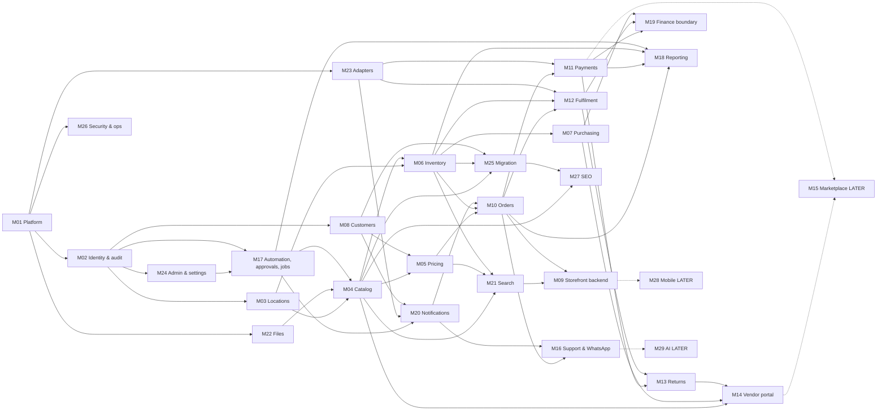

# 05 — Backend implementation plan

**Purpose.** Per-module backend plan for the operational core and the controlled commerce API: services, business
rules (`BR-M##-##`), validation, transaction boundaries, background jobs (automations A01–A38), integrations,
logging/error handling, dependencies, entities, APIs (`06-api.md`), frontend dependencies, tests and completion
criteria. Future sessions implement backend tasks from this file; endpoint contracts are in `06-api.md`, data in
`03-database.md`, permissions in `07-auth-roles-permissions.md`, tests in `16-testing.md`.

**Sources used.** BP §1.2, §3, §5, §7–§14, §15.4–15.6, §16, §17, §18, §19, §20, §21, §22, §23.1 · PR1 §3–§11, §14 ·
PR2 §4–§10 · MEET · mockup pages and `assets/tradex.js`. **Labels & status:** `00-conventions.md` §2–§3.
**Decisions:** `DECISIONS.md` (D-001…D-209, D-220…D-222); this plan proposed D-141–D-154 (`06-api.md` §6) and D-150 (§7 below).
**Permission keys and role cells:** `07-auth-roles-permissions.md` (endpoint rows in `06-api.md` are aligned to it).

**Platform caveat.** The operational core is **OPEN (D-001)**: retain legacy, ERPNext/Frappe + extension app,
Odoo, or a custom modular backend (BP §1.2). Everything below is the **logical** design that any of those options
must satisfy. Where the core provides a native capability (e.g. serial/batch, stock reservation, workflows — BP
§15.1, S05, S06, S19), the task is to **configure and prove** it against these rules, not to rebuild it
("Use platform configuration before custom code; custom extension before core fork", BP §15.6).

---

## 1. Cross-cutting backend design

### 1.1 Code locations (repository layout D-054, `00-conventions.md` §11)
All backend code lives under `backend/`. One folder per module area; the internal structure of each folder
(packages, doctypes/models, migrations, tests) depends on **D-001/D-002**.

| Module | Folder | Module | Folder |
|---|---|---|---|
| M01 | `backend/platform/` (+ `infra/` for environments, CI — D-005, D-077) | M13 | `backend/returns/` |
| M02 | `backend/identity/` | M14 | `backend/vendors/` |
| M03 | `backend/organisation/` | M16 | `backend/support/` |
| M04 | `backend/catalog/` | M17 | `backend/automation/` |
| M05 | `backend/pricing/` | M18 | `backend/reporting/` |
| M06 | `backend/inventory/` | M19 | `backend/finance/` |
| M07 | `backend/purchasing/` | M20 | `backend/notifications/` |
| M08 | `backend/customers/` | M21 | `backend/search/` |
| M09 | `backend/storefront_content/` (backend part only; UI in `frontend/storefront/`) | M22 | `backend/files/` |
| M10 | `backend/orders/` | M23 | `backend/integrations/` (one adapter per provider) |
| M11 | `backend/payments/` | M24 | `backend/admin/` |
| M12 | `backend/fulfilment/` | M25 | `backend/migration/` (scripts, mappings, reconciliation) |
| M26 | `backend/platform/observability/` + `infra/` | M27 | `backend/seo/` |

Rules: one deployable backend organised as internal modules with explicit interfaces (BP §15.5 "Keep catalog,
pricing, inventory, orders, payments, and approvals as internal modules with explicit interfaces"; §15.6 "no
microservice per database table"). Modules call each other through service interfaces, never by writing another
module's tables directly (BP §16.3).

### 1.2 Transaction boundaries (BP §16.3)
"Within the selected operational core, stock reservation and pending-order creation should succeed or fail
together… External effects are outside that database transaction. Record intent durably, execute through a worker
or controlled call, and reconcile the outcome."

| # | Atomic unit (single core transaction) | Contents | External effects (after commit, via outbox) | APIs |
|---|---|---|---|---|
| TX-1 | Place pending order | E-sales_order + E-order_line snapshots + all E-reservation rows + E-idempotency_record + outbox row | none customer-facing until payment verified | API-M10-06, API-M10-21 |
| TX-2 | Apply payment event | E-payment_event (dedup) + E-payment_attempt transition + order transition + reservation → confirmed allocation or exception | fulfilment release, notification, invoice step | API-M11-03 |
| TX-3 | Cancel lines | E-order_cancellation + reservation release (affected lines only) + E-refund request + order state | refund submission, notification | API-M10-09 |
| TX-4 | Dispatch/handover | fulfilment → dispatched + E-stock_movement (on-hand −) + reservation consumed + E-serial_event | customer notification, tracking, accounting export | API-M12-15, API-M12-19 |
| TX-5 | Post goods receipt | E-goods_receipt posted + movements (received/quarantine/sellable) + E-serial_unit rows + PO quantities | availability refresh (A04), bill matching | API-M07-13 |
| TX-6 | Transfer ship / receive | movements source→transit / transit→destination + transfer line quantities | availability refresh | API-M06-15, API-M06-16 |
| TX-7 | Approve stock adjustment | E-approval_request decision + E-stock_movement + E-stock_adjustment status | availability refresh | API-M17-03 → M06 |
| TX-8 | Receive return | movement → quarantine + RMA state + E-serial_event | notification | API-M13-10 |
| TX-9 | Resale disposition | movement quarantine → sellable + RMA decision | availability refresh | API-M13-11 |
| TX-10 | Approval decision | decision + subject state change (publish version, activate price list, post adjustment…) | notifications, index refresh | API-M17-03 |

Never keep a database transaction open while waiting for a customer or a payment network (BP §10.2).

### 1.3 Durable work: outbox, jobs, reconciliation (BP §16.3, §12.3)
- Every external call (payment, refund, courier booking, accounting export, WhatsApp/email/SMS, supplier feed pull)
  is recorded as E-outbox_operation **in the same transaction** as the business change; a worker claims it, sends,
  stores the external reference, retries with backoff, and routes persistent failure to E-exception_case (A38).
  "Merely enqueueing after commit can lose work during a crash unless a durable scanner/reconciliation mechanism
  closes the gap" (BP §16.3) → the scanner is mandatory (T21).
- Each job records E-job_attempt (attempt no., input version, result, duration, error) for the automation-health
  views (BP §14.3 Automation health; API-M17-15).
- Irreversible actions (refund, booking) are reconciled by provider reference before any retry (BP §10.3; T19,
  T20). Use the platform's queue before adding another broker (BP §15.6; D-001).
- Every automation implements the BP §12.3 template (trigger, inputs, preconditions, action, idempotency, failure
  behaviour, human boundary, audit, notification, KPI, disable/rollback) — stored in E-automation_rule.

### 1.4 Idempotency (BP §10.3, §17.5; D-079)
E-idempotency_record keyed by (caller, operation, key) stores a payload hash and the result. Same key + same hash →
stored result; different hash → `IDEMPOTENCY_CONFLICT`. Provider calls use deterministic references (refund id +
attempt, parcel ref). Consistency invariant "No duplicate effect for the same accepted business operation" (BP §17.6).

### 1.5 State machines (BP §10.1)
"An order, payment, fulfilment, and return are related but different records… Transitions require explicit guards.
Do not implement a single status field that tries to represent all five processes." The BP lists **example states
only**. Each machine is implemented as an explicit transition table with guards (M10, M11, M12, M13 sections);
transitions marked `D-150` are not specified by the sources and must be confirmed (see §7).

### 1.6 Consistency invariants (BP §17.6) — owners
| Invariant | Owner module(s) | Enforced by |
|---|---|---|
| No duplicate effect for the same accepted business operation | M10, M11, M12, M07, M19 | §1.4, dedup of provider events |
| No negative sellable allocation under normal confirmed-order processing | M06 | BR-M06-05, BR-M06-17 |
| A serialised unit cannot be shipped twice without a recorded return and new sale | M06, M12 | BR-M06-08 |
| Stock movement history reconciles to current balances | M06 | BR-M06-04, reconciliation job |
| Refunded amounts ≤ refundable captured amount | M11 | BR-M11-07 |
| Approved private prices do not cross customer/business boundaries | M05, M02 | BR-M05-15, BR-M05-16 |
| Order snapshots preserve what was sold | M10 | BR-M10-06 |
| Unapproved vendor content cannot become a purchasable offer | M04, M14 | BR-M04-06, BR-M14-05 |
| One accounting mapping per approved document/version | M19 | BR-M19-03 |
| Every material override has an actor, reason, and authority trail | M02, M17 | BR-M02-08, BR-M17-06 |

### 1.7 Logging, audit and error handling (all modules)
- Structured logs with correlation id per request/job; error capture, uptime and job-health checks (BP §15.4
  Monitoring; tooling D-052). Never log passwords, payment data, identity documents, full chat content or tokens
  (BP §19.1).
- Business audit is separate from technical logs: E-audit_event for every material stock, price, refund,
  permission, approval, publication and configuration change (BP §17.3, §20.1 "Auditability"); tamper-resistant per
  platform capability (BP §19.1).
- Domain errors map to the API error codes of `06-api.md` §1.7; unexpected errors return a generic error with the
  correlation id and are captured. Provider/timeouts never produce "guessed" success (BP §10.3).
- Telemetry per BP §20.3 (errors, latency, queue age, retries, provider failures, stock projection lag, expired
  reservations, captured-but-unconfirmed payments, refund age, backup status) is emitted by the owning module and
  aggregated by M26.

---

## 2. Module dependency graph

Arrow `X --> Y` means **Y depends on X** (build X first). Dotted = LATER. Reporting (M18) reads from most modules;
only its main sources are drawn.

Notes: M17's job/outbox core is built before M20 (M20 uses the outbox; M17 queues then use M20 for alerts). M23
adapters are built per provider when the provider decision (D-012, D-013, D-014, D-015, D-011) is made.

## 3. Work packages (BP §22.2) → modules

| WP | BP deliverables | Modules | Acceptance evidence (BP §22.2) |
|---|---|---|---|
| WP01 Discovery | Process maps, role list, baseline, decision log, data inventory | none (feeds `DECISIONS.md`); inputs for M17 automation selection (D-078), M25 data inventory | Approved requirements and open decisions |
| WP02 Technical audit | Existing-system assessment, export sample, integration/access findings | M23 (legacy adapter), M25 (D-001, D-009) | Retain/replace recommendation with evidence |
| WP03 UI/UX | Web screen flows, prototype, design system | M09 (+ frontend plans) | Web client approval (D-049) |
| WP04 Platform proof | Ten fit scenarios (BP §15.3), TCO, architecture decision | M01, M02, M04, M05, M06, M07, M10, M11, M13, M14, M17, M19 (scenario map below) | Critical scenarios pass |
| WP05 Environment | Repositories, CI, staging, production plan, secrets, backups | M01, M26, M24 (integration settings) | Deploy/restore proof |
| WP06 Master data | Category schema, catalog, serial/condition model, migration mapping | M03, M04, M22, M25 | Representative products import correctly |
| WP07 Pricing | Consumer/dealer context, tiers, overrides, quote snapshots | M05, M08 | Price matrix and privacy tests pass (T02, T03, T10, T22) |
| WP08 Inventory | Receipts, QC, movements, reservations, transfers, branch interface | M06, M07, M03, M23 (branch/POS) | Last-unit/serial/count tests pass (T04, T05, T15, T16) |
| WP09 Commerce | Search, product detail, cart, account, checkout | M09, M21, M10, M08, M27 | Core customer tasks complete |
| WP10 Payments | Provider integration, callbacks, refunds, reconciliation | M11, M23 | Duplicate/late payment scenarios pass (T06–T09, T18, T19) |
| WP11 Fulfilment | Pick/pack, shipping, tracking, cancellation, returns | M12, M13, M10 (cancellation), M23 | Full fulfilment/return sample passes (T17, T20, T34) |
| WP12 Automation | Priority rules, job retries, exceptions, owner digest | M17, M20, M18 | Failure recovery and measured run logs (T21, T31) |
| WP13 Vendor portal | Applications, submissions, approval, scoped access | M14 (+ M02 scoping) | No cross-vendor access; approved changes only (T11–T14) |
| WP14 WhatsApp | Chat entry, guided flow/inbox, secure order lookup | M16, M20, M23 | Chat-to-order and handoff UAT (T23–T25) |
| WP15 Reporting | Operational reports, exports, finance controls | M18, M19 | Totals reconcile with sample transactions (T27) |
| WP16 Migration/UAT | Full rehearsal, scripts, training, acceptance evidence | M25 (+ all for UAT) | Client sign-off and reconciled opening data |
| WP17 Launch/support | Cutover, monitoring, runbooks, hypercare | M26, M01, M25 | Stable operations and handover |

BP §15.3 proof scenarios → modules: (1) receive three refurbished laptops with different serials/outcomes → M07,
M06; (2) publish only accepted units → M04, M06; (3) public vs dealer price, ten-unit tier, no leakage → M05, M02;
(4) last unit website vs branch → M06, M10, M23; (5) duplicate/out-of-order payment notifications → M11; (6) vendor
product change, approve, history → M14, M04, M17; (7) return serial to quarantine, partial refund → M13, M11; (8)
recover failed stock-update job, reconcile channel view → M17, M06, M21; (9) supplier restricted to own data, staff
to assigned permissions → M02, M14; (10) export invoice/credit once and reconcile → M19.

## 4. Automation catalogue (BP §12.2) → modules

Priority as documented in BP §12.2; phase mapping per the orchestrator brief: P1 → **1A**, P1B → **1B**, P1/C →
**1A conditional**, P2/P3 → **LATER**, P3/C → LATER conditional. Every automation is subject to **D-078**
(automations selected for launch; "observe manual work first", BP §12.1) and must be specified with the BP §12.3
template before implementation.

| ID | Activity (BP §12.2) | Owning module (others) | Trigger → action | BP priority | Phase | Decisions |
|---|---|---|---|---|---|---|
| A01 | Re-enter supplier product details | M04 (M14 vendor batches) | File/API import maps & validates → staging, duplicates, rejected rows | P1 | 1A per §12.2 **but** "validated bulk import" is 1B per BP §5.1 (see note) | D-048, D-057, D-078 |
| A02 | Upload images individually | M22, M04 | Import authorised media by product mapping; rights/type/size checks | P1 | as A01 | D-057 |
| A03 | Add received stock manually | M07 (M06) | Scan receipt & serials against PO; QC required; over/short review | P1 | 1A | — |
| A04 | Update website quantity | M06 (M21, M09) | Committed stock event refreshes availability projection; retry & reconcile | P1 | 1A | D-034 |
| A05 | Check stock for every order | M06, M10 | Transactional reservation at confirmation; shortage queue | P1 | 1A | D-031 |
| A06 | Release abandoned stock holds | M06 (M10, M11) | Scheduled reservation expiry with payment-race safeguards | P1 | 1A | D-026 |
| A07 | Calculate dealer discount | M05 | Central pricing engine evaluates approved tiers; margin floor & stacking | P1 | 1A | D-017, D-018, D-043 |
| A08 | Re-type WhatsApp orders | M16, M10 | Guided selection creates draft order; customer confirms; ambiguity → agent | P1B | 1B | D-014, D-151 |
| A09 | Check online payment manually | M11 | Signed webhook updates payment state; reconciliation | P1 | 1A | D-012 |
| A10 | Match settlement deposits | M11 | Import settlement records, match fees/net; unmatched → finance | P1/C | 1A (C) | D-064 |
| A11 | Assign fulfilment work | M12 | Eligible order enters warehouse queue by rule | P1 | 1A | D-029 |
| A12 | Create packing documents | M12, M19 | Generate approved invoice/packing templates; serial verification | P1 | 1A | D-055 |
| A13 | Book shipment and labels | M12, M23 | Packed order requests booking; serviceability, dedup, timeout check | P1/C | 1A (C) | D-013 |
| A14 | Send order status updates | M20 | Approved transitions send message/email; consent, templates, frequency | P1 | 1A | D-058, D-015, D-014 |
| A15 | Answer "where is my order?" | M16 | Verified order lookup returns permitted status; handoff | P1B | 1B | D-014 |
| A16 | Chase pending fulfilment | M17, M12 | Deadline rule reminds assignee; escalate once | P1 | 1A | D-074 (SLAs), D-024 |
| A17 | Identify low stock | M07 (M06) | Threshold/lead-time rule creates replenishment suggestion; buyer approves | P1 | 1A | D-070 |
| A18 | Ask branches about availability | M06 | Shared authorised stock view (reserved vs in-transit distinguished) | P1 | 1A | D-029 |
| A19 | Prepare owner daily report | M17, M18 | Scheduled exception & KPI digest with freshness labels | P1 | 1A | D-063 |
| A20 | Check vendor listing quality | M14, M04 | Validate required fields and risky changes; reviewer approves | P1B | 1B | D-081 |
| A21 | Chase stale supplier stock | M06, M14 | Freshness expiry requests update or suspends promise | P1B | 1B | D-028 |
| A22 | Route return requests | M13 | Rule checks policy and assigns review queue | P1 | 1A | D-022 |
| A23 | Identify warranty eligibility | M13 | Match invoice, serial, policy version; never auto-promise | P1 | 1A | D-022 |
| A24 | Track stock discrepancies | M06 | Counts generate variance review; thresholds & audit | P1 | 1A | D-024, D-069 |
| A25 | Detect duplicate entries | M07 | Match supplier invoice/document keys; staff reviews near matches | P1 | 1A | — |
| A26 | Re-enter accounting records | M19, M23 | Approved export/API pushes invoices & credits; idempotent; control totals | P1/C | 1A (C) | D-011 |
| A27 | Maintain dealer applications | M08 | Validate completeness and route review; no auto approval | P1 | 1A | D-067 |
| A28 | Remind unpaid buyers | M20, M11 | Approved reminder schedule; opt-in; stop on payment/dispute/opt-out | P1/C | 1A (C) | D-058 |
| A29 | Follow up abandoned carts | M20 | Consented, capped reminder flow | P2 | LATER | D-141 |
| A30 | Forecast replenishment | M07 | Demand/lead-time model proposes quantities | P2 | LATER | — |
| A31 | Extract purchase invoices | M07 | OCR draft matched to supplier/PO | P2 | LATER | — |
| A32 | Recommend compatible accessories | M04 | Curated compatibility rules return eligible items | P1/C | 1A (C) | D-071 |
| A33 | Produce seller payouts | M15 | Settlement engine generates approved payout batch | P2 | LATER | D-046 |
| A34 | Answer complex product questions | M29 | Grounded assistant on approved catalog | P3 | LATER | D-086 |
| A35 | Automate collection calls | M16/M20 | Separate telephony/consent/provider study | P3/C | LATER (C) | — (BP §13.5 restricted use) |
| A36 | Identify margin leakage | M05, M18 | Scheduled rule flags discounts/fees below policy | P1B | 1B | D-024 |
| A37 | Flag suspicious returns | M13 | Rule highlights serial mismatch/repeated anomalies; human decision | P2 | LATER | — |
| A38 | Track import/sync failure | M17 | Job monitor creates one actionable incident; retry cap | P1 | 1A | — |

Note (inconsistency): BP §12.2 marks A01/A02 as **P1**, while BP §5.1 places "validated bulk import" in **1B** and
the mockup labels import "1B · R20/A01" (MK:erp-catalog.html#import). Implementation phase of A01/A02 is therefore
decided with D-048/D-078; the mockup's A13.2 "Courier tracking sync" is a mockup sub-rule of A13.

---

## 5. Module plans

Each module: purpose · services · business rules · validation · database operations & transaction boundaries ·
background jobs · integrations · logging & error handling · dependencies · entities · APIs · frontend dependencies ·
tests · completion criteria. Status of every item is `NOT_STARTED` unless marked `REQUIRES_DECISION (D-xxx)`.

### 5.1 M01 — Platform foundation (phase 1A; `backend/platform/`, `infra/`)
**Purpose.** Repository, environments, CI, configuration, release process and the shared runtime (worker/queue,
feature flags) on which all modules run (BP §15.4, §16.6, §20.5, WP05).

**Services/components.** Application skeleton for the chosen core (D-001/D-002) · configuration loader with
per-environment secrets (BP §19.1) · worker/queue runtime (platform-native first, BP §15.6) · feature-flag
mechanism for integrations/customer groups (BP §20.5; D-077) · migration runner (reversible where possible) · CI
pipeline (lint, tests, build, migration check) · staging and production deployments (D-005).

| ID | Rule | Source | Label |
|---|---|---|---|
| BR-M01-01 | Choose **one** operational core; never run ERPNext, Odoo and a custom inventory service simultaneously | BP §1.2 | DOCUMENTED · REQUIRES_DECISION (D-001) |
| BR-M01-02 | One codebase per real application boundary; no microservice per table; modular monolith | BP §15.5, §15.6 | DOCUMENTED |
| BR-M01-03 | Production and staging separated; backups outside the primary runtime; TLS; secrets management | BP §16.6, §19.1 | DOCUMENTED |
| BR-M01-04 | Releases need reviewed code, automated critical tests, migration plan, staging verification, release notes | BP §20.5 | DOCUMENTED |
| BR-M01-05 | Feature flags for selected integrations or customer groups | BP §20.5 | DOCUMENTED · REQUIRES_DECISION (D-077) |
| BR-M01-06 | Prefer reversible migrations and backward-compatible changes; software rollback ≠ business rollback | BP §20.5 | DOCUMENTED |
| BR-M01-07 | Pin tested supported versions; verify security updates | BP §15.4 | DOCUMENTED |
| BR-M01-08 | Use the core's queue before adding another broker; no Kubernetes/Kafka in Phase 1 | BP §15.6, §5.3 | DOCUMENTED |
| BR-M01-09 | Custom extension, not core fork; do not edit vendor core | BP §15.4, §15.6 | DOCUMENTED |
| BR-M01-10 | Separate environment credentials; production personal data kept out of development fixtures | BP §19.1, §19.3 | DOCUMENTED |

- **Validation:** configuration schema validated at start-up; missing secret → fail fast.
- **DB/transactions:** migration framework per D-001; each migration idempotent and recorded.
- **Jobs:** worker runtime hosts all module jobs (§1.3); health endpoint for job queue age (BP §20.3).
- **Integrations:** none directly; provides adapter framework used by M23.
- **Logging/errors:** structured logging baseline, correlation ids, error capture hook (D-052).
- **Dependencies:** none (root). **Entities:** E-configuration_version (runtime config shared with M24).
- **APIs:** none external. **Frontend dependencies:** provides API base for all P-* (via `frontend/` apps).
- **Tests:** CI runs unit + integration suites; deploy-to-staging smoke; T28 (restore rehearsal, with M26); T35
  isolation of heavy jobs from checkout (worker separation).
- **Completion criteria:** staging and production environments reproducible from `infra/`; CI green on main;
  deploy and restore proof documented (WP05 "Deploy/restore proof"); feature-flag mechanism usable by M11/M12/M16.
  Status: `REQUIRES_DECISION (D-001, D-002, D-005, D-077)`.

### 5.2 M02 — Identity, access & audit (phase 1A; `backend/identity/`)
**Purpose.** Authentication for customers, dealers, vendors, staff and integrations; role and record-scope
authorisation; MFA; sessions; invitations; sensitive-field reveal; audit trail (BP §3.1, §18, §19.1).

**Services.** AuthService (password sign-in) · OtpService (challenges, D-040/D-015) · MfaService · SessionService
(D-083) · AccessPolicy (role + record scope + property-level checks, used by every module) · UserAdminService ·
RoleService · InvitationService · AccessReviewService · SensitiveRevealService (D-153) · AuditService.

| ID | Rule | Source | Label |
|---|---|---|---|
| BR-M02-01 | Authorisation is enforced on the server for every business operation | BP §19.1 | DOCUMENTED |
| BR-M02-02 | Object-level and property-level authorisation (a vendor cannot read another vendor's record by changing an ID, nor edit a protected approval field on its own record); out-of-scope → not found | BP §19.1 (S14), T11, T13 | DOCUMENTED |
| BR-M02-03 | MFA for privileged accounts; individually attributable accounts; no shared admin passwords | BP §18.2, §20.1 | DOCUMENTED · method REQUIRES_DECISION (D-040) |
| BR-M02-04 | Least privilege, record-level scope (own/org/location/assigned), sensitive-field restrictions | BP §18.2 | DOCUMENTED |
| BR-M02-05 | Separate user administration from ordinary warehouse work | BP §18.2 | DOCUMENTED |
| BR-M02-06 | High-risk initiators do not approve their own requests where separation is feasible | BP §18.2 | DOCUMENTED |
| BR-M02-07 | Emergency access is time-bounded with post-event review | BP §18.2 | DOCUMENTED (implemented in M17) |
| BR-M02-08 | Audit records: actor, time, object, action, before/after (or structured change), reason; access-restricted; tamper-resistant per platform | BP §17.3, §19.1, PR2 §9 | DOCUMENTED |
| BR-M02-09 | Rate limits and abuse protection on sign-in, OTP, order access and checkout without hindering normal shopping | BP §19.1 | DOCUMENTED · values REQUIRES_DECISION (D-084) |
| BR-M02-10 | CSRF protection for cookie-authenticated mutations; deliberate CORS | BP §19.1 | DOCUMENTED |
| BR-M02-11 | Never log passwords, tokens or sensitive identity data | BP §19.1 | DOCUMENTED |
| BR-M02-12 | Integration accounts are narrow machine credentials without interactive admin access | BP §3.1 | DOCUMENTED |
| BR-M02-13 | Buyer context (consumer/dealer) is derived from verified business-account membership; client classification ignored; on sign-out private prices/cached responses are no longer accessible | BP §6.5, §8.4, T10, T22 | DOCUMENTED |
| BR-M02-14 | Permission caches only with safe invalidation | BP §16.2 | DOCUMENTED |
| BR-M02-15 | Editing permissions is a privileged action (managers only for limited team scope if delegated); privileged changes need a second approver | BP §18.1; MK:erp-admin.html | DOCUMENTED / MOCKUP |
| BR-M02-16 | Migrated passwords only via proven compatible secure method, otherwise reset; never plaintext | BP §21.2 | DOCUMENTED · REQUIRES_DECISION (D-039) |
| BR-M02-17 | Masked sensitive fields may be revealed only with a reason, time-limited and audited | BP §18.2; MK:erp-customers.html | MOCKUP · REQUIRES_DECISION (D-153) |
| BR-M02-18 | The BP §18.1 authority matrix is implemented as permission keys + thresholds evaluated by AccessPolicy/ApprovalService (table below); exact monetary limits are client-supplied | BP §18.1 | DOCUMENTED · limits REQUIRES_DECISION (D-024) |
| BR-M02-19 | Inbound integration credentials are narrow, scoped to one integration/vendor, expiring, rotatable and revocable; the secret is shown once (API-M02-35…37) | BP §3.1, §19.1 | DOCUMENTED · REQUIRES_DECISION (D-083, D-107) |
| BR-M02-20 | Accepted separation-of-duties conflicts are recorded with reason and periodic post-review (API-M02-39/-40) | BP §18.2; MK:erp-admin.html#roles | MOCKUP · REQUIRES_DECISION (D-196) |
| BR-M02-21 | Assignee pickers list only users whose role and location scope allow the task, without contact details (API-M02-34) | BP §12.5 "assigned role/person" | DOCUMENTED |

BP §18.1 authority matrix → enforcing rule (columns Staff / Manager / Finance / Owner-admin / Vendor as in BP; permission keys and role mapping: `07-auth-roles-permissions.md` §4.1, §5.2):

| Action | Staff | Manager | Finance | Owner/admin | Vendor | Enforced by |
|---|---|---|---|---|---|---|
| Create product draft | Assigned catalog staff | Yes | Read if needed | Yes | Own submission | BR-M04-06, BR-M14-05 |
| Publish new product | No by default | Designated reviewer | Tax review if required | Yes | No | BR-M04-09 |
| Record matching receipt | Assigned warehouse | Yes | Read | Yes | No company receipt | BR-M07-11 |
| Adjust stock | Request | Within threshold | Value review | High-value approval | Own availability only | BR-M06-13 |
| Change dealer tier | Request | Within delegated policy | Review if needed | Yes | No | BR-M05-17 |
| Initiate refund | Support request | Within policy | Execute/approve as assigned | Override with audit | Request only | BR-M11-09 |
| Change payout account | No | No unilateral change | Maker/checker | Controlled approval | Submit change | BR-M14-09 |
| Export customer data | Narrow approved scope | Scoped | Finance purpose | Governed permission | Assigned fulfilment only | BR-M08-12, BR-M18-04 |
| Edit permissions | No | Limited team scope if delegated | No | Privileged role | No | BR-M02-15 |

- **Validation:** credential policy (D-040); OTP attempt caps and expiry; invitation tokens single-use; role
  assignments cannot exceed the assigner's authority; location scope must reference active E-location.
- **DB/transactions:** role change + approval request in one transaction; session revocation immediate; audit
  written in the same transaction as the change it records.
- **Jobs:** expire invitations/challenges; access-review reminders (MOCKUP); session cleanup (D-083).
- **Integrations:** OTP/email delivery via M23 messaging adapter (D-015); optional GST/identity checks are M08.
- **Logging/errors:** security events (sign-in success/failure, MFA changes, force sign-out) as E-audit_event;
  generic auth errors (no account enumeration).
- **Dependencies:** M01. **Entities:** E-user_account, E-role, E-permission, E-role_permission,
  E-user_role_assignment, E-audit_event (+ requested E-user_session, E-verification_challenge, E-invitation,
  E-access_review, E-api_credential).
- **Gap-resolution additions (2026-09-27):** AuthService also administers inbound integration credentials (API-M02-35…37); RoleService records SoD exceptions (API-M02-39/-40); AccessReviewService lists reviews (API-M02-41/-42); UserAdminService serves own-account edits (API-M02-33, D-174) and assignable-user lookups (API-M02-34); InvitationService handles renewal requests (API-M02-38).
- **APIs:** API-M02-01…42. **Frontend:** shell(S/E/V), P-S12, P-S09#profile, P-E15#users/#roles/#audit, P-V04#users.
- **Tests:** T10, T11, T13, T22, T30 (keyboard sign-in flow with frontend); unit tests for AccessPolicy matrices
  (every role × action in BP §18.1), property-level write protection, SoD rejection; integration tests for OTP rate
  limiting, session revocation, MFA enforcement for privileged roles.
- **Completion criteria:** every API endpoint passes through AccessPolicy (automated check); privileged accounts
  cannot operate without MFA; audit events present for all privileged actions; T11/T22 pass.

### 5.3 M03 — Organisation & locations (phase 1A; `backend/organisation/`)
**Purpose.** Company, branches, warehouses and bins as explicit records used by stock, fulfilment, pricing
(location lists, D-044) and reporting (BP §3.3, §9.5).

**Services.** LocationService (company, locations, capabilities, bins, labels).

| ID | Rule | Source | Label |
|---|---|---|---|
| BR-M03-01 | A warehouse is not a company; a branch belongs to a company and may have its own registrations; a supplier is not a tenant — relationships stored explicitly | BP §3.3 | DOCUMENTED |
| BR-M03-02 | No multi-tenant SaaS control plane; future businesses via separate sites/deployments | BP §3.3, R15 | DOCUMENTED (D-045 LATER) |
| BR-M03-03 | Stock is held by location, bin and disposition; bins can be frozen during counts | BP §9.5, §9.6 | DOCUMENTED |
| BR-M03-04 | Location capabilities (store pickup, returns drop, dispatch) drive checkout/returns options | BP §10.5; MK:store-checkout.html | MOCKUP · REQUIRES_DECISION (D-061) |
| BR-M03-05 | A location holding stock or open tasks cannot be deactivated until transferred/closed | BP §9.5 (transfers must not destroy stock) | DOCUMENTED (derived) |
| BR-M03-06 | Company detail changes need a second approver | MK:erp-admin.html | MOCKUP |

- **Validation:** unique location/bin codes; GST place-of-business check before activating a new location (D-037).
- **DB/transactions:** location create/edit + audit; bin creation atomic per batch.
- **Jobs:** none. **Integrations:** none (GST verification via M08 port if D-037 requires).
- **Dependencies:** M02. **Entities:** E-company, E-location, E-location_bin.
- **Additions:** workspace context (company / financial year / location filter) per user — API-M03-10/-11 (D-170); a filter, never an authorisation widening.
- **APIs:** API-M03-01…11. **Frontend:** P-E15#locations, shell(E) location switcher, P-S01/P-S13 stores.
- **Tests:** unit tests for deactivation guard; seed of confirmed locations (D-010) in migration rehearsal.
- **Completion criteria:** confirmed legal entities, branches, warehouses and bins seeded (D-010); every stock
  record references a valid location/bin. Status: `REQUIRES_DECISION (D-010)` for seed data.

### 5.4 M04 — Catalog (phase 1A; import 1B; `backend/catalog/`)
**Purpose.** Stable product model with configurable category attributes; SKUs, offers, media, condition grades,
warranty/return/tax references; lifecycle with review and versioned drafts; validated imports (BP §7).

**Services.** CatalogQueryService (public projection) · CatalogAdminService · ProductDraftService (versioned
drafts, E-catalog_change_version) · LifecycleService · PublicationChecker · CategorySchemaService ·
CatalogImportService (A01) · PolicyService (warranty/return policies, grades, tax classes, checklists) ·
CompatibilityService (D-071) · BundleService (D-072) · ReviewService (D-041) · QuestionService (D-065) ·
ContentReportService (D-141).

| ID | Rule | Source | Label |
|---|---|---|---|
| BR-M04-01 | Stable product core + typed category attributes; adding an ordinary category is configuration and content only (no new table, no checkout change) | BP §7.1, §29.8, T36 | DOCUMENTED |
| BR-M04-02 | Product ≠ SKU ≠ offer ≠ serialised unit; supplier code ≠ internal SKU; listing approval ≠ physical stock | BP §7.1 | DOCUMENTED |
| BR-M04-03 | Core fields: immutable internal id, display SKU, title, brand, model, category, description, variant relations, tax classification ref, UoM, dimensions, weight, barcodes, image refs, status, publication channels, version | BP §7.2 | DOCUMENTED |
| BR-M04-04 | Attribute definitions carry label, data type, allowed values, unit, required, filterable/searchable, display order, category applicability; filter fields are never free text | BP §7.2 | DOCUMENTED |
| BR-M04-05 | Lifecycle transitions only: Draft→Submitted; Submitted→NeedsChanges; NeedsChanges→Draft; Submitted→Approved; Approved→Published (publication checks pass); Published→Suspended (safety/quality issue); Suspended→Submitted; Published→Archived | BP §7.3 diagram | DOCUMENTED |
| BR-M04-06 | Unapproved data never enters the live purchasable catalog or alters stock; drafts/submissions are stored separately or versioned | BP §7.3, §17.6, T12 | DOCUMENTED |
| BR-M04-07 | A change to an approved product stays a pending version while the last approved version remains live, unless safety/stock requires immediate suspension | BP §11.3, T13 | DOCUMENTED |
| BR-M04-08 | Sensitive edits (brand, condition, warranty, tax classification, extraordinary price change) require review | BP §11.3 | DOCUMENTED |
| BR-M04-09 | Publication of new products by a designated reviewer (not ordinary staff by default); tax review where required | BP §18.1 | DOCUMENTED · REQUIRES_DECISION (D-081) |
| BR-M04-10 | Imports: versioned CSV/XLSX or documented supplier API → staging → validate → map supplier codes → detect duplicates → preview diff → publish only valid approved changes; row-level errors can be corrected and retried without duplicating successful rows | BP §7.4, A01, T26 | DOCUMENTED |
| BR-M04-11 | Import checks: required attributes, contradictory condition labels, image availability, duplicate barcodes, impossible dimensions, missing tax classification, unapproved brands/categories | BP §7.4 | DOCUMENTED |
| BR-M04-12 | Image import: restricted sources, size, type and network destinations (no internal infrastructure); rights confirmed; no scraping of marketplaces | BP §7.4, §19.1, R20 | DOCUMENTED · REQUIRES_DECISION (D-057) |
| BR-M04-13 | Condition labels new/open-box/refurbished/used are distinct; grades meaningful only with a client-approved rubric (cosmetic, functional, battery, accessories, warranty) | BP §6.1, §6.6 | DOCUMENTED · REQUIRES_DECISION (D-023) |
| BR-M04-14 | Warranty provider is explicit; never imply manufacturer warranty when the seller provides it; warranty duration and return window are separate policy fields | BP §6.6, §7.5 | DOCUMENTED |
| BR-M04-15 | Policies (warranty, return, grade rubric) are versioned; orders reference the version in force | BP §27.2, T33 | DOCUMENTED · REQUIRES_DECISION (D-022) |
| BR-M04-16 | Compatibility links are curated with evidence; recommendations only for eligible in-stock items | BP §7.5, A32 | CONDITIONAL (D-071) |
| BR-M04-17 | Bundles consume component stock explicitly; bundle stock is not freely editable | BP §7.5 | CONDITIONAL (D-072) |
| BR-M04-18 | Honest merchandising: no fabricated ratings, scarcity, fake discounts or misleading condition labels; ratings shown only with real data | BP §6.1, §6.4 | DOCUMENTED |
| BR-M04-19 | Reviews require moderation and verified-purchase handling | BP §5.2 | CONDITIONAL (D-041) |
| BR-M04-20 | Approved changes invalidate public projections (search, storefront cache) with version/timestamp; archived products are marked unavailable and redirected (M27) | BP §16.5, §6.8 | DOCUMENTED |
| BR-M04-21 | Tax classifications are versioned master data; creation/changes need finance review (API-M04-40) | BP §14.1, §11.3, §18.1 "Tax review if required" | DOCUMENTED · REQUIRES_DECISION (D-037) |

- **Validation:** attribute type/unit/range per template; required-by-category only at submit/publish (drafts may be
  incomplete); image dimension/type checks; duplicate barcode across SKUs; tax classification present before
  publish; rights flag before publish (MK "blocked (image rights not confirmed)").
- **DB/transactions:** save draft = new E-catalog_change_version row (live untouched); publish = switch live version
  pointer + outbox (index refresh, cache invalidation, SEO) in one transaction; import commit creates drafts in
  batches with per-row idempotency keys (T26).
- **Jobs:** A01 import validation/staging (1B per §5.1 note); A02 media fetch (with M22); search index refresh
  (with M21); scheduled supplier feed pulls (D-057).
- **Integrations:** supplier catalog files/APIs via M23 supplier adapter (BP §16.4 "Versioned product/availability
  feed").
- **Logging/errors:** import job attempts and row errors persisted (E-import_row); publication blocks logged with
  reason; A38 incident on repeated import failure.
- **Dependencies:** M02, M03, M17 (approvals), M22 (media), M24 (config). **Entities:** E-category,
  E-attribute_definition, E-category_attribute, E-brand, E-product, E-sku, E-sku_attribute_value, E-offer,
  E-media_asset, E-tax_classification, E-condition_grade, E-warranty_policy, E-return_policy,
  E-catalog_change_version, E-compatibility_link, E-bundle_component, E-import_job, E-import_row,
  E-supplier_code_mapping.
- **APIs:** API-M04-01…41 (+ API-M17-03 decisions). **Frontend:** P-E06 all tabs, P-S02, P-S03, P-S04, P-S05,
  P-S13, shell(S) menus.
- **Tests:** T01, T12, T13, T26, T33, T36; unit tests of lifecycle transition table and publication checker;
  integration test: new category (printers, BP §29.8) configured and purchasable end-to-end; SSRF tests for URL
  import (internal addresses rejected).
- **Completion criteria:** representative products import correctly (WP06); T36 passes without code change;
  pending versions never alter live data (T13); all publication actions audited.

### 5.5 M05 — Pricing (phase 1A; `backend/pricing/`)
**Purpose.** One server-side price calculation for web, staff, WhatsApp and future app: buyer context, price lists,
tiers, promotions, shipping/tax, margin and authority, time-limited quotes (BP §8).

**Services.** BuyerContextResolver · PricingEngine · QuoteService · PriceListService · PriceChangeService
(versioned lists + approvals) · PromotionService (D-043) · MarginAuthorityService · PriceSimulator ·
CostSignalService · QuickOrderValidator (D-121) · QuoteRequestService (D-121).

| ID | Rule | Source | Label |
|---|---|---|---|
| BR-M05-01 | One server-side price calculation for website, staff orders, WhatsApp and future app | BP §8.1 | DOCUMENTED |
| BR-M05-02 | Money in fixed decimal or integer minor units, never floating point | BP §8.1 | DOCUMENTED |
| BR-M05-03 | Final price and rule version preserved on each order line | BP §8.1, T33 | DOCUMENTED |
| BR-M05-04 | Calculation sequence: (1) company, currency, channel, offer, customer context; (2) contract price else dealer list else public list; (3) quantity tier per SKU/offer & UoM; (4) eligible promotions per explicit stacking policy; (5) shipping and tax per approved finance rules; (6) margin/discount authority and serviceability; (7) show final amount, lock time-limited quote version; (8) revalidate at order/reservation, notify material changes | BP §8.1 | PROPOSED · REQUIRES_DECISION (D-017; quote window D-154) |
| BR-M05-05 | Never silently pick the largest discount unless that is the approved rule | BP §8.1 | DOCUMENTED |
| BR-M05-06 | Quantity tiers all-units or graduated, per SKU or basket, per approved policy | BP §8.2, §26.4 Q33, T03 | REQUIRES_DECISION (D-018) |
| BR-M05-07 | Promotions apply only per explicit stacking rules, with explanation shown | BP §8.1 step 4, §8.4 | REQUIRES_DECISION (D-043) |
| BR-M05-08 | Untrusted client classification ignored; context derived from authorised membership | BP §8.4, T10 | DOCUMENTED |
| BR-M05-09 | Expired price list → defined valid fallback price or block checkout; never an arbitrary zero | BP §8.4 | DOCUMENTED |
| BR-M05-10 | Price below minimum margin → authorised override with reason (approval request) | BP §8.4, §18.1 | DOCUMENTED · thresholds REQUIRES_DECISION (D-024) |
| BR-M05-11 | Quantity change after quote → recalculate tier and require confirmation | BP §8.4 | DOCUMENTED |
| BR-M05-12 | Location change → re-evaluate serviceability, tax and any approved location price | BP §8.4 | DOCUMENTED · location lists REQUIRES_DECISION (D-044) |
| BR-M05-13 | Refunds on discounted orders use the original allocated line discount and tax records | BP §8.4 | DOCUMENTED |
| BR-M05-14 | Supplier cost changes never auto-change live prices unless an approved rule permits | BP §8.4 | DOCUMENTED |
| BR-M05-15 | Private price responses isolated from shared caches; public content may cache | BP §8.4, §16.5, T22 | DOCUMENTED |
| BR-M05-16 | Approved private prices never cross customer/business boundaries | BP §17.6, T02 | DOCUMENTED |
| BR-M05-17 | Dealer tier/price-list change: staff request → manager within delegated policy → owner; list changes approved with reason and shown as diff while live list is unchanged | BP §18.1, §12.6; MK:erp-pricing.html#approvals | DOCUMENTED / MOCKUP |
| BR-M05-18 | Whether partial cancellations/returns keep the original tier price or require adjustment; no retroactive repricing without agreed policy and disclosure | BP §8.2 | REQUIRES_DECISION (D-082) |
| BR-M05-19 | Tax-inclusive/exclusive display by buyer type | BP §26.4 Q35 | REQUIRES_DECISION (D-016) |
| BR-M05-20 | Staff discounts within role authority; above → approval request (A07 margin floor & stacking controls) | BP §18.1, §12.6, §29.2, A07 | DOCUMENTED · limits REQUIRES_DECISION (D-024) |

- **Validation:** quantity > 0 and within offer limits; coupon codes valid/eligible (D-043); price-list validity
  window and fallback defined at creation; tier breakpoints strictly increasing; margin-floor checks.
- **DB/transactions:** quotes are immutable versions (E-quote/E-quote_line); price-list change = draft
  E-price_rule_version + E-approval_request; activation on approval (TX-10) atomically switches the version used by
  the engine; engine reads a consistent version set per calculation.
- **Jobs:** A36 margin-leakage flag (1B, scheduled); quote expiry cleanup; cost-signal detection from bills,
  submissions and POs (BP §8.4).
- **Integrations:** none external; tax rates per finance rules (D-016/D-037).
- **Logging/errors:** every calculation returns the step trace (simulator and quote) for audit; price-list
  activation audited; engine refuses to price with missing/expired list rather than defaulting.
- **Dependencies:** M02, M04, M08 (membership), M17 (approvals), M12 (serviceability/shipping charge), M24 (config).
- **Entities:** E-price_list, E-price_list_item, E-quantity_tier, E-price_rule_version, E-promotion, E-margin_floor,
  E-discount_authority, E-quote, E-quote_line (+ requested E-promotion_code).
- **APIs:** API-M05-01…24. **Frontend:** P-S03, P-S06, P-S07, P-S11 (#pricelist, #bulk, #quotes), P-E07, P-E02
  m-assisted, P-E05 m-basket.
- **Tests:** T02, T03, T10, T22, T33, T34; unit test matrix for the 8-step sequence (each precedence branch, expired
  list, stacking), money rounding tests, cache-isolation test (dealer then guest on same client).
- **Completion criteria:** price matrix and privacy tests pass (WP07); engine is the only price source for all
  channels (no price field accepted from clients); decisions D-016, D-017, D-018, D-043 recorded. Status:
  `REQUIRES_DECISION (D-016, D-017, D-018)`.

### 5.6 M06 — Inventory (phase 1A; supplier availability 1B; `backend/inventory/`)
**Purpose.** The single stock authority: append-only movements by SKU, location, owner and disposition;
available-to-promise; reservations; serialised units and inspections; transfers; counts and adjustments;
supplier availability kept separate from company stock (BP §9).

**Services.** StockLedger · AtpCalculator · AvailabilityProjector (A04) · ReservationService (A05, A06) ·
SerialUnitService · InspectionService · DataErasureService · TransferService · CountService (A24) ·
AdjustmentService · SupplierAvailabilityService + FreshnessMonitor (A21) · ReorderRuleService.

| ID | Rule | Source | Label |
|---|---|---|---|
| BR-M06-01 | Every online sale, branch sale, WhatsApp order, warehouse movement, return and adjustment reaches the same stock authority; website/search copies may lag, checkout validates and reserves with the authority | BP §9.1 | DOCUMENTED |
| BR-M06-02 | `available_to_promise = max(0, sellable_on_hand − active_reserved − safety_buffer)` per SKU, location, owner and unit/lot; sellable excludes quarantine, damaged, repair, in-transit (never subtract twice); POs and unconfirmed supplier stock are not sellable | BP §9.2 | DOCUMENTED · buffer REQUIRES_DECISION (D-027) |
| BR-M06-03 | Stock event effects: PO issued — none; goods received into inspection — + received/quarantine; inspection accepted — → sellable; reservation created — − ATP only; shipment dispatched — − on-hand and consume reservation atomically; reservation expires/cancels — release; customer return received — + quarantine; return approved for resale — quarantine → sellable; adjustment — approved correction with reason; transfer — source → transit → destination | BP §9.2 table | DOCUMENTED |
| BR-M06-04 | Movements are append-only; a discrepancy is never fixed by overwriting a quantity; history reconciles to balances | BP §9.6, §17.6 | DOCUMENTED |
| BR-M06-05 | Reservation and pending-order creation succeed or fail together; of two competing requests for the last unit exactly one succeeds | BP §16.3, §10.3, T04, T05 | DOCUMENTED |
| BR-M06-06 | Reservations are time-limited and released by a scheduled expiry job with payment-race safeguards and late-capture policy | BP §10.3, A06 | DOCUMENTED · durations REQUIRES_DECISION (D-026) |
| BR-M06-07 | Reserve a specific serial when a unique unit (condition/photos) is advertised; otherwise reserve quantity and allocate a valid serial at picking | BP §9.4, §17.2 | PROPOSED · REQUIRES_DECISION (D-031) |
| BR-M06-08 | No serial on two active fulfilments; a serial cannot ship twice without a recorded return and new sale | BP §9.4, §17.6 | DOCUMENTED |
| BR-M06-09 | Duplicate-serial checks; manufacturer identifier stored separately from internal tracking id | BP §9.4 | DOCUMENTED |
| BR-M06-10 | Transfers never create/destroy enterprise stock; in-transit is not available at the destination until received; partial receipts keep in-transit and discrepancy visible | BP §9.5, T16 | DOCUMENTED |
| BR-M06-11 | Fulfilment location default: one eligible location that can fulfil; otherwise transfer or explicit split decision; branch visibility of other branches' stock per policy | BP §9.5 | PROPOSED · REQUIRES_DECISION (D-029) |
| BR-M06-12 | Counts record time, operator, expected, observed, reason, approval, valuation impact; freeze bins or reconcile intervening movements; cycle counts by value/risk | BP §9.6, A24 | DOCUMENTED · REQUIRES_DECISION (D-069) |
| BR-M06-13 | Adjustments: staff request; managers approve within threshold (quantity and value); large unexplained losses → owner/finance | BP §9.6, §18.1, §12.6 | DOCUMENTED · REQUIRES_DECISION (D-024) |
| BR-M06-14 | Supplier availability has its own timestamp, source, confirmation policy, lead time and buffer; freshness deadline per supplier; once stale hide immediate promises, require confirmation or suspend; never presented as company-owned | BP §9.7, T14 | DOCUMENTED · REQUIRES_DECISION (D-028) |
| BR-M06-15 | A supplier stock update never creates company inventory; only an authorised receipt/ownership transaction does | BP §11.3 | DOCUMENTED |
| BR-M06-16 | Returned storage devices go to quarantine; inspection and data erasure precede resale | BP §7.5, T17 | DOCUMENTED |
| BR-M06-17 | If the stock authority is unavailable, stop confirmation or use an explicitly segregated allocation; never guess | BP §10.3 | DOCUMENTED |
| BR-M06-18 | Browse availability is a projection refreshed by committed events within an agreed window; checkout revalidates | BP §9.1, §16.5, §20.1, A04 | DOCUMENTED · target REQUIRES_DECISION (D-034) |
| BR-M06-19 | Branch offline selling needs a controlled manual process or dedicated allocation | BP §9.5, §29.4 | REQUIRES_DECISION (D-030) |
| BR-M06-20 | Backorders only as explicit product policy with disclosed lead times | BP §9.2, §9.7 | REQUIRES_DECISION (D-073) |
| BR-M06-21 | Serial replacement during repair preserves original and replacement histories; recalls can identify affected serial/batch units and orders | BP §7.5 | DOCUMENTED |
| BR-M06-22 | Refurbished unit record: serial, manufacturer serial, purchase source, grade, checklist & date, inspector, photos, warranty policy version, erasure evidence, accessories, defects, lifecycle status | BP §7.2 | DOCUMENTED |
| BR-M06-23 | Reservation extension by staff requires a reason (limit per policy); release restores ATP; both audited | MK:erp-inventory.html#reservations | MOCKUP · REQUIRES_DECISION (D-026) |

- **Validation:** movement quantities non-zero; disposition transitions only those in BR-M06-03; serial uniqueness;
  transfer source ≠ destination; count lines only within the count scope; adjustment reason mandatory; supplier
  lead-time bounds from configuration.
- **DB/transactions:** TX-1 (reservation part), TX-4, TX-5, TX-6, TX-7, TX-8, TX-9 (§1.2). Reservation uses the
  core's documented locking/reservation mechanism (BP §16.3; ERPNext S19 to evaluate) — row-level lock or
  conditional update on the stock position so concurrent reservations serialise; no direct table updates that
  bypass validations. Stock position is derived from movements (or maintained transactionally with them) and a
  reconciliation job proves equality (BP §17.6).
- **Jobs:** A04 availability projection refresh (event-driven + periodic reconciliation, lag metric BP §20.3);
  A05/A06 reservation expiry (scheduled; skips holds with in-flight payment attempts, D-026); A18 shared stock view
  (query); A21 freshness monitor (1B); A24 variance generation; nightly ledger-vs-balance reconciliation.
- **Integrations:** legacy ERP/POS events via M23 (D-009/D-030); supplier feeds via M14/M23.
- **Logging/errors:** each movement carries reference document, actor, reason; reservation failures return
  accurate available quantity; projection lag and expired-reservation counts exported to M26.
- **Dependencies:** M02, M03, M04, M17 (approvals, jobs), M24 (config). **Entities:** E-stock_movement,
  E-stock_position, E-reservation, E-serial_unit, E-serial_event, E-inspection, E-transfer, E-transfer_line,
  E-stock_count, E-stock_count_line, E-stock_adjustment, E-supplier_availability, E-reorder_rule.
- **APIs:** API-M06-01…32. **Frontend:** P-E08 all tabs, P-E03 (scan/short pick), P-E04 (quarantine), P-E09 (QC),
  P-S03 (availability, inspection report), P-S07.
- **Tests:** T04, T05, T09, T14, T15, T16, T17, T21, T31; concurrency test: N parallel reservations on 1 unit →
  exactly one success; property test: sum of movements = positions; transfer partial receipt; count variance never
  changes stock until approval.
- **Completion criteria:** last-unit/serial/count tests pass (WP08); reconciliation job reports zero drift on the
  rehearsal data; A04 lag within D-034 target; reserved and in-transit quantities distinguishable in all views.

### 5.7 M07 — Purchasing & receiving (phase 1A; `backend/purchasing/`)
**Purpose.** Replenishment suggestions, purchase orders with approval, goods receipt with serial scanning and QC,
supplier bills with three-way matching and duplicate detection (BP §9.3).

**Services.** ReplenishmentService (A17) · PurchaseOrderService · ReceiptService (A03) · BillMatchingService (A25)
· SupplierService · VendorPoService bridge (M14, D-131).

| ID | Rule | Source | Label |
|---|---|---|---|
| BR-M07-01 | Issuing a PO has no effect on physical on-hand | BP §9.2 | DOCUMENTED |
| BR-M07-02 | Automatic reorder only creates a suggestion or draft PO; buyer approves; autonomous supplier commitments are later scope | BP §9.3, §5.3, A17 | DOCUMENTED |
| BR-M07-03 | Receipts are matched to PO lines; partial receipts and backorders supported; supplier substitutions require approval | BP §9.3 | DOCUMENTED |
| BR-M07-04 | Received goods enter inspection/quarantine; QC pass → sellable; fail → quarantine and supplier resolution | BP §9.2, §9.3 | DOCUMENTED |
| BR-M07-05 | A wrong or duplicate serial in a receipt creates a discrepancy, never publishable stock | T15, BP §9.4 | DOCUMENTED |
| BR-M07-06 | Supplier invoice matched to receipt and order; variance beyond tolerance → finance or buyer review; otherwise approved payable workflow | BP §9.3 | DOCUMENTED · tolerance REQUIRES_DECISION (D-024) |
| BR-M07-07 | Duplicate supplier invoice detection on invoice/document keys; staff review near matches | BP §9.3, A25 | DOCUMENTED |
| BR-M07-08 | Landed-cost allocation only if imported goods require it | BP §9.3 | REQUIRES_DECISION (D-056) |
| BR-M07-09 | Attachments on POs, receipts and bills | BP §9.3 | DOCUMENTED |
| BR-M07-10 | PO approval by value before sending; approval levels client-supplied | MK:erp-purchasing.html; BP §18.1 | MOCKUP · REQUIRES_DECISION (D-024) |
| BR-M07-11 | Recording a matching receipt: assigned warehouse staff; managers/owner may; finance read; vendors never record company receipts | BP §18.1 | DOCUMENTED |
| BR-M07-12 | Receipts are idempotent (duplicate posting has no second effect) | PR2 §6, BP §15.1 (S01) | DOCUMENTED |
| BR-M07-13 | Actual lead times and fill rates feed supplier metrics and reorder parameters | BP §14.3 Vendor performance, Low stock; MK:erp-purchasing.html#suppliers | MOCKUP |
| BR-M07-14 | Basic supplier records (terms, lead time, contacts, supplier codes, status) are maintained in 1A without the vendor portal; payout/bank details change only through maker-checker (API-M07-22/-23) | BP §5.2 "basic supplier records", §14.1, §18.1 | DOCUMENTED |

- **Validation:** PO lines reference mapped SKUs; received quantity ≤ ordered unless over-receipt handling chosen;
  every received serial scanned or entered per approved process (BP §9.4); bill lines reference PO/GRN; bill totals
  consistent.
- **DB/transactions:** TX-5 on posting; PO approval via TX-10; bill recording + duplicate check in one transaction
  (duplicate → bill created on hold with exception).
- **Jobs:** A17 nightly suggestions (rule parameters D-070); A25 duplicate detection on bill create; PO reminder
  sends (outbox → M20/M14); three-way match recalculation after late GRN.
- **Integrations:** supplier PO transmission via email/portal (M14/M20); supplier bill export to accounting (M19).
- **Logging/errors:** variances and holds as E-exception_case with evidence; posting failures roll back entirely.
- **Dependencies:** M06, M04, M17, M14 (vendor side), M19. **Entities:** E-supplier, E-purchase_order,
  E-purchase_order_line, E-goods_receipt, E-goods_receipt_line, E-supplier_bill, E-supplier_bill_line,
  E-replenishment_suggestion (+ requested E-advance_shipping_notice).
- **Additions:** receipt list (API-M07-20), purchasable-SKU lookup with supplier code/last cost (API-M07-21; cost per D-197), supplier create/edit (API-M07-22/-23); PO transitions add `update_expected_date`/`keep_backorder`; send-after-approval behaviour per D-176.
- **APIs:** API-M07-01…23. **Frontend:** P-E09 all tabs, shell(E) New › Purchase order / Goods receipt, P-V03#pos.
- **Tests:** T15, T21; proof scenario 1 (three refurbished laptops, different serials/outcomes); partial receipt +
  backorder; duplicate bill detection; posting idempotency.
- **Completion criteria:** receipt → QC → sellable path works with serials; T15 passes; no PO is sent without
  approval; bills matched or held with reason.

### 5.8 M08 — Customers & business accounts (phase 1A; `backend/customers/`)
**Purpose.** Consumer accounts, dealer applications and approved business accounts with members, addresses,
consent records, devices, data-rights requests and duplicate handling (BP §3.1, §8.3, §13.3, §19.3).

**Services.** RegistrationService · CustomerProfileService · AddressService · ConsentService ·
DealerApplicationService (A27) · GstinVerificationPort (D-067) · BusinessAccountService · MembershipService ·
CustomerQueryService · DuplicateService · DataRequestService · DeviceRegistrationService · WishlistService (D-042).

| ID | Rule | Source | Label |
|---|---|---|---|
| BR-M08-01 | Dealer flow: application → business information review → approval/rejection → authorised account access; a typed identifier alone is not verification | BP §8.3 | DOCUMENTED · REQUIRES_DECISION (D-067) |
| BR-M08-02 | Dealer applications validated for completeness and routed; no automatic business approval on unchecked documents | A27 | DOCUMENTED |
| BR-M08-03 | Who may invite employees into a business account and who sees its invoices is defined per member role | BP §8.3 | REQUIRES_DECISION (D-066) |
| BR-M08-04 | Dealer orders default to prepaid; credit limits/ageing/collections only if explicitly enabled | BP §8.3 | PROPOSED-DEFAULT (D-019) |
| BR-M08-05 | Dealer account states: pending, approved, rejected, suspended, approval expired; suspension hides prices and blocks new orders while history stays accessible | BP §6.3; MK:erp-customers.html | DOCUMENTED / MOCKUP |
| BR-M08-06 | Consent: recipient permission recorded per channel and purpose with opt-in/opt-out history; marketing consent separate from service messages | BP §13.3, §19.2, T25 | DOCUMENTED |
| BR-M08-07 | Saving the business phone number does not grant marketing permission or link a chat to an account | BP §13.3 | DOCUMENTED |
| BR-M08-08 | Linking identities (WhatsApp ↔ account, duplicate merge) requires secure verification; never merge because names match | BP §13.4 | DOCUMENTED |
| BR-M08-09 | Account deletion separates profile removal from legally retained transaction records | BP §19.3 | DOCUMENTED · REQUIRES_DECISION (D-060, D-036) |
| BR-M08-10 | Collect personal data by purpose; retention matrix; masked extracts only | BP §19.2, §19.3 | REQUIRES_DECISION (D-036, D-037) |
| BR-M08-11 | Customer-entered device serials are validated against the original sale before warranty decisions/registration | BP §7.5 | DOCUMENTED |
| BR-M08-12 | Customer data export scoped by role (staff narrow, finance purpose, owner governed, vendor assigned fulfilment only) | BP §18.1 | DOCUMENTED |
| BR-M08-13 | Address ownership checked for every order; order keeps an address snapshot | BP §17.5, §17.6 | DOCUMENTED |
| BR-M08-14 | A buyer above the per-order limit submits the basket for the account owner's approval; unapproved baskets reserve no stock; price/stock are revalidated when the approved order is placed (API-M08-46…48) | MK:store-dealer.html#team; BP §10.2 | MOCKUP · REQUIRES_DECISION (D-066) |
| BR-M08-15 | Past guest orders and branch purchases are linked to an account only with verified proof (OTP to the contact on the order), never by name (API-M08-49) | BP §13.4 | MOCKUP · REQUIRES_DECISION (D-168) |
| BR-M08-16 | Changes to a business account's GSTIN, legal name or registered address are re-verified before effect; dealer pricing may be paused meanwhile (API-M08-50) | BP §8.3; MK:store-dealer.html#team | DOCUMENTED · REQUIRES_DECISION (D-066, D-067) |

- **Validation:** mobile verified (OTP) at registration (D-040); GSTIN format + verification result stored; PIN
  format and serviceability flag on addresses; one business owner member minimum.
- **DB/transactions:** approval decision creates E-business_account + owner E-business_account_member + price-list
  assignment atomically; consent records append-only; merge writes both records' audit and is reversible within
  policy.
- **Jobs:** A27 completeness check on application submit; dealer approval expiry reminders (BP §6.3 "approval
  expired"); data-request due-date tracking (D-036).
- **Integrations:** GSTIN verification source (D-067) via M23; messaging via M20.
- **Logging/errors:** PII masked in logs; document views audited (MK watermarked viewer).
- **Dependencies:** M02, M20, M22, M17. **Entities:** E-customer, E-customer_segment, E-business_account,
  E-business_account_member, E-dealer_application, E-address, E-consent_record (+ requested E-data_request,
  E-wishlist_item, E-internal_note, E-customer_tag, E-terms_acceptance).
- **APIs:** API-M08-01…50. **Frontend:** P-S09, P-S11, P-S12#register/#dealer, P-E10 all tabs.
- **Tests:** T02 (membership drives price), T10, T22, T23, T25; unit tests for member permissions (D-066), consent
  history, merge safeguards.
- **Completion criteria:** only verified members of approved accounts receive dealer context; consent history
  complete; deletion workflow retains statutory records. Status: `REQUIRES_DECISION (D-066, D-067)`.

### 5.9 M09 — Storefront web application — backend part (phase 1A; `backend/storefront_content/`)
**Purpose.** The storefront UI is planned in the frontend files; the backend part serves storefront-specific
content (home modules) and supports server-rendered public pages with cacheable public data and isolated private
data (BP §6, §15.4, §16.5).

| ID | Rule | Source | Label |
|---|---|---|---|
| BR-M09-01 | Public product/category pages server-rendered or otherwise optimised; public data cacheable; personalised price, reservation, account, order, invoice data isolated from public caching | BP §15.4, §16.5, PR2 §3 | DOCUMENTED |
| BR-M09-02 | Home: search, category access, curated collections, trust information; states: slow connection, no promotions, signed-in dealer | BP §6.3 | DOCUMENTED · content source REQUIRES_DECISION (D-142) |
| BR-M09-03 | No forced account creation for browsing | BP §6.5 | DOCUMENTED |
| BR-M09-04 | Limit third-party scripts; optimise images | BP §6.1 | DOCUMENTED |

- **Services:** StorefrontContentService. **Jobs:** none. **Dependencies:** M04, M05, M21, M10.
- **Entities:** E-merch_collection. **APIs:** API-M09-01, -02. **Frontend:** P-S01, P-S04.
- **Tests:** T01, T22 (cache isolation), T35 (page performance under load, with M26).
- **Completion criteria:** home modules served without private data leakage; decision D-142 recorded.

### 5.10 M10 — Cart, checkout & orders (phase 1A; `backend/orders/`)
**Purpose.** Cart (D-129), pending-order creation with atomic reservation, the order state machine, cancellations,
guest order access, staff order operations and assisted orders / draft baskets (BP §10.1–10.3, §13.2).

**Services.** CartService (D-129) · CheckoutService · OrderService (state machine, holds, notes, bulk actions) ·
OrderQueryService · CancellationService · OrderAccessService (D-021) · AssistedOrderService · CheckoutLinkService
(D-151) · IdempotencyService (shared, §1.4).

| ID | Rule | Source | Label |
|---|---|---|---|
| BR-M10-01 | Order, payment, fulfilment, refund and return are separate records with separate state machines; no single status field | BP §10.1 | DOCUMENTED |
| BR-M10-02 | Checkout steps: (1) recompute totals and validate stock, eligibility, address, policy; (2) pending order + reservation atomically; (3) create/reuse payment attempt; (4) verify provider status and signed callbacks, never browser-only; (5) record event once, legal transitions; (6) commit confirmed order and durable follow-up work; (7) notify and release fulfilment asynchronously; (8) reconcile missing/delayed callbacks | BP §10.2 | PROPOSED (BP "proposed design") |
| BR-M10-03 | No database transaction held open while waiting for the customer or payment network | BP §10.2 | DOCUMENTED |
| BR-M10-04 | Failure handling per BP §10.3 table (competing last unit; double click; same key different basket; late capture; duplicate callback; failed-after-captured; worker crash; app unavailable; stock system unavailable; notification failure; refund timeout; partial cancellation) | BP §10.3 | DOCUMENTED (see `06-api.md` §1.7) |
| BR-M10-05 | Server checks address ownership, authenticated buyer context, quote scope/expiry, offer approval, serviceability and inventory; `channel` validated against the entry point; idempotency key reused across network retries | BP §17.5 | DOCUMENTED |
| BR-M10-06 | Order snapshots preserve what was sold (price, rule version, condition, warranty/return policy versions) even when catalog changes later | BP §17.6, T33 | DOCUMENTED |
| BR-M10-07 | Partial cancellation releases only the affected reservation and refunds the allocated amount once | BP §10.3, T34 | DOCUMENTED |
| BR-M10-08 | Guest purchase policy and guest order access (secure link or verification flow) | BP §5.2, §6.5 | REQUIRES_DECISION (D-021) |
| BR-M10-09 | Confirmation shows success only after provider-verified payment; pending verification state otherwise | BP §6.3, §10.2 | DOCUMENTED |
| BR-M10-10 | WhatsApp/assisted orders use a draft in the same order system; product references from chat are not trusted prices; ambiguous items need disambiguation; never infer an order from unconfirmed text | BP §13.2, §29.5, A08 | DOCUMENTED |
| BR-M10-11 | Assisted-order staff discounts limited by role authority; above → approval | BP §18.1, §12.6 | DOCUMENTED · REQUIRES_DECISION (D-024) |
| BR-M10-12 | Dealer bulk shortage offers the agreed alternative (reduce quantity, explicit backorder/quote, rejection), never an unsupported promise; recalculation on quantity change | BP §29.2 | DOCUMENTED · REQUIRES_DECISION (D-073, D-121) |
| BR-M10-13 | Split shipments/partial dispatch only if the client approves the customer experience and reconciliation rules | BP §10.4, §9.5 | REQUIRES_DECISION (D-029) |
| BR-M10-14 | Branch sales use the same stock authority (no duplicate allocation) | BP §9.1, T05 | DOCUMENTED · mechanism REQUIRES_DECISION (D-009, D-030) |
| BR-M10-15 | Release to fulfilment only for eligible orders (captured/approved and reserved) | BP §10.4, A11; MK:erp-orders.html | DOCUMENTED |
| BR-M10-16 | Holds carry reason, owner and review date; events cannot move an order backwards into an unsafe state | BP §10.1; PR2 §6 | DOCUMENTED / MOCKUP |
| BR-M10-17 | Shared order references across web, WhatsApp and assisted channels | BP §5.2 | DOCUMENTED |
| BR-M10-18 | Cart persisted across refreshes and recoverable after payment interruption | BP §6.5 | DOCUMENTED · mechanism REQUIRES_DECISION (D-129) |
| BR-M10-19 | Production verification/test transactions are flagged and excluded from success measures, reports and accounting export (API-M10-26) | BP §4 "Exclude test traffic", §21.3 step 9 | DOCUMENTED · REQUIRES_DECISION (D-209) |

**Order state machine** (states BP §10.1: draft, awaiting payment, confirmed, on hold, partially fulfilled,
fulfilled, cancelled, closed). Transitions not derivable from the sources are marked D-150.

| From | To | Trigger / guard | Source |
|---|---|---|---|
| — | awaiting_payment | API-M10-06: totals recomputed, all lines reserved in TX-1 | BP §10.2 steps 1–2 |
| draft | awaiting_payment | customer confirms draft via checkout link or staff confirms counter/bank-transfer route; same guards | BP §13.2, §29.5 |
| draft | cancelled | draft abandoned/expired | D-150, D-151 |
| awaiting_payment | confirmed | verified capture (TX-2) with active or re-created reservation | BP §10.2 steps 4–6, §10.3 |
| awaiting_payment | confirmed (payment `cod_due`) | COD eligible | CONDITIONAL (D-020) |
| awaiting_payment | on_hold | capture after expiry and re-reservation fails; amount mismatch | BP §10.3, §29.6 |
| awaiting_payment | cancelled | all lines cancelled before payment | BP §17.4 |
| awaiting_payment | cancelled | unpaid after reservation expiry | D-150, D-026 |
| confirmed | on_hold | staff hold with reason (payment review, stock exception, address/GSTIN, awaiting approval) | BP §10.1; MK:erp-orders.html m-hold |
| on_hold | confirmed | hold released after resolution | MK:erp-orders.html |
| on_hold | cancelled | resolution = cancel/refund with customer consent | BP §29.6 |
| confirmed | partially_fulfilled | ≥1 fulfilment dispatched, ≥1 line still open | BP §10.1 |
| confirmed, partially_fulfilled | fulfilled | all non-cancelled lines dispatched (or delivered?) | BP §10.1; delivered-vs-dispatched D-150 |
| confirmed, partially_fulfilled | cancelled | all remaining lines cancelled | BP §17.4, §10.3 |
| fulfilled | closed | close condition (return window elapsed, refunds settled?) | D-150, D-022 |

- **Validation:** see API-M10-06/-09 contracts; per-member order limits (D-066); policy acknowledgements present.
- **DB/transactions:** TX-1, TX-3; holds and notes with audit; bulk actions per order (independent results).
- **Jobs:** A06 expiry interplay (unpaid orders per D-150); A16 chase pending fulfilment (with M17); A28 unpaid
  reminders (1A/C, consent-gated, stop on payment/dispute/opt-out); A08 WhatsApp draft basket (1B).
- **Integrations:** none directly (payments via M11, notifications via M20).
- **Logging/errors:** every transition audited with actor/trigger; STOCK_UNAVAILABLE and PRICE_CHANGED counted for
  funnel metrics (BP §4).
- **Dependencies:** M05, M06, M08, M11, M12, M20, M17. **Entities:** E-sales_order, E-order_line,
  E-order_cancellation, E-idempotency_record (+ requested E-cart, E-cart_line, E-internal_note).
- **APIs:** API-M10-01…26. **Frontend:** P-S06, P-S07, P-S08, P-S09#orders, P-S11, P-E02, P-E05 m-basket.
- **Tests:** T04, T05, T06, T09, T10, T21, T33, T34; concurrency tests on TX-1; idempotency replay/conflict tests;
  state-machine table tests (every illegal transition rejected).
- **Completion criteria:** checkout accurate-outcome tests pass (T04–T10, backlog "Checkout" BP §30.2); every order
  change audited; D-150 transitions confirmed. Status: `REQUIRES_DECISION (D-021, D-150)`.

### 5.11 M11 — Payments, refunds & reconciliation (phase 1A; `backend/payments/`)
**Purpose.** Payment attempts through one hosted provider, signed webhook handling, provider reconciliation,
refunds with authority and safe retries, settlement import and matching, COD remittance (conditional) and the
finance daily close (BP §10.2, §10.3, §10.6, A09, A10).

**Services.** PaymentAttemptService · PaymentWebhookHandler (A09) · PaymentReconciler · RefundService ·
SettlementImportService (A10) · ReconciliationQueueService · CodRemittanceService (D-020) · DailyCloseService
(MOCKUP) · PaymentProviderPort (adapter in M23).

| ID | Rule | Source | Label |
|---|---|---|---|
| BR-M11-01 | Payment attempt states: created, pending, authorised, captured, failed, expired — separate from order state | BP §10.1 | DOCUMENTED |
| BR-M11-02 | Verify the provider's server-side status and signed callbacks; never rely on a browser success message | BP §10.2 step 4 | DOCUMENTED |
| BR-M11-03 | Record each event once; apply only legal transitions; duplicate callback → one transition, one fulfilment task, no duplicate invoice | BP §10.2 step 5, §10.3, T07 | DOCUMENTED |
| BR-M11-04 | A failed event after capture never downgrades a proven captured payment | BP §10.3, T08 | DOCUMENTED |
| BR-M11-05 | Capture after reservation expiry: controlled re-reservation, else hold and resolve/refund under policy | BP §10.3, §29.6, T09 | DOCUMENTED · REQUIRES_DECISION (D-026) |
| BR-M11-06 | Reconcile missing/delayed callbacks against provider records; captured-but-unconfirmed is an exception | BP §10.2 step 8, §12.5 | DOCUMENTED |
| BR-M11-07 | Refunded amount never exceeds refundable captured amount after previous refunds and adjustments | BP §17.6 | DOCUMENTED |
| BR-M11-08 | Refund states: requested, approved, submitted, pending, completed, failed; timeout → query existing refund before issuing another; duplicate refund command → one provider refund and one accounting effect | BP §10.1, §10.3, T18, T19 | DOCUMENTED |
| BR-M11-09 | Refund authority: support requests; finance executes/approves as assigned; owner override with audit; vendors request only | BP §18.1, §12.6 | DOCUMENTED · thresholds REQUIRES_DECISION (D-024) |
| BR-M11-10 | No card data stored; provider's hosted/approved collection method only | BP §10.6 | DOCUMENTED |
| BR-M11-11 | One payment provider at launch; confirm modes, settlement reports, refunds, disputes, sandbox | BP §10.6 | REQUIRES_DECISION (D-012) |
| BR-M11-12 | COD needs eligibility rules, delivery collection reconciliation, RTO handling and abuse controls | BP §10.6 | CONDITIONAL (D-020) |
| BR-M11-13 | Settlement records imported and matched (fees/net); unmatched or partial → finance queue | A10 | CONDITIONAL (P1/C) · REQUIRES_DECISION (D-064) |
| BR-M11-14 | Before retrying an irreversible action after a crash, reconcile with the provider reference | BP §10.3 | DOCUMENTED |
| BR-M11-15 | Payment reminders are distinct from debt collection; consent and stop conditions apply | BP §13.5, A28 | DOCUMENTED |
| BR-M11-16 | Refund authorisation and resale authorisation are separate decisions | BP §10.5 | DOCUMENTED |
| BR-M11-17 | Daily close: maker signs off with exception note, checker (different person) approves | MK:erp-finance.html#close; BP §18.2 SoD | MOCKUP |
| BR-M11-18 | Gross-margin views are not statutory P&L; finance defines cost valuation, fees, refunds treatment | BP §10.6 | DOCUMENTED |

**Payment-attempt transitions** — created → pending (session created / customer redirected; BP §10.2 step 3);
created/pending → authorised | captured | failed (verified provider event/status; BP §10.1–10.2); authorised →
captured (BP §10.1); created/pending → expired (provider/session expiry; timing D-012); captured → any: **forbidden**
(BP §10.3); authorised → expired/void: D-150.
**Refund transitions** — requested → approved (authorised approver ≠ requester; BP §18.1–18.2); approved →
submitted (outbox, idempotent provider reference; BP §10.3); submitted → pending (accepted, not final, or timeout);
submitted/pending → completed | failed (provider result); failed → submitted (after status query says safe; BP
§10.3, T19); requested → rejected and "hold" as a state or flag (MK) → D-150.

- **Validation:** attempt amount = order payable; currency INR (D-059); webhook signature and provider event id
  mandatory; refund lines reference captured order lines; bank-transfer refunds need verified destination (maker ≠
  checker).
- **DB/transactions:** TX-2 for events; refund approval via TX-10; submission via outbox; settlement import in
  batches with per-row idempotency.
- **Jobs:** A09 webhook processing + periodic provider status polling for pending attempts; A10 settlement matching
  (daily, P1/C); refund status poller; captured-without-confirmation monitor (exception); A28 reminders (with M20).
- **Integrations:** payment provider adapter (M23): create order/session, status query, refund, refund status,
  settlement report; webhook signature scheme (D-012).
- **Logging/errors:** raw payloads stored with restricted access; no card/UPI secrets logged (BP §19.1); every
  refund action audited; provider timeouts → PROVIDER_PENDING, never assumed success.
- **Dependencies:** M10, M06, M17, M20, M23, M19. **Entities:** E-payment_attempt, E-payment_event, E-refund,
  E-settlement_record (+ requested E-finance_day_close).
- **APIs:** API-M11-01…22. **Frontend:** P-S07, P-S08, P-S11 ("Pay now"), P-E12 all tabs, P-E02 od-pay, P-E04#refunds.
- **Tests:** T06, T07, T08, T09, T18, T19, T21, T27, T34; provider sandbox contract tests (D-012); fault-injection:
  webhook duplicates, reversed order, worker crash between send and save.
- **Completion criteria:** duplicate/late payment scenarios pass (WP10); refunds never exceed refundable amount;
  daily reconciliation report reconciles with provider sample (T27). Status: `REQUIRES_DECISION (D-012)`.

### 5.12 M12 — Fulfilment & shipping (phase 1A; `backend/fulfilment/`)
**Purpose.** Release eligible orders to location queues, pick/pack with scan verification, packing documents,
courier booking (one provider + manual fallback), handover/dispatch, tracking via webhooks/sync, delivery
exceptions, serviceability and store pickup (BP §10.4, §10.5, §16.4).

**Services.** FulfilmentQueueService (A11) · PickService · PackService (A12) · CourierBookingService (A13) ·
ManifestService · ShipmentTrackingService · DeliveryExceptionService · ServiceabilityService · PickupService
(D-061) · ShippingProviderPort (adapter in M23).

| ID | Rule | Source | Label |
|---|---|---|---|
| BR-M12-01 | Fulfilment states: unallocated, allocated, picking, packed, dispatched, delivered, delivery failed, returned to origin | BP §10.1 | DOCUMENTED |
| BR-M12-02 | Eligible orders released to a staff queue by rule (location, capacity, stock exception) | BP §10.4, A11 | DOCUMENTED |
| BR-M12-03 | Staff scan location/SKU/serial, verify condition and included accessories, print the appropriate invoice/packing label, and mark handover with evidence | BP §10.4 | DOCUMENTED |
| BR-M12-04 | For refurbished goods the dispatched serial and inspection record are attached to the sale | BP §10.4 | DOCUMENTED |
| BR-M12-05 | Substitution is flagged, never silent (different configuration or condition needs consent/approval) | BP §10.4 | DOCUMENTED |
| BR-M12-06 | Dispatch reduces physical on-hand and consumes the reservation atomically | BP §9.2 | DOCUMENTED |
| BR-M12-07 | Courier booking deduplicated by parcel reference; timeout → check carrier before re-booking | A13, T20 | DOCUMENTED · REQUIRES_DECISION (D-013) |
| BR-M12-08 | Carrier status is external evidence: map to canonical states, preserve raw event, never overwrite unrelated internal states | BP §10.5 | DOCUMENTED |
| BR-M12-09 | Handle non-delivery, address issues, returned-to-origin, lost/damaged consignments, customer pickup if supported | BP §10.5 | DOCUMENTED · pickup REQUIRES_DECISION (D-061) |
| BR-M12-10 | Manual booking fallback with reference capture | BP §16.4 | DOCUMENTED |
| BR-M12-11 | Pending fulfilment chased by deadline rule; escalate to manager once; avoid alert storms | A16 | DOCUMENTED · SLAs REQUIRES_DECISION (D-074) |
| BR-M12-12 | Packing documents from approved templates with correct tax/invoice source and serial verification | A12 | DOCUMENTED · REQUIRES_DECISION (D-055) |
| BR-M12-13 | PIN serviceability validated before payment; shipping and tax totals clear before confirmation | BP §6.5 | DOCUMENTED |
| BR-M12-14 | Partial dispatch only if approved (customer experience + reconciliation rules) | BP §10.4 | REQUIRES_DECISION (D-029) |
| BR-M12-15 | Delivered state starts return and warranty windows | PR2 §6 "Delivery" | DOCUMENTED |

**Fulfilment transitions** — unallocated → allocated (stock/serial allocated; D-031); allocated → picking
(assigned/wave started); picking → packed (all lines scanned, checklist complete; BP §10.4); picking →
allocated/unallocated after short pick (MK; D-150); packed → dispatched (handover with evidence, TX-4; BP §9.2);
dispatched → delivered | delivery_failed (canonical carrier event; BP §10.5); delivery_failed → dispatched
(re-attempt; D-150); dispatched/delivery_failed → returned_to_origin (RTO received into quarantine via M13; BP
§10.5).

- **Validation:** scanned serial = allocated unit or valid unit of same SKU/condition (D-031); no serial in two
  active fulfilments; packing checklist complete; parcel weight present before booking.
- **DB/transactions:** TX-4 per parcel; booking via outbox; webhook event + canonical state in one transaction.
- **Jobs:** A11 release/assignment; A12 document generation; A13 booking + label fetch (P1/C); tracking sync
  (periodic + webhooks; mockup A13.2); A16 chase rule (with M17); RTO/delivery-failure exception creation.
- **Integrations:** shipping provider: serviceability, booking, label, tracking (BP §16.4); printers/scales per
  D-147.
- **Logging/errors:** raw carrier events stored; booking attempts with request refs; A38 incident on persistent
  sync failure (MK "Courier sync failed 3× · auto-retry paused").
- **Dependencies:** M06, M10, M13, M17, M19 (invoice), M20, M23. **Entities:** E-fulfilment, E-fulfilment_line,
  E-shipment_event (+ requested E-pick_wave, E-handover_manifest).
- **APIs:** API-M12-01…21. **Frontend:** P-E03 all tabs, P-E02 (release, pick lists, sync), P-S03/P-S06/P-S07
  (serviceability), P-S08 (tracking), P-S10 (pickup slots).
- **Tests:** T17 (serial linkage), T20, T21, T34 (line set aside), proof scenario "dispatch correct serial" (BP
  §30.2 Fulfilment); scan validation unit tests; carrier status mapping table tests; duplicate carrier events.
- **Completion criteria:** full fulfilment sample passes (WP11); no dispatch without serial verification for
  serialised items; stock decremented exactly once per dispatched unit. Status: `REQUIRES_DECISION (D-013)`.

### 5.13 M13 — Returns, RMA & warranty (phase 1A; `backend/returns/`)
**Purpose.** Return/replacement/warranty/DOA requests with policy and serial checks, routing, reverse logistics,
quarantine receipt, inspection, separate refund and resale decisions, warranty cases and supplier RMAs (BP §10.5,
§7.5, R19).

**Services.** ReturnEligibilityService · ReturnService (A22) · SerialVerificationService · ReturnReceivingService ·
DispositionService · WarrantyCaseService (A23) · SupplierRmaService.

| ID | Rule | Source | Label |
|---|---|---|---|
| BR-M13-01 | RMA states: requested, reviewed, authorised, in transit, received, inspected, resolved, rejected | BP §10.1 | DOCUMENTED |
| BR-M13-02 | Returns check original order, item, serial, policy version, condition and refund eligibility | BP §10.5 | DOCUMENTED |
| BR-M13-03 | Received products go to quarantine; return does not increase sellable stock | BP §9.2, §10.5, §29.1, T17 | DOCUMENTED |
| BR-M13-04 | Refund authorisation and resale authorisation are separate decisions | BP §10.5 | DOCUMENTED |
| BR-M13-05 | Retain evidence for disputes without collecting unnecessary personal data | BP §10.5 | DOCUMENTED |
| BR-M13-06 | Return routing rule checks policy and assigns a review queue; condition, serial and fraud exceptions go to people | A22 | DOCUMENTED |
| BR-M13-07 | Warranty eligibility matches invoice, serial and policy version; never promises claim acceptance automatically | A23 | DOCUMENTED |
| BR-M13-08 | Customer-entered serials validated against the original sale | BP §7.5 | DOCUMENTED |
| BR-M13-09 | Returned storage devices: quarantine, inspection and data erasure before resale | BP §7.5 | DOCUMENTED |
| BR-M13-10 | Serial replacement during repair preserves original and replacement histories | BP §7.5 | DOCUMENTED |
| BR-M13-11 | Warranty tickets tracked without a full repair-workshop ERP | BP §5.3 | DOCUMENTED |
| BR-M13-12 | Suspicious-return flags are human decisions; no automatic accusation or rejection | A37 (P2) | LATER (flag rule); human-decision principle applies now |
| BR-M13-13 | Return windows, DOA, replacement and warranty rules versioned per product/condition; the order's version applies | BP §27.2, T33 | REQUIRES_DECISION (D-022) |
| BR-M13-14 | Returns may alter discount entitlement — policy needed | BP §8.2 | REQUIRES_DECISION (D-082) |
| BR-M13-15 | Supplier RMAs carry evidence; share only data needed with the supplier | BP §11.2 | DOCUMENTED |
| BR-M13-16 | Refund destination: original payment method; COD refunds to verified bank account | MK:store-returns.html | MOCKUP · REQUIRES_DECISION (D-020) |

**RMA transitions** — requested → reviewed (staff review, flags checked); reviewed → authorised (eligible or
approved exception); requested/reviewed → rejected (reason + policy clause, MK); authorised → in_transit (reverse
pickup booked or store drop declared); in_transit (or authorised for store drop) → received (quarantine receipt,
TX-8); received → inspected (inspection recorded); inspected → resolved (refund decision and disposition decision
both recorded; BP §10.5). Whether "reviewed" may be skipped for rule-eligible requests → D-150.

- **Validation:** request only for delivered lines (MK "Returns start from delivered lines") except DOA/cancel
  routes; one open RMA per unit; photos within upload limits; policy acknowledgement version = order's version.
- **DB/transactions:** TX-8, TX-9; refund decision creates E-refund via M11; disposition moves via M06; replacement
  order via M10.
- **Jobs:** A22 routing on create; A23 eligibility on warranty requests; reverse pickup booking (outbox, D-013);
  SLA reminders on RMA queue.
- **Integrations:** shipping provider (reverse pickup), supplier (supplier RMA via portal M14).
- **Logging/errors:** serial mismatch and flags stored with evidence; every decision audited with reason.
- **Dependencies:** M06, M10, M11, M12, M14, M20. **Entities:** E-return_request, E-return_line, E-warranty_case,
  E-supplier_rma (+ E-inspection, E-serial_unit from M06).
- **APIs:** API-M13-01…18. **Frontend:** P-S10, P-S09#returns/#devices, P-E04 all tabs, P-E03 (RTO), P-V03#returns.
- **Tests:** T17, T18, T19, T33, T34; proof scenario 7 (return serial to quarantine + partial refund); policy
  version tests (order placed under v2 evaluated under v2 after v3 publication).
- **Completion criteria:** returned units never become sellable without disposition; refunds and resale decided
  separately; T17 passes. Status: `REQUIRES_DECISION (D-022)`.

### 5.14 M14 — Vendor portal & vendor management (phase 1B; `backend/vendors/`)
**Purpose.** Controlled onboarding (invitation or application), vendor workspace scoped to own records, product
submissions and batches with review, supplier availability feeds, supplier POs view, supplier-fulfilment pilot
tasks, supplier RMAs, profile/terms/documents/payout-account changes, vendor performance (BP §3.2, §11.1–11.3).

**Services.** VendorApplicationService · VendorAccountService (users, API credentials, status) ·
VendorSubmissionService (A20) · SubmissionBatchService · VendorAvailabilityService (→ M06) · VendorPoService
(D-131) · SupplierFulfilmentTaskService (D-007 pilot) · VendorRmaService · VendorProfileService · TermsService ·
PayoutAccountChangeService · VendorPerformanceService.

| ID | Rule | Source | Label |
|---|---|---|---|
| BR-M14-01 | Onboarding by admin invitation or public application according to policy; public registration creates an applicant, not an activated seller | BP §11.1 | DOCUMENTED · REQUIRES_DECISION (D-047) |
| BR-M14-02 | Collect only business, contact, fulfilment, commercial and verification information needed for the approved model | BP §11.1 | DOCUMENTED · REQUIRES_DECISION (D-068) |
| BR-M14-03 | Approval record: reviewer, decision, reasons, permitted categories, permitted locations, terms version, review date | BP §11.1 | DOCUMENTED |
| BR-M14-04 | Suspended vendors cannot submit live changes; historical orders and financial records remain accessible to authorised staff | BP §11.1 | DOCUMENTED |
| BR-M14-05 | New vendors and new products need explicit review; sensitive edits reviewed; routine trusted stock refreshes auto-accepted within validated boundaries once stable; stock updates never create company inventory; pending versions keep the last approved version live unless safety/stock requires suspension | BP §11.3 | DOCUMENTED |
| BR-M14-06 | Vendors see only their own records; no competitor costs or company margins; changing an ID never exposes another vendor's data | BP §3.1, §19.1, T11 | DOCUMENTED |
| BR-M14-07 | Suppliers receive only data needed for their role (no full customer order/personal details for availability responses) | BP §11.2 | DOCUMENTED |
| BR-M14-08 | Launch model: company-controlled sales with supplier submissions; supplier fulfilment only as a small pilot with confirmation deadline, shipment evidence, invoice and warranty responsibility | BP §3.2 | PROPOSED-DEFAULT (D-007) · D-008 |
| BR-M14-09 | Payout-account changes: vendor submits; finance maker-checker; controlled approval | BP §11.5, §18.1 | DOCUMENTED · REQUIRES_DECISION (D-068) |
| BR-M14-10 | Vendors cannot edit protected approval fields on their own records (property-level authorisation) | BP §19.1, T13 | DOCUMENTED |
| BR-M14-11 | Supplier-declared availability is external, separate from company stock, with freshness deadline per supplier | BP §3.2, §9.7, T14 | DOCUMENTED · REQUIRES_DECISION (D-028) |
| BR-M14-12 | Vendor listing quality validated (required fields, risky changes) before a reviewer approves material content | A20 | DOCUMENTED |
| BR-M14-13 | Marketplace functions are not exposed at launch merely because the data model supports them | BP §17.1 | DOCUMENTED (M15 LATER) |
| BR-M14-14 | Supplier statements only if finance data is integrated | BP §11.2 | REQUIRES_DECISION (D-011) |
| BR-M14-15 | Terms versions recorded with acceptance evidence | BP §11.1; MK:vendor-account.html#terms | DOCUMENTED / MOCKUP |
| BR-M14-16 | Vendor model values are exactly `supplier`, `supplier_fulfilment` (pilot) and `marketplace_seller` (LATER, locked) in every record and API | BP §3.2; `00-conventions.md` | DOCUMENTED |
| BR-M14-17 | Terms versions (supplier, dealer, customer terms, privacy notice) are immutable after publication; acceptance rules per D-188 (API-M14-57/-58, -41/-42) | BP §11.1, §19.2 | DOCUMENTED · REQUIRES_DECISION (D-188) |
| BR-M14-18 | Staff create, reassign and close supplier-fulfilment pilot tasks; an unconfirmed task follows the D-181 outcome (API-M14-63…65) | BP §3.2, §29.3 | DOCUMENTED · REQUIRES_DECISION (D-007, D-181) |
| BR-M14-19 | Dealer and vendor documents/checks are verified by staff with method and result recorded (API-M14-66) | BP §8.3, §11.1 | DOCUMENTED · REQUIRES_DECISION (D-067, D-068) |

- **Validation:** submissions checked against permitted categories and category schema; warranty provider required
  (BP §29.3); rights confirmation for images; dispatch location approved; availability lead-time bounds; ASN serials
  unique (D-131).
- **DB/transactions:** submission save/submit versioned; approval decision (TX-10) creates/updates catalog draft and
  offer in M04 without overwriting live until publication; availability update writes E-supplier_availability with
  timestamp/source (auto-accepted or review); payout change = E-approval_request (maker) + checker decision.
- **Jobs:** A20 validation on submit (1B); A21 freshness monitor (with M06, 1B); pilot task confirmation deadline
  expiry → task returned to company (BP §3.2); document expiry reminders (MK "Documents 1 expiring").
- **Integrations:** vendor API (availability/product feed) with INT credentials (D-083); email notifications (M20).
- **Logging/errors:** every vendor action audited with vendor user; cross-vendor access attempts logged as security
  events.
- **Dependencies:** M02, M04, M06, M07, M13, M17, M20, M22. **Entities:** E-vendor_application,
  E-vendor_approval, E-vendor_user, E-vendor_submission, E-terms_version, E-supplier_fulfilment_task (+ E-supplier
  from M07; requested E-api_credential, E-advance_shipping_notice, E-terms_acceptance).
- **Additions:** terms-version management (API-M14-57/-58), payout-change history and vendor-side checker (API-M14-59, -69; E-payout_account_change), vendor-initiated messages (API-M14-60), API-key metadata (API-M14-61), pilot-task detail and staff management (API-M14-62…65; E-supplier_confirmation), document verification (API-M14-66; E-verification_document), applicant self-service (API-M14-67/-68).
- **APIs:** API-M14-01…69. **Frontend:** P-V01…P-V04, P-S12#vendor, P-E11 all tabs, P-E06#review.
- **Tests:** T11, T12, T13, T14; proof scenarios 6 and 9 (BP §15.3); property-level write tests on approval fields;
  pilot task expiry.
- **Completion criteria:** no cross-vendor access; approved changes only reach live catalog after review (WP13);
  suspended vendors blocked. Status: `REQUIRES_DECISION (D-047, D-068)`; pilot parts `REQUIRES_DECISION (D-007,
  D-008)`; PO confirmation/ASN `REQUIRES_DECISION (D-131)`.

### 5.15 M15 — Marketplace extension (LATER, phase 2, optional)
Seller agreements, commissions, settlements and payouts for external sellers (BP §11.4–11.5; A33 P2). Not built in
Phase 1. Prerequisites before activation (BP §11.4): seller of record and invoice issuer; collection/settlement
arrangement; commission/fee basis, taxes, effective dates; shipping responsibility; refund funding, returns,
warranty, disputes; holds, reserves, chargebacks, negative balances; suspension effects; seller identity and offer
selection; marketplace tax/consumer review. Settlement components with basis and version; payout complete only
after provider/bank reconciliation; maker-checker for payout-account changes (BP §11.5). Additional marketplace
tests per BP §23.1 note. Entities E-seller_agreement, E-commission_rule, E-seller_settlement, E-payout. Decision
**D-046** (LATER). Mockup previews (P-E11#marketplace, P-V04#marketplace) are read-only samples; "Activate
marketplace" must stay locked.

### 5.16 M16 — Support & WhatsApp (phase 1A Level 1 + assisted orders; 1B Level 2; `backend/support/`)
**Purpose.** Guided help (no LLM), FAQ with approved versioned answers, shared inbox for WhatsApp/web chat/email,
tickets with escalation, verified order lookup, message templates, WhatsApp webhooks, draft baskets (via M10)
(BP §13).

**Services.** GuidedFlowService · AnswerLibraryService · ConversationService · ChatVerificationService (A15) ·
TicketService · TemplateService · WhatsAppWebhookHandler · WhatsAppProviderPort (adapter in M23).

| ID | Rule | Source | Label |
|---|---|---|---|
| BR-M16-01 | Level 1 click-to-chat carries a product reference but does not create an order; launch = Level 1 + secure assisted orders; Level 2 guided ordering in 1B if provider ready; Level 3 AI later | BP §13.1 | DOCUMENTED · REQUIRES_DECISION (D-014) |
| BR-M16-02 | Guided ordering creates a draft basket in the same order system; customer confirms secure checkout; shared pricing, reservation and payment | BP §13.2, A08 | DOCUMENTED |
| BR-M16-03 | A product reference from chat is not a trusted price; disambiguate configurations/conditions; never infer an order from unconfirmed text | BP §13.2 | DOCUMENTED |
| BR-M16-04 | Recipient permission for subsequent contact; approved templates for business-initiated messages and outside the 24-hour customer service window; clear escalation path when automated | BP §13.3 | DOCUMENTED |
| BR-M16-05 | Implementation covers number setup, provider/Cloud API choice, template approval, opt-in/opt-out records, inbound webhooks, delivery status, shared inbox ownership, secure account linking | BP §13.3 | DOCUMENTED · REQUIRES_DECISION (D-014) |
| BR-M16-06 | Tickets/conversations keep owner, priority, order reference, service hours and handoff status | BP §13.4 | DOCUMENTED · REQUIRES_DECISION (D-074) |
| BR-M16-07 | Verify order access before revealing addresses, invoices, serials or payment information | BP §13.4, T23 | DOCUMENTED |
| BR-M16-08 | Linking a WhatsApp identity to an account requires secure verification; no merge on name match | BP §13.4 | DOCUMENTED |
| BR-M16-09 | FAQ answers use versioned approved content | BP §13.4 | DOCUMENTED |
| BR-M16-10 | Escalate payment disputes, warranty ambiguity, missing orders, unsafe product issues and uncertain compatibility | BP §13.4 | DOCUMENTED |
| BR-M16-11 | Staff can pause automation within an active conversation | BP §13.4 | DOCUMENTED |
| BR-M16-12 | Bot failure → clear human/support handoff with context | T24 | DOCUMENTED |
| BR-M16-13 | Website chatbot is a deterministic guided FAQ/order-status flow without an LLM in Phase 1 | BP §13.1, §5.2 | DOCUMENTED |
| BR-M16-14 | Debt collection is a restricted use; payment reminders kept distinct and checked with provider/advisers | BP §13.5 | DOCUMENTED |
| BR-M16-15 | "Where is my order?" answered only after verified lookup, else handoff | A15 | DOCUMENTED (1B) |

- **Validation:** outbound WhatsApp free text only inside the service window; template category vs consent;
  verification before any order data; ticket category from the escalation list.
- **DB/transactions:** inbound message + conversation/window update + consent change in one transaction; outbound
  via outbox with delivery status.
- **Jobs:** A15 (1B) verified status replies; SLA timers and escalation (D-074); template status sync with provider;
  service-window expiry marking.
- **Integrations:** WhatsApp provider/Cloud API (D-014); email inbox channel (D-015); OTP via M02/M20.
- **Logging/errors:** full chat content not logged in technical logs (BP §19.1); stored transcripts follow retention
  (D-036).
- **Dependencies:** M02, M08, M10, M20, M23. **Entities:** E-support_conversation, E-support_message,
  E-support_ticket, E-approved_answer, E-message_template.
- **APIs:** API-M16-01…20 (+ API-M10-18…22 for draft baskets). **Frontend:** P-E05, shell(S) chat widget, P-S13,
  P-S08 (help), P-S09.
- **Tests:** T23, T24, T25; template/window tests; verification-before-disclosure tests; webhook duplicate tests.
- **Completion criteria:** chat-to-order and handoff UAT (WP14); no disclosure without verification. Status:
  `REQUIRES_DECISION (D-014, D-074)`.

### 5.17 M17 — Automation, exceptions, approvals & delegation (phase 1A / 1B; `backend/automation/`)
**Purpose.** Durable job runtime and outbox, automation rule registry (BP §12.3 template), exception queues,
approval requests with thresholds, delegation and emergency access, owner digest, incident-mode pause (BP §12,
§16.3, §18).

**Services.** JobRunner + OutboxWorker (core, built first) · AutomationRuleRegistry · ExceptionService ·
ApprovalService · ThresholdService · DelegationService · EmergencyAccessService · DigestService (A19) ·
AutomationPauseService.

| ID | Rule | Source | Label |
|---|---|---|---|
| BR-M17-01 | Every selected automation documents: business problem, owner, trigger, inputs, preconditions, action, idempotency, failure behaviour, human boundary, audit, notification, KPI, disable/rollback | BP §12.3 | DOCUMENTED |
| BR-M17-02 | Observe manual work before automating; classify eliminate/simplify/integrate/automate/assist; no LLM where a validated import, scan or rule suffices | BP §12.1 | DOCUMENTED · selection REQUIRES_DECISION (D-078) |
| BR-M17-03 | Each exception has entity reference, severity, age, assigned role/person, due time, evidence, recommended allowed actions, escalation path, resolution reason | BP §12.5 | DOCUMENTED |
| BR-M17-04 | Routine notifications stay in staff queues; owner gets a digest and urgent material exceptions only | BP §12.5 | DOCUMENTED |
| BR-M17-05 | Flow: event within approved rules → routine action; else exception queue; within delegated authority → staff/manager resolves; else owner/finance decides; all audited | BP §12.5 diagram | DOCUMENTED |
| BR-M17-06 | Approvals record why required, deadline, alternate approver, escalation rule and outcome | BP §18.2 | DOCUMENTED |
| BR-M17-07 | Bulk review only when each item keeps its own decision history | BP §18.2 | DOCUMENTED |
| BR-M17-08 | Delegation: named alternate with explicit, scoped, time-bounded authority; owner-only rules never silently become unrestricted access | BP §12.6 | DOCUMENTED · REQUIRES_DECISION (D-025) |
| BR-M17-09 | Emergency access: time-bounded authorisation and post-event review; no shared admin passwords | BP §18.2 | DOCUMENTED · REQUIRES_DECISION (D-025) |
| BR-M17-10 | Outbox: record intent with the business transaction; worker claims, sends, saves external refs, retries with backoff, routes persistent failures to a queue; durable scanner closes the enqueue gap | BP §16.3 | DOCUMENTED |
| BR-M17-11 | Import/sync failures create one actionable incident with retry cap, owner, evidence, resolution status | A38 | DOCUMENTED |
| BR-M17-12 | Deadline reminders escalate to a manager once; avoid alert storms; notifications deduplicated with frequency caps | A16, BP §12.3 Notification | DOCUMENTED |
| BR-M17-13 | Recurring safe exceptions are recorded and trigger policy/process improvement, not indefinite owner approval | BP §12.6 | DOCUMENTED |
| BR-M17-14 | Monetary thresholds are client-supplied; never invent ₹ limits | BP §18.1 | DOCUMENTED · REQUIRES_DECISION (D-024) |
| BR-M17-15 | A named reviewer can disable a faulty rule safely (kill switch) and recover pending work | BP §12.3, §26.6 Q60 | DOCUMENTED |
| BR-M17-16 | Incident containment: stop affected checkout or automation if stock/payment integrity is uncertain | BP §20.4 | DOCUMENTED |
| BR-M17-17 | Every alert has an owner; page only for urgent customer/revenue/stock risk; others to daily review | BP §20.3 | DOCUMENTED |
| BR-M17-18 | Owner digest: scheduled exceptions and KPIs with freshness labels and drill-down evidence | A19, BP §12.5 | DOCUMENTED · REQUIRES_DECISION (D-063) |

- **Validation:** approval decisions check authority (threshold × role × delegation), SoD, expected version; rule
  enabling requires completed template and (MK) staging dry run + owner approval; delegation scope ⊆ delegator's
  authority and never includes owner-only powers.
- **DB/transactions:** outbox row written in the caller's transaction; claim with lease/lock to avoid double
  processing; approval decision + subject change in TX-10.
- **Jobs:** JobRunner/OutboxWorker (continuous); outbox scanner; A16 chase; A19 digest; A38 failure monitor;
  approval deadline escalation to alternate; delegation start/end; emergency-access expiry and post-review reminder.
- **Integrations:** none directly (notifications via M20; digest channels per D-063).
- **Logging/errors:** job attempts with inputs version, result, duration; exceptions created idempotently (one per
  job + entity); every approval/delegation audited.
- **Dependencies:** M01, M02, M20, M24. **Entities:** E-automation_rule, E-job_attempt, E-outbox_operation,
  E-integration_event, E-exception_case, E-approval_request, E-approval_threshold (+ E-delegation from M02).
- **APIs:** API-M17-01…26. **Frontend:** P-E14 all tabs, P-E01, P-E15#thresholds/#delegation, shell(E) delegation.
- **Tests:** T21, T31; outbox crash tests (kill worker after send before save → reconciliation); approval SoD and
  expiry/escalation tests; delegation scope tests; kill-switch leaves pending work recoverable.
- **Completion criteria:** failure recovery and measured run logs (WP12); owner sees only material exceptions in
  a simulated "owner away" day (BP §29.7, T31). Status: `REQUIRES_DECISION (D-024, D-025, D-063, D-078)`.

### 5.18 M18 — Reporting & exports (phase 1A; `backend/reporting/`)
**Purpose.** Operational report catalogue, owner dashboard data, export jobs, schedules and saved views
(BP §14.3, §14.4, §12.5, §4).

**Services.** ReportService · DashboardService · ExportService · ReportScheduleService · SavedViewService.

| ID | Rule | Source | Label |
|---|---|---|---|
| BR-M18-01 | Report catalogue: sales & returns, stock position, stock ageing, low stock, order ageing, payment reconciliation, gross margin, returns & warranty, vendor performance, automation health, approval ageing, customer funnel, audit export | BP §14.3 | DOCUMENTED · launch set REQUIRES_DECISION (D-075) |
| BR-M18-02 | Event dates are distinct (order, payment, invoice, dispatch, settlement); gross vs net and tax-inclusive vs exclusive labelled; refund period treatment stated | BP §14.4 | DOCUMENTED |
| BR-M18-03 | Data freshness and failed-feed indicators shown | BP §14.4 | DOCUMENTED |
| BR-M18-04 | Supplier cost, personal data and margin reports restricted to authorised roles | BP §14.4 | DOCUMENTED |
| BR-M18-05 | Export jobs have row limits, secure expiring downloads, audit history; CSV neutralises formula injection | BP §14.4 | DOCUMENTED · values REQUIRES_DECISION (D-152) |
| BR-M18-06 | Large reports/imports must not starve checkout | BP §20.2, T35 | DOCUMENTED |
| BR-M18-07 | Consistent denominators; exclude test traffic/duplicates; segment consumer/dealer, new/refurbished, branch/online | BP §4 | DOCUMENTED |
| BR-M18-08 | Gross-margin report is not a statutory P&L | BP §10.6 | DOCUMENTED |
| BR-M18-09 | Branch managers see their branch; cross-branch per policy | BP §3.1, §9.5 | DOCUMENTED · REQUIRES_DECISION (D-029) |
| BR-M18-10 | Report definitions are versioned; a new version needs finance approval before use (API-M18-17/-18) | BP §14.4, §22.5 | DOCUMENTED · REQUIRES_DECISION (D-075) |
| BR-M18-11 | Workspace KPI tiles and navigation counts are computed only over records the caller may read and carry definition version and freshness (API-M18-15/-16) | BP §14.4; MK KPI strips | MOCKUP · REQUIRES_DECISION (D-172, D-173) |

- **Validation:** filters within caller scope; date basis explicit; export column groups checked against permissions.
- **DB/transactions:** read-only queries on operational data (read replica/report store only when triggered, BP
  §28.5); export job records with row counts and download audit.
- **Jobs:** export generation (isolated worker capacity); report schedules (stale-data policy, retries, failure →
  exception); dashboard aggregates refresh (freshness recorded).
- **Integrations:** email delivery of schedules via M20.
- **Logging/errors:** export downloads audited; schedule failures raise one exception after retries (MK).
- **Dependencies:** M02, M06, M10, M11, M12, M13, M14, M17, M19, M20. **Entities:** E-export_job,
  E-report_schedule (+ requested E-saved_view, E-change_request).
- **Additions:** navigation queue counts (API-M18-15), per-screen KPI strips (API-M18-16), definition history/new versions (API-M18-17/-18), saved-view update/share/archive (API-M18-19); list endpoints accept `include_counts` (`06-api.md` §1.9).
- **APIs:** API-M18-01…19. **Frontend:** P-E13, P-E01, all "Export" buttons in P-E screens.
- **Tests:** T27 (totals reconcile), T35; definition tests per report (event date basis, net vs gross); CSV
  injection tests; permission tests on restricted columns.
- **Completion criteria:** launch report set (D-075) reconciles with sample transactions (WP15). Status:
  `REQUIRES_DECISION (D-075)`.

### 5.19 M19 — Finance boundary & accounting export (phase 1A; `backend/finance/`)
**Purpose.** Invoice/credit references and documents, invoice series, controlled export to the official accounting
authority with control totals, statements (BP §10.6, §14.2).

**Services.** InvoiceReferenceService · DocumentRenderer (approved templates, A12) · InvoiceSeriesService ·
AccountingExportService (A26) · StatementService.

| ID | Rule | Source | Label |
|---|---|---|---|
| BR-M19-01 | Retain one official accounting authority until replacement is explicitly approved | BP §14.2 | PROPOSED-DEFAULT (D-011) |
| BR-M19-02 | Publish approved financial documents through a controlled interface; reconcile counts, amounts, taxes and status | BP §14.2, §16.4 | DOCUMENTED |
| BR-M19-03 | One accounting mapping per approved document/version; exports idempotent with control totals | BP §17.6, A26 | DOCUMENTED |
| BR-M19-04 | Duplicate payment callbacks never create duplicate invoices | BP §10.3 | DOCUMENTED |
| BR-M19-05 | Invoice series, templates, GST fields, e-invoicing/e-way bill only where applicable | BP §14.2, §19.2 | REQUIRES_DECISION (D-055, D-037) |
| BR-M19-06 | Adopting ERP accounting requires chart of accounts, opening balances, valuation, taxes, period locks, invoice series, credits, bank reconciliation, migration, accountant UAT | BP §14.2 | CONDITIONAL (D-011) |
| BR-M19-07 | Finance defines cost valuation, tax treatment, fees, discounts, shipping recovery, refund accounting | BP §10.6 | REQUIRES_DECISION (D-011) |
| BR-M19-08 | Document templates (invoice, credit note, packing slip, label, inspection sheet, PO, warranty card) are versioned and approved before activation (API-M19-11/-12) | BP §30.1 "templates", A12 | DOCUMENTED · REQUIRES_DECISION (D-055, D-111) |

- **Validation:** invoice numbers from the approved series only, gapless (MK); documents immutable once issued;
  credit notes reference original invoice/RMA.
- **DB/transactions:** invoice issue in the fulfilment/confirmation transaction per D-055 timing; export batch rows
  with per-document idempotency keys.
- **Jobs:** A26 export push/file generation (P1/C); acknowledgement import and control-total comparison; retry of
  failed documents with same keys.
- **Integrations:** accounting adapter (file or API, D-011) in M23.
- **Logging/errors:** per-document export status; control-total mismatches → finance exception.
- **Dependencies:** M10, M11, M12, M13, M07, M23. **Entities:** E-invoice_reference, E-accounting_export.
- **APIs:** API-M19-01…12. **Frontend:** P-E12#export, P-S08, P-S09#invoices, P-S11#invoices, P-E02, P-E03.
- **Tests:** T27, proof scenario 10 (export invoice/credit once and reconcile), duplicate-export tests.
- **Completion criteria:** finance confirms export and reconciliation process (BP §23.4). Status:
  `REQUIRES_DECISION (D-011, D-055, D-037)`.

### 5.20 M20 — Notifications (phase 1A; `backend/notifications/`)
**Purpose.** Customer and staff messages from approved templates on approved state transitions, with consent,
frequency limits, delivery status and retries (A14; BP §13.3).

**Services.** NotificationService · TemplateRenderer · DeliveryStatusHandler · ReminderService (A28) ·
AlertSubscriptionService (D-141).

| ID | Rule | Source | Label |
|---|---|---|---|
| BR-M20-01 | Approved state transitions send messages/emails subject to consent, templates, delivery-failure handling and frequency limits | A14 | DOCUMENTED · events/channels REQUIRES_DECISION (D-058) |
| BR-M20-02 | Notification failure keeps the order valid; retry and expose delivery failure | BP §10.3 | DOCUMENTED |
| BR-M20-03 | Opted-out customers never receive prohibited reminders | T25, BP §13.3 | DOCUMENTED |
| BR-M20-04 | Business-initiated WhatsApp needs approved templates; outside the 24-hour window only templates | BP §13.3 | DOCUMENTED |
| BR-M20-05 | Staff alerts deduplicated with recipient, urgency and frequency cap | BP §12.3 Notification | DOCUMENTED |
| BR-M20-06 | Unpaid-order reminders on an approved schedule; stop after payment, dispute or opt-out | A28 (P1/C) | CONDITIONAL |

- **Jobs:** send via outbox with retries; delivery-status processing; A28 reminders; A29 abandoned carts (LATER).
- **Integrations:** email/SMS provider (D-015), WhatsApp (D-014) via M23.
- **Dependencies:** M08 (consent), M17 (outbox), M23. **Entities:** E-notification, E-message_template,
  E-consent_record (+ requested E-alert_subscription).
- **APIs:** API-M20-01…09. **Frontend:** shell(E/V) bell, P-E02/P-E03/P-E04 message actions, P-S09.
- **Tests:** T25; delivery failure + retry; frequency cap; template/window enforcement.
- **Completion criteria:** A14 notifications for the approved event list (D-058) with visible delivery status.

### 5.21 M21 — Search (phase 1A; `backend/search/`)
**Purpose.** Catalog search, category filters, suggestions, curated synonyms, staff/vendor workspace search
(BP §6.4, §16.5).

| ID | Rule | Source | Label |
|---|---|---|---|
| BR-M21-01 | Exact model/SKU matches, spelling variants, abbreviations (SSD/HDD) and useful synonyms; start with curated synonyms and structured fields | BP §6.4 | DOCUMENTED |
| BR-M21-02 | Native/database search first; dedicated engine only if measured relevance/latency fails | BP §6.4, §15.4, §28.5 | PROPOSED-DEFAULT (D-032) |
| BR-M21-03 | Search is a discovery tool, not the transaction authority; projections carry version/timestamp | BP §16.5 | DOCUMENTED |
| BR-M21-04 | Only approved visible catalog; filters depend on category | BP §17.4, §6.4 | DOCUMENTED |
| BR-M21-05 | Zero-result searches and search-to-product clicks measured anonymously | BP §4 | DOCUMENTED |
| BR-M21-06 | Dealer private prices never indexed into shared projections | BP §6.8, §8.4 | DOCUMENTED |
| BR-M21-07 | Workspace search results filtered by object-level authorisation | BP §19.1 | DOCUMENTED |

- **Services:** SearchService, SuggestionService, WorkspaceSearchService, SynonymService, SearchIndexer.
- **Jobs:** index refresh on catalog/offer/availability events (A04 projection); synonym reload.
- **Dependencies:** M04, M05, M06, M02. **Entities:** E-product, E-sku, E-offer (+ requested E-search_synonym).
- **APIs:** API-M21-01…04. **Frontend:** P-S02, P-S04, shell(S) search, shell(E/V) search, P-E02 m-assisted.
- **Tests:** T01, T02 (no private price in public results), T36 (new category filters), relevance fixtures (exact
  SKU, abbreviations); latency within D-034.
- **Completion criteria:** agreed relevance/latency tests pass on representative catalog (D-010 volumes).

### 5.22 M22 — Files & media (phase 1A; `backend/files/`)
**Purpose.** Public product media (with CDN) and private documents (dealer/vendor documents, return photos, bills,
labels) with upload restrictions and authorised access (BP §7.4, §15.4, §19.1).

| ID | Rule | Source | Label |
|---|---|---|---|
| BR-M22-01 | Private/public object storage by data class; CDN for public product images | BP §15.4 | DOCUMENTED · provider REQUIRES_DECISION (D-033) |
| BR-M22-02 | Validate inputs, restrict uploads, scan risky attachments, serve private files through authorised access | BP §19.1 | DOCUMENTED |
| BR-M22-03 | URL imports restricted to allowed sources; no internal network destinations (SSRF) | BP §7.4, §19.1 | DOCUMENTED |
| BR-M22-04 | Image rights confirmed; optimised variants generated from authorised originals | BP §7.4, §21.2, §6.1 | DOCUMENTED · REQUIRES_DECISION (D-057) |
| BR-M22-05 | Sensitive document views logged (identity/business documents) | BP §19.1; MK:erp-customers.html | MOCKUP |

- **Services:** FileService, MediaImportService (A02), ImageVariantService. **Jobs:** malware scan, variant
  generation, orphan cleanup. **Dependencies:** M01, M02. **Entities:** E-attachment, E-media_asset.
- **APIs:** API-M22-01…04. **Frontend:** all upload/download points (P-S10, P-S12, P-E04, P-E06, P-E09, P-E12,
  P-V02–P-V04). **Tests:** upload type/size rejection, private-file access denial (T11 style), SSRF tests, T28
  (attachments restored). **Completion criteria:** private files never reachable without authorisation.

### 5.23 M23 — Integrations & adapters (phase 1A / 1B; `backend/integrations/`)
**Purpose.** One adapter per external system behind a port interface, each with a documented integration contract
(BP §16.4).

| ID | Rule | Source | Label |
|---|---|---|---|
| BR-M23-01 | Each integration defines authentication, entity mapping, source of truth, external identifiers, event schema/version, retries, timeouts, rate limits, idempotency, reconciliation and support owner | BP §16.4 | DOCUMENTED |
| BR-M23-02 | Minimum behaviour/fallback: payment (capture/refund events, status query → reconciliation queue); shipping (serviceability, booking, label, tracking → manual booking); accounting (invoice/credit/payment export → file export with control totals); supplier (versioned feed → validated import, freshness); WhatsApp (inbound, approved outbound, delivery state → website/email handoff); legacy ERP/POS (authoritative interface → segregated allocation or supervised entry, no uncontrolled dual-write) | BP §16.4 | DOCUMENTED |
| BR-M23-03 | One payment and one primary shipping provider at launch | BP §10.6, §15.4 | DOCUMENTED · REQUIRES_DECISION (D-012, D-013) |
| BR-M23-04 | External effects outside DB transactions; recorded intent + reconciliation | BP §16.3 | DOCUMENTED |
| BR-M23-05 | Webhooks: raw-body signature, dedup, out-of-order safe | BP §10.2, §17.4 | DOCUMENTED |
| BR-M23-06 | Outbound fetches restricted (SSRF) | BP §19.1 | DOCUMENTED |

- **Adapters:** PaymentProviderAdapter (D-012), ShippingProviderAdapter (D-013), AccountingAdapter (D-011),
  MessagingAdapter email/SMS (D-015), WhatsAppAdapter (D-014), SupplierFeedAdapter (D-057), GstinVerificationAdapter
  (D-067), LegacyErpPosAdapter (D-009, D-030).
- **Jobs:** reconciliation per adapter; health checks for API-M24-04/-08. **Dependencies:** M01, M17.
- **Entities:** E-integration_event, E-integration_setting, E-outbox_operation. **APIs:** API-M23-01 (+ webhooks
  owned by M11/M12/M16/M20). **Tests:** provider sandbox contract tests; timeout/duplicate/reconciliation tests
  (T07, T19, T20); T05 with legacy POS if retained. **Completion criteria:** each enabled integration passes its
  contract checklist (MK:erp-admin.html#integrations "Integration contract checklist"). Status per adapter:
  `REQUIRES_DECISION` (its provider decision).

### 5.24 M24 — Administration & settings (phase 1A; `backend/admin/`)
**Purpose.** Versioned configuration, integration settings/credentials, system status surface (BP §17.3, §19.1,
§30.1 Administration).

| ID | Rule | Source | Label |
|---|---|---|---|
| BR-M24-01 | Configuration is versioned with effective date and approver | BP §17.3 | DOCUMENTED |
| BR-M24-02 | Secrets write-only, rotated, separate per environment; rotation needs a second approver | BP §19.1; MK:erp-admin.html | DOCUMENTED / MOCKUP |
| BR-M24-03 | Configuration values that are business policy (hold durations, freshness deadlines, COD rules, thresholds) come from decisions, never defaults invented in code | BP §18.1; `00-conventions.md` §1.1 | DOCUMENTED |
| BR-M24-04 | Change-register decisions record business reason, effort range, recurring cost, affected dates, approver and baseline (API-M24-12/-13) | BP §2.3, §25.5 | DOCUMENTED · REQUIRES_DECISION (D-191) |
| BR-M24-05 | An integration is enabled in production only with a complete contract checklist and named support owner (API-M24-10) | BP §16.4 | DOCUMENTED |

- **Services:** ConfigurationService, IntegrationSettingsService, SystemStatusService. **Jobs:** integration health
  checks. **Dependencies:** M01, M02, M17, M23, M26. **Entities:** E-configuration_version, E-integration_setting.
- **Additions:** integration setting updates (API-M24-10), restore-rehearsal results (API-M24-11; E-restore_rehearsal), change register (API-M24-12/-13; E-change_request), alert ownership/routing (API-M24-14).
- **APIs:** API-M24-01…14. **Frontend:** P-E15 (#integrations, #system, settings), shell(E) health card.
- **Tests:** config version/approval tests; secret never returned by any API. **Completion criteria:** all
  decision-driven settings stored as versioned configuration with audit.

### 5.25 M25 — Data migration & cutover (phase 1A; `backend/migration/`)
**Purpose.** Repeatable extraction, cleaning, mapping, loading and reconciliation of legacy data; cutover and
rollback procedures (BP §21; PR2 §10).

| ID | Rule | Source | Label |
|---|---|---|---|
| BR-M25-01 | Treatments per dataset: products/SKUs, images, stock (opening balances by location, owner, condition, serial), customers/dealers, vendors, open orders, open POs, payments/refunds, warranty records, accounting history, historical orders, passwords, SEO URLs — each with reconciliation | BP §21.2 | DOCUMENTED · scope REQUIRES_DECISION (D-038) |
| BR-M25-02 | Cutover sequence: sample clean + trial import → reconcile → full dry run → agreed window/stop-go → freeze or delta → final import + control totals → verify stock/serials/payments/permissions → switch channels → supervised live transactions → hypercare with legacy read-only | BP §21.3 | DOCUMENTED |
| BR-M25-03 | No independent live stock ledgers in two systems indefinitely; explicit allocation per transaction during phased moves | BP §21.3 | DOCUMENTED |
| BR-M25-04 | After real transactions, rollback means reconciling new orders/payments/refunds/stock; never restore an old stock snapshot and forget sales | BP §21.4, §20.5 | DOCUMENTED |
| BR-M25-05 | Passwords: compatible secure migration only when proven, else reset | BP §21.2 | REQUIRES_DECISION (D-039) |
| BR-M25-06 | Repeatable import scripts/templates with validation and row-level error reports | PR2 §10 | DOCUMENTED |
| BR-M25-07 | Production personal data kept out of development fixtures; approved extracts masked | BP §19.3 | DOCUMENTED |

- **Jobs:** migration runs as audited batch jobs (idempotent reruns). **Integrations:** legacy exports (D-009).
- **Dependencies:** M03, M04, M06, M08, M13, M14, M11, M27. **Entities:** all loaded entities; E-import_job
  (tracking); E-migration_rehearsal (dry-run evidence and control totals, BP §21.3). **APIs:** none external (scripts). **Tests:** trial and full rehearsal reconciliations; T28, T32.
- **Completion criteria:** reconciled opening stock and serials signed off (Phase 1A exit gate, BP §5.1). Status:
  `REQUIRES_DECISION (D-009, D-038, D-039)`.

### 5.26 M26 — Security, observability, backup & operations (phase 1A; `backend/platform/observability/`, `infra/`)
**Purpose.** Monitoring, alerting, incident handling, backups and restore, security controls and data lifecycle
(BP §19, §20, §24).

| ID | Rule | Source | Label |
|---|---|---|---|
| BR-M26-01 | Monitor errors, latency, worker queue age, retries, provider failures, DB health, storage, stock projection lag, expired reservations, captured-but-unconfirmed payments, refund age, backup status | BP §20.3 | DOCUMENTED · tools REQUIRES_DECISION (D-052) |
| BR-M26-02 | Every alert has an owner; page only for urgent customer/revenue/stock risk | BP §20.3 | DOCUMENTED |
| BR-M26-03 | Incident playbook: detect/classify, owner, contain (stop checkout/automation if integrity uncertain), preserve evidence and reconcile before retry, restore, notify, reconcile, record cause | BP §20.4 | DOCUMENTED |
| BR-M26-04 | Backups outside the primary runtime; restore rehearsal before launch and scheduled thereafter | BP §16.6, §20.1, T28 | DOCUMENTED |
| BR-M26-05 | Non-functional targets (availability, RPO, RTO, LCP/INP/CLS, API p95, propagation) are negotiation starting points | BP §20.1 | PROPOSED-DEFAULT (D-034) |
| BR-M26-06 | Security: encryption in transit/at rest, secret rotation, dependency updates, vulnerability triage, upload restrictions, SSRF protection, tamper-resistant privileged audit | BP §19.1 | DOCUMENTED |
| BR-M26-07 | Retention matrix for accounts, orders, invoices, warranty evidence, chats, identity documents, logs, backups | BP §19.3 | REQUIRES_DECISION (D-036) |
| BR-M26-08 | A software rollback does not roll back business transactions | BP §20.5 | DOCUMENTED |
| BR-M26-09 | Restore rehearsal results record achieved recovery point/time, reconciliation result, evidence and reviewer (API-M24-11) | BP §20.1, §23.4, T28 | DOCUMENTED · REQUIRES_DECISION (D-108) |
| BR-M26-10 | Each alert keeps a named owner and route; changes are audited (API-M24-14) | BP §20.3 | DOCUMENTED · REQUIRES_DECISION (D-195, D-052) |

- **Dependencies:** M01 and all modules (telemetry). **APIs:** surfaced via API-M24-08/-09. **Tests:** T28, T35,
  security tests (OWASP API object/property level, BP §19.1), alert routing drills. **Completion criteria:**
  go-live checklist items for monitoring, backups, incident contacts and restore evidence (BP §23.4). Status:
  `REQUIRES_DECISION (D-005, D-034, D-035, D-036, D-052)`.

### 5.27 M27 — SEO & discoverability (phase 1A; `backend/seo/`)
| ID | Rule | Source | Label |
|---|---|---|---|
| BR-M27-01 | Crawlable product/category pages, meaningful titles, canonical URLs, XML sitemap, structured product data, controlled filter URLs | BP §6.8 | DOCUMENTED |
| BR-M27-02 | Prevent duplicate indexing of private dealer versions | BP §6.8 | DOCUMENTED |
| BR-M27-03 | Mark unavailable products accurately; no stale purchase offers in structured data | BP §6.8 | DOCUMENTED |
| BR-M27-04 | Preserve valuable existing URLs via redirect map; old URL → redirect or useful unavailable page | BP §6.8, §21.2, T32 | DOCUMENTED · REQUIRES_DECISION (D-076) |

- **Services:** SeoService (sitemap entries, redirect resolution, structured-data inputs). **Jobs:** sitemap
  regeneration on publication changes. **Dependencies:** M04, M25. **Entities:** E-product, E-category (+ requested
  E-seo_redirect). **APIs:** API-M27-01, -02. **Frontend:** storefront server rendering (M09). **Tests:** T32;
  sitemap excludes private/unpublished URLs. **Completion criteria:** redirect map loaded and crawl-checked after
  migration.

### 5.28 M28 — Mobile web optimisation & mobile app (LATER, phase 2)
Dedicated mobile-friendly e-commerce and the mobile app reuse Phase 1 authentication, pricing, inventory, order,
payment and support APIs (BP §28.4, §15.6). No backend work in Phase 1 beyond keeping the API contracts channel-
neutral (BR-M05-01, `06-api.md` §1.1). Acceptance T29 is Phase 2. Decision **D-085**.

### 5.29 M29 — AI assistance (LATER, phase 3)
Scoped AI (FAQ assistant, product help, invoice extraction, report assistant, ticket classification, replenishment
suggestion) only after the core stabilises (BP §28.1). Boundary: may retrieve approved content or call narrow APIs;
no unrestricted DB access; cannot invent prices, issue refunds, change stock or grant credit; kill switch and
logged tool calls (BP §28.2). No GPU purchase in Phase 1 (BP §28.3). A34/A35 map here. Decision **D-086**.

---

## 6. Registry additions (status 2026-09-27)

All entities this plan requested were accepted into `00-conventions.md` §7.1; the second-wave entities of §7.2 are
used by the modules above (E-verification_document, E-payout_account_change, E-notification_preference,
E-fulfilment_parcel, E-fulfilment_scan, E-cost_signal, E-device_station, E-vendor_announcement,
E-landed_cost_charge, E-supplier_confirmation, E-shipping_charge_rule, E-restore_rehearsal, E-migration_rehearsal
for M25 rehearsals). Open for the database owner: the extra E-approval_request types listed in `06-api.md` §5.
Module registry: no additions.

## 7. Proposed new decisions

| ID | Question | Documented options / proposal (source) | Blocks |
|---|---|---|---|
| D-150 | *(Partly overlaps D-139 in `03-database.md` — refund-rejection and supplier-RMA states.)* Complete **state-transition tables** for order, payment attempt, refund, fulfilment and RMA: which transitions exist beyond those implied by the documented flows — e.g. what happens to an unpaid order after reservation expiry, when a draft basket is abandoned, whether "fulfilled" means dispatched or delivered, when an order is "closed", whether refunds can be rejected or held as a state, authorised-payment expiry, re-delivery after failed delivery, short-pick reallocation, and whether RMA review can be skipped for rule-eligible requests | BP §10.1 lists **example** states only and requires "explicit guards"; flows in BP §10.2–10.5, §13.2, §29.5–29.6 and mockup states (MK:erp-orders.html, erp-finance.html#refunds, erp-fulfilment.html, erp-returns.html) imply the transitions marked with sources in §5.10–5.13; the rest are listed there as `D-150` | M10, M11, M12, M13 state machines; API-M10-06/-09/-14/-15, API-M11-10, API-M12-09/-16, API-M13-07; reports (order ageing) |

Other new decisions used in this file (D-141, D-142, D-145–D-147, D-149, D-151–D-154) are defined in `06-api.md` §6. Merged 2026-09-27: D-140 → D-129, D-143 → D-121, D-144 → D-131, D-148 → D-137 (also D-120 → D-104, D-180 → D-164, D-182 → D-162); only surviving IDs are used in this file.

## 8. Inconsistencies found in the sources (for the orchestrator)
| # | Finding | Sources | Handling in this plan |
|---|---|---|---|
| 1 | A01/A02 (imports) are **P1** in the automation catalogue but "validated bulk import" is in **1B** | BP §12.2 vs §5.1; MK:erp-catalog.html#import "1B" | Phase decided with D-048/D-078 (§4 note) |
| 2 | Mockup reserves stock when a WhatsApp/assisted **checkout link is sent**; BP describes reservation when the customer confirms via the link, like web checkout | MK:erp-support.html m-basket vs BP §29.5, §13.2 | D-151 |
| 3 | BP §17.4 guard for vendor submissions is "no automatic publication", while the mockup review queue offers "Approve & publish" in one step | BP §17.4, §7.3 vs MK:erp-catalog.html#review | Decision `approve_and_publish` still runs publication checks and requires publish authority (API-M17-03) |
| 4 | The mockup has no staff/vendor **sign-in screen** (now registered as P-E16/P-V05, P-S14 for customer landings) and no staff screen to **issue dealer quotes**, moderate reviews, answer Q&A, manage policy versions, tax classifications, document templates, terms versions or curated synonyms, although documents/mockup imply them | MK (absent); BP §6.4, §11.1, §14.1, §18.2, §27.2, §30.1 | Endpoints listed with "none in mockup (D-004)"; D-121, D-041, D-065 |
| 5 | PR1 §12 roadmap puts vendor platform in Phase 2 and purchasing/warehouses/RMA in Phase 3, whereas BP §5.1/PR2 §11 put vendor portal in 1B and purchasing/RMA in 1A | PR1 §12 vs BP §5.1, PR2 §11 | Plan follows BP/PR2 (later, consolidated) phasing per `00-conventions.md` §4 |
| 6 | Mockup assisted-order form lets the user pick "Acting as" role; roles must come from the session | MK:erp-orders.html m-assisted vs BP §17.4 | Treated as prototype aid (API-M10-18 guard) |
| 7 | Vendor portal shows API-key **reveal** ("password + OTP"); BP requires secret rotation and careful handling | MK:vendor-availability.html m-api vs BP §19.1 | API-M14-22 kept as MOCKUP, REQUIRES_DECISION (D-083) |
