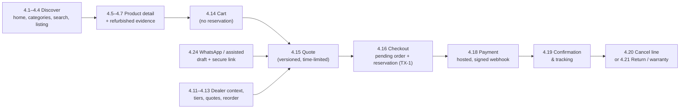

# 08 — E-commerce features (feature-level plan)

**Purpose.** Feature view of every customer-facing commerce capability the sources specify. Each feature ties
together the UI (storefront screens `P-S*`, store shell), backend modules and business rules (`M##`, `BR-M##-##`,
`05-backend.md`), entities (`E-*`, `03-database.md`), endpoints (`API-M##-##`, `06-api.md`), permissions (`R-*`,
auth classes of `06-api.md` §1.2; detail in `07-auth-roles-permissions.md`) and tests (BP `T01–T36`; suite IDs are
assigned in `16-testing.md`). Detail is **referenced, not repeated**: screen layout and components are in the
storefront frontend file (`04a-…`, written in parallel — screens are referenced by `P-S##`), staff-side operations
in `10-erp.md`, vendor features in `09-vendor-marketplace.md`.

**Sources used.** BP §2.1 (R01–R20), §3.1, §4, §5.1–§5.3, §6.1–§6.8, §7.1–§7.5, §8.1–§8.4, §9.1–§9.2, §9.4–§9.5,
§9.7, §10.1–§10.6, §12.2 (A04–A09, A13–A15, A22–A23, A27–A29, A32), §13.1–§13.5, §15.6, §16.5, §17.4–§17.6, §18.1,
§19.1–§19.3, §20.1, §21.2, §22.5, §23.1, §26.4, §26.7, §29.1–§29.6, §30.2 · PR1 §3, §4, §6, §8, §10 · PR2 §2–§4,
§6, §12 · MEET · MK `store-*.html` and `assets/tradex.js` (store shell) · plan files `00`, `02` §10, `03`, `05`,
`06`, `DECISIONS.md`.

**Labels and status.** Evidence labels and status values as defined in `00-conventions.md` §2–§3. Every
implementable item is `NOT_STARTED` unless marked `REQUIRES_DECISION (D-xxx)`. Platform-level prerequisites (D-001
operational core, D-003 storefront framework, D-049 UI sign-off, D-079 idempotency transport, D-080 API conventions,
D-083 session mechanism) apply to every feature and are **not repeated per feature** (same rule as `06-api.md`
§1.15). Mockup sample values (prices, day counts, "15 min", "4 h", "₹50,000", bank names) are not requirements
(`00-conventions.md` §1.1).

**Decision aliases.** `05-backend.md` and `06-api.md` cite D-140, D-143, D-144, D-148; this file cites the
surviving IDs **D-129** (cart), **D-121** (dealer quotes/quick order), **D-131** (supplier PO confirmation/ASN),
**D-137** (vendor roles).

**Auth classes** (from `06-api.md` §1.2): `PUB` guest · `CUS` customer/dealer member · `GAT` guest order-access
token · `LNK` secure checkout link · `STF` staff · `VEN` vendor · `INT` machine · `SIG` provider webhook.

---

## 1. Scope

| In scope (this file) | Where the rest lives |
|---|---|
| Customer-facing features of M09 (storefront) and the customer-facing parts of M04, M05, M06, M08, M10, M11, M12, M13, M16, M20, M21, M22, M27 | Staff operations on the same records (release, pick/pack, RMA decisions, refunds, reconciliation): `10-erp.md`; screens P-E*: `04b-…` |
| Guest, consumer and approved-dealer journeys (R-guest, R-consumer, R-dealer) | Vendor/supplier journeys and marketplace (M14, M15): `09-vendor-marketplace.md` |
| Assisted/WhatsApp ordering as seen by the customer | Shared inbox and assisted-order screens: `10-erp.md`, `11-admin.md`, `04b-…` |
| Phase 1 web (desktop/laptop) behaviour | Mobile-friendly e-commerce and app (M28, Phase 2, `LATER`, D-085); AI (M29, Phase 3, `LATER`, D-086) |

Phase-1 interpretation: "Phase 1 prioritises web shopping and ERP operations on agreed desktop/laptop browsers. The
mobile-specific elements … belong to Phase 2" (BP §6; §28.4). Acceptance T29 is Phase 2 only (BP §23.1).

## 2. Cross-cutting rules for every e-commerce feature

| # | Rule | Enforced by | Source |
|---|---|---|---|
| 1 | One server-side price calculation for web, staff, WhatsApp and future app; the client never supplies price, discount, tax, buyer type, stock, seller or refund approval | BR-M05-01, BR-M05-08; `06-api.md` §1.4 | BP §8.1, §8.4, §17.4; T10 |
| 2 | Buyer context (consumer vs dealer) is derived from verified membership of an approved business account; sign-out removes private prices | BR-M02-13, BR-M05-16 | BP §6.5, §8.4; T02, T22 |
| 3 | Public content may be cached; any response that depends on buyer context (dealer price, quote, cart, account, order, invoice) is private and never cached under a shared URL | BR-M09-01, BR-M05-15; `06-api.md` §1.11 | BP §8.4, §16.5; PR2 §3; T22 |
| 4 | Browse/search availability is a projection with an as-of time; checkout revalidates price and reserves stock with the authority | BR-M06-01, BR-M06-18, BR-M21-03 | BP §9.1, §16.5; PR2 §3 |
| 5 | Honest merchandising: no fabricated ratings, stock scarcity, fake discounts or misleading condition labels; ratings only when real data exists | BR-M04-18 | BP §6.1, §6.4 |
| 6 | Condition clarity: new, open-box, refurbished and used are visibly distinct, shown as text + colour + plain-language meaning; status never by colour alone | BR-M04-13 | BP §6.1, §6.7; MK:store-product.html ("Condition = text + colour + plain-language meaning") |
| 7 | Transparent purchase: payable price, stock status, shipping terms, warranty provider and return conditions are shown before payment | BR-M04-14, BR-M12-13 | BP §6.1 |
| 8 | Unverified supplier quantity is never presented as company-owned stock | BR-M06-14, BR-M14-11 | BP §9.7; MK:vendor-availability.html ("Supplier stock is never Tradex stock") |
| 9 | Every screen implements the BP §6.3 important states plus loading, empty, error, desktop/laptop viewport and accessibility states | frontend definition of done | BP §6.3, §22.5 |
| 10 | Accessibility target WCAG 2.2 AA with agreed scope; key flows completable by keyboard only | T30 | BP §6.7; D-051 |
| 11 | Performance: optimise images, limit third-party scripts; LCP/INP/CLS targets are negotiation starting points | BR-M09-04 | BP §6.1, §20.1; D-034 |
| 12 | Tax display convention by buyer type; money never floating point; currency INR | BR-M05-02, BR-M05-19 | BP §8.1, §26.4 Q35; D-016, D-104, D-059 |
| 13 | Personal data collected by purpose; marketing consent separate from service messages; opt-in/opt-out history | BR-M08-06, BR-M08-10 | BP §13.3, §19.2–§19.3 |
| 14 | Rate limits and abuse protection on sign-in, OTP, order access and checkout without hindering normal shopping | BR-M02-09 | BP §19.1; D-084 |
| 15 | Material changes (price, order state, cancellation, refund) are audited with actor and reason | `06-api.md` §1.14 | BP §17.3, §20.1 |
| 16 | "Amazon/Flipkart-like" means familiar patterns with an original visual identity; reference-screen preferences become design requirements | frontend (D-049) | BP §1.3, §6.7; PR2 §3 |

## 3. Feature index

BP §5.2 legend: **M** must-have · **C** conditional · **L** later · "—" not in the matrix. Status is the feature's
overall status; sub-items may differ (see each section).

| § | Feature | Phase | BP §5.2 | Evidence | Status | Screens | Main modules | Blocking / key decisions |
|---|---|---|---|---|---|---|---|---|
| 4.1 | Storefront home & merchandising | 1A | M (web UI) | DOCUMENTED / MOCKUP | NOT_STARTED; curated content REQUIRES_DECISION | P-S01, shell(S) | M09, M04, M05, M21 | D-142, D-043, D-180 |
| 4.2 | Categories & navigation | 1A | M | DOCUMENTED | NOT_STARTED | shell(S), P-S02 | M04, M21 | — |
| 4.3 | Search | 1A (improve 1B; advanced 2/3) | M | DOCUMENTED | NOT_STARTED | shell(S), P-S02 | M21, M04 | D-032 (PROPOSED-DEFAULT) |
| 4.4 | Category listing: filters, sort, product cards | 1A | M | DOCUMENTED | NOT_STARTED | P-S02 | M21, M04, M05, M06 | D-016 |
| 4.5 | Product detail | 1A | M | DOCUMENTED | NOT_STARTED | P-S03 | M04, M05, M06, M12 | D-016, D-022, D-028, D-073 |
| 4.6 | Refurbished trust & unit-level evidence | 1A | M (R19) | DOCUMENTED | REQUIRES_DECISION | P-S03#inspection, P-S04, P-S13 | M06, M04 | D-023, D-031 |
| 4.7 | Compatibility & bundles | 1A | — (A32 P1/C; BP §7.5) | CONDITIONAL | REQUIRES_DECISION | P-S03 | M04, M06 | D-071, D-072 |
| 4.8 | Product comparison | 1A/1B | C | CONDITIONAL | REQUIRES_DECISION | P-S05, compare tray | M04 | D-042 |
| 4.9 | Wishlist | 1A/1B | C | CONDITIONAL | REQUIRES_DECISION | P-S09#wishlist, P-S02, P-S03 | M08 | D-042, D-141 |
| 4.10 | Reviews & ratings | 1A/1B (improve 2/3) | C | CONDITIONAL | REQUIRES_DECISION | P-S03#reviews | M04 | D-041 |
| 4.11 | Consumer vs dealer pricing & quantity tiers | 1A (improve 1B; credit 2/3) | M | DOCUMENTED / PROPOSED | REQUIRES_DECISION | P-S02, P-S03, P-S06, P-S07, P-S11#pricelist | M05, M08, M02 | D-016, D-017, D-018 |
| 4.12 | Dealer application & business accounts | 1A | M | DOCUMENTED | REQUIRES_DECISION | P-S12#dealer, P-S11 | M08, M02, M05 | D-066, D-067 |
| 4.13 | Dealer quotes, quick order & reorder | 1A (CSV 1B) | — (BP §26.7 Q64) | MOCKUP (reorder DOCUMENTED) | REQUIRES_DECISION | P-S11#quotes/#bulk/#reorder, P-S01 | M05, M10 | D-121 |
| 4.14 | Cart | 1A | M | DOCUMENTED | REQUIRES_DECISION | P-S06 | M10, M05, M12 | D-129 |
| 4.15 | Quote & price revalidation | 1A | M | DOCUMENTED / PROPOSED | REQUIRES_DECISION | P-S06, P-S07 | M05, M10 | D-017, D-154 |
| 4.16 | Checkout | 1A | M | DOCUMENTED | NOT_STARTED; sub-items REQUIRES_DECISION | P-S07 | M10, M06, M05, M12, M11 | D-026, D-182, D-181 |
| 4.17 | Guest checkout & guest order access | 1A | M ("policy to confirm") | DOCUMENTED | REQUIRES_DECISION | P-S07, P-S08, P-S09, P-S10 | M10, M02 | D-021 |
| 4.18 | Payment (hosted provider, webhooks; COD conditional) | 1A | M | DOCUMENTED | REQUIRES_DECISION | P-S07, P-S08, P-S11 | M11, M23 | D-012, D-020, D-026 |
| 4.19 | Order confirmation & tracking | 1A | M | DOCUMENTED | NOT_STARTED | P-S08, P-S09#orders | M10, M11, M12, M19 | D-013, D-150 |
| 4.20 | Customer cancellations | 1A | M | DOCUMENTED | NOT_STARTED | P-S08, P-S10 | M10, M06, M11 | D-022, D-082 |
| 4.21 | Returns & warranty requests (customer side) | 1A (advanced RMA 2/3) | M | DOCUMENTED | REQUIRES_DECISION | P-S10, P-S09#returns | M13, M12 | D-022 |
| 4.22 | Customer account | 1A | M | DOCUMENTED | REQUIRES_DECISION | P-S12, P-S09 | M02, M08, M19 | D-040, D-060 |
| 4.23 | Customer notifications | 1A | M (A14 P1) | DOCUMENTED | REQUIRES_DECISION | (messages), P-S09#privacy | M20, M16 | D-058, D-015, D-014 |
| 4.24 | WhatsApp click-to-chat, assisted & guided ordering | L1 + assisted 1A; L2 1B; L3 LATER | M (L1 + assisted); C 1A / M 1B (structured) | DOCUMENTED | REQUIRES_DECISION | P-S01, P-S03, P-S08, P-S13, P-S07 (link), shell(S) | M16, M10 | D-014, D-151 |
| 4.25 | Help centre, guided chat & policies | 1A (improve 1B; AI option 2/3) | M | DOCUMENTED | REQUIRES_DECISION | P-S13, shell(S) chat | M16, M04, M03 | D-074, D-037, D-022 |
| 4.26 | SEO & discoverability | 1A | — (BP §6.8) | DOCUMENTED | NOT_STARTED; redirects REQUIRES_DECISION | P-S01–P-S04, P-S13 | M27, M04, M09 | D-076 |
| 4.27 | Store availability & pickup | 1A | — ("pickup if supported", BP §10.5) | DOCUMENTED / MOCKUP | REQUIRES_DECISION | P-S03, P-S07, P-S01, P-S13 | M06, M12, M03 | D-061, D-029 |
| 4.28 | Promotions & coupons | 1A | — (BP §8.1 step 4) | DOCUMENTED / PROPOSED | REQUIRES_DECISION | P-S06, P-S01, P-S02, P-S03 | M05 | D-043 |
| 4.29 | Mockup-only storefront extras (EMI/offers, Q&A, alerts, recently viewed, saved payment methods, delivery OTP) | — | — | MOCKUP-ONLY | REQUIRES_DECISION | P-S03, P-S07, P-S02, P-S06, P-S09 | various | D-062, D-065, D-141, D-180, D-183, D-184 |

---

## 4. Feature specifications

### 4.1 Storefront home & merchandising

| Item | Value |
|---|---|
| Phase · requirements | 1A (BP §5.1) · R01, R02, R03, R14, R19 (BP §2.1); PR2 §3 "Home / discovery" |
| BP §5.2 | M — "E-commerce and ERP web UI/design system" |
| Evidence | DOCUMENTED — BP §6.3 Home: "Search, category access, curated collections, trust information"; states "Slow connection, no promotions, signed-in dealer"; MOCKUP — MK:store-home.html |
| Status | NOT_STARTED · curated-content source/editor REQUIRES_DECISION (D-142) · deals REQUIRES_DECISION (D-043) |

**Frontend.** P-S01 sections (MK:store-home.html annotations): hero campaign ("R01 Original visual identity ·
curated campaigns"); curated collection tiles; dealer pricing promotion for guests ("R03/R04 Dealer pricing &
quantity tiers"); signed-in dealer modules — quick order by SKU, reorder usual items, business-account card ("R03
Signed-in dealer home", "Dealer repeat orders with tier pricing"); shop by category ("R07 Configurable categories");
deals of the day ("Promotions (honest discounts vs MRP)"); certified refurbished block with "What our grades mean"
("R19 Refurbished trust: grade rubric + unit-level evidence"); category landing tiles; dealer application call to
action ("R03 Dealer application → approval → private price list"); continue shopping (recently viewed, §4.29);
WhatsApp ordering block ("1A click-to-chat · 1B guided WhatsApp ordering (R11)"); top brands; "Visit a Tradex store"
("R14 Branches share one stock authority"). Shell(S): header search, category bar, mega menu, footer. Components
shared with P-S02: product card, condition badge, price component (tax basis D-016), trust block.

**Backend.** M09 StorefrontContentService (BR-M09-01 … BR-M09-04); M04 category tree and published catalog; M05
context price for cards; M21 search entry; M03 store information.

**Database.** E-merch_collection (`00-conventions.md` §7.1, DOCUMENTED, editor D-142) · E-category · E-product ·
E-sku · E-offer · E-promotion (deals, D-043) · E-location (stores) · E-business_account (dealer card).

**APIs.** API-M09-01 (home modules; REQUIRES_DECISION D-142) · API-M04-01 · API-M21-01 · API-M04-03 (card prices) ·
API-M03-01 (stores) · API-M08-24 (dealer business-account card) · API-M05-03 (quick order; D-121) · API-M10-02 (add
to cart / "Add 10").

**Business logic.**
1. Resolve the buyer context on the server (BR-M02-13): guest or consumer → public modules; verified member of an
   approved business account → dealer modules as well (BP §6.3 state "signed-in dealer").
2. Curated collections come from approved content, not a recommendation model (BP §6.3; BP §15.6 "curated
   recommendations before a recommendation model"); source and editing role → D-142.
3. Product cards on the home page follow the card rules of §4.4 (price from the engine, condition, warranty summary,
   stock message as a projection).
4. Only published products with published offers appear in any module (BP §7.3, §17.6); archived items are dropped
   from collections automatically.
5. "No promotions" state: deal modules are omitted, never shown empty or with fabricated discounts (BP §6.1, §6.3).
6. "Slow connection" state: progressive rendering; optimised images; limited third-party scripts (BP §6.1, §6.3).
7. Deals show a reference price only when it is genuine (BP §6.1 "No … fake discounts"); which reference price is
   allowed (MRP vs previous price) → D-043.
8. Dealer modules and any dealer price are private responses, never cached under a shared URL (BR-M09-01; T22).

**Validation.** Every collection item references a published product/offer; module content without an approved
source is not rendered.

**Permissions.** PUB, CUS; dealer modules only for R-dealer (active member of an approved account). Editing home
content: role per D-142 (no staff screen in the mockup — D-004).

**Testing.** T01 (trust information visible), T22 (dealer then guest in the same browser: no dealer data), T30
(keyboard navigation), T35 (page performance while imports/reports run). Feature tests: home without promotions
renders no empty deal blocks; dealer modules absent for guest/consumer; archived product removed from a
collection; LCP/INP/CLS measured on agreed desktop browsers (D-034).

**Dependencies.** §4.2, §4.3, §4.4, §4.11; M04 publication; D-049 design sign-off.

**Completion criteria.** (1) All BP §6.3 Home states implemented (slow connection, no promotions, signed-in
dealer). (2) T22 passes. (3) Lab measurements within the D-034 targets before launch (BP §20.1). (4) No private data
in any cached home response.

**Open decisions.** D-142, D-043, D-180, D-049, D-105 (caching mechanism), D-106 (analytics).

### 4.2 Categories & navigation

| Item | Value |
|---|---|
| Phase · requirements | 1A · R07 (generic ERP accommodating new products), R01 |
| BP §5.2 | M — "Categories, filters, search, product details" |
| Evidence | DOCUMENTED — BP §6.2 information architecture; §7.1 "Adding an ordinary category should require configuration and content"; §29.8; MOCKUP — shell(S) category bar, mega menu, footer, PIN modal (`assets/tradex.js`) |
| Status | NOT_STARTED |

**Frontend.** Shell(S): header (search, "Deliver to" PIN modal `m-pin`, account, cart count), category bar, mega
menu, footer, help/chat widget (§4.25), compare tray (§4.8). P-S02 category landing, breadcrumbs on P-S02/P-S03.

**Backend.** M04 CategorySchemaService (BR-M04-01, BR-M04-04); M21 facets; M12 ServiceabilityService for the PIN
modal (BR-M12-13).

**Database.** E-category · E-category_attribute · E-attribute_definition.

**APIs.** API-M04-01 (public tree with filterable attributes) · API-M12-01 (PIN modal) · API-M02-01 (context for
header).

**Business logic.**
1. Navigation follows BP §6.2: Storefront → Discover (search and categories) → Product and offer details → Cart →
   Checkout → Orders and tracking → Returns and support; Account and business access from the header.
2. Only published categories are shown; the tree carries each category's filterable attributes for §4.4.
3. A new ordinary category is added by configuration (attributes, filters, content) and appears in navigation after
   publication without code or product-table change (BR-M04-01; BP §29.8; T36).
4. The "Deliver to" PIN is a browsing hint that drives delivery estimates (API-M12-01); it is not a trusted address
   and does not change the price context except through the documented location rule (BP §8.4; D-044).

**Validation.** PIN is six digits (MK:store-checkout.html validation message); unknown category → not found.

**Permissions.** PUB.

**Testing.** T36 (new category configured end-to-end), T30 (mega menu and category bar by keyboard). Feature tests:
unpublished category hidden; new category visible after publication without deployment.

**Dependencies.** M04 category schema; §4.4.

**Completion criteria.** T36 passes without code change (BP §29.8; PR2 §12 "New ordinary category").

**Open decisions.** D-049 (design), D-050 (languages), D-013 (serviceability source for the PIN modal).

### 4.3 Search

| Item | Value |
|---|---|
| Phase · requirements | 1A; improve 1B; "Advanced search" 2/3 (BP §5.2) · R01 |
| BP §5.2 | M — "Start with useful relevance, not AI search" |
| Evidence | DOCUMENTED — BP §6.1 "Search first", §6.4, §16.5, §4 (zero-result searches and search-to-product clicks), §28.5 (dedicated engine trigger); MOCKUP — MK:store-listing.html ("Search: exact SKU/model, spelling variants, curated synonyms"; "No-results state: suggestions, sourcing request, alternatives"), `assets/tradex.js` ("Search-first · exact model/SKU + synonyms") |
| Status | NOT_STARTED · engine PROPOSED-DEFAULT (D-032) |

**Frontend.** Shell(S) search box with type-ahead suggestions; P-S02 in search mode (result count, spelling
correction/synonym notice, no-results state with suggestions and alternatives, filtered-to-zero state).

**Backend.** M21 SearchService, SuggestionService, SynonymService, SearchIndexer (BR-M21-01 … BR-M21-06); M04
projection refresh on publication (BR-M04-20); M06 availability projection (A04).

**Database.** E-product · E-sku · E-offer · E-sku_attribute_value · E-search_synonym (`00-conventions.md` §7.1,
DOCUMENTED).

**APIs.** API-M21-01 (search, contract `06-api.md` §4.17) · API-M21-02 (suggestions) · API-M21-04 (curated synonyms;
staff, no mockup screen — D-004).

**Business logic.**
1. Exact model and SKU matches rank first; spelling variants, abbreviations (SSD/HDD) and curated synonyms plus
   structured fields are supported (BP §6.4).
2. Only the approved visible catalog is searchable (BR-M21-04; BP §17.4 "Only approved visible catalog").
3. Results are a discovery projection carrying version/timestamp; they never decide price or stock at checkout
   (BR-M21-03; BP §16.5).
4. Dealer private prices are never indexed into shared projections; prices in results are computed for the caller's
   context at response time; guest responses cacheable, dealer responses private (BR-M21-06).
5. Zero-result searches and search-to-product clicks are logged anonymously (BR-M21-05; BP §4 "Better discovery").
6. No-results state offers suggestions and alternatives; the "Request this product" sourcing action is MOCKUP-ONLY
   (D-141).
7. Native/database search first; a dedicated engine only if measured relevance or latency fails at real catalog size
   (D-032; BP §28.5). No AI search in Phase 1 (BP §5.2).

**Validation.** Query length bounded; filter keys only from the category schema (§4.4); page bounds.

**Permissions.** PUB, CUS. Synonym maintenance: STF (R-catalog_staff; permission key in `07-…`).

**Testing.** T01, T02 (no private price in public results), T36 (new category searchable and filterable). Feature
tests: relevance fixtures for exact SKU, exact model, abbreviation, synonym, misspelling; zero-result log contains
no personal data; latency within D-034 (p95 proposal, BP §20.1).

**Dependencies.** §4.2; M04 publication; A04 projection.

**Completion criteria.** Agreed relevance and latency tests pass on a representative catalog (volumes D-010);
zero-result metric available to the customer-funnel report (M18, BP §14.3).

**Open decisions.** D-032, D-034, D-010, D-141, D-106.

### 4.4 Category listing: filters, sort, product cards

| Item | Value |
|---|---|
| Phase · requirements | 1A · R01, R03, R04, R07, R08, R19 |
| BP §5.2 | M |
| Evidence | DOCUMENTED — BP §6.3 Category/search ("Product cards, relevant filters, sort, result count"; states "No results, unavailable filters, pagination, unavailable products"), §6.4 (card content; category-dependent filters; dealer tier hints without exposing private prices to guests); PR2 §3 ("Filters, sorting, availability, price, condition and relevant product attributes"); MOCKUP — MK:store-listing.html |
| Status | NOT_STARTED · tax display REQUIRES_DECISION (D-016) |

**Frontend.** P-S02: filter panel from the category attribute template ("R07 Filters come from the category
attribute template"), active filter chips, sort, result count, pagination, layout switch, product card, dealer
context banner ("R03 Dealer context: private list, ex-GST" — basis D-016), refurbished explainer inside results
("R19"), projection note ("R08 Stock & delivery shown are a projection; checkout re-checks"), tier hint on cards ("R04
Quantity tiers apply per SKU"), filtered-to-zero and no-results states, compare and wishlist toggles (§4.8, §4.9),
"Save search & alert me" (MOCKUP-ONLY, §4.29), recently viewed (§4.29).

**Backend.** M21 facets and results; M04 attribute schema (BR-M04-04); M05 context price and tier hint (BR-M05-16);
M06 availability projection (BR-M06-18).

**Database.** E-category_attribute (filterable flag, display order) · E-sku_attribute_value · E-offer ·
E-price_list_item / E-quantity_tier (through the engine) · E-stock_position (projection).

**APIs.** API-M21-01 · API-M04-01 · API-M04-03 (if card offers are not embedded) · API-M10-02 (add from card) ·
API-M08-17 (wishlist, D-042) · API-M20-07 (alerts, D-141).

**Business logic.**
1. Filters come only from the category's filterable attributes (BR-M04-04); irrelevant filters are never shown
   ("Do not show irrelevant laptop filters on camera products", BP §6.4).
2. Facet values without results are shown as unavailable rather than hidden silently (BP §6.3 "unavailable
   filters").
3. Card content: model/title, meaningful image, key specifications, condition, price with the tax display
   convention, warranty summary, stock/delivery message, rating only when real data exists (BP §6.4).
4. Dealer tier hints only for verified dealers; guests never receive private prices (BP §6.4; BR-M05-16).
5. Sort options: relevance, price ascending/descending, newest; rating sort only if D-041 enables reviews and real
   ratings exist; "biggest discount" only with honest reference prices (D-043).
6. Unavailable products are labelled accurately (out of stock / supplier confirmation needed) and never shown with a
   stale purchase offer (BP §6.3, §6.8; MK:store-product.html not-found text).
7. Stock/delivery message is a projection with its as-of time; supplier-held stock is labelled as such (BR-M06-14).
8. Filter URLs follow the controlled SEO treatment (§4.26; BR-M27-01).

**Validation.** Filter keys ∈ category schema; numeric ranges; page and page-size bounds (D-080).

**Permissions.** PUB, CUS.

**Testing.** T01, T02, T22, T36, T30. Feature tests: camera category shows no laptop filters; rating filter absent
when D-041 is not enabled; tier hint absent for guest and consumer; out-of-stock product never shows "In stock".

**Dependencies.** §4.2, §4.3, §4.11.

**Completion criteria.** BP §6.3 listing states (no results, unavailable filters, pagination, unavailable products)
implemented; T36 filters pass; private prices never present in public listing responses.

**Open decisions.** D-016, D-032, D-041, D-042, D-043, D-141, D-180.

### 4.5 Product detail

| Item | Value |
|---|---|
| Phase · requirements | 1A · R01, R03, R04, R08, R11, R14, R19 |
| BP §5.2 | M |
| Evidence | DOCUMENTED — BP §6.3 Product detail ("Images, model, condition, specs, price, warranty, delivery, returns"; states "Variant unavailable, price changed, supplier confirmation needed"), §6.1, §6.6, §7.5; PR2 §3 ("Images, specifications, variants, condition, warranty/return information, availability, delivery estimate and pricing"); MOCKUP — MK:store-product.html |
| Status | NOT_STARTED · policy content REQUIRES_DECISION (D-022) · supplier-stock display REQUIRES_DECISION (D-028, D-073) |

**Frontend.** P-S03 (MK:store-product.html): gallery; title, model, SKU (unit ID for unique units); condition
label, colour and meaning; price block ("R03 One price engine: consumer incl. GST / dealer excl. GST"); dealer tier table
("R04 Quantity tiers (all-units) · ex-GST" — tier mode D-018); "Other offers for this model" (one offer per
condition, "Each offer is a separate stock position"); buy box with quantity, add to cart, delivery estimate by PIN
("PIN serviceability, date & COD before payment"), availability message ("R08 Availability is a projection;
checkout reserves"); availability by store ("R14", §4.27); policy row (warranty provider and duration with policy
version — "R19 Warranty provider named (brand vs Tradex) + policy version"; return window with policy version; "Sold
by" company); tabs description, specs (category template groups), inspection (§4.6), warranty, reviews (§4.10), Q&A
(§4.29); compatible accessories (§4.7); frequently bought together (§4.7); WhatsApp click-to-chat modal `m-wa`
(§4.24); compare/wishlist (§4.8, §4.9); page states normal, variant unavailable, price changed, supplier
confirmation; not-found state.

**Backend.** M04 CatalogQueryService (BR-M04-02, BR-M04-13, BR-M04-14, BR-M04-15, BR-M04-18); M05 PricingEngine
(BR-M05-04, BR-M05-08, BR-M05-15, BR-M05-16); M06 projections and unit report (BR-M06-14, BR-M06-18); M12
ServiceabilityService (BR-M12-13).

**Database.** E-product · E-sku · E-sku_attribute_value · E-offer (warranty_policy_id, return_policy_id,
unit_specific, availability_source, backorder_policy, disclosed_lead_time) · E-media_asset · E-condition_grade ·
E-warranty_policy · E-return_policy · E-serial_unit · E-inspection · E-supplier_availability.

**APIs.** API-M04-02 · API-M04-03 (context-priced offers, `06-api.md` §4.1) · API-M04-04 (policies) · API-M06-01
(store availability; D-029, D-061) · API-M06-02 (unit report) · API-M12-01 (serviceability) · API-M10-02 (add to
cart) · conditional: API-M04-05 (D-071), API-M04-06 (D-072), API-M04-07/-08/-09 (D-041), API-M04-11/-12 (D-065),
API-M04-14 (D-141), API-M08-17 (D-042), API-M20-07 (D-141).

**Business logic.**
1. Offers are returned only for published products and approved offers in the caller's price context; no offer for
   the context → empty list, not an error (API-M04-03; BR-M04-06).
2. Condition is shown as label + colour + plain meaning; grade meaning comes from the approved rubric version
   (BR-M04-13; D-023).
3. Warranty provider is always explicit (manufacturer, company or supplier); a seller warranty is never presented as
   a manufacturer warranty; warranty duration and return window are separate fields (BR-M04-14; BP §6.6, §7.5).
4. Before payment the page shows payable price, stock status, shipping terms, warranty provider and return
   conditions (BP §6.1).
5. Price from the single engine; tax basis by buyer type (D-016); dealer tiers only for verified members (T02); the
   mockup's "all units priced at the reached tier" is illustrative — tier mode D-018 (BP §8.2).
6. Availability is a projection with its as-of time (BR-M06-18). Supplier-held availability is labelled with lead
   time and never as "In stock" (BR-M06-14; MK:vendor-availability.html "Customers see it only as 'Ships in 4–6 days
   · partner stock'"); stale supplier data switches the page to the "supplier confirmation needed" state (BP §6.3,
   §9.7; D-028); whether supplier-held stock may be sold at all is D-073.
7. Delivery estimate comes from serviceability for the PIN entered (API-M12-01; D-013); COD eligibility is shown only
   if D-020 enables COD.
8. Variant unavailable: the page shows other conditions/configurations that are available; no stale purchase offer
   (BP §6.3, §6.8).
9. Price changed since the page was loaded (or since added to cart): disclosed, never silent (BP §6.3, §8.1 step 8).
10. Archived or unknown product: redirect or useful unavailable page (BR-M27-04; T32).
11. Unit-specific offer (unique condition/photos advertised) → that serial is reserved at checkout (BR-M06-07; D-031;
    §4.6).
12. Seller shown is the company (launch model D-007; seller of record D-008).

**Validation.** Quantity > 0 and within offer limits; PIN format; add-to-cart only for purchasable offers.

**Permissions.** PUB, CUS; public unit report shows a masked manufacturer serial (MK "Serial (masked)"; D-153).

**Testing.** T01, T02, T10, T14 (stale supplier feed changes the promise), T22, T33 (order keeps the terms shown at
purchase), T30. Feature tests: publishing blocked without a warranty provider; supplier-sourced offer never
labelled "In stock"; price-changed state appears when the engine result differs from the displayed price.

**Dependencies.** §4.4, §4.6, §4.11, §4.27; M04 publication checks; M06 A04 projection; M12 serviceability.

**Completion criteria.** All BP §6.3 product states implemented; T01 accepted; policy versions displayed equal the
versions stored on the order line (T33).

**Open decisions.** D-016, D-018, D-022, D-023, D-028, D-031, D-061, D-073, D-013, D-020, D-007, D-008, D-153, plus
conditional D-041, D-042, D-062, D-065, D-071, D-072, D-141.

### 4.6 Refurbished trust & unit-level evidence

| Item | Value |
|---|---|
| Phase · requirements | 1A · R19 (warranty, RMA, authenticity, returns) |
| BP §5.2 | M — "Basic returns, refund and warranty traceability … Essential for refurbished equipment"; "Central stock, warehouse and serial records" |
| Evidence | DOCUMENTED — BP §6.6, §7.2 (refurbished/serial fields), §9.4, §29.1, §4 ("Trust in refurbished sales"); PR1 §9; PR2 §4, §12 ("Refurbished laptop sale"); MOCKUP — MK:store-refurbished.html, MK:store-product.html#inspection, MK:store-help.html grade table |
| Status | REQUIRES_DECISION (D-023 grade rubric and checklist) · serial reservation PROPOSED-DEFAULT (D-031) |

**Frontend.** P-S04 refurbished landing ("R19 Refurbished landing: trust first, honest claims"; how refurbishment
works; grade comparison — cosmetic, battery, accessories, warranty; unit-level listing with own photos, inspection,
masked serial; condition filters text + colour; FAQ; "Honest merchandising — no unmeasured eco claims"); P-S03
inspection tab ("Inspection report for the exact serialised unit"; report download); P-S13 grade rubric and warranty
explained; P-S08 link to the inspection report of the dispatched unit.

**Backend.** M06 SerialUnitService, InspectionService, DataErasureService (BR-M06-07, BR-M06-16, BR-M06-22); M04
PolicyService (grade rubric versions; BR-M04-13, BR-M04-15); M22 unit photos.

**Database.** E-serial_unit · E-serial_event · E-inspection · E-condition_grade · E-warranty_policy · E-media_asset ·
E-offer (unit_specific).

**APIs.** API-M06-02 (public inspection report) · API-M04-03 (unit_ref on offers) · API-M04-04 (grade rubric,
warranty/return policies) · API-M21-01 (condition filters) · API-M09-01 (curated refurbished blocks; D-142) ·
API-M20-07 ("Alert me"; D-141).

**Business logic.**
1. A grade is meaningful only with the client-approved rubric describing cosmetic condition, functional checks,
   battery expectations, included accessories and warranty (BP §6.6; D-023). Mockup thresholds and "42-point" are
   samples.
2. For unique units, actual photographs and inspection results are linked to the serialised unit (BP §6.6); when a
   unique unit is advertised, that serial is reserved at checkout (BR-M06-07; D-031).
3. Known defects, replaced components, keyboard/layout differences, OS licensing status and box contents are
   displayed (BP §6.6).
4. Only units that passed inspection become sellable; quarantined units never appear (BP §29.1; BR-M07-04).
5. No "like new" or unmeasured claims unless the inspection standard supports them (BP §6.6; MK).
6. The public report shows the internal unit ID and a masked manufacturer serial (MK; masking policy D-153).
7. The order preserves grade and warranty terms effective at purchase; the dispatched serial and inspection record
   are attached to the sale (BP §29.1, §10.4; BR-M10-06, BR-M12-04; T33).
8. Storage-bearing devices need data-erasure evidence before resale (BR-M06-16; BP §7.5).

**Validation.** A unit-specific offer cannot be published without grade, inspection record, photos (rights
confirmed) and warranty policy (publication checker, `05-backend.md` M04 validation; E-sku grade constraint).

**Permissions.** PUB read. Recording inspections is staff work (R-warehouse_staff; `10-erp.md`).

**Testing.** T01, T17, T33; BP §15.3 proof scenarios 1–2 (three refurbished laptops, publish only accepted units).
Feature tests: quarantined unit absent from listing and search; report shows masked serial; order grade snapshot
unchanged after a new rubric version.

**Dependencies.** M07 receipt and QC, M06 serial units (`10-erp.md`); §4.5.

**Completion criteria.** T01 accepted in UAT by owner and operations; the "Trust in refurbished sales" measure
(condition-related returns ÷ delivered refurbished orders, BP §4) is reportable (M18).

**Open decisions.** D-023, D-031, D-022, D-153, D-142, D-141, D-057 (image rights).

### 4.7 Compatibility & bundles (CONDITIONAL)

| Item | Value |
|---|---|
| Phase · requirements | 1A conditional · R19 (fewer returns) |
| BP §5.2 | — (BP §7.5; A32 "P1/C") |
| Evidence | CONDITIONAL — BP §7.5 ("compatibility table … begin with curated data"; "Bundles need explicit component stock consumption"), A32; MOCKUP — MK:store-product.html ("§7.5 Curated compatibility table (reduces returns)"; "Bundles consume each component's stock explicitly"; "Frequently bought together … each keeps its own stock, warranty and return policy") |
| Status | REQUIRES_DECISION (D-071 compatibility, D-072 bundles) |

**Frontend.** P-S03 "Compatible accessories & upgrades" table; "Frequently bought together" block.

**Backend.** M04 CompatibilityService (BR-M04-16), BundleService (BR-M04-17); M06 component reservation.

**Database.** E-compatibility_link · E-bundle_component.

**APIs.** API-M04-05 (D-071) · API-M04-06 (D-072) · API-M10-02.

**Business logic.**
1. Compatibility links are curated with evidence; recommendations only for eligible, available items; never invented
   (A32; BP §28.1 "No unverified compatibility promises").
2. Uncertain compatibility questions are escalated to an agent, not answered by the system (BR-M16-10; BP §29.5).
3. A bundle consumes each component's stock explicitly; bundle stock is never freely editable (BP §7.5).
4. The mockup's "Frequently bought together" adds separate items with no bundle discount; if D-072 rejects bundles,
   this block depends on curated content (D-142) or compatibility data (D-071).

**Validation.** Links only between published products; bundle components must be purchasable.

**Permissions.** PUB read; curation by R-catalog_staff (`10-erp.md`).

**Testing.** Feature tests: out-of-stock compatible item not recommended; a bundle order reserves every component in
the same transaction (TX-1).

**Dependencies.** §4.5; M04; M06.

**Completion criteria.** Per decision; if enabled, compatibility-related returns are measurable (BP §4).

**Open decisions.** D-071, D-072, D-142.

### 4.8 Product comparison (CONDITIONAL)

| Item | Value |
|---|---|
| Phase · requirements | 1A C / 1B C · R01 |
| BP §5.2 | C — "Wishlist and basic product comparison … Useful for electronics; do not block reliable checkout" |
| Evidence | CONDITIONAL — BP §6.3 Comparison ("Side-by-side relevant specifications"; states "Different categories, missing specification; mobile scrolling in Phase 2"); BP §30.2 ("compare condition/specifications in the web storefront", 1A); MOCKUP — MK:store-compare.html ("Highlight differences / hide identical rows"; "Side-by-side specs from category template"; "Comparison state: different categories"; "Add another product (max 4)" — sample) |
| Status | REQUIRES_DECISION (D-042) |

**Frontend.** P-S05; compare tray in shell(S); "Compare" controls on P-S02 and P-S03.

**Backend.** M04 CatalogQueryService only; no dedicated service.

**Database.** Reads E-product, E-sku_attribute_value, E-category_attribute. The comparison list itself is not a
server record (no entity in the registry); persistence beyond the session is part of D-042.

**APIs.** API-M04-02 (per product) · API-M21-01 (add-product picker) · API-M10-02.

**Business logic.**
1. Rows follow the category template's display order; a missing specification is shown as missing, never guessed
   (BP §6.3).
2. Products from different categories: only common attributes are compared and the state is explained (BP §6.3).
3. Prices shown are the caller's context prices (rule 1 of §2).
4. Disabling comparison must not affect cart/checkout (BP §5.2 "do not block reliable checkout"); disabled →
   `FEATURE_DISABLED`.

**Validation.** Products must be published; unknown or unpublished items are removed from the comparison with a notice.

**Permissions.** PUB, CUS.

**Testing.** Feature tests: different-category state; hide-identical-rows; missing specification shown as missing.

**Dependencies.** §4.2, §4.5.

**Completion criteria.** If enabled: BP §6.3 comparison states implemented on desktop browsers (mobile scrolling is
Phase 2).

**Open decisions.** D-042 (and the maximum number of items, a UI value).

### 4.9 Wishlist (CONDITIONAL)

| Item | Value |
|---|---|
| Phase · requirements | 1A C / 1B C |
| BP §5.2 | C |
| Evidence | CONDITIONAL — BP §5.2; MOCKUP — MK:store-account.html#wishlist ("Price-drop & back-in-stock alerts (respect channel consent)"), wishlist buttons on P-S02/P-S03; share link and alerts are MOCKUP-ONLY (D-141) |
| Status | REQUIRES_DECISION (D-042; alerts D-141) |

**Frontend.** P-S09#wishlist (items with current context price and availability, alert toggles, share); wishlist
controls on P-S02/P-S03.

**Backend.** M08 WishlistService; M20 AlertSubscriptionService (D-141).

**Database.** E-wishlist_item (`00-conventions.md` §7.1, CONDITIONAL D-042) · E-alert_subscription (§7.1,
MOCKUP-ONLY D-141) · E-consent_record.

**APIs.** API-M08-16, -17, -18 (D-042) · API-M08-19 share link (D-042, D-141) · API-M20-06, -07 (D-141).

**Business logic.**
1. Signed-in customers only (CUS); a guest wishlist is not specified (D-042).
2. Items show the current price for the caller's context and the availability projection; dealer prices only to
   verified members.
3. Alerts are sent only with channel consent and frequency limits (BR-M08-06, BR-M20-01, BR-M20-03; T25); price-drop
   alerts must be honest (BP §6.1).

**Validation.** Only published offers can be added; duplicates ignored; alert creation requires recorded channel consent.

**Permissions.** CUS own records.

**Testing.** T25 (opted-out customer receives no alert). Feature tests: a dealer's wishlist never shows dealer prices
after membership removal.

**Dependencies.** §4.22, §4.23.

**Completion criteria.** If enabled: add/remove/list works without affecting checkout; alerts respect consent.

**Open decisions.** D-042, D-141, D-058.

### 4.10 Reviews & ratings (CONDITIONAL)

| Item | Value |
|---|---|
| Phase · requirements | 1A C / 1B C / improve 2/3 |
| BP §5.2 | C — "Require moderation and verified-purchase handling" |
| Evidence | CONDITIONAL — BP §5.2, §6.1 ("No fabricated ratings"), §6.4 ("rating only when real data exists"); MOCKUP — MK:store-product.html#reviews |
| Status | REQUIRES_DECISION (D-041) |

**Frontend.** P-S03#reviews (summary, list, write a review, helpful/report); rating on cards (§4.4) only when real
data exists.

**Backend.** M04 ReviewService (BR-M04-18, BR-M04-19).

**Database.** E-product_review (`00-conventions.md` §7.1, CONDITIONAL D-041) · E-order_line (verified purchase).

**APIs.** API-M04-07, -08, -09 · API-M04-10 (moderation; no staff screen in the mockup — D-004).

**Business logic.**
1. Only customers with a delivered order line for the product can submit a verified-purchase review (BP §5.2).
2. Reviews are moderated before publication; no imported or fabricated ratings (BP §6.1).
3. Rating summaries are computed only from published reviews; with none, no rating is shown (BP §6.4).

**Validation.** One review per customer per purchased product; text length and content rules per moderation policy (D-041); attachments per D-112.

**Permissions.** Submit: CUS with qualifying order line. Moderate: STF (role per D-041/`07-…`).

**Testing.** Feature tests: non-purchaser rejected; unmoderated review invisible; zero-review product shows no rating.

**Dependencies.** §4.19 (delivered lines); moderation UI decision (D-004).

**Completion criteria.** If enabled: verified-purchase and moderation rules enforced by tests.

**Open decisions.** D-041, D-004, D-036 (retention of review content).

### 4.11 Consumer vs dealer pricing & quantity tiers

| Item | Value |
|---|---|
| Phase · requirements | 1A; improve 1B; credit terms 2/3 (BP §5.2) · R03, R04 |
| BP §5.2 | M — "Dealer approval, price list, quantity tiers … Default prepaid" |
| Evidence | DOCUMENTED — BP §8.1–§8.4, §6.4, §6.5, §3.1; PR1 §8; PR2 §4; MEET ("dealer and retail prices and potentially location-based pricing engines"); calculation sequence PROPOSED (BP §8.1 "proposed, not a settled client policy"); MOCKUP — MK:store-product.html, store-listing.html, store-cart.html ("R04 Tier explanation per line"; "R03 Dealer: ex-GST + GST breakdown"), store-dealer.html#pricelist |
| Status | REQUIRES_DECISION (D-016 tax display, D-017 precedence, D-018 tier mode) |

**Frontend.** Price component on P-S01–P-S07 (basis label per D-016); dealer tier table on P-S03; tier/discount
explanation per cart line on P-S06; private price list on P-S11#pricelist ("retail vs your price vs 5+/10+,
ex-GST" — breakpoints are samples); dealer context banner on P-S02; locked business billing on P-S07.

**Backend.** M05 BuyerContextResolver, PricingEngine, QuoteService (BR-M05-01 … BR-M05-20); M08 membership and
account state (BR-M08-01, BR-M08-05); M02 context derivation (BR-M02-13).

**Database.** E-price_list · E-price_list_item · E-quantity_tier · E-price_rule_version · E-customer_segment ·
E-business_account (price_list_id, contract_price_list_id, state) · E-business_account_member · E-quote ·
E-quote_line · E-margin_floor · E-promotion.

**APIs.** API-M04-03 · API-M05-01 · API-M05-02 · API-M05-04 (dealer price list) · API-M05-05 (export; D-152) ·
API-M02-01.

**Business logic — calculation sequence (BP §8.1, PROPOSED, D-017).**
1. Identify selling company, currency, channel, offer and customer context (server-derived).
2. Resolve an approved customer-specific contract price, else the dealer price list, else the public price list.
3. Apply the applicable quantity tier for that SKU/offer and unit of measure (all-units vs graduated, per SKU vs
   basket: D-018; units of measure D-127).
4. Apply only eligible promotions under the explicit stacking policy (D-043); never silently choose the largest
   discount unless that is the approved rule (BR-M05-05).
5. Apply shipping and tax using approved finance rules (D-016, D-037, D-182).
6. Validate margin/discount authority and serviceability (BR-M05-10; D-024).
7. Show the final amount and lock a time-limited quote version (D-154).
8. Revalidate at order/reservation; notify the buyer of material changes (§4.15).

**Business logic — edge cases (BP §8.4 table).**

| Case | Required behaviour | Rule |
|---|---|---|
| Dealer signs out | Private prices and cached responses no longer accessible | BR-M02-13, BR-M05-15; T22 |
| Guest modifies customer type in a request | Server ignores it and derives the authorised context | BR-M05-08; T10 |
| Promotion plus dealer discount | Agreed stacking rule applied; explanation shown | BR-M05-07; D-043 |
| Expired price list | Fail to a defined valid price or block checkout; never zero | BR-M05-09 |
| Product below minimum margin | Authorised override with reason (approval request) | BR-M05-10; D-024 |
| Quantity changes after quote | Recalculate tier; require confirmation | BR-M05-11 |
| Location changes | Re-evaluate serviceability, tax and any approved location price | BR-M05-12; D-044 |
| Refund on discounted order | Use original allocated line discount and tax records | BR-M05-13 |
| Supplier changes cost | Live prices do not change automatically unless an approved rule permits | BR-M05-14 |
| Shared page cache | Public content may cache; private price responses isolated | BR-M05-15 |

Further rules: the BP §8.2 quantity example (consumer 1 unit; dealer 1/5/10 units) is illustrative only; partial
cancellations/returns and tier entitlement → D-082 (no retroactive repricing without agreed policy and disclosure);
dealer orders default to prepaid (BP §8.3; D-019); the final price and rule version are preserved on each order line
(BR-M05-03).

**Validation.** Price-list validity window with a defined fallback; tier breakpoints strictly increasing; quantities greater than
zero (`05-backend.md` M05 validation).

**Permissions.** Public list for PUB/consumer; dealer list only for active members of approved accounts (R-dealer);
contract prices only for that account. Staff price simulation and list changes are staff features (`10-erp.md`,
P-E07).

**Testing.** T02, T03, T10, T22, T33, T34; BP §29.2 scenario; unit matrix of each precedence branch, expired list
and stacking; cache-isolation test (dealer then guest in the same client).

**Dependencies.** §4.12 (membership); M04 offers; D-016/D-017/D-018 recorded.

**Completion criteria.** WP07 "Price matrix and privacy tests pass" (BP §22.2); T02/T03/T22 pass (BP §30.2 Dealer
commerce); no endpoint accepts a price from the client.

**Open decisions.** D-006, D-016, D-017, D-018, D-019, D-043, D-044, D-082, D-104, D-127, D-152, D-154, D-024.

### 4.12 Dealer application & business accounts

| Item | Value |
|---|---|
| Phase · requirements | 1A · R03 |
| BP §5.2 | M (dealer approval) |
| Evidence | DOCUMENTED — BP §8.3 ("Application → business information review → approval/rejection → authorised account access … a typed identifier alone is not verification. Define who may invite additional employees … and who can see its invoices"), §6.3 Dealer account (states "Pending, rejected, suspended, approval expired"), §6.5, §3.1, A27; PR1 §4, §10 ("New wholesale account → approval → pricing group assignment"); PR2 §7; MOCKUP — MK:store-login.html#dealer, MK:store-dealer.html |
| Status | REQUIRES_DECISION (D-066 member roles, D-067 verification) |

**Frontend.** P-S12#dealer (business details with GSTIN "Verify", address from GST record, contact person,
documents, dealer terms version; "Applicant ≠ approved dealer · GSTIN verified not trusted"; "Application status:
Pending review" — review time is a sample); P-S11 public landing for guests ("R03 Business buyer landing (public, no
private prices)"; how approval works; illustrative tier example; track your application) and dealer zone for
approved members (#overview, #pricelist, #bulk, #quotes, #reorder, #invoices, #team — "§8.3 Business account
members & roles (owner invites)"; "§6.3 Dealer account states"). Staff review is P-E10#applications (`10-erp.md`).

**Backend.** M08 DealerApplicationService (A27), GstinVerificationPort (D-067), BusinessAccountService,
MembershipService (BR-M08-01 … BR-M08-05, BR-M08-13); M02 InvitationService; M05 price-list assignment.

**Database.** E-dealer_application · E-business_account · E-business_account_member · E-customer · E-address ·
E-attachment · E-terms_version · E-terms_acceptance · E-invitation.

**APIs.** Customer: API-M08-20 (apply), API-M08-21 (status), API-M08-22 (update/re-submit), API-M08-23 (GSTIN
verification), API-M08-24, API-M08-25 … -27 (members), API-M02-16 … -19 (invitations). Staff (P-E10): API-M08-33 …
-40.

**Business logic.**
1. A signed-in customer applies; the application is an applicant record, not an approved dealer; no dealer prices
   until approval (BP §8.3; MK).
2. A27: completeness is validated and the application routed to review; no automatic approval on unchecked
   documents.
3. GSTIN is verified against the registration source; a typed identifier alone is not verification (BP §8.3;
   method D-067).
4. Approval atomically creates the business account, the owner member and the price-list assignment
   (`05-backend.md` M08 DB/transactions; PR1 §10 "assign pricing group").
5. Member roles decide who may invite employees, who sees invoices and any per-member order limit (D-066; limits are
   MOCKUP).
6. Account states pending, approved, rejected, suspended, approval_expired (BP §6.3); suspension hides dealer prices
   and blocks new orders while history remains accessible (BR-M08-05).
7. Dealer orders are prepaid by default (D-019).
8. At checkout, dealer billing (GSTIN, registered address) is verified and locked (MK:store-checkout.html).
9. If the buyer switches to a non-eligible business or location, the basket is repriced with explicit notice (BP
   §6.5).
10. Dealer terms version accepted with evidence (E-terms_acceptance); process for new terms versions → D-188.

**Validation.** GSTIN format and verification result stored; document type/size and scanning (D-112); at least one
owner member; duplicate GSTIN check against existing accounts.

**Permissions.** Apply: CUS. Members: per D-066 (owner member invites). Staff decisions: STF (approver per D-067 and
BP §18.1 "Change dealer tier" row; thresholds D-024).

**Testing.** T02, T10, T22; A27 completeness tests. Feature tests: invited-but-not-active member gets public prices;
suspended account sees public prices and cannot order; approval-expired state shown on P-S11.

**Dependencies.** §4.22 (account), §4.11.

**Completion criteria.** Only verified members of approved accounts receive dealer context (`05-backend.md` M08
completion); sales/owner UAT of application → approval → private price list.

**Open decisions.** D-006, D-019, D-066, D-067, D-112, D-149 (staff "view as dealer"), D-188.

### 4.13 Dealer quotes, quick order & reorder

| Item | Value |
|---|---|
| Phase · requirements | 1A (CSV upload 1B per MK) · R03, R04 |
| BP §5.2 | — (BP §26.7 Q64 "Are … quotations or bulk order entry launch needs?"; §14.1 "Advanced quotations" = further expansion) |
| Evidence | Reorder: DOCUMENTED (BP §3.1 dealer "repeat orders"; PR1 §4 "bulk orders"; PR2 §2 "repeat ordering"). Quotes / quick order: MOCKUP — MK:store-dealer.html ("Quote with locked price & validity; accept → order at quoted price"; "R04 Quick order: paste SKU, qty lines"; "Parsed lines: availability, tier applied, errors per row"; "1B · Validated CSV/XLSX upload"; "Reorder at today's price & stock (changes shown before payment)"); BP §29.2 ("explicit backorder/quote") |
| Status | Reorder NOT_STARTED; quotes and quick/bulk order REQUIRES_DECISION (D-121) |

**Frontend.** P-S11#reorder, #bulk, #quotes; P-S01 "Quick order by SKU" (dealer home).

**Backend.** M05 QuickOrderValidator, QuoteRequestService (D-121); M10 order history.

**Database.** E-quote (`quote_type = dealer_request`, `requested_details` — D-121) · E-quote_line · E-sales_order.

**APIs.** API-M10-08 (reorder history) · API-M10-02 (add lines) · API-M05-03 (quick-order validation; D-121) ·
API-M05-06/-07/-09 (dealer requests, list, decline; D-121) · API-M05-08 (staff issues quote; no staff screen in the
mockup — D-004) · API-M10-06 (accept = place order with `quote_id`).

**Business logic.**
1. Reorder adds previous lines at today's price and stock; any change is shown before payment (MK; BP §8.1 step 8).
2. Quick order validates each row (SKU, quantity) for price, tier applied, availability and errors; valid rows go to
   the cart (MK).
3. Quantities beyond availability or large quantities offer the agreed alternative — reduced quantity, explicit
   backorder/quote, or rejection — never an unsupported delivery promise (BP §29.2; BR-M10-12; D-073).
4. A staff-issued quote locks a price with a validity window (D-154); acceptance places the order at the quoted
   price subject to stock reservation; an expired quote cannot be accepted (`QUOTE_EXPIRED`).
5. Credit terms are not enabled unless decided; checkout stays prepaid (BP §29.2; D-019).

**Validation.** Quick-order rows: known display SKU, quantity > 0, offer visible to the dealer context; quote acceptance only for the requesting account, unexpired version, same buyer context.

**Permissions.** R-dealer members with ordering permission (D-066).

**Testing.** T03; BP §29.2 scenario (ten SSDs, only eight available). Feature tests: quick-order row errors; quote
acceptance after expiry rejected.

**Dependencies.** §4.11, §4.12, §4.14, §4.16.

**Completion criteria.** Reorder: T03 plus change-before-payment disclosure. Quotes/quick order: per D-121.

**Open decisions.** D-121, D-154, D-073, D-004, D-048 (CSV upload phase), D-019.

### 4.14 Cart

| Item | Value |
|---|---|
| Phase · requirements | 1A · R03, R04, R08 |
| BP §5.2 | M ("Consumer checkout") |
| Evidence | DOCUMENTED — BP §6.3 Cart ("Items, condition, quantity, prices, discount explanation, delivery estimate"; states "Changed price, stock shortage, minimum quantity failure"), §6.5 ("Persist the cart safely across refreshes and allow recovery after payment interruption"); PR2 §3 ("Line-level quantity changes, availability revalidation, discount visibility and clear totals"), PR2 §6 ("Cart: Calculate current pricing context and validate basic availability"); MOCKUP — MK:store-cart.html |
| Status | REQUIRES_DECISION (D-129 cart persistence) |

**Frontend.** P-S06 (MK:store-cart.html): lines with condition, quantity, price and "R04 Tier explanation per
line"; dealer ex-GST + GST breakdown; coupon field ("Coupons with explicit stacking rules", §4.28); totals (reference
price saving, coupon, delivery, GST); "R08 Stock shortage: quantity reduced with reason"; "§8.1 Price change since
added is disclosed"; "§9.7 Partner stock ships separately"; "Split shipment disclosed before checkout"; empty-cart
state; "Saved for later · not reserved"; recently viewed (§4.29). Shell(S) cart count.

**Backend.** M10 CartService (BR-M10-18; D-129); M05 QuoteService; M12 ServiceabilityService; M06 advisory
availability.

**Database.** E-cart, E-cart_line (`00-conventions.md` §7.1, REQUIRES_DECISION D-129) or client-held basket; E-quote
for totals.

**APIs.** API-M10-01 … -05 (D-129) · API-M05-01 · API-M12-01 · API-M04-03 · API-M20-07 ("Notify me"; D-141).

**Business logic.**
1. The cart is not a reservation; stock is reserved only when the pending order is placed (BP §9.2 "Reservation
   created", §10.2).
2. Each cart view is re-quoted by the engine; a price change since adding is disclosed (BP §6.3, §8.1 step 8).
3. Stock shortage (advisory, from the projection): quantity reduced to the available amount with a reason; the
   authoritative check happens at order placement (BR-M06-01).
4. Minimum quantity failure (e.g. an offer's minimum order) is a line error (BP §6.3).
5. Discount explanation shows the tier applied and any promotion (BP §8.4 "show explanation").
6. Delivery estimate for the chosen PIN; split shipment and supplier-held (partner) lines disclosed before checkout
   (MK; D-029, D-073, D-181).
7. The cart survives refreshes and can be recovered after a payment interruption (BR-M10-18); mechanism, guest cart
   → sign-in merge and save-for-later (MOCKUP-ONLY) are part of D-129.
8. Signing in as a dealer or signing out reprices the cart with explicit notice (BP §6.5).

**Validation.** Quantity > 0 and within offer limits; offers still published and approved; unknown offers removed
with notice.

**Permissions.** PUB, CUS; a cart belongs to one session/account.

**Testing.** T10 (price sent by client ignored), T22. Feature tests: price change since added shown; shortage
reduction message; cart survives refresh; cart recoverable after failed payment.

**Dependencies.** §4.11, §4.15, §4.28.

**Completion criteria.** BP §6.3 cart states implemented; recovery after payment interruption demonstrated.

**Open decisions.** D-129, D-043, D-029, D-073, D-016, D-154, D-181.

### 4.15 Quote & price revalidation

| Item | Value |
|---|---|
| Phase · requirements | 1A · R03, R04, R08 |
| BP §5.2 | M |
| Evidence | DOCUMENTED — BP §8.1 steps 7–8, §8.4 ("Quantity changes after quote"), §17.4 ("Quote basket: Server computes price/tax; returns expiry/version"), §17.5; PROPOSED — sequence (D-017); MOCKUP — MK:store-checkout.html ("Price changed — please confirm", "Accept new total") |
| Status | REQUIRES_DECISION (D-017, D-154) |

**Frontend.** P-S06 (totals), P-S07 review step and price-changed state; P-S11#quotes (dealer quotes, §4.13).

**Backend.** M05 QuoteService (BR-M05-04, BR-M05-11, BR-M05-12); M10 CheckoutService (BR-M10-05).

**Database.** E-quote · E-quote_line (immutable versions; orders cite quote_id + version).

**APIs.** API-M05-01 (`06-api.md` §4.2) · API-M05-02 · API-M10-06 (`PRICE_CHANGED`, `QUOTE_EXPIRED`,
`CONTEXT_INELIGIBLE`).

**Business logic.**
1. A quote is a versioned, time-limited snapshot of lines, tiers, promotions, shipping, tax, totals and rule
   versions; it never reserves stock (`06-api.md` §4.2).
2. At order placement the server recomputes; a material difference returns `PRICE_CHANGED` with a new quote that the
   buyer must explicitly accept (BP §8.1 step 8). What counts as material and how long a quote is valid → D-154.
3. Quantity change → tier recalculated and confirmation required (BR-M05-11).
4. Address/location change → serviceability, tax and any approved location price re-evaluated (BR-M05-12; D-044).
5. Buyer context change (e.g. membership suspended between quote and order) → `CONTEXT_INELIGIBLE` and repricing with
   notice (BP §6.5).
6. A quote is bound to the buyer context and channel it was created for (BP §17.5).

**Validation.** quote_id/version belong to the caller's context; not expired; items equal the quote.

**Permissions.** PUB, CUS, GAT, LNK, STF (assisted, on behalf of a selected customer).

**Testing.** T03, T10, T33. Feature tests: expired quote rejected; context change mid-checkout reprices with notice.

**Dependencies.** §4.11.

**Completion criteria.** No order is created at a price different from the accepted quote version without explicit
acceptance.

**Open decisions.** D-017, D-154, D-104, D-044.

### 4.16 Checkout

| Item | Value |
|---|---|
| Phase · requirements | 1A · R08 (inventory reflected; checkout validation) |
| BP §5.2 | M ("Consumer checkout and guest purchase") |
| Evidence | DOCUMENTED — BP §6.5, §6.3 Checkout ("Address, business billing, serviceability, payment, final total"; states "Failed payment, expired reservation, duplicate submission"), §10.2 steps 1–8, §10.3, §16.3, §17.5; PR2 §3 ("Address, delivery option, payment, order summary, policy confirmation and robust error handling"), PR2 §6; MOCKUP — MK:store-checkout.html (steps Address · Delivery · Payment · Review & place order; "PIN serviceability validated before payment"; "Business billing with GSTIN (dealer: verified & locked)"; "Split shipment disclosed"; "Final total with GST · policy acknowledgement · duplicate-safe submit"; "Policy versions recorded on the order"; states normal, payment failed, price changed, reservation expired) |
| Status | NOT_STARTED · reservation duration REQUIRES_DECISION (D-026) · delivery methods/charges REQUIRES_DECISION (D-182, D-013) |

**Frontend.** P-S07 four steps; reservation timer (duration D-026; mockup "15 min" is a sample); processing state;
failed-payment, price-changed and reservation-expired states. Entered from P-S06 or from a secure checkout link
(§4.24).

**Backend.** M10 CheckoutService (BR-M10-02 … BR-M10-05, BR-M10-09, BR-M10-13, BR-M10-18); M06 ReservationService
(BR-M06-05, BR-M06-06, BR-M06-07, BR-M06-17); M05 (BR-M05-04); M12 ServiceabilityService (BR-M12-13); M11
PaymentAttemptService; M08 AddressService (BR-M08-13); M02 OTP for contact verification.

**Database.** E-sales_order · E-order_line · E-reservation · E-idempotency_record · E-quote · E-address ·
E-payment_attempt · E-outbox_operation · E-audit_event.

**APIs.** API-M08-05/-06 (addresses) · API-M12-01 (serviceability, options, COD eligibility, pickup) · API-M05-01/-02
(quote) · API-M08-23 (GSTIN for GST invoice; D-067) · API-M02-02/-03 (contact verification) · API-M10-06 (place
pending order, `06-api.md` §4.3) · API-M11-01 (payment attempt) · API-M11-02 (status) · API-M10-04 (remove line) ·
API-M06-01 and API-M12-19 (pickup; D-061) · API-M10-22 (entry from a checkout link).

**Business logic.**
1. **Address.** Select or add an address; ownership checked (BR-M08-13). PIN serviceability validated before payment
   (BP §6.5; BR-M12-13); unserviceable → `NOT_SERVICEABLE` with alternatives (pickup, another address).
2. **Billing.** Optional GST invoice (buyer GSTIN verified); dealer billing verified and locked; place of supply
   derived from the address (D-037).
3. **Delivery.** Methods and charges from serviceability (D-182; provider D-013); store pickup (D-061, §4.27);
   "ship available now" vs "ship together" only if split shipments are approved (BR-M10-13; D-029); supplier-held
   lines disclosed with their confirmation rule (D-073, D-181).
4. **Review.** Shipping charges and tax totals clear before final confirmation (BP §6.5); policy acknowledgements
   recorded with versions (E-sales_order.policy_acknowledgement; PR2 §3).
5. **Place order** (API-M10-06) with an idempotency key generated once per user intent and reused on retries (BP
   §17.5; D-079). The server recomputes totals and validates stock, eligibility, address and policy (BP §10.2 step
   1); creates the pending order and all reservations atomically — all lines reserve or none do (step 2; TX-1;
   BP §16.3); unique advertised units reserve that serial (D-031).
6. **Pay** — create/reuse a payment attempt (step 3) → §4.18.
7. **Confirm** only after verified payment (steps 4–6) → §4.19; fulfilment release and notifications are
   asynchronous (step 7).
8. No database transaction is held open while waiting for the customer or the payment network (BR-M10-03).

**Failure handling (BP §10.3 → checkout).**

| Failure | Customer-visible behaviour | Endpoint / error | Test |
|---|---|---|---|
| Two buyers compete for the last unit | One succeeds; the other gets an accurate no-stock message with the available quantity | API-M10-06 `STOCK_UNAVAILABLE` | T04, T05 |
| Double-click / network retry | Same order returned | same idempotency key | T06 |
| Same key, different basket | Rejected; earlier order untouched | `IDEMPOTENCY_CONFLICT` | T06 |
| Price changed since quote | Explicit acceptance of the new total | `PRICE_CHANGED` | T10 |
| Reservation expired before payment | Re-check; never assume stock (MK "§10.3 Expired reservation: re-check, never assume") | `RESERVATION_EXPIRED` | T09 |
| Stock system unavailable | Confirmation stopped; clear message | `STOCK_AUTHORITY_UNAVAILABLE` | T05 |
| Payment failed | Clear reason, no double charge, retry (MK) | API-M11-01 reuse/new attempt | T06 |

**Validation.** Address ownership; quote scope/version/expiry; offers approved; serviceability; membership and
per-member order limit (D-066); policy acknowledgements present; `channel` matches the entry point (BP §17.5).

**Permissions.** CUS; guests only per D-021 (§4.17); LNK for assisted drafts; dealer members with ordering
permission.

**Testing.** T04, T05, T06, T09, T10, T21, T30 (keyboard-only checkout), T33, T35. Feature tests: unserviceable PIN
blocks payment; GST-invoice GSTIN validation; policy versions stored equal those shown.

**Dependencies.** §4.14, §4.15, §4.18; M06 reservation proof (BP §15.3 scenario 4).

**Completion criteria.** BP §30.2 Checkout: "accurate purchase outcome" with T04–T10 passing; WP09 "Core customer
tasks complete"; all BP §6.3 checkout states implemented.

**Open decisions.** D-021, D-026, D-029, D-031, D-013, D-182, D-061, D-020, D-037, D-066, D-073, D-181, D-183,
D-079, D-084.

### 4.17 Guest checkout & guest order access

| Item | Value |
|---|---|
| Phase · requirements | 1A · R02 |
| BP §5.2 | M — "Consumer checkout and guest purchase … Guest purchase policy to confirm" |
| Evidence | DOCUMENTED — BP §6.5 ("Do not force account creation purely for browsing. For guest checkout, provide a secure order-access link or verification flow"), §13.4 ("Verify order access before revealing addresses, invoices, serials, or payment information"); MOCKUP — MK:store-login.html ("§6.5 Guest checkout with secure order-access link"), MK:store-order.html ("Verified order access: order no. + phone + OTP"), MK:store-account.html ("Guest order access via secure link / OTP"), MK:store-returns.html ("Guest must verify order access before an RMA") |
| Status | REQUIRES_DECISION (D-021) |

**Frontend.** P-S07 contact block (mobile with OTP, email for the order-access link); P-S08 "Track your order" (order
number + mobile + one-time code; re-send secure link); P-S09 "Bought as a guest?"; P-S10 guest verification;
shell(S) chat "Track my order".

**Backend.** M10 OrderAccessService (BR-M10-08); M02 OtpService (BR-M02-09 rate limits).

**Database.** E-sales_order (guest_contact, guest_access_secret) · E-verification_challenge (`00-conventions.md`
§7.1, CONDITIONAL D-040/D-021).

**APIs.** API-M10-10, -11, -12 (`06-api.md` §4.14) · API-M02-02/-03 (contact verification at checkout).

**Business logic.**
1. Browsing never requires an account (BP §6.5).
2. If D-021 allows guest purchase, the guest's phone is verified at checkout and the order stores the guest contact
   and an access secret.
3. Order access uses a secure link or order number + phone + one-time code; the response never reveals whether the
   pair exists (`06-api.md` §4.14).
4. The resulting token (GAT) is scoped to one order with limited actions (read, pay, cancel lines, request return,
   download invoice) and shows masked address data.
5. Attempts are rate-limited with a lockout (values D-084; mockup "5 wrong codes, 30 minutes" are samples).
6. Linking a guest order to a later account (MK "Create account" on confirmation) is not specified → D-021 (API gap
   §9).

**Validation.** Order number and phone formats; code expiry; token scope.

**Permissions.** PUB for challenge; GAT for the single order.

**Testing.** T23. Feature tests: wrong pair returns the same 202 response; a GAT token cannot read another order;
lockout after repeated wrong codes.

**Dependencies.** §4.16, §4.19; OTP provider D-015.

**Completion criteria.** T23 passes; no order data disclosed without verification.

**Open decisions.** D-021, D-040, D-015, D-084, D-083.

### 4.18 Payment (hosted provider, webhooks; COD conditional)

| Item | Value |
|---|---|
| Phase · requirements | 1A · R08, R09 |
| BP §5.2 | M ("Consumer checkout"); "Basic finance exports/reconciliation" M |
| Evidence | DOCUMENTED — BP §10.2 steps 3–8, §10.3, §10.6 ("integrate one payment provider … Do not store card details. Use the provider's hosted/approved payment collection method. COD is conditional"), §17.4 payment webhook, A09, A28 (P1/C); PR1 §4 Payments; PR2 §6; MOCKUP — MK:store-checkout.html ("One provider, hosted page · no card data stored"; "Failed payment: clear reason, no double charge, retry"), MK:store-order.html ("Payment verification pending — avoid false success"; "A second payment for the same order is blocked while this one is pending") |
| Status | REQUIRES_DECISION (D-012 provider and modes; COD D-020) |

**Frontend.** P-S07 payment step (methods per D-012; provider names in the mockup are samples), processing state,
failed state with retry; P-S08 pending-verification state with "Check status now"; P-S11 "Pay now" for dealer
orders awaiting payment.

**Backend.** M11 PaymentAttemptService, PaymentWebhookHandler (A09), PaymentReconciler (BR-M11-01 … BR-M11-06,
BR-M11-10 … BR-M11-12, BR-M11-14, BR-M11-15); M23 PaymentProviderAdapter.

**Database.** E-payment_attempt · E-payment_event · E-outbox_operation · E-integration_event · E-exception_case
(late capture).

**APIs.** API-M11-01 (create/reuse attempt) · API-M11-02 (server-verified status) · API-M11-03 (signed webhook,
SIG) · API-M11-06 (staff reconciliation).

**Business logic.**
1. One payment attempt is created or reused per pending order; a second concurrent payment for the same order is
   blocked while one is pending (BP §10.3 "Buyer double-clicks"; MK).
2. Collection uses the provider's hosted/approved method; no card data is stored (BR-M11-10). Saved card tokens
   shown in the mockup are MOCKUP-ONLY (D-184).
3. The order is confirmed only from the provider's server-side status or a verified signed callback; a browser
   success message alone never confirms (BR-M11-02; BP §10.2 step 4).
4. Events are recorded once and only legal transitions are applied; duplicates cause no second effect; a failed
   event after capture never downgrades the payment (BR-M11-03, BR-M11-04; T07, T08).
5. Capture after reservation expiry: controlled re-reservation, otherwise the order goes on hold with an exception
   and is resolved or refunded under policy (BR-M11-05; BP §29.6; D-026; T09).
6. Missing/delayed callbacks are reconciled against provider records; captured-but-unconfirmed is an exception (BP
   §10.2 step 8; BR-M11-06).
7. Payment modes (UPI, cards, net banking, EMI) per D-012; EMI and bank/UPI offer cards are MOCKUP-ONLY (D-062).
8. COD is offered only if D-020 enables it, with eligibility rules, delivery-collection reconciliation, RTO handling
   and abuse controls (BP §10.6); mockup COD reasons and limits are samples. Dealer orders default to prepaid
   (D-019).
9. Unpaid-order reminders (A28, P1/C) only on an approved schedule with consent; they stop after payment, dispute or
   opt-out (BR-M20-06; BP §13.5 reminders ≠ debt collection).

**Validation.** Attempt amount equals the order payable; currency INR (D-059); webhook signature and provider event
id mandatory.

**Permissions.** CUS/GAT/LNK for own order; SIG for webhooks; STF (R-finance) for reconciliation.

**Testing.** T06, T07, T08, T09, T21, T27; provider sandbox contract tests (D-012); fault injection (duplicate
webhook, reversed event order, worker crash between send and save).

**Dependencies.** §4.16; M23 adapter; D-012 recorded; merchant onboarding (BP §23.4).

**Completion criteria.** WP10 "Duplicate/late payment scenarios pass"; no code path confirms an order from the
browser alone.

**Open decisions.** D-012, D-020, D-026, D-019, D-062, D-184, D-058, D-146 (status refresh mechanism).

### 4.19 Order confirmation & tracking

| Item | Value |
|---|---|
| Phase · requirements | 1A · R08, R11 |
| BP §5.2 | M |
| Evidence | DOCUMENTED — BP §6.3 Confirmation ("Order reference and next action"; state "Payment verification pending; avoid false success") and Orders ("Current status, shipment breakdown, invoice access"; states "Partial shipment, cancellation requested, refund pending"), §10.1 (separate state machines), §10.5 (canonical carrier states); PR2 §3 ("Payment, processing, packing, dispatch and delivery status with clear timestamps where available"), PR2 §6; MOCKUP — MK:store-order.html ("§10.1 Order, payment, fulfilment and return are separate state machines"; "Confirmation only after provider-verified payment"; "Shipment from warehouse: courier AWB + timestamps"; "What happens next — per-shipment promises"; "Address & payment summary (phone masked)"; "Returns start from delivered lines") |
| Status | NOT_STARTED · tracking provider REQUIRES_DECISION (D-013) · transitions D-150 |

**Frontend.** P-S08 (confirmation block; per-shipment timeline; what happens next; masked address and payment
summary; invoice per shipment; cancel item; return/replace from delivered lines; WhatsApp help with order reference;
report a problem); P-S09#orders (history, filters).

**Backend.** M10 OrderQueryService; M11 payment status; M12 ShipmentTrackingService (BR-M12-08, BR-M12-15); M19
invoices; M20 notifications.

**Database.** E-sales_order · E-order_line · E-payment_attempt · E-fulfilment · E-fulfilment_line · E-shipment_event ·
E-invoice_reference · E-order_cancellation · E-return_request · E-refund.

**APIs.** API-M10-07 (`06-api.md` §4.4) · API-M10-08 · API-M11-02 · API-M19-01/-02 (invoices; D-055) · API-M06-02
(inspection report) · API-M13-01 (returnable lines) · API-M10-09 (cancel) · API-M16-11 (report a problem) ·
API-M10-10 … -12 (guest access).

**Business logic.**
1. Order, payment, fulfilment and return states are separate fields; the customer view shows plain-language
   summaries derived from them (BP §10.1; `00-conventions.md` §12 #7; D-150).
2. "Confirmed" is shown only after provider-verified payment; otherwise the pending-verification state explains what
   happens next and warns against paying twice (BR-M10-09; MK).
3. Shipment breakdown per fulfilment with carrier, AWB, canonical events and timestamps; raw carrier status is
   staff-only (BR-M12-08; `06-api.md` §4.4).
4. Partial shipment (if approved, D-029), cancellation requested and refund pending states are shown (BP §6.3).
5. Invoices: per shipment, issued at dispatch in the mockup; timing and templates D-055.
6. Delivery starts return and warranty windows (BR-M12-15; PR2 §6).
7. The WhatsApp help link carries the order reference; identity is verified before address, invoice or serial
   details are shared in chat (BR-M16-07; T23).

**Validation.** Order access checked on every read (own/org/GAT/role scope); raw carrier data and staff fields never returned to customers (`06-api.md` §4.4).

**Permissions.** CUS own order or own business account (member visibility D-066); GAT for that order; STF by role
and location.

**Testing.** T23, T33. Feature tests: the pending page never says "confirmed"; partial shipment shows two shipments
with separate promises; a dealer member without invoice permission cannot download invoices (D-066).

**Dependencies.** §4.16, §4.18; M12 fulfilment (`10-erp.md`).

**Completion criteria.** BP §6.3 confirmation and order states implemented; status always derived from trusted
records (PR2 §6 "Customer-facing order status derived from trusted transaction records").

**Open decisions.** D-013, D-029, D-055, D-066, D-146, D-150, D-021.

### 4.20 Customer cancellations

| Item | Value |
|---|---|
| Phase · requirements | 1A |
| BP §5.2 | M (checkout / fulfilment scope) |
| Evidence | DOCUMENTED — BP §17.4 ("Cancel eligible lines … State, quantity and refund rules"), §10.3 ("Partial cancellation: Release only affected reservation and refund allocated amount once"), §6.3 Orders ("cancellation requested"), §8.2 (discount entitlement); PR1 §6 ("basic cancellation/return handling"); MOCKUP — MK:store-order.html `m-cancel` ("Request cancellation"; "Partner shipment pending · cancellable line"), MK:store-returns.html ("cancel these items instead") |
| Status | NOT_STARTED · cancellation policy REQUIRES_DECISION (D-022) · tier effect D-082 |

**Frontend.** P-S08 cancel-item modal; P-S10 offer to cancel undispatched items instead of returning; P-S09#orders.

**Backend.** M10 CancellationService (BR-M10-07); M06 reservation release; M11 refund (BR-M11-07, BR-M11-08); M05
(BR-M05-13, BR-M05-18).

**Database.** E-order_cancellation (states requested, completed, rejected) · E-reservation · E-refund.

**APIs.** API-M10-09 (`06-api.md` §4.5).

**Business logic.**
1. Customers cancel only undispatched lines; after dispatch they are pointed to returns (§4.21).
2. A line already in picking/packing becomes a cancellation request that staff complete or reject with a reason
   (E-order_cancellation `requested`; P-E03 "set aside cancel-requested line").
3. Only the affected reservations are released; the allocated amount is refunded once using the original line
   discount and tax allocation (BP §10.3, §8.4; T34).
4. Whether a partial cancellation changes the tier price is D-082; no retroactive repricing without agreed policy
   and disclosure (BP §8.2).
5. Customer reason code is `customer_request`; other reasons are staff-only (`06-api.md` §4.5).

**Validation.** Quantity ≤ open quantity; line state allows cancellation; policy window (D-022).

**Permissions.** CUS own/org; GAT; STF.

**Testing.** T34, T06 (repeated cancel request), T18 (one refund).

**Dependencies.** §4.19; M11 refunds.

**Completion criteria.** T34 passes; one refund per cancellation.

**Open decisions.** D-022, D-082, D-150, D-139 (reason codes).

### 4.21 Returns & warranty requests (customer side)

| Item | Value |
|---|---|
| Phase · requirements | 1A (advanced RMA 2/3) · R19 |
| BP §5.2 | M — "Basic returns, refund and warranty traceability" |
| Evidence | DOCUMENTED — BP §6.3 Returns ("Eligible items, reason, photos if needed, pickup/return instructions"; states "Outside policy, serial mismatch, warranty route"), §10.5, §7.5 (customer serials validated against the original sale), §29.1, §17.4 ("Request return: Order access, policy, line/serial match"), A22, A23; PR2 §6; MOCKUP — MK:store-returns.html, MK:store-account.html#returns |
| Status | REQUIRES_DECISION (D-022 policies) |

**Frontend.** P-S10 #new (steps: item → request type → verify unit and add evidence (serial, photos, condition
checklist) → return method and refund destination → review with the policy that applies) and #requests (states in
plain words; confirmation "reference + next steps (no false promises)"); P-S09#returns (RMA drawer); P-S08 "Return /
replace" on delivered lines.

**Backend.** M13 ReturnEligibilityService, ReturnService (A22), SerialVerificationService, WarrantyCaseService (A23)
(BR-M13-01 … BR-M13-09, BR-M13-13, BR-M13-14, BR-M13-16); M12 reverse pickup; M22 uploads.

**Database.** E-return_request · E-return_line · E-warranty_case · E-serial_unit · E-attachment · E-return_policy ·
E-warranty_policy.

**APIs.** API-M13-01 (eligibility) · API-M13-02 (serial verification) · API-M13-03 (request, `06-api.md` §4.11) ·
API-M13-04/-05 (list/detail) · API-M13-06 (evidence) · API-M12-02 (pickup slots; D-013) · API-M03-01 (store drop) ·
API-M22-01/-03 (uploads) · API-M04-04 (policy text).

**Business logic.**
1. Eligibility is evaluated per line against the policy version stored on the order (window, condition, category,
   existing RMA, DOA window) (BR-M13-02, BR-M13-13; D-022); ineligible lines show the policy reason (BP §6.3
   "Outside policy").
2. Request types: return/refund, replacement, warranty repair, DOA — allowed per policy (MK; D-022).
3. A customer-entered serial is validated against the original sale; a mismatch is shown and the request proceeds
   flagged for staff review — no automatic accusation or rejection (BP §7.5; BR-M13-08; A37 principle).
4. Photos only where needed, within upload limits; a condition checklist is recorded; for storage devices the
   customer confirms personal data removal (MK; BP §7.5).
5. Return method: reverse pickup (serviceability, D-013) or store drop (D-061).
6. Refund destination: original payment method; COD refunds to a verified bank account only if COD exists (MK;
   BR-M13-16; D-020).
7. The request stores a policy snapshot; A22 routes it to a review queue (BR-M13-06).
8. After receipt the unit goes to quarantine; inspection precedes any refund or resale; refund and resale are
   separate staff decisions (BR-M13-03, BR-M13-04; `10-erp.md`).
9. Warranty eligibility matches invoice, serial and policy version; claim acceptance is never promised automatically
   (A23; BR-M13-07).
10. Customer-facing states follow BP §10.1: requested → reviewed → authorised → in transit → received → inspected →
    resolved / rejected.

**Validation.** Only delivered lines except DOA/cancel routes; one open RMA per unit; policy acknowledgement version
equals the order's version (`05-backend.md` M13 validation).

**Permissions.** CUS own/org; GAT after verification (MK "Guest must verify order access before an RMA"); STF may
raise on behalf (P-E04, P-E05, P-E10).

**Testing.** T17, T18, T19, T33, T34. Feature tests: outside-window line blocked with the policy clause; serial
mismatch flagged; the RMA policy snapshot equals the order's version after a new policy version is published.

**Dependencies.** §4.19; M13 staff processing (`10-erp.md`); M12 reverse logistics.

**Completion criteria.** BP §30.2 Returns "resolve a return with its original policy" (T17–T19, T33–T34); returned
units never become sellable without a disposition decision.

**Open decisions.** D-022, D-020, D-013, D-061, D-082, D-112, D-139, D-150.

### 4.22 Customer account

| Item | Value |
|---|---|
| Phase · requirements | 1A · R02, R11, R19 |
| BP §5.2 | M |
| Evidence | DOCUMENTED — BP §3.1 Consumer ("Checkout, invoices, tracking, returns, support … Own records only"), §6.2, §13.3 (consent), §19.2–§19.3 (rights process; deletion separates profile removal from retained records); PR2 §3 Account ("Orders, invoices/receipts, returns, saved details and support access"); MOCKUP — MK:store-account.html, MK:store-login.html (#signin, #register) |
| Status | REQUIRES_DECISION (D-040 authentication methods; D-060 deletion) |

**Frontend.** P-S12 #signin (mobile one-time code or email + password), #register ("Registration with separate,
unticked marketing consent"); P-S09 tabs overview ("what needs attention first"), orders, returns, invoices ("GST
invoices & credit notes linked to order / RMA"), devices ("Serial ↔ sale link · warranty provider & expiry per
unit"), wishlist (§4.9), addresses ("PIN serviceability checked per address"), privacy ("Opt-in records per channel
& purpose"; "right to access · export"; "Delete account ≠ delete statutory records"), profile ("OTP / password +
2-step, session control"). Dealer members keep personal settings here and business records in P-S11 (MK).

**Backend.** M02 AuthService, OtpService, SessionService (BR-M02-01 … BR-M02-11); M08 RegistrationService,
CustomerProfileService, AddressService, ConsentService, DataRequestService (BR-M08-06 … BR-M08-13); M19 invoices;
M10/M13 history.

**Database.** E-user_account · E-customer · E-address · E-consent_record · E-data_request · E-verification_challenge ·
E-user_session (CONDITIONAL D-083) · E-invoice_reference · E-serial_unit (devices) · E-terms_acceptance.

**APIs.** API-M02-02 … -15 · API-M08-01 … -15 · API-M19-01 … -03 · API-M10-08 · API-M13-04/-05 · API-M12-01
(address serviceability).

**Business logic.**
1. Registration verifies the mobile number (method D-040); marketing consent is a separate, unticked choice (MK;
   BR-M08-06).
2. Consent is recorded per channel and purpose with history; "stop all marketing" withdraws marketing consent only
   (BR-M08-06; T25).
3. Customers see only their own records (BP §3.1); out-of-scope IDs return not-found (BR-M02-02).
4. Data-rights requests are reviewed; account deletion separates profile removal from legally retained transaction
   records (BP §19.3; D-060, D-036, D-037).
5. Devices list units bought from the company with warranty provider and expiry; registering an in-store purchase is
   MOCKUP-ONLY (D-133); customer-entered serials are validated against the original sale (BR-M08-11).
6. Invoices and credit notes are linked to their order or RMA (D-055).
7. Session list and revocation per D-083; customer two-step verification is MOCKUP-ONLY under D-040.
8. Migrated customers: compatible secure password migration only when proven, otherwise reset (BR-M02-16; D-039).

**Validation.** Mobile/email formats and verification codes (D-040); address PIN format and serviceability flag; consent changes record channel, purpose and timestamp; data requests require verified identity (D-060).

**Permissions.** CUS own records; R-dealer members additionally use P-S11 per D-066.

**Testing.** T22 (sign-out), T25, T30; object-level tests (customer changes another customer's order/address ID →
not found).

**Dependencies.** M02 authentication decisions; §4.23.

**Completion criteria.** Own-records-only enforced by automated tests; consent history complete; deletion workflow
retains statutory records.

**Open decisions.** D-040, D-083, D-060, D-036, D-037, D-039, D-050, D-133, D-015, D-055.

### 4.23 Customer notifications

| Item | Value |
|---|---|
| Phase · requirements | 1A · R09, R11 |
| BP §5.2 | M (owner/automation scope; A14 P1) |
| Evidence | DOCUMENTED — A14 ("Approved state transitions send message/email … Consent, template, delivery failure, frequency limits"), BP §13.3, §10.3 ("Notification fails: Keep valid order; retry notification and expose delivery failure"), T25; PR1 §6 ("Email/SMS or selected notification integrations as agreed during discovery"), PR1 §10 ("Shipment created → tracking update → customer notification"); MOCKUP — MK:store-order.html ("Confirmation sent to … and on WhatsApp") |
| Status | REQUIRES_DECISION (D-058 events/channels, D-015 email/SMS provider, D-014 WhatsApp) |

**Frontend.** No dedicated screen; consent in P-S12#register and P-S09#privacy; message content from approved
templates.

**Backend.** M20 NotificationService, TemplateRenderer, DeliveryStatusHandler, ReminderService (BR-M20-01 …
BR-M20-06); M16 templates; M23 adapters.

**Database.** E-notification · E-message_template · E-consent_record · E-outbox_operation.

**APIs.** API-M20-04 (delivery status per entity; staff) · API-M20-05 (provider callbacks) · API-M08-09/-10
(consent) · API-M16-17/-18 (templates; staff).

**Business logic.**
1. Messages are sent only on approved state transitions; the event list is D-058. Transitions named in the sources:
   order confirmed after verified payment (BP §6.3), payment pending/failed (MK:store-order.html), shipment created
   and tracking updates (PR1 §10), delivery exceptions (BP §10.5), cancellation and refund status (BP §6.3 "refund
   pending"), RMA updates (MK:erp-returns.html "Update customer"), secure order-access and checkout links (BP §6.5,
   §29.5).
2. Service messages and marketing are separate consents; opted-out customers never receive prohibited reminders
   (BR-M20-03; T25).
3. Business-initiated WhatsApp messages use approved templates; outside the 24-hour window only templates (BP §13.3).
4. Frequency limits and deduplication apply (A14).
5. A failed notification never invalidates the order; it is retried and the failure is visible to staff (BR-M20-02).
6. Unpaid-order reminders are conditional (A28 P1/C); abandoned-cart reminders are LATER (A29 P2).

**Validation.** Template approved and in the recipient's language (D-050); channel consent present for the purpose; WhatsApp free text only inside the service window (`05-backend.md` M16 validation).

**Permissions.** System-initiated; staff-triggered messages from approved templates are `10-erp.md` (API-M20-03).

**Testing.** T25; delivery-failure retry; template/window enforcement; frequency cap.

**Dependencies.** Providers D-015/D-014; consent (§4.22).

**Completion criteria.** A14 notifications for the approved event list with visible delivery status (`05-backend.md`
M20 completion).

**Open decisions.** D-058, D-015, D-014, D-050.

### 4.24 WhatsApp click-to-chat, assisted ordering and guided ordering

| Item | Value |
|---|---|
| Phase · requirements | Level 1 click-to-chat + secure assisted orders 1A; Level 2 guided ordering 1B; Level 3 conversational AI LATER · R11 |
| BP §5.2 | "WhatsApp click-to-chat and assisted checkout": M (1A) "Shared order references"; "Structured WhatsApp order workflow": C (1A) / M (1B) / Improve |
| Evidence | DOCUMENTED — BP §13.1–§13.5, §29.5, A08 (P1B), A15 (P1B), T23–T25; MEET (WhatsApp orders); PR2 §8 ("Guided help • Order status • Assisted checkout • Human handoff"); MOCKUP — MK:store-home.html ("1A click-to-chat · 1B guided WhatsApp ordering (R11)"), MK:store-product.html `m-wa` ("Chat alone doesn't create an order"; prices re-confirmed before payment via a secure checkout link), MK:store-order.html `m-wa` (order reference; verification before details) |
| Status | REQUIRES_DECISION (D-014 provider/levels; D-151 reservation timing) |

**Frontend.** Storefront: WhatsApp entry points carrying a product or order reference (P-S01, P-S03 `m-wa`, P-S08
`m-wa`, P-S13, shell(S) chat); P-S07 opened from a secure checkout link. Staff side (P-E05 `m-basket`, P-E02
`m-assisted`) is specified in `10-erp.md` / `04b-…`.

**Backend.** M16 (BR-M16-01 … BR-M16-05, BR-M16-07, BR-M16-08, BR-M16-12, BR-M16-14, BR-M16-15); M10
AssistedOrderService, CheckoutLinkService (BR-M10-10, BR-M10-11, BR-M10-17); M05 engine; M06 reservation.

**Database.** E-support_conversation · E-support_message · E-message_template · E-consent_record · E-sales_order
(state `draft`, order_channel `whatsapp`/`assisted`, source_reference).

**APIs.** API-M16-10 (webhook) · API-M10-18/-19 (draft) · API-M10-20 (send link; D-151) · API-M10-21 (counter/bank
transfer confirmation; D-009, D-012, D-030) · API-M10-22 (open link) · API-M05-01 · API-M10-06 · API-M11-01 ·
API-M16-09 (verification in chat).

**Business logic.**
1. **Level 1:** the link opens WhatsApp with a product or order reference, never a trusted price; a conversation does
   not create an order (BP §13.1, §13.2). Saving the number grants no marketing permission and links no account
   (BR-M08-07).
2. **Assisted order (1A):** staff resolve the item to an explicit SKU/condition, price it with the single engine and
   apply discounts only within their authority, otherwise an approval request (BR-M10-11; D-024); the draft lives in
   the same order system (BP §13.2).
3. The customer opens a secure checkout link (LNK), confirms address and final price, and pays through the approved
   gateway with the same reservation, payment and fulfilment controls as web checkout (BP §29.5). Whether stock is
   reserved when the link is sent or when the customer confirms → D-151 (source conflict `00-conventions.md` §12
   #8).
4. Orders from all channels share order references (BR-M10-17).
5. **Level 2 (1B):** guided buttons/forms select item, quantity and address and create a draft (A08); ambiguous items
   ("two of the same laptop") go to an agent; an order is never inferred from unconfirmed text (BR-M16-03).
6. "Where is my order?" answers only after verified order access (A15, 1B; T23); bot failure hands off to a person
   with context (T24).
7. Recipient permission, approved templates and the 24-hour customer-service window apply; opt-outs are recorded
   (BP §13.3; T25).
8. Payment reminders are distinct from debt collection, which is a restricted use (BP §13.5).

**Validation.** Draft lines resolved to explicit SKU/offer and condition before a link is sent; no pending approvals on the draft; link token single-purpose and expiring; consent and template/window checks before sending (`06-api.md` §4.15).

**Permissions.** PUB for click-to-chat; LNK for the checkout link; STF (R-sales_support) for drafts; SIG for the
webhook.

**Testing.** T10 (chat reference price not trusted), T23, T24, T25; WP14 chat-to-order and handoff UAT.

**Dependencies.** §4.16, §4.18; M16 inbox (`10-erp.md`/`11-admin.md`); provider onboarding (BP §13.3).

**Completion criteria.** 1A: click-to-chat with references and one assisted order paid via secure link in UAT. 1B:
BP §30.2 WhatsApp "move from chat into a confirmed order" (T23–T25).

**Open decisions.** D-014, D-151, D-026, D-024, D-048 (1B features at first launch), D-074, D-058.

### 4.25 Help centre, guided chat & policies

| Item | Value |
|---|---|
| Phase · requirements | 1A (improve 1B; AI option 2/3) · R11, R19 |
| BP §5.2 | M — "Simple website FAQ/chat handoff … Can use deterministic flows" |
| Evidence | DOCUMENTED — BP §6.3 Help ("FAQ, chat, WhatsApp, support hours"; states "Outside hours, bot failure, human handoff"), §13.1 (website chatbot as guided FAQ and order-status flow without an LLM), §13.4 (versioned approved FAQ; escalations), §19.2 (seller/business details, terms, returns, complaints, personal-data notices), §6.6 (grade rubric); PR2 §3 Support; MOCKUP — MK:store-help.html, shell(S) help widget ("Guided help · human & WhatsApp handoff (no LLM)") |
| Status | REQUIRES_DECISION (D-074 support operations; D-037 compliance content; D-022 policies) |

**Frontend.** P-S13: FAQ search by topic; contact channels with hours and handoff; policies and guides (grade rubric,
warranty explained, shipping and delivery, COD rules if enabled, returns and refunds, terms of use, privacy notice,
grievance officer, stores and hours); shell(S) chat widget (guided flows: track order, product question, returns,
dealer pricing, talk to a person).

**Backend.** M16 AnswerLibraryService, GuidedFlowService, ConversationService, TicketService (BR-M16-06, BR-M16-09,
BR-M16-10, BR-M16-12, BR-M16-13); M04 PolicyService; M03 stores.

**Database.** E-approved_answer · E-support_conversation · E-support_message · E-support_ticket · E-warranty_policy ·
E-return_policy · E-condition_grade · E-terms_version (customer_terms, privacy_notice) · E-location.

**APIs.** API-M16-01 (FAQ) · API-M16-02 (guided flows) · API-M16-03 (start chat/handoff) · API-M16-07 (messages) ·
API-M16-11 (grievance, call-back, write to us) · API-M04-04 (policies with versions) · API-M03-01 (stores) ·
API-M12-01 (shipping check).

**Business logic.**
1. FAQ answers are versioned, approved content (BR-M16-09); the web chat is deterministic, without an LLM, in Phase 1
   (BR-M16-13).
2. Guided "track my order" requires verified order access (T23); failure or "talk to a person" hands off with context
   (T24).
3. Outside support hours the widget states so and offers the next step (BP §6.3); hours and SLAs → D-074.
4. Escalate payment disputes, warranty ambiguity, missing orders, unsafe product issues and uncertain compatibility
   (BR-M16-10).
5. Policies (returns, warranty, grade rubric, shipping, terms, privacy) are published with version history; orders
   and RMAs reference the version in force (BR-M04-15; T33).
6. Seller identity, grievance officer and consumer e-commerce information follow the compliance review (D-037);
   privacy notice purposes and retention follow D-036.

**Validation.** Only approved answer versions are served; ticket categories from the escalation list (BR-M16-10); order data only after verification.

**Permissions.** PUB; ticket creation PUB/CUS/GAT as documented per endpoint.

**Testing.** T23, T24. Feature tests: policy page shows current version and history; outside-hours state; FAQ shows
only approved versions.

**Dependencies.** §4.24; M04 policies; D-074.

**Completion criteria.** All BP §6.3 help states implemented; policy content signed off (BP §23.4 "Signed-off
product/price/warranty/return policies").

**Open decisions.** D-074, D-037, D-022, D-023, D-036, D-050, D-014.

### 4.26 SEO & discoverability

| Item | Value |
|---|---|
| Phase · requirements | 1A · R01, R18 (existing site) |
| BP §5.2 | — (BP §6.8; PR1 §4 "SEO foundation") |
| Evidence | DOCUMENTED — BP §6.8 ("crawlable product/category pages, meaningful titles, canonical URLs, XML sitemap, appropriate structured product data, redirect mapping, and controlled treatment of filter URLs … Prevent duplicate indexing of private dealer versions. Mark unavailable products accurately"), §21.2 (SEO URLs), T32 |
| Status | NOT_STARTED · redirect map REQUIRES_DECISION (D-076) |

**Frontend.** Server-rendered or otherwise optimised public pages P-S01–P-S04 and P-S13 (BR-M09-01; BP §15.4);
titles, canonical links, structured data, controlled filter URLs.

**Backend.** M27 SeoService (BR-M27-01 … BR-M27-04); M04 slugs and meta fields.

**Database.** E-product (slug, meta_title, meta_description) · E-category · E-seo_redirect (`00-conventions.md` §7.1,
DOCUMENTED; D-076).

**APIs.** API-M27-01 (resolve legacy URL) · API-M27-02 (sitemap entries) · API-M04-02.

**Business logic.**
1. Public product/category pages are crawlable with meaningful titles and canonical URLs; the sitemap is regenerated
   on publication changes (BR-M27-01).
2. Private dealer versions are never indexed (BR-M27-02).
3. Structured data marks unavailable products accurately; no stale purchase offers (BR-M27-03).
4. Filter URLs are controlled (canonicalisation/indexing rules) to avoid duplicate indexing (BP §6.8).
5. Valuable legacy URLs redirect to equivalents; archived products redirect or show a useful unavailable page
   (BR-M27-04; T32).
6. Indexing and conversion are tracked after migration; rankings are not guaranteed (BP §6.8).

**Validation.** Slugs unique; canonical URL present on every public page; redirect targets resolve to published pages or a deliberate unavailable page.

**Permissions.** PUB.

**Testing.** T32. Feature tests: sitemap excludes private/unpublished URLs; structured data availability equals the
projection.

**Dependencies.** M25 migration (redirect map); M04 publication.

**Completion criteria.** Redirect map loaded and crawl-checked after migration (`05-backend.md` M27).

**Open decisions.** D-076, D-003, D-105.

### 4.27 Store availability & pickup

| Item | Value |
|---|---|
| Phase · requirements | 1A · R14 |
| BP §5.2 | — ("Branch sale entry/integration" M relates; pickup "if supported") |
| Evidence | DOCUMENTED — BP §10.5 ("customer pickup if supported"), §9.5 (branch visibility and promises), A18; MOCKUP — MK:store-product.html ("R14 Availability by branch (one stock authority)"), MK:store-checkout.html (store pickup, pickup stores, hold period and collection verification — samples), MK:store-home.html, MK:store-help.html ("Stores & hours") |
| Status | REQUIRES_DECISION (D-061 pickup; D-029 branch visibility and transfers) |

**Frontend.** P-S03 "Availability by store"; P-S07 store-pickup method and store choice; P-S01 "Visit a Tradex
store"; P-S13 stores and hours.

**Backend.** M06 shared stock view (A18); M12 PickupService (BR-M12-09); M03 location capabilities (BR-M03-04).

**Database.** E-location (capabilities) · E-stock_position · E-fulfilment (pickup) · E-sales_order.delivery_method.

**APIs.** API-M06-01 · API-M03-01 · API-M12-01 · API-M12-19 (staff collection handover; no mockup screen — D-004).

**Business logic.**
1. Store availability is a projection that distinguishes reserved and in-transit quantities (A18); in-transit stock
   is not available at the destination until received (BR-M06-10).
2. Which branches' stock customers may see or be promised follows D-029 (BP §9.5).
3. "Ready tomorrow (transfer)" options depend on transfer rules (D-029).
4. Pickup hold duration and collection verification are D-061 (mockup values are samples); supplier-held lines are
   not eligible for pickup (MK).
5. Branch sales and online orders compete through the same stock authority (BP §29.4; T05).

**Validation.** Pickup only at locations with the pickup capability (BR-M03-04) and only for eligible lines; collection requires the verification decided under D-061.

**Permissions.** PUB for availability; STF for collection.

**Testing.** T05. Feature tests: in-transit units not shown as available at the destination; pickup not offered for
supplier-held lines.

**Dependencies.** M06, M12, M03 (`10-erp.md`).

**Completion criteria.** Per D-061; T05 passes regardless.

**Open decisions.** D-061, D-029, D-030.

### 4.28 Promotions & coupons

| Item | Value |
|---|---|
| Phase · requirements | 1A |
| BP §5.2 | — (BP §8.1 step 4) |
| Evidence | DOCUMENTED — BP §8.1 step 4 ("Apply only eligible promotions according to explicit stacking policy"), §8.4 ("Promotion plus dealer discount: Apply agreed stacking rule; show explanation"), §6.1 ("No … fake discounts"), §26.4 Q34; PR1 §4 ("promotions/discounts"); PR1 §8 ("Coupons, campaigns, bundles or time-bound discounts — subject to confirmed scope"); MOCKUP — MK:store-cart.html ("Coupons with explicit stacking rules"), MK:store-home.html ("Promotions (honest discounts vs MRP)") |
| Status | REQUIRES_DECISION (D-043) |

**Frontend.** P-S06 coupon field and discount explanation; P-S01 deals; reference-price display on P-S02/P-S03.
Staff promotion management is P-E07 (`10-erp.md`).

**Backend.** M05 PromotionService (BR-M05-05, BR-M05-07, BR-M05-13).

**Database.** E-promotion · E-promotion_code (`00-conventions.md` §7.1, CONDITIONAL D-043).

**APIs.** API-M05-01 (`coupon_codes[]`, error `COUPON_INVALID`) · staff API-M05-17 … -19.

**Business logic.**
1. Only eligible promotions apply, under an explicit stacking policy; never the largest discount by default
   (BR-M05-05).
2. Every applied discount is explained on the line (BP §8.4).
3. Reference prices and "savings" are shown only when genuine (BP §6.1); allowed reference basis → D-043.
4. Promotion allocations are stored per order line and used for refunds (BR-M05-13; T34).
5. Whether promotions combine with dealer prices is D-043 (BP §26.4 Q34).

**Validation.** Coupon code exists, active, within validity window and usage limits, eligible for the buyer context and basket (`COUPON_INVALID` otherwise).

**Permissions.** Coupon use: PUB/CUS per promotion eligibility.

**Testing.** T10, T34; stacking unit tests.

**Dependencies.** §4.11.

**Completion criteria.** Per D-043.

**Open decisions.** D-043, D-017, D-062.

### 4.29 Mockup-only storefront extras (build only if the linked decision approves)

| Item | Where in the mockup | Nearest documented rule | Decision | APIs / entities if approved |
|---|---|---|---|---|
| EMI plans; bank/UPI offer cards and UPI discount | P-S03 buy box, P-S07 payment step | BP §10.6 (provider modes), §6.1 honest merchandising | D-062 (depends on D-012) | via provider; no entity |
| Product Q&A | P-S03#qa, `m-ask` | — | D-065 | API-M04-11 … -13; E-product_question |
| Back-in-stock / price-drop / saved-search alerts; "Request this product"; "Report a spec issue"; newsletter; wishlist share link | P-S02, P-S03, P-S06, P-S04, P-S09#wishlist, shell(S) footer | BP §13.3 consent; A29 (P2) | D-141 | API-M20-06/-07, API-M16-11, API-M04-14, API-M08-11, API-M08-19; E-alert_subscription |
| Recently viewed (stored on the device) | P-S02, P-S03, P-S06, P-S01 "Continue shopping" | BP §19.2 purpose-based collection | **D-180** (new) | none (device-local) |
| Saved payment methods (provider-held card tokens) | P-S07 ("Saved as a token with …") | BP §10.6 "Do not store card details" | **D-184** (new), D-012 | provider only; no card data stored |
| High-value delivery handed over only against a delivery OTP | P-S07 delivery step, P-S08 | BP §10.4 handover evidence | **D-183** (new), D-013 | M12 (no endpoint) |
| Customer two-step verification | P-S12, P-S09#profile | BP §18.2 MFA is for privileged accounts | D-040 | API-M02-05, API-M02-12 … -14 |
| Register an in-store purchase as a device | P-S09#devices `m-register` | BP §7.5 serial validation | D-133 | API-M08-15 |

Status of every row: `REQUIRES_DECISION` (MOCKUP-ONLY). None of these may block checkout (BP §5.2 note on
conditional features).

---

## 5. End-to-end journeys (BP §29 scenarios → features)

| BP scenario | Feature path | Key rules / endpoints | Tests |
|---|---|---|---|
| §29.1 Consumer buys a refurbished laptop | Receipt and QC (`10-erp.md`) → §4.6 accepted units listed → §4.5 offer and delivery estimate → §4.16 reserve that unit → §4.18 capture confirmed by server → fulfilment (`10-erp.md`) → §4.19 shipment reference → §4.21 return: serial matched, quarantine, inspection decides | BR-M06-07, BR-M10-06, BR-M13-03; API-M10-06, API-M11-03, API-M13-03 | T01, T17, T33 |
| §29.2 Dealer places a bulk order | §4.11 ten-unit tier → §4.13/§4.14 shortage → agreed alternative (reduce, backorder/quote, reject) → recalculation and confirmation → prepaid → staff discount below margin → approval | BR-M05-10, BR-M10-12; D-018, D-073, D-121, D-019 | T02, T03, T22 |
| §29.4 Website and branch compete for one item | §4.16 reservation vs branch sale in one stock authority; cached quantity cannot override the check | BR-M06-05, BR-M10-14; D-030 | T04, T05 |
| §29.5 WhatsApp customer asks to order | §4.24 product reference → agent/guided flow resolves variant, condition, quantity → draft → secure link → §4.16/§4.18 same controls | BR-M16-03, BR-M10-10; D-151 | T10, T23–T25 |
| §29.6 Payment succeeds after a hold expires | §4.18 late capture → re-reserve if possible, else hold + exception → consent/alternative/refund per policy; owner sees it only above delegated authority | BR-M11-05; D-026 | T09, T31 |

## 6. Acceptance tests → features

| Test | Scenario (BP §23.1) | Features |
|---|---|---|
| T01 | Guest browses a refurbished laptop | 4.4, 4.5, 4.6 |
| T02 | Approved dealer views same SKU | 4.11, 4.12, 4.3, 4.4 |
| T03 | Dealer quantity crosses threshold | 4.11, 4.13, 4.15 |
| T04 | Two sessions buy last unit | 4.16 |
| T05 | Branch sale competes with online sale | 4.16, 4.27 |
| T06 | Buyer repeats order request | 4.16, 4.18, 4.20 |
| T07 / T08 | Duplicate / out-of-order payment callbacks | 4.18 |
| T09 | Payment arrives after reservation expiry | 4.16, 4.18 |
| T10 | Customer tampers with price or buyer type | 4.11, 4.14, 4.15, 4.24 |
| T14 | Supplier feed becomes stale (storefront promise) | 4.5 (with `09-vendor-marketplace.md`) |
| T17 | Returned laptop reaches warehouse | 4.6, 4.21 |
| T18 / T19 | Duplicate refund / refund timeout | 4.20, 4.21 (staff side `10-erp.md`) |
| T21 | Worker stops after order commit | 4.16, 4.18 |
| T22 | Dealer signs out; another user browses | 4.1, 4.4, 4.11, 4.14, 4.22 |
| T23 | Chat customer asks for another person's order | 4.17, 4.19, 4.24, 4.25 |
| T24 | WhatsApp bot cannot resolve request | 4.24, 4.25 |
| T25 | Opted-out customer meets reminder rule | 4.9, 4.22, 4.23, 4.24 |
| T29 | Phase 2 mobile checkout | not Phase 1 (M28, LATER) |
| T30 | Keyboard-only user completes key flow | 4.1–4.5, 4.16, 4.22 |
| T32 | Old product URL after migration | 4.5, 4.26 |
| T33 | Product/price changes after an order | 4.5, 4.6, 4.15, 4.21 |
| T34 | Customer cancels one line | 4.20, 4.28 |
| T35 | Large report/import during checkout | 4.1, 4.16 |
| T36 | New ordinary category configured | 4.2, 4.3, 4.4 |

PR2 §12 acceptance evidence used here: "Refurbished laptop sale" (4.5, 4.6, 4.16, 4.18), "Dealer bulk order"
(4.11, 4.13), "Last-unit concurrency" (4.16), "Duplicate payment callback" (4.18), "Return of serialised unit"
(4.21), "New ordinary category" (4.2–4.4).

## 7. Decisions referenced (summary)

| Decision | Status (DECISIONS.md) | Features |
|---|---|---|
| D-012 payment provider/modes | OPEN | 4.18, 4.29 |
| D-013 courier/serviceability | OPEN | 4.5, 4.16, 4.19, 4.21 |
| D-014 WhatsApp provider/levels | PROPOSED-DEFAULT / OPEN | 4.23, 4.24 |
| D-016 tax display by buyer type | OPEN | 4.4, 4.5, 4.11, 4.14 |
| D-017 pricing precedence | PROPOSED-DEFAULT | 4.11, 4.15, 4.28 |
| D-018 quantity tiers | OPEN | 4.5, 4.11 |
| D-020 COD | OPEN | 4.5, 4.18, 4.21 |
| D-021 guest checkout | OPEN | 4.16, 4.17, 4.19 |
| D-022 return/cancellation/warranty policies | OPEN | 4.5, 4.20, 4.21, 4.25 |
| D-023 grade rubric | OPEN | 4.5, 4.6 |
| D-026 reservation expiry / late capture | OPEN | 4.16, 4.18 |
| D-028 supplier freshness | OPEN | 4.5 |
| D-029 branch visibility / split shipments | PROPOSED-DEFAULT | 4.14, 4.16, 4.19, 4.27 |
| D-031 serial reservation | PROPOSED-DEFAULT | 4.5, 4.6, 4.16 |
| D-032 search engine | PROPOSED-DEFAULT | 4.3 |
| D-040 authentication methods | OPEN | 4.17, 4.22 |
| D-041 reviews | OPEN | 4.10 |
| D-042 wishlist & comparison | OPEN | 4.8, 4.9 |
| D-043 promotions/coupons | OPEN | 4.1, 4.28 |
| D-058 notification events | OPEN | 4.23 |
| D-061 store pickup | OPEN | 4.27 |
| D-062 EMI/offers | OPEN | 4.29 |
| D-065 Q&A | OPEN | 4.29 |
| D-066 / D-067 member roles / dealer verification | OPEN | 4.12, 4.13 |
| D-073 backorders / supplier-held stock | OPEN | 4.5, 4.14, 4.16 |
| D-076 SEO redirect map | OPEN | 4.26 |
| D-121 dealer quotes / quick order | OPEN | 4.13 |
| D-129 cart persistence | OPEN | 4.14 |
| D-141 engagement extras | OPEN | 4.3, 4.4, 4.9, 4.29 |
| D-142 merchandising content | OPEN | 4.1, 4.6 |
| D-150 state transitions | OPEN | 4.19, 4.20 |
| D-151 assisted-order reservation timing | OPEN | 4.24 |
| D-154 quote validity | OPEN | 4.11, 4.15 |
| D-180 … D-184 | proposed below | 4.16, 4.29 |

## 8. Source inconsistencies noted (for the orchestrator)

| # | Finding | Sources | Handling |
|---|---|---|---|
| 1 | Outcome when a supplier-held ("partner stock") line is not confirmed in time: storefront says the line is cancelled and refunded automatically; vendor portal says the task returns to the company for reallocation and the company ships from its own stock | MK:store-cart.html, store-checkout.html, store-order.html vs MK:vendor-availability.html#tasks, erp-vendors.html ("1 open order needs manual confirmation") | New decision D-181 |
| 2 | The storefront sells supplier-held "partner stock" with a confirmation window as a normal launch path, while BP §3.2 proposes company-controlled sales with supplier fulfilment only as a small pilot and BP §9.2 requires backorders to be an explicit policy | MK:store-cart.html, store-checkout.html vs BP §3.2, §9.2, §9.7 | Kept behind D-073 and D-007 |
| 3 | 03-database §2.21 lists wishlist, alerts, reviews and Q&A as "not modelled", while `00-conventions.md` §7.1 has accepted E-wishlist_item, E-alert_subscription, E-product_review, E-product_question (conditional/mockup-only) | `03-database.md` §2.21 vs `00-conventions.md` §7.1 | This file uses the §7.1 entities; 03 owner to reconcile |
| 4 | `05-backend.md`/`06-api.md` cite alias decision IDs (D-140, D-143, D-144, D-148) | DECISIONS.md aliases | This file cites D-129, D-121, D-131, D-137 |
| 5 | Mockup order page states an unconfirmed pending payment is refunded after a fixed time; BP leaves late capture to policy | MK:store-order.html vs BP §10.3, §29.6 | Sample value; D-026 / D-150 |

## 9. API gaps found

> **Resolved 2026-09-27:** every gap below is resolved in `06-api.md` §8 "Gap resolution" (new endpoint ID, existing endpoint, or rejected with reason). Use the API IDs from `06-api.md`; the local gap refs here are historical.

| # | Screen · action | Needed operation | Source | Note |
|---|---|---|---|---|
| 1 | shell(S) chat widget, P-S13 "Contact us", P-S03/P-S08 `m-wa` · show support channels, hours, outside-hours state, grievance contact | Public read of support-channel and business-contact information (WhatsApp number, support hours, current open/closed state, grievance officer details) | BP §6.3 Help ("support hours"; state "Outside hours"), §19.2 ("Configurable seller/business details … complaints and support"); MK:store-help.html, store-product.html `m-wa` | API-M03-01 covers stores only; API-M16-02 covers guided flows only |
| 2 | P-S08 "Create account" after a guest order · link the guest order(s) to the new account | Claim/link verified guest orders to a newly registered account | MK:store-order.html; BP §6.5 | Depends on D-021; API-M08-01 does not mention linking |
| 3 | P-S11 / P-S12 · withdraw a dealer application | Applicant withdraws own dealer application | `03-database.md` E-dealer_application state `withdrawn` | API-M08-22 only updates/re-submits |
| 4 | P-S06 · merge a guest cart into the account cart at sign-in and reprice with notice | Cart merge on sign-in / context change | BP §6.5 ("reprice with explicit notice"); MK:store-cart.html | Only if D-129 chooses a server cart |

## 10. Entity gaps found

> **Resolved 2026-09-27:** every gap below is resolved in `03-database.md` "Entity gap resolution (2026-09-27)". Use the entity/column definitions from `03-database.md`.

| # | Need | Why no current entity fits | Source | Linked decision |
|---|---|---|---|---|
| 1 | Record of supplier confirmation for order lines sourced from supplier availability outside the supplier-fulfilment pilot (confirm-by time, confirmed at, outcome) | E-order_line has no confirmation fields; E-supplier_fulfilment_task covers only the pilot model; E-reservation covers company stock only | MK:store-cart.html, store-order.html ("Partner confirms … or it's cancelled & refunded"), erp-orders.html ("supplier confirmation due"); BP §9.7, §29.3 | D-073, D-181 |
| 2 | Delivery-method and shipping-charge rules (methods offered, charges, any free-delivery threshold) | Only `E-sales_order.delivery_method` exists; charges are referenced as "D-013" in `03-database.md` although D-013 is the courier-provider decision | BP §6.5, §8.1 step 5; MK:store-checkout.html | D-182 (may be satisfied by E-configuration_version) |
| 3 | Public business/support contact information (seller identity, grievance officer, support hours, WhatsApp number) | No entity named; could be E-configuration_version or E-company fields | BP §19.2, §6.3 | D-037, D-074 |

## 11. Proposed new decisions

Reserved range D-180–D-189 (agent B3). D-185–D-189 are proposed in `09-vendor-marketplace.md`.

| ID | Question | Documented options / proposal (source) | Blocks |
|---|---|---|---|
| D-180 | Build **"Recently viewed" history** on the storefront (device-local list shown on listing, product, cart and home)? | MOCKUP-ONLY: MK:store-listing.html ("Recently viewed (stored on this device)"), store-product.html, store-cart.html, store-home.html "Continue shopping"; not in BP/PR. Related: BP §19.2 purpose-based collection, §6.1 limit third-party scripts. Options: (a) build as device-local only; (b) not built | §4.1, §4.4, §4.14, §4.29 UI components |
| D-181 | What happens when a **supplier-dependent order line** (supplier-held "partner" stock, or a supplier-fulfilment pilot task) is **not confirmed by the supplier before its deadline**? | BP §29.3 "the business obtains confirmation under the agreed deadline before making the promised fulfilment commitment"; BP §3.2 (confirmation deadline); BP §29.6 (analogous: obtain stock with consent, offer alternative, or refund). Mockup conflict: (a) line cancelled and refunded automatically (MK:store-cart.html, store-checkout.html, store-order.html); (b) task returns to the company for reallocation from own stock or another source (MK:vendor-availability.html#tasks; erp-vendors.html "needs manual confirmation"); (c) order line held and customer asked | §4.5, §4.14, §4.16, §4.19; `09-vendor-marketplace.md` §5.12, §5.15; M10/M14 task expiry job; customer messaging |
| D-182 | **Delivery methods and shipping charges**: which methods are offered (standard, express, store pickup), how charges are calculated, any free-delivery threshold, and shipping charges on dealer orders | BP §8.1 step 5 ("Apply shipping and relevant tax treatment using the approved finance rules"), §6.5 ("Make shipping charges and tax totals clear before final confirmation"); MK:store-checkout.html (standard free, express charge, pickup), `00-conventions.md` §1.1 (free-delivery threshold is a sample). Not the courier choice (D-013) | §4.11 step 5, §4.14, §4.16; API-M12-01 charge_ref; API-M05-01 shipping line |
| D-183 | Should **high-value deliveries be handed over only against a delivery OTP** sent to the customer (and the value threshold)? | MOCKUP-ONLY: MK:store-checkout.html ("High-value shipments … handed over only against a delivery OTP"), store-order.html ("high-value deliveries need an OTP"). Related: BP §10.4 "mark shipment handover with evidence", §10.5 lost/damaged consignments; depends on courier capability (D-013). Options: build (with provider) / not built | §4.16, §4.19, M12 delivery flow |
| D-184 | Offer **saved payment methods** (card tokens held by the payment provider with customer consent) at checkout? | MOCKUP-ONLY: MK:store-checkout.html ("Saved as a token with …"). BP §10.6 "Do not store card details. Use the provider's hosted/approved payment collection method" — only provider-held tokens could qualify; provider capability D-012 | §4.18, §4.29, P-S07 payment step |

## 12. Registry additions requested

No unconditional registry additions. Conditional on decisions:

| Proposed addition | Module | Justification | Source | Condition |
|---|---|---|---|---|
| A supplier-confirmation record for supplier-sourced order lines (or an extension of E-supplier_fulfilment_task beyond the pilot) | M10 / M14 | Entity gap 1 (§10) | BP §9.7, §29.3; MK:store-order.html | Only if D-073 allows selling supplier-held stock and D-181 is decided |
| A delivery/shipping-charge rule record (if not held in E-configuration_version) | M12 / M05 | Entity gap 2 (§10) | BP §8.1 step 5, §6.5 | Only after D-182 |

---

## 13. SaaS additions (2026-09-28, `D-227`)

Architecture: `19-saas-platform.md` §6.3, §16.

The e-commerce behaviour specified above is unchanged; it becomes per-store and capability-gated:

- Guest checkout, wishlist, comparison, reviews, product Q&A, coupons, stock alerts, store pickup, COD, EMI,
  backorders, delivery slots and minimum order value are all **capabilities** (`19` §5.3), defaulted by the pack
  and set per store.
- Checkout step composition comes from the pack's storefront profile (delivery slot, appointment, licence
  acceptance); the order state machine, reservation model, idempotency and money rules of BP §8.1, §10.1–10.3
  are unchanged.
- Prices, policies, tax convention and thresholds are **store configuration values**, not global constants.
- Every user-visible word comes from a terminology token, so "product", "dealer" and "order" can differ per
  store without a code change.
- Nothing a customer sees may reveal the platform (`19` §9).
