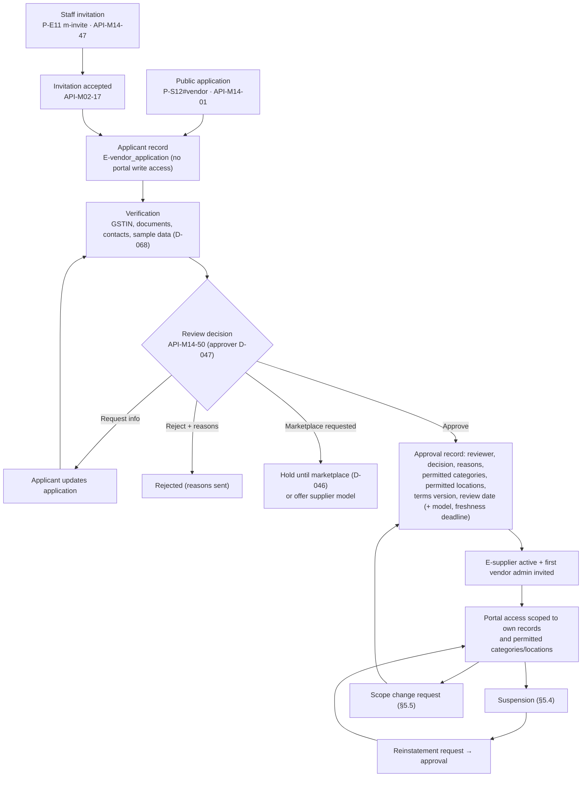
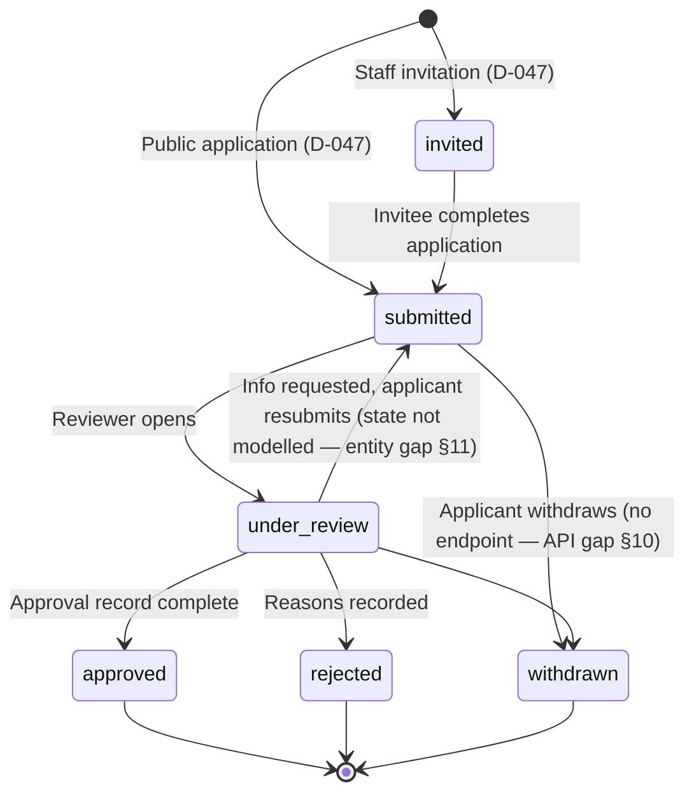
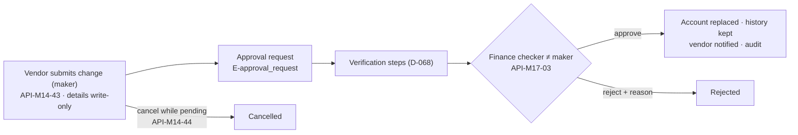
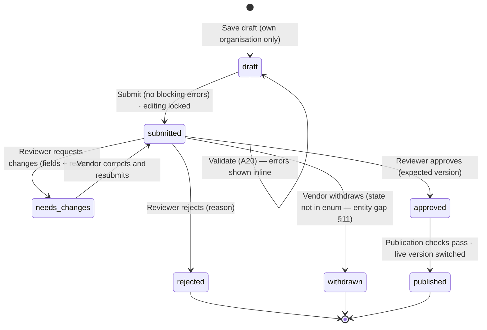
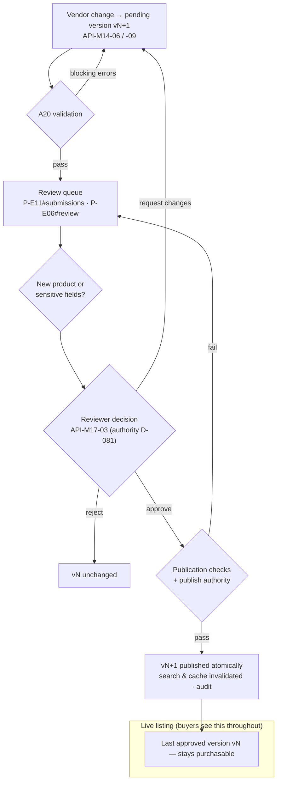
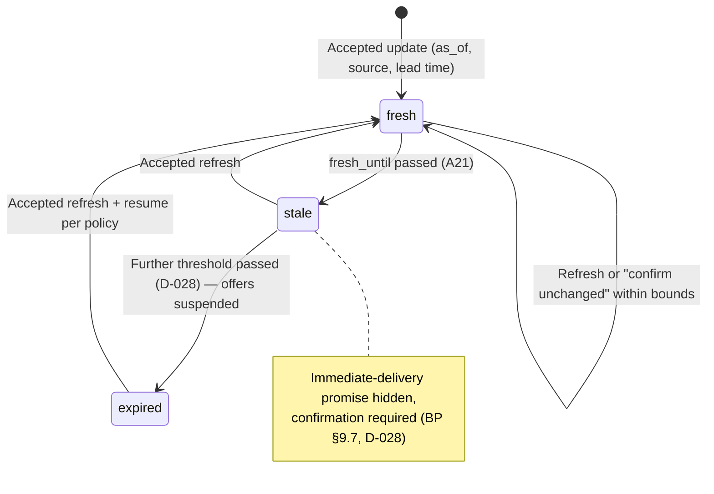
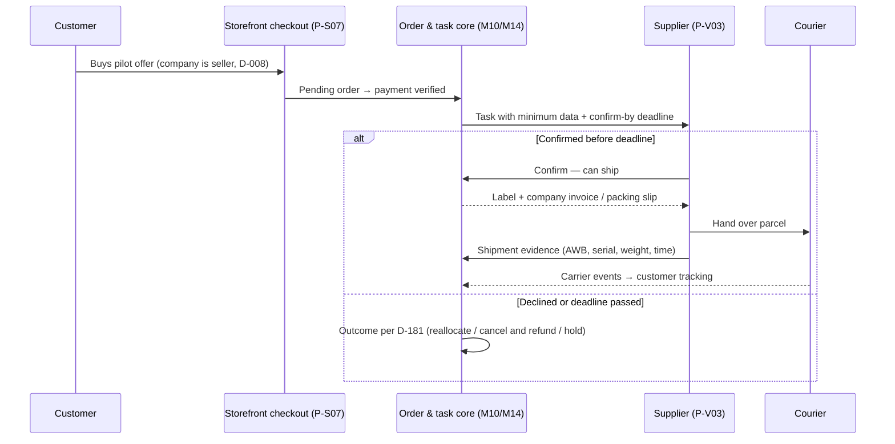
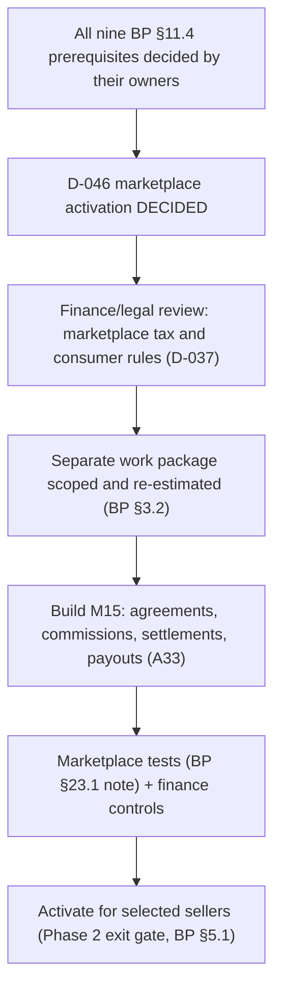

# 09 — Vendor portal, vendor management and marketplace extension (feature-level plan)

**Purpose.** Workflow view of vendor participation: the three vendor models and the launch model, onboarding and
approval, vendor management, vendor users, product submissions and review, bulk upload, availability feeds and
freshness, supplier purchase orders, the supplier-fulfilment pilot, returns to vendor, statements, performance,
data isolation and staff control — plus the **marketplace extension (M15, `LATER`)** documented as a gated future
module. Each workflow ties together UI (`P-V*`, `P-E*`, `P-S12`), backend (`M14` and related modules, `BR-*` in
`05-backend.md`), entities (`E-*`, `03-database.md`), endpoints (`API-*`, `06-api.md`), permissions (`R-*`, auth
classes `VEN`/`INT`/`STF`, detail in `07-auth-roles-permissions.md`) and tests (BP `T01–T36`; suite IDs in
`16-testing.md`). Screen layouts are in the workspace/vendor frontend files (`04b-…`, `04c-…`, written in parallel);
screens are referenced by ID.

**Sources used.** BP §2.1 (R05, R06, R10, R20), §3.1, §3.2, §5.1–§5.3, §7.1–§7.4, §8.4, §9.2, §9.3, §9.7, §11.1–§11.5,
§12.2 (A01, A02, A20, A21, A33, A38), §12.5, §12.6, §14.3, §16.4, §17.1, §17.4, §17.6, §18.1, §18.2, §19.1, §19.2,
§21.2, §23.1, §27.1, §28.5, §29.3, §30.1, §30.2 · PR1 §2, §3, §4, §6, §7, §8, §10, §11, §12, §15 · PR2 §1, §2, §4, §5,
§9, §10, §11, §12 · MEET · MK `vendor-dashboard.html`, `vendor-products.html`, `vendor-availability.html`,
`vendor-account.html`, `erp-vendors.html`, `erp-catalog.html#review`, `store-login.html#vendor` · plan files `00`,
`02` §11–§12, `03` §2.12–§2.13, `05` §5.14–§5.15, `06` §3.13, §4.12, §4.13, `DECISIONS.md`.

**Labels and status.** `00-conventions.md` §2–§3. All items `NOT_STARTED` unless `REQUIRES_DECISION (D-xxx)`.
Platform-level prerequisites (D-001, D-004 native vs custom P-E11, D-079, D-080, D-083, D-101 vendor-portal
framework, D-102 deployment/hostnames) apply to every workflow and are not repeated. Mockup sample values (review
SLAs, freshness hours, ±50 %/±15 %/10 % bounds, score weights, 4-hour pilot deadline, pilot capacity, day counts,
penny-drop amounts) are **not requirements** (`00-conventions.md` §1.1).

**Decision aliases.** Surviving IDs are cited: **D-137** (vendor roles; alias D-148), **D-131** (PO
confirmation/ASN; alias D-144). **Auth classes** (`06-api.md` §1.2): `VEN` vendor-portal session scoped to one vendor
organisation · `INT` narrow machine credential (vendor API key) · `STF` staff · `PUB` public.

---

## 1. Vendor models and launch position

### 1.1 The three vendor models (BP §3.2)

| Model | Customer buys from | Inventory treatment | Additional capability | Plan status | Decisions |
|---|---|---|---|---|---|
| Supplier / reseller | The company | Supplier availability is external; received company stock is internal | Purchase orders, receipts, supplier bills, procurement terms | Launch model: suppliers submit information for review — PROPOSED-DEFAULT | D-007 |
| Company sale with supplier fulfilment | The company | Supplier confirms availability and ships for the company | Confirmation deadline, shipment evidence, invoice and warranty responsibility | CONDITIONAL — "only for a small pilot after confirmation and refund rules are proven" | D-007, D-008, D-181 |
| Marketplace | An external seller via the platform | Seller inventory separately owned and maintained | Seller agreements, commissions, settlements, disputes, split fulfilment and tax review | `LATER` — "separately approved extension" (M15, §6) | D-046, D-008 |

"**Proposed launch model:** Company-controlled sales with suppliers submitting information for review. Activate direct
supplier fulfilment only for a small pilot after confirmation and refund rules are proven. Treat a full marketplace
as a separately approved extension." (BP §3.2). "If direct marketplace selling is non-negotiable on day one, include
the full marketplace work package and re-estimate" (BP §3.2). PR2 §2 labels the models "Company-owned commerce —
core launch model", "Supplier-assisted supply — Phase 1B / controlled extension", "Marketplace seller — separate
approved marketplace phase".

### 1.2 Phase placement

| Item | Phase | Source |
|---|---|---|
| Controlled vendor portal (applications, submissions, approval, scoped access) | 1B | BP §5.1; PR2 §11; WP13 |
| Vendor admin-created accounts and submissions | C in 1A, M in 1B — "No direct unrestricted database writes" | BP §5.2 |
| Validated bulk import (vendor batches) | 1B | BP §5.1 (A01/A02 marked P1 — conflict, D-048/D-078) |
| A20 vendor listing quality, A21 stale supplier stock | P1B → 1B | BP §12.2 |
| Supplier-fulfilment pilot | 1B pilot, after rules are proven | BP §3.2; MK:vendor-availability.html ("1B pilot") |
| External seller settlements | "M if marketplace" in Phase 2/3; not needed for ordinary suppliers | BP §5.2 |
| Marketplace (M15) | Phase 2, optional, separately gated (`LATER`) | BP §5.1, §11.4; PR2 §11; D-046 |

Source conflict: PR1 §12 places the vendor platform in Phase 2 — the plan follows BP §5.1/PR2 §11 (D-220). Whether
vendor self-service is required at the first public launch is D-048 (BP §5.1 "combine the gates and budget for
them"). MEET: "Vendor registration would be handled by a super admin; role-based access and an approval step before
product data enters the live database were discussed"; "the company retains overall control over vendor access,
listing approval, and priority".

## 2. Cross-cutting vendor rules

| # | Rule | Enforced by | Source |
|---|---|---|---|
| 1 | Vendors see only their own records; no competitor costs, company margins or company selling prices; changing an ID never exposes another vendor's data (out-of-scope → not found) | BR-M14-06, BR-M02-02 | BP §3.1, §19.1; T11; MK:vendor-dashboard.html ("Own data only — no margins, no other vendors") |
| 2 | Vendors cannot edit protected fields on their own records (approval record, permitted scope, state, freshness deadline, verified identity, bank details) | BR-M14-10, BR-M02-02 | BP §19.1 (property-level authorisation); T13 |
| 3 | The vendor identity always comes from the session or API credential; client-sent `seller_id` is ignored | `06-api.md` §1.4 | BP §17.4 |
| 4 | Unapproved vendor content never becomes a purchasable offer and never alters authoritative stock | BR-M04-06, BR-M14-05 | BP §7.3, §17.6; T12 |
| 5 | A change to an approved listing stays pending while the last approved version remains live, unless safety or stock requires immediate suspension | BR-M04-07 | BP §11.3; PR2 §5; T13 |
| 6 | Sensitive edits (brand, condition, warranty, tax classification, payout account, extraordinary price changes) require review | BR-M04-08, BR-M14-05 | BP §11.3 |
| 7 | A stock update never creates company-owned inventory unless an authorised receipt/ownership transaction establishes it | BR-M06-15 | BP §11.3; PR2 §4 |
| 8 | Share only the data needed for the vendor's role; a supplier never receives an entire customer order or personal details when only availability is needed | BR-M14-07, BR-M13-15 | BP §11.2, §18.1 ("Export customer data — Vendor: Assigned fulfilment only") |
| 9 | Suspended vendors cannot submit live changes; historical orders and financial records remain accessible to authorised staff | BR-M14-04 | BP §11.1 |
| 10 | Deterministic rules and a small approval matrix; the owner does not approve routine stock refreshes | BR-M14-05, BR-M17-05 | BP §11.3, §12.6; PR1 §11 |
| 11 | Supplier cost changes never change live retail or dealer prices automatically | BR-M05-14 | BP §8.4 |
| 12 | Marketplace functions are not exposed merely because the data model can support them | BR-M14-13 | BP §17.1 |
| 13 | Every vendor action is audited with the vendor user; cross-vendor access attempts are security events | `05-backend.md` M14 logging | BP §17.3, §19.1 |
| 14 | Uploads are type/size restricted, scanned where risky and served only through authorised access | BR-M22-02 | BP §19.1; D-112 |

## 3. Actors, access and vendor roles

### 3.1 Roles

| Role | Meaning in this file | Source | Status |
|---|---|---|---|
| R-vendor_applicant | Submits business details and tracks the application; no live catalog or stock write access | BP §3.1, §11.1 | DOCUMENTED |
| R-supplier | Approved supplier user: submits product/availability data, views relevant purchase activity; own records only | BP §3.1, §11.2 | DOCUMENTED |
| R-seller | Marketplace seller: own offers and assigned customer data only | BP §3.1, §11.4 | `LATER` (M15) |
| R-integration | Vendor API credential for availability/submission feeds; no interactive access | BP §3.1, §16.4 | DOCUMENTED; credential mechanism D-083 |
| R-ops_admin, R-owner | Vendor approval, suspension, permissions, review policy | BP §3.1, §18.1; MK:erp-vendors.html review policy (sample) | DOCUMENTED; approver D-047 |
| R-catalog_staff | Reviews vendor submissions as designated reviewer | BP §18.1 ("Designated reviewer"), §12.6 | REQUIRES_DECISION (D-081) |
| R-finance | Payout-account maker-checker; tax review; supplier statements | BP §18.1 | DOCUMENTED |
| R-warehouse_staff | Receipts against supplier POs; QC evidence for supplier RMAs | BP §18.1, §9.3 | DOCUMENTED |
| Buyer (purchasing) | Price outliers, PO follow-up, vendor priority — BP §9.3 "Finance or buyer review", A17 "Buyer approves" | BP §9.3, A17; `06-api.md` "buyer roles" | No R-* role — mapping per D-222 (see §13) |

### 3.2 BP §18.1 authority matrix — Vendor column

| Action | Vendor authority (BP §18.1) | Enforced in |
|---|---|---|
| Create product draft | Own submission | §5.9 (API-M14-06) |
| Publish new product | No | §5.10 (only staff via API-M17-03 / API-M04-20) |
| Record matching receipt | No company receipt | §5.14 (ASN never posts stock; GRN is staff) |
| Adjust stock | Own availability only | §5.12 (supplier availability, never company stock) |
| Change dealer tier | No | — |
| Initiate refund | Request only | §5.16 (supplier RMA responses) |
| Change payout account | Submit change | §5.8 |
| Export customer data | Assigned fulfilment only | §5.15 (minimum data) |
| Edit permissions | No | §5.3 (vendor user roles only inside own organisation, D-137) |

### 3.3 Vendor-organisation roles (REQUIRES_DECISION D-137)

The mockup shows four sample roles (MK:vendor-account.html#users "What each role can do"): **Catalog** — products and
submissions; **Operations** — availability, POs, tasks, returns; **Accounts** — statements, bank change requests;
**Admin** — everything including users. `06-api.md` §3.13 uses these as provisional role gates (catalog role, ops
role, accounts role, admin role). Until D-137 is decided, implement role checks as configuration keyed by the
decided role set; no role may exceed the vendor column of §3.2.

---

## 4. Workflow index

| § | Workflow | Phase | Evidence | Status | Screens | Key APIs | Decisions |
|---|---|---|---|---|---|---|---|
| 5.1 | Onboarding: public application / admin invitation | 1B (admin-created C in 1A) | DOCUMENTED | REQUIRES_DECISION | P-S12#vendor, P-E11 m-invite, P-V01 (applicant) | API-M14-01, -47, API-M02-16/-17 | D-047, D-068 |
| 5.2 | Verification and approval decision | 1B | DOCUMENTED | REQUIRES_DECISION | P-E11#applications | API-M14-48 … -50 | D-047, D-028, D-068 |
| 5.3 | Vendor users and roles | 1B | DOCUMENTED / MOCKUP | REQUIRES_DECISION | P-V04#users | API-M14-36 … -38 | D-137, D-040 |
| 5.4 | Suspension and reinstatement | 1B | DOCUMENTED | NOT_STARTED; effects REQUIRES_DECISION | P-E11#list, P-V01 | API-M14-51 | D-189 |
| 5.5 | Permitted scope and profile change requests | 1B | DOCUMENTED / MOCKUP | NOT_STARTED | P-V04, P-V02, P-E11 | API-M14-33, -34, -52 | D-081 |
| 5.6 | Terms versions and acceptance | 1B | DOCUMENTED / MOCKUP | REQUIRES_DECISION | P-V04#terms, P-S12#vendor | API-M14-41, -42 | D-188, D-040 |
| 5.7 | Documents and verification | 1B | DOCUMENTED / MOCKUP | REQUIRES_DECISION | P-V04#documents, P-E11 | API-M14-35 | D-068, D-037 |
| 5.8 | Payout / bank account changes (maker-checker) | 1B | DOCUMENTED | REQUIRES_DECISION | P-V04#bank, P-E14/P-E12 approvals | API-M14-43, -44, API-M17-03 | D-068 |
| 5.9 | Product submissions (draft → validation → review → publish) | 1B | DOCUMENTED | NOT_STARTED; reviewer REQUIRES_DECISION | P-V02 | API-M14-04 … -12 | D-081, D-023 |
| 5.10 | Staff review of vendor submissions; review policy | 1B | DOCUMENTED | REQUIRES_DECISION | P-E11#submissions, P-E06#review | API-M14-54, -56, API-M17-03 | D-081, D-185, D-186 |
| 5.11 | Bulk upload | 1B | DOCUMENTED | NOT_STARTED | P-V02#bulk | API-M14-13 … -17 | D-048, D-057 |
| 5.12 | Availability feeds and freshness | 1B | DOCUMENTED | REQUIRES_DECISION | P-V03#feed, P-E11#freshness, P-E08#supplier | API-M14-18 … -20, API-M06-26 … -29 | D-028, D-186, D-073 |
| 5.13 | Vendor API credentials | 1B | MOCKUP | REQUIRES_DECISION | P-V03 m-api | API-M14-21, -22 | D-083 |
| 5.14 | Supplier purchase orders (view; confirmation/ASN) | 1B (view DOCUMENTED) | DOCUMENTED / MOCKUP-ONLY | view NOT_STARTED; confirmation REQUIRES_DECISION | P-V03#pos | API-M14-23 … -26 | D-131 |
| 5.15 | Supplier-fulfilment pilot | 1B pilot | CONDITIONAL | REQUIRES_DECISION | P-V03#tasks | API-M14-27 … -30 | D-007, D-008, D-181 |
| 5.16 | Returns to vendor (supplier RMA) | 1A staff / 1B vendor view | DOCUMENTED | NOT_STARTED | P-V03#returns, P-E04#supplier | API-M14-31, -32, API-M13-14 … -16 | D-139, D-185 |
| 5.17 | Vendor statements | 1B | DOCUMENTED ("if integrated") | REQUIRES_DECISION | P-V04#statements | API-M14-39, -40 | D-011 |
| 5.18 | Vendor dashboard, action items, notifications | 1B | DOCUMENTED / MOCKUP | NOT_STARTED; announcements REQUIRES_DECISION | P-V01, shell(V) | API-M14-02, -03, API-M20-01 | D-142, D-058 |
| 5.19 | Vendor performance | 1B | DOCUMENTED (metrics) / MOCKUP-ONLY (score) | REQUIRES_DECISION | P-E11#performance, P-V01 | API-M14-55, -03 | D-187, D-075 |
| 5.20 | Vendor messaging | 1B | MOCKUP | NOT_STARTED | P-V02, P-E11, P-E01 | API-M14-11, -53 | — |
| 5.21 | Vendor data isolation and permissions | 1B | DOCUMENTED | NOT_STARTED | all P-V*, P-E11 | all API-M14-* | D-137 |
| 5.22 | Admin control of vendors (P-E11 map) | 1B | DOCUMENTED / MOCKUP | NOT_STARTED | P-E11 | API-M14-45 … -56 | D-004 |
| 5.23 | Vendor data migration | 1A cutover | DOCUMENTED | REQUIRES_DECISION | — | M25 scripts | D-038, D-009 |
| 6 | Marketplace extension (M15) | 2, optional | `LATER` | `LATER` | P-E11#marketplace, P-V04#marketplace, P-V01 (locked previews) | none | D-046 |

---

## 5. Workflows

### 5.1 Onboarding: public application and admin invitation

| Item | Value |
|---|---|
| Phase · requirements | 1B; admin-created vendor accounts C in 1A (BP §5.2) · R05 |
| Evidence | DOCUMENTED — BP §11.1 ("Allow either an admin invitation or a public application, according to policy. Public registration creates an applicant, not an activated seller. Collect only the business, contact, fulfilment, commercial, and verification information needed for the approved model"); PR1 §7 steps 1–3; PR2 §5 step 1 ("Vendor applies or receives an admin invitation; application remains inactive until approved"); MEET ("Vendor registration would be handled by a super admin"); MOCKUP — MK:store-login.html#vendor, MK:erp-vendors.html `m-invite` ("An invitation creates an applicant, not an active vendor") |
| Status | REQUIRES_DECISION (D-047 route; D-068 information collected) |

**Frontend.** P-S12#vendor: (1) model choice — supply stock (open), supplier-fulfilment pilot ("Pilot · limited
seats", by invitation after a trial in MK), marketplace ("Phase 2 · waitlist"); (2) business information (legal
name, business type, GSTIN, PAN, dispatch location, years in business, categories, approximate SKUs, data-sharing
method); (3) contact; (4) documents (GST certificate, PAN, refurbishment and data-wipe process for refurbishers,
brand authorisation optional); supplier terms version; confirmation page with application number and stages
Received → Verification → Commercial review → Decision ("Under review — you're not a seller yet"). P-E11 `m-invite`
(business name, contact email, proposed model). Invitation landing (no mockup screen; API-M02-16/-17). P-V01 applicant
state ("Applicant, not an activated supplier … cannot submit products, declare availability or receive purchase
orders until Tradex approves").

**Backend.** M14 VendorApplicationService (BR-M14-01, BR-M14-02); M02 InvitationService; M08 GstinVerificationPort
(D-068 for vendors); M22 FileService.

**Database.** E-vendor_application (route, business_details, contact, proposed_model, documents, terms_version_id,
state, invited_by, supplier_id) · E-invitation · E-attachment · E-terms_version · E-terms_acceptance · E-user_account
(applicant login, account type vendor).

**APIs.** API-M14-01 (public application; D-047) · API-M14-47 (staff invitation; D-047) · API-M02-16, API-M02-17
(read/accept invitation) · API-M08-23 (GSTIN check, used by P-S12#vendor) · API-M22-01 (documents) · API-M14-02
(applicant sees own state).

**Flow.**
1. Route per D-047: (a) public application from P-S12#vendor; (b) staff invitation from P-E11 → invitation →
   invitee accepts and completes the application. Both routes produce an **applicant** (R-vendor_applicant), never an
   activated vendor (BP §11.1; PR2 §5).
2. The applicant chooses a model. Marketplace applications are recorded only as interest/hold — marketplace is
   `LATER` (D-046). The pilot model is limited and subject to D-007.
3. Only information needed for the approved model is collected (BP §11.1; list D-068). Bank/payout details are not
   collected at application; they are added after approval with maker-checker (§5.8; MK:store-login.html "We don't ask
   for bank details now").
4. GSTIN is checked against the registration source; documents are uploaded as private files with type/size limits
   and scanning (D-068, D-112).
5. The supplier terms version shown is accepted with evidence (E-terms_acceptance; change process D-188).
6. The application enters `submitted` and appears in the P-E11#applications queue.
7. The applicant can sign in to see status but has no catalog, availability, PO or task access (BP §3.1 "No live
   catalog or stock write access").

**Validation.** Required fields per model; contact mobile/email verified (MK "Contacts verified … email & mobile
OTP"; method D-040); duplicate GSTIN against existing suppliers and open applications; invitation token single-use
and expiring (`05-backend.md` M02 validation).

**Permissions.** PUB (public application, rate-limited D-084); STF R-ops_admin / R-owner (invitation); applicant
(VEN, own application only).

**Testing.** T11 (applicant cannot read other applications). Feature tests: applicant calls to submission,
availability, PO and task endpoints are refused; invitation creates an applicant, not an active supplier; marketplace
applicant cannot be approved into the marketplace model.

**Completion criteria.** Each enabled route (per D-047) creates only applicant records; no portal write access before
approval; application data limited to the D-068 list.

**Open decisions.** D-047, D-068, D-046, D-007, D-040, D-112, D-188.

### 5.2 Verification and approval decision

| Item | Value |
|---|---|
| Phase · requirements | 1B · R05, R06 |
| Evidence | DOCUMENTED — BP §11.1 ("Approval records should identify reviewer, decision, reasons, permitted categories, permitted locations, terms version, and review date"), §11.3 ("New vendors … require explicit review"); PR1 §7 step 2 ("Super Admin review: Admin verifies and approves or rejects vendor access"); PR2 §5 steps 2–3; MOCKUP — MK:erp-vendors.html#applications (checks, business model with pilot capacity, decision record, reasons required, Reject / Request info / Approve; marketplace applicant "Hold until Phase 2", "Offer supplier model"; "Recently decided") |
| Status | REQUIRES_DECISION (D-047 approver; D-028 freshness deadline value) |

**Frontend.** P-E11#applications (queue; detail with checks, documents, business-model choice, decision record,
reasons); document viewer (watermarked, logged — MK). Staff-side layout in `04b-…`.

**Backend.** M14 VendorApplicationService (BR-M14-03); M02 audit; M20 notifications; M17 SoD checks (BR-M02-06).

**Database.** E-vendor_application · E-vendor_approval (reviewer_id, decision, reasons, permitted_categories,
permitted_locations, permitted_models, terms_version_id, freshness_deadline, review_date, state) · E-supplier
(supply_models, state, current_vendor_approval_id, freshness_deadline) · E-vendor_user · E-invitation · E-audit_event.

**APIs.** API-M14-48 (queue) · API-M14-49 (detail) · API-M14-50 (decision; D-047, D-028) · API-M22-02 (documents) ·
API-M14-53 (message applicant).

**Flow.**
1. The reviewer opens the application with verification checks and documents; each view of a sensitive document is
   logged (BR-M22-05).
2. Decision options: approve, reject, request info, hold until the marketplace phase, offer the supplier model
   (API-M14-50).
3. An approval must record every BP §11.1 field — reviewer, decision, reasons, permitted categories, permitted
   locations, terms version, review date — plus the permitted model(s) and, for vendors that will declare
   availability, a freshness deadline (BP §9.7 "Define a freshness deadline per supplier"; value D-028).
4. Approval is one transaction: E-vendor_approval (active), E-supplier created/linked (state active, supply models),
   first vendor admin invitation, notification, audit.
5. Rejection and requests for information carry reasons that are sent to the applicant (MK "Reasons are required
   and stored with the decision"; BP §18.2 "Record why").
6. Pilot-model approval only within the pilot scope decided under D-007 (MK "pilot capacity: 1 of 1 used" is a
   sample).
7. There is no automatic approval (BP §11.3). Where feasible, the staff member who invited the vendor does not
   approve alone (BR-M02-06).

**Validation.** Reasons mandatory for every decision (`REASON_REQUIRED`); permitted categories ⊆ published
categories; permitted locations ⊆ approved company locations or approved vendor dispatch locations; terms version
active; marketplace model not selectable while D-046 is `LATER`.

**Permissions.** STF R-ops_admin, R-owner (approver per D-047); R-finance for finance-relevant checks (D-068).

**Testing.** T11. Feature tests: approval without reasons or without permitted categories is rejected; marketplace
approval blocked; the stored approval record contains all BP §11.1 fields; applicant notified on each decision.

**Completion criteria.** Every approved vendor has an active E-vendor_approval with the BP §11.1 fields (PR2 §5 step
3 "Reviewer records decision, reason, permitted categories/locations and terms").

**Open decisions.** D-047, D-068, D-028, D-007, D-046, D-081, D-185.

### 5.3 Vendor users and roles

| Item | Value |
|---|---|
| Phase · requirements | 1B · R05, R06 |
| Evidence | DOCUMENTED — BP §11.2 Profile ("Business details and approved contacts"), §3.1 ("Own records"), §18.1 (Vendor column), §18.2 (MFA for privileged accounts); PR1 §4 ("Vendor registration, approval, roles"); MOCKUP — MK:vendor-account.html#users ("§18 Vendor users & roles — own organisation only"; users, role, MFA, last active, status; invite; what each role can do; security and recent sign-ins) |
| Status | REQUIRES_DECISION (D-137 roles; D-040 MFA for vendor users) |

**Frontend.** P-V04#users (list, invite `m-invite`, role matrix, security and sign-ins); invitation landing.

**Backend.** M14 VendorAccountService; M02 InvitationService, SessionService, MfaService.

**Database.** E-vendor_user (supplier_id, user_account_id, vendor_role, state invited/active/suspended/removed,
invited_by) · E-invitation · E-user_account · E-user_session (CONDITIONAL D-083) · E-audit_event.

**APIs.** API-M14-36 … -38 (D-137) · API-M02-16 … -19 (invitations) · API-M02-09 … -15 (own security) · API-M14-02.

**Flow.**
1. The first vendor admin is invited at approval (§5.2).
2. A vendor admin invites further users with a role from the decided set (D-137); invitations are single-use and
   expire.
3. Each vendor user belongs to exactly one vendor organisation; record scope = own supplier (unique supplier +
   account; BR-M14-06).
4. Role actions follow D-137 (samples in §3.3); no vendor role exceeds the BP §18.1 vendor column (§3.2).
5. The last active admin cannot be deactivated (API-M14-38).
6. MFA: required for privileged accounts (BR-M02-03); whether vendor admins count as privileged and the method →
   D-040.
7. Vendor-user access during vendor suspension → D-189.
8. A vendor admin sees sign-in/security events for the own organisation only (API-M02-15).

**Validation.** Role within the decided set; email unique; cannot invite into another vendor organisation.

**Permissions.** VEN admin role (D-137); STF read via API-M14-46.

**Testing.** T11 (user of vendor A cannot list or change users of vendor B). Feature tests: role-scope matrix per
D-137; last-admin guard; deactivated user's sessions revoked.

**Completion criteria.** Role checks on every API-M14 endpoint match the decided matrix; no cross-organisation user
management possible.

**Open decisions.** D-137, D-040, D-083, D-189.

### 5.4 Suspension and reinstatement

| Item | Value |
|---|---|
| Phase · requirements | 1B · R06 |
| Evidence | DOCUMENTED — BP §11.1 ("Suspended vendors cannot submit live changes, but historical orders and financial records must remain accessible to authorised staff"), §7.3 (Published → Suspended "Safety or quality issue"), §11.3 ("unless safety or stock concerns require immediate suspension"), §14.3 (vendor performance → "Adjust vendor permissions/priority"); PR1 §11 ("activate/deactivate vendors"); MOCKUP — MK:erp-vendors.html ("Suspend…", "Request reinstatement"; suspended vendor: "Live offers withdrawn; the vendor can't submit changes. POs, GRNs, returns and statements remain visible to authorised staff"; review policy "Safety or counterfeit concern → Immediate suspension of offer"), MK:vendor-dashboard.html suspended state ("Historical orders, returns and money owed to you are unaffected"), MK:vendor-products.html (listing suspended by QC) |
| Status | NOT_STARTED · effects on offers, feeds, POs, tasks, vendor access REQUIRES_DECISION (D-189) |

**Frontend.** P-E11#list drawer ("Suspend…", "Request reinstatement"); P-V01 suspended banner; P-V02 suspended
listings ("Not purchasable · fix & resubmit").

**Backend.** M14 VendorAccountService; M04 LifecycleService (offer suspension); M17 ApprovalService.

**Database.** E-supplier.state · E-vendor_approval (decision suspended/reinstated) · E-offer.lifecycle_state ·
E-approval_request · E-audit_event.

**APIs.** API-M14-51 (suspend / request reinstatement) · API-M17-03 (reinstatement approval) · API-M04-20 (offer
lifecycle suspend) · API-M06-27 (suspend offers from a feed).

**Flow.**
1. **Vendor suspension:** staff suspend with a reason → E-vendor_approval decision `suspended`, E-supplier.state
   `suspended`, audit, vendor notified.
2. From that moment submissions and availability updates are refused (`403 VENDOR_SUSPENDED`; BR-M14-04).
3. Effects on live offers, supplier availability, open POs, pilot tasks, pending submissions and vendor users' read
   access → D-189 (MK withdraws live offers and keeps history visible; BP §11.4 item 7 raises the same question for
   marketplace sellers).
4. History (orders, POs, receipts, returns, statements) stays accessible to authorised staff (BP §11.1).
5. **Reinstatement:** the vendor fixes the cause (e.g. renewed document, §5.7) and requests reinstatement; an
   authorised approver (R-owner per API-M14-51) decides; a new E-vendor_approval decision `reinstated` supersedes the
   suspension.
6. **Offer-level suspension** for safety or quality issues is immediate and independent of the vendor's status (BP
   §7.3, §11.3).

**Validation.** Reason mandatory; the vendor cannot change its own state (property-level, BR-M14-10).

**Permissions.** STF R-ops_admin (suspend); R-owner (reinstatement approval); offer suspension per catalog
authority (D-081).

**Testing.** Feature tests: suspended vendor's submission and availability calls refused; staff still see history;
reinstatement requires approval; vendor cannot clear its own suspension (BOPLA, T13 pattern).

**Completion criteria.** BP §11.1 suspension rule verified by tests; D-189 effects implemented as decided.

**Open decisions.** D-189, D-024, D-068.

### 5.5 Permitted scope and profile change requests

| Item | Value |
|---|---|
| Phase · requirements | 1B · R05 |
| Evidence | DOCUMENTED — BP §11.1 (permitted categories and locations on the approval record), §11.3 (sensitive edits require review), §12.6 ("strategic supplier terms remain with management"); MOCKUP — MK:vendor-account.html ("§11.1 Permitted categories & locations set by Tradex"; "Request category or location"; `m-req` "Request a profile change"), MK:vendor-products.html ("§11.1 Permitted scope enforced on every submission"; "Request a category"), MK:erp-vendors.html ("Edit permissions") |
| Status | NOT_STARTED |

**Frontend.** P-V04#profile (verified details, contacts, permitted scope, approval record), `m-req`; P-V02 "Request
a category"; P-E11 drawer "Edit permissions".

**Backend.** M14 VendorProfileService, VendorAccountService; M17 ApprovalService.

**Database.** E-supplier · E-vendor_approval (new decision `scope_changed`) · E-approval_request · E-attachment.

**APIs.** API-M14-33 (profile, read-only protected fields) · API-M14-34 (vendor change request) · API-M14-52 (staff
permission change → approval) · API-M17-03 (decision).

**Flow.**
1. The vendor requests a change (category, dispatch location, legal name/address, GSTIN, contacts) with supporting
   documents; nothing changes until reviewed (BP §11.3).
2. Staff-initiated permission changes also create an approval request (MK "draft needs approval").
3. An approved scope change creates a new E-vendor_approval (`scope_changed`) that supersedes the previous one.
4. Permitted scope is enforced on every submission, schema request and availability update (`403
   CATEGORY_NOT_PERMITTED`; API-M14-12).
5. Legal-identity changes (legal name, GSTIN) are re-verified (D-068).

**Validation.** Requests must reference existing categories/locations; protected fields in any vendor PATCH are
ignored or rejected.

**Permissions.** VEN admin role (request); STF R-ops_admin (propose/approve per D-081/D-024).

**Testing.** T13 pattern (vendor attempts to write permitted_categories directly → no effect). Feature test:
submission outside scope → 403.

**Completion criteria.** No path changes a vendor's scope without an approval record.

**Open decisions.** D-081, D-068, D-024.

### 5.6 Terms versions and acceptance

| Item | Value |
|---|---|
| Phase · requirements | 1B (terms entity 1A) · R05 |
| Evidence | DOCUMENTED — BP §11.1 (terms version on the approval record), §19.2 (terms and notices); MOCKUP — MK:vendor-account.html#terms ("Terms version history with acceptance evidence"; pending version with change summary; "v3 stays in force until you accept v3.1 or it takes effect on 1 Nov 2026"; `m-terms` "Accept with OTP"), MK:store-login.html ("Supplier terms v2026.1" at application) |
| Status | REQUIRES_DECISION (D-188 change process; D-040 acceptance evidence method) |

**Frontend.** P-V04#terms (history, evidence, pending version review), `m-terms`; P-S12#vendor terms link.

**Backend.** M14 TermsService (BR-M14-15).

**Database.** E-terms_version (terms_type supplier_terms, version_label, effective_from, document, change_summary,
state) · E-terms_acceptance · E-supplier (accepted_terms_version_id).

**APIs.** API-M14-41 · API-M14-42 (D-040). Staff creation/publication of terms versions: **no endpoint** (API gap
§10).

**Flow.**
1. Staff publish a new terms version with a change summary (no screen or endpoint in sources — gap).
2. The vendor sees the pending version and what changed; a vendor admin accepts with evidence (who, when, method).
3. The approval record references the terms version accepted at approval (BP §11.1).
4. Whether a new version needs acceptance before it applies, can be deemed accepted at its effective date, and the
   consequence of non-acceptance → D-188.
5. Every acceptance is audited.

**Validation.** Only pending versions for this vendor can be accepted; acceptance by the decided role (D-137).

**Permissions.** VEN admin role; STF (publisher per D-188).

**Testing.** Feature tests: acceptance evidence stored; non-admin cannot accept; history immutable.

**Completion criteria.** Each vendor's current terms version and acceptance evidence retrievable for audit.

**Open decisions.** D-188, D-040, D-137, D-037.

### 5.7 Documents and verification

| Item | Value |
|---|---|
| Phase · requirements | 1B · R05, R19 (authenticity) |
| Evidence | DOCUMENTED — BP §11.1 ("verification information"), §19.1 (restrict uploads, scan risky attachments, authorised access), §19.2 (sourcing evidence for electronics/refurbished/imported goods); MOCKUP — MK:vendor-account.html#documents ("GST, PAN, agreement v3 with validity dates"; document, number, uploaded, valid, verification; upload renewal), MK:vendor-dashboard.html (document expiry "to avoid a listing pause"), MK:erp-vendors.html checks (GSTIN verified, brand authorisation, sample price file) |
| Status | REQUIRES_DECISION (D-068 documents; D-037 applicability of product obligations) |

**Frontend.** P-V04#documents; P-V01 action item "Upload"; P-E11 application checks and document viewer.

**Backend.** M14 VendorProfileService; M22 FileService (scan, private storage).

**Database.** E-attachment (private, scanned) — document metadata (type, number, validity, verification) has no
entity field (entity gap §11).

**APIs.** API-M14-35 (upload/renew; D-068) · API-M22-01/-02 · API-M14-49 (staff view). Staff verification action:
**no endpoint** (API gap §10).

**Flow.**
1. The vendor uploads a document with type, number and validity; it is stored privately and scanned (D-112).
2. Staff verify it and record the result (gap: endpoint and fields).
3. Reminders before expiry (`05-backend.md` M14 jobs "document expiry reminders"); the consequence of expiry (listing
   pause, suspension) → D-068 / D-189.
4. Views of identity/business documents are watermarked and logged (BR-M22-05).

**Validation.** Allowed types and sizes (D-112, D-113); validity date in the future for renewals.

**Permissions.** VEN admin role (upload); STF reviewers (verify).

**Testing.** Feature tests: vendor cannot read another vendor's document (T11); unscanned file never served;
expiry reminder generated once.

**Completion criteria.** Required document set per D-068 captured and verifiable for each approved vendor.

**Open decisions.** D-068, D-037, D-112, D-033, D-189.

### 5.8 Payout / bank account changes (maker-checker)

| Item | Value |
|---|---|
| Phase · requirements | 1B · R06 |
| Evidence | DOCUMENTED — BP §11.3 (payout account is a sensitive edit), §11.5 ("Require maker-checker control for payout-account changes"), §18.1 ("Change payout account": Staff No; Manager "No unilateral change"; Finance "Maker/checker"; Owner/admin "Controlled approval"; Vendor "Submit change"); PR2 §9 ("Approval for … payout-account changes"); MOCKUP — MK:store-login.html ("Bank details only after approval · maker-checker"), MK:vendor-account.html#bank (verified current account, change history, pending request with verification steps, cancel, request another change) |
| Status | REQUIRES_DECISION (D-068) |

For the supplier model the account receives supplier-bill payments (MK:erp-vendors.html "for supplier bill
payments"); seller payouts belong to the marketplace (§6, `LATER`).

**Frontend.** P-V04#bank; staff decision in the approvals queue (P-E14#approvals / P-E12, per `10-erp.md`).

**Backend.** M14 PayoutAccountChangeService (BR-M14-09); M17 ApprovalService (SoD BR-M02-06).

**Database.** E-approval_request · E-supplier.bank_details (PD2; protection D-130) · E-attachment (proof) ·
E-audit_event.

**APIs.** API-M14-43 (submit) · API-M14-44 (cancel pending) · API-M17-03 (finance decision) · API-M14-33 (masked
status).

**Flow.**
1. The vendor submits new account details (write-only) with proof → approval request (maker). One open change at a
   time (`06-api.md` API-M14-43).
2. Verification steps per D-068 (mockup: test transfer, document check, call-back to registered number — samples).
3. A finance checker who is not the maker approves or rejects (BP §18.1; BR-M02-06).
4. On approval the account is replaced; the previous account stays in history; the vendor is notified; audited.
5. Account details are never returned in full (masking D-153; storage D-130).
6. The mockup's additional vendor-side second person (maker + checker inside the vendor organisation) is not in the
   BP — part of D-068.

**Validation.** Proof required; only one open request; maker ≠ checker; cancellation only while pending.

**Permissions.** VEN accounts/admin role (D-137) submit/cancel; STF R-finance decide; R-owner "controlled approval"
per BP §18.1.

**Testing.** Feature tests: maker cannot approve own change (`SELF_APPROVAL_NOT_ALLOWED`); vendor cannot write
bank_details directly (BOPLA); responses always masked; audit present.

**Completion criteria.** No payout-account change takes effect without a recorded finance checker decision.

**Open decisions.** D-068, D-130, D-153, D-011.

### 5.9 Vendor product submissions (draft → validation → review → publication)

| Item | Value |
|---|---|
| Phase · requirements | 1B · R05, R07, R19, R20 |
| Evidence | DOCUMENTED — BP §11.2 Products ("Submit drafts, upload files, respond to errors"), §7.3 lifecycle and "unapproved data must not enter the live purchasable catalog or alter authoritative stock", §11.3, §17.4 ("Vendor submission: Vendor scope; no automatic publication"), §17.6, §29.3, A20 (P1B), T12, T13; PR1 §7 steps 4–7; PR2 §5 steps 4–7; MEET ("an approval step before product data enters the live database"); MOCKUP — MK:vendor-products.html (tabs listings, submissions, new, bulk; "Lifecycle: Draft → Submitted → Needs changes → Approved → Published"; "Pending version never overwrites live data"; "Validation errors shown inline, before review"; "Category schema drives attributes"; "Grade rubric + mandatory warranty provider"; "Image quality + rights confirmation"; "Own submissions with reviewer comments") |
| Status | NOT_STARTED · reviewer/publisher authority REQUIRES_DECISION (D-081) · grade rubric D-023 |

**Frontend.** P-V02: #listings (own approved listings, pending-change state, suspended listings; drawer with live
version, pending diff, history, "Propose a change"); #submissions (states, reviewer comments; drawer with field
issues, conversation, history; withdraw; correct and resubmit); #new (category and identity, specifications from the
category schema, condition grade and warranty, images and content with rights confirmation, supplier price and
availability, pilot eligibility; Save draft / Validate / Submit for review; checklist; "What happens next");
`m-submitted` ("Editing locked while in review · you can withdraw").

**Backend.** M14 VendorSubmissionService (A20; BR-M14-05, BR-M14-06, BR-M14-10, BR-M14-12); M04 ProductDraftService,
LifecycleService, PublicationChecker (BR-M04-05 … BR-M04-09, BR-M04-11 … BR-M04-14); M22 media; M17 approvals; M05
cost signals (BR-M05-14).

**Database.** E-vendor_submission (type new_product/product_change; states draft, submitted, needs_changes,
approved, published, rejected; validation_results; sensitive_flags; rights_confirmation; reviewer_comment) ·
E-catalog_change_version (source vendor_submission, base_version_no, change_set, sensitive_fields, state) ·
E-product · E-sku · E-sku_attribute_value · E-offer · E-supplier_code_mapping · E-media_asset · E-attachment ·
E-approval_request · E-supplier_availability (initial declaration).

**APIs.** API-M14-04, -05 (listings) · API-M14-06 (submission, `06-api.md` §4.12) · API-M14-07, -08 (list/detail) ·
API-M14-09 (edit) · API-M14-10 (validate, submit, withdraw, duplicate, delete) · API-M14-11 (reply to reviewer) ·
API-M14-12 (category schema) · API-M22-01/-03 (media) · API-M14-34 (request category).

**Flow.**
1. The vendor selects a permitted category; the schema returns required attributes, grade rubric, warranty provider
   options and templates (API-M14-12; BR-M04-04).
2. A draft is saved (visible only to the own organisation) and validated (A20): required attributes, types and units,
   contradictory condition labels, image availability and quality, duplicate barcodes, impossible dimensions, missing
   tax classification, unapproved brands/categories (BP §7.4); warranty provider mandatory (BP §29.3); image rights
   confirmed (BP §7.4); grade from the approved rubric (D-023); inspection and data-erasure evidence for refurbished
   units (BP §7.2).
3. Submit is allowed only with no blocking errors → `submitted`; editing locked; the vendor may withdraw (live
   version unaffected).
4. Sensitive fields (brand, condition, warranty, tax classification, extraordinary price change) are flagged for
   review (BP §11.3).
5. Review (§5.10) → approve, request changes (with fields and reason → `needs_changes`), or reject.
6. Approval creates an approved catalog change version; publication checks and publish authority apply (D-081);
   publishing switches the live version atomically and invalidates search and caches (BR-M04-20).
7. Changes to an approved listing are new pending versions; the last approved version stays live; a rejected or
   withdrawn change leaves it unchanged (BR-M04-07; T13).
8. Existing orders keep their original terms (order snapshots, BR-M10-06; T33; MK "existing orders keep their
   original warranty").
9. Quantities and lead times are declared through availability (§5.12), not submissions (MK).
10. A supplier price change is a cost signal only; retail and dealer prices never change automatically (BR-M05-14;
    API-M05-22); price outliers are held for review (bounds D-186).
11. Listing approval is not evidence that physical stock exists and never creates company stock (BP §7.1; BR-M06-15).
12. The vendor sees reviewer comments and field issues and can reply (API-M14-11; BP §29.3 "clear correction
    request").
13. A published listing can be suspended for safety/quality and resubmitted after correction (BP §7.3).

**Validation.** As in step 2; category ∈ permitted scope; vendor from session only; `expected_version` on edits
(`409 VERSION_CONFLICT`).

**Permissions.** VEN catalog role (D-137); INT key with a submissions scope (MK "submissions:write") — "the API can
never publish directly" (MK:vendor-products.html).

**Testing.** T11, T12, T13, T33; BP §15.3 proof scenario 6 ("Submit a vendor product change, approve it, and retain
history"); BP §29.3 scenario (missing warranty provider → correction request); PR2 §12 "Vendor product submission:
Draft → validation → review → approved publication with audit history".

**Completion criteria.** WP13 "No cross-vendor access; approved changes only" (BP §22.2); T12 and T13 pass; every
decision has an audit entry with diff and reason.

**Open decisions.** D-081, D-023, D-022, D-057, D-137, D-185, D-186, D-112, D-113.

### 5.10 Staff review of vendor submissions and the review policy

| Item | Value |
|---|---|
| Phase · requirements | 1B · R05, R06, R10 |
| Evidence | DOCUMENTED — BP §11.3 (explicit review of new vendors/products and sensitive edits; routine refreshes auto-accepted within validated boundaries; "Use deterministic rules and a small approval matrix. Avoid requiring the owner to personally approve every stock refresh"), §18.1 ("Publish new product": Staff "No by default", Manager "Designated reviewer", Finance "Tax review if required", Owner "Yes", Vendor "No"), §18.2 (record why; deadline, alternate approver, escalation; bulk review keeps individual history), §12.6 ("Routine correct listings can be processed by catalog reviewers"), §17.4 (approval decision with expected version), §30.1 (Vendors: "Applications, profile review, submissions, freshness, performance"); A20; MOCKUP — MK:erp-vendors.html#submissions and `m-vsdec`, `m-policy`; MK:erp-catalog.html#review (vendor, sensitive-edit and auto-accepted filters; "Revert refresh"; "Approve & publish"; decision note required for sensitive edits) |
| Status | REQUIRES_DECISION (D-081 reviewer authority; D-185 deadlines; D-186 bounds) |

**Frontend.** P-E11#submissions (queue with age and due time; detail with live-vs-submitted diff, sensitive-field
flags, checks passed/warnings/errors, open-order impact; Approve / Request changes / Reject → `m-vsdec` with
mandatory reason and "Keep the current live version until the vendor resubmits"); P-E11 `m-policy` (change type →
handling → reviewer); P-E06#review (combined staff/vendor queue with "Revert refresh" for auto-accepted
availability).

**Backend.** M14 VendorSubmissionService; M04 review queue and publication; M17 ApprovalService (BR-M17-06,
BR-M17-07, BR-M17-13); M06 revert of auto-accepted refreshes.

**Database.** E-vendor_submission · E-catalog_change_version · E-approval_request · E-configuration_version (review
policy) · E-supplier_availability · E-audit_event.

**APIs.** API-M04-39 (queue; D-081) · API-M14-54 (review view; D-081) · API-M17-02 · API-M17-03 (decision:
approve, reject, request_changes, approve_and_publish; `keep_live_version_until_resubmit`; `expected_version`) ·
API-M17-04 (bulk, individual history) · API-M14-56 (review policy; D-081) · API-M06-29 (revert refresh) · API-M14-53
(message vendor).

**Flow.**
1. The queue lists vendor submissions, sensitive edits, price outliers and auto-accepted refreshes with age and due
   time (deadlines D-185).
2. The reviewer sees the diff against the live version, validation results, sensitive-field flags, the vendor's
   history and open-order impact.
3. Approval is impossible while blocking validation errors exist (MK "Approve stays disabled until validation
   passes").
4. Reject, request changes and approval of sensitive edits require a reason, stored and sent to the vendor (BP §18.2;
   `REASON_REQUIRED`).
5. `expected_version` must equal the version under review; a newer vendor change forces re-review (BP §17.4).
6. "Approve & publish" still runs publication checks and requires publish authority (BP §17.4 "no automatic
   publication"; `05-backend.md` §8 #3).
7. Tax-classification changes may need finance review (BP §18.1).
8. Reviewer ≠ submitter where feasible (BR-M02-06); bulk decisions keep each item's own history (BR-M17-07).
9. Review policy (change type → handling → reviewer) is versioned configuration. The mockup sample: new vendor →
   explicit review (owner/ops admin); new product → validation + review (catalog); sensitive edit → pending version
   (catalog lead; finance for tax/payout); price outside a tolerance → held as outlier (buyer); routine stock/lead-time
   refresh from a trusted vendor → auto-accepted within bounds, audited; safety or counterfeit concern → immediate
   offer suspension (ops admin). Formal policy → D-081; bounds and "trusted" criteria → D-186.
10. Auto-accepted refreshes can be reverted with a reason (API-M06-29).
11. Time with the vendor (needs changes) and escalation to an alternate → D-185 (MK "SLA paused while with vendor").
12. Recurring safe exceptions lead to policy improvement rather than indefinite review (BP §12.6; BR-M17-13).

**Validation.** Reviewer authority for the change type (D-081); approval not expired; reason present where required.

**Permissions.** STF reviewers per D-081 (R-catalog_staff as designated reviewer; R-finance for tax/payout; buyer
responsibility per D-222; R-ops_admin/R-owner for vendor-level decisions).

**Testing.** T12, T13, T31 (owner not needed for routine refreshes). Feature tests: stale `expected_version`
rejected; approve blocked with validation errors; reviewer cannot approve own staff draft; revert restores previous
supplier values.

**Completion criteria.** Every publication of vendor content has a reviewer decision with reason where required;
the owner approves no routine refresh (BP §11.3).

**Open decisions.** D-081, D-185, D-186, D-024, D-025, D-222.

### 5.11 Bulk upload

| Item | Value |
|---|---|
| Phase · requirements | 1B · R20 |
| Evidence | DOCUMENTED — BP §7.4 ("Accept a versioned CSV/XLSX template or a documented supplier API. Upload to staging, validate, map supplier codes, detect duplicates, preview differences, and publish only valid approved changes. Produce row-level errors that staff can correct and retry without duplicating successful rows"; image source restrictions; no scraping), §11.2 ("upload files"), §5.1 (1B "validated bulk import"), A01, A02, T26; MOCKUP — MK:vendor-products.html#bulk ("R20 Versioned template · file or API · same validation"; "Row-level results · fix & resubmit without duplicates"; "Older template versions are rejected"; batch key "re-validation never duplicates accepted rows") |
| Status | NOT_STARTED (phase of A01 D-048/D-078; feed formats D-057) |

**Frontend.** P-V02#bulk: download template (per permitted category, versioned); upload; row results (all, errors,
duplicates, valid) with issue and fix hint; inline fix; "Submit N valid rows", "Resubmit fixed rows", "Discard batch";
error report; previous batches.

**Backend.** M14 SubmissionBatchService (A01/A20); M04 CatalogImportService (BR-M04-10, BR-M04-11, BR-M04-12); M22
(BR-M22-03 SSRF); M17 A38 incident.

**Database.** E-import_job · E-import_row · E-import_mapping_profile (`00-conventions.md` §7.1, MOCKUP) ·
E-vendor_submission (type bulk_upload and per-row submissions) · E-supplier_code_mapping · E-attachment.

**APIs.** API-M14-12 (templates) · API-M14-13 (upload) · API-M14-14 (history) · API-M14-15 (rows) · API-M14-16 (fix or
remove row) · API-M14-17 (submit valid / resubmit fixed / discard; idempotent) · API-M22-01.

**Flow.**
1. The vendor downloads the current template version for a permitted category; older versions are rejected with a
   clear message.
2. Upload → staging; each row validated with the same rules as a single submission (§5.9 step 2); supplier codes
   mapped; duplicates detected within the file, against the catalog and against own listings, with an action choice.
3. Rows are fixed inline and re-validated.
4. Valid rows become individual submissions that go through review — none goes live automatically.
5. Re-validation, retries and resubmissions never duplicate accepted rows (idempotent batch key; T26).
6. Image URLs in files are fetched only from allowed sources and never from internal network destinations; rights
   are confirmed (BP §7.4; BR-M22-03; D-057).
7. Job attempts and row errors are persisted; repeated failures raise one actionable incident (A38).
8. The API channel uses the same validation and review; it can never publish (MK).

**Validation.** Template version current; file type/size limits (values are samples — D-113, D-112); rows only for
permitted categories.

**Permissions.** VEN catalog role (D-137); INT credential with submissions scope.

**Testing.** T26 (mixed valid/invalid rows; repeat import does not duplicate). Feature tests: SSRF attempt rejected;
old template rejected; resubmitting fixed rows creates no duplicates.

**Completion criteria.** T26 passes for vendor batches; row-level error report downloadable.

**Open decisions.** D-048, D-078, D-057, D-112, D-113.

### 5.12 Availability feeds and freshness

| Item | Value |
|---|---|
| Phase · requirements | 1B · R08, R20 |
| Evidence | DOCUMENTED — BP §9.7 ("Supplier availability has its own timestamp, source, confirmation policy, lead time, and safety buffer. Define a freshness deadline per supplier. Once stale, hide immediate-delivery promises, require confirmation, or suspend the offer. Never present unverified supplier quantity as company-owned stock"), §11.2 Availability ("Declare supplier-held stock and lead time"), §11.3 (routine refreshes auto-accepted within validated boundaries "once the workflow is stable"; "A stock update never creates company-owned inventory"), §16.4 (supplier feed → "Validated import and freshness limits"), A21 (P1B), T14; PR2 §4; MOCKUP — MK:vendor-availability.html#feed, MK:erp-vendors.html#freshness, MK:erp-inventory.html#supplier |
| Status | REQUIRES_DECISION (D-028 deadlines and stale behaviour; D-186 auto-accept bounds; D-073 whether supplier-held stock is sold) |

**Frontend.** P-V03#feed (freshness countdown; "How your availability is used"; update via portal edit, CSV upload
or API; "Confirm all unchanged"; offer table with supplier-held quantity, lead days, what customers see, check);
P-E11#freshness (feeds with age vs deadline, state, last run; freshness rules; timeline); P-E08#supplier
(`10-erp.md`); P-E06#review auto-accepted refreshes.

**Backend.** M14 VendorAvailabilityService; M06 SupplierAvailabilityService + FreshnessMonitor (A21; BR-M06-14,
BR-M06-15); M17 exceptions and reminders; M21 projection refresh.

**Database.** E-supplier_availability (as_of, source, confirmation_policy, lead_time, safety_buffer, fresh_until,
freshness_state fresh/stale/expired, last_confirmed_at, acceptance auto_accepted/pending_review/rejected,
supplier_unit_cost, dispatch_from, minimum_order_qty) · E-supplier_code_mapping · E-offer (availability_source) ·
E-import_job/E-import_row (CSV) · E-integration_event (API) · E-vendor_submission (availability_update) ·
E-exception_case.

**APIs.** API-M14-18 (own feed) · API-M14-19 (update, `06-api.md` §4.12; D-028) · API-M14-20 (recent updates) ·
API-M06-26 (staff feeds; D-028) · API-M06-27 (request update / suspend / resume) · API-M06-28 (log) · API-M06-29
(revert) · API-M24-01/-02 (freshness configuration).

**Flow.**
1. Three channels — portal edit, CSV template, API — share one validation and one freshness clock (BP §16.4; MK).
2. Only the vendor's own approved offers and mapped SKUs are accepted; unknown vendor codes are rejected per row with
   a mapping request (MK).
3. Each row is auto-accepted if within validated boundaries for a trusted vendor, held for review if outside, or
   rejected if invalid (BP §11.3; bounds and trust criteria D-186).
4. An accepted update records as-of time, source, lead time and resets the freshness clock; "confirm unchanged" also
   resets it (MK).
5. Supplier availability never enters company stock or ATP; only a goods receipt plus QC creates company stock
   (BR-M06-15; MK "Tradex stock created 0").
6. The storefront shows supplier-held availability only as lead-time-based partner availability — never "In stock" —
   and only if D-073 allows selling it (`08-ecommerce.md` §4.5).
7. A21: when the deadline passes the feed becomes stale → immediate-delivery promises hidden / confirmation required /
   offer suspended per D-028; the vendor is reminded; escalation to the buyer once, then the digest (BR-M17-12);
   a further threshold suspends the offers (MK "3× deadline" is a sample).
8. Open orders that relied on stale supplier data raise an exception for manual confirmation (MK erp-vendors
   timeline; D-181).
9. Staff can request an update, suspend or resume offers, read the log and revert an auto-accepted refresh.
10. A supplier unit cost in the feed is a cost signal only (BR-M05-14).
11. Quantities confirmed on a PO are deducted from declared availability (MK; only if D-131 enables PO
    confirmation).
12. Updates are idempotent (key per update; `06-api.md` §1.5).

**Validation.** Quantities ≥ 0; lead-time bounds from configuration; own offers only; source recorded.

**Permissions.** VEN operations role (D-137); INT credential with availability scope; STF R-ops_admin / buyer
responsibility (D-222) for staff actions.

**Testing.** T14 (stale feed → promise changes or listing pauses per policy), T11. Feature tests: feed never changes
ATP; out-of-bounds update held; unknown codes rejected; duplicate update with same key has no second effect; revert
restores previous values.

**Completion criteria.** T14 passes; freshness state visible to vendor and staff; stale-feed card on the owner
dashboard (BP §12.5 "stale vendor data").

**Open decisions.** D-028, D-186, D-073, D-027, D-057, D-083, D-181.

### 5.13 Vendor API credentials

| Item | Value |
|---|---|
| Phase · requirements | 1B · R20 |
| Evidence | DOCUMENTED — BP §3.1 (integration account: "Narrow machine-to-machine operations … No interactive general administrator access"), §7.4 ("documented supplier API"), §19.1 (secret rotation, separate credentials); MOCKUP — MK:vendor-availability.html `m-api`, `m-rotate` ("API key scoped to availability only · masked"; scopes; reveal with password + OTP, logged; rotate; recent calls) |
| Status | REQUIRES_DECISION (D-083) |

**Frontend.** P-V03 `m-api` (masked key, scopes, recent calls), `m-rotate`; P-V02#bulk "connect via API" link.

**Backend.** M14 VendorAccountService → M02 credential handling (BR-M02-12); M23 integration contract (BR-M23-01);
M26 call logging.

**Database.** E-api_credential (`00-conventions.md` §7.1, CONDITIONAL D-083) · E-integration_event · E-audit_event.

**APIs.** API-M14-21 (rotate) · API-M14-22 (reveal — MOCKUP; conflicts with BP §19.1 secret handling, `05-backend.md`
§8 #7) · INT accepted on API-M14-06, -13, -19.

**Flow.** (1) A credential belongs to one vendor and carries narrow scopes (availability, submissions). (2) The secret
is shown once at creation; rotation requires re-verification; the old key is revoked after a grace period (MK). (3)
Every call is logged with result. (4) A credential can never publish or approve. (5) Rate limits per D-084. (6)
Whether a masked key may ever be revealed again → D-083.

**Permissions.** VEN admin role (D-137). **Testing.** Vendor A's key cannot write vendor B's offers (T11); out-of-scope
calls refused; rotated key rejected after grace. **Completion criteria.** Credentials pass the integration contract
checklist (BR-M23-01). **Open decisions.** D-083, D-084, D-107.

### 5.14 Supplier purchase orders (view; confirmation and ASN)

| Item | Value |
|---|---|
| Phase · requirements | 1B (view) · R05 |
| Evidence | View: DOCUMENTED — BP §11.2 Transactions ("View purchase orders or assigned supply tasks"), §3.2 (supplier/reseller: POs, receipts, supplier bills). Confirmation/ASN: MOCKUP-ONLY — MK:vendor-availability.html#pos ("PO confirmation → ASN with serials → GRN & QC"; confirm, partially confirm or reject each line with a reason before the deadline; confirmed quantities deducted from declared availability; `m-asn` fields), MK:vendor-dashboard.html ("Unconfirmed POs are escalated to Tradex purchasing") |
| Status | View NOT_STARTED · confirmation and ASN REQUIRES_DECISION (D-131) |

**Frontend.** P-V03#pos (list; drawer `d-po` with lines, decision and reason, confirm quantity, ship-by, history;
`m-reject`; `m-asn`).

**Backend.** M14 VendorPoService → M07 (BR-M07-01, BR-M07-03, BR-M07-05).

**Database.** E-purchase_order (supplier_confirmation placeholder, D-131) · E-purchase_order_line ·
E-advance_shipping_notice (`00-conventions.md` §7.1, MOCKUP-ONLY D-131) · E-goods_receipt (results visible to the
vendor, MK).

**APIs.** API-M14-23, -24 (view) · API-M14-25 (responses; D-131) · API-M14-26 (ASN; D-131, D-037).

**Flow.**
1. Only approved POs sent to this vendor are visible (BR-M07-10; BP §3.1 no company margins).
2. If D-131 enables confirmation: the vendor confirms, partially confirms or rejects each line with a reason before
   the confirmation deadline (value D-185); unconfirmed quantity returns to purchasing; confirmed quantity is deducted
   from declared availability (MK).
3. If D-131 enables ASNs: dispatch date, carrier, AWB/LR, boxes, vendor invoice number, e-way bill number (applicability
   D-037) and serials; the ASN never creates stock — the GRN still validates serials (T15; BP §9.3).
4. The vendor sees receipt and QC results for its POs (MK "Own POs, GRN results & supplier RMAs").

**Permissions.** VEN operations role (D-137). **Testing.** T11 (another vendor's PO → not found), T15 (wrong serial on
ASN → discrepancy at receipt). **Completion criteria.** View: BP §11.2 satisfied; confirmation/ASN per D-131.
**Open decisions.** D-131, D-037, D-185, D-187.

### 5.15 Supplier-fulfilment pilot (company sale with supplier fulfilment)

| Item | Value |
|---|---|
| Phase · requirements | 1B pilot · R05 |
| Evidence | CONDITIONAL — BP §3.2 ("Supplier confirms availability and ships for company … Confirmation deadline, shipment evidence, invoice and warranty responsibility"; "Activate direct supplier fulfilment only for a small pilot after confirmation and refund rules are proven"), §11.2 ("assigned supply tasks"; share only the data needed for the fulfilment role), §18.1 ("Export customer data — Vendor: Assigned fulfilment only"), §29.3 ("the business obtains confirmation under the agreed deadline before making the promised fulfilment commitment"); MOCKUP — MK:vendor-availability.html#tasks (confirm or can't fulfil with reason; label and company invoice/packing slip; shipment evidence: AWB, serial scanned, packed weight, handover time, declaration; expired task reassigned; customer data hidden after reassignment), MK:erp-vendors.html (pilot model; "Assigned shipments: name, phone & address only"; dispatch SLA for the pilot only) |
| Status | REQUIRES_DECISION (D-007 activation and parameters; D-008 seller of record, invoice and warranty responsibility; D-181 unconfirmed outcome) |

**Frontend.** P-V03#tasks (open, shipped, expired; `m-decline`; `m-evidence`; "Label & invoice"); P-V01 pilot action
item; staff view of pilot tasks — **not in the mockup** (API gap §10).

**Backend.** M14 SupplierFulfilmentTaskService (BR-M14-07, BR-M14-08); M10 (release eligibility BR-M10-15); M12
tracking; M19 documents; M17 deadline job and exceptions.

**Database.** E-supplier_fulfilment_task (supplier_id, order_line_id, quantity, state assigned/confirmed/declined/
expired/shipped/delivered/cancelled, confirmation_deadline, confirmed_at, decline_reason, shared_customer_data,
shipment_evidence, fulfilment_id) · E-offer (fulfilment_model supplier_fulfilment) · E-supplier (supply_models) ·
E-fulfilment · E-shipment_event · E-invoice_reference · E-attachment · E-exception_case.

**APIs.** API-M14-27 … -30 (vendor; D-007, D-008) · API-M12-16/-17 (tracking) · staff task creation/assignment:
**none** (API gap §10).

**Flow.**
1. The pilot is enabled only per D-007 for approved vendors (permitted model) and selected offers (fulfilment model
   `supplier_fulfilment`), after confirmation and refund rules are proven (BP §3.2).
2. The customer buys from the company; checkout discloses the shipment source and lead time (`08-ecommerce.md`
   §4.16); seller of record, invoice issuer and warranty responsibility per D-008.
3. After payment is verified the order line is released to a task with a confirmation deadline; only minimum
   customer data is shared (MK sample: name, city, masked phone/PIN) (BP §11.2).
4. The vendor confirms or declines with a reason. No response by the deadline → `expired` → outcome per D-181
   (reallocate to company stock/another source, cancel and refund the line, or hold and ask the customer).
5. The company provides the shipping label and its own invoice/packing slip (D-008, D-013, D-055); the parcel carries
   company documents only (MK declaration).
6. The vendor uploads shipment evidence (carrier reference, shipped serial, weight, handover time, photos) →
   `shipped`; the serial must match the unit approved for the order (API-M14-30 validation).
7. Carrier events update customer tracking (M12); delivery starts return and warranty windows; returns come back to
   the company (warranty responsibility D-008).
8. Customer data is hidden from the vendor after reassignment or closure (MK); retention D-036.
9. Confirmation time and dispatch SLA feed vendor performance (§5.19).

**Validation.** Task actions only before the relevant deadline (`409 TASK_EXPIRED`); evidence required for shipped;
serial match.

**Permissions.** VEN operations role (D-137), own tasks only; STF operations for reassignment (endpoint gap).

**Testing.** T11 (other vendor's task → not found). Feature tests: vendor payload never contains full address/phone;
deadline job expires tasks exactly once; serial mismatch rejected; refund path proven for a failed task (BP §3.2
"after … refund rules are proven").

**Completion criteria.** Pilot UAT with one vendor on the D-007 scope; failure (decline/expiry) path proven end to end
including the customer outcome decided under D-181.

**Open decisions.** D-007, D-008, D-181, D-013, D-055, D-128 (stock ownership of supplier-shipped units), D-036,
D-185.

### 5.16 Returns to vendor (supplier RMA)

| Item | Value |
|---|---|
| Phase · requirements | Staff side 1A (M13); vendor view 1B · R19 |
| Evidence | DOCUMENTED — BP §11.2 Returns ("Supplier RMA requests and evidence"), §9.3 ("Quarantine and supplier resolution"), §14.3 (returns and warranty by supplier); MOCKUP — MK:vendor-availability.html#returns ("Returns to vendor (RTV) are raised by Tradex when a unit fails inbound QC or a warranty claim falls under your warranty"; resolution: replacement, credit note, repair and return, dispute with evidence → purchasing decides; "Customer identity is never shared — only the unit, serial and evidence"), MK:erp-returns.html#supplier |
| Status | NOT_STARTED (states D-139; response deadline D-185) |

**Frontend.** P-V03#returns (list; drawer `d-rtv` with QC evidence and resolution choice); P-E04#supplier and
P-E08#serials "Return to supplier" (`10-erp.md`).

**Backend.** M13 SupplierRmaService (BR-M13-15); M14 VendorRmaService; M06 supplier-return movement; M07/M19 credit
notes.

**Database.** E-supplier_rma (states draft, sent, accepted, disputed, resolved, cancelled; resolution_type) ·
E-attachment · E-serial_unit · E-goods_receipt · E-return_request.

**APIs.** API-M13-14 … -16 (staff) · API-M14-31, -32 (vendor).

**Flow.** (1) Staff create a supplier RMA for units in quarantine (failed inbound QC or supplier warranty) with
evidence. (2) Sent to the vendor; the vendor responds with a resolution or a dispute with counter-evidence. (3)
Disputes go to purchasing for a decision. (4) Shipping units out posts a supplier-return movement (`03-database.md`
E-supplier_rma integrity). (5) Credit notes reach supplier bills/accounting (M07/M19). (6) No customer identity is
shared (BR-M13-15).

**Permissions.** VEN operations role (own RMAs); STF R-warehouse_staff / buyer responsibility. **Testing.** T11;
feature: customer personal data absent from vendor responses; vendor can respond only to `sent` RMAs.
**Completion criteria.** Supplier RMA resolved end to end with evidence and stock movement. **Open decisions.**
D-139, D-185, D-011.

### 5.17 Vendor statements

| Item | Value |
|---|---|
| Phase · requirements | 1B |
| Evidence | DOCUMENTED — BP §11.2 Finance ("Relevant supplier statements if integrated"); MOCKUP — MK:vendor-account.html#statements (invoices, payments, debit notes and TDS, balance; PDF/CSV; query a line; "selling prices and margins are never part of your statement") |
| Status | REQUIRES_DECISION (D-011) |

**Frontend.** P-V04#statements (period filter, document-type filter, PDF/CSV download, "Query" per line); P-V01
statement shortcut.

**Backend.** M19 StatementService (BR-M19-02); M14 read-scope wrapper; M16 TicketService for queries.

**Database.** Projection from E-supplier_bill, E-supplier_bill_line and accounting exports (E-accounting_export) —
not a stored statement entity (`03-database.md` §2.21); queries stored as E-support_ticket.

**APIs.** API-M14-39 (statement; `404 FEATURE_DISABLED` when not integrated) · API-M14-40 (query → ticket).

**Flow.** (1) Built only if accounting data is integrated (D-011). (2) Read-only projection of invoices, payments,
debit notes/withholding and balance for the vendor's own account. (3) Never shows company selling prices or margins
(MK; BP §3.1). (4) Queries become support tickets answered by finance (response time D-074).

**Permissions.** VEN accounts role (D-137); STF R-finance for queries.

**Testing.** T11 (another vendor's statement → not found); statement totals reconcile with supplier bills (T27
scope); CSV output neutralises formula injection (BR-M18-05).

**Completion criteria.** If enabled: statement for a sample period reconciles with the accounting authority's
supplier ledger (BP §14.2).

**Open decisions.** D-011, D-074.

### 5.18 Vendor dashboard, action items and notifications

| Item | Value |
|---|---|
| Phase · requirements | 1B · R05, R10 |
| Evidence | DOCUMENTED — BP §11.2 (Performance), PR1 §3 ("Vendor registration, dashboard, product submission, stock/order views"); MOCKUP — MK:vendor-dashboard.html ("R05 Vendor KPIs — own records only"; "R10 Action items replace calls & emails"; freshness countdown; scorecard; recent submissions; "Announcements & policy updates"; "What you can see" / "Never shown"; account-state banner approved/applicant/suspended; locked marketplace preview) |
| Status | NOT_STARTED · announcements REQUIRES_DECISION (D-142) |

**Frontend.** P-V01 (KPIs, "Needs your action", freshness countdown, scorecard, recent submissions, announcements,
"Coming up", "What you can see", account-state banner, locked marketplace card); shell(V) bell and search.

**Backend.** M14 VendorPerformanceService / dashboard aggregation; M20 NotificationService (in-app and email/WhatsApp
per consent); M21 WorkspaceSearchService (BR-M21-07).

**Database.** Reads E-vendor_submission, E-purchase_order, E-supplier_fulfilment_task, E-supplier_rma,
E-supplier_availability, E-vendor_approval, E-attachment; E-notification for the bell.

**APIs.** API-M14-02 · API-M14-03 (D-142 announcements) · API-M14-07 · API-M14-23 · API-M20-01, -02 (bell) ·
API-M21-03 (vendor search, own objects only).

**Flow.** (1) KPIs and action items (PO to confirm, needs changes, feed near stale, pilot task, RTV due, document
expiry) are computed from own records only and link to the record (MK "Action items replace calls & emails"). (2)
Notification channels beyond in-app (email, WhatsApp) need approved templates and consent (D-058, D-014). (3) The
"never shown" list (company selling prices, margins, costs, other vendors, company stock positions, full customer
data) is enforced by the server, not the UI. (4) The account-state banner reflects applicant / approved / suspended
from API-M14-02. (5) Announcements only once D-142 defines their source and editor.

**Permissions.** VEN (all vendor roles see the dashboard; actions filtered by role, D-137).

**Testing.** T11 (dashboard and search contain no other-vendor data). Feature tests: action item disappears when the
underlying record is resolved; applicant state shows no transactional widgets.

**Completion criteria.** Every action item links to an own record the user's role may act on; no field from the
"never shown" list appears in any vendor response.

**Open decisions.** D-142, D-058, D-014, D-187, D-137.

### 5.19 Vendor performance

| Item | Value |
|---|---|
| Phase · requirements | 1B · R06 |
| Evidence | DOCUMENTED — BP §11.2 Performance (supplier: "Data quality and response time"; marketplace: "Cancellation, dispatch, return, and dispute metrics"), §14.3 Vendor performance ("Freshness, fill rate, dispatch, returns" → "Adjust vendor permissions/priority"), BR-M07-13; MOCKUP — MK:erp-vendors.html#performance (fill rate, response time, dispatch SLA (pilot only), return/defect, first-pass approval, feed on time, with definitions; composite score with "proposed" weights and automatic consequences), MK:vendor-dashboard.html scorecard |
| Status | Metrics DOCUMENTED (launch report set D-075); composite score and automatic consequences MOCKUP-ONLY → REQUIRES_DECISION (D-187) |

**Frontend.** P-E11#performance (metric table with definitions, period switch, score chart with table toggle);
P-V01 scorecard; P-E13 vendor performance report (`10-erp.md`).

**Backend.** M14 VendorPerformanceService; M18 ReportService (BR-M18-01, BR-M18-03, BR-M18-07); M07 supplier metrics
(BR-M07-13).

**Database.** Derived from E-purchase_order / E-goods_receipt, E-vendor_submission, E-supplier_availability,
E-supplier_fulfilment_task, E-supplier_rma (not stored; `03-database.md` §2.21).

**APIs.** API-M14-55 (staff) · API-M14-03 (own scorecard) · API-M18-02 (report; D-075).

**Flow.** (1) Metric definitions (fill rate, response time, dispatch SLA for the pilot, return/defect rate, first-pass
approval, feed on time) are approved under D-187; the mockup definitions are samples. (2) Data freshness shown with
each metric (BR-M18-03). (3) The vendor sees only its own scorecard. (4) Any consequence (permission review,
auto-accept switch-off, PO priority, pilot eligibility) applies only if D-187 approves it and is itself an audited,
reviewable action. (5) Performance never changes prices (BR-M05-14).

**Permissions.** STF R-ops_admin, R-owner, buyer responsibility (D-222); VEN own scorecard only.

**Testing.** Definition tests per metric against sample transactions; own-only view (T11).

**Completion criteria.** Launch metrics (D-075) reconcile with sample POs, receipts, submissions and feeds (WP15
"Totals reconcile with sample transactions").

**Open decisions.** D-187, D-075, D-222.

### 5.20 Vendor messaging

| Item | Value |
|---|---|
| Evidence | MOCKUP — MK:vendor-products.html ("Reply to reviewer", "Contact reviewer"), MK:erp-vendors.html ("Message"), MK:erp-dashboard.html ("Contact vendor"); relationship clarification "E-support_conversation may have a vendor as the counter-party" (`00-conventions.md` §7.1); BP §29.3 ("clear correction request") |
| Status | NOT_STARTED |

**Frontend.** P-V02 submission drawer conversation; P-E11 drawer "Message"; P-E01 "Contact vendor"; staff inbox P-E05
(`10-erp.md`). **Backend.** M16 ConversationService (vendor counterparty); M14 wrapper; M20 email copy.
**Database.** E-support_conversation · E-support_message · E-vendor_submission (link) · E-notification.
**APIs.** API-M14-11 (vendor reply) · API-M14-53 (staff message) · API-M16-04 … -07 (staff inbox).
**Flow.** Messages are tied to a submission or to the vendor; visible only to that vendor organisation and staff; no
customer personal data; audited; email copy per D-058.
**Permissions.** VEN (own organisation; role per D-137); STF R-ops_admin, R-catalog_staff, buyer responsibility.
**Testing.** T11 (vendor cannot read another vendor's thread). **Completion criteria.** Reviewer–vendor correction
loop (BP §29.3) completed in UAT without email side channels. **Open decisions.** D-058, D-137.

### 5.21 Vendor data isolation and permissions

| Item | Value |
|---|---|
| Evidence | DOCUMENTED — BP §19.1 (OWASP object- and property-level authorisation: "a vendor must not access another vendor's record by changing its ID, and must not edit a protected approval field on its own record"), §3.1, §11.2, §17.4 (untrusted `seller_id`), T11–T14; PR2 §9 ("Record scope: Vendor sees only permitted vendor records"); BP §15.3 proof scenario 9 ("supplier restricted to own data"); MOCKUP — MK:vendor-dashboard.html ("Every view and export is logged") |
| Status | NOT_STARTED |

| Resource family | Scope rule | Protected (vendor cannot set) | Endpoints |
|---|---|---|---|
| Account, profile, approval record, scope | Own supplier | state, approval record, permitted scope, freshness deadline, verified identity | API-M14-02, -33, -34 |
| Users, credentials | Own supplier | roles above the decided set; other organisations | API-M14-21, -22, -36 … -38 |
| Terms, documents, bank | Own supplier | bank details (maker-checker only), verification results | API-M14-35, -41 … -44 |
| Listings, submissions, batches, schemas | Own supplier + permitted categories | vendor identity, lifecycle/publication state, live version | API-M14-04 … -17 |
| Availability | Own approved offers | acceptance result, company stock/ATP | API-M14-18 … -20 |
| Purchase orders | POs issued to this supplier | PO values, receipt results | API-M14-23 … -26 |
| Pilot tasks | Tasks assigned to this supplier; minimum customer data | task assignment, customer data beyond minimum | API-M14-27 … -30 |
| Supplier RMAs | Own RMAs; no customer identity | QC evidence, decision | API-M14-31, -32 |
| Statements, performance, dashboard | Own supplier | — | API-M14-03, -39, -40, API-M14-55 (staff only) |
| Files, search | Owner-based authorisation; own objects only | — | API-M22-02, API-M21-03 |

Rules: out-of-scope objects return `404 NOT_FOUND` (`06-api.md` §1.3); property-level writes to protected fields are
ignored or rejected; cross-vendor attempts are logged as security events (`05-backend.md` M14).

**Testing.** Automated BOLA suite: every vendor endpoint called with another vendor's IDs → 404 (T11); BOPLA suite:
writes to protected fields have no effect (T13 pattern); T12 (submission non-purchasable until approval); T14 (stale
feed). **Completion criteria.** BOLA/BOPLA suites pass for all API-M14 vendor endpoints; proof scenario 9 passes.

### 5.22 Admin control of vendors (P-E11 map)

| P-E11 element (MK:erp-vendors.html) | Workflow | Endpoints |
|---|---|---|
| Header "Review policy" (`m-policy`) | 5.10 | API-M14-56 |
| Header "Invite vendor" (`m-invite`) | 5.1 | API-M14-47 |
| Launch-model banner "Prerequisites" | 6 | none (`LATER`) |
| KPIs: active vendors, applications, to review (age/SLA), auto-accepted today, stale feeds, fill rate | 5.10, 5.12, 5.19 | API-M14-45, API-M04-39, API-M06-26, API-M14-55 |
| #list (filter by model/status; score; drawer: approval record, data the vendor can see, activity; Message, Edit permissions, Suspend, Request reinstatement) | 5.4, 5.5, 5.20 | API-M14-45, -46, -51, -52, -53 |
| #applications (checks, model, decision record, decisions) | 5.2 | API-M14-48 … -50, API-M22-02 |
| #submissions (queue, diff, flags, `m-vsdec`) | 5.10 | API-M14-54, API-M17-03, API-M17-04 |
| #freshness (feeds, rules, timeline, Request/Suspend/Log) | 5.12 | API-M06-26 … -28, API-M24-01 |
| #performance (metrics, score chart) | 5.19 | API-M14-55 |
| #marketplace (prerequisites, sample settlement, locked "Activate marketplace") | 6 | none (`LATER`) |

Related staff screens: P-E06#review (vendor submissions and auto-accepted refreshes), P-E08#supplier (supplier feeds),
P-E09 (POs, suppliers), P-E04#supplier (supplier RMAs), P-E01 (owner exception card "stale vendor data" and pending
approvals, BP §12.5; "Contact vendor"), P-E15 (thresholds, delegation). Native vs custom screen: D-004. Role access
per `07-auth-roles-permissions.md` (R-ops_admin, R-owner, R-catalog_staff, R-finance; buyer responsibility D-222).

### 5.23 Vendor data migration

BP §21.2 Vendors: "Active profiles and approved commercial terms — Status and supplier-code mapping"; Open purchase
orders: "Migrate unreceived quantities and references — Supplier confirmation and remaining quantity"; PR2 §10
Suppliers/vendors: "Status, contacts, commercial terms and approved categories". Plan: M25 loads active E-supplier
records, contacts, supplier-code mappings and approved categories as an E-vendor_approval (reviewer = migration
approver, reasons "migrated from legacy", terms version in force); vendor portal users are invited afresh (no legacy
passwords); open POs with remaining quantities. Reconciliation: counts by status and supplier-code mapping checks.
Status REQUIRES_DECISION (D-038 scope, D-009 legacy systems).

**Backend.** M25 migration scripts (BR-M25-01, BR-M25-06) → M14/M07 services (no direct table writes, BP §16.3).
**Database.** E-supplier · E-supplier_code_mapping · E-vendor_approval · E-vendor_user (invitations) ·
E-purchase_order / E-purchase_order_line · E-import_job (tracking). **APIs.** None external (scripts). **Permissions.**
Migration runs as audited batch jobs by an authorised operator. **Testing.** Trial and full rehearsal reconciliation
(BP §21.3). **Completion criteria.** Supplier statuses and code mappings reconcile with the legacy source; each
migrated vendor has an approval record. **Open decisions.** D-038, D-009, D-123.

---

## 6. Marketplace extension (M15 — `LATER`, optional, separately approved)

### 6.1 Why it is not built in Phase 1

| Source | Statement |
|---|---|
| BP §3.2 | "Treat a full marketplace as a separately approved extension." "If direct marketplace selling is non-negotiable on day one, include the full marketplace work package and re-estimate." |
| BP §5.1 | Phase 2: "optional marketplace/growth work remains separately gated"; exit gate "marketplace financial controls if that optional work is included" |
| BP §5.2 | "External seller settlements: — / — / M if marketplace — Not needed for ordinary suppliers" |
| BP §5.3 | First-release exclusions include "marketplace payout automation" |
| BP §17.1 | "Do not expose marketplace functions solely because the data model supports future external offers." |
| BP §27.1 | Risks: "Supplier and marketplace models confused → Incorrect invoicing, money flow and liability"; "Marketplace settlements underestimated → Financial errors and delayed payments" |
| BP §28.5 | Trigger "Validated seller supply and operating/financial model"; avoid "Settlements built for hypothetical sellers" |
| PR1 §4, §6, §15 | Marketplace "later phase"; "should not be forced into the initial release unless discovery confirms"; settlement, tax, warranty, returns and vendor policies "require business confirmation" |
| PR2 §1, §5 | "It does not assume a full third-party marketplace on day one"; "Only marketplace sellers receive settlement calculations; supplier purchasing is a different process" |
| MEET | Seller listings and products the business does not stock are "possible future business models"; concerns include "marketplace margins" |
| DECISIONS | D-046 marketplace activation — `LATER` |

### 6.2 Prerequisites to decide before activation (BP §11.4; PR2 §5)

| # | Prerequisite (BP §11.4) | Decision owner (BP §19.2 / MK sample) | Linked decision | What Phase 1 already provides |
|---|---|---|---|---|
| 1 | Seller of record and customer invoice issuer | Business / legal | D-008, D-046 | E-offer.owner_type (`company` only in Phase 1; `seller` reserved) |
| 2 | Collection and settlement arrangement with the payment provider | Finance / provider | D-012, D-046 | One hosted provider; signed webhooks; reconciliation (M11) |
| 3 | Commission and fee basis, taxes, effective dates | Finance | D-046 (PR1 §8 "Vendor-specific selling/commission rules where marketplace applies") | Nothing built; E-commission_rule `LATER` |
| 4 | Shipping responsibility and serviceability promises | Operations | D-013, D-046 | Canonical carrier states; serviceability (M12) |
| 5 | Refund funding, return windows, warranty accountability and disputes | Business / legal | D-022, D-008, D-046 | Versioned policies; RMA separate from refund |
| 6 | Settlement holds, return reserves, chargebacks, negative balances and reconciliation | Finance | D-046 | Payment/refund reconciliation patterns (M11) |
| 7 | Seller suspension effects on existing orders and money owed | Operations / legal | D-046 (supplier analogue D-189) | Vendor suspension workflow (§5.4) |
| 8 | Customer-facing seller identity and offer selection policy | Business | D-046 | Offer model supports several offers per SKU; selection policy `LATER` (`03-database.md` E-offer) |
| 9 | Applicable marketplace tax and consumer requirements (finance/legal review) | Accountant / legal | D-037 (BP §19.2 "Marketplace tax treatment"; GSTR-8 guidance S18) | Compliance checklist only |

"Do not label an ordinary bank transfer process as automated marketplace settlement. Provider support, seller
onboarding, and auditable settlement accounting are separate capabilities." (BP §11.4)

### 6.3 Settlement record design (BP §11.5)

| Component | Rule |
|---|---|
| Eligible delivered sales | Eligible only after the approved delivery/return holding rule |
| Refunds | Allocated line amounts |
| Commission | Basis and version recorded |
| Service charges | Basis and version recorded |
| Applicable tax / withholding entries | Per finance/legal review (D-037) |
| Logistics deductions | Basis and version recorded |
| Prior adjustments | Traceable to earlier settlements |
| Retained reserves | Holding rule recorded |

"Record the basis and version for every component." "A payout is not complete merely because it was requested.
Reconcile the provider result and bank/settlement statement. Require maker-checker control for payout-account changes
and high-value manual adjustments." (BP §11.5). The sample statements in MK:erp-vendors.html#marketplace and
MK:vendor-account.html#marketplace (rates, reserve percentage, cycle) are samples, not requirements.

### 6.4 Marketplace workspace scope when activated (BP §11.2 marketplace column; BP §3.1)

Profile: seller agreement, fulfilment settings, verified payout details · Products: manage own offers against approved
products · Availability: update seller stock subject to freshness/control rules · Transactions: view assigned
customer order lines · Returns: customer return allocation and disputes · Finance: commission breakdown, deductions,
settlement statements · Performance: cancellation, dispatch, return and dispute metrics. Actor R-seller: "Listings,
fulfilment, returns, statements — Own offers and assigned customer data only" (BP §3.1).

### 6.5 Module, entities, automation and tests (all `LATER`)

| Item | Content | Source |
|---|---|---|
| Module | M15 Marketplace extension (seller agreements, commissions, settlements, payouts) | `00-conventions.md` §6 |
| Entities | E-seller_agreement, E-commission_rule, E-seller_settlement, E-payout (specified to documented level only) | `03-database.md` §2.13 |
| Automation | A33 "Produce seller payouts" — settlement engine generates approved payout batch; holds, deductions, approval and reconciliation (P2) | BP §12.2 |
| APIs | None defined in `06-api.md`; to be designed with the separate work package | — |
| Additional tests | Seller-order splitting, commission versions, partial returns after payout, payout failure, seller suspension with open orders, negative seller balances, settlement reconciliation | BP §23.1 note |
| Backlog | "As a seller, I receive an auditable settlement statement — Split/refund/commission/payout tests — Phase 2" | BP §30.2 |

### 6.6 What Phase 1 does and must not do

| Phase 1 does (preparation only) | Phase 1 must not |
|---|---|
| Represent the company's own selling identity as the internal offer owner (BP §17.1; E-offer.owner_type `company`) | Expose seller offers, split fulfilment, commissions, settlements or payouts (BR-M14-13) |
| Keep `marketplace_seller` / `seller_agreement` values reserved in enums (E-supplier.supply_models, E-terms_version.terms_type) | Accept `seller_id` or seller-owned offers from any client (BP §17.4) |
| Record marketplace interest from applicants as hold/waitlist (API-M14-01, API-M14-50 "hold until Phase 2"; D-046) | Approve an applicant into the marketplace model |
| Show locked, read-only previews: P-E11#marketplace, P-V04#marketplace, P-V01 "Sell directly on Tradex · Phase 2" (MOCKUP samples) | Enable "Activate marketplace" or compute any settlement from real data |
| Keep payment, refund and reconciliation idempotent and auditable (reusable later) | Label a bank-transfer process as automated settlement (BP §11.4) |

### 6.7 Activation gate

---

## 7. Acceptance tests → workflows

| Test / scenario | Workflows |
|---|---|
| T11 Vendor edits another vendor's ID | 5.1–5.3, 5.5–5.9, 5.12–5.19, 5.21 |
| T12 Vendor submits new listing | 5.9, 5.10, 5.21 |
| T13 Vendor edits approved warranty | 5.4, 5.5, 5.9, 5.10, 5.21 |
| T14 Supplier feed becomes stale | 5.12, 5.21 |
| T15 Partial receipt includes wrong serial | 5.14 (ASN never bypasses GRN validation) |
| T21 Worker stops after commit | 5.11, 5.12 (durable jobs) |
| T26 Import with mixed valid/invalid rows | 5.11 |
| T31 Owner unavailable for routine operations | 5.10, 5.12 (routine refreshes without owner) |
| T33 Product/price changes after an order | 5.9 |
| BP §15.3 proof scenario 6 (vendor product change, approve, history) | 5.9, 5.10 |
| BP §15.3 proof scenario 9 (supplier restricted to own data) | 5.21 |
| BP §29.3 Vendor submits a new product | 5.1, 5.2, 5.9, 5.10, 5.12, 5.15 |
| PR2 §12 "Vendor product submission" | 5.9, 5.10 |
| BP §23.1 marketplace tests | 6.5 (`LATER`) |

## 8. Decisions referenced (summary)

| Decision | Status | Workflows |
|---|---|---|
| D-004 native vs custom P-E11 | OPEN | 5.22 |
| D-007 vendor model at launch | PROPOSED-DEFAULT | 1, 5.1, 5.2, 5.15 |
| D-008 seller of record | OPEN | 5.15, 6 |
| D-011 accounting authority | PROPOSED-DEFAULT | 5.8, 5.16, 5.17 |
| D-023 grade rubric | OPEN | 5.9 |
| D-028 supplier freshness | OPEN | 5.2, 5.12 |
| D-037 compliance | OPEN | 5.7, 5.14, 6 |
| D-040 authentication | OPEN | 5.1, 5.3, 5.6 |
| D-046 marketplace | LATER | 5.1, 5.2, 6 |
| D-047 onboarding route | OPEN | 5.1, 5.2 |
| D-048 launch scope | OPEN | 1.2, 5.11 |
| D-057 content/feed sources | OPEN | 5.9, 5.11, 5.12 |
| D-068 vendor verification & bank details | OPEN | 5.1, 5.2, 5.7, 5.8 |
| D-073 selling supplier-held stock | OPEN | 5.12 |
| D-081 review & publication authority | OPEN | 5.5, 5.9, 5.10 |
| D-083 credentials/sessions | OPEN | 5.3, 5.13 |
| D-131 PO confirmation / ASN | OPEN | 5.14 |
| D-137 vendor roles | OPEN | 3.3, 5.3 and all VEN role gates |
| D-139 reason codes / supplier-RMA states | OPEN | 5.16 |
| D-142 announcements | OPEN | 5.18 |
| D-181 unconfirmed supplier-dependent line | proposed in `08-ecommerce.md` | 5.12, 5.15 |
| D-185 … D-189 | proposed below | 5.2–5.19 |
| D-220 phase allocation, D-222 role labels | OPEN | 1.2, 3.1 |

## 9. Source inconsistencies noted (for the orchestrator)

| # | Finding | Sources | Handling |
|---|---|---|---|
| 1 | Unconfirmed supplier line: storefront says cancel and refund automatically; vendor portal says the task returns to the company for reallocation | MK:store-order.html, store-cart.html vs MK:vendor-availability.html#tasks | D-181 |
| 2 | Supplier-price review threshold differs: "a supplier-price change above 10 % always needs review" vs "price outside ±15 % of 30-day median held as outlier" | MK:vendor-products.html vs MK:erp-vendors.html `m-policy` | D-186 |
| 3 | Bank account verified during application review, while the application form says bank details are not collected before approval | MK:erp-vendors.html#applications vs MK:store-login.html#vendor | D-068 |
| 4 | Vendor-side second person (maker + checker inside the vendor) for bank changes goes beyond BP §18.1 (vendor "Submit change"; finance maker/checker) | MK:vendor-account.html#bank vs BP §18.1 | D-068 |
| 5 | Model value naming differs: `marketplace_waitlist` (API-M14-01) vs `marketplace_seller` (E-vendor_application.proposed_model) | `06-api.md` §3.13 vs `03-database.md` §2.12.1 | 03/06 owners to align |
| 6 | Freshness deadline stored twice (E-vendor_approval.freshness_deadline and E-supplier.freshness_deadline) | `03-database.md` §2.12.2, §2.6.1 | 03 owner to keep one authority |
| 7 | Vendor PO tab annotated "1A/1B" while the vendor portal is 1B | MK:vendor-availability.html vs BP §5.1 | D-048 (BP §5.2 allows admin-created vendor accounts as C in 1A) |
| 8 | Performance-score consequences differ between pages ("PO allocation and pilot eligibility" vs "replenishment priority and auto-accept") | MK:vendor-dashboard.html vs MK:erp-vendors.html#performance | D-187 |
| 9 | PR1 §7 step 9 computes commission/settlement for vendors generally; PR2 §5 and BP limit settlement to marketplace sellers | PR1 §7 vs PR2 §5, BP §5.2 | Follow PR2/BP: settlement only in M15 (`LATER`) |
| 10 | "Approve & publish" in one step vs BP "no automatic publication"; vendor API-key reveal vs BP secret handling | MK:erp-catalog.html#review, vendor-availability.html vs BP §17.4, §19.1 | Already noted in `05-backend.md` §8 #3, #7 |

## 10. API gaps found

> **Resolved 2026-09-27:** every gap below is resolved in `06-api.md` §8 "Gap resolution" (new endpoint ID, existing endpoint, or rejected with reason). Use the API IDs from `06-api.md`; the local gap refs here are historical.

| # | Screen · action | Needed operation | Source |
|---|---|---|---|
| 1 | Staff (P-E02 / P-E11 — no mockup screen) · create, assign, reassign and view supplier-fulfilment pilot tasks; handle expired/declined tasks | Staff task list and task actions (create from a released order line, reassign, cancel, record outcome per D-181) | BP §3.2, §29.3; MK:vendor-availability.html#tasks ("returns to Tradex for reallocation"); API-M14-27 … -30 are vendor-only |
| 2 | P-E11#applications "Checks", P-V04#documents "Verification" · record verification of a vendor document or check (GSTIN, brand authorisation, sample file) | Staff document/check verification action | BP §11.1; MK:erp-vendors.html, vendor-account.html; API-M14-35 says "verification by staff" but no staff endpoint exists |
| 3 | P-V04#terms (published versions) · staff create/publish a terms version (supplier; also dealer/customer terms, privacy notice) | Terms-version management (draft, publish, effective date, change summary) | BP §11.1, §19.2; MK:vendor-account.html#terms |
| 4 | P-S12#vendor / P-V01 applicant · update and resubmit after "Request info"; withdraw an application; complete an invited application after accepting the invitation | Applicant-side application update/withdraw | BP §11.1; MK:erp-vendors.html ("Information requested · applicant notified"); `03-database.md` E-vendor_application states `invited`, `withdrawn` |
| 5 | P-E11 · change a vendor's freshness deadline after approval | Per-supplier freshness deadline change (API-M14-52 covers categories/locations/model only) | BP §9.7 ("freshness deadline per supplier"); MK:erp-vendors.html ("Deadline per vendor … set at approval") |
| 6 | P-V01 ("Notification preferences are in Profile → Users") · vendor user notification preferences | Vendor notification-preference read/update | MK:vendor-dashboard.html |
| 7 | P-V04#bank · vendor-side checker confirmation of a payout change (MK) | Only if D-068 adopts vendor-side dual control | MK:vendor-account.html#bank |

## 11. Entity gaps found

> **Resolved 2026-09-27:** every gap below is resolved in `03-database.md` "Entity gap resolution (2026-09-27)". Use the entity/column definitions from `03-database.md`.

| # | Need | Why no current entity/field fits | Source | Linked decision |
|---|---|---|---|---|
| 1 | Verification-document metadata: document type, number/reference, valid-until, verification state, verified by/at (vendor and dealer documents) | E-attachment has no type/validity/verification fields; API-M14-33/-35 return them | BP §11.1, §8.3, §19.1; MK:vendor-account.html#documents, store-login.html documents | D-068, D-067 |
| 2 | Vendor application states for "information requested" and "on hold (marketplace)" | E-vendor_application.state has only invited, submitted, under_review, approved, rejected, withdrawn; API-M14-50 offers request_info and hold_phase2 | MK:erp-vendors.html#applications | D-047, D-046 |
| 3 | Vendor submission state `withdrawn` | E-vendor_submission.state lacks it; API-M14-10 offers withdraw | MK:vendor-products.html ("you can withdraw") | — |
| 4 | Auto-accept eligibility ("trusted vendor") and bounds per supplier | No field on E-supplier or E-vendor_approval | BP §11.3 ("trusted vendor … within validated boundaries") | D-186 |
| 5 | Pilot scope attributes per vendor (end date, capacity) beyond offer-level `fulfilment_model` | E-vendor_approval.permitted_models only | MK:vendor-account.html ("Pilot addendum … ends"), MK:erp-vendors.html ("pilot capacity") | D-007 |
| 6 | Vendor announcements/policy updates | No entity (E-merch_collection is storefront content) | MK:vendor-dashboard.html | D-142 |
| 7 | Vendor user notification preferences | No entity | MK:vendor-dashboard.html | D-058 |

## 12. Proposed new decisions

Reserved range D-180–D-189 (agent B3); D-180–D-184 are in `08-ecommerce.md` §11.

| ID | Question | Documented options / proposal (source) | Blocks |
|---|---|---|---|
| D-185 | **Vendor-related deadlines and review service levels**: due times for vendor-application review, submission review and change requests; vendor response deadlines (PO confirmation, supplier-RMA response); pause while an item is with the vendor; alternate reviewer and escalation | BP §18.2 ("Set a deadline, alternate approver, escalation rule, and outcome"), §12.5 (due time on exceptions), §26.6 Q56. Mockup samples: "SLA 24 h", "SLA paused while with vendor" (MK:erp-vendors.html), "Reviewer SLA 2 working days" (MK:vendor-products.html), "Respond within 3 working days (terms v3 §9)" and PO "Confirm by today 18:00" (MK:vendor-availability.html). Related but distinct: D-138 (exception due times), D-025 (delegation) | §5.2, §5.10, §5.14, §5.16; E-approval_request due times; reminder jobs |
| D-186 | **Vendor-data auto-accept boundaries and "trusted vendor" criteria**: bounds for routine availability/lead-time refreshes, what counts as an "extraordinary price change" requiring review, and when the workflow is "stable" enough to enable auto-accept | BP §11.3 ("Routine stock refreshes from a trusted vendor can be automatically accepted within validated boundaries once the workflow is stable"; "extraordinary price changes require review"). Mockup samples conflict: ±50 % quantity (MK:vendor-availability.html, erp-vendors.html), price outlier ±15 % of 30-day median (MK:erp-vendors.html `m-policy`), supplier-price change above 10 % (MK:vendor-products.html) | §5.9, §5.10, §5.12; API-M14-19, API-M14-56; E-supplier_availability.acceptance |
| D-187 | **Vendor performance metrics, composite score and automatic consequences** | BP §11.2 (data quality, response time), §14.3 (freshness, fill rate, dispatch, returns → "Adjust vendor permissions/priority"). MOCKUP-ONLY: metric definitions, proposed weights, thresholds and consequences (review of permissions, auto-accept switched off, PO allocation, pilot eligibility) in MK:erp-vendors.html#performance and MK:vendor-dashboard.html. Options: report metrics only (BP); or add score and consequences (approve definitions) | §5.18, §5.19; API-M14-03, API-M14-55; D-075 report set |
| D-188 | **Terms-version change process** (supplier terms; also dealer/customer terms and privacy notice): does a new version require acceptance before it applies, can it be deemed accepted at its effective date, what happens on non-acceptance, who publishes, what evidence is stored | BP §11.1 (terms version on the approval record), §19.2 (terms and notices for legal review). MOCKUP: "v3 stays in force until you accept v3.1 or it takes effect on 1 Nov 2026", "Accept with OTP" (MK:vendor-account.html#terms); versions at application/registration (MK:store-login.html) | §5.6; `08-ecommerce.md` §4.12; API-M14-41/-42; terms publishing (API gap §10 #3) |
| D-189 | **Effects of vendor suspension**: what happens to the vendor's live offers, supplier availability, open POs, supplier-fulfilment tasks, pending submissions, supplier RMAs and vendor users' read access | BP §11.1 ("Suspended vendors cannot submit live changes, but historical orders and financial records must remain accessible to authorised staff"); BP §11.4 item 7 (same question for marketplace sellers). MOCKUP: "Live offers withdrawn … POs, GRNs, returns and statements remain visible" (MK:erp-vendors.html); "Historical orders, returns and money owed to you are unaffected" (MK:vendor-dashboard.html) | §5.3, §5.4, §5.7; API-M14-51; M14 suspension service |

## 13. Registry additions requested

| Proposed addition | Kind | Module | Justification | Source |
|---|---|---|---|---|
| A verification-document record (e.g. `E-verification_document`: owner, document type, number/reference, valid-until, verification state, verified by/at, attachment) — or equivalent fields on E-attachment | Entity | M22 (used by M08, M14) | Entity gap 1 (§11): vendor and dealer documents need type, validity and verification tracking; expiry reminders are specified in `05-backend.md` M14 jobs | BP §11.1, §8.3, §19.1; MK:vendor-account.html#documents, MK:store-login.html (dealer and vendor documents), MK:erp-vendors.html checks |
| A role for the purchasing ("buyer") responsibility, or an explicit mapping of that responsibility to existing R-* roles | Role | M02 (used by M07, M14) | BP §9.3 ("Finance or buyer review"), A17 ("Buyer approves order"); `06-api.md` uses "buyer roles" on API-M14-45/-53/-55; no R-* role exists in `00-conventions.md` §9 | BP §9.3, §12.2 A17; MK:erp-vendors.html ("Buyer" in review policy) — resolve with D-222 |
| State values: E-vendor_application `info_requested`, `on_hold`; E-vendor_submission `withdrawn` | Enum extension | M14 | Entity gaps 2–3 (§11); endpoints already expose these actions | `06-api.md` API-M14-10, API-M14-50; MK:erp-vendors.html, MK:vendor-products.html |
