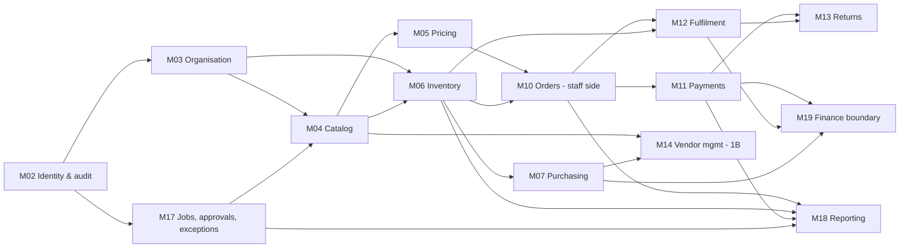
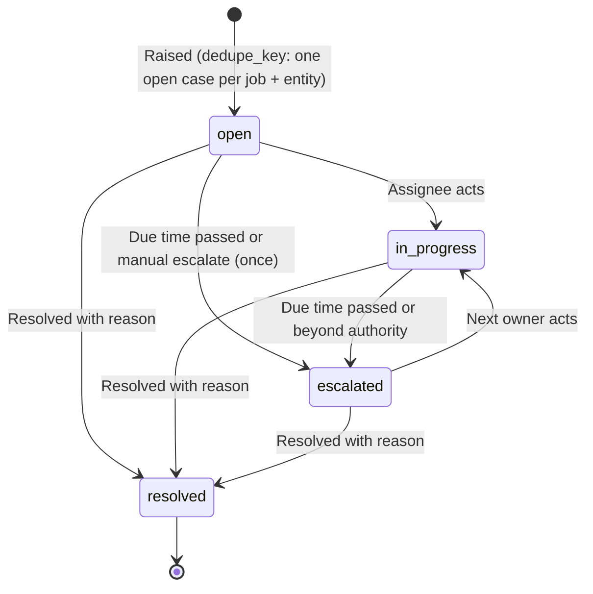
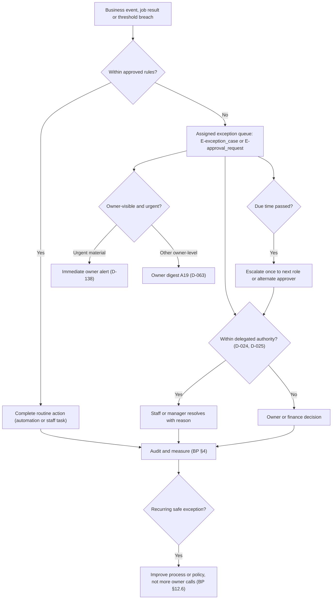

# 10 — ERP modules plan

**Purpose.** Module-level plan for the ERP side of Tradex. For every ERP module listed in BP §14.1 it ties together
the staff UI (`P-E*`), backend services and business rules (`BR-M##-##`), entities (`E-*`), endpoints (`API-M##-##`),
permissions (`R-*`, record scope, thresholds) and tests, and it states phase, dependencies, completion criteria and
open decisions. It also holds the **automation catalogue A01–A38** (defined here per `00-conventions.md` §5) and the
**owner exception model** (BP §12.5).

This file **references** detail instead of repeating it:

| Detail | Where |
|---|---|
| Entity columns, keys, states | `03-database.md` §2 (and §2.21 for registry additions) |
| Services, business rules, state machines, jobs, transaction boundaries TX-1…TX-10 | `05-backend.md` §1, §5 |
| Endpoint contracts | `06-api.md` §2–§4 (screen → endpoint map §7.3) |
| Screen layouts, components, states | `04b-frontend-workspace-1.md` (shell, P-E01–P-E08), `04c-frontend-workspace-2-vendor.md` (P-E09–P-E15, P-V*) |
| Permission keys and the full BP §18.1 matrix | `07-auth-roles-permissions.md` |
| Vendor onboarding, submissions, availability | `09-vendor-marketplace.md` |
| Administration functions (users, roles, thresholds, delegation, configuration, audit, system) | `11-admin.md` |
| Test suites (`TS-*` IDs) | `16-testing.md` |
| Tasks and stages | `TASKS.md`, `12-phases.md` |

**Sources used.** BP §1.1, §2.3, §3.1, §3.3, §4, §5.1–5.3, §7, §8, §9, §10.1, §10.3–10.6, §12, §14.1–14.4, §16.2–16.4,
§17.3, §17.6, §18, §20.3–20.4, §23.1, §26.3–26.6, §29, §30.1 · PR1 §3, §4, §9, §10, §11 · PR2 §2, §4, §6, §7 · MEET ·
MK `erp-*.html`, `assets/tradex.js` (workspace shell).
**Evidence labels and status values:** `00-conventions.md` §2–§3. Every item is `NOT_STARTED` unless marked
`REQUIRES_DECISION (D-###)`. Decision aliases: always cite the surviving ID (D-129 not D-140, D-121 not D-143, D-131
not D-144, D-137 not D-148, D-104 not D-120).

**Platform caveat.** The operational core is OPEN (**D-001**). Everything here is the logical design any core must
satisfy; where the core has a native capability (stock ledger, serials, workflows, scheduler) the task is to
configure and prove it (BP §15.6 "Use platform configuration before custom code"). Whether each `P-E` screen is a
native ERP screen or a custom screen is **D-004** (BP §30.1 "Reuse native ERP screens where they fit"). Mockup sample
values (₹ limits, percentages, durations, names, courier/accounting product names) are **not** requirements
(`00-conventions.md` §1.1).

---

## 0. How to read a module section

| Heading | Content |
|---|---|
| Purpose / phase | What the module is for (source) and its delivery phase (BP §5.1–5.2; `00-conventions.md` §4) |
| Frontend | `P-E` screen, mockup tab (`#tab`), drawer tab or modal (`m-…`) → function → endpoints |
| Backend | Services and business-rule IDs from `05-backend.md` (not restated) |
| Database | Entities used, with their role in the module |
| APIs | Endpoint IDs from `06-api.md` |
| Relationships | Other modules and the interface used (service call, outbox event, shared entity) |
| Permissions | Role → capability → record scope → limits. BP §18.1 rows are quoted; monetary/percentage limits are always `REQUIRES_DECISION (D-024)`; authoritative matrix in `07-auth-roles-permissions.md` |
| Dependencies | Modules and decisions that must be complete/decided first |
| Tests | BP acceptance tests `T01`–`T36`, BP §15.3 proof scenarios ("PS-n"), and module-level test content (suite IDs are assigned in `16-testing.md`) |
| Completion criteria | Verifiable conditions for marking the module `COMPLETED` (`00-conventions.md` §3) |
| Open decisions | Decisions that block or shape the module |

Notation: "loc" = record scope limited to the user's assigned location(s) (`E-user_role_assignment.location_scope`);
"own" = records the user created or is assigned to; "company" = all records of the company. "Buyer" is a
responsibility named in BP §9.3/A17, not a registered role; `06-api.md` maps it to R-ops_admin and
R-branch_manager "where assigned" (role mapping of job titles: **D-222**).

---

## 1. ERP scope, boundaries and exclusions

### 1.1 BP §14.1 module boundaries → this plan

| BP §14.1 module | Minimum useful scope (BP §14.1) | Plan modules | Section | Staff screens | Phase (BP §5.1, §5.2) | Further expansion — **not** in scope (BP §14.1) |
|---|---|---|---|---|---|---|
| Master data | Products, categories, suppliers, customers, locations, taxes, price lists | M03, M04, M05, M07, M08 | §2 (+§3, §4, §6, §7.3) | P-E06, P-E07, P-E09#suppliers, P-E10, P-E15#locations | 1A | Multi-company governance (D-045) |
| Purchasing | Requests/drafts, purchase orders, receipts, variances | M07 | §6 | P-E09 | 1A ("Purchase orders, receipts, basic supplier records" M) | Tendering and automated supplier comparison |
| Inventory | Movements, reservations, serials, transfers, counts | M06 | §5 | P-E08 (+P-E04#quarantine) | 1A ("Central stock, warehouse and serial records" M); supplier availability 1B | Complex warehouse optimisation |
| Sales | Orders, assisted sales, dealer pricing, invoices/interface | M10 (staff side), M05, M08 | §7 | P-E02, P-E05 m-basket, P-E10 | 1A; guided WhatsApp draft (A08) 1B | Advanced quotations and credit control (D-121, D-019) |
| Fulfilment | Pick/pack/dispatch, tracking, cancellations | M12 | §8 | P-E03 | 1A | Multi-carrier optimisation |
| Returns/warranty | RMA, quarantine, refund link, warranty evidence | M13 | §9 | P-E04 | 1A ("Basic returns, refund and warranty traceability" M; "Advanced RMA" 2/3) | Repair workshop scheduling and parts billing |
| Finance boundary | Payment ledger, reconciliation, approved accounting exports | M11 (staff side), M19 | §10 | P-E12 | 1A ("Basic finance exports/reconciliation" M) | Full accounting replacement if agreed (CONDITIONAL, D-011) |
| Vendor management | Applications, approvals, data submissions | M14 (staff side) | §11 → `09-vendor-marketplace.md` | P-E11, P-E06#review | 1B ("Vendor admin-created accounts and submissions" C in 1A, M in 1B) | Marketplace commissions and settlements (M15, LATER, D-046) |
| Staff access | Users, roles, assignments, audit | M02, M24 | → `11-admin.md` §2–§3, §11 | P-E15 | 1A | Payroll and HR are separately scoped |
| Reporting | Operational reports and exports | M18 | §13 | P-E13, P-E01 | 1A (vendor performance and approval ageing views 1B per MK) | Data warehouse and advanced BI |
| *(BP §5.2 "Owner exception dashboard, audit, alerts" M 1A; BP §12)* | Automation, exceptions, approvals, delegation | M17 | §14–§16 | P-E14, P-E01, P-E15#thresholds/#delegation | 1A / 1B (D-192) | General-purpose workflow builder (BP §5.3, D-221) |
| *(BP §9.5, §5.2 "Branch sale entry/integration" M 1A, R14)* | Branch operations and transfers | M03, M06, M10, M11, M18, M23 | §12 | P-E08#transfers, P-E02 m-assisted, P-E13 | 1A | Full replacement POS (CONDITIONAL, D-009/D-030) |

"Inventory extracts" (BP §14.1) = downloadable, filterable reports; whether scheduled files to accountants/suppliers
are also meant is **REQUIRES_DECISION (D-075)** (§13).

### 1.2 Excluded and conditional ERP capabilities (do not build)

"'Full ERP' and 'all normal e-commerce features' describe a direction. They do not automatically include payroll,
manufacturing, fleet management, every courier, every marketplace, or advanced accounting" (BP §2.3). New requests go
to the change register (BP §2.3, §25.5; `11-admin.md` §13).

| Capability | Status in this plan | Source | Treatment |
|---|---|---|---|
| Full accounting replacement (chart of accounts, opening balances, valuation, period locks, bank reconciliation, financial migration, accountant-led UAT) | `CONDITIONAL` (C in every phase) | BP §5.2, §14.1, §14.2 | Only if D-011 adopts ERP accounting; then BR-M19-06 applies and a separate finance sign-off is required. Until then the ERP publishes documents to the retained accounting authority (§10) |
| HR, payroll, attendance | Excluded (C in 2/3, separately scoped) | BP §2.3, §5.2 ("Access management is not full HR"), §14.1 | Staff access (users, roles, assignments, audit) only — `11-admin.md` §2 |
| Manufacturing (production orders, bills of materials) | Excluded | BP §2.3 | Bundles consume component stock only if D-072 approves (BR-M04-17); no production workflow |
| Fleet management | Excluded | BP §2.3 | — |
| Full repair workshop ERP; repair workshop scheduling and parts billing | Excluded / `LATER` expansion | BP §5.3, §14.1 | Warranty tickets tracked without a workshop system (BR-M13-11); serial replacement history kept (BR-M13-10) |
| Tendering and automated supplier comparison | Excluded (further expansion) | BP §14.1 | Buyer-approved POs only (BR-M07-02) |
| Complex / advanced warehouse optimisation | Excluded (further expansion) | BP §14.1, §9.5 ("Introduce sophisticated optimisation only if needed") | Simple single-eligible-location rule (BR-M06-11, D-029) |
| Multi-carrier optimisation; "every courier" | Excluded | BP §2.3, §10.6, §14.1 | One primary provider + manual fallback (BR-M12-07, BR-M12-10, D-013) |
| Advanced quotations and credit control | Excluded (further expansion) | BP §14.1, §8.3 | Dealer quotes D-121; prepaid default D-019 |
| Autonomous purchasing / supplier commitments | Excluded (later scope) | BP §5.3, §9.3 | Suggestions/draft POs only (A17, BR-M07-02) |
| Data warehouse and advanced BI | Excluded (further expansion) | BP §14.1 | Operational reports on operational data (BR-M18-01) |
| Multi-company governance; multi-business SaaS | `LATER` / C | BP §3.3, §5.2, §14.1 | D-045; explicit company/location relationships only (BR-M03-01, BR-M03-02) |
| Marketplace commissions, settlements, payout automation | `LATER` (M15) | BP §5.3, §11.4–11.5, §14.1 | D-046; P-E11#marketplace stays a locked preview |
| General-purpose workflow builder / rules engine | Excluded | BP §5.3, §15.6 | Per-module configurable parameters, approval matrix and automation rules (D-221) |
| Dynamic AI pricing; automated lending/credit decisions | Excluded | BP §5.3 | Pricing engine rules only (BR-M05-04) |
| Full replacement POS | `CONDITIONAL` | BP §5.2 ("Full replacement POS is conditional") | Branch sale entry through assisted orders or legacy integration (§12; D-009, D-030) |
| AI in ERP processes (forecasting A30, invoice OCR A31, suspicious-return model A37, assistants) | `LATER` | BP §12.2 (P2/P3), §28.1 | Listed in §15 only; D-086 |
| Automated collection calls | `LATER` / C | BP §5.3, §13.5, A35 | Payment reminders (A28) are distinct from debt collection (BR-M11-15) |
| Staff ERP mobile app / staff mobile optimisation | Not implied | BP §28.4 | D-085; desktop/laptop browsers in Phase 1 |

### 1.3 Data ownership for ERP data (BP §16.2)

| Data (BP §16.2) | Authority | Owning module | Authoritative entities | Secondary copies (never authoritative) | Section |
|---|---|---|---|---|---|
| Product master | Approved catalog module | M04 | E-product, E-sku, E-catalog_change_version (live pointer) | Search index (M21), storefront cache, provider catalog | §3 |
| Seller offer | Approved offer records | M04 | E-offer | Storefront/search projection | §3 |
| Stock movements and reservations | Operational stock authority | M06 | E-stock_movement (append-only), E-reservation, E-stock_position (derived) | Availability projection for browsing (A04) | §5 |
| Price rules | Pricing module | M05 | E-price_list(+items, tiers), E-price_rule_version | Short-lived quotes (E-quote); "no uncontrolled spreadsheet overrides" | §4 |
| Orders | Order module | M10 | E-sales_order, E-order_line | Accounting/shipping references | §7 |
| Provider payment outcome | Payment provider, reconciled into local payment records | M11 | E-payment_attempt, E-payment_event, E-refund, E-settlement_record | Order financial status (derived) | §10 |
| Legal accounting ledger | Agreed accounting system (D-011) | external / M19 interface | E-invoice_reference, E-accounting_export (mapping only) | Operational reports/exports | §10 |
| Shipment external status | Courier source plus local canonical history | M12 | E-shipment_event (raw + canonical) | Customer tracking view | §8 |
| Permissions | Identity/role system | M02 | E-role, E-permission, E-role_permission, E-user_role_assignment | Cached checks with safe invalidation (BR-M02-14) | `11-admin.md` §3 |
| Product media | Managed object storage | M22 | E-media_asset, E-attachment | CDN cache | §3 |

Rules: a secondary copy never overrides the authority — "Website/search copies may be eventually consistent;
checkout must validate and reserve with the authority" (BP §9.1); "If the legacy system remains the stock authority,
the new application must not independently maintain a competing 'correct' quantity" (BP §9.1; BR-M06-01, D-009).

### 1.4 ERP-wide rules (every module below)

| Rule | Source | Enforced by |
|---|---|---|
| Authorisation on the server for every business operation; the UI only hides what the server would refuse | BP §19.1 | BR-M02-01, BR-M02-02 |
| Least privilege, record-level scope, sensitive-field restrictions; MFA for privileged accounts | BP §18.2 | BR-M02-03, BR-M02-04 |
| Initiator of a high-risk transaction does not approve it where separation is feasible | BP §18.2 | BR-M02-06; rule set D-196 |
| Every material stock, price, refund and permission change is traceable (actor, time, object, before/after, reason, authority) | BP §17.3, §17.6, §20.1 | BR-M02-08, BR-M17-06 |
| Monetary thresholds are client-supplied; never invent ₹ limits | BP §18.1 | BR-M17-14 (D-024) |
| Business-policy values (hold durations, freshness deadlines, COD rules, thresholds) come from decisions, stored as versioned configuration | BP §17.3, §18.1 | BR-M24-01, BR-M24-03 |
| One stock authority; movements append-only; never overwrite a quantity to fix a discrepancy | BP §9.1, §9.6, §17.6 | BR-M06-01, BR-M06-04 |
| Separate records and state machines for order, payment, fulfilment, refund and return | BP §10.1 | BR-M10-01 (state tables in `05-backend.md` §5.10–5.13; gaps D-150) |
| External effects recorded as durable intent (outbox) and reconciled; never "guessed" success | BP §16.3, §10.3 | BR-M17-10, BR-M23-04 |
| Routine work stays in staff queues; the owner sees exceptions above delegated authority, a digest and urgent material items | BP §1.1, §12.5; PR1 §11 | BR-M17-04, BR-M17-05 (§16) |
| Versioned policies: an order is evaluated under the policy versions in force when it was placed | BP §27.2, T33 | BR-M04-15, BR-M10-06 |
| Reuse native ERP workflows where they fit; custom code only in a maintained extension | BP §1.2, §15.6, §30.1 | BR-M01-09 (D-001, D-004) |

### 1.5 ERP build order (subset of `05-backend.md` §2)

M17's job runtime and outbox are built before any module that calls an external system (`05-backend.md` §2 note).

---

## 2. Master data and organisation (M03 + master-data index)

### 2.1 Purpose and phase
Explicit company, branch, warehouse and bin records used by stock, fulfilment, pricing and reporting ("A warehouse is
not a company … Store those relationships explicitly", BP §3.3), plus the index of all BP §14.1 master data and where
each is maintained. Phase **1A**. Seed values: `REQUIRES_DECISION (D-010)`.

### 2.2 Master-data index (BP §14.1 "Products, categories, suppliers, customers, locations, taxes, price lists")

| Master record | Module | Entities | Maintained in (screen) | APIs | Control on change | Section / decisions |
|---|---|---|---|---|---|---|
| Products, SKUs, offers | M04 | E-product, E-sku, E-sku_attribute_value, E-offer, E-catalog_change_version | P-E06#products, #editor | API-M04-15…21 | Versioned draft; review/publication (BR-M04-06…09) | §3 · D-081 |
| Categories and typed attributes | M04 | E-category, E-attribute_definition, E-category_attribute | P-E06#templates, m-newcat | API-M04-25…29 | Template versions submitted for review (API-M04-29) | §3 · T36 |
| Brands | M04 | E-brand | P-E06#editor (brand select) | API-M04-22, API-M04-23 | New brand proposed for approval ("unapproved brands", BP §7.4) | §3 |
| Condition grades, warranty and return policies, inspection checklists | M04 (+M24 config for checklists) | E-condition_grade, E-warranty_policy, E-return_policy, E-configuration_version (`inspection_checklist.*`) | No mockup screen (placement D-004) | API-M04-24, API-M04-22, API-M04-04 | Versioned; published version immutable (BP §27.2) | §3 · D-022, D-023 |
| Tax classifications | M04 | E-tax_classification | No mockup screen | Read: API-M04-22; maintenance: **API gap G-01** | Sensitive edit (BP §11.3); "tax review if required" (BP §18.1) | §3 · D-037 |
| Supplier-code mappings | M04 | E-supplier_code_mapping | P-E06#import (m-import-new "Map supplier codes") | API-M04-33 | Mapping saved with the import job | §3 |
| Suppliers | M07 | E-supplier | P-E09#suppliers (read) | Read: API-M07-18, API-M07-19; create/edit: **API gap G-02** | Vendor-linked suppliers change through M14 approvals (`09`) | §6 · D-068 |
| Customers, dealers, business accounts | M08 | E-customer, E-business_account, E-business_account_member, E-dealer_application, E-address, E-consent_record | P-E10 | API-M08-28…45 | Dealer approval (BP §8.3); suspension; price-list change | §7.3 · D-066, D-067 |
| Customer segments | M08 | E-customer_segment | Seed data (consumer, dealer) | — | Terminology D-006 | D-006 |
| Company, locations, bins | M03 | E-company, E-location, E-location_bin | P-E15#locations | API-M03-02…09 | Company edits: second approver (MK) | §2.3 · `11-admin.md` §9.1 |
| Price lists, quantity tiers, promotions, margin floors | M05 | E-price_list, E-price_list_item, E-quantity_tier, E-price_rule_version, E-promotion, E-margin_floor, E-discount_authority | P-E07 | API-M05-10…23 | Change request → approval → activation (BR-M05-17) | §4 · D-017, D-018, D-044 |
| Reorder rules | M06/M07 | E-reorder_rule | P-E09#suggestions "Rule settings", P-E08#stock | API-M06-30 | — | §5, §6 · D-070 |
| Units of measure, lots | M04/M06 | (codes) / E-lot (CONDITIONAL) | — | — | — | D-127, D-126 |
| Reason codes (cancellation, hold, adjustment, transfer, return, refund …) | all | enum/code columns | — | — | — | D-139 |
| Document numbering (non-fiscal / fiscal) | all / M19 | `docno` columns | — | API-M19-09 (fiscal series view) | Fiscal series gapless (MK) | D-123, D-055 |

### 2.3 Organisation module (M03)

**Frontend.**

| Screen / element | Function | APIs |
|---|---|---|
| P-E15#locations — Company card | View/edit legal entity used on invoices, credit notes and exports (edit: owner, second approver — MK) | API-M03-08, API-M03-09 |
| P-E15#locations — Locations table, "Add location" | Locations with address, capabilities, bins count, manager, status | API-M03-02, API-M03-03, API-M03-04 |
| P-E15#locations — bins panel, "Add bin", "Print labels" | Bins by zone with disposition, units, last count, status (open / locked / not sellable) | API-M03-05, API-M03-06, API-M03-07 |
| Workspace shell — location switcher | Scope switch; list limited to the user's location scope | API-M03-02 |
| Filters on P-E01–P-E13 | Location filter values | API-M03-02 |
| P-S01, P-S13, P-S10 (storefront) | Public store list (customer-facing locations only) | API-M03-01 |

Administration of this screen is described in `11-admin.md` §9.1.

**Backend.** LocationService — BR-M03-01…BR-M03-06 (`05-backend.md` §5.3).
**Database.** E-company (legal entity, `[CO]` scope of most records), E-location (type warehouse/branch, capabilities,
`uses_bins`, state), E-location_bin (zone, default disposition, state incl. `frozen_for_count`).
**APIs.** API-M03-01…09.

**Relationships.**

| Module | Relationship | Interface |
|---|---|---|
| M06 | Every movement, position, reservation, count and transfer references a location (and bin where `uses_bins`) | shared refs; BR-M03-05 deactivation guard queries M06 balances/open tasks |
| M12 | Fulfilment location and dispatch capability; serviceability origin | E-location.capabilities |
| M05 | Location price lists if approved | D-044 |
| M19 | Company legal details and per-location registrations on invoices; series per location if D-055 says so | E-company, E-location.tax_registration |
| M02 | Location scope of role assignments | E-user_role_assignment.location_scope |
| M18 | Branch/location dimension in reports (R14) | report filters |

**Permissions.**

| Role | Capability | Scope | Limits / controls |
|---|---|---|---|
| R-owner | Edit company details; add/edit/deactivate locations; bins | company | Company edit needs second approver (MK; BR-M03-06) |
| R-ops_admin | Add/edit/deactivate locations; add bins | company | Deactivation blocked while stock/open tasks exist (BR-M03-05) |
| R-branch_manager | Add bins | loc | — |
| R-warehouse_staff | View bins, print bin labels | loc | — |
| All staff | Read locations (switcher), company | per scope | — |

**Dependencies.** M02. Decisions D-010 (seed volumes), D-037 (registration check before activating a location),
D-061 (pickup capability), D-029 (cross-branch visibility), D-110 (bin label/scan format), D-123 (codes).

**Tests.** Location/bin code uniqueness; BR-M03-05 deactivation guard; branch manager cannot add bins to another
location (record scope); company edit without second approver rejected; seed reconciliation in the M25 migration
rehearsal. Supports T05, T16 (location-dependent).

**Completion criteria.** Confirmed legal entities, branches, warehouses and bins seeded (D-010); every stock record
references an active location (and bin where required); location switcher scope enforced server-side; invoice legal
details read from E-company. Status: `REQUIRES_DECISION (D-010)`.

**Open decisions.** D-010, D-029, D-037, D-045 (LATER), D-061, D-110, D-123.

---

## 3. Catalog (M04)

### 3.1 Purpose and phase
Stable product model with configurable category attributes; SKUs, offers, media, condition grades,
warranty/return/tax references; lifecycle with review and versioned drafts; validated imports (BP §7; PR1 §4
"Product Management"; PR2 §4 catalogue model). "Adding an ordinary category should require configuration and
content, not a new product table or rewritten checkout" (BP §7.1, §29.8).
Phase **1A**; validated bulk import (A01/A02) **1B** per BP §5.1 although BP §12.2 marks them P1 — stage allocation
`REQUIRES_DECISION (D-048, D-078)`; vendor submissions in the review queue **1B** (M14).

### 3.2 Frontend

| Screen / tab / modal | Function | APIs |
|---|---|---|
| P-E06#products | Staff product list incl. drafts, data-quality flags, ATP column, price; bulk lifecycle actions (submit, publish, suspend, archive, set channels); "Stock by location" | API-M04-15, API-M04-20, API-M06-03, API-M06-04, API-M18-03 |
| P-E06#editor | Product draft editor (core fields BP §7.2, typed attributes, variants/SKUs, media, policies, channels); version history; "Publish readiness" checks; "Save draft" never overwrites live | API-M04-16, API-M04-17, API-M04-18, API-M04-22, API-M04-23, API-M22-01 |
| P-E06 m-url | Import image from URL (allow-listed, rights confirmed) | API-M22-04 |
| P-E06 m-vdiff | Compare versions (live vN ↔ draft vN+1) | API-M04-21 |
| P-E06#review | Review queue: staff drafts, vendor submissions, sensitive edits, auto-accepted refreshes; approve / approve & publish / request changes (m-changes); discard draft; revert auto-accepted availability refresh | API-M04-39, API-M14-54, API-M17-02, API-M17-03, API-M04-19, API-M06-29 |
| P-E06#templates, m-newcat | Category tree, attribute template (typed attributes, filter preview, impact), new category by configuration, publish template version | API-M04-25, API-M04-26, API-M04-27, API-M04-28, API-M04-29 |
| P-E06#import, m-import-new | New bulk import (versioned template), column mapping, supplier-code mapping, row-level results, inline fix, retry failed rows, preview diff, commit to drafts, error report, import history & scheduled feeds | API-M04-30…38 |
| Shell "New › Product draft / Bulk import" | Shortcuts | API-M04-16, API-M04-30 |
| P-E11#submissions | Vendor-side review entry (details `09`) | API-M04-39, API-M14-54 |
| Policy versions, grade rubric, inspection checklists, tax classifications, curated synonyms | **No mockup screen** — placement `REQUIRES_DECISION (D-004)` | API-M04-24, API-M21-04; tax: API gap G-01 |

### 3.3 Backend
CatalogAdminService, ProductDraftService, LifecycleService, PublicationChecker, CategorySchemaService,
CatalogImportService (A01), PolicyService, CompatibilityService (D-071), BundleService (D-072) —
BR-M04-01…BR-M04-20 (`05-backend.md` §5.4). Public-facing services (reviews, Q&A, content reports) are covered in
`08-ecommerce.md`.

**Lifecycle and authority** (BP §7.3 transitions = BR-M04-05; authority BP §18.1):

| Transition | Who may trigger | API | Guard |
|---|---|---|---|
| Create / edit draft | R-catalog_staff (assigned categories), R-ops_admin, R-owner; vendor "own submission" via M14 | API-M04-16, API-M04-18 (M14: API-M14-06) | Drafts may be incomplete; live data untouched (BR-M04-06) |
| Draft → Submitted | R-catalog_staff | API-M04-20 `submit` | Required attributes per category template (BR-M04-04) |
| Submitted → NeedsChanges / Approved | Designated reviewer `REQUIRES_DECISION (D-081)`; R-finance "tax review if required" | API-M17-03 via API-M04-39 | Reviewer ≠ author (BR-M02-06); expected version (BP §17.4) |
| Approved → Published | Designated reviewer / R-owner ("Publish new product: Staff no by default; Manager designated reviewer; Owner yes", BP §18.1) | API-M04-20 `publish` or API-M17-03 `approve_and_publish` | Publication checks: tax classification, rights flag, images, required attributes (BR-M04-09, BR-M04-11) |
| Published → Suspended | R-ops_admin, R-owner | API-M04-20 `suspend` | Safety/quality reason; immediate (BR-M04-07 exception) |
| Suspended → Submitted | R-catalog_staff after correction | API-M04-20 `submit` | — |
| Published → Archived | R-ops_admin, R-owner | API-M04-20 `archive` | Marked unavailable; redirect/unavailable page via M27 (BR-M04-20) |
| Change to a published product | as draft | API-M04-18, API-M04-19, API-M04-21 | Pending version while last approved stays live (BR-M04-07); sensitive fields need review (BR-M04-08) |

### 3.4 Database
E-category, E-attribute_definition, E-category_attribute (template), E-brand, E-product, E-sku,
E-sku_attribute_value, E-offer, E-media_asset, E-tax_classification, E-condition_grade, E-warranty_policy,
E-return_policy, E-catalog_change_version (versioned drafts; live pointer), E-compatibility_link (CONDITIONAL D-071),
E-bundle_component (CONDITIONAL D-072), E-import_job, E-import_row, E-import_mapping_profile, E-supplier_code_mapping,
E-configuration_version (`inspection_checklist.*`), E-approval_request (reviews), E-audit_event.

### 3.5 APIs
Staff: API-M04-15…39. Cross-module: API-M06-03, API-M06-04, API-M06-29, API-M14-54, API-M17-02, API-M17-03,
API-M22-01, API-M22-04, API-M18-03, API-M21-04. Public (read by storefront, `08`): API-M04-01…14.

### 3.6 Relationships

| Module | Relationship | Interface |
|---|---|---|
| M06 | SKUs are stocked; serial units reference SKU and condition grade; ATP shown in product list | E-sku refs; API-M06-03/-04 |
| M05 | Offers are priced by price lists; supplier cost changes raise cost signals, never automatic price changes (BR-M05-14) | E-offer; API-M05-22 |
| M14 | Vendor submissions become catalog drafts/offer versions only through review (BR-M14-05) | TX-10 approval decision |
| M17 | Review and publication decisions; brand and template approvals; import failure incidents (A38) | E-approval_request, E-exception_case |
| M21 | Approved changes refresh search index | outbox → M21 (BR-M04-20) |
| M27 | Archive/suspend → unavailable page or redirect; sitemap regeneration | outbox |
| M22 | Media and private import files | E-media_asset, E-attachment |
| M13 | Warranty/return policy versions evaluated at return time | E-warranty_policy, E-return_policy versions |
| M25 | Product/SKU/image migration uses the same validation pipeline | E-import_job |

### 3.7 Permissions

| Role | Capability | Scope | Limits / controls |
|---|---|---|---|
| R-catalog_staff | Create/edit drafts, submit, run imports, map columns, fix rows, edit templates (template permission), propose brands | assigned categories | Publishes only if designated reviewer (D-081); cost/margin only if assigned (BP §3.1; D-197) |
| Designated reviewer (role per D-081) | Approve / request changes / approve & publish | categories assigned | Not own drafts (BR-M02-06) |
| R-finance | Tax review where required; read | company | BP §18.1 |
| R-ops_admin | Suspend, archive, set channels; policy versions (API-M04-24) | company | — |
| R-owner | All, incl. publish | company | — |
| R-branch_manager, R-sales_support | Read product list | company | No draft access |
| R-supplier | Own submissions only (M14) | own vendor | No publication, no live write (T12, T13) |

### 3.8 Dependencies
M02, M03, M17 (approvals, jobs), M22, M24. Decisions: D-081 (publication authority), D-022/D-023 (policy and grade
content), D-037 (tax classification content), D-057 (content/image sources), D-048/D-078 (import stage), D-004.

### 3.9 Tests
T01, T12, T13, T26, T33, T36; PS-2 (publish only accepted units), PS-6 (vendor product change, approve, history).
Module tests: lifecycle transition table (every illegal transition rejected); publication checker (missing tax
class, rights flag, required attribute → blocked); pending version never alters live data; import idempotency (same
file twice → no duplicate drafts); row-level error/retry; SSRF rejection of internal addresses on URL import; new
category (BP §29.8 printers) configured and purchasable without code change.

### 3.10 Completion criteria
Representative products import correctly (WP06); T36 passes without code change; pending versions never alter live
data (T13); every publication, suspension and archive is audited with actor and reason; no product is purchasable
without passing publication checks.

### 3.11 Open decisions
D-004, D-022, D-023, D-037, D-048, D-057, D-071, D-072, D-078, D-081, D-113, D-122, D-125, D-126, D-127, D-197.

---

## 4. Pricing (M05)

### 4.1 Purpose and phase
One server-side price calculation for website, staff orders, WhatsApp and future app; price lists, quantity tiers,
promotions, margin/discount authority and time-limited quotes (BP §8; PR1 §8; PR2 §4 "Pricing should be a reusable
capability"). Phase **1A**; margin-leakage flag A36 **1B**.

### 4.2 Frontend

| Screen / tab / modal | Function | APIs |
|---|---|---|
| P-E07#lists, m-newlist | Price lists (public, dealer, contract; location lists only if D-044), detail drawer, create draft list | API-M05-10, API-M05-11, API-M05-12 |
| P-E07#tiers | Quantity-tier editor per SKU × list; "Save as draft change", "Propose change", "Duplicate as draft" | API-M05-15, API-M05-13 |
| P-E07#promotions | Promotions, stacking policy, validation failures, budget; new promotion; single-use codes | API-M05-17, API-M05-18, API-M05-19 (CONDITIONAL D-043) |
| P-E07#controls | Margin floors and authority by role; open override requests; "Edit" margin floor | API-M05-20, API-M05-21 |
| P-E07#approvals, m-decide | Pending price-list changes as diff; supplier cost changes detected → draft change or dismiss; decide | API-M05-14, API-M05-22, API-M05-23, API-M17-02, API-M17-03 |
| P-E07#simulator | Read-only price simulation through the live engine with step trace | API-M05-16 |
| P-E07#rules ("Edge cases") | Read-only display of BP §8.4 behaviours and their configured handling | API-M05-20 (configuration read) |
| P-E07#audit ("Change audit") | Price and list change history | API-M02-30 |
| P-E02 m-assisted, P-E05 m-basket | Staff quote for assisted orders / draft baskets | API-M05-01 |
| P-E10#business "Change price list" | Assign a price list / terms to a business account | API-M08-36 |

### 4.3 Backend
PricingEngine, QuoteService, PriceListService, PriceChangeService, PromotionService (D-043), MarginAuthorityService,
PriceSimulator, CostSignalService — BR-M05-01…BR-M05-20 (`05-backend.md` §5.5). Calculation sequence BR-M05-04
(BP §8.1, PROPOSED, D-017). Activation of an approved list change is TX-10.

### 4.4 Database
E-price_list, E-price_list_item, E-quantity_tier, E-price_rule_version (the version recorded on each order line,
BR-M05-03), E-promotion, E-promotion_code (CONDITIONAL D-043), E-margin_floor, E-discount_authority, E-quote,
E-quote_line, E-approval_request (price_change, dealer_tier_change, margin_override, discount_override), E-audit_event.

### 4.5 APIs
API-M05-01, API-M05-02, API-M05-10…23; API-M08-36; API-M17-02, API-M17-03; API-M02-30; API-M18-03. Dealer-facing
(API-M05-03…09) are in `08-ecommerce.md` (D-121 for quotes/quick order).

### 4.6 Relationships

| Module | Relationship | Interface |
|---|---|---|
| M08 | Buyer context from verified business-account membership (BR-M02-13, BR-M05-08) | BuyerContextResolver |
| M04 | Offers and SKUs priced; supplier cost signals from bills/submissions/POs (BP §8.4) | API-M05-22 |
| M10 | Order lines store final price and rule version; revalidation at order/reservation (BR-M05-04 step 8) | QuoteService |
| M12 | Shipping charge and serviceability in step 5–6 | ServiceabilityService |
| M17 | Change requests, margin/discount overrides → approvals; A36 exceptions | E-approval_request |
| M18 | Gross margin, dealer tier sales reports | report queries (restricted, BR-M18-04) |
| M21 | No private prices in shared projections (BR-M21-06) | index rules |

### 4.7 Permissions

| Role | Capability | Scope | Limits / controls |
|---|---|---|---|
| R-sales_support | Request tier/list change; quote; staff discount within own authority | assigned customers/orders | Limits D-024 ("Change dealer tier: Staff request", BP §18.1) |
| R-branch_manager | Approve discounts / propose list changes within delegated policy | loc | "cannot change all dealer price lists" (BP §12.6); limits D-024 |
| R-finance | Margin-floor changes (propose), cost signals, promotions review, reports | company | "Review if needed" (BP §18.1) |
| R-ops_admin | Create lists, promotions, propose changes | company | Approval per D-024 |
| R-owner | Approve list changes, overrides below margin floor | company | "Yes" (BP §18.1) |
| All | Simulator (read-only) | per role | Dealer private prices never shown outside authorised context (BR-M05-16) |

Separation of duties: the price-list editor cannot approve their own change (MK:erp-admin.html#roles; BR-M02-06).
Visibility of supplier cost and margin columns: `REQUIRES_DECISION (D-197)`.

### 4.8 Dependencies
M02, M04, M08, M17, M12 (shipping charge), M24. Decisions D-016, D-017, D-018, D-024, D-043, D-044, D-104, D-154.

### 4.9 Tests
T02, T03, T10, T22, T33, T34; PS-3 (public vs dealer, ten-unit tier, no leakage). Module tests: 8-step precedence
matrix (contract → dealer → public; tier; promotions per stacking policy; expired list never zero); money rounding
(D-104); change request → approval → atomic activation; self-approval rejected; simulator uses the live engine
version; A36 flag fires only on approved rule (1B).

### 4.10 Completion criteria
Price matrix and privacy tests pass (WP07); the engine is the only price source for every channel; every list
activation traceable to an approved change request; D-016, D-017, D-018 recorded. Status:
`REQUIRES_DECISION (D-016, D-017, D-018)`.

### 4.11 Open decisions
D-016, D-017, D-018, D-024, D-043, D-044, D-082, D-104, D-121, D-154, D-197.

---

## 5. Inventory and serials (M06)

### 5.1 Purpose and phase
The single stock authority: append-only movements by SKU, location, stock owner and disposition; available-to-promise;
reservations; serialised units and inspections; transfers; counts and adjustments; supplier availability kept
separate from company stock (BP §9; PR1 §9; PR2 §4 "Inventory authority"; R08, R14, R19). Phase **1A**; supplier
availability feeds and freshness (A21) **1B**.

### 5.2 Frontend

| Screen / tab / modal | Function | APIs |
|---|---|---|
| P-E08#stock | Enterprise stock by SKU with ATP components (sellable, reserved, safety buffer, quarantine, in transit shown separately); per-location/bin drawer; reorder point | API-M06-03, API-M06-04, API-M06-30 |
| P-E08#serials | Serial lookup (internal ID, manufacturer serial, order); unit lifecycle (PO → receipt → QC → sale → return → re-grade); unit actions (re-grade, send to repair, return to supplier, open discrepancy); m-reveal manufacturer serial with reason | API-M06-05, API-M06-06, API-M06-07, API-M06-08, API-M06-09, API-M02-31, API-M13-15 |
| P-E08#movements | Append-only stock ledger with reference documents | API-M06-11 |
| P-E08#transfers, m-transfer | Transfer list, create/submit, ship, receive (incl. late units), shortage investigation / record loss | API-M06-12…17 |
| P-E08#counts | Start count/recount, count sheet, submit counted quantities (no stock change), variance review, adjustment requests, "Approve selected" (bulk, per-item history), adjustment approval thresholds | API-M06-18…23, API-M17-03, API-M17-04, API-M17-18 |
| P-E08#reservations | Active holds, hold durations by channel (configuration), releases by the expiry job, extend (once, with reason) / release | API-M06-24, API-M06-25, API-M24-01, API-M24-02, API-M17-15 |
| P-E08#supplier | Supplier feeds and partner offers with freshness; stale-feed handling; request update / suspend / resume; feed log (1B) | API-M06-26, API-M06-27, API-M06-28 |
| P-E04#quarantine | Quarantine queue (returns and inbound QC) | API-M06-05 |
| P-E09#receive | QC outcome per unit at receipt | API-M06-09 |
| P-E03#picking | Scan verification against allocation; short pick / mis-slot → recount | API-M12-07, API-M12-08, API-M06-19 |
| Shell "New › Stock transfer"; global search (serials) | Shortcuts | API-M06-13, API-M06-06, API-M21-03 |

### 5.3 Backend
StockLedger, AtpCalculator, AvailabilityProjector (A04), ReservationService (A05, A06), SerialUnitService,
InspectionService, DataErasureService, TransferService, CountService (A24), AdjustmentService,
SupplierAvailabilityService + FreshnessMonitor (A21), ReorderRuleService — BR-M06-01…BR-M06-23
(`05-backend.md` §5.6). Transactions TX-1 (reservation part), TX-4, TX-5, TX-6, TX-7, TX-8, TX-9.

**Stock events → operations** (BP §9.2 table; movement types in `03-database.md` §5.3):

| Stock event (BP §9.2) | Quantity effect | Triggering operation | API | Transaction |
|---|---|---|---|---|
| Purchase order issued | None on physical on-hand | PO sent after approval | API-M07-07 | — |
| Goods received into inspection | + received/quarantine | GRN posting | API-M07-13 | TX-5 |
| Inspection accepted | → sellable | QC pass (at posting or later inspection) | API-M07-13, API-M06-09 | TX-5 |
| Reservation created | − ATP only | Pending order; assisted order; reallocation | API-M10-06, API-M10-18…21, API-M10-17 | TX-1 |
| Shipment dispatched | − on-hand, consume reservation atomically | Handover; store collection | API-M12-15, API-M12-19 | TX-4 |
| Reservation expires / cancels | Release | A06 expiry job; line cancellation; manual release | API-M06-25, API-M10-09 | TX-3 |
| Customer return received | + quarantine | Return / RTO receipt | API-M13-10 | TX-8 |
| Return approved for resale | Quarantine → sellable | Disposition decision (separate from refund) | API-M13-11 | TX-9 |
| Adjustment | Approved correction with reason | Adjustment request → approval | API-M06-23 → API-M17-03 | TX-7 |
| Transfer shipped / received | Source → transit → destination | Transfer transitions | API-M06-15, API-M06-16 | TX-6 |
| Unit re-grade / repair / return to supplier | Disposition change per unit | Unit actions; supplier RMA | API-M06-08, API-M13-16 | movement per action |

### 5.4 Database
E-stock_movement (append-only), E-stock_position (derived/maintained with movements), E-reservation, E-serial_unit,
E-serial_event, E-inspection, E-transfer, E-transfer_line, E-stock_count, E-stock_count_line, E-stock_adjustment,
E-supplier_availability, E-reorder_rule, E-lot (CONDITIONAL D-126), E-location_bin (freeze), E-configuration_version
(`reservation.hold_durations`, `safety_buffer.policy`, `supplier.freshness_policy`), E-approval_request,
E-exception_case (stock_mismatch, duplicate_serial, transfer_discrepancy, late_capture_stock_conflict,
stale_vendor_data).

### 5.5 APIs
API-M06-03…30 (staff); API-M06-01, API-M06-02 (public, `08`); API-M02-31; API-M13-15; API-M17-03, API-M17-04,
API-M17-15, API-M17-18; API-M24-01, API-M24-02; API-M18-03.

### 5.6 Relationships

| Module | Relationship | Interface |
|---|---|---|
| M10 | Reservation and pending order succeed or fail together (BR-M06-05) | TX-1 within the core |
| M12 | Allocation, scan verification, dispatch decrement (BR-M06-08, BR-M12-06) | TX-4 |
| M07 | Receipt posting creates movements, serial units, inspections | TX-5 |
| M13 | Return receipt to quarantine; resale disposition | TX-8, TX-9 |
| M04 | SKU, condition grade, inspection checklist version | refs |
| M14 | Supplier availability updates (never company stock, BR-M06-15) | API-M14-19 → SupplierAvailabilityService |
| M21 / M09 | Availability projection (A04) with version/timestamp | outbox → projection |
| M23 | Legacy POS/ERP stock-affecting events if legacy remains (D-009, D-030) | API-M23-01 |
| M17 | Adjustment approvals, count variance and discrepancy exceptions, expiry job runs | E-approval_request, E-exception_case, E-job_attempt |
| M18 | Stock position, ageing, low stock reports | report queries |

### 5.7 Permissions

| Role | Capability | Scope | Limits / controls |
|---|---|---|---|
| R-warehouse_staff | View stock/serials, record inspections (assigned inspector), data-erasure evidence, count (assigned counter), ship/receive transfers, request adjustments and unit actions | loc | "Adjust stock: Staff — Request" (BP §18.1); cannot approve own request |
| R-branch_manager | Create/submit transfers, start counts, approve adjustments within threshold, extend/release holds, investigate discrepancies, reorder rules where assigned | loc (+ cross-branch view per D-029) | "Within threshold" (BP §18.1) — D-024 |
| R-finance | Movements and adjustment queue read; value review | company | "Value review" (BP §18.1) |
| R-ops_admin | All inventory operations; approve adjustments within threshold; supplier feed actions | company | D-024 |
| R-owner | High-value adjustment / write-off approval | company | "High-value approval" (BP §18.1); "Large unexplained losses go to the owner/finance queue" (BP §9.6) |
| R-sales_support | Read stock, serial lookup, reservation list; extend/release holds on own orders | loc / own | Reveal of manufacturer serial only per D-153 |
| R-catalog_staff | Supplier feed actions, revert auto-accepted refresh (reviewer) | company | — |
| R-supplier | "Own availability only" (BP §18.1) via M14 | own vendor | Never company stock (BR-M06-15) |

### 5.8 Dependencies
M02, M03, M04, M17 (approvals, jobs), M24. Decisions D-024, D-026, D-027, D-029, D-030, D-031, D-069, D-073, D-110,
D-126, D-128, D-135, D-139, D-147, D-153; supplier availability D-028.

### 5.9 Tests
T04, T05, T09, T14, T15, T16, T17, T21, T31; PS-1 (three refurbished laptops, different outcomes), PS-4 (last unit
website vs branch), PS-8 (recover failed stock-update job, reconcile channel view). Module tests: N parallel
reservations on one unit → exactly one success; property test Σ movements = positions (nightly reconciliation job
reports zero drift); partial transfer receipt keeps in-transit and discrepancy visible; count submission never changes
stock until approval; serial cannot be on two active fulfilments; returned storage device cannot become sellable
without erasure evidence; ATP formula never subtracts quarantine/in-transit twice; A04 projection lag within D-034.

### 5.10 Completion criteria
Last-unit, serial and count tests pass (WP08); reconciliation reports zero drift on rehearsal data; reserved and
in-transit quantities distinguishable in every stock view (A18); every adjustment has reason, approver and value
impact; A04 lag within the agreed window (D-034).

### 5.11 Open decisions
D-024, D-026, D-027, D-028, D-029, D-030, D-031, D-034, D-069, D-073, D-110, D-126, D-128, D-135, D-139, D-147, D-151,
D-153.

---

## 6. Purchasing and receiving (M07)

### 6.1 Purpose and phase
Replenishment suggestions, purchase orders with approval, goods receipt with serial scanning and QC, supplier bills
with three-way matching and duplicate detection (BP §9.3; PR1 §4 "Purchasing"; PR2 §4 "Purchasing & receiving";
MEET "recording purchase orders and received products"). Phase **1A** (BP §5.2 "Purchase orders, receipts, basic
supplier records" M; "Reuse existing workflow if retained" — D-009).

### 6.2 Frontend

| Screen / tab | Function | APIs |
|---|---|---|
| P-E09#suggestions | Rule A17 reorder suggestions grouped by supplier; quantities editable; create draft POs or dismiss; "Rule settings" | API-M07-01, API-M07-02, API-M06-30, API-M17-09 |
| P-E09#orders | PO list and drawer; submit for approval, send, remind, cancel remaining, close; PO PDF | API-M07-03, API-M07-05, API-M07-07, API-M07-08 |
| P-E09#new-po | Draft PO (lines from suggestions or manual, terms, supplier quotation ref, attachments); "Approval required" panel | API-M07-04, API-M07-06, API-M07-07, API-M22-01 |
| P-E09#receive | GRN against PO: scan box, lines on this delivery, over/short/substitution handling, QC outcome per unit, landed cost (D-056), scan log, "Post GRN" | API-M07-09…13, API-M06-09 |
| P-E09#bills | Supplier bills with 3-way match status; record bill; match detail; send to buyer, request credit note, approve with variance, not-duplicate / reject duplicate | API-M07-14…17 |
| P-E09#suppliers | Suppliers with lead-time, on-time, fill-rate and QC-fail metrics; terms; actual lead-time series | API-M07-18, API-M07-19 (create/edit: API gap G-02) |
| Shell "New › Purchase order / Goods receipt (GRN)" | Shortcuts | API-M07-04, API-M07-09 |
| P-E04#supplier, P-E08#serials "Return to supplier" | Supplier RMA from failed QC or return | API-M13-15, API-M13-16 |
| P-V03#pos (vendor side, 1B) | Supplier views own POs; confirmation/ASN only if D-131 | API-M14-23…26 (`09`) |

### 6.3 Backend
ReplenishmentService (A17), PurchaseOrderService, ReceiptService (A03), BillMatchingService (A25), SupplierService —
BR-M07-01…BR-M07-13 (`05-backend.md` §5.7). Flow BP §9.3 (diagram in `02-architecture.md` §13). Posting is TX-5; PO
approval is TX-10; bill recording + duplicate check in one transaction (duplicate → bill on hold + exception).

### 6.4 Database
E-supplier, E-purchase_order, E-purchase_order_line, E-goods_receipt, E-goods_receipt_line, E-supplier_bill,
E-supplier_bill_line, E-replenishment_suggestion, E-reorder_rule (M06), E-serial_unit / E-inspection (M06),
E-advance_shipping_notice (MOCKUP-ONLY, D-131), E-attachment, E-approval_request (purchase_order), E-exception_case
(purchase_variance, duplicate_serial).

### 6.5 APIs
API-M07-01…19; API-M06-09, API-M06-30; API-M13-14…16; API-M17-03; API-M22-01; API-M18-03. Vendor side
API-M14-23…26 (`09`).

### 6.6 Relationships

| Module | Relationship | Interface |
|---|---|---|
| M06 | Receipt → movements, serial units, inspections; A17 reads ATP, reorder rules and open POs | TX-5; ReorderRuleService |
| M04 | PO lines reference mapped SKUs; supplier codes ≠ internal SKU (BR-M04-02) | E-supplier_code_mapping |
| M05 | Supplier cost changes → cost signals, never automatic price changes (BR-M05-14) | API-M05-22 |
| M14 | Supplier ↔ vendor organisation; PO view in portal (1B); supplier RMAs | E-supplier link; API-M14-23…32 |
| M19 | Supplier bills exported to the accounting authority if in scope (D-011) | E-accounting_export (document = E-supplier_bill) |
| M17 | PO approval by value; variance and duplicate exceptions; A17/A25 runs | E-approval_request, E-exception_case |
| M13 | Supplier RMA for failed QC | E-supplier_rma |
| M18 | Low stock, vendor performance (lead time, fill rate) | report queries |

### 6.7 Permissions

| Role | Capability | Scope | Limits / controls |
|---|---|---|---|
| Buyer responsibility (R-ops_admin; R-branch_manager where assigned — D-222) | Suggestions → draft POs, edit/submit/send/remind/close POs, reorder rules, review bill variances, supplier RMAs | company / loc | PO approval by value `REQUIRES_DECISION (D-024)` (BR-M07-10) |
| R-warehouse_staff | Start/scan/update/post GRN, QC per unit | loc | "Record matching receipt: Assigned warehouse" (BP §18.1) |
| R-branch_manager | Receipts at own branch | loc | "Manager: Yes" |
| R-finance | Record bills, 3-way match, approve with variance per threshold; read POs/receipts | company | "Finance: Read" for receipts (BP §18.1); variance tolerance D-024 |
| R-owner | All; above-limit PO approval | company | D-024 |
| R-supplier | View own POs (1B) | own vendor | "Vendor: No company receipt" (BP §18.1) |

Separation of duties: "PO creator should not receive the goods" is shown in the mockup as a *warning* with post-review
for small branches (MK:erp-admin.html#roles) — whether it blocks or warns is `REQUIRES_DECISION (D-196)`.

### 6.8 Dependencies
M06, M04, M17, M19 (bill export), M14 (1B vendor side). Decisions D-024, D-056, D-070, D-110, D-123, D-131, D-135,
D-011.

### 6.9 Tests
T15, T21; PS-1. Module tests: partial receipt + backorder; over/short receipt review; substitution requires approval;
wrong/duplicate serial → discrepancy, never publishable stock; GRN posting idempotent (repeat → no second effect);
duplicate supplier invoice blocked (exact key) and near-match flagged; late GRN recalculates 3-way match; no PO sent
without approval; A17 excludes discontinued items and never sends a PO.

### 6.10 Completion criteria
Receipt → QC → sellable path works with serials; T15 passes; no PO is sent without approval; bills matched or held
with a reason; suppliers can be created and maintained in 1A (API gap G-02 closed).

### 6.11 Open decisions
D-011, D-024, D-056, D-070, D-110, D-123, D-131, D-135, D-196, D-222.

---

## 7. Sales — orders and assisted sales (M10 staff side; customers M08 staff side)

### 7.1 Purpose and phase
Staff order queue and detail, holds, cancellations, reallocation, replacement orders, assisted orders (phone,
walk-in/branch counter, WhatsApp basket) using the same pricing, reservation and payment controls as web checkout
(BP §10.1, §10.3, §13.1–13.2, §29.5; BP §14.1 Sales "Orders, assisted sales, dealer pricing, invoices/interface";
PR1 §4 "Orders"; PR2 §6). Customer-facing checkout is in `08-ecommerce.md`. Phase **1A** (Level 1 + secure assisted
orders, BP §13.1); guided WhatsApp draft order (A08) **1B**.

### 7.2 Frontend

| Screen / tab / modal | Function | APIs |
|---|---|---|
| P-E02 list, saved views (work queues), filters | Orders with separate order / payment / fulfilment / return states; derived summary labels only for display (`00-conventions.md` §12 #7, D-150) | API-M10-08, API-M18-13, API-M18-14, API-M18-03 |
| P-E02 bulk bar | Release to fulfilment, assign, place on hold, send payment reminder — per-order results | API-M10-13 |
| P-E02 drawer #od-lines | Lines and pricing (price and rule version, condition, policy versions); cancel lines (m-cancel); reserve alternate; request transfer | API-M10-07, API-M10-09, API-M10-17, API-M06-13 |
| P-E02 drawer #od-pay | Payment attempts, webhook event log, reconcile now, refund, invoice | API-M11-04…07, API-M11-09, API-M19-01, API-M19-02 |
| P-E02 drawer #od-ship | Fulfilments, pick lists, tracking sync | API-M12-06, API-M12-10, API-M12-17 |
| P-E02 drawer #od-time | Timeline and audit; notification delivery status; resend notification / ask customer | API-M02-30, API-M20-03, API-M20-04 |
| P-E02 drawer #od-notes | Internal notes with mentions — `MOCKUP-ONLY` (D-134) | API-M10-16 |
| P-E02 m-hold / "Release hold" | Hold with reason, owner and review date; release | API-M10-14, API-M10-15 |
| P-E02 m-assisted; shell "New › Assisted order" | Assisted-order draft: customer, lines (search), fulfil-from, discount within authority, quote; send secure checkout link; confirm as counter/bank-transfer payment | API-M10-18…21, API-M05-01, API-M21-01, API-M11-19 |
| P-E05 m-basket | WhatsApp draft basket → secure checkout link (reservation timing D-151) | API-M10-18…20, API-M05-01 |
| P-E03#exceptions, P-E04 decisions | Replacement order linked to an RMA/claim | API-M10-23 |
| P-E01 "Needs attention" | Reserve alternate / refund on a captured-but-unconfirmed order | API-M10-17, API-M11-09 |

The mockup assisted-order "Acting as" role picker is a prototype aid; roles come from the session (`05-backend.md` §8
#6).

### 7.3 Customers and dealers (M08 staff side — master data)

| Screen / tab / modal | Function | APIs | Decisions |
|---|---|---|---|
| P-E10#all, drawer c-profile/c-orders/c-returns/c-support/c-consent | Customer list (masked PII) and 360 view; reveal with reason | API-M08-28, API-M08-29, API-M02-31 | D-153 |
| P-E10 c-profile notes | Internal staff note | API-M08-30 | D-134 (MOCKUP-ONLY) |
| P-E10#all "Add tag", "Send consented message" | CRM extras | API-M08-31, API-M08-32 | D-145 (MOCKUP-ONLY) |
| P-E10#business, m-invite, m-suspend | Business accounts, invite a business, suspend / request reinstatement, change price list/terms, members, view as dealer | API-M08-24, API-M08-25, API-M08-33…37 | D-019, D-066, D-149 |
| P-E10#applications | Dealer application queue, verification checklist, documents, GSTIN re-check, approve (assign price list & terms) / reject / request info | API-M08-38…40, API-M08-23, API-M22-02 | D-067 |
| P-E10#duplicates, m-merge | Duplicate candidates, not-duplicate, request verification, reversible merge | API-M08-41…43 | D-133 |
| P-E10#privacy | Consent and data-rights requests with retention check | API-M08-44, API-M08-45 | D-036, D-037, D-060 |

Rules: BR-M08-01…13 (`05-backend.md` §5.8). Dealer application routing A27 (no automatic approval on unchecked
documents). Full customer-side detail: `08-ecommerce.md`.

### 7.4 Backend
OrderService (state machine, holds, notes, bulk actions), OrderQueryService, CancellationService, AssistedOrderService,
CheckoutLinkService (D-151), IdempotencyService — BR-M10-01…BR-M10-18; order state machine `05-backend.md` §5.10
(transitions marked D-150 unconfirmed). Transactions TX-1 (pending order + reservation), TX-3 (cancellation).

### 7.5 Database
E-sales_order (state, hold, policy acknowledgement, snapshots), E-order_line (price/rule version, condition, policy
versions), E-order_cancellation, E-idempotency_record, E-reservation (M06), E-quote/E-quote_line (M05),
E-internal_note (MOCKUP-ONLY, D-134), E-customer and M08 entities, E-approval_request (discount_override,
margin_override), E-exception_case (payment_captured_unconfirmed, late_capture_stock_conflict), E-audit_event.

### 7.6 APIs
API-M10-07…09, API-M10-13…23; API-M05-01; API-M06-13; API-M11-04…07, API-M11-09, API-M11-19; API-M12-06, API-M12-10,
API-M12-17; API-M19-01, API-M19-02; API-M20-03, API-M20-04; API-M02-30; API-M17-02; API-M18-03, API-M18-13, API-M18-14;
API-M08-23…45 (customer master).

### 7.7 Relationships

| Module | Relationship | Interface |
|---|---|---|
| M05 | Quote and final price with rule version; staff discount authority | QuoteService; approvals |
| M06 | Atomic reservation with the pending order; reallocation; release on cancel/expiry | TX-1, TX-3 |
| M11 | Payment attempts, offline (counter/bank-transfer) payments, refunds on cancellation | API-M11-* |
| M12 | Release to fulfilment only for eligible orders (BR-M10-15) | FulfilmentQueueService (A11) |
| M13 | Replacement orders linked to RMAs | API-M10-23 |
| M16 | Draft baskets from conversations; shared order reference (BR-M10-17) | AssistedOrderService |
| M19 | Invoice references; no duplicate invoice on duplicate callback (BR-M19-04) | InvoiceReferenceService |
| M20 | Status notifications (A14), payment reminders (A28, C) | outbox |
| M17 | Discount/margin approvals; A16 chase; exceptions | E-approval_request, E-exception_case |

### 7.8 Permissions

| Role | Capability | Scope | Limits / controls |
|---|---|---|---|
| R-sales_support | Assisted orders, checkout links, counter payment confirmation, holds, eligible line cancellations, reallocation, replacement orders, refund requests, customer messages | loc / assigned customers | "Limited discount/refund authority" (BP §3.1); discount limit D-024; above → approval (BR-M10-11) |
| R-branch_manager | As above + release holds, bulk actions, approve discounts within delegated policy | loc | "may approve a small commercial discount within policy" (BP §12.6); D-024 |
| R-finance | Payment-review holds, bank-transfer matching, refund execution | company | BP §18.1 |
| R-ops_admin | All order operations across locations | company | — |
| R-owner | Approve above-limit discounts / below-margin overrides; refund override with audit | company | BP §8.4, §18.1 |
| R-warehouse_staff | Read orders linked to assigned fulfilment tasks | loc / assigned | No customer phone beyond the shipping label (MK record-scope note; D-153) |

Customer PII is masked by default for staff; reveal requires reason (D-153). Branch visibility of other branches'
orders: D-029.

### 7.9 Dependencies
M05, M06, M08, M11, M12, M20, M17. Decisions D-009, D-012, D-021, D-024, D-029, D-030, D-121, D-134, D-146, D-150,
D-151.

### 7.10 Tests
T04–T10 (with checkout), T05 (branch vs online), T06, T33, T34; BP §30.2 "Checkout" accurate-outcome. Module tests:
state-machine table (every illegal transition rejected; late events cannot move an order backwards, PR2 §6); assisted
order uses the same engine and reservation (no client price accepted, BR-M10-10); discount above role authority
creates an approval instead of applying; partial cancellation releases only affected reservation and refunds the
allocated amount once; hold requires reason/owner/review date; bulk action returns per-order results.

### 7.11 Completion criteria
Assisted and web orders share one pricing, reservation and payment path; every order change audited with actor and
trigger; holds and overrides carry reason and authority; D-150 transitions confirmed. Status:
`REQUIRES_DECISION (D-150, D-151)`.

### 7.12 Open decisions
D-009, D-012, D-019, D-021, D-024, D-029, D-030, D-066, D-067, D-121, D-133, D-134, D-145, D-146, D-149, D-150, D-151,
D-153.

---

## 8. Fulfilment (M12)

### 8.1 Purpose and phase
Release eligible orders to location queues; pick and pack with scan verification of location, SKU and serial;
packing documents; courier booking through one provider with manual fallback; handover with evidence; tracking;
delivery exceptions (BP §10.4, §10.5, §16.4; PR1 §4 "Delivery"; PR2 §6). Phase **1A**; API courier booking (A13)
`CONDITIONAL` P1/C.

### 8.2 Frontend

| Screen / tab / modal | Function | APIs |
|---|---|---|
| P-E03#topick | Released orders by location; create pick wave (MOCKUP-ONLY, D-132); assign picker | API-M12-03, API-M12-05, API-M12-06 |
| P-E03#picking | Scan station: bin → SKU → serial verified against allocation; bench actions (short pick, park line, set aside cancel-requested line, mis-slotted unit → recount); complete pick | API-M12-04, API-M12-07, API-M12-08, API-M12-09, API-M06-19, API-M06-23 |
| P-E03#topack | Packing checklist (condition, accessories, inspection record for refurbished, data-erasure evidence for storage devices), print invoice/packing slip/label, mark packed | API-M12-09, API-M12-10, API-M06-10, API-M19-02 |
| P-E03#ready, m-manual | Courier booking (API or manual with reference capture), check booking status before re-booking, handover manifest (MOCKUP-ONLY D-132), sign & hand over → dispatched | API-M12-11…15 |
| P-E03#dispatched | Tracking, stale shipments "Sync now" | API-M12-17 |
| P-E03#exceptions | Non-delivery, address issue, RTO, lost/damaged, overdue dispatch; receive RTO; offer cancel/refund; create replacement | API-M12-18, API-M13-10, API-M11-09, API-M10-23, API-M20-03, API-M17-05 |
| P-E02 bulk / drawer | Release, assign, pick list | API-M10-13, API-M12-06, API-M12-10 |
| Store pickup handover | No mockup staff screen (D-004); CONDITIONAL D-061 | API-M12-19 |

### 8.3 Backend
FulfilmentQueueService (A11), PickService, PackService (A12), CourierBookingService (A13), ManifestService,
ShipmentTrackingService, DeliveryExceptionService, ServiceabilityService, PickupService (D-061) —
BR-M12-01…BR-M12-15; fulfilment transitions `05-backend.md` §5.12 (short-pick reallocation and re-delivery are
D-150). Dispatch/handover is TX-4.

### 8.4 Database
E-fulfilment (also reverse pickups and RTO, `00-conventions.md` §7.1), E-fulfilment_line, E-shipment_event (raw +
canonical), E-pick_wave and E-handover_manifest (MOCKUP-ONLY, D-132), E-reservation / E-serial_unit / E-stock_movement
(M06), E-invoice_reference (M19), E-outbox_operation (booking), E-exception_case (overdue_dispatch, stock_mismatch,
failed_integration).

### 8.5 APIs
API-M12-03…19 (staff/provider); API-M12-01, API-M12-02 (customer serviceability/pickup slots, `08`); API-M06-10,
API-M06-19, API-M06-23; API-M13-10; API-M10-13, API-M10-23; API-M11-09; API-M19-02; API-M20-03; API-M17-05.

### 8.6 Relationships

| Module | Relationship | Interface |
|---|---|---|
| M10 | Eligible (captured/approved and reserved) orders released (BR-M10-15); order state follows dispatch | A11; order transitions |
| M06 | Allocation/serial reservation (D-031); dispatch consumes reservation and decrements on-hand atomically | TX-4 |
| M19 | Invoice/packing documents from approved templates (A12, D-055) | DocumentRenderer |
| M23 | Shipping provider: serviceability, booking, label, tracking; manual fallback | ShippingProviderPort |
| M13 | RTO and reverse pickups received into quarantine | API-M13-10 |
| M20 | Dispatch/delivery notifications (A14) | outbox |
| M17 | A16 chase; overdue dispatch and sync-failure exceptions; A13.2 sync pause (MOCKUP sub-rule) | E-exception_case |

### 8.7 Permissions

| Role | Capability | Scope | Limits / controls |
|---|---|---|---|
| R-warehouse_staff | Pick, scan, pack, print, book, manifest, hand over, handle delivery exceptions | loc, assigned tasks | "Assigned locations and tasks" (BP §3.1); no prices or customer phone beyond the label (MK) |
| Warehouse lead (R-warehouse_staff with lead assignment — D-222) | Create waves, assign pickers/packers | loc | MOCKUP |
| R-branch_manager | Book/record bookings, assign, handle exceptions | loc | — |
| R-sales_support | Pick lists from orders, tracking sync, delivery-exception follow-up, pickup handover | loc | — |
| R-ops_admin | All locations; sync | company | — |

Substitution of a different configuration or condition is never silent (BR-M12-05); it requires customer consent or
approval per policy (D-022).

### 8.8 Dependencies
M06, M10, M13, M17, M19, M20, M23. Decisions D-013, D-029, D-031, D-055, D-061, D-074, D-110, D-111, D-132, D-146,
D-147, D-150.

### 8.9 Tests
T17 (serial linked to sale), T20 (lost booking response reconciled), T21, T34 (cancelled line set aside); BP §30.2
"Fulfilment — dispatch the correct serial". Module tests: scanned serial must equal allocated unit or a valid unit of
the same SKU/condition; no serial in two active fulfilments; carrier status mapping table (raw preserved, unrelated
internal states never overwritten); duplicate carrier events → one transition; booking timeout → status check before
re-booking; stock decremented exactly once per dispatched unit.

### 8.10 Completion criteria
Full fulfilment sample passes (WP11); no dispatch of a serialised item without serial verification; handover
evidence stored; manual booking fallback usable when the provider fails. Status: `REQUIRES_DECISION (D-013)`.

### 8.11 Open decisions
D-013, D-022, D-029, D-031, D-055, D-061, D-074, D-110, D-111, D-132, D-146, D-147, D-150.

---

## 9. Returns, RMA and warranty (M13)

### 9.1 Purpose and phase
Return, replacement, warranty and DOA requests with policy and serial checks; routing; reverse logistics; quarantine
receipt; inspection; separate refund and resale decisions; warranty cases; supplier RMAs (BP §10.5, §7.5, R19;
PR1 §9 "Warranty / RMA"; PR2 §6). Phase **1A** ("Basic returns, refund and warranty traceability" M); "Advanced RMA"
is 2/3 (BP §5.2, `LATER`).

### 9.2 Frontend

| Screen / tab / drawer | Function | APIs |
|---|---|---|
| P-E04#rma | RMA queue; new RMA; assign; book reverse pickup | API-M13-03, API-M13-04, API-M13-08, API-M13-09 |
| P-E04 drawer rd-case | Case and unit (serial matched to the original sale; unit history) | API-M13-05, API-M06-07, API-M12-04 |
| P-E04 drawer rd-insp | Inspection result; start/record data erasure | API-M06-09, API-M06-10 |
| P-E04 drawer rd-dec | Refund decision (finance) and, separately, disposition/replacement decision; reject with reason and policy clause; request evidence; escalate; hold | API-M13-07, API-M13-11, API-M10-23 |
| P-E04 drawer rd-wty | Warranty eligibility (invoice, serial, policy version), claim tracking, supplier/manufacturer reference | API-M13-12, API-M13-13 |
| P-E04 drawer rd-time | Timeline and notifications | API-M20-04, API-M20-03 |
| P-E04#quarantine | Units in quarantine (returns and inbound QC) | API-M06-05 |
| P-E04#refunds | Refunds linked to RMAs | API-M11-08, API-M11-10 |
| P-E04#warranty | Warranty claims | API-M13-12 |
| P-E04#supplier | Returns to vendors (supplier RMA) | API-M13-14, API-M13-15, API-M13-16 |
| P-E03#exceptions "Receive RTO" | RTO receipt into quarantine | API-M13-10 |

### 9.3 Backend
ReturnEligibilityService, ReturnService (A22), SerialVerificationService, ReturnReceivingService, DispositionService,
WarrantyCaseService (A23), SupplierRmaService — BR-M13-01…BR-M13-16; RMA transitions `05-backend.md` §5.13 (skip of
review for rule-eligible requests: D-150). TX-8 (receipt), TX-9 (resale disposition).

### 9.4 Database
E-return_request, E-return_line, E-warranty_case, E-supplier_rma, E-inspection / E-serial_unit / E-serial_event (M06),
E-refund (M11), E-fulfilment (reverse pickup), E-attachment (evidence), E-exception_case (unresolved_return),
E-audit_event.

### 9.5 APIs
API-M13-03…16 (staff); API-M13-01, API-M13-02 (customer, `08`); API-M06-05, API-M06-07, API-M06-09, API-M06-10;
API-M11-08, API-M11-10; API-M10-23; API-M12-04, API-M12-10; API-M20-03, API-M20-04; API-M22-01; API-M18-03.

### 9.6 Relationships

| Module | Relationship | Interface |
|---|---|---|
| M10 | Original order, line, policy version (BR-M13-02, BR-M13-13); replacement orders | order snapshots; API-M10-23 |
| M06 | Quarantine receipt; inspection; data erasure; resale disposition | TX-8, TX-9 |
| M11 | Refund decision creates E-refund; refund authorisation ≠ resale authorisation (BR-M13-04, BR-M11-16) | RefundService |
| M12 | Reverse pickup and RTO shipments | E-fulfilment (reverse) |
| M14 | Supplier RMAs visible to the supplier (only needed data, BR-M13-15) | API-M14-31, API-M14-32 |
| M04 | Warranty/return policy versions | policy refs |
| M19 | Credit notes for refunds | E-invoice_reference (credit_note) |
| M17 | A22 routing, A23 eligibility; unresolved-return exceptions | E-exception_case |

### 9.7 Permissions

| Role | Capability | Scope | Limits / controls |
|---|---|---|---|
| R-sales_support | Create RMA, review, request evidence, escalate, book reverse pickup, warranty tracking | loc / assigned | "Customer support may initiate an eligible return, but finance/authorised rules control refunds" (BP §12.6) |
| R-warehouse_staff | Receive returns into quarantine, inspect, data erasure, disposition (lead) | loc | Disposition by lead or manager (06-api) |
| R-branch_manager, R-ops_admin | Authorise beyond policy; assign; disposition | loc / company | Beyond-policy limits D-022, D-024 |
| R-finance | Refund decision (execute/approve per policy) | company | "Initiate refund … Finance: Execute/approve as assigned" (BP §18.1); D-024 |
| R-owner | Refund override with audit | company | BP §18.1 |
| Buyer responsibility | Supplier RMAs | company | — |

Suspicious-return flags are human decisions — never automatic accusation or rejection (BR-M13-12; A37 LATER).

### 9.8 Dependencies
M06, M10, M11, M12, M14 (1B vendor view), M20, M17. Decisions D-013, D-020, D-022, D-023, D-082, D-139, D-147, D-150.

### 9.9 Tests
T17, T18, T19, T33, T34; PS-7 (return serial to quarantine, partial refund). Module tests: returned unit never
sellable without a disposition decision; refund and resale decisions independent; serial not on the original invoice
→ hold + evidence request, not rejection; order placed under policy v2 evaluated under v2 after v3 publication;
one open RMA per unit; returned storage device requires erasure evidence before resale.

### 9.10 Completion criteria
T17 passes; refunds and resale decided separately and audited with reasons; warranty claims never auto-accepted
(A23); supplier RMAs share only required data. Status: `REQUIRES_DECISION (D-022)`.

### 9.11 Open decisions
D-013, D-020, D-022, D-023, D-024, D-082, D-139, D-147, D-150.

---

## 10. Payments reconciliation (M11 staff side) and finance boundary / accounting export (M19)

### 10.1 Purpose and phase
Staff view and control of payment attempts, provider events, refunds, settlement reconciliation, COD remittance
(conditional) and the daily close; publication of approved financial documents to the retained accounting authority
with control totals (BP §10.2–10.3, §10.6, §14.2, A09, A10, A26; PR1 §4 "Payments"; PR2 §6 "Reconciliation").
Customer-side payment flow is in `08-ecommerce.md`. Phase **1A** ("Basic finance exports/reconciliation" M);
settlement matching A10 and accounting push A26 are P1/C (`CONDITIONAL`).

### 10.2 Finance boundary (BP §14.2, §10.6, §16.2)

| The ERP does | The ERP does not (unless D-011 adopts ERP accounting) | Source |
|---|---|---|
| Record provider payment outcomes locally, reconciled with the provider | Act as the legal accounting ledger | BP §16.2 |
| Issue invoice / credit-note references from approved series and templates | Maintain chart of accounts, opening balances, period locks, bank reconciliation | BP §14.2 (BR-M19-05, BR-M19-06) |
| Export approved documents once per document/version with control totals; reconcile counts, amounts, taxes and status | Edit an exported voucher (corrections go as credit/debit notes — MK:erp-finance.html#export) | BP §14.2, §17.6 (BR-M19-02, BR-M19-03) |
| Produce an illustrative gross-margin report | Produce a statutory P&L | BP §10.6 (BR-M11-18, BR-M18-08) |
| Store no card details; use the provider's hosted collection | — | BP §10.6 (BR-M11-10) |

Cost valuation, tax treatment, fees, discounts, shipping recovery and refund accounting are defined by finance:
`REQUIRES_DECISION (D-011, D-135)` (BR-M19-07).

### 10.3 Frontend

| Screen / tab / modal | Function | APIs |
|---|---|---|
| P-E12#payments | Payment attempts with order state; drawer with event timeline (applied/ignored); "Check pending with provider" | API-M11-04, API-M11-05, API-M11-06 |
| P-E12#events | Webhook event log (signature result, duplicate, rejected) | API-M11-07 |
| P-E12#refunds, m-retry | Refund queue; approve, submit, check & release (maker-checker), hold; provider status before retry; safe retry | API-M11-08, API-M11-10, API-M11-11, API-M11-12 |
| P-E12#recon, m-import | Import settlement / bank / courier COD file; settlements (captured vs settled vs fees vs net vs bank); unmatched items by age; resolve | API-M11-13…17 |
| P-E12#cod | COD remittance batches and eligibility (CONDITIONAL D-020) | API-M11-18 |
| P-E12#close | Daily close checklist: re-run checks, maker sign-off with exception note, checker approval | API-M11-20, API-M11-21 |
| P-E12#export | Accounting export batches with per-document status and control totals; retry failed with same keys; control-total report; GST invoice series (last issued, next, gap check, e-invoice status) | API-M19-06…09 |
| P-E02 #od-pay | Order payment detail; reconcile now; refund; invoice | API-M11-04…07, API-M11-09, API-M19-01, API-M19-02 |
| P-E02 m-assisted | Counter / bank-transfer payment record | API-M11-19 |
| P-E04#refunds | Refunds from RMAs | API-M11-08, API-M11-10 |

### 10.4 Backend
M11: PaymentAttemptService, PaymentWebhookHandler (A09), PaymentReconciler, RefundService, SettlementImportService
(A10), ReconciliationQueueService, CodRemittanceService (D-020), DailyCloseService (MOCKUP) — BR-M11-01…BR-M11-18;
payment-attempt and refund transitions `05-backend.md` §5.11. M19: InvoiceReferenceService, DocumentRenderer (A12),
InvoiceSeriesService, AccountingExportService (A26), StatementService — BR-M19-01…BR-M19-07. TX-2 (payment event),
TX-10 (refund approval).

### 10.5 Database
E-payment_attempt, E-payment_event, E-refund, E-settlement_record, E-finance_day_close (MOCKUP), E-invoice_reference,
E-accounting_export, E-integration_event (raw provider payloads), E-outbox_operation, E-approval_request (refund,
payout_account_change), E-exception_case (payment_captured_unconfirmed, refund_failure, settlement_unmatched,
failed_integration).

### 10.6 APIs
API-M11-04…21 (staff); API-M11-01…03 (checkout/webhook, `08`); API-M19-01, API-M19-02, API-M19-06…09; API-M18-03;
API-M22-01 (import files); API-M24-01, API-M24-02 (COD rules, finance configuration keys).

### 10.7 Relationships

| Module | Relationship | Interface |
|---|---|---|
| M10 | Payment events confirm orders; late capture → hold/exception (BR-M11-05) | TX-2 |
| M13 | Refund decisions from RMAs; credit notes | E-refund, E-invoice_reference |
| M12 | COD collection and RTO (CONDITIONAL) | CodRemittanceService |
| M23 | Payment provider adapter; accounting adapter (file or API) | ports |
| M07 | Supplier bills to accounting export if in scope | E-accounting_export |
| M17 | Refund approvals; captured-unconfirmed, refund failure, unmatched settlement exceptions | E-approval_request, E-exception_case |
| M18 | Payment reconciliation and gross margin reports (restricted) | report queries |

### 10.8 Permissions

| Role | Capability | Scope | Limits / controls |
|---|---|---|---|
| R-finance | All P-E12 operations; refund approve/submit within policy; settlement import and resolution; daily close maker; accounting export retry | company ("payments, refunds and settlements for all locations", MK) | Refund limits D-024; checker ≠ maker (BR-M11-17) |
| Second finance user / R-owner | Refund check & release; daily close checker | company | Maker-checker (BP §18.2) |
| R-owner | Refund override with audit; export/series views | company | "Override with audit" (BP §18.1) |
| R-ops_admin | Payment attempts/events read; reconcile | company | Sensitive finance changes still restricted (BP §3.1) |
| R-sales_support | Payment status read (loc), single-order reconcile, refund request, counter payment | loc | "Support request" (BP §18.1) |
| R-branch_manager | Counter payment record | loc | — |

### 10.9 Dependencies
M10, M06, M17, M20, M23, M13, M07. Decisions D-011, D-012, D-020, D-024, D-037, D-055, D-064, D-104, D-111, D-124,
D-135.

### 10.10 Tests
T06, T07, T08, T09, T18, T19, T21, T27, T34; PS-5 (duplicate/out-of-order payment notifications), PS-10 (export
invoice/credit once and reconcile). Module tests: refund never exceeds refundable captured amount; refund timeout →
status query before retry; duplicate callback → one transition, one invoice; captured-without-confirmation monitor
raises one exception; settlement import idempotent per row; accounting export re-run skips acknowledged documents;
control-total mismatch → finance exception; daily close checker ≠ maker.

### 10.11 Completion criteria
Duplicate/late payment scenarios pass (WP10); accountant reconciles a test trading day (T27); finance confirms the
invoice/export and reconciliation process (BP §23.4). Status: `REQUIRES_DECISION (D-011, D-012, D-055)`.

### 10.12 Open decisions
D-011, D-012, D-020, D-024, D-037, D-055, D-064, D-104, D-111, D-124, D-135.

---

## 11. Vendor management (M14 staff side) — detail in `09-vendor-marketplace.md`

| Aspect | Plan |
|---|---|
| Purpose | Staff side of controlled supplier participation: applications, approvals with permitted categories/locations/terms, submissions review, availability freshness, performance, suspension (BP §11.1–11.3; BP §14.1 Vendor management "Applications, approvals, data submissions"; PR1 §7, §11; PR2 §5) |
| Phase | **1B** (BP §5.1 "Controlled vendor portal"); "Vendor admin-created accounts and submissions" `CONDITIONAL` in 1A (BP §5.2); launch model D-007 (PROPOSED-DEFAULT: company-controlled sales with supplier submissions; supplier fulfilment pilot only) |
| Frontend | P-E11#list (vendors, drawer, suspend/reinstate, edit permissions, message), #applications (checks, documents, approve/reject/request info/hold), #submissions (review with diff and sensitive-field flags; m-vsdec decision), #freshness (feeds, request update, suspend), #performance, #marketplace (**LATER** preview, "Activate marketplace" locked — D-046), m-invite, m-policy (review policy, read-only); P-E06#review |
| Backend | M14 services and BR-M14-01…15 (`05-backend.md` §5.14); A20, A21 (1B) |
| Database | E-vendor_application, E-vendor_approval, E-vendor_user, E-vendor_submission, E-terms_version, E-terms_acceptance, E-supplier_fulfilment_task, E-supplier (M07), E-supplier_availability (M06), E-api_credential |
| APIs | API-M14-45…56 (staff); API-M04-39; API-M06-26…28; API-M17-03; API-M22-02; API-M24-01, API-M24-02 |
| Relationships | M04 (submissions → catalog drafts via review), M06 (availability, never company stock), M07 (supplier ↔ vendor, POs), M13 (supplier RMAs), M17 (approvals, stale_vendor_data exceptions), M18 (vendor performance) |
| Permissions | New vendor approval: R-owner / R-ops_admin (MK m-policy "Owner / Operations admin"); submissions: designated reviewer (D-081); payout-account change: finance maker-checker (BP §18.1, D-068); R-supplier own records only (T11) |
| Dependencies | M02, M04, M06, M07, M13, M17, M20, M22; D-007, D-008, D-028, D-047, D-068, D-081, D-131, D-137 |
| Tests | T11, T12, T13, T14; PS-6, PS-9 |
| Completion criteria | As `09-vendor-marketplace.md`; staff-side: no vendor data reaches the live catalog without review; suspension blocks live changes while history stays accessible (BR-M14-04) |
| Open decisions | D-007, D-008, D-028, D-046, D-047, D-068, D-081, D-131, D-137 |

---

## 12. Branch operations and transfers (cross-module)

### 12.1 Purpose and phase
Stock by branch and warehouse, shared authorised availability, transfer requests and approved transfers,
dispatch/receipt mismatch handling, branch sales against the same stock authority, and branch reporting (BP §9.5,
§9.1, §29.4, §5.2 "Branch sale entry/integration" M, R14; PR1 §4 "Warehouse / Branch"; MEET "multiple branches …
branch and warehouse stock reporting"). Phase **1A**.

### 12.2 Capabilities

| Capability | Modules | Screens | APIs | Rules | Decisions |
|---|---|---|---|---|---|
| Stock by location and disposition; location switcher | M06, M03 | P-E08#stock, shell switcher | API-M06-03, API-M06-04, API-M03-02 | BR-M06-02 | D-029 |
| Shared authorised stock view distinguishing reserved and in-transit (A18) | M06 | P-E08#stock, P-E02 "Reserve alternate" | API-M06-03, API-M06-04, API-M10-17 | BR-M06-10 | D-029 (may branches see / request / promise other branches' stock, BP §9.5) |
| Transfer request → approval → ship → receive → discrepancy | M06, M17 | P-E08#transfers, m-transfer; P-E02 "Request transfer"; shell "New › Stock transfer" | API-M06-12…17, API-M17-03 | BR-M06-10 ("Internal transfers must not create or destroy enterprise-wide stock"; "In-transit stock is not available at the destination until received") | Transfer approval threshold D-024 (MK "Stock transfer value" sample) |
| Branch sale entry (counter / walk-in) through the same authority | M10, M11 | P-E02 m-assisted (counter payment) | API-M10-18, API-M10-21, API-M11-19 | BR-M10-14 | D-009, D-012, D-030 |
| Legacy branch POS integration (if retained) | M23 | none (machine) | API-M23-01 | BR-M23-02 ("not uncontrolled dual-write"), BR-M25-03 | D-009, D-030 |
| Branch offline selling | M06 | — | — | BR-M06-19 (manual process or dedicated allocation) | D-030 |
| Fulfilment location choice; split shipments | M06, M12, M10 | P-E02, P-E03 | API-M10-17, API-M06-13 | BR-M06-11, BR-M10-13, BR-M12-14 | D-029 |
| Store pickup (click & collect) | M12, M03 | P-S07 / staff handover none in MK | API-M12-19 | BR-M03-04, BR-M12-09 | D-061 |
| Branch bins and counts | M03, M06 | P-E15#locations, P-E08#counts | API-M03-05, API-M03-06, API-M06-18…23 | BR-M06-12 | D-069 |
| Branch reporting and comparison (R14; BP §30.1 Owner "branch comparison") | M18 | P-E13 (sales & returns by branch, branch comparison), P-E01 net sales by location | API-M18-02, API-M18-12 | BR-M18-09 (branch managers see their branch) | D-029, D-075 |
| Branch manager authority (discounts, adjustments, transfers) | M05, M06, M17 | P-E07, P-E08, P-E14 | API-M17-03 | BR-M05-20, BR-M06-13 | D-024, D-025 |

### 12.3 Permissions
R-branch_manager: branch operations and exception resolution for the assigned branch, "permitted cross-branch
visibility" (BP §3.1) per D-029; R-warehouse_staff: assigned locations and tasks; R-sales_support: counter sales at the
assigned branch; R-ops_admin / R-owner: all locations. Branch managers and staff see "orders, stock and customers of
their assigned location; company-wide availability is read-only (reserved and in-transit shown separately)" — MOCKUP
record-scope note (MK:erp-admin.html#roles), consistent with BP §3.1/§9.5, final rule D-029.

### 12.4 Tests
T05 (branch sale vs online sale), T16 (transfer partly received), PS-4. Module tests: transfer never changes the
enterprise total; destination ATP unchanged until receipt; partial receipt leaves discrepancy + in-transit visible;
branch manager cannot read another branch's orders unless D-029 allows; branch report totals reconcile with
location-scoped stock and sales.

### 12.5 Completion criteria
Every branch sale reaches the same stock authority (T05); transfers reconcile (T16); branch reports reconcile with
stock and sales per location (R14 "Reconciled stock/sales reports", BP §30.3). Status:
`REQUIRES_DECISION (D-029, D-030)`.

---

## 13. Reporting (M18)

### 13.1 Purpose and phase
Operational report catalogue with explicit definitions, filters, freshness, restricted columns, scheduled delivery and
audited exports (BP §14.3, §14.4, §4; PR1 §4 "Reporting", §10 "Scheduled daily/weekly management reports"; PR2 §7).
Phase **1A**; launch report set `REQUIRES_DECISION (D-075)`.

### 13.2 Report catalogue

| Report (BP §14.3 unless noted) | Dimensions / filters | Action enabled | Main sources | Restricted | Phase (MK) | Screens |
|---|---|---|---|---|---|---|
| Sales and returns | Date, channel, branch, buyer type, category, condition | Understand net sales and mix | E-invoice_reference, E-order_line, E-return_line, E-refund | Cost/margin columns (D-197) | 1A | P-E13, P-E01 charts |
| Stock position | SKU, warehouse, owner, disposition, reserved quantity | Transfer or replenish | E-stock_position, E-reservation | Cost value (D-197) | 1A | P-E13, P-E08 |
| Stock ageing | Receipt cohort, serial, category, value | Clear slow-moving stock | E-stock_movement, E-serial_unit | Value (D-135, D-197) | 1A | P-E13, P-E01 stock health |
| Low stock | Lead time, reorder point, open POs | Review purchasing suggestions | E-stock_position, E-reorder_rule, E-purchase_order_line | — | 1A | P-E13, P-E09 |
| Order ageing | Current stage, payment, branch, assignee | Resolve delayed fulfilment | E-sales_order, E-payment_attempt, E-fulfilment | — | 1A | P-E13 |
| Payment reconciliation | Order, capture, fee, refund, settlement ref | Resolve mismatches | E-payment_attempt, E-refund, E-settlement_record | Finance/owner | 1A | P-E13, P-E12 |
| Gross margin | SKU/order, allocated discounts, known costs | Review margin leakage (A36) | E-order_line, cost (D-135) | Finance/owner; "not a statutory P&L" (BP §10.6) | 1A | P-E13 |
| Returns and warranty | Reason, condition, serial, supplier, resolution | Improve quality and sourcing | E-return_request/line, E-warranty_case | — | 1A | P-E13 |
| Vendor performance | Freshness, fill rate, dispatch, returns | Adjust vendor permissions/priority | E-supplier_availability, E-purchase_order, E-supplier_rma | — | 1B | P-E13, P-E11#performance |
| Automation health | Runs, errors, age, retry count, net time saved | Repair unreliable workflows | E-job_attempt, E-automation_rule (value D-193) | — | 1A | P-E13, P-E14 |
| Approval ageing | Type, assignee, due time, value | Remove bottlenecks | E-approval_request | — | 1B (MK) / D-192 | P-E13, P-E14#approvals |
| Customer funnel | Device, channel, buyer segment | Improve discovery and checkout | Analytics (D-106), anonymous search metrics (BR-M21-05) | — | 1A | P-E13 |
| Audit export | Actor, object, action, before/after, reason | Investigate changes | E-audit_event | Owner/admin | 1A | P-E13 → P-E15#audit |
| Inventory extract (accountant) — BP §14.1 "inventory extracts"; MK | Location, valuation, serial, as-of date | Month-end stock file | E-stock_position, E-serial_unit, valuation (D-135) | Finance/owner | 1A | P-E13 |
| Branch comparison — BP §30.1 Owner; MK | Branch, net sales, stock turns, paid → dispatched | Compare sites like-for-like | as sales/stock/fulfilment | Branch scope | 1A | P-E13, P-E01 |

### 13.3 Reporting rules → implementation

| Rule (BP §14.4 / §4) | Implementation |
|---|---|
| Distinct event dates (order, payment, invoice, dispatch, settlement) | Date-basis selector on every report (MK #basis); BR-M18-02; timezone D-124 |
| Gross vs net, tax-inclusive vs exclusive labelled; refunds in later periods stated | Definitions panel with version and approver (MK "Definitions v1.2 approved by Finance"); BR-M18-02 |
| Data freshness and failed-feed indicators | `freshness[]`, `failed_feeds[]` in API-M18-02; stale state (MK #st-stale); BR-M18-03 |
| Restrict supplier cost, personal data and margin reports to authorised roles | Column groups by permission; branch scope (MK #st-restricted); BR-M18-04, BR-M18-09; D-197 |
| Export jobs: row limits, secure download expiry, audit history; CSV formula-injection neutralised | API-M18-03/-05; E-export_job; BR-M18-05; values D-152 |
| Large reports must not starve checkout | Background export jobs on isolated worker capacity; BR-M18-06; T35 |
| Consistent denominators; exclude test traffic and duplicates; segment consumer/dealer, new/refurbished, branch/online | BR-M18-07; KPI definitions D-190 |
| Report definitions agreed with finance before publication | Report requests → change register (API-M18-11; `11-admin.md` §13); BP §22.5 "For reports, include definitions and reconciled totals" |

### 13.4 Frontend
P-E13: catalogue (#rep-groups, restricted lock), report view (#period date basis, filters, #tax toggle, #fresh,
#kpis, #chart, definitions, #rep-table, save view, schedule, print, export), #schedules (m-schedule), #exports (recent
exports, m-export), m-request, m-digest; "Export" on P-E01, P-E02, P-E04, P-E06–P-E09, P-E11, P-E12, P-E15. Owner
dashboard data: P-E01 (`11-admin.md` §1).

### 13.5 Backend, database, APIs
ReportService, DashboardService, ExportService, ReportScheduleService, SavedViewService — BR-M18-01…09. Entities
E-export_job, E-report_schedule, E-saved_view, E-change_request (report requests). APIs API-M18-01…14;
API-M17-25, API-M17-26 (digest); API-M02-30 (audit data).

### 13.6 Permissions
Report catalogue filtered by permission (API-M18-01); R-branch_manager branch-scoped; R-finance finance reports and
tiles; R-owner / R-ops_admin all; exports need the dataset's export permission ("Export customer data: Staff narrow
approved scope; Manager scoped; Finance purpose; Owner governed permission", BP §18.1); personal-data exports may
need approval (approval type `data_export`; D-152).

### 13.7 Dependencies, tests, completion, decisions
Dependencies: M02, M06, M10, M11, M12, M13, M14, M17, M19, M20. Tests: T27 (totals reconcile), T35 (heavy report during
checkout); per-report definition tests (date basis, gross/net, tax basis); CSV injection tests; restricted-column
permission tests; branch-scope tests; schedule delivery failure → one exception after retries (MK). Completion:
launch report set reconciles with sample transactions (WP15). Status: `REQUIRES_DECISION (D-075)`. Open decisions:
D-029, D-075, D-106, D-124, D-135, D-152, D-190, D-192, D-193, D-197.

---

## 14. Automation, exceptions, approvals and delegation (M17)

### 14.1 Purpose and phase
Durable job runtime and outbox; automation rule registry implementing the BP §12.3 template; exception queues;
approval requests with thresholds; delegation and emergency access; owner digest; kill switch and incident-mode pause
(BP §12, §16.3, §18, §20.4; PR1 §3 "Workflow / Automation", §10, §11; PR2 §7). Phase **1A** (runtime, outbox,
exceptions, P1 rules, owner digest; approval routing needed by 1A controls — see D-192) / **1B** (P1B rules, broader
approvals per BP §5.1). No general-purpose workflow builder (BP §5.3; D-221).

### 14.2 Frontend

| Screen / tab / modal | Function | APIs |
|---|---|---|
| P-E14 header KPIs, value chart | Active rules, runs, success rate, staff time saved (est.), open exceptions, approvals waiting; hours-saved trend (formula BP §12.4) | API-M17-08, API-M17-15, API-M18-02 (automation health) |
| P-E14#rules, drawer d-rule (rd-def, rd-runs, rd-hist) | Rule catalogue (A-IDs selected per D-078); BP §12.3 definition; recent runs; change history; kill switch (m-kill), health check & resume (m-resume), dry-run on staging, edit (needs approval) | API-M17-08…12, API-M02-30 |
| P-E14#runs, failed-job evidence | Job runs (succeeded, retrying, partial, skipped duplicate, failed); attempt timeline; retry now; switch to manual handling | API-M17-15, API-M17-16, API-M17-17 |
| P-E14#exceptions | Exception queue sorted by severity then due time; filters (owner-level, mine, overdue, team); recommended actions; resolution reason | API-M17-05, API-M17-06, API-M17-07 |
| P-E14#approvals, m-approve | Approval queue (why required, value, deadline, approver → alternate); decide with reason; flag recurring for policy review; bulk decisions with per-item history | API-M17-01…04 |
| P-E14 m-pauseall | Pause non-critical automation or incident mode (stop checkout-affecting automation) | API-M17-14 |
| P-E14 m-propose | Propose an automation from observed manual work (BP §12.1, §12.4) | API-M17-13 |
| P-E01 | Needs attention, approvals waiting, automation panel, digest preview | `11-admin.md` §1 |
| P-E15#thresholds, #delegation, m-thr, m-ea | Thresholds, delegation, emergency access administration | `11-admin.md` §4–§5 |
| Shell bell, "Delegation while away" | Staff notifications; own delegation | API-M20-01, API-M17-21 |

### 14.3 Backend
JobRunner + OutboxWorker (built first), AutomationRuleRegistry, ExceptionService, ApprovalService, ThresholdService,
DelegationService, EmergencyAccessService, DigestService (A19), AutomationPauseService — BR-M17-01…BR-M17-18
(`05-backend.md` §5.17). Approval decision + subject change is TX-10.

### 14.4 Database
E-automation_rule, E-job_attempt, E-outbox_operation, E-integration_event, E-exception_case, E-approval_request,
E-approval_threshold, E-delegation (M02), E-configuration_version (digest settings, pause state — mapping D-063),
E-audit_event.

### 14.5 APIs
API-M17-01…26; API-M02-30 (rule change history); API-M18-02; API-M20-01.

### 14.6 Relationships
Every module raises exceptions and approval requests through ExceptionService/ApprovalService and records external
calls in the outbox; M20 delivers alerts and the digest; M18 reports automation health and approval ageing; M24 holds
thresholds' configuration context and feature flags; M26 consumes job telemetry (BP §20.3).

### 14.7 Permissions

| Role | Capability | Scope | Limits / controls |
|---|---|---|---|
| Approver (any role holding authority for the type and value) | Decide approvals; bulk decisions | per threshold scope | Authority = threshold × role × active delegation (D-024, D-025); requester ≠ approver (BR-M02-06); expected version |
| Assignee / team | Work and resolve exceptions with a reason | team scope | Escalate once (BR-M17-12) |
| R-branch_manager | Resolve/escalate branch exceptions | loc | — |
| R-ops_admin | Rules: stop/resume/request enable, dry-run, retry jobs, global pause/incident mode; exceptions all teams | company | Rule reviewer role and cadence D-194 |
| R-finance | Finance rules read; finance exceptions; threshold proposals | company | MK "Pause an automation rule: Finance rules" (MOCKUP) → D-194 |
| R-owner | All; owner-level exceptions; digest settings; incident mode | company | Receives digest + urgent material exceptions only (BR-M17-04) |
| Any staff | Propose an automation; request emergency access | own | Never self-granted (BR-M17-09) |

### 14.8 Dependencies, tests, completion, decisions
Dependencies: M01, M02, M20, M24. Tests: T21 (worker stops after commit), T31 (owner unavailable), PS-8. Module tests:
kill worker after send before save → reconciliation, no duplicate effect; outbox scanner closes the enqueue gap;
exception dedupe (one open case per job + entity); approval SoD, deadline expiry and single escalation to alternate;
delegation scope ⊆ delegator authority and ends automatically; emergency access expires and requires post-review;
kill switch moves queued work to the manual queue and nothing replays automatically; incident mode stops
checkout-affecting automation while provider events are stored. Completion: failure recovery and measured run logs
(WP12); simulated owner-away day passes (BP §29.7, T31). Status: `REQUIRES_DECISION (D-024, D-025, D-063, D-078)`.
Open decisions: D-024, D-025, D-063, D-077, D-078, D-138, D-192, D-193, D-194, D-198, D-221.

---

## 15. Automation catalogue A01–A38 (BP §12.2)

### 15.1 Rules for every automation
- **Selection caveat (D-078).** BP §12.2 priorities "are proposed. P1 denotes phase-one candidates … Benefits must be
  measured, not assumed." Observe the manual work first and classify it (eliminate / simplify / integrate / automate /
  assist) before building (BP §12.1; BR-M17-02). No automation is enabled in production until D-078 lists it and its
  BP §12.3 template is complete (BR-M17-01; MK "every field is required before a rule can be enabled in production").
- **Phase mapping** (same as `05-backend.md` §4): P1 → **1A**; P1B → **1B**; P1/C → **1A `CONDITIONAL`** (dependency
  named in "Decisions"); P2, P3 → **`LATER`**; P3/C → `LATER` and conditional. Exception: A01/A02 are P1 in BP §12.2
  but "validated bulk import" is 1B in BP §5.1 → stage per D-048/D-078.
- **No LLM** where a validated import, scan or deterministic rule suffices (BP §12.1); Phase 1 rules are deterministic
  (MK:erp-automation.html). AI candidates (A34) are Phase 3 (D-086).
- **Human boundary.** Automations never approve what the approval matrix reserves for people (BP §12.3 "Human
  boundary"; BP §11.3, §18.1).
- Sample values in the mockup rules (every 5 min, 15-min holds, 24-h WhatsApp drafts, nightly 02:30, "max 3/day",
  3-min grace, backoff 1 m → 2 m → 4 m, max 5 attempts, 90-day logs) are **not requirements**; they map to D-026,
  D-058, D-070, D-151, D-138 and each rule's template.

### 15.2 Catalogue

| ID | Manual activity (BP) | Trigger → automated action (BP) | Control / exception (BP) | BP priority | Phase | Owning module (others) | Visible / controlled in | Exception raised (E-exception_case) | Decisions | MK rule |
|---|---|---|---|---|---|---|---|---|---|---|
| A01 | Re-enter supplier product details | File/API import maps and validates fields | Staging preview, duplicate detection, rejected rows | P1 | 1B (BP §5.1) — D-048/D-078 | M04 (M14 batches, M23 supplier adapter) | P-E06#import; P-E14#rules | failed_integration (A38) / rejected-rows type (gap E-02) | D-048, D-057, D-078 | ✓ (1B) |
| A02 | Upload images individually | Import authorised media by product mapping | Rights, type/size checks, invalid image queue | P1 | as A01 | M22, M04 | P-E06#import, m-url | as A01 | D-057, D-113 | — |
| A03 | Add received stock manually | Scan receipt and serials against purchase order | QC required; over/short receipt review | P1 | 1A | M07 (M06) | P-E09#receive | purchase_variance, duplicate_serial | D-110 | — |
| A04 | Update website quantity | Committed stock event refreshes availability | Retry and reconciliation; checkout authority remains core | P1 | 1A | M06 (M21, M09) | P-E14#runs; shell system-health "stock sync lag" | failed_integration (projection lag) | D-034, D-105 | ✓ |
| A05 | Check stock for every order | Transactional reservation at confirmation | Shortage queue; no unchecked oversell | P1 | 1A | M06, M10 | P-E02, P-E01, P-E14#runs | payment_captured_unconfirmed, late_capture_stock_conflict | D-031 | ✓ |
| A06 | Release abandoned stock holds | Scheduled reservation expiry | Payment-race safeguards and late-capture policy | P1 | 1A | M06 (M10, M11) | P-E08#reservations | late_capture_stock_conflict | D-026, D-151 | ✓ |
| A07 | Calculate dealer discount | Central pricing engine evaluates approved tiers | Margin floor and stacking controls | P1 | 1A | M05 | P-E07#simulator, #controls | low_margin_override (approval) | D-017, D-018, D-024, D-043 | — |
| A08 | Re-type WhatsApp orders | Guided item/quantity selection creates draft order | Customer confirms price/address; ambiguity goes to agent | P1B | 1B | M16, M10 | P-E05 | — (handoff to agent) | D-014, D-151 | ✓ (1B) |
| A09 | Check online payment manually | Signed webhook updates payment state | Provider reconciliation, duplicate protection | P1 | 1A | M11 | P-E12#events, #payments | payment_captured_unconfirmed | D-012 | ✓ |
| A10 | Match settlement deposits | Import provider settlement records and match fees/net | Unmatched or partial entries to finance | P1/C | 1A (C) | M11 | P-E12#recon | settlement_unmatched | D-012, D-064 | ✓ |
| A11 | Assign fulfilment work | Eligible order enters warehouse queue by rule | Staff capacity/stock exception | P1 | 1A | M12 | P-E03#topick, P-E02 | stock_mismatch, overdue_dispatch | D-029 | — |
| A12 | Create packing documents | Generate approved invoice/packing templates | Correct tax/invoice source and serial verification | P1 | 1A | M12, M19 | P-E03#topack | — | D-055, D-111 | — |
| A13 | Book shipment and labels | Packed order requests provider booking | Serviceability, booking deduplication, timeout check | P1/C | 1A (C) | M12, M23 | P-E03#ready | failed_integration | D-013 | ✓ (+ A13.2 tracking sync, MOCKUP sub-rule) |
| A14 | Send order status updates | Approved state transitions send message/email | Consent, template, delivery failure, frequency limits | P1 | 1A | M20 | P-E02 #od-time, P-E14#runs | notification failure (gap E-02) | D-014, D-015, D-058 | ✓ |
| A15 | Answer "where is my order?" | Verified order lookup returns permitted status | Secure identity check and human handoff | P1B | 1B | M16 | P-E05 | — | D-014, D-021 | — |
| A16 | Chase pending fulfilment | Deadline rule reminds assigned staff | Escalate to manager once; avoid alert storms | P1 | 1A | M17, M12 | P-E03, P-E14#exceptions, P-E01 | overdue_dispatch | D-074, D-138 | ✓ |
| A17 | Identify low stock | Threshold/lead-time rule creates replenishment suggestion | Buyer approves order; exclude discontinued items | P1 | 1A | M07 (M06) | P-E09#suggestions, P-E01 stock health | — | D-070 | ✓ |
| A18 | Ask branches about availability | Shared authorised stock view | Distinguish reserved and in-transit quantities | P1 | 1A | M06 | P-E08#stock, shell location switcher | — | D-029 | — |
| A19 | Prepare owner daily report | Scheduled exception and KPI digest | Freshness labels and drill-down evidence | P1 | 1A | M17, M18 | P-E01 m-digest, P-E13 schedules | delivery failure (gap E-02) | D-063, D-190 | ✓ |
| A20 | Check vendor listing quality | Validate required fields and risky changes | Reviewer approves material content | P1B | 1B | M14, M04 | P-E11#submissions, P-E06#review | — | D-081 | — |
| A21 | Chase stale supplier stock | Freshness expiry requests update or suspends promise | Supplier SLA and company fallback | P1B | 1B | M06, M14 | P-E08#supplier, P-E11#freshness | stale_vendor_data | D-028 | ✓ (1B) |
| A22 | Route return requests | Rule checks policy and assigns review queue | Condition, serial and fraud exceptions | P1 | 1A | M13 | P-E04#rma | unresolved_return | D-022 | ✓ |
| A23 | Identify warranty eligibility | Match invoice, serial and policy version | Do not promise claim acceptance automatically | P1 | 1A | M13 | P-E04#warranty | — | D-022 | — |
| A24 | Track stock discrepancies | Counts generate variance review | Approval thresholds and audit history | P1 | 1A | M06 | P-E08#counts | stock_mismatch | D-024, D-069 | — |
| A25 | Detect duplicate entries | Match supplier invoice/document keys | Staff reviews near matches | P1 | 1A | M07 | P-E09#bills | duplicate bill (gap E-02) | — | — |
| A26 | Re-enter accounting records | Approved export/API pushes invoices and credits | Idempotency and control-total reconciliation | P1/C | 1A (C) | M19, M23 | P-E12#export | failed_integration | D-011, D-055 | — |
| A27 | Maintain dealer applications | Validate completeness and route review | No automatic business approval on unchecked documents | P1 | 1A | M08 | P-E10#applications | — | D-067 | — |
| A28 | Remind unpaid buyers | Approved reminder schedule for eligible orders | Opt-in, stop after payment/dispute/opt-out | P1/C | 1A (C) | M20, M11 | P-E02 bulk "send payment reminder" | — | D-058 | — |
| A29 | Follow up abandoned carts | Consented, capped reminder flow | Exclude paid orders; measure incremental value | P2 | LATER | M20 | — | — | D-129, D-141 | listed as candidate |
| A30 | Forecast replenishment | Demand/lead-time model proposes quantities | Backtest, buyer approval, stockout bias | P2 | LATER | M07 | — | — | — | listed as candidate |
| A31 | Extract purchase invoices | OCR produces a draft matched to supplier/PO | Human review for tax, totals and ambiguous lines | P2 | LATER | M07 | — (P-E09 "OCR is later") | — | — | listed as candidate |
| A32 | Recommend compatible accessories | Curated compatibility rules return eligible items | Compatibility evidence, stock, truthful recommendations | P1/C | 1A (C) | M04 | P-S03 (storefront); maintenance screen none in MK (D-004) | — | D-071 | — |
| A33 | Produce seller payouts | Settlement engine generates approved payout batch | Holds, deductions, approval and reconciliation | P2 | LATER | M15 | P-E11#marketplace (locked) | — | D-046 | listed as candidate |
| A34 | Answer complex product questions | Later grounded assistant uses approved catalog | Abstention, no invented compatibility/warranty | P3 | LATER | M29 | — | — | D-086 | listed as candidate |
| A35 | Automate collection calls | Separate telephony/consent/provider study | No launch commitment; sensitive/policy review | P3/C | LATER (C) | M16/M20 | — | — | — (BP §13.5 restricted use) | listed as candidate |
| A36 | Identify margin leakage | Scheduled rule flags discounts/fees below policy | Finance validates cost and allocation | P1B | 1B | M05, M18 | P-E13 gross margin, P-E14#rules | low_margin_override | D-024, D-135 | ✓ (1B, off) |
| A37 | Flag suspicious returns | Rule highlights serial mismatch or repeated anomalies | Human decision; do not automatically accuse/reject | P2 | LATER | M13 | — | — | — | — |
| A38 | Track import/sync failure | Job monitor creates one actionable incident | Retry cap, owner, evidence, resolution status | P1 | 1A | M17 | P-E14#runs, P-E01 | failed_integration | D-138 | ✓ |

PR1 §10 / PR2 §7 automation examples map onto this catalogue: "Payment confirmed → reserve stock → create fulfilment
task → notify customer" = A09 + A05 + A11 + A14; "Sale completed → update stock → website availability → low-stock
check" = A04 + A17; "Vendor submission → validate → approval queue → publish" = A20 + review (§3); "Wholesale
application → approval → pricing group" = A27 + API-M08-40; "Payment pending → reminder → escalation" = A28 (C);
"Shipment created → tracking update → notification" = A13 + A14; "Scheduled report" = A19 + report schedules (§13);
"Integration failure → retry → exception" = A38.

### 15.3 BP §12.3 template → E-automation_rule (every selected automation)

| Template field (BP §12.3) | E-automation_rule column | Supplied by |
|---|---|---|
| Business problem | business_problem | Observation form BP §26.9 (WP01) |
| Owner | owner_role_id / owner_user_id | Client — D-194 |
| Trigger | trigger{type, spec} | Rule design; values from decisions (e.g. D-026, D-070) |
| Inputs | inputs (with freshness) | Rule design |
| Preconditions | preconditions | Rule design + approval matrix (D-024) |
| Action | action | Rule design |
| Idempotency | idempotency_strategy | Rule design (`05-backend.md` §1.4) |
| Failure behaviour | failure_behaviour{retry_policy, max_attempts, backoff, pause_on_cap} | Rule design; caps per D-138 |
| Human boundary | human_boundary | Approval matrix (BP §18.1) |
| Audit | audit_spec | BR-M02-08 |
| Notification | notification_spec | D-058, D-138 |
| KPI | kpi_spec, value_estimate | Time study — D-193 |
| Disable/rollback | disable_rollback | Rule design; kill-switch semantics §15.5 |

### 15.4 Value measurement (BP §12.4)
`hours_saved = monthly_cases × minutes_saved_per_case ÷ 60 − monthly_exception_handling_hours`;
`net_monthly_value = hours_saved × agreed_loaded_hourly_cost + measured_error_reduction_value − added_running_cost`.
"Avoid counting the same time saving twice across overlapping automations." The system can count cases and exception
handling from E-job_attempt / E-exception_case; minutes saved per case and the loaded hourly cost are time-study and
client inputs → `REQUIRES_DECISION (D-193)`. P-E14 and P-E01 "staff time saved (est.)" tiles stay labelled as
estimates (MK) until D-193 is decided.

### 15.5 Stop, pause and incident mode

| Control | Behaviour (source) | API | Authority |
|---|---|---|---|
| Kill switch (stop one rule) | New runs stop; in-flight finish; queued work moves to a manual queue; owner/reviewer notified; audited; nothing replays automatically when re-enabled (BP §12.3 "Disable/rollback"; MK) | API-M17-10 | D-194 |
| Resume | Health check first, then resume; safe re-sync only for read-only/idempotent work (MK m-resume) | API-M17-10 | D-194 |
| Auto-pause on retry cap | Rule pauses after its cap; one exception raised, not one per record (A38; BR-M17-11) | job runtime | automatic |
| Pause non-critical automation | Notifications, digests, reminders, suggestions and imports pause; payment webhooks, reservations and availability keep running (MK m-pauseall) | API-M17-14 | R-owner, R-ops_admin (06-api) — D-194 |
| Incident mode | "Contain risk: stop affected checkout or automation if integrity is uncertain" (BP §20.4); provider events stored and processed after reconciliation (BP §10.3) | API-M17-14 | R-owner, R-ops_admin — D-194 |
| Enable / new version | Complete template, dry-run on staging (D-077), approval (MK "Edit (needs approval)") | API-M17-10, API-M17-11, API-M17-12 | D-194 |

---

## 16. Owner exception model (BP §12.5)

### 16.1 Principle
"The owner should manage policies and exceptions, not approve every ordinary action" (BP §1.1). "The dashboard should
answer: What needs attention, why, who owns it, and by when? … Keep routine notifications in staff queues; send the
owner a digest and urgent material exceptions only" (BP §12.5). Operating model: "automation handles repetitive work;
staff handle operational tasks; management handles approvals, exceptions and decisions" (PR1 §11). One record type,
E-exception_case, serves every exception queue (`00-conventions.md` §7.1); approvals are E-approval_request (catalogue
in `11-admin.md` §4).

### 16.2 Required fields (BP §12.5) → record → UI

| BP §12.5 field | E-exception_case column | Shown in |
|---|---|---|
| Entity reference | subject (polyref) | P-E14#exceptions "Entity", P-E01 card subtitle |
| Severity | severity (scale D-138) | Severity chip; sort order |
| Age | derived from created_at | "Age" column |
| Assigned role/person | assigned_role_id / assigned_user_id | "Assignee" |
| Due time | due_at (rules D-138) | "Due" (overdue highlighted) |
| Evidence | evidence (struct) + source_job_attempt_id | "Evidence" line; "Review evidence" / failed-job view |
| Recommended allowed actions | recommended_actions (allowed actions only) | Action buttons (each calls the owning module's API) |
| Escalation path | escalation_path | "Escalation path" column |
| Resolution reason | resolution_reason, resolved_by, resolved_at | Resolved rows "keep their resolution reason" (MK) |
| (design) Owner visibility, deduplication, recurrence | owner_visible, dedupe_key, recurrence_count | "Owner-level" filter; one case per job + entity; recurring flag |

### 16.3 Exception type catalogue

| Type (E-exception_case) | Source | Raised by (module · trigger) | Typical evidence | Recommended allowed actions (API) | Default assignee | Owner sees it when |
|---|---|---|---|---|---|---|
| overdue_dispatch | BP §12.5 card; A16 | M17/M12 · confirmed order not picked/dispatched by deadline (D-074) | Order, allocation, assignee, age | Reassign (API-M12-06), notify customer (API-M20-03), request transfer (API-M06-13), cancel with consent (API-M10-09) | Location team → manager once (A16) | Beyond delegated authority or deadline (BP §29.7) |
| stock_mismatch | BP §12.5; §4 "Fewer oversells"; A24 | M06 · count variance (API-M06-21), short pick (API-M12-08), ledger-vs-balance reconciliation | Counted vs system, last movements, bin state | Recount (API-M06-19), adjustment request (API-M06-23) → approval | Warehouse → branch manager / ops | "Large unexplained losses go to the owner/finance queue" (BP §9.6) |
| payment_captured_unconfirmed | BP §12.5; §20.3; §29.6 | M11 · captured payment without confirmed order | Provider reference, capture time, reservation state, alternates | Reserve alternate (API-M10-17), refund (API-M11-09), reconcile (API-M11-06) | Finance / support per policy (BP §29.6) | "only if it exceeds delegated authority or the deadline" (BP §29.6) |
| late_capture_stock_conflict | BP §10.3, §29.6; A06 | M11/M06 · capture after reservation expiry, re-reservation failed | As above | As above | Finance / support | As above |
| refund_failure | BP §12.5; §20.3 "refund age" | M11 · provider failure after retries / refund age | Provider error, attempts | Status check (API-M11-11), safe retry (API-M11-12), method change via approval | Finance | Material amount or deadline (D-138) |
| purchase_variance | BP §12.5; §9.3 | M07 · 3-way match beyond tolerance; over/short receipt (A03) | PO, GRN, bill lines, variance | Send to buyer, request credit note, approve with variance (API-M07-17) | "Finance or buyer review" (BP §9.3) | Above threshold (D-024) |
| low_margin_override | BP §12.5; §8.4 | M05 · price below margin floor / discount above authority (approval_request) | Requested discount, margin after discount, floor | Approve / reject / counter (API-M17-03) | Approver per threshold (D-024) | Above delegated limits |
| stale_vendor_data | BP §12.5; §9.7; A21 | M06/M14 · feed past freshness deadline (1B) | Last update, affected offers, rule action taken | Request update, suspend offers (API-M06-27), message vendor (API-M14-53) | Vendor management responsibility (R-ops_admin / R-catalog_staff per API-M06-27) | Per D-138 escalation (MK sample "Owner at 48 h") |
| unresolved_return | BP §12.5; A22 | M13 · RMA past SLA; serial mismatch; flags | RMA, serial check, photos, policy version | Request evidence, authorise, reject with reason, assign (API-M13-07, API-M13-08) | Returns desk (R-sales_support / R-warehouse_staff — D-222) | Deadline/authority exceeded |
| failed_integration | BP §12.5; A38; §16.3 | M17/M23 · job exhausts retry cap; persistent outbox failure | Attempts, redacted request/response, affected entities | Retry (API-M17-17), switch to manual (API-M17-17), resume rule (API-M17-10) | Integration/rule owner (E-integration_setting.support_owner_user_id; BP §16.4 "support owner") | Customer/revenue/stock impact (BP §20.3) |
| expired_approval | BP §12.5; §18.2 | M17 · approval deadline passed | Approval request, waiting time | Decide (API-M17-03); escalate to alternate | Alternate approver (BP §18.2) | "never auto-approved"; listed in digest (MK) |
| duplicate_serial | BP §9.4; T15 | M07/M12/M06 · serial already active/unknown at receipt or scan | Scans, units | Open discrepancy (API-M06-08) | Warehouse lead | Per D-138 |
| transfer_discrepancy | BP §9.5; T16 | M06 · partial transfer receipt | Sent vs received, in-transit balance | Investigate / record loss (API-M06-17) | Destination branch → ops | Loss above threshold (D-024) |
| settlement_unmatched | A10 | M11 · unmatched/partial settlement lines | Settlement lines, candidates | Resolve (API-M11-17) | Finance ("Unmatched or partial entries to finance") | Per D-138 |
| *(types used by other plan sections but missing from the enum — gap E-02)* | BP §10.5, §10.3, §9.3/A25, A01, MK | delivery exception (non-delivery, address issue, RTO, lost/damaged), notification delivery failure, duplicate supplier invoice, import rejected rows, return serial mismatch, report/digest delivery failure | — | API-M12-18, API-M20-03, API-M07-17, API-M04-34/35, API-M13-07, API-M18-10 | D-198 | D-138 |

Default assignee where the source does not name one, absence cover (BP §26.6 Q56) and reopening of resolved cases
(MK "Reopen") are `REQUIRES_DECISION (D-198)`; severity scale, due-time rules and escalation paths are D-138.

### 16.4 Lifecycle

States from E-exception_case (BP §12.5). "Escalate to manager once; avoid alert storms" (A16; BR-M17-12). Reopen is
MOCKUP only (D-198). Every transition writes E-audit_event.

### 16.5 Flow (BP §12.5 diagram, extended with deadlines, escalation and digest)

### 16.6 Escalation, notification and recurrence

| Rule | Source | Implementation |
|---|---|---|
| Routine notifications stay in staff queues | BP §12.5 | Assignee/team notifications (M20 staff in-app); owner excluded unless owner_visible |
| Owner receives a digest and urgent material exceptions only | BP §12.5, A19 | owner_visible + severity → immediate alert (D-138) or digest (D-063) |
| Escalate once; deduplicate; frequency caps | A16, BP §12.3 Notification | BR-M17-12, BR-M20-05 |
| Every alert has an owner; page only for urgent customer/revenue/stock risk | BP §20.3 | BR-M17-17; alert catalogue D-195 |
| Record recurring exceptions; improve policy rather than ask the owner indefinitely | BP §12.6 | recurrence_count; approval `recurring_flag`; threshold review (MK sample "≥ 5 similar/month" — D-138) |
| Approvals record why required, deadline, alternate approver, escalation rule, outcome | BP §18.2 | E-approval_request; BR-M17-06 |

### 16.7 Owner-away acceptance (BP §29.7, T31)
"Routine receipts, correct orders, eligible notifications and fulfilment proceed under the delegated rules. Staff
resolve ordinary stock/dispatch issues within their authority. The manager receives overdue tasks; finance handles
authorised refunds. The owner receives a digest and only material exceptions. At the end of the day, the dashboard
shows unresolved items, financial exposure and responsible people." Test script (T31): (1) activate a delegation
(`11-admin.md` §5); (2) run a representative day of receipts, orders, dispatches, returns and one late capture; (3)
verify no routine case reaches the owner queue; (4) verify overdue tasks escalate once to the manager; (5) verify the
digest lists only owner-level items with freshness labels; (6) verify P-E01 end-of-day view shows unresolved items,
exposure and assignees; (7) verify every delegated decision is tagged with the delegation in the audit log. The BP §4
measure "Routine cases requiring owner action / total routine cases" is computed per D-190.

---

## 17. ERP acceptance and traceability

### 17.1 BP acceptance tests → ERP sections

| Test | Sections | Test | Sections |
|---|---|---|---|
| T01 | §3 (condition, warranty, offer data) | T18 | §10 |
| T02, T03, T10, T22 | §4 | T19 | §10 |
| T04 | §5, §7 | T20 | §8 |
| T05 | §5, §7, §12 | T21 | §5, §8, §10, §14 |
| T06, T07, T08 | §7, §10 | T26 | §3 |
| T09 | §5, §10 | T27 | §10, §13 |
| T11, T12, T13, T14 | §11 (`09`), §3, §5 | T31 | §14, §16.7, `11-admin.md` §1, §5 |
| T15 | §6 | T33 | §3, §4, §7, §9 |
| T16 | §5, §12 | T34 | §4, §7, §8, §9, §10 |
| T17 | §5, §8, §9 | T35, T36 | §13; §3 |

### 17.2 BP §15.3 proof scenarios (WP04) → sections
PS-1 receive three refurbished laptops → §6, §5 · PS-2 publish only accepted units → §3, §5 · PS-3 public vs dealer
price, ten-unit tier → §4 · PS-4 last unit website vs branch → §5, §12 · PS-5 duplicate/out-of-order payment → §10 ·
PS-6 vendor product change and approval → §11, §3, §14 · PS-7 return to quarantine, partial refund → §9, §10 · PS-8
recover failed stock-update job → §14, §5 · PS-9 supplier restricted to own data → §11, `11-admin.md` §3 · PS-10
export invoice/credit once and reconcile → §10.

### 17.3 Work packages → sections
WP06 → §2, §3 · WP07 → §4 · WP08 → §5, §6, §12 · WP10 → §10 · WP11 → §8, §9 · WP12 → §14–§16 · WP13 → §11 · WP15 →
§13, §10.

---

## 18. Inconsistencies found (for the orchestrator)

| # | Finding | Sources | Handling |
|---|---|---|---|
| 1 | BP §5.1 places "approvals" in 1B, but 1A workflows require approval routing | BP §5.1 vs §8.4, §9.6, §18.1 | D-192 |
| 2 | Mockup P-E01 approvals list contains "Marketplace seller application · Phase 2 pilot" | MK:erp-dashboard.html vs BP §3.2, §11.4 (marketplace separately approved) | Marketplace items stay out of 1A/1B queues (D-046) |
| 3 | Mockup thresholds show "Refund within auto-policy … Agreed 14 Sep" as if decided | MK:erp-admin.html#thresholds vs BP §18.1 | Sample only; D-022, D-024 |
| 4 | Discount limits appear in two places (E-discount_authority and E-approval_threshold) | `03-database.md` §2.4.7, §2.15.7; MK P-E07/P-E15 | Entity gap E-03 |
| 5 | "Buyer" responsibility used by BP and `06-api.md` has no registered role | BP §9.3, A17; `06-api.md` API-M07-* | Mapped to R-ops_admin / R-branch_manager; D-222 |
| 6 | Mockup reports mark "Approval ageing" 1B while approvals are needed in 1A | MK:erp-reports.html | D-192 |

---

## API gaps found

> **Resolved 2026-09-27:** every gap below is resolved in `06-api.md` §8 "Gap resolution" (new endpoint ID, existing endpoint, or rejected with reason). Use the API IDs from `06-api.md`; the local gap refs here are historical.

Operations a screen or documented requirement needs that have no endpoint in `06-api.md`. Labels G-01… are local to
this file (no API IDs invented).

| # | Screen / area | Needed operation | Source | Note |
|---|---|---|---|---|
| G-01 | Master data — taxes (no mockup screen; D-004) | Create / version / deactivate tax classifications (HSN/SAC reference, rate set per D-037) with review | BP §14.1 ("taxes" in master data), §7.2, §7.4 ("missing tax classification"), §11.3 (tax class = sensitive edit), §18.1 ("Tax review if required") | Only read exists (API-M04-22) |
| G-02 | P-E09#suppliers | Create / edit / deactivate a supplier record (terms, lead time, contacts, supplier codes) for 1A purchasing without the vendor portal | BP §5.2 ("Purchase orders, receipts, basic supplier records" M in 1A), §14.1 (suppliers in master data); PR1 §4 ("Purchasing: Vendors, purchase orders…") | API-M07-18/-19 are read-only; M14 approvals only exist in 1B |
| G-03 | Policy versions (no mockup screen) | List policy versions with state and submit a version for approval/publication (warranty, return, grade rubric, inspection checklist) | BP §27.2 ("Versioned by product/condition"), §7.5 | API-M04-24 creates; approval assumed via API-M17-03 but no approval type exists (gap E-01) |
| G-04 | P-E14 approvals / P-E08 | Staff list of E-approval_request by subject (e.g. "approvals for ADJ-0187") | BP §18.2 (decision history) | API-M17-01 filters not specified; confirm in `06-api.md` |
| G-05 | Report definitions (MK:erp-reports.html "Definitions v1.2 approved by Deepa K. … history") | Read definition version history; publish a new definition version after finance approval | BP §14.4, §22.5 ("For reports, include definitions and reconciled totals") | API-M18-02 returns the current version only |
| G-06 | Saved views (P-E02, P-E13) | Update, share/unshare and archive a saved view | MK:erp-orders.html, erp-reports.html | Only list/create (API-M18-13/-14) |
| G-07 | Vendor review policy (P-E11 m-policy) | Change the review policy (change type → handling → reviewer) | BP §11.3; MK m-policy | API-M14-56 is read-only; storage could be E-configuration_version via API-M24-02 — confirm (D-081) |

## Entity gaps found

> **Resolved 2026-09-27:** every gap below is resolved in `03-database.md` "Entity gap resolution (2026-09-27)". Use the entity/column definitions from `03-database.md`.

| # | Entity | Gap | Source | Suggested handling (owner: `03-database.md`) |
|---|---|---|---|---|
| E-01 | E-approval_request.approval_type | Enum lacks types that other plan sections route through API-M17-03: catalog publication / sensitive catalog edit, category template version, brand, policy version, supplier-bill variance, supplier substitution, configuration change, secret rotation, automation rule enable/version, company detail change, role definition change, user reactivation, delegation extension, business-account / vendor reinstatement, approved-answer version, margin-floor change | BP §7.3, §7.4, §9.3, §11.3, §17.4, §18.1–18.2; MK:erp-admin.html, erp-automation.html; `06-api.md` API-M02-24/-26, API-M03-09, API-M04-23/-24/-29, API-M05-21, API-M07-11/-17, API-M08-35, API-M14-51, API-M16-16, API-M17-10/-12/-22, API-M24-02/-05 | Extend enum (set per D-024) — full list in `11-admin.md` §4.2 |
| E-02 | E-exception_case.exception_type | Enum lacks delivery exception (non-delivery, address issue, RTO, lost/damaged), notification delivery failure, duplicate supplier invoice, import rejected rows, return serial mismatch, report/digest delivery failure | BP §10.5, §10.3, §9.3/A25, A01, §10.5; MK:erp-automation.html#exceptions, erp-reports.html | Extend via D-138 (as `03-database.md` §2.15.5 states) |
| E-03 | E-discount_authority (M05) vs E-approval_threshold (M17) | Two records hold discount limits by role (P-E07#controls "authority matrix by role" and P-E15#thresholds "Discount off list price") | BP §18.1, §8.4; MK:erp-pricing.html#controls, erp-admin.html#thresholds | Define one authoritative record for discount limits and reference it from the other |
| E-04 | Owner digest settings | Storage of digest content/channels/schedule not assigned to an entity (API-M17-26) — MK lists the weekly digest as an E-report_schedule while the daily digest is a setting | A19; MK:erp-dashboard.html m-digest, erp-reports.html schedules | Map to E-report_schedule or E-configuration_version under D-063 |

## Proposed new decisions

Reserved range for this file and `11-admin.md`: D-190–D-199. Defined here (used by both files):

| ID | Question | Documented options / proposal (source) | Blocks |
|---|---|---|---|
| D-190 | **Owner control-centre KPI set and definitions**: which BP §4 success measures appear as P-E01 tiles/digest items, their exact numerators/denominators ("routine case", "owner touch", "accepted order", "condition-related return"), baseline period, review cadence and any targets | BP §4 table (11 measures, "proposed measurement approaches, not promised gains"; "Use consistent denominators"; "Illustrative improvement target to negotiate: cut owner touches on routine orders by half"); MK:erp-dashboard.html tiles (net sales, orders, AOV, owner touches, stock accuracy, paid → dispatched — sample values); BP §30.1 Owner "KPI summary" | P-E01 KPI tiles, API-M18-12 `success_measures`, A19 digest, T31 measure |
| D-191 | **Change register placement and workflow**: is the BP §2.3/§25.5 change register maintained in the ERP workspace (E-change_request with a staff screen to review and decide requests) or in project tooling, with the product only capturing requests (API-M18-11, API-M24-07)? Who decides, and which fields are mandatory before a decision? | BP §2.3 ("Maintain three separate lists … Change register"), §25.5 (fields and approver), PR2 §2, §13; MK:erp-reports.html m-request ("New reports go through change control"), erp-admin.html "Request integration … change control CR-032"; no register screen in MK | `11-admin.md` §13; E-change_request decision fields; API gaps AG-05 |
| D-192 | **Approval routing in 1A vs 1B**: BP §5.1 lists "approvals" in 1B, while 1A workflows need approval routing (stock adjustments above threshold, below-margin overrides, refunds outside policy, PO approval, product publication, dealer approval). Which approval types and the approval queue UI are in 1A? | BP §5.1 (1B "approvals"), §5.2 ("Owner exception dashboard, audit, alerts" M 1A), §8.4, §9.6, §18.1; MK:erp-reports.html marks "Approval ageing" 1B. Options: (a) E-approval_request + API-M17-01…04 in 1A for 1A controls, remaining types 1B; (b) 1A uses owner/manager decision inside each module screen, generic queue in 1B | M17 stage allocation, P-E14#approvals, P-E01 approvals panel, `12-phases.md` |
| D-193 | **Automation value measurement inputs**: who supplies minutes-saved-per-case and exception-handling time (time study), the agreed loaded hourly cost, refresh cadence, and whether ₹ value or only hours are shown | BP §12.4 formulas ("agreed_loaded_hourly_cost"; "Avoid counting the same time saving twice"), §4 ("Reliable automation … hours saved — Job logs plus time study"), §26.9 observation form; MK:erp-automation.html ("Time study refreshed monthly … ₹ value per hour to be confirmed by client" — sample) | E-automation_rule.value_estimate, P-E14 value chart, P-E01 automation panel, automation-health report |
| D-194 | **Automation governance**: owner role per selected automation; named rule reviewer(s); who may stop, resume, enable or change a rule; who may use the global pause and incident mode; review cadence | BP §12.3 ("Owner: operational role responsible for the outcome"; "Disable/rollback"), §26.6 Q60 ("Who reviews automation performance and may disable a faulty rule?"), §20.4 (contain risk), §24.3 ("failed-job review"); MK:erp-automation.html ("Rule reviewer: … Mondays 10:00"; pause "requires Owner or Ops admin"), MK:erp-admin.html#roles row "Pause an automation rule" (MOCKUP) | API-M17-10…14 authorisation, E-automation_rule.owner_*, P-E14 |
| D-195 | **Alert catalogue**: alert conditions/thresholds, route (page vs daily review) and named owner per alert | BP §20.3 ("Assign an owner to every alert. Page only for urgent customer/revenue/stock risk. Put non-urgent issues into daily review"; telemetry list); MK:erp-admin.html#system alert table (thresholds, routes and owners are samples); tooling D-052 | M26 alert configuration, P-E15#system, `11-admin.md` §12.3 |
| D-196 | **Separation-of-duties rule set**: which initiator/approver or role combinations are blocked, which are only warned with post-review (e.g. PO creator receiving goods at small branches), and who may accept a conflict | BP §18.2 ("Staff who initiate high-risk transactions should not approve their own requests where separation is feasible"; "Separate user administration from ordinary warehouse work"), §11.5 (maker-checker); MK:erp-admin.html#roles SoD list ("Enforced" / "Warn", accepted conflict with monthly post-review — samples) | BR-M02-06 checks in M17/M02, role assignment validation, `11-admin.md` §3.4 |
| D-197 | **Supplier cost and margin visibility by role**: which roles see supplier cost, landed cost, valuation and margin columns in catalog, pricing, purchasing, stock and reports | BP §3.1 (catalog staff "Cost/margin access only if assigned"; supplier "no competitor costs or company margins"), §14.4 ("Restrict supplier cost, personal data, and margin reports to authorised roles"); MK:erp-admin.html#roles row "View supplier cost & margin" (MOCKUP: manager own branch, finance, owner); may overlap with a B5 decision in `07-auth-roles-permissions.md` | Column-group permissions in API-M04-15, API-M05-20/-22, API-M06-03, API-M07-*, API-M18-02/-03 |
| D-198 | **Exception ownership and lifecycle extras**: default assigned role per exception type where the sources do not name one, absence cover when the assignee is unavailable, and whether resolved exceptions can be reopened | BP §12.5 ("assigned role/person"), §26.6 Q56 ("Who owns each exception and who acts when they are absent?"); MK:erp-automation.html#exceptions (team assignment, "Reopen" — samples). Complements D-138 (severity, due time, escalation paths); orchestrator may merge | E-exception_case.assigned_role_id defaults, §16.3, API-M17-07 |

D-199 is not used.

## Registry additions requested

| Registry | Addition | Justification | Source |
|---|---|---|---|
| — | None for modules, pages or roles | "Buyer", "warehouse lead", "returns desk", "vendor manager" are responsibilities mapped to existing roles pending D-222 | BP §9.3, A17; MK |
| Entities | See `11-admin.md` "Registry additions requested" (restore-rehearsal evidence) | — | — |

---

## SaaS additions (2026-09-28, `D-227`)

Architecture: `19-saas-platform.md` §6.4, §16.

The ERP modules described in this file are unchanged in behaviour. What changes is that each of them is now
store-scoped and capability-gated:

| Area | Change |
|---|---|
| Catalog | Category tree, attribute schemas, variant axes and units come from the pack (`T-1A.4-M32-01`). Condition grades, compatibility and bundles are capabilities |
| Pricing | Quantity tiers, promotions, location pricing and unit-price display are capabilities. Money rules (BP §8.1) unchanged |
| Inventory | The **item identity model** is configuration — `none`, `serial`, `batch_lot`, `batch_lot_expiry` or `unique_item` (`T-1A.4-M32-02`). Serial behaviour is unchanged for a store that selects `serial`. Cold chain and shelf-life rules are capabilities |
| Purchasing | QC inspection, landed cost and reorder rules are capabilities |
| Fulfilment | The available shipping modes are configuration; digital delivery, service appointments and rental logistics are capabilities |
| Returns | Policy classes come from the pack; exchanges and non-returnable classes are capabilities |
| Automation | Rules are store-scoped; the available rule set is capability-gated; the owner digest is per store |
| Reporting | Every report is store-scoped, and the report set comes from the pack's workspace profile |
| Exceptions & approvals | Store-scoped, with thresholds as store configuration (`D-024` becomes a per-store value) |

No ERP business rule (BR-*) is weakened, re-scoped or made optional by the SaaS change. A rule that applied to
Tradex now applies to every store whose capability set includes it.

---

## Automation catalogue and channels (2026-09-28, `D-273`, `D-274`)

The automation content of §15 is unchanged. What changes is granularity and ownership:

- **Every automation is its own capability** (`19` §5.3 N), so a client can be given exactly the automations they
  are paying for. `D-078` still selects the launch set for a given store; the catalogue is what makes that
  selection expressible per store rather than global.
- An automation is **never scheduled** when its capability is off, so it cannot run, cannot appear in a report and
  cannot send a message.
- An automation that sends a message **cannot be enabled without its channel and its approved template** — the
  compiler blocks that configuration and names both (`19` §26.3 AUT-2). This removes the most common silent
  failure in an ERP: a rule that fires correctly and then sends nothing.
- Every run is logged with input, decision, outcome and duration (`E-automation_run`), every failure opens an
  exception case with a named owner, and the owner can pause a rule without a deployment.
- Exception queues, approvals, thresholds and delegation are capabilities too, so a store that does not use
  approvals does not carry an empty approvals screen.
