# 11 — Administration system

**Purpose.** Plan for the administration and owner-control functions of the ERP workspace: the owner control centre
(P-E01), staff users, roles and permissions, approval workflows and thresholds, delegation and emergency access,
administration of vendors, products and orders, configuration, reports and exports, the audit log viewer, system
controls and the change register. For every function it lists frontend (`P-E` screen/tab), backend (module, `BR-*`),
database (`E-*`), APIs, permissions (`R-*`), tests, completion criteria and open decisions.

It references, and does not repeat:

| Detail | Where |
|---|---|
| ERP modules, automation catalogue A01–A38, owner exception model | `10-erp.md` (§14–§16) |
| Full permission-key catalogue and BP §18.1 matrix, authentication, sessions, MFA | `07-auth-roles-permissions.md` |
| Vendor onboarding and vendor-portal administration | `09-vendor-marketplace.md` |
| Entity columns | `03-database.md` §2 |
| Services and business rules | `05-backend.md` §5.2, §5.3, §5.17, §5.18, §5.23, §5.24, §5.26 |
| Endpoint contracts | `06-api.md` §3.1, §3.2, §3.15, §3.16, §3.21, §3.22 |
| Screen layouts | `04b-frontend-workspace-1.md` (shell, P-E01), `04c-frontend-workspace-2-vendor.md` (P-E13–P-E15) |
| Test suites | `16-testing.md` |

**Sources used.** BP §1.1, §2.3, §3.1, §4, §5.1–5.3, §11.1, §11.3, §12.3–12.6, §14.3–14.4, §16.4, §16.6, §17.3,
§18.1–18.2, §19.1, §19.3, §20.1, §20.3–20.5, §23.1, §23.4, §24.1–24.3, §25.5, §26.6, §27.2, §29.7, §30.1 ·
PR1 §3, §11, §14 · PR2 §2, §7, §9, §13 · MK `erp-dashboard.html`, `erp-admin.html`, `erp-automation.html`,
`erp-reports.html`, `assets/tradex.js` (workspace shell).
**Labels and status values:** `00-conventions.md` §2–§3; every item `NOT_STARTED` unless `REQUIRES_DECISION`.
**Caveats.** D-001 (operational core) and D-004 (native vs custom staff screens) are open; mockup values (₹ limits,
percentages, durations, names, "quarterly", "8 years", "4 hours") are samples (`00-conventions.md` §1.1). New decisions
D-190–D-198 are defined in `10-erp.md` "Proposed new decisions".

---

## 0. Scope, principles and function inventory

### 0.1 Principles

| Principle | Source | Implemented by |
|---|---|---|
| "The owner should manage policies and exceptions, not approve every ordinary action" | BP §1.1; PR1 §11 operating model | §1, `10-erp.md` §16 |
| Central dashboard showing business activity and exceptions | PR1 §11; PR2 §7 | §1 |
| Role-based access for employees, managers, warehouse staff, support teams and vendors | PR1 §11; BP §18 | §2, §3 |
| Approval workflows for vendors, products, selected orders and other sensitive actions | PR1 §11; BP §18.1 | §4, §6, §7, §8 |
| Configurable pricing and discount permissions | PR1 §11; BP §8.4, §18.1 | §4, `10-erp.md` §4 |
| Audit logs showing important actions and changes | PR1 §11, §14; BP §17.3, §19.1 | §11 |
| Ability to activate/deactivate vendors, products, users and selected capabilities | PR1 §11 | §2, §6, §7, §9.9 |
| Exception queues showing items that require human attention | PR1 §11; BP §12.5 | §1, `10-erp.md` §16 |
| Reporting access according to role | PR1 §11; BP §14.4 | §10 |
| System configuration controls reserved for authorised administrators | PR1 §11 | §9, §12, §14 |
| Least privilege, record-level scope, sensitive-field restrictions, MFA for privileged accounts; separate user administration from ordinary warehouse work | BP §18.2 | §2, §3 |
| Administration workspace: "Users, roles, approval thresholds, integrations, templates, audit logs" | BP §30.1 | §2–§4, §9.4, §9.5, §11 |
| Owner workspace: "Exception overview, KPI summary, policy approvals, branch comparison" | BP §30.1 | §1 |
| Reuse native ERP screens where they fit | BP §30.1 | D-004 per screen |

### 0.2 Function inventory

| # | Admin function | Screen (MK) | Modules | Phase | Section |
|---|---|---|---|---|---|
| 1 | Owner control centre, owner digest | P-E01, m-digest | M18, M17 | 1A | §1 |
| 2 | Staff user management (invite, roles/scope, MFA, deactivate, access review) | P-E15#users, m-invite | M02 | 1A | §2 |
| 3 | Roles, permissions, record scope, separation of duties | P-E15#roles | M02 | 1A | §3 |
| 4 | Approval workflows and thresholds | P-E15#thresholds, m-thr; P-E14#approvals | M17 | 1A/1B (D-192) | §4 |
| 5 | Delegation and emergency access | P-E15#delegation, m-ea; shell user menu | M17, M02 | 1A | §5 |
| 6 | Vendor management administration | P-E11 | M14 | 1B | §6 |
| 7 | Product management administration | P-E06 | M04 | 1A | §7 |
| 8 | Order management administration (holds, overrides) | P-E02 | M10, M11 | 1A | §8 |
| 9 | Configuration (locations, policy versions, price lists, templates, integrations, automation on/off, notification templates, parameters, feature flags) | P-E15#locations, #integrations, #system; P-E14; P-E05#library; P-E07 | M03, M04, M05, M16, M17, M24 | 1A | §9 |
| 10 | Reports and exports administration | P-E13 | M18 | 1A | §10 |
| 11 | Audit log viewer | P-E15#audit, d-audit | M02 | 1A | §11 |
| 12 | System controls (environments, backups & restore, monitoring, retention, support model) | P-E15#system; shell system-health card | M01, M24, M26 | 1A | §12 |
| 13 | Change register | none in MK (D-191) | M24, M18 | 1A | §13 |

Each function below uses one table: **Frontend · Backend · Database · APIs · Permissions · Tests · Completion
criteria · Open decisions.**

---

## 1. Owner control centre (P-E01)

### 1.1 Purpose and phase
Answer "What needs attention, why, who owns it, and by when?" (BP §12.5) and give the owner a KPI summary, policy
approvals and branch comparison (BP §30.1) without checking every order (BP §30.2 "Delegation" story). Dashboard areas
per PR2 §7: sales, inventory, vendors, exceptions, management (KPIs, approval ageing, reconciliation status). Phase
**1A** (BP §5.2 "Owner exception dashboard, audit, alerts" M). Handover includes "an owner guide to the dashboard so
monitoring can replace frequent phone calls" (BP §24.2).

### 1.2 Screen sections (MK:erp-dashboard.html) → data → API

| Section | Content | API (field) | Source / label |
|---|---|---|---|
| Header | Data freshness ("data fresh as of …, stock sync lag"), active delegation banner, "Preview daily digest", "Export", filters: period, location, channel, buyer type; "compared with the previous period · figures exclude GST unless stated" | API-M18-12, API-M17-20, API-M17-25, API-M18-03, API-M03-02 | BP §14.4 (freshness; tax basis labelled); BP §12.6; MOCKUP |
| KPI tiles | BP §4 success measures selected per D-190 (MK: net sales, orders, average order value, owner touches, stock accuracy, paid → dispatched) | API-M18-12 `success_measures`, `owner_touches` | BP §4 (DOCUMENTED); commercial tiles MOCKUP; D-190 |
| Needs attention ("Mine" / "All teams") | Exceptions above delegated authority; count resolved by staff this week; each card: severity, entity, age, assignee, due, evidence, recommended actions | API-M17-05, API-M17-06, API-M17-07; actions API-M10-17, API-M11-09, API-M17-03, API-M14-53, API-M17-16 | BP §12.5; `10-erp.md` §16 |
| Approvals waiting on you | Owner's approval queue (e.g. dealer application, price list change, sensitive vendor edit) | API-M17-01, API-M17-02, API-M17-03; dealer applications API-M08-38/-40 | BP §30.1 "policy approvals"; marketplace items excluded (D-046) |
| Order pipeline | Awaiting payment, confirmed to pick, picking/packed, dispatched today, delivery exceptions, overdue dispatch → links to P-E02 saved views | API-M18-12 `order_pipeline` | BP §14.3 order ageing; MOCKUP |
| Charts | Net sales by channel (daily), net sales by location (fulfilling site), sales mix by condition; each with a table view | API-M18-12 `net_sales_by_channel`, `net_sales_by_location`, `sales_mix_by_condition` | BP §14.3, R14; table view for accessibility (D-051) |
| Stock health | SKUs below reorder point with suggested draft POs, units in quarantine, transfers in transit (partly received), aged stock value | API-M18-12 `stock_health` | BP §14.3 low stock, stock ageing; A17 |
| Automation | Runs, success rate, staff time saved (estimate), failing jobs; rule status list | API-M18-12 `automation_health`, API-M17-08 | BP §14.3 automation health; D-193 |
| Recent activity | Scoped audit feed (actor, action, object, time, "delegated authority", scheduled job) | API-M18-12 `recent_activity` | BP §17.3; delegation tag (MK) |
| Top products | Net of returns: units, net sales, gross margin, return rate, available | API-M18-12 `top_products` | MOCKUP; margin column D-197 |
| Owner daily digest preview (m-digest) | Yesterday's figures, exceptions for the owner, "needs a decision", "handled by staff", data freshness; "Edit digest settings" | API-M17-25, API-M17-26 | A19; D-063 |
| Branch comparison | Link to P-E13 "Branch comparison" report | API-M18-02 | BP §30.1 |

### 1.3 KPI catalogue (BP §4 success measures)

"The numbers below are proposed measurement approaches, not promised gains … Use consistent denominators. Exclude test
traffic and duplicate events … Segment consumer/dealer, new/refurbished, and branch/online activity" (BP §4).

| # | Outcome | Measure (BP §4) | Baseline method | Review | System data | Computable in-system | Decisions |
|---|---|---|---|---|---|---|---|
| K1 | Less owner involvement | Routine cases requiring owner action / total routine cases | One representative operating week | Weekly | E-approval_request.decisions and E-exception_case.resolved_by where actor = R-owner; denominator = routine cases (definition) | Numerator yes; denominator needs definition | D-190 |
| K2 | Less manual work | Staff touch time per accepted order | Observe order samples across channels | Fortnightly | Time study (not system data) | No — manual input | D-190, D-193 |
| K3 | Accurate stock | Correct counted units / counted units; value variance separately | Physical cycle counts | Weekly | E-stock_count_line (expected vs observed); value D-135 | Yes | D-069, D-135, D-190 |
| K4 | Fewer oversells | Accepted orders unfulfillable because stock was wrong | Exception reason codes | Daily | E-exception_case (stock_mismatch, late_capture_stock_conflict); cancellation reasons | Yes (with reason codes) | D-139, D-190 |
| K5 | Better shopping | Product-to-cart and checkout completion rates | Funnel analytics by device/customer type | Weekly | Analytics tool | Via analytics (D-106) | D-106 |
| K6 | Better discovery | Zero-result searches and search-to-product clicks | Anonymous search metrics | Weekly | M21 metrics (BR-M21-05) | Yes | D-106 |
| K7 | Faster dispatch | Paid/approved → dispatched time, median and p95 | Event timestamps | Daily | E-payment_event / E-sales_order.confirmed_at → dispatch E-shipment_event | Yes | D-190 |
| K8 | Better delegation | Exceptions resolved at staff/manager level | Approval history | Weekly | E-exception_case / E-approval_request by resolver role | Yes | D-190 |
| K9 | Trust in refurbished sales | Condition-related returns / delivered refurbished orders | Return reasons | Monthly | E-return_line reason, E-order_line condition, delivered fulfilments | Yes (reason codes) | D-139 |
| K10 | Payment accuracy | Unmatched captures, refunds, settlements and age | Gateway/accounting reconciliation | Daily | M11 reconciliation items, E-refund, E-settlement_record | Yes | D-064 |
| K11 | Reliable automation | Successful runs, retries, failures, hours saved | Job logs plus time study | Weekly | E-job_attempt; value estimate | Runs yes; hours = estimate | D-193 |
| (MK) | Commercial summary | Net sales, orders, average order value | — | — | Sales report (BP §14.3) | Yes | MOCKUP; D-190 |

"A higher conversion rate is not valuable if refund rates and margin deterioration outweigh it" (BP §4) — KPI tiles
show refund and margin context where D-190 selects them.

### 1.4 Owner digest (A19)

| Aspect | Plan | Source |
|---|---|---|
| Purpose | "Scheduled exception and KPI digest" with "freshness labels and drill-down evidence" | A19 (BP §12.2) |
| Content | Exceptions above delegated authority, decisions needed, items handled by staff (counts), KPIs per D-190, data freshness per source | BP §12.5; MK m-digest |
| Rule | Owner receives the digest and urgent material exceptions only; routine items stay in staff queues | BP §12.5 (BR-M17-04) |
| Channels, schedule, recipients | `REQUIRES_DECISION (D-063)` (MK "8:00 AM by email & WhatsApp" is a sample); WhatsApp delivery needs templates/consent (D-014) | D-063 |
| Weekly digest | MK P-E13 lists an "Owner weekly digest" schedule — whether daily, weekly or both: D-063 | MK:erp-reports.html |
| Storage of settings | Entity gap E-04 (`10-erp.md`) | — |
| Delivery failure | Retries then one exception (MK); job run visible in P-E14#runs | BR-M17-11 |

### 1.5 Function table — owner control centre

| Aspect | Plan |
|---|---|
| Frontend | P-E01 (sections §1.2); m-digest; links to P-E02 saved views, P-E14#exceptions/#approvals, P-E13 reports; "Export" |
| Backend | M18 DashboardService (BR-M18-02, -03, -04, -07, -09); M17 ExceptionService, ApprovalService, DigestService (BR-M17-03, -04, -05, -18) |
| Database | Read models over E-sales_order, E-order_line, E-payment_attempt, E-fulfilment, E-shipment_event, E-stock_position, E-stock_count_line, E-exception_case, E-approval_request, E-job_attempt, E-automation_rule, E-audit_event, E-delegation |
| APIs | API-M18-12, API-M17-01…07, API-M17-16, API-M17-20, API-M17-25, API-M17-26, API-M18-02, API-M18-03, API-M03-02, API-M10-17, API-M11-09, API-M14-53 |
| Permissions | R-owner (full); R-ops_admin; R-branch_manager branch-scoped; R-finance finance tiles (API-M18-12); owner-level exceptions and approvals only to their approvers; digest settings R-owner only (API-M17-26) |
| Tests | T31 (owner-away day, `10-erp.md` §16.7); freshness labels shown when a feed fails; branch manager sees only own branch figures; KPI definition tests per D-190 (denominators, exclusion of test/duplicate events); approvals panel never shows items the viewer cannot decide; digest lists only owner-level items |
| Completion criteria | Owner can see unresolved items, financial exposure and responsible people at end of day (BP §29.7); every tile states its definition, tax basis and freshness; KPIs reconcile with P-E13 reports for the same filters; owner guide delivered (BP §24.2). Status: `REQUIRES_DECISION (D-063, D-190)` |
| Open decisions | D-004, D-029, D-051, D-063, D-106, D-138, D-190, D-193, D-197, D-198 |

---

## 2. Staff user management

### 2.1 Staff account lifecycle

```mermaid
stateDiagram-v2
    [*] --> invited: Invite (individual account, role, location scope, optional expiry)
    invited --> active: Accept invitation; privileged roles enrol MFA first
    invited --> [*]: Invitation cancelled or expired
    active --> suspended: Security lock or suspension
    suspended --> active: Unlock / reinstate
    active --> deactivated: Deactivate (sessions revoked, history kept)
    deactivated --> active: Reactivate (owner approval, MK)
```

States from E-user_account (`invited, active, suspended, deactivated`). Accounts are never deleted — "deactivation
revokes sessions and keeps history for audit" (MK:erp-admin.html#users; PR1 §11 "activate/deactivate … users"; record
deletion policy D-122). Temporary staff: role assignments with `valid_until` (MK "Access expires (optional)").
Lock after failed sign-ins: D-084.

### 2.2 Rules

| Rule | Source | Enforced by |
|---|---|---|
| Individually attributable accounts; no shared admin passwords or shared logins | BP §18.2, §20.1 | BR-M02-03 |
| MFA required for privileged accounts; privileged role not effective until MFA enrolled | BP §18.2, §20.1 | BR-M02-03; E-user_account.mfa_enrolled; method D-040 |
| User administration separated from ordinary warehouse work | BP §18.2 | BR-M02-05 |
| An assigner cannot grant above their own authority; no self-elevation | BP §18.1 ("Edit permissions") | API-M02-21/-22 validation |
| Privileged role changes need a second approver | MK:erp-admin.html; BP §18.2 | BR-M02-15; approval type privileged_role_grant |
| Location scope must reference active locations | BP §3.1 | `05-backend.md` §5.2 validation |
| Periodic access review; reviewer ≠ reviewed user | BP §20.1 ("Access review and login tests"), §24.3 | E-access_review; cadence D-035 |
| Vendor users are managed per vendor (P-V04, P-E11), customers in P-E10 — not here | MK:erp-admin.html ("Vendor users are managed per vendor … no shared logins") | `09`, `08` |

### 2.3 Function table — staff users

| Aspect | Plan |
|---|---|
| Frontend | P-E15#users: list with role, location scope, MFA state, last sign-in, status; filters (role, location, "MFA issues", "Privileged"); bulk actions (force sign-out, require MFA re-enrolment, deactivate); row actions (edit roles, reset MFA, sign out everywhere, resend invite, reactivate); header KPIs (staff accounts, MFA enrolled, privileged, delegation, integrations, restore test); "Invite user" (m-invite: name, work email, mobile for OTP fallback, role, location scope, access expiry, MFA method); "Start access review" banner. Own security: shell user menu "Security & MFA" |
| Backend | M02 UserAdminService, InvitationService, MfaService, SessionService (D-083), AccessReviewService, AccessPolicy — BR-M02-03, -04, -05, -06, -08, -14, -15 |
| Database | E-user_account, E-user_role_assignment, E-invitation, E-user_session (CONDITIONAL D-083), E-access_review, E-approval_request (privileged_role_grant), E-audit_event |
| APIs | API-M02-20 (list), API-M02-21 (invite), API-M02-22 (roles, scope, expiry), API-M02-23 (bulk security actions), API-M02-24 (deactivate/reactivate), API-M02-18/-19 (resend/cancel invitation), API-M02-16/-17 (accept), API-M02-28/-29 (access review), API-M02-09, -12, -13, -14 (own password/MFA), API-M17-03 (second approval); list of access reviews: API gap AG-04 |
| Permissions | R-owner, R-ops_admin: all staff users; R-branch_manager: own team only "if delegated" (BP §18.1 "Limited team scope if delegated") — read list API-M02-20; reactivation needs R-owner approval (MK); R-finance, R-warehouse_staff, R-catalog_staff, R-sales_support: no user administration ("Edit permissions: Staff No; Finance No", BP §18.1) |
| Tests | T11-style object-level tests on user endpoints; privileged role without MFA not effective; self-elevation rejected; assigner above own authority rejected; privileged grant pending until second approver; deactivation revokes sessions immediately and keeps audit history; expired assignment loses access at `valid_until`; invitation token single-use and expiring; access-review revoke sets assignment `revoked`; warehouse role cannot reach user-admin endpoints (BR-M02-05) |
| Completion criteria | Every staff principal individually attributable; privileged accounts cannot operate without MFA; all user/role changes audited with actor and reason; access review can be run and recorded (BP §20.1). Status: `REQUIRES_DECISION (D-040, D-083)` |
| Open decisions | D-035 (review cadence), D-040 (MFA/sign-in methods), D-083 (sessions, invitation token lifetime), D-084 (lockout/rate limits), D-122, D-196, D-222 |

---

## 3. Roles, permissions, record scope and separation of duties

Authoritative permission keys and the complete matrix: `07-auth-roles-permissions.md`. This section defines what the
administrator manages.

### 3.1 Role catalogue (registry `00-conventions.md` §9)

| Role | Core needs / restricted information (BP §3.1) | BP §18.1 column | Privileged (MK) | Default record scope | Administered in |
|---|---|---|---|---|---|
| R-owner | Policy, oversight, escalations, delegation; strong authentication, logged privileged actions | Owner/admin | Yes | company | P-E15#users |
| R-ops_admin | Rules, approvals, staffing, operational reports; sensitive finance changes still restricted | Owner/admin (except sensitive finance) | Yes | company | P-E15#users |
| R-finance | Payments, refunds, reconciliation, invoices, exports; financial controls and separation of duties | Finance | Yes | company (finance data) | P-E15#users |
| R-branch_manager | Branch operations and exception resolution; assigned branch and permitted cross-branch visibility | Manager | No | loc (+ D-029) | P-E15#users |
| R-warehouse_staff | Receive, scan, move, pick, pack, count; assigned locations and tasks | Staff | No | loc, assigned tasks | P-E15#users |
| R-catalog_staff | Structured catalog drafts, quality fixes; cost/margin only if assigned | Staff | No | assigned categories | P-E15#users |
| R-sales_support | Assisted orders, customer questions, return requests; limited discount/refund authority | Staff | No | loc / assigned customers | P-E15#users |
| R-integration | Narrow machine-to-machine operations; no interactive administrator access | — | — | named operations | P-E15#integrations (credentials, D-083) |
| R-supplier, R-vendor_applicant | Own records; no competitor costs or company margins | Vendor | — | own vendor | P-E11 / P-V04 (`09`) |
| R-consumer, R-dealer, R-guest | Own records / own organisation | — | — | own / own business account | P-E10 (`08`) |
| R-seller | Marketplace seller | Vendor (marketplace) | — | — | `LATER` (M15, D-046) |

Mockup role labels map to registry roles pending **D-222**: "Owner · Super admin" → R-owner; "Operations admin" →
R-ops_admin; "Finance" → R-finance; "Branch manager" → R-branch_manager; "Warehouse", "Warehouse lead", "Warehouse
associate", "seasonal packer" → R-warehouse_staff; "Catalog specialist" → R-catalog_staff; "Support executive",
"Sales associate" → R-sales_support; "Vendor user" → R-supplier (vendor-organisation roles D-137).

### 3.2 Authority matrix
The BP §18.1 rows (create product draft, publish new product, record matching receipt, adjust stock, change dealer tier,
initiate refund, change payout account, export customer data, edit permissions) and their enforcing rules are listed in
`05-backend.md` §5.2 (BR-M02-18) and detailed in `07-auth-roles-permissions.md`. "Exact monetary thresholds must be
supplied by the client" (BP §18.1) → §4. Rows the mockup adds to the matrix are `MOCKUP` until confirmed:

| Added row (MK:erp-admin.html#roles) | Mockup sample | Decision |
|---|---|---|
| View supplier cost & margin | Staff no; manager own branch; finance yes; owner yes; vendor no | D-197 |
| Pause an automation rule | Manager own team's rules; finance finance rules; owner yes | D-194 |
| Manage integrations & secrets | Owner/admin "privileged + second approver" only | BR-M24-02; D-107 |

### 3.3 Record scope and sensitive fields

| Scope rule | Source | Record/field |
|---|---|---|
| Branch managers & staff: orders, stock and customers of their assigned location; company-wide availability read-only with reserved and in-transit shown separately | BP §3.1, §9.5; MK record-scope note | E-user_role_assignment.location_scope; D-029 |
| Warehouse: tasks for their site; no prices or customer phone beyond the shipping label | BP §3.1; MK | D-153 |
| Support: verified order lookup; phone and address masked until the customer is verified; never payment instrument details | BP §13.4, §10.6; MK | D-153 |
| Finance: payments, refunds and settlements for all locations; personal data only for a finance purpose | BP §3.1, §18.1 ("Finance purpose"); MK | — |
| Vendors: only their own records; object-level checks on every request | BP §3.1, §19.1, T11 | BR-M02-02, BR-M14-06 |
| Sensitive fields: supplier cost, margin, bank accounts, identity/KYC documents hidden unless allowed; every view of an identity document logged | BP §18.2, §19.1; MK | D-153, D-197, D-130 |

`E-role_permission.record_scope` values: own_records, own_business_account, own_vendor, assigned_location,
assigned_tasks, company (`03-database.md` §2.1.4).

### 3.4 Separation of duties

| Rule | Source | Mockup status | Handling |
|---|---|---|---|
| Requester cannot approve own request (discounts, refunds, write-offs, price changes) | BP §18.2 | Enforced | BR-M02-06 |
| User administration separate from warehouse work | BP §18.2 | Enforced | BR-M02-05 |
| Payout account: separate maker and checker (+ call-back on registered number) | BP §11.5, §18.1 | Enforced | BR-M14-09; call-back MOCKUP (D-068) |
| Price-list editor cannot approve | BP §18.2 (derived) | Enforced | BR-M05-17 |
| Daily close checker ≠ maker | BP §18.2; MK:erp-finance.html#close | — | BR-M11-17 |
| Emergency access never self-granted | BP §18.2; MK | — | BR-M17-09 |
| PO creator should not receive the goods | MK only | Warn; small branches may combine with post-review | `MOCKUP` — D-196 |
| Accepted conflict with post-review (e.g. leave cover) | BP §18.2 "where separation is feasible"; MK | Accepted, monthly post-review | D-196 |

SoD is checked when roles are assigned and on every approval (MK). Which combinations block vs warn, and who accepts a
conflict: `REQUIRES_DECISION (D-196)`.

### 3.5 Function table — roles and permissions

| Aspect | Plan |
|---|---|
| Frontend | P-E15#roles: permission matrix (BP §18.1 actions × Staff/Manager/Finance/Owner-admin/Vendor, legend allowed/limited/not allowed), role list with member counts and privileged flag, "New role" (draft from template), record-scope notes, separation-of-duties panel with conflicts |
| Backend | M02 RoleService, AccessPolicy (BR-M02-01, -02, -04, -06, -14, -15, -18) |
| Database | E-role (privileged, audience, state), E-permission (sensitive flag), E-role_permission (record_scope), E-user_role_assignment, E-approval_request, E-audit_event |
| APIs | API-M02-25 (roles, matrix, scope notes, SoD rules), API-M02-26 (new role draft; activation needs owner approval — MK), API-M02-27 (change permissions; privileged → second approver), API-M17-03 |
| Permissions | R-owner, R-ops_admin edit ("Edit permissions: Owner/admin privileged role", BP §18.1); R-branch_manager read / limited team scope if delegated; others none |
| Tests | Every endpoint passes through AccessPolicy (automated coverage check); matrix unit tests for every role × BP §18.1 action; property-level write protection (T13); permission cache invalidated on change (BR-M02-14); SoD violations rejected or warned per D-196; role change without second approver not effective |
| Completion criteria | Server-side enforcement of the full matrix (not UI hiding); all role/permission changes audited with before/after; seed roles match the approved role list (D-222). Status: `REQUIRES_DECISION (D-222)` |
| Open decisions | D-024, D-029, D-066, D-137, D-153, D-196, D-197, D-222 |

---

## 4. Approval workflows and thresholds (D-024)

### 4.1 Rules

| Rule | Source | Enforced by |
|---|---|---|
| "Exact monetary thresholds must be supplied by the client. Do not invent ₹ limits and implement them as if approved" | BP §18.1 | BR-M17-14; E-approval_threshold `state = draft` values never activated as placeholders |
| Until thresholds are approved, cases that need approval are routed to the owner (MK "Until then the system routes these cases to the owner") | MK:erp-admin.html#thresholds; consistent with BP §18.1 | `MOCKUP` — confirm under D-024 |
| Threshold-based approval considers quantity and value (stock) | BP §9.6 | E-approval_threshold.limit_value / limit_quantity / limit_rate |
| Record why approval was required; set a deadline, alternate approver, escalation rule and outcome | BP §18.2 | E-approval_request; BR-M17-06 |
| Bulk review only when each item keeps its individual decision history | BP §18.2 | API-M17-04; BR-M17-07 |
| Initiator does not approve own request where feasible; maker-checker for payout accounts and high-value manual adjustments | BP §18.2, §11.5 | BR-M02-06; D-196 |
| Decision checks reviewer authority and expected version | BP §17.4 | API-M17-03 (`[VER]`) |
| Recurring safe approvals → policy/threshold review, not indefinite owner approval | BP §12.6 | BR-M17-13; `recurring_flag` |
| Threshold changes need a second approver, take effect from an effective date, are audited | MK m-thr | API-M17-19; E-approval_threshold.version/effective_from |
| No general workflow designer; a small approval matrix | BP §11.3, §15.6 ("roles and a small approval matrix before a general workflow designer") | D-221 |

### 4.2 Approval-type catalogue

"In enum" = present in `E-approval_request.approval_type` today; "no" = gap E-01 in `10-erp.md`.

| # | Approval type | Trigger / subject | Requester | Approver chain (source) | Threshold basis | Maker-checker / SoD | Screen | API (create → decide) | Phase | In enum |
|---|---|---|---|---|---|---|---|---|---|---|
| 1 | discount_override | Staff discount above own authority (assisted order) | R-sales_support | Branch manager within delegated policy → owner (BP §12.6, §18.1) | % off list — D-024 | Requester ≠ approver | P-E02, P-E14, P-E01 | API-M10-19 → API-M17-03 | 1A (D-192) | yes |
| 2 | margin_override | Price below margin floor | Staff | "Route to authorised override with reason" (BP §8.4) | Margin floor — D-024 | — | P-E14, P-E01 | API-M05-01 / API-M10-19 → API-M17-03 | 1A | yes |
| 3 | stock_adjustment | Adjustment request from count/discrepancy | R-warehouse_staff | Manager within threshold → finance value review → owner high-value (BP §18.1) | Quantity and value — D-024 | Requester ≠ approver | P-E08#counts, P-E14 | API-M06-23 → API-M17-03 / -04 | 1A | yes |
| 4 | stock_write_off | Damaged / lost / obsolete write-off | R-warehouse_staff | As above; "Large unexplained losses go to the owner/finance queue" (BP §9.6) | Value — D-024 | — | P-E08, P-E01 | API-M06-23 → API-M17-03 | 1A | yes |
| 5 | price_change | Price-list change request | R-sales_support (request), R-branch_manager, R-ops_admin | Manager within delegated policy → owner; list-wide changes stay with owner (MK) | % change — D-024 | Editor ≠ approver | P-E07#approvals (m-decide) | API-M05-13 → API-M17-03 | 1A | yes |
| 6 | dealer_tier_change | Business account price list/terms change | Staff request | "Change dealer tier: Manager within delegated policy; Finance review if needed; Owner yes" (BP §18.1) | D-024 | — | P-E10#business, P-E07 | API-M08-36 → API-M17-03 | 1A | yes |
| 7 | purchase_order | PO submitted for approval | Buyer | Per PO value (MK samples) | PO value — D-024 | PO creator ≠ receiver (warn, D-196) | P-E09#new-po, #orders | API-M07-07 → API-M17-03 | 1A | yes |
| 8 | transfer | Stock transfer submitted | Branch/warehouse | Per value (MK "Stock transfer value") | D-024 | — | P-E08#transfers | API-M06-15 → API-M17-03 | 1A | yes |
| 9 | refund | Refund outside auto-policy | R-sales_support | Finance execute/approve as assigned → owner override with audit (BP §18.1) | Amount — D-024; auto-policy D-022 | "Check & release" by a second finance user | P-E12#refunds, P-E04#refunds | API-M11-09 → API-M11-10 / API-M17-03 | 1A | yes |
| 10 | payout_account_change | Vendor bank/payout change | R-supplier | "Maker/checker … Controlled approval" (BP §18.1) | — | Maker ≠ checker; call-back (MK, D-068) | P-E11 | API-M14-43 → API-M17-03 | 1B | yes |
| 11 | vendor_content | New vendor product / sensitive edit | R-supplier | Designated reviewer (D-081); finance for tax/payout (MK policy) | Outlier price rule (MK sample) | — | P-E06#review, P-E11#submissions | API-M14-06 → API-M17-03 | 1B | yes |
| 12 | privileged_role_grant | Assign privileged role | R-owner / R-ops_admin | Second approver (MK) | — | No self-elevation | P-E15#users | API-M02-22 → API-M17-03 | 1A | yes |
| 13 | threshold_change | Threshold proposal | R-owner / R-finance | Second approver (MK m-thr) | — | Proposer ≠ approver | P-E15#thresholds | API-M17-19 → API-M17-03 | 1A | yes |
| 14 | emergency_access | Emergency access request | Any staff | Owner or ops admin; never self-granted (MK; BP §18.2) | Scope and duration — D-025 | — | P-E15 m-ea | API-M17-23 → API-M17-03 | 1A | yes |
| 15 | data_export | Export including personal data per policy | Staff | "Governed permission" (BP §18.1) | Dataset rules — D-152 | — | P-E13 m-export | API-M18-03 → API-M17-03 | 1A | yes |
| 16 | Catalog publication / sensitive catalog edit (staff drafts) | Draft submitted; brand/condition/warranty/tax/extraordinary price change | R-catalog_staff | Designated reviewer (D-081); "Tax review if required" (BP §18.1) | — | Reviewer ≠ author | P-E06#review | API-M04-20 → API-M17-03 | 1A | no |
| 17 | Category template version | Template submitted | R-catalog_staff | Reviewer (D-081) | — | — | P-E06#templates | API-M04-29 → API-M17-03 | 1A | no |
| 18 | Brand | New brand proposed | R-catalog_staff | Reviewer (D-081) | — | — | P-E06#editor | API-M04-23 → API-M17-03 | 1A | no |
| 19 | Policy version | Warranty/return policy, grade rubric, checklist version | R-ops_admin | Owner / support ("Returns/warranty policy — Owner/support", BP §27.2) | — | — | none in MK (D-004) | API-M04-24 → API-M17-03 | 1A | no |
| 20 | Margin-floor change | Margin floor proposal | R-finance, R-ops_admin | D-024 | — | Proposer ≠ approver | P-E07#controls | API-M05-21 → API-M17-03 | 1A | no |
| 21 | Supplier bill variance | Bill beyond tolerance | R-finance | "Finance or buyer review" (BP §9.3) | Tolerance — D-024 | — | P-E09#bills | API-M07-17 | 1A | no |
| 22 | Supplier substitution | Substituted item at receipt | R-warehouse_staff | Buyer ("supplier substitutions requiring approval", BP §9.3) | — | — | P-E09#receive | API-M07-11 | 1A | no |
| 23 | Configuration change | Versioned configuration proposal | R-ops_admin, R-finance | Per key (D-024) | — | — | P-E15, P-E08, P-E11, P-E12 | API-M24-02 → API-M17-03 | 1A | no |
| 24 | Secret rotation | Provider credential rotation | R-ops_admin, R-owner | Second approver (MK) | — | — | P-E15#integrations | API-M24-05 | 1A | no |
| 25 | Automation rule enable / new version | Rule enable or change | Rule owner | Reviewer / owner (D-194) | — | — | P-E14 | API-M17-10, API-M17-12 | 1A | no |
| 26 | Company detail change | Legal entity edit | R-owner | Second approver (MK) | — | — | P-E15#locations | API-M03-09 | 1A | no |
| 27 | Role definition change | New role / permission change | R-owner, R-ops_admin | Owner approval (MK) | — | — | P-E15#roles | API-M02-26, API-M02-27 | 1A | no |
| 28 | User reactivation | Reactivate a deactivated user | R-ops_admin | Owner approval (MK) | — | — | P-E15#users | API-M02-24 | 1A | no |
| 29 | Delegation extension | Extend an active delegation | Delegator | Owner approval (API-M17-22) | Max duration — D-025 | — | P-E15#delegation | API-M17-22 | 1A | no |
| 30 | Business-account / vendor reinstatement | "Request reinstatement" | Staff | D-024 | — | — | P-E10#business, P-E11#list | API-M08-35, API-M14-51 | 1A / 1B | no |
| 31 | Approved-answer version | New FAQ answer version | R-sales_support | Approver (MK "Approve v5") | — | — | P-E05#library | API-M16-16 → API-M17-03 | 1A | no |

Decisions taken directly in their own records (not E-approval_request): dealer application decisions (API-M08-40,
E-dealer_application), vendor application decisions (API-M14-50), daily finance close maker/checker
(E-finance_day_close, API-M11-21).

### 4.3 Deadlines, escalation, bulk review, recurrence

| Item | Plan | Source / decision |
|---|---|---|
| Default decision deadline | Per approval type / threshold (`decision_deadline`) | BP §18.2; values D-024 (MK "4 working hours" sample) |
| On expiry | Escalate once to the named alternate; still pending → listed in the owner digest; never auto-approved | BP §18.2, §12.5 "expired approval"; MK |
| Working hours for deadlines | Business calendar | D-124, D-035 (MK "Mon–Sat 09:30–20:30" sample) |
| Bulk review | Allowed; each item keeps its own decision and reason | BP §18.2; API-M17-04 |
| Recurrence | Recurring approvals flagged for policy/threshold review | BP §12.6; MK "≥ 5 similar/month" sample → D-138 |
| Delegation | Decisions under an active delegation are tagged with it | BP §12.6; E-audit_event.delegation_id |

### 4.4 Function table — thresholds administration

| Aspect | Plan |
|---|---|
| Frontend | P-E15#thresholds: controls × roles table (stock adjustment, discount off list, margin floor, refund outside auto-policy, write-off, price change, PO value, stock transfer value, refund within auto-policy) with status "TBC by client"; deadlines & escalation panel; pending change with diff and second approver; m-thr "Change approval threshold" (control, new limit, effective from, second approver, reason); P-E08#counts "Adjustment approval thresholds" (read) |
| Backend | M17 ThresholdService, ApprovalService — BR-M17-06, -07, -13, -14; BR-M02-06 |
| Database | E-approval_threshold (versioned; draft/active/superseded), E-approval_request (threshold_change), E-discount_authority (overlap — gap E-03 in `10-erp.md`), E-audit_event |
| APIs | API-M17-18 (read), API-M17-19 (propose), API-M17-03 (second approver), API-M05-20 (pricing controls view) |
| Permissions | R-owner, R-finance propose (API-M17-19); R-ops_admin read; second approver ≠ proposer; branch managers read own limits |
| Tests | Placeholder values never enforced as approved; change inactive until second approver and effective date; routing uses the version effective at request time; above-limit requests route to the next role; no threshold → routed to owner (if confirmed under D-024) |
| Completion criteria | Client-supplied thresholds recorded as active versions with approver and date (BP §27.2 "Approval thresholds — Owner/finance"); every approval request references the threshold version that triggered it. Status: `REQUIRES_DECISION (D-024)` |
| Open decisions | D-024, D-124, D-138, D-192, D-196 |

### 4.5 Function table — approval queue

| Aspect | Plan |
|---|---|
| Frontend | P-E14#approvals (filters: waiting on me, overdue/escalated, type; columns type, item, requested by, why needed, value, deadline, approver → alternate, decision; m-approve with reason and "flag recurring"); P-E01 "Approvals waiting on you"; module-specific entry points (P-E07 m-decide, P-E06#review, P-E08#counts "Approve selected") |
| Backend | M17 ApprovalService (TX-10) — BR-M17-06, -07; BR-M02-06 |
| Database | E-approval_request (decisions list, expected version), E-delegation, E-audit_event |
| APIs | API-M17-01, API-M17-02, API-M17-03, API-M17-04 |
| Permissions | Approver holding authority for the type and value, including active delegation; requester read-only |
| Tests | Stale expected version rejected; self-approval rejected; decision applies the subject change atomically (TX-10); bulk decisions keep per-item history; expired approval escalates once; delegated decision tagged |
| Completion criteria | Every approval records why, who, when, reason, authority (threshold version or delegation); approval-ageing report reconciles with the queue (BP §14.3) |
| Open decisions | D-024, D-025, D-192 |

---

## 5. Delegation and emergency access (D-025)

### 5.1 Rules

| Rule | Source | Enforced by |
|---|---|---|
| "If the owner is unavailable, a named alternate has explicit authority. Do not silently convert owner-only rules into unrestricted access" | BP §12.6 | BR-M17-08; E-delegation.scope ⊆ delegator authority |
| Emergency access: time-bounded authorisation and post-event review; no shared admin passwords | BP §18.2 | BR-M17-09 |
| Delegation is time-bounded and ends automatically | BP §18.2; MK ("Ends automatically · no silent owner-level access") | E-delegation.valid_until; job ends it |
| Owner still receives the digest and urgent critical items while delegated | BP §29.7; MK | DigestService |
| Every decision under delegation / emergency access is tagged in the audit log | BP §17.6 (authority trail); MK ("tagged delegated", "EMERGENCY") | E-audit_event.delegation_id |
| Scope, maximum durations, which items stay with the owner, approvers, post-review deadline | MK samples (scope checkboxes; "Stays with owner: permission & role changes, payout / bank account changes, list-wide price changes, integrations & secrets, anything above the limits left"; "max 14 days"; "4 hours maximum"; "post-event review within 2 working days") | `REQUIRES_DECISION (D-025)` |

### 5.2 Function table — delegation

| Aspect | Plan |
|---|---|
| Frontend | P-E15#delegation: active delegation card (delegator → delegate, window, reason, delegated scope, items that stay with owner, decisions made under it, "Extend…", "End now"); "Create a delegation" form (delegate, reason, from, until, scope, notify finance/branch managers); delegation history (window, decisions count, review); shell user menu "Delegation while away"; P-E01 header banner |
| Backend | M17 DelegationService — BR-M17-08; authority resolution in ApprovalService |
| Database | E-delegation (alternate_approver), E-approval_request.decisions.delegation_id, E-audit_event.delegation_id |
| APIs | API-M17-20 (list), API-M17-21 (create), API-M17-22 (extend with owner approval / end now / complete post-review) |
| Permissions | Delegator for own authority (R-owner; managers for own authority — API-M17-21); R-owner, R-ops_admin view all; delegate sees own delegations |
| Tests | T31; delegation scope cannot exceed the delegator's authority; owner-only items (per D-025) never delegable; decisions outside the window rejected; automatic end; extension requires approval; every delegated decision tagged |
| Completion criteria | Owner-away day runs on delegated rules without owner intervention except material exceptions (BP §29.7); delegation history reviewable. Status: `REQUIRES_DECISION (D-025)` |
| Open decisions | D-025, D-024, D-063 |

### 5.3 Function table — emergency access

| Aspect | Plan |
|---|---|
| Frontend | P-E15#delegation "Emergency access" panel (request, window, post-review due/done); m-ea (scope, duration, reason, approver — app approval) |
| Backend | M17 EmergencyAccessService — BR-M17-09; expiry and post-review reminder jobs |
| Database | E-delegation (`delegation_type = emergency_access`, approved_by, review_state), E-approval_request (emergency_access), E-audit_event |
| APIs | API-M17-23 (request), API-M17-03 (grant), API-M17-24 (post-review confirm/flag), API-M17-20 (list) |
| Permissions | Any staff may request; R-owner or R-ops_admin grant (never self-granted); R-owner / R-ops_admin post-review |
| Tests | Self-grant rejected; access expires at window end; actions tagged EMERGENCY; post-review pending after expiry and appears in the owner digest until completed; scope limited to the requested operations |
| Completion criteria | Break-glass path usable without shared passwords; every emergency window has a completed post-review. Status: `REQUIRES_DECISION (D-025)` |
| Open decisions | D-025, D-040 (app approval method) |

---

## 6. Vendor management administration (detail: `09-vendor-marketplace.md`)

| Aspect | Plan |
|---|---|
| Frontend | P-E11#list (activate/suspend with offers, request reinstatement, edit permitted categories/locations/model, message vendor), #applications (approve with model, categories, locations, terms version, freshness deadline; reject; request info; hold), #submissions (review with diff and sensitive-field flags), #freshness, #performance, m-invite (invitation creates an applicant, not an active vendor), m-policy (review policy); #marketplace **LATER** and locked |
| Backend | M14 VendorApplicationService, VendorAccountService, VendorSubmissionService, TermsService, PayoutAccountChangeService — BR-M14-01…15 |
| Database | E-vendor_application, E-vendor_approval (reviewer, decision, reasons, permitted categories/locations, terms version, review date — BP §11.1), E-vendor_user, E-vendor_submission, E-terms_version, E-terms_acceptance, E-supplier, E-approval_request |
| APIs | API-M14-45…56, API-M17-03, API-M06-26…28, API-M22-02, API-M24-02 |
| Permissions | New vendor approval R-owner / R-ops_admin (MK m-policy); submissions designated reviewer (D-081); payout changes finance maker-checker; vendor-organisation roles D-137 |
| Tests | T11–T14; PS-6, PS-9; suspension blocks live changes but keeps history accessible (BR-M14-04); invitation never activates a vendor without approval |
| Completion criteria | As `09-vendor-marketplace.md`; "activate/deactivate vendors" (PR1 §11) audited with reason |
| Open decisions | D-007, D-008, D-028, D-046, D-047, D-068, D-081, D-137 |

---

## 7. Product management administration

| Aspect | Plan |
|---|---|
| Frontend | P-E06#review (review and publish queue), #products (bulk lifecycle: submit, publish, suspend, archive, set channels — the product "activate/deactivate" control of PR1 §11), #templates (category and attribute governance), #editor (brand proposals), #import (import governance: templates, feeds, history); policy versions, grade rubric, inspection checklists and tax classifications have no mockup screen (D-004) |
| Backend | M04 LifecycleService, PublicationChecker, CategorySchemaService, PolicyService — BR-M04-05…09, BR-M04-13…15, BR-M04-20 (`10-erp.md` §3.3 lifecycle authority table) |
| Database | E-product, E-sku, E-offer, E-catalog_change_version, E-category, E-category_attribute, E-brand, E-warranty_policy, E-return_policy, E-condition_grade, E-tax_classification, E-configuration_version (checklists), E-approval_request |
| APIs | API-M04-15…39, API-M17-03, API-M14-54; tax classifications: API gap G-01 (`10-erp.md`); policy version listing/approval: G-03 |
| Permissions | Publish: "No by default" for staff; designated reviewer; owner (BP §18.1) — `REQUIRES_DECISION (D-081)`; suspend/archive R-ops_admin, R-owner; policy versions R-ops_admin propose, owner/support approve (BP §27.2) |
| Tests | T12, T13, T33, T36; publication blocked without tax classification/rights/required attributes; reviewer ≠ author; suspension immediate and audited; archived product shows unavailable page/redirect (T32 with M27) |
| Completion criteria | No product becomes purchasable without passing review and publication checks; every activation/deactivation audited with actor and reason. Status: `REQUIRES_DECISION (D-081)` |
| Open decisions | D-004, D-022, D-023, D-037, D-081 |

---

## 8. Order management administration (holds and overrides)

| Aspect | Plan |
|---|---|
| Frontend | P-E02: holds (m-hold reason, owner, review date; release), line cancellations (m-cancel), reserve alternate / reallocation, replacement orders, bulk actions (release to fulfilment, assign, hold, payment reminder), assisted-order discounts within authority, offline (counter/bank-transfer) payment record; P-E01 "Needs attention" actions (reserve alternate, refund); P-E14#approvals for discount/margin overrides |
| Backend | M10 OrderService, CancellationService, AssistedOrderService — BR-M10-07, -11, -13, -15, -16; M11 RefundService (BR-M11-09); M17 approvals |
| Database | E-sales_order (state, hold struct), E-order_line, E-order_cancellation, E-reservation, E-refund, E-approval_request (discount_override, margin_override, refund), E-internal_note (MOCKUP-ONLY D-134), E-audit_event |
| APIs | API-M10-09, API-M10-13…17, API-M10-19, API-M10-21, API-M10-23, API-M11-09, API-M11-10, API-M11-19, API-M17-03 |
| Overrides in scope | Discount above role authority (approval); price below margin floor (authorised override with reason, BP §8.4); refund outside policy (finance / owner override with audit, BP §18.1); hold release; reallocation to an alternate unit/location. No override may set price, stock or payment state from client input (BP §17.4) |
| Permissions | R-sales_support (holds, eligible cancellations, reallocation, replacement, requests); R-branch_manager (+ release holds, bulk, approve within delegated policy); R-finance (payment-review holds, bank-transfer matching, refund execution); R-owner (above-limit approvals; refund override with audit) |
| Tests | Every override has actor, reason and authority trail (BP §17.6); hold without reason/owner/review date rejected; illegal state transitions rejected (D-150); override attempts via request body fields ignored (T10); bulk actions return per-order results |
| Completion criteria | All holds and overrides visible in the order timeline and audit log; override queue empty or assigned at end of day (T31) |
| Open decisions | D-022, D-024, D-029, D-134, D-150, D-151 |

---

## 9. Configuration

All business-policy values are versioned configuration with effective date and approver, sourced from decisions —
never defaults invented in code (BR-M24-01, BR-M24-03; BP §17.3 "configuration version"). "System configuration
controls reserved for authorized administrators" (PR1 §11).

### 9.1 Company and locations

| Aspect | Plan |
|---|---|
| Frontend | P-E15#locations: company card (legal name, trade name, registrations, PAN/CIN, registered office, financial year, invoice series pattern, grievance contact, currency/tax — values are samples), "Edit" (owner, second approver); locations table and "Add location"; bins by zone with disposition, units, last count, status; "Add bin", "Print labels"; note "Separate businesses later (R15): not configured" |
| Backend | M03 LocationService — BR-M03-01…06 (`10-erp.md` §2.3) |
| Database | E-company, E-location, E-location_bin |
| APIs | API-M03-02…09 |
| Permissions | R-owner company edit (second approver); R-owner/R-ops_admin locations; R-branch_manager bins (loc); R-warehouse_staff labels (loc) |
| Tests | As `10-erp.md` §2.3 |
| Completion criteria | Confirmed entities/locations/bins configured and reconciled in migration rehearsal (D-010) |
| Open decisions | D-010, D-037, D-045 (LATER), D-055, D-061, D-110 |

### 9.2 Policy versions (warranty, return, cancellation/DOA, grade rubric, inspection checklist)

| Aspect | Plan |
|---|---|
| Frontend | No mockup admin screen — placement `REQUIRES_DECISION (D-004)`; published versions visible on P-S13 (policies, compare versions) and P-S03#warranty |
| Backend | M04 PolicyService — BR-M04-13, -14, -15; M13 uses the order's version (BR-M13-13) |
| Database | E-warranty_policy, E-return_policy, E-condition_grade, E-configuration_version (`inspection_checklist.<category>`) — published versions immutable (`03-database.md` §1.5) |
| APIs | API-M04-24 (new version), API-M04-22 (reference data), API-M04-04 (public, with history); approval via API-M17-03 (type gap E-01); listing: G-03 |
| Permissions | R-ops_admin, R-owner propose (API-M04-24); approval "Owner/support" (BP §27.2) |
| Tests | T33 (order keeps its policy version); new version never alters existing orders; checklist version recorded on each inspection |
| Completion criteria | "Signed-off product/price/warranty/return policies" (BP §23.4 go-live checklist) recorded as active versions. Status: `REQUIRES_DECISION (D-022, D-023)` |
| Open decisions | D-004, D-022, D-023, D-037 |

### 9.3 Price lists
Administration of price lists, tiers, promotions and margin floors is in `10-erp.md` §4 (P-E07; API-M05-10…23; change
request → approval → activation, BR-M05-17). Decisions D-016, D-017, D-018, D-024, D-043, D-044.

### 9.4 Templates (BP §30.1 Administration "templates")

| Template kind | Screen | Entities | APIs | Rules | Decisions |
|---|---|---|---|---|---|
| WhatsApp / email / SMS message templates (category, version, provider status, consent rule) | P-E05#library "WhatsApp message templates", "Submit template"; P-E05 composer | E-message_template (versioned) | API-M16-17, API-M16-18 | Approved templates for business-initiated messages and outside the 24-hour window (BP §13.3; BR-M20-04) | D-014, D-015, D-058 |
| Approved answers (FAQ) | P-E05#library | E-approved_answer (versioned) | API-M16-14…16, API-M17-03 | "FAQ answers use versioned approved content" (BP §13.4) | D-074 |
| Document templates: invoice, credit note, packing slip, shipping label wrapper, inspection sheet, PO document | none in MK | not assigned (entity gap AE-02) | **API gap AG-01** | "Generate approved invoice/packing templates" (A12); "Correct tax/invoice source" | D-055, D-111, D-037, D-004 |

### 9.5 Integrations

| Aspect | Plan |
|---|---|
| Frontend | P-E15#integrations: one card per integration (provider, status, owner, last sync, masked credentials, 24-h success, fallback, alert), "Test", "Test all", "Rotate", "Logs"; planned integrations (not active) with "Request integration"; integration contract checklist (BP §16.4 items × integrations); shell system-health card |
| Backend | M24 IntegrationSettingsService, M23 adapters — BR-M23-01…06, BR-M24-02 |
| Database | E-integration_setting (contract struct, secret_ref credentials, status, fallback_mode, support owner, per environment), E-integration_event, E-api_credential (CONDITIONAL D-083), E-change_request (integration requests) |
| APIs | API-M24-03 (status), API-M24-04 (test, no side effects), API-M24-05 (rotate; second approver), API-M24-06 (logs, redacted), API-M24-07 (request → change register); editing contract/owner/enable-disable: **API gap AG-02** |
| Integrations | Payment (D-012), shipping (D-013), WhatsApp (D-014), email/SMS (D-015), accounting (D-011), legacy ERP/POS (D-009, D-030), supplier feeds (D-057), GSTIN verification (D-067). Planned items shown in MK (second courier, e-invoice/e-way bill, marketplace settlements, mobile push) stay inactive until their decision (D-013, D-037, D-046, D-085) |
| Rules | Each integration defines authentication, entity mapping, source of truth, external identifiers, event schema/version, retries, timeouts, rate limits, idempotency, reconciliation and support owner before go-live (BP §16.4); secrets write-only, rotated, separate per environment (BP §19.1) |
| Permissions | R-ops_admin, R-owner manage; R-finance payment/accounting (read, logs); rotation needs a second approver (MK "Privileged + second approver") |
| Tests | Secret never returned by any API; test call has no business side effects; logs redact credentials and payment data; contract checklist incomplete → integration cannot be set active in production; provider sandbox contract tests per adapter |
| Completion criteria | Every enabled integration passes its contract checklist (`05-backend.md` §5.23) and has a named support owner and documented fallback. Status per integration: its provider decision |
| Open decisions | D-009, D-011, D-012, D-013, D-014, D-015, D-030, D-057, D-067, D-083, D-107 |

### 9.6 Automation rules on/off and global pause

| Aspect | Plan |
|---|---|
| Frontend | P-E14#rules (kill switch, resume with health check, request enable, dry-run on staging, edit needs approval), m-pauseall (non-critical pause / incident mode), m-propose |
| Backend | M17 AutomationRuleRegistry, AutomationPauseService — BR-M17-01, -15, -16 (`10-erp.md` §15.5) |
| Database | E-automation_rule (state proposed/active/paused/disabled, state_reason), E-job_attempt, E-audit_event |
| APIs | API-M17-08…14 |
| Permissions | Named rule reviewer and owner/ops admin — `REQUIRES_DECISION (D-194)`; global pause/incident mode R-owner, R-ops_admin (06-api) |
| Tests | Stop moves queued work to the manual queue and replays nothing automatically; incident mode keeps provider events for later reconciliation; enabling requires a complete BP §12.3 template and a selected rule (D-078) |
| Completion criteria | Every active rule has an owner, a complete template and a tested kill switch (BP §12.3) |
| Open decisions | D-077, D-078, D-194 |

### 9.7 Notification events and templates
Which state transitions notify whom, on which channel, with which frequency caps: `REQUIRES_DECISION (D-058)` (A14;
BR-M20-01). Templates via §9.4; event list and caps stored as configuration (`notification.*`, API-M24-02); consent
checks per recipient (BR-M08-06, T25); staff in-app notifications (bell, API-M20-01/-02).

### 9.8 Operational parameters (versioned configuration keys)

| Key (E-configuration_version or dedicated entity) | Meaning | Value from | Shown / edited in | API |
|---|---|---|---|---|
| `reservation.hold_durations` (per channel) | Reservation expiry and late-capture handling | D-026, D-151 | P-E08#reservations "Hold durations by channel" | API-M24-01, API-M24-02 |
| `safety_buffer.policy` | ATP safety buffer | D-027 | P-E08#stock | API-M24-02 |
| `supplier.freshness_policy` | Freshness deadline and stale behaviour per supplier | D-028 | P-E08#supplier, P-E11#freshness | API-M24-02, API-M14-50 |
| `inspection_checklist.<category>` | Inspection checklist version | D-023 | none (D-004) | API-M04-24 |
| `notification.*` | Events, channels, frequency caps | D-058 | none (D-004) | API-M24-02 |
| `feature_flag.<name>` | Feature flags (§9.9) | D-077 | P-E15#system | API-M24-02 |
| COD eligibility and remittance rules | COD | D-020 | P-E12#cod | API-M24-02 |
| Transfer rules | Transfer approval and handling | D-024, D-029 | P-E08#transfers | API-M24-02 |
| Return auto-policy | Refunds within policy without approval | D-022 | P-E15#thresholds ("Refund within auto-policy") | API-M24-02 |
| Exception severity, due times, escalation paths | Exception handling | D-138, D-198 | P-E14 | API-M24-02 |
| Owner digest | Content, channels, schedule | D-063 | P-E01, P-E13 | API-M17-26 |
| Export controls | Row limits, link expiry, approval datasets | D-152 | P-E13 "How exports work" | API-M24-02 |
| Quote validity | Quote window | D-154 | none | API-M24-02 |
| Rate limits, session and invitation lifetimes | Abuse protection, tokens | D-084, D-083 | none | platform configuration |
| Data retention matrix | Retention per data class | D-036 | P-E15#system (read) | API-M24-08 |

Function table: Frontend P-E15, P-E08, P-E11, P-E12 settings panels · Backend M24 ConfigurationService (BR-M24-01,
-03) · Database E-configuration_version · APIs API-M24-01, API-M24-02 (+ approval, type gap E-01) · Permissions
R-ops_admin, R-owner, R-finance (finance keys) · Tests: value schema per key; change creates a new version with
effective date; history and approver visible; no key has a code default where the value is a decision · Completion:
every decision-driven setting stored as versioned configuration with audit · Open decisions: as per key.

### 9.9 Feature flags ("activate/deactivate … selected capabilities")

| Aspect | Plan |
|---|---|
| Purpose | "Use feature flags for selected integrations or customer groups" (BP §20.5); "Ability to activate/deactivate … selected capabilities" (PR1 §11) |
| Frontend | P-E15#system feature-flag list (MK samples: WhatsApp ordering pilot at one branch, dealer quick order, marketplace sellers off, COD for dealers off) |
| Rules | A flag can only expose scope that a decision has approved; `LATER` capabilities (marketplace D-046, mobile app D-085) stay off regardless of flags; flag changes are versioned and audited |
| Backend / database / APIs | M01 feature-flag mechanism (BR-M01-05); E-configuration_version (`feature_flag.<name>`); API-M24-01, API-M24-02 |
| Permissions | R-owner, R-ops_admin |
| Tests | Flag off hides and blocks server operations (not only UI); flag change audited; LATER flags cannot be enabled |
| Open decisions | D-077, D-048, D-046 |

---

## 10. Reports and exports administration

| Aspect | Plan |
|---|---|
| Frontend | P-E13: catalogue with restricted locks, report view (date basis, tax basis, freshness, definitions), "Save view", #schedules (recipients, frequency, contents/format, last/next run, status, test run, history, pause/resume; m-schedule with stale-data behaviour, skip-if-empty, one exception after retries), #exports (recent exports: rows, link expiry, status incl. "Denied — needs 'Export customer data'"; m-export with format, row scope, column groups, expiry), m-request (request a new report → change control), "How exports work" (row limit, expiring links, formula-injection safety, plain values, permissions) |
| Backend | M18 ReportService, ExportService, ReportScheduleService, SavedViewService — BR-M18-01…09 (`10-erp.md` §13) |
| Database | E-export_job (filters, field groups, personal-data flag, purpose, approval, row count/limit, expiry, downloads), E-report_schedule, E-saved_view, E-change_request, E-approval_request (data_export) |
| APIs | API-M18-01…14, API-M17-03 (export approval); saved-view update/share: G-06; report definition history: G-05 |
| Permissions | Export permission per dataset ("Export customer data", BP §18.1); schedule management R-owner, R-ops_admin, R-finance, schedule owners; recipients limited to authorised users with their own record scope applied ("a branch manager only receives their branch", MK); external accountant delivery (MK "OTP link") only if D-075/D-152 approve |
| Rules | Row limits, secure download expiry, audit history; CSV formula-injection neutralised (BP §14.4); large exports as background jobs that cannot slow checkout (BP §20.2, T35); definitions agreed with finance before publication (BP §14.4, §22.5) |
| Tests | Export denied without permission and logged; download after expiry rejected; CSV cells beginning with `=`, `+`, `-`, `@`, tab or CR neutralised; schedule recipient receives only their scope; delivery failure → one exception after retries; large export does not breach checkout performance (T35) |
| Completion criteria | Launch report set and schedules configured (D-075); every export has an audit record with filters, columns and row count. Status: `REQUIRES_DECISION (D-075, D-152)` |
| Open decisions | D-036, D-075, D-124, D-152, D-191, D-197 |

---

## 11. Audit log viewer

| Aspect | Plan |
|---|---|
| Frontend | P-E15#audit: filters (text, actor, object type — access, stock, price, order, automation, security, export — date range), columns (time, actor + role/"delegated"/rule, action, object, before → after, reason, IP · device), security events highlighted, "Export"; drawer d-audit (event id, actor, object, reason, IP/device, session, field-level before/after diff, raw event record, "All events for this object"); other audit views: P-E07#audit, P-E02 #od-time, P-E14 rule change history (rd-hist) |
| Backend | M02 AuditService — BR-M02-08, BR-M02-11; audit written in the same transaction as the change it records (`05-backend.md` §5.2) |
| Database | E-audit_event (append-only; actor, action, object, before/after, reason, approval_request_id, delegation_id, job_attempt_id, source channel, client context) |
| APIs | API-M02-30 (search); audit export via API-M18-03 (report "Audit export", BP §14.3) |
| Rules | Every material stock, price, refund and permission change traceable (BP §20.1); before/after or structured change, access-restricted, retention policy (BP §17.3); tamper-resistant according to the platform (BP §19.1) — mechanism D-114 (MK hash chain and "viewing the log is itself logged" are MOCKUP); never store passwords, tokens, card data, identity documents or full chat content in audit payloads (BP §19.1) |
| Permissions | R-owner, R-ops_admin all; R-finance finance objects; R-branch_manager own-branch objects; sensitive before/after values masked unless permitted (API-M02-30) |
| Tests | Sample transaction reconstruction from audit events (BP §20.1 "Auditability" verification); append-only (no update/delete path); masked values for unauthorised viewers; audit export row limits and expiry; viewing/exports themselves audited if D-114 adopts it |
| Completion criteria | For a sample order, stock adjustment, price change, refund and permission change, the full chain (who, when, what, why, under which authority) can be reconstructed. Status: `REQUIRES_DECISION (D-114)` |
| Open decisions | D-036, D-114, D-153 |

---

## 12. System controls

### 12.1 Environments and releases

| Aspect | Plan |
|---|---|
| Purpose | "Start with production and staging separated, backups outside the primary runtime, TLS, secrets management, monitoring" (BP §16.6); development, staging and production (PR1 §14; `00-conventions.md` §12 #4) |
| Frontend | P-E15#system "Environments" (per environment: health, domain, version, release and approver, data (live / masked copy), admin access controls, access list; feature flags; change-freeze note — values are samples) |
| Backend / APIs | M01, M26; API-M24-08 (read); release process (reviewed code, automated critical tests, migration plan, staging verification, release notes — BP §20.5) lives in `infra/` and CI (D-077) |
| Rules | Separate environment credentials (BP §19.1); production personal data kept out of development fixtures, approved extracts masked (BP §19.3; D-136); software rollback ≠ business rollback (BP §20.5) |
| Permissions | R-owner, R-ops_admin full view; all staff summary (API-M24-08) |
| Tests | Staging and production credentials differ; staging data masked per D-136; deploy-to-staging smoke tests (M01) |
| Completion criteria | Environments reproducible from `infra/`; release evidence recorded per release |
| Open decisions | D-005, D-077, D-102, D-109, D-136 |

### 12.2 Backups and restore evidence

| Aspect | Plan |
|---|---|
| Purpose | "Backup restore: Successful rehearsal before launch and scheduled thereafter — Restore evidence and reconciliation" (BP §20.1); go-live needs "Monitoring, backups, incident contacts and restore evidence available" (BP §23.4); T28 |
| Frontend | P-E15#system "Backups & restore" (last full backup, point-in-time logs, last rehearsal with duration vs target and reconciliation result, evidence reference, retention, next rehearsal, runbook link, "Schedule test"); header KPI "Restore test"; shell system-health card "Last backup … restore tested" |
| Backend | M26 (BR-M26-04, BR-M26-08); M24 SystemStatusService |
| Database | Restore rehearsal evidence — **registry addition requested** (E-restore_rehearsal); backups themselves are infrastructure (D-108) |
| APIs | API-M24-08 (status), API-M24-09 (schedule rehearsal on staging); recording results: **API gap AG-03** |
| Rules | Restore never silently rolls back orders or payments taken after the snapshot — reconcile first (BP §20.5, §21.4); attachments restored with data (T28) |
| Permissions | R-owner, R-ops_admin |
| Tests | T28 (data and attachments recover to the agreed point/time); measured RPO/RTO recorded against D-034 targets |
| Completion criteria | Successful rehearsal before launch with evidence and reconciliation recorded; schedule set. Status: `REQUIRES_DECISION (D-034, D-108)` |
| Open decisions | D-005, D-034, D-036, D-108 |

### 12.3 Monitoring and alert owners

| Aspect | Plan |
|---|---|
| Purpose | Monitor application errors, latency, worker queue age, retries, provider failures, database health, storage, stock projection lag, expired reservations, captured-but-unconfirmed payments, refund age and backup status; "Assign an owner to every alert. Page only for urgent customer/revenue/stock risk. Put non-urgent issues into daily review" (BP §20.3) |
| Frontend | P-E15#system "Monitoring & alerts" (alert, condition, route, owner, last fired — samples); P-E14#runs for job alerts |
| Backend / database | M26 (BR-M26-01, -02); alert catalogue storage: E-configuration_version or the monitoring tool (D-052) |
| APIs | API-M24-08 (read); changing alert owners/routes in-app: **API gap AG-06** (only if D-195 places it in the product) |
| Permissions | R-owner, R-ops_admin |
| Tests | Alert routing drills (page vs daily review); every alert has a named owner; job exhausting retries raises one exception per job + entity |
| Completion criteria | Alert catalogue approved (D-195) and every alert has a named owner (BP §20.3) |
| Open decisions | D-034, D-052, D-195 |

### 12.4 Data retention matrix

| Aspect | Plan |
|---|---|
| Purpose | "Create a retention matrix for accounts, orders, invoices, warranty evidence, chat transcripts, identity documents, logs, and backups. Record purpose, access, retention basis, deletion/anonymisation method, and exceptions for statutory records or disputes" (BP §19.3) |
| Frontend | P-E15#system "Data retention matrix" (read-only; "TBC by client"; MK rows and periods are samples) |
| Database | Retention classes RC-account, RC-order, RC-invoice, RC-warranty, RC-chat, RC-identity, RC-log, RC-backup, RC-operational (`03-database.md` §1.7, §9) |
| APIs | API-M24-08 (read); customer data requests API-M08-44/-45 (`08`) |
| Rules | Customer deletion must not destroy required financial records (BP §19.3; D-060); deletions re-applied after a restore (MK) |
| Permissions | Read R-owner, R-ops_admin; changes only by decision (no in-app edit in MK) |
| Tests | Retention jobs per class once D-036 is decided; deletion workflow keeps statutory records |
| Completion criteria | Matrix approved by owner and privacy adviser (D-036) and implemented as retention hooks per class |
| Open decisions | D-036, D-037, D-060 |

### 12.5 Support model and maintenance calendar

| Aspect | Plan |
|---|---|
| Purpose | "Define business hours, severity levels, response targets, resolution process, escalation, included maintenance, and out-of-hours coverage … Do not imply 24/7 support from a generic maintenance fee" (BP §24.1); maintenance tasks: supported-version updates, security fixes, dependency review, backup checks, restore rehearsals, access review, failed-job review, provider API changes, catalog quality checks, cost monitoring (BP §24.3) |
| Frontend | P-E15#system "Support & maintenance" (severity table Critical/High/Medium/Low with examples from BP §24.1; response targets "TBC"; maintenance calendar — samples) |
| APIs | API-M24-08 |
| Rules | Distinguish defect correction from new features (→ change register §13) and provider outages (BP §24.1); handover package (BP §24.2) |
| Tests | Access review and failed-job review runs recorded (E-access_review, E-job_attempt) |
| Completion criteria | Support agreement values recorded (D-035); maintenance calendar owners named |
| Open decisions | D-035 (support model; maintenance cadences incl. access review, as used by `03-database.md` §2.21.6), D-108 (restore cadence), D-194 (failed-job/rule review) |

### 12.6 System-health card and incident mode
Shell system-health card (stock sync lag, jobs queue, last backup, restore tested — MK) reads API-M24-08 summary for all
staff (BP §20.3 telemetry). Incident handling follows BP §20.4 (detect, owner, contain — including incident mode
API-M17-14 — preserve evidence and reconcile, restore, notify, reconcile, record cause); runbooks in `infra/` (M26,
BR-M26-03).

---

## 13. Change register (BP §2.3, §25.5)

| Aspect | Plan |
|---|---|
| Purpose | Keep three lists — vision backlog, release scope, change register (BP §2.3; PR2 §2). "For each new request, state business reason, acceptance criteria, alternatives, effort range, recurring cost, affected dates, and decision … Preserve a record of who approved the change and which baseline it changes" (BP §25.5; PR2 §13) |
| Frontend | Request capture: P-E13 m-request ("What decision should this report support?", dimensions — "New reports go through change control"), P-E15#integrations "Request integration"; P-E14 m-propose (automation proposals, related). Register list/decision screen: none in MK → `REQUIRES_DECISION (D-191)` |
| Backend | M24 (change register service — not named in `05-backend.md`; to be added with D-191) |
| Database | E-change_request (request type, business reason, acceptance criteria, alternatives, effort range, recurring cost, affected dates, decision pending/approved/rejected/deferred, decided by/at, baseline ref — `03-database.md` §2.21.27) |
| APIs | API-M18-11 (report request), API-M24-07 (integration request); list/detail/decision: **API gap AG-05** |
| Permissions | Any staff may submit (API-M18-11, API-M24-07); decision by the approvers named in BP §31.2 sign-off / D-191 |
| Tests | Decision cannot be recorded without acceptance criteria (03 constraint); decision records approver and baseline; request types covered |
| Completion criteria | Every post-approval request has a register entry with decision and baseline; register reviewable by the owner |
| Open decisions | D-191 |

---

## 14. Administration permissions summary

"Separate user administration from ordinary warehouse work" (BP §18.2); "System configuration controls reserved for
authorized administrators" (PR1 §11). Authoritative matrix: `07-auth-roles-permissions.md`.

| Function | R-owner | R-ops_admin | R-finance | R-branch_manager | Other staff |
|---|---|---|---|---|---|
| Owner control centre (P-E01) | Full | Full | Finance tiles | Own branch | — |
| Owner digest settings | Edit | — | — | — | — |
| Staff users (invite, roles, MFA reset, deactivate) | Yes; reactivation approval | Yes (privileged grants need second approver) | No | Own team only if delegated | No |
| Roles and permission matrix | Edit (privileged) | Edit (second approver for privileged) | No | Read | No |
| Thresholds | Propose / approve | Read | Propose / approve | Read own limits | — |
| Delegation | Own + all view | All view | Own authority | Own authority | Own (delegate view) |
| Emergency access | Grant, post-review | Grant, post-review | Request | Request | Request |
| Company details | Edit (second approver) | Read | Read | Read | Read |
| Locations and bins | Yes | Yes | Read | Bins (loc) | Labels (warehouse, loc) |
| Integrations and secrets | Yes (second approver for rotation) | Yes (second approver for rotation) | Payment/accounting read and logs | — | — |
| Automation rules, global pause | Yes | Yes (D-194) | Finance rules (D-194) | Own team's rules (MK sample, D-194) | — |
| Configuration keys | Yes | Yes | Finance keys | — | — |
| Feature flags | Yes | Yes | — | — | — |
| Reports and schedules | All | All | Finance reports, schedules | Own branch | Per report permission |
| Exports with personal data | Governed permission | Scoped | Finance purpose | Scoped | Narrow approved scope (BP §18.1) |
| Audit log | All | All | Finance objects | Own-branch objects | — |
| System controls | Full | Full | Summary | Summary | Summary |
| Change register decisions | D-191 | D-191 | — | — | Submit requests |

All privileged functions require MFA (BR-M02-03); every change is audited (BR-M02-08).

---

## 15. Tests and completion summary

| Area | Tests | Completion evidence |
|---|---|---|
| Owner independence | T31 (owner-away day, `10-erp.md` §16.7) | Only material exceptions reached the owner; digest correct |
| Access control | T10, T11, T13, T22; AccessPolicy coverage check on every admin endpoint; BR-M02-05 separation | No admin endpoint reachable without the privileged role and MFA |
| Approvals and thresholds | SoD, expected version, escalation once, bulk per-item history, threshold versioning | Client thresholds active with approver (D-024) |
| Delegation and emergency access | Scope ⊆ authority, automatic end, post-review | Every delegation/emergency window reviewed |
| Configuration | Versioning, approval, no code defaults for decision values | All decision-driven values stored as configuration |
| Integrations | Secret never returned, contract checklist gate, redacted logs | Every enabled integration passed its checklist |
| Reports and exports | T27, T35, CSV injection, expiry, permission denial | Launch report set reconciled (WP15) |
| Audit | Sample transaction reconstruction (BP §20.1) | Reconstruction demonstrated for stock, price, refund, permission changes |
| System controls | T28, alert routing drills, masked staging data | Restore evidence and named alert owners (BP §23.4) |

---

## API gaps found

> **Resolved 2026-09-27:** every gap below is resolved in `06-api.md` §8 "Gap resolution" (new endpoint ID, existing endpoint, or rejected with reason). Use the API IDs from `06-api.md`; the local gap refs here are historical.

Labels AG-01… are local to this file (no API IDs invented). See also `10-erp.md` G-01 (tax classifications), G-03
(policy versions), G-05 (report definition history), G-06 (saved views update/share), G-07 (vendor review policy).

| # | Screen / area | Needed operation | Source | Note |
|---|---|---|---|---|
| AG-01 | Document templates (no MK screen; D-004) | List, create a new version, submit for approval and activate invoice / credit note / packing slip / label / inspection sheet / PO document templates | BP §30.1 (Administration "templates"), A12 ("Generate approved invoice/packing templates"), §14.2 (invoice series, credits) | Native print formats may cover this if D-001 = ERP; D-055, D-111 |
| AG-02 | P-E15#integrations | Update an integration setting: contract checklist items, support owner, fallback mode, enable/disable per environment (go-live gate) | BP §16.4 (contract fields, support owner); MK checklist and status | Only read, test, rotate, logs and request exist (API-M24-03…07) |
| AG-03 | P-E15#system "Backups & restore" | Record a restore rehearsal result: date, duration, restore point achieved, reconciliation result, evidence attachment, reviewer | BP §20.1 ("Restore evidence and reconciliation"), §23.4, T28; MK "Evidence RR-0009" | API-M24-09 only schedules; needs E-restore_rehearsal |
| AG-04 | P-E15 "Quarterly access review due … Start access review" | List access reviews and the items assigned to the caller; read review detail | BP §20.1, §24.3; MK | API-M02-28 starts, API-M02-29 decides; no read endpoint |
| AG-05 | Change register (no MK screen; D-191) | List/read change requests; record decision (approve / reject / defer) with effort range, recurring cost, affected dates, approver, baseline | BP §2.3, §25.5 | API-M18-11 and API-M24-07 only create |
| AG-06 | P-E15#system "Monitoring & alerts" | Change an alert's condition, route or owner (only if D-195 keeps alert ownership in the product) | BP §20.3 | Read via API-M24-08; tool-side configuration under D-052 is the alternative |

## Entity gaps found

> **Resolved 2026-09-27:** every gap below is resolved in `03-database.md` "Entity gap resolution (2026-09-27)". Use the entity/column definitions from `03-database.md`.

| # | Entity | Gap | Source | Suggested handling (owner: `03-database.md`) |
|---|---|---|---|---|
| AE-01 | *(new)* restore rehearsal evidence | No record for rehearsal results and evidence | BP §20.1, §23.4, T28; MK:erp-admin.html#system | Registry addition requested below (E-restore_rehearsal) |
| AE-02 | Document templates | No entity holds approved, versioned document templates; E-configuration_version.config_type lacks a document-template type | BP §30.1, A12; D-055, D-111 | Native print formats (D-001) or extend `config_type`; decide with D-055 |
| AE-03 | E-approval_request.approval_type | Missing types listed in §4.2 rows 16–31 | See §4.2 | Same as `10-erp.md` gap E-01 |
| AE-04 | E-integration_setting.status | Mockup shows "Transitional" (legacy) and "Planned" states not in `{not_configured, active, degraded, disabled}` | MK:erp-admin.html#integrations | Map planned integrations to E-change_request (API-M24-07) and transitional legacy to `active` + note, or extend the enum |
| AE-05 | Owner digest settings | No assigned entity | A19; D-063 | Same as `10-erp.md` gap E-04 |

## Proposed new decisions

All new decisions for this file are defined in `10-erp.md` "Proposed new decisions" (shared range D-190–D-199) and are
used here: D-190 (owner KPI set), D-191 (change register), D-192 (approvals 1A vs 1B), D-193 (automation value
inputs), D-194 (automation governance), D-195 (alert catalogue), D-196 (separation-of-duties rule set), D-197
(supplier cost and margin visibility), D-198 (exception ownership and lifecycle extras). No additional decision is
proposed; D-199 is unused.

## Registry additions requested

| Registry | Addition | Module | Label | Justification | Source |
|---|---|---|---|---|---|
| Entity | **E-restore_rehearsal** — restore rehearsal record: environment restored to, backup/restore point, started/finished, measured recovery time and recovery point, reconciliation result (orders, payments, opening stock by location), evidence attachment(s), performed by, reviewed by, state (scheduled / passed / failed) | M26 (created via M24 API-M24-09) | DOCUMENTED | Restore evidence is a documented verification and go-live item; without a record, T28 evidence and the "Restore test" status on P-E15/shell cannot be produced | BP §20.1 ("Backup restore … Restore evidence and reconciliation"), §16.6, §23.4 ("restore evidence available"), §24.3 ("restore rehearsals"), T28; MK:erp-admin.html#system ("Last restore rehearsal … reconciled … Evidence RR-0009") |

---

## SaaS additions — the administration split (2026-09-28, `D-227`)

Everything this file describes is **store administration**. It is one of two administrations now.

| | Store administration (this file, M24, P-E15) | Platform administration (`20-root-admin.md`, M34, P-R01–P-R12) |
|---|---|---|
| Who | The store owner, representative admin and authorised staff | Platform operators (`R-root_*`, `00` §9.1) |
| Where | Inside the store's own workspace | A separate portal on a separate hostname, separate codebase, separate database |
| What | Store users and roles, thresholds the owner owns, locations, the store's own integrations, audit, and the **store-editable, unlocked** configuration subset (`D-243`) | Store creation, e-commerce category, template, branding, capability set, locked settings, terminology, domains, deployment, decommission |
| What it must never show | Any platform concept: other stores, categories, templates, capability or configuration identifiers, locked keys (absent, not greyed — `19` §9 INV-4) | — |

Concretely, for P-E15:

- The settings sections are rendered from the configuration schema and contain only keys the store may edit
  (`T-1A.16-M24-08`). Labels are the schema's plain-language descriptions, grouped in business language; key
  identifiers are never displayed.
- Sections that exist in the mockup but describe platform-owned behaviour are removed from the store view and
  appear instead on P-R05/P-R12 — not duplicated, not disabled.
- The audit viewer additionally shows any platform support-access action taken in this store, attributed to the
  named platform user (`D-246`), so the owner can always see who looked at their data.
- Feature flags (§9.9) remain the store's operational flags. They are **not** capabilities: a capability is
  platform-owned and invisible here.

---

## Store-side feature, channel and automation administration (2026-09-28, `D-258`, `D-273`, `D-274`)

P-E15 gains two sections beyond the schema-driven settings of the previous addition, and P-E14 gains a grant-aware
automation list. All three follow the same rule: **only what the platform delegated appears** (`19` §5.4.3 CTL-7,
§9 INV-4).

| Section | What the store's administrator can do | What they never see |
|---|---|---|
| **Features** (`T-1A.16-M24-09`) | Switch the modules and features delegated to them, in business language, with dependencies resolved and an open-work warning before switching something off | Locked features, features the store does not have, module or capability identifiers, configuration keys |
| **Channels** (`T-1A.16-M24-11`) | For delegated channels: switch on and off, manage the sender identity and its verification, edit and submit templates, see delivery health and any suspension | Channels the store was not granted; other stores' provider accounts; any credential value, ever |
| **Automations** (P-E14, `T-1A.13-M17-01`) | Enable, preview, pause and read the run log for granted automations | Automations the store was not granted; the platform's catalogue of what exists |

Two behaviours matter more than the screens:

1. **A delegated switch is not a request.** It takes effect within the propagation budget with no deployment and
   no platform involvement, because delegated values live in the store's own database (layer L4).
2. **Enabling a delegated channel is still verified.** The store gets the same clear "what is missing" report an
   operator would — a verified sender, approved templates — rather than a switch that appears to work and then
   silently fails to send.

Feature flags (§9.9) remain the store's own operational flags and are still **not** capabilities: a capability is
platform-owned, and the store only ever sees the delegated subset.
