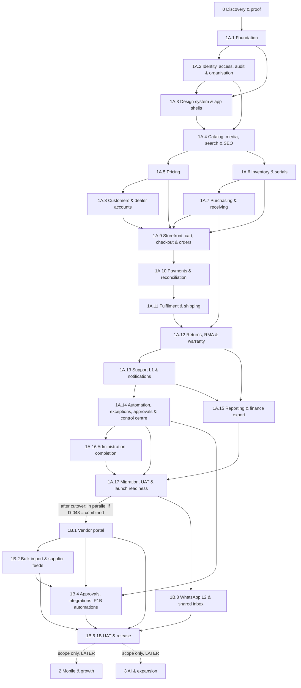

# 12 — Phases, stages and task skeleton

**Purpose.** The phase-by-phase and stage-by-stage implementation plan for Tradex and the **complete task skeleton**:
every implementation task with its ID, module, dependencies, blocking decisions and primary plan references.
`TASKS.md` is generated from §9 (block format §9.1); `tools/status.py` computes progress and the next eligible task
from `TASKS.md`; `14-continuation-protocol.md` uses §5 of this file to decide which stages may run in parallel.

**Sources used.** BP §1.2, §1.4, §2.3, §4, §5, §6.7, §12, §15.3, §20.5, §21, §22, §23, §24, §25, §26, §27, §30, §31 ·
PR1 §5, §12, §14, §16 · PR2 §11 · MEET · plan files `00`, `DEC`, `01`, `02`, `03`, `04a/04b/04c`, `05`, `06`, `07`,
`08`, `09`, `10`, `11`, `14`, `16`, `STATE.md`, `tools/status.py`.

**Labels and statuses.** Evidence labels and status values as in `00-conventions.md` §2–§3. Decisions are cited by
their surviving ID (`DECISIONS.md` aliases: D-120 → D-104, D-140 → D-129, D-143 → D-121, D-144 → D-131,
D-148 → D-137, D-180 → D-164, D-182 → D-162). New decisions proposed by this file: **D-210–D-215**
(§ Proposed new decisions). Every task starts `NOT_STARTED`, or `REQUIRES_DECISION` when a decision in its
Decisions column is not `DECIDED` (column "Initial status" in §9).

**Abbreviations in the reference column.** `00` 00-conventions.md · `01` 01-tech-stack.md · `02` 02-architecture.md ·
`03` 03-database.md · `04a/04b/04c` frontend plan files · `05` 05-backend.md · `06` 06-api.md ·
`07` 07-auth-roles-permissions.md · `08` 08-ecommerce.md · `09` 09-vendor-marketplace.md · `10` 10-erp.md ·
`11` 11-admin.md · `14` 14-continuation-protocol.md · `16` 16-testing.md · `DEC` DECISIONS.md · `MK` mockup.
`API-M04-15…19` = the ID range API-M04-15 to API-M04-19 · `DB-G#` = 03 §4 migration groups · `S-##` = 03 §6 seed
sets · `TS-*` = 16 suites · `T01…T36` = BP §23.1 · `WP##` = BP §22.2 · `A##` = BP §12.2 · `TX-#` = 05 §1.2 ·
`I-##` = 03 §5.1 · `UAT-*` = 16 §13.2 · `G1…G13` = 16 §14 go-live items.

---

## 1. Rules used to build the stages and the skeleton

### 1.1 Ordering and dependencies
1. Stage order is `0 → 1A.1 → … → 1A.17 → 1B.1 → … → 1B.5 → 2 → 3` (the order used by `status.py`). A task depends
   only on tasks of the **same or an earlier stage**; the dependency graph has **no cycles** (§11).
2. The protocol takes the lowest eligible stage first (`14` step 8). A later stage may run while an earlier stage
   still has eligible tasks **only** where §5 marks the stages parallelisable.
3. Every stage ends with a **gate task** that depends, directly or transitively, on every unconditional task of the
   stage and runs the stage-exit suites (`16` §4 cadence S): "Stage … verification" tasks; the Phase 0 exit gate
   T-0-M01-29; the go-live gate T-1A.17-M01-01 (followed by cutover and hypercare); the 1B exit gate T-1B.5-M17-01.
4. Migrations follow the `03` §4 groups: one schema task per DB group, in the stage of the group's first consumer.
   Conditional and mockup-only entities of a group are migrated by the task that builds the feature, only after its
   decision is `DECIDED`. Seed tasks load only decided values (TS-DB-05).
5. The task module is the module that owns most of the work (`05`: one module owns each entity/API); cross-module
   work is visible in the references.
6. Task granularity: one coherent unit a Claude session can implement and test (service + entities + APIs + tests,
   or a screen / tab group, or a migration group, or a verification gate). Numbering restarts at 01 per stage and
   module; numbers are identities, not an execution order — the Depends-on column is the order.

### 1.2 The Decisions column
- It lists the decisions that change **what the task builds** (behaviour, structure, provider, scope). The task is
  `REQUIRES_DECISION` until all of them are `DECIDED`.
- Decisions that only supply **values** (limits, durations, lists, templates, texts) sit on the seed/configuration
  task that loads them; engines read versioned configuration and never hard-code decision values (`03` §6; `11`
  §9.8, §15 "all decision-driven values stored as configuration").
- Platform decisions sit on the task they block first and reach later tasks through dependencies: D-001/D-002 on
  T-1A.1-M01-02, D-049/D-103 on T-1A.3-M09-01, D-003 on T-1A.3-M09-03, D-101 on T-1A.3-M01-01. D-004 is decided per
  screen, so **every P-E task** carries D-004 (`04b` §1.5).
- **Phase 0 decision tasks** ("Decide D-xxx", 48 tasks) exist for every BP §31.2 sign-off item 1–9, the BP §1.4
  pre-quotation decisions, the UI/architecture decisions D-003, D-004, D-101, and every decision used by a stage
  1A.1 task. Claude executes such a task by preparing the brief (question, documented options with sources, tasks
  blocked — `DEC` and `status.py --decisions`), asking the user, and recording the answer (`DEC` "How to record a
  decision"); the task is `COMPLETED` when the decision is `DECIDED`. All other decisions are asked when `status.py`
  reaches a task that needs them (`14` step 9); §6 lists them per stage.

### 1.3 Conditional and mockup-only work
- Tasks whose title says **CONDITIONAL**, **MOCKUP-ONLY**, **scope decision D-xxx** or **stage per D-192** are built
  only if the decision approves them. No unconditional task depends on them and stage gates exclude them (§11). When
  a feature is disabled the API answers `FEATURE_DISABLED` and the screen hides it (TS-ECOM-14).
- Tasks that a decision makes not applicable, or moves to another stage, are handled per **D-213** (proposed).

### 1.4 Adjustments to the requested stage structure

| # | Requested placement | Adjustment in this plan | Why (source) |
|---|---|---|---|
| 1 | M17 in 1A.14 | Job runtime, outbox and idempotency core in **1A.1** (T-1A.1-M17-01); approval core and exception core in **1A.2** (T-1A.2-M17-01/02); queues, rules, thresholds, delegation, digest stay in 1A.14 | `05` §2 note ("M17's job/outbox core is built before M20"); `10` §1.5 ("M17 --> M04"; "job runtime and outbox are built before any module that calls an external system"); DB-G0 contains these entities; catalog, pricing, inventory and purchasing need approvals and exception records |
| 2 | M23 not named in 1A stages | Adapter framework and email/SMS/OTP adapter in 1A.2; POS adapter 1A.6 (C); serviceability 1A.9; payment 1A.10; shipping 1A.11; accounting 1A.15; supplier feeds 1B.2; WhatsApp 1B.3; selected integrations 1B.4 | `05` §2 note ("adapters are built per provider when the provider decision is made"); `05` §5.2 (OTP via the M23 messaging adapter) |
| 3 | M20 in 1A.13 | Kept in 1A.13. Orders, payments, fulfilment and returns write outbox events from their own stages; A14 subscribes in 1A.13. OTP and invitation messages use the M23 adapter from 1A.2 | `05` §2 shows M10 depending on M20 — resolved through the outbox (`05` §1.3) |
| 4 | Quote (M05) in 1A.5 | Quote service in **1A.9** (T-1A.9-M05-01) | E-quote is a DB-G7 entity (`03` §4) |
| 5 | Reservations (M06) in 1A.6 | Reservation service and expiry job A06 in **1A.9** (T-1A.9-M06-01); ATP and projection stay in 1A.6 | E-reservation is in DB-G7 ("inventory entity; needs order lines", `03` §4) |
| 6 | Serviceability (M12) in 1A.11 | PIN serviceability and delivery options in **1A.9** (T-1A.9-M12-01) | Checkout checks serviceability before payment (`08` §4.16; TS-ECOM-05) |
| 7 | Invoices (M19) in 1A.15 | Invoice references and document rendering (A12) in **1A.11**; accounting export (A26) in 1A.15 | Documents are produced at pack/dispatch (`05` §4 A12; `10` §10) |
| 8 | DB-G10 not placed | DB-G10 migrated in **1A.9** | First consumers are E-merch_collection / E-product_question (storefront); support, reporting and change-register tables are then ready for 1A.13–1A.16 |
| 9 | Feature flags (M01) | Built with the configuration service in 1A.2 (T-1A.2-M24-01) | Flags are configuration versions (`11` §9.9; `03` §2.19.1) |
| 10 | P-E15 in 1A.16 | #users/#roles/#audit/#locations in 1A.3; #thresholds/#delegation in 1A.14; #integrations/#system/settings in 1A.16 | Each tab follows its backend; staff administration is needed from 1A.3 |
| 11 | Storefront pages in 1A.9 | P-S12 #signin, P-S14, P-S15 in 1A.3; P-S12 #register/#dealer, P-S09 account tabs, P-S11 base in 1A.8; P-S10 in 1A.12; P-S13 in 1A.13; P-S12 #vendor in 1B.1 | Pages follow the APIs they need |
| 12 | Search in 1A.4 | Built without prices/availability in 1A.4; public price added in 1A.5 (T-1A.5-M04-01), availability in 1A.6 (A04) | `05` §2: M21 depends on M05 and M06 |
| 13 | M25 in 1A.17 | Migration scripts written in the stage of the data owner (catalog 1A.4, stock 1A.6, open POs 1A.7, customers 1A.8); rehearsed and executed in 1A.17 | WP06 "migration mapping"; BP §21.3 step 1 (sample trial import early) |
| 14 | — | A verification gate task at the end of every stage | `16` §4 cadence S; BP §22.5 definition of done |

### 1.5 Source conflicts and decisions that can move tasks

| Decision / conflict | Plan default | If decided otherwise |
|---|---|---|
| D-048 first public launch scope (BP §5.1 scope clarification) | 1A launches alone (1A.17 go-live, cutover, hypercare); 1B follows | Combined 1A+1B launch: T-1A.17-M01-01, T-1A.17-M25-06, T-1A.17-M26-07 re-staged after 1B.5 (D-213); 1B.1–1B.4 run in parallel with 1A.17 (§5); 1B UAT joins the launch UAT |
| D-220 phase allocation (PR1 §12 vs BP §5.1 / PR2 §11; `00` §12 #2) | BP §5.1 / PR2 §11 | PR1 allocation (vendor Phase 2; purchasing/warehouses/transfers/RMA Phase 3; WhatsApp/automation Phase 4): stages 1A.6–1A.7 (transfers), 1A.12, 1A.13–1A.14, 1B.1–1B.4 re-planned; this file is revised before 1A starts |
| D-192 approval routing 1A vs 1B (`10` §14.1) | Option (a): generic approval queue in 1A.14 (T-1A.14-M17-06, "stage per D-192") | Option (b): 1A approvals decided inside module screens via API-M17-03 (1A.2); T-1A.14-M17-06 re-staged to 1B.4 |
| D-078 automations selected for launch (BP §12.1–12.4; `05` §4) | P1 → 1A (S-17 in T-1A.14-M17-02), P1B → 1B.4, P1/C conditional, P2/P3 LATER | Changes which rules are activated; A01/A02 (validated import) may move from 1B.2 to 1A.4 (`00` §12 #5) |
| D-211 start of 1A.1 (proposed) | 1A.1 waits for the Phase 0 exit gate (BP §5.1) | 1A.1 starts after the platform decisions and accepted proof (BP §22.1); dependency of T-1A.1-M01-01 changed |
| BP §5.2 "Vendor admin-created accounts and submissions" = C in 1A | 1B.1 | If approved for 1A: T-1B.1-M14-01…07 re-staged into 1A (D-213) |
| D-004 native ERP screen for a P-E screen | Custom screen task per `04b`/`04c` | Screen configured natively in `backend/` (00 §11); task recorded per D-213 |


## 2. Phase overview

| Phase | Stages | Goal (BP §5.1) | Exit gate (BP §5.1) | Evidence (`16` §12) |
|---|---|---|---|---|
| 0 Discovery & proof | 0 | Remove uncertainty before commitment | Owner and operations approve business model and scope | TS-PROOF-01…10, D-001, BP §31.2 sign-off (T-0-M01-29) |
| 1A Core web launch | 1A.1–1A.17 | Deliver the e-commerce and ERP web applications | Web end-to-end UAT and reconciled opening stock | All 1A T-tests, UAT sign-off, TS-MIG-03/06, go-live checklist (T-1A.17-M01-01) |
| 1R Configurable Root Admin (SaaS control plane) | 1R.1–1R.3 | Create, configure and deploy stores from one portal (`D-227`) | Two stores of different categories created from an empty platform, entirely from the portal, with no code change | Full `TS-SAAS-*` suite (T-1R.3-M34-03) |
| 1B Operational completion | 1B.1–1B.5 | Reduce repetitive work further | Measured process improvement and manageable exceptions | T11–T14, T24, T26; BP §4 measures vs baseline (T-1B.5-M17-01) |
| 2 Mobile & approved growth | 2 (scope only) | Mobile-friendly e-commerce and mobile app; optional marketplace | Mobile web/app UAT; marketplace financial controls if included | T29; TS-MKT-01…07 (`LATER`) |
| 3 AI & expansion | 3 (scope only) | Scoped AI assistance, possible multiple storefronts | Evidence of adoption, quality and sustainable cost | `LATER` |

BP §5.1: "Phase 1 means the e-commerce website and ERP web application … 1A and 1B are proposed web-delivery
sub-releases within Phase 1; 1B is not the mobile phase." PR1 §5/PR2 §11: "final phase boundaries should be confirmed
after Phase 0" (D-220).


## 3. Stage map

| Stage | Name | Task modules | Work packages | Tasks | of which decision tasks | Initially REQUIRES_DECISION |
|---|---|---|---|---:|---:|---:|
| 0 | Discovery & proof | M01, M02, M03, M04, M05, M06, M08, M09, M11, M13, M14, M17, M19, M25, M26 | WP01, WP02, WP03 (prototype sign-off), WP04; estimation BP §25; sign-off worksheet BP §31.2. | 77 | 48 | 47 |
| 1A.1 | Foundation | M01, M17, M26 | WP05. | 33 | 0 | 19 |
| 1A.2 | Identity, access, audit & organisation | M02, M03, M17, M23, M24 | WP05 (secrets, integration settings); WP06 (organisation master data). | 20 | 0 | 12 |
| 1A.3 | Design system & app shells | M01, M02, M03, M09, M24 | WP03 (design system), WP09 (storefront shell). | 18 | 0 | 14 |
| 1A.4 | Catalog, media, search & SEO base | M04, M21, M22, M25, M27 | WP06; WP09 (search). | 18 | 0 | 13 |
| 1A.5 | Pricing | M04, M05 | WP07. | 10 | 0 | 6 |
| 1A.6 | Inventory & serials | M03, M04, M06, M23, M25 | WP08. | 16 | 0 | 11 |
| 1A.7 | Purchasing & receiving | M05, M07, M25 | WP08. | 12 | 0 | 8 |
| 1A.8 | Customers & dealer accounts | M02, M08, M09, M25 | WP07 (dealer context), WP09 (account). | 17 | 0 | 11 |
| 1A.9 | Storefront pages, cart, checkout & orders | M04, M05, M06, M08, M09, M10, M12, M27 | WP09, WP07 (quote snapshots). | 32 | 0 | 24 |
| 1A.10 | Payments & reconciliation | M09, M11, M23 | WP10. | 12 | 0 | 7 |
| 1A.11 | Fulfilment & shipping | M09, M12, M19, M23 | WP11. | 15 | 0 | 9 |
| 1A.12 | Returns, RMA & warranty | M04, M08, M09, M10, M13 | WP11. | 13 | 0 | 8 |
| 1A.13 | Support L1 & notifications | M09, M10, M16, M20 | WP14 (Level 1), WP12 (A14). | 12 | 0 | 9 |
| 1A.14 | Automation, exceptions, approvals & owner control centre | M17, M18 | WP12. | 13 | 0 | 10 |
| 1A.15 | Reporting & finance export | M09, M10, M11, M18, M19 | WP15. | 13 | 0 | 10 |
| 1A.16 | Administration completion | M24, M26 | WP05 (operations part), WP17 (monitoring preparation). | 12 | 0 | 9 |
| 1A.17 | Migration, UAT & launch readiness | M01, M02, M09, M25, M26, M27 | WP16, WP17. | 21 | 0 | 17 |
| 1R.1 | Root admin foundation & store registry | M34 | WP18. | 10 | 0 | 4 |
| 1R.2 | Store configurator, packs, templates & terminology | M32, M33, M34 | WP18. | 14 | 0 | 4 |
| 1R.3 | Provisioning, deployment, platform operations & 1R release | M34, M35 | WP18. | 14 | 0 | 9 |
| 1B.1 | Vendor portal & vendor management | M14 | WP13. | 18 | 0 | 13 |
| 1B.2 | Validated bulk import & supplier feeds | M04, M05, M06, M14, M22, M23 | WP06 (import), WP13 (feeds). | 11 | 0 | 7 |
| 1B.3 | Guided WhatsApp ordering (L2) & shared inbox | M16, M20, M23 | WP14. | 8 | 0 | 6 |
| 1B.4 | Approval extensions, selected integrations & P1B automations | M05, M14, M17, M23 | WP12 (P1B rules), WP13 (pilot). | 7 | 0 | 5 |
| 1B.5 | 1B UAT & release | M14, M17, M25, M26 | WP16 (1B UAT), WP17 (1B release). | 4 | 0 | 2 |
| 2 | Mobile experience & separately approved growth — scope and approve only | M01, M15, M28 | — | 4 | 0 | 4 |
| 3 | AI & further expansion — scope and approve only | M03, M17, M29 | — | 3 | 0 | 2 |
| **Total** | | | | **457** | **48** | **300** |

> Counts recomputed 2026-09-28 after the SaaS architecture change (`D-227`, 71 tasks) and the
> production-readiness and control-model second pass (`D-257`–`D-272`, 28 tasks); `tools/status.py`
> is authoritative. The 48 decision tasks are unchanged: `D-227`–`D-253` were recorded as `DECIDED` with the
> change itself, so they need no "Decide D-xxx" task.

## 4. Stage dependency diagram

> Updated 2026-09-27: the task-level computed diagram is in `17-dependencies.md` §4.1 (it also shows the task edges 1A.5 → 1A.7 and 1A.15 → 1B.1). The 1A.17 → 1B edges below are the procedural P8 rule (enforced by `tools/status.py`), not task dependencies. Skeleton fixes from `17` §14 (#1, #2, #3, #6) are applied to the table in §9 and to `TASKS.md`.

Arrow `X --> Y`: stage Y contains tasks that depend on tasks of stage X. Dotted: allowed only as noted.




## 5. Parallelisation rules (for `14-continuation-protocol.md` step 8d)

A task of a later stage in a listed group may be started while an earlier stage of the same group still has
eligible `NOT_STARTED` tasks, **provided all of the task's own dependencies are `COMPLETED`** and no Decisions-column
entry is open. Stages not listed together run in order.

| Group | Stages that may run in parallel | Condition / note |
|---|---|---|
| P0 | all workstreams inside stage 0 | Discovery, audit, UI and proof run in parallel (BP §25.2) |
| P1 | 1A.2 ∥ 1A.3 | Design system, storefront scaffolding and workspace scaffolding need only 1A.1 |
| P2 | 1A.5 ∥ 1A.6 ∥ 1A.7 ∥ 1A.8 | Each after its own dependencies (1A.6 after DB-G2; 1A.7 after DB-G4 and serial/inspection tasks; 1A.8 after DB-G3 and the pricing engine) |
| P3 | 1A.9 ∥ 1A.10 | Payment adapter T-1A.10-M23-01 and other 1A.10 tasks whose dependencies are complete |
| P4 | 1A.10 ∥ 1A.11 | DB-G8 and the shipping adapter |
| P5 | 1A.12 ∥ 1A.13 | M16 support track and the notification core |
| P6 | 1A.13 ∥ 1A.14 ∥ 1A.15 ∥ 1A.16 | Each task after its own dependencies |
| P7 | 1A.14–1A.16 ∥ 1A.17 migration track | T-1A.17-M25-01, T-1A.17-M02-01, T-1A.17-M27-01 when their dependencies are complete |
| P8 | 1A.17 hypercare ∥ 1B.1–1B.5 | 1B work may start once cutover T-1A.17-M25-06 is `COMPLETED` while hypercare T-1A.17-M26-07 runs |
| P9 | 1A.17 ∥ 1B.1–1B.4 | **Only if D-048 = combined launch** |
| P12 | 1A.1 multi-store foundation ∥ 1A.1 foundation | The M30/M31/M32/M35 tasks of stage 1A.1 run alongside the M01 foundation tasks once their own dependencies are complete — they are one stage, not two |
| P13 | 1A.17 ∥ 1R.1 | Root admin scaffolding, identity and audit (T-1R.1-M34-01…04) may overlap 1A.17 **if the owner approves it**; otherwise 1R starts after 1A. Not enabled in `tools/status.py` by default — enable by adding `{"1A.17", "1R.1"}` to `PARALLEL_GROUPS` |
| P10 | 1B.1 ∥ 1B.2 ∥ 1B.3 | 1B.2 feed tasks after vendor accounts (T-1B.1-M14-04) |
| P11 | 1B.3 ∥ 1B.4 | — |

Never start `LATER` work (stages 2 and 3, M15, M28, M29) unless the owner asks (`14` step 8e).


## 6. Stage specifications

Each stage: objective, prerequisites, scope summaries, completion criteria, verification and parallelisation. "Decisions referenced" is generated from the skeleton (§9) — every decision in any task of the stage; conditional ones are marked (C).

### 6.1 Stage 0 — Discovery & proof

| Field | Content |
|---|---|
| Objective | Remove uncertainty before commitment: agreed business model and finite scope, platform decision backed by the ten proof scenarios, signed-off UI direction, costed backlog (BP §5.1 Phase 0; PR1 §5; PR2 §11). |
| Prerequisites | No stage prerequisite. Client representatives available (WP01), read-only legacy access (WP02), mockup v0.1 at the repo root (STATE §1). D-210 decided first (where Phase 0 records live). |
| Modules | M01 Platform foundation; M02 Identity, access & audit; M03 Organisation & locations; M04 Catalog; M05 Pricing; M06 Inventory; M08 Customers & business accounts; M09 Storefront web application; M11 Payments, refunds & reconciliation; M13 Returns, RMA & warranty; M14 Vendor portal & vendor management; M17 Automation, exceptions, approvals & delegation; M19 Finance boundary & accounting export; M25 Data migration & cutover; M26 Security, observability, backup & operations |
| Work packages | WP01, WP02, WP03 (prototype sign-off), WP04; estimation BP §25; sign-off worksheet BP §31.2. |
| Frontend | No production frontend code. Prototype walkthrough, user tests with consumer/dealer/staff participants, revision of the mockup only on the user's instruction (BP §6.7 steps 1–7; 00 §11). |
| Backend | No production backend code. Proof scenarios run on disposable candidate environments (BP §15.3; 16 TS-PROOF-01…10; location per D-210). |
| Database | Data inventory and export sample (BP §21.1–21.2); no schema. |
| API | None. API conventions (D-080, D-079) are decided here because 1A.1 needs them. |
| Integrations | Audit of existing integrations and their failure rates (BP §21.1, §26.2 Q18). Provider decisions (D-012–D-015) are recorded when the owners are ready; they are not Phase 0 gate items. |
| Testing | TS-PROOF-01…10 per candidate core (critical failure such as inability to prevent overselling overrides a high score, BP §15.3); prototype task tests (BP §6.7 steps 5–6). |
| Documentation | Phase 0 deliverable pack (PR1 §5 deliverables; PR2 §11): requirements, current-state assessment, future-state workflows, module/release specification (this plan), role & permission matrix (07 + D-222), UI direction (D-049), architecture and integration plan (01/02 after D-001), migration plan (D-038, D-009), roadmap (this file), estimate, risk and decision register (BP §27.1; DECISIONS.md). Every answer recorded per DECISIONS.md 'How to record a decision' and STATE §6. |
| Dependencies (stages) | None. |
| Deliverables | Questionnaire answers; process maps and future-state workflows; data inventory; system audit and module assessment; redacted sample documents; manual-work observation and BP §4 baseline; proof results, scorecard, TCO and architecture recommendation; UI sign-off; 48 decision records; estimate; signed sign-off worksheet. |
| Completion criteria | BP §5.1 exit gate 'Owner and operations approve business model and scope'. WP01 'Approved requirements and open decisions'; WP02 'Retain/replace recommendation with evidence'; WP03 'Web client approval and task-test notes'; WP04 'Critical scenarios pass'. BP §31.2 items 1–9 each have an accepted version, approver and date. 16 §12 Phase 0 evidence (TS-PROOF results, D-001 decision). |
| Verification steps | T-0-M01-29 checks every sign-off item and every dependency; `python3 plan/tools/status.py --stage 0` shows all stage-0 tasks COMPLETED; STATE §6 lists each decision. |
| Parallelisation | Four workstreams run in parallel inside the stage: discovery (T-0-M01-03/04, T-0-M17-01/02, T-0-M25-01), audit (T-0-M25-02…04), UI (T-0-M09-01…04), proof (T-0-M01-05 → proof tasks). Decision tasks are asked as soon as their evidence tasks are complete, in any order (BP §25.2 'UI work and technical audit can overlap'). |
| Conflicts and notes | Conflicts decided here: D-048 (1A only vs 1A+1B combined launch — combined launch combines the gates and budget, BP §5.1), D-220 (PR1 §12 vs BP §5.1/PR2 §11 phase allocation), D-192 (approval routing timing), D-078 (automation priorities; observe first, BP §12.1). D-211 decides whether 1A.1 may start before the full exit gate. |
| Decisions referenced | D-001, D-002, D-003, D-004, D-005, D-006, D-007, D-008, D-009, D-010, D-011, D-016, D-017, D-018, D-022, D-023, D-024, D-025, D-034, D-035, D-037, D-038, D-048, D-049, D-052, D-053, D-059, D-077, D-078, D-079, D-080, D-101, D-102, D-104, D-107, D-108, D-109, D-115, D-122, D-123, D-124, D-136, D-192, D-210, D-211, D-220, D-221, D-222 |
| Gate task / task count | T-0-M01-29 · 69 tasks (§9.2) |

### 6.2 Stage 1A.1 — Foundation

| Field | Content |
|---|---|
| Objective | A reproducible platform on the chosen operational core: repository layout, backend skeleton, shared kernel, environments, CI, secrets, observability, backup and the durable job/outbox runtime every module uses (BP §15.4, §16.6, §20.5; WP05). |
| Prerequisites | Stage 0 exit gate T-0-M01-29 (or the relaxed start decided in D-211). |
| Modules | M01 Platform foundation; M17 Automation, exceptions, approvals & delegation; M26 Security, observability, backup & operations |
| Work packages | WP05. |
| Frontend | Folder scaffolding only (`frontend/design-system`, `storefront`, `workspace`, `vendor-portal`); build jobs in CI. |
| Backend | Core application skeleton (D-001/D-002), module packages `backend/<module>/` (05 §1.1), shared kernel (money, identifiers, time, deletion hooks), API layer baseline (06 §1), job runtime, outbox worker and scanner, idempotency records (05 §1.3–1.4). |
| Database | Migration runner; DB-G0 (03 §4); seed/fixture framework that rejects placeholder values (TS-DB-05). |
| API | Conventions only (06 §1.1–1.12); no business endpoints. |
| Integrations | None (adapter framework in 1A.2). |
| Testing | CI harness and runners TS-REG-01/02/04; TS-DB-01/02/04/08, TS-UNIT-02/06, TS-SVC-02, TS-API-02/05/08, TS-BKP-01, TS-SEC-05/06/07. |
| Documentation | `infra/` runbooks: deploy, rollback, migration-plan and release-notes templates (BP §20.5, §24.2); version pinning register `01-tech-stack.md` §31 filled for the chosen stack. |
| Dependencies (stages) | Stage 0. |
| Deliverables | Repository tree per 00 §11; development, staging and production environments reproducible from `infra/`; CI green; DB-G0 applied; outbox worker running; backups with a first restore proof. |
| Completion criteria | 05 §5.1 M01: staging and production reproducible from `infra/`, CI green on main, deploy and restore proof documented (WP05 'Deploy/restore proof'). TS-SVC-02 worker-crash test passes (basis of T21). No secret in the repository or published site (TS-SEC-05). |
| Verification steps | T-1A.1-M01-10: clean deploy to staging from `infra/`; kill the worker after an external send and before save → reconciled without duplicate effect; restore the latest backup to staging and compare. |
| Parallelisation | After T-1A.1-M01-02, tasks -03, -05, -06, -07 run in parallel; M26 tasks after environments. Stage 1A.3 tasks T-1A.3-M09-01…03 and T-1A.3-M01-01 may start as soon as their own dependencies are COMPLETED (see §5). |
| Conflicts and notes | Adjustment: the M17 job runtime/outbox core is built here, not in 1A.14 (05 §2 note; 10 §1.5 'M17's job runtime and outbox are built before any module that calls an external system'; DB-G0 contains these entities). D-115 must be decided before the first implementation commit because the repository root is published (STATE §13 #2). |
| Decisions referenced | D-001, D-002, D-005, D-052, D-053, D-059, D-077, D-079, D-080, D-102, D-104, D-107, D-108, D-109, D-115, D-122, D-123, D-124, D-136, D-211 |
| Gate task / task count | T-1A.1-M01-10 · 13 tasks (§9.3) |

### 6.3 Stage 1A.2 — Identity, access, audit & organisation

| Field | Content |
|---|---|
| Objective | Every principal authenticates and every operation is authorised, scoped and audited; company, locations and bins exist; approvals, exceptions, configuration and integrations have one governed core (BP §3.1, §3.3, §18, §19.1). |
| Prerequisites | 1A.1. |
| Modules | M02 Identity, access & audit; M03 Organisation & locations; M17 Automation, exceptions, approvals & delegation; M23 Integrations & adapters; M24 Administration & settings |
| Work packages | WP05 (secrets, integration settings); WP06 (organisation master data). |
| Frontend | None (screens are built on the shells in 1A.3). |
| Backend | AccessPolicy, AuditService, AuthService/OtpService/MfaService/SessionService, InvitationService, UserAdminService, RoleService, AccessReviewService (05 §5.2); LocationService (05 §5.3); ApprovalService core and ExceptionService core (05 §5.17); adapter framework and messaging adapter (05 §5.23); ConfigurationService and IntegrationSettingsService (05 §5.24). |
| Database | DB-G1; seeds S-01, S-02, S-03, S-04. |
| API | API-M02-01…30, API-M02-32, API-M02-34…42; API-M03-01…06, API-M03-08, API-M03-09; API-M17-02, API-M17-03; API-M24-01…06, API-M24-10. |
| Integrations | Email/SMS/OTP provider (D-015) through the adapter framework; integration contract checklist (BP §16.4) applied to every later adapter. |
| Testing | TS-AUTH-01…10, TS-PERM-01/04/08/09, TS-UNIT-03/10, TS-SVC-03/04/06, TS-ADM-01/02/05/06/07/09/12, TS-INT-04/10, TS-SEC-09/11. |
| Documentation | Permission catalogue and role matrix (07 §5) reconciled with seed S-03; integration contract checklist template. |
| Dependencies (stages) | 1A.1 (DB-G0, API baseline, job runtime, secrets). |
| Deliverables | Staff sign-in with MFA for privileged roles; enforced role × scope matrix; audit log; locations seeded; approval and exception services; configuration and integration settings with secret rotation. |
| Completion criteria | 05 §5.2 M02: every endpoint passes AccessPolicy (automated route-inventory check, TS-PERM-01); privileged accounts cannot operate without MFA (TS-AUTH-02); audit events for all privileged actions (TS-SVC-03). 05 §5.3 M03: confirmed entities, branches, warehouses and bins seeded (D-010). Secrets never returned by any API (TS-SVC-04). |
| Verification steps | T-1A.2-M02-09 runs the suites above and seeds S-04 through invitations. |
| Parallelisation | Parallel with 1A.3 design-system and scaffolding tasks. Inside the stage the M03, M23 and M24 tracks run in parallel with M02 once T-1A.2-M02-02 is COMPLETED. |
| Conflicts and notes | Adjustments: approval and exception cores (M17) are built here because catalog, pricing, inventory and purchasing need approvals and exception records (10 §1.5 'M17 --> M04'); the generic approval queue and exception queue UIs stay in 1A.14 (D-192). Feature flags (BR-M01-05) are stored as configuration (11 §9.9) and built with the configuration service. The OTP/invitation messages use the M23 messaging adapter directly (05 §5.2); the M20 notification service follows in 1A.13. |
| Decisions referenced | D-010, D-015, D-037, D-040, D-059, D-077, D-083, D-084, D-102, D-114, D-196, D-200, D-202, D-222 |
| Gate task / task count | T-1A.2-M02-09 · 17 tasks (§9.4) |

### 6.4 Stage 1A.3 — Design system & app shells

| Field | Content |
|---|---|
| Objective | Approved design system and the storefront and workspace shells so every page task builds on shared, accessible components (BP §6.7; D-049; D-003, D-004, D-101). |
| Prerequisites | 1A.1 (scaffold, CI); 1A.2 for shells and sign-in pages. |
| Modules | M01 Platform foundation; M02 Identity, access & audit; M03 Organisation & locations; M09 Storefront web application; M24 Administration & settings |
| Work packages | WP03 (design system), WP09 (storefront shell). |
| Frontend | Design tokens and component inventory incl. charts (04a §3; 04b §2); storefront scaffolding, store shell, P-S12 #signin, P-S14, P-S15; workspace scaffolding, workspace shell, P-E16, P-E15 #users/#roles/#audit/#locations. |
| Backend | None new (consumes 1A.2 APIs). |
| Database | None. |
| API | Consumes API-M02-*, API-M03-* (incl. API-M03-10/11 workspace context). |
| Integrations | None. |
| Testing | TS-FE-01/03/06, TS-A11Y-02 (components), TS-AUTH-01/02 through the UI, TS-ADM-01/02/05/06/15; keyboard sign-in (T30 part). |
| Documentation | Component inventory and content rules in `frontend/design-system/` (04a §3.3–3.4); D-004 screen register (custom vs native per P-E). |
| Dependencies (stages) | 1A.1; 1A.2 (auth, users, roles, locations). |
| Deliverables | Design-system package used by all apps; storefront and workspace apps deployable to staging; staff sign-in; first administration screens. |
| Completion criteria | Tokens, components, content rules and key states approved (BP §6.7 step 7); loading, empty, error, keyboard and focus states per component (BP §22.5); shells render permission-filtered navigation (07 §12.2); sign-in flows operable by keyboard. |
| Verification steps | T-1A.3-M09-06. |
| Parallelisation | T-1A.3-M09-01…03 and T-1A.3-M01-01 run in parallel with 1A.2; shell and page tasks follow the 1A.2 auth tasks. |
| Conflicts and notes | Vendor-portal scaffolding and shell are in 1B.1 (M14 is 1B). If D-004 marks a P-E screen native, its P-E tasks become configuration in `backend/` and no code goes to `frontend/workspace/` (00 §11); the task is recorded per D-213. |
| Decisions referenced | D-003, D-004, D-040, D-049, D-050, D-051, D-101, D-103, D-163, D-170 |
| Gate task / task count | T-1A.3-M09-06 · 12 tasks (§9.5) |

### 6.5 Stage 1A.4 — Catalog, media, search & SEO base

| Field | Content |
|---|---|
| Objective | Configurable catalog with versioned drafts and publication control, media handling, search and the SEO service, proven with a representative product import (BP §7, §6.4, §6.8; WP06; T36). |
| Prerequisites | 1A.2 (AccessPolicy, approvals), 1A.3 (workspace shell for P-E06). |
| Modules | M04 Catalog; M21 Search; M22 Files & media; M25 Data migration & cutover; M27 SEO & discoverability |
| Work packages | WP06; WP09 (search). |
| Frontend | P-E06 #products, #editor, #templates, #review and modals (04b §9). Storefront pages consume these APIs in 1A.9. |
| Backend | CatalogAdminService, ProductDraftService, lifecycle/publication checker, CatalogQueryService (05 §5.4); FileService, media variants (05 §5.22); SearchService, SuggestionService, WorkspaceSearchService, SynonymService (05 §5.21); SeoService (05 §5.27). |
| Database | DB-G2; seeds S-07…S-10, S-22. |
| API | API-M04-01, -02, -04, -05, -15…29, -39…41; API-M21-01…04; API-M22-01…04; API-M27-01, -02. |
| Integrations | Object storage and CDN (D-033); malware scanning (D-112). |
| Testing | TS-ERP-15, TS-UNIT-07, TS-SVC-08/09, TS-ECOM-01 (API level), TS-SEC-03/04, TS-MIG-01 (catalog part), TS-PROOF-02. |
| Documentation | Category/attribute-template procedure for catalog staff (T36 procedure); catalog migration mapping. |
| Dependencies (stages) | 1A.2, 1A.3. |
| Deliverables | Catalog configuration without code changes; drafts that never overwrite live; publication checker and review queue; search index with facets and synonyms; sitemap/redirect service; trial import of representative products. |
| Completion criteria | 05 §5.4 M04: representative products import correctly (WP06) and T36 passes without code change (catalog/search part; end to end in 1A.9). 10 §3.10. 05 §5.22 M22: private files never reachable without authorisation. Search relevance fixtures pass on the sample catalog (full volume in 1A.17, D-010). |
| Verification steps | T-1A.4-M04-10. |
| Parallelisation | After DB-G2 the M22, M21 and M27 tracks run in parallel with M04. 1A.5 and 1A.6 may start once DB-G2 and their own dependencies are COMPLETED. |
| Conflicts and notes | Validated bulk import (A01/A02) stays in 1B.2 per BP §5.1; BP §12.2 marks A01/A02 P1 (00 §12 #5). If D-048/D-078 bring it into 1A, the 1B.2 import tasks are re-staged per D-213. Search is built without prices and availability here; public prices are added in 1A.5 (T-1A.5-M04-01) and availability in 1A.6 (A04). |
| Decisions referenced | D-004, D-009, D-022, D-023, D-032, D-033, D-037, D-057, D-071 (C), D-081, D-112, D-113, D-125, D-127, D-163 |
| Gate task / task count | T-1A.4-M04-10 · 15 tasks (§9.6) |

### 6.6 Stage 1A.5 — Pricing

| Field | Content |
|---|---|
| Objective | One pricing engine for guest, consumer and dealer contexts with tiers, promotions, margin floors and approved price changes (BP §8; WP07). |
| Prerequisites | 1A.4. |
| Modules | M04 Catalog; M05 Pricing |
| Work packages | WP07. |
| Frontend | P-E07 (all tabs; #promotions only with D-043). |
| Backend | PricingEngine, PriceListService, PriceChangeService, promotions, margin/authority controls (05 §5.5). |
| Database | DB-G3; seeds S-11 (price lists) and S-12. |
| API | API-M04-03; API-M05-10…21, API-M05-24. |
| Integrations | None. |
| Testing | TS-UNIT-01/02, TS-ERP-16, TS-PERM-05 (offers/search), TS-API-07, TS-PROOF-03. |
| Documentation | Configured pricing policy (precedence, stacking, tax basis) recorded as configuration versions. |
| Dependencies (stages) | 1A.4 (catalog, search projection), 1A.2 (approvals). |
| Deliverables | Engine used by the offers API and search projection; price-list administration with diff and approval; margin controls. |
| Completion criteria | 05 §5.5 M05: price matrix and privacy tests pass (WP07); the engine is the only price source. 10 §4.10. T03 engine part; T02/T22 private-price isolation at API level. |
| Verification steps | T-1A.5-M05-09. |
| Parallelisation | Parallel with 1A.6 (both depend only on 1A.4 and 1A.2). |
| Conflicts and notes | Adjustment: quote persistence (E-quote is a DB-G7 entity) is built in 1A.9 (T-1A.9-M05-01); buyer context from verified membership is completed in 1A.8; cost signals from supplier bills in 1A.7. |
| Decisions referenced | D-004, D-016, D-017, D-018, D-043 (C), D-044 (C), D-135, D-197 |
| Gate task / task count | T-1A.5-M05-09 · 10 tasks (§9.7) |

### 6.7 Stage 1A.6 — Inventory & serials

| Field | Content |
|---|---|
| Objective | Single stock authority: append-only ledger, positions, ATP, serial lifecycle, inspections, transfers, counts, adjustments and the availability projection (BP §9; WP08; R08). |
| Prerequisites | 1A.4 (DB-G2), 1A.2. |
| Modules | M03 Organisation & locations; M04 Catalog; M06 Inventory; M23 Integrations & adapters; M25 Data migration & cutover |
| Work packages | WP08. |
| Frontend | P-E08 #stock, #serials, #movements, #transfers, #counts (#reservations in 1A.9, #supplier in 1B.2). |
| Backend | StockLedger, AtpCalculator, AvailabilityProjector (A04), serial, inspection, transfer, count and adjustment services (05 §5.6). |
| Database | DB-G4; seeds S-13 (inventory parameters), S-14. |
| API | API-M06-02…23, API-M06-31, API-M06-32; API-M03-07; API-M23-01 (conditional); API-M04-06 (conditional). |
| Integrations | Branch POS / legacy stock events (CONDITIONAL, D-009, D-030). |
| Testing | TS-ERP-02/03/05/06, TS-UNIT-05 (ATP part), TS-DB-03/07, TS-PERF-03 baseline, TS-INT-07. |
| Documentation | Stock-event → movement mapping as implemented (03 §5.3); opening-stock import procedure. |
| Dependencies (stages) | 1A.4, 1A.2. |
| Deliverables | Ledger reconciling to positions; serial lifecycle with inspections; transfers with in-transit balances; counts and adjustment approvals; A04 projection. |
| Completion criteria | 05 §5.6 M06 (serial/count part; last-unit part completes with reservations in 1A.9 and T05 in 1A.13); reconciliation reports zero drift (TS-DB-07); T16 passes. |
| Verification steps | T-1A.6-M06-12. |
| Parallelisation | Parallel with 1A.5 and 1A.8; 1A.7 starts once DB-G4 and the serial/inspection tasks are COMPLETED. |
| Conflicts and notes | Adjustment: E-reservation is a DB-G7 entity ('inventory entity; needs order lines', 03 §4), so the reservation service and expiry job are built in 1A.9. |
| Decisions referenced | D-004, D-009 (C), D-023, D-026, D-027, D-030 (C), D-038, D-069, D-072 (C), D-110, D-111, D-126 (C), D-128, D-135, D-139, D-147 (C) |
| Gate task / task count | T-1A.6-M06-12 · 16 tasks (§9.8) |

### 6.8 Stage 1A.7 — Purchasing & receiving

| Field | Content |
|---|---|
| Objective | Purchase-to-receipt with QC, serial capture, discrepancies and supplier-bill matching (BP §9.3; A03, A17, A25). |
| Prerequisites | 1A.6. |
| Modules | M05 Pricing; M07 Purchasing & receiving; M25 Data migration & cutover |
| Work packages | WP08. |
| Frontend | P-E09 all tabs. |
| Backend | Supplier master, ReplenishmentService (A17), PurchaseOrderService, ReceiptService (A03), BillMatchingService (A25), cost signals (05 §5.7, §5.5). |
| Database | DB-G5. |
| API | API-M07-01…23; API-M06-30; API-M05-22, API-M05-23. |
| Integrations | PO transmission channel per D-176 (email/portal). |
| Testing | TS-ERP-04, TS-ERP-09, TS-PROOF-01, TS-E2E-10 (receipt part); T15. |
| Documentation | Receiving SOP input for training (1A.17). |
| Dependencies (stages) | 1A.6 (serials, inspections, bin labels), 1A.2 (approvals). |
| Deliverables | Supplier records; POs with value-based approval; GRN with scans; QC to sellable or quarantine; three-way match. |
| Completion criteria | 05 §5.7 M07: receipt → QC → sellable path works with serials; T15 passes; 10 §6.10. |
| Verification steps | T-1A.7-M07-10. |
| Parallelisation | Parallel with 1A.8. |
| Conflicts and notes | Suppliers are created and maintained in 1A without the vendor portal (API-M07-22/23; BP §5.2 'basic supplier records'). |
| Decisions referenced | D-004, D-038, D-056 (C), D-070, D-110, D-111, D-175, D-176, D-178 |
| Gate task / task count | T-1A.7-M07-10 · 12 tasks (§9.9) |

### 6.9 Stage 1A.8 — Customers & dealer accounts

| Field | Content |
|---|---|
| Objective | Customer accounts, consent, data requests, dealer applications and business accounts, so dealer prices are served only from verified membership (BP §3.1, §6.5, §8.3, §13.3, §19.2). |
| Prerequisites | 1A.5 (DB-G3, pricing engine), 1A.4 (files), 1A.3 (storefront shell). |
| Modules | M02 Identity, access & audit; M08 Customers & business accounts; M09 Storefront web application; M25 Data migration & cutover |
| Work packages | WP07 (dealer context), WP09 (account). |
| Frontend | P-S12 #register/#dealer; P-S09 guest view, #overview, #addresses, #profile, #privacy; P-S11 #overview, #team, #pricelist; P-E10. |
| Backend | Registration, profile, address, consent, data-request, dealer-application (A27), business-account and reveal services (05 §5.8, §5.2). |
| Database | DB-G6; seeds S-11 (segments), S-15 (customer and dealer terms). |
| API | API-M08-01…13, -20…30, -33…40, -44, -45, -50; API-M02-31; API-M05-04; API-M14-57, -58, -66. |
| Integrations | GSTIN verification source via M23 (D-067). |
| Testing | TS-ECOM-09/10, TS-ERP-17, TS-PERM-02/05/10, TS-DB-06, TS-INT-08. |
| Documentation | Consent purposes and terms versions as published. |
| Dependencies (stages) | 1A.5, 1A.4, 1A.3, 1A.2. |
| Deliverables | Registration and account self-service; consent with history; dealer applications with review; business accounts with members; reveal-with-reason. |
| Completion criteria | 05 §5.8 M08: only verified members of approved accounts receive dealer context; consent history kept (T25 basis); T02 membership part. |
| Verification steps | T-1A.8-M08-12. |
| Parallelisation | Parallel with 1A.6 and 1A.7. |
| Conflicts and notes | D-205 (several memberships and active buyer context) and D-066 (member roles) change the buyer-context resolver; both are on T-1A.8-M08-06. |
| Decisions referenced | D-004, D-006, D-019, D-036, D-037, D-038, D-060, D-066, D-067, D-130, D-145 (C), D-149 (C), D-153, D-188, D-205 |
| Gate task / task count | T-1A.8-M08-12 · 17 tasks (§9.10) |

### 6.10 Stage 1A.9 — Storefront pages, cart, checkout & orders

| Field | Content |
|---|---|
| Objective | A complete web purchase up to a pending order with an atomic reservation: storefront pages, quote, cart, checkout, order operations and staff order handling (BP §6, §8.1, §10.1–10.3; WP09; T04, T06, T10, T22, T36). |
| Prerequisites | 1A.4–1A.8. |
| Modules | M04 Catalog; M05 Pricing; M06 Inventory; M08 Customers & business accounts; M09 Storefront web application; M10 Cart, checkout & orders; M12 Fulfilment & shipping; M27 SEO & discoverability |
| Work packages | WP09, WP07 (quote snapshots). |
| Frontend | P-S01, P-S02, P-S03, P-S04, P-S06, P-S07 (without payment), P-S08 (order states), P-S09 #orders, P-S11 #reorder; conditional P-S05, wishlist, Q&A, rails; P-E02; P-E08 #reservations. |
| Backend | QuoteService, ReservationService (A05, A06), CartService, CheckoutService/OrderService, cancellations, serviceability, storefront content, cache isolation, SEO rendering (05 §5.5, §5.6, §5.9, §5.10, §5.27). |
| Database | DB-G7; DB-G10 (storefront content; also provides support, reporting and change-register tables for later stages). |
| API | API-M05-01, -02 (+ -03, -06…09 conditional); API-M06-24, -25; API-M10-01…09, -13…17, -25; API-M12-01; API-M09-01 (+ -02 conditional); API-M27-01, -02; API-M08-46…49 (conditional). |
| Integrations | Shipping adapter serviceability function (D-013). |
| Testing | T01, T02, T03, T04, T06 (order part), T10, T22, T33 (order snapshot), T36 end to end; TS-ERP-01, TS-ECOM-01…07, TS-FE-02/05/06/08, TS-API-03/07/09/10, TS-PERM-03/05, TS-PERF-01 (lab), TS-E2E-02/08/10. |
| Documentation | Storefront route map (D-163) and cache policy (D-105) recorded in `frontend/storefront/`. |
| Dependencies (stages) | 1A.4, 1A.5, 1A.6, 1A.7 (DB-G5), 1A.8. |
| Deliverables | Browse, compare condition, price by context, cart, checkout to a pending order with reservation; staff order queue, holds, cancellations. |
| Completion criteria | 05 §5.10 M10 (order part of T04–T10; payment scenarios in 1A.10); 05 §5.9 M09: home modules served without private data leakage; WP09 'Core customer tasks complete'; BP §30.2 Checkout/Dealer commerce stories for the order part. |
| Verification steps | T-1A.9-M10-09. |
| Parallelisation | Storefront page tasks run in parallel with backend tasks once their APIs exist. T-1A.10-M23-01 (payment adapter) may start during 1A.9. |
| Conflicts and notes | Adjustments: quote (E-quote) and reservation (E-reservation) are DB-G7 entities, so their services are built here; serviceability (API-M12-01) is needed before payment (08 §4.16). Order status notifications are added in 1A.13 by subscribing to order outbox events (M20). Conflict D-151/D-161: whether stock is reserved at checkout-link send or at customer confirmation (00 §12 #8) — on T-1A.9-M06-01 and T-1A.13-M10-01. |
| Decisions referenced | D-004, D-013, D-021 (C), D-022, D-031, D-042 (C), D-043 (C), D-065 (C), D-066 (C), D-082, D-105, D-121 (C), D-129, D-134 (C), D-142 (C), D-150, D-154, D-160 (C), D-161, D-162, D-164 (C), D-165, D-166 (C), D-168 (C) |
| Gate task / task count | T-1A.9-M10-09 · 30 tasks (§9.11) |

### 6.11 Stage 1A.10 — Payments & reconciliation

| Field | Content |
|---|---|
| Objective | Hosted payment collection with signed webhooks, provider reconciliation, refunds with maker-checker, offline payments, and safety against duplicate, out-of-order and late payment events (BP §10.2, §10.3, §10.6; WP10). |
| Prerequisites | 1A.9. |
| Modules | M09 Storefront web application; M11 Payments, refunds & reconciliation; M23 Integrations & adapters |
| Work packages | WP10. |
| Frontend | P-S07 payment step, P-S08 payment status/retry; P-E12 #payments, #events, #refunds (+ #recon, #cod conditional); P-E02 d-order payment panel. |
| Backend | PaymentAttemptService, PaymentWebhookHandler (A09), PaymentReconciler, RefundService, offline payments; settlement import (A10, CONDITIONAL), COD (CONDITIONAL) (05 §5.11). |
| Database | Uses DB-G7. |
| API | API-M11-01…19, API-M11-22. |
| Integrations | Payment provider sandbox and production (D-012); settlement files (D-064). |
| Testing | T06, T07 (payment effect), T08, T09, T18 (refund part), T19, T34 (refund part); TS-INT-01, TS-ERP-13, TS-ERR-01, TS-API-06, TS-PROOF-05, TS-E2E-06, TS-E2E-11. |
| Documentation | Provider integration contract checklist (BP §16.4) completed for the payment adapter. |
| Dependencies (stages) | 1A.9 (orders, reservations), 1A.2 (approvals, adapter framework). |
| Deliverables | End-to-end hosted payment; webhook processing; reconciliation of unknown attempts; refunds that check provider state before retry. |
| Completion criteria | 05 §5.11 M11: duplicate/late payment scenarios pass (WP10); refunds never exceed the refundable amount (I-05, TS-DB-03). |
| Verification steps | T-1A.10-M11-10. |
| Parallelisation | 1A.11 schema (DB-G8) and shipping adapter may start in parallel once their dependencies are COMPLETED. |
| Conflicts and notes | COD (D-020), settlement matching (D-064, P1/C) and EMI/offer cards (D-062, MOCKUP-ONLY) are separate conditional tasks. |
| Decisions referenced | D-004, D-012, D-020 (C), D-026, D-062 (C), D-064 (C), D-150, D-184 (C) |
| Gate task / task count | T-1A.10-M11-10 · 12 tasks (§9.12) |

### 6.12 Stage 1A.11 — Fulfilment & shipping

| Field | Content |
|---|---|
| Objective | Release, pick, pack and dispatch the correct serial with documents, courier booking and tracking (BP §10.4, §10.5; WP11; T07, T20). |
| Prerequisites | 1A.10 (payment release), 1A.6 (bin labels and scanning). |
| Modules | M09 Storefront web application; M12 Fulfilment & shipping; M19 Finance boundary & accounting export; M23 Integrations & adapters |
| Work packages | WP11. |
| Frontend | P-E03 all tabs; P-S08 tracking and invoice download; P-S09 #invoices; P-E02 fulfilment and invoice panels. |
| Backend | FulfilmentQueueService (A11), pick/scan/pack, document rendering and invoice references (A12), CourierBookingService (A13), dispatch, tracking (05 §5.12, §5.19). |
| Database | DB-G8. |
| API | API-M12-03…21 (except -02, in 1A.12); API-M19-01, -02, -09…12; API-M10-13 (release); API-M06-01 (conditional). |
| Integrations | Shipping provider booking, labels and tracking (D-013); printers and scales (CONDITIONAL, D-147). |
| Testing | T07 (one fulfilment release), T20, T21 (fulfilment path); TS-ERP-10/11, TS-INT-02, TS-UNIT-09, TS-ADM-14, TS-ERR-03. |
| Documentation | Dispatch SOP input for training; document templates versioned (A12). |
| Dependencies (stages) | 1A.10, 1A.9, 1A.6, 1A.2. |
| Deliverables | Warehouse queue and scan station; packing documents and invoices; courier booking with manual fallback; tracking and delivery exceptions. |
| Completion criteria | 05 §5.12 M12: full fulfilment sample passes (WP11); no dispatch without serial verification for serialised lines; BP §30.2 'dispatch the correct serial'. |
| Verification steps | T-1A.11-M12-12. |
| Parallelisation | 1A.12 eligibility work may start once dispatch (T-1A.11-M12-05) is COMPLETED. |
| Conflicts and notes | Adjustment: invoice references and document rendering (M19, A12) are built here because packing and invoicing happen at pack/dispatch; the accounting export (A26) follows in 1A.15. |
| Decisions referenced | D-004, D-008, D-013, D-029, D-055, D-061 (C), D-110, D-111, D-132 (C), D-147 (C), D-183 (C) |
| Gate task / task count | T-1A.11-M12-12 · 15 tasks (§9.13) |

### 6.13 Stage 1A.12 — Returns, RMA & warranty

| Field | Content |
|---|---|
| Objective | Returns and warranty with policy versions, quarantine until inspection, separate refund and disposition decisions, credit notes and supplier RMAs (BP §10.5, §7.5; R19; T17, T33, T34). |
| Prerequisites | 1A.11 (dispatch), 1A.10 (refunds), 1A.7 (suppliers). |
| Modules | M04 Catalog; M08 Customers & business accounts; M09 Storefront web application; M10 Cart, checkout & orders; M13 Returns, RMA & warranty |
| Work packages | WP11. |
| Frontend | P-S10, P-S09 #returns; P-E04 all tabs; conditional P-S03 reviews, P-S09 #devices, P-E10 #duplicates. |
| Backend | ReturnEligibilityService, ReturnService (A22), reverse pickup, ReturnReceivingService, warranty (A23), supplier RMA (05 §5.13). |
| Database | Uses DB-G8 (conditional entities by their tasks). |
| API | API-M13-01…18, API-M12-02, API-M10-23 (+ API-M10-24, API-M08-14/15, -41…43, API-M04-07…10 conditional). |
| Integrations | Reverse pickup through the shipping adapter. |
| Testing | T17, T18/T19 via RMA, T33, T34; TS-ERP-12, TS-ECOM-08, TS-UNIT-08, TS-E2E-01, TS-E2E-09, TS-PROOF-07. |
| Documentation | Returns SOP input for training. |
| Dependencies (stages) | 1A.11, 1A.10, 1A.7, 1A.4 (files). |
| Deliverables | Customer and staff RMA flows; quarantine and inspection; partial refunds and credit notes; warranty claims; supplier RMAs. |
| Completion criteria | 05 §5.13 M13: returned units never become sellable without a disposition decision; refunds and resale decided separately; T17, T33, T34 pass. |
| Verification steps | T-1A.12-M13-09. |
| Parallelisation | 1A.13 tasks that do not depend on RMA (M16 track, T-1A.13-M20-01) run in parallel. |
| Conflicts and notes | Advanced RMA and repair workshop are excluded (BP §5.2, §5.3). |
| Decisions referenced | D-004, D-022, D-041 (C), D-133 (C), D-150, D-165, D-167 (C), D-169 (C), D-178 (C) |
| Gate task / task count | T-1A.12-M13-09 · 13 tasks (§9.14) |

### 6.14 Stage 1A.13 — Support L1 & notifications

| Field | Content |
|---|---|
| Objective | Consent-aware customer and staff notifications (A14), Level 1 support (help centre, guided chat, handoff, web inbox, tickets), click-to-chat, and assisted orders with secure checkout links (BP §13.1–13.4; T23, T25; WP14 Level 1). |
| Prerequisites | 1A.12 (RMA transitions for A14), 1A.9–1A.11. |
| Modules | M09 Storefront web application; M10 Cart, checkout & orders; M16 Support & WhatsApp; M20 Notifications |
| Work packages | WP14 (Level 1), WP12 (A14). |
| Frontend | Store chat widget, P-S13; P-E05 (web channel); P-E02 m-assisted; shell notification bell. |
| Backend | NotificationService, TemplateRenderer, DeliveryStatusHandler, ReminderService (A28, CONDITIONAL) (05 §5.20); AnswerLibraryService, GuidedFlowService, ConversationService, ChatVerificationService (05 §5.16); assisted orders (05 §5.10). |
| Database | Uses DB-G7 (notifications, templates) and DB-G10 (support); seed S-16 (email/SMS). |
| API | API-M20-01…09; API-M16-01…09, -11…16, -19, -20; API-M10-18…22. |
| Integrations | Email/SMS adapter (from 1A.2). WhatsApp Level 1 is click-to-chat links; the WhatsApp Business Platform adapter is 1B.3. |
| Testing | T05 (counter/branch path), T23 (web chat), T25; TS-SVC-05, TS-ECOM-11/12/15, TS-INT-04, TS-PERM-06, TS-ERP-18 (web part), TS-E2E-04. |
| Documentation | Approved answers and templates as seeded (S-16). |
| Dependencies (stages) | 1A.12, 1A.10, 1A.9, 1A.8 (consent), 1A.2 (messaging adapter). |
| Deliverables | Order/payment/fulfilment/refund/RMA notifications with delivery status; help centre and guided chat with handoff; web inbox and tickets; assisted orders. |
| Completion criteria | 05 §5.20 M20: A14 notifications for the approved event list (D-058) with visible delivery status. 05 §5.16 Level 1 part: no disclosure without verification (T23 web). |
| Verification steps | T-1A.13-M16-05. |
| Parallelisation | M16 track parallel with 1A.12; 1A.14 tasks that do not need M20 (T-1A.14-M17-01…04) may start in parallel. |
| Conflicts and notes | Adjustment: the notification core is here (requested structure); orders, payments and fulfilment emit outbox events from their own stages and A14 subscribes here. Conflict D-048: WhatsApp guided ordering and the WhatsApp shared inbox are 1B (BP §5.1) unless the combined launch is chosen; D-220: PR1 §12 places WhatsApp/automation in its Phase 4. |
| Decisions referenced | D-004, D-014, D-015, D-021, D-037, D-050, D-058, D-074, D-078 (C), D-141 (C), D-146, D-151 |
| Gate task / task count | T-1A.13-M16-05 · 12 tasks (§9.15) |

### 6.15 Stage 1A.14 — Automation, exceptions, approvals & owner control centre

| Field | Content |
|---|---|
| Objective | Owner independence: governed automation rules, exception and approval queues, thresholds, delegation and emergency access, owner digest and control centre (BP §12, §18; WP12; T21, T31). |
| Prerequisites | 1A.13 (notifications for alerts and digest), 1A.2 (approval and exception cores), 1A.1 (job runtime). |
| Modules | M17 Automation, exceptions, approvals & delegation; M18 Reporting & exports |
| Work packages | WP12. |
| Frontend | P-E14 (all tabs; #approvals per D-192), P-E01, P-E15 #thresholds and #delegation, shell 'Delegation while away'. |
| Backend | AutomationRuleRegistry, AutomationPauseService, exception queue, approval queue, ThresholdService, DelegationService, EmergencyAccessService, DigestService (A19) (05 §5.17; 10 §14.3). |
| Database | Seeds S-05, S-06, S-17; activation of seeded E-automation_rule records (DB-G10 note). |
| API | API-M17-01, API-M17-04…26; API-M18-12. |
| Integrations | None directly (alerts and digest through M20). |
| Testing | T09 (exception visible), T21, T31; TS-UNIT-10, TS-SVC-02/06/07/11, TS-PERM-07/08/09/13/14, TS-ADM-03/04/10/11, TS-ERR-05/06, TS-E2E-07, TS-PROOF-08. |
| Documentation | BP §12.3 template completed for every activated rule; owner guide to the control centre (BP §24.2). |
| Dependencies (stages) | 1A.13, 1A.2, 1A.1. |
| Deliverables | Rule catalogue with kill switch and dry run; job runs and incidents; exception and approval queues; thresholds and delegation; digest; control centre. |
| Completion criteria | 10 §14.8: failure recovery and measured run logs (WP12); simulated owner-away day passes (BP §29.7, T31). 11 §15 'Owner independence' and 'Approvals and thresholds' rows. |
| Verification steps | T-1A.14-M17-12. |
| Parallelisation | Parallel with 1A.15 and 1A.16. |
| Conflicts and notes | Conflicts: D-192 — the generic approval queue (T-1A.14-M17-06) is 1A only under option (a); under option (b) it is re-staged to 1B.4 per D-213 and 1A approvals are decided inside module screens through API-M17-03 (built in 1A.2). D-078 decides which A-rules are activated (S-17). D-221: no general-purpose workflow designer (BP §5.3). |
| Decisions referenced | D-004, D-024, D-025, D-063, D-078, D-138, D-179 (C), D-190, D-192 (C), D-194, D-198, D-221 |
| Gate task / task count | T-1A.14-M17-12 · 13 tasks (§9.16) |

### 6.16 Stage 1A.15 — Reporting & finance export

| Field | Content |
|---|---|
| Objective | Launch reports, exports, schedules and saved views, and the finance boundary: accounting export with control totals and a daily close (BP §14; WP15; T27). |
| Prerequisites | 1A.11 (invoices), 1A.12 (credit notes), 1A.13 (email for schedules). |
| Modules | M09 Storefront web application; M10 Cart, checkout & orders; M11 Payments, refunds & reconciliation; M18 Reporting & exports; M19 Finance boundary & accounting export |
| Work packages | WP15. |
| Frontend | P-E13; P-E12 #export, #close; P-S11 #invoices; saved views on P-E list screens; KPI strips (scope decision D-173). |
| Backend | ReportService, DashboardService, ExportService, ReportScheduleService, SavedViewService (05 §5.18); accounting export (A26) and invoice extras (05 §5.19); daily close. |
| Database | Uses DB-G10 (exports, schedules, saved views) and DB-G8 (accounting export); seed S-19. |
| API | API-M18-01…10, -13, -14, -16…19; API-M19-03…08; API-M11-20, -21; API-M05-05; API-M10-26. |
| Integrations | Accounting adapter, file or API (D-011). |
| Testing | T18 (accounting effect), T27, T35 (export during checkout); TS-ERP-14/19, TS-INT-05, TS-SVC-10, TS-SEC-10, TS-UNIT-11, TS-PERF-05, TS-PROOF-10. |
| Documentation | Report definitions (event dates, gross/net, tax basis) published with each report (BP §14.4). |
| Dependencies (stages) | 1A.11, 1A.12, 1A.13, 1A.10. |
| Deliverables | Launch report set; secure exports; schedules; accounting export with control totals; daily close; analytics for BP §4 measures. |
| Completion criteria | 05 §5.18 M18: launch report set (D-075) reconciles with sample transactions (WP15). 05 §5.19 M19: finance confirms the export and reconciliation process (BP §23.4). |
| Verification steps | T-1A.15-M18-08. |
| Parallelisation | Parallel with 1A.14 and 1A.16. |
| Conflicts and notes | Production-verification and test transactions are flagged and excluded from reports and exports (API-M10-26, D-209) before cutover. |
| Decisions referenced | D-004, D-011, D-075, D-106, D-135, D-152, D-173 (C), D-197, D-209 |
| Gate task / task count | T-1A.15-M18-08 · 13 tasks (§9.17) |

### 6.17 Stage 1A.16 — Administration completion

| Field | Content |
|---|---|
| Objective | Remaining administration and operations controls: integrations and system screens, operational settings and feature flags, change register, alert catalogue, retention, shell completion (BP §18, §20, §30.1; 11). |
| Prerequisites | 1A.14 (queues for badge counts), 1A.2, 1A.1. |
| Modules | M24 Administration & settings; M26 Security, observability, backup & operations |
| Work packages | WP05 (operations part), WP17 (monitoring preparation). |
| Frontend | P-E15 #integrations, #system, settings and flags; shell queue counts, help, 'My profile', system-health card. |
| Backend | SystemStatusService, change register, alert configuration, retention hooks (05 §5.24, §5.26). |
| Database | Uses DB-G0/DB-G10 (configuration, change requests, restore rehearsals). |
| API | API-M24-01…14 (screens), API-M18-11, API-M18-15, API-M02-33. |
| Integrations | Integration health checks for all enabled adapters. |
| Testing | TS-ADM-01…15 complete, TS-SVC-04, TS-PERM-10/11/12, TS-SEC-05, TS-DB-06. |
| Documentation | Configuration inventory (input to the handover package, BP §24.2); alert owner list (BP §20.3). |
| Dependencies (stages) | 1A.14, 1A.2, 1A.1. |
| Deliverables | Complete P-E15; change register; alert catalogue with owners; retention hooks; finished shells. |
| Completion criteria | 11 §15 rows for configuration, integrations, audit and system controls; AccessPolicy coverage on every admin endpoint; all decision-driven values stored as configuration. |
| Verification steps | T-1A.16-M24-05. |
| Parallelisation | Parallel with 1A.14 and 1A.15; the 1A.17 migration track may start once its dependencies are COMPLETED. |
| Conflicts and notes | Mockup-only controls (D-177) and explanatory panels (D-171) are decided per item; built, deferred or dropped per D-213. |
| Decisions referenced | D-004, D-036, D-171 (C), D-172, D-174, D-177 (C), D-191, D-195 |
| Gate task / task count | T-1A.16-M24-05 · 9 tasks (§9.18) |

### 6.18 Stage 1A.17 — Migration, UAT & launch readiness

| Field | Content |
|---|---|
| Objective | Launch readiness and cutover: migration rehearsals with control totals, restore rehearsal, security, performance and accessibility acceptance, UAT, training, handover, go-live and hypercare (BP §21, §23.3–23.4, §24; WP16–WP17). |
| Prerequisites | All 1A stage verifications (1A.1–1A.16). |
| Modules | M01 Platform foundation; M02 Identity, access & audit; M09 Storefront web application; M25 Data migration & cutover; M26 Security, observability, backup & operations; M27 SEO & discoverability |
| Work packages | WP16, WP17. |
| Frontend | Fixes from accessibility and browser acceptance only. |
| Backend | Migration toolkit and scripts; password migration or reset (05 §5.25). |
| Database | Opening data S-20; redirect map S-23; migration and restore rehearsal records. |
| API | None new (API-M24-09/-11 used for restore evidence; API-M10-26 for verification transactions). |
| Integrations | Legacy exports (D-009); production provider accounts per enabled adapter (16 §14 G4). |
| Testing | T28, T30, T32, T35 (load); TS-MIG-01…08, TS-BKP-02/03/04, TS-SEC-01…12, TS-PERF-01…07, TS-A11Y-01…03, TS-FE-07; UAT sets (16 §13.2). |
| Documentation | Runbooks and handover package (BP §24.2), staff SOPs and walkthrough recordings, owner dashboard guide, support model (BP §24.1). |
| Dependencies (stages) | 1A.1–1A.16. |
| Deliverables | Reconciled rehearsals; restore evidence; security, performance and accessibility results; UAT evidence; trained staff; go-live checklist; cutover; hypercare. |
| Completion criteria | BP §5.1 1A exit gate 'Web end-to-end UAT and reconciled opening stock'; 16 §14 G1–G13 evidenced (G13 only if D-208 requires it); 05 §5.25 M25 'reconciled opening stock and serials signed off'; BP §31.2 'UAT and launch' signed. |
| Verification steps | T-1A.17-M01-01 (go-live gate) before cutover; TS-MIG-06/08 after cutover (T-1A.17-M25-06); hypercare review (T-1A.17-M26-07). |
| Parallelisation | Migration track (T-1A.17-M25-01…04, -M02-01, -M27-01) runs in parallel with the assurance track (M26, M09); UAT after both. |
| Conflicts and notes | Conflict D-048: if the combined 1A+1B launch is chosen, T-1A.17-M01-01, T-1A.17-M25-06 and T-1A.17-M26-07 are re-staged after 1B.5 (D-213) and the 1B UAT joins the launch UAT. D-209 governs supervised production verification transactions. |
| Decisions referenced | D-009, D-034, D-035, D-038, D-039, D-048, D-051, D-076, D-108, D-136, D-206, D-207, D-208 (C), D-209, D-214 |
| Gate task / task count | T-1A.17-M01-01 · 17 tasks (§9.19) |

### 6.19 Stage 1B.1 — Vendor portal & vendor management

| Field | Content |
|---|---|
| Objective | Controlled vendor portal: onboarding by invitation or application, scoped vendor users, submissions reviewed before publication, POs and RTVs, statements, performance (BP §11.1–11.3; WP13; T11–T13). |
| Prerequisites | 1A complete (1A.17 cutover), or in parallel with 1A.17 under the combined launch (D-048). |
| Modules | M14 Vendor portal & vendor management |
| Work packages | WP13. |
| Frontend | Vendor portal app and shell, P-V05, P-V01, P-V02 (except #bulk), P-V03 #pos/#returns, P-V04; P-S12 #vendor; P-E11 (except #freshness and the locked #marketplace preview). |
| Backend | VendorApplicationService, VendorAccountService, submission and review services (A20), suspension, statements, performance (05 §5.14). |
| Database | DB-G9; seed S-15 (supplier terms). |
| API | API-M14-01…12, -23…26, -31…60 (as listed per task), -66…69. |
| Integrations | Email notifications through M20. |
| Testing | T11, T12, T13 with two vendors; TS-VEN-01/02/05/06/08/09/10/11, TS-FE-04, TS-PERM-02/03/04, TS-PROOF-06/09, TS-E2E-03. |
| Documentation | Vendor onboarding SOP; review policy published (API-M14-56). |
| Dependencies (stages) | 1A.4 (catalog review), 1A.7 (POs), 1A.11 (DB-G8), 1A.12 (supplier RMAs), 1A.13 (bell), 1A.15 (statements). |
| Deliverables | Vendor onboarding and portal; submission review into catalog change versions; vendor isolation. |
| Completion criteria | 05 §5.14 M14: no cross-vendor access; approved changes only reach the live catalog after review (WP13); 09 §7 acceptance mapping. |
| Verification steps | T-1B.1-M14-15. |
| Parallelisation | Parallel with 1B.3. |
| Conflicts and notes | Conflicts: D-220 (PR1 places the vendor platform in Phase 2), D-048, D-007. BP §5.2 marks 'vendor admin-created accounts and submissions' C in 1A: if approved for 1A, T-1B.1-M14-01…07 are re-staged into 1A per D-213. Marketplace (M15) stays LATER; the locked marketplace previews in P-E11/P-V04 are not built (D-046). |
| Decisions referenced | D-004, D-011, D-047, D-068, D-081, D-101, D-131 (C), D-137, D-142 (C), D-185, D-186, D-187, D-188, D-189, D-200 |
| Gate task / task count | T-1B.1-M14-15 · 17 tasks (§9.20) |

### 6.20 Stage 1B.2 — Validated bulk import & supplier feeds

| Field | Content |
|---|---|
| Objective | Validated bulk import with row-level results and supplier availability feeds with freshness rules (BP §7.4, §9.7; A01, A02, A21; R20; T14, T26). |
| Prerequisites | 1B.1 (vendor accounts). |
| Modules | M04 Catalog; M05 Pricing; M06 Inventory; M14 Vendor portal & vendor management; M22 Files & media; M23 Integrations & adapters |
| Work packages | WP06 (import), WP13 (feeds). |
| Frontend | P-E06 #import, P-E08 #supplier, P-E11 #freshness, P-V02 #bulk, P-V03 #feed. |
| Backend | Import pipeline, media import, supplier-code mapping, supplier feeds, supplier availability and freshness (05 §5.4, §5.6, §5.14, §5.22). |
| Database | Uses DB-G2 import records and DB-G4 supplier availability; seed S-21. |
| API | API-M04-30…38; API-M06-26…29; API-M14-13…22, -61. |
| Integrations | Supplier feed adapter (D-057). |
| Testing | T14, T26, T35 (import during checkout); TS-VEN-03/04, TS-ERP-08/15, TS-INT-06, TS-SEC-04, TS-ERR-06, TS-PERF-05. |
| Documentation | Import templates and mapping profiles published (S-21). |
| Dependencies (stages) | 1B.1, 1A.4, 1A.6. |
| Deliverables | Staged imports with error reports; vendor batches; availability feeds with freshness enforcement. |
| Completion criteria | T26: clear row-level results and repeat import does not duplicate; T14: stale feed changes the promise or pauses the listing per policy. |
| Verification steps | T-1B.2-M04-04. |
| Parallelisation | The import track (M04, M22) is independent of the feed track (M23, M06, M14); parallel with 1B.3. |
| Conflicts and notes | Conflict 00 §12 #5: BP §12.2 marks A01/A02 P1 while BP §5.1 puts validated bulk import in 1B (D-048, D-078). |
| Decisions referenced | D-004, D-028, D-057, D-073 (C), D-078, D-083, D-121 (C), D-181 (C), D-186, D-202 |
| Gate task / task count | T-1B.2-M04-04 · 10 tasks (§9.21) |

### 6.21 Stage 1B.3 — Guided WhatsApp ordering (L2) & shared inbox

| Field | Content |
|---|---|
| Objective | WhatsApp Level 2: shared inbox for WhatsApp, guided ordering into draft baskets, verified order status, bot-to-human handoff, consented WhatsApp notifications (BP §13; A08, A15; WP14; T23–T25). |
| Prerequisites | 1A.13. |
| Modules | M16 Support & WhatsApp; M20 Notifications; M23 Integrations & adapters |
| Work packages | WP14. |
| Frontend | P-E05 WhatsApp features and m-basket; storefront Level 2 entry points and basket checkout-link landing. |
| Backend | WhatsApp conversation handling, guided flow A08, verified status A15, handoff and SLA timers, template management (05 §5.16). |
| Database | Uses DB-G10 and DB-G7. |
| API | API-M16-04…10, -17, -18; API-M10-18…22. |
| Integrations | WhatsApp Business Platform / Cloud API adapter (D-014). |
| Testing | T23 (WhatsApp), T24, T25 (WhatsApp); TS-E2E-05, TS-INT-03, TS-ECOM-11/12, TS-ERP-18, TS-PERM-06. |
| Documentation | Approved WhatsApp templates (S-16) and handoff rules. |
| Dependencies (stages) | 1A.13, 1A.10. |
| Deliverables | WhatsApp inbox and guided ordering with verification and consent. |
| Completion criteria | 05 §5.16 M16: chat-to-order and handoff UAT (WP14); no disclosure without verification. |
| Verification steps | T-1B.3-M16-06. |
| Parallelisation | Parallel with 1B.1 and 1B.2. |
| Conflicts and notes | Conflicts: D-048 (WhatsApp ordering on day one), D-220 (PR1 Phase 4), D-151 (reservation timing, 00 §12 #8). |
| Decisions referenced | D-004, D-014, D-050, D-058, D-074, D-151 |
| Gate task / task count | T-1B.3-M16-06 · 8 tasks (§9.22) |

### 6.22 Stage 1B.4 — Approval extensions, selected integrations & P1B automations

| Field | Content |
|---|---|
| Objective | Complete the 1B scope of BP §5.1: broader approvals, P1B automations, selected integrations, the supplier-fulfilment pilot, and measurement of process improvement against the Phase 0 baseline. |
| Prerequisites | 1B.1, 1B.2, 1A.14. |
| Modules | M05 Pricing; M14 Vendor portal & vendor management; M17 Automation, exceptions, approvals & delegation; M23 Integrations & adapters |
| Work packages | WP12 (P1B rules), WP13 (pilot). |
| Frontend | P-V03 #tasks (pilot); approval-queue extensions in P-E14. |
| Backend | Approval types for 1B, A20/A21/A36 activation, supplier-fulfilment tasks, selected adapters (05 §5.14, §5.17, §5.23). |
| Database | Seeds S-17 (1B set); E-supplier_fulfilment_task (CONDITIONAL). |
| API | API-M14-27…30, -62…65; API-M17-01/-03/-04 extensions. |
| Integrations | Selected integrations per D-212. |
| Testing | TS-SVC-07, TS-PERM-14, TS-ADM-10/11, TS-UNIT-10, TS-VEN-07, TS-INT-10. |
| Documentation | BP §12.3 template for each P1B rule; measurement report vs the BP §4 baseline. |
| Dependencies (stages) | 1B.1, 1B.2, 1A.14, 1A.15. |
| Deliverables | 1B approvals; P1B automations; pilot (if approved); selected integrations; improvement measurement. |
| Completion criteria | Every activated P1B rule has a completed template and passes TS-SVC-07; BP §4 measures reported against T-0-M17-02. |
| Verification steps | T-1B.4-M17-04. |
| Parallelisation | Parallel with the end of 1B.3. |
| Conflicts and notes | Conflicts: D-192 (which approval types are 1B), D-078, D-221; the pilot follows D-007/D-008/D-181. |
| Decisions referenced | D-007 (C), D-008 (C), D-078, D-181 (C), D-192, D-193, D-212 (C) |
| Gate task / task count | T-1B.4-M17-04 · 7 tasks (§9.23) |

### 6.23 Stage 1B.5 — 1B UAT & release

| Field | Content |
|---|---|
| Objective | 1B UAT, release to production and the 1B exit gate (BP §5.1; §20.5; §23.3). |
| Prerequisites | 1B.1–1B.4. |
| Modules | M14 Vendor portal & vendor management; M17 Automation, exceptions, approvals & delegation; M25 Data migration & cutover; M26 Security, observability, backup & operations |
| Work packages | WP16 (1B UAT), WP17 (1B release). |
| Frontend | None new. |
| Backend | None new. |
| Database | None new. |
| API | None new. |
| Integrations | Production WhatsApp/vendor feed credentials per enabled feature. |
| Testing | UAT-VEN, UAT-SUP (WhatsApp), UAT-WALK (WhatsApp order); T11–T14, T24, T26. |
| Documentation | Release notes, rollback plan, runbook and training updates for vendor managers and support. |
| Dependencies (stages) | 1B.1–1B.4. |
| Deliverables | Accepted 1B release; first vendors onboarded; 1B exit evidence. |
| Completion criteria | BP §5.1 1B exit gate 'Measured process improvement and manageable exceptions'; T11–T14, T24, T26 pass (16 §12). |
| Verification steps | T-1B.5-M17-01. |
| Parallelisation | None. |
| Conflicts and notes | D-048: under the combined launch, the 1B release merges with the 1A go-live and cutover (see 1A.17). D-215 decides the rollout approach. |
| Decisions referenced | D-047, D-048, D-215 |
| Gate task / task count | T-1B.5-M17-01 · 4 tasks (§9.24) |

### 6.24 Stage 2 — Mobile experience & separately approved growth — scope and approve only

| Field | Content |
|---|---|
| Objective | Scope and approve Phase 2 (mobile-friendly e-commerce and mobile app on Phase 1 APIs; optional marketplace) — no implementation tasks (BP §5.1, §28.4, §11.4). |
| Prerequisites | 1B.5 exit gate. |
| Modules | M01 Platform foundation; M15 Marketplace extension; M28 Mobile web optimisation & mobile app |
| Work packages | — |
| Frontend | — |
| Backend | — |
| Database | DB-G11 (marketplace) only if D-046 activates it. |
| API | — |
| Integrations | — |
| Testing | T29 and TS-MKT-01…07 are Phase 2 criteria (BP §23.1). |
| Documentation | Phase 2 scope and estimate. |
| Dependencies (stages) | 1B.5. |
| Deliverables | Approved Phase 2 scope or a recorded decision not to proceed. |
| Completion criteria | D-085 and D-046 DECIDED; Phase 2 stages then added to this file. |
| Verification steps | — |
| Parallelisation | — |
| Conflicts and notes | LATER: protocol step 8e — never start LATER work; these tasks run only when the owner asks. |
| Decisions referenced | D-046, D-085 |
| Gate task / task count | — · 3 tasks (§9.25) |

### 6.25 Stage 3 — AI & further expansion — scope and approve only

| Field | Content |
|---|---|
| Objective | Scope and approve Phase 3 (scoped AI assistance, further automation, possible multiple storefronts) — no implementation tasks (BP §5.1, §28.1–28.5). |
| Prerequisites | 1B.5 exit gate. |
| Modules | M03 Organisation & locations; M17 Automation, exceptions, approvals & delegation; M29 AI assistance |
| Work packages | — |
| Frontend | — |
| Backend | — |
| Database | — |
| API | — |
| Integrations | — |
| Testing | — |
| Documentation | Phase 3 scope and value gates. |
| Dependencies (stages) | 1B.5. |
| Deliverables | Approved Phase 3 scope or a recorded decision not to proceed. |
| Completion criteria | D-086 and D-045 DECIDED. |
| Verification steps | — |
| Parallelisation | — |
| Conflicts and notes | LATER. |
| Decisions referenced | D-045, D-086 |
| Gate task / task count | — · 3 tasks (§9.26) |


## 7. BP acceptance tests T01–T36 → stage where they pass

"Part" stages run the part of the test whose modules exist; the test is recorded as passed (`STATE.md` §11) at the
"Passes" stage. First-runnable conditions are in `16` §6.

| T | Scenario (BP §23.1, short) | Partial runs | Passes at (gate task) |
|---|---|---|---|
| T01 | Guest browses refurbished laptop | 1A.4 (catalog), 1A.6 (unit report) | 1A.9 (T-1A.9-M10-09) |
| T02 | Dealer sees authorised price; public cannot | 1A.5 (offers API), 1A.8 (membership) | 1A.9 (T-1A.9-M10-09) |
| T03 | Dealer quantity crosses tier threshold | 1A.5 (engine) | 1A.9 (T-1A.9-M10-09) |
| T04 | Two sessions buy the last unit | 0 (PS-4) | 1A.9 (T-1A.9-M10-09) |
| T05 | Branch sale competes with online sale | 0 (PS-4), 1A.6 (adapter, C) | 1A.13 (T-1A.13-M16-05) |
| T06 | Buyer repeats order request | 1A.9 (order) | 1A.10 (T-1A.10-M11-10) |
| T07 | Payment callback duplicated | 1A.10 (payment effect) | 1A.11 (T-1A.11-M12-12) |
| T08 | Payment events out of order | 0 (PS-5) | 1A.10 (T-1A.10-M11-10) |
| T09 | Payment after reservation expiry | 1A.10 | 1A.14 (exception visible, T-1A.14-M17-12) |
| T10 | Price / buyer-type tampering | 1A.9 | 1A.9 (T-1A.9-M10-09) |
| T11 | Vendor edits another vendor's ID | 0 (PS-9) | 1B.1 (T-1B.1-M14-15) |
| T12 | Vendor submits new listing | 0 (PS-6) | 1B.1 (T-1B.1-M14-15) |
| T13 | Vendor edits approved warranty | — | 1B.1 (T-1B.1-M14-15) |
| T14 | Supplier feed becomes stale | — | 1B.2 (T-1B.2-M04-04) |
| T15 | Partial receipt with wrong serial | 0 (PS-1) | 1A.7 (T-1A.7-M07-10) |
| T16 | Transfer only partly received | — | 1A.6 (T-1A.6-M06-12) |
| T17 | Returned laptop to quarantine | 0 (PS-7), 1A.11 (serial linkage) | 1A.12 (T-1A.12-M13-09) |
| T18 | Duplicate refund command | 1A.10 (provider refund), 1A.12 | 1A.15 (accounting effect, T-1A.15-M18-08) |
| T19 | Refund provider times out | — | 1A.10 (T-1A.10-M11-10) |
| T20 | Shipping booking response lost | — | 1A.11 (T-1A.11-M12-12) |
| T21 | Worker stops after order commit | 1A.1 (TS-SVC-02), 1A.10, 1A.11 | 1A.14 (T-1A.14-M17-12) |
| T22 | Dealer signs out; no private-price leakage | 1A.5 (API) | 1A.9 (T-1A.9-M10-09) |
| T23 | Chat customer asks for another person's order | — | 1A.13 web (T-1A.13-M16-05); 1B.3 WhatsApp (T-1B.3-M16-06) |
| T24 | WhatsApp bot cannot resolve | — | 1B.3 (T-1B.3-M16-06) |
| T25 | Opted-out customer meets reminder rule | 1A.8 (consent) | 1A.13 (T-1A.13-M16-05); WhatsApp 1B.3 |
| T26 | Mixed valid/invalid import rows | 1A.4 (trial import) | 1B.2 (T-1B.2-M04-04) |
| T27 | Accountant reconciles a test trading day | 0 (PS-10) | 1A.15 (T-1A.15-M18-08) |
| T28 | Backup restoration rehearsal | 1A.1 (first restore proof) | 1A.17 (T-1A.17-M26-01) |
| T29 | Mobile web/app checkout | — | Phase 2 (T-2-M28-01 scope only; not a Phase 1 gate) |
| T30 | Keyboard-only key flow | 1A.3 (sign-in), each page task | 1A.17 (T-1A.17-M09-01) |
| T31 | Owner unavailable for routine operations | — | 1A.14 (T-1A.14-M17-12) |
| T32 | Old product URL after migration | 1A.9 (P-S15 wiring) | 1A.17 (T-1A.17-M27-01) |
| T33 | Product/price change after an order | 1A.9 (order snapshot) | 1A.12 (T-1A.12-M13-09) |
| T34 | Customer cancels one line | 1A.9 (order), 1A.10 (refund) | 1A.12 (T-1A.12-M13-09) |
| T35 | Large report/import during checkout | 1A.15 (exports), 1B.2 (bulk import) | 1A.17 load test (T-1A.17-M26-04); 1B.2 for imports |
| T36 | New ordinary category configured | 1A.4 (catalog/search) | 1A.9 (T-1A.9-M10-09) |


## 8. Traceability

### 8.1 Work packages (BP §22.2) → stages

| WP | Stages | Main tasks |
|---|---|---|
| WP01 Discovery | 0 | T-0-M01-03, T-0-M01-04, T-0-M02-01, T-0-M17-01, T-0-M17-02, T-0-M25-01 |
| WP02 Technical audit | 0 | T-0-M25-02, T-0-M25-03, T-0-M25-04 |
| WP03 UI/UX | 0, 1A.3 | T-0-M09-01…04; T-1A.3-M09-01…02 |
| WP04 Platform proof | 0 | T-0-M01-05, proof tasks, T-0-M01-06, T-0-M01-09 |
| WP05 Environment | 1A.1, 1A.2, 1A.16 | T-1A.1-*; T-1A.2-M24-02; T-1A.16-M24-01 |
| WP06 Master data | 1A.2, 1A.4, 1A.6–1A.8, 1B.2 | T-1A.2-M03-02; T-1A.4-M04-*; T-1A.4-M25-01; migration scripts; T-1B.2-M04-01 |
| WP07 Pricing | 1A.5, 1A.8, 1A.9 | T-1A.5-M05-*; T-1A.8-M08-06; T-1A.9-M05-01 |
| WP08 Inventory | 1A.6, 1A.7, 1A.9 | T-1A.6-M06-*; T-1A.7-M07-*; T-1A.9-M06-01 |
| WP09 Commerce | 1A.3, 1A.4, 1A.8, 1A.9 | Shells, search, account pages, storefront pages, cart, checkout |
| WP10 Payments | 1A.10 | T-1A.10-* |
| WP11 Fulfilment | 1A.11, 1A.12 | T-1A.11-*; T-1A.12-* |
| WP12 Automation | 1A.1, 1A.2, 1A.13, 1A.14, 1B.4 | T-1A.1-M17-01; T-1A.2-M17-01/02; T-1A.13-M20-02; T-1A.14-*; T-1B.4-M17-02 |
| WP13 Vendor portal | 1B.1, 1B.2, 1B.4 | T-1B.1-*; T-1B.2-M14-*; T-1B.4-M14-01 |
| WP14 WhatsApp | 1A.13 (Level 1), 1B.3 (Level 2) | T-1A.13-M16-*, T-1A.13-M10-01; T-1B.3-* |
| WP15 Reporting | 1A.15 | T-1A.15-* |
| WP16 Migration/UAT | 1A.17, 1B.5 | T-1A.17-M25-*; T-1B.5-M25-01 |
| WP17 Launch/support | 1A.17, 1B.5 | T-1A.17-M01-01, -M25-06, -M26-05…07; T-1B.5-M26-01 |

### 8.2 BP §15.3 proof scenarios → tasks

| Scenario | Phase 0 proof task | Re-run on the chosen core |
|---|---|---|
| PS-1 receive three refurbished laptops | T-0-M06-01 (TS-PROOF-01) | T-1A.7-M07-10 |
| PS-2 publish only accepted units | T-0-M06-01 (TS-PROOF-02) | T-1A.4-M04-10, T-1A.9-M10-09 (TS-E2E-10) |
| PS-3 public vs dealer price, ten-unit tier | T-0-M05-01 (TS-PROOF-03) | T-1A.5-M05-09 |
| PS-4 last unit website vs branch | T-0-M06-01 (TS-PROOF-04) | T-1A.9-M10-09, T-1A.13-M16-05 |
| PS-5 duplicate/out-of-order payment events | T-0-M11-01 (TS-PROOF-05) | T-1A.10-M11-10 |
| PS-6 vendor change, approval, history | T-0-M14-01 (TS-PROOF-06) | T-1B.1-M14-15 |
| PS-7 serial to quarantine, partial refund | T-0-M13-01 (TS-PROOF-07) | T-1A.12-M13-09 |
| PS-8 recover failed stock-update job | T-0-M17-03 (TS-PROOF-08) | T-1A.6-M06-12, T-1A.14-M17-12 |
| PS-9 supplier/staff scoping | T-0-M14-01 (TS-PROOF-09) | T-1B.1-M14-15 |
| PS-10 export invoice/credit once | T-0-M11-01 (TS-PROOF-10) | T-1A.15-M18-08 |

### 8.3 Modules → stages (from the task module field)

| Module | Stages (task count) |
|---|---|
| M01 Platform foundation | 0 (29), 1A.1 (10), 1A.3 (1), 1A.17 (1), 2 (1) |
| M02 Identity, access & audit | 0 (1), 1A.2 (9), 1A.3 (2), 1A.8 (1), 1A.17 (1) |
| M03 Organisation & locations | 0 (1), 1A.2 (2), 1A.3 (1), 1A.6 (1), 3 (1) |
| M04 Catalog | 0 (1), 1A.4 (10), 1A.5 (1), 1A.6 (1), 1A.9 (1), 1A.12 (1), 1B.2 (4) |
| M05 Pricing | 0 (4), 1A.5 (9), 1A.7 (1), 1A.9 (3), 1B.2 (1), 1B.4 (1) |
| M06 Inventory | 0 (1), 1A.6 (12), 1A.9 (2), 1B.2 (1) |
| M07 Purchasing & receiving | 1A.7 (10) |
| M08 Customers & business accounts | 0 (1), 1A.8 (12), 1A.9 (1), 1A.12 (1) |
| M09 Storefront web application | 0 (5), 1A.3 (6), 1A.8 (3), 1A.9 (11), 1A.10 (1), 1A.11 (1), 1A.12 (1), 1A.13 (1), 1A.15 (1), 1A.17 (1) |
| M10 Cart, checkout & orders | 1A.9 (9), 1A.12 (1), 1A.13 (1), 1A.15 (1) |
| M11 Payments, refunds & reconciliation | 0 (1), 1A.10 (10), 1A.15 (1) |
| M12 Fulfilment & shipping | 1A.9 (1), 1A.11 (12) |
| M13 Returns, RMA & warranty | 0 (2), 1A.12 (9) |
| M14 Vendor portal & vendor management | 0 (2), 1B.1 (15), 1B.2 (2), 1B.4 (1), 1B.5 (1) |
| M15 Marketplace extension | 2 (1) |
| M16 Support & WhatsApp | 1A.13 (5), 1B.3 (6) |
| M17 Automation, exceptions, approvals & delegation | 0 (8), 1A.1 (1), 1A.2 (2), 1A.14 (12), 1B.4 (4), 1B.5 (1), 3 (1) |
| M18 Reporting & exports | 1A.14 (1), 1A.15 (8) |
| M19 Finance boundary & accounting export | 0 (3), 1A.11 (1), 1A.15 (2) |
| M20 Notifications | 1A.13 (5), 1B.3 (1) |
| M21 Search | 1A.4 (1) |
| M22 Files & media | 1A.4 (2), 1B.2 (1) |
| M23 Integrations & adapters | 1A.2 (2), 1A.6 (1), 1A.10 (1), 1A.11 (1), 1B.2 (1), 1B.3 (1), 1B.4 (1) |
| M24 Administration & settings | 1A.2 (2), 1A.3 (1), 1A.16 (5) |
| M25 Data migration & cutover | 0 (6), 1A.4 (1), 1A.6 (1), 1A.7 (1), 1A.8 (1), 1A.17 (6), 1B.5 (1) |
| M26 Security, observability, backup & operations | 0 (4), 1A.1 (2), 1A.16 (2), 1A.17 (7), 1B.5 (1) |
| M27 SEO & discoverability | 1A.4 (1), 1A.9 (1), 1A.17 (1) |
| M28 Mobile web optimisation & mobile app | 2 (1) |
| M29 AI assistance | 3 (1) |

### 8.4 Pages → tasks (tasks whose title or references name the page)

| Page | Tasks |
|---|---|
| P-S01 | T-1A.9-M09-02, T-1A.9-M09-11 |
| P-S02 | T-1A.9-M09-05 |
| P-S03 | T-1A.9-M09-06, T-1A.9-M04-01, T-1A.12-M04-01 |
| P-S04 | T-1A.9-M09-06 |
| P-S05 | T-1A.9-M09-09 |
| P-S06 | T-1A.9-M09-07 |
| P-S07 | T-1A.9-M09-07, T-1A.9-M09-11, T-1A.10-M11-01, T-1A.10-M11-08 |
| P-S08 | T-1A.9-M10-06, T-1A.9-M09-08, T-1A.10-M11-01, T-1A.11-M09-01 |
| P-S09 | T-1A.8-M09-02, T-1A.9-M10-06, T-1A.9-M09-08, T-1A.9-M09-09, T-1A.11-M09-01, T-1A.12-M08-01, T-1A.12-M09-01 |
| P-S10 | T-1A.12-M09-01 |
| P-S11 | T-1A.8-M09-03, T-1A.9-M05-03, T-1A.9-M09-08, T-1A.15-M19-02, T-1B.2-M05-01 |
| P-S12 | T-1A.3-M09-05, T-1A.8-M09-01, T-1B.1-M14-03 |
| P-S13 | T-1A.13-M09-01 |
| P-S14 | T-1A.3-M09-05 |
| P-S15 | T-1A.3-M09-04, T-1A.9-M27-01 |
| P-E01 | T-1A.14-M17-11 |
| P-E02 | T-1A.9-M10-08, T-1A.10-M11-09, T-1A.11-M09-01, T-1A.13-M10-01, T-1A.15-M18-06 |
| P-E03 | T-1A.11-M12-11, T-1A.16-M24-04 |
| P-E04 | T-1A.12-M13-08 |
| P-E05 | T-1A.13-M16-04, T-1B.3-M16-01, T-1B.3-M16-02 |
| P-E06 | T-1A.4-M04-08, T-1A.4-M04-09, T-1A.16-M24-04, T-1B.1-M14-07, T-1B.2-M04-01 |
| P-E07 | T-1A.5-M05-04, T-1A.5-M05-08, T-1A.16-M24-04 |
| P-E08 | T-1A.6-M06-11, T-1A.8-M02-01, T-1A.9-M06-02, T-1A.16-M24-04, T-1B.2-M06-01 |
| P-E09 | T-1A.7-M07-08, T-1A.7-M07-09, T-1A.16-M24-04 |
| P-E10 | T-1A.8-M02-01, T-1A.8-M08-11, T-1A.12-M08-01 |
| P-E11 | T-1B.1-M14-03, T-1B.1-M14-07, T-1B.1-M14-13, T-1B.2-M06-01 |
| P-E12 | T-1A.10-M11-07, T-1A.10-M11-08, T-1A.10-M11-09, T-1A.15-M19-01, T-1A.15-M11-01 |
| P-E13 | T-1A.15-M18-06, T-1A.15-M18-07 |
| P-E14 | T-1A.14-M17-06, T-1A.14-M17-10 |
| P-E15 | T-1A.3-M02-02, T-1A.3-M03-01, T-1A.14-M17-07, T-1A.14-M17-08, T-1A.16-M24-01, T-1A.16-M24-04 |
| P-E16 | T-1A.3-M02-01 |
| P-V01 | T-1B.1-M14-12, T-1B.1-M14-13 |
| P-V02 | T-1B.1-M14-06, T-1B.2-M14-02 |
| P-V03 | T-1B.1-M14-09, T-1B.2-M14-01, T-1B.4-M14-01 |
| P-V04 | T-1B.1-M14-04, T-1B.1-M14-05, T-1B.1-M14-11 |
| P-V05 | T-1B.1-M14-02 |

### 8.5 Database migration groups (`03` §4) → schema task

| Group | Schema task | Stage |
|---|---|---|
| DB-G0 | T-1A.1-M01-04 | 1A.1 |
| DB-G1 | T-1A.2-M02-01 | 1A.2 |
| DB-G2 | T-1A.4-M04-01 | 1A.4 |
| DB-G3 | T-1A.5-M05-01 | 1A.5 |
| DB-G4 | T-1A.6-M06-01 | 1A.6 |
| DB-G5 | T-1A.7-M07-01 | 1A.7 |
| DB-G6 | T-1A.8-M08-01 | 1A.8 |
| DB-G7 | T-1A.9-M10-01 | 1A.9 |
| DB-G8 | T-1A.11-M12-01 | 1A.11 |
| DB-G9 | T-1B.1-M14-01 | 1B.1 |
| DB-G10 | T-1A.9-M09-01 | 1A.9 |
| DB-G11 | T-2-M15-01 | 2 |

### 8.6 Seed sets (`03` §6) → tasks

| Seed | Tasks |
|---|---|
| S-01 | T-1A.2-M03-02 |
| S-02 | T-1A.2-M03-02 |
| S-03 | T-1A.2-M02-02 |
| S-04 | T-1A.2-M02-09 |
| S-05 | T-1A.14-M17-07 |
| S-06 | T-1A.14-M17-08 |
| S-07 | T-1A.4-M04-03 |
| S-08 | T-1A.4-M04-03 |
| S-09 | T-1A.4-M04-03 |
| S-10 | T-1A.4-M04-03 |
| S-11 | T-1A.5-M05-07, T-1A.8-M08-08 |
| S-12 | T-1A.5-M05-07 |
| S-13 | T-1A.6-M06-10 |
| S-14 | T-1A.6-M06-10 |
| S-15 | T-1A.8-M08-03, T-1A.8-M08-08, T-1B.1-M14-05 |
| S-16 | T-1A.13-M20-01, T-1B.3-M16-05 |
| S-17 | T-1A.14-M17-02, T-1B.4-M17-02 |
| S-18 | T-1A.2-M24-02 |
| S-19 | T-1A.15-M18-04 |
| S-20 | T-1A.17-M25-01 |
| S-21 | T-1B.2-M04-01 |
| S-22 | T-1A.4-M21-01 |
| S-23 | T-1A.17-M27-01 |
| S-24 | T-1A.9-M09-03 |
| S-25 | T-1A.6-M06-09 |

### 8.7 Automations A01–A38 (BP §12.2) → tasks

| A | Tasks |
|---|---|
| A01 | T-1B.2-M04-01 |
| A02 | T-1B.2-M22-01 |
| A03 | T-1A.7-M07-05 |
| A04 | T-1A.6-M06-03 |
| A05 | T-1A.9-M06-01 |
| A06 | T-1A.9-M06-01 |
| A07 | T-1A.5-M05-02 |
| A08 | T-1B.3-M16-02, T-1B.4-M17-02 |
| A09 | T-1A.10-M11-02 |
| A10 | T-1A.10-M11-07 |
| A11 | T-1A.11-M12-02 |
| A12 | T-1A.11-M19-01 |
| A13 | T-1A.11-M12-04 |
| A14 | T-1A.13-M20-02, T-1B.3-M20-01 |
| A15 | T-1B.3-M16-03, T-1B.4-M17-02 |
| A16 | T-1A.14-M17-05 |
| A17 | T-1A.7-M07-03 |
| A18 | T-1A.6-M06-03 |
| A19 | T-1A.14-M17-09 |
| A20 | T-1B.1-M14-06, T-1B.4-M17-02 |
| A21 | T-1B.2-M06-01, T-1B.4-M17-02 |
| A22 | T-1A.12-M13-02 |
| A23 | T-1A.12-M13-05 |
| A24 | T-1A.6-M06-08 |
| A25 | T-1A.7-M07-07 |
| A26 | T-1A.15-M19-01 |
| A27 | T-1A.8-M08-05 |
| A28 | T-1A.13-M20-04 |
| A29 | T-3-M17-01 |
| A30 | T-3-M17-01 |
| A31 | T-3-M17-01 |
| A32 | T-1A.4-M04-07 |
| A33 | T-2-M15-01 |
| A34 | T-3-M29-01 |
| A35 | T-3-M17-01 |
| A36 | T-1B.4-M05-01, T-1B.4-M17-02 |
| A37 | T-3-M17-01 |
| A38 | T-1A.2-M17-02, T-1A.14-M17-03 |

### 8.8 Test suites (`16` §5) → tasks, by area

| Suite area | Suites | Tasks referencing the area |
|---|---|---|
| TS-A11Y | TS-A11Y-01…03 (3) | T-1A.3-M09-02, T-1A.3-M09-05, T-1A.3-M09-06, T-1A.17-M09-01 |
| TS-ADM | TS-ADM-01…15 (15) | T-1A.2-M02-07, T-1A.2-M02-08, T-1A.2-M03-01, T-1A.2-M24-01, T-1A.2-M24-02, T-1A.2-M02-09, T-1A.3-M24-01, T-1A.3-M02-02, T-1A.3-M03-01, T-1A.3-M09-06, T-1A.6-M06-10, T-1A.11-M19-01, T-1A.14-M17-01, T-1A.14-M17-07, T-1A.14-M17-08, T-1A.14-M17-09, T-1A.14-M18-01, T-1A.14-M17-10, T-1A.14-M17-11, T-1A.14-M17-12, T-1A.16-M24-01, T-1A.16-M24-02, T-1A.16-M24-03, T-1A.16-M26-01, T-1A.16-M24-05, T-1B.4-M17-04, T-1B.5-M17-01 |
| TS-API | TS-API-01…10 (10) | T-1A.1-M01-05, T-1A.1-M01-10, T-1A.3-M09-06, T-1A.4-M04-04, T-1A.4-M04-10, T-1A.5-M04-01, T-1A.5-M05-03, T-1A.5-M05-09, T-1A.6-M06-12, T-1A.7-M07-05, T-1A.7-M07-10, T-1A.8-M08-12, T-1A.9-M05-01, T-1A.9-M10-03, T-1A.9-M09-04, T-1A.9-M10-09, T-1A.10-M11-01, T-1A.10-M11-02, T-1A.10-M11-10, T-1A.11-M12-06, T-1A.11-M12-12, T-1A.12-M13-09, T-1A.13-M16-05, T-1A.14-M17-12, T-1A.15-M18-08, T-1A.16-M24-05, T-1B.1-M14-15, T-1B.2-M04-01, T-1B.2-M04-04, T-1B.3-M23-01, T-1B.3-M16-06, T-1B.4-M17-04 |
| TS-AUTH | TS-AUTH-01…10 (10) | T-1A.1-M26-01, T-1A.2-M02-02, T-1A.2-M02-04, T-1A.2-M02-05, T-1A.2-M02-06, T-1A.2-M02-07, T-1A.2-M02-09, T-1A.3-M09-05, T-1A.3-M02-01, T-1A.3-M09-06, T-1A.8-M08-02, T-1A.8-M09-01, T-1A.9-M10-06, T-1A.13-M10-01, T-1A.17-M02-01, T-1B.1-M14-02, T-1B.2-M14-01 |
| TS-BKP | TS-BKP-01…04 (4) | T-1A.1-M26-02, T-1A.1-M01-10, T-1A.17-M26-01, T-1A.17-M25-04, T-1A.17-M26-07 |
| TS-DB | TS-DB-01…08 (8) | T-1A.1-M01-03, T-1A.1-M01-04, T-1A.1-M01-09, T-1A.1-M01-10, T-1A.2-M02-01, T-1A.2-M03-02, T-1A.4-M04-01, T-1A.4-M04-03, T-1A.5-M05-01, T-1A.5-M05-07, T-1A.6-M06-01, T-1A.6-M06-02, T-1A.6-M06-10, T-1A.6-M06-12, T-1A.7-M07-01, T-1A.8-M08-01, T-1A.8-M08-04, T-1A.8-M08-08, T-1A.8-M08-12, T-1A.9-M10-01, T-1A.9-M10-03, T-1A.9-M09-01, T-1A.11-M12-01, T-1A.11-M19-01, T-1A.15-M19-01, T-1A.16-M26-02, T-1B.1-M14-01 |
| TS-E2E | TS-E2E-01…11 (11) | T-1A.7-M07-10, T-1A.9-M10-06, T-1A.9-M10-09, T-1A.10-M11-03, T-1A.10-M11-10, T-1A.12-M13-04, T-1A.12-M13-09, T-1A.13-M16-05, T-1A.14-M17-12, T-1B.1-M14-15, T-1B.3-M16-02, T-1B.3-M16-06 |
| TS-ECOM | TS-ECOM-01…15 (15) | T-1A.4-M04-06, T-1A.4-M04-07, T-1A.4-M21-01, T-1A.4-M27-01, T-1A.4-M04-10, T-1A.5-M05-04, T-1A.6-M06-05, T-1A.6-M06-06, T-1A.6-M04-01, T-1A.8-M08-02, T-1A.8-M08-03, T-1A.8-M08-05, T-1A.8-M08-06, T-1A.8-M08-09, T-1A.8-M09-01, T-1A.8-M09-02, T-1A.8-M09-03, T-1A.8-M08-12, T-1A.9-M12-01, T-1A.9-M10-02, T-1A.9-M10-03, T-1A.9-M10-05, T-1A.9-M05-03, T-1A.9-M08-01, T-1A.9-M09-05, T-1A.9-M09-06, T-1A.9-M09-07, T-1A.9-M09-08, T-1A.9-M09-09, T-1A.9-M09-10, T-1A.9-M04-01, T-1A.9-M27-01, T-1A.9-M10-09, T-1A.10-M11-01, T-1A.10-M11-05, T-1A.10-M11-08, T-1A.10-M09-01, T-1A.11-M12-08, T-1A.11-M12-09, T-1A.11-M09-01, T-1A.12-M13-02, T-1A.12-M04-01, T-1A.12-M09-01, T-1A.12-M13-09, T-1A.13-M20-02, T-1A.13-M20-04, T-1A.13-M20-05, T-1A.13-M16-01, T-1A.13-M16-02, T-1A.13-M10-01, T-1A.13-M09-01, T-1A.13-M16-05, T-1A.15-M19-02, T-1A.17-M27-01, T-1B.2-M04-03, T-1B.3-M16-02, T-1B.3-M16-04, T-1B.3-M20-01, T-1B.3-M16-06 |
| TS-ERP | TS-ERP-01…19 (19) | T-1A.4-M04-02, T-1A.4-M04-04, T-1A.4-M04-08, T-1A.4-M04-09, T-1A.4-M04-10, T-1A.5-M05-03, T-1A.5-M05-05, T-1A.5-M05-08, T-1A.5-M05-09, T-1A.6-M06-02, T-1A.6-M06-04, T-1A.6-M06-07, T-1A.6-M06-08, T-1A.6-M06-11, T-1A.6-M06-12, T-1A.7-M07-03, T-1A.7-M07-04, T-1A.7-M07-05, T-1A.7-M07-07, T-1A.7-M07-08, T-1A.7-M07-09, T-1A.7-M07-10, T-1A.8-M08-07, T-1A.8-M08-11, T-1A.8-M08-12, T-1A.9-M06-01, T-1A.9-M10-03, T-1A.9-M06-02, T-1A.9-M10-09, T-1A.10-M11-03, T-1A.10-M11-05, T-1A.10-M11-07, T-1A.10-M11-09, T-1A.10-M11-10, T-1A.11-M12-02, T-1A.11-M12-03, T-1A.11-M12-04, T-1A.11-M12-05, T-1A.11-M12-06, T-1A.11-M12-11, T-1A.11-M12-12, T-1A.12-M13-02, T-1A.12-M13-03, T-1A.12-M13-04, T-1A.12-M13-05, T-1A.12-M13-06, T-1A.12-M13-08, T-1A.12-M13-09, T-1A.13-M16-02, T-1A.13-M16-04, T-1A.13-M16-05, T-1A.15-M18-01, T-1A.15-M18-02, T-1A.15-M18-04, T-1A.15-M19-01, T-1A.15-M11-01, T-1A.15-M18-07, T-1A.15-M18-08, T-1B.2-M04-01, T-1B.2-M06-01, T-1B.2-M04-04, T-1B.3-M16-01, T-1B.3-M16-06 |
| TS-ERR | TS-ERR-01…06 (6) | T-1A.2-M17-02, T-1A.2-M23-01, T-1A.3-M09-04, T-1A.6-M23-01, T-1A.9-M10-04, T-1A.10-M11-04, T-1A.10-M11-10, T-1A.11-M12-04, T-1A.11-M12-12, T-1A.14-M17-03, T-1A.14-M17-04, T-1A.14-M17-12, T-1B.2-M04-04 |
| TS-FE | TS-FE-01…08 (8) | T-1A.3-M09-02, T-1A.3-M09-03, T-1A.3-M09-04, T-1A.3-M01-01, T-1A.3-M24-01, T-1A.3-M09-06, T-1A.4-M04-08, T-1A.4-M04-09, T-1A.5-M05-08, T-1A.6-M06-11, T-1A.7-M07-08, T-1A.7-M07-09, T-1A.8-M09-01, T-1A.8-M09-02, T-1A.8-M09-03, T-1A.8-M08-11, T-1A.9-M06-02, T-1A.9-M10-08, T-1A.9-M09-02, T-1A.9-M09-04, T-1A.9-M09-05, T-1A.9-M09-06, T-1A.9-M09-07, T-1A.9-M09-08, T-1A.9-M10-09, T-1A.10-M11-01, T-1A.10-M11-09, T-1A.11-M12-11, T-1A.12-M09-01, T-1A.12-M13-08, T-1A.13-M16-04, T-1A.13-M09-01, T-1A.14-M17-10, T-1A.14-M17-11, T-1A.15-M18-05, T-1A.15-M18-06, T-1A.15-M18-07, T-1A.17-M09-01, T-1B.1-M14-02, T-1B.1-M14-06, T-1B.1-M14-12, T-1B.1-M14-15 |
| TS-INT | TS-INT-01…10 (10) | T-1A.2-M23-01, T-1A.2-M23-02, T-1A.2-M24-02, T-1A.6-M23-01, T-1A.8-M08-05, T-1A.9-M12-01, T-1A.10-M23-01, T-1A.10-M11-02, T-1A.10-M11-04, T-1A.10-M11-05, T-1A.10-M11-07, T-1A.10-M11-10, T-1A.11-M23-01, T-1A.11-M12-04, T-1A.11-M12-12, T-1A.13-M20-01, T-1A.13-M16-05, T-1A.15-M19-01, T-1A.15-M18-08, T-1B.2-M23-01, T-1B.2-M04-02, T-1B.2-M06-01, T-1B.2-M04-04, T-1B.3-M23-01, T-1B.3-M16-01, T-1B.3-M16-05, T-1B.3-M16-06, T-1B.4-M23-01 |
| TS-MIG | TS-MIG-01…08 (8) | T-1A.4-M25-01, T-1A.6-M25-01, T-1A.7-M25-01, T-1A.8-M25-01, T-1A.15-M10-01, T-1A.17-M25-01, T-1A.17-M02-01, T-1A.17-M27-01, T-1A.17-M25-02, T-1A.17-M25-03, T-1A.17-M25-04, T-1A.17-M25-06 |
| TS-MKT | TS-MKT-01…07 (7) | T-2-M15-01 |
| TS-PERF | TS-PERF-01…07 (7) | T-1A.4-M21-01, T-1A.6-M06-03, T-1A.9-M10-09, T-1A.15-M18-03, T-1A.15-M18-08, T-1A.17-M26-04, T-1A.17-M26-07, T-1B.2-M04-04 |
| TS-PERM | TS-PERM-01…14 (14) | T-1A.2-M02-02, T-1A.2-M02-07, T-1A.2-M02-08, T-1A.2-M03-01, T-1A.2-M17-01, T-1A.2-M24-02, T-1A.2-M02-09, T-1A.3-M24-01, T-1A.4-M04-05, T-1A.5-M04-01, T-1A.5-M05-05, T-1A.5-M05-09, T-1A.6-M06-08, T-1A.6-M06-12, T-1A.7-M07-04, T-1A.8-M08-06, T-1A.8-M08-07, T-1A.8-M02-01, T-1A.8-M08-12, T-1A.9-M09-04, T-1A.9-M10-09, T-1A.10-M11-05, T-1A.13-M16-02, T-1A.13-M16-05, T-1A.14-M17-06, T-1A.14-M17-07, T-1A.14-M17-08, T-1A.14-M17-12, T-1A.15-M18-01, T-1A.16-M24-05, T-1A.17-M26-02, T-1B.1-M14-04, T-1B.1-M14-07, T-1B.1-M14-08, T-1B.1-M14-15, T-1B.3-M16-03, T-1B.3-M16-06, T-1B.4-M17-04 |
| TS-PROOF | TS-PROOF-01…10 (10) | T-0-M01-05, T-0-M06-01, T-0-M05-01, T-0-M11-01, T-0-M13-01, T-0-M14-01, T-0-M17-03, T-1A.4-M04-10, T-1A.5-M05-09, T-1A.6-M06-03, T-1A.6-M06-12, T-1A.7-M07-10, T-1A.10-M11-10, T-1A.12-M13-09, T-1A.14-M17-12, T-1A.15-M18-08, T-1B.1-M14-15 |
| TS-REG | TS-REG-01…04 (4) | T-1A.1-M01-07, T-1A.17-M26-07 |
| TS-SEC | TS-SEC-01…12 (12) | T-1A.1-M01-08, T-1A.1-M26-01, T-1A.1-M01-10, T-1A.2-M02-03, T-1A.2-M02-05, T-1A.4-M22-01, T-1A.4-M22-02, T-1A.4-M04-10, T-1A.15-M18-03, T-1A.15-M18-08, T-1A.16-M24-05, T-1A.17-M26-02, T-1A.17-M26-03, T-1A.17-M26-07, T-1B.2-M22-01, T-1B.2-M23-01, T-1B.2-M04-04 |
| TS-SVC | TS-SVC-01…11 (11) | T-1A.1-M17-01, T-1A.1-M01-10, T-1A.2-M02-03, T-1A.2-M17-02, T-1A.2-M24-01, T-1A.2-M02-09, T-1A.4-M22-01, T-1A.4-M22-02, T-1A.4-M21-01, T-1A.4-M04-10, T-1A.5-M04-01, T-1A.6-M06-03, T-1A.7-M07-05, T-1A.8-M08-03, T-1A.9-M06-01, T-1A.11-M12-05, T-1A.13-M20-01, T-1A.13-M20-02, T-1A.13-M20-03, T-1A.13-M16-05, T-1A.14-M17-01, T-1A.14-M17-02, T-1A.14-M17-03, T-1A.14-M17-05, T-1A.14-M17-12, T-1A.15-M18-03, T-1A.15-M18-08, T-1A.16-M24-01, T-1A.16-M24-05, T-1B.2-M22-01, T-1B.3-M20-01, T-1B.4-M17-02, T-1B.4-M17-04 |
| TS-UNIT | TS-UNIT-01…11 (11) | T-1A.1-M01-03, T-1A.1-M17-01, T-1A.2-M02-02, T-1A.2-M17-01, T-1A.4-M04-02, T-1A.4-M04-03, T-1A.4-M04-05, T-1A.4-M04-10, T-1A.5-M05-02, T-1A.5-M05-04, T-1A.5-M05-09, T-1A.6-M06-02, T-1A.6-M06-12, T-1A.8-M08-02, T-1A.9-M06-01, T-1A.9-M10-04, T-1A.10-M11-02, T-1A.11-M12-06, T-1A.11-M12-12, T-1A.12-M13-01, T-1A.12-M13-02, T-1A.12-M13-05, T-1A.12-M13-09, T-1A.14-M17-06, T-1A.14-M17-12, T-1A.15-M18-01, T-1A.15-M18-08, T-1B.4-M17-04 |
| TS-VEN | TS-VEN-01…11 (11) | T-1A.12-M13-06, T-1B.1-M14-03, T-1B.1-M14-04, T-1B.1-M14-05, T-1B.1-M14-06, T-1B.1-M14-07, T-1B.1-M14-08, T-1B.1-M14-09, T-1B.1-M14-13, T-1B.1-M14-15, T-1B.2-M14-01, T-1B.2-M14-02, T-1B.2-M04-04, T-1B.4-M14-01 |

## 9. Task skeleton

### 9.1 Conversion to `TASKS.md`
Each row becomes one block in the format parsed by `tools/status.py` (keep this order of tasks: it is the order
`status.py` uses inside a stage):

```
#### T-1A.4-M04-04 · Product, SKU and offer model with versioned drafts …
- **Status:** NOT_STARTED            (Initial status column; REQUIRES_DECISION while a listed decision is open)
- **Stage / Module:** 1A.4 / M04
- **Depends on:** T-1A.4-M04-02       (or —)
- **Decisions:** —                    (or D-###, …)
- **References:** <Primary plan references column>
- **Acceptance criteria:** <from the referenced module/page/test sections>
- **Files/components:** <expected folders per 00-conventions §11>
- **Evidence:** —
```

Columns: **Task ID** (`T-<stage>-<M##>-<nn>`) · **Title** · **Mod** (owning module) · **Depends on** (same or earlier
stage only) · **Decisions** (must be `DECIDED` before work) · **Primary plan references** · **Initial status**.

### 9.2 Stage 0 — Discovery & proof (69 tasks)

| Task ID | Title | Mod | Depends on | Decisions | Primary plan references | Initial status |
|---|---|---|---|---|---|---|
| T-0-M01-01 | Decide D-210 — where Phase 0 records, sample documents and proof artefacts are kept and whether they may be published (brief + record answer) | M01 | — | D-210 | this file §Proposed new decisions; BP §26.10; STATE §13 #2; DEC D-115 | COMPLETED |
| T-0-M01-02 | Decide D-211 — start condition of stage 1A.1 (strict Phase 0 exit gate or after platform decision) (brief + record answer) | M01 | — | D-211 | this file §Proposed new decisions; BP §5.1, §22.1, §25.2 | REQUIRES_DECISION |
| T-0-M01-03 | Discovery questionnaire and next-meeting pack: BP §31.1 agenda, §26.1–26.7 questions Q1–Q70 issued and answers recorded; decision owners and dates assigned; vision backlog / release scope / change register lists opened | M01 | T-0-M01-01 | D-210 | BP §26.1–26.7, §31.1, §2.3, §27.2, §1.4; PR1 §5, §16; WP01 | NOT_STARTED |
| T-0-M01-04 | Current-state process maps and future-state workflows (stock receipt, serial entry, branch sale, online order, WhatsApp order, cancellation, return, invoice, stock adjustment, approvals) | M01 | T-0-M01-03 | D-210 | BP §5.1, §21.1, §31.1 item 2; PR1 §5 (Future-State Workflows); PR2 §11; WP01; 16 §13.2 UAT-WALK | NOT_STARTED |
| T-0-M25-01 | Data inventory per BP §21.2 dataset list: sources, owners, volumes, quality issues, history needed for warranty/finance | M25 | T-0-M01-03 | D-210 | BP §21.2, §26.2 Q11–Q20, §26.3 Q21–Q30; WP01 (data inventory); 03 §7.4 | NOT_STARTED |
| T-0-M25-02 | Technical audit of existing systems: read-only access to website, ERP, hosting, repository, schema/export, APIs, integrations, logs, backups, billing, domain; rights to code and data export; measured cause of slowness | M25 | T-0-M01-03 | D-210 | BP §21.1, §26.2 Q12–Q20, R18; WP02; PR1 §5 (Current-State Assessment) | NOT_STARTED |
| T-0-M25-03 | Existing-module assessment form (inventory, billing/POS, website, accounting, WhatsApp/support, purchasing) with keep/integrate/replace recommendation and evidence | M25 | T-0-M25-02 | D-210 | BP §26.8, §1.2; WP02 acceptance 'Retain/replace recommendation with evidence'; DEC D-009 | NOT_STARTED |
| T-0-M25-04 | Collect redacted sample documents (product export, supplier file, PO, receipt, serial/inspection record, price list, dealer application, branch invoice, website order, settlement report, label, return case, stock report, accounting export) and an export sample | M25 | T-0-M01-03 | D-210 | BP §26.10; WP02 (export sample); 16 §3.2 (data rules) | NOT_STARTED |
| T-0-M17-01 | Manual-work observation (BP §26.9 form) and owner-interruption list (Q51–Q60) → automation candidates with BP §12.3 fields and §12.4 value inputs | M17 | T-0-M01-03 | D-210 | BP §12.1, §12.3, §12.4, §26.6, §26.9, §31.1 item 3; 10 §15; DEC D-078, D-193 | NOT_STARTED |
| T-0-M17-02 | Baseline of BP §4 success measures (one representative operating week, order samples, count accuracy, exception reasons) for the 1B exit gate | M17 | T-0-M17-01 | D-210 | BP §4, §5.1 (1B gate); 16 §12; 11 §1.3 | NOT_STARTED |
| T-0-M09-01 | UI inputs: client reference screens, brand assets, target customer tasks and common support questions; mockup v0.1 walkthrough with the owner | M09 | T-0-M01-03 | D-210 | BP §6.7 steps 1–4, §26.7 Q61–Q65, §31.1 item 5; MK all pages; WP03 | NOT_STARTED |
| T-0-M09-02 | Prototype user tests with consumer, dealer and staff participants: task completion, confusion, wrong clicks, time recorded | M09 | T-0-M09-01 | D-210 | BP §6.7 steps 5–6; WP03 acceptance 'task-test notes'; 16 TS-A11Y (scope input D-051) | NOT_STARTED |
| T-0-M09-03 | Prototype revision from test findings (mockup files at repo root; only on the user's instruction) | M09 | T-0-M09-02 | — | BP §6.7 step 6; 00 §11 (mockup not modified unless the user asks); WP03 | NOT_STARTED |
| T-0-M01-05 | Platform-proof plan: candidates in BP §1.2 order, disposable proof environments, scenario scripts TS-PROOF-01…10, scorecard weights and evidence template | M01 | T-0-M25-03, T-0-M25-04 | D-210 | BP §1.2, §15.2, §15.3; 16 §5.22 TS-PROOF-01…10; 05 §3 (proof scenario → modules); WP04 | NOT_STARTED |
| T-0-M06-01 | Proof scenarios 1, 2, 4 on each candidate: receive three refurbished laptops with different serials/inspection outcomes; publish only accepted units; website and branch reserve the last unit simultaneously | M06 | T-0-M01-05 | — | BP §15.3 #1, #2, #4; 16 TS-PROOF-01, TS-PROOF-02, TS-PROOF-04; T04, T05, T15 | NOT_STARTED |
| T-0-M05-01 | Proof scenario 3 on each candidate: public and dealer prices with a ten-unit tier and no cross-user leakage | M05 | T-0-M01-05 | — | BP §15.3 #3; 16 TS-PROOF-03; T02, T03, T22 | NOT_STARTED |
| T-0-M11-01 | Proof scenarios 5 and 10 on each candidate: duplicate and out-of-order payment notifications; export an invoice/credit once and reconcile with finance records | M11 | T-0-M01-05 | — | BP §15.3 #5, #10; 16 TS-PROOF-05, TS-PROOF-10; T07, T08, T27 | NOT_STARTED |
| T-0-M13-01 | Proof scenario 7 on each candidate: return a serialised unit to quarantine and process a partial refund | M13 | T-0-M06-01 | — | BP §15.3 #7; 16 TS-PROOF-07; T17, T34 | NOT_STARTED |
| T-0-M14-01 | Proof scenarios 6 and 9 on each candidate: vendor product change with approval and retained history; supplier restricted to own data and staff to assigned permissions | M14 | T-0-M01-05 | — | BP §15.3 #6, #9; 16 TS-PROOF-06, TS-PROOF-09; T11, T12, T13 | NOT_STARTED |
| T-0-M17-03 | Proof scenario 8 on each candidate: recover a failed stock-update job and reconcile the channel view | M17 | T-0-M06-01 | — | BP §15.3 #8; 16 TS-PROOF-08; T21 | NOT_STARTED |
| T-0-M01-06 | Fit scorecard (BP §15.3 weights), year-one and three-year TCO comparison (BP §25.4) and architecture recommendation | M01 | T-0-M06-01, T-0-M05-01, T-0-M11-01, T-0-M13-01, T-0-M14-01, T-0-M17-03, T-0-M25-03 | — | BP §15.3, §25.3, §25.4; WP04 (ten fit scenarios, total-cost comparison, architecture decision); 01 §30 | NOT_STARTED |
| T-0-M01-07 | Decide D-048 — first public launch scope: 1A only or 1A + 1B combined | M01 | T-0-M01-03 | D-048 | BP §5.1 scope clarification, §26.1 Q10; 16 §14 G1 | REQUIRES_DECISION |
| T-0-M01-08 | Decide D-220 — phase allocation of modules (BP §5.1/PR2 §11 vs PR1 §12) | M01 | T-0-M01-07 | D-220 | BP §5.1; PR1 §12; PR2 §11; 00 §12 #2 | REQUIRES_DECISION |
| T-0-M08-01 | Decide D-006 — buyer terminology (consumer vs approved dealer) | M08 | T-0-M01-03 | D-006 | BP §1.4, §3.1, §26.1 Q2, §31.1 item 1 | REQUIRES_DECISION |
| T-0-M14-02 | Decide D-007 — vendor model at launch | M14 | T-0-M01-03 | D-007 | BP §3.2, §26.1 Q7, §31.1 item 1; 09 §1 | REQUIRES_DECISION |
| T-0-M19-01 | Decide D-008 — seller of record, invoice issuer, warranty and payment ownership per stock unit | M19 | T-0-M14-02 | D-008 | BP §1.4, §11.4, §26.1 Q8 | REQUIRES_DECISION |
| T-0-M25-05 | Decide D-009 — retain / integrate / partially replace / replace each existing system | M25 | T-0-M25-03, T-0-M01-06 | D-009 | BP §1.2, §21.1, §26.8 | REQUIRES_DECISION |
| T-0-M03-01 | Decide D-010 — operational volumes (entities, branches, warehouses, bins, users, SKUs, serialised units, orders/day, images) | M03 | T-0-M25-01 | D-010 | BP §1.4, §20.2, §26.1–26.3 | REQUIRES_DECISION |
| T-0-M17-04 | Decide D-192 — approval routing and approval-queue UI in 1A vs 1B | M17 | T-0-M01-07 | D-192 | BP §5.1, §5.2, §18.1; 10 §14.1; 11 §4 | REQUIRES_DECISION |
| T-0-M17-05 | Decide D-221 — rules/workflow engine scope (per-module rules + approval matrix vs generic designer) | M17 | T-0-M17-01 | D-221 | BP §5.3, §15.6; PR1 §2, §3, §10; 00 §12 #3 | REQUIRES_DECISION |
| T-0-M17-06 | Decide D-078 — automations selected for launch (1A) and for 1B | M17 | T-0-M17-01, T-0-M17-02 | D-078 | BP §12.1–12.4; 05 §4; 10 §15 | REQUIRES_DECISION |
| T-0-M17-07 | Decide D-024 — approval thresholds (adjustment, discount, margin floor, refund, price change, payout change) | M17 | T-0-M17-01 | D-024 | BP §18.1, §26.4 Q36, Q40; 07 §9; 11 §4 | REQUIRES_DECISION |
| T-0-M17-08 | Decide D-025 — delegation alternates, scope, time bounds and emergency access | M17 | T-0-M02-01 | D-025 | BP §12.6, §18.2, §26.6 Q56; 07 §10 | REQUIRES_DECISION |
| T-0-M02-01 | Decide D-222 — role list and mapping of mockup job titles to R-* roles (WP01 role list; includes purchasing 'buyer') | M02 | T-0-M01-04 | D-222 | BP §3.1, §18.1, §22.4; 07 §4.3; WP01; PR1 §5 (Role & Permission Matrix) | REQUIRES_DECISION |
| T-0-M05-02 | Decide D-016 — price display tax convention by buyer type | M05 | T-0-M01-03 | D-016 | BP §26.4 Q35; 08 §4.11 | REQUIRES_DECISION |
| T-0-M05-03 | Decide D-017 — pricing precedence and promotion stacking policy | M05 | T-0-M01-03 | D-017 | BP §8.1, §26.4 Q32, Q34 | REQUIRES_DECISION |
| T-0-M05-04 | Decide D-018 — quantity tiers: all-units or graduated, per SKU or basket | M05 | T-0-M01-03 | D-018 | BP §8.2, §26.4 Q33; T03 | REQUIRES_DECISION |
| T-0-M13-02 | Decide D-022 — return, cancellation, DOA and warranty policies per product/condition | M13 | T-0-M25-04 | D-022 | BP §7.5, §10.5, §26.5 Q46, §27.2; 16 §14 G2 | REQUIRES_DECISION |
| T-0-M04-01 | Decide D-023 — refurbished grade rubric and inspection checklist | M04 | T-0-M25-04 | D-023 | BP §6.6, §26.3 Q25; T01 | REQUIRES_DECISION |
| T-0-M19-02 | Decide D-011 — accounting authority and export vs API | M19 | T-0-M25-03 | D-011 | BP §14.2, §26.4 Q38; 16 §14 G6 | REQUIRES_DECISION |
| T-0-M19-03 | Decide D-037 — compliance applicability (GST/e-invoicing/e-way bill/DPDP/consumer e-commerce rules) | M19 | T-0-M19-01 | D-037 | BP §19.2, §26.4 Q38 | REQUIRES_DECISION |
| T-0-M25-06 | Decide D-038 — historical data migration scope and legacy read-only access | M25 | T-0-M25-01 | D-038 | BP §21.2, §26.2 Q19, §27.2; 16 §14 G10 | REQUIRES_DECISION |
| T-0-M26-01 | Decide D-034 — service levels and performance targets (availability, RPO, RTO, page experience, API p95, propagation) | M26 | T-0-M01-03 | D-034 | BP §20.1, §26.7 Q69 | REQUIRES_DECISION |
| T-0-M26-02 | Decide D-035 — support and maintenance model (hours, severities, response targets, coverage) | M26 | T-0-M26-01 | D-035 | BP §24.1, §26.5 Q49 | REQUIRES_DECISION |
| T-0-M09-04 | Decide D-049 — UI sign-off: visual direction, design tokens, components, content rules, key states, brand name/logo | M09 | T-0-M09-03 | D-049 | BP §6.7 step 7, §31.2 'UI prototype'; WP03; 04a §3 | REQUIRES_DECISION |
| T-0-M01-09 | Decide D-001 — operational core (retain legacy / ERPNext+extension / Odoo / custom) | M01 | T-0-M01-06 | D-001 | BP §1.2, §15.2–15.4; PR2 §8; WP04 | REQUIRES_DECISION |
| T-0-M01-10 | Decide D-002 — backend stack if D-001 = custom (recorded as not applicable otherwise) | M01 | T-0-M01-09 | D-002 | BP §15.5 | REQUIRES_DECISION |
| T-0-M01-11 | Decide D-005 — hosting provider, region and initial capacity | M01 | T-0-M01-06, T-0-M25-02 | D-005 | BP §16.6, §20.2, R18 | REQUIRES_DECISION |
| T-0-M01-12 | Decide D-109 — runtime packaging and deployment method | M01 | T-0-M01-09, T-0-M01-11 | D-109 | BP §15.6, §16.6, §5.3; 01 §23 | REQUIRES_DECISION |
| T-0-M01-13 | Decide D-102 — deployables and hostnames of storefront, workspace and vendor portal | M01 | T-0-M01-09 | D-102 | BP §15.6, §16.1; 00 §11; 02 §3 | REQUIRES_DECISION |
| T-0-M09-05 | Decide D-003 — storefront framework and pinned versions | M09 | T-0-M01-06 | D-003 | BP §15.4; 01 §3 | REQUIRES_DECISION |
| T-0-M01-26 | Decide D-004 — native ERP screen or custom UI per P-E screen | M01 | T-0-M01-09, T-0-M09-02 | D-004 | BP §30.1; 04b §1.3, §1.5; 00 §8 | REQUIRES_DECISION |
| T-0-M01-27 | Decide D-101 — framework for custom workspace screens and the vendor portal | M01 | T-0-M01-26, T-0-M09-05 | D-101 | BP §15.4, §30.1, §6.7; 01 §3 | REQUIRES_DECISION |
| T-0-M01-14 | Decide D-077 — environments beyond staging/production, CI provider, feature-flag tooling, release process | M01 | T-0-M01-09 | D-077 | BP §15.4, §16.6, §20.5; PR1 §14; 00 §12 #4 | REQUIRES_DECISION |
| T-0-M01-15 | Decide D-107 — secrets management and TLS certificate tooling | M01 | T-0-M01-11 | D-107 | BP §19.1; 01 §23 | REQUIRES_DECISION |
| T-0-M01-16 | Decide D-115 — GitHub Pages publication scope once implementation code is committed | M01 | T-0-M01-01 | D-115 | 02 §3; STATE §13 #2; BP §19.1, §23.4 | REQUIRES_DECISION |
| T-0-M01-17 | Decide D-053 — testing tools and frameworks | M01 | T-0-M01-09, T-0-M09-05 | D-053 | BP §23.2; 16 §5; 01 §25 | REQUIRES_DECISION |
| T-0-M01-18 | Decide D-080 — API conventions (base path/versioning, pagination, error envelope, formats) | M01 | T-0-M01-09 | D-080 | BP §17.4; 06 §1 | REQUIRES_DECISION |
| T-0-M01-19 | Decide D-079 — idempotency key transport contract | M01 | T-0-M01-18 | D-079 | BP §10.3, §17.5; 06 §1.5 | REQUIRES_DECISION |
| T-0-M01-20 | Decide D-104 — money representation and rounding | M01 | T-0-M01-09, T-0-M05-02 | D-104 | BP §8.1, §8.4; 01; 03 §1.2 | REQUIRES_DECISION |
| T-0-M01-21 | Decide D-122 — record deletion policy per entity class | M01 | T-0-M25-01 | D-122 | BP §19.3; 03 §1.5 | REQUIRES_DECISION |
| T-0-M01-22 | Decide D-123 — identifier strategy and non-fiscal document numbering | M01 | T-0-M01-09 | D-123 | 03 §1.6 | REQUIRES_DECISION |
| T-0-M01-23 | Decide D-124 — timestamp storage and business-day timezone | M01 | T-0-M01-03 | D-124 | 03 §1.2 | REQUIRES_DECISION |
| T-0-M01-24 | Decide D-059 — jurisdiction and currency | M01 | T-0-M01-03 | D-059 | BP §19.2; 03 §1.2 | REQUIRES_DECISION |
| T-0-M01-25 | Decide D-136 — non-production data sourcing and masking | M01 | T-0-M25-01 | D-136 | BP §19.3, §23.3; 16 §3.2 | REQUIRES_DECISION |
| T-0-M26-03 | Decide D-052 — observability tooling | M26 | T-0-M01-09, T-0-M01-11 | D-052 | BP §20.3; 01 §24 | REQUIRES_DECISION |
| T-0-M26-04 | Decide D-108 — backup and restore method | M26 | T-0-M01-11, T-0-M26-01 | D-108 | BP §16.6, §20.1, §23.4; T28 | REQUIRES_DECISION |
| T-0-M01-28 | Estimation worksheet and costed backlog: O/M/P person-days per work package from this task skeleton, cost categories, recurring costs, year-one and three-year TCO; no date from summed optimistic durations | M01 | T-0-M01-06, T-0-M01-07, T-0-M01-08, T-0-M01-09, T-0-M01-26, T-0-M09-04, T-0-M25-05 | — | BP §22.3, §22.4, §25.1–25.4, §30.2 (Discovery epic); PR1 §5 (Commercial Estimate); PR2 §11 (effort model) | NOT_STARTED |
| T-0-M01-29 | Phase 0 exit gate: Phase 0 deliverable pack (requirements, current-state assessment, future-state workflows, module/release specification, role & permission matrix, UI direction, architecture, migration plan, roadmap, estimate, risk/decision register) and BP §31.2 sign-off items 1–9 | M01 | T-0-M01-28, T-0-M01-04, T-0-M17-02, T-0-M25-01, T-0-M08-01, T-0-M14-02, T-0-M19-01, T-0-M17-04, T-0-M17-05, T-0-M17-06, T-0-M17-07, T-0-M17-08, T-0-M02-01, T-0-M05-02, T-0-M05-03, T-0-M05-04, T-0-M13-02, T-0-M04-01, T-0-M19-02, T-0-M19-03, T-0-M25-05, T-0-M25-06, T-0-M26-01, T-0-M26-02, T-0-M03-01, T-0-M01-10, T-0-M01-11, T-0-M01-12, T-0-M01-13, T-0-M09-05, T-0-M01-27, T-0-M01-02, T-0-M01-14, T-0-M01-15, T-0-M01-16, T-0-M01-17, T-0-M01-18, T-0-M01-19, T-0-M01-20, T-0-M01-21, T-0-M01-22, T-0-M01-23, T-0-M01-24, T-0-M01-25, T-0-M26-03, T-0-M26-04 | — | BP §5.1 (Phase 0 exit gate), §27.1 (risk register), §31.2, §31.3; PR1 §5, §16 step 9; PR2 §11; 16 §12 | NOT_STARTED |

### 9.3 Stage 1A.1 — Foundation (13 tasks)

| Task ID | Title | Mod | Depends on | Decisions | Primary plan references | Initial status |
|---|---|---|---|---|---|---|
| T-1A.1-M01-01 | Repository scaffolding per 00 §11: frontend/{design-system,storefront,workspace,vendor-portal}, backend/, infra/, tests/{acceptance,e2e,load,a11y,security,restore,migration,uat}; ignore rules keeping secrets out; publication handling of the Pages site | M01 | T-0-M01-29 | D-115, D-211 | 00 §11; 02 §3; 05 §1.1; BP §15.6, §19.1; WP05 | REQUIRES_DECISION |
| T-1A.1-M01-02 | Backend application skeleton on the chosen operational core (extension app or modular monolith), module packages backend/<module>/, configuration loader with per-environment secrets and fail-fast, health endpoint | M01 | T-1A.1-M01-01 | D-001, D-002, D-109 | 05 §1.1, §5.1 (BR-M01-01, -02, -03, -09, -10); 01 §5, §6, §30; 02 §5; BP §15.4–15.6 | REQUIRES_DECISION |
| T-1A.1-M01-03 | Shared kernel: money and tax arithmetic types, identifiers and non-fiscal document numbering, timestamps and business-day timezone, currency, deletion/archival hooks, common field groups and audit columns | M01 | T-1A.1-M01-02 | D-104, D-123, D-124, D-122, D-059 | 03 §1.2–1.6; 06 §1.10; 16 TS-UNIT-02, TS-DB-08; BP §8.1, §8.4 | REQUIRES_DECISION |
| T-1A.1-M01-04 | Migration runner and DB-G0 schema (E-company, E-user_account, E-role, E-permission, E-role_permission, E-audit_event, E-attachment, E-configuration_version, E-integration_setting, E-idempotency_record, E-outbox_operation, E-job_attempt, E-integration_event, E-exception_case, E-automation_rule, E-approval_threshold, E-approval_request) | M01 | T-1A.1-M01-03 | — | 03 §4 DB-G0, §7.2; 05 §5.1 BR-M01-06; 16 TS-DB-01, TS-DB-02, TS-DB-04; BP §20.5 | NOT_STARTED |
| T-1A.1-M01-05 | API layer baseline: versioned base path, error envelope with correlation id, pagination/filter/sort, money/date formats, idempotency transport, optimistic-concurrency header, caching-header defaults, long-running job pattern | M01 | T-1A.1-M01-02, T-1A.1-M01-03 | D-080, D-079 | 06 §1.1–1.12; 02 §7; 16 TS-API-02, TS-API-05, TS-API-08; BP §17.4, §17.5 | REQUIRES_DECISION |
| T-1A.1-M01-06 | Environments development, staging and production defined in infra/ (separate accounts/credentials, TLS, masked staging data), deploy pipeline to staging with smoke test | M01 | T-1A.1-M01-02 | D-005, D-077, D-109, D-102 | 02 §24.1–24.2; 05 BR-M01-03; 00 §12 #4; BP §16.6, §19.1, §20.5; PR1 §14; WP05 | REQUIRES_DECISION |
| T-1A.1-M01-07 | CI pipeline (lint, unit/integration suites, build, migration check on an empty database, release checklist) and cross-application test harness in tests/ with TS-REG-01/TS-REG-02 runners and the module → suite map | M01 | T-1A.1-M01-01, T-1A.1-M01-04 | D-077, D-053 | 05 BR-M01-04; 16 §4 (cadence C, T, S, R), §17, TS-REG-01, TS-REG-02, TS-REG-04; BP §20.5, §23.2 | REQUIRES_DECISION |
| T-1A.1-M01-08 | Secrets management and certificate tooling; no secrets in the repository or published site | M01 | T-1A.1-M01-06 | D-107 | 02 §23; 16 TS-SEC-05, TS-SEC-07; BP §19.1 | REQUIRES_DECISION |
| T-1A.1-M01-09 | Seed and fixture framework: seed loader that rejects placeholder/sample values, synthetic fixtures, masked-extract procedure | M01 | T-1A.1-M01-04 | D-136 | 03 §6, §7.1–7.3; 16 §3.2, TS-DB-05; 05 BR-M01-10; BP §19.3 | REQUIRES_DECISION |
| T-1A.1-M17-01 | Durable job runtime: worker and scheduler, outbox worker and scanner, retries with caps, idempotency-record service (E-outbox_operation, E-job_attempt, E-idempotency_record) | M17 | T-1A.1-M01-04 | — | 05 §1.3, §1.4, §5.17; 10 §14.3; 02 §20; 16 TS-SVC-02, TS-UNIT-06; BP §16.3, §12.3; T21 | NOT_STARTED |
| T-1A.1-M26-01 | Observability baseline: structured logs with correlation ids, error capture, uptime and job-health checks (queue age), log-hygiene rules | M26 | T-1A.1-M01-02, T-1A.1-M17-01, T-1A.1-M01-06 | D-052 | 02 §21; 05 §1.7, §5.26; 16 TS-SEC-06, TS-AUTH-10; BP §20.3 | REQUIRES_DECISION |
| T-1A.1-M26-02 | Backup baseline (database, attachments, media; outside primary runtime; encrypted; scheduled) and first restore proof on staging (evidence in infra/; E-restore_rehearsal records start with DB-G10) | M26 | T-1A.1-M01-06 | D-108 | 02 §24; 03 §7.5; 05 §5.26; 16 TS-BKP-01; BP §16.6, §20.1; WP05 'Deploy/restore proof'; 00 §7.2 E-restore_rehearsal | REQUIRES_DECISION |
| T-1A.1-M01-10 | Stage 1A.1 verification and foundation runbooks: deploy, rollback, migration-plan and release-notes templates in infra/; WP05 deploy/restore proof evidence | M01 | T-1A.1-M01-05, T-1A.1-M01-07, T-1A.1-M01-08, T-1A.1-M01-09, T-1A.1-M17-01, T-1A.1-M26-01, T-1A.1-M26-02 | — | 16 §4 (S), TS-API-01 (stage endpoints), TS-DB-01, TS-SVC-02, TS-BKP-01, TS-SEC-05; BP §20.5, §24.2; WP05 | NOT_STARTED |

### 9.4 Stage 1A.2 — Identity, access, audit & organisation (17 tasks)

| Task ID | Title | Mod | Depends on | Decisions | Primary plan references | Initial status |
|---|---|---|---|---|---|---|
| T-1A.2-M02-01 | DB-G1 schema (E-location, E-location_bin, E-user_role_assignment, E-delegation, E-terms_version, E-terms_acceptance, E-invitation, E-access_review, E-notification_preference; conditional E-verification_challenge, E-user_session, E-api_credential; E-device_station by T-1A.11-M12-10) | M02 | T-1A.1-M01-04 | D-040, D-083 | 03 §4 DB-G1, §2.1, §2.2, §2.21.1–2.21.6; 16 TS-DB-01 | REQUIRES_DECISION |
| T-1A.2-M02-02 | AccessPolicy: permission keys, role × record-scope evaluation, property-level allow-lists, deny-by-default route inventory; integration principals and inbound credentials (API-M02-35…37); seed S-03 staff roles and permissions | M02 | T-1A.2-M02-01 | D-222, D-200, D-083 | 07 §1, §2, §4–§6, §13, §15; 05 §5.2 BR-M02-01, -02, -04, -12, -14, -18; 03 §6 S-03; 06 API-M02-35…37; 16 TS-UNIT-03, TS-PERM-01, TS-PERM-04, TS-AUTH-09 | REQUIRES_DECISION |
| T-1A.2-M02-03 | Audit service: E-audit_event in the same transaction with before/after and reason, access-restricted, tamper-resistance; audit search API-M02-30 | M02 | T-1A.2-M02-01 | D-114 | 07 §11; 05 BR-M02-08; 06 API-M02-30; 16 TS-SVC-03, TS-SEC-09; BP §17.3, §19.1 | REQUIRES_DECISION |
| T-1A.2-M02-04 | Authentication core: current principal, password sign-in, sign-out, session/token handling, CSRF and CORS, own password change (API-M02-01, API-M02-04, API-M02-06, API-M02-09) | M02 | T-1A.2-M02-02, T-1A.2-M02-03, T-1A.1-M01-05 | D-040, D-083, D-202, D-102 | 07 §3.8–3.11; 05 BR-M02-10, -11, -13; 06 API-M02-01, API-M02-04, API-M02-06, API-M02-09; 16 TS-AUTH-01, TS-AUTH-04, TS-AUTH-05, TS-AUTH-08, TS-AUTH-10 | REQUIRES_DECISION |
| T-1A.2-M02-05 | One-time codes, password reset and abuse protection on sign-in/OTP/reset (API-M02-02, API-M02-03, API-M02-07, API-M02-08; E-verification_challenge) | M02 | T-1A.2-M02-04, T-1A.2-M23-02 | D-040, D-084 | 07 §3.9, §3.12; 05 BR-M02-09; 06 API-M02-02, API-M02-03, API-M02-07, API-M02-08; 16 TS-AUTH-01, TS-AUTH-03, TS-AUTH-05, TS-SEC-11 | REQUIRES_DECISION |
| T-1A.2-M02-06 | MFA enrolment and verification for privileged accounts (optional customer 2-step only if decided), backup codes, own sessions and security events (API-M02-05, API-M02-10…15, API-M02-32) | M02 | T-1A.2-M02-04 | D-040, D-200, D-202 | 07 §4.2, §3.11; 05 BR-M02-03; 06 API-M02-05, API-M02-10…15, API-M02-32; 16 TS-AUTH-02; BP §18.2, §20.1 | REQUIRES_DECISION |
| T-1A.2-M02-07 | Invitations and staff user administration: invite, accept, resend/cancel, renewal requests, roles/location scope/expiry, bulk security actions, deactivate/reactivate, assignable-user lookup (API-M02-16…24, API-M02-34, API-M02-38; E-invitation) | M02 | T-1A.2-M02-02, T-1A.2-M02-04, T-1A.2-M23-02, T-1A.2-M17-01, T-1A.2-M02-06 | — | 07 §3.6, §3.13; 11 §2; 05 BR-M02-05, -15; 06 API-M02-16…24, API-M02-34, API-M02-38; 16 TS-ADM-01, TS-AUTH-06, TS-PERM-12, TS-ADM-15 | NOT_STARTED |
| T-1A.2-M02-08 | Roles administration with second approver, accepted separation-of-duties exceptions with post-review, periodic access reviews (API-M02-25…29, API-M02-39…42; E-access_review) | M02 | T-1A.2-M02-02, T-1A.2-M17-01 | D-196 | 07 §4, §8; 11 §3; 06 API-M02-25…29, API-M02-39…42; 16 TS-ADM-02, TS-ADM-09, TS-PERM-08; BP §18.1, §20.1, §24.3 | REQUIRES_DECISION |
| T-1A.2-M03-01 | Organisation and locations service and APIs: company, locations with capabilities, bins, deactivation guard, second approver for company edits (API-M03-01…06, API-M03-08, API-M03-09) | M03 | T-1A.2-M02-02, T-1A.2-M02-03, T-1A.2-M17-01 | — | 05 §5.3 BR-M03-01…06; 10 §2.3; 06 API-M03-01…06, API-M03-08, API-M03-09; 03 §2.2; 16 TS-ADM-06, TS-PERM-11; BP §3.3, §9.5 | NOT_STARTED |
| T-1A.2-M03-02 | Seeds S-01 company and registrations and S-02 locations and bins | M03 | T-1A.2-M03-01, T-1A.1-M01-09 | D-010, D-037, D-059 | 03 §6 S-01, S-02; 16 TS-DB-05 | REQUIRES_DECISION |
| T-1A.2-M17-01 | Approval core: E-approval_request/E-approval_threshold service, threshold × role resolution, requester ≠ approver (SoD), expected-version decisions, decision endpoint used from module screens (API-M17-02, API-M17-03; TX-10) | M17 | T-1A.2-M02-02, T-1A.2-M02-03, T-1A.1-M17-01 | D-196 | 05 §5.17, BR-M02-06; 07 §8, §9; 10 §14.3; 11 §4.1; 06 API-M17-02, API-M17-03; 16 TS-UNIT-10, TS-PERM-08, TS-PERM-09, TS-UNIT-04 | REQUIRES_DECISION |
| T-1A.2-M17-02 | Exception core: ExceptionService (one open case per job + entity, severity, owner role, due time, evidence, allowed actions) and A38 incident creation from failed jobs | M17 | T-1A.1-M17-01, T-1A.2-M02-02 | — | 10 §16.1–16.4; 05 §5.17; 03 §2.15.5; 16 TS-SVC-06, TS-ERR-06; BP §12.5; A38 | NOT_STARTED |
| T-1A.2-M23-01 | Adapter framework: integration contract checklist, E-integration_event logging, timeouts and retries through the outbox, reconciliation hooks, sandbox/production separation | M23 | T-1A.1-M17-01 | — | 05 §5.23; 02 §19; 16 TS-INT-10, TS-ERR-03; BP §16.4 | NOT_STARTED |
| T-1A.2-M23-02 | Email / SMS / OTP messaging adapter with delivery-status intake | M23 | T-1A.2-M23-01 | D-015 | 05 §5.2 (OTP via M23), §5.23; 06 API-M20-05; 16 TS-INT-04; BP §25.3 | REQUIRES_DECISION |
| T-1A.2-M24-01 | Configuration service: versioned operational settings with approval and effective date, feature flags for integrations/customer groups (API-M24-01, API-M24-02; E-configuration_version) | M24 | T-1A.2-M02-02, T-1A.2-M17-01 | D-077 | 05 §5.24, BR-M01-05; 11 §9.8, §9.9; 06 API-M24-01, API-M24-02; 16 TS-SVC-04, TS-ADM-12; BP §20.5 | REQUIRES_DECISION |
| T-1A.2-M24-02 | Integration settings and secrets: per-environment records (seed S-18 per enabled provider), contract checklist and fallback mode, masked credentials, test connection, write-only rotation with second approver, redacted call logs (API-M24-03…06, API-M24-10; E-integration_setting) | M24 | T-1A.2-M23-01, T-1A.2-M24-01, T-1A.1-M01-08 | — | 11 §9.5; 05 §5.24; 06 API-M24-03…06; 16 TS-ADM-07, TS-INT-10, TS-PERM-10; BP §19.1 | NOT_STARTED |
| T-1A.2-M02-09 | Stage 1A.2 verification and seed S-04 (owner/admin/finance accounts through invitations with MFA; integration accounts) | M02 | T-1A.2-M02-05, T-1A.2-M02-06, T-1A.2-M02-07, T-1A.2-M02-08, T-1A.2-M03-02, T-1A.2-M17-02, T-1A.2-M24-02 | — | 03 §6 S-04; 16 §4 (S), TS-AUTH-01…10, TS-PERM-01, TS-PERM-04, TS-PERM-08, TS-ADM-01, TS-ADM-02, TS-ADM-05, TS-ADM-06, TS-ADM-09, TS-SVC-03, TS-SVC-04; T10 (identity part) | NOT_STARTED |

### 9.5 Stage 1A.3 — Design system & app shells (12 tasks)

| Task ID | Title | Mod | Depends on | Decisions | Primary plan references | Initial status |
|---|---|---|---|---|---|---|
| T-1A.3-M09-01 | Design tokens and foundations in frontend/design-system: colour, type, spacing, radius, elevation from assets/tradex.css as approved, font hosting, icon set, packaging shared by three apps | M09 | T-1A.1-M01-01 | D-049, D-103 | 04a §3.1, §3.2; 01 §4; BP §6.7 step 7; MK assets/tradex.css | REQUIRES_DECISION |
| T-1A.3-M09-02 | Component inventory with loading/empty/error states, keyboard and focus behaviour, non-colour status indicators, charts and data-visualisation components, component tests | M09 | T-1A.3-M09-01, T-1A.1-M01-07 | D-051 | 04a §3.3, §3.4; 04b §2 (shared workspace patterns), §2.19, §2.20; 16 TS-FE-01, TS-A11Y-02; BP §6.3, §6.7, §22.5 | REQUIRES_DECISION |
| T-1A.3-M09-03 | Storefront application scaffolding: framework, rendering classes, data-access rules, buyer-context handling, global states, formatting and language, route scheme, API client with error-code mapping | M09 | T-1A.3-M09-02, T-1A.1-M01-05, T-1A.1-M01-06 | D-003, D-050, D-163 | 04a §1.1–1.12; 02 §4; 16 TS-FE-06; BP §6.1, §6.2, §15.4 | REQUIRES_DECISION |
| T-1A.3-M09-04 | Store shell (header, category bar, mega menu, footer, user menu and sign-out, placeholders for chat, compare tray and PIN modal) and P-S15 not-found / unavailable / error pages | M09 | T-1A.3-M09-03, T-1A.2-M02-04 | — | 04a §2, §1.6; 00 §8 P-S15; 16 TS-FE-02, TS-ERR-04; BP §6.3, §6.8; T32 page | NOT_STARTED |
| T-1A.3-M09-05 | P-S12 sign-in tab and P-S14 account-access landings (password-reset completion, invitation acceptance) | M09 | T-1A.3-M09-04, T-1A.2-M02-05, T-1A.2-M02-07 | D-040 | 04a §4.12 (#signin); 00 §8 P-S12, P-S14; 06 API-M02-02…08, API-M02-16, API-M02-17; 07 §12.4; 16 TS-AUTH-01, TS-A11Y-01 | REQUIRES_DECISION |
| T-1A.3-M01-01 | Workspace application scaffolding (frontend/workspace): framework, D-004 screen register (custom vs native), API client, permission-aware rendering, shared list/queue patterns | M01 | T-1A.3-M09-02, T-1A.1-M01-05, T-1A.1-M01-06 | D-101, D-004 | 04b §1.1–1.5, §2; 04c §1; 02 §4; 16 TS-FE-03; BP §30.1 | REQUIRES_DECISION |
| T-1A.3-M24-01 | Workspace shell: permission-filtered sidebar, top bar, location switcher, global-search box, 'New' menu, notification-bell and system-health placeholders, user menu; workspace context (API-M03-10, API-M03-11) | M24 | T-1A.3-M01-01, T-1A.2-M02-04, T-1A.2-M03-01 | D-170 | 04b §3.0–3.4; 07 §12.2; 06 API-M03-10, API-M03-11; 16 TS-FE-03, TS-PERM-11, TS-ADM-15; MK assets/tradex.js buildWorkspaceShell | REQUIRES_DECISION |
| T-1A.3-M24-02 | Contextual help framework and guided-workflow components (ⓘ buttons, help panel, glossary marking, How it works strip, tab intro, next-step box) — added 2026-09-28 (D-224) | M24 | T-1A.3-M09-02, T-1A.3-M24-01 | D-224 | 04b §1.4 rule 23, §2.21, §3.2 #5; 04c X20; MK assets/help/; BP §24.2 | NOT_STARTED |
| T-1A.3-M02-01 | P-E16 staff sign-in, MFA challenge/enrolment, password reset and invitation acceptance | M02 | T-1A.3-M24-01, T-1A.2-M02-05, T-1A.2-M02-06, T-1A.2-M02-07 | D-004 | 04b §3.3a; 00 §8 P-E16; 06 API-M02-04, API-M02-05, API-M02-07, API-M02-08, API-M02-12, API-M02-13, API-M02-16, API-M02-17; 16 TS-AUTH-02 | REQUIRES_DECISION |
| T-1A.3-M02-02 | P-E15 #users (+ m-invite, access reviews), #roles and #audit (+ d-audit) | M02 | T-1A.3-M24-01, T-1A.2-M02-03, T-1A.2-M02-07, T-1A.2-M02-08 | D-004 | 04c §8.2–8.4, §8.9; 11 §2, §3, §11; 06 API-M02-20…30; 16 TS-ADM-01, TS-ADM-02, TS-ADM-05, TS-ADM-09 | REQUIRES_DECISION |
| T-1A.3-M03-01 | P-E15 #locations (company, locations, capabilities, bins) | M03 | T-1A.3-M24-01, T-1A.2-M03-01 | D-004 | 04c §8.7; 11 §9.1; 06 API-M03-02…06, API-M03-08, API-M03-09; 16 TS-ADM-06 | REQUIRES_DECISION |
| T-1A.3-M09-06 | Stage 1A.3 verification: component, shell and access-flow suites; keyboard sign-in flows; workspace context | M09 | T-1A.3-M09-05, T-1A.3-M02-01, T-1A.3-M02-02, T-1A.3-M03-01, T-1A.3-M09-02 | — | 16 §4 (S), TS-API-01 (stage endpoints), TS-FE-01, TS-FE-03, TS-FE-06, TS-A11Y-02, TS-AUTH-01, TS-AUTH-02, TS-ADM-15, TS-API-01 (stage endpoints); T30 (sign-in flows) | NOT_STARTED |

### 9.6 Stage 1A.4 — Catalog, media, search & SEO base (15 tasks)

| Task ID | Title | Mod | Depends on | Decisions | Primary plan references | Initial status |
|---|---|---|---|---|---|---|
| T-1A.4-M04-01 | DB-G2 schema (E-category, E-attribute_definition, E-category_attribute, E-brand, E-tax_classification, E-condition_grade, E-warranty_policy, E-return_policy, E-product, E-sku, E-sku_attribute_value, E-supplier party master, E-offer, E-media_asset, E-catalog_change_version, E-supplier_code_mapping, E-import_mapping_profile, E-import_job, E-import_row, E-search_synonym, E-seo_redirect, E-migration_rehearsal; conditional E-compatibility_link, E-bundle_component by their feature tasks) | M04 | T-1A.2-M02-01 | D-125, D-127 | 03 §4 DB-G2, §2.3, §2.21.19, §2.21.26, §2.21.28; 16 TS-DB-01, TS-DB-02 | REQUIRES_DECISION |
| T-1A.4-M04-02 | Catalog configuration: typed attribute definitions, category attribute templates with versions and governance, brands, tax classes, condition grades, warranty/return policy and inspection-checklist versions (API-M04-22…29, API-M04-40, API-M04-41) | M04 | T-1A.4-M04-01, T-1A.2-M17-01 | — | 05 §5.4; 10 §3; 11 §7, §9.2; 06 API-M04-22…29, API-M04-40, API-M04-41; 16 TS-ERP-15, TS-UNIT-07; BP §7.1, §7.2, §7.5; T36 | NOT_STARTED |
| T-1A.4-M04-03 | Catalog seeds S-07 catalog structure, S-08 grades and checklists, S-09 warranty and return policies, S-10 tax classifications | M04 | T-1A.4-M04-02, T-1A.1-M01-09 | D-022, D-023, D-037, D-057 | 03 §6 S-07…S-10; 16 TS-DB-05, TS-UNIT-08; 16 §14 G2 | REQUIRES_DECISION |
| T-1A.4-M04-04 | Product, SKU and offer model with versioned drafts that never overwrite live, catalog change versions and version diff (API-M04-15…19, API-M04-21) | M04 | T-1A.4-M04-02 | — | 05 §5.4; 10 §3.3; 03 §2.3.5–2.3.9, §2.3.14; 06 API-M04-15…19, API-M04-21; 16 TS-ERP-15, TS-API-04; BP §7.2, §7.3; T33 | NOT_STARTED |
| T-1A.4-M04-05 | Lifecycle and publication: submit/publish/suspend/archive, publication checker, sensitive-edit review, review queue (API-M04-20, API-M04-39) | M04 | T-1A.4-M04-04, T-1A.2-M17-01 | D-081 | 05 §5.4 BR-M04-09; 07 §5.2; 06 API-M04-20, API-M04-39; 16 TS-UNIT-04, TS-PERM-14; BP §7.3, §18.1 | REQUIRES_DECISION |
| T-1A.4-M04-06 | Public catalog projection: category tree with filterable attributes, product detail, published policies (API-M04-01, API-M04-02, API-M04-04) | M04 | T-1A.4-M04-05 | — | 08 §4.2, §4.5; 06 API-M04-01, API-M04-02, API-M04-04; 16 TS-ECOM-01, TS-ECOM-02; BP §6.2–6.4 | NOT_STARTED |
| T-1A.4-M04-07 | Compatibility links and compatible-items API (A32, CONDITIONAL; E-compatibility_link) | M04 | T-1A.4-M04-04 | D-071 | 08 §4.7; 05 §4 A32; 06 API-M04-05; 03 §2.3.15; 16 TS-ECOM-14; BP §7.5 | REQUIRES_DECISION |
| T-1A.4-M22-01 | File service: upload with type/size limits, private vs public classes, authorised download, removal of unsubmitted uploads, malware scanning of risky classes (API-M22-01…03; E-attachment) | M22 | T-1A.1-M01-04, T-1A.2-M02-02, T-1A.4-M04-01 | D-033, D-112 | 05 §5.22; 02 §15; 06 API-M22-01…03; 03 §2.20.1; 16 TS-SVC-08, TS-SEC-03; BP §15.4, §19.1 | REQUIRES_DECISION |
| T-1A.4-M22-02 | Product media: media assets, optimised image variants, CDN delivery, allow-listed URL import with SSRF protection (API-M22-04; E-media_asset) | M22 | T-1A.4-M22-01, T-1A.4-M04-04 | D-113, D-033 | 05 §5.22; 03 §2.3.9; 06 API-M22-04; 16 TS-SVC-08, TS-SEC-04; BP §7.4, §21.2 (images) | REQUIRES_DECISION |
| T-1A.4-M21-01 | Search: storefront index/projection, facets from category templates, sort, curated synonyms (S-22), type-ahead, workspace global search and shell search wiring (API-M21-01…04; E-search_synonym) | M21 | T-1A.4-M04-06, T-1A.3-M24-01 | D-032 | 05 §5.21; 02 §16; 08 §4.3, §4.4; 06 API-M21-01…04; 03 §6 S-22; 16 TS-ECOM-01, TS-SVC-09, TS-PERF-06; BP §6.4, §16.5 | REQUIRES_DECISION |
| T-1A.4-M27-01 | SEO service: sitemap entries, redirect resolution, structured-data inputs, canonical rules (API-M27-01, API-M27-02; E-seo_redirect) | M27 | T-1A.4-M04-06 | D-163 | 05 §5.27; 08 §4.26; 06 API-M27-01, API-M27-02; 16 TS-ECOM-13; BP §6.8 | REQUIRES_DECISION |
| T-1A.4-M04-08 | P-E06 #products, #editor, d-prod, m-vdiff, m-changes, m-url and staff draft discard | M04 | T-1A.4-M04-05, T-1A.4-M22-02, T-1A.3-M24-01 | D-004 | 04b §9.1–9.3, §9.7–9.9, §9.12, §9.13; 10 §3.2; 06 API-M04-15…22, API-M22-01, API-M22-04; 16 TS-FE-03, TS-ERP-15 | REQUIRES_DECISION |
| T-1A.4-M04-09 | P-E06 #templates (+ m-newcat) and #review (staff drafts and sensitive edits) | M04 | T-1A.4-M04-02, T-1A.4-M04-05, T-1A.3-M24-01 | D-004 | 04b §9.4, §9.6, §9.11; 06 API-M04-25…29, API-M04-39, API-M17-03; 16 TS-FE-03, TS-ERP-15; T36 | REQUIRES_DECISION |
| T-1A.4-M25-01 | Catalog migration mapping and trial import of a representative product/SKU/image sample (E-import_job job_type migration) | M25 | T-1A.4-M04-04, T-1A.4-M22-02, T-0-M25-01 | D-009, D-057 | 05 §5.25; 03 §7.3, §7.4; 16 TS-MIG-01 (catalog part), TS-MIG-03; BP §21.2 (Products/SKUs, Images), §21.3 step 1; WP06 | REQUIRES_DECISION |
| T-1A.4-M04-10 | Stage 1A.4 verification: catalog, media, search and SEO suites; T36 catalog/search part; WP06 'representative products import correctly' | M04 | T-1A.4-M04-03, T-1A.4-M04-06, T-1A.4-M04-08, T-1A.4-M04-09, T-1A.4-M21-01, T-1A.4-M27-01, T-1A.4-M25-01 | — | 16 §4 (S), TS-API-01 (stage endpoints), TS-ERP-15, TS-UNIT-07, TS-SVC-08, TS-SVC-09, TS-ECOM-01, TS-SEC-03, TS-SEC-04, TS-PROOF-02; T36 | NOT_STARTED |

### 9.7 Stage 1A.5 — Pricing (10 tasks)

| Task ID | Title | Mod | Depends on | Decisions | Primary plan references | Initial status |
|---|---|---|---|---|---|---|
| T-1A.5-M05-01 | DB-G3 schema (E-price_list, E-price_rule_version, E-price_list_item, E-quantity_tier, E-margin_floor, E-discount_authority; E-promotion/E-promotion_code by T-1A.5-M05-04, E-shipping_charge_rule by T-1A.9-M12-01 if D-162 requires it) | M05 | T-1A.4-M04-01 | — | 03 §4 DB-G3, §2.4; 16 TS-DB-01 | NOT_STARTED |
| T-1A.5-M05-02 | Pricing engine: precedence sequence, price lists and rule versions, quantity tiers, stacking hook, tax basis, margin-floor/authority routing, buyer-context input, money allocation (unit tests) | M05 | T-1A.5-M05-01 | D-016, D-017, D-018 | 05 §5.5 BR-M05-*; 08 §4.11; 10 §4; 16 TS-UNIT-01, TS-UNIT-02; BP §8.1–8.4; A07; T03 | REQUIRES_DECISION |
| T-1A.5-M04-01 | Context-priced offers (API-M04-03) and public price in search/listing projections; private prices never indexed or shared-cached | M04 | T-1A.5-M05-02, T-1A.4-M21-01 | — | 06 §4.1 API-M04-03, §1.11; 05 BR-M02-13; 16 TS-API-07, TS-PERM-05, TS-SVC-09; BP §8.4, §16.5; T02, T22 | NOT_STARTED |
| T-1A.5-M05-03 | Price-list administration: lists, change requests shown as diff with approval, tier editor data, read-only simulation (API-M05-10…16) | M05 | T-1A.5-M05-02, T-1A.2-M17-01 | — | 05 BR-M05-17; 10 §4; 11 §9.3; 06 API-M05-10…16; 16 TS-ERP-16, TS-API-04; BP §8.4, §18.1 | NOT_STARTED |
| T-1A.5-M05-04 | Promotions, stacking policy and coupon codes with P-E07 #promotions (CONDITIONAL; E-promotion, E-promotion_code) | M05 | T-1A.5-M05-02, T-1A.3-M24-01 | D-043, D-004 | 08 §4.28; 04b §10.5; 06 API-M05-17…19, API-M05-24; 03 §2.4.5, §2.21.18; 16 TS-ECOM-14, TS-UNIT-01; BP §8.1 step 4; PR1 §8 | REQUIRES_DECISION |
| T-1A.5-M05-05 | Margin floors, discount authority and override requests (API-M05-20, API-M05-21) | M05 | T-1A.5-M05-02, T-1A.2-M17-01 | D-135, D-197 | 05 §5.5; 07 §7, §9; 06 API-M05-20, API-M05-21; 16 TS-ERP-16, TS-PERM-09, TS-PERM-10; BP §8.4, §18.1 | REQUIRES_DECISION |
| T-1A.5-M05-06 | Location-based price lists (CONDITIONAL) | M05 | T-1A.5-M05-02 | D-044 | 08 §4.11; 10 §4; MEET; PR1 §8; MK erp-pricing.html (location list) | REQUIRES_DECISION |
| T-1A.5-M05-07 | Seeds S-11 price lists, rule versions, items and tiers; S-12 pricing policy | M05 | T-1A.5-M05-02, T-1A.1-M01-09 | D-016, D-017, D-018 | 03 §6 S-11, S-12; 16 TS-DB-05; 16 §14 G2 | REQUIRES_DECISION |
| T-1A.5-M05-08 | P-E07 pricing screen: #lists (+ d-list, m-newlist), #tiers, #simulator, #controls, #rules, #approvals (+ m-decide), #audit | M05 | T-1A.5-M05-03, T-1A.5-M05-05, T-1A.3-M24-01 | D-004 | 04b §10.1–10.4, §10.6–10.13; 10 §4.2; 06 API-M05-10…16, API-M05-20, API-M05-21, API-M17-03; 16 TS-FE-03, TS-ERP-16 | REQUIRES_DECISION |
| T-1A.5-M05-09 | Stage 1A.5 verification: pricing suites, quote-independent engine matrix, T03 engine part, TS-PROOF-03 rerun on the chosen core | M05 | T-1A.5-M04-01, T-1A.5-M05-07, T-1A.5-M05-08 | — | 16 §4 (S), TS-API-01 (stage endpoints), TS-UNIT-01, TS-UNIT-02, TS-ERP-16, TS-PERM-05, TS-PROOF-03; T03; WP07 | NOT_STARTED |

### 9.8 Stage 1A.6 — Inventory & serials (16 tasks)

| Task ID | Title | Mod | Depends on | Decisions | Primary plan references | Initial status |
|---|---|---|---|---|---|---|
| T-1A.6-M06-01 | DB-G4 schema (E-stock_position, E-stock_movement, E-serial_unit, E-serial_event, E-inspection, E-transfer, E-transfer_line, E-stock_count, E-stock_count_line, E-stock_adjustment, E-supplier_availability, E-reorder_rule; E-lot by T-1A.6-M06-09) | M06 | T-1A.4-M04-01, T-1A.2-M02-01 | D-128 | 03 §4 DB-G4, §2.5, §5.2, §5.3; 16 TS-DB-01, TS-DB-02 | REQUIRES_DECISION |
| T-1A.6-M06-02 | Stock ledger, positions and ATP: append-only movements per BP §9.2 event table, dispositions, position maintenance, ATP formula, ledger/position reconciliation (API-M06-03, API-M06-04, API-M06-11) | M06 | T-1A.6-M06-01 | — | 05 §5.6 BR-M06-*; 10 §5; 03 §5.2, §5.3; 06 API-M06-03, API-M06-04, API-M06-11; 16 TS-ERP-02, TS-UNIT-05, TS-DB-03, TS-DB-04, TS-DB-07; BP §9.1, §9.2, §17.6 | NOT_STARTED |
| T-1A.6-M06-03 | Availability projector A04: committed stock events refresh listing/PDP/search availability, lag metric, periodic reconciliation | M06 | T-1A.6-M06-02, T-1A.4-M21-01, T-1A.1-M17-01 | — | 05 §4 A04, §5.6; 02 §16; 16 TS-SVC-09, TS-PERF-03, TS-PROOF-08; BP §16.5, §20.1; A18 | NOT_STARTED |
| T-1A.6-M06-04 | Serial units and lifecycle: internal vs manufacturer serial, duplicate check, scan/type lookup, unit actions, serial events (API-M06-05…08) | M06 | T-1A.6-M06-02 | — | 05 §5.6; 10 §5; 03 §2.5.4, §2.5.5; 06 API-M06-05…08; 16 TS-ERP-03; BP §9.4 | NOT_STARTED |
| T-1A.6-M06-05 | Inspections and condition grading for units (receipt QC, return inspection), public unit inspection report and staff inspection document (API-M06-09, API-M06-02, API-M06-31; E-inspection) | M06 | T-1A.6-M06-04, T-1A.4-M04-02 | D-023 | 08 §4.6; 10 §5; 03 §2.5.6; 06 API-M06-09, API-M06-02; 16 TS-ECOM-02; BP §6.6, §9.3; T01 | REQUIRES_DECISION |
| T-1A.6-M06-06 | Data-erasure evidence for storage-bearing units (API-M06-10; CONDITIONAL on device/station decision) | M06 | T-1A.6-M06-04 | — | 06 API-M06-10; 04b §11.3; 16 TS-ECOM-14 | REQUIRES_DECISION |
| T-1A.6-M06-07 | Transfers: request, ship to in-transit, receive incl. partial and late units, discrepancy/loss with approval (API-M06-12…17) | M06 | T-1A.6-M06-02, T-1A.6-M06-04, T-1A.2-M17-01 | — | 05 §5.6; 10 §5, §12; 06 API-M06-12…17; 16 TS-ERP-05; BP §9.5; T16 | NOT_STARTED |
| T-1A.6-M06-08 | Counts and adjustments: blind count, bin freeze while counting, recount, variance review A24, adjustment requests with threshold routing (API-M06-18…23, API-M06-32) | M06 | T-1A.6-M06-02, T-1A.2-M17-01 | D-069 | 05 §5.6 BR-M06-13; 06 §4.8, API-M06-18…23; 16 TS-ERP-06, TS-PERM-09; BP §9.6, §18.1; A24 | REQUIRES_DECISION |
| T-1A.6-M06-09 | Batch/lot and expiry tracking incl. lot seed S-25 (CONDITIONAL; E-lot) | M06 | T-1A.6-M06-02 | D-126 | 03 §2.21.20, DB-G4; BP §26.3 Q24 | REQUIRES_DECISION |
| T-1A.6-M06-10 | Seeds S-13 inventory parameters (hold durations, safety buffer, count policy) and S-14 reason-code lists | M06 | T-1A.2-M24-01, T-1A.1-M01-09 | D-026, D-027, D-069, D-139 | 03 §6 S-13, S-14; 11 §9.8; 16 TS-DB-05, TS-ADM-12 | REQUIRES_DECISION |
| T-1A.6-M03-01 | Bin label documents (API-M03-07) and scanning input conventions for SKU, serial and bin labels | M03 | T-1A.2-M03-01 | D-110, D-111 | 06 API-M03-07; 01 §21; 10 §2.3; BP §9.5, §10.4 | REQUIRES_DECISION |
| T-1A.6-M04-01 | Bundles with component stock (CONDITIONAL; E-bundle_component; API-M04-06) | M04 | T-1A.6-M06-02, T-1A.4-M04-04 | D-072 | 08 §4.7; 03 §2.3.16; 06 API-M04-06; 16 TS-ECOM-14 | REQUIRES_DECISION |
| T-1A.6-M23-01 | Branch POS / legacy stock-event adapter through a supported interface (API-M23-01; CONDITIONAL on existing-system decision) | M23 | T-1A.6-M06-02, T-1A.2-M23-01 | D-009, D-030 | 05 §5.23; 10 §12; 06 API-M23-01; 16 TS-INT-07, TS-ERR-02; BP §9.5, §21.3, §29.4; T05 | REQUIRES_DECISION |
| T-1A.6-M06-11 | P-E08 #stock, #serials, #movements, #transfers (+ m-transfer), #counts | M06 | T-1A.6-M06-04, T-1A.6-M06-07, T-1A.6-M06-08, T-1A.3-M24-01 | D-004 | 04b §11.1–11.6, §11.9, §11.10; 10 §5.2; 06 API-M06-03…23; 16 TS-FE-03, TS-ERP-02, TS-ERP-03, TS-ERP-05, TS-ERP-06 | REQUIRES_DECISION |
| T-1A.6-M25-01 | Opening stock and serial import scripts with control totals by location, owner, condition and serial | M25 | T-1A.6-M06-02, T-1A.6-M06-04 | D-038, D-135 | 05 §5.25; 03 §7.4; 16 TS-MIG-03; BP §21.2 (Stock), §5.1 (1A gate 'reconciled opening stock') | REQUIRES_DECISION |
| T-1A.6-M06-12 | Stage 1A.6 verification: inventory suites, T16, TS-PROOF-08 projection part | M06 | T-1A.6-M06-03, T-1A.6-M06-05, T-1A.6-M06-10, T-1A.6-M06-11, T-1A.6-M03-01, T-1A.6-M25-01 | — | 16 §4 (S), TS-API-01 (stage endpoints), TS-ERP-02, TS-ERP-03, TS-ERP-05, TS-ERP-06, TS-DB-03, TS-DB-07, TS-UNIT-05, TS-PERM-11; T16; WP08 | NOT_STARTED |

### 9.9 Stage 1A.7 — Purchasing & receiving (12 tasks)

| Task ID | Title | Mod | Depends on | Decisions | Primary plan references | Initial status |
|---|---|---|---|---|---|---|
| T-1A.7-M07-01 | DB-G5 schema (E-purchase_order, E-purchase_order_line, E-goods_receipt, E-goods_receipt_line, E-supplier_bill, E-supplier_bill_line, E-replenishment_suggestion, E-cost_signal; E-landed_cost_charge by T-1A.7-M07-06) | M07 | T-1A.6-M06-01, T-1A.5-M05-01 | — | 03 §4 DB-G5, §2.6; 16 TS-DB-01 | NOT_STARTED |
| T-1A.7-M07-02 | Supplier master: create/edit supplier records, terms, contacts, supplier codes, status and performance views (API-M07-18, API-M07-19, API-M07-22, API-M07-23) | M07 | T-1A.7-M07-01 | — | 10 §2.2, §6; 03 §2.6.1; 06 API-M07-18, API-M07-19, API-M07-22, API-M07-23; BP §5.2, §14.1; 04c §2.8 | NOT_STARTED |
| T-1A.7-M07-03 | Reorder rules and replenishment suggestions A17 (API-M06-30, API-M07-01, API-M07-02; nightly job; drafts only) | M07 | T-1A.7-M07-01, T-1A.1-M17-01 | D-070 | 05 §4 A17, §5.7; 10 §6; 06 API-M06-30, API-M07-01, API-M07-02; 16 TS-ERP-09; BP §9.3, §5.3 | REQUIRES_DECISION |
| T-1A.7-M07-04 | Purchase orders: draft, edit, purchasable-SKU lookup, submit for approval by value, send to supplier, remind, cancel remaining, PO document (API-M07-03…08, API-M07-21) | M07 | T-1A.7-M07-02, T-1A.2-M17-01 | D-176, D-175, D-111 | 05 §5.7; 10 §6; 06 API-M07-03…08; 16 TS-ERP-09, TS-PERM-14; BP §9.3, §18.1 | REQUIRES_DECISION |
| T-1A.7-M07-05 | Goods receipt: GRN list and GRN against PO, barcode/serial scans (A03), over/short/substitution handling, posting accepted → sellable, failed → quarantine, held; discrepancies (API-M07-09…13, API-M07-20) | M07 | T-1A.7-M07-04, T-1A.6-M06-04, T-1A.6-M06-05, T-1A.6-M03-01 | D-110 | 05 §5.7 BR-M07-11; 06 §4.6, API-M07-09…13; 16 TS-ERP-04, TS-SVC-01, TS-API-03; BP §9.3; A03; T15 | REQUIRES_DECISION |
| T-1A.7-M07-06 | Landed-cost charges (CONDITIONAL; E-landed_cost_charge) | M07 | T-1A.7-M07-05 | D-056 | 00 §7.2 E-landed_cost_charge; 04c §2.10; BP §9.3 | REQUIRES_DECISION |
| T-1A.7-M07-07 | Supplier bills, three-way match and duplicate detection A25 (API-M07-14…17) | M07 | T-1A.7-M07-04, T-1A.7-M07-05 | D-178 | 05 §5.7 BR-M07-07; 06 API-M07-14…17; 16 TS-ERP-09; BP §9.3; A25 | REQUIRES_DECISION |
| T-1A.7-M05-01 | Cost signals from supplier bills/receipts that never change live prices automatically (API-M05-22, API-M05-23; E-cost_signal) | M05 | T-1A.7-M07-07, T-1A.5-M05-03 | — | 05 §5.5; 00 §7.2 E-cost_signal; 06 API-M05-22, API-M05-23; 04b §10; BP §8.4 | NOT_STARTED |
| T-1A.7-M07-08 | P-E09 #suggestions, #orders (+ d-po), #new-po and #suppliers | M07 | T-1A.7-M07-03, T-1A.7-M07-04, T-1A.3-M24-01 | D-004 | 04c §2.1–2.5, §2.8, §2.9; 06 API-M07-01…08, API-M07-18, API-M07-19; 16 TS-FE-03, TS-ERP-09 | REQUIRES_DECISION |
| T-1A.7-M07-09 | P-E09 #receive (GRN scan screen) and #bills | M07 | T-1A.7-M07-05, T-1A.7-M07-07, T-1A.3-M24-01 | D-004 | 04c §2.6, §2.7; 06 API-M07-09…17; 16 TS-FE-03, TS-ERP-04, TS-ERP-09 | REQUIRES_DECISION |
| T-1A.7-M25-01 | Open purchase orders migration script (unreceived quantities and references) | M25 | T-1A.7-M07-04 | D-038 | 03 §7.3; 16 TS-MIG-03; BP §21.2 (Open purchase orders) | REQUIRES_DECISION |
| T-1A.7-M07-10 | Stage 1A.7 verification: purchasing suites, T15, TS-PROOF-01, TS-E2E-10 receipt → inspection part | M07 | T-1A.7-M07-08, T-1A.7-M07-09, T-1A.7-M05-01, T-1A.7-M25-01 | — | 16 §4 (S), TS-API-01 (stage endpoints), TS-ERP-04, TS-ERP-09, TS-PROOF-01, TS-E2E-10; T15; WP08 | NOT_STARTED |

### 9.10 Stage 1A.8 — Customers & dealer accounts (17 tasks)

| Task ID | Title | Mod | Depends on | Decisions | Primary plan references | Initial status |
|---|---|---|---|---|---|---|
| T-1A.8-M08-01 | DB-G6 schema (E-customer_segment, E-customer, E-business_account, E-business_account_member, E-dealer_application, E-address, E-consent_record, E-data_request, E-verification_document; conditional entities by their feature tasks) | M08 | T-1A.5-M05-01, T-1A.2-M02-01 | — | 03 §4 DB-G6, §2.7; 00 §7.2 E-verification_document; 16 TS-DB-01, TS-DB-06 | NOT_STARTED |
| T-1A.8-M08-02 | Consumer registration, own profile, contact change with dual codes, addresses (API-M08-01…08) | M08 | T-1A.8-M08-01, T-1A.2-M02-05 | — | 07 §3.2; 08 §4.22; 06 API-M08-01…08; 16 TS-ECOM-09, TS-AUTH-06, TS-UNIT-07 | NOT_STARTED |
| T-1A.8-M08-03 | Consent records per channel/purpose with history, customer/dealer terms and privacy-notice versions (staff drafts published via approval) and acceptance, S-15 customer terms (API-M08-09, API-M08-10, API-M14-57, API-M14-58) | M08 | T-1A.8-M08-01 | D-188, D-037 | 08 §4.22, §4.23; 03 §2.7.7, §6 S-15; 06 API-M08-09, API-M08-10; 16 TS-ECOM-09, TS-SVC-05; BP §13.3, §19.2; T25 | REQUIRES_DECISION |
| T-1A.8-M08-04 | Data-rights requests: own requests, staff queue with retention check and processing (API-M08-12, API-M08-13, API-M08-44, API-M08-45; E-data_request) | M08 | T-1A.8-M08-01, T-1A.2-M17-01 | D-060, D-036 | 08 §4.22; 03 §2.7.8, §9; 06 API-M08-12, API-M08-13, API-M08-44, API-M08-45; 16 TS-DB-06; BP §19.2, §19.3 | REQUIRES_DECISION |
| T-1A.8-M08-05 | Dealer applications: submit, status, update/resubmit, completeness check A27, GSTIN verification (API-M08-20…23) | M08 | T-1A.8-M08-02, T-1A.4-M22-01, T-1A.2-M23-01 | D-067 | 07 §3.3; 08 §4.12; 06 API-M08-20…23; 16 TS-ECOM-10, TS-INT-08; BP §8.3; A27 | REQUIRES_DECISION |
| T-1A.8-M08-06 | Business accounts, members and member invitations, account change requests with re-verification; buyer context from verified membership completes API-M02-01 buyer context; dealer's private price-list view (API-M08-24…27, API-M08-50, API-M05-04) | M08 | T-1A.8-M08-05, T-1A.5-M05-02, T-1A.2-M02-07 | D-066, D-205 | 07 §3.4, §4.4; 05 BR-M02-13; 08 §4.11, §4.12; 06 API-M08-24…27, API-M05-04, API-M02-01; 16 TS-ECOM-10, TS-PERM-02, TS-PERM-05; BP §6.5, §8.3; T02 | REQUIRES_DECISION |
| T-1A.8-M08-07 | Staff customer and dealer administration: masked customer list, customer 360, internal customer notes, business-account list/invitations/status changes/price-list and terms changes, dealer application queue, verification-document checks and decisions (API-M08-28…30, API-M08-33…36, API-M08-38…40, API-M14-66) | M08 | T-1A.8-M08-06, T-1A.2-M17-01 | D-019 | 10 §7.3; 04c §3; 06 API-M08-28…30, API-M08-33…36, API-M08-38…40; 16 TS-ERP-17, TS-PERM-10; BP §8.3 | REQUIRES_DECISION |
| T-1A.8-M02-01 | Sensitive-field masking and reveal with reason, time limit and audit (P-E10 reveal, P-E08 m-reveal of manufacturer serials); field-level protection at rest (API-M02-31) | M02 | T-1A.8-M08-07, T-1A.2-M02-03 | D-153, D-130 | 07 §7; 05 BR-M02-17; 03 §9.2; 06 API-M02-31; 16 TS-PERM-10 | REQUIRES_DECISION |
| T-1A.8-M08-08 | Seeds: customer segments (S-11 part) and dealer terms (S-15 part) | M08 | T-1A.8-M08-01, T-1A.1-M01-09 | D-006, D-067 | 03 §6 S-11, S-15; 16 TS-DB-05 | REQUIRES_DECISION |
| T-1A.8-M08-09 | Customer tags and consented bulk templated messages (MOCKUP-ONLY; E-customer_tag; API-M08-31, API-M08-32) | M08 | T-1A.8-M08-07 | D-145 | 00 §7.1 E-customer_tag; 06 API-M08-31, API-M08-32; 04c §3.11; 16 TS-ECOM-14 | REQUIRES_DECISION |
| T-1A.8-M08-10 | Staff 'view as dealer' preview (scope decision D-149; API-M08-37) | M08 | T-1A.8-M08-06 | D-149 | 06 API-M08-37; 04c §3.4 | REQUIRES_DECISION |
| T-1A.8-M09-01 | P-S12 #register and #dealer (dealer application) tabs | M09 | T-1A.3-M09-05, T-1A.8-M08-02, T-1A.8-M08-05 | — | 04a §4.12; 07 §3.2, §3.3; 06 API-M08-01, API-M08-20…23; 16 TS-FE-02, TS-AUTH-06, TS-ECOM-10 | NOT_STARTED |
| T-1A.8-M09-02 | P-S09 My account: guest view, #overview, #addresses, #profile (security, sessions), #privacy (consents, data requests) | M09 | T-1A.3-M09-04, T-1A.8-M08-02, T-1A.8-M08-03, T-1A.8-M08-04 | — | 04a §4.9; 08 §4.22; 06 API-M08-02…13, API-M02-09…15; 16 TS-FE-02, TS-ECOM-09 | NOT_STARTED |
| T-1A.8-M09-03 | P-S11 Dealer zone: #overview, #team, account status, #pricelist view | M09 | T-1A.8-M08-06, T-1A.3-M09-04 | — | 04a §4.11; 08 §4.12; 06 API-M08-24…27, API-M05-04; 16 TS-FE-02, TS-FE-05, TS-ECOM-10 | NOT_STARTED |
| T-1A.8-M08-11 | P-E10 #all (+ d-360), #business (+ m-suspend, m-invite), #applications, #privacy | M08 | T-1A.8-M08-07, T-1A.8-M08-04, T-1A.3-M24-01 | D-004 | 04c §3.1–3.7, §3.9, §3.10; 06 API-M08-28…45 (except conditional tabs); 16 TS-FE-03, TS-ERP-17 | REQUIRES_DECISION |
| T-1A.8-M25-01 | Customer and dealer migration scripts (minimal profiles, approved business relationships, duplicate and consent review) | M25 | T-1A.8-M08-06 | D-038 | 03 §7.4; 16 TS-MIG-03; BP §21.2 (Customers/dealers) | REQUIRES_DECISION |
| T-1A.8-M08-12 | Stage 1A.8 verification: customer and dealer suites, T02 membership part, TS-PERM-02 customer/business-account substitution | M08 | T-1A.8-M08-08, T-1A.8-M02-01, T-1A.8-M09-01, T-1A.8-M09-02, T-1A.8-M09-03, T-1A.8-M08-11, T-1A.8-M25-01 | — | 16 §4 (S), TS-API-01 (stage endpoints), TS-ECOM-09, TS-ECOM-10, TS-ERP-17, TS-PERM-02, TS-PERM-05, TS-DB-06; T02 (context part) | NOT_STARTED |

### 9.11 Stage 1A.9 — Storefront pages, cart, checkout & orders (30 tasks)

| Task ID | Title | Mod | Depends on | Decisions | Primary plan references | Initial status |
|---|---|---|---|---|---|---|
| T-1A.9-M10-01 | DB-G7 schema (E-quote, E-quote_line, E-sales_order, E-order_line, E-reservation, E-order_cancellation, E-payment_attempt, E-payment_event, E-refund, E-settlement_record, E-message_template, E-notification, E-invoice_reference, E-finance_day_close; E-cart/E-cart_line, E-internal_note and E-supplier_confirmation by their feature tasks) | M10 | T-1A.8-M08-01, T-1A.7-M07-01, T-1A.6-M06-01, T-1A.5-M05-01 | — | 03 §4 DB-G7, §2.8, §2.9, §2.4.8, §2.4.9, §2.5.3; 16 TS-DB-01, TS-DB-02 | NOT_STARTED |
| T-1A.9-M05-01 | Quote service: basket quote with snapshot, versions and validity, server-derived context only (API-M05-01, API-M05-02; E-quote) | M05 | T-1A.9-M10-01, T-1A.5-M05-02, T-1A.9-M12-01 | D-154 | 06 §4.2 API-M05-01, API-M05-02, §1.4; 08 §4.15; 16 TS-API-09, TS-API-10; BP §8.1 step 8, §17.4; T10 | REQUIRES_DECISION |
| T-1A.9-M06-01 | Reservation service: atomic reservation at pending-order creation (TX-1), serial vs quantity reservation, expiry job A06, extend-once/release, shortage exceptions (API-M06-24, API-M06-25; E-reservation; A05) | M06 | T-1A.9-M10-01, T-1A.6-M06-02, T-1A.2-M17-02 | D-031, D-161, D-072 | 05 §1.2, §5.6 BR-M06-05…07; 03 §2.5.3; 06 API-M06-24, API-M06-25; 16 TS-UNIT-05, TS-ERP-01, TS-ERP-07, TS-SVC-11; BP §9.2, §9.4, §10.3; A05, A06; T04 | REQUIRES_DECISION |
| T-1A.9-M12-01 | Serviceability and delivery options: PIN serviceability, delivery methods, estimates and charges through the shipping adapter's serviceability function (API-M12-01) | M12 | T-1A.2-M23-01, T-1A.2-M03-01 | D-013, D-162 | 08 §4.16; 05 §5.12; 06 API-M12-01; 00 §7.2 E-shipping_charge_rule; 16 TS-ECOM-05, TS-INT-02; BP §6.5, §10.6; S-26 (seed, D-162) | REQUIRES_DECISION |
| T-1A.9-M10-02 | Cart: lines, quantity changes, save for later, revalidated price/stock notices, guest-cart merge at sign-in (API-M10-01…05, API-M10-25; E-cart/E-cart_line only if server-side) | M10 | T-1A.9-M10-01, T-1A.9-M05-01 | D-129 | 08 §4.14; 06 API-M10-01…05; 03 §2.21.15, §2.21.16; 16 TS-ECOM-04; BP §6.3; T03 | REQUIRES_DECISION |
| T-1A.9-M10-03 | Order placement and read: revalidate quote and reserve atomically, idempotent create, separate order/payment/fulfilment/return states, order snapshots (API-M10-06…08) | M10 | T-1A.9-M05-01, T-1A.9-M06-01, T-1A.9-M12-01 | D-150 | 06 §4.3, §4.4 API-M10-06…08; 05 §5.10 BR-M10-*; 16 TS-API-03, TS-API-09, TS-ECOM-05, TS-ERP-01, TS-DB-03; BP §10.1–10.3, §17.5, §17.6; T04, T06, T10, T33 | REQUIRES_DECISION |
| T-1A.9-M10-04 | Order operations: state machine, holds with reason/owner/review date, reallocation of a line, bulk actions, staff order list (API-M10-13…15, API-M10-17) | M10 | T-1A.9-M10-03 | D-150 | 05 §5.10; 11 §8; 06 API-M10-13…15, API-M10-17; 16 TS-UNIT-04, TS-ERR-01; BP §10.1 | REQUIRES_DECISION |
| T-1A.9-M10-05 | Line cancellations with reservation release and discount allocation (API-M10-09) | M10 | T-1A.9-M10-04 | D-082, D-022 | 08 §4.20; 06 §4.5 API-M10-09; 16 TS-ECOM-07; BP §10.3; T34 (order part) | REQUIRES_DECISION |
| T-1A.9-M10-06 | Guest checkout, guest order access and linking guest/branch orders to accounts, incl. P-S08/P-S09 guest blocks (CONDITIONAL; API-M10-10…12, API-M08-49) | M10 | T-1A.9-M10-03, T-1A.2-M02-05, T-1A.3-M09-04 | D-021, D-168 | 08 §4.17; 07 §3.10; 06 §4.14 API-M10-10…12; 04a §4.8, §4.9 (G1–G2); 16 TS-AUTH-07, TS-E2E-11; BP §5.2, §6.5 | REQUIRES_DECISION |
| T-1A.9-M10-07 | Internal order notes with mentions (MOCKUP-ONLY; API-M10-16; E-internal_note) | M10 | T-1A.9-M10-04 | D-134 | 00 §7.1 E-internal_note; 06 API-M10-16; 04b §5.4 | REQUIRES_DECISION |
| T-1A.9-M05-02 | Minimum order rules (quantity per SKU / order value) in quote notices and cart (scope decision D-160) | M05 | T-1A.9-M05-01 | D-160 | 04a §4.6; 06 API-M05-01 notices | REQUIRES_DECISION |
| T-1A.9-M05-03 | Dealer quote requests and quick-order validation with P-S11 #quotes and #bulk manual entry (scope decision D-121; API-M05-03, API-M05-06…09) | M05 | T-1A.9-M05-01, T-1A.8-M09-03 | D-121 | 08 §4.13; 04a §4.11; 06 API-M05-03, API-M05-06…09; 16 TS-ECOM-03 | REQUIRES_DECISION |
| T-1A.9-M08-01 | Dealer order approvals inside a business account: buyer submits an over-limit basket, account owner approves or declines, approved buyer places the order (MOCKUP-ONLY, scope decision D-066; API-M08-46…48) | M08 | T-1A.9-M10-03, T-1A.8-M08-06 | D-066 | 06 API-M08-46…48; 07 §4.4; 03 §2.15.6 (dealer_order_approval); 04a §4.11; 16 TS-ECOM-10 | REQUIRES_DECISION |
| T-1A.9-M06-02 | P-E08 #reservations (active holds, expiry-job runs, releases, extend with reason) | M06 | T-1A.9-M06-01, T-1A.3-M24-01 | D-004 | 04b §11.7; 06 API-M06-24, API-M06-25; 16 TS-FE-03, TS-ERP-07 | REQUIRES_DECISION |
| T-1A.9-M10-08 | P-E02 Orders: saved-view-ready table, filters, bulk actions, d-order drawer (order, lines, timeline), m-hold, m-cancel, deep links | M10 | T-1A.9-M10-04, T-1A.9-M10-05, T-1A.3-M24-01 | D-004 | 04b §5.1–5.7, §5.9–5.11; 10 §7.2; 06 API-M10-07…09, API-M10-13…15, API-M10-17; 16 TS-FE-03 | REQUIRES_DECISION |
| T-1A.9-M09-01 | DB-G10 schema (E-support_conversation, E-support_message, E-support_ticket, E-approved_answer, E-saved_view, E-export_job, E-report_schedule, E-change_request, E-restore_rehearsal; E-merch_collection and E-product_question by their feature tasks) | M09 | T-1A.9-M10-01 | — | 03 §4 DB-G10, §2.14, §2.16, §2.21.25, §2.21.27; 16 TS-DB-01 | NOT_STARTED |
| T-1A.9-M09-02 | Home modules service (fixed modules, category tiles; API-M09-01) and P-S01 Home | M09 | T-1A.9-M09-01, T-1A.4-M04-06, T-1A.3-M09-04 | — | 05 §5.9; 08 §4.1; 04a §4.1; 06 API-M09-01; 16 TS-FE-02; BP §6.3 | NOT_STARTED |
| T-1A.9-M09-03 | Curated collections, deals and banners with their editors (scope decision D-142; E-merch_collection, S-24) | M09 | T-1A.9-M09-02 | D-142, D-043 | 00 §7.1 E-merch_collection; 03 §2.21.10, §6 S-24; 08 §4.1; 06 API-M09-01 | REQUIRES_DECISION |
| T-1A.9-M09-04 | Storefront caching and private-data isolation: public vs private rendering, invalidation on approved changes, private no-store, purge on sign-out and membership loss | M09 | T-1A.3-M09-03, T-1A.5-M04-01 | D-105 | 04a §1.3, §1.5; 02 §4.2; 06 §1.11; 16 TS-API-07, TS-FE-05, TS-PERM-05; BP §8.4, §16.5; T22 | REQUIRES_DECISION |
| T-1A.9-M09-05 | P-S02 Category & search results with filters, sort, cards, buyer-context prices, no-result state; shell search suggestions, category bar and mega menu wiring | M09 | T-1A.4-M21-01, T-1A.5-M04-01, T-1A.6-M06-03, T-1A.3-M09-04, T-1A.9-M10-02 | — | 04a §4.2, §2.4; 08 §4.2–4.4; 06 API-M21-01, API-M21-02, API-M04-01; 16 TS-FE-02, TS-ECOM-01; T01, T36 | NOT_STARTED |
| T-1A.9-M09-06 | P-S03 Product detail (offers by condition, unit inspection report, policies, delivery line) and P-S04 Certified refurbished landing | M09 | T-1A.4-M04-06, T-1A.5-M04-01, T-1A.6-M06-05, T-1A.9-M12-01, T-1A.3-M09-04, T-1A.9-M10-02 | — | 04a §4.3, §4.4; 08 §4.5, §4.6; 06 API-M04-02…04, API-M06-02, API-M12-01; 16 TS-FE-02, TS-ECOM-02; BP §6.6; T01 | NOT_STARTED |
| T-1A.9-M09-07 | P-S06 Cart and P-S07 Checkout (address, delivery, review, place pending order; payment step in 1A.10) | M09 | T-1A.9-M10-02, T-1A.9-M10-03, T-1A.8-M08-02, T-1A.9-M12-01 | — | 04a §4.6, §4.7; 08 §4.14–4.16; 06 API-M10-01…06, API-M12-01, API-M08-05…07; 16 TS-FE-02, TS-FE-08, TS-ECOM-04, TS-ECOM-05; T04, T06, T10 | NOT_STARTED |
| T-1A.9-M09-08 | P-S08 Order confirmation & tracking (order states), P-S09 #orders with cancellation, P-S11 #reorder | M09 | T-1A.9-M10-05, T-1A.8-M09-02, T-1A.8-M09-03 | D-165 | 04a §4.8, §4.9 (#orders), §4.11 (#reorder); 08 §4.19, §4.20; 06 API-M10-07…09, API-M10-02; 16 TS-FE-02, TS-ECOM-06, TS-ECOM-07 | REQUIRES_DECISION |
| T-1A.9-M09-09 | Wishlist and product comparison incl. P-S05, compare tray and P-S09 #wishlist (CONDITIONAL; E-wishlist_item; API-M08-16…18) | M09 | T-1A.8-M08-02, T-1A.9-M09-06 | D-042 | 08 §4.8, §4.9; 04a §4.5, §4.9; 03 §2.21.11; 06 API-M08-16…18; 16 TS-ECOM-14 | REQUIRES_DECISION |
| T-1A.9-M09-10 | Discovery rails and device-held browsing history (recently viewed, continue shopping, similar, complete your setup) (MOCKUP-ONLY; API-M09-02) | M09 | T-1A.9-M09-05, T-1A.9-M09-06, T-1A.9-M09-01 | D-164 | 04a §1.13; 08 §4.29; 16 TS-ECOM-14 | REQUIRES_DECISION |
| T-1A.9-M09-11 | Reference price (MRP) and discount display in the price block across P-S01–P-S07 (scope decision D-166) | M09 | T-1A.9-M09-05, T-1A.9-M09-06 | D-166 | 04a §3.3 (price block), §3.4; 08 §4.4, §4.5 | REQUIRES_DECISION |
| T-1A.9-M04-01 | Product Q&A on P-S03 with staff answers (MOCKUP-ONLY; E-product_question; API-M04-11…13) | M04 | T-1A.9-M09-01, T-1A.9-M09-06 | D-065 | 00 §7.1 E-product_question; 06 API-M04-11…13; 04a §4.3; 16 TS-ECOM-14 | REQUIRES_DECISION |
| T-1A.9-M27-01 | Storefront SEO rendering: canonical URLs, accurate structured data, sitemap publication, meta, P-S15 wiring for unavailable products | M27 | T-1A.4-M27-01, T-1A.9-M09-05, T-1A.9-M09-06 | — | 04a §1.9; 08 §4.26; 06 API-M27-01, API-M27-02; 16 TS-ECOM-13; BP §6.8 | NOT_STARTED |
| T-1A.9-M09-12 | Storefront responsive layouts for tablets and phones per 04a §2.5 (CONDITIONAL; D-223) — added 2026-09-28 | M09 | T-1A.3-M09-04, T-1A.9-M09-05, T-1A.9-M09-06, T-1A.9-M09-07, T-1A.9-M09-08 | D-223, D-206 | 04a rule 7, §2.5 | REQUIRES_DECISION |
| T-1A.9-M10-09 | Stage 1A.9 verification: T04, T06 (order part), T10, T22, T33 (order snapshot), T36 end to end, T01, T02, T03; storefront and order suites; TS-E2E-02, TS-E2E-08, TS-E2E-10 | M10 | T-1A.9-M06-02, T-1A.9-M10-08, T-1A.9-M09-02, T-1A.9-M09-04, T-1A.9-M09-07, T-1A.9-M09-08, T-1A.9-M27-01 | — | 16 §4 (S), TS-API-01 (stage endpoints), §6, TS-ERP-01, TS-ECOM-01…07, TS-FE-02, TS-FE-05, TS-FE-06, TS-FE-08, TS-API-03, TS-API-07, TS-API-09, TS-API-10, TS-PERM-03, TS-PERM-05, TS-PERF-01, TS-E2E-02, TS-E2E-08, TS-E2E-10; T01, T02, T03, T04, T06, T10, T22, T33, T36; WP07, WP09 | NOT_STARTED |

### 9.12 Stage 1A.10 — Payments & reconciliation (12 tasks)

| Task ID | Title | Mod | Depends on | Decisions | Primary plan references | Initial status |
|---|---|---|---|---|---|---|
| T-1A.10-M23-01 | Payment provider adapter: hosted collection session, status query, refund and refund status, webhook signature verification, sandbox contract tests | M23 | T-1A.2-M23-01 | D-012 | 05 §5.11, §5.23; 02 §18; 16 TS-INT-01; BP §10.6, §16.4 | REQUIRES_DECISION |
| T-1A.10-M11-01 | Hosted payment flow end to end: payment options for the order, create/reuse payment attempt, server-verified payment status, P-S07 payment step and P-S08 payment status/retry (API-M11-01, API-M11-02, API-M11-22) | M11 | T-1A.10-M23-01, T-1A.9-M10-03, T-1A.9-M09-07 | D-150 | 06 §4.7 API-M11-01, API-M11-02; 08 §4.18; 04a §4.7 (step 3), §4.8; 16 TS-API-03, TS-FE-08, TS-ECOM-05; BP §10.2; T06 | REQUIRES_DECISION |
| T-1A.10-M11-02 | Webhook processing A09: raw-body signature, persist and deduplicate on provider event id, out-of-order handling, captured never downgraded, single fulfilment release; event log (API-M11-03, API-M11-07) | M11 | T-1A.10-M11-01 | — | 06 §4.7 API-M11-03, API-M11-07, §1.8; 05 §5.11; 16 TS-API-06, TS-INT-01, TS-UNIT-09; BP §10.2, §10.3; A09; T07, T08 | NOT_STARTED |
| T-1A.10-M11-03 | Payment after reservation expiry: re-reserve if possible, otherwise visible exception and refund path | M11 | T-1A.10-M11-02, T-1A.9-M06-01, T-1A.2-M17-02 | D-026 | 05 §5.11; 16 TS-ERP-07, TS-E2E-06; BP §10.3, §29.6; T09 | REQUIRES_DECISION |
| T-1A.10-M11-04 | Provider reconciliation of pending/unknown attempts and payment-attempt views (API-M11-04…06) | M11 | T-1A.10-M11-02 | — | 06 API-M11-04…06; 16 TS-INT-01, TS-ERR-01; BP §10.3; T21 (payment path) | NOT_STARTED |
| T-1A.10-M11-05 | Refunds: request, maker-checker approval, provider submission, status check before any retry, safe retry; cancellation → refund linkage (API-M11-08…12) | M11 | T-1A.10-M11-02, T-1A.2-M17-01, T-1A.9-M10-05 | — | 06 §4.9 API-M11-08…12; 05 BR-M11-09; 07 §8; 16 TS-ERP-13, TS-INT-01, TS-PERM-08, TS-ECOM-07; BP §10.1, §10.3, §18.1; T18, T19, T34 | NOT_STARTED |
| T-1A.10-M11-06 | Offline payments recorded at the counter or by bank transfer (API-M11-19) | M11 | T-1A.10-M11-01 | D-009 | 06 API-M11-19; 04c §5; BP §5.2 (branch sale entry) | NOT_STARTED |
| T-1A.10-M11-07 | Settlement import and matching A10 with P-E12 #recon and m-import (CONDITIONAL P1/C; API-M11-13…17; E-settlement_record) | M11 | T-1A.10-M11-02, T-1A.3-M24-01 | D-064, D-004 | 05 §4 A10; 04c §5.5, §5.6; 06 API-M11-13…17; 16 TS-INT-09, TS-ERP-14; BP §10.6 | REQUIRES_DECISION |
| T-1A.10-M11-08 | Cash on delivery: eligibility, P-S07 option, courier COD remittance and P-E12 #cod (CONDITIONAL; API-M11-18) | M11 | T-1A.10-M11-01, T-1A.9-M12-01, T-1A.3-M24-01 | D-020, D-004 | 08 §4.18; 04c §5.8; 06 API-M11-18, API-M12-01; 16 TS-ECOM-14; BP §10.6 | REQUIRES_DECISION |
| T-1A.10-M11-09 | P-E12 #payments (+ d-pay), #events, #refunds (+ m-retry) and P-E02 d-order payment panel / send-payment-link action | M11 | T-1A.10-M11-04, T-1A.10-M11-05, T-1A.9-M10-08, T-1A.3-M24-01 | D-004 | 04c §5.1–5.4, §5.7, §5.11; 04b §5.4 (od-pay); 06 API-M11-04…12; 16 TS-FE-03, TS-ERP-13 | REQUIRES_DECISION |
| T-1A.10-M09-01 | EMI plans, bank/UPI offer cards and saved payment methods (MOCKUP-ONLY) | M09 | T-1A.10-M11-01 | D-062, D-184 | 04a §1.13, §4.7; 08 §4.29; 16 TS-ECOM-14 | REQUIRES_DECISION |
| T-1A.10-M11-10 | Stage 1A.10 verification: T06, T07 (payment effect), T08, T09, T19, T18 (refund part), T34 (refund part), TS-INT-01, TS-PROOF-05, TS-E2E-06, TS-E2E-11 | M11 | T-1A.10-M11-03, T-1A.10-M11-06, T-1A.10-M11-09 | — | 16 §4 (S), TS-API-01 (stage endpoints), TS-INT-01, TS-ERP-13, TS-ERR-01, TS-API-06, TS-PROOF-05, TS-E2E-06, TS-E2E-11; T06, T07, T08, T09, T18, T19, T34; WP10 | NOT_STARTED |

### 9.13 Stage 1A.11 — Fulfilment & shipping (15 tasks)

| Task ID | Title | Mod | Depends on | Decisions | Primary plan references | Initial status |
|---|---|---|---|---|---|---|
| T-1A.11-M12-01 | DB-G8 schema (E-fulfilment, E-fulfilment_line, E-shipment_event, E-fulfilment_parcel, E-fulfilment_scan, E-return_request, E-return_line, E-warranty_case, E-supplier_rma, E-accounting_export; E-pick_wave, E-handover_manifest, E-registered_device, E-product_review by their feature tasks) | M12 | T-1A.9-M10-01 | — | 03 §4 DB-G8, §2.10, §2.11, §2.17.2; 00 §7.2 E-fulfilment_parcel, E-fulfilment_scan; 16 TS-DB-01 | NOT_STARTED |
| T-1A.11-M23-01 | Shipping adapter: booking, label retrieval, tracking webhooks and polling, reverse pickup, booking-status check before re-booking | M23 | T-1A.9-M12-01 | D-013 | 05 §5.12, §5.23; 16 TS-INT-02; BP §10.4–10.6, §16.4; T20 | REQUIRES_DECISION |
| T-1A.11-M12-02 | Fulfilment queue and release A11: eligible orders enter the warehouse queue, fulfilment-location selection, assignment (API-M12-03, API-M12-04, API-M12-06; API-M10-13 release) | M12 | T-1A.11-M12-01, T-1A.10-M11-02 | D-029 | 05 §5.12; 10 §8; 06 API-M12-03, API-M12-04, API-M12-06, API-M10-13; 16 TS-ERP-10; BP §9.5, §10.4; A11 | REQUIRES_DECISION |
| T-1A.11-M12-03 | Pick, scan verification (bin → SKU → serial against allocation), pick exceptions and pack with checklist, parcels and evidence (API-M12-07…09) | M12 | T-1A.11-M12-02, T-1A.6-M03-01 | D-110 | 05 §5.12; 06 API-M12-07…09; 16 TS-ERP-03, TS-ERP-10; BP §10.4; T17 (serial linkage) | REQUIRES_DECISION |
| T-1A.11-M19-01 | Invoice references and document rendering A12: invoice/credit series per registration, versioned document templates with approval, proforma/payment receipt, pick list, packing slip, labels (API-M12-10, API-M19-01, API-M19-02, API-M19-09…12; E-invoice_reference) | M19 | T-1A.11-M12-01, T-1A.2-M03-02 | D-055, D-111, D-008 | 05 §5.19; 10 §10; 03 §2.17.1; 06 API-M12-10, API-M19-01, API-M19-02, API-M19-09; 16 TS-DB-02 (I-09), TS-ADM-14; BP §10.6, §14.2, §30.1; A12 | REQUIRES_DECISION |
| T-1A.11-M12-04 | Courier booking A13 with deduplication and manual booking fallback (API-M12-11…13) | M12 | T-1A.11-M12-03, T-1A.11-M23-01 | — | 06 §4.10 API-M12-11…13; 16 TS-ERP-11, TS-INT-02, TS-ERR-03; BP §10.4, §10.6; A13; T20 | NOT_STARTED |
| T-1A.11-M12-05 | Dispatch confirmation: stock decrement, serial linkage to sale, order state (API-M12-15; with or without manifests per D-132) | M12 | T-1A.11-M12-03 | D-072 | 06 §4.10 API-M12-15; 05 §5.12; 16 TS-ERP-10, TS-SVC-01; BP §10.4 | NOT_STARTED |
| T-1A.11-M12-06 | Tracking and delivery exceptions: carrier webhook, canonical status mapping, manual sync, non-delivery/address/RTO/lost/damaged/overdue handling (API-M12-16…18) | M12 | T-1A.11-M12-05, T-1A.11-M23-01 | — | 06 §4.10 API-M12-16…18; 16 TS-UNIT-09, TS-ERP-11, TS-API-06; BP §10.5 | NOT_STARTED |
| T-1A.11-M12-07 | Pick waves and handover manifests (MOCKUP-ONLY; E-pick_wave, E-handover_manifest; API-M12-05, API-M12-14) | M12 | T-1A.11-M12-05 | D-132 | 00 §7.1; 03 §2.21.22, §2.21.23; 06 API-M12-05, API-M12-14; 04b §6.3, §6.6 | REQUIRES_DECISION |
| T-1A.11-M12-08 | Store pickup / click & collect and availability by branch (CONDITIONAL; API-M12-19, API-M06-01; location capabilities) | M12 | T-1A.11-M12-05 | D-061, D-029 | 08 §4.27; 05 BR-M03-04; 06 API-M12-19, API-M06-01; 16 TS-ECOM-14; BP §10.5 | REQUIRES_DECISION |
| T-1A.11-M12-09 | Delivery OTP handover for high-value deliveries (MOCKUP-ONLY; API-M12-20) | M12 | T-1A.11-M12-06 | D-183 | 08 §4.16, §4.19; 16 TS-ECOM-14 | REQUIRES_DECISION |
| T-1A.11-M12-10 | Warehouse and counter devices (label/invoice printers, scale, bench camera) and device stations (CONDITIONAL; E-device_station; API-M12-21) | M12 | T-1A.11-M12-03 | D-147 | 00 §7.2 E-device_station; 06 API-M12-09, API-M12-10; 01 §21; S-27 (seed, D-147) | REQUIRES_DECISION |
| T-1A.11-M12-11 | P-E03 Pick · pack · dispatch: #topick, #picking scan station, #topack, #ready, #dispatched, #exceptions, m-manual | M12 | T-1A.11-M12-04, T-1A.11-M12-06, T-1A.3-M24-01 | D-004 | 04b §6.0–6.10; 10 §8.2; 06 API-M12-03…18; 16 TS-FE-03, TS-ERP-10, TS-ERP-11 | REQUIRES_DECISION |
| T-1A.11-M09-01 | Fulfilment status surfaces: P-S08 shipment tracking and invoice download, P-S09 #invoices, P-E02 d-order fulfilment/invoice panels and release-to-fulfilment action | M09 | T-1A.11-M12-06, T-1A.11-M19-01, T-1A.9-M09-08, T-1A.9-M10-08 | — | 04a §4.8, §4.9 (#invoices); 04b §5.3, §5.4; 06 API-M19-01, API-M19-02, API-M10-07, API-M10-13; 16 TS-ECOM-06 | NOT_STARTED |
| T-1A.11-M12-12 | Stage 1A.11 verification: T07 (one fulfilment release), T20, T21 fulfilment path; dispatch-correct-serial scenario; TS-ERP-10/11, TS-INT-02, TS-UNIT-09 | M12 | T-1A.11-M12-11, T-1A.11-M09-01 | — | 16 §4 (S), TS-API-01 (stage endpoints), TS-ERP-10, TS-ERP-11, TS-INT-02, TS-UNIT-09, TS-ERR-03; T07, T20, T21; BP §30.2 (Fulfilment); WP11 | NOT_STARTED |

### 9.14 Stage 1A.12 — Returns, RMA & warranty (13 tasks)

| Task ID | Title | Mod | Depends on | Decisions | Primary plan references | Initial status |
|---|---|---|---|---|---|---|
| T-1A.12-M13-01 | Return eligibility by policy version in force at purchase and serial validation against the original sale (API-M13-01, API-M13-02) | M13 | T-1A.11-M12-05 | D-022 | 05 §5.13 BR-M13-13; 08 §4.21; 06 API-M13-01, API-M13-02; 16 TS-UNIT-08; BP §7.5, §10.5; T33 | REQUIRES_DECISION |
| T-1A.12-M13-02 | Return/RMA requests (customer and staff), evidence upload, review/authorise/reject/request evidence, assignment, routing A22, reverse pickup (API-M13-03…09, API-M12-02) | M13 | T-1A.12-M13-01, T-1A.4-M22-01, T-1A.2-M17-01, T-1A.11-M23-01 | D-150 | 06 §4.11 API-M13-03…09, API-M12-02; 05 §5.13; 16 TS-ECOM-08, TS-ERP-12, TS-UNIT-04; BP §10.5; A22 | REQUIRES_DECISION |
| T-1A.12-M13-03 | Returns receiving into quarantine (RMA or RTO), inspection, serial linked to sale, refund decision separate from disposition/replacement (API-M13-10, API-M13-11) | M13 | T-1A.12-M13-02, T-1A.6-M06-05, T-1A.6-M06-06 | — | 06 §4.11 API-M13-10, API-M13-11; 10 §9; 16 TS-ERP-12; BP §10.5; T17 | NOT_STARTED |
| T-1A.12-M13-04 | RMA refunds (incl. partial), credit notes and replacement orders (API-M10-23) | M13 | T-1A.12-M13-03, T-1A.10-M11-05, T-1A.11-M19-01, T-1A.9-M10-03 | — | 05 §5.13; 06 API-M10-23, API-M11-09, API-M11-10; 16 TS-E2E-09, TS-ERP-12; BP §15.3 #7; T18, T34 | NOT_STARTED |
| T-1A.12-M13-05 | Warranty claims A23: eligibility from invoice, serial and policy version; claim tracking; warranty card document (API-M13-12, API-M13-13, API-M13-18) | M13 | T-1A.12-M13-01 | — | 05 §4 A23; 06 API-M13-12, API-M13-13; 16 TS-UNIT-08, TS-ERP-12; BP §7.5; A23; T33 | NOT_STARTED |
| T-1A.12-M13-06 | Supplier RMAs, staff side: create, send to vendor, resolution, close (API-M13-14…16) | M13 | T-1A.12-M13-03, T-1A.7-M07-01 | — | 09 §5.16; 06 API-M13-14…16; 16 TS-VEN-08 (staff part), TS-ERP-12 | NOT_STARTED |
| T-1A.12-M13-07 | Customer self-service on RMAs: withdraw an open request, appeal a rejected decision, arrange collection (scope decision D-169; API-M13-17) | M13 | T-1A.12-M13-02 | D-169 | 04a §4.9, §4.10; 08 §4.21 | REQUIRES_DECISION |
| T-1A.12-M08-01 | Customer duplicate merge and registered devices (MOCKUP-ONLY; E-customer_merge, E-registered_device; API-M08-14, API-M08-15, API-M08-41…43; P-E10 #duplicates, P-S09 #devices) | M08 | T-1A.12-M13-05, T-1A.8-M08-07 | D-133, D-178 | 00 §7.1; 03 §2.21.8, §2.21.9; 06 API-M08-14, API-M08-15, API-M08-41…43; 04c §3.8; 04a §4.9 | REQUIRES_DECISION |
| T-1A.12-M04-01 | Reviews and ratings with moderation and verified-purchase handling (CONDITIONAL; E-product_review; API-M04-07…10; P-S03 reviews) | M04 | T-1A.11-M12-05, T-1A.9-M09-06 | D-041 | 08 §4.10; 03 §2.21.12; 06 API-M04-07…10; 16 TS-ECOM-14; BP §5.2 | REQUIRES_DECISION |
| T-1A.12-M10-01 | Digital goods (licence keys): delivery/reveal and return treatment (MOCKUP-ONLY; API-M10-24) | M10 | T-1A.9-M10-03 | D-167 | 04a §1.13, §4.9, §4.10 | REQUIRES_DECISION |
| T-1A.12-M09-01 | P-S10 Return / warranty request and P-S09 #returns | M09 | T-1A.12-M13-02, T-1A.8-M09-02 | D-165 | 04a §4.10, §4.9 (#returns); 08 §4.21; 06 API-M13-01…06, API-M12-02; 16 TS-FE-02, TS-ECOM-08 | REQUIRES_DECISION |
| T-1A.12-M13-08 | P-E04 Returns, RMA & warranty: #rma (+ d-rma), #refunds, #warranty, #supplier, #quarantine | M13 | T-1A.12-M13-04, T-1A.12-M13-05, T-1A.12-M13-06, T-1A.3-M24-01 | D-004 | 04b §7.0–7.8; 10 §9.2; 06 API-M13-03…16, API-M11-08…12; 16 TS-FE-03, TS-ERP-12 | REQUIRES_DECISION |
| T-1A.12-M13-09 | Stage 1A.12 verification: T17, T18/T19 via RMA, T33, T34, TS-E2E-01, TS-E2E-09, TS-PROOF-07 | M13 | T-1A.12-M13-08, T-1A.12-M09-01 | — | 16 §4 (S), TS-API-01 (stage endpoints), TS-ERP-12, TS-ECOM-08, TS-UNIT-08, TS-E2E-01, TS-E2E-09, TS-PROOF-07; T17, T33, T34; WP11 | NOT_STARTED |

### 9.15 Stage 1A.13 — Support L1 & notifications (12 tasks)

| Task ID | Title | Mod | Depends on | Decisions | Primary plan references | Initial status |
|---|---|---|---|---|---|---|
| T-1A.13-M20-01 | Notification service: E-notification records, template rendering, consent per channel/purpose, frequency caps, delivery status, outbox retries; S-16 email/SMS templates (API-M20-03…05) | M20 | T-1A.2-M23-02, T-1A.8-M08-03, T-1A.9-M10-01 | D-058, D-015, D-050 | 05 §5.20; 02 §17; 03 §2.18.1, §2.14.5, §6 S-16; 06 API-M20-03…05; 16 TS-SVC-05, TS-INT-04; BP §13.3 | REQUIRES_DECISION |
| T-1A.13-M20-02 | A14 status notifications on approved order, payment, fulfilment, refund and RMA transitions | M20 | T-1A.13-M20-01, T-1A.11-M12-06, T-1A.12-M13-02, T-1A.10-M11-02 | — | 05 §4 A14; 08 §4.23; 16 TS-ECOM-15, TS-SVC-05; BP §12.2 A14; T25 | NOT_STARTED |
| T-1A.13-M20-03 | In-app staff/vendor notifications (bell) and own notification preferences (API-M20-01, API-M20-02, API-M20-08, API-M20-09; E-notification_preference) | M20 | T-1A.13-M20-01, T-1A.3-M24-01 | D-146 | 06 API-M20-01, API-M20-02; 00 §7.2 E-notification_preference; 04b §3.2; 16 TS-SVC-05; S-29 (seed, D-058) | REQUIRES_DECISION |
| T-1A.13-M20-04 | Unpaid-buyer reminders A28 with opt-in and stop rules (CONDITIONAL, P1/C) | M20 | T-1A.13-M20-02 | D-078 | 05 §4 A28; 16 TS-ECOM-15; BP §12.2 A28; T25 | REQUIRES_DECISION |
| T-1A.13-M20-05 | Engagement extras: back-in-stock/price-drop/saved-search alerts, newsletter, wishlist share links, 'report a spec issue', 'request this product' (MOCKUP-ONLY; E-alert_subscription; API-M20-06, API-M20-07, API-M08-11, API-M08-19, API-M04-14, API-M16-11) | M20 | T-1A.13-M20-01 | D-141 | 00 §7.1 E-alert_subscription; 03 §2.21.14; 06 API-M20-06, API-M20-07, API-M08-11, API-M08-19, API-M04-14, API-M16-11; 16 TS-ECOM-14 | REQUIRES_DECISION |
| T-1A.13-M16-01 | Approved answers and deterministic guided-help menu with versioning and approval (API-M16-01, API-M16-02, API-M16-14…16; E-approved_answer) | M16 | T-1A.9-M09-01, T-1A.2-M17-01 | — | 05 §5.16; 08 §4.25; 06 API-M16-01, API-M16-02, API-M16-14…16; 16 TS-ECOM-12; BP §13.1, §13.4 | NOT_STARTED |
| T-1A.13-M16-02 | Web chat conversations, handoff with context, shared inbox (web channel), tickets, agent availability, chat order verification before disclosure (API-M16-03…09, API-M16-11…13, API-M16-19) | M16 | T-1A.13-M16-01, T-1A.2-M02-05 | D-074, D-146, D-021 | 05 §5.16; 08 §4.25; 06 API-M16-03…09, API-M16-11…13, API-M16-19; 16 TS-ECOM-12, TS-ERP-18, TS-PERM-06; BP §13.4; T23 (web) | REQUIRES_DECISION |
| T-1A.13-M16-03 | WhatsApp click-to-chat entry points with shared order references (Level 1) | M16 | T-1A.9-M09-02, T-1A.13-M09-01 | D-014 | 08 §4.24; 04a §2.1, §4.1, §4.3, §4.8; BP §5.2, §13.1 | REQUIRES_DECISION |
| T-1A.13-M10-01 | Assisted orders and secure checkout links: draft (phone, walk-in, chat), update, send link, customer opens link, confirmation at counter or by payment; P-E02 m-assisted (API-M10-18…22) | M10 | T-1A.9-M10-03, T-1A.10-M11-06, T-1A.13-M20-01, T-1A.9-M10-08 | D-151, D-004, D-009, D-030 | 06 §4.15 API-M10-18…22; 04b §5.8; 08 §4.24; 16 TS-ECOM-11, TS-AUTH-07; BP §13.1, §13.2, §29.5; T05 (counter path) | REQUIRES_DECISION |
| T-1A.13-M16-04 | P-E05 Support inbox for the web channel: #inbox, #tickets, #library, m-ticket | M16 | T-1A.13-M16-02, T-1A.3-M24-01 | D-004 | 04b §8.0–8.4, §8.6, §8.7; 06 API-M16-04…08, API-M16-11…19; 16 TS-FE-03, TS-ERP-18 | REQUIRES_DECISION |
| T-1A.13-M09-01 | Store chat widget (guided help, handoff) and P-S13 Help centre & policies incl. contact info and support hours (API-M16-20) | M09 | T-1A.13-M16-01, T-1A.13-M16-02, T-1A.3-M09-04 | D-037 | 04a §2.2, §4.13; 08 §4.25; 06 API-M16-01…03, API-M04-04, API-M03-01; 16 TS-FE-02, TS-ECOM-12; BP §6.3, §13.4; S-28 (seed, D-074/D-037) | REQUIRES_DECISION |
| T-1A.13-M16-05 | Stage 1A.13 verification: T23 (web chat), T25, T05 (branch/counter vs online), TS-SVC-05, TS-ECOM-11/12/15, TS-INT-04, TS-PERM-06, TS-E2E-04 | M16 | T-1A.13-M20-02, T-1A.13-M20-03, T-1A.13-M16-03, T-1A.13-M16-04, T-1A.13-M10-01, T-1A.13-M09-01 | — | 16 §4 (S), TS-API-01 (stage endpoints), TS-SVC-05, TS-ECOM-11, TS-ECOM-12, TS-ECOM-15, TS-INT-04, TS-PERM-06, TS-ERP-18, TS-E2E-04; T05, T23, T25; WP14 (Level 1 part) | NOT_STARTED |

### 9.16 Stage 1A.14 — Automation, exceptions, approvals & owner control centre (13 tasks)

| Task ID | Title | Mod | Depends on | Decisions | Primary plan references | Initial status |
|---|---|---|---|---|---|---|
| T-1A.14-M17-01 | Automation rule registry: BP §12.3 template per rule, owners, kill switch, resume with health check, dry run on staging, rule versions and change proposals (API-M17-08…13; E-automation_rule) | M17 | T-1A.1-M17-01, T-1A.2-M17-01 | D-194, D-221 | 10 §15.1–15.3, §15.5; 05 §5.17; 06 API-M17-08…13; 16 TS-SVC-07, TS-ADM-11; BP §12.3, §5.3 | REQUIRES_DECISION |
| T-1A.14-M17-02 | Launch automation set: seed S-17 with completed templates and activate the rules selected for 1A | M17 | T-1A.14-M17-01 | D-078, D-193 | 03 §6 S-17; 05 §4; 10 §15.2; 16 TS-SVC-07; BP §12.2 | REQUIRES_DECISION |
| T-1A.14-M17-03 | Job runs and failed-job incidents: run list, attempt timeline, manual retry beyond cap, switch to manual handling; A38 (API-M17-15…17) | M17 | T-1A.2-M17-02 | — | 06 API-M17-15…17; 10 §15; 16 TS-ERR-06, TS-SVC-02; BP §12.2 A38; T21 | NOT_STARTED |
| T-1A.14-M17-04 | Automation pause and incident mode: pause non-critical automation, stop checkout-affecting automation while provider events are stored (API-M17-14) | M17 | T-1A.14-M17-01 | — | 10 §15.5; 06 API-M17-14; 16 TS-ERR-05; BP §20.4 | NOT_STARTED |
| T-1A.14-M17-05 | Exception queue: what/why/who/by when, assign, escalate once, resolve with reason; A16 chase pending fulfilment (API-M17-05…07) | M17 | T-1A.2-M17-02, T-1A.13-M20-01 | D-138, D-198 | 10 §16; 05 §4 A16; 06 API-M17-05…07; 16 TS-SVC-06, TS-SVC-11; BP §12.5; A16 | REQUIRES_DECISION |
| T-1A.14-M17-06 | Generic approval queue: list, bulk decisions with per-item history, deadlines, reminders, escalation to alternates, recurring-approval flag; P-E14 #approvals and m-approve (stage per D-192; API-M17-01, API-M17-04) | M17 | T-1A.2-M17-01, T-1A.13-M20-01, T-1A.3-M24-01 | D-192, D-179, D-004 | 11 §4.3, §4.5; 04c §7.7; 06 API-M17-01, API-M17-04; 16 TS-UNIT-10, TS-PERM-09; BP §18.1, §12.5 | REQUIRES_DECISION |
| T-1A.14-M17-07 | Threshold administration with second approver and effective dates, seed S-05, P-E15 #thresholds and m-thr (API-M17-18, API-M17-19) | M17 | T-1A.2-M17-01, T-1A.3-M24-01 | D-024, D-004 | 11 §4.1, §4.2, §4.4; 04c §8.5; 03 §6 S-05; 06 API-M17-18, API-M17-19; 16 TS-ADM-03, TS-PERM-09 | REQUIRES_DECISION |
| T-1A.14-M17-08 | Delegation and emergency access: scoped time-bounded delegation, routing to alternates, automatic end, post-review; seed S-06; P-E15 #delegation, m-ea, shell 'Delegation while away' (API-M17-20…24; E-delegation) | M17 | T-1A.2-M17-01, T-1A.2-M02-02, T-1A.3-M24-01 | D-025, D-004 | 07 §10; 11 §5; 04c §8.6; 03 §2.1.6, §6 S-06; 06 API-M17-20…24; 16 TS-PERM-07, TS-PERM-13, TS-ADM-04; BP §12.6, §18.2; T31 | REQUIRES_DECISION |
| T-1A.14-M17-09 | Owner digest A19: content, channels, schedule, preview (API-M17-25, API-M17-26) | M17 | T-1A.14-M17-05, T-1A.13-M20-01 | D-063 | 11 §1.4; 05 §4 A19; 06 API-M17-25, API-M17-26; 16 TS-ADM-10; BP §12.2 A19, §12.5 | REQUIRES_DECISION |
| T-1A.14-M18-01 | Owner control-centre data: needs attention, approvals waiting, order pipeline, health, automation panel, KPI tiles (API-M18-12) | M18 | T-1A.14-M17-05, T-1A.2-M17-01 | D-190 | 11 §1.2, §1.3; 06 API-M18-12; 16 TS-ADM-10; BP §4, §12.5 | REQUIRES_DECISION |
| T-1A.14-M17-10 | P-E14 #rules (+ d-rule, m-kill, m-resume), #runs, #exceptions, m-pauseall, m-propose | M17 | T-1A.14-M17-01, T-1A.14-M17-03, T-1A.14-M17-04, T-1A.14-M17-05, T-1A.3-M24-01 | D-004, D-193 | 04c §7.0–7.6, §7.8–7.11; 10 §14.2; 06 API-M17-05…17; 16 TS-FE-03, TS-ADM-11 | REQUIRES_DECISION |
| T-1A.14-M17-11 | P-E01 Owner control centre (+ m-digest) | M17 | T-1A.14-M18-01, T-1A.14-M17-09, T-1A.3-M24-01 | D-004 | 04b §4.0–4.11; 11 §1; 06 API-M18-12, API-M17-25; 16 TS-FE-03, TS-ADM-10; BP §12.5, §24.2 (owner guide) | REQUIRES_DECISION |
| T-1A.14-M17-12 | Stage 1A.14 verification: T21 end to end, T31 owner-away day, T09 exception visible; M17 suites; TS-E2E-07, TS-PROOF-08 | M17 | T-1A.14-M17-02, T-1A.14-M17-07, T-1A.14-M17-08, T-1A.14-M17-10, T-1A.14-M17-11 | — | 16 §4 (S), TS-API-01 (stage endpoints), TS-UNIT-10, TS-SVC-02, TS-SVC-06, TS-SVC-07, TS-SVC-11, TS-PERM-07, TS-PERM-08, TS-PERM-09, TS-PERM-13, TS-PERM-14, TS-ADM-03, TS-ADM-04, TS-ADM-10, TS-ADM-11, TS-ERR-05, TS-ERR-06, TS-E2E-07, TS-PROOF-08; T09, T21, T31; WP12 | NOT_STARTED |

### 9.17 Stage 1A.15 — Reporting & finance export (13 tasks)

| Task ID | Title | Mod | Depends on | Decisions | Primary plan references | Initial status |
|---|---|---|---|---|---|---|
| T-1A.15-M18-01 | Report service and catalogue: versioned definitions with event-date basis, gross/net and tax labels, freshness labels, branch scope, restricted column groups (API-M18-01, API-M18-02, API-M18-17, API-M18-18) | M18 | T-1A.9-M09-01, T-1A.2-M02-02 | D-197 | 10 §13; 05 §5.18; 06 API-M18-01, API-M18-02; 16 TS-UNIT-11, TS-ERP-19, TS-PERM-11; BP §14.3, §14.4 | REQUIRES_DECISION |
| T-1A.15-M18-02 | Launch report set (sales & returns by branch, stock and valuation extracts, payments, fulfilment, returns, automation health) per the approved list | M18 | T-1A.15-M18-01, T-1A.15-M09-01 | D-075, D-135 | 10 §13.2; 16 TS-ERP-19; BP §14.3; R14; WP15 | REQUIRES_DECISION |
| T-1A.15-M18-03 | Export jobs and secure downloads for lists/reports incl. dealer private price-list export: row limits, expiring audited links, restricted columns, formula neutralisation, job isolation (API-M18-03…05, API-M05-05) | M18 | T-1A.15-M18-01, T-1A.1-M17-01, T-1A.8-M08-06 | D-152 | 06 API-M18-03…05, API-M05-05, §1.12; 16 TS-SVC-10, TS-SEC-10, TS-PERF-05; BP §14.4, §20.2; T35 | REQUIRES_DECISION |
| T-1A.15-M18-04 | Report schedules and scheduled digests with test run and run history; seed S-19 (API-M18-06…10; E-report_schedule) | M18 | T-1A.15-M18-01, T-1A.13-M20-01 | D-075 | 06 API-M18-06…10; 03 §2.16.2, §6 S-19; 16 TS-ERP-19 | REQUIRES_DECISION |
| T-1A.15-M18-05 | Saved views / work queues wired into P-E list screens (API-M18-13, API-M18-14, API-M18-19; E-saved_view) | M18 | T-1A.9-M09-01, T-1A.3-M24-01 | — | 00 §7.1 E-saved_view; 06 API-M18-13, API-M18-14; 04b §2, §5.2; 16 TS-FE-03 | NOT_STARTED |
| T-1A.15-M18-06 | KPI strips on workspace screens P-E02–P-E13 with agreed definitions (scope decision D-173; API-M18-16) | M18 | T-1A.15-M18-01 | D-173 | 04b §5.1, §6.1, §7.1, §8.1, §9.1, §10.1, §11.1; 04c §2.1, §3.1, §5.1; 16 TS-FE-03 | REQUIRES_DECISION |
| T-1A.15-M19-01 | Accounting export A26 with accounting adapter (file or API): batches with control totals, per-document status, retry with the same keys, acknowledgement import; P-E12 #export and GST series view (API-M19-06…09) | M19 | T-1A.11-M19-01, T-1A.12-M13-04, T-1A.2-M23-01, T-1A.3-M24-01 | D-011, D-004 | 05 §5.19; 10 §10; 04c §5.9; 06 API-M19-06…09; 03 §2.17.2; 16 TS-INT-05, TS-ERP-14, TS-DB-02; BP §14.2; A26; T18, T27 | REQUIRES_DECISION |
| T-1A.15-M19-02 | Customer and dealer invoice extras: financial-year ZIP, statement of account, GST reconciliation export; P-S11 #invoices (API-M19-03…05) | M19 | T-1A.11-M19-01, T-1A.8-M09-03 | D-019, D-037 | 06 API-M19-03…05; 04a §4.11 (#invoices); 16 TS-ECOM-10 | NOT_STARTED |
| T-1A.15-M11-01 | Daily close with maker-checker and P-E12 #close (API-M11-20, API-M11-21; E-finance_day_close) | M11 | T-1A.10-M11-05, T-1A.15-M19-01, T-1A.3-M24-01 | D-004 | 00 §7.1 E-finance_day_close; 04c §5.10; 06 API-M11-20, API-M11-21; 16 TS-ERP-14; BP §14.2, §18.2; T27 | REQUIRES_DECISION |
| T-1A.15-M18-07 | P-E13 Reports: catalogue, report viewer, m-export, #schedules (+ m-schedule, m-digest), #exports | M18 | T-1A.15-M18-02, T-1A.15-M18-03, T-1A.15-M18-04, T-1A.3-M24-01, T-1A.15-M18-05 | D-004 | 04c §6.0–6.6, §6.8, §6.9; 10 §13.4; 06 API-M18-01…10; 16 TS-FE-03, TS-ERP-19 | REQUIRES_DECISION |
| T-1A.15-M09-01 | Analytics and real-user measurement for BP §4 funnel and search measures and page-experience field data, excluding test traffic | M09 | T-1A.9-M09-05, T-1A.9-M09-07 | D-106 | 01 §26; 04a §1.8; BP §4, §20.1; 11 §1.3 | REQUIRES_DECISION |
| T-1A.15-M10-01 | Production-verification / test transaction flag with exclusion from reports, metrics and accounting export (API-M10-26) | M10 | T-1A.15-M18-02, T-1A.15-M19-01 | D-209 | 06 API-M10-26; 16 TS-MIG-06; BP §4 (exclude test traffic), §21.3 step 9 | REQUIRES_DECISION |
| T-1A.15-M18-08 | Stage 1A.15 verification: T27 accountant test day, T18 accounting effect, T35 export during checkout, TS-PROOF-10, WP15 totals reconcile | M18 | T-1A.15-M18-05, T-1A.15-M18-07, T-1A.15-M19-02, T-1A.15-M11-01, T-1A.15-M09-01, T-1A.15-M10-01 | — | 16 §4 (S), TS-API-01 (stage endpoints), TS-ERP-14, TS-ERP-19, TS-INT-05, TS-SVC-10, TS-SEC-10, TS-UNIT-11, TS-PERF-05, TS-PROOF-10; T18, T27, T35; WP15 | NOT_STARTED |

### 9.18 Stage 1A.16 — Administration completion (9 tasks)

| Task ID | Title | Mod | Depends on | Decisions | Primary plan references | Initial status |
|---|---|---|---|---|---|---|
| T-1A.16-M24-01 | P-E15 #integrations, #system and operational settings / feature-flag administration; restore-rehearsal results; shell system-health card (API-M24-01…11) | M24 | T-1A.2-M24-02, T-1A.1-M26-02, T-1A.3-M24-01 | D-004 | 04c §8.8, §8.10, §8.11; 11 §9.5, §9.8, §9.9, §12.1–12.2, §12.6; 06 API-M24-01…09; 16 TS-ADM-07, TS-ADM-08, TS-ADM-12, TS-SVC-04 | REQUIRES_DECISION |
| T-1A.16-M24-02 | Change register: capture of report/integration requests, register list and decisions with effort/cost/dates/baseline (E-change_request; API-M24-07, API-M24-12, API-M24-13, API-M18-11) | M24 | T-1A.9-M09-01 | D-191 | 11 §13; 00 §7.1 E-change_request; 03 §2.21.27; 06 API-M24-07, API-M24-12, API-M24-13, API-M18-11; 04c §6.7; 16 TS-ADM-13; BP §2.3, §25.5 | REQUIRES_DECISION |
| T-1A.16-M24-03 | Shell completion: sidebar queue counts, staff help and 'My profile' for staff and vendor users (API-M18-15, API-M02-33) | M24 | T-1A.3-M24-01, T-1A.14-M17-05 | D-172, D-174 | 04b §3.1, §3.2, §3.3; 06 API-M18-15, API-M02-33; 16 TS-ADM-15 | REQUIRES_DECISION |
| T-1A.16-M24-04 | MOCKUP-ONLY workspace controls and explanatory panels, build/defer/drop per decision (P-E03, P-E06, P-E07, P-E08, P-E09, P-E15 items) | M24 | T-1A.3-M24-01 | D-177, D-171 | 04b §6.4, §9.4, §10.1, §10.3, §10.4, §10.7, §11.2, §11.3; 04c §2.10, §8.13 | REQUIRES_DECISION |
| T-1A.16-M24-06 | Help content and guided-workflow wiring for P-E01…P-E15 — added 2026-09-28 (D-224) | M24 | T-1A.3-M24-02, T-1A.16-M24-03 | D-224, D-225, D-172 | 04b §2.21, §2.22; 04c X20; MK assets/help/ | REQUIRES_DECISION |
| T-1A.16-M24-07 | Responsive ERP workspace for tablets and phones per 04b §2.24 (CONDITIONAL; D-226) — added 2026-09-28 | M24 | T-1A.3-M24-01, T-1A.3-M24-02, T-1A.16-M24-03 | D-226, D-206 | 04b rule 15, §2.24 | REQUIRES_DECISION |
| T-1A.16-M26-01 | Alert catalogue: conditions, page vs daily review, named owners; alert routing drills (API-M24-14) | M26 | T-1A.1-M26-01, T-1A.13-M20-01 | D-195 | 11 §12.3; 02 §21; 16 TS-ADM-08; BP §20.3, §20.4, §23.4 | REQUIRES_DECISION |
| T-1A.16-M26-02 | Data retention matrix: retention classes → entity hooks, anonymisation that keeps statutory records | M26 | T-1A.8-M08-04 | D-036 | 03 §9.1; 11 §12.4; 16 TS-DB-06; BP §19.3 | REQUIRES_DECISION |
| T-1A.16-M24-05 | Stage 1A.16 verification: TS-ADM-01…12 complete, AccessPolicy coverage on every admin endpoint, TS-PERM-10/11/12, TS-SEC-05 | M24 | T-1A.16-M24-01, T-1A.16-M24-02, T-1A.16-M24-03, T-1A.16-M26-01, T-1A.16-M26-02 | — | 16 §4 (S), TS-API-01 (stage endpoints), TS-ADM-01…12, TS-SVC-04, TS-PERM-10, TS-PERM-11, TS-PERM-12, TS-SEC-05; 11 §15 | NOT_STARTED |

### 9.19 Stage 1A.17 — Migration, UAT & launch readiness (17 tasks)

| Task ID | Title | Mod | Depends on | Decisions | Primary plan references | Initial status |
|---|---|---|---|---|---|---|
| T-1A.17-M25-01 | Migration toolkit consolidation and remaining datasets (S-20): vendors/suppliers and supplier-code mapping, open orders, payment/refund provider references, warranty records, historical order archive (audited idempotent batch jobs) | M25 | T-1A.4-M25-01, T-1A.6-M25-01, T-1A.7-M25-01, T-1A.8-M25-01, T-1A.12-M13-05 | D-038, D-009 | 05 §5.25; 09 §5.23; 03 §7.4; 16 TS-MIG-03; BP §21.2 | REQUIRES_DECISION |
| T-1A.17-M02-01 | Password migration via a proven compatible method or forced reset | M02 | T-1A.8-M25-01, T-1A.2-M02-05 | D-039 | 05 BR-M02-16; 07 §3.9; 16 TS-MIG-04, TS-AUTH-05; BP §21.2 (Passwords) | REQUIRES_DECISION |
| T-1A.17-M27-01 | SEO redirect map S-23 loaded and crawl-checked; old URLs redirect or show a useful unavailable page | M27 | T-1A.9-M27-01 | D-076 | 03 §6 S-23; 16 TS-MIG-05, TS-ECOM-13; BP §6.8, §21.2 (SEO URLs); T32 | REQUIRES_DECISION |
| T-1A.17-M25-02 | Trial import of a cleaned representative sample reconciled with warehouse, sales, support and finance | M25 | T-1A.17-M25-01, T-1A.17-M02-01, T-1A.17-M27-01 | D-136 | 16 TS-MIG-01, §11.2; BP §21.3 steps 1–2 | REQUIRES_DECISION |
| T-1A.17-M25-03 | Full dry run: measured downtime and workload, stop/go thresholds, cutover window and responsible people (E-migration_rehearsal) | M25 | T-1A.17-M25-02 | — | 16 TS-MIG-02, TS-MIG-03; 00 §7.2 E-migration_rehearsal; BP §21.3 steps 3–4; WP16 | NOT_STARTED |
| T-1A.17-M26-01 | Restore rehearsal to staging against agreed recovery point/time, incl. attachments; result recorded (T28; API-M24-09, API-M24-11) | M26 | T-1A.16-M24-01 | D-034, D-108 | 16 TS-BKP-02, §11.1; 00 §7.2 E-restore_rehearsal; BP §20.1, §23.4; T28 | REQUIRES_DECISION |
| T-1A.17-M25-04 | Rollback and forward-recovery plan and rehearsal, incl. post-restore business reconciliation | M25 | T-1A.17-M25-03, T-1A.17-M26-01 | — | 16 TS-MIG-07, TS-BKP-03; BP §21.4, §20.5 | NOT_STARTED |
| T-1A.17-M26-02 | Automated security verification on staging: TS-SEC-01…11 incl. OWASP object/property-level authorisation | M26 | T-1A.16-M24-05, T-1A.15-M18-08, T-1A.13-M16-05, T-1A.14-M17-12 | — | 16 §9, TS-SEC-01…11, TS-PERM-01…14; BP §19.1 | NOT_STARTED |
| T-1A.17-M26-03 | Independent security assessment before go-live (CONDITIONAL) | M26 | T-1A.17-M26-02 | D-208 | 16 TS-SEC-12, §14 G13 | REQUIRES_DECISION |
| T-1A.17-M26-04 | Performance and load verification: page experience, API p95, propagation, mixed workload, heavy-job isolation (T35), search relevance/latency | M26 | T-1A.15-M18-08, T-1A.13-M16-05 | D-207, D-034 | 16 §10, TS-PERF-01…07; BP §20.1, §20.2; T35 | REQUIRES_DECISION |
| T-1A.17-M09-01 | Accessibility and browser acceptance of key flows on agreed desktop/laptop browsers, keyboard and screen reader (T30) | M09 | T-1A.13-M16-05, T-1A.15-M18-08, T-1A.16-M24-05 | D-206, D-051 | 16 TS-A11Y-01…03, TS-FE-07; BP §6.7 step 8, §23.4; T30; 16 §14 G7 | REQUIRES_DECISION |
| T-1A.17-M26-05 | Runbooks and handover package: deployment, configuration inventory, data dictionary, API contracts, integration mappings, backup/restore runbook, monitoring guide, incident procedures, licensing inventory, known issues, upgrade policy; support model | M26 | T-1A.16-M26-01, T-1A.17-M26-01 | D-035 | BP §20.4, §24.1, §24.2, §24.3; 11 §12.5; 16 §14 G9, G12; WP17 | REQUIRES_DECISION |
| T-1A.17-M26-06 | Staff training by role with actual tasks, SOPs, recorded walkthroughs (receipt, dispatch, return, approval, exception) and owner dashboard guide | M26 | T-1A.17-M26-05 | — | BP §24.2, §23.4 (staff trained); 16 §13.4, §14 G8 | NOT_STARTED |
| T-1A.17-M25-05 | UAT execution (UAT-WH, UAT-SALES, UAT-FIN, UAT-SUP web part, UAT-OWN, UAT-CUS, UAT-WALK) with evidence records and defect triage | M25 | T-1A.17-M25-03, T-1A.17-M26-06, T-1A.17-M26-02, T-1A.17-M09-01, T-1A.1-M01-10, T-1A.2-M02-09, T-1A.3-M09-06, T-1A.4-M04-10, T-1A.5-M05-09, T-1A.6-M06-12, T-1A.7-M07-10, T-1A.8-M08-12, T-1A.9-M10-09, T-1A.10-M11-10, T-1A.11-M12-12, T-1A.12-M13-09, T-1A.13-M16-05, T-1A.14-M17-12, T-1A.15-M18-08, T-1A.16-M24-05 | D-035 | 16 §13.1–13.4; BP §23.3; WP16 (client sign-off) | REQUIRES_DECISION |
| T-1A.17-M01-01 | Go-live checklist G1–G13 evidence, Phase 1A exit gate and 'UAT and launch' sign-off | M01 | T-1A.17-M25-05, T-1A.17-M25-04, T-1A.17-M26-04 | D-048 | 16 §12, §14; BP §5.1 (1A exit gate), §23.4, §31.2 (UAT and launch) | REQUIRES_DECISION |
| T-1A.17-M25-06 | Cutover execution: freeze or final delta, final import with control totals, verify opening stock/serials/payment references/permissions, switch channels, supervised low-risk production transactions, legacy read-only access | M25 | T-1A.17-M01-01, T-1A.15-M10-01 | D-209, D-048 | 16 TS-MIG-03, TS-MIG-06, TS-MIG-08; BP §21.3 steps 5–10; WP17 | REQUIRES_DECISION |
| T-1A.17-M26-07 | Hypercare and handover: close monitoring, first-weeks review of exceptions/tickets/abandonment/search failures/discrepancies/automation, maintenance calendar, scheduled restore rehearsals, upgrade regression | M26 | T-1A.17-M25-06 | D-214, D-035 | BP §21.3 step 10, §24.3, §24.4; 16 TS-BKP-04, TS-REG-03, TS-PERF-07, TS-SEC-08; WP17 'Stable operations and handover' | REQUIRES_DECISION |

### 9.20 Stage 1B.1 — Vendor portal & vendor management (17 tasks)

| Task ID | Title | Mod | Depends on | Decisions | Primary plan references | Initial status |
|---|---|---|---|---|---|---|
| T-1B.1-M14-01 | DB-G9 schema (E-vendor_application, E-vendor_approval, E-vendor_user, E-vendor_submission, E-payout_account_change; vendor use of E-verification_document; conditional E-supplier_fulfilment_task, E-advance_shipping_notice, E-vendor_announcement by their feature tasks) | M14 | T-1A.11-M12-01 | — | 03 §4 DB-G9, §2.12; 00 §7.2; 16 TS-DB-01 | NOT_STARTED |
| T-1B.1-M14-02 | Vendor portal application scaffolding (frontend/vendor-portal), vendor shell and P-V05 sign-in, invitation acceptance and security (MFA) | M14 | T-1A.3-M09-02, T-1A.2-M02-06, T-1A.2-M02-07 | D-101, D-200 | 04c §9.1, §9.2; 00 §8 P-V05; 07 §3.5, §12.3; 16 TS-FE-04, TS-AUTH-02 | REQUIRES_DECISION |
| T-1B.1-M14-03 | Vendor onboarding: public application, applicant's own application, admin invitation, application review with verification checks and approval record; P-S12 #vendor; P-E11 #list (+ d-vendor), #applications, m-invite, m-policy (API-M14-01, API-M14-45…50, API-M14-66…68) | M14 | T-1B.1-M14-01, T-1B.1-M14-02, T-1A.4-M22-01, T-1A.3-M24-01 | D-047, D-068, D-004 | 09 §5.1, §5.2, §5.22; 04c §4.2–4.4, §4.9; 04a §4.12 (#vendor); 06 API-M14-01, API-M14-45…50; 16 TS-VEN-01; BP §11.1; WP13 | REQUIRES_DECISION |
| T-1B.1-M14-04 | Vendor accounts, organisation users and roles, vendor-context isolation on every vendor endpoint; P-V04 #users (API-M14-02, API-M14-36…38) | M14 | T-1B.1-M14-03 | D-137 | 09 §3, §5.3, §5.21; 07 §4.5, §6; 06 API-M14-02, API-M14-36…38; 16 TS-VEN-05, TS-PERM-02, TS-PERM-03, TS-PERM-04; BP §11.2; T11 | REQUIRES_DECISION |
| T-1B.1-M14-05 | Vendor profile, permitted scope and change requests, documents, terms versions and acceptance, payout-account change with maker-checker and history; P-V04 #profile, #documents, #terms, #bank (API-M14-33…35, API-M14-41…44, API-M14-52, API-M14-59, API-M14-69) | M14 | T-1B.1-M14-04, T-1A.2-M17-01 | D-068, D-188 | 09 §5.5–5.8; 04c §13.1, §13.2, §13.5, §13.6; 06 API-M14-33…35, API-M14-41…44, API-M14-52; 03 §6 S-15; 16 TS-VEN-09; BP §11.1, §11.5, §18.1 | REQUIRES_DECISION |
| T-1B.1-M14-06 | Product submissions: own listings, drafts, validation A20, submit/withdraw, reviewer conversation; P-V02 #listings (+ d-listing), #submissions, #new (API-M14-04…12) | M14 | T-1B.1-M14-04, T-1A.4-M04-05 | D-081 | 09 §5.9; 04c §11.1–11.5; 06 §4.12 API-M14-04…12; 16 TS-VEN-02, TS-FE-04; BP §11.2, §11.3; A20; T12, T13 | REQUIRES_DECISION |
| T-1B.1-M14-07 | Staff review of vendor submissions and review policy into catalog change versions; P-E11 #submissions (+ m-vsdec) and vendor items in P-E06 #review (API-M14-54, API-M14-56, API-M17-03) | M14 | T-1B.1-M14-06, T-1A.4-M04-09 | D-081, D-185, D-186, D-004 | 09 §5.10; 04c §4.5; 04b §9.6; 06 API-M14-54, API-M14-56, API-M17-03; 16 TS-VEN-02, TS-PERM-14; BP §11.3; T12, T13 | REQUIRES_DECISION |
| T-1B.1-M14-08 | Vendor suspension and reinstatement with effects on offers, availability, POs, tasks and submissions (API-M14-51) | M14 | T-1B.1-M14-04 | D-189 | 09 §5.4; 06 API-M14-51; 16 TS-VEN-10, TS-PERM-12; BP §11.1 | REQUIRES_DECISION |
| T-1B.1-M14-09 | Supplier POs and returns to vendor in the portal: P-V03 #pos (+ d-po) and #returns (+ d-rtv) (API-M14-23, API-M14-24, API-M14-31, API-M14-32) | M14 | T-1B.1-M14-04, T-1A.7-M07-04, T-1A.12-M13-06 | — | 09 §5.14, §5.16; 04c §12.2, §12.4; 06 API-M14-23, API-M14-24, API-M14-31, API-M14-32; 16 TS-VEN-06, TS-VEN-08 | NOT_STARTED |
| T-1B.1-M14-10 | Supplier PO confirmation and advance shipping notices with serials (MOCKUP-ONLY; E-advance_shipping_notice; API-M14-25, API-M14-26) | M14 | T-1B.1-M14-09 | D-131 | 09 §5.14; 03 §2.21.24; 06 API-M14-25, API-M14-26; 04c §12.2 (m-reject, m-asn) | REQUIRES_DECISION |
| T-1B.1-M14-11 | Vendor statements with statement queries; P-V04 #statements (API-M14-39, API-M14-40) | M14 | T-1B.1-M14-04, T-1A.15-M19-01 | D-011 | 09 §5.17; 04c §13.4; 06 API-M14-39, API-M14-40; BP §11.2 | REQUIRES_DECISION |
| T-1B.1-M14-12 | Vendor dashboard, action items and two-way messaging; P-V01 (API-M14-03, API-M14-53, API-M14-60, API-M20-01) | M14 | T-1B.1-M14-06, T-1A.13-M20-03 | D-004 | 09 §5.18, §5.20; 04c §10; 06 API-M14-03, API-M14-53, API-M20-01; 16 TS-FE-04 | NOT_STARTED |
| T-1B.1-M14-13 | Vendor performance metrics and scorecard: P-E11 #performance and P-V01 scorecard (API-M14-55) | M14 | T-1B.1-M14-12 | D-187, D-004, D-075 | 09 §5.19; 04c §4.7, §10.4; 06 API-M14-55; 16 TS-VEN-11; BP §11.2, §14.3 | REQUIRES_DECISION |
| T-1B.1-M14-14 | Vendor announcements and policy updates (CONDITIONAL; E-vendor_announcement) | M14 | T-1B.1-M14-12 | D-142 | 00 §7.2 E-vendor_announcement; 04c §10.6 | REQUIRES_DECISION |
| T-1B.1-M14-17 | Responsive vendor portal for tablets and phones (CONDITIONAL; D-226) — added 2026-09-28 | M14 | T-1B.1-M14-02, T-1A.16-M24-07 | D-226, D-206 | 04c X16; 04b §2.24 | REQUIRES_DECISION |
| T-1B.1-M14-16 | Vendor-portal help content (P-V01–P-V04, vendor shell) — added 2026-09-28 (D-224) | M14 | T-1A.3-M24-02, T-1B.1-M14-02 | D-224, D-225 | 04c X17, X20; 04b §2.21; MK assets/help/vendor-*.js | REQUIRES_DECISION |
| T-1B.1-M14-15 | Stage 1B.1 verification: T11, T12, T13 with two vendors; TS-VEN-01/02/05/06/08/09/10; TS-PROOF-06, TS-PROOF-09; TS-E2E-03 | M14 | T-1B.1-M14-05, T-1B.1-M14-07, T-1B.1-M14-08, T-1B.1-M14-09, T-1B.1-M14-11, T-1B.1-M14-13 | — | 16 §4 (S), TS-API-01 (stage endpoints), TS-VEN-01, TS-VEN-02, TS-VEN-05, TS-VEN-06, TS-VEN-08, TS-VEN-09, TS-VEN-10, TS-PERM-02, TS-FE-04, TS-PROOF-06, TS-PROOF-09, TS-E2E-03; T11, T12, T13; WP13 | NOT_STARTED |

### 9.21 Stage 1B.2 — Validated bulk import & supplier feeds (10 tasks)

| Task ID | Title | Mod | Depends on | Decisions | Primary plan references | Initial status |
|---|---|---|---|---|---|---|
| T-1B.2-M04-01 | Validated import pipeline A01: upload to staging, validation, mapping profiles, inline row fixes, retries, commit to drafts/change versions, error report, templates; P-E06 #import and m-import-new (API-M04-30…38; E-import_job, E-import_row, E-import_mapping_profile; S-21) | M04 | T-1A.4-M04-04, T-1A.4-M22-01, T-1A.1-M17-01, T-1A.3-M24-01, T-1B.2-M06-01 | D-057, D-078, D-004 | 05 §5.4, §4 A01; 04b §9.5, §9.10; 06 API-M04-30…38; 03 §2.3.17, §2.3.18, §2.21.19, §6 S-21; 16 TS-ERP-15, TS-API-08; BP §7.4; R20; T26 | REQUIRES_DECISION |
| T-1B.2-M22-01 | Media import A02: authorised media by product mapping, rights/type/size checks, invalid-image queue | M22 | T-1B.2-M04-01, T-1A.4-M22-02 | D-057, D-078 | 05 §4 A02, §5.22; 16 TS-SVC-08, TS-SEC-04; BP §7.4, §21.2 (images) | REQUIRES_DECISION |
| T-1B.2-M23-01 | Supplier feed adapter (versioned product/availability files or APIs, SSRF-safe fetch) | M23 | T-1A.2-M23-01 | D-057 | 05 §5.23; 16 TS-INT-06, TS-SEC-04; BP §7.4, §16.4 | REQUIRES_DECISION |
| T-1B.2-M04-02 | Supplier-code mapping and scheduled supplier catalogue feeds into the import pipeline (E-supplier_code_mapping) | M04 | T-1B.2-M04-01, T-1B.2-M23-01, T-1B.2-M06-01 | — | 03 §2.3.19; 05 §5.4; 16 TS-INT-06; BP §7.4 | NOT_STARTED |
| T-1B.2-M06-01 | Supplier availability and freshness A21: feeds, freshness deadline per supplier, stale behaviour, revert of auto-accepted refreshes; P-E08 #supplier and P-E11 #freshness (API-M06-26…29; E-supplier_availability) | M06 | T-1A.6-M06-01, T-1B.1-M14-04, T-1B.2-M23-01, T-1A.3-M24-01 | D-028, D-186, D-004 | 05 §5.6; 09 §5.12; 04b §11.8; 04c §4.6; 06 API-M06-26…29; 16 TS-ERP-08, TS-INT-06; BP §9.7; A21; T14 | REQUIRES_DECISION |
| T-1B.2-M14-01 | Vendor availability updates by portal, CSV and API with API-key metadata, rotation and reveal; P-V03 #feed and m-api (API-M14-18…22, API-M14-61) | M14 | T-1B.2-M06-01, T-1B.1-M14-04 | D-083, D-202 | 09 §5.12, §5.13; 04c §12.1; 06 §4.12 API-M14-18…22; 16 TS-VEN-04, TS-AUTH-09; BP §11.2; T14 | REQUIRES_DECISION |
| T-1B.2-M14-02 | Vendor bulk batches: upload, row results, fix/remove rows, submit/resubmit/discard; P-V02 #bulk (API-M14-13…17) | M14 | T-1B.2-M04-01, T-1B.1-M14-06, T-1B.2-M22-01 | D-057, D-113 | 09 §5.11; 04c §11.6; 06 API-M14-13…17; 16 TS-VEN-03; BP §7.4; T26 | NOT_STARTED |
| T-1B.2-M04-03 | Supplier-held (partner) stock offers on the storefront with supplier confirmation of order lines (CONDITIONAL; E-supplier_confirmation) | M04 | T-1B.2-M06-01, T-1A.9-M10-03 | D-073, D-181, D-004 | 08 §4.5, §4.14, §4.16; 09 §5.12; 00 §7.2 E-supplier_confirmation; 06 API-M04-03; 16 TS-ECOM-14; BP §9.7 | REQUIRES_DECISION |
| T-1B.2-M05-01 | Dealer bulk-order CSV upload on P-S11 #bulk (scope decision D-121) | M05 | T-1A.9-M05-03, T-1B.2-M04-01 | D-121 | 08 §4.13; 04a §4.11; 06 API-M05-03 | REQUIRES_DECISION |
| T-1B.2-M04-04 | Stage 1B.2 verification: T26, T14, T35 with bulk import during checkout; TS-VEN-03/04, TS-ERP-08, TS-INT-06, TS-ERR-06 | M04 | T-1B.2-M22-01, T-1B.2-M04-02, T-1B.2-M14-01, T-1B.2-M14-02 | — | 16 §4 (S), TS-API-01 (stage endpoints), TS-ERP-15, TS-VEN-03, TS-VEN-04, TS-ERP-08, TS-INT-06, TS-SEC-04, TS-ERR-06, TS-PERF-05; T14, T26, T35 | NOT_STARTED |

### 9.22 Stage 1B.3 — Guided WhatsApp ordering (L2) & shared inbox (8 tasks)

| Task ID | Title | Mod | Depends on | Decisions | Primary plan references | Initial status |
|---|---|---|---|---|---|---|
| T-1B.3-M23-01 | WhatsApp Business Platform adapter: inbound webhook with deduplication, outbound session and template messages, 24-hour window, template status sync, opt-out handling (API-M16-10) | M23 | T-1A.2-M23-01 | D-014 | 06 §4.16 API-M16-10; 05 §5.16, §5.23; 16 TS-INT-03, TS-API-06; BP §13.3, §13.5 | REQUIRES_DECISION |
| T-1B.3-M16-01 | Shared inbox WhatsApp channel: conversations, service-window state, templates outside the window, automation pause per conversation, routing; P-E05 #inbox WhatsApp features | M16 | T-1B.3-M23-01, T-1A.13-M16-04, T-1B.3-M16-05 | D-074, D-004 | 04b §8.2; 05 §5.16; 06 API-M16-04…08; 16 TS-ERP-18, TS-INT-03; BP §13.3, §13.4 | REQUIRES_DECISION |
| T-1B.3-M16-02 | Guided WhatsApp ordering A08: guided item/quantity selection → draft basket, customer confirms price and address, ambiguity → agent; P-E05 m-basket; storefront L2 entry points and basket checkout-link landing | M16 | T-1B.3-M16-01, T-1A.13-M10-01 | D-151, D-014 | 08 §4.24; 04b §8.5; 06 API-M10-18…22; 16 TS-ECOM-11, TS-E2E-05; BP §13.2, §29.5; A08 | REQUIRES_DECISION |
| T-1B.3-M16-03 | Verified order status over WhatsApp A15 (API-M16-09) — no disclosure without verification | M16 | T-1B.3-M16-01, T-1A.13-M16-02 | — | 06 API-M16-09; 16 TS-PERM-06; BP §13.4, §12.2 A15; T23 (WhatsApp) | NOT_STARTED |
| T-1B.3-M16-04 | Bot-to-human handoff with context, escalation categories and SLA timers | M16 | T-1B.3-M16-02 | D-074 | 05 §5.16; 16 TS-ECOM-12; BP §13.4; T24 | REQUIRES_DECISION |
| T-1B.3-M16-05 | WhatsApp template management and provider review submission; S-16 WhatsApp templates (API-M16-17, API-M16-18) | M16 | T-1B.3-M23-01, T-1A.13-M16-04 | D-058, D-050, D-004 | 06 API-M16-17, API-M16-18; 03 §6 S-16; 16 TS-INT-03; BP §13.3 | REQUIRES_DECISION |
| T-1B.3-M20-01 | WhatsApp channel for A14 notifications with consent and opt-out | M20 | T-1B.3-M23-01, T-1A.13-M20-02, T-1B.3-M16-05 | D-058 | 05 §5.20; 16 TS-SVC-05, TS-ECOM-15; BP §13.3; T25 | REQUIRES_DECISION |
| T-1B.3-M16-06 | Stage 1B.3 verification: T23 (WhatsApp), T24, T25 (WhatsApp); TS-E2E-05; TS-INT-03; chat-to-order and handoff demonstration | M16 | T-1B.3-M16-02, T-1B.3-M16-03, T-1B.3-M16-04, T-1B.3-M16-05, T-1B.3-M20-01 | — | 16 §4 (S), TS-API-01 (stage endpoints), TS-INT-03, TS-ECOM-11, TS-ECOM-12, TS-ERP-18, TS-PERM-06, TS-E2E-05; T23, T24, T25; WP14 | NOT_STARTED |

### 9.23 Stage 1B.4 — Approval extensions, selected integrations & P1B automations (7 tasks)

| Task ID | Title | Mod | Depends on | Decisions | Primary plan references | Initial status |
|---|---|---|---|---|---|---|
| T-1B.4-M17-01 | Approval extensions: remaining approval types (vendor-related, payout changes, other 1B types), approval ageing, recurring-approval policy review | M17 | T-1A.2-M17-01, T-1B.1-M14-05, T-1B.1-M14-07, T-1A.14-M17-06, T-1A.15-M18-01, T-1B.1-M14-08 | D-192 | 11 §4.2, §4.3; 10 §14.1; 04c §6 (approval ageing 1B); BP §5.1 (1B approvals) | REQUIRES_DECISION |
| T-1B.4-M05-01 | Margin-leakage flag A36 (scheduled rule; finance validates) | M05 | T-1A.14-M17-01, T-1A.5-M05-05 | — | 05 §4 A36; 10 §15.2; BP §12.2 A36 | NOT_STARTED |
| T-1B.4-M17-02 | P1B automation activation: A20, A21, A36 (and A08, A15 already built) with completed templates; S-17 1B set | M17 | T-1A.14-M17-02, T-1B.1-M14-06, T-1B.2-M06-01, T-1B.4-M05-01 | D-078 | 05 §4; 10 §15.2, §15.3; 03 §6 S-17; 16 TS-SVC-07; BP §12.2, §12.3 | REQUIRES_DECISION |
| T-1B.4-M14-01 | Supplier-fulfilment pilot: tasks with minimal customer data, confirmation deadline, cannot-fulfil return, label/documents, shipment evidence; P-V03 #tasks (CONDITIONAL; E-supplier_fulfilment_task; API-M14-27…30, API-M14-62…65) | M14 | T-1B.1-M14-04, T-1A.11-M12-05, T-1B.1-M14-02 | D-007, D-008, D-181 | 09 §5.15; 04c §12.3; 03 §2.12.6; 06 API-M14-27…30; 16 TS-VEN-07; BP §3.2 | REQUIRES_DECISION |
| T-1B.4-M23-01 | Selected 1B integrations as approved, each passing the integration contract checklist (scope decision D-212) | M23 | T-1A.2-M23-01 | D-212 | BP §5.1 (selected integrations), §16.4; 05 §5.23; 16 TS-INT-10 | REQUIRES_DECISION |
| T-1B.4-M17-03 | Process-improvement measurement vs the Phase 0 baseline: owner touches, touch time, exceptions resolved at staff level, automation value (BP §12.4) | M17 | T-1A.14-M17-03, T-1A.15-M18-02, T-0-M17-02 | D-193, D-190 | BP §4, §12.4, §5.1 (1B gate); 10 §15.4; 11 §1.3; 16 §12 | REQUIRES_DECISION |
| T-1B.4-M17-04 | Stage 1B.4 verification: M17 suites for the P1B rules, approval extensions, TS-ADM-10/11 | M17 | T-1B.4-M17-01, T-1B.4-M17-02, T-1B.4-M17-03 | — | 16 §4 (S), TS-API-01 (stage endpoints), TS-SVC-07, TS-PERM-14, TS-ADM-10, TS-ADM-11, TS-UNIT-10 | NOT_STARTED |

### 9.24 Stage 1B.5 — 1B UAT & release (4 tasks)

| Task ID | Title | Mod | Depends on | Decisions | Primary plan references | Initial status |
|---|---|---|---|---|---|---|
| T-1B.5-M25-01 | 1B UAT: UAT-VEN, UAT-SUP (WhatsApp), UAT-WALK (WhatsApp order); T11–T14, T24, T26 accepted | M25 | T-1B.1-M14-15, T-1B.2-M04-04, T-1B.3-M16-06, T-1B.4-M17-04 | — | 16 §13.2, §13.4; BP §23.3; T11, T12, T13, T14, T24, T26 | NOT_STARTED |
| T-1B.5-M26-01 | 1B release: staging verification, rollout by feature flag and group, release notes, rollback plan, runbook and training updates for vendor managers and support | M26 | T-1B.5-M25-01 | D-048, D-215 | BP §20.5, §24.2; 16 §4 (R, G); WP17 | REQUIRES_DECISION |
| T-1B.5-M14-01 | First vendors onboarded through the approved route and vendor data activated | M14 | T-1B.5-M26-01 | D-047 | 09 §5.1, §5.23; BP §11.1 | REQUIRES_DECISION |
| T-1B.5-M17-01 | Phase 1B exit gate: measured process improvement and manageable exceptions (evidence pack) | M17 | T-1B.5-M26-01, T-1B.4-M17-03, T-1B.5-M14-01 | — | BP §5.1 (1B exit gate), §4; 16 §12; TS-ADM-10 | NOT_STARTED |

### 9.25 Stage 2 — Mobile experience & separately approved growth — scope and approve only (3 tasks)

| Task ID | Title | Mod | Depends on | Decisions | Primary plan references | Initial status |
|---|---|---|---|---|---|---|
| T-2-M28-01 | Scope Phase 2 mobile-friendly e-commerce and mobile app (platforms, native vs cross-platform, features; T29 acceptance) | M28 | T-1B.5-M17-01 | D-085 | BP §5.1, §28.4, §26.7 Q66; 05 §5.28; T29 | REQUIRES_DECISION |
| T-2-M15-01 | Marketplace activation assessment: prerequisites (seller of record, settlement, commission, tax, returns, payouts), settlement design, TS-MKT-01…07 scope, A33 | M15 | T-1B.5-M17-01 | D-046 | BP §11.4, §11.5; 09 §6; 05 §5.15; 03 §4 DB-G11; 16 TS-MKT-01…07; A33 | REQUIRES_DECISION |
| T-2-M01-01 | Phase 2 estimate and approval (separately approved growth) | M01 | T-2-M28-01 | D-085 | BP §5.1, §25.2–25.5 | REQUIRES_DECISION |

### 9.26 Stage 3 — AI & further expansion — scope and approve only (3 tasks)

| Task ID | Title | Mod | Depends on | Decisions | Primary plan references | Initial status |
|---|---|---|---|---|---|---|
| T-3-M29-01 | Scope AI assistance use cases and gates (grounded answers, cost, privacy), incl. A34 | M29 | T-1B.5-M17-01 | D-086 | BP §28.1–28.3; 05 §5.29; A34 | REQUIRES_DECISION |
| T-3-M17-01 | Scope further automation candidates A29, A30, A31, A35, A37 (P2/P3) with measured value | M17 | T-1B.5-M17-01 | D-086 | BP §12.2 (P2/P3), §12.4, §28.5; 05 §4 | REQUIRES_DECISION |
| T-3-M03-01 | Assess multiple storefronts / businesses (separate sites or deployments, no SaaS control plane) | M03 | T-1B.5-M17-01 | D-045 | BP R15, §3.3, §28.5; 05 BR-M03-02 | REQUIRES_DECISION |

## 10. Summary count per stage

| Stage | Name | Tasks | Decision tasks | Implementation / other tasks | CONDITIONAL / MOCKUP-ONLY / scope-decision tasks | Initially REQUIRES_DECISION | Initially NOT_STARTED |
|---|---|---:|---:|---:|---:|---:|---:|
| 0 | Discovery & proof | 69 | 48 | 21 | 0 | 59 | 10 |
| 1A.1 | Foundation | 13 | 0 | 13 | 0 | 10 | 3 |
| 1A.2 | Identity, access, audit & organisation | 17 | 0 | 17 | 0 | 11 | 6 |
| 1A.3 | Design system & app shells | 11 | 0 | 11 | 0 | 9 | 2 |
| 1A.4 | Catalog, media, search & SEO base | 15 | 0 | 15 | 1 | 11 | 4 |
| 1A.5 | Pricing | 10 | 0 | 10 | 2 | 6 | 4 |
| 1A.6 | Inventory & serials | 16 | 0 | 16 | 4 | 11 | 5 |
| 1A.7 | Purchasing & receiving | 12 | 0 | 12 | 1 | 8 | 4 |
| 1A.8 | Customers & dealer accounts | 17 | 0 | 17 | 2 | 11 | 6 |
| 1A.9 | Storefront pages, cart, checkout & orders | 29 | 0 | 29 | 10 | 21 | 8 |
| 1A.10 | Payments & reconciliation | 12 | 0 | 12 | 3 | 7 | 5 |
| 1A.11 | Fulfilment & shipping | 15 | 0 | 15 | 4 | 9 | 6 |
| 1A.12 | Returns, RMA & warranty | 13 | 0 | 13 | 4 | 8 | 5 |
| 1A.13 | Support L1 & notifications | 12 | 0 | 12 | 2 | 9 | 3 |
| 1A.14 | Automation, exceptions, approvals & owner control centre | 13 | 0 | 13 | 1 | 10 | 3 |
| 1A.15 | Reporting & finance export | 13 | 0 | 13 | 1 | 10 | 3 |
| 1A.16 | Administration completion | 7 | 0 | 7 | 1 | 6 | 1 |
| 1A.17 | Migration, UAT & launch readiness | 17 | 0 | 17 | 1 | 13 | 4 |
| 1B.1 | Vendor portal & vendor management | 15 | 0 | 15 | 2 | 11 | 4 |
| 1B.2 | Validated bulk import & supplier feeds | 10 | 0 | 10 | 2 | 7 | 3 |
| 1B.3 | Guided WhatsApp ordering (L2) & shared inbox | 8 | 0 | 8 | 0 | 6 | 2 |
| 1B.4 | Approval extensions, selected integrations & P1B automations | 7 | 0 | 7 | 2 | 5 | 2 |
| 1B.5 | 1B UAT & release | 4 | 0 | 4 | 0 | 2 | 2 |
| 2 | Mobile experience & separately approved growth — scope and approve only | 3 | 0 | 3 | 0 | 3 | 0 |
| 3 | AI & further expansion — scope and approve only | 3 | 0 | 3 | 0 | 3 | 0 |
| **Total** | | **361** | **48** | **313** | **43** | **266** | **95** |

Phase totals: 0 = 69 · 1A = 242 · 1B = 44 · 2 = 3 · 3 = 3.

## 11. Self-check

The skeleton in §9 is checked with the script below (run from the repository root:
`python3 <script> plan`). It parses every task row of §9 and verifies: unique task IDs in the
`T-<stage>-<M##>-<nn>` format; every dependency exists and belongs to the same or an earlier stage; no dependency
cycle; every decision ID exists in `DECISIONS.md` or is proposed at the end of this file; no `MERGED` alias is used.
After `TASKS.md` is generated, `python3 plan/tools/status.py --check` performs the same checks on the tracker.

```python
#!/usr/bin/env python3
"""Self-check of the task skeleton in plan/12-phases.md (§9).
Checks: unique task IDs and ID format; every dependency exists and is in the same or an earlier stage; no dependency
cycles; every decision ID exists in DECISIONS.md or is proposed in this file (D-210–D-215); no MERGED alias used.
Usage: python3 selfcheck.py [path/to/plan]"""
import re, sys
from pathlib import Path
plan = Path(sys.argv[1] if len(sys.argv) > 1 else "plan")
PH = {"0": 0, "1A": 1, "1B": 2, "2": 3, "3": 4}
def skey(st):
    m = re.match(r"^(0|1A|1B|2|3)(?:\.(\d+))?$", st); return (PH[m.group(1)], int(m.group(2) or 0))
text = (plan / "12-phases.md").read_text(encoding="utf-8")
rows = [l for l in text.splitlines() if re.match(r"^\| T-[0-9AB.]+-M\d\d-\d\d \|", l)]
decs = {}
for l in (plan / "DECISIONS.md").read_text(encoding="utf-8").splitlines():
    if l.startswith("| D-"):
        c = [x.strip() for x in l.strip().strip("|").split("|")]; decs[c[0]] = c[5] if len(c) > 5 else ""
proposed = set(re.findall(r"^\| (D-21\d) \|", text[text.index("## Proposed new decisions"):], re.M))
tasks, issues = {}, []
for l in rows:
    c = [x.strip() for x in l.strip().strip("|").split("|")]
    tid, deps, ds = c[0], re.findall(r"T-[0-9AB.]+-M\d\d-\d\d", c[3]), re.findall(r"D-\d{3}", c[4])
    m = re.match(r"^T-(0|1A\.\d+|1B\.\d+|2|3)-M(\d\d)-(\d\d)$", tid)
    if not m: issues.append(f"bad id {tid}"); continue
    if tid in tasks: issues.append(f"duplicate id {tid}")
    tasks[tid] = (m.group(1), deps, ds)
for tid, (st, deps, ds) in tasks.items():
    for d in deps:
        if d not in tasks: issues.append(f"{tid}: unknown dependency {d}")
        elif skey(tasks[d][0]) > skey(st): issues.append(f"{tid}: depends on later-stage {d}")
    for d in ds:
        if d not in decs and d not in proposed: issues.append(f"{tid}: unknown decision {d}")
        elif decs.get(d, "").startswith("MERGED"): issues.append(f"{tid}: uses alias {d}")
state = {}
def visit(n, path):
    state[n] = 1
    for d in tasks[n][1]:
        if d in tasks and state.get(d) == 1: issues.append("cycle: " + " -> ".join(path + [n, d]))
        elif d in tasks and d not in state: visit(d, path + [n])
    state[n] = 2
for n in tasks:
    if n not in state: visit(n, [])
per = {}
for tid, (st, _, _) in tasks.items(): per[st] = per.get(st, 0) + 1
for st in sorted(per, key=skey): print(f"{st:6} {per[st]:4}")
print(f"TOTAL {len(tasks)} tasks; decisions referenced: {len({d for t in tasks.values() for d in t[2]})}; "
      f"proposed (not yet in DECISIONS.md): {sorted({d for t in tasks.values() for d in t[2]} - set(decs))}")
print(f"{len(issues)} issue(s)"); [print("ISSUE:", i) for i in issues]
sys.exit(1 if issues else 0)
```

Result on 2026-09-27 (this version of the file):

```
0        69
1A.1     13
1A.2     17
1A.3     11
1A.4     15
1A.5     10
1A.6     16
1A.7     12
1A.8     17
1A.9     29
1A.10    12
1A.11    15
1A.12    13
1A.13    12
1A.14    13
1A.15    13
1A.16     7
1A.17    17
1B.1     15
1B.2     10
1B.3      8
1B.4      7
1B.5      4
2         3
3         3
TOTAL 361 tasks; decisions referenced: 182; proposed (not yet in DECISIONS.md): ['D-210', 'D-211', 'D-212', 'D-214', 'D-215']
0 issue(s)
```

Additional generation-time checks (same data): per stage every unconditional task is an ancestor of the stage gate;
no unconditional task depends on a CONDITIONAL / MOCKUP-ONLY / scope-decision task; numbering is contiguous per
stage and module; every decision on a stage 1A.1 task has a Phase 0 decision task; coverage — all 29 modules, all 36
pages (P-S01–P-S15, P-E01–P-E16, P-V01–P-V05), all 492 endpoint IDs of `06-api.md` (incl. the gap-closing
endpoints added on 2026-09-27), DB-G0–DB-G11, seeds S-01–S-25, all `16` suites (TS-INV-04 is only the illustrative
example of `00` §5), T01–T36, WP01–WP17, A01–A38 and all 153 registry entities (`00` §7, §7.1, §7.2) appear in at
least one task; every OPEN / PROPOSED-DEFAULT decision in `DECISIONS.md` is referenced by at least one task.
Result: 0 issues.

---

## Proposed new decisions

| ID | Question | Documented options / proposal (source) | Approver | Blocks |
|---|---|---|---|---|
| D-210 | **Phase 0 records and proof artefacts**: where are questionnaire answers, observation forms, process maps, redacted sample documents, audit findings, proof-scenario evidence and candidate installations, scorecard, estimate and sign-offs kept, and may any of them be published? | Not specified. Related sources: BP §26.10 "Redact unnecessary personal information when sharing samples"; `STATE.md` §13 #2 (repository root is published by GitHub Pages; `docs/` and `plan/` become public); D-115 (publication scope); `00` §11 has no Phase 0 folder; `16` TS-PROOF-01…10 "run per candidate core". Options: (a) redacted, non-sensitive records under `plan/` (published with the repository unless D-115 restricts it); (b) client-controlled document store with an index in `STATE.md`; (c) decisions in `DECISIONS.md`, working records in the client store, candidate proof environments disposable and outside the implementation folders, reusable scenario scripts moved to `tests/acceptance/` after D-001 | Owner / technical lead | T-0-M01-03…05, T-0-M09-01, T-0-M09-02, T-0-M17-01, T-0-M17-02, T-0-M25-01…04 |
| D-211 | **Start condition of stage 1A.1**: must foundation work wait for the full Phase 0 exit gate (all BP §31.2 items signed), or may it start once the platform decisions are made and the proof is accepted? | BP §5.1 Phase 0 exit gate "Owner and operations approve business model and scope"; BP §22.1 dependency flow ("Platform proof and data audit" → "Core data, roles and integrations"); BP §25.2 "UI work and technical audit can overlap"; PR1 §16 step 9 "Approve Phase 1 scope and commence implementation". Options: (a) after T-0-M01-29 (plan default); (b) after D-001, D-005, D-077, D-109 are DECIDED and the proof results are accepted, while policy decisions continue | Owner | T-1A.1-M01-01 (dependency on T-0-M01-29) |
| D-212 | **"Selected integrations" of 1B**: which integrations make up the 1B item "selected integrations" (BP §5.1)? | Not enumerated in BP §5.1 or PR2 §11. Candidates named in the sources: accounting API instead of file export (BP §14.2; A26 P1/C; D-011); legacy ERP/POS integration (BP §21, §9.5; D-009, D-030); GSTIN verification source (BP §8.3; D-067); courier booking API if 1A uses the manual fallback (BP §10.6; A13 P1/C; D-013); settlement import automation (A10 P1/C; D-064); e-invoicing / e-way bill only if D-037 requires them | Owner / technical lead | T-1B.4-M23-01 |
| D-213 | **Tracker handling of tasks that a decision re-stages or makes not applicable** (D-048 combined launch, D-192 option b, D-220 PR1 allocation, D-078, D-004 native screens, conditional features decided "not built") | `00` §3 status values have no "not applicable"; task IDs embed the stage (`00` §5) while `status.py` orders by the Stage field and rejects later-stage dependencies; `DECISIONS.md` "How to record a decision" steps 3–4 allow plan updates after a decision. Options: (a) add a `NOT_APPLICABLE` status to `00` §3 and `status.py` (counted as complete for dependencies) and keep the ID; (b) move a task by changing its Stage field while keeping the ID, noting the move in the task Evidence; (c) retire the ID and create a new task in the new stage with a "replaces T-…" note | Owner / technical lead | Every task labelled CONDITIONAL / MOCKUP-ONLY / scope decision / stage per D-192; §1.5 re-staging cases |
| D-214 | **Hypercare**: duration, exit criteria and staffing after cutover | BP §21.3 step 10 "Monitor closely during hypercare; keep legacy read-only access for history"; BP §22.2 WP17 "Stable operations and handover"; BP §24.4 "Review the first weeks of exceptions, support tickets …"; BP §22.3 hypercare only as an illustrative allowance; severities per D-035. No duration or exit criterion in any source | Owner / operations | T-1A.17-M26-07 |
| D-215 | **1B rollout approach**: release vendor self-service, validated import and WhatsApp Level 2 to all users at once, or staged by feature flag (pilot vendors, a customer group) | BP §20.5 "Feature flags for selected integrations or customer groups"; BP §3.2 "pilot supplier fulfilment later"; MK vendor-availability.html "1B pilot"; flag tooling D-077 | Owner / operations | T-1B.5-M26-01 |

## Registry additions requested

| # | Addition | Where | Justification / source |
|---|---|---|---|
| 1 | Register the stage IDs `0`, `1A.1`–`1A.17`, `1B.1`–`1B.5`, `2`, `3` with their names (§3) | `00-conventions.md` §4 | `00` §4 says stages are defined in `12-phases.md`; the task-ID scheme (`00` §5) embeds the stage |
| 2 | Add to the ID-scheme table: `DB-G#` (03 §4), `S-##` seed sets (03 §6), `TX-#` transactions (05 §1.2), `I-##` invariants (03 §5.1), `UAT-*` scenario sets (16 §13.2), go-live items `G1…G13` (16 §14), proof scenarios `PS-#` / `TS-PROOF-##` (BP §15.3, 16 §5.22) | `00-conventions.md` §5 | Used as identifiers by tasks across several plan files |
| 3 | Note that task IDs are defined in `12-phases.md` §9 and copied into `TASKS.md` (the tracker) | `00-conventions.md` §5 "Task" row | `00` §5 currently says tasks are defined in `TASKS.md` |
| 4 | If D-213 option (a) is chosen: status value `NOT_APPLICABLE` | `00-conventions.md` §3; `tools/status.py` | D-213 |

No new modules, entities, pages or roles are requested.

## API gaps found

None. Every endpoint ID in `06-api.md` (incl. the gap-closing endpoints API-M02-32…42, API-M03-10/11, API-M04-40/41,
API-M05-24, API-M06-31/32, API-M07-20…23, API-M08-46…50, API-M09-02, API-M10-24…26, API-M11-22, API-M12-20/21,
API-M13-17/18, API-M14-57…69, API-M16-20, API-M18-15…19, API-M19-10…12, API-M20-08/09, API-M24-10…14) is assigned to
at least one task (§11).

## Entity gaps found

None new. Placement notes are listed below as inconsistencies (#1–#3).

## Inconsistencies found (for the orchestrator)

| # | Finding | Treatment in this file |
|---|---|---|
| 1 | E-restore_rehearsal is in DB-G10 (`03` §4), but WP05 requires a deploy/restore proof in the foundation stage and T28 evidence later | First restore proof recorded as evidence in `infra/` in 1A.1 (T-1A.1-M26-02); E-restore_rehearsal records from 1A.9 (DB-G10). The orchestrator may move E-restore_rehearsal to DB-G0 |
| 2 | E-quote and E-reservation are DB-G7 entities (`03` §4) while the requested stage structure places pricing (M05) in 1A.5 and inventory (M06) in 1A.6 | Quote and reservation services built in 1A.9 (§1.4 #4–#5) |
| 3 | E-merch_collection / E-product_question (DB-G10) are needed by storefront pages (1A.9) while DB-G10 is labelled "support, storefront content, reporting" | DB-G10 migrated in 1A.9 (§1.4 #8) |
| 4 | `05` §2 draws M10 depending on M20, while the requested structure places M20 (1A.13) after M10 (1A.9) | Orders write outbox events; A14 subscribes in 1A.13 (§1.4 #3) |
| 5 | `05` §5.1 lists feature flags under M01; `11` §9.9 and `03` store them as configuration versions (M24) | Built with the configuration service (T-1A.2-M24-01) |
| 6 | `16` §6 T05 "first runnable when a branch sale path exists" depends on D-009/D-030 (legacy POS adapter) or on counter sales (assisted orders) | T05 passes at 1A.13 (counter path) or earlier with the conditional POS adapter (T-1A.6-M23-01) |
| 7 | BP §12.2 A01/A02 P1 vs BP §5.1 validated bulk import in 1B (`00` §12 #5) | Kept in 1B.2; re-staging rule in §1.5 |
| 8 | `00` §5 says tasks are defined in `TASKS.md`; the skeleton with IDs is defined here | Registry addition #3 |
| 9 | BP §5.2 "Vendor admin-created accounts and submissions" C in 1A vs BP §5.1 vendor portal in 1B | 1B.1 by default; re-staging rule in §1.5 |

---

## 10. SaaS architecture change — added stages and tasks (2026-09-28, `D-227`)

Source: `docs/SAAS_ARCHITECTURE_CHANGE.md`. Architecture: `19-saas-platform.md`, `20-root-admin.md`.
This section is additive: no existing stage, task ID or dependency was removed, and only the tasks listed in
§10.6 changed at all.

### 10.1 What the change does to the phase plan

| Question | Answer |
|---|---|
| Does Phase 0 change? | It grows: two proof scenarios (`TS-PROOF-11`, `TS-PROOF-12`), a vertical-pack inventory, a configuration inventory, a template direction study, a root-admin operating model, and the scorecard/estimate/exit-gate update — 7 tasks (§10.2) |
| Does Phase 1A change? | The multi-store foundation is built **inside 1A.1**, and 1A.2/1A.3/1A.4/1A.9/1A.16/1A.17 gain the tasks that make the existing work configuration-driven — 29 tasks |
| Is there a new phase? | Yes: **1R** (three stages) for the Configurable Root Admin — 32 tasks |
| Does Phase 1B change? | Two tasks: the vendor portal and the validated import become pack-driven |
| Does Phase 2/3 change? | One scoping task in stage 2; `T-3-M03-01` becomes `NOT_APPLICABLE` (its question is now `D-227`) |
| Total | 361 → 438 tasks (`tools/status.py` is authoritative) |

### 10.2 Why the multi-store foundation lives in stage 1A.1 and not in a stage of its own

Tenancy and configuration are not a feature that can be added later: every table needs `store_id` from its first
migration, every screen needs its labels from the terminology map from its first render, and every endpoint needs
its capability declaration from the day it is written. Putting M30–M33 into a separate stage before or after 1A
would either block the foundation on work that depends on it, or guarantee a retrofit across every module. They
are therefore tasks of stage 1A.1, ordered after the existing foundation tasks they depend on (`P12`).

### 10.3 Why the root admin is phase 1R, between 1A and 1B

The Configurable Root Admin is a control plane over a working store platform; it cannot be verified before one
exists. Until it does, stores are created by the `M35` bootstrap CLI (`T-1A.1-M35-01`) using **the same artefact
format and the same bootstrap steps** the portal later drives, so Phase 1A is never blocked on the portal and the
portal replaces the operator, not the mechanism. Stage order is enforced by `tools/status.py`
(`PHASE_ORDER = 0 → 1A → 1R → 1B → 2 → 3`); an owner-approved overlap with 1A.17 is `P13`.

### 10.4 Stage specifications

#### 10.4.1 Stage 1R.1 — Root admin foundation & store registry

| Field | Content |
|---|---|
| Objective | Stand up the separate platform (`root-admin/`), its identity realm, audit, store registry, capability catalogue, configuration compiler and publish/rollback path, and prove a running store applies a configuration published by the portal (SAAS §3 S04, S12; `20` §1–§3). |
| Prerequisites | Stage 1A complete through 1A.16 (`T-1A.16-M24-05`), and the codebase boundary `T-1A.1-M01-11`. |
| Modules | M34 |
| Work packages | WP18 (defined in `T-0-M34-01`). |
| Frontend | P-R01 sign-in, P-R02 dashboard, P-R03 stores, P-R11 users/roles/audit, portal shell. |
| Backend | Platform identity, audit, store registry, capability catalogue, **the configuration compiler**, draft/version/diff/publish/rollback. |
| Database | Root admin database: the entity set of `00` §7.3 (separate database, append-only published records). |
| API | API-M34-01…19, -36…41, -54…60. |
| Integrations | Object storage (artefacts), identity-aware proxy, outbox event to the store runtimes. |
| Testing | TS-SAAS-SEP-01…06, TS-SAAS-CFG-01…16, TS-SAAS-CAP-06, TS-SAAS-PERF-04, TS-AUTH, TS-AUDIT. |
| Documentation | Platform operations runbook (first draft), compiler determinism note. |
| Dependencies (stages) | 1A.1 (config runtime), 1A.16 (administration complete). |
| Deliverables | A portal that can register a store, edit its configuration, compile a deterministic artefact, publish it and roll it back. |
| Completion criteria | `T-1R.1-M34-10`: a change published from the portal is applied by a running store within the `D-248` budget, with evidence that neither platform crossed the other's boundary. |
| Parallelisation | Internal only; optional overlap with 1A.17 under `P13` with owner approval. |
| Conflicts and notes | The compiler is the critical path of the whole phase; schedule it first after the scaffolding. |
| Decisions referenced | D-002, D-005, D-040, D-051, D-053, D-077, D-083, D-101, D-107, D-109, D-244, D-245 |
| Gate task / task count | `T-1R.1-M34-10` · 10 tasks |

#### 10.4.2 Stage 1R.2 — Store configurator, packs, templates & terminology

| Field | Content |
|---|---|
| Objective | The seven abilities of SAAS §1: create/configure a store, choose its category, choose its template, set colours and visual settings, upload the logo, configure features and behaviour — and prove a second category needs no code (`20` §4). |
| Prerequisites | `T-1R.1-M34-10`. |
| Modules | M32 (pack content), M33 (template), M34 (portal) |
| Work packages | WP18. |
| Frontend | P-R04 wizard, P-R05 store detail tabs, P-R06 packs, P-R07 templates, P-R08 capabilities, P-R09 terminology. |
| Backend | Pack and template authoring, versioning and migration; branding pipeline with the contrast gate; terminology authoring; capability and settings configuration. |
| Database | E-vertical_pack(_version), E-template(_version, _compatibility), E-brand_asset, E-terminology_*, E-store_capability_override, E-pack_migration. |
| API | API-M34-20…53. |
| Integrations | Object storage (brand assets, previews). |
| Testing | TS-SAAS-PACK, TS-SAAS-TPL, TS-SAAS-TERM, TS-A11Y (contrast), TS-SAAS-ISO on the resulting two stores. |
| Documentation | Pack authoring guide, template authoring guide, operator guide for the wizard. |
| Dependencies (stages) | 1R.1; 1A.3 (template layer), 1A.4 (`VP-electronics`). |
| Deliverables | A working configurator and the second pack (`VP-fashion_apparel`) and template (`TPL-aurora`). |
| Completion criteria | `T-1R.2-M34-10`: the SAAS §1 Fashion & Apparel example executed end to end in the portal with **no commit under `frontend/` or `backend/`**. |
| Parallelisation | Pack and template tracks run in parallel after `T-1R.1-M34-10`. |
| Conflicts and notes | `T-1R.2-M32-01` is a negative-evidence task: a needed store-codebase change is a defect in M32, fixed there. |
| Decisions referenced | D-033, D-049, D-050, D-051, D-053, D-006, D-237, D-238, D-241, D-242, D-247 |
| Gate task / task count | `T-1R.2-M34-10` · 12 tasks |

#### 10.4.3 Stage 1R.3 — Provisioning, deployment, platform operations & 1R release

| Field | Content |
|---|---|
| Objective | SAAS §1 item 7 — deploy the configured store — plus the operations the platform needs to be run safely (`20` §5, §7). |
| Prerequisites | `T-1R.2-M34-10`. |
| Modules | M34, M35 |
| Work packages | WP18, WP17 (platform operations part). |
| Frontend | P-R10 deployments, P-R12 settings & health, P-R05 domains and danger zone, P-R11 support access. |
| Backend | The nine-step deployment machine, provisioning, domains and TLS, artefact distribution and retention, smoke and automatic rollback, fleet health and drift, lifecycle and decommission, support access. |
| Database | E-deployment(_step), E-store_domain, E-config_artifact, E-config_publication, E-platform_support_access. |
| API | API-M34-61…64, API-M35-01…18. |
| Integrations | DNS and ACME, object storage, alerting (`D-052`), notification routing. |
| Testing | TS-SAAS-DEPLOY-01…14, TS-SAAS-ISO full, TS-SAAS-PERF full, TS-BKP (platform), TS-SEC against the portal. |
| Documentation | `handover/root-admin/`: operations guide, five runbooks, training material. |
| Dependencies (stages) | 1R.2; 1A.17 (per-store backup/restore and readiness evidence). |
| Deliverables | One-click store deployment with automatic rollback, and an operable platform. |
| Completion criteria | `T-1R.3-M34-03`: two stores of different categories created and deployed from an empty platform, entirely from the portal; the full `TS-SAAS-*` suite green; handover and training done. |
| Parallelisation | Domains/TLS and fleet health run in parallel with the deployment machine after `T-1R.3-M35-01`. |
| Conflicts and notes | Decommission is two-person (`BR-M35-03`); support access is the only route to store data (`D-246`). |
| Decisions referenced | D-005, D-033, D-035, D-036, D-052, D-053, D-084, D-102, D-107, D-108, D-122, D-208, D-233, D-234, D-235, D-246 |
| Gate task / task count | `T-1R.3-M34-03` · 10 tasks |

### 10.5 Task skeleton for the added tasks

The added tasks are written directly into `TASKS.md` in the same block format as every other task, in the
sections titled "Stage &lt;n&gt; additions — …" and in the two new `## Stage 1R.*` sections. `tools/status.py`
parses them exactly as it parses the rest; there is no separate skeleton table for them, because the skeleton
(§9) exists to generate `TASKS.md` and these blocks already are `TASKS.md`. The stage map in §3 carries their
counts.

### 10.6 Existing tasks changed by this update (nothing else was touched)

| Task | Change | Reason |
|---|---|---|
| `T-0-M01-28` | **Depends on** += `T-0-M01-30` | The estimate must include WP18 and M30–M35 |
| `T-0-M01-29` | **Depends on** += `T-0-M01-30`, `T-0-M31-02`, `T-0-M33-01`, `T-0-M34-01` | The Phase 0 exit gate now covers the SaaS items |
| `T-1A.1-M01-10` | **Depends on** += the 14 new 1A.1 tasks | Stage verification must cover the multi-store foundation |
| `T-1A.2-M02-09` | **Depends on** += `T-1A.2-M02-10`, `T-1A.2-M30-01`, `T-1A.2-M24-03` | Stage verification |
| `T-1A.3-M09-06` | **Depends on** += the 5 new 1A.3 tasks | Stage verification |
| `T-1A.4-M04-10` | **Depends on** += the 3 new 1A.4 tasks | Stage verification |
| `T-1A.9-M10-09` | **Depends on** += `T-1A.9-M33-01` | Stage verification |
| `T-1A.16-M24-05` | **Depends on** += `T-1A.16-M24-08` | Stage verification |
| `T-1A.17-M01-01` | **Depends on** += `T-1A.17-M25-07`, `T-1A.17-M26-08` | Go-live checklist must include the platform properties |
| `T-1B.1-M14-15`, `T-1B.2-M04-04` | **Depends on** += the pack-driven task in their stage | Stage verification |
| `T-3-M03-01` | **Status** → `NOT_APPLICABLE`, Evidence filled | Its question is `D-045`, superseded by `D-227` (D-213 procedure) |

### 10.7 Second pass — production readiness, the control model and topologies (2026-09-28, `D-257`–`D-272`)

Added after a readiness review of the architecture and three further user instructions the same day: the root
admin must switch **modules and applications** and delegate features to the store's own administrator; a
**category may bring its own modules** and be assembled from reusable **bundles** with a completeness gate; the
system must be **fast** on all three surfaces; the code must run **on a shared server and on a client's own
server**; and **each client's data, database and images must be separated**.

| Area | Decisions | New tasks |
|---|---|---|
| Surfaces, modules, three-state control, delegation to the store administrator | D-257, D-258 | `T-1A.1-M31-08`, `T-1A.16-M24-09`, `T-1R.2-M34-11` |
| Category-contributed modules and reusable bundles with a completeness gate | D-265, D-266, D-267 | `T-1A.1-M32-02`, `T-1R.2-M34-12` |
| Configuration-schema evolution and the release procedure | D-259 | `T-1R.3-M35-08` |
| Per-store backup, restore, export, deletion | D-260 | `T-1A.17-M26-09` |
| Money, currency, units and time across stores | D-261 | `T-1A.1-M30-06` |
| Quotas, rate limits, fair share | D-262 | `T-1A.1-M30-05` |
| Environments and promotion | D-263 | `T-1R.3-M34-04` |
| Observability, alert routing, canary batching | D-264 | `T-1R.3-M34-05` |
| Performance architecture for storefront, workspace and vendor portal | D-268 | `T-0-M09-06`, `T-1A.3-M09-07`, `T-1A.9-M09-13`, `T-1A.16-M24-10` |
| Deployment topologies, signed artefacts, client-hosted installs | D-269, D-270, D-271 | `T-1A.1-M30-07`, `T-1R.3-M35-09` |
| Per-client separation of database, images, index and cache; fleet migrations | D-272 | `T-1A.1-M30-08` (and `T-1A.1-M30-07`) |
| Edge cases and combinations as executable tests | — | `T-1A.17-M26-10` |

Existing tasks that gained dependencies in this pass: `T-0-M01-29`, `T-0-M01-30`, `T-1A.1-M01-10`,
`T-1A.3-M09-06`, `T-1A.9-M10-09`, `T-1A.16-M24-05`, `T-1A.17-M01-01`, `T-1A.17-M26-04`, `T-1R.2-M34-10`,
`T-1R.3-M34-03`. Existing tasks whose scope was extended in place, recorded here rather than silently:
`T-1R.1-M34-08` gains optimistic concurrency on drafts (`BR-M34-03`); `T-1R.2-M34-02` and `T-1R.2-M34-04` gain
canary batching (`BR-M35-04`). No task ID was renamed, removed or re-staged.

No task ID was renamed, removed or re-staged. No acceptance criterion of an existing task was weakened.
