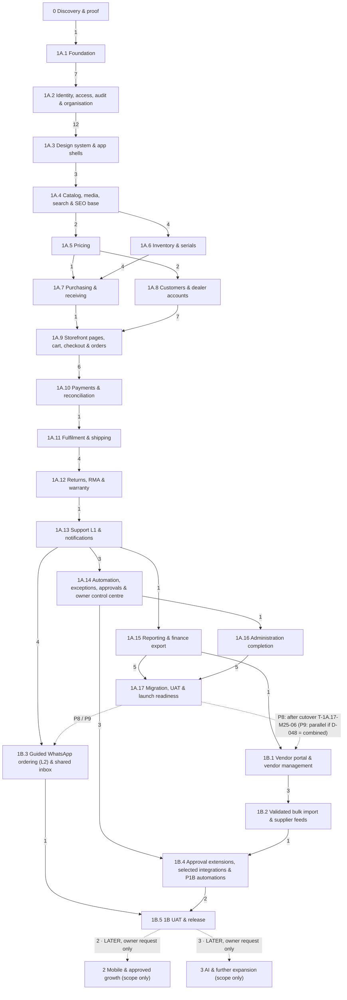
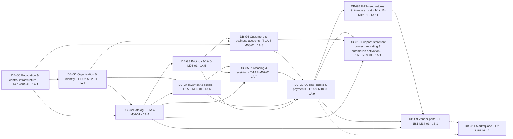
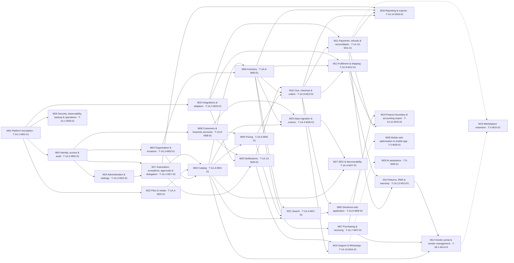
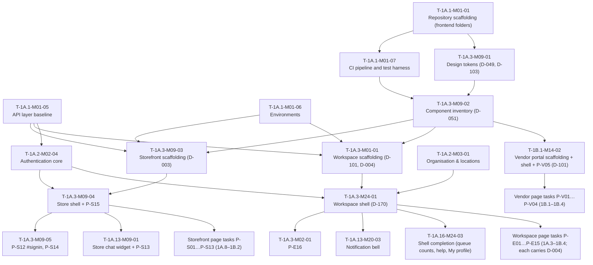

# 17 — Development order and dependencies

**Purpose.** The dependency-aware development order for Tradex, computed from the task skeleton: what must be built
first (critical path), what depends on each stage and module, what can run in parallel, which gates stop work, the
database / backend / frontend / API / testing dependency chains, and which open decisions block the most tasks — so
the owner knows which decisions to resolve first and a Claude session knows why a task is (not) eligible.

**Sources used (derived strictly from the plan, no new requirements).** `12-phases.md` §1.4, §4, §5, §6, §7, §8, §9
(the 361-task skeleton with its Depends-on and Decisions columns — the authoritative task list), `03-database.md` §4
(migration groups DB-G0…DB-G11), §5 (invariants), §6 (seed sets); `05-backend.md` §1.2 (transaction boundaries TX-1…TX-10),
§2 (module dependency graph), §5 (module completion criteria); `06-api.md` §2 (endpoint index, 492 endpoints), §3
(entities and services per endpoint), §7.2–§7.3 (counts, screen → endpoint map); `04a`/`04b`/`04c` (screens and shells);
`16-testing.md` §3–§6, §13, §14 (environments, cadence, suites, T01–T36 first-runnable points, UAT, go-live items);
`14-continuation-protocol.md` step 8; `DECISIONS.md` statuses as of 2026-09-27.

**Conventions.** IDs exactly as in `00-conventions.md` §5 and the skeleton. Status values `00` §3 (incl. `NOT_APPLICABLE`,
D-213). Evidence labels are not repeated here — every task inherits the labels of the plan sections it references. This
file adds **no** requirement, task, entity, endpoint or decision; it only computes relations between existing IDs. No new
decision was needed (reserved range D-216–D-219 unused).

**Decision statuses used for the computation** (`DECISIONS.md`, 2026-09-27): `DECIDED` = D-054, D-210, D-213; `MERGED`
aliases resolved to their target (D-120 → D-104, D-140 → D-129, D-143 → D-121, D-144 → D-131, D-148 → D-137,
D-180 → D-164, D-182 → D-162); every other decision (`OPEN`, `PROPOSED-DEFAULT`, `LATER`) counts as blocking.

**How to refresh.** The numbers below are a snapshot of the skeleton. After `TASKS.md` statuses or any Depends-on /
Decisions entry change, re-run the script in §15 (`python3 <script> plan`); it recomputes the critical path, the
decision ranking and the stage independence and verifies every task ID cited in this file and in `18-master-checklist.md`.

---

## 1. Method and graph facts

| Item | Value |
|---|---|
| Tasks (nodes) | 361 (stage 0: 69 · 1A: 242 · 1B: 44 · 2: 3 · 3: 3) |
| Dependency edges (Depends-on entries) | 791 |
| Cycles | 0 (checked; every dependency is in the same or an earlier stage, `12` §1.1 rule 1) |
| Tasks without dependencies (roots) | 2: T-0-M01-01, T-0-M01-02 |
| Tasks nothing depends on (leaves) | 63 |
| CONDITIONAL / MOCKUP-ONLY / scope-decision tasks | 43 (no unconditional task depends on them, `12` §1.3) |
| Weight | Every task counts 1. The sources give no durations (person-day estimates are produced by T-0-M01-28, BP §25); "length" = number of tasks on a dependency chain |
| Depth of a task | 1 + the largest depth among its dependencies (roots have depth 1) = earliest possible position in an unlimited-parallel schedule |
| Slack | (latest position that does not delay the target) − depth; slack 0 = on a critical path |
| Transitive dependents | Tasks that cannot start until this task is `COMPLETED`/`NOT_APPLICABLE` (directly or through other tasks) |

Two views are used for decisions and parallelism because the Phase 0 exit gate links everything: the **strict view**
(the skeleton as written — T-1A.1-M01-01 depends on the exit gate T-0-M01-29, D-211 option (a)) and the **Phase 1 view**
(dependencies on stage-0 tasks ignored, i.e. assuming Phase 0 is complete) which shows how the Phase 1 work itself is
ordered.

---

## 2. Summary

| Measure | Result |
|---|---|
| Critical path to the go-live gate T-1A.17-M01-01 | **39 tasks** (12 in stage 0 + 27 in stages 1A.1–1A.17); 47 tasks have zero slack (§3.3) |
| … to cutover T-1A.17-M25-06 / end of hypercare T-1A.17-M26-07 | 40 / 41 tasks |
| … to the Phase 0 exit gate T-0-M01-29 | 12 tasks |
| … to the 1B exit gate T-1B.5-M17-01, 1B after cutover (`12` §5 P8, D-048 default) | 50 tasks |
| … to the 1B exit gate in the task graph alone (1B not held for cutover — only allowed under D-048 combined launch, P9) | 39 tasks |
| … to go-live if D-211 option (b) is chosen (1A.1 starts after D-001, D-005, D-077, D-109, D-115, D-211 and the proof scorecard) | 37 tasks |
| … from the first Phase 1 task T-1A.1-M01-01 to go-live (Phase 1 view) | 27 tasks |
| Largest set of Phase 1 tasks that could run at the same time (ASAP level width, Phase 1 view, 1B after cutover) | 30 tasks (§6.3) |
| Open decisions referenced by tasks | 181 (every `OPEN`/`PROPOSED-DEFAULT`/`LATER` decision in `DECISIONS.md` is referenced by at least one task) |
| Decisions that block the most Phase 1 tasks (transitive, Phase 1 view) | D-115 (292); D-211 (292); D-109 (290); D-001 (290); D-002 (290); D-059 (286); D-104 (286); D-122 (286); D-123 (286); D-124 (286); D-040 (268); D-083 (268) — §13 |
| Decisions that block the most tasks directly | D-004 (37); D-037 (5); D-038 (5); D-040 (5); D-057 (5); D-078 (5) |
| Hard gates | Phase 0 exit gate T-0-M01-29 (holds all 292 Phase 1+ tasks); schema tasks DB-G0…DB-G10; 23 stage-verification gates; go-live T-1A.17-M01-01 → cutover T-1A.17-M25-06 → hypercare T-1A.17-M26-07; 1B exit T-1B.5-M17-01 → stages 2/3 (LATER) — §7 |

---

## 3. What must be implemented first — the critical path (a)

### 3.1 Critical path to go-live (strict view, D-211 option (a) — plan default)

The longest dependency chain from the first Phase 0 task to the go-live gate. Ties are broken by skeleton order; the
alternative zero-slack tasks are listed in §3.3. `Open decisions` = the task's own Decisions column entries that are
not `DECIDED` (each must be `DECIDED` before the task can start).

| # | Depth | Task | Stage | Mod | Open decisions on the task | Title (short) |
|---:|---:|---|---|---|---|---|
| 1 | 1 | T-0-M01-01 | 0 | M01 | — | Decide D-210 — where Phase 0 records, sample documents and proof artefacts are… |
| 2 | 2 | T-0-M01-03 | 0 | M01 | — | Discovery questionnaire and next-meeting pack: BP §31.1 agenda, §26.1–26.7 ques… |
| 3 | 3 | T-0-M25-02 | 0 | M25 | — | Technical audit of existing systems: read-only access to website, ERP, hosting,… |
| 4 | 4 | T-0-M25-03 | 0 | M25 | — | Existing-module assessment form (inventory, billing/POS, website, accounting, W… |
| 5 | 5 | T-0-M01-05 | 0 | M01 | — | Platform-proof plan: candidates in BP §1.2 order, disposable proof environments… |
| 6 | 6 | T-0-M06-01 | 0 | M06 | — | Proof scenarios 1, 2, 4 on each candidate: receive three refurbished laptops wi… |
| 7 | 7 | T-0-M13-01 | 0 | M13 | — | Proof scenario 7 on each candidate: return a serialised unit to quarantine and… |
| 8 | 8 | T-0-M01-06 | 0 | M01 | — | Fit scorecard (BP §15.3 weights), year-one and three-year TCO comparison (BP §2… |
| 9 | 9 | T-0-M01-09 | 0 | M01 | D-001 | Decide D-001 — operational core (retain legacy / ERPNext+extension / Odoo / cus… |
| 10 | 10 | T-0-M01-26 | 0 | M01 | D-004 | Decide D-004 — native ERP screen or custom UI per P-E screen |
| 11 | 11 | T-0-M01-27 | 0 | M01 | D-101 | Decide D-101 — framework for custom workspace screens and the vendor portal |
| 12 | 12 | T-0-M01-29 | 0 | M01 | — | Phase 0 exit gate: Phase 0 deliverable pack (requirements, current-state assess… |
| 13 | 13 | T-1A.1-M01-01 | 1A.1 | M01 | D-115, D-211 | Repository scaffolding per 00 §11: frontend/{design-system,storefront,workspace… |
| 14 | 14 | T-1A.1-M01-02 | 1A.1 | M01 | D-001, D-002, D-109 | Backend application skeleton on the chosen operational core (extension app or m… |
| 15 | 15 | T-1A.1-M01-03 | 1A.1 | M01 | D-104, D-123, D-124, D-122, D-059 | Shared kernel: money and tax arithmetic types, identifiers and non-fiscal docum… |
| 16 | 16 | T-1A.1-M01-04 | 1A.1 | M01 | — | Migration runner and DB-G0 schema (E-company, E-user_account, E-role, E-permiss… |
| 17 | 17 | T-1A.2-M02-01 | 1A.2 | M02 | D-040, D-083 | DB-G1 schema (E-location, E-location_bin, E-user_role_assignment, E-delegation,… |
| 18 | 18 | T-1A.4-M04-01 | 1A.4 | M04 | D-125, D-127 | DB-G2 schema (E-category, E-attribute_definition, E-category_attribute, E-brand… |
| 19 | 19 | T-1A.6-M06-01 | 1A.6 | M06 | D-128 | DB-G4 schema (E-stock_position, E-stock_movement, E-serial_unit, E-serial_event… |
| 20 | 20 | T-1A.7-M07-01 | 1A.7 | M07 | — | DB-G5 schema (E-purchase_order, E-purchase_order_line, E-goods_receipt, E-goods… |
| 21 | 21 | T-1A.9-M10-01 | 1A.9 | M10 | — | DB-G7 schema (E-quote, E-quote_line, E-sales_order, E-order_line, E-reservation… |
| 22 | 22 | T-1A.9-M05-01 | 1A.9 | M05 | D-154 | Quote service: basket quote with snapshot, versions and validity, server-derive… |
| 23 | 23 | T-1A.9-M10-02 | 1A.9 | M10 | D-129 | Cart: lines, quantity changes, save for later, revalidated price/stock notices,… |
| 24 | 24 | T-1A.9-M09-07 | 1A.9 | M09 | — | P-S06 Cart and P-S07 Checkout (address, delivery, review, place pending order;… |
| 25 | 25 | T-1A.10-M11-01 | 1A.10 | M11 | D-150 | Hosted payment flow end to end: payment options for the order, create/reuse pay… |
| 26 | 26 | T-1A.10-M11-02 | 1A.10 | M11 | — | Webhook processing A09: raw-body signature, persist and deduplicate on provider… |
| 27 | 27 | T-1A.11-M12-02 | 1A.11 | M12 | D-029 | Fulfilment queue and release A11: eligible orders enter the warehouse queue, fu… |
| 28 | 28 | T-1A.11-M12-03 | 1A.11 | M12 | D-110 | Pick, scan verification (bin → SKU → serial against allocation), pick exception… |
| 29 | 29 | T-1A.11-M12-05 | 1A.11 | M12 | — | Dispatch confirmation: stock decrement, serial linkage to sale, order state (AP… |
| 30 | 30 | T-1A.12-M13-01 | 1A.12 | M13 | D-022 | Return eligibility by policy version in force at purchase and serial validation… |
| 31 | 31 | T-1A.12-M13-02 | 1A.12 | M13 | D-150 | Return/RMA requests (customer and staff), evidence upload, review/authorise/rej… |
| 32 | 32 | T-1A.12-M13-03 | 1A.12 | M13 | — | Returns receiving into quarantine (RMA or RTO), inspection, serial linked to sa… |
| 33 | 33 | T-1A.12-M13-04 | 1A.12 | M13 | — | RMA refunds (incl. partial), credit notes and replacement orders (API-M10-23) |
| 34 | 34 | T-1A.15-M19-01 | 1A.15 | M19 | D-011, D-004 | Accounting export A26 with accounting adapter (file or API): batches with contr… |
| 35 | 35 | T-1A.15-M11-01 | 1A.15 | M11 | D-004 | Daily close with maker-checker and P-E12 #close (API-M11-20, API-M11-21; E-fina… |
| 36 | 36 | T-1A.15-M18-08 | 1A.15 | M18 | — | Stage 1A.15 verification: T27 accountant test day, T18 accounting effect, T35 e… |
| 37 | 37 | T-1A.17-M26-02 | 1A.17 | M26 | — | Automated security verification on staging: TS-SEC-01…11 incl. OWASP object/pro… |
| 38 | 38 | T-1A.17-M25-05 | 1A.17 | M25 | D-035 | UAT execution (UAT-WH, UAT-SALES, UAT-FIN, UAT-SUP web part, UAT-OWN, UAT-CUS,… |
| 39 | 39 | T-1A.17-M01-01 | 1A.17 | M01 | D-048 | Go-live checklist G1–G13 evidence, Phase 1A exit gate and 'UAT and launch' sign… |

T-0-M01-01 ("Decide D-210") is complete in substance — D-210 was `DECIDED` on 2026-09-27 (§14 #1) — so the chain still
to be worked is 38 tasks, starting with the discovery questionnaire T-0-M01-03.


### 3.2 Reading the critical path

| Segment | Tasks | What drives it |
|---|---|---|
| Phase 0 discovery → proof → platform decisions | T-0-M01-01 … T-0-M01-29 (12) | Proof scenarios need the technical audit and sample documents (T-0-M25-02/-03/-04); D-001 needs the scorecard (T-0-M01-06); D-004 needs D-001 and the prototype tests; D-101 needs D-004 and D-003; the exit gate needs all BP §31.2 decisions (BP §5.1, §15.3) |
| Foundation → schema chain | T-1A.1-M01-01 … T-1A.9-M10-01 (9) | Migration groups must be applied in `03` §4 order: DB-G0 → G1 → G2 → G4 → G5 → G7 (G3/G6 run beside G4/G5); DB-G7 needs G3, G4, G5 and G6 |
| Checkout → payment → fulfilment → returns | T-1A.9-M05-01 … T-1A.12-M13-04 (12) | Quote, cart and checkout page (TX-1 pending order with reservation in the zero-slack T-1A.9-M10-03), TX-2 payment event, release A11, pick/scan, TX-4 dispatch, return eligibility, TX-8/TX-9 return receipt and disposition, RMA refunds and credit notes |
| Finance → assurance → UAT → go-live | T-1A.15-M19-01 … T-1A.17-M01-01 (6) | Accounting export A26 needs credit notes (T-1A.12-M13-04); daily close; 1A.15 gate; automated security verification (needs the 1A.13–1A.16 gates); UAT needs every 1A stage gate; go-live needs UAT, rollback rehearsal and load verification |

Consequences for the order of work:

1. The chain is dominated by **schema groups and the order-to-cash flow**, not by page work. Storefront and workspace page
   tasks have slack as long as their APIs exist (§10).
2. **1A.13, 1A.14 and 1A.16 are not on the critical path**; they have slack against go-live but feed the security
   verification T-1A.17-M26-02 and UAT T-1A.17-M25-05. **1A.15 is** (accounting export after credit notes).
3. Any open decision on a critical-path task delays go-live one-for-one; those decisions are marked in §13.2.

### 3.3 All zero-slack tasks (go-live target)

Tasks whose delay delays go-live (several equally long chains exist).

| Depth | Tasks with zero slack at this depth |
|---:|---|
| 1 | T-0-M01-01 |
| 2 | T-0-M01-03 |
| 3 | T-0-M25-02 |
| 4 | T-0-M25-03 |
| 5 | T-0-M01-05 |
| 6 | T-0-M06-01 |
| 7 | T-0-M13-01, T-0-M17-03 |
| 8 | T-0-M01-06 |
| 9 | T-0-M01-09 |
| 10 | T-0-M01-26 |
| 11 | T-0-M01-27, T-0-M01-28 |
| 12 | T-0-M01-29 |
| 13 | T-1A.1-M01-01 |
| 14 | T-1A.1-M01-02 |
| 15 | T-1A.1-M01-03 |
| 16 | T-1A.1-M01-04 |
| 17 | T-1A.2-M02-01 |
| 18 | T-1A.4-M04-01 |
| 19 | T-1A.5-M05-01, T-1A.6-M06-01 |
| 20 | T-1A.7-M07-01, T-1A.8-M08-01 |
| 21 | T-1A.9-M10-01 |
| 22 | T-1A.9-M05-01, T-1A.9-M06-01 |
| 23 | T-1A.9-M10-02, T-1A.9-M10-03 |
| 24 | T-1A.9-M09-07 |
| 25 | T-1A.10-M11-01 |
| 26 | T-1A.10-M11-02 |
| 27 | T-1A.11-M12-02 |
| 28 | T-1A.11-M12-03 |
| 29 | T-1A.11-M12-05 |
| 30 | T-1A.12-M13-01 |
| 31 | T-1A.12-M13-02 |
| 32 | T-1A.12-M13-03 |
| 33 | T-1A.12-M13-04 |
| 34 | T-1A.15-M19-01 |
| 35 | T-1A.15-M11-01, T-1A.15-M10-01 |
| 36 | T-1A.15-M18-08 |
| 37 | T-1A.17-M26-02, T-1A.17-M09-01 |
| 38 | T-1A.17-M25-05 |
| 39 | T-1A.17-M01-01 |

### 3.4 Chains to other milestones

| Target | Length | Chain (tasks after the go-live critical path, or the full chain) |
|---|---:|---|
| Phase 0 exit gate T-0-M01-29 | 12 | T-0-M01-01 → T-0-M01-03 → T-0-M25-02 → T-0-M25-03 → T-0-M01-05 → T-0-M06-01 → T-0-M13-01 → T-0-M01-06 → T-0-M01-09 → T-0-M01-26 → T-0-M01-27 → T-0-M01-29 |
| Cutover T-1A.17-M25-06 | 40 | go-live chain → T-1A.17-M25-06 |
| End of hypercare T-1A.17-M26-07 | 41 | go-live chain → T-1A.17-M25-06 → T-1A.17-M26-07 |
| 1B exit gate T-1B.5-M17-01 with 1B after cutover (P8) | 50 | … → T-1A.17-M01-01 → T-1A.17-M25-06 → T-1B.1-M14-01 → T-1B.1-M14-03 → T-1B.1-M14-04 → T-1B.1-M14-06 → T-1B.1-M14-12 → T-1B.1-M14-13 → T-1B.1-M14-15 → T-1B.5-M25-01 → T-1B.5-M26-01 → T-1B.5-M17-01 |
| 1B exit gate, graph only | 39 | T-1A.11-M12-03 → T-1A.11-M12-05 → T-1A.12-M13-01 → T-1A.12-M13-02 → T-1A.12-M13-03 → T-1A.12-M13-04 → T-1A.15-M19-01 → T-1B.1-M14-11 → T-1B.1-M14-15 → T-1B.5-M25-01 → T-1B.5-M26-01 → T-1B.5-M17-01 (last 12) |
| Go-live under D-211 option (b) | 37 | T-0-M01-01 → T-0-M01-03 → T-0-M25-02 → T-0-M25-03 → T-0-M01-05 → T-0-M06-01 → T-0-M13-01 → T-0-M01-06 → T-0-M01-09 → T-0-M01-12 → T-1A.1-M01-01 → (as §3.1) |
| Go-live, Phase 1 view (from T-1A.1-M01-01) | 27 | as §3.1 rows 13–39 |

D-211 option (b) removes only two tasks from the chain because the proof chain (audit → proof → scorecard → D-001)
already dominates stage 0; its benefit is that policy decisions (D-006, D-016…D-018, D-022…D-025, D-034, D-035, D-037,
D-038, D-048, D-078, D-192, D-220, D-221, D-222, D-049 …) stop blocking foundation work — see §13.1 (strict vs Phase 1
view).

### 3.5 Tasks with the most dependents (build these early — bottlenecks)

| Task | Stage | Mod | Direct dependents | Transitive dependents | Open decisions on the task | Title (short) |
|---|---|---|---:|---:|---|---|
| T-1A.1-M01-01 | 1A.1 | M01 | 3 | 291 | D-115, D-211 | Repository scaffolding per 00 §11: frontend/{design-system,stor… |
| T-1A.1-M01-02 | 1A.1 | M01 | 4 | 289 | D-001, D-002, D-109 | Backend application skeleton on the chosen operational core (ex… |
| T-1A.1-M01-03 | 1A.1 | M01 | 2 | 285 | D-104, D-123, D-124, D-122, D-059 | Shared kernel: money and tax arithmetic types, identifiers and… |
| T-1A.1-M01-04 | 1A.1 | M01 | 5 | 283 | — | Migration runner and DB-G0 schema (E-company, E-user_account, E… |
| T-1A.2-M02-01 | 1A.2 | M02 | 5 | 267 | D-040, D-083 | DB-G1 schema (E-location, E-location_bin, E-user_role_assignmen… |
| T-1A.2-M02-02 | 1A.2 | M02 | 10 | 236 | D-222, D-200, D-083 | AccessPolicy: permission keys, role × record-scope evaluation,… |
| T-1A.1-M17-01 | 1A.1 | M17 | 10 | 234 | — | Durable job runtime: worker and scheduler, outbox worker and sc… |
| T-1A.4-M04-01 | 1A.4 | M04 | 3 | 230 | D-125, D-127 | DB-G2 schema (E-category, E-attribute_definition, E-category_at… |
| T-1A.2-M02-03 | 1A.2 | M02 | 5 | 225 | D-114 | Audit service: E-audit_event in the same transaction with befor… |
| T-1A.5-M05-01 | 1A.5 | M05 | 3 | 189 | — | DB-G3 schema (E-price_list, E-price_rule_version, E-price_list_… |
| T-1A.1-M01-05 | 1A.1 | M01 | 4 | 183 | D-080, D-079 | API layer baseline: versioned base path, error envelope with co… |
| T-1A.6-M06-01 | 1A.6 | M06 | 4 | 182 | D-128 | DB-G4 schema (E-stock_position, E-stock_movement, E-serial_unit… |
| T-1A.2-M02-04 | 1A.2 | M02 | 5 | 179 | D-040, D-083, D-202, D-102 | Authentication core: current principal, password sign-in, sign-… |
| T-1A.2-M23-01 | 1A.2 | M23 | 10 | 171 | — | Adapter framework: integration contract checklist, E-integratio… |
| T-1A.8-M08-01 | 1A.8 | M08 | 5 | 169 | — | DB-G6 schema (E-customer_segment, E-customer, E-business_accoun… |
| T-1A.2-M03-01 | 1A.2 | M03 | 5 | 168 | — | Organisation and locations service and APIs: company, locations… |
| T-1A.7-M07-01 | 1A.7 | M07 | 4 | 161 | — | DB-G5 schema (E-purchase_order, E-purchase_order_line, E-goods_… |
| T-1A.2-M17-01 | 1A.2 | M17 | 21 | 153 | D-196 | Approval core: E-approval_request/E-approval_threshold service,… |
| T-1A.9-M10-01 | 1A.9 | M10 | 6 | 149 | — | DB-G7 schema (E-quote, E-quote_line, E-sales_order, E-order_lin… |
| T-1A.2-M23-02 | 1A.2 | M23 | 3 | 146 | D-015 | Email / SMS / OTP messaging adapter with delivery-status intake |
| T-1A.1-M01-06 | 1A.1 | M01 | 5 | 142 | D-005, D-077, D-109, D-102 | Environments development, staging and production defined in inf… |
| T-1A.1-M01-07 | 1A.1 | M01 | 2 | 138 | D-077, D-053 | CI pipeline (lint, unit/integration suites, build, migration ch… |
| T-1A.3-M09-01 | 1A.3 | M09 | 1 | 137 | D-049, D-103 | Design tokens and foundations in frontend/design-system: colour… |
| T-1A.3-M09-02 | 1A.3 | M09 | 4 | 136 | D-051 | Component inventory with loading/empty/error states, keyboard a… |
| T-1A.5-M05-02 | 1A.5 | M05 | 8 | 127 | D-016, D-017, D-018 | Pricing engine: precedence sequence, price lists and rule versi… |
| T-1A.3-M01-01 | 1A.3 | M01 | 1 | 119 | D-101, D-004 | Workspace application scaffolding (frontend/workspace): framewo… |
| T-1A.3-M24-01 | 1A.3 | M24 | 36 | 118 | D-170 | Workspace shell: permission-filtered sidebar, top bar, location… |
| T-1A.6-M06-02 | 1A.6 | M06 | 9 | 115 | — | Stock ledger, positions and ATP: append-only movements per BP §… |
| T-1A.2-M02-05 | 1A.2 | M02 | 7 | 109 | D-040, D-084 | One-time codes, password reset and abuse protection on sign-in/… |
| T-1A.2-M17-02 | 1A.2 | M17 | 5 | 101 | — | Exception core: ExceptionService (one open case per job + entit… |

Stage 0 tasks are excluded from this table because every one of them on the path to T-0-M01-29 holds all 292 Phase 1+
tasks in the strict view (§7.1). Full per-task reverse index: Appendix A.

---

## 4. Reverse dependencies — stages (b)

### 4.1 Stage graph computed from the task graph

Arrow `X --> Y` (label = number of task-level edges): some task of stage Y depends directly on a task of stage X. The
graph below is the transitive reduction of the 124 stage pairs linked by task edges. Dotted arrows are procedural
gates that are **not** task dependencies (`12` §5 P8/P9, `14` step 8d–8e).



Differences from the hand-drawn diagram in `12` §4 (no conflict in the skeleton; recorded for accuracy):

| Edge | In `12` §4 | In the task graph | Cause (task edge) |
|---|---|---|---|
| 1A.5 → 1A.7 | not drawn | direct (1 edge) | T-1A.7-M05-01 (cost signals) → T-1A.5-M05-03 |
| 1A.15 → 1B.1 | not drawn | direct (1 edge) | T-1B.1-M14-11 (vendor statements) → T-1A.15-M19-01 |
| 1A.13 → 1B.3 | drawn as 1A.17 → 1B.3 | direct (4 edges) | T-1B.3-M16-01 → T-1A.13-M16-04; T-1B.3-M16-02 → T-1A.13-M10-01; T-1B.3-M16-03 → T-1A.13-M16-02; T-1B.3-M20-01 → T-1A.13-M20-02 |
| 1A.17 → 1B.1, 1A.17 → 1B.3 | drawn | none | Procedural: `12` §5 P8 (1B after cutover) — enforced by the protocol (`14` step 8d), not by Depends-on |
| 1A.12 → 1A.13 | drawn | 1 edge only | T-1A.13-M20-02 (A14 notifications) → T-1A.12-M13-02; the rest of 1A.13 is independent of 1A.12 (§6.1) |

### 4.2 Per stage: what it depends on and what depends on it

`Direct in` = stages this stage's tasks depend on (task-edge count). `Direct out` = later stages with tasks that depend
directly on this stage. `Transitive dependents` = tasks outside the stage that cannot start until some task of this stage
is complete.

| Stage | Tasks | Gate task | Direct in (stage: edges) | Direct out (stage: edges) | Tasks outside the stage depending directly | Transitive dependents |
|---|---:|---|---|---|---:|---:|
| 0 | 69 | T-0-M01-29 | — | 1A.1: 1, 1A.4: 1, 1B.4: 1 | 3 | 292 |
| 1A.1 | 13 | T-1A.1-M01-10 | 0: 1 | 1A.2: 7, 1A.3: 6, 1A.4: 2, 1A.5: 1, 1A.6: 2, 1A.7: 1, 1A.8: 1, 1A.14: 1, 1A.15: 1, 1A.16: 2, 1A.17: 1, 1B.2: 1 | 24 | 279 |
| 1A.2 | 17 | T-1A.2-M02-09 | 1A.1: 7 | 1A.3: 12, 1A.4: 4, 1A.5: 2, 1A.6: 6, 1A.7: 1, 1A.8: 7, 1A.9: 4, 1A.10: 3, 1A.11: 1, 1A.12: 1, 1A.13: 3, 1A.14: 8, 1A.15: 2, 1A.16: 1, 1A.17: 2, 1B.1: 3, 1B.2: 1, 1B.3: 1, 1B.4: 2 | 55 | 258 |
| 1A.3 | 11 | T-1A.3-M09-06 | 1A.1: 6, 1A.2: 12 | 1A.4: 3, 1A.5: 2, 1A.6: 1, 1A.7: 2, 1A.8: 4, 1A.9: 7, 1A.10: 3, 1A.11: 1, 1A.12: 1, 1A.13: 3, 1A.14: 5, 1A.15: 4, 1A.16: 3, 1A.17: 1, 1B.1: 2, 1B.2: 2 | 44 | 127 |
| 1A.4 | 15 | T-1A.4-M04-10 | 0: 1, 1A.1: 2, 1A.2: 4, 1A.3: 3 | 1A.5: 2, 1A.6: 4, 1A.8: 1, 1A.9: 4, 1A.12: 1, 1A.17: 2, 1B.1: 3, 1B.2: 3 | 19 | 217 |
| 1A.5 | 10 | T-1A.5-M05-09 | 1A.1: 1, 1A.2: 2, 1A.3: 2, 1A.4: 2 | 1A.7: 1, 1A.8: 2, 1A.9: 5, 1A.17: 1, 1B.4: 1 | 10 | 180 |
| 1A.6 | 16 | T-1A.6-M06-12 | 1A.1: 2, 1A.2: 6, 1A.3: 1, 1A.4: 4 | 1A.7: 4, 1A.9: 4, 1A.11: 1, 1A.12: 1, 1A.17: 2, 1B.2: 1 | 11 | 169 |
| 1A.7 | 12 | T-1A.7-M07-10 | 1A.1: 1, 1A.2: 1, 1A.3: 2, 1A.5: 1, 1A.6: 4 | 1A.9: 1, 1A.12: 1, 1A.17: 2, 1B.1: 1 | 5 | 150 |
| 1A.8 | 17 | T-1A.8-M08-12 | 1A.1: 1, 1A.2: 7, 1A.3: 4, 1A.4: 1, 1A.5: 2 | 1A.9: 7, 1A.12: 2, 1A.13: 1, 1A.15: 2, 1A.16: 1, 1A.17: 3 | 15 | 153 |
| 1A.9 | 29 | T-1A.9-M10-09 | 1A.2: 4, 1A.3: 7, 1A.4: 4, 1A.5: 5, 1A.6: 4, 1A.7: 1, 1A.8: 7 | 1A.10: 6, 1A.11: 4, 1A.12: 3, 1A.13: 5, 1A.15: 4, 1A.16: 1, 1A.17: 2, 1B.2: 2 | 23 | 131 |
| 1A.10 | 12 | T-1A.10-M11-10 | 1A.2: 3, 1A.3: 3, 1A.9: 6 | 1A.11: 1, 1A.12: 1, 1A.13: 2, 1A.15: 1, 1A.17: 1 | 6 | 63 |
| 1A.11 | 15 | T-1A.11-M12-12 | 1A.2: 1, 1A.3: 1, 1A.6: 1, 1A.9: 4, 1A.10: 1 | 1A.12: 4, 1A.13: 1, 1A.15: 2, 1A.17: 1, 1B.1: 1, 1B.4: 1 | 10 | 67 |
| 1A.12 | 13 | T-1A.12-M13-09 | 1A.2: 1, 1A.3: 1, 1A.4: 1, 1A.6: 1, 1A.7: 1, 1A.8: 2, 1A.9: 3, 1A.10: 1, 1A.11: 4 | 1A.13: 1, 1A.15: 1, 1A.17: 2, 1B.1: 1 | 5 | 35 |
| 1A.13 | 12 | T-1A.13-M16-05 | 1A.2: 3, 1A.3: 3, 1A.8: 1, 1A.9: 5, 1A.10: 2, 1A.11: 1, 1A.12: 1 | 1A.14: 3, 1A.15: 1, 1A.16: 1, 1A.17: 4, 1B.1: 1, 1B.3: 4 | 14 | 43 |
| 1A.14 | 13 | T-1A.14-M17-12 | 1A.1: 1, 1A.2: 8, 1A.3: 5, 1A.13: 3 | 1A.16: 1, 1A.17: 2, 1B.4: 3 | 6 | 23 |
| 1A.15 | 13 | T-1A.15-M18-08 | 1A.1: 1, 1A.2: 2, 1A.3: 4, 1A.8: 2, 1A.9: 4, 1A.10: 1, 1A.11: 2, 1A.12: 1, 1A.13: 1 | 1A.17: 5, 1B.1: 1, 1B.4: 1 | 7 | 22 |
| 1A.16 | 7 | T-1A.16-M24-05 | 1A.1: 2, 1A.2: 1, 1A.3: 3, 1A.8: 1, 1A.9: 1, 1A.13: 1, 1A.14: 1 | 1A.17: 5 | 5 | 11 |
| 1A.17 | 17 | T-1A.17-M01-01 | 1A.1: 1, 1A.2: 2, 1A.3: 1, 1A.4: 2, 1A.5: 1, 1A.6: 2, 1A.7: 2, 1A.8: 3, 1A.9: 2, 1A.10: 1, 1A.11: 1, 1A.12: 2, 1A.13: 4, 1A.14: 2, 1A.15: 5, 1A.16: 5 | — | 0 | 0 |
| 1B.1 | 15 | T-1B.1-M14-15 | 1A.2: 3, 1A.3: 2, 1A.4: 3, 1A.7: 1, 1A.11: 1, 1A.12: 1, 1A.13: 1, 1A.15: 1 | 1B.2: 3, 1B.4: 5, 1B.5: 1 | 7 | 19 |
| 1B.2 | 10 | T-1B.2-M04-04 | 1A.1: 1, 1A.2: 1, 1A.3: 2, 1A.4: 3, 1A.6: 1, 1A.9: 2, 1B.1: 3 | 1B.4: 1, 1B.5: 1 | 2 | 12 |
| 1B.3 | 8 | T-1B.3-M16-06 | 1A.2: 1, 1A.13: 4 | 1B.5: 1 | 1 | 10 |
| 1B.4 | 7 | T-1B.4-M17-04 | 0: 1, 1A.2: 2, 1A.5: 1, 1A.11: 1, 1A.14: 3, 1A.15: 1, 1B.1: 5, 1B.2: 1 | 1B.5: 2 | 2 | 10 |
| 1B.5 | 4 | T-1B.5-M17-01 | 1B.1: 1, 1B.2: 1, 1B.3: 1, 1B.4: 2 | 2: 2, 3: 3 | 5 | 6 |
| 2 | 3 | — (scope only) | 1B.5: 2 | — | 0 | 0 |
| 3 | 3 | — (scope only) | 1B.5: 3 | — | 0 | 0 |

### 4.3 Stage gates and what waits for them

| Gate task | Stage | Tasks that depend directly on the gate | Transitive dependents of the gate |
|---|---|---|---:|
| T-0-M01-29 | 0 | T-1A.1-M01-01 | 292 |
| T-1A.1-M01-10 | 1A.1 | T-1A.17-M25-05 | 4 |
| T-1A.2-M02-09 | 1A.2 | T-1A.17-M25-05 | 4 |
| T-1A.3-M09-06 | 1A.3 | T-1A.17-M25-05 | 4 |
| T-1A.4-M04-10 | 1A.4 | T-1A.17-M25-05 | 4 |
| T-1A.5-M05-09 | 1A.5 | T-1A.17-M25-05 | 4 |
| T-1A.6-M06-12 | 1A.6 | T-1A.17-M25-05 | 4 |
| T-1A.7-M07-10 | 1A.7 | T-1A.17-M25-05 | 4 |
| T-1A.8-M08-12 | 1A.8 | T-1A.17-M25-05 | 4 |
| T-1A.9-M10-09 | 1A.9 | T-1A.17-M25-05 | 4 |
| T-1A.10-M11-10 | 1A.10 | T-1A.17-M25-05 | 4 |
| T-1A.11-M12-12 | 1A.11 | T-1A.17-M25-05 | 4 |
| T-1A.12-M13-09 | 1A.12 | T-1A.17-M25-05 | 4 |
| T-1A.13-M16-05 | 1A.13 | T-1A.17-M26-02, T-1A.17-M26-04, T-1A.17-M09-01, T-1A.17-M25-05 | 8 |
| T-1A.14-M17-12 | 1A.14 | T-1A.17-M26-02, T-1A.17-M25-05 | 6 |
| T-1A.15-M18-08 | 1A.15 | T-1A.17-M26-02, T-1A.17-M26-04, T-1A.17-M09-01, T-1A.17-M25-05 | 8 |
| T-1A.16-M24-05 | 1A.16 | T-1A.17-M26-02, T-1A.17-M09-01, T-1A.17-M25-05 | 7 |
| T-1A.17-M01-01 | 1A.17 | T-1A.17-M25-06 | 2 |
| T-1B.1-M14-15 | 1B.1 | T-1B.5-M25-01 | 10 |
| T-1B.2-M04-04 | 1B.2 | T-1B.5-M25-01 | 10 |
| T-1B.3-M16-06 | 1B.3 | T-1B.5-M25-01 | 10 |
| T-1B.4-M17-04 | 1B.4 | T-1B.5-M25-01 | 10 |
| T-1B.5-M17-01 | 1B.5 | T-2-M28-01, T-2-M15-01, T-3-M29-01, T-3-M17-01, T-3-M03-01 | 6 |

Every stage gate except the Phase 0, 1A.17 and 1B gates is consumed only by the UAT task T-1A.17-M25-05 (and, for
1A.13–1A.16, by the assurance tasks T-1A.17-M26-02, T-1A.17-M26-04, T-1A.17-M09-01). Tasks of the next stage depend on
specific tasks of the previous stage, not on its gate — so the next stage may start as soon as its own dependencies are
complete, **within the limits of `12` §5** (§6). A stage is still only *complete* when its gate is `COMPLETED`.

---

## 5. Reverse dependencies — modules (b)

Module = owning module of the task (`12` §1.1 rule 5). `05 §2 deps` / `05 §2 dependents` are the backend module graph
(§9.1). Computed columns use the module's Phase 1+ tasks only (its stage-0 decision/proof tasks would count all 292
Phase 1+ tasks through the exit gate): tasks of *other* modules that depend directly on one of them, and all tasks outside
the module that depend on one of them transitively.

| Module | Stages (task count, `12` §8.3) | 05 §2 depends on | 05 §2 depended on by | First Phase 1 task | Other-module tasks depending directly | Transitive dependents outside the module |
|---|---|---|---|---|---:|---:|
| M01 Platform foundation | 0 (29), 1A.1 (10), 1A.3 (1), 1A.17 (1), 2 (1) | — | M02, M22, M23, M26 | T-1A.1-M01-01 | 18 | 279 |
| M02 Identity, access & audit | 0 (1), 1A.2 (9), 1A.3 (2), 1A.8 (1), 1A.17 (1) | M01 | M24, M03, M08, M17 | T-1A.2-M02-01 | 22 | 255 |
| M03 Organisation & locations | 0 (1), 1A.2 (2), 1A.3 (1), 1A.6 (1), 3 (1) | M02 | M04, M06 | T-1A.2-M03-01 | 8 | 164 |
| M04 Catalog | 0 (1), 1A.4 (10), 1A.5 (1), 1A.6 (1), 1A.9 (1), 1A.12 (1), 1B.2 (4) | M03, M22, M17 | M05, M06, M21, M14, M27, M25 | T-1A.4-M04-01 | 19 | 213 |
| M05 Pricing | 0 (4), 1A.5 (9), 1A.7 (1), 1A.9 (3), 1B.2 (1), 1B.4 (1) | M04, M08 | M21, M10 | T-1A.5-M05-01 | 9 | 175 |
| M06 Inventory | 0 (1), 1A.6 (12), 1A.9 (2), 1B.2 (1) | M03, M04 | M07, M21, M10, M12, M18, M25 | T-1A.6-M06-01 | 16 | 169 |
| M07 Purchasing & receiving | 1A.7 (10) | M06 | M19, M14 | T-1A.7-M07-01 | 6 | 152 |
| M08 Customers & business accounts | 0 (1), 1A.8 (12), 1A.9 (1), 1A.12 (1) | M02 | M20, M05, M25 | T-1A.8-M08-01 | 12 | 156 |
| M09 Storefront web application | 0 (5), 1A.3 (6), 1A.8 (3), 1A.9 (11), 1A.10 (1), 1A.11 (1), 1A.12 (1), 1A.13 (1), 1A.15 (1), 1A.17 (1) | M21, M10 | M28 | T-1A.3-M09-01 | 21 | 151 |
| M10 Cart, checkout & orders | 1A.9 (9), 1A.12 (1), 1A.13 (1), 1A.15 (1) | M05, M06, M20 | M11, M12, M16, M18, M09 | T-1A.9-M10-01 | 19 | 138 |
| M11 Payments, refunds & reconciliation | 0 (1), 1A.10 (10), 1A.15 (1) | M10, M23 | M13, M19, M18, M15 | T-1A.10-M11-01 | 7 | 63 |
| M12 Fulfilment & shipping | 1A.9 (1), 1A.11 (12) | M10, M06, M23 | M13, M19 | T-1A.9-M12-01 | 13 | 103 |
| M13 Returns, RMA & warranty | 0 (2), 1A.12 (9) | M11, M12 | M14 | T-1A.12-M13-01 | 7 | 37 |
| M14 Vendor portal & vendor management | 0 (2), 1B.1 (15), 1B.2 (2), 1B.4 (1), 1B.5 (1) | M04, M07, M13 | M15 | T-1B.1-M14-01 | 5 | 15 |
| M15 Marketplace extension | 2 (1) | M14, M11 | — | T-2-M15-01 | 0 | 0 |
| M16 Support & WhatsApp | 1A.13 (5), 1B.3 (6) | M10, M20 | M29 | T-1A.13-M16-01 | 6 | 19 |
| M17 Automation, exceptions, approvals & delegation | 0 (8), 1A.1 (1), 1A.2 (2), 1A.14 (12), 1B.4 (4), 1B.5 (1), 3 (1) | M24, M02 | M20, M04, M18 | T-1A.1-M17-01 | 35 | 214 |
| M18 Reporting & exports | 1A.14 (1), 1A.15 (8) | M10, M11, M06, M17 | — | T-1A.14-M18-01 | 7 | 23 |
| M19 Finance boundary & accounting export | 0 (3), 1A.11 (1), 1A.15 (2) | M11, M12, M07 | — | T-1A.11-M19-01 | 6 | 28 |
| M20 Notifications | 1A.13 (5), 1B.3 (1) | M17, M23, M08 | M10, M16 | T-1A.13-M20-01 | 9 | 42 |
| M21 Search | 1A.4 (1) | M04, M05, M06 | M09 | T-1A.4-M21-01 | 4 | 29 |
| M22 Files & media | 1A.4 (2), 1B.2 (1) | M01 | M04 | T-1A.4-M22-01 | 7 | 89 |
| M23 Integrations & adapters | 1A.2 (2), 1A.6 (1), 1A.10 (1), 1A.11 (1), 1B.2 (1), 1B.3 (1), 1B.4 (1) | M01 | M20, M11, M12 | T-1A.2-M23-01 | 16 | 164 |
| M24 Administration & settings | 1A.2 (2), 1A.3 (1), 1A.16 (5) | M02 | M17 | T-1A.2-M24-01 | 39 | 116 |
| M25 Data migration & cutover | 0 (6), 1A.4 (1), 1A.6 (1), 1A.7 (1), 1A.8 (1), 1A.17 (6), 1B.5 (1) | M04, M06, M08 | M27 | T-1A.4-M25-01 | 8 | 16 |
| M26 Security, observability, backup & operations | 0 (4), 1A.1 (2), 1A.16 (2), 1A.17 (7), 1B.5 (1) | M01 | — | T-1A.1-M26-01 | 8 | 16 |
| M27 SEO & discoverability | 1A.4 (1), 1A.9 (1), 1A.17 (1) | M04, M25 | — | T-1A.4-M27-01 | 3 | 9 |
| M28 Mobile web optimisation & mobile app | 2 (1) | M09 | — | T-2-M28-01 | 1 | 1 |
| M29 AI assistance | 3 (1) | M16 | — | T-3-M29-01 | 0 | 0 |

Reading: M01, M02, M17 and M24 carry the widest reverse dependencies (platform, AccessPolicy, approvals/jobs, shells and
configuration); M03, M04, M05, M06, M07, M08 follow through the schema chain. Page-owning tasks in M24 (workspace
shell T-1A.3-M24-01) and M09 (store shell T-1A.3-M09-04) have many direct dependents but few transitive ones.

---

## 6. What can run in parallel (c)

Rule (`12` §1.1 rule 2, §5; `14` step 8d): a later-stage task may start while an earlier stage still has eligible
`NOT_STARTED` tasks **only** if the two stages are in the same §5 group and all of the task's own dependencies are
complete and its decisions are `DECIDED`. The tables below show, from the graph, how much parallel work each §5 group
really allows and where the graph would allow more than §5 (the §5 rule still governs).

### 6.1 `12` §5 groups checked against the task graph

`Independent` = tasks of the later stage with no ancestor in the earlier stage (can start before the earlier stage
begins). `Not waiting for the gate` = tasks of the later stage whose ancestors do not include the earlier stage's gate.

| §5 group | Earlier ∥ later stage | Tasks in later stage | Independent of the earlier stage | Independent tasks | Not waiting for the earlier gate |
|---|---|---:|---:|---|---:|
| P1 | 1A.2 ∥ 1A.3 | 11 | 4 | T-1A.3-M09-01, T-1A.3-M09-02, T-1A.3-M09-03, T-1A.3-M01-01 | 11 |
| P2 | 1A.5 ∥ 1A.6 | 16 | 16 | T-1A.6-M06-01, T-1A.6-M06-02, T-1A.6-M06-03, T-1A.6-M06-04, T-1A.6-M06-05, T-1A.6-M06-06, T-1A.6-M06-07, T-1A.6-M06-08 … (+8) | 16 |
| P2 | 1A.5 ∥ 1A.7 | 12 | 10 | T-1A.7-M07-01, T-1A.7-M07-02, T-1A.7-M07-03, T-1A.7-M07-04, T-1A.7-M07-05, T-1A.7-M07-06, T-1A.7-M07-07, T-1A.7-M07-08 … (+2) | 12 |
| P2 | 1A.5 ∥ 1A.8 | 17 | 0 | — | 17 |
| P2 | 1A.6 ∥ 1A.7 | 12 | 0 | — | 12 |
| P2 | 1A.6 ∥ 1A.8 | 17 | 17 | T-1A.8-M08-01, T-1A.8-M08-02, T-1A.8-M08-03, T-1A.8-M08-04, T-1A.8-M08-05, T-1A.8-M08-06, T-1A.8-M08-07, T-1A.8-M02-01 … (+9) | 17 |
| P2 | 1A.7 ∥ 1A.8 | 17 | 17 | T-1A.8-M08-01, T-1A.8-M08-02, T-1A.8-M08-03, T-1A.8-M08-04, T-1A.8-M08-05, T-1A.8-M08-06, T-1A.8-M08-07, T-1A.8-M02-01 … (+9) | 17 |
| P3 | 1A.9 ∥ 1A.10 | 12 | 1 | T-1A.10-M23-01 | 12 |
| P4 | 1A.10 ∥ 1A.11 | 15 | 3 | T-1A.11-M12-01, T-1A.11-M23-01, T-1A.11-M19-01 | 15 |
| P5 | 1A.12 ∥ 1A.13 | 12 | 9 | T-1A.13-M20-01, T-1A.13-M20-03, T-1A.13-M20-05, T-1A.13-M16-01, T-1A.13-M16-02, T-1A.13-M16-03, T-1A.13-M10-01, T-1A.13-M16-04 … (+1) | 12 |
| P6 | 1A.13 ∥ 1A.14 | 13 | 6 | T-1A.14-M17-01, T-1A.14-M17-02, T-1A.14-M17-03, T-1A.14-M17-04, T-1A.14-M17-07, T-1A.14-M17-08 | 13 |
| P6 | 1A.13 ∥ 1A.15 | 13 | 10 | T-1A.15-M18-01, T-1A.15-M18-02, T-1A.15-M18-03, T-1A.15-M18-05, T-1A.15-M18-06, T-1A.15-M19-01, T-1A.15-M19-02, T-1A.15-M11-01 … (+2) | 13 |
| P6 | 1A.13 ∥ 1A.16 | 7 | 4 | T-1A.16-M24-01, T-1A.16-M24-02, T-1A.16-M24-04, T-1A.16-M26-02 | 7 |
| P6 | 1A.14 ∥ 1A.15 | 13 | 13 | T-1A.15-M18-01, T-1A.15-M18-02, T-1A.15-M18-03, T-1A.15-M18-04, T-1A.15-M18-05, T-1A.15-M18-06, T-1A.15-M19-01, T-1A.15-M19-02 … (+5) | 13 |
| P6 | 1A.14 ∥ 1A.16 | 7 | 5 | T-1A.16-M24-01, T-1A.16-M24-02, T-1A.16-M24-04, T-1A.16-M26-01, T-1A.16-M26-02 | 7 |
| P6 | 1A.15 ∥ 1A.16 | 7 | 7 | T-1A.16-M24-01, T-1A.16-M24-02, T-1A.16-M24-03, T-1A.16-M24-04, T-1A.16-M26-01, T-1A.16-M26-02, T-1A.16-M24-05 | 7 |
| P7 | 1A.14 ∥ 1A.17 | 17 | 10 | T-1A.17-M25-01, T-1A.17-M02-01, T-1A.17-M27-01, T-1A.17-M25-02, T-1A.17-M25-03, T-1A.17-M26-01, T-1A.17-M25-04, T-1A.17-M26-04 … (+2) | 11 |
| P7 | 1A.15 ∥ 1A.17 | 17 | 9 | T-1A.17-M25-01, T-1A.17-M02-01, T-1A.17-M27-01, T-1A.17-M25-02, T-1A.17-M25-03, T-1A.17-M26-01, T-1A.17-M25-04, T-1A.17-M26-05 … (+1) | 9 |
| P7 | 1A.16 ∥ 1A.17 | 17 | 6 | T-1A.17-M25-01, T-1A.17-M02-01, T-1A.17-M27-01, T-1A.17-M25-02, T-1A.17-M25-03, T-1A.17-M26-04 | 10 |
| P8/P9 | 1A.17 ∥ 1B.1 | 15 | 15 | T-1B.1-M14-01, T-1B.1-M14-02, T-1B.1-M14-03, T-1B.1-M14-04, T-1B.1-M14-05, T-1B.1-M14-06, T-1B.1-M14-07, T-1B.1-M14-08 … (+7) | 15 |
| P8/P9 | 1A.17 ∥ 1B.2 | 10 | 10 | T-1B.2-M04-01, T-1B.2-M22-01, T-1B.2-M23-01, T-1B.2-M04-02, T-1B.2-M06-01, T-1B.2-M14-01, T-1B.2-M14-02, T-1B.2-M04-03 … (+2) | 10 |
| P8/P9 | 1A.17 ∥ 1B.3 | 8 | 8 | T-1B.3-M23-01, T-1B.3-M16-01, T-1B.3-M16-02, T-1B.3-M16-03, T-1B.3-M16-04, T-1B.3-M16-05, T-1B.3-M20-01, T-1B.3-M16-06 | 8 |
| P8/P9 | 1A.17 ∥ 1B.4 | 7 | 7 | T-1B.4-M17-01, T-1B.4-M05-01, T-1B.4-M17-02, T-1B.4-M14-01, T-1B.4-M23-01, T-1B.4-M17-03, T-1B.4-M17-04 | 7 |
| P10 | 1B.1 ∥ 1B.2 | 10 | 5 | T-1B.2-M04-01, T-1B.2-M22-01, T-1B.2-M23-01, T-1B.2-M04-02, T-1B.2-M05-01 | 10 |
| P10 | 1B.1 ∥ 1B.3 | 8 | 8 | T-1B.3-M23-01, T-1B.3-M16-01, T-1B.3-M16-02, T-1B.3-M16-03, T-1B.3-M16-04, T-1B.3-M16-05, T-1B.3-M20-01, T-1B.3-M16-06 | 8 |
| P10 | 1B.2 ∥ 1B.3 | 8 | 8 | T-1B.3-M23-01, T-1B.3-M16-01, T-1B.3-M16-02, T-1B.3-M16-03, T-1B.3-M16-04, T-1B.3-M16-05, T-1B.3-M20-01, T-1B.3-M16-06 | 8 |
| P11 | 1B.3 ∥ 1B.4 | 7 | 7 | T-1B.4-M17-01, T-1B.4-M05-01, T-1B.4-M17-02, T-1B.4-M14-01, T-1B.4-M23-01, T-1B.4-M17-03, T-1B.4-M17-04 | 7 |

Findings:

1. P1: only the four scaffolding/design-system tasks of 1A.3 (T-1A.3-M09-01…03, T-1A.3-M01-01) are independent of 1A.2;
   every shell and sign-in page waits for the 1A.2 authentication tasks — as `12` §6.4 states.
2. P2: 1A.6 is fully independent of 1A.5, and 1A.8 of 1A.6/1A.7; 1A.8 cannot start before DB-G3 (T-1A.5-M05-01) and
   1A.7 cannot start before DB-G4 (T-1A.6-M06-01). Two 1A.7 tasks depend on 1A.5 (T-1A.7-M05-01 cost signals and, through
   it, the gate T-1A.7-M07-10).
3. P3/P4: in 1A.10 only the payment adapter T-1A.10-M23-01 is independent of 1A.9; in 1A.11 the schema DB-G8, the
   shipping adapter and invoice rendering (T-1A.11-M12-01, T-1A.11-M23-01, T-1A.11-M19-01) are independent of 1A.10.
4. P5/P6: 9 of 12 tasks of 1A.13 are independent of 1A.12; 1A.15 is fully independent of 1A.14, 1A.16 of 1A.15.
5. P7: the 1A.17 migration track T-1A.17-M25-01…03, T-1A.17-M02-01 and T-1A.17-M27-01 is independent of 1A.14–1A.16;
   the restore rehearsal T-1A.17-M26-01 (and through it T-1A.17-M25-04) waits for T-1A.16-M24-01, and the load test
   T-1A.17-M26-04 waits for the 1A.13 and 1A.15 gates.
6. P8/P9: **no 1B task depends on any 1A.17 task** — holding 1B until cutover is purely procedural (P8). Under
   D-048 = combined launch (P9) every 1B.1–1B.4 task may start once its own dependencies are complete.
7. P10/P11: 1B.3 is fully independent of 1B.1, 1B.2 and 1B.4; half of 1B.2 (the import track) is independent of 1B.1.

### 6.2 Stage pairs with no dependency in either direction

| Stage pair | Allowed in parallel by `12` §5 | Note |
|---|---|---|
| 1A.5 ∥ 1A.6 | P2 | graph and §5 agree |
| 1A.6 ∥ 1A.8 | P2 | graph and §5 agree |
| 1A.7 ∥ 1A.8 | P2 | graph and §5 agree |
| 1A.14 ∥ 1A.15 | P6 | graph and §5 agree |
| 1A.14 ∥ 1B.1 | only P8 (after cutover) / P9 (D-048 combined) | no task edge; the 1A/1B order is procedural |
| 1A.14 ∥ 1B.2 | only P8 (after cutover) / P9 (D-048 combined) | no task edge; the 1A/1B order is procedural |
| 1A.14 ∥ 1B.3 | only P8 (after cutover) / P9 (D-048 combined) | no task edge; the 1A/1B order is procedural |
| 1A.15 ∥ 1A.16 | P6 | graph and §5 agree |
| 1A.15 ∥ 1B.3 | only P8 (after cutover) / P9 (D-048 combined) | no task edge; the 1A/1B order is procedural |
| 1A.16 ∥ 1B.1 | only P8 (after cutover) / P9 (D-048 combined) | no task edge; the 1A/1B order is procedural |
| 1A.16 ∥ 1B.2 | only P8 (after cutover) / P9 (D-048 combined) | no task edge; the 1A/1B order is procedural |
| 1A.16 ∥ 1B.3 | only P8 (after cutover) / P9 (D-048 combined) | no task edge; the 1A/1B order is procedural |
| 1A.16 ∥ 1B.4 | only P8 (after cutover) / P9 (D-048 combined) | no task edge; the 1A/1B order is procedural |
| 1A.16 ∥ 1B.5 | only P8 (after cutover) / P9 (D-048 combined) | no task edge; the 1A/1B order is procedural |
| 1A.17 ∥ 1B.1 | only P8 (after cutover) / P9 (D-048 combined) | no task edge; the 1A/1B order is procedural |
| 1A.17 ∥ 1B.2 | only P8 (after cutover) / P9 (D-048 combined) | no task edge; the 1A/1B order is procedural |
| 1A.17 ∥ 1B.3 | only P8 (after cutover) / P9 (D-048 combined) | no task edge; the 1A/1B order is procedural |
| 1A.17 ∥ 1B.4 | only P8 (after cutover) / P9 (D-048 combined) | no task edge; the 1A/1B order is procedural |
| 1A.17 ∥ 1B.5 | only P8 (after cutover) / P9 (D-048 combined) | no task edge; the 1A/1B order is procedural |
| 1B.1 ∥ 1B.3 | P10 | graph and §5 agree |
| 1B.2 ∥ 1B.3 | P10 | graph and §5 agree |
| 1B.3 ∥ 1B.4 | P11 | graph and §5 agree |

22 graph-independent stage pairs among 1A.1–1B.5. All pairs inside 1A are covered by §5 groups P2 and P6; every
other independent pair is a 1A-vs-1B pair (procedural P8/P9) or a 1B pair covered by P10/P11. No change to §5 is needed.

### 6.3 Maximum parallel schedule (ASAP levels, Phase 1 view, 1B after cutover per P8)

Each level contains tasks whose dependencies are all on earlier levels — tasks on the same level have no mutual
dependency and could be worked on at the same time (subject to the §5 stage rule and open decisions). Level 1 =
T-1A.1-M01-01 (Phase 0 assumed complete). Stages 2 and 3 are excluded (LATER).

| Level | Tasks | Stages present | Task IDs |
|---:|---:|---|---|
| 1 | 1 | 1A.1 | T-1A.1-M01-01 |
| 2 | 2 | 1A.1, 1A.3 | T-1A.1-M01-02, T-1A.3-M09-01 |
| 3 | 2 | 1A.1 | T-1A.1-M01-03, T-1A.1-M01-06 |
| 4 | 4 | 1A.1 | T-1A.1-M01-04, T-1A.1-M01-05, T-1A.1-M01-08, T-1A.1-M26-02 |
| 5 | 4 | 1A.1, 1A.2 | T-1A.1-M01-07, T-1A.1-M01-09, T-1A.1-M17-01, T-1A.2-M02-01 |
| 6 | 6 | 1A.1, 1A.2, 1A.3, 1A.4 | T-1A.1-M26-01, T-1A.2-M02-02, T-1A.2-M02-03, T-1A.2-M23-01, T-1A.3-M09-02, T-1A.4-M04-01 |
| 7 | 12 | 1A.1, 1A.2, 1A.3, 1A.4, 1A.5, 1A.6, 1A.10 | T-1A.1-M01-10, T-1A.2-M02-04, T-1A.2-M03-01, T-1A.2-M17-01, T-1A.2-M17-02, T-1A.2-M23-02, T-1A.3-M09-03, T-1A.3-M01-01, T-1A.4-M22-01, T-1A.5-M05-01, T-1A.6-M06-01, T-1A.10-M23-01 |
| 8 | 17 | 1A.2, 1A.3, 1A.4, 1A.5, 1A.6, 1A.7, 1A.8, 1A.9, 1A.14 | T-1A.2-M02-05, T-1A.2-M02-06, T-1A.2-M02-07, T-1A.2-M02-08, T-1A.2-M03-02, T-1A.2-M24-01, T-1A.3-M09-04, T-1A.3-M24-01, T-1A.4-M04-02, T-1A.5-M05-02, T-1A.6-M06-02, T-1A.6-M03-01, T-1A.7-M07-01, T-1A.8-M08-01, T-1A.9-M12-01, T-1A.14-M17-01, T-1A.14-M17-03 |
| 9 | 30 | 1A.2, 1A.3, 1A.4, 1A.5, 1A.6, 1A.7, 1A.8, 1A.9, 1A.11, 1A.14, 1A.16 | T-1A.2-M24-02, T-1A.3-M09-05, T-1A.3-M02-01, T-1A.3-M02-02, T-1A.3-M03-01, T-1A.4-M04-03, T-1A.4-M04-04, T-1A.5-M05-03, T-1A.5-M05-04, T-1A.5-M05-05, T-1A.5-M05-06, T-1A.5-M05-07, T-1A.6-M06-04, T-1A.6-M06-08, T-1A.6-M06-09, T-1A.6-M06-10, T-1A.6-M23-01, T-1A.7-M07-02, T-1A.7-M07-03, T-1A.8-M08-02, T-1A.8-M08-03, T-1A.8-M08-04, T-1A.8-M08-08, T-1A.9-M10-01, T-1A.11-M23-01, T-1A.14-M17-02, T-1A.14-M17-04, T-1A.14-M17-07, T-1A.14-M17-08, T-1A.16-M24-04 |
| 10 | 21 | 1A.2, 1A.3, 1A.4, 1A.5, 1A.6, 1A.7, 1A.8, 1A.9, 1A.11, 1A.13, 1A.16 | T-1A.2-M02-09, T-1A.3-M09-06, T-1A.4-M04-05, T-1A.4-M04-07, T-1A.4-M22-02, T-1A.5-M05-08, T-1A.6-M06-05, T-1A.6-M06-06, T-1A.6-M06-07, T-1A.6-M04-01, T-1A.6-M25-01, T-1A.7-M07-04, T-1A.8-M08-05, T-1A.8-M09-02, T-1A.9-M05-01, T-1A.9-M06-01, T-1A.9-M09-01, T-1A.11-M12-01, T-1A.13-M20-01, T-1A.16-M24-01, T-1A.16-M26-02 |
| 11 | 25 | 1A.4, 1A.6, 1A.7, 1A.8, 1A.9, 1A.11, 1A.13, 1A.14, 1A.15, 1A.16, 1A.17 | T-1A.4-M04-06, T-1A.4-M04-08, T-1A.4-M04-09, T-1A.4-M25-01, T-1A.6-M06-11, T-1A.7-M07-05, T-1A.7-M07-08, T-1A.7-M25-01, T-1A.8-M08-06, T-1A.8-M09-01, T-1A.9-M10-02, T-1A.9-M10-03, T-1A.9-M05-02, T-1A.9-M06-02, T-1A.11-M19-01, T-1A.13-M20-03, T-1A.13-M20-05, T-1A.13-M16-01, T-1A.14-M17-05, T-1A.14-M17-06, T-1A.15-M18-01, T-1A.15-M18-05, T-1A.16-M24-02, T-1A.16-M26-01, T-1A.17-M26-01 |
| 12 | 24 | 1A.4, 1A.7, 1A.8, 1A.9, 1A.12, 1A.13, 1A.14, 1A.15, 1A.16, 1A.17 | T-1A.4-M21-01, T-1A.4-M27-01, T-1A.7-M07-06, T-1A.7-M07-07, T-1A.8-M08-07, T-1A.8-M08-10, T-1A.8-M09-03, T-1A.8-M25-01, T-1A.9-M10-04, T-1A.9-M10-06, T-1A.9-M08-01, T-1A.9-M09-02, T-1A.9-M09-07, T-1A.12-M10-01, T-1A.13-M16-02, T-1A.14-M17-09, T-1A.14-M18-01, T-1A.14-M17-10, T-1A.15-M18-02, T-1A.15-M18-03, T-1A.15-M18-04, T-1A.15-M18-06, T-1A.16-M24-03, T-1A.17-M26-05 |
| 13 | 22 | 1A.4, 1A.5, 1A.6, 1A.7, 1A.8, 1A.9, 1A.10, 1A.13, 1A.14, 1A.15, 1A.16, 1A.17 | T-1A.4-M04-10, T-1A.5-M04-01, T-1A.6-M06-03, T-1A.7-M05-01, T-1A.7-M07-09, T-1A.8-M02-01, T-1A.8-M08-09, T-1A.8-M08-11, T-1A.9-M10-05, T-1A.9-M10-07, T-1A.9-M05-03, T-1A.9-M09-03, T-1A.10-M11-01, T-1A.13-M16-03, T-1A.13-M16-04, T-1A.13-M09-01, T-1A.14-M17-11, T-1A.15-M19-02, T-1A.15-M18-07, T-1A.16-M24-05, T-1A.17-M02-01, T-1A.17-M26-06 |
| 14 | 14 | 1A.5, 1A.6, 1A.7, 1A.8, 1A.9, 1A.10, 1A.14 | T-1A.5-M05-09, T-1A.6-M06-12, T-1A.7-M07-10, T-1A.8-M08-12, T-1A.9-M10-08, T-1A.9-M09-04, T-1A.9-M09-05, T-1A.9-M09-06, T-1A.9-M09-08, T-1A.10-M11-02, T-1A.10-M11-06, T-1A.10-M11-08, T-1A.10-M09-01, T-1A.14-M17-12 |
| 15 | 12 | 1A.9, 1A.10, 1A.11, 1A.13, 1A.15 | T-1A.9-M09-09, T-1A.9-M09-10, T-1A.9-M09-11, T-1A.9-M04-01, T-1A.9-M27-01, T-1A.10-M11-03, T-1A.10-M11-04, T-1A.10-M11-05, T-1A.10-M11-07, T-1A.11-M12-02, T-1A.13-M10-01, T-1A.15-M09-01 |
| 16 | 4 | 1A.9, 1A.10, 1A.11, 1A.17 | T-1A.9-M10-09, T-1A.10-M11-09, T-1A.11-M12-03, T-1A.17-M27-01 |
| 17 | 4 | 1A.10, 1A.11 | T-1A.10-M11-10, T-1A.11-M12-04, T-1A.11-M12-05, T-1A.11-M12-10 |
| 18 | 5 | 1A.11, 1A.12 | T-1A.11-M12-06, T-1A.11-M12-07, T-1A.11-M12-08, T-1A.12-M13-01, T-1A.12-M04-01 |
| 19 | 5 | 1A.11, 1A.12 | T-1A.11-M12-09, T-1A.11-M12-11, T-1A.11-M09-01, T-1A.12-M13-02, T-1A.12-M13-05 |
| 20 | 7 | 1A.11, 1A.12, 1A.13, 1A.17 | T-1A.11-M12-12, T-1A.12-M13-03, T-1A.12-M13-07, T-1A.12-M08-01, T-1A.12-M09-01, T-1A.13-M20-02, T-1A.17-M25-01 |
| 21 | 5 | 1A.12, 1A.13, 1A.17 | T-1A.12-M13-04, T-1A.12-M13-06, T-1A.13-M20-04, T-1A.13-M16-05, T-1A.17-M25-02 |
| 22 | 3 | 1A.12, 1A.15, 1A.17 | T-1A.12-M13-08, T-1A.15-M19-01, T-1A.17-M25-03 |
| 23 | 4 | 1A.12, 1A.15, 1A.17 | T-1A.12-M13-09, T-1A.15-M11-01, T-1A.15-M10-01, T-1A.17-M25-04 |
| 24 | 1 | 1A.15 | T-1A.15-M18-08 |
| 25 | 3 | 1A.17 | T-1A.17-M26-02, T-1A.17-M26-04, T-1A.17-M09-01 |
| 26 | 2 | 1A.17 | T-1A.17-M26-03, T-1A.17-M25-05 |
| 27 | 1 | 1A.17 | T-1A.17-M01-01 |
| 28 | 1 | 1A.17 | T-1A.17-M25-06 |
| 29 | 9 | 1A.17, 1B.1, 1B.2, 1B.3, 1B.4 | T-1A.17-M26-07, T-1B.1-M14-01, T-1B.1-M14-02, T-1B.2-M04-01, T-1B.2-M23-01, T-1B.3-M23-01, T-1B.4-M05-01, T-1B.4-M23-01, T-1B.4-M17-03 |
| 30 | 7 | 1B.1, 1B.2, 1B.3 | T-1B.1-M14-03, T-1B.2-M22-01, T-1B.2-M04-02, T-1B.2-M05-01, T-1B.3-M16-01, T-1B.3-M16-05, T-1B.3-M20-01 |
| 31 | 3 | 1B.1, 1B.3 | T-1B.1-M14-04, T-1B.3-M16-02, T-1B.3-M16-03 |
| 32 | 8 | 1B.1, 1B.2, 1B.3, 1B.4 | T-1B.1-M14-05, T-1B.1-M14-06, T-1B.1-M14-08, T-1B.1-M14-09, T-1B.1-M14-11, T-1B.2-M06-01, T-1B.3-M16-04, T-1B.4-M14-01 |
| 33 | 8 | 1B.1, 1B.2, 1B.3, 1B.4 | T-1B.1-M14-07, T-1B.1-M14-10, T-1B.1-M14-12, T-1B.2-M14-01, T-1B.2-M14-02, T-1B.2-M04-03, T-1B.3-M16-06, T-1B.4-M17-02 |
| 34 | 4 | 1B.1, 1B.2, 1B.4 | T-1B.1-M14-13, T-1B.1-M14-14, T-1B.2-M04-04, T-1B.4-M17-01 |
| 35 | 2 | 1B.1, 1B.4 | T-1B.1-M14-15, T-1B.4-M17-04 |
| 36 | 1 | 1B.5 | T-1B.5-M25-01 |
| 37 | 1 | 1B.5 | T-1B.5-M26-01 |
| 38 | 2 | 1B.5 | T-1B.5-M14-01, T-1B.5-M17-01 |

Maximum width 30 tasks (level 9); 38 levels in total (go-live on level 27, cutover 28, hypercare 29, 1B exit 38).
The wide levels (7–15) are the 1A.3–1A.9 build-out: shells, catalog, pricing, inventory, purchasing, customers and
storefront pages. From level 16 to the cutover the levels narrow to 1–7 tasks: payments → fulfilment → returns →
finance → assurance → UAT is inherently sequential. 1B (levels 29–38) is 2–9 tasks wide.

### 6.4 Parallelism inside each stage

| Stage | Tasks | Longest internal chain | Max tasks on one internal level | Tasks with no dependency inside the stage (start first) |
|---|---:|---:|---:|---|
| 0 | 69 | 12 | 16 | T-0-M01-01, T-0-M01-02 |
| 1A.1 | 13 | 7 | 4 | T-1A.1-M01-01 |
| 1A.2 | 17 | 6 | 6 | T-1A.2-M02-01, T-1A.2-M23-01 |
| 1A.3 | 11 | 6 | 4 | T-1A.3-M09-01 |
| 1A.4 | 15 | 7 | 4 | T-1A.4-M04-01, T-1A.4-M22-01 |
| 1A.5 | 10 | 5 | 6 | T-1A.5-M05-01 |
| 1A.6 | 16 | 6 | 6 | T-1A.6-M06-01, T-1A.6-M06-10, T-1A.6-M03-01 |
| 1A.7 | 12 | 7 | 3 | T-1A.7-M07-01 |
| 1A.8 | 17 | 7 | 4 | T-1A.8-M08-01 |
| 1A.9 | 29 | 7 | 11 | T-1A.9-M10-01, T-1A.9-M12-01, T-1A.9-M09-04, T-1A.9-M09-05 |
| 1A.10 | 12 | 6 | 4 | T-1A.10-M23-01 |
| 1A.11 | 15 | 7 | 3 | T-1A.11-M12-01, T-1A.11-M23-01 |
| 1A.12 | 13 | 6 | 4 | T-1A.12-M13-01, T-1A.12-M04-01, T-1A.12-M10-01 |
| 1A.13 | 12 | 4 | 5 | T-1A.13-M20-01, T-1A.13-M16-01, T-1A.13-M16-03 |
| 1A.14 | 13 | 4 | 6 | T-1A.14-M17-01, T-1A.14-M17-03, T-1A.14-M17-05, T-1A.14-M17-06, T-1A.14-M17-07, T-1A.14-M17-08 |
| 1A.15 | 13 | 4 | 5 | T-1A.15-M18-01, T-1A.15-M18-05, T-1A.15-M19-01, T-1A.15-M19-02, T-1A.15-M09-01 |
| 1A.16 | 7 | 2 | 6 | T-1A.16-M24-01, T-1A.16-M24-02, T-1A.16-M24-03, T-1A.16-M24-04, T-1A.16-M26-01, T-1A.16-M26-02 |
| 1A.17 | 17 | 7 | 7 | T-1A.17-M25-01, T-1A.17-M02-01, T-1A.17-M27-01, T-1A.17-M26-01, T-1A.17-M26-02, T-1A.17-M26-04, T-1A.17-M09-01 |
| 1B.1 | 15 | 7 | 5 | T-1B.1-M14-01, T-1B.1-M14-02 |
| 1B.2 | 10 | 4 | 5 | T-1B.2-M04-01, T-1B.2-M23-01 |
| 1B.3 | 8 | 5 | 3 | T-1B.3-M23-01 |
| 1B.4 | 7 | 3 | 5 | T-1B.4-M17-01, T-1B.4-M05-01, T-1B.4-M14-01, T-1B.4-M23-01, T-1B.4-M17-03 |
| 1B.5 | 4 | 3 | 2 | T-1B.5-M25-01 |
| 2 | 3 | 2 | 2 | T-2-M28-01, T-2-M15-01 |
| 3 | 3 | 1 | 3 | T-3-M29-01, T-3-M17-01, T-3-M03-01 |

---

## 7. What cannot begin until another task completes — hard gates (d)

### 7.1 Phase 0 exit gate (D-211)

T-1A.1-M01-01 depends on the Phase 0 exit gate **T-0-M01-29**, so in the strict view every Phase 1+ task (292) waits
for it. T-0-M01-29 depends directly on 31 tasks and transitively on 53 of the 69 stage-0 tasks.
Stage-0 tasks **not** required by the gate: T-0-M01-02, T-0-M01-14, T-0-M01-15, T-0-M01-16, T-0-M01-17, T-0-M01-18, T-0-M01-19, T-0-M01-20, T-0-M01-21, T-0-M01-22, T-0-M01-23, T-0-M01-24, T-0-M01-25, T-0-M26-03, T-0-M26-04.

| Gate input (direct dependency of T-0-M01-29) | Decision recorded | Its own prerequisites |
|---|---|---|
| T-0-M01-04 | — (Current-state process maps and future-state wor…) | T-0-M01-03 |
| T-0-M25-01 | — (Data inventory per BP §21.2 dataset list: sourc…) | T-0-M01-03 |
| T-0-M17-02 | — (Baseline of BP §4 success measures (one represe…) | T-0-M17-01 |
| T-0-M08-01 | D-006 | T-0-M01-03 |
| T-0-M14-02 | D-007 | T-0-M01-03 |
| T-0-M19-01 | D-008 | T-0-M14-02 |
| T-0-M25-05 | D-009 | T-0-M25-03, T-0-M01-06 |
| T-0-M03-01 | D-010 | T-0-M25-01 |
| T-0-M17-04 | D-192 | T-0-M01-07 |
| T-0-M17-05 | D-221 | T-0-M17-01 |
| T-0-M17-06 | D-078 | T-0-M17-01, T-0-M17-02 |
| T-0-M17-07 | D-024 | T-0-M17-01 |
| T-0-M17-08 | D-025 | T-0-M02-01 |
| T-0-M02-01 | D-222 | T-0-M01-04 |
| T-0-M05-02 | D-016 | T-0-M01-03 |
| T-0-M05-03 | D-017 | T-0-M01-03 |
| T-0-M05-04 | D-018 | T-0-M01-03 |
| T-0-M13-02 | D-022 | T-0-M25-04 |
| T-0-M04-01 | D-023 | T-0-M25-04 |
| T-0-M19-02 | D-011 | T-0-M25-03 |
| T-0-M19-03 | D-037 | T-0-M19-01 |
| T-0-M25-06 | D-038 | T-0-M25-01 |
| T-0-M26-01 | D-034 | T-0-M01-03 |
| T-0-M26-02 | D-035 | T-0-M26-01 |
| T-0-M01-10 | D-002 | T-0-M01-09 |
| T-0-M01-11 | D-005 | T-0-M25-02, T-0-M01-06 |
| T-0-M01-12 | D-109 | T-0-M01-09, T-0-M01-11 |
| T-0-M01-13 | D-102 | T-0-M01-09 |
| T-0-M09-05 | D-003 | T-0-M01-06 |
| T-0-M01-27 | D-101 | T-0-M09-05, T-0-M01-26 |
| T-0-M01-28 | — (Estimation worksheet and costed backlog: O/M/P…) | T-0-M01-06, T-0-M01-07, T-0-M01-08, T-0-M25-05, T-0-M09-04, T-0-M01-09, T-0-M01-26 |

D-211 decides whether this gate stays (option (a), plan default) or 1A.1 may start once D-001, D-005, D-077, D-109 are
`DECIDED` and the proof results are accepted (option (b)). Under (b) T-1A.1-M01-01 would depend on T-0-M01-09, T-0-M01-11,
T-0-M01-14, T-0-M01-12, T-0-M01-06 (plus its own Decisions D-115, D-211) instead of T-0-M01-29; the remaining stage-0
decision tasks would then gate only the Phase 1 tasks that list those decisions (§13, Phase 1 view).

### 7.2 Platform and UI decision gates

Decisions that sit on the first task they block and reach later tasks through dependencies (`12` §1.2). Counts: `direct` =
tasks listing the decision; `Phase 1 view` = Phase 1+ tasks blocked directly or through Phase 1 ancestors.

| Decision | Status | Phase 0 decision task | First blocked Phase 1 task(s) | Direct | Phase 1 view | Question (short) |
|---|---|---|---|---:|---:|---|
| D-211 | OPEN | T-0-M01-02 | T-1A.1-M01-01 | 2 | 292 | Start condition of stage 1A.1: must foundation work wait fo… |
| D-115 | OPEN | T-0-M01-16 | T-1A.1-M01-01 | 2 | 292 | Publication scope of the GitHub Pages site once implementat… |
| D-001 | OPEN | T-0-M01-09 | T-1A.1-M01-02 | 2 | 290 | Which operational core owns stock, reservations, orders, pe… |
| D-002 | OPEN | T-0-M01-10 | T-1A.1-M01-02 | 2 | 290 | If D-001 = custom: which backend stack? |
| D-109 | OPEN | T-0-M01-12 | T-1A.1-M01-02, T-1A.1-M01-06 | 3 | 290 | Runtime packaging and deployment method (managed platform v… |
| D-104 | OPEN | T-0-M01-20 | T-1A.1-M01-03 | 2 | 286 | Money representation and rounding: fixed decimal vs integer… |
| D-123 | OPEN | T-0-M01-22 | T-1A.1-M01-03 | 2 | 286 | Identifier strategy and non-fiscal document numbering (inte… |
| D-124 | OPEN | T-0-M01-23 | T-1A.1-M01-03 | 2 | 286 | Timestamp storage and business-day timezone (storage conven… |
| D-122 | OPEN | T-0-M01-21 | T-1A.1-M01-03 | 2 | 286 | Record deletion policy per entity class (soft delete / deac… |
| D-059 | PROPOSED-DEFAULT | T-0-M01-24 | T-1A.1-M01-03, T-1A.2-M03-02 | 3 | 286 | Jurisdiction & currency |
| D-080 | OPEN | T-0-M01-18 | T-1A.1-M01-05 | 2 | 184 | API conventions: base path/versioning, pagination, error en… |
| D-079 | OPEN | T-0-M01-19 | T-1A.1-M01-05 | 2 | 184 | Idempotency key transport (header name/contract) |
| D-005 | OPEN | T-0-M01-11 | T-1A.1-M01-06 | 2 | 143 | Hosting provider, region, capacity; keep AWS? |
| D-077 | OPEN | T-0-M01-14 | T-1A.1-M01-06, T-1A.1-M01-07, T-1A.2-M24-01 | 4 | 148 | Environments & release process beyond staging + production… |
| D-102 | OPEN | T-0-M01-13 | T-1A.1-M01-06, T-1A.2-M02-04 | 3 | 189 | Do `frontend/storefront`, `frontend/workspace` and `fronten… |
| D-053 | OPEN | T-0-M01-17 | T-1A.1-M01-07 | 2 | 139 | Testing tools/frameworks (unit, integration, E2E, load, acc… |
| D-107 | OPEN | T-0-M01-15 | T-1A.1-M01-08 | 2 | 17 | Secrets management and TLS certificate tooling: secrets sto… |
| D-136 | OPEN | T-0-M01-25 | T-1A.1-M01-09, T-1A.17-M25-02 | 3 | 46 | Non-production data sourcing and masking (synthetic fixture… |
| D-052 | OPEN | T-0-M26-03 | T-1A.1-M26-01 | 2 | 13 | Observability tooling (structured logs, error capture, upti… |
| D-108 | OPEN | T-0-M26-04 | T-1A.1-M26-02, T-1A.17-M26-01 | 3 | 15 | Backup and restore method: database backup/point-in-time ca… |
| D-049 | OPEN | T-0-M09-04 | T-1A.3-M09-01 | 2 | 138 | UI sign-off: visual direction, design tokens, brand name/lo… |
| D-103 | OPEN | — | T-1A.3-M09-01 | 1 | 138 | Design-system implementation technology: styling approach f… |
| D-051 | PROPOSED-DEFAULT | — | T-1A.3-M09-02, T-1A.17-M09-01 | 2 | 137 | Accessibility test scope |
| D-003 | PROPOSED-DEFAULT | T-0-M09-05 | T-1A.3-M09-03 | 2 | 46 | Storefront framework and pinned versions |
| D-050 | OPEN | — | T-1A.3-M09-03, T-1A.13-M20-01, T-1B.3-M16-05 | 3 | 85 | Languages supported |
| D-163 | OPEN | — | T-1A.3-M09-03, T-1A.4-M27-01 | 2 | 48 | Storefront URL and route scheme: routes for P-S01…P-S13, pr… |
| D-101 | OPEN | T-0-M01-27 | T-1A.3-M01-01, T-1B.1-M14-02 | 3 | 121 | Which frontend framework builds the custom ERP staff worksp… |
| D-004 | OPEN | T-0-M01-26 | T-1A.3-M01-01, T-1A.3-M02-01, T-1A.3-M02-02, T-1A.3-M03-01 … (+32) | 37 | 120 | Staff ERP UI: native ERP screens or custom UI (per mockup)… |
| D-170 | OPEN | — | T-1A.3-M24-01 | 1 | 119 | Workspace context and per-user preferences. (a) Does the wo… |
| D-040 | OPEN | — | T-1A.2-M02-01, T-1A.2-M02-04, T-1A.2-M02-05, T-1A.2-M02-06 … (+1) | 5 | 268 | Authentication methods: customer (phone OTP and/or email +… |
| D-083 | OPEN | — | T-1A.2-M02-01, T-1A.2-M02-02, T-1A.2-M02-04, T-1B.2-M14-01 | 4 | 268 | Session / token mechanism for storefront, portal, staff and… |
| D-222 | OPEN | T-0-M02-01 | T-1A.2-M02-02 | 2 | 237 | Mockup staff role labels (e.g. "Sales associate", "Warehous… |
| D-200 | OPEN | — | T-1A.2-M02-02, T-1A.2-M02-06, T-1B.1-M14-02 | 3 | 237 | Which roles are privileged, and is MFA required beyond priv… |
| D-202 | OPEN | — | T-1A.2-M02-04, T-1A.2-M02-06, T-1B.2-M14-01 | 3 | 180 | Session lifetimes and step-up re-authentication: idle and a… |
| D-114 | OPEN | — | T-1A.2-M02-03 | 1 | 226 | Audit-log tamper-resistance mechanism |
| D-196 | OPEN | — | T-1A.2-M02-08, T-1A.2-M17-01 | 2 | 154 | Separation-of-duties rule set: which initiator/approver or… |
| D-084 | OPEN | — | T-1A.2-M02-05 | 1 | 110 | Rate limiting & abuse protection specifics |
| D-015 | OPEN | — | T-1A.2-M23-02, T-1A.13-M20-01 | 2 | 147 | Email / SMS / OTP provider |
| D-010 | OPEN | T-0-M03-01 | T-1A.2-M03-02 | 2 | 33 | Operational volumes: legal entities, branches, warehouses,… |
| D-037 | OPEN | T-0-M19-03 | T-1A.2-M03-02, T-1A.4-M04-03, T-1A.8-M08-03, T-1A.13-M09-01 | 5 | 70 | Compliance applicability: GST registrations/invoices, e-inv… |

D-004 is carried by **every** P-E page task (36 Phase 1 tasks plus its decision task T-0-M01-26, `12` §1.2); a P-E screen decided *native* becomes `NOT_APPLICABLE`
in `frontend/workspace/` and is configured in `backend/` (D-213, `00` §11).

### 7.3 Schema gates (DB groups)

| Group | Schema task | Stage | Tasks waiting (transitive) | Direct dependents |
|---|---|---|---:|---|
| DB-G0 | T-1A.1-M01-04 | 1A.1 | 283 | T-1A.1-M01-07, T-1A.1-M01-09, T-1A.1-M17-01, T-1A.2-M02-01, T-1A.4-M22-01 |
| DB-G1 | T-1A.2-M02-01 | 1A.2 | 267 | T-1A.2-M02-02, T-1A.2-M02-03, T-1A.4-M04-01, T-1A.6-M06-01, T-1A.8-M08-01 |
| DB-G2 | T-1A.4-M04-01 | 1A.4 | 230 | T-1A.4-M04-02, T-1A.5-M05-01, T-1A.6-M06-01 |
| DB-G3 | T-1A.5-M05-01 | 1A.5 | 189 | T-1A.5-M05-02, T-1A.8-M08-01, T-1A.9-M10-01 |
| DB-G4 | T-1A.6-M06-01 | 1A.6 | 182 | T-1A.6-M06-02, T-1A.7-M07-01, T-1A.9-M10-01, T-1B.2-M06-01 |
| DB-G5 | T-1A.7-M07-01 | 1A.7 | 161 | T-1A.7-M07-02, T-1A.7-M07-03, T-1A.9-M10-01, T-1A.12-M13-06 |
| DB-G6 | T-1A.8-M08-01 | 1A.8 | 169 | T-1A.8-M08-02, T-1A.8-M08-03, T-1A.8-M08-04, T-1A.8-M08-08, T-1A.9-M10-01 |
| DB-G7 | T-1A.9-M10-01 | 1A.9 | 149 | T-1A.9-M05-01, T-1A.9-M06-01, T-1A.9-M10-02, T-1A.9-M09-01, T-1A.11-M12-01, T-1A.13-M20-01 |
| DB-G8 | T-1A.11-M12-01 | 1A.11 | 80 | T-1A.11-M12-02, T-1A.11-M19-01, T-1B.1-M14-01 |
| DB-G9 | T-1B.1-M14-01 | 1B.1 | 32 | T-1B.1-M14-03 |
| DB-G10 | T-1A.9-M09-01 | 1A.9 | 46 | T-1A.9-M09-02, T-1A.9-M04-01, T-1A.13-M16-01, T-1A.15-M18-01, T-1A.15-M18-05, T-1A.16-M24-02 |
| DB-G11 | T-2-M15-01 | 2 | 0 |  |

### 7.4 Launch and release sequence

| Step | Task | Waits for | Then enables |
|---|---|---|---|
| UAT | T-1A.17-M25-05 | All 16 stage gates 1A.1–1A.16, T-1A.17-M25-03 (dry run), T-1A.17-M26-06 (training), T-1A.17-M26-02 (security), T-1A.17-M09-01 (accessibility) | Go-live gate |
| Go-live gate (G1–G13, 1A exit) | T-1A.17-M01-01 | T-1A.17-M25-05, T-1A.17-M25-04 (rollback rehearsal), T-1A.17-M26-04 (load) | Cutover |
| Cutover | T-1A.17-M25-06 | T-1A.17-M01-01, T-1A.15-M10-01 (verification-transaction flag, D-209) | Hypercare; 1B start (P8) |
| Hypercare | T-1A.17-M26-07 | T-1A.17-M25-06; duration/exit D-214 | End of 1A |
| 1B UAT | T-1B.5-M25-01 | T-1B.1-M14-15, T-1B.2-M04-04, T-1B.3-M16-06, T-1B.4-M17-04 | 1B release |
| 1B release | T-1B.5-M26-01 | T-1B.5-M25-01; D-048, D-215 | First vendors T-1B.5-M14-01; 1B exit |
| 1B exit gate | T-1B.5-M17-01 | T-1B.5-M26-01, T-1B.4-M17-03 (measurement vs baseline T-0-M17-02) | Stage 2/3 scope tasks (LATER — only on the owner's request, `14` step 8e) |

Under D-048 = combined launch, T-1A.17-M01-01, T-1A.17-M25-06 and T-1A.17-M26-07 are re-staged after 1B.5 (their Stage
field changes, IDs stay — D-213) and the 1B UAT joins the launch UAT (`12` §1.5).

### 7.5 Procedural gates (not encoded as Depends-on)

| Gate | Rule | Source |
|---|---|---|
| Stage order | A later-stage task is not started while an earlier stage has eligible `NOT_STARTED` tasks, except §5 groups | `14` step 8d; `12` §1.1 rule 2 |
| 1B after cutover | 1B.1–1B.5 start after T-1A.17-M25-06 is `COMPLETED` (P8) unless D-048 = combined (P9) | `12` §5 P8/P9 |
| LATER work | Stages 2 and 3, M15, M28, M29 never start unless the owner asks | `14` step 8e; `12` §5 |
| Decisions | A task with an open decision in its Decisions column is `REQUIRES_DECISION`; the session asks the user | `14` step 9; `12` §1.2 |
| Conditional features | CONDITIONAL / MOCKUP-ONLY / scope-decision tasks are built only if their decision approves them; otherwise `NOT_APPLICABLE` | `12` §1.3; D-213 |
| Definition of ready / done | R1–R4 before start, D1–D9 before `COMPLETED` | `16` §15 |

Note for `tools/status.py`: it lists eligible tasks sorted by stage but does not itself apply the stage-order rule 8d or
the P8 rule; the session applies them when choosing (`14` step 8). Example: T-1A.9-M12-01 (serviceability) depends only
on T-1A.2-M23-01 and T-1A.2-M03-01 and is reported eligible long before stage 1A.9 is reached.

---

## 8. Database dependencies (e)

### 8.1 Migration-group order (`03` §4)



### 8.2 Group → schema task, prerequisites and consumers

`Check` compares the `03` §4 *Depends on* column with the skeleton: every prerequisite group's schema task must be an
ancestor of the group's schema task.

| Group | Entities | Depends on (`03` §4) | Schema task | Stage | Check | Deferred references added later (`03` §4) | Seed sets on the group → loading task |
|---|---:|---|---|---|---|---|---|
| DB-G0 | 17 | — | T-1A.1-M01-04 | 1A.1 | ok | `approval_request.delegation_id`, `audit_event.delegation_id` (G1); `job_attempt.import_job_id` (G2) | S-01 → T-1A.2-M03-02; S-03 → T-1A.2-M02-02; S-05 → T-1A.14-M17-07; S-13 → T-1A.6-M06-10; S-14 → T-1A.6-M06-10; S-17 → T-1A.14-M17-02, T-1B.4-M17-02; S-18 → T-1A.2-M24-02 |
| DB-G1 | 13 | DB-G0 | T-1A.2-M02-01 | 1A.2 | ok | — (party/subject references are polyrefs) | S-02 → T-1A.2-M03-02; S-04 → T-1A.2-M02-09; S-06 → T-1A.14-M17-08; S-15 → T-1A.8-M08-03, T-1A.8-M08-08, T-1B.1-M14-05 |
| DB-G2 | 25 | DB-G0, DB-G1 | T-1A.4-M04-01 | 1A.4 | ok | `supplier.current_vendor_approval_id` (G9); `catalog_change_version.source_ref` → vendor submission (G9, polyref) | S-07 → T-1A.4-M04-03; S-08 → T-1A.4-M04-03; S-09 → T-1A.4-M04-03; S-10 → T-1A.4-M04-03; S-21 → T-1B.2-M04-01; S-22 → T-1A.4-M21-01; S-23 → T-1A.17-M27-01 |
| DB-G3 | 9 | DB-G2 | T-1A.5-M05-01 | 1A.5 | ok | `promotion_code.redeemed_order_id` (G7) | S-11 → T-1A.5-M05-07, T-1A.8-M08-08; S-12 → T-1A.5-M05-07 |
| DB-G4 | 13 | DB-G2, DB-G1 | T-1A.6-M06-01 | 1A.6 | ok | `serial_unit.goods_receipt_line_id`, `inspection.goods_receipt_line_id` (G5); `serial_unit.last_sale_order_line_id`, `stock_movement.reservation_id` (G7); `inspection.return_line_id` (G8); `lot.first_goods_receipt_line_id` (G5) | S-25 → T-1A.6-M06-09 |
| DB-G5 | 9 | DB-G2, DB-G3, DB-G4 | T-1A.7-M07-01 | 1A.7 | **missing edge to DB-G3 (T-1A.5-M05-01)** | — | — |
| DB-G6 | 13 | DB-G0, DB-G1, DB-G3 | T-1A.8-M08-01 | 1A.8 | ok | `verification_document.linked_change` (G9) | — |
| DB-G7 | 18 | DB-G3, DB-G4, DB-G5, DB-G6 | T-1A.9-M10-01 | 1A.9 | ok | `invoice_reference.return_request_id` (G8); `supplier_confirmation.supplier_fulfilment_task_id` (G9) | S-16 → T-1A.13-M20-01, T-1B.3-M16-05 |
| DB-G8 | 14 | DB-G7 | T-1A.11-M12-01 | 1A.11 | ok | `fulfilment.return_request_id` (added after E-return_request within G8) | — |
| DB-G9 | 8 | DB-G2, DB-G7, DB-G8 | T-1B.1-M14-01 | 1B.1 | ok | — | — |
| DB-G10 | 13 | DB-G2, DB-G6, DB-G7 | T-1A.9-M09-01 | 1A.9 | ok | — | S-19 → T-1A.15-M18-04; S-24 → T-1A.9-M09-03 |
| DB-G11 | 4 | DB-G7, DB-G9 | T-2-M15-01 | 2 | ok | — | — |

Seed-to-group attribution follows the entities named in `03` §6 (E-configuration_version, E-approval_threshold,
E-automation_rule, E-integration_setting are DB-G0 entities; S-20 is loaded through M25). Seeds carry value decisions,
so the skeleton puts them on separate tasks that the stage gate — not the next group's schema task — depends on; this
relaxes `03` §4 rule 3 ("seed data for a group is loaded immediately after the group's schema, before any dependent
group") for decision-gated values only. Seeds S-26…S-29 of `03` §6 have no loading task in the skeleton (§14 #3).

### 8.3 Entities used by endpoints before an explicit dependency on their group

Each endpoint's entities (`06` §3) were mapped to their migration group; the implementing task (first task naming the
endpoint) should descend from that group's schema task. Three kinds of exception exist:

| Kind | Pairs (task, group) | Meaning | Action |
|---|---:|---|---|
| Same stage, no edge | 2 | The schema task is in the same stage but not an ancestor — the task could be picked before the schema exists | Listed below; follow the schema-first rule when implementing (recorded as skeleton issue §14 #6) |
| Earlier stage only | 18 | The group is migrated in an earlier stage; ordering relies on stage order, not on Depends-on | Safe under `14` step 8d unless the earlier schema task is still blocked by a decision |
| Later group (progressive endpoint) | 33 | The endpoint reads/filters an entity that is migrated later (e.g. `/v1/me` returns vendor context only after DB-G9) | The endpoint is built first and extended when the later group exists; tick it in `18` only when every task naming it is complete |

| Kind | Implementing task | Group (schema task) | Entities | Endpoints |
|---|---|---|---|---|
| Same stage | T-1A.4-M22-01 | DB-G2 (T-1A.4-M04-01) | E-media_asset | API-M22-01 |
| Same stage | T-1A.9-M09-10 | DB-G10 (T-1A.9-M09-01) | E-merch_collection | API-M09-02 |
| Later group | T-1A.2-M02-04 | DB-G6 (T-1A.8-M08-01) | E-business_account_member | API-M02-01 |
| Later group | T-1A.2-M02-04 | DB-G9 (T-1B.1-M14-01) | E-vendor_user | API-M02-01 |
| Later group | T-1A.2-M02-07 | DB-G6 (T-1A.8-M08-01) | E-business_account_member | API-M02-17 |
| Later group | T-1A.2-M02-07 | DB-G7 (T-1A.9-M10-01) | E-notification | API-M02-38 |
| Later group | T-1A.2-M02-07 | DB-G9 (T-1B.1-M14-01) | E-vendor_user | API-M02-17 |
| Later group | T-1A.2-M03-01 | DB-G4 (T-1A.6-M06-01) | E-stock_position | API-M03-05 |
| Later group | T-1A.4-M04-02 | DB-G4 (T-1A.6-M06-01) | E-inspection | API-M04-24 |
| Later group | T-1A.4-M04-04 | DB-G4 (T-1A.6-M06-01) | E-stock_position | API-M04-15 |
| Later group | T-1A.4-M04-05 | DB-G4 (T-1A.6-M06-01) | E-supplier_availability | API-M04-39 |
| Later group | T-1A.4-M04-05 | DB-G9 (T-1B.1-M14-01) | E-vendor_submission | API-M04-39 |
| Later group | T-1A.4-M21-01 | DB-G4 (T-1A.6-M06-01) | E-serial_unit, E-stock_position | API-M21-01, API-M21-03 |
| Later group | T-1A.4-M21-01 | DB-G5 (T-1A.7-M07-01) | E-purchase_order | API-M21-03 |
| Later group | T-1A.4-M21-01 | DB-G6 (T-1A.8-M08-01) | E-customer | API-M21-03 |
| Later group | T-1A.4-M21-01 | DB-G7 (T-1A.9-M10-01) | E-sales_order | API-M21-03 |
| Later group | T-1A.4-M21-01 | DB-G9 (T-1B.1-M14-01) | E-vendor_submission | API-M21-03 |
| Later group | T-1A.5-M04-01 | DB-G4 (T-1A.6-M06-01) | E-stock_position, E-supplier_availability | API-M04-03 |
| Later group | T-1A.6-M06-02 | DB-G5 (T-1A.7-M07-01) | E-replenishment_suggestion | API-M06-04 |
| Later group | T-1A.6-M06-02 | DB-G7 (T-1A.9-M10-01) | E-reservation | API-M06-03, API-M06-04 |
| Later group | T-1A.6-M06-04 | DB-G5 (T-1A.7-M07-01) | E-goods_receipt_line | API-M06-07 |
| Later group | T-1A.6-M06-04 | DB-G7 (T-1A.9-M10-01) | E-order_line | API-M06-07 |
| Later group | T-1A.6-M06-04 | DB-G8 (T-1A.11-M12-01) | E-supplier_rma | API-M06-08 |
| Later group | T-1A.6-M23-01 | DB-G7 (T-1A.9-M10-01) | E-reservation, E-sales_order | API-M23-01 |
| Later group | T-1A.7-M07-02 | DB-G9 (T-1B.1-M14-01) | E-vendor_approval | API-M07-19 |
| Later group | T-1A.7-M07-04 | DB-G7 (T-1A.9-M10-01) | E-notification | API-M07-07 |
| Later group | T-1A.7-M07-07 | DB-G8 (T-1A.11-M12-01) | E-accounting_export | API-M07-17 |
| Later group | T-1A.7-M05-01 | DB-G9 (T-1B.1-M14-01) | E-vendor_submission | API-M05-22 |
| Later group | T-1A.8-M08-07 | DB-G10 (T-1A.9-M09-01) | E-support_conversation | API-M08-29 |
| Later group | T-1A.8-M08-07 | DB-G7 (T-1A.9-M10-01) | E-internal_note, E-sales_order | API-M08-28, API-M08-29, API-M08-30 |
| Later group | T-1A.8-M08-07 | DB-G8 (T-1A.11-M12-01) | E-return_request | API-M08-29 |
| Later group | T-1A.8-M08-09 | DB-G7 (T-1A.9-M10-01) | E-message_template, E-notification | API-M08-32 |
| Later group | T-1A.9-M10-03 | DB-G8 (T-1A.11-M12-01) | E-fulfilment, E-return_request, E-shipment_event | API-M10-07, API-M10-08 |
| Later group | T-1A.9-M10-04 | DB-G8 (T-1A.11-M12-01) | E-fulfilment | API-M10-13 |
| Later group | T-1A.16-M24-03 | DB-G9 (T-1B.1-M14-01) | E-vendor_submission | API-M18-15 |
| Earlier stage | T-1A.8-M02-01 | DB-G4 (T-1A.6-M06-01) | E-serial_unit | API-M02-31 |
| Earlier stage | T-1A.9-M12-01 | DB-G2 (T-1A.4-M04-01) | E-offer | API-M12-01 |
| Earlier stage | T-1A.9-M12-01 | DB-G3 (T-1A.5-M05-01) | E-shipping_charge_rule | API-M12-01 |
| Earlier stage | T-1A.13-M20-05 | DB-G10 (T-1A.9-M09-01) | E-support_conversation, E-support_ticket | API-M16-11 |
| Earlier stage | T-1A.14-M17-07 | DB-G3 (T-1A.5-M05-01) | E-discount_authority, E-margin_floor | API-M17-18 |
| Earlier stage | T-1A.14-M17-08 | DB-G7 (T-1A.9-M10-01) | E-notification | API-M17-21 |
| Earlier stage | T-1A.14-M17-09 | DB-G10 (T-1A.9-M09-01) | E-report_schedule | API-M17-25, API-M17-26 |
| Earlier stage | T-1A.15-M18-01 | DB-G8 (T-1A.11-M12-01) | E-return_request | API-M18-02 |
| Earlier stage | T-1A.15-M19-02 | DB-G10 (T-1A.9-M09-01) | E-export_job | API-M19-03, API-M19-05 |
| Earlier stage | T-1A.16-M24-01 | DB-G10 (T-1A.9-M09-01) | E-change_request, E-restore_rehearsal | API-M24-07, API-M24-09, API-M24-11 |
| Earlier stage | T-1A.16-M24-03 | DB-G10 (T-1A.9-M09-01) | E-support_conversation | API-M18-15 |
| Earlier stage | T-1A.16-M24-03 | DB-G8 (T-1A.11-M12-01) | E-fulfilment, E-return_request | API-M18-15 |
| Earlier stage | T-1B.1-M14-06 | DB-G10 (T-1A.9-M09-01) | E-support_message | API-M14-08, API-M14-11 |
| Earlier stage | T-1B.1-M14-11 | DB-G10 (T-1A.9-M09-01) | E-support_ticket | API-M14-40 |
| Earlier stage | T-1B.1-M14-12 | DB-G10 (T-1A.9-M09-01) | E-support_conversation, E-support_message | API-M14-53, API-M14-60 |
| Earlier stage | T-1B.3-M23-01 | DB-G10 (T-1A.9-M09-01) | E-support_conversation, E-support_message | API-M16-10 |
| Earlier stage | T-1B.3-M23-01 | DB-G6 (T-1A.8-M08-01) | E-consent_record | API-M16-10 |
| Earlier stage | T-1B.3-M16-05 | DB-G7 (T-1A.9-M10-01) | E-message_template | API-M16-17, API-M16-18 |

### 8.4 Initial load order (`03` §7.3) → tasks

| Step (`03` §7.3) | Tasks |
|---|---|
| 1. DB-G0/G1 schema → S-01…S-06, S-15 | T-1A.1-M01-04, T-1A.2-M02-01, T-1A.2-M03-02, T-1A.2-M02-02, T-1A.2-M02-09, T-1A.14-M17-07, T-1A.14-M17-08, T-1A.8-M08-03, T-1A.8-M08-08, T-1B.1-M14-05 |
| 2. DB-G2/G3 schema → S-07…S-12, S-21, S-22 → product/SKU/supplier import via M25 | T-1A.4-M04-01, T-1A.5-M05-01, T-1A.4-M04-03, T-1A.5-M05-07, T-1A.8-M08-08, T-1B.2-M04-01, T-1A.4-M21-01, T-1A.4-M25-01, T-1A.17-M25-01 |
| 3. DB-G4/G5 schema → S-13, S-14 → opening stock and serials → open POs | T-1A.6-M06-01, T-1A.7-M07-01, T-1A.6-M06-10, T-1A.6-M25-01, T-1A.7-M25-01 |
| 4. DB-G6…G10 schema → S-16…S-19, S-24 → customers/dealers → open orders → S-23 verified before channel switch | T-1A.8-M08-01, T-1A.9-M10-01, T-1A.11-M12-01, T-1B.1-M14-01, T-1A.9-M09-01, T-1A.13-M20-01, T-1B.3-M16-05, T-1A.14-M17-02, T-1B.4-M17-02, T-1A.15-M18-04, T-1A.9-M09-03, T-1A.8-M25-01, T-1A.17-M25-01, T-1A.17-M27-01, T-1A.17-M25-06 |

---

## 9. Backend dependencies (e)

### 9.1 Module graph (`05` §2) with the stage where each module's core is built

Arrow `X --> Y` = Y depends on X (`05` §2, reproduced; dotted = LATER). Node labels add the first Phase 1 task of the
module (M09 backend part: T-1A.9-M09-02; its frontend part starts with T-1A.3-M09-01).



### 9.2 `05` §2 edges checked against the task order

`Core` = first Phase 1 task of the module. `Order` = how the skeleton satisfies the edge.

| Edge (Y depends on X) | Core X (stage) | Core Y (stage) | Order in the skeleton | Plan reference |
|---|---|---|---|---|
| M01 → M02 | T-1A.1-M01-01 (1A.1) | T-1A.2-M02-01 (1A.2) | core(X) is an ancestor of core(Y) | — |
| M01 → M22 | T-1A.1-M01-01 (1A.1) | T-1A.4-M22-01 (1A.4) | core(X) is an ancestor of core(Y) | — |
| M01 → M23 | T-1A.1-M01-01 (1A.1) | T-1A.2-M23-01 (1A.2) | core(X) is an ancestor of core(Y) | — |
| M01 → M26 | T-1A.1-M01-01 (1A.1) | T-1A.1-M26-01 (1A.1) | core(X) is an ancestor of core(Y) | — |
| M02 → M24 | T-1A.2-M02-01 (1A.2) | T-1A.2-M24-01 (1A.2) | core(X) is an ancestor of core(Y) | — |
| M02 → M03 | T-1A.2-M02-01 (1A.2) | T-1A.2-M03-01 (1A.2) | core(X) is an ancestor of core(Y) | — |
| M02 → M08 | T-1A.2-M02-01 (1A.2) | T-1A.8-M08-01 (1A.8) | core(X) is an ancestor of core(Y) | — |
| M24 → M17 | T-1A.2-M24-01 (1A.2) | T-1A.1-M17-01 (1A.1) | Y core built before X core; first Y task depending on X: T-1A.14-M17-06 | `12` §1.4 #1 (job runtime/outbox in 1A.1, approval core 1A.2); configuration changes are approved through the approval core (T-1A.2-M24-01 → T-1A.2-M17-01) |
| M02 → M17 | T-1A.2-M02-01 (1A.2) | T-1A.1-M17-01 (1A.1) | Y core built before X core; first Y task depending on X: T-1A.2-M17-01 | `12` §1.4 #1 — job runtime before identity; approval core T-1A.2-M17-01 depends on AccessPolicy |
| M17 → M20 | T-1A.1-M17-01 (1A.1) | T-1A.13-M20-01 (1A.13) | core(X) is an ancestor of core(Y) | — |
| M23 → M20 | T-1A.2-M23-01 (1A.2) | T-1A.13-M20-01 (1A.13) | core(X) is an ancestor of core(Y) | — |
| M08 → M20 | T-1A.8-M08-01 (1A.8) | T-1A.13-M20-01 (1A.13) | core(X) is an ancestor of core(Y) | — |
| M03 → M04 | T-1A.2-M03-01 (1A.2) | T-1A.4-M04-01 (1A.4) | stage order only; first Y task using X: T-1A.4-M04-08 | — |
| M22 → M04 | T-1A.4-M22-01 (1A.4) | T-1A.4-M04-01 (1A.4) | stage order only; first Y task using X: T-1A.4-M04-08 | — |
| M17 → M04 | T-1A.1-M17-01 (1A.1) | T-1A.4-M04-01 (1A.4) | stage order only; first Y task using X: T-1A.4-M04-02 | — |
| M04 → M05 | T-1A.4-M04-01 (1A.4) | T-1A.5-M05-01 (1A.5) | core(X) is an ancestor of core(Y) | — |
| M08 → M05 | T-1A.8-M08-01 (1A.8) | T-1A.5-M05-01 (1A.5) | Y core built before X core; first Y task depending on X: T-1A.9-M05-01 | `12` §6.6 — engine in 1A.5, buyer context from verified membership completed in 1A.8 (T-1A.8-M08-06 → T-1A.5-M05-02) |
| M03 → M06 | T-1A.2-M03-01 (1A.2) | T-1A.6-M06-01 (1A.6) | stage order only; first Y task using X: T-1A.6-M06-03 | — |
| M04 → M06 | T-1A.4-M04-01 (1A.4) | T-1A.6-M06-01 (1A.6) | core(X) is an ancestor of core(Y) | — |
| M06 → M07 | T-1A.6-M06-01 (1A.6) | T-1A.7-M07-01 (1A.7) | core(X) is an ancestor of core(Y) | — |
| M04 → M21 | T-1A.4-M04-01 (1A.4) | T-1A.4-M21-01 (1A.4) | core(X) is an ancestor of core(Y) | — |
| M05 → M21 | T-1A.5-M05-01 (1A.5) | T-1A.4-M21-01 (1A.4) | Y core built before X core; first Y task depending on X: None | `12` §1.4 #12 — search built without prices; public price added by T-1A.5-M04-01 |
| M06 → M21 | T-1A.6-M06-01 (1A.6) | T-1A.4-M21-01 (1A.4) | Y core built before X core; first Y task depending on X: None | `12` §1.4 #12 — availability added by A04 T-1A.6-M06-03 |
| M05 → M10 | T-1A.5-M05-01 (1A.5) | T-1A.9-M10-01 (1A.9) | core(X) is an ancestor of core(Y) | — |
| M06 → M10 | T-1A.6-M06-01 (1A.6) | T-1A.9-M10-01 (1A.9) | core(X) is an ancestor of core(Y) | — |
| M20 → M10 | T-1A.13-M20-01 (1A.13) | T-1A.9-M10-01 (1A.9) | Y core built before X core; first Y task depending on X: T-1A.13-M10-01 | `12` §1.4 #3 — orders write outbox events; A14 subscribes in 1A.13 |
| M10 → M11 | T-1A.9-M10-01 (1A.9) | T-1A.10-M11-01 (1A.10) | core(X) is an ancestor of core(Y) | — |
| M23 → M11 | T-1A.2-M23-01 (1A.2) | T-1A.10-M11-01 (1A.10) | core(X) is an ancestor of core(Y) | — |
| M10 → M12 | T-1A.9-M10-01 (1A.9) | T-1A.9-M12-01 (1A.9) | stage order only; first Y task using X: T-1A.11-M12-01 | — |
| M06 → M12 | T-1A.6-M06-01 (1A.6) | T-1A.9-M12-01 (1A.9) | stage order only; first Y task using X: T-1A.11-M12-01 | — |
| M23 → M12 | T-1A.2-M23-01 (1A.2) | T-1A.9-M12-01 (1A.9) | core(X) is an ancestor of core(Y) | — |
| M11 → M13 | T-1A.10-M11-01 (1A.10) | T-1A.12-M13-01 (1A.12) | core(X) is an ancestor of core(Y) | — |
| M12 → M13 | T-1A.9-M12-01 (1A.9) | T-1A.12-M13-01 (1A.12) | core(X) is an ancestor of core(Y) | — |
| M11 → M19 | T-1A.10-M11-01 (1A.10) | T-1A.11-M19-01 (1A.11) | stage order only; first Y task using X: T-1A.15-M19-01 | — |
| M12 → M19 | T-1A.9-M12-01 (1A.9) | T-1A.11-M19-01 (1A.11) | stage order only; first Y task using X: T-1A.11-M19-01 | — |
| M07 → M19 | T-1A.7-M07-01 (1A.7) | T-1A.11-M19-01 (1A.11) | core(X) is an ancestor of core(Y) | — |
| M04 → M14 | T-1A.4-M04-01 (1A.4) | T-1B.1-M14-01 (1B.1) | core(X) is an ancestor of core(Y) | — |
| M07 → M14 | T-1A.7-M07-01 (1A.7) | T-1B.1-M14-01 (1B.1) | core(X) is an ancestor of core(Y) | — |
| M13 → M14 | T-1A.12-M13-01 (1A.12) | T-1B.1-M14-01 (1B.1) | stage order only; first Y task using X: T-1B.1-M14-09 | — |
| M10 → M16 | T-1A.9-M10-01 (1A.9) | T-1A.13-M16-01 (1A.13) | core(X) is an ancestor of core(Y) | — |
| M20 → M16 | T-1A.13-M20-01 (1A.13) | T-1A.13-M16-01 (1A.13) | stage order only; first Y task using X: T-1A.13-M16-05 | — |
| M10 → M18 | T-1A.9-M10-01 (1A.9) | T-1A.14-M18-01 (1A.14) | core(X) is an ancestor of core(Y) | — |
| M11 → M18 | T-1A.10-M11-01 (1A.10) | T-1A.14-M18-01 (1A.14) | stage order only; first Y task using X: T-1A.15-M18-08 | — |
| M06 → M18 | T-1A.6-M06-01 (1A.6) | T-1A.14-M18-01 (1A.14) | core(X) is an ancestor of core(Y) | — |
| M17 → M18 | T-1A.1-M17-01 (1A.1) | T-1A.14-M18-01 (1A.14) | core(X) is an ancestor of core(Y) | — |
| M21 → M09 | T-1A.4-M21-01 (1A.4) | T-1A.9-M09-02 (1A.9) | stage order only; first Y task using X: T-1A.9-M09-04 | — |
| M10 → M09 | T-1A.9-M10-01 (1A.9) | T-1A.9-M09-02 (1A.9) | core(X) is an ancestor of core(Y) | — |
| M04 → M27 | T-1A.4-M04-01 (1A.4) | T-1A.4-M27-01 (1A.4) | core(X) is an ancestor of core(Y) | — |
| M04 → M25 | T-1A.4-M04-01 (1A.4) | T-1A.4-M25-01 (1A.4) | core(X) is an ancestor of core(Y) | — |
| M06 → M25 | T-1A.6-M06-01 (1A.6) | T-1A.4-M25-01 (1A.4) | Y core built before X core; first Y task depending on X: T-1A.6-M25-01 | `12` §1.4 #13 — migration scripts in the data owner's stage (T-1A.6-M25-01) |
| M08 → M25 | T-1A.8-M08-01 (1A.8) | T-1A.4-M25-01 (1A.4) | Y core built before X core; first Y task depending on X: T-1A.8-M25-01 | `12` §1.4 #13 (T-1A.8-M25-01) |
| M25 → M27 | T-1A.4-M25-01 (1A.4) | T-1A.4-M27-01 (1A.4) | stage order only; no Y task depends on an X task | No task edge: T-1A.17-M27-01 (redirect map S-23) depends on T-1A.9-M27-01 only; T-1A.17-M25-02 depends on T-1A.17-M27-01 (§14 #7) |
| M14 → M15 | T-1B.1-M14-01 (1B.1) | T-2-M15-01 (2) | core(X) is an ancestor of core(Y) | — |
| M11 → M15 | T-1A.10-M11-01 (1A.10) | T-2-M15-01 (2) | core(X) is an ancestor of core(Y) | — |
| M09 → M28 | T-1A.9-M09-02 (1A.9) | T-2-M28-01 (2) | stage order only; first Y task using X: T-2-M28-01 | — |
| M16 → M29 | T-1A.13-M16-01 (1A.13) | T-3-M29-01 (3) | core(X) is an ancestor of core(Y) | — |

### 9.3 Transaction boundaries (`05` §1.2) → implementing tasks and prerequisites

| TX | Atomic unit | Endpoints | Implementing task | Prerequisite tasks that must be complete (direct) | Proven by |
|---|---|---|---|---|---|
| TX-1 | Place pending order (order + lines + reservations + idempotency + outbox) | API-M10-06, API-M10-21 | T-1A.9-M10-03 (also T-1A.13-M10-01) | T-1A.9-M05-01, T-1A.9-M06-01, T-1A.9-M12-01 | T04, T06, TS-SVC-01, TS-ERP-01 |
| TX-2 | Apply payment event | API-M11-03 | T-1A.10-M11-02 | T-1A.10-M11-01 | T07, T08, TS-INT-01 |
| TX-3 | Cancel lines (release + refund request) | API-M10-09 | T-1A.9-M10-05 | T-1A.9-M10-04 | T34, TS-ECOM-07 |
| TX-4 | Dispatch / handover | API-M12-15, API-M12-19 | T-1A.11-M12-05 (also T-1A.11-M12-08) | T-1A.11-M12-03 | T07, TS-ERP-10, I-03 |
| TX-5 | Post goods receipt | API-M07-13 | T-1A.7-M07-05 | T-1A.6-M06-04, T-1A.6-M06-05, T-1A.6-M03-01, T-1A.7-M07-04 | T15, TS-ERP-04 |
| TX-6 | Transfer ship / receive | API-M06-15, API-M06-16 | T-1A.6-M06-07 | T-1A.2-M17-01, T-1A.6-M06-02, T-1A.6-M06-04 | T16, TS-ERP-05 |
| TX-7 | Approve stock adjustment | API-M17-03 → M06 | T-1A.6-M06-08 (also T-1A.2-M17-01) | T-1A.2-M17-01, T-1A.6-M06-02 | TS-ERP-06, TS-PERM-09 |
| TX-8 | Receive return into quarantine | API-M13-10 | T-1A.12-M13-03 | T-1A.6-M06-05, T-1A.12-M13-02 | T17, TS-ERP-12 |
| TX-9 | Resale disposition | API-M13-11 | T-1A.12-M13-03 | T-1A.6-M06-05, T-1A.12-M13-02 | T17, TS-ERP-12 |
| TX-10 | Approval decision + subject state change | API-M17-03 | T-1A.2-M17-01 | T-1A.1-M17-01, T-1A.2-M02-02, T-1A.2-M02-03 | TS-UNIT-10, TS-PERM-08, TS-SVC-01 |

TX-1 additionally needs the reservation service T-1A.9-M06-01 and the durable job runtime T-1A.1-M17-01 (outbox);
TX-4 via store pickup (API-M12-19) is built only with the CONDITIONAL task T-1A.11-M12-08 (D-061). TX-10 is extended by
each subject module (catalog publication T-1A.4-M04-05, price lists T-1A.5-M05-03, adjustments T-1A.6-M06-08, vendor
submissions T-1B.1-M14-07).

---

## 10. Frontend dependencies (e)

### 10.1 Design system → application scaffolds → shells → pages



| Foundation task | Direct dependents | Transitive dependents |
|---|---:|---:|
| T-1A.1-M01-01 (Repository scaffolding (frontend folders)) | 3 | 291 |
| T-1A.1-M01-07 (CI pipeline and test harness) | 2 | 138 |
| T-1A.1-M01-05 (API layer baseline) | 4 | 183 |
| T-1A.1-M01-06 (Environments) | 5 | 142 |
| T-1A.3-M09-01 (Design tokens (D-049, D-103)) | 1 | 137 |
| T-1A.3-M09-02 (Component inventory (D-051)) | 4 | 136 |
| T-1A.3-M09-03 (Storefront scaffolding (D-003)) | 2 | 45 |
| T-1A.3-M01-01 (Workspace scaffolding (D-101, D-004)) | 1 | 119 |
| T-1A.2-M02-04 (Authentication core) | 5 | 179 |
| T-1A.2-M03-01 (Organisation & locations) | 5 | 168 |
| T-1A.3-M09-04 (Store shell + P-S15) | 8 | 43 |
| T-1A.3-M24-01 (Workspace shell (D-170)) | 36 | 118 |
| T-1B.1-M14-02 (Vendor portal scaffolding + shell + P-V05 (D-101)) | 2 | 32 |
| T-1A.3-M09-05 (P-S12 #signin, P-S14) | 2 | 7 |
| T-1A.3-M02-01 (P-E16) | 1 | 5 |
| T-1A.13-M09-01 (Store chat widget + P-S13) | 1 | 9 |
| T-1A.13-M20-03 (Notification bell) | 2 | 23 |
| T-1A.16-M24-03 (Shell completion (queue counts, help, My profile)) | 1 | 8 |

### 10.2 Page → delivering tasks → API tasks

`Delivering tasks` = tasks whose title names the page (and `12` §8.4). `Endpoints` = `06` §7.3 screen → endpoint map.
`API tasks` = distinct first-implementing tasks of those endpoints (§11). `Complete at` = latest stage among delivering
and API tasks (page fully functional). `API tasks not upstream` = API tasks that are not ancestors of any delivering
task: those parts of the screen arrive later (progressive) or are ordered only by stage — the page task must render
them as unavailable/hidden until they exist (TS-ECOM-14, `04a` §1.13).

| Page | Delivering tasks | Endpoints | API tasks | Complete at | API tasks not upstream of a delivering task |
|---|---|---:|---:|---|---|
| P-S01 | T-1A.9-M09-02, T-1A.9-M09-11 | 8 | 8 | 1A.9 | T-1A.8-M08-06, T-1A.9-M10-02, T-1A.9-M05-03, T-1A.9-M09-10 |
| P-S02 | T-1A.9-M09-05 | 8 | 7 | 1A.13 | T-1A.9-M10-02, T-1A.9-M09-09, T-1A.9-M09-10, T-1A.13-M20-05 |
| P-S03 | T-1A.9-M09-06, T-1A.9-M04-01, T-1A.12-M04-01 | 20 | 14 | 1A.13 | T-1A.4-M04-07, T-1A.6-M04-01, T-1A.9-M09-09, T-1A.9-M09-10, T-1A.11-M12-08, T-1A.13-M20-05, T-1A.13-M09-01 |
| P-S04 | T-1A.9-M09-06 | 8 | 7 | 1A.13 | T-1A.9-M10-02, T-1A.9-M09-02, T-1A.13-M20-05 |
| P-S05 | T-1A.9-M09-09 | 4 | 4 | 1A.9 | T-1A.9-M10-02, T-1A.9-M09-10 |
| P-S06 | T-1A.9-M09-07 | 13 | 9 | 1A.13 | T-1A.5-M04-01, T-1A.9-M08-01, T-1A.9-M09-10, T-1A.13-M20-05 |
| P-S07 | T-1A.9-M09-07, T-1A.9-M09-11, T-1A.10-M11-01, T-1A.10-M11-08 | 17 | 11 | 1A.13 | T-1A.8-M08-05, T-1A.9-M08-01, T-1A.11-M12-08, T-1A.13-M10-01 |
| P-S08 | T-1A.9-M10-06, T-1A.9-M09-08, T-1A.10-M11-01, T-1A.11-M09-01 | 14 | 10 | 1A.13 | T-1A.6-M06-05, T-1A.11-M12-09, T-1A.12-M13-01, T-1A.13-M20-05, T-1A.13-M09-01 |
| P-S09 | T-1A.8-M09-02, T-1A.9-M10-06, T-1A.9-M09-08, T-1A.9-M09-09, T-1A.11-M09-01, T-1A.12-M08-01, T-1A.12-M09-01 | 53 | 24 | 1A.15 | T-1A.2-M02-06, T-1A.11-M12-09, T-1A.12-M13-07, T-1A.12-M10-01, T-1A.13-M20-03, T-1A.13-M20-05, T-1A.15-M19-02 |
| P-S10 | T-1A.12-M09-01 | 15 | 8 | 1A.12 | T-1A.4-M04-06, T-1A.9-M10-05, T-1A.9-M10-06, T-1A.12-M13-07 |
| P-S11 | T-1A.8-M09-03, T-1A.9-M05-03, T-1A.9-M09-08, T-1A.15-M19-02, T-1B.2-M05-01 | 30 | 13 | 1B.2 | T-1A.9-M10-02, T-1A.9-M08-01, T-1A.10-M11-01, T-1A.13-M16-02, T-1A.15-M18-03 |
| P-S12 | T-1A.3-M09-05, T-1A.8-M09-01, T-1B.1-M14-03 | 14 | 8 | 1B.1 | T-1A.9-M10-02 |
| P-S13 | T-1A.13-M09-01 | 7 | 7 | 1A.13 | T-1A.2-M03-01, T-1A.4-M04-06, T-1A.9-M12-01, T-1A.13-M20-05 |
| P-S14 | T-1A.3-M09-05 | 6 | 2 | 1A.3 | — |
| P-S15 | T-1A.3-M09-04, T-1A.9-M27-01 | 2 | 2 | 1A.9 | — |
| P-E01 | T-1A.14-M17-11 | 18 | 15 | 1B.1 | T-1A.9-M10-03, T-1A.9-M10-04, T-1A.10-M11-05, T-1A.14-M17-01, T-1A.14-M17-03, T-1A.14-M17-06, T-1A.15-M18-01, T-1A.15-M18-03, T-1B.1-M14-12 |
| P-E02 | T-1A.9-M10-08, T-1A.10-M11-09, T-1A.11-M09-01, T-1A.13-M10-01, T-1A.15-M18-06 | 40 | 24 | 1B.4 | T-1A.4-M21-01, T-1A.6-M06-07, T-1A.9-M10-07, T-1A.15-M18-03, T-1A.15-M18-05, T-1A.15-M10-01, T-1B.4-M14-01 |
| P-E03 | T-1A.11-M12-11, T-1A.16-M24-04 | 29 | 19 | 1A.16 | T-1A.2-M02-07, T-1A.6-M06-06, T-1A.6-M06-07, T-1A.6-M06-08, T-1A.10-M11-05, T-1A.11-M19-01, T-1A.11-M12-07, T-1A.11-M12-10, T-1A.12-M13-03, T-1A.12-M13-04, T-1A.12-M13-05, T-1A.13-M20-01, T-1A.14-M17-05 |
| P-E04 | T-1A.12-M13-08 | 28 | 15 | 1A.15 | T-1A.2-M02-07, T-1A.6-M06-06, T-1A.13-M20-01, T-1A.15-M18-03 |
| P-E05 | T-1A.13-M16-04, T-1B.3-M16-01, T-1B.3-M16-02 | 23 | 9 | 1B.3 | T-1A.2-M02-07, T-1A.12-M13-02, T-1A.13-M20-05, T-1B.3-M16-05 |
| P-E06 | T-1A.4-M04-08, T-1A.4-M04-09, T-1A.16-M24-04, T-1B.1-M14-07, T-1B.2-M04-01 | 37 | 13 | 1B.2 | T-1A.6-M06-02, T-1A.14-M17-01, T-1A.15-M18-03, T-1B.2-M06-01 |
| P-E07 | T-1A.5-M05-04, T-1A.5-M05-08, T-1A.16-M24-04 | 19 | 7 | 1A.16 | T-1A.7-M05-01, T-1A.15-M18-03 |
| P-E08 | T-1A.6-M06-11, T-1A.8-M02-01, T-1A.9-M06-02, T-1A.16-M24-04, T-1B.2-M06-01 | 37 | 16 | 1B.2 | T-1A.2-M24-01, T-1A.6-M06-05, T-1A.7-M07-03, T-1A.12-M13-06, T-1A.14-M17-03, T-1A.14-M17-06, T-1A.14-M17-07, T-1A.15-M18-03 |
| P-E09 | T-1A.7-M07-08, T-1A.7-M07-09, T-1A.16-M24-04 | 30 | 11 | 1A.16 | T-1A.4-M22-01, T-1A.14-M17-01, T-1A.15-M18-03, T-1A.15-M18-06 |
| P-E10 | T-1A.8-M02-01, T-1A.8-M08-11, T-1A.12-M08-01 | 30 | 14 | 1A.15 | T-1A.8-M08-09, T-1A.8-M08-10, T-1A.12-M13-02, T-1A.13-M10-01, T-1A.15-M18-03, T-1A.15-M18-06 |
| P-E11 | T-1B.1-M14-03, T-1B.1-M14-07, T-1B.1-M14-13, T-1B.2-M06-01 | 24 | 15 | 1B.4 | T-1A.2-M24-01, T-1A.8-M08-07, T-1A.15-M18-06, T-1B.1-M14-05, T-1B.1-M14-08, T-1B.4-M14-01 |
| P-E12 | T-1A.10-M11-07, T-1A.10-M11-08, T-1A.10-M11-09, T-1A.15-M19-01, T-1A.15-M11-01 | 26 | 13 | 1A.15 | T-1A.2-M24-01, T-1A.10-M11-06, T-1A.15-M18-03, T-1A.15-M18-06 |
| P-E13 | T-1A.15-M18-06, T-1A.15-M18-07 | 19 | 7 | 1A.16 | T-1A.14-M17-09, T-1A.15-M18-05, T-1A.16-M24-02 |
| P-E14 | T-1A.14-M17-06, T-1A.14-M17-10 | 20 | 9 | 1A.15 | T-1A.2-M02-07, T-1A.15-M18-06 |
| P-E15 | T-1A.3-M02-02, T-1A.3-M03-01, T-1A.14-M17-07, T-1A.14-M17-08, T-1A.16-M24-01, T-1A.16-M24-04 | 51 | 16 | 1A.16 | T-1A.6-M03-01, T-1A.8-M08-03, T-1A.15-M18-03, T-1A.15-M18-06, T-1A.16-M24-02, T-1A.16-M26-01 |
| P-E16 | T-1A.3-M02-01 | 15 | 5 | 1A.16 | T-1A.16-M24-03 |
| P-V01 | T-1B.1-M14-12, T-1B.1-M14-13 | 8 | 7 | 1B.1 | T-1B.1-M14-05, T-1B.1-M14-09 |
| P-V02 | T-1B.1-M14-06, T-1B.2-M14-02 | 18 | 5 | 1B.2 | T-1B.1-M14-05, T-1B.1-M14-12 |
| P-V03 | T-1B.1-M14-09, T-1B.2-M14-01, T-1B.4-M14-01 | 19 | 6 | 1B.4 | T-1B.1-M14-10, T-1B.1-M14-12 |
| P-V04 | T-1B.1-M14-04, T-1B.1-M14-05, T-1B.1-M14-11 | 28 | 11 | 1B.1 | T-1A.8-M08-03, T-1A.8-M08-07, T-1A.13-M20-03 |
| P-V05 | T-1B.1-M14-02 | 15 | 5 | 1B.1 | T-1A.2-M02-05, T-1A.16-M24-03 |
| shell(E) | T-1A.3-M24-01, T-1A.13-M20-03, T-1A.16-M24-03 | 25 | 16 | 1A.16 | T-1A.2-M02-06, T-1A.2-M24-02, T-1A.4-M04-04, T-1A.4-M21-01, T-1A.6-M06-04, T-1A.6-M06-07, T-1A.7-M07-04, T-1A.7-M07-05, T-1A.13-M10-01, T-1A.14-M17-08, T-1A.16-M24-01 |
| shell(S) | T-1A.3-M09-04, T-1A.13-M09-01 | 15 | 10 | 1A.13 | T-1A.4-M04-06, T-1A.4-M21-01, T-1A.9-M12-01, T-1A.9-M10-02, T-1A.9-M10-06, T-1A.13-M20-05 |
| shell(V) | T-1A.16-M24-03, T-1B.1-M14-02 | 6 | 5 | 1B.1 | T-1A.4-M21-01, T-1A.13-M20-03, T-1B.1-M14-04 |

Screens without a mockup page (`00` §8): P-S14 (T-1A.3-M09-05), P-S15 (T-1A.3-M09-04, T-1A.9-M27-01), P-E16
(T-1A.3-M02-01), P-V05 (T-1B.1-M14-02).

---

## 11. API dependencies (e)

### 11.1 Endpoint groups → implementing tasks → services → entities → migration groups

Implementing task = first task (stage order) whose title names the endpoint; if none, the first task whose references
name it. All 492 endpoints of `06-api.md` map to at least one task. Services: `06` §3 *Service* column (names from `05`).

| Module | Endpoints (`06` §7.2) | Implementing tasks | Stage span | Main services (`05`) | Migration groups of the entities used |
|---|---:|---:|---|---|---|
| M02 Identity, access & audit | 42 | 9 | 1A.2–1A.16 | AuthService, UserAdminService, InvitationService, MfaService, RoleService | DB-G0, DB-G1, DB-G4, DB-G6, DB-G7, DB-G9 |
| M03 Organisation & locations | 11 | 3 | 1A.2–1A.6 | LocationService | DB-G0, DB-G1, DB-G4 |
| M04 Catalog | 41 | 11 | 1A.4–1B.2 | CatalogImportService, PolicyService, ProductDraftService, CategorySchemaService, ReviewService | DB-G0, DB-G2, DB-G3, DB-G4, DB-G7, DB-G8, DB-G9, DB-G10 |
| M05 Pricing | 24 | 8 | 1A.5–1A.15 | PricingEngine, QuoteRequestService, PriceListService, PromotionService, MarginAuthorityService | DB-G0, DB-G2, DB-G3, DB-G4, DB-G5, DB-G6, DB-G7, DB-G9, DB-G10 |
| M06 Inventory | 32 | 10 | 1A.6–1B.2 | TransferService, SerialUnitService, CountService, SupplierAvailabilityService, StockLedger | DB-G0, DB-G1, DB-G2, DB-G4, DB-G5, DB-G7, DB-G8 |
| M07 Purchasing & receiving | 23 | 5 | 1A.7–1A.7 | PurchaseOrderService, ReceiptService, BillMatchingService, SupplierService, ReplenishmentService | DB-G0, DB-G2, DB-G4, DB-G5, DB-G7, DB-G8, DB-G9 |
| M08 Customers & business accounts | 50 | 13 | 1A.8–1A.13 | DealerApplicationService, MembershipService, BusinessAccountService, CustomerProfileService, AddressService | DB-G0, DB-G1, DB-G2, DB-G3, DB-G4, DB-G6, DB-G7, DB-G8, DB-G10 |
| M09 Storefront web application | 2 | 2 | 1A.9–1A.9 | StorefrontContentService | DB-G2, DB-G3, DB-G7, DB-G10 |
| M10 Cart, checkout & orders | 26 | 10 | 1A.9–1A.15 | OrderService, CartService, OrderAccessService, AssistedOrderService, CheckoutService | DB-G0, DB-G1, DB-G6, DB-G7, DB-G8 |
| M11 Payments, refunds & reconciliation | 22 | 8 | 1A.10–1A.15 | PaymentAttemptService, RefundService, SettlementImportService, PaymentReconciler, PaymentWebhookHandler | DB-G0, DB-G2, DB-G7, DB-G8 |
| M12 Fulfilment & shipping | 21 | 12 | 1A.9–1A.12 | PickService, PackService, CourierBookingService, ShipmentTrackingService, ServiceabilityService | DB-G0, DB-G1, DB-G2, DB-G3, DB-G4, DB-G7, DB-G8 |
| M13 Returns, RMA & warranty | 18 | 6 | 1A.12–1A.12 | ReturnService, WarrantyCaseService, SupplierRmaService, ReturnEligibilityService, SerialVerificationService | DB-G0, DB-G2, DB-G4, DB-G7, DB-G8 |
| M14 Vendor portal & vendor management | 69 | 16 | 1A.8–1B.4 | VendorAccountService, VendorSubmissionService, SupplierFulfilmentTaskService, VendorApplicationService, SubmissionBatchService | DB-G0, DB-G1, DB-G2, DB-G4, DB-G5, DB-G6, DB-G7, DB-G8, DB-G9, DB-G10 |
| M16 Support & WhatsApp | 20 | 6 | 1A.13–1B.3 | ConversationService, AnswerLibraryService, TicketService, GuidedFlowService, TemplateService | DB-G0, DB-G1, DB-G6, DB-G7, DB-G10 |
| M17 Automation, exceptions, approvals & delegation | 26 | 9 | 1A.2–1A.14 | AutomationRuleRegistry, ApprovalService, ExceptionService, DelegationService, ThresholdService | DB-G0, DB-G1, DB-G3, DB-G7, DB-G10 |
| M18 Reporting & exports | 19 | 8 | 1A.14–1A.16 | ReportService, ReportScheduleService, ExportService, DashboardService, SavedViewService | DB-G0, DB-G4, DB-G7, DB-G8, DB-G9, DB-G10 |
| M19 Finance boundary & accounting export | 12 | 3 | 1A.11–1A.15 | AccountingExportService, DocumentRenderer, InvoiceReferenceService, StatementService, ExportService | DB-G0, DB-G7, DB-G8, DB-G10 |
| M20 Notifications | 9 | 3 | 1A.13–1A.13 | NotificationService, AlertSubscriptionService, DeliveryStatusHandler | DB-G0, DB-G1, DB-G6, DB-G7 |
| M21 Search | 4 | 1 | 1A.4–1A.4 | SearchService, SuggestionService, WorkspaceSearchService, SynonymService | DB-G0, DB-G2, DB-G4, DB-G5, DB-G6, DB-G7, DB-G9 |
| M22 Files & media | 4 | 2 | 1A.4–1A.4 | FileService, MediaImportService | DB-G0, DB-G2 |
| M23 Integrations & adapters | 1 | 1 | 1A.6–1A.6 | LegacyErpPosAdapter | DB-G0, DB-G4, DB-G7 |
| M24 Administration & settings | 14 | 5 | 1A.2–1A.16 | IntegrationSettingsService, ConfigurationService, SystemStatusService | DB-G0, DB-G10 |
| M27 SEO & discoverability | 2 | 1 | 1A.4–1A.4 | SeoService | DB-G2 |
| **Total** | **492** | **152** (task × module groups) | | | |

Per-task endpoint ranges (which task delivers which IDs) are listed in `18-master-checklist.md` §6.

### 11.2 Endpoints extended by more than one task

| Endpoint | First implementing task | Extended / completed by |
|---|---|---|
| API-M02-01 | T-1A.2-M02-04 | T-1A.8-M08-06 |
| API-M10-13 | T-1A.9-M10-04 | T-1A.11-M12-02 |
| API-M14-66 | T-1A.8-M08-07 | T-1B.1-M14-03 |
| API-M16-09 | T-1A.13-M16-02 | T-1B.3-M16-03 |
| API-M16-11 | T-1A.13-M20-05 | T-1A.13-M16-02 |
| API-M17-03 | T-1A.2-M17-01 | T-1B.1-M14-07 |
| API-M19-09 | T-1A.11-M19-01 | T-1A.15-M19-01 |
| API-M20-01 | T-1A.13-M20-03 | T-1B.1-M14-12 |
| API-M24-01 | T-1A.2-M24-01 | T-1A.16-M24-01 |
| API-M24-02 | T-1A.2-M24-01 | T-1A.16-M24-01 |
| API-M24-03 | T-1A.2-M24-02 | T-1A.16-M24-01 |
| API-M24-04 | T-1A.2-M24-02 | T-1A.16-M24-01 |
| API-M24-05 | T-1A.2-M24-02 | T-1A.16-M24-01 |
| API-M24-06 | T-1A.2-M24-02 | T-1A.16-M24-01 |
| API-M24-07 | T-1A.16-M24-01 | T-1A.16-M24-02 |
| API-M24-09 | T-1A.16-M24-01 | T-1A.17-M26-01 |
| API-M24-10 | T-1A.2-M24-02 | T-1A.16-M24-01 |
| API-M24-11 | T-1A.16-M24-01 | T-1A.17-M26-01 |

### 11.3 Documented contracts (BP §17.4, `06` §7.1) and webhooks

| Operation | Endpoint | Implementing task | Waits for (direct) |
|---|---|---|---|
| Search catalog | API-M21-01 | T-1A.4-M21-01 | T-1A.3-M24-01, T-1A.4-M04-06 |
| Product offer (context price) | API-M04-03 | T-1A.5-M04-01 | T-1A.4-M21-01, T-1A.5-M05-02 |
| Quote basket | API-M05-01 | T-1A.9-M05-01 | T-1A.5-M05-02, T-1A.9-M10-01 |
| Place pending order | API-M10-06 | T-1A.9-M10-03 | T-1A.9-M05-01, T-1A.9-M06-01, T-1A.9-M12-01 |
| Read order | API-M10-07 | T-1A.9-M10-03 | T-1A.9-M05-01, T-1A.9-M06-01, T-1A.9-M12-01 |
| Cancel eligible lines | API-M10-09 | T-1A.9-M10-05 | T-1A.9-M10-04 |
| Request return | API-M13-03 | T-1A.12-M13-02 | T-1A.2-M17-01, T-1A.4-M22-01, T-1A.11-M23-01, T-1A.12-M13-01 |
| Vendor submission | API-M14-06 | T-1B.1-M14-06 | T-1A.4-M04-05, T-1B.1-M14-04 |
| Review submission / approval decision | API-M17-03 | T-1A.2-M17-01 | T-1A.1-M17-01, T-1A.2-M02-02, T-1A.2-M02-03 |
| Receive goods | API-M07-09 | T-1A.7-M07-05 | T-1A.6-M06-04, T-1A.6-M06-05, T-1A.6-M03-01, T-1A.7-M07-04 |
| Payment webhook | API-M11-03 | T-1A.10-M11-02 | T-1A.10-M11-01 |
| Shipping webhook | API-M12-16 | T-1A.11-M12-06 | T-1A.11-M23-01, T-1A.11-M12-05 |
| WhatsApp webhook | API-M16-10 | T-1B.3-M23-01 | T-1A.2-M23-01 |
| Email/SMS delivery-status webhook | API-M20-05 | T-1A.13-M20-01 | T-1A.2-M23-02, T-1A.8-M08-03, T-1A.9-M10-01 |
| Legacy POS / branch stock events (CONDITIONAL) | API-M23-01 | T-1A.6-M23-01 | T-1A.2-M23-01, T-1A.6-M06-02 |
| Vendor availability API (API key) | API-M14-19 | T-1B.2-M14-01 | T-1B.1-M14-04, T-1B.2-M06-01 |

Webhook prerequisites: raw-body signature verification and deduplication (`06` §1.8) need the provider adapter of the
same provider — payment T-1A.10-M23-01 (D-012), shipping T-1A.11-M23-01 (D-013), WhatsApp T-1B.3-M23-01 (D-014),
email/SMS T-1A.2-M23-02 (D-015) — all built on the adapter framework T-1A.2-M23-01 and the outbox T-1A.1-M17-01.

---

## 12. Testing dependencies (e)

### 12.1 Prerequisites for running suites at all

| Prerequisite | Task(s) | Suites that need it | Decision |
|---|---|---|---|
| Test tools and frameworks | T-0-M01-17 → T-1A.1-M01-07 (CI + `tests/` harness) | every suite (`16` §5 "Tools always REQUIRES_DECISION (D-053)") | D-053 |
| CI on every change (cadence C) | T-1A.1-M01-07 | TS-UNIT, TS-SVC, TS-API, TS-DB, TS-AUTH, TS-PERM (fast), TS-FE unit | D-077 |
| Staging environment (cadence R/G) | T-1A.1-M01-06 | TS-INT, TS-E2E, T01–T36, TS-A11Y, TS-PERF, TS-SEC, TS-BKP, TS-MIG, UAT | D-005, D-077 |
| Seed/fixture framework rejecting placeholder values | T-1A.1-M01-09 | TS-DB-05 and all suites using fixtures (TD1–TD4) | D-136 |
| Provider sandboxes | T-1A.2-M23-02, T-1A.10-M23-01, T-1A.11-M23-01, T-1A.15-M19-01, T-1B.2-M23-01, T-1B.3-M23-01 | TS-INT-01…06, TS-INT-10 | D-015, D-012, D-013, D-011, D-057, D-014 |
| Representative volumes | T-0-M03-01 (D-010) | TS-PERF-01…06, TS-MIG-03 | D-010, D-207 |
| Performance targets | T-0-M26-01 (D-034) | TS-PERF-01…07, T35, T28 (RPO/RTO) | D-034, D-207 |
| Accessibility scope | T-1A.3-M09-02 | TS-A11Y-01…03, T30 | D-051, D-206 |
| Backups | T-1A.1-M26-02 | TS-BKP-01…04, T28 | D-108 |

### 12.2 Suite areas → tasks

`First` = earliest task (stage order) that names a suite of the area — the area becomes runnable once that task is
complete. `Last` = latest task naming it — the area is complete only then. Per-suite detail: Appendix C.

| Area | Suites | Tasks naming the area | First | Last | Stages |
|---|---:|---:|---|---|---|
| TS-UNIT | 11 | 28 | T-1A.1-M01-03 | T-1B.4-M17-04 | 1A.1, 1A.2, 1A.4, 1A.5, 1A.6, 1A.8, 1A.9, 1A.10, 1A.11, 1A.12, 1A.14, 1A.15, 1B.4 |
| TS-SVC | 11 | 33 | T-1A.1-M17-01 | T-1B.4-M17-04 | 1A.1, 1A.2, 1A.4, 1A.5, 1A.6, 1A.7, 1A.8, 1A.9, 1A.11, 1A.13, 1A.14, 1A.15, 1A.16, 1B.2, 1B.3, 1B.4 |
| TS-FE | 8 | 42 | T-1A.3-M09-02 | T-1B.1-M14-15 | 1A.3, 1A.4, 1A.5, 1A.6, 1A.7, 1A.8, 1A.9, 1A.10, 1A.11, 1A.12, 1A.13, 1A.14, 1A.15, 1A.17, 1B.1 |
| TS-API | 10 | 32 | T-1A.1-M01-05 | T-1B.4-M17-04 | 1A.1, 1A.3, 1A.4, 1A.5, 1A.6, 1A.7, 1A.8, 1A.9, 1A.10, 1A.11, 1A.12, 1A.13, 1A.14, 1A.15, 1A.16, 1B.1, 1B.2, 1B.3, 1B.4 |
| TS-DB | 8 | 27 | T-1A.1-M01-03 | T-1B.1-M14-01 | 1A.1, 1A.2, 1A.4, 1A.5, 1A.6, 1A.7, 1A.8, 1A.9, 1A.11, 1A.15, 1A.16, 1B.1 |
| TS-INT | 10 | 28 | T-1A.2-M23-01 | T-1B.4-M23-01 | 1A.2, 1A.6, 1A.8, 1A.9, 1A.10, 1A.11, 1A.13, 1A.15, 1B.2, 1B.3, 1B.4 |
| TS-AUTH | 10 | 17 | T-1A.1-M26-01 | T-1B.2-M14-01 | 1A.1, 1A.2, 1A.3, 1A.8, 1A.9, 1A.13, 1A.17, 1B.1, 1B.2 |
| TS-PERM | 14 | 38 | T-1A.2-M02-02 | T-1B.4-M17-04 | 1A.2, 1A.3, 1A.4, 1A.5, 1A.6, 1A.7, 1A.8, 1A.9, 1A.10, 1A.13, 1A.14, 1A.15, 1A.16, 1A.17, 1B.1, 1B.3, 1B.4 |
| TS-ECOM | 15 | 59 | T-1A.4-M04-06 | T-1B.3-M16-06 | 1A.4, 1A.5, 1A.6, 1A.8, 1A.9, 1A.10, 1A.11, 1A.12, 1A.13, 1A.15, 1A.17, 1B.2, 1B.3 |
| TS-VEN | 11 | 14 | T-1A.12-M13-06 | T-1B.4-M14-01 | 1A.12, 1B.1, 1B.2, 1B.4 |
| TS-MKT | 7 | 1 | T-2-M15-01 | T-2-M15-01 | 2 |
| TS-ERP | 19 | 63 | T-1A.4-M04-02 | T-1B.3-M16-06 | 1A.4, 1A.5, 1A.6, 1A.7, 1A.8, 1A.9, 1A.10, 1A.11, 1A.12, 1A.13, 1A.15, 1B.2, 1B.3 |
| TS-ADM | 15 | 27 | T-1A.2-M02-07 | T-1B.5-M17-01 | 1A.2, 1A.3, 1A.6, 1A.11, 1A.14, 1A.16, 1B.4, 1B.5 |
| TS-E2E | 11 | 12 | T-1A.7-M07-10 | T-1B.3-M16-06 | 1A.7, 1A.9, 1A.10, 1A.12, 1A.13, 1A.14, 1B.1, 1B.3 |
| TS-ERR | 6 | 13 | T-1A.2-M17-02 | T-1B.2-M04-04 | 1A.2, 1A.3, 1A.6, 1A.9, 1A.10, 1A.11, 1A.14, 1B.2 |
| TS-SEC | 12 | 17 | T-1A.1-M01-08 | T-1B.2-M04-04 | 1A.1, 1A.2, 1A.4, 1A.15, 1A.16, 1A.17, 1B.2 |
| TS-A11Y | 3 | 4 | T-1A.3-M09-02 | T-1A.17-M09-01 | 1A.3, 1A.17 |
| TS-PERF | 7 | 8 | T-1A.4-M21-01 | T-1B.2-M04-04 | 1A.4, 1A.6, 1A.9, 1A.15, 1A.17, 1B.2 |
| TS-BKP | 4 | 5 | T-1A.1-M26-02 | T-1A.17-M26-07 | 1A.1, 1A.17 |
| TS-MIG | 8 | 12 | T-1A.4-M25-01 | T-1A.17-M25-06 | 1A.4, 1A.6, 1A.7, 1A.8, 1A.15, 1A.17 |
| TS-REG | 4 | 2 | T-1A.1-M01-07 | T-1A.17-M26-07 | 1A.1, 1A.17 |
| TS-PROOF | 10 | 17 | T-0-M01-05 | T-1B.1-M14-15 | 0, 1A.4, 1A.5, 1A.6, 1A.7, 1A.10, 1A.12, 1A.14, 1A.15, 1B.1 |

### 12.3 BP acceptance tests T01–T36 → stage and tasks that must be complete

`Passes at` = gate task from `12` §7 — the test is recorded as passed when that gate is `COMPLETED`; every task listed
under `Tasks naming the test` must be complete first. `First runnable when` and `Blocking decisions` from `16` §6.

| T | Scenario (short) | Partial runs (`12` §7) | Passes at | Tasks naming the test | First runnable when (`16` §6) | Blocking decisions (`16` §6) |
|---|---|---|---|---|---|---|
| T01 | Guest browses refurbished laptop | 1A.4 (catalog), 1A.6 (unit report) | 1A.9 (T-1A.9-M10-09) | T-0-M04-01, T-1A.6-M06-05, T-1A.9-M09-05, T-1A.9-M09-06, T-1A.9-M10-09 | Catalog + serial units with inspection + storefront product page | D-023, D-022, D-049 |
| T02 | Dealer sees authorised price; public cannot | 1A.5 (offers API), 1A.8 (membership) | 1A.9 (T-1A.9-M10-09) | T-0-M05-01, T-1A.5-M04-01, T-1A.8-M08-06, T-1A.8-M08-12, T-1A.9-M10-09 | Pricing engine + business accounts + membership context | D-016, D-017, D-066, D-205 |
| T03 | Dealer quantity crosses tier threshold | 1A.5 (engine) | 1A.9 (T-1A.9-M10-09) | T-0-M05-01, T-0-M05-04, T-1A.5-M05-02, T-1A.5-M05-09, T-1A.9-M10-02, T-1A.9-M10-09 | Pricing engine + cart | D-018, D-129 |
| T04 | Two sessions buy the last unit | 0 (PS-4) | 1A.9 (T-1A.9-M10-09) | T-0-M06-01, T-1A.9-M06-01, T-1A.9-M10-03, T-1A.9-M09-07, T-1A.9-M10-09 | Reservation in stock authority + order placement | D-001, D-026 |
| T05 | Branch sale competes with online sale | 0 (PS-4), 1A.6 (adapter, C) | 1A.13 (T-1A.13-M16-05) | T-0-M06-01, T-1A.6-M23-01, T-1A.13-M10-01, T-1A.13-M16-05 | Branch sale path exists (native branch entry or legacy adapter) | D-009, D-030 |
| T06 | Buyer repeats order request | 1A.9 (order) | 1A.10 (T-1A.10-M11-10) | T-1A.9-M10-03, T-1A.9-M09-07, T-1A.9-M10-09, T-1A.10-M11-01, T-1A.10-M11-10 | Idempotency records + order placement | D-079 |
| T07 | Payment callback duplicated | 1A.10 (payment effect) | 1A.11 (T-1A.11-M12-12) | T-0-M11-01, T-1A.10-M11-02, T-1A.10-M11-10, T-1A.11-M12-12 | Payment adapter with sandbox | D-012 |
| T08 | Payment events out of order | 0 (PS-5) | 1A.10 (T-1A.10-M11-10) | T-0-M11-01, T-1A.10-M11-02, T-1A.10-M11-10 | Payment adapter with sandbox | D-012 |
| T09 | Payment after reservation expiry | 1A.10 | 1A.14 (exception visible, T-1A.14-M17-12) | T-1A.10-M11-03, T-1A.10-M11-10, T-1A.14-M17-12 | Expiry job + payment adapter + exception queue | D-026, D-012 |
| T10 | Price / buyer-type tampering | 1A.9 | 1A.9 (T-1A.9-M10-09) | T-1A.2-M02-09, T-1A.9-M05-01, T-1A.9-M10-03, T-1A.9-M09-07, T-1A.9-M10-09 | Quote + order placement | — |
| T11 | Vendor edits another vendor's ID | 0 (PS-9) | 1B.1 (T-1B.1-M14-15) | T-0-M14-01, T-1B.1-M14-04, T-1B.1-M14-15, T-1B.5-M25-01 | Vendor portal endpoints with two vendors | D-137, D-047 |
| T12 | Vendor submits new listing | 0 (PS-6) | 1B.1 (T-1B.1-M14-15) | T-0-M14-01, T-1B.1-M14-06, T-1B.1-M14-07, T-1B.1-M14-15, T-1B.5-M25-01 | Submissions + review + publication gate | D-081 |
| T13 | Vendor edits approved warranty | — | 1B.1 (T-1B.1-M14-15) | T-0-M14-01, T-1B.1-M14-06, T-1B.1-M14-07, T-1B.1-M14-15, T-1B.5-M25-01 | Pending-version mechanism | D-081 |
| T14 | Supplier feed becomes stale | — | 1B.2 (T-1B.2-M04-04) | T-1B.2-M06-01, T-1B.2-M14-01, T-1B.2-M04-04, T-1B.5-M25-01 | Supplier availability (1B) + freshness job | D-028 |
| T15 | Partial receipt with wrong serial | 0 (PS-1) | 1A.7 (T-1A.7-M07-10) | T-0-M06-01, T-1A.7-M07-05, T-1A.7-M07-10 | PO + goods receipt + serial validation | D-110 |
| T16 | Transfer only partly received | — | 1A.6 (T-1A.6-M06-12) | T-1A.6-M06-07, T-1A.6-M06-12 | Transfers | D-024 (loss approval) |
| T17 | Returned laptop to quarantine | 0 (PS-7), 1A.11 (serial linkage) | 1A.12 (T-1A.12-M13-09) | T-0-M13-01, T-1A.11-M12-03, T-1A.12-M13-03, T-1A.12-M13-09 | Returns receipt after dispatch exists | D-022 |
| T18 | Duplicate refund command | 1A.10 (provider refund), 1A.12 | 1A.15 (accounting effect, T-1A.15-M18-08) | T-1A.10-M11-05, T-1A.10-M11-10, T-1A.12-M13-04, T-1A.12-M13-09, T-1A.15-M19-01, T-1A.15-M18-08 | Refund adapter + accounting export | D-012, D-011 |
| T19 | Refund provider times out | — | 1A.10 (T-1A.10-M11-10) | T-1A.10-M11-05, T-1A.10-M11-10, T-1A.12-M13-09 | Refund adapter with fault injection | D-012 |
| T20 | Shipping booking response lost | — | 1A.11 (T-1A.11-M12-12) | T-1A.11-M23-01, T-1A.11-M12-04, T-1A.11-M12-12 | Courier adapter with fault injection | D-013 |
| T21 | Worker stops after order commit | 1A.1 (TS-SVC-02), 1A.10, 1A.11 | 1A.14 (T-1A.14-M17-12) | T-0-M17-03, T-1A.1-M17-01, T-1A.10-M11-04, T-1A.11-M12-12, T-1A.14-M17-03, T-1A.14-M17-12 | Outbox + worker + scanner | D-001 |
| T22 | Dealer signs out; no private-price leakage | 1A.5 (API) | 1A.9 (T-1A.9-M10-09) | T-0-M05-01, T-1A.5-M04-01, T-1A.9-M09-04, T-1A.9-M10-09 | Dealer pricing on storefront + caching design | D-105, D-083 |
| T23 | Chat customer asks for another person's order | — | 1A.13 web (T-1A.13-M16-05); 1B.3 WhatsApp (T-1B.3-M16-06) | T-1A.13-M16-02, T-1A.13-M16-05, T-1B.3-M16-03, T-1B.3-M16-06 | Chat + verified order lookup | D-021, D-014 |
| T24 | WhatsApp bot cannot resolve | — | 1B.3 (T-1B.3-M16-06) | T-1B.3-M16-04, T-1B.3-M16-06, T-1B.5-M25-01 | Guided flow + inbox | D-014, D-074 |
| T25 | Opted-out customer meets reminder rule | 1A.8 (consent) | 1A.13 (T-1A.13-M16-05); WhatsApp 1B.3 | T-1A.8-M08-03, T-1A.13-M20-02, T-1A.13-M20-04, T-1A.13-M16-05, T-1B.3-M20-01, T-1B.3-M16-06 | Consent records + notification rules (A14/A28) | D-058, D-014 |
| T26 | Mixed valid/invalid import rows | 1A.4 (trial import) | 1B.2 (T-1B.2-M04-04) | T-1B.2-M04-01, T-1B.2-M14-02, T-1B.2-M04-04, T-1B.5-M25-01 | Import pipeline | D-057, D-048 |
| T27 | Accountant reconciles a test trading day | 0 (PS-10) | 1A.15 (T-1A.15-M18-08) | T-0-M11-01, T-1A.15-M19-01, T-1A.15-M11-01, T-1A.15-M18-08 | Payments, refunds, invoices, export on one day | D-011, D-055, D-064 |
| T28 | Backup restoration rehearsal | 1A.1 (first restore proof) | 1A.17 (T-1A.17-M26-01) | T-0-M26-04, T-1A.17-M26-01 | Staging + backups in place | D-108, D-034, D-005 |
| T29 | Mobile web/app checkout | — | Phase 2 (T-2-M28-01 scope only; not a Phase 1 gate) | T-2-M28-01 | LATER | D-085 |
| T30 | Keyboard-only key flow | 1A.3 (sign-in), each page task | 1A.17 (T-1A.17-M09-01) | T-1A.3-M09-06, T-1A.17-M09-01 | Each key flow's screens built | D-051 |
| T31 | Owner unavailable for routine operations | — | 1A.14 (T-1A.14-M17-12) | T-1A.14-M17-08, T-1A.14-M17-12 | Approvals + thresholds + delegation + digest | D-024, D-025, D-063 |
| T32 | Old product URL after migration | 1A.9 (P-S15 wiring) | 1A.17 (T-1A.17-M27-01) | T-1A.3-M09-04, T-1A.17-M27-01 | Redirect map loaded | D-076 |
| T33 | Product/price change after an order | 1A.9 (order snapshot) | 1A.12 (T-1A.12-M13-09) | T-1A.4-M04-04, T-1A.9-M10-03, T-1A.9-M10-09, T-1A.12-M13-01, T-1A.12-M13-05, T-1A.12-M13-09 | Orders with snapshots + catalog/price change | D-022 |
| T34 | Customer cancels one line | 1A.9 (order), 1A.10 (refund) | 1A.12 (T-1A.12-M13-09) | T-0-M13-01, T-1A.9-M10-05, T-1A.10-M11-05, T-1A.10-M11-10, T-1A.12-M13-04, T-1A.12-M13-09 | Cancellation + refunds | D-082, D-012 |
| T35 | Large report/import during checkout | 1A.15 (exports), 1B.2 (bulk import) | 1A.17 load test (T-1A.17-M26-04); 1B.2 for imports | T-1A.15-M18-03, T-1A.15-M18-08, T-1A.17-M26-04, T-1B.2-M04-04 | Exports + checkout on staging with load tooling | D-034, D-207 |
| T36 | New ordinary category configured | 1A.4 (catalog/search) | 1A.9 (T-1A.9-M10-09) | T-1A.4-M04-02, T-1A.4-M04-09, T-1A.4-M04-10, T-1A.9-M09-05, T-1A.9-M10-09 | Category templates + search facets + checkout | — |

### 12.4 UAT and go-live evidence

| Evidence | Task | Depends on |
|---|---|---|
| UAT-WH, UAT-SALES, UAT-FIN, UAT-SUP (web), UAT-OWN, UAT-CUS, UAT-WALK (`16` §13.2) | T-1A.17-M25-05 | all 1A stage gates, T-1A.17-M25-03, T-1A.17-M26-06, T-1A.17-M26-02, T-1A.17-M09-01 |
| Go-live items G1–G13 (`16` §14; BP §23.4) | T-1A.17-M01-01 | T-1A.17-M25-05, T-1A.17-M25-04, T-1A.17-M26-04 |
| Cutover verification TS-MIG-06/08 | T-1A.17-M25-06 | T-1A.17-M01-01, T-1A.15-M10-01 |
| UAT-VEN, UAT-SUP (WhatsApp), UAT-WALK (WhatsApp order) | T-1B.5-M25-01 | 1B.1–1B.4 gates |
| 1B exit evidence (BP §4 measures vs baseline) | T-1B.5-M17-01 | T-1B.5-M26-01, T-1B.4-M17-03 (→ T-0-M17-02 baseline) |

---

## 13. Decision → blocked-task counts (f)

### 13.1 Method

For each decision that is not `DECIDED` (aliases resolved): **direct** = tasks whose Decisions column lists it;
**Phase 1 view** = Phase 1+ tasks (stages 1A–3) that list it or have a Phase 1 ancestor that lists it (dependencies on
stage-0 tasks ignored); **strict** = all tasks that list it or have any ancestor that lists it, including through the
Phase 0 exit gate. In the strict view every decision whose decision task feeds T-0-M01-29 blocks all 292 Phase 1+ tasks;
the Phase 1 view is therefore the better ranking of *which decision to resolve first*. `Phase 0 decision task` = the
"Decide D-xxx" task in stage 0 (48 exist); decisions without one are asked when `status.py` reaches the first task
that needs them (`12` §1.2).

### 13.2 Top 40 decisions to resolve first

| Rank | Decision | Status | Direct | Phase 1 view | Strict | Earliest stage | Phase 0 decision task | On a zero-slack task | Question (short) |
|---:|---|---|---:|---:|---:|---|---|---|---|
| 1 | D-115 | OPEN | 2 | 292 | 293 | 0 | T-0-M01-16 | yes | Publication scope of the GitHub Pages site once implement… |
| 2 | D-211 | OPEN | 2 | 292 | 293 | 0 | T-0-M01-02 | yes | Start condition of stage 1A.1: must foundation work wait… |
| 3 | D-109 | OPEN | 3 | 290 | 294 | 0 | T-0-M01-12 | yes | Runtime packaging and deployment method (managed platform… |
| 4 | D-001 | OPEN | 2 | 290 | 307 | 0 | T-0-M01-09 | yes | Which operational core owns stock, reservations, orders,… |
| 5 | D-002 | OPEN | 2 | 290 | 294 | 0 | T-0-M01-10 | yes | If D-001 = custom: which backend stack? |
| 6 | D-059 | PROPOSED-DEFAULT | 3 | 286 | 287 | 0 | T-0-M01-24 | yes | Jurisdiction & currency |
| 7 | D-104 | OPEN | 2 | 286 | 287 | 0 | T-0-M01-20 | yes | Money representation and rounding: fixed decimal vs integ… |
| 8 | D-122 | OPEN | 2 | 286 | 287 | 0 | T-0-M01-21 | yes | Record deletion policy per entity class (soft delete / de… |
| 9 | D-123 | OPEN | 2 | 286 | 287 | 0 | T-0-M01-22 | yes | Identifier strategy and non-fiscal document numbering (in… |
| 10 | D-124 | OPEN | 2 | 286 | 287 | 0 | T-0-M01-23 | yes | Timestamp storage and business-day timezone (storage conv… |
| 11 | D-040 | OPEN | 5 | 268 | 268 | 1A.2 | — | yes | Authentication methods: customer (phone OTP and/or email… |
| 12 | D-083 | OPEN | 4 | 268 | 268 | 1A.2 | — | yes | Session / token mechanism for storefront, portal, staff a… |
| 13 | D-200 | OPEN | 3 | 237 | 237 | 1A.2 | — | — | Which roles are privileged, and is MFA required beyond pr… |
| 14 | D-222 | OPEN | 2 | 237 | 295 | 0 | T-0-M02-01 | — | Mockup staff role labels (e.g. "Sales associate", "Wareho… |
| 15 | D-125 | OPEN | 1 | 231 | 231 | 1A.4 | — | yes | Optimistic-concurrency scope beyond documented cases |
| 16 | D-127 | OPEN | 1 | 231 | 231 | 1A.4 | — | yes | Units of measure and pack conversions (one UoM per SKU vs… |
| 17 | D-114 | OPEN | 1 | 226 | 226 | 1A.2 | — | — | Audit-log tamper-resistance mechanism |
| 18 | D-102 | OPEN | 3 | 189 | 294 | 0 | T-0-M01-13 | — | Do `frontend/storefront`, `frontend/workspace` and `front… |
| 19 | D-079 | OPEN | 2 | 184 | 185 | 0 | T-0-M01-19 | — | Idempotency key transport (header name/contract) |
| 20 | D-080 | OPEN | 2 | 184 | 186 | 0 | T-0-M01-18 | — | API conventions: base path/versioning, pagination, error… |
| 21 | D-128 | OPEN | 1 | 183 | 183 | 1A.6 | — | yes | Stock-owner values and consignment stock (company-only at… |
| 22 | D-202 | OPEN | 3 | 180 | 180 | 1A.2 | — | — | Session lifetimes and step-up re-authentication: idle and… |
| 23 | D-196 | OPEN | 2 | 154 | 154 | 1A.2 | — | — | Separation-of-duties rule set: which initiator/approver o… |
| 24 | D-077 | OPEN | 4 | 148 | 149 | 0 | T-0-M01-14 | — | Environments & release process beyond staging + productio… |
| 25 | D-015 | OPEN | 2 | 147 | 147 | 1A.2 | — | — | Email / SMS / OTP provider |
| 26 | D-005 | OPEN | 2 | 143 | 298 | 0 | T-0-M01-11 | — | Hosting provider, region, capacity; keep AWS? |
| 27 | D-053 | OPEN | 2 | 139 | 140 | 0 | T-0-M01-17 | — | Testing tools/frameworks (unit, integration, E2E, load, a… |
| 28 | D-049 | OPEN | 2 | 138 | 295 | 0 | T-0-M09-04 | — | UI sign-off: visual direction, design tokens, brand name/… |
| 29 | D-103 | OPEN | 1 | 138 | 138 | 1A.3 | — | — | Design-system implementation technology: styling approach… |
| 30 | D-051 | PROPOSED-DEFAULT | 2 | 137 | 137 | 1A.3 | — | yes | Accessibility test scope |
| 31 | D-016 | OPEN | 3 | 128 | 295 | 0 | T-0-M05-02 | — | Price display tax convention by buyer type |
| 32 | D-017 | PROPOSED-DEFAULT | 3 | 128 | 294 | 0 | T-0-M05-03 | — | Pricing precedence & promotion stacking |
| 33 | D-018 | OPEN | 3 | 128 | 294 | 0 | T-0-M05-04 | — | Quantity tiers: all-units or graduated; per SKU or basket… |
| 34 | D-101 | OPEN | 3 | 121 | 294 | 0 | T-0-M01-27 | yes | Which frontend framework builds the custom ERP staff work… |
| 35 | D-004 | OPEN | 37 | 120 | 296 | 0 | T-0-M01-26 | yes | Staff ERP UI: native ERP screens or custom UI (per mockup… |
| 36 | D-170 | OPEN | 1 | 119 | 119 | 1A.3 | — | — | Workspace context and per-user preferences. (a) Does the… |
| 37 | D-084 | OPEN | 1 | 110 | 110 | 1A.2 | — | — | Rate limiting & abuse protection specifics |
| 38 | D-013 | OPEN | 2 | 96 | 96 | 1A.9 | — | — | Shipping/courier provider, serviceability source, label g… |
| 39 | D-162 | OPEN | 1 | 96 | 96 | 1A.9 | — | — | Delivery options, shipping charges and delivery-handover… |
| 40 | D-033 | OPEN | 2 | 92 | 92 | 1A.4 | — | — | Object storage & CDN provider |

Reading the ranking:

1. **Foundation decisions first** — D-211, D-115, D-001, D-002, D-109, D-059, D-104, D-122, D-123, D-124 each hold
   (almost) every Phase 1 task because they sit on T-1A.1-M01-01…03. D-001 is also on the Phase 0 critical path
   (T-0-M01-09) and gates 12 further decision tasks (§13.3).
2. **Identity decisions next** — D-040, D-083, D-200, D-222, D-114, D-202, D-196 sit on the 1A.2 schema/AccessPolicy/
   authentication tasks and hold 150–270 tasks; none of them has a Phase 0 decision task except D-222, so they will be
   asked at the start of 1A.2 unless resolved earlier.
3. **Catalog/API conventions** — D-125, D-127 (DB-G2), D-079, D-080 (API baseline), D-128 (DB-G4), D-077, D-015, D-005,
   D-053.
4. **UI** — D-049, D-103, D-051, D-101, D-004, D-170, D-003 hold the design system, shells and every page.
5. **Pricing** — D-016, D-017, D-018 hold the engine and everything from checkout onward.

### 13.3 Phase 0 decision tasks that gate other decision tasks

| Decision | Decision task | Downstream decision tasks (their decision) |
|---|---|---|
| D-001 | T-0-M01-09 | 12: T-0-M01-10 (D-002), T-0-M01-12 (D-109), T-0-M01-13 (D-102), T-0-M01-26 (D-004), T-0-M01-27 (D-101), T-0-M01-14 (D-077), T-0-M01-17 (D-053), T-0-M01-18 (D-080), T-0-M01-19 (D-079), T-0-M01-20 (D-104), T-0-M01-22 (D-123), T-0-M26-03 (D-052) |
| D-005 | T-0-M01-11 | 4: T-0-M01-12 (D-109), T-0-M01-15 (D-107), T-0-M26-03 (D-052), T-0-M26-04 (D-108) |
| D-003 | T-0-M09-05 | 2: T-0-M01-27 (D-101), T-0-M01-17 (D-053) |
| D-007 | T-0-M14-02 | 2: T-0-M19-01 (D-008), T-0-M19-03 (D-037) |
| D-034 | T-0-M26-01 | 2: T-0-M26-02 (D-035), T-0-M26-04 (D-108) |
| D-048 | T-0-M01-07 | 2: T-0-M01-08 (D-220), T-0-M17-04 (D-192) |
| D-004 | T-0-M01-26 | 1: T-0-M01-27 (D-101) |
| D-008 | T-0-M19-01 | 1: T-0-M19-03 (D-037) |
| D-016 | T-0-M05-02 | 1: T-0-M01-20 (D-104) |
| D-080 | T-0-M01-18 | 1: T-0-M01-19 (D-079) |
| D-222 | T-0-M02-01 | 1: T-0-M17-08 (D-025) |

Ask order inside stage 0 that follows from this: D-048 → D-220, D-192; D-007 → D-008 → D-037; D-222 → D-025;
D-016 → D-104; D-034 → D-035, D-108; D-003 → D-053, D-101; D-001 (after the proof scorecard T-0-M01-06) → D-002, D-102,
D-077, D-123, D-080 → D-079, D-104, D-004 (also after the prototype tests T-0-M09-02) → D-101, D-053, D-109 and D-052 (both
also after D-005); D-005 → D-107, D-108 (also after D-034). All other stage-0 decision tasks depend only on discovery
or audit tasks and can be asked in any order.

### 13.4 Decisions that only affect CONDITIONAL / MOCKUP-ONLY / scope-decision tasks

These change *whether* a feature is built; deciding "not built" makes the task `NOT_APPLICABLE` (D-213) and blocks
nothing else:

D-020, D-030, D-041, D-042, D-043, D-044, D-056, D-061, D-062, D-064, D-065, D-071, D-072, D-073, D-121, D-126, D-131, D-132, D-133, D-134, D-141, D-142, D-145, D-147, D-149, D-160, D-164, D-166, D-167, D-168, D-169, D-171, D-173, D-177, D-179, D-181, D-183, D-184, D-208, D-212.

Full table for all open decisions: Appendix B.

---

## 14. Skeleton issues found (for the orchestrator)

None of these changes the task list; they are recorded so the tracker can be corrected when `TASKS.md` is generated.
This file does not edit `12-phases.md`.

| # | Finding | Evidence | Suggested treatment |
|---|---|---|---|
| 1 | Initial statuses are stale after D-210 became `DECIDED` | 12 tasks have Initial status `REQUIRES_DECISION` but no open decision: T-0-M01-01, T-0-M01-03, T-0-M01-04, T-0-M25-01, T-0-M25-02, T-0-M25-03, T-0-M25-04, T-0-M17-01, T-0-M17-02, T-0-M09-01, T-0-M09-02, T-0-M01-05. T-0-M01-01 ("Decide D-210") is complete by the `12` §1.2 rule | When generating `TASKS.md`: T-0-M01-01 → `COMPLETED` (Evidence: D-210 DECIDED 2026-09-27); the other 11 → `NOT_STARTED`. `12` §3/§10 "Initially REQUIRES_DECISION" becomes 254 (from 266). `12` §11 self-check output still lists D-210, D-211, D-212, D-214, D-215 as "proposed (not yet in DECISIONS.md)" — all are now registered |
| 2 | DB-G5 schema task lacks the DB-G3 prerequisite | `03` §4: DB-G5 depends on G2, G3, G4. T-1A.7-M07-01 depends only on T-1A.6-M06-01; T-1A.5-M05-01 (DB-G3) is not an ancestor, and §5 P2 lets 1A.5 and 1A.7 run in parallel | Add T-1A.5-M05-01 to the Depends-on of T-1A.7-M07-01 (critical-path length unchanged: both are at depth 19) |
| 3 | Seed sets S-26…S-29 have no loading task | `03` §6 defines S-26 shipping charge rules (D-162), S-27 device stations (D-147), S-28 support contact channels (D-074, D-037), S-29 notification preference defaults (D-058); `12` §8.6 covers S-01…S-25; `16` TS-DB-05 names S-01…S-20 | Name them in the references of the owning tasks: S-26 → T-1A.9-M12-01; S-27 → T-1A.11-M12-10; S-28 → T-1A.13-M09-01; S-29 → T-1A.13-M20-03. `18-master-checklist.md` §5.3 uses these provisional owners; extend TS-DB-05 to S-01…S-29 |
| 4 | `12` §4 stage diagram differs from the task graph | 1A.5 → 1A.7 and 1A.15 → 1B.1 exist as task edges but are not drawn; 1A.17 → 1B.1/1B.3 are drawn but are procedural only (P8) | Keep §5 as the rule; use §4.1 of this file as the computed diagram |
| 5 | Stage-order rules are procedural | `status.py` offers any task whose dependencies are complete, sorted by stage; `14` step 8d and `12` §5 P8 are applied by the session, not by Depends-on (e.g. T-1A.9-M12-01 is eligible after 1A.2) | No change; sessions must apply step 8d (see §7.5) |
| 6 | Two tasks use an entity of a group migrated in the same stage without depending on its schema task | T-1A.4-M22-01 (API-M22-01 lists E-media_asset, DB-G2 → T-1A.4-M04-01); T-1A.9-M09-10 (API-M09-02 lists E-merch_collection, DB-G10 → T-1A.9-M09-01) | Add the schema task to the Depends-on of each (or drop E-media_asset from API-M22-01's entity list if uploads never create media assets directly) |
| 7 | `05` §2 edge M25 → M27 is inverted in the skeleton | T-1A.17-M27-01 (redirect map S-23) depends only on T-1A.9-M27-01; T-1A.17-M25-02 depends on T-1A.17-M27-01 | Acceptable (redirect map is loaded before the trial import that verifies it); note in `05` §2 or add T-1A.4-M25-01 as an input reference of T-1A.17-M27-01 |
| 8 | `TASKS.md` has not been generated | README, CLAUDE.md, `14` and `status.py` read `plan/TASKS.md`; the file does not exist yet (`status.py` prints "plan/TASKS.md not found") | Generate from `12` §9.1 with the statuses of finding #1 |
| 9 | Progressive endpoints | 33 (task, group) pairs where the first implementing task precedes the group of an entity the endpoint returns or filters (§8.3), e.g. API-M02-01 `/v1/me` (vendor context after DB-G9), API-M21-03 workspace search (orders, customers, POs, submissions) | No change; `18` ticks an endpoint only when every task naming it is complete (§11.2) |

---

> **Resolution 2026-09-27 (orchestrator):** #1, #2, #3 and #6 are applied to `12-phases.md` §9 and `TASKS.md`; #5 is resolved — `tools/status.py` now enforces the §5 parallel groups, the P8 "1B after cutover" gate and never offers LATER stages; #4, #7 and #9 need no change; #8 done (`TASKS.md` generated).

## 15. Recompute and ID-check script

Run from the repository root: `python3 <file> plan` (copy the block into a scratch file; it is not a new plan tool).
It re-derives the go-live critical path, the zero-slack count, the decision ranking (Phase 1 view), the graph-independent
stage pairs, and checks that every task ID cited in this file and in `18-master-checklist.md` exists in the skeleton.

```python
#!/usr/bin/env python3
"""Recompute 17-dependencies.md key results from the skeleton (12-phases.md §9) and DECISIONS.md, and verify that
every task ID cited in 17-dependencies.md and 18-master-checklist.md exists in the skeleton.
Usage: python3 deps_check.py [path/to/plan]   (exit code 1 if an unknown task ID is cited)"""
import re, sys
from pathlib import Path
from collections import defaultdict
plan = Path(sys.argv[1] if len(sys.argv) > 1 else "plan")
PH = {"0": 0, "1A": 1, "1B": 2, "2": 3, "3": 4}
def skey(s):
    m = re.match(r"^(0|1A|1B|2|3)(?:\.(\d+))?$", s); return (PH[m.group(1)], int(m.group(2) or 0))
text = (plan / "12-phases.md").read_text(encoding="utf-8")
sk = text[text.index("## 9. Task skeleton"):text.index("## 10. Summary count")]
T, order = {}, []
for l in sk.splitlines():
    if re.match(r"^\| T-[0-9AB.]+-M\d\d-\d\d \|", l):
        c = [x.strip() for x in l.strip().strip("|").split("|")]
        T[c[0]] = dict(stage=re.match(r"^T-(0|1A\.\d+|1B\.\d+|2|3)-", c[0]).group(1),
                       deps=re.findall(r"T-[0-9AB.]+-M\d\d-\d\d", c[3]), decs=re.findall(r"D-\d{3}", c[4]))
        order.append(c[0])
decs = {}
for l in (plan / "DECISIONS.md").read_text(encoding="utf-8").splitlines():
    if l.startswith("| D-"):
        c = [x.strip() for x in l.strip().strip("|").split("|")]; decs[c[0]] = c[5] if len(c) > 5 else ""
def res(d):
    m = re.search(r"MERGED\s*(?:→|->)\s*(D-\d{3})", decs.get(d, "")); return res(m.group(1)) if m else d
def is_open(d): return not decs.get(res(d), "").upper().startswith("DECIDED")
topo, seen = [], set()
def visit(n):
    if n in seen: return
    seen.add(n); [visit(d) for d in T[n]["deps"]]; topo.append(n)
[visit(t) for t in order]
def depth(dep):
    dm = {}
    for n in topo: dm[n] = 1 + max([dm[d] for d in dep[n]], default=0)
    return dm
dep = {t: T[t]["deps"] for t in order}
dm = depth(dep)
def path(tgt):
    p = [tgt]
    while dep[p[-1]]: p.append(max(dep[p[-1]], key=lambda d: (dm[d], -order.index(d))))
    return p[::-1]
cp = path("T-1A.17-M01-01")
print(f"{len(order)} tasks, {sum(len(v) for v in dep.values())} edges; critical path to go-live: {len(cp)} tasks")
print("  " + " -> ".join(cp))
tgt = "T-1A.17-M01-01"; anc = {tgt}; st = [tgt]
while st:
    x = st.pop()
    for d in dep[x]:
        if d not in anc: anc.add(d); st.append(d)
succ = defaultdict(list)
for t in anc:
    for d in dep[t]: succ[d].append(t)
ls = {}
for n in reversed(topo):
    if n in anc: ls[n] = dm[n] if n == tgt else min(ls[s] - 1 for s in succ[n])
print(f"zero-slack tasks: {sum(1 for n in ls if ls[n] == dm[n])}")
own = {t: {res(d) for d in T[t]["decs"] if is_open(d)} for t in order}
dep1 = {t: [d for d in dep[t] if not d.startswith("T-0-")] for t in order}
B = {}
for n in topo:
    B[n] = set(own[n]).union(*[B[d] for d in dep1[n]]) if dep1[n] else set(own[n])
cnt = defaultdict(lambda: [0, 0])
for t in order:
    for d in own[t]: cnt[d][0] += 1
    if not t.startswith("T-0-"):
        for d in B[t]: cnt[d][1] += 1
print("top open decisions (Phase 1 view: direct / transitive):")
for d, (a, b) in sorted(cnt.items(), key=lambda kv: (-kv[1][1], -kv[1][0], kv[0]))[:15]:
    print(f"  {d}  {a:3d} / {b:3d}")
sdeps = defaultdict(set)
for t in order:
    for d in dep[t]:
        if T[d]["stage"] != T[t]["stage"]: sdeps[T[t]["stage"]].add(T[d]["stage"])
def sanc(s):
    out, st = set(), [s]
    while st:
        x = st.pop()
        for y in sdeps[x]:
            if y not in out: out.add(y); st.append(y)
    return out
stages = sorted({T[t]["stage"] for t in order if T[t]["stage"] not in ("0", "2", "3")}, key=skey)
SA = {s: sanc(s) for s in stages}
ind = [(a, b) for i, a in enumerate(stages) for b in stages[i + 1:] if a not in SA[b] and b not in SA[a]]
print(f"graph-independent stage pairs: {len(ind)}: " + ", ".join(f"{a}||{b}" for a, b in ind))
bad = 0
for f in ("17-dependencies.md", "18-master-checklist.md"):
    p = plan / f
    if not p.exists(): continue
    cited = set(re.findall(r"T-(?:0|1A\.\d+|1B\.\d+|2|3)-M\d\d-\d\d", p.read_text(encoding="utf-8")))
    unknown = sorted(cited - set(T))
    bad += len(unknown)
    print(f"{f}: {len(cited)} distinct task IDs cited; unknown: {unknown or 'none'}")
sys.exit(1 if bad else 0)
```

Result on 2026-09-27 (this version): see §2 and the verification line at the end of this file.

---

## Appendix A. Reverse-dependency index (every task)

`Direct dependents` = tasks listing this task in Depends-on. `Transitive` = all tasks that cannot start before it.

### A.1 Stage 0 — Discovery & proof

| Task | Mod | Depth | Direct dependents | Transitive |
|---|---|---:|---|---:|
| T-0-M01-01 | M01 | 1 | T-0-M01-03, T-0-M01-16 | 359 |
| T-0-M01-02 | M01 | 1 | — | 0 |
| T-0-M01-03 | M01 | 2 | T-0-M01-04, T-0-M25-01, T-0-M25-02, T-0-M25-04, T-0-M17-01, T-0-M09-01, T-0-M01-07, T-0-M08-01, T-0-M14-02, T-0-M05-02, T-0-M05-03, T-0-M05-04, T-0-M26-01, T-0-M01-23, T-0-M01-24 | 357 |
| T-0-M01-04 | M01 | 3 | T-0-M02-01, T-0-M01-29 | 295 |
| T-0-M25-01 | M25 | 3 | T-0-M03-01, T-0-M25-06, T-0-M01-21, T-0-M01-25, T-0-M01-29, T-1A.4-M25-01 | 297 |
| T-0-M25-02 | M25 | 3 | T-0-M25-03, T-0-M01-11 | 322 |
| T-0-M25-03 | M25 | 4 | T-0-M01-05, T-0-M01-06, T-0-M25-05, T-0-M19-02 | 321 |
| T-0-M25-04 | M25 | 3 | T-0-M01-05, T-0-M13-02, T-0-M04-01 | 322 |
| T-0-M17-01 | M17 | 3 | T-0-M17-02, T-0-M17-05, T-0-M17-06, T-0-M17-07 | 297 |
| T-0-M17-02 | M17 | 4 | T-0-M17-06, T-0-M01-29, T-1B.4-M17-03 | 294 |
| T-0-M09-01 | M09 | 3 | T-0-M09-02 | 299 |
| T-0-M09-02 | M09 | 4 | T-0-M09-03, T-0-M01-26 | 298 |
| T-0-M09-03 | M09 | 5 | T-0-M09-04 | 295 |
| T-0-M01-05 | M01 | 5 | T-0-M06-01, T-0-M05-01, T-0-M11-01, T-0-M14-01 | 319 |
| T-0-M06-01 | M06 | 6 | T-0-M13-01, T-0-M17-03, T-0-M01-06 | 315 |
| T-0-M05-01 | M05 | 6 | T-0-M01-06 | 313 |
| T-0-M11-01 | M11 | 6 | T-0-M01-06 | 313 |
| T-0-M13-01 | M13 | 7 | T-0-M01-06 | 313 |
| T-0-M14-01 | M14 | 6 | T-0-M01-06 | 313 |
| T-0-M17-03 | M17 | 7 | T-0-M01-06 | 313 |
| T-0-M01-06 | M01 | 8 | T-0-M25-05, T-0-M01-09, T-0-M01-11, T-0-M09-05, T-0-M01-28 | 312 |
| T-0-M01-07 | M01 | 3 | T-0-M01-08, T-0-M17-04, T-0-M01-28 | 296 |
| T-0-M01-08 | M01 | 4 | T-0-M01-28 | 294 |
| T-0-M08-01 | M08 | 3 | T-0-M01-29 | 293 |
| T-0-M14-02 | M14 | 3 | T-0-M19-01, T-0-M01-29 | 295 |
| T-0-M19-01 | M19 | 4 | T-0-M19-03, T-0-M01-29 | 294 |
| T-0-M25-05 | M25 | 9 | T-0-M01-28, T-0-M01-29 | 294 |
| T-0-M03-01 | M03 | 4 | T-0-M01-29 | 293 |
| T-0-M17-04 | M17 | 4 | T-0-M01-29 | 293 |
| T-0-M17-05 | M17 | 4 | T-0-M01-29 | 293 |
| T-0-M17-06 | M17 | 5 | T-0-M01-29 | 293 |
| T-0-M17-07 | M17 | 4 | T-0-M01-29 | 293 |
| T-0-M17-08 | M17 | 5 | T-0-M01-29 | 293 |
| T-0-M02-01 | M02 | 4 | T-0-M17-08, T-0-M01-29 | 294 |
| T-0-M05-02 | M05 | 3 | T-0-M01-20, T-0-M01-29 | 294 |
| T-0-M05-03 | M05 | 3 | T-0-M01-29 | 293 |
| T-0-M05-04 | M05 | 3 | T-0-M01-29 | 293 |
| T-0-M13-02 | M13 | 4 | T-0-M01-29 | 293 |
| T-0-M04-01 | M04 | 4 | T-0-M01-29 | 293 |
| T-0-M19-02 | M19 | 5 | T-0-M01-29 | 293 |
| T-0-M19-03 | M19 | 5 | T-0-M01-29 | 293 |
| T-0-M25-06 | M25 | 4 | T-0-M01-29 | 293 |
| T-0-M26-01 | M26 | 3 | T-0-M26-02, T-0-M26-04, T-0-M01-29 | 295 |
| T-0-M26-02 | M26 | 4 | T-0-M01-29 | 293 |
| T-0-M09-04 | M09 | 6 | T-0-M01-28 | 294 |
| T-0-M01-09 | M01 | 9 | T-0-M01-10, T-0-M01-12, T-0-M01-13, T-0-M01-26, T-0-M01-14, T-0-M01-17, T-0-M01-18, T-0-M01-20, T-0-M01-22, T-0-M26-03, T-0-M01-28 | 306 |
| T-0-M01-10 | M01 | 10 | T-0-M01-29 | 293 |
| T-0-M01-11 | M01 | 9 | T-0-M01-12, T-0-M01-15, T-0-M26-03, T-0-M26-04, T-0-M01-29 | 297 |
| T-0-M01-12 | M01 | 10 | T-0-M01-29 | 293 |
| T-0-M01-13 | M01 | 10 | T-0-M01-29 | 293 |
| T-0-M09-05 | M09 | 9 | T-0-M01-27, T-0-M01-17, T-0-M01-29 | 295 |
| T-0-M01-26 | M01 | 10 | T-0-M01-27, T-0-M01-28 | 295 |
| T-0-M01-27 | M01 | 11 | T-0-M01-29 | 293 |
| T-0-M01-14 | M01 | 10 | — | 0 |
| T-0-M01-15 | M01 | 10 | — | 0 |
| T-0-M01-16 | M01 | 2 | — | 0 |
| T-0-M01-17 | M01 | 10 | — | 0 |
| T-0-M01-18 | M01 | 10 | T-0-M01-19 | 1 |
| T-0-M01-19 | M01 | 11 | — | 0 |
| T-0-M01-20 | M01 | 10 | — | 0 |
| T-0-M01-21 | M01 | 4 | — | 0 |
| T-0-M01-22 | M01 | 10 | — | 0 |
| T-0-M01-23 | M01 | 3 | — | 0 |
| T-0-M01-24 | M01 | 3 | — | 0 |
| T-0-M01-25 | M01 | 4 | — | 0 |
| T-0-M26-03 | M26 | 10 | — | 0 |
| T-0-M26-04 | M26 | 10 | — | 0 |
| T-0-M01-28 | M01 | 11 | T-0-M01-29 | 293 |
| T-0-M01-29 | M01 | 12 | T-1A.1-M01-01 | 292 |

### A.2 Stage 1A.1 — Foundation

| Task | Mod | Depth | Direct dependents | Transitive |
|---|---|---:|---|---:|
| T-1A.1-M01-01 | M01 | 13 | T-1A.1-M01-02, T-1A.1-M01-07, T-1A.3-M09-01 | 291 |
| T-1A.1-M01-02 | M01 | 14 | T-1A.1-M01-03, T-1A.1-M01-05, T-1A.1-M01-06, T-1A.1-M26-01 | 289 |
| T-1A.1-M01-03 | M01 | 15 | T-1A.1-M01-04, T-1A.1-M01-05 | 285 |
| T-1A.1-M01-04 | M01 | 16 | T-1A.1-M01-07, T-1A.1-M01-09, T-1A.1-M17-01, T-1A.2-M02-01, T-1A.4-M22-01 | 283 |
| T-1A.1-M01-05 | M01 | 16 | T-1A.1-M01-10, T-1A.2-M02-04, T-1A.3-M09-03, T-1A.3-M01-01 | 183 |
| T-1A.1-M01-06 | M01 | 15 | T-1A.1-M01-08, T-1A.1-M26-01, T-1A.1-M26-02, T-1A.3-M09-03, T-1A.3-M01-01 | 142 |
| T-1A.1-M01-07 | M01 | 17 | T-1A.1-M01-10, T-1A.3-M09-02 | 138 |
| T-1A.1-M01-08 | M01 | 16 | T-1A.1-M01-10, T-1A.2-M24-02 | 16 |
| T-1A.1-M01-09 | M01 | 17 | T-1A.1-M01-10, T-1A.2-M03-02, T-1A.4-M04-03, T-1A.5-M05-07, T-1A.6-M06-10, T-1A.8-M08-08 | 42 |
| T-1A.1-M17-01 | M17 | 17 | T-1A.1-M26-01, T-1A.1-M01-10, T-1A.2-M17-01, T-1A.2-M17-02, T-1A.2-M23-01, T-1A.6-M06-03, T-1A.7-M07-03, T-1A.14-M17-01, T-1A.15-M18-03, T-1B.2-M04-01 | 234 |
| T-1A.1-M26-01 | M26 | 18 | T-1A.1-M01-10, T-1A.16-M26-01 | 12 |
| T-1A.1-M26-02 | M26 | 16 | T-1A.1-M01-10, T-1A.16-M24-01 | 14 |
| T-1A.1-M01-10 | M01 | 19 | T-1A.17-M25-05 | 4 |

### A.3 Stage 1A.2 — Identity, access, audit & organisation

| Task | Mod | Depth | Direct dependents | Transitive |
|---|---|---:|---|---:|
| T-1A.2-M02-01 | M02 | 17 | T-1A.2-M02-02, T-1A.2-M02-03, T-1A.4-M04-01, T-1A.6-M06-01, T-1A.8-M08-01 | 267 |
| T-1A.2-M02-02 | M02 | 18 | T-1A.2-M02-04, T-1A.2-M02-07, T-1A.2-M02-08, T-1A.2-M03-01, T-1A.2-M17-01, T-1A.2-M17-02, T-1A.2-M24-01, T-1A.4-M22-01, T-1A.14-M17-08, T-1A.15-M18-01 | 236 |
| T-1A.2-M02-03 | M02 | 18 | T-1A.2-M02-04, T-1A.2-M03-01, T-1A.2-M17-01, T-1A.3-M02-02, T-1A.8-M02-01 | 225 |
| T-1A.2-M02-04 | M02 | 19 | T-1A.2-M02-05, T-1A.2-M02-06, T-1A.2-M02-07, T-1A.3-M09-04, T-1A.3-M24-01 | 179 |
| T-1A.2-M02-05 | M02 | 20 | T-1A.2-M02-09, T-1A.3-M09-05, T-1A.3-M02-01, T-1A.8-M08-02, T-1A.9-M10-06, T-1A.13-M16-02, T-1A.17-M02-01 | 109 |
| T-1A.2-M02-06 | M02 | 20 | T-1A.2-M02-09, T-1A.3-M02-01, T-1B.1-M14-02 | 40 |
| T-1A.2-M02-07 | M02 | 20 | T-1A.2-M02-09, T-1A.3-M09-05, T-1A.3-M02-01, T-1A.3-M02-02, T-1A.8-M08-06, T-1B.1-M14-02 | 73 |
| T-1A.2-M02-08 | M02 | 20 | T-1A.2-M02-09, T-1A.3-M02-02 | 7 |
| T-1A.2-M03-01 | M03 | 19 | T-1A.2-M03-02, T-1A.3-M24-01, T-1A.3-M03-01, T-1A.6-M03-01, T-1A.9-M12-01 | 168 |
| T-1A.2-M03-02 | M03 | 20 | T-1A.2-M02-09, T-1A.11-M19-01 | 32 |
| T-1A.2-M17-01 | M17 | 19 | T-1A.2-M02-08, T-1A.2-M24-01, T-1A.4-M04-02, T-1A.4-M04-05, T-1A.5-M05-03, T-1A.5-M05-05, T-1A.6-M06-07, T-1A.6-M06-08, T-1A.7-M07-04, T-1A.8-M08-04, T-1A.8-M08-07, T-1A.10-M11-05, T-1A.12-M13-02, T-1A.13-M16-01, T-1A.14-M17-01, T-1A.14-M17-06, T-1A.14-M17-07, T-1A.14-M17-08, T-1A.14-M18-01, T-1B.1-M14-05, T-1B.4-M17-01 | 153 |
| T-1A.2-M17-02 | M17 | 19 | T-1A.2-M02-09, T-1A.9-M06-01, T-1A.10-M11-03, T-1A.14-M17-03, T-1A.14-M17-05 | 101 |
| T-1A.2-M23-01 | M23 | 18 | T-1A.2-M23-02, T-1A.2-M24-02, T-1A.6-M23-01, T-1A.8-M08-05, T-1A.9-M12-01, T-1A.10-M23-01, T-1A.15-M19-01, T-1B.2-M23-01, T-1B.3-M23-01, T-1B.4-M23-01 | 171 |
| T-1A.2-M23-02 | M23 | 19 | T-1A.2-M02-05, T-1A.2-M02-07, T-1A.13-M20-01 | 146 |
| T-1A.2-M24-01 | M24 | 20 | T-1A.2-M24-02, T-1A.6-M06-10 | 17 |
| T-1A.2-M24-02 | M24 | 21 | T-1A.2-M02-09, T-1A.16-M24-01 | 14 |
| T-1A.2-M02-09 | M02 | 22 | T-1A.17-M25-05 | 4 |

### A.4 Stage 1A.3 — Design system & app shells

| Task | Mod | Depth | Direct dependents | Transitive |
|---|---|---:|---|---:|
| T-1A.3-M09-01 | M09 | 14 | T-1A.3-M09-02 | 137 |
| T-1A.3-M09-02 | M09 | 18 | T-1A.3-M09-03, T-1A.3-M01-01, T-1A.3-M09-06, T-1B.1-M14-02 | 136 |
| T-1A.3-M09-03 | M09 | 19 | T-1A.3-M09-04, T-1A.9-M09-04 | 45 |
| T-1A.3-M09-04 | M09 | 20 | T-1A.3-M09-05, T-1A.8-M09-02, T-1A.8-M09-03, T-1A.9-M10-06, T-1A.9-M09-02, T-1A.9-M09-05, T-1A.9-M09-06, T-1A.13-M09-01 | 43 |
| T-1A.3-M09-05 | M09 | 21 | T-1A.3-M09-06, T-1A.8-M09-01 | 7 |
| T-1A.3-M01-01 | M01 | 19 | T-1A.3-M24-01 | 119 |
| T-1A.3-M24-01 | M24 | 20 | T-1A.3-M02-01, T-1A.3-M02-02, T-1A.3-M03-01, T-1A.4-M21-01, T-1A.4-M04-08, T-1A.4-M04-09, T-1A.5-M05-04, T-1A.5-M05-08, T-1A.6-M06-11, T-1A.7-M07-08, T-1A.7-M07-09, T-1A.8-M08-11, T-1A.9-M06-02, T-1A.9-M10-08, T-1A.10-M11-07, T-1A.10-M11-08, T-1A.10-M11-09, T-1A.11-M12-11, T-1A.12-M13-08, T-1A.13-M20-03, T-1A.13-M16-04, T-1A.14-M17-06, T-1A.14-M17-07, T-1A.14-M17-08, T-1A.14-M17-10, T-1A.14-M17-11, T-1A.15-M18-05, T-1A.15-M19-01, T-1A.15-M11-01, T-1A.15-M18-07, T-1A.16-M24-01, T-1A.16-M24-03, T-1A.16-M24-04, T-1B.1-M14-03, T-1B.2-M04-01, T-1B.2-M06-01 | 118 |
| T-1A.3-M02-01 | M02 | 21 | T-1A.3-M09-06 | 5 |
| T-1A.3-M02-02 | M02 | 21 | T-1A.3-M09-06 | 5 |
| T-1A.3-M03-01 | M03 | 21 | T-1A.3-M09-06 | 5 |
| T-1A.3-M09-06 | M09 | 22 | T-1A.17-M25-05 | 4 |

### A.5 Stage 1A.4 — Catalog, media, search & SEO base

| Task | Mod | Depth | Direct dependents | Transitive |
|---|---|---:|---|---:|
| T-1A.4-M04-01 | M04 | 18 | T-1A.4-M04-02, T-1A.5-M05-01, T-1A.6-M06-01 | 230 |
| T-1A.4-M04-02 | M04 | 20 | T-1A.4-M04-03, T-1A.4-M04-04, T-1A.4-M04-09, T-1A.6-M06-05 | 89 |
| T-1A.4-M04-03 | M04 | 21 | T-1A.4-M04-10 | 5 |
| T-1A.4-M04-04 | M04 | 21 | T-1A.4-M04-05, T-1A.4-M04-07, T-1A.4-M22-02, T-1A.4-M25-01, T-1A.6-M04-01, T-1B.2-M04-01 | 69 |
| T-1A.4-M04-05 | M04 | 22 | T-1A.4-M04-06, T-1A.4-M04-08, T-1A.4-M04-09, T-1B.1-M14-06 | 59 |
| T-1A.4-M04-06 | M04 | 23 | T-1A.4-M21-01, T-1A.4-M27-01, T-1A.4-M04-10, T-1A.9-M09-02, T-1A.9-M09-06 | 35 |
| T-1A.4-M04-07 | M04 | 22 | — | 0 |
| T-1A.4-M22-01 | M22 | 19 | T-1A.4-M22-02, T-1A.8-M08-05, T-1A.12-M13-02, T-1B.1-M14-03, T-1B.2-M04-01 | 91 |
| T-1A.4-M22-02 | M22 | 22 | T-1A.4-M04-08, T-1A.4-M25-01, T-1B.2-M22-01 | 23 |
| T-1A.4-M21-01 | M21 | 24 | T-1A.4-M04-10, T-1A.5-M04-01, T-1A.6-M06-03, T-1A.9-M09-05 | 29 |
| T-1A.4-M27-01 | M27 | 24 | T-1A.4-M04-10, T-1A.9-M27-01 | 11 |
| T-1A.4-M04-08 | M04 | 23 | T-1A.4-M04-10 | 5 |
| T-1A.4-M04-09 | M04 | 23 | T-1A.4-M04-10, T-1B.1-M14-07 | 19 |
| T-1A.4-M25-01 | M25 | 23 | T-1A.4-M04-10, T-1A.17-M25-01 | 9 |
| T-1A.4-M04-10 | M04 | 25 | T-1A.17-M25-05 | 4 |

### A.6 Stage 1A.5 — Pricing

| Task | Mod | Depth | Direct dependents | Transitive |
|---|---|---:|---|---:|
| T-1A.5-M05-01 | M05 | 19 | T-1A.5-M05-02, T-1A.8-M08-01, T-1A.9-M10-01 | 189 |
| T-1A.5-M05-02 | M05 | 20 | T-1A.5-M04-01, T-1A.5-M05-03, T-1A.5-M05-04, T-1A.5-M05-05, T-1A.5-M05-06, T-1A.5-M05-07, T-1A.8-M08-06, T-1A.9-M05-01 | 127 |
| T-1A.5-M04-01 | M04 | 25 | T-1A.5-M05-09, T-1A.9-M09-04, T-1A.9-M09-05, T-1A.9-M09-06 | 25 |
| T-1A.5-M05-03 | M05 | 21 | T-1A.5-M05-08, T-1A.7-M05-01 | 8 |
| T-1A.5-M05-04 | M05 | 21 | — | 0 |
| T-1A.5-M05-05 | M05 | 21 | T-1A.5-M05-08, T-1B.4-M05-01 | 19 |
| T-1A.5-M05-06 | M05 | 21 | — | 0 |
| T-1A.5-M05-07 | M05 | 21 | T-1A.5-M05-09 | 5 |
| T-1A.5-M05-08 | M05 | 22 | T-1A.5-M05-09 | 5 |
| T-1A.5-M05-09 | M05 | 26 | T-1A.17-M25-05 | 4 |

### A.7 Stage 1A.6 — Inventory & serials

| Task | Mod | Depth | Direct dependents | Transitive |
|---|---|---:|---|---:|
| T-1A.6-M06-01 | M06 | 19 | T-1A.6-M06-02, T-1A.7-M07-01, T-1A.9-M10-01, T-1B.2-M06-01 | 182 |
| T-1A.6-M06-02 | M06 | 20 | T-1A.6-M06-03, T-1A.6-M06-04, T-1A.6-M06-07, T-1A.6-M06-08, T-1A.6-M06-09, T-1A.6-M04-01, T-1A.6-M23-01, T-1A.6-M25-01, T-1A.9-M06-01 | 115 |
| T-1A.6-M06-03 | M06 | 25 | T-1A.6-M06-12, T-1A.9-M09-05 | 20 |
| T-1A.6-M06-04 | M06 | 21 | T-1A.6-M06-05, T-1A.6-M06-06, T-1A.6-M06-07, T-1A.6-M06-11, T-1A.6-M25-01, T-1A.7-M07-05 | 56 |
| T-1A.6-M06-05 | M06 | 22 | T-1A.6-M06-12, T-1A.7-M07-05, T-1A.9-M09-06, T-1A.12-M13-03 | 50 |
| T-1A.6-M06-06 | M06 | 22 | — | 0 |
| T-1A.6-M06-07 | M06 | 22 | T-1A.6-M06-11 | 6 |
| T-1A.6-M06-08 | M06 | 21 | T-1A.6-M06-11 | 6 |
| T-1A.6-M06-09 | M06 | 21 | — | 0 |
| T-1A.6-M06-10 | M06 | 21 | T-1A.6-M06-12 | 5 |
| T-1A.6-M03-01 | M03 | 20 | T-1A.6-M06-12, T-1A.7-M07-05, T-1A.11-M12-03 | 66 |
| T-1A.6-M04-01 | M04 | 22 | — | 0 |
| T-1A.6-M23-01 | M23 | 21 | — | 0 |
| T-1A.6-M06-11 | M06 | 23 | T-1A.6-M06-12 | 5 |
| T-1A.6-M25-01 | M25 | 22 | T-1A.6-M06-12, T-1A.17-M25-01 | 9 |
| T-1A.6-M06-12 | M06 | 26 | T-1A.17-M25-05 | 4 |

### A.8 Stage 1A.7 — Purchasing & receiving

| Task | Mod | Depth | Direct dependents | Transitive |
|---|---|---:|---|---:|
| T-1A.7-M07-01 | M07 | 20 | T-1A.7-M07-02, T-1A.7-M07-03, T-1A.9-M10-01, T-1A.12-M13-06 | 161 |
| T-1A.7-M07-02 | M07 | 21 | T-1A.7-M07-04 | 30 |
| T-1A.7-M07-03 | M07 | 21 | T-1A.7-M07-08 | 6 |
| T-1A.7-M07-04 | M07 | 22 | T-1A.7-M07-05, T-1A.7-M07-07, T-1A.7-M07-08, T-1A.7-M25-01, T-1B.1-M14-09 | 29 |
| T-1A.7-M07-05 | M07 | 23 | T-1A.7-M07-06, T-1A.7-M07-07, T-1A.7-M07-09 | 9 |
| T-1A.7-M07-06 | M07 | 24 | — | 0 |
| T-1A.7-M07-07 | M07 | 24 | T-1A.7-M05-01, T-1A.7-M07-09 | 7 |
| T-1A.7-M05-01 | M05 | 25 | T-1A.7-M07-10 | 5 |
| T-1A.7-M07-08 | M07 | 23 | T-1A.7-M07-10 | 5 |
| T-1A.7-M07-09 | M07 | 25 | T-1A.7-M07-10 | 5 |
| T-1A.7-M25-01 | M25 | 23 | T-1A.7-M07-10, T-1A.17-M25-01 | 9 |
| T-1A.7-M07-10 | M07 | 26 | T-1A.17-M25-05 | 4 |

### A.9 Stage 1A.8 — Customers & dealer accounts

| Task | Mod | Depth | Direct dependents | Transitive |
|---|---|---:|---|---:|
| T-1A.8-M08-01 | M08 | 20 | T-1A.8-M08-02, T-1A.8-M08-03, T-1A.8-M08-04, T-1A.8-M08-08, T-1A.9-M10-01 | 169 |
| T-1A.8-M08-02 | M08 | 21 | T-1A.8-M08-05, T-1A.8-M09-01, T-1A.8-M09-02, T-1A.9-M09-07, T-1A.9-M09-09 | 98 |
| T-1A.8-M08-03 | M08 | 21 | T-1A.8-M09-02, T-1A.13-M20-01 | 56 |
| T-1A.8-M08-04 | M08 | 21 | T-1A.8-M09-02, T-1A.8-M08-11, T-1A.16-M26-02 | 18 |
| T-1A.8-M08-05 | M08 | 22 | T-1A.8-M08-06, T-1A.8-M09-01 | 35 |
| T-1A.8-M08-06 | M08 | 23 | T-1A.8-M08-07, T-1A.8-M08-10, T-1A.8-M09-03, T-1A.8-M25-01, T-1A.9-M08-01, T-1A.15-M18-03 | 33 |
| T-1A.8-M08-07 | M08 | 24 | T-1A.8-M02-01, T-1A.8-M08-09, T-1A.8-M08-11, T-1A.12-M08-01 | 9 |
| T-1A.8-M02-01 | M02 | 25 | T-1A.8-M08-12 | 5 |
| T-1A.8-M08-08 | M08 | 21 | T-1A.8-M08-12 | 5 |
| T-1A.8-M08-09 | M08 | 25 | — | 0 |
| T-1A.8-M08-10 | M08 | 24 | — | 0 |
| T-1A.8-M09-01 | M09 | 23 | T-1A.8-M08-12 | 5 |
| T-1A.8-M09-02 | M09 | 22 | T-1A.8-M08-12, T-1A.9-M09-08, T-1A.12-M09-01 | 11 |
| T-1A.8-M09-03 | M09 | 24 | T-1A.8-M08-12, T-1A.9-M05-03, T-1A.9-M09-08, T-1A.15-M19-02 | 17 |
| T-1A.8-M08-11 | M08 | 25 | T-1A.8-M08-12 | 5 |
| T-1A.8-M25-01 | M25 | 24 | T-1A.8-M08-12, T-1A.17-M25-01, T-1A.17-M02-01 | 10 |
| T-1A.8-M08-12 | M08 | 26 | T-1A.17-M25-05 | 4 |

### A.10 Stage 1A.9 — Storefront pages, cart, checkout & orders

| Task | Mod | Depth | Direct dependents | Transitive |
|---|---|---:|---|---:|
| T-1A.9-M10-01 | M10 | 21 | T-1A.9-M05-01, T-1A.9-M06-01, T-1A.9-M10-02, T-1A.9-M09-01, T-1A.11-M12-01, T-1A.13-M20-01 | 149 |
| T-1A.9-M05-01 | M05 | 22 | T-1A.9-M10-02, T-1A.9-M10-03, T-1A.9-M05-02, T-1A.9-M05-03 | 91 |
| T-1A.9-M06-01 | M06 | 22 | T-1A.9-M10-03, T-1A.9-M06-02, T-1A.10-M11-03 | 88 |
| T-1A.9-M12-01 | M12 | 20 | T-1A.9-M10-03, T-1A.9-M09-06, T-1A.9-M09-07, T-1A.10-M11-08, T-1A.11-M23-01 | 95 |
| T-1A.9-M10-02 | M10 | 23 | T-1A.9-M09-07 | 77 |
| T-1A.9-M10-03 | M10 | 23 | T-1A.9-M10-04, T-1A.9-M10-06, T-1A.9-M08-01, T-1A.9-M09-07, T-1A.10-M11-01, T-1A.12-M13-04, T-1A.12-M10-01, T-1A.13-M10-01, T-1B.2-M04-03 | 86 |
| T-1A.9-M10-04 | M10 | 24 | T-1A.9-M10-05, T-1A.9-M10-07, T-1A.9-M10-08 | 42 |
| T-1A.9-M10-05 | M10 | 25 | T-1A.9-M10-08, T-1A.9-M09-08, T-1A.10-M11-05 | 40 |
| T-1A.9-M10-06 | M10 | 24 | — | 0 |
| T-1A.9-M10-07 | M10 | 25 | — | 0 |
| T-1A.9-M05-02 | M05 | 23 | — | 0 |
| T-1A.9-M05-03 | M05 | 25 | T-1B.2-M05-01 | 1 |
| T-1A.9-M08-01 | M08 | 24 | — | 0 |
| T-1A.9-M06-02 | M06 | 23 | T-1A.9-M10-09 | 5 |
| T-1A.9-M10-08 | M10 | 26 | T-1A.9-M10-09, T-1A.10-M11-09, T-1A.11-M09-01, T-1A.13-M10-01 | 28 |
| T-1A.9-M09-01 | M09 | 22 | T-1A.9-M09-02, T-1A.9-M04-01, T-1A.13-M16-01, T-1A.15-M18-01, T-1A.15-M18-05, T-1A.16-M24-02 | 46 |
| T-1A.9-M09-02 | M09 | 24 | T-1A.9-M09-03, T-1A.9-M10-09, T-1A.13-M16-03 | 12 |
| T-1A.9-M09-03 | M09 | 25 | — | 0 |
| T-1A.9-M09-04 | M09 | 26 | T-1A.9-M10-09 | 5 |
| T-1A.9-M09-05 | M09 | 26 | T-1A.9-M09-10, T-1A.9-M09-11, T-1A.9-M27-01, T-1A.15-M09-01 | 18 |
| T-1A.9-M09-06 | M09 | 26 | T-1A.9-M09-09, T-1A.9-M09-10, T-1A.9-M09-11, T-1A.9-M04-01, T-1A.9-M27-01, T-1A.12-M04-01 | 15 |
| T-1A.9-M09-07 | M09 | 24 | T-1A.9-M10-09, T-1A.10-M11-01, T-1A.15-M09-01 | 76 |
| T-1A.9-M09-08 | M09 | 26 | T-1A.9-M10-09, T-1A.11-M09-01 | 7 |
| T-1A.9-M09-09 | M09 | 27 | — | 0 |
| T-1A.9-M09-10 | M09 | 27 | — | 0 |
| T-1A.9-M09-11 | M09 | 27 | — | 0 |
| T-1A.9-M04-01 | M04 | 27 | — | 0 |
| T-1A.9-M27-01 | M27 | 27 | T-1A.9-M10-09, T-1A.17-M27-01 | 9 |
| T-1A.9-M10-09 | M10 | 28 | T-1A.17-M25-05 | 4 |

### A.11 Stage 1A.10 — Payments & reconciliation

| Task | Mod | Depth | Direct dependents | Transitive |
|---|---|---:|---|---:|
| T-1A.10-M23-01 | M23 | 19 | T-1A.10-M11-01 | 74 |
| T-1A.10-M11-01 | M11 | 25 | T-1A.10-M11-02, T-1A.10-M11-06, T-1A.10-M11-08, T-1A.10-M09-01 | 73 |
| T-1A.10-M11-02 | M11 | 26 | T-1A.10-M11-03, T-1A.10-M11-04, T-1A.10-M11-05, T-1A.10-M11-07, T-1A.11-M12-02, T-1A.13-M20-02 | 66 |
| T-1A.10-M11-03 | M11 | 27 | T-1A.10-M11-10 | 5 |
| T-1A.10-M11-04 | M11 | 27 | T-1A.10-M11-09 | 6 |
| T-1A.10-M11-05 | M11 | 27 | T-1A.10-M11-09, T-1A.12-M13-04, T-1A.15-M11-01 | 29 |
| T-1A.10-M11-06 | M11 | 26 | T-1A.10-M11-10, T-1A.13-M10-01 | 24 |
| T-1A.10-M11-07 | M11 | 27 | — | 0 |
| T-1A.10-M11-08 | M11 | 26 | — | 0 |
| T-1A.10-M11-09 | M11 | 28 | T-1A.10-M11-10 | 5 |
| T-1A.10-M09-01 | M09 | 26 | — | 0 |
| T-1A.10-M11-10 | M11 | 29 | T-1A.17-M25-05 | 4 |

### A.12 Stage 1A.11 — Fulfilment & shipping

| Task | Mod | Depth | Direct dependents | Transitive |
|---|---|---:|---|---:|
| T-1A.11-M12-01 | M12 | 22 | T-1A.11-M12-02, T-1A.11-M19-01, T-1B.1-M14-01 | 80 |
| T-1A.11-M23-01 | M23 | 21 | T-1A.11-M12-04, T-1A.11-M12-06, T-1A.12-M13-02 | 45 |
| T-1A.11-M12-02 | M12 | 27 | T-1A.11-M12-03 | 59 |
| T-1A.11-M12-03 | M12 | 28 | T-1A.11-M12-04, T-1A.11-M12-05, T-1A.11-M12-10 | 58 |
| T-1A.11-M19-01 | M19 | 23 | T-1A.11-M09-01, T-1A.12-M13-04, T-1A.15-M19-01, T-1A.15-M19-02 | 30 |
| T-1A.11-M12-04 | M12 | 29 | T-1A.11-M12-11 | 6 |
| T-1A.11-M12-05 | M12 | 29 | T-1A.11-M12-06, T-1A.11-M12-07, T-1A.11-M12-08, T-1A.12-M13-01, T-1A.12-M04-01, T-1B.4-M14-01 | 55 |
| T-1A.11-M12-06 | M12 | 30 | T-1A.11-M12-09, T-1A.11-M12-11, T-1A.11-M09-01, T-1A.13-M20-02 | 27 |
| T-1A.11-M12-07 | M12 | 30 | — | 0 |
| T-1A.11-M12-08 | M12 | 30 | — | 0 |
| T-1A.11-M12-09 | M12 | 31 | — | 0 |
| T-1A.11-M12-10 | M12 | 29 | — | 0 |
| T-1A.11-M12-11 | M12 | 31 | T-1A.11-M12-12 | 5 |
| T-1A.11-M09-01 | M09 | 31 | T-1A.11-M12-12 | 5 |
| T-1A.11-M12-12 | M12 | 32 | T-1A.17-M25-05 | 4 |

### A.13 Stage 1A.12 — Returns, RMA & warranty

| Task | Mod | Depth | Direct dependents | Transitive |
|---|---|---:|---|---:|
| T-1A.12-M13-01 | M13 | 30 | T-1A.12-M13-02, T-1A.12-M13-05 | 45 |
| T-1A.12-M13-02 | M13 | 31 | T-1A.12-M13-03, T-1A.12-M13-07, T-1A.12-M09-01, T-1A.13-M20-02 | 38 |
| T-1A.12-M13-03 | M13 | 32 | T-1A.12-M13-04, T-1A.12-M13-06 | 30 |
| T-1A.12-M13-04 | M13 | 33 | T-1A.12-M13-08, T-1A.15-M19-01 | 26 |
| T-1A.12-M13-05 | M13 | 31 | T-1A.12-M08-01, T-1A.12-M13-08, T-1A.17-M25-01 | 11 |
| T-1A.12-M13-06 | M13 | 33 | T-1A.12-M13-08, T-1B.1-M14-09 | 19 |
| T-1A.12-M13-07 | M13 | 32 | — | 0 |
| T-1A.12-M08-01 | M08 | 32 | — | 0 |
| T-1A.12-M04-01 | M04 | 30 | — | 0 |
| T-1A.12-M10-01 | M10 | 24 | — | 0 |
| T-1A.12-M09-01 | M09 | 32 | T-1A.12-M13-09 | 5 |
| T-1A.12-M13-08 | M13 | 34 | T-1A.12-M13-09 | 5 |
| T-1A.12-M13-09 | M13 | 35 | T-1A.17-M25-05 | 4 |

### A.14 Stage 1A.13 — Support L1 & notifications

| Task | Mod | Depth | Direct dependents | Transitive |
|---|---|---:|---|---:|
| T-1A.13-M20-01 | M20 | 22 | T-1A.13-M20-02, T-1A.13-M20-03, T-1A.13-M20-05, T-1A.13-M10-01, T-1A.14-M17-05, T-1A.14-M17-06, T-1A.14-M17-09, T-1A.15-M18-04, T-1A.16-M26-01 | 47 |
| T-1A.13-M20-02 | M20 | 32 | T-1A.13-M20-04, T-1A.13-M16-05, T-1B.3-M20-01 | 22 |
| T-1A.13-M20-03 | M20 | 23 | T-1A.13-M16-05, T-1B.1-M14-12 | 23 |
| T-1A.13-M20-04 | M20 | 33 | — | 0 |
| T-1A.13-M20-05 | M20 | 23 | — | 0 |
| T-1A.13-M16-01 | M16 | 23 | T-1A.13-M16-02, T-1A.13-M09-01 | 27 |
| T-1A.13-M16-02 | M16 | 24 | T-1A.13-M16-04, T-1A.13-M09-01, T-1B.3-M16-03 | 26 |
| T-1A.13-M16-03 | M16 | 25 | T-1A.13-M16-05 | 9 |
| T-1A.13-M10-01 | M10 | 27 | T-1A.13-M16-05, T-1B.3-M16-02 | 22 |
| T-1A.13-M16-04 | M16 | 25 | T-1A.13-M16-05, T-1B.3-M16-01 | 24 |
| T-1A.13-M09-01 | M09 | 25 | T-1A.13-M16-05 | 9 |
| T-1A.13-M16-05 | M16 | 33 | T-1A.17-M26-02, T-1A.17-M26-04, T-1A.17-M09-01, T-1A.17-M25-05 | 8 |

### A.15 Stage 1A.14 — Automation, exceptions, approvals & owner control centre

| Task | Mod | Depth | Direct dependents | Transitive |
|---|---|---:|---|---:|
| T-1A.14-M17-01 | M17 | 20 | T-1A.14-M17-02, T-1A.14-M17-04, T-1A.14-M17-10, T-1B.4-M05-01 | 23 |
| T-1A.14-M17-02 | M17 | 21 | T-1A.14-M17-12, T-1B.4-M17-02 | 19 |
| T-1A.14-M17-03 | M17 | 20 | T-1A.14-M17-10, T-1B.4-M17-03 | 20 |
| T-1A.14-M17-04 | M17 | 21 | T-1A.14-M17-10 | 8 |
| T-1A.14-M17-05 | M17 | 23 | T-1A.14-M17-09, T-1A.14-M18-01, T-1A.14-M17-10, T-1A.16-M24-03 | 14 |
| T-1A.14-M17-06 | M17 | 23 | — | 0 |
| T-1A.14-M17-07 | M17 | 21 | T-1A.14-M17-12 | 7 |
| T-1A.14-M17-08 | M17 | 21 | T-1A.14-M17-12 | 7 |
| T-1A.14-M17-09 | M17 | 24 | T-1A.14-M17-11 | 8 |
| T-1A.14-M18-01 | M18 | 24 | T-1A.14-M17-11 | 8 |
| T-1A.14-M17-10 | M17 | 24 | T-1A.14-M17-12 | 7 |
| T-1A.14-M17-11 | M17 | 25 | T-1A.14-M17-12 | 7 |
| T-1A.14-M17-12 | M17 | 26 | T-1A.17-M26-02, T-1A.17-M25-05 | 6 |

### A.16 Stage 1A.15 — Reporting & finance export

| Task | Mod | Depth | Direct dependents | Transitive |
|---|---|---:|---|---:|
| T-1A.15-M18-01 | M18 | 23 | T-1A.15-M18-02, T-1A.15-M18-03, T-1A.15-M18-04, T-1A.15-M18-06 | 27 |
| T-1A.15-M18-02 | M18 | 24 | T-1A.15-M18-07, T-1A.15-M10-01, T-1B.4-M17-03 | 23 |
| T-1A.15-M18-03 | M18 | 24 | T-1A.15-M18-07 | 10 |
| T-1A.15-M18-04 | M18 | 24 | T-1A.15-M18-07 | 10 |
| T-1A.15-M18-05 | M18 | 23 | T-1A.15-M18-08 | 9 |
| T-1A.15-M18-06 | M18 | 24 | — | 0 |
| T-1A.15-M19-01 | M19 | 34 | T-1A.15-M11-01, T-1A.15-M10-01, T-1B.1-M14-11 | 23 |
| T-1A.15-M19-02 | M19 | 25 | T-1A.15-M18-08 | 9 |
| T-1A.15-M11-01 | M11 | 35 | T-1A.15-M18-08 | 9 |
| T-1A.15-M18-07 | M18 | 25 | T-1A.15-M18-08 | 9 |
| T-1A.15-M09-01 | M09 | 27 | T-1A.15-M18-08 | 9 |
| T-1A.15-M10-01 | M10 | 35 | T-1A.15-M18-08, T-1A.17-M25-06 | 9 |
| T-1A.15-M18-08 | M18 | 36 | T-1A.17-M26-02, T-1A.17-M26-04, T-1A.17-M09-01, T-1A.17-M25-05 | 8 |

### A.17 Stage 1A.16 — Administration completion

| Task | Mod | Depth | Direct dependents | Transitive |
|---|---|---:|---|---:|
| T-1A.16-M24-01 | M24 | 22 | T-1A.16-M24-05, T-1A.17-M26-01 | 12 |
| T-1A.16-M24-02 | M24 | 23 | T-1A.16-M24-05 | 8 |
| T-1A.16-M24-03 | M24 | 24 | T-1A.16-M24-05 | 8 |
| T-1A.16-M24-04 | M24 | 21 | — | 0 |
| T-1A.16-M26-01 | M26 | 23 | T-1A.16-M24-05, T-1A.17-M26-05 | 10 |
| T-1A.16-M26-02 | M26 | 22 | T-1A.16-M24-05 | 8 |
| T-1A.16-M24-05 | M24 | 25 | T-1A.17-M26-02, T-1A.17-M09-01, T-1A.17-M25-05 | 7 |

### A.18 Stage 1A.17 — Migration, UAT & launch readiness

| Task | Mod | Depth | Direct dependents | Transitive |
|---|---|---:|---|---:|
| T-1A.17-M25-01 | M25 | 32 | T-1A.17-M25-02 | 7 |
| T-1A.17-M02-01 | M02 | 25 | T-1A.17-M25-02 | 7 |
| T-1A.17-M27-01 | M27 | 28 | T-1A.17-M25-02 | 7 |
| T-1A.17-M25-02 | M25 | 33 | T-1A.17-M25-03 | 6 |
| T-1A.17-M25-03 | M25 | 34 | T-1A.17-M25-04, T-1A.17-M25-05 | 5 |
| T-1A.17-M26-01 | M26 | 23 | T-1A.17-M25-04, T-1A.17-M26-05 | 7 |
| T-1A.17-M25-04 | M25 | 35 | T-1A.17-M01-01 | 3 |
| T-1A.17-M26-02 | M26 | 37 | T-1A.17-M26-03, T-1A.17-M25-05 | 5 |
| T-1A.17-M26-03 | M26 | 38 | — | 0 |
| T-1A.17-M26-04 | M26 | 37 | T-1A.17-M01-01 | 3 |
| T-1A.17-M09-01 | M09 | 37 | T-1A.17-M25-05 | 4 |
| T-1A.17-M26-05 | M26 | 24 | T-1A.17-M26-06 | 5 |
| T-1A.17-M26-06 | M26 | 25 | T-1A.17-M25-05 | 4 |
| T-1A.17-M25-05 | M25 | 38 | T-1A.17-M01-01 | 3 |
| T-1A.17-M01-01 | M01 | 39 | T-1A.17-M25-06 | 2 |
| T-1A.17-M25-06 | M25 | 40 | T-1A.17-M26-07 | 1 |
| T-1A.17-M26-07 | M26 | 41 | — | 0 |

### A.19 Stage 1B.1 — Vendor portal & vendor management

| Task | Mod | Depth | Direct dependents | Transitive |
|---|---|---:|---|---:|
| T-1B.1-M14-01 | M14 | 23 | T-1B.1-M14-03 | 32 |
| T-1B.1-M14-02 | M14 | 21 | T-1B.1-M14-03, T-1B.4-M14-01 | 32 |
| T-1B.1-M14-03 | M14 | 24 | T-1B.1-M14-04 | 31 |
| T-1B.1-M14-04 | M14 | 25 | T-1B.1-M14-05, T-1B.1-M14-06, T-1B.1-M14-08, T-1B.1-M14-09, T-1B.1-M14-11, T-1B.2-M06-01, T-1B.2-M14-01, T-1B.4-M14-01 | 30 |
| T-1B.1-M14-05 | M14 | 26 | T-1B.1-M14-15, T-1B.4-M17-01 | 13 |
| T-1B.1-M14-06 | M14 | 26 | T-1B.1-M14-07, T-1B.1-M14-12, T-1B.2-M14-02, T-1B.4-M17-02 | 20 |
| T-1B.1-M14-07 | M14 | 27 | T-1B.1-M14-15, T-1B.4-M17-01 | 13 |
| T-1B.1-M14-08 | M14 | 26 | T-1B.1-M14-15 | 11 |
| T-1B.1-M14-09 | M14 | 34 | T-1B.1-M14-10, T-1B.1-M14-15 | 12 |
| T-1B.1-M14-10 | M14 | 35 | — | 0 |
| T-1B.1-M14-11 | M14 | 35 | T-1B.1-M14-15 | 11 |
| T-1B.1-M14-12 | M14 | 27 | T-1B.1-M14-13, T-1B.1-M14-14 | 13 |
| T-1B.1-M14-13 | M14 | 28 | T-1B.1-M14-15 | 11 |
| T-1B.1-M14-14 | M14 | 28 | — | 0 |
| T-1B.1-M14-15 | M14 | 36 | T-1B.5-M25-01 | 10 |

### A.20 Stage 1B.2 — Validated bulk import & supplier feeds

| Task | Mod | Depth | Direct dependents | Transitive |
|---|---|---:|---|---:|
| T-1B.2-M04-01 | M04 | 22 | T-1B.2-M22-01, T-1B.2-M04-02, T-1B.2-M14-02, T-1B.2-M05-01 | 15 |
| T-1B.2-M22-01 | M22 | 23 | T-1B.2-M04-04 | 11 |
| T-1B.2-M23-01 | M23 | 19 | T-1B.2-M04-02, T-1B.2-M06-01 | 17 |
| T-1B.2-M04-02 | M04 | 23 | T-1B.2-M04-04 | 11 |
| T-1B.2-M06-01 | M06 | 26 | T-1B.2-M14-01, T-1B.2-M04-03, T-1B.4-M17-02 | 15 |
| T-1B.2-M14-01 | M14 | 27 | T-1B.2-M04-04 | 11 |
| T-1B.2-M14-02 | M14 | 27 | T-1B.2-M04-04 | 11 |
| T-1B.2-M04-03 | M04 | 27 | — | 0 |
| T-1B.2-M05-01 | M05 | 26 | — | 0 |
| T-1B.2-M04-04 | M04 | 28 | T-1B.5-M25-01 | 10 |

### A.21 Stage 1B.3 — Guided WhatsApp ordering (L2) & shared inbox

| Task | Mod | Depth | Direct dependents | Transitive |
|---|---|---:|---|---:|
| T-1B.3-M23-01 | M23 | 19 | T-1B.3-M16-01, T-1B.3-M16-05, T-1B.3-M20-01 | 17 |
| T-1B.3-M16-01 | M16 | 26 | T-1B.3-M16-02, T-1B.3-M16-03 | 14 |
| T-1B.3-M16-02 | M16 | 28 | T-1B.3-M16-04, T-1B.3-M16-06 | 12 |
| T-1B.3-M16-03 | M16 | 27 | T-1B.3-M16-06 | 11 |
| T-1B.3-M16-04 | M16 | 29 | T-1B.3-M16-06 | 11 |
| T-1B.3-M16-05 | M16 | 20 | T-1B.3-M16-06 | 11 |
| T-1B.3-M20-01 | M20 | 33 | T-1B.3-M16-06 | 11 |
| T-1B.3-M16-06 | M16 | 34 | T-1B.5-M25-01 | 10 |

### A.22 Stage 1B.4 — Approval extensions, selected integrations & P1B automations

| Task | Mod | Depth | Direct dependents | Transitive |
|---|---|---:|---|---:|
| T-1B.4-M17-01 | M17 | 28 | T-1B.4-M17-04 | 11 |
| T-1B.4-M05-01 | M05 | 22 | T-1B.4-M17-02 | 12 |
| T-1B.4-M17-02 | M17 | 27 | T-1B.4-M17-04 | 11 |
| T-1B.4-M14-01 | M14 | 30 | — | 0 |
| T-1B.4-M23-01 | M23 | 19 | — | 0 |
| T-1B.4-M17-03 | M17 | 25 | T-1B.4-M17-04, T-1B.5-M17-01 | 11 |
| T-1B.4-M17-04 | M17 | 29 | T-1B.5-M25-01 | 10 |

### A.23 Stage 1B.5 — 1B UAT & release

| Task | Mod | Depth | Direct dependents | Transitive |
|---|---|---:|---|---:|
| T-1B.5-M25-01 | M25 | 37 | T-1B.5-M26-01 | 9 |
| T-1B.5-M26-01 | M26 | 38 | T-1B.5-M14-01, T-1B.5-M17-01 | 8 |
| T-1B.5-M14-01 | M14 | 39 | — | 0 |
| T-1B.5-M17-01 | M17 | 39 | T-2-M28-01, T-2-M15-01, T-3-M29-01, T-3-M17-01, T-3-M03-01 | 6 |

### A.24 Stage 2 — Mobile & approved growth (scope only)

| Task | Mod | Depth | Direct dependents | Transitive |
|---|---|---:|---|---:|
| T-2-M28-01 | M28 | 40 | T-2-M01-01 | 1 |
| T-2-M15-01 | M15 | 40 | — | 0 |
| T-2-M01-01 | M01 | 41 | — | 0 |

### A.25 Stage 3 — AI & further expansion (scope only)

| Task | Mod | Depth | Direct dependents | Transitive |
|---|---|---:|---|---:|
| T-3-M29-01 | M29 | 40 | — | 0 |
| T-3-M17-01 | M17 | 40 | — | 0 |
| T-3-M03-01 | M03 | 40 | — | 0 |

## Appendix B. All open decisions referenced by tasks

Sorted by Phase 1 view, then direct count. `(C)` = only on CONDITIONAL / MOCKUP-ONLY / scope-decision tasks.

| Decision | Status | Direct | Phase 1 view | Strict | Earliest stage | Phase 0 decision task | Tasks listing it | Question (short) |
|---|---|---:|---:|---:|---|---|---|---|
| D-115 | OPEN | 2 | 292 | 293 | 0 | T-0-M01-16 | T-0-M01-16, T-1A.1-M01-01 | Publication scope of the GitHub Pages site once implem… |
| D-211 | OPEN | 2 | 292 | 293 | 0 | T-0-M01-02 | T-0-M01-02, T-1A.1-M01-01 | Start condition of stage 1A.1: must foundation work wa… |
| D-109 | OPEN | 3 | 290 | 294 | 0 | T-0-M01-12 | T-0-M01-12, T-1A.1-M01-02, T-1A.1-M01-06 | Runtime packaging and deployment method (managed platf… |
| D-001 | OPEN | 2 | 290 | 307 | 0 | T-0-M01-09 | T-0-M01-09, T-1A.1-M01-02 | Which operational core owns stock, reservations, order… |
| D-002 | OPEN | 2 | 290 | 294 | 0 | T-0-M01-10 | T-0-M01-10, T-1A.1-M01-02 | If D-001 = custom: which backend stack? |
| D-059 | PROPOSED-DEFAULT | 3 | 286 | 287 | 0 | T-0-M01-24 | T-0-M01-24, T-1A.1-M01-03, T-1A.2-M03-02 | Jurisdiction & currency |
| D-104 | OPEN | 2 | 286 | 287 | 0 | T-0-M01-20 | T-0-M01-20, T-1A.1-M01-03 | Money representation and rounding: fixed decimal vs in… |
| D-122 | OPEN | 2 | 286 | 287 | 0 | T-0-M01-21 | T-0-M01-21, T-1A.1-M01-03 | Record deletion policy per entity class (soft delete /… |
| D-123 | OPEN | 2 | 286 | 287 | 0 | T-0-M01-22 | T-0-M01-22, T-1A.1-M01-03 | Identifier strategy and non-fiscal document numbering… |
| D-124 | OPEN | 2 | 286 | 287 | 0 | T-0-M01-23 | T-0-M01-23, T-1A.1-M01-03 | Timestamp storage and business-day timezone (storage c… |
| D-040 | OPEN | 5 | 268 | 268 | 1A.2 | — | T-1A.2-M02-01, T-1A.2-M02-04, T-1A.2-M02-05, T-1A.2-M02-06, T-1A.3-M09-05 | Authentication methods: customer (phone OTP and/or ema… |
| D-083 | OPEN | 4 | 268 | 268 | 1A.2 | — | T-1A.2-M02-01, T-1A.2-M02-02, T-1A.2-M02-04, T-1B.2-M14-01 | Session / token mechanism for storefront, portal, staf… |
| D-200 | OPEN | 3 | 237 | 237 | 1A.2 | — | T-1A.2-M02-02, T-1A.2-M02-06, T-1B.1-M14-02 | Which roles are privileged, and is MFA required beyond… |
| D-222 | OPEN | 2 | 237 | 295 | 0 | T-0-M02-01 | T-0-M02-01, T-1A.2-M02-02 | Mockup staff role labels (e.g. "Sales associate", "War… |
| D-125 | OPEN | 1 | 231 | 231 | 1A.4 | — | T-1A.4-M04-01 | Optimistic-concurrency scope beyond documented cases |
| D-127 | OPEN | 1 | 231 | 231 | 1A.4 | — | T-1A.4-M04-01 | Units of measure and pack conversions (one UoM per SKU… |
| D-114 | OPEN | 1 | 226 | 226 | 1A.2 | — | T-1A.2-M02-03 | Audit-log tamper-resistance mechanism |
| D-102 | OPEN | 3 | 189 | 294 | 0 | T-0-M01-13 | T-0-M01-13, T-1A.1-M01-06, T-1A.2-M02-04 | Do `frontend/storefront`, `frontend/workspace` and `fr… |
| D-079 | OPEN | 2 | 184 | 185 | 0 | T-0-M01-19 | T-0-M01-19, T-1A.1-M01-05 | Idempotency key transport (header name/contract) |
| D-080 | OPEN | 2 | 184 | 186 | 0 | T-0-M01-18 | T-0-M01-18, T-1A.1-M01-05 | API conventions: base path/versioning, pagination, err… |
| D-128 | OPEN | 1 | 183 | 183 | 1A.6 | — | T-1A.6-M06-01 | Stock-owner values and consignment stock (company-only… |
| D-202 | OPEN | 3 | 180 | 180 | 1A.2 | — | T-1A.2-M02-04, T-1A.2-M02-06, T-1B.2-M14-01 | Session lifetimes and step-up re-authentication: idle… |
| D-196 | OPEN | 2 | 154 | 154 | 1A.2 | — | T-1A.2-M02-08, T-1A.2-M17-01 | Separation-of-duties rule set: which initiator/approve… |
| D-077 | OPEN | 4 | 148 | 149 | 0 | T-0-M01-14 | T-0-M01-14, T-1A.1-M01-06, T-1A.1-M01-07, T-1A.2-M24-01 | Environments & release process beyond staging + produc… |
| D-015 | OPEN | 2 | 147 | 147 | 1A.2 | — | T-1A.2-M23-02, T-1A.13-M20-01 | Email / SMS / OTP provider |
| D-005 | OPEN | 2 | 143 | 298 | 0 | T-0-M01-11 | T-0-M01-11, T-1A.1-M01-06 | Hosting provider, region, capacity; keep AWS? |
| D-053 | OPEN | 2 | 139 | 140 | 0 | T-0-M01-17 | T-0-M01-17, T-1A.1-M01-07 | Testing tools/frameworks (unit, integration, E2E, load… |
| D-049 | OPEN | 2 | 138 | 295 | 0 | T-0-M09-04 | T-0-M09-04, T-1A.3-M09-01 | UI sign-off: visual direction, design tokens, brand na… |
| D-103 | OPEN | 1 | 138 | 138 | 1A.3 | — | T-1A.3-M09-01 | Design-system implementation technology: styling appro… |
| D-051 | PROPOSED-DEFAULT | 2 | 137 | 137 | 1A.3 | — | T-1A.3-M09-02, T-1A.17-M09-01 | Accessibility test scope |
| D-016 | OPEN | 3 | 128 | 295 | 0 | T-0-M05-02 | T-0-M05-02, T-1A.5-M05-02, T-1A.5-M05-07 | Price display tax convention by buyer type |
| D-017 | PROPOSED-DEFAULT | 3 | 128 | 294 | 0 | T-0-M05-03 | T-0-M05-03, T-1A.5-M05-02, T-1A.5-M05-07 | Pricing precedence & promotion stacking |
| D-018 | OPEN | 3 | 128 | 294 | 0 | T-0-M05-04 | T-0-M05-04, T-1A.5-M05-02, T-1A.5-M05-07 | Quantity tiers: all-units or graduated; per SKU or bas… |
| D-101 | OPEN | 3 | 121 | 294 | 0 | T-0-M01-27 | T-0-M01-27, T-1A.3-M01-01, T-1B.1-M14-02 | Which frontend framework builds the custom ERP staff w… |
| D-004 | OPEN | 37 | 120 | 296 | 0 | T-0-M01-26 | T-0-M01-26, T-1A.3-M01-01, T-1A.3-M02-01, T-1A.3-M02-02, T-1A.3-M03-01, T-1A.4-M04-08 … (+31) | Staff ERP UI: native ERP screens or custom UI (per moc… |
| D-170 | OPEN | 1 | 119 | 119 | 1A.3 | — | T-1A.3-M24-01 | Workspace context and per-user preferences. (a) Does t… |
| D-084 | OPEN | 1 | 110 | 110 | 1A.2 | — | T-1A.2-M02-05 | Rate limiting & abuse protection specifics |
| D-013 | OPEN | 2 | 96 | 96 | 1A.9 | — | T-1A.9-M12-01, T-1A.11-M23-01 | Shipping/courier provider, serviceability source, labe… |
| D-162 | OPEN | 1 | 96 | 96 | 1A.9 | — | T-1A.9-M12-01 | Delivery options, shipping charges and delivery-handov… |
| D-033 | OPEN | 2 | 92 | 92 | 1A.4 | — | T-1A.4-M22-01, T-1A.4-M22-02 | Object storage & CDN provider |
| D-112 | OPEN | 1 | 92 | 92 | 1A.4 | — | T-1A.4-M22-01 | Attachment malware scanning: which upload classes are… |
| D-154 | OPEN | 1 | 92 | 92 | 1A.9 | — | T-1A.9-M05-01 | Quote validity window & re-quote policy: how long a qu… |
| D-031 | PROPOSED-DEFAULT | 1 | 89 | 89 | 1A.9 | — | T-1A.9-M06-01 | Serial reservation rule |
| D-161 | OPEN | 1 | 89 | 89 | 1A.9 | — | T-1A.9-M06-01 | When is stock reserved in the web checkout, and what d… |
| D-150 | OPEN | 4 | 87 | 87 | 1A.9 | — | T-1A.9-M10-03, T-1A.9-M10-04, T-1A.10-M11-01, T-1A.12-M13-02 | *(Partly overlaps D-139 in `03-database.md` — refund-r… |
| D-050 | OPEN | 3 | 85 | 85 | 1A.3 | — | T-1A.3-M09-03, T-1A.13-M20-01, T-1B.3-M16-05 | Languages supported |
| D-129 | OPEN | 1 | 78 | 78 | 1A.9 | — | T-1A.9-M10-02 | Cart persistence (client-side cart + server quote at c… |
| D-012 | OPEN | 1 | 75 | 75 | 1A.10 | — | T-1A.10-M23-01 | Payment provider and supported modes (UPI, cards, net… |
| D-111 | OPEN | 3 | 72 | 72 | 1A.6 | — | T-1A.6-M03-01, T-1A.7-M07-04, T-1A.11-M19-01 | Document generation and printing: rendering of invoice… |
| D-037 | OPEN | 5 | 70 | 294 | 0 | T-0-M19-03 | T-0-M19-03, T-1A.2-M03-02, T-1A.4-M04-03, T-1A.8-M08-03, T-1A.13-M09-01 | Compliance applicability: GST registrations/invoices,… |
| D-110 | OPEN | 3 | 67 | 67 | 1A.6 | — | T-1A.6-M03-01, T-1A.7-M07-05, T-1A.11-M12-03 | Warehouse scanning input and devices: barcode/label fo… |
| D-022 | OPEN | 4 | 60 | 294 | 0 | T-0-M13-02 | T-0-M13-02, T-1A.4-M04-03, T-1A.9-M10-05, T-1A.12-M13-01 | Return, cancellation, DOA and warranty policies per pr… |
| D-081 | OPEN | 3 | 60 | 60 | 1A.4 | — | T-1A.4-M04-05, T-1B.1-M14-06, T-1B.1-M14-07 | Catalog review & publication authority (who reviews/pu… |
| D-188 | OPEN | 2 | 60 | 60 | 1A.8 | — | T-1A.8-M08-03, T-1B.1-M14-05 | Terms-version change process (supplier terms; also dea… |
| D-029 | PROPOSED-DEFAULT | 2 | 60 | 60 | 1A.11 | — | T-1A.11-M12-02, T-1A.11-M12-08 | Branch visibility, fulfilment location selection and s… |
| D-023 | OPEN | 3 | 53 | 294 | 0 | T-0-M04-01 | T-0-M04-01, T-1A.4-M04-03, T-1A.6-M06-05 | Refurbished grade rubric and inspection checklist |
| D-058 | OPEN | 3 | 49 | 49 | 1A.13 | — | T-1A.13-M20-01, T-1B.3-M16-05, T-1B.3-M20-01 | Notification events, channels, templates, frequency ca… |
| D-163 | OPEN | 2 | 48 | 48 | 1A.3 | — | T-1A.3-M09-03, T-1A.4-M27-01 | Storefront URL and route scheme: routes for P-S01…P-S1… |
| D-136 | OPEN | 3 | 46 | 47 | 0 | T-0-M01-25 | T-0-M01-25, T-1A.1-M01-09, T-1A.17-M25-02 | Non-production data sourcing and masking (synthetic fi… |
| D-003 | PROPOSED-DEFAULT | 2 | 46 | 296 | 0 | T-0-M09-05 | T-0-M09-05, T-1A.3-M09-03 | Storefront framework and pinned versions |
| D-082 | OPEN | 1 | 41 | 41 | 1A.9 | — | T-1A.9-M10-05 | Partial cancellation / return effect on tier discounts |
| D-067 | OPEN | 2 | 37 | 37 | 1A.8 | — | T-1A.8-M08-05, T-1A.8-M08-08 | Dealer verification requirements (documents, GSTIN ver… |
| D-135 | OPEN | 3 | 35 | 35 | 1A.5 | — | T-1A.5-M05-05, T-1A.6-M25-01, T-1A.15-M18-02 | Inventory cost valuation method (for unit_cost, adjust… |
| D-066 | OPEN | 2 | 34 | 34 | 1A.8 | — | T-1A.8-M08-06, T-1A.9-M08-01 | Business-account member roles and who may invite emplo… |
| D-205 | OPEN | 1 | 34 | 34 | 1A.8 | — | T-1A.8-M08-06 | Multiple business-account memberships and active buyer… |
| D-057 | OPEN | 5 | 33 | 33 | 1A.4 | — | T-1A.4-M04-03, T-1A.4-M25-01, T-1B.2-M04-01, T-1B.2-M22-01, T-1B.2-M23-01 | Product content & image sources/rights; supplier file/… |
| D-010 | OPEN | 2 | 33 | 294 | 0 | T-0-M03-01 | T-0-M03-01, T-1A.2-M03-02 | Operational volumes: legal entities, branches, warehou… |
| D-197 | OPEN | 2 | 33 | 33 | 1A.5 | — | T-1A.5-M05-05, T-1A.15-M18-01 | Supplier cost and margin visibility by role: which rol… |
| D-008 | OPEN | 3 | 32 | 295 | 0 | T-0-M19-01 | T-0-M19-01, T-1A.11-M19-01, T-1B.4-M14-01 | Seller of record, customer invoice issuer, warranty an… |
| D-146 | OPEN | 2 | 32 | 32 | 1A.13 | — | T-1A.13-M20-03, T-1A.13-M16-02 | Live-update mechanism for shared inbox, work queues, s… |
| D-047 | OPEN | 2 | 32 | 32 | 1B.1 | — | T-1B.1-M14-03, T-1B.5-M14-01 | Vendor onboarding route: admin invitation, public appl… |
| D-068 | OPEN | 2 | 32 | 32 | 1B.1 | — | T-1B.1-M14-03, T-1B.1-M14-05 | Vendor verification & bank details (documents, when co… |
| D-055 | OPEN | 1 | 31 | 31 | 1A.11 | — | T-1A.11-M19-01 | Document numbering & templates: invoice/credit series,… |
| D-137 | OPEN | 1 | 31 | 31 | 1B.1 | — | T-1B.1-M14-04 | Vendor-organisation user roles |
| D-032 | PROPOSED-DEFAULT | 1 | 30 | 30 | 1A.4 | — | T-1A.4-M21-01 | Search implementation |
| D-175 | OPEN | 1 | 30 | 30 | 1A.7 | — | T-1A.7-M07-04 | Self-approval below a value threshold: may a requester… |
| D-176 | OPEN | 1 | 30 | 30 | 1A.7 | — | T-1A.7-M07-04 | Purchase-order transmission to suppliers: once a PO is… |
| D-014 | PROPOSED-DEFAULT | 3 | 28 | 28 | 1A.13 | — | T-1A.13-M16-03, T-1B.3-M23-01, T-1B.3-M16-02 | WhatsApp provider (BSP or Cloud API), number eligibili… |
| D-021 | OPEN | 2 | 28 | 28 | 1A.9 | — | T-1A.9-M10-06, T-1A.13-M16-02 | Guest checkout policy and guest order-access method |
| D-078 | PROPOSED-DEFAULT | 5 | 27 | 294 | 0 | T-0-M17-06 | T-0-M17-06, T-1A.13-M20-04, T-1A.14-M17-02, T-1B.2-M04-01, T-1B.4-M17-02 | Automations selected for launch |
| D-074 | OPEN | 3 | 27 | 27 | 1A.13 | — | T-1A.13-M16-02, T-1B.3-M16-01, T-1B.3-M16-04 | Support operations: hours, conversation SLA, handoff r… |
| D-075 | OPEN | 2 | 25 | 25 | 1A.15 | — | T-1A.15-M18-02, T-1A.15-M18-04 | Launch report set and meaning of "inventory extracts" |
| D-011 | PROPOSED-DEFAULT | 3 | 24 | 294 | 0 | T-0-M19-02 | T-0-M19-02, T-1A.15-M19-01, T-1B.1-M14-11 | Accounting authority and software; export vs API |
| D-221 | OPEN | 2 | 24 | 294 | 0 | T-0-M17-05 | T-0-M17-05, T-1A.14-M17-01 | Rules / workflow engine scope — PR1 §2, §3, §10 ask fo… |
| D-113 | OPEN | 1 | 24 | 24 | 1A.4 | — | T-1A.4-M22-02 | Image processing and optimised variants: pre-generated… |
| D-194 | OPEN | 1 | 24 | 24 | 1A.14 | — | T-1A.14-M17-01 | Automation governance: owner role per selected automat… |
| D-151 | OPEN | 2 | 23 | 23 | 1A.13 | — | T-1A.13-M10-01, T-1B.3-M16-02 | For assisted orders / WhatsApp draft baskets, is stock… |
| D-036 | OPEN | 2 | 19 | 19 | 1A.8 | — | T-1A.8-M08-04, T-1A.16-M26-02 | Data retention matrix |
| D-186 | OPEN | 2 | 19 | 19 | 1B.1 | — | T-1B.1-M14-07, T-1B.2-M06-01 | Vendor-data auto-accept boundaries and "trusted vendor… |
| D-060 | OPEN | 1 | 19 | 19 | 1A.8 | — | T-1A.8-M08-04 | Customer account deletion workflow |
| D-107 | OPEN | 2 | 17 | 18 | 0 | T-0-M01-15 | T-0-M01-15, T-1A.1-M01-08 | Secrets management and TLS certificate tooling: secret… |
| D-028 | OPEN | 1 | 16 | 16 | 1B.2 | — | T-1B.2-M06-01 | Supplier freshness deadline per supplier and stale beh… |
| D-038 | PROPOSED-DEFAULT | 5 | 15 | 294 | 0 | T-0-M25-06 | T-0-M25-06, T-1A.6-M25-01, T-1A.7-M25-01, T-1A.8-M25-01, T-1A.17-M25-01 | Historical data migration scope and legacy read-only a… |
| D-108 | OPEN | 3 | 15 | 16 | 0 | T-0-M26-04 | T-0-M26-04, T-1A.1-M26-02, T-1A.17-M26-01 | Backup and restore method: database backup/point-in-ti… |
| D-138 | OPEN | 1 | 15 | 15 | 1A.14 | — | T-1A.14-M17-05 | Exception severity scale, due-time rules and escalatio… |
| D-198 | OPEN | 1 | 15 | 15 | 1A.14 | — | T-1A.14-M17-05 | Exception ownership and lifecycle extras: default assi… |
| D-185 | OPEN | 1 | 14 | 14 | 1B.1 | — | T-1B.1-M14-07 | Vendor-related deadlines and review service levels: du… |
| D-192 | OPEN | 3 | 13 | 294 | 0 | T-0-M17-04 | T-0-M17-04, T-1A.14-M17-06, T-1B.4-M17-01 | Approval routing in 1A vs 1B: BP §5.1 lists "approvals… |
| D-052 | OPEN | 2 | 13 | 14 | 0 | T-0-M26-03 | T-0-M26-03, T-1A.1-M26-01 | Observability tooling (structured logs, error capture,… |
| D-048 | OPEN | 4 | 12 | 297 | 0 | T-0-M01-07 | T-0-M01-07, T-1A.17-M01-01, T-1A.17-M25-06, T-1B.5-M26-01 | First public launch scope: 1A only, or 1A + 1B combine… |
| D-187 | OPEN | 1 | 12 | 12 | 1B.1 | — | T-1B.1-M14-13 | Vendor performance metrics, composite score and automa… |
| D-189 | OPEN | 1 | 12 | 12 | 1B.1 | — | T-1B.1-M14-08 | Effects of vendor suspension: what happens to the vend… |
| D-193 | OPEN | 1 | 12 | 12 | 1B.4 | — | T-1B.4-M17-03 | Automation value measurement inputs: who supplies minu… |
| D-009 | OPEN | 4 | 11 | 295 | 0 | T-0-M25-05 | T-0-M25-05, T-1A.4-M25-01, T-1A.6-M23-01, T-1A.17-M25-01 | Existing systems: retain, integrate, partially replace… |
| D-152 | OPEN | 1 | 11 | 11 | 1A.15 | — | T-1A.15-M18-03 | Export controls: row limits, download-link expiry, whi… |
| D-195 | OPEN | 1 | 11 | 11 | 1A.16 | — | T-1A.16-M26-01 | Alert catalogue: alert conditions/thresholds, route (p… |
| D-165 | OPEN | 2 | 10 | 10 | 1A.9 | — | T-1A.9-M09-08, T-1A.12-M09-01 | Customer-facing disclosure and status vocabulary: whic… |
| D-209 | OPEN | 2 | 10 | 10 | 1A.15 | — | T-1A.15-M10-01, T-1A.17-M25-06 | Production verification transactions after cutover/rel… |
| D-019 | PROPOSED-DEFAULT | 1 | 10 | 10 | 1A.8 | — | T-1A.8-M08-07 | Dealer credit terms |
| D-106 | OPEN | 1 | 10 | 10 | 1A.15 | — | T-1A.15-M09-01 | Analytics and real-user measurement tooling for funnel… |
| D-034 | PROPOSED-DEFAULT | 3 | 9 | 296 | 0 | T-0-M26-01 | T-0-M26-01, T-1A.17-M26-01, T-1A.17-M26-04 | Service levels & performance targets (availability, RP… |
| D-178 | OPEN | 2 | 9 | 9 | 1A.7 | — | T-1A.7-M07-07, T-1A.12-M08-01 | Matching and duplicate-detection rule parameters: supp… |
| D-063 | OPEN | 1 | 9 | 9 | 1A.14 | — | T-1A.14-M17-09 | Owner digest: content, channel(s), schedule |
| D-190 | OPEN | 1 | 9 | 9 | 1A.14 | — | T-1A.14-M18-01 | Owner control-centre KPI set and definitions: which BP… |
| D-172 | OPEN | 1 | 9 | 9 | 1A.16 | — | T-1A.16-M24-03 | Sidebar navigation queue counts: what each nav badge c… |
| D-174 | OPEN | 1 | 9 | 9 | 1A.16 | — | T-1A.16-M24-03 | Staff in-app help and "My profile": where the shell He… |
| D-191 | OPEN | 1 | 9 | 9 | 1A.16 | — | T-1A.16-M24-02 | Change register placement and workflow: is the BP §2.3… |
| D-215 | OPEN | 1 | 9 | 9 | 1B.5 | — | T-1B.5-M26-01 | 1B rollout approach: release vendor self-service, vali… |
| D-024 | OPEN | 2 | 8 | 294 | 0 | T-0-M17-07 | T-0-M17-07, T-1A.14-M17-07 | Approval thresholds (stock adjustment/write-off value… |
| D-025 | OPEN | 2 | 8 | 294 | 0 | T-0-M17-08 | T-0-M17-08, T-1A.14-M17-08 | Delegation: named alternates, scope, time bounds, emer… |
| D-026 | OPEN | 2 | 8 | 8 | 1A.6 | — | T-1A.6-M06-10, T-1A.10-M11-03 | Reservation expiry duration and late-capture policy (p… |
| D-069 | OPEN | 2 | 8 | 8 | 1A.6 | — | T-1A.6-M06-08, T-1A.6-M06-10 | Cycle-count policy (frequency by value/risk, freeze vs… |
| D-039 | OPEN | 1 | 8 | 8 | 1A.17 | — | T-1A.17-M02-01 | Customer passwords: compatible secure migration or res… |
| D-076 | OPEN | 1 | 8 | 8 | 1A.17 | — | T-1A.17-M27-01 | SEO URL mapping from existing site |
| D-070 | OPEN | 1 | 7 | 7 | 1A.7 | — | T-1A.7-M07-03 | Reorder rule parameters (reorder point, lead time, own… |
| D-035 | OPEN | 4 | 6 | 294 | 0 | T-0-M26-02 | T-0-M26-02, T-1A.17-M26-05, T-1A.17-M25-05, T-1A.17-M26-07 | Support & maintenance model (hours, severities, respon… |
| D-006 | PROPOSED-DEFAULT | 2 | 6 | 294 | 0 | T-0-M08-01 | T-0-M08-01, T-1A.8-M08-08 | Buyer terminology: are "retail users" consumers or app… |
| D-027 | OPEN | 1 | 6 | 6 | 1A.6 | — | T-1A.6-M06-10 | Safety buffer policy |
| D-139 | OPEN | 1 | 6 | 6 | 1A.6 | — | T-1A.6-M06-10 | Reason-code catalogues and state extensions not given… |
| D-130 | OPEN | 1 | 6 | 6 | 1A.8 | — | T-1A.8-M02-01 | Field-level protection of sensitive data at rest (PAN,… |
| D-153 | OPEN | 1 | 6 | 6 | 1A.8 | — | T-1A.8-M02-01 | *(Complements D-130 in `03-database.md`, which covers… |
| D-105 | OPEN | 1 | 6 | 6 | 1A.9 | — | T-1A.9-M09-04 | Public storefront caching and invalidation mechanism:… |
| D-206 | OPEN | 1 | 5 | 5 | 1A.17 | — | T-1A.17-M09-01 | Which desktop/laptop browsers and versions (and screen… |
| D-207 | OPEN | 1 | 4 | 4 | 1A.17 | — | T-1A.17-M26-04 | Load-test workload model: growth multiplier over measu… |
| D-043 (C) | OPEN | 2 | 2 | 2 | 1A.5 | — | T-1A.5-M05-04, T-1A.9-M09-03 | Promotions / coupons scope |
| D-147 (C) | OPEN | 2 | 2 | 2 | 1A.6 | — | T-1A.6-M06-06, T-1A.11-M12-10 | Which warehouse/counter devices are integrated (label… |
| D-121 (C) | OPEN | 2 | 2 | 2 | 1A.9 | — | T-1A.9-M05-03, T-1B.2-M05-01 | Dealer-requested quotations and quick/bulk order entry… |
| D-142 (C) | OPEN | 2 | 2 | 2 | 1A.9 | — | T-1A.9-M09-03, T-1B.1-M14-14 | What is the source and editor for merchandising conten… |
| D-181 (C) | OPEN | 2 | 2 | 2 | 1B.2 | — | T-1B.2-M04-03, T-1B.4-M14-01 | What happens when a supplier-dependent order line (sup… |
| D-085 | LATER | 2 | 2 | 2 | 2 | — | T-2-M28-01, T-2-M01-01 | Mobile app scope (Phase 2): platforms, native vs cross… |
| D-086 | LATER | 2 | 2 | 2 | 3 | — | T-3-M29-01, T-3-M17-01 | AI use cases (Phase 3) |
| D-007 | PROPOSED-DEFAULT | 2 | 1 | 296 | 0 | T-0-M14-02 | T-0-M14-02, T-1B.4-M14-01 | Vendor model at launch |
| D-071 (C) | OPEN | 1 | 1 | 1 | 1A.4 | — | T-1A.4-M04-07 | Compatibility data source and scope |
| D-044 (C) | OPEN | 1 | 1 | 1 | 1A.5 | — | T-1A.5-M05-06 | Location-based pricing |
| D-030 (C) | OPEN | 1 | 1 | 1 | 1A.6 | — | T-1A.6-M23-01 | Branch offline selling process |
| D-072 (C) | OPEN | 1 | 1 | 1 | 1A.6 | — | T-1A.6-M04-01 | Bundles at launch |
| D-126 (C) | OPEN | 1 | 1 | 1 | 1A.6 | — | T-1A.6-M06-09 | Batch/lot (and expiry) tracking |
| D-056 (C) | OPEN | 1 | 1 | 1 | 1A.7 | — | T-1A.7-M07-06 | Landed-cost allocation for imported goods |
| D-145 (C) | OPEN | 1 | 1 | 1 | 1A.8 | — | T-1A.8-M08-09 | Build CRM extras: customer tags and staff-initiated co… |
| D-149 (C) | OPEN | 1 | 1 | 1 | 1A.8 | — | T-1A.8-M08-10 | Staff "view as dealer": read-only preview (price simul… |
| D-042 (C) | OPEN | 1 | 1 | 1 | 1A.9 | — | T-1A.9-M09-09 | Wishlist & product comparison at launch |
| D-065 (C) | OPEN | 1 | 1 | 1 | 1A.9 | — | T-1A.9-M04-01 | Product Q&A on product page |
| D-134 (C) | OPEN | 1 | 1 | 1 | 1A.9 | — | T-1A.9-M10-07 | Staff internal notes on operational records (e.g. orde… |
| D-160 (C) | OPEN | 1 | 1 | 1 | 1A.9 | — | T-1A.9-M05-02 | Minimum order rules: are minimum quantities per SKU an… |
| D-164 (C) | OPEN | 1 | 1 | 1 | 1A.9 | — | T-1A.9-M09-10 | Discovery rails and device-held browsing history: are… |
| D-166 (C) | OPEN | 1 | 1 | 1 | 1A.9 | — | T-1A.9-M09-11 | Reference price (MRP) and discount display: is a refer… |
| D-168 (C) | OPEN | 1 | 1 | 1 | 1A.9 | — | T-1A.9-M10-06 | Linking guest orders and branch purchases to a custome… |
| D-020 (C) | OPEN | 1 | 1 | 1 | 1A.10 | — | T-1A.10-M11-08 | COD enablement and eligibility rules |
| D-062 (C) | OPEN | 1 | 1 | 1 | 1A.10 | — | T-1A.10-M09-01 | EMI plans, bank/UPI offer cards on product/checkout pa… |
| D-064 (C) | OPEN | 1 | 1 | 1 | 1A.10 | — | T-1A.10-M11-07 | Settlement report format & import method |
| D-184 (C) | OPEN | 1 | 1 | 1 | 1A.10 | — | T-1A.10-M09-01 | Offer saved payment methods (card tokens held by the p… |
| D-061 (C) | OPEN | 1 | 1 | 1 | 1A.11 | — | T-1A.11-M12-08 | Store pickup (click & collect) |
| D-132 (C) | OPEN | 1 | 1 | 1 | 1A.11 | — | T-1A.11-M12-07 | Pick waves and courier handover manifests as persisted… |
| D-183 (C) | OPEN | 1 | 1 | 1 | 1A.11 | — | T-1A.11-M12-09 | Should high-value deliveries be handed over only again… |
| D-041 (C) | OPEN | 1 | 1 | 1 | 1A.12 | — | T-1A.12-M04-01 | Reviews & ratings at launch and moderation |
| D-133 (C) | OPEN | 1 | 1 | 1 | 1A.12 | — | T-1A.12-M08-01 | Customer duplicate merge and customer device registrat… |
| D-167 (C) | OPEN | 1 | 1 | 1 | 1A.12 | — | T-1A.12-M10-01 | Digital goods (e.g. software licence keys): are they s… |
| D-169 (C) | OPEN | 1 | 1 | 1 | 1A.12 | — | T-1A.12-M13-07 | Customer self-service on RMAs: can a customer cancel a… |
| D-141 (C) | OPEN | 1 | 1 | 1 | 1A.13 | — | T-1A.13-M20-05 | Which storefront engagement extras are built: back-in-… |
| D-179 (C) | OPEN | 1 | 1 | 1 | 1A.14 | — | T-1A.14-M17-06 | Approval and review deadlines, reminders and escalatio… |
| D-173 (C) | OPEN | 1 | 1 | 1 | 1A.15 | — | T-1A.15-M18-06 | KPI tile, score and summary definitions on workspace s… |
| D-171 (C) | OPEN | 1 | 1 | 1 | 1A.16 | — | T-1A.16-M24-04 | Explanatory panels and review aids inside mockup scree… |
| D-177 (C) | OPEN | 1 | 1 | 1 | 1A.16 | — | T-1A.16-M24-04 | Mockup-only controls on P-E09–P-E15 and the vendor por… |
| D-208 (C) | OPEN | 1 | 1 | 1 | 1A.17 | — | T-1A.17-M26-03 | Security testing depth before go-live: automated suite… |
| D-214 | OPEN | 1 | 1 | 1 | 1A.17 | — | T-1A.17-M26-07 | Hypercare: duration, exit criteria and staffing after… |
| D-131 (C) | OPEN | 1 | 1 | 1 | 1B.1 | — | T-1B.1-M14-10 | Supplier PO confirmation, advance shipping notice (ASN… |
| D-073 (C) | OPEN | 1 | 1 | 1 | 1B.2 | — | T-1B.2-M04-03 | Backorders / selling supplier-held stock |
| D-212 (C) | OPEN | 1 | 1 | 1 | 1B.4 | — | T-1B.4-M23-01 | "Selected integrations" of 1B: which integrations make… |
| D-046 | LATER | 1 | 1 | 1 | 2 | — | T-2-M15-01 | Marketplace activation and its prerequisites (seller o… |
| D-045 | LATER | 1 | 1 | 1 | 3 | — | T-3-M03-01 | Multiple businesses / separate domains |
| D-220 | OPEN | 1 | 0 | 295 | 0 | T-0-M01-08 | T-0-M01-08 | Phase allocation of modules — PR1 §12 places vendor pl… |

## Appendix C. Test suites → tasks

| Suite | Tasks naming it (stage order) | First (runnable after) | Last (complete at) |
|---|---|---|---|
| TS-UNIT-01 | T-1A.5-M05-02, T-1A.5-M05-04, T-1A.5-M05-09 | T-1A.5-M05-02 | T-1A.5-M05-09 |
| TS-UNIT-02 | T-1A.1-M01-03, T-1A.5-M05-02, T-1A.5-M05-09 | T-1A.1-M01-03 | T-1A.5-M05-09 |
| TS-UNIT-03 | T-1A.2-M02-02 | T-1A.2-M02-02 | T-1A.2-M02-02 |
| TS-UNIT-04 | T-1A.2-M17-01, T-1A.4-M04-05, T-1A.9-M10-04, T-1A.12-M13-02 | T-1A.2-M17-01 | T-1A.12-M13-02 |
| TS-UNIT-05 | T-1A.6-M06-02, T-1A.6-M06-12, T-1A.9-M06-01 | T-1A.6-M06-02 | T-1A.9-M06-01 |
| TS-UNIT-06 | T-1A.1-M17-01 | T-1A.1-M17-01 | T-1A.1-M17-01 |
| TS-UNIT-07 | T-1A.4-M04-02, T-1A.4-M04-10, T-1A.8-M08-02 | T-1A.4-M04-02 | T-1A.8-M08-02 |
| TS-UNIT-08 | T-1A.4-M04-03, T-1A.12-M13-01, T-1A.12-M13-05, T-1A.12-M13-09 | T-1A.4-M04-03 | T-1A.12-M13-09 |
| TS-UNIT-09 | T-1A.10-M11-02, T-1A.11-M12-06, T-1A.11-M12-12 | T-1A.10-M11-02 | T-1A.11-M12-12 |
| TS-UNIT-10 | T-1A.2-M17-01, T-1A.14-M17-06, T-1A.14-M17-12, T-1B.4-M17-04 | T-1A.2-M17-01 | T-1B.4-M17-04 |
| TS-UNIT-11 | T-1A.15-M18-01, T-1A.15-M18-08 | T-1A.15-M18-01 | T-1A.15-M18-08 |
| TS-SVC-01 | T-1A.7-M07-05, T-1A.11-M12-05 | T-1A.7-M07-05 | T-1A.11-M12-05 |
| TS-SVC-02 | T-1A.1-M17-01, T-1A.1-M01-10, T-1A.14-M17-03, T-1A.14-M17-12 | T-1A.1-M17-01 | T-1A.14-M17-12 |
| TS-SVC-03 | T-1A.2-M02-03, T-1A.2-M02-09 | T-1A.2-M02-03 | T-1A.2-M02-09 |
| TS-SVC-04 | T-1A.2-M24-01, T-1A.2-M02-09, T-1A.16-M24-01, T-1A.16-M24-05 | T-1A.2-M24-01 | T-1A.16-M24-05 |
| TS-SVC-05 | T-1A.8-M08-03, T-1A.13-M20-01, T-1A.13-M20-02, T-1A.13-M20-03, T-1A.13-M16-05, T-1B.3-M20-01 | T-1A.8-M08-03 | T-1B.3-M20-01 |
| TS-SVC-06 | T-1A.2-M17-02, T-1A.14-M17-05, T-1A.14-M17-12 | T-1A.2-M17-02 | T-1A.14-M17-12 |
| TS-SVC-07 | T-1A.14-M17-01, T-1A.14-M17-02, T-1A.14-M17-12, T-1B.4-M17-02, T-1B.4-M17-04 | T-1A.14-M17-01 | T-1B.4-M17-04 |
| TS-SVC-08 | T-1A.4-M22-01, T-1A.4-M22-02, T-1A.4-M04-10, T-1B.2-M22-01 | T-1A.4-M22-01 | T-1B.2-M22-01 |
| TS-SVC-09 | T-1A.4-M21-01, T-1A.4-M04-10, T-1A.5-M04-01, T-1A.6-M06-03 | T-1A.4-M21-01 | T-1A.6-M06-03 |
| TS-SVC-10 | T-1A.15-M18-03, T-1A.15-M18-08 | T-1A.15-M18-03 | T-1A.15-M18-08 |
| TS-SVC-11 | T-1A.9-M06-01, T-1A.14-M17-05, T-1A.14-M17-12 | T-1A.9-M06-01 | T-1A.14-M17-12 |
| TS-FE-01 | T-1A.3-M09-02, T-1A.3-M09-06 | T-1A.3-M09-02 | T-1A.3-M09-06 |
| TS-FE-02 | T-1A.3-M09-04, T-1A.8-M09-01, T-1A.8-M09-02, T-1A.8-M09-03, T-1A.9-M09-02, T-1A.9-M09-05, T-1A.9-M09-06, T-1A.9-M09-07, T-1A.9-M09-08, T-1A.9-M10-09, T-1A.12-M09-01, T-1A.13-M09-01 | T-1A.3-M09-04 | T-1A.13-M09-01 |
| TS-FE-03 | T-1A.3-M01-01, T-1A.3-M24-01, T-1A.3-M09-06, T-1A.4-M04-08, T-1A.4-M04-09, T-1A.5-M05-08, T-1A.6-M06-11, T-1A.7-M07-08, T-1A.7-M07-09, T-1A.8-M08-11, T-1A.9-M06-02, T-1A.9-M10-08, T-1A.10-M11-09, T-1A.11-M12-11, T-1A.12-M13-08, T-1A.13-M16-04, T-1A.14-M17-10, T-1A.14-M17-11, T-1A.15-M18-05, T-1A.15-M18-06, T-1A.15-M18-07 | T-1A.3-M01-01 | T-1A.15-M18-07 |
| TS-FE-04 | T-1B.1-M14-02, T-1B.1-M14-06, T-1B.1-M14-12, T-1B.1-M14-15 | T-1B.1-M14-02 | T-1B.1-M14-15 |
| TS-FE-05 | T-1A.8-M09-03, T-1A.9-M09-04, T-1A.9-M10-09 | T-1A.8-M09-03 | T-1A.9-M10-09 |
| TS-FE-06 | T-1A.3-M09-03, T-1A.3-M09-06, T-1A.9-M10-09 | T-1A.3-M09-03 | T-1A.9-M10-09 |
| TS-FE-07 | T-1A.17-M09-01 | T-1A.17-M09-01 | T-1A.17-M09-01 |
| TS-FE-08 | T-1A.9-M09-07, T-1A.9-M10-09, T-1A.10-M11-01 | T-1A.9-M09-07 | T-1A.10-M11-01 |
| TS-API-01 | T-1A.1-M01-10, T-1A.3-M09-06, T-1A.4-M04-10, T-1A.5-M05-09, T-1A.6-M06-12, T-1A.7-M07-10, T-1A.8-M08-12, T-1A.9-M10-09, T-1A.10-M11-10, T-1A.11-M12-12, T-1A.12-M13-09, T-1A.13-M16-05, T-1A.14-M17-12, T-1A.15-M18-08, T-1A.16-M24-05, T-1B.1-M14-15, T-1B.2-M04-04, T-1B.3-M16-06, T-1B.4-M17-04 | T-1A.1-M01-10 | T-1B.4-M17-04 |
| TS-API-02 | T-1A.1-M01-05 | T-1A.1-M01-05 | T-1A.1-M01-05 |
| TS-API-03 | T-1A.7-M07-05, T-1A.9-M10-03, T-1A.9-M10-09, T-1A.10-M11-01 | T-1A.7-M07-05 | T-1A.10-M11-01 |
| TS-API-04 | T-1A.4-M04-04, T-1A.5-M05-03 | T-1A.4-M04-04 | T-1A.5-M05-03 |
| TS-API-05 | T-1A.1-M01-05 | T-1A.1-M01-05 | T-1A.1-M01-05 |
| TS-API-06 | T-1A.10-M11-02, T-1A.10-M11-10, T-1A.11-M12-06, T-1B.3-M23-01 | T-1A.10-M11-02 | T-1B.3-M23-01 |
| TS-API-07 | T-1A.5-M04-01, T-1A.9-M09-04, T-1A.9-M10-09 | T-1A.5-M04-01 | T-1A.9-M10-09 |
| TS-API-08 | T-1A.1-M01-05, T-1B.2-M04-01 | T-1A.1-M01-05 | T-1B.2-M04-01 |
| TS-API-09 | T-1A.9-M05-01, T-1A.9-M10-03, T-1A.9-M10-09 | T-1A.9-M05-01 | T-1A.9-M10-09 |
| TS-API-10 | T-1A.9-M05-01, T-1A.9-M10-09 | T-1A.9-M05-01 | T-1A.9-M10-09 |
| TS-DB-01 | T-1A.1-M01-04, T-1A.1-M01-10, T-1A.2-M02-01, T-1A.4-M04-01, T-1A.5-M05-01, T-1A.6-M06-01, T-1A.7-M07-01, T-1A.8-M08-01, T-1A.9-M10-01, T-1A.9-M09-01, T-1A.11-M12-01, T-1B.1-M14-01 | T-1A.1-M01-04 | T-1B.1-M14-01 |
| TS-DB-02 | T-1A.1-M01-04, T-1A.4-M04-01, T-1A.6-M06-01, T-1A.9-M10-01, T-1A.11-M19-01, T-1A.15-M19-01 | T-1A.1-M01-04 | T-1A.15-M19-01 |
| TS-DB-03 | T-1A.6-M06-02, T-1A.6-M06-12, T-1A.9-M10-03 | T-1A.6-M06-02 | T-1A.9-M10-03 |
| TS-DB-04 | T-1A.1-M01-04, T-1A.6-M06-02 | T-1A.1-M01-04 | T-1A.6-M06-02 |
| TS-DB-05 | T-1A.1-M01-09, T-1A.2-M03-02, T-1A.4-M04-03, T-1A.5-M05-07, T-1A.6-M06-10, T-1A.8-M08-08 | T-1A.1-M01-09 | T-1A.8-M08-08 |
| TS-DB-06 | T-1A.8-M08-01, T-1A.8-M08-04, T-1A.8-M08-12, T-1A.16-M26-02 | T-1A.8-M08-01 | T-1A.16-M26-02 |
| TS-DB-07 | T-1A.6-M06-02, T-1A.6-M06-12 | T-1A.6-M06-02 | T-1A.6-M06-12 |
| TS-DB-08 | T-1A.1-M01-03 | T-1A.1-M01-03 | T-1A.1-M01-03 |
| TS-INT-01 | T-1A.10-M23-01, T-1A.10-M11-02, T-1A.10-M11-04, T-1A.10-M11-05, T-1A.10-M11-10 | T-1A.10-M23-01 | T-1A.10-M11-10 |
| TS-INT-02 | T-1A.9-M12-01, T-1A.11-M23-01, T-1A.11-M12-04, T-1A.11-M12-12 | T-1A.9-M12-01 | T-1A.11-M12-12 |
| TS-INT-03 | T-1B.3-M23-01, T-1B.3-M16-01, T-1B.3-M16-05, T-1B.3-M16-06 | T-1B.3-M23-01 | T-1B.3-M16-06 |
| TS-INT-04 | T-1A.2-M23-02, T-1A.13-M20-01, T-1A.13-M16-05 | T-1A.2-M23-02 | T-1A.13-M16-05 |
| TS-INT-05 | T-1A.15-M19-01, T-1A.15-M18-08 | T-1A.15-M19-01 | T-1A.15-M18-08 |
| TS-INT-06 | T-1B.2-M23-01, T-1B.2-M04-02, T-1B.2-M06-01, T-1B.2-M04-04 | T-1B.2-M23-01 | T-1B.2-M04-04 |
| TS-INT-07 | T-1A.6-M23-01 | T-1A.6-M23-01 | T-1A.6-M23-01 |
| TS-INT-08 | T-1A.8-M08-05 | T-1A.8-M08-05 | T-1A.8-M08-05 |
| TS-INT-09 | T-1A.10-M11-07 | T-1A.10-M11-07 | T-1A.10-M11-07 |
| TS-INT-10 | T-1A.2-M23-01, T-1A.2-M24-02, T-1B.4-M23-01 | T-1A.2-M23-01 | T-1B.4-M23-01 |
| TS-AUTH-01 | T-1A.2-M02-04, T-1A.2-M02-05, T-1A.2-M02-09, T-1A.3-M09-05, T-1A.3-M09-06 | T-1A.2-M02-04 | T-1A.3-M09-06 |
| TS-AUTH-02 | T-1A.2-M02-06, T-1A.2-M02-09, T-1A.3-M02-01, T-1A.3-M09-06, T-1B.1-M14-02 | T-1A.2-M02-06 | T-1B.1-M14-02 |
| TS-AUTH-03 | T-1A.2-M02-05, T-1A.2-M02-09 | T-1A.2-M02-05 | T-1A.2-M02-09 |
| TS-AUTH-04 | T-1A.2-M02-04, T-1A.2-M02-09 | T-1A.2-M02-04 | T-1A.2-M02-09 |
| TS-AUTH-05 | T-1A.2-M02-04, T-1A.2-M02-05, T-1A.2-M02-09, T-1A.17-M02-01 | T-1A.2-M02-04 | T-1A.17-M02-01 |
| TS-AUTH-06 | T-1A.2-M02-07, T-1A.2-M02-09, T-1A.8-M08-02, T-1A.8-M09-01 | T-1A.2-M02-07 | T-1A.8-M09-01 |
| TS-AUTH-07 | T-1A.2-M02-09, T-1A.9-M10-06, T-1A.13-M10-01 | T-1A.2-M02-09 | T-1A.13-M10-01 |
| TS-AUTH-08 | T-1A.2-M02-04, T-1A.2-M02-09 | T-1A.2-M02-04 | T-1A.2-M02-09 |
| TS-AUTH-09 | T-1A.2-M02-02, T-1A.2-M02-09, T-1B.2-M14-01 | T-1A.2-M02-02 | T-1B.2-M14-01 |
| TS-AUTH-10 | T-1A.1-M26-01, T-1A.2-M02-04, T-1A.2-M02-09 | T-1A.1-M26-01 | T-1A.2-M02-09 |
| TS-PERM-01 | T-1A.2-M02-02, T-1A.2-M02-09, T-1A.17-M26-02 | T-1A.2-M02-02 | T-1A.17-M26-02 |
| TS-PERM-02 | T-1A.8-M08-06, T-1A.8-M08-12, T-1A.17-M26-02, T-1B.1-M14-04, T-1B.1-M14-15 | T-1A.8-M08-06 | T-1B.1-M14-15 |
| TS-PERM-03 | T-1A.9-M10-09, T-1A.17-M26-02, T-1B.1-M14-04 | T-1A.9-M10-09 | T-1B.1-M14-04 |
| TS-PERM-04 | T-1A.2-M02-02, T-1A.2-M02-09, T-1A.17-M26-02, T-1B.1-M14-04 | T-1A.2-M02-02 | T-1B.1-M14-04 |
| TS-PERM-05 | T-1A.5-M04-01, T-1A.5-M05-09, T-1A.8-M08-06, T-1A.8-M08-12, T-1A.9-M09-04, T-1A.9-M10-09, T-1A.17-M26-02 | T-1A.5-M04-01 | T-1A.17-M26-02 |
| TS-PERM-06 | T-1A.13-M16-02, T-1A.13-M16-05, T-1A.17-M26-02, T-1B.3-M16-03, T-1B.3-M16-06 | T-1A.13-M16-02 | T-1B.3-M16-06 |
| TS-PERM-07 | T-1A.14-M17-08, T-1A.14-M17-12, T-1A.17-M26-02 | T-1A.14-M17-08 | T-1A.17-M26-02 |
| TS-PERM-08 | T-1A.2-M02-08, T-1A.2-M17-01, T-1A.2-M02-09, T-1A.10-M11-05, T-1A.14-M17-12, T-1A.17-M26-02 | T-1A.2-M02-08 | T-1A.17-M26-02 |
| TS-PERM-09 | T-1A.2-M17-01, T-1A.5-M05-05, T-1A.6-M06-08, T-1A.14-M17-06, T-1A.14-M17-07, T-1A.14-M17-12, T-1A.17-M26-02 | T-1A.2-M17-01 | T-1A.17-M26-02 |
| TS-PERM-10 | T-1A.2-M24-02, T-1A.5-M05-05, T-1A.8-M08-07, T-1A.8-M02-01, T-1A.16-M24-05, T-1A.17-M26-02 | T-1A.2-M24-02 | T-1A.17-M26-02 |
| TS-PERM-11 | T-1A.2-M03-01, T-1A.3-M24-01, T-1A.6-M06-12, T-1A.15-M18-01, T-1A.16-M24-05, T-1A.17-M26-02 | T-1A.2-M03-01 | T-1A.17-M26-02 |
| TS-PERM-12 | T-1A.2-M02-07, T-1A.16-M24-05, T-1A.17-M26-02, T-1B.1-M14-08 | T-1A.2-M02-07 | T-1B.1-M14-08 |
| TS-PERM-13 | T-1A.14-M17-08, T-1A.14-M17-12, T-1A.17-M26-02 | T-1A.14-M17-08 | T-1A.17-M26-02 |
| TS-PERM-14 | T-1A.4-M04-05, T-1A.7-M07-04, T-1A.14-M17-12, T-1A.17-M26-02, T-1B.1-M14-07, T-1B.4-M17-04 | T-1A.4-M04-05 | T-1B.4-M17-04 |
| TS-ECOM-01 | T-1A.4-M04-06, T-1A.4-M21-01, T-1A.4-M04-10, T-1A.9-M09-05, T-1A.9-M10-09 | T-1A.4-M04-06 | T-1A.9-M10-09 |
| TS-ECOM-02 | T-1A.4-M04-06, T-1A.6-M06-05, T-1A.9-M09-06, T-1A.9-M10-09 | T-1A.4-M04-06 | T-1A.9-M10-09 |
| TS-ECOM-03 | T-1A.9-M05-03, T-1A.9-M10-09 | T-1A.9-M05-03 | T-1A.9-M10-09 |
| TS-ECOM-04 | T-1A.9-M10-02, T-1A.9-M09-07, T-1A.9-M10-09 | T-1A.9-M10-02 | T-1A.9-M10-09 |
| TS-ECOM-05 | T-1A.9-M12-01, T-1A.9-M10-03, T-1A.9-M09-07, T-1A.9-M10-09, T-1A.10-M11-01 | T-1A.9-M12-01 | T-1A.10-M11-01 |
| TS-ECOM-06 | T-1A.9-M09-08, T-1A.9-M10-09, T-1A.11-M09-01 | T-1A.9-M09-08 | T-1A.11-M09-01 |
| TS-ECOM-07 | T-1A.9-M10-05, T-1A.9-M09-08, T-1A.9-M10-09, T-1A.10-M11-05 | T-1A.9-M10-05 | T-1A.10-M11-05 |
| TS-ECOM-08 | T-1A.12-M13-02, T-1A.12-M09-01, T-1A.12-M13-09 | T-1A.12-M13-02 | T-1A.12-M13-09 |
| TS-ECOM-09 | T-1A.8-M08-02, T-1A.8-M08-03, T-1A.8-M09-02, T-1A.8-M08-12 | T-1A.8-M08-02 | T-1A.8-M08-12 |
| TS-ECOM-10 | T-1A.8-M08-05, T-1A.8-M08-06, T-1A.8-M09-01, T-1A.8-M09-03, T-1A.8-M08-12, T-1A.9-M08-01, T-1A.15-M19-02 | T-1A.8-M08-05 | T-1A.15-M19-02 |
| TS-ECOM-11 | T-1A.13-M10-01, T-1A.13-M16-05, T-1B.3-M16-02, T-1B.3-M16-06 | T-1A.13-M10-01 | T-1B.3-M16-06 |
| TS-ECOM-12 | T-1A.13-M16-01, T-1A.13-M16-02, T-1A.13-M09-01, T-1A.13-M16-05, T-1B.3-M16-04, T-1B.3-M16-06 | T-1A.13-M16-01 | T-1B.3-M16-06 |
| TS-ECOM-13 | T-1A.4-M27-01, T-1A.9-M27-01, T-1A.17-M27-01 | T-1A.4-M27-01 | T-1A.17-M27-01 |
| TS-ECOM-14 | T-1A.4-M04-07, T-1A.5-M05-04, T-1A.6-M06-06, T-1A.6-M04-01, T-1A.8-M08-09, T-1A.9-M09-09, T-1A.9-M09-10, T-1A.9-M04-01, T-1A.10-M11-08, T-1A.10-M09-01, T-1A.11-M12-08, T-1A.11-M12-09, T-1A.12-M04-01, T-1A.13-M20-05, T-1B.2-M04-03 | T-1A.4-M04-07 | T-1B.2-M04-03 |
| TS-ECOM-15 | T-1A.13-M20-02, T-1A.13-M20-04, T-1A.13-M16-05, T-1B.3-M20-01 | T-1A.13-M20-02 | T-1B.3-M20-01 |
| TS-VEN-01 | T-1B.1-M14-03, T-1B.1-M14-15 | T-1B.1-M14-03 | T-1B.1-M14-15 |
| TS-VEN-02 | T-1B.1-M14-06, T-1B.1-M14-07, T-1B.1-M14-15 | T-1B.1-M14-06 | T-1B.1-M14-15 |
| TS-VEN-03 | T-1B.2-M14-02, T-1B.2-M04-04 | T-1B.2-M14-02 | T-1B.2-M04-04 |
| TS-VEN-04 | T-1B.2-M14-01, T-1B.2-M04-04 | T-1B.2-M14-01 | T-1B.2-M04-04 |
| TS-VEN-05 | T-1B.1-M14-04, T-1B.1-M14-15 | T-1B.1-M14-04 | T-1B.1-M14-15 |
| TS-VEN-06 | T-1B.1-M14-09, T-1B.1-M14-15 | T-1B.1-M14-09 | T-1B.1-M14-15 |
| TS-VEN-07 | T-1B.4-M14-01 | T-1B.4-M14-01 | T-1B.4-M14-01 |
| TS-VEN-08 | T-1A.12-M13-06, T-1B.1-M14-09, T-1B.1-M14-15 | T-1A.12-M13-06 | T-1B.1-M14-15 |
| TS-VEN-09 | T-1B.1-M14-05, T-1B.1-M14-15 | T-1B.1-M14-05 | T-1B.1-M14-15 |
| TS-VEN-10 | T-1B.1-M14-08, T-1B.1-M14-15 | T-1B.1-M14-08 | T-1B.1-M14-15 |
| TS-VEN-11 | T-1B.1-M14-13 | T-1B.1-M14-13 | T-1B.1-M14-13 |
| TS-MKT-01 | T-2-M15-01 | T-2-M15-01 | T-2-M15-01 |
| TS-MKT-02 | T-2-M15-01 | T-2-M15-01 | T-2-M15-01 |
| TS-MKT-03 | T-2-M15-01 | T-2-M15-01 | T-2-M15-01 |
| TS-MKT-04 | T-2-M15-01 | T-2-M15-01 | T-2-M15-01 |
| TS-MKT-05 | T-2-M15-01 | T-2-M15-01 | T-2-M15-01 |
| TS-MKT-06 | T-2-M15-01 | T-2-M15-01 | T-2-M15-01 |
| TS-MKT-07 | T-2-M15-01 | T-2-M15-01 | T-2-M15-01 |
| TS-ERP-01 | T-1A.9-M06-01, T-1A.9-M10-03, T-1A.9-M10-09 | T-1A.9-M06-01 | T-1A.9-M10-09 |
| TS-ERP-02 | T-1A.6-M06-02, T-1A.6-M06-11, T-1A.6-M06-12 | T-1A.6-M06-02 | T-1A.6-M06-12 |
| TS-ERP-03 | T-1A.6-M06-04, T-1A.6-M06-11, T-1A.6-M06-12, T-1A.11-M12-03 | T-1A.6-M06-04 | T-1A.11-M12-03 |
| TS-ERP-04 | T-1A.7-M07-05, T-1A.7-M07-09, T-1A.7-M07-10 | T-1A.7-M07-05 | T-1A.7-M07-10 |
| TS-ERP-05 | T-1A.6-M06-07, T-1A.6-M06-11, T-1A.6-M06-12 | T-1A.6-M06-07 | T-1A.6-M06-12 |
| TS-ERP-06 | T-1A.6-M06-08, T-1A.6-M06-11, T-1A.6-M06-12 | T-1A.6-M06-08 | T-1A.6-M06-12 |
| TS-ERP-07 | T-1A.9-M06-01, T-1A.9-M06-02, T-1A.10-M11-03 | T-1A.9-M06-01 | T-1A.10-M11-03 |
| TS-ERP-08 | T-1B.2-M06-01, T-1B.2-M04-04 | T-1B.2-M06-01 | T-1B.2-M04-04 |
| TS-ERP-09 | T-1A.7-M07-03, T-1A.7-M07-04, T-1A.7-M07-07, T-1A.7-M07-08, T-1A.7-M07-09, T-1A.7-M07-10 | T-1A.7-M07-03 | T-1A.7-M07-10 |
| TS-ERP-10 | T-1A.11-M12-02, T-1A.11-M12-03, T-1A.11-M12-05, T-1A.11-M12-11, T-1A.11-M12-12 | T-1A.11-M12-02 | T-1A.11-M12-12 |
| TS-ERP-11 | T-1A.11-M12-04, T-1A.11-M12-06, T-1A.11-M12-11, T-1A.11-M12-12 | T-1A.11-M12-04 | T-1A.11-M12-12 |
| TS-ERP-12 | T-1A.12-M13-02, T-1A.12-M13-03, T-1A.12-M13-04, T-1A.12-M13-05, T-1A.12-M13-06, T-1A.12-M13-08, T-1A.12-M13-09 | T-1A.12-M13-02 | T-1A.12-M13-09 |
| TS-ERP-13 | T-1A.10-M11-05, T-1A.10-M11-09, T-1A.10-M11-10 | T-1A.10-M11-05 | T-1A.10-M11-10 |
| TS-ERP-14 | T-1A.10-M11-07, T-1A.15-M19-01, T-1A.15-M11-01, T-1A.15-M18-08 | T-1A.10-M11-07 | T-1A.15-M18-08 |
| TS-ERP-15 | T-1A.4-M04-02, T-1A.4-M04-04, T-1A.4-M04-08, T-1A.4-M04-09, T-1A.4-M04-10, T-1B.2-M04-01, T-1B.2-M04-04 | T-1A.4-M04-02 | T-1B.2-M04-04 |
| TS-ERP-16 | T-1A.5-M05-03, T-1A.5-M05-05, T-1A.5-M05-08, T-1A.5-M05-09 | T-1A.5-M05-03 | T-1A.5-M05-09 |
| TS-ERP-17 | T-1A.8-M08-07, T-1A.8-M08-11, T-1A.8-M08-12 | T-1A.8-M08-07 | T-1A.8-M08-12 |
| TS-ERP-18 | T-1A.13-M16-02, T-1A.13-M16-04, T-1A.13-M16-05, T-1B.3-M16-01, T-1B.3-M16-06 | T-1A.13-M16-02 | T-1B.3-M16-06 |
| TS-ERP-19 | T-1A.15-M18-01, T-1A.15-M18-02, T-1A.15-M18-04, T-1A.15-M18-07, T-1A.15-M18-08 | T-1A.15-M18-01 | T-1A.15-M18-08 |
| TS-ADM-01 | T-1A.2-M02-07, T-1A.2-M02-09, T-1A.3-M02-02, T-1A.16-M24-05 | T-1A.2-M02-07 | T-1A.16-M24-05 |
| TS-ADM-02 | T-1A.2-M02-08, T-1A.2-M02-09, T-1A.3-M02-02, T-1A.16-M24-05 | T-1A.2-M02-08 | T-1A.16-M24-05 |
| TS-ADM-03 | T-1A.14-M17-07, T-1A.14-M17-12, T-1A.16-M24-05 | T-1A.14-M17-07 | T-1A.16-M24-05 |
| TS-ADM-04 | T-1A.14-M17-08, T-1A.14-M17-12, T-1A.16-M24-05 | T-1A.14-M17-08 | T-1A.16-M24-05 |
| TS-ADM-05 | T-1A.2-M02-09, T-1A.3-M02-02, T-1A.16-M24-05 | T-1A.2-M02-09 | T-1A.16-M24-05 |
| TS-ADM-06 | T-1A.2-M03-01, T-1A.2-M02-09, T-1A.3-M03-01, T-1A.16-M24-05 | T-1A.2-M03-01 | T-1A.16-M24-05 |
| TS-ADM-07 | T-1A.2-M24-02, T-1A.16-M24-01, T-1A.16-M24-05 | T-1A.2-M24-02 | T-1A.16-M24-05 |
| TS-ADM-08 | T-1A.16-M24-01, T-1A.16-M26-01, T-1A.16-M24-05 | T-1A.16-M24-01 | T-1A.16-M24-05 |
| TS-ADM-09 | T-1A.2-M02-08, T-1A.2-M02-09, T-1A.3-M02-02, T-1A.16-M24-05 | T-1A.2-M02-08 | T-1A.16-M24-05 |
| TS-ADM-10 | T-1A.14-M17-09, T-1A.14-M18-01, T-1A.14-M17-11, T-1A.14-M17-12, T-1A.16-M24-05, T-1B.4-M17-04, T-1B.5-M17-01 | T-1A.14-M17-09 | T-1B.5-M17-01 |
| TS-ADM-11 | T-1A.14-M17-01, T-1A.14-M17-10, T-1A.14-M17-12, T-1A.16-M24-05, T-1B.4-M17-04 | T-1A.14-M17-01 | T-1B.4-M17-04 |
| TS-ADM-12 | T-1A.2-M24-01, T-1A.6-M06-10, T-1A.16-M24-01, T-1A.16-M24-05 | T-1A.2-M24-01 | T-1A.16-M24-05 |
| TS-ADM-13 | T-1A.16-M24-02 | T-1A.16-M24-02 | T-1A.16-M24-02 |
| TS-ADM-14 | T-1A.11-M19-01 | T-1A.11-M19-01 | T-1A.11-M19-01 |
| TS-ADM-15 | T-1A.2-M02-07, T-1A.3-M24-01, T-1A.3-M09-06, T-1A.16-M24-03 | T-1A.2-M02-07 | T-1A.16-M24-03 |
| TS-E2E-01 | T-1A.12-M13-09 | T-1A.12-M13-09 | T-1A.12-M13-09 |
| TS-E2E-02 | T-1A.9-M10-09 | T-1A.9-M10-09 | T-1A.9-M10-09 |
| TS-E2E-03 | T-1B.1-M14-15 | T-1B.1-M14-15 | T-1B.1-M14-15 |
| TS-E2E-04 | T-1A.13-M16-05 | T-1A.13-M16-05 | T-1A.13-M16-05 |
| TS-E2E-05 | T-1B.3-M16-02, T-1B.3-M16-06 | T-1B.3-M16-02 | T-1B.3-M16-06 |
| TS-E2E-06 | T-1A.10-M11-03, T-1A.10-M11-10 | T-1A.10-M11-03 | T-1A.10-M11-10 |
| TS-E2E-07 | T-1A.14-M17-12 | T-1A.14-M17-12 | T-1A.14-M17-12 |
| TS-E2E-08 | T-1A.9-M10-09 | T-1A.9-M10-09 | T-1A.9-M10-09 |
| TS-E2E-09 | T-1A.12-M13-04, T-1A.12-M13-09 | T-1A.12-M13-04 | T-1A.12-M13-09 |
| TS-E2E-10 | T-1A.7-M07-10, T-1A.9-M10-09 | T-1A.7-M07-10 | T-1A.9-M10-09 |
| TS-E2E-11 | T-1A.9-M10-06, T-1A.10-M11-10 | T-1A.9-M10-06 | T-1A.10-M11-10 |
| TS-ERR-01 | T-1A.9-M10-04, T-1A.10-M11-04, T-1A.10-M11-10 | T-1A.9-M10-04 | T-1A.10-M11-10 |
| TS-ERR-02 | T-1A.6-M23-01 | T-1A.6-M23-01 | T-1A.6-M23-01 |
| TS-ERR-03 | T-1A.2-M23-01, T-1A.11-M12-04, T-1A.11-M12-12 | T-1A.2-M23-01 | T-1A.11-M12-12 |
| TS-ERR-04 | T-1A.3-M09-04 | T-1A.3-M09-04 | T-1A.3-M09-04 |
| TS-ERR-05 | T-1A.14-M17-04, T-1A.14-M17-12 | T-1A.14-M17-04 | T-1A.14-M17-12 |
| TS-ERR-06 | T-1A.2-M17-02, T-1A.14-M17-03, T-1A.14-M17-12, T-1B.2-M04-04 | T-1A.2-M17-02 | T-1B.2-M04-04 |
| TS-SEC-01 | T-1A.17-M26-02 | T-1A.17-M26-02 | T-1A.17-M26-02 |
| TS-SEC-02 | T-1A.17-M26-02 | T-1A.17-M26-02 | T-1A.17-M26-02 |
| TS-SEC-03 | T-1A.4-M22-01, T-1A.4-M04-10, T-1A.17-M26-02 | T-1A.4-M22-01 | T-1A.17-M26-02 |
| TS-SEC-04 | T-1A.4-M22-02, T-1A.4-M04-10, T-1A.17-M26-02, T-1B.2-M22-01, T-1B.2-M23-01, T-1B.2-M04-04 | T-1A.4-M22-02 | T-1B.2-M04-04 |
| TS-SEC-05 | T-1A.1-M01-08, T-1A.1-M01-10, T-1A.16-M24-05, T-1A.17-M26-02 | T-1A.1-M01-08 | T-1A.17-M26-02 |
| TS-SEC-06 | T-1A.1-M26-01, T-1A.17-M26-02 | T-1A.1-M26-01 | T-1A.17-M26-02 |
| TS-SEC-07 | T-1A.1-M01-08, T-1A.17-M26-02 | T-1A.1-M01-08 | T-1A.17-M26-02 |
| TS-SEC-08 | T-1A.17-M26-02, T-1A.17-M26-07 | T-1A.17-M26-02 | T-1A.17-M26-07 |
| TS-SEC-09 | T-1A.2-M02-03, T-1A.17-M26-02 | T-1A.2-M02-03 | T-1A.17-M26-02 |
| TS-SEC-10 | T-1A.15-M18-03, T-1A.15-M18-08, T-1A.17-M26-02 | T-1A.15-M18-03 | T-1A.17-M26-02 |
| TS-SEC-11 | T-1A.2-M02-05, T-1A.17-M26-02 | T-1A.2-M02-05 | T-1A.17-M26-02 |
| TS-SEC-12 | T-1A.17-M26-03 | T-1A.17-M26-03 | T-1A.17-M26-03 |
| TS-A11Y-01 | T-1A.3-M09-05, T-1A.17-M09-01 | T-1A.3-M09-05 | T-1A.17-M09-01 |
| TS-A11Y-02 | T-1A.3-M09-02, T-1A.3-M09-06, T-1A.17-M09-01 | T-1A.3-M09-02 | T-1A.17-M09-01 |
| TS-A11Y-03 | T-1A.17-M09-01 | T-1A.17-M09-01 | T-1A.17-M09-01 |
| TS-PERF-01 | T-1A.9-M10-09, T-1A.17-M26-04 | T-1A.9-M10-09 | T-1A.17-M26-04 |
| TS-PERF-02 | T-1A.17-M26-04 | T-1A.17-M26-04 | T-1A.17-M26-04 |
| TS-PERF-03 | T-1A.6-M06-03, T-1A.17-M26-04 | T-1A.6-M06-03 | T-1A.17-M26-04 |
| TS-PERF-04 | T-1A.17-M26-04 | T-1A.17-M26-04 | T-1A.17-M26-04 |
| TS-PERF-05 | T-1A.15-M18-03, T-1A.15-M18-08, T-1A.17-M26-04, T-1B.2-M04-04 | T-1A.15-M18-03 | T-1B.2-M04-04 |
| TS-PERF-06 | T-1A.4-M21-01, T-1A.17-M26-04 | T-1A.4-M21-01 | T-1A.17-M26-04 |
| TS-PERF-07 | T-1A.17-M26-04, T-1A.17-M26-07 | T-1A.17-M26-04 | T-1A.17-M26-07 |
| TS-BKP-01 | T-1A.1-M26-02, T-1A.1-M01-10 | T-1A.1-M26-02 | T-1A.1-M01-10 |
| TS-BKP-02 | T-1A.17-M26-01 | T-1A.17-M26-01 | T-1A.17-M26-01 |
| TS-BKP-03 | T-1A.17-M25-04 | T-1A.17-M25-04 | T-1A.17-M25-04 |
| TS-BKP-04 | T-1A.17-M26-07 | T-1A.17-M26-07 | T-1A.17-M26-07 |
| TS-MIG-01 | T-1A.4-M25-01, T-1A.17-M25-02 | T-1A.4-M25-01 | T-1A.17-M25-02 |
| TS-MIG-02 | T-1A.17-M25-03 | T-1A.17-M25-03 | T-1A.17-M25-03 |
| TS-MIG-03 | T-1A.4-M25-01, T-1A.6-M25-01, T-1A.7-M25-01, T-1A.8-M25-01, T-1A.17-M25-01, T-1A.17-M25-03, T-1A.17-M25-06 | T-1A.4-M25-01 | T-1A.17-M25-06 |
| TS-MIG-04 | T-1A.17-M02-01 | T-1A.17-M02-01 | T-1A.17-M02-01 |
| TS-MIG-05 | T-1A.17-M27-01 | T-1A.17-M27-01 | T-1A.17-M27-01 |
| TS-MIG-06 | T-1A.15-M10-01, T-1A.17-M25-06 | T-1A.15-M10-01 | T-1A.17-M25-06 |
| TS-MIG-07 | T-1A.17-M25-04 | T-1A.17-M25-04 | T-1A.17-M25-04 |
| TS-MIG-08 | T-1A.17-M25-06 | T-1A.17-M25-06 | T-1A.17-M25-06 |
| TS-REG-01 | T-1A.1-M01-07 | T-1A.1-M01-07 | T-1A.1-M01-07 |
| TS-REG-02 | T-1A.1-M01-07 | T-1A.1-M01-07 | T-1A.1-M01-07 |
| TS-REG-03 | T-1A.17-M26-07 | T-1A.17-M26-07 | T-1A.17-M26-07 |
| TS-REG-04 | T-1A.1-M01-07 | T-1A.1-M01-07 | T-1A.1-M01-07 |
| TS-PROOF-01 | T-0-M01-05, T-0-M06-01, T-1A.7-M07-10 | T-0-M01-05 | T-1A.7-M07-10 |
| TS-PROOF-02 | T-0-M01-05, T-0-M06-01, T-1A.4-M04-10 | T-0-M01-05 | T-1A.4-M04-10 |
| TS-PROOF-03 | T-0-M01-05, T-0-M05-01, T-1A.5-M05-09 | T-0-M01-05 | T-1A.5-M05-09 |
| TS-PROOF-04 | T-0-M01-05, T-0-M06-01 | T-0-M01-05 | T-0-M06-01 |
| TS-PROOF-05 | T-0-M01-05, T-0-M11-01, T-1A.10-M11-10 | T-0-M01-05 | T-1A.10-M11-10 |
| TS-PROOF-06 | T-0-M01-05, T-0-M14-01, T-1B.1-M14-15 | T-0-M01-05 | T-1B.1-M14-15 |
| TS-PROOF-07 | T-0-M01-05, T-0-M13-01, T-1A.12-M13-09 | T-0-M01-05 | T-1A.12-M13-09 |
| TS-PROOF-08 | T-0-M01-05, T-0-M17-03, T-1A.6-M06-03, T-1A.6-M06-12, T-1A.14-M17-12 | T-0-M01-05 | T-1A.14-M17-12 |
| TS-PROOF-09 | T-0-M01-05, T-0-M14-01, T-1B.1-M14-15 | T-0-M01-05 | T-1B.1-M14-15 |
| TS-PROOF-10 | T-0-M01-05, T-0-M11-01, T-1A.15-M18-08 | T-0-M01-05 | T-1A.15-M18-08 |

## Verification record (2026-09-27)

Output of the §15 script on this version (`python3 <script> plan`):

```
361 tasks, 791 edges; critical path to go-live: 39 tasks
zero-slack tasks: 47
top open decisions (Phase 1 view: direct / transitive): D-115 2/292, D-211 2/292, D-109 3/290, D-001 2/290, D-002 2/290,
  D-059 3/286, D-104 2/286, D-122 2/286, D-123 2/286, D-124 2/286, D-040 5/268, D-083 4/268, D-200 3/237, D-222 2/237, D-125 1/231
graph-independent stage pairs: 22
17-dependencies.md: 361 distinct task IDs cited; unknown: none
18-master-checklist.md: 361 distinct task IDs cited; unknown: none
```

Additional checks made while writing this file: all 492 endpoint IDs of `06-api.md` map to at least one skeleton task
(§11); all 214 suite IDs of `16` §5 are named by at least one task (Appendix C); every decision ID cited here exists in
`DECISIONS.md` (D-216–D-219 are cited only as the unused reserved range).

---

## SaaS dependency additions (2026-09-28, `D-227`)

Architecture: `19-saas-platform.md`; stages and skeleton: `12-phases.md` §10.

### A. The critical path changed

The Phase 1 critical path now runs through the configuration layer twice:

```
T-0-M01-05 ──► TS-PROOF-11/12 (T-0-M30-01, T-0-M31-01) ──► T-0-M01-06 (scorecard) ──► D-001
   └─► T-0-M32-01 (pack inventory) ──► T-0-M31-02 (config inventory) ──┐
                                                                        ▼
1A.1: M01-02/03/04 ──► M31-01 (schema) ──► M31-02 (capabilities) ──► M31-03 (loader)
                            │                                            │
                            └─► M30-01 (store context) ──► M30-02 (tenant-safe data access)
                                                                         ▼
                                              M31-04 (reload) ──► M35-01 (bootstrap CLI)
                                                                         ▼
                                              M30-04 (two-store fixture) ──► everything else in 1A
                                                                         ▼
1R.1: M34-01 (scaffold) ──► M34-02/03/04 ──► M34-06 ──► **M34-07 (compiler)** ──► M34-08 (publish)
                                                                         ▼
1R.2: pack + template + branding + terminology + settings ──► M34-09 (wizard) ──► M34-10 (gate)
                                                                         ▼
1R.3: M35-01 (deployment machine) ──► domains/artefacts/smoke/fleet ──► M34-03 (release gate)
```

### B. The three tasks that gate the most work

| Task | Gates | Why |
|---|---|---|
| `T-1A.1-M30-02` tenant-safe data access | Every schema and service task in 1A | A table created without `store_id` has to be migrated later, across live data |
| `T-1A.1-M31-03` artefact loader and snapshot | Every configuration-driven task in 1A and all of 1R | It is the only supported way to read configuration |
| `T-1R.1-M34-07` the configuration compiler | All of 1R.2 and 1R.3 | Nothing can be configured or deployed before it exists; it is the critical path of phase 1R |

Schedule these three first within their stages. Slipping any of them slips everything after it.

### C. Parallel work

- In 1A.1, the M30/M31 chain and the existing M01 foundation chain run side by side after `T-1A.1-M01-03`
  (`12-phases.md` §5 P12).
- In 1R.2, the pack track (`M34-01`, `M34-02`, `M32-01`) and the template track (`M34-03`, `M34-04`, `M33-01`)
  are independent until the wizard (`M34-09`).
- In 1R.3, domains (`M35-03`), artefact distribution (`M35-04`) and fleet health (`M35-06`) are independent after
  `M35-01`.
- `T-1R.2-M32-01` (`VP-fashion_apparel`) and `T-1R.2-M33-01` (`TPL-aurora`) can be authored by different people
  and are the evidence for the stage gate.

### D. What must not be deferred

Deferring any of these creates a migration across live data or a security retrofit, which is more expensive than
doing them in order: `store_id` on every table; the capability declaration on every endpoint; terminology tokens
instead of literal concept words; the store context in every job payload; and per-store uniqueness on every
unique constraint. They are cheap while the table or endpoint is being written and expensive afterwards.
